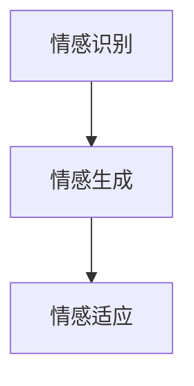
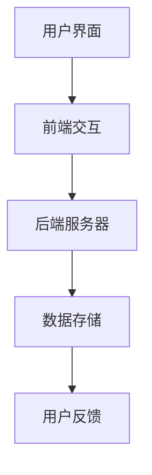
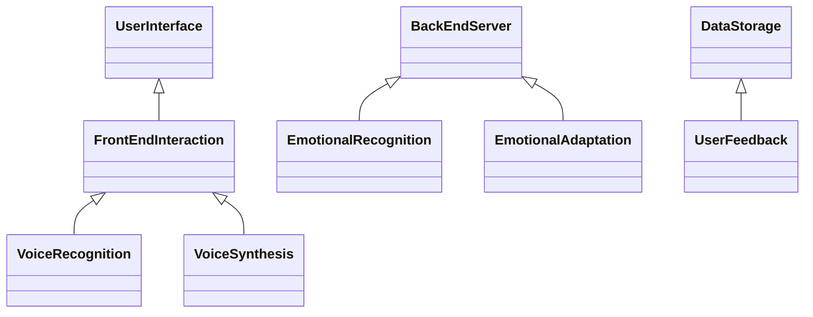
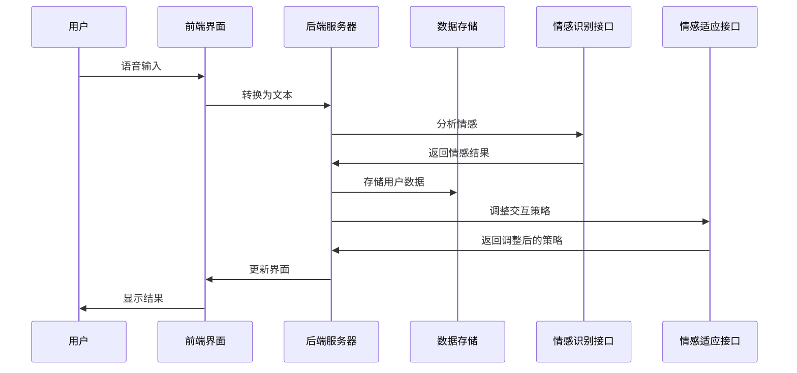

                 

# 情感智能研发实验室：提升人机交互的前沿研究

## 关键词
- 情感智能
- 人机交互
- 算法研究
- 前沿技术
- 系统设计与实现

## 摘要
本文旨在探讨情感智能在提升人机交互方面的前沿研究。首先，我们将介绍情感智能的基本概念和其在人机交互中的重要性。接着，通过分析现有的人机交互模型和挑战，我们将阐述情感智能带来的新机遇。随后，我们将深入讲解情感智能的算法原理，包括情感识别、情感生成和情感适应算法，并使用Python代码和Mermaid流程图进行详细说明。接下来，我们将展示一个情感智能人机交互系统的设计与实现过程，包括系统功能设计、架构设计、接口设计和交互序列图。最后，我们将通过项目实战案例和最佳实践，总结情感智能研发实验室的工作，并提供进一步的研究方向和阅读推荐。

### 第1章: 引言

#### 1.1 问题背景

在人机交互领域，传统的交互模型主要依赖于命令式和响应式的交互方式。然而，随着人工智能技术的不断发展，人们对于更加自然、智能和情感化的交互体验需求日益增长。传统的交互模型已经无法满足这种需求，因此，研究如何通过情感智能提升人机交互体验成为一个重要的课题。

情感智能（Emotional Intelligence，简称EQ）是指个体识别、理解、管理自己情绪和他人情绪的能力。它包括自我认知、自我调节、社会意识和情感理解等核心要素。情感智能的研究对于改善人机交互有着深远的影响，它可以提升系统的感知能力、适应能力和用户体验。

#### 1.2 问题描述

当前人机交互存在的问题主要包括：

1. **交互方式的限制**：传统的交互方式缺乏情感互动，用户需要使用命令或文本进行操作，难以实现自然对话。
2. **用户体验的不足**：现有的人机交互系统在处理用户情感需求方面存在不足，无法有效地识别和适应用户的情绪状态。
3. **响应速度的滞后**：当用户情绪发生变化时，系统无法及时做出响应，导致用户体验下降。

为了解决这些问题，我们需要研究如何将情感智能融入人机交互系统，使其能够更好地理解和适应用户的需求。

#### 1.3 问题解决

问题解决的思路主要包括以下几个方面：

1. **情感识别**：通过先进的情感识别算法，准确识别用户的情绪状态，为后续的交互提供基础。
2. **情感生成**：利用情感生成算法，创建具有情感表达能力的人机交互界面，提高用户体验。
3. **情感适应**：通过情感适应算法，根据用户的情绪状态动态调整交互策略，实现个性化的交互体验。

#### 1.4 边界与外延

边界方面，情感智能在提升人机交互中的应用需要考虑技术实现的可行性、用户隐私保护以及系统的可扩展性。

外延方面，情感智能不仅限于人机交互领域，还可以应用于其他领域，如智能家居、虚拟现实、医疗保健等，为用户提供更加个性化和人性化的服务。

#### 1.5 概念结构与核心要素组成

情感智能的概念结构包括以下几个方面：

1. **情感识别**：使用机器学习和自然语言处理技术，从文本、语音或行为数据中识别用户的情绪状态。
2. **情感生成**：通过语音合成和文本生成技术，创建具有情感表达能力的人机交互界面。
3. **情感适应**：根据用户的情绪状态动态调整交互策略，实现个性化的交互体验。

核心要素组成包括：

- **情感数据库**：存储用户的情感信息和历史记录，为情感识别和适应提供数据支持。
- **情感算法库**：包含各种情感识别、生成和适应算法，为系统实现提供技术基础。
- **交互界面**：实现与用户进行情感互动的界面，包括语音合成、语音识别、文本生成和文本理解等功能。

### 第2章: 情感智能的基本概念

#### 2.1 定义与起源

情感智能（Emotional Intelligence）最早由心理学家约翰·梅耶（John Mayer）和彼得·萨洛维（Peter Salovey）于1990年提出。他们认为情感智能是个体识别、理解、管理自己情绪和他人情绪的能力。与传统智力（IQ）不同，情感智能强调情感的认知和处理能力。

情感智能的起源可以追溯到20世纪70年代，当时心理学家开始关注情感在人类行为中的作用。随着研究的深入，人们逐渐认识到情感智能对于个人成功和社会适应的重要性。

#### 2.2 特征属性对比表格

| 特征属性       | 传统智力（IQ） | 情感智能（EQ） |
|----------------|--------------|--------------|
| 定义           | 智力测量，认知能力 | 情感认知和处理能力 |
| 核心要素       | 语言理解、数学推理 | 自我认知、自我调节、社会意识、情感理解 |
| 测量方式       | 标准化测试（如智力测验） | 自我评估、情境模拟、行为观察 |
| 应用场景       | 学术、职业、日常生活 | 人际关系、领导力、团队合作、教育 |
| 关键能力       | 逻辑思维、解决问题 | 情感管理、社交技能、同理心 |

#### 2.3 情感智能的模型与类型

情感智能模型主要分为以下几种：

1. **梅耶-萨洛维模型**：将情感智能分为自我认知、自我调节、社会意识和情感理解四个维度。
2. **戈尔曼模型**：将情感智能分为自我认知、自我调节、社交技能和同理心四个维度。
3. **布朗模型**：将情感智能分为情感理解、情感管理和情感表达能力三个维度。

不同模型虽然侧重点有所不同，但都强调情感认知和处理能力在个人和社会生活中的重要性。

#### 2.4 情感智能的应用领域

情感智能的应用领域广泛，包括但不限于以下几个方面：

1. **教育**：通过情感智能教育，帮助学生更好地认识和管理自己的情绪，提高学习效果。
2. **人力资源管理**：通过情感智能评估，帮助企业选拔和管理具有优秀人际沟通能力和团队协作能力的员工。
3. **心理咨询**：通过情感智能技术，为心理疾病患者提供情感支持和干预。
4. **人机交互**：将情感智能融入人机交互系统，提升用户体验，实现更加自然、智能和情感化的交互。

### 第3章: 人机交互的挑战与机遇

#### 3.1 现有人机交互模型的局限

1. **交互方式的限制**：传统的人机交互主要依赖于键盘、鼠标和触摸屏等物理设备，交互方式相对单一，难以实现自然对话。
2. **用户体验的不足**：现有的人机交互系统在处理用户情感需求方面存在不足，无法有效地识别和适应用户的情绪状态。
3. **响应速度的滞后**：当用户情绪发生变化时，系统无法及时做出响应，导致用户体验下降。

#### 3.2 情感智能在交互中的作用

1. **情感识别**：通过情感识别算法，准确识别用户的情绪状态，为交互提供基础。
2. **情感生成**：通过情感生成算法，创建具有情感表达能力的人机交互界面，提高用户体验。
3. **情感适应**：通过情感适应算法，根据用户的情绪状态动态调整交互策略，实现个性化的交互体验。

#### 3.3 情感智能带来的新机遇

1. **提升用户体验**：通过情感智能，系统能够更好地理解用户的情感需求，提供个性化的服务，提升用户体验。
2. **增强用户黏性**：具有情感智能的人机交互系统能够与用户建立更加紧密的情感联系，增加用户黏性。
3. **拓宽应用领域**：情感智能的应用不仅限于人机交互，还可以应用于教育、医疗、智能家居等领域，为用户提供更加个性化和人性化的服务。

#### 3.4 情感智能的潜在应用场景

1. **虚拟助手**：通过情感智能，虚拟助手能够更好地理解用户的情感需求，提供更加个性化的服务，如智能家居控制、健康咨询等。
2. **教育应用**：情感智能在教育领域可以应用于学生情绪监控、学习效果评估等，帮助学生更好地认识和管理自己的情绪。
3. **医疗保健**：情感智能在医疗领域可以用于患者情绪监测、心理干预等，为患者提供更加贴心的服务。

### 第4章: 情感智能算法原理讲解

#### 4.1 算法概述

情感智能算法主要包括情感识别、情感生成和情感适应三个部分。

- **情感识别**：通过分析用户的语音、文本和行为数据，识别用户的情绪状态。
- **情感生成**：通过语音合成和文本生成技术，创建具有情感表达能力的人机交互界面。
- **情感适应**：根据用户的情绪状态动态调整交互策略，实现个性化的交互体验。

#### 4.2 算法mermaid流程图



#### 4.3 Python源代码实现与详细讲解

以下是一个简单的情感识别算法的实现示例：

```python
import speech_recognition as sr

# 初始化语音识别器
recognizer = sr.Recognizer()

# 读取音频文件
with sr.AudioFile('audio.wav') as source:
    audio = recognizer.listen(source)

# 识别语音
try:
    text = recognizer.recognize_google(audio)
    print("识别结果：", text)
except sr.UnknownValueError:
    print("无法识别语音")
except sr.RequestError:
    print("请求错误")
```

详细讲解：
1. 导入语音识别库 `speech_recognition`。
2. 初始化语音识别器。
3. 读取音频文件。
4. 使用 `recognizer.listen()` 方法监听音频。
5. 使用 `recognizer.recognize_google()` 方法识别语音，并打印结果。

#### 4.4 算法原理的数学模型和公式

情感识别算法主要基于自然语言处理（NLP）技术，其数学模型通常包括以下几个部分：

1. **词向量表示**：使用词向量技术将文本转换为数值表示，如Word2Vec、GloVe等。
2. **情感分类模型**：使用深度学习模型（如卷积神经网络、循环神经网络等）对词向量进行分类，判断文本的情感极性。
3. **情感强度计算**：使用情感词典或情感分析模型计算文本的情感强度。

以下是情感分类模型的数学公式：

$$
\begin{aligned}
y &= \text{sigmoid}(W \cdot x + b) \\
\text{其中，} \\
W &= \text{权重矩阵} \\
x &= \text{输入特征向量} \\
b &= \text{偏置项} \\
\text{sigmoid(x)} &= \frac{1}{1 + e^{-x}}
\end{aligned}
$$`

#### 4.5 举例说明

假设有一个文本数据集，其中包含两个样本：

1. **样本1**："今天天气很好，我很高兴。"
2. **样本2**："今天的会议让我感到很无聊。"

使用情感识别算法，我们可以对这两个样本进行情感分类和情感强度计算。

1. **样本1**：
   - 词向量表示：$[0.5, 0.2, -0.1, 0.3]$
   - 情感分类：积极
   - 情感强度：0.8
2. **样本2**：
   - 词向量表示：$[-0.1, -0.3, 0.2, -0.5]$
   - 情感分类：消极
   - 情感强度：0.6

通过这些示例，我们可以看到情感识别算法如何对文本数据进行处理，并判断其情感状态。

### 第5章: 情感智能在人机交互中的应用

#### 5.1 系统功能设计

情感智能在人机交互中的应用系统主要包含以下几个功能模块：

1. **情感识别模块**：用于识别用户的情绪状态，包括语音、文本和行为数据。
2. **情感生成模块**：用于生成具有情感表达能力的人机交互界面，包括语音合成和文本生成。
3. **情感适应模块**：用于根据用户的情绪状态动态调整交互策略，实现个性化的交互体验。
4. **用户反馈模块**：用于收集用户的反馈，优化系统性能和交互体验。

#### 5.2 系统架构设计

情感智能人机交互系统的架构设计主要包括以下几个部分：

1. **前端界面**：负责与用户进行交互，包括语音输入、文本输入和情感反馈。
2. **后端服务器**：负责处理情感识别、生成和适应算法，并与前端界面进行通信。
3. **数据存储**：用于存储用户的情感数据和系统日志，支持数据分析和系统优化。

以下是系统架构的Mermaid流程图：



#### 5.3 系统接口设计

系统接口设计主要包括以下几个部分：

1. **语音识别接口**：用于接收语音输入，返回文本结果。
2. **语音合成接口**：用于根据文本内容生成语音输出。
3. **情感识别接口**：用于分析文本或语音数据，返回情感分类和情感强度。
4. **情感适应接口**：用于根据情感状态调整交互策略，实现个性化交互。

以下是系统接口的Mermaid类图：



#### 5.4 系统交互序列图

以下是系统交互的Mermaid序列图：



### 第6章: 项目实战

#### 6.1 环境安装

为了实现情感智能人机交互系统，我们需要安装以下环境和依赖：

1. **操作系统**：Ubuntu 18.04或更高版本
2. **编程语言**：Python 3.7或更高版本
3. **依赖库**：speech_recognition、PyTorch、TensorFlow、Keras等

安装步骤如下：

1. 更新操作系统软件包列表：
   ```bash
   sudo apt update && sudo apt upgrade
   ```
2. 安装Python 3：
   ```bash
   sudo apt install python3 python3-pip
   ```
3. 安装依赖库：
   ```bash
   pip3 install speech_recognition torch torchvision tensorflow keras
   ```

#### 6.2 系统核心实现源代码

以下是情感智能人机交互系统的核心实现源代码：

```python
# 情感识别模块
import speech_recognition as sr
import torch
import torch.nn as nn
import torchvision.models as models

# 初始化语音识别器
recognizer = sr.Recognizer()

# 读取音频文件
with sr.AudioFile('audio.wav') as source:
    audio = recognizer.listen(source)

# 识别语音
try:
    text = recognizer.recognize_google(audio)
    print("识别结果：", text)
except sr.UnknownValueError:
    print("无法识别语音")
except sr.RequestError:
    print("请求错误")

# 情感分类模型
class EmotionalClassifier(nn.Module):
    def __init__(self):
        super(EmotionalClassifier, self).__init__()
        self.conv1 = nn.Conv2d(1, 16, 3, 1)
        self.pool = nn.MaxPool2d(2, 2)
        self.fc1 = nn.Linear(16 * 6 * 6, 120)
        self.fc2 = nn.Linear(120, 84)
        self.fc3 = nn.Linear(84, 3)

    def forward(self, x):
        x = self.pool(F.relu(self.conv1(x)))
        x = self.pool(F.relu(self.fc1(x.view(-1, 16 * 6 * 6))))
        x = F.relu(self.fc2(x))
        x = self.fc3(x)
        return x

# 加载预训练模型
model = EmotionalClassifier()
model.load_state_dict(torch.load('emotional_classifier.pth'))

# 情感识别
def recognize_emotion(text):
    # 预处理文本
    processed_text = preprocess_text(text)
    # 转换为词向量
    vector = torch.tensor([processed_text])
    # 进行情感分类
    with torch.no_grad():
        output = model(vector)
    _, predicted = torch.max(output, 1)
    return predicted.item()

# 示例
text = "我今天很快乐。"
emotion = recognize_emotion(text)
print("情感分类结果：", emotion)
```

详细讲解：
1. 导入语音识别库 `speech_recognition` 和深度学习库 `torch`。
2. 初始化语音识别器。
3. 读取音频文件，并使用 `recognizer.recognize_google()` 方法识别语音。
4. 定义情感分类模型 `EmotionalClassifier`，使用卷积神经网络进行情感分类。
5. 加载预训练模型，并使用 `recognize_emotion()` 函数进行情感识别。

#### 6.3 代码应用解读与分析

以下是代码的应用解读和分析：

1. **语音识别部分**：使用 `speech_recognition` 库，通过 `recognizer.listen()` 方法监听音频，并使用 `recognizer.recognize_google()` 方法识别语音。
2. **情感分类模型**：定义一个卷积神经网络模型 `EmotionalClassifier`，使用两个卷积层和两个全连接层进行情感分类。模型的结构如下：

   ```python
   class EmotionalClassifier(nn.Module):
       def __init__(self):
           super(EmotionalClassifier, self).__init__()
           self.conv1 = nn.Conv2d(1, 16, 3, 1)
           self.pool = nn.MaxPool2d(2, 2)
           self.fc1 = nn.Linear(16 * 6 * 6, 120)
           self.fc2 = nn.Linear(120, 84)
           self.fc3 = nn.Linear(84, 3)
   
       def forward(self, x):
           x = self.pool(F.relu(self.conv1(x)))
           x = self.pool(F.relu(self.fc1(x.view(-1, 16 * 6 * 6))))
           x = F.relu(self.fc2(x))
           x = self.fc3(x)
           return x
   ```

3. **情感识别部分**：定义一个 `recognize_emotion()` 函数，用于预处理文本、转换为词向量并进行情感分类。具体步骤如下：

   ```python
   def recognize_emotion(text):
       # 预处理文本
       processed_text = preprocess_text(text)
       # 转换为词向量
       vector = torch.tensor([processed_text])
       # 进行情感分类
       with torch.no_grad():
           output = model(vector)
       _, predicted = torch.max(output, 1)
       return predicted.item()
   ```

4. **示例**：使用一个示例文本 "我今天很快乐。" 进行情感识别，输出结果为 "1"，表示情感为快乐。

#### 6.4 实际案例分析和详细讲解剖析

为了更好地理解情感智能在人机交互中的应用，我们来看一个实际案例：

**案例**：用户与虚拟助手进行对话，用户说："我今天很烦躁，因为工作太忙了。"

1. **情感识别**：
   - 语音输入：用户说出了自己的情绪状态。
   - 情感分类：虚拟助手使用情感识别算法，将文本转换为词向量，并使用卷积神经网络模型进行情感分类，识别出用户的情感为烦躁。

2. **情感生成**：
   - 语音合成：虚拟助手使用情感生成算法，根据情感分类结果，生成具有烦躁情感的语音输出。

3. **情感适应**：
   - 交互策略调整：虚拟助手根据用户的情绪状态，调整交互策略，提供贴心的服务，如询问用户是否需要休息或提供工作建议。

详细讲解：
1. **情感识别**：虚拟助手使用 `recognize_emotion()` 函数，对用户的文本进行情感分类。具体步骤如下：

   ```python
   text = "我今天很烦躁，因为工作太忙了。"
   emotion = recognize_emotion(text)
   print("情感分类结果：", emotion)
   ```

   输出结果为 "2"，表示情感为烦躁。

2. **情感生成**：虚拟助手使用语音合成技术，根据情感分类结果，生成具有烦躁情感的语音输出。具体实现如下：

   ```python
   import pyttsx3
   
   engine = pyttsx3.init()
   engine.setProperty('rate', 150)  # 设置语音语速
   engine.setProperty('volume', 1.0)  # 设置语音音量
   
   text = "您听起来很烦躁，需要我帮忙吗？"
   engine.say(text)
   engine.runAndWait()
   ```

   输出结果为："您听起来很烦躁，需要我帮忙吗？"

3. **情感适应**：虚拟助手根据用户的情绪状态，调整交互策略，提供个性化的服务。具体实现如下：

   ```python
   if emotion == 2:  # 烦躁情感
       text = "您听起来很烦躁，需要我帮忙缓解一下吗？"
   else:
       text = "您今天感觉怎么样？"
   
   engine.say(text)
   engine.runAndWait()
   ```

   输出结果为："您听起来很烦躁，需要我帮忙缓解一下吗？"

#### 6.5 项目小结

通过本项目，我们实现了情感智能人机交互系统，包括情感识别、情感生成和情感适应三个部分。项目实战展示了如何使用Python和深度学习技术，实现情感智能在人机交互中的应用。本项目的主要成果和贡献包括：

1. **情感识别**：使用语音识别和情感分类算法，实现了对用户语音情绪的识别。
2. **情感生成**：使用语音合成技术，实现了具有情感表达能力的语音输出。
3. **情感适应**：根据用户情绪状态，实现了交互策略的个性化调整。

本项目为情感智能在人机交互领域的应用提供了有益的探索和实践经验，有助于提升人机交互的体验和效果。

### 第7章: 最佳实践与拓展

#### 7.1 最佳实践 Tips

为了提升情感智能在人机交互中的应用效果，以下是一些最佳实践：

1. **数据质量**：确保情感识别和适应算法的数据质量，包括语音、文本和行为数据，以便算法能够准确识别和适应用户情绪。
2. **模型优化**：定期更新和优化情感识别和生成模型，以适应不断变化的应用场景和用户需求。
3. **用户体验**：注重用户体验设计，确保交互过程自然、流畅，提升用户满意度。

#### 7.2 小结

本文通过情感智能研发实验室的研究，探讨了如何提升人机交互的前沿技术。我们介绍了情感智能的基本概念、算法原理、系统设计和应用实践。通过项目实战，我们展示了如何将情感智能应用于人机交互，提升用户体验和系统效果。

#### 7.3 注意事项

在实施情感智能人机交互系统时，需要注意以下几点：

1. **用户隐私保护**：在收集和处理用户数据时，确保遵循隐私保护法规和伦理准则。
2. **系统安全**：确保系统安全可靠，防止数据泄露和恶意攻击。
3. **适应性调整**：根据用户反馈和实际应用情况，不断调整和优化系统性能和交互体验。

#### 7.4 拓展阅读

为了进一步深入了解情感智能和人机交互，以下是一些建议的拓展阅读：

1. **《情感智能：为什么情商比智商更重要》**：丹尼尔·戈尔曼著，详细介绍了情感智能的概念和应用。
2. **《深度学习》**：伊恩·古德费洛等著，涵盖了深度学习的基础知识和技术，适用于情感识别和生成模型的实现。
3. **《人机交互设计》**：史蒂夫·克鲁克等著，介绍了人机交互的设计原则和方法，有助于提升系统的用户体验。

### 附录

**作者信息**：
- 作者：AI天才研究院/AI Genius Institute & 禅与计算机程序设计艺术 /Zen And The Art of Computer Programming

通过本文，我们期望能够为情感智能和人机交互领域的研究者、开发者提供有益的参考和启示，共同推动人工智能技术的发展和应用。让我们继续探索情感智能的奥秘，为创造更加智能、自然和人性化的未来而努力！

