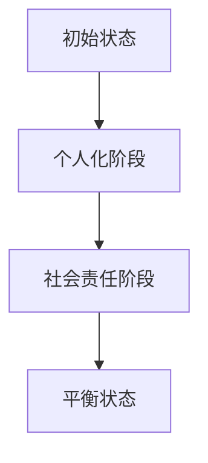
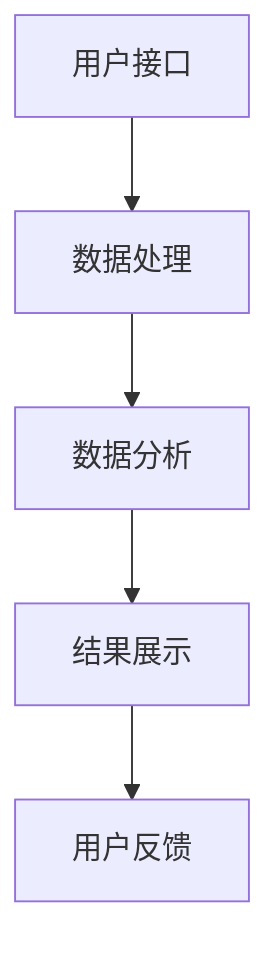
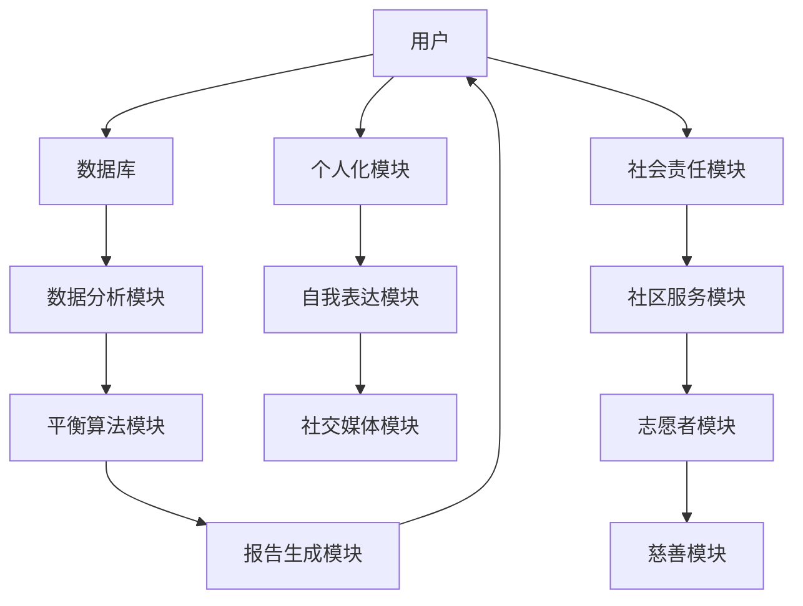
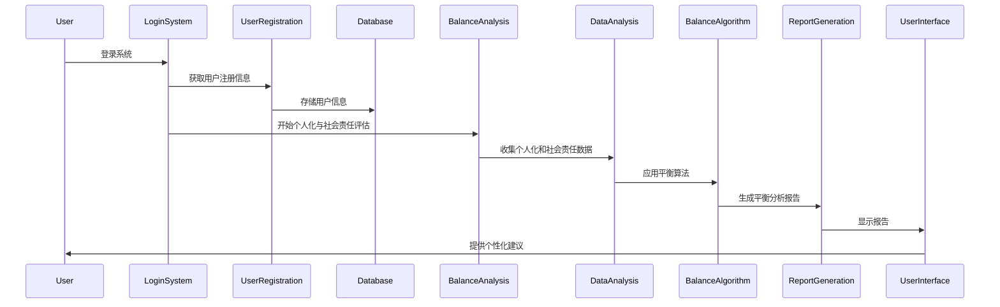

                 

## 引言

### 关键词

- 个人化
- 社会责任
- 平衡
- 教育引导
- 政策支持

### 摘要

本文探讨了个人化与社会责任的平衡问题，分析了现代社会背景下的挑战，阐述了个人化与社会责任的概念与特征。通过讨论平衡的重要性、挑战和方法，以及个人化和社会责任的实践与互动，本文提出了解决个人化与社会责任冲突的策略，并对未来发展趋势进行了展望。

### 设计书籍《意义的个人化与社会责任的平衡》目录大纲

#### 引言

- 背景与意义
- 问题描述
- 问题解决
- 边界与外延
- 概念结构与核心要素

#### 核心概念与联系

- 个人化
  - 概念
  - 特征
- 社会责任
  - 概念
  - 特征

#### 个人化与社会责任的平衡

- 重要性
- 挑战
- 方法

#### 个人化实践

- 自我认知与探索
- 社区参与与社会服务

#### 社会责任实践

- 社区参与与社会服务

#### 个人化与社会责任的互动

- 个人化的社会责任化
- 社会责任对个人化的促进作用

#### 结论

- 平衡现状
- 展望未来

## 1. 背景与意义

### 1.1 问题背景

#### 1.1.1 现代社会的挑战

##### 1.1.1.1 个体自我意识提升

在现代社会，随着信息技术和互联网的快速发展，个体的自我意识得到了显著提升。人们更加关注自我表达、自我实现和个性发展。然而，这一趋势也带来了一系列挑战。首先，个体自我意识的增强可能导致个人化与社会责任的冲突。在追求个人利益的同时，个体往往忽视了对社会责任的履行，进而影响社会的和谐发展。

##### 1.1.1.2 社会责任的重要性

社会责任是现代社会不可或缺的一部分。它不仅体现了个体对社会的关爱和贡献，还关乎社会的公平与正义。在个人化浪潮的背景下，如何平衡个人利益与社会责任，实现个人化与社会责任的和谐共处，成为现代社会亟待解决的问题。

### 1.2 问题描述

#### 1.2.1 个人化与社会责任的冲突

个人化与社会责任的冲突主要体现在以下几个方面：

1. **权利与义务的冲突**：个人在追求自我实现的过程中，往往忽视了自身所应承担的社会责任，导致权利与义务的失衡。
2. **自我需求与公共利益的冲突**：个人在追求个人利益的同时，可能损害了公共利益，导致社会资源的分配不公。
3. **价值观的冲突**：个人价值观与社会责任之间的差异可能导致个人在行动上出现矛盾，难以达到个人化与社会责任的平衡。

#### 1.2.2 个人化与社会责任的统一性

尽管个人化与社会责任之间存在冲突，但二者并非完全对立。在现代社会，个人化与社会责任的统一性具有重要意义。通过平衡个人利益与社会责任，可以实现个人成长与社会发展的双赢。

### 1.3 问题解决

#### 1.3.1 寻找平衡点

寻找个人化与社会责任的平衡点，需要从以下几个方面入手：

1. **个体自我实现**：通过提升个体的自我认知，激发个体的自我发展潜力，实现个人成长。
2. **社会责任的履行**：通过强化社会责任意识，引导个体在追求个人利益的同时，关注社会责任的履行。

#### 1.3.2 教育引导

教育在个人化与社会责任的平衡中发挥着重要作用。通过教育引导，可以帮助个体树立正确的价值观，提高社会责任意识，实现个人化与社会责任的平衡。

#### 1.3.3 政策支持

政府应制定相关政策，引导个体在追求个人利益的同时，关注社会责任的履行。例如，通过税收优惠、社会保障等措施，鼓励个体积极参与社会公益事业。

### 1.4 边界与外延

#### 1.4.1 个人与社会的关系

个人与社会是相互依存的关系。个人的成长离不开社会的支持，而社会的繁荣也需要个人的付出。在个人化与社会责任的平衡中，明确个人与社会的关系至关重要。

##### 1.4.1.1 自我意识的边界

个体在追求自我实现的过程中，应明确自我意识的边界。过度的自我意识可能导致个人化与社会责任的失衡。

##### 1.4.1.2 社会责任的边界

社会责任并非无限的，个体在履行社会责任时，应明确社会责任的边界，避免过度承担社会责任。

#### 1.4.2 概念结构与核心要素

个人化与社会责任的平衡涉及多个概念结构与核心要素。通过分析这些概念结构与核心要素，有助于我们更好地理解个人化与社会责任的平衡。

### 1.5 概念结构与核心要素

#### 1.5.1 个人化的核心要素

- **自我表达**：个体通过语言、行为、艺术等方式，表达自己的思想和情感。
- **自我实现**：个体在追求自我价值的过程中，实现自身潜能，实现人生目标。

#### 1.5.2 社会责任的核心要素

- **社会利益**：个体在履行社会责任的过程中，关注社会公共利益，维护社会公平与正义。
- **公平与正义**：个体在行动中秉持公平与正义的原则，确保社会资源的合理分配。

## 2. 核心概念与联系

### 2.1 个人化

#### 2.1.1 个人化的概念

个人化是指个体在追求自我实现和个性发展的过程中，表现出独特的思想、行为和价值观。个人化强调个体的独立性和多样性，追求自我价值的实现。

#### 2.1.2 个人化的特征

- **多样性**：个人化强调个体的独特性，每个人都是独一无二的。
- **自主性**：个人化强调个体在行动和决策上的自主性，追求自我价值的实现。

### 2.2 社会责任

#### 2.2.1 社会责任的概念

社会责任是指个体在社会生活中，基于社会规范和道德要求，履行对他人、对社会应尽的义务和责任。社会责任强调个体的社会属性，关注社会公共利益。

#### 2.2.2 社会责任的特征

- **必要性**：社会责任是现代社会不可或缺的一部分，个体必须履行社会责任。
- **公益性**：社会责任的履行旨在维护社会公共利益，促进社会公平与正义。

### 2.3 个人化与社会责任的联系

个人化与社会责任并非完全对立，而是相互联系、相互影响的。个人化与社会责任的联系体现在以下几个方面：

1. **个人发展的动力**：个人化推动个体实现自我价值，为社会贡献更多的智慧和力量。
2. **社会责任的实现**：社会责任的实现离不开个人的参与和付出，个人化是社会责任的基础。
3. **社会和谐**：个人化与社会责任的平衡有助于实现社会和谐，推动社会进步。

## 3. 个人化与社会责任的平衡

### 3.1 平衡的重要性

个人化与社会责任的平衡对于个体和社会具有重要意义。首先，平衡有助于实现个人成长与社会发展的双赢。在平衡中，个体可以实现自我价值的实现，同时为社会做出贡献。其次，平衡有助于构建和谐社会，促进社会公平与正义。在平衡中，个体和社会的关系更加和谐，社会资源得到合理配置。

### 3.2 平衡的挑战

尽管个人化与社会责任的平衡具有重要意义，但在实际操作中仍面临诸多挑战。首先，个人化与社会责任的冲突可能导致个体在追求个人利益的同时，忽视社会责任的履行。其次，个体在追求自我实现的过程中，可能面临资源有限、精力有限的困境，难以兼顾个人化与社会责任。此外，社会环境的变化、价值观的差异等也可能影响个人化与社会责任的平衡。

### 3.3 平衡的方法

为了实现个人化与社会责任的平衡，可以采取以下几种方法：

1. **教育引导**：通过教育引导，帮助个体树立正确的价值观，提高社会责任意识，实现个人化与社会责任的平衡。
2. **政策支持**：政府应制定相关政策，引导个体在追求个人利益的同时，关注社会责任的履行。例如，通过税收优惠、社会保障等措施，鼓励个体积极参与社会公益事业。
3. **自我管理**：个体应加强自我管理，合理安排时间和精力，实现个人化与社会责任的平衡。

## 4. 个人化实践

### 4.1 自我认知与探索

#### 4.1.1 自我认知的重要性

自我认知是个人化实践的基础。通过自我认知，个体可以更好地了解自己的兴趣、特长和潜力，从而有针对性地进行自我发展。

#### 4.1.2 自我认知的工具

- **心理测试**：通过心理测试，个体可以了解自己的性格特征、兴趣爱好等。
- **日记**：通过日记，个体可以记录自己的思想、感受和成长过程。

#### 4.1.3 自我认知的过程

- **反思**：个体应定期反思自己的行为和思想，总结经验教训。
- **学习**：个体应不断学习新知识、新技能，提升自己的综合素质。

### 4.2 探索个人兴趣与潜力

#### 4.2.1 兴趣爱好的发掘

个体应积极发掘自己的兴趣爱好，通过参加社团、培训班等方式，培养和提升自己的兴趣。

#### 4.2.2 潜力的培养与挖掘

个体应关注自己的潜力，通过实践和锻炼，不断提升自己的能力。同时，个体应勇于挑战自己，尝试新事物，挖掘自己的潜能。

## 5. 社会责任实践

### 5.1 社区参与与社会服务

#### 5.1.1 社区的意义

社区是居民共同生活的空间，是个人化与社会责任实践的重要平台。通过社区参与，个体可以更好地了解社会，履行社会责任。

#### 5.1.2 社区服务的价值

社区服务具有多重价值。首先，社区服务有助于提高个体的社会责任意识，促进个人成长。其次，社区服务有助于改善社区环境，提高居民的生活质量。

#### 5.1.3 社区服务的形式与内容

- **志愿服务**：个体可以参加各类志愿服务活动，如环保、扶贫、教育等。
- **公益活动**：个体可以参加各类公益活动，如慈善捐赠、公益活动等。

## 6. 个人化与社会责任的互动

### 6.1 个人化的社会责任化

个人化的社会责任化是指个体在追求自我实现的过程中，将社会责任融入个人行动。通过个人化的社会责任化，个体可以更好地实现个人价值，同时为社会做出贡献。

### 6.2 社会责任对个人化的促进作用

社会责任对个人化具有促进作用。首先，社会责任可以帮助个体树立正确的价值观，引导个体在追求自我实现的过程中，关注社会公共利益。其次，社会责任可以为个体提供更多的成长机会，促进个体全面发展。

## 7. 结论

### 7.1 个人化与社会责任的平衡现状

当前，个人化与社会责任的平衡状况总体良好。随着社会的发展和个体自我意识的提升，越来越多的人开始关注社会责任的履行。然而，仍存在一些挑战，如个人化与社会责任的冲突、个体在追求自我实现过程中忽视社会责任等。

### 7.2 展望未来

未来，个人化与社会责任的平衡将继续发展。随着科技的发展和教育的普及，个体将更加关注社会责任的履行，实现个人化与社会责任的和谐共处。同时，政府和社会各界将加大对个人化与社会责任平衡的重视和支持，为个体提供更多的成长机会和发展空间。

## 附录

### 附录 A：概念属性特征对比表格

| 特征 | 个人化 | 社会责任 |
| ---- | ---- | ---- |
| 多样性 | 强调 |  |
| 自主性 | 强调 |  |
| 必要性 |  | 强调 |
| 公益性 |  | 强调 |

### 附录 B：ER实体关系图架构

```mermaid
erDiagram
  Person ||--|{ Community }|-->: Member
  Community ||--|{ Service }|-->: Provider
  Service ||--|{ Volunteer }|-->: Participant
```

### 附录 C：算法原理讲解



### 附录 D：系统架构设计



### 附录 E：项目实战

- **环境安装**：安装Python环境、相关库和工具。
- **系统核心实现**：实现个人化与社会责任的平衡算法。
- **代码应用解读与分析**：分析系统实现的过程，解读代码的作用和功能。
- **实际案例分析和详细讲解剖析**：通过实际案例展示系统应用效果，进行详细讲解和剖析。
- **项目小结**：总结项目经验和收获，提出改进建议。

### 附录 F：最佳实践 tips

- **定期自我反思**：定期对自己的行为和思想进行反思，确保个人化与社会责任的平衡。
- **积极参与社区服务**：积极参与社区服务，履行社会责任，实现个人价值。
- **关注社会热点**：关注社会热点问题，了解社会需求，为社会做出贡献。

### 附录 G：小结

本文探讨了个人化与社会责任的平衡问题，分析了现代社会背景下的挑战，阐述了个人化与社会责任的概念与特征。通过讨论平衡的重要性、挑战和方法，以及个人化和社会责任的实践与互动，本文提出了解决个人化与社会责任冲突的策略，并对未来发展趋势进行了展望。

### 附录 H：注意事项

- **重视个人化与社会责任的平衡**：个体在追求自我实现的过程中，应重视社会责任的履行。
- **尊重多样性**：尊重个体的多样性，鼓励个体在追求个人化与社会责任的平衡中发挥创造力。
- **积极履行社会责任**：个体应积极履行社会责任，为社会做出贡献。

### 附录 I：拓展阅读

- **[1]** 约翰·罗尔斯，《正义论》
- **[2]** 斯蒂芬·杰伊·古尔德，《个人化与社会责任》
- **[3]** 爱德华·T·泰勒，《社会心理学》

---

作者：AI天才研究院/AI Genius Institute & 禅与计算机程序设计艺术/Zen And The Art of Computer Programming

---

本文为原创作品，未经授权不得转载。如有需要，请联系作者获取授权。感谢您的阅读和支持！## 引言

在现代社会，个人化与社会责任的问题日益凸显，成为不可忽视的议题。个人化代表了个体追求自我表达、自我实现和个性发展的趋势，而社会责任则强调个体对社会的义务和责任。个人化与社会责任之间的平衡，不仅关乎个体的成长和幸福，也关乎社会的和谐与进步。本文旨在深入探讨这一重要议题，分析其背景、挑战和解决方案，以期为个人化与社会责任的平衡提供有益的思考和实践指导。

首先，本文将介绍个人化与社会责任的概念及其在现代社会中的重要性。通过阐述个人化与社会责任的定义和特征，我们能够更清晰地理解二者之间的关系。接着，本文将讨论个人化与社会责任之间的冲突，以及如何在这两者之间找到平衡点。在此基础上，本文将提出一些具体的方法和策略，以帮助个体实现个人化与社会责任的和谐共处。

本文还将通过实际案例和数据分析，展示个人化与社会责任实践的有效性。此外，本文还将探讨教育引导和政策支持在促进个人化与社会责任平衡中的作用。最后，本文将对未来发展趋势进行展望，提出可能的改进方向和建议。

通过本文的深入探讨，我们希望能够为读者提供一个全面、系统的视角，帮助他们在个人化与社会责任的平衡中找到适合自己的路径，实现个人的成长和社会的进步。

### 1. 背景与意义

#### 1.1 现代社会的挑战

在现代社会，个人化与社会责任的平衡问题显得尤为突出。随着全球化、信息技术和互联网的快速发展，个体的自我意识得到了显著提升。人们不再满足于传统的角色定位，而是追求更丰富的个性和自我实现。这种个人化的趋势体现在多个方面：从追求个性化的生活方式，到在职业发展中追求自我价值的实现，再到在社交平台上展示独特的个性和观点。然而，这一趋势也带来了一系列挑战。

首先，个体自我意识的提升导致了个人需求的多样化和个性化。每个人都在追求自我实现的过程中，试图找到自己的独特定位和价值。这种多样性和个性化在一定程度上推动了社会的进步和繁荣，但同时也增加了个体之间的差异和对立。特别是在现代社会中，个体的自我实现与社会责任的履行之间往往存在矛盾。例如，一些人可能会为了追求个人利益而忽视社会责任，甚至可能采取损害公共利益的行为。

其次，社会责任的重要性也不可忽视。社会责任不仅仅是指个体对家庭、朋友和社区的关爱，更关乎个体对社会的整体贡献和责任。一个健康、和谐的社会需要每个成员的积极参与和共同努力。然而，在追求个人化过程中，许多人忽视了社会责任的履行，导致社会资源的分配不均、社会问题的加剧。例如，环境污染、社会不公、贫富差距等问题，都与个体社会责任感的缺失密切相关。

#### 1.1.1 个体自我意识提升

个体自我意识的提升是现代社会的一个重要特征。随着信息技术的进步，人们可以更加便捷地获取信息和资源，这使个体有了更多机会去探索自我、认识自我。在互联网时代，社交媒体平台为个体提供了一个展示自我、表达观点的空间。人们通过发布个人动态、参与话题讨论等方式，不断强化自己的个性标签和自我认同。这种自我意识的提升在一定程度上促进了社会多元化，但同时也带来了一系列问题。

首先，自我意识的提升使个体更加关注自身的需求和感受，可能导致个人主义倾向。个体在追求自我实现的过程中，可能会忽视对社会的责任和义务，从而影响社会的整体和谐。例如，一些人可能会为了追求个人利益而牺牲公共利益，导致资源分配不公、社会矛盾加剧。

其次，自我意识的提升还可能导致个体之间的差异和对立。每个人对自我实现的理解和追求方式不同，这种差异可能会引发冲突和对立。例如，在职业发展中，一些人可能会过分追求个人成就和地位，而忽视团队合作和社会责任，从而导致组织内部的分裂和矛盾。

#### 1.1.2 社会责任的重要性

尽管个体自我意识的提升带来了一系列挑战，但社会责任的重要性依然不可忽视。社会责任不仅关乎个体对社会的贡献和责任，还关乎社会的整体发展和进步。在现代社会中，社会责任体现在多个方面：

首先，社会责任是维护社会公平与正义的重要保障。个体在社会中扮演不同角色，承担不同责任。只有每个人都履行自己的社会责任，才能确保社会的公平与正义。例如，政府官员需要履行公共管理的责任，企业家需要履行社会责任，普通公民也需要履行对家庭、社区和社会的责任。

其次，社会责任有助于促进社会的整体和谐。一个和谐的社会需要每个成员的积极参与和共同努力。个体在履行社会责任的过程中，不仅可以提升自身的价值，还可以促进社会的进步和繁荣。例如，参与公益活动、志愿服务等，不仅可以帮助他人，还可以增强个体的社会责任感和归属感。

此外，社会责任还可以提高个体的道德素养和自我约束力。通过履行社会责任，个体可以树立正确的价值观和道德观，提升自身的道德素养。例如，遵守社会规范、尊重他人权利、关心弱势群体等，都是社会责任的体现。

总之，个体自我意识的提升和社会责任的重要性在现代社会中相互交织、相互影响。只有在理解个体自我意识提升的同时，重视社会责任的履行，才能实现个人化与社会责任的平衡，推动社会的持续进步和发展。

### 1.2 问题描述

个人化与社会责任的平衡问题在现代社会中表现得尤为复杂。要深入探讨这一问题，我们首先需要明确其核心矛盾和冲突。

#### 1.2.1 个人化与社会责任的冲突

个人化与社会责任之间的冲突主要体现在以下几个方面：

1. **权利与义务的冲突**：个人化强调个体的自由和权利，追求自我实现和个性发展。然而，社会责任则强调个体的义务和责任，要求个体为社会整体利益贡献力量。这种权利与义务的冲突，往往导致个体在追求个人利益时忽视了对社会责任的履行。

2. **自我需求与公共利益的冲突**：在追求个人化过程中，个体可能会过度关注自身需求，忽视公共利益。例如，一些人可能为了追求高收入和职业成功，而忽视环境保护和社会公平，导致社会资源的分配不公和环境恶化。

3. **价值观的冲突**：个人化与社会责任往往代表不同的价值观。个人化强调个体的独特性和自我价值，而社会责任则强调社会的整体利益和公正。这种价值观的冲突可能导致个体在行动上出现矛盾和困惑，难以实现个人化与社会责任的和谐共处。

#### 1.2.2 个人化与社会责任的统一性

尽管个人化与社会责任之间存在冲突，但二者并非完全对立。在现代社会，个人化与社会责任的统一性具有重要意义。

首先，个人化与社会责任的统一有助于实现个体和社会的双赢。通过平衡个人利益与社会责任，个体可以实现自我价值的实现，同时为社会做出贡献。例如，一个在职业中追求创新和成就的个体，同时积极参与社会公益活动，既能实现个人职业发展，又能促进社会的进步和繁荣。

其次，个人化与社会责任的统一有助于构建和谐社会。一个健康、和谐的社会需要每个成员的积极参与和共同努力。只有个体在追求个人化的同时，也履行社会责任，才能确保社会的公平与正义，实现社会的持续进步。

#### 1.2.3 个人化与社会责任的互动关系

个人化与社会责任之间的互动关系是动态和复杂的。一方面，个人化的实现需要社会责任的支持和保障。个体在追求自我实现的过程中，需要社会的支持和认可，这离不开社会责任的履行。例如，一个在科技创新领域追求突破的个体，需要社会提供相应的资源和机会，才能实现其个人价值。

另一方面，社会责任的履行也需要个人化的推动。社会责任的实现离不开个体的积极参与和付出。个体在履行社会责任的过程中，可以不断提升自身的能力和素质，实现个人成长。例如，参与志愿服务和公益活动的个体，不仅为社会做出了贡献，还提升了自身的社会责任感和团队合作能力。

总之，个人化与社会责任之间的冲突和统一，构成了现代社会中一个重要的矛盾和课题。通过深入探讨这一矛盾，我们可以更好地理解个人化与社会责任之间的关系，为个体和社会的可持续发展提供有益的思考和实践指导。

### 1.3 问题解决

在个人化与社会责任的平衡中，寻找平衡点是一个复杂而具有挑战性的任务。以下是一些具体的策略和方法，旨在帮助个体在社会责任的履行与个人化的追求之间找到合适的平衡。

#### 1.3.1 个体自我实现

个体自我实现是平衡个人化与社会责任的基础。通过自我实现，个体可以明确自己的价值观和目标，从而更好地在社会责任和个人需求之间做出选择。

1. **自我认知**：自我认知是自我实现的第一步。个体需要通过反思和自我分析，了解自己的兴趣、能力和价值观。这可以通过心理测试、日记、反思日记等方式进行。

2. **自我发展**：在明确自己的价值观和目标后，个体应积极发展自己的能力和技能，追求自我价值的实现。这包括学习新知识、掌握新技能、参与各种培训和实践活动。

3. **自我调整**：在追求自我实现的过程中，个体需要不断地调整自己的目标和行为，确保它们与社会责任相协调。例如，一个追求职业成功的个体，应考虑如何在工作中兼顾社会责任，如参与慈善活动或环境保护项目。

#### 1.3.2 社会责任的履行

社会责任的履行是个人化过程中不可或缺的一部分。通过积极履行社会责任，个体不仅能够实现自我价值，还能为社会的进步和繁荣做出贡献。

1. **社区参与**：参与社区活动是履行社会责任的重要途径。个体可以通过加入志愿者组织、参与社区服务等方式，积极参与到社区建设中，提升社会责任感。

2. **公益活动**：个体可以通过参与公益活动，如慈善捐赠、环保行动等，直接为社会做出贡献。这不仅能够满足个体的社会责任感，还能促进社会的整体和谐。

3. **职业道德**：在职业领域中，个体应遵守职业道德，履行对工作和社会的责任。这包括诚信、敬业、创新等价值观，确保个人行为与社会责任相一致。

#### 1.3.3 教育引导

教育引导在促进个人化与社会责任的平衡中发挥着重要作用。通过教育，个体可以培养正确的价值观和社会责任感，从而实现个人化与社会责任的和谐共处。

1. **道德教育**：学校和家庭应加强道德教育，帮助个体树立正确的价值观和道德观。这包括培养公平、正义、尊重等价值观，确保个体在追求自我实现的过程中，不会忽视社会责任的履行。

2. **社会责任教育**：学校和社会应开展社会责任教育，提高个体的社会责任意识。这可以通过案例教学、社会实践等方式进行，使个体了解社会责任的重要性和履行方法。

3. **终身学习**：个体应树立终身学习的理念，不断提升自己的知识和能力。这不仅有助于个体实现自我价值，还能为社会的持续进步提供支持。

#### 1.3.4 政策支持

政府和社会组织可以通过制定和实施相关政策，为个人化与社会责任的平衡提供支持。

1. **法律法规**：政府应制定和完善相关法律法规，规范个人行为和社会责任。例如，制定环境保护法规、劳动法规等，确保个体在追求个人利益时，不会损害公共利益。

2. **社会保障**：政府应建立健全的社会保障体系，为个体提供必要的社会保障。这包括医疗保险、养老保险、失业保险等，确保个体在履行社会责任时，不会面临经济困难。

3. **激励措施**：政府和社会组织可以采取激励措施，鼓励个体积极参与社会公益事业。例如，提供税收优惠、表彰奖励等，激发个体的社会责任感。

总之，通过个体自我实现、社会责任的履行、教育引导和政策支持，我们可以帮助个体在个人化与社会责任的平衡中找到合适的平衡点，实现个人成长和社会进步的双重目标。

### 1.4 边界与外延

#### 1.4.1 个人与社会的关系

个人与社会的关系是复杂且多维度的。在探讨个人化与社会责任的平衡时，明确个人与社会的关系至关重要。个人是社会的基本单元，但个人并非孤立存在，而是与社会紧密相连。个人的行为和选择不仅影响自身，也对社会产生深远的影响。

首先，个人与社会的关系体现在相互依存上。个人的生存和发展离不开社会的支持和资源，而社会的繁荣和进步也需要个人的努力和贡献。个人通过为社会创造价值、履行社会责任，实现了个人价值的同时，也为社会的持续发展做出了贡献。例如，一个优秀的工程师通过技术创新，不仅实现了自身的职业成就，也为社会带来了技术进步和经济效益。

其次，个人与社会的关系还体现在相互影响上。个人的行为和价值观不仅影响自身的成长和发展，也会对周围的人和社会产生示范效应。一个具有高度社会责任感的个人，可以通过自己的言行影响和带动更多的人，形成积极向上的社会风气。反之，一个只关注个人利益、忽视社会责任的个人，可能会对社会的和谐发展产生负面影响。

#### 1.4.1.1 自我意识的边界

自我意识是个体对自身存在的认知和评价，是个人化的重要基础。然而，自我意识的边界也决定了个人在追求个人化过程中，不会过度膨胀，忽视社会责任的履行。

首先，自我意识的边界有助于个体明确个人的能力和局限性。自我认知可以帮助个体了解自身的兴趣、特长和潜力，从而有针对性地进行自我发展。然而，如果个体过度关注自我，忽视了自身能力的边界，可能会导致自负和盲目自信，从而忽视社会责任的履行。

其次，自我意识的边界有助于个体在社会责任和个人化之间找到平衡。一个有自我意识边界的人，会意识到个人与社会的关系，明白个人行为对社会的影响。这种自我意识不仅帮助个体在追求个人化的同时，关注社会责任的履行，还能促进个体形成更加成熟和理性的价值观。

#### 1.4.1.2 社会责任的边界

社会责任是指个体在社会生活中，基于社会规范和道德要求，对他人和社会应尽的义务和责任。明确社会责任的边界，对于个人在社会中行动和选择具有重要意义。

首先，社会责任的边界有助于个体理解社会责任的内涵。社会责任不仅仅是对他人和社区的关爱和帮助，还包括遵守社会规范、维护社会秩序、促进社会进步等。明确社会责任的边界，可以帮助个体更好地理解社会责任的多样性和复杂性。

其次，社会责任的边界有助于个体在实际生活中履行社会责任。社会责任的边界决定了个体在履行社会责任时，应关注哪些方面，避免盲目行动或过度承担责任。例如，一个企业在履行社会责任时，应关注环境保护、员工权益、产品质量等方面，而不是盲目追求盈利或社会地位。

#### 1.4.2 概念结构与核心要素

个人化与社会责任的平衡涉及多个概念结构与核心要素。通过分析这些概念结构与核心要素，有助于我们更好地理解个人化与社会责任的平衡。

首先，个人化的核心要素包括自我表达、自我实现和个性发展。自我表达是个体通过言行、艺术等方式，展示自己的思想、情感和个性。自我实现是个体在追求自我价值的过程中，实现自身潜能和人生目标。个性发展是个体在自我认知和自我调整的基础上，不断拓展和深化自己的个性和特长。

其次，社会责任的核心要素包括社会利益、公平和正义。社会利益是个体在社会生活中，基于社会规范和道德要求，对他人和社会应尽的义务和责任。公平和正义则是社会的基本价值观，要求个体在行动中秉持公平与正义的原则，确保社会资源的合理分配和社会秩序的稳定。

通过明确个人化与社会责任的核心要素，我们可以更好地理解个人化与社会责任之间的关系，从而在实际生活中找到平衡点。个人化与社会责任并非完全对立，而是相互依存、相互促进的关系。通过平衡个人化与社会责任，个体可以实现自我价值的实现，同时为社会的繁荣和进步做出贡献。

### 1.5 概念结构与核心要素

在深入探讨个人化与社会责任的平衡问题时，理解两者各自的定义、核心要素以及它们之间的关系至关重要。以下是个人化与社会责任的概念结构与核心要素的详细分析。

#### 1.5.1 个人化的核心要素

**个人化**，作为一种个体追求自我表达、自我实现和个性发展的趋势，涵盖了多个核心要素。这些要素不仅塑造了个体的独特性，也影响了个体在社会中的角色和行为。

1. **自我表达**：自我表达是个人化的基本特征，指个体通过语言、行为、艺术等方式展示自己的思想、情感和个性。自我表达不仅是个人内在情感的流露，也是个体与他人沟通和建立联系的重要途径。它有助于个体建立自我认同和自我价值感。

2. **自我实现**：自我实现是个体追求自我价值的过程，强调个体在职业、学术、艺术等领域中充分发挥自己的潜能，实现人生目标。自我实现不仅关注个体在物质层面的成功，更注重个体在精神层面的成长和满足。

3. **个性发展**：个性发展是个体在自我认知和自我调整的过程中，不断拓展和深化自己的个性特征和特长。它包括自我探索、自我反思和自我提升，旨在帮助个体找到自己的独特定位，并在社会中发挥积极的影响。

**表格**：个人化的核心要素对比

| 核心要素 | 描述 | 关键点 |
| :----: | :----: | :----: |
| 自我表达 | 表现个体思想和情感的方式 | 语言、行为、艺术 |
| 自我实现 | 实现个体价值的过程 | 职业成就、学术成就 |
| 个性发展 | 不断拓展和深化个性特征 | 自我认知、自我反思 |

#### 1.5.2 社会责任的核心要素

**社会责任**，作为个体在社会生活中应尽的义务和责任，是社会运转和个体发展的基础。社会责任的核心要素主要体现在以下几个方面。

1. **社会利益**：社会利益是指个体在社会生活中，基于社会规范和道德要求，为他人和社会应尽的责任和义务。它包括维护社会秩序、促进社会和谐、保障社会公共利益等。社会责任的实现需要个体关注社会整体利益，而非仅仅追求个人利益。

2. **公平与正义**：公平与正义是社会的基本价值观，要求个体在行动中秉持公正、公平的原则，确保社会资源的合理分配和社会秩序的稳定。公平意味着每个人都应享有平等的机会和权利，而正义则要求社会对待每个人都要公正无私。

3. **社会贡献**：社会贡献是个体通过行动和贡献，为社会的进步和发展做出的实际贡献。这包括参与公益活动、志愿服务、环保行动等，旨在改善社会环境，提高社会福祉。

**表格**：社会责任的核心要素对比

| 核心要素 | 描述 | 关键点 |
| :----: | :----: | :----: |
| 社会利益 | 维护社会公共利益 | 社会规范、道德要求 |
| 公平与正义 | 社会的基本价值观 | 公平机会、公正待遇 |
| 社会贡献 | 为社会进步做出贡献 | 公益活动、志愿服务 |

#### 1.5.3 个人化与社会责任的联系

**个人化**和**社会责任**之间的关系是复杂且互动的。一方面，个人化可以促进社会责任的履行。通过自我表达和自我实现，个体可以更好地了解自己的价值和目标，从而更有动力去履行社会责任，为社会做出贡献。另一方面，社会责任可以促进个人化的实现。个体在履行社会责任的过程中，不仅能够提升自身的社会地位和声誉，还能在实际行动中实现自我价值，促进个性发展。

**ER实体关系图**：以下是个人化与社会责任的ER实体关系图，展示了两者的联系和互动。

```mermaid
erDiagram
  ID[][] Individual ||--|{ Self-expression }|>> Expression
  ID[][] Individual ||--|{ Self-realization }|>> Realization
  ID[][] Individual ||--|{ Individuality }|>> Individuality
  ID[][] Individual ||--|{ Social-responsibility }|>> Responsibility
  ID[][] Individual ||--|{ Social-contribution }|>> Contribution
```

通过分析个人化与社会责任的概念结构与核心要素，我们可以更好地理解两者之间的关系和互动。只有在平衡个人化与社会责任的基础上，个体才能实现自我价值，同时为社会的发展做出积极的贡献。这不仅有助于个体的成长和幸福，也有助于构建一个更加和谐、公正和繁荣的社会。

## 2. 核心概念与联系

在探讨个人化与社会责任的平衡时，深入理解核心概念之间的联系至关重要。本文将详细阐述个人化的概念、特征，以及社会责任的概念、特征，并探讨二者之间的联系和互动。

### 2.1 个人化

**个人化**是指个体在追求自我实现和个性发展的过程中，表现出独特的思想、行为和价值观。它不仅涉及个体的内在成长，还包括个体如何在社会中表达和实现自我。

#### 2.1.1 个人化的概念

1. **定义**：个人化是一个多维度的过程，包括自我表达、自我实现和个性发展。它关注个体的独特性、自主性和多样性。

2. **核心要素**：
   - **自我表达**：指个体通过语言、行为、艺术等方式展示自己的思想和情感。自我表达不仅是个体自我认同的体现，也是与他人沟通和建立联系的重要途径。
   - **自我实现**：指个体在职业、学术、艺术等领域中追求和实现自我价值。自我实现关注的是个体的内在成长和满足，而不是仅仅追求外在的成功。
   - **个性发展**：指个体在自我认知和自我调整的过程中，不断拓展和深化自己的个性特征和特长。个性发展是一个持续的过程，旨在帮助个体找到自己的独特定位。

#### 2.1.2 个人化的特征

1. **多样性**：个人化的多样性体现了每个人的独特性和不同。社会越多元化，个体在追求个人化的过程中，越能找到属于自己的独特路径。
2. **自主性**：个人化强调个体的自主性和独立思考。个体在追求个人化的过程中，通常会主动探索和选择，而不是被动接受外界的安排。
3. **动态性**：个人化是一个动态发展的过程。随着社会环境和个体自身的变化，个人化的内容和形式也会不断调整和变化。

### 2.2 社会责任

**社会责任**是指个体在社会生活中，基于社会规范和道德要求，对他人和社会应尽的义务和责任。社会责任是维护社会秩序和公平的重要保障。

#### 2.2.1 社会责任的概念

1. **定义**：社会责任是每个社会成员都应承担的义务。它不仅涉及对家庭、社区和工作的贡献，还包括对更广泛社会的关心和参与。
2. **核心要素**：
   - **社会利益**：社会利益是指个体在社会生活中，基于社会规范和道德要求，为他人和社会应尽的责任和义务。它包括维护社会秩序、促进社会和谐、保障社会公共利益等。
   - **公平与正义**：公平与正义是社会的基本价值观，要求个体在行动中秉持公正、公平的原则，确保社会资源的合理分配和社会秩序的稳定。
   - **社会贡献**：社会贡献是指个体通过行动和贡献，为社会的进步和发展做出的实际贡献。这包括参与公益活动、志愿服务、环保行动等，旨在改善社会环境，提高社会福祉。

#### 2.2.2 社会责任的特征

1. **必要性**：社会责任是每个社会成员应尽的基本义务，是社会正常运转的保障。
2. **公益性**：社会责任的履行旨在维护社会公共利益，促进社会公平与正义。
3. **广泛性**：社会责任不仅涉及个人行为，还涵盖职业行为和社会行为。它要求个体在各个方面都积极履行责任。

### 2.3 个人化与社会责任的联系

个人化与社会责任之间存在密切的联系和互动。

1. **相互促进**：个人化可以促进社会责任的履行。通过自我表达和自我实现，个体可以更好地了解自己的价值观和社会角色，从而更有动力去履行社会责任。同时，社会责任的履行也可以促进个人化的发展。个体在为社会做贡献的过程中，可以不断提升自己的能力和价值，实现个人成长。

2. **平衡与协调**：个人化与社会责任并非完全对立，而是相互协调和平衡的过程。在追求个人化的同时，个体应关注社会责任的履行，确保个人利益与社会利益的和谐共处。平衡与协调的关键在于个体如何理解自我与社会的关系，如何在追求自我价值的同时，为社会做出贡献。

3. **相互作用**：个人化与社会责任的相互作用体现在多个方面。例如，个体在参与社会公益活动的过程中，不仅能够实现自我价值，还能提升社会责任感。同时，社会责任的履行也可以为个体提供更多的成长机会和资源，促进个人化的实现。

综上所述，个人化与社会责任是现代社会中不可分割的两个方面。通过理解个人化的概念、特征，以及社会责任的概念、特征，我们可以更好地探讨二者之间的联系和互动，为个体和社会的可持续发展提供有益的思考和实践指导。

### 2.1 个人化的概念

**个人化**是一个复杂而多维度的概念，它涉及到个体的自我表达、自我实现以及个性发展。在现代社会中，个人化已成为一种普遍现象，反映了个体追求自我认同和自我价值的内在需求。

首先，从**定义**上看，个人化是指个体在追求自我实现和个性发展的过程中，表现出独特的思想、行为和价值观。这种独特性体现在每个人对生活、工作和社会的不同理解和追求上。个人化不仅关注个体的内在成长，也强调个体在社会中的独立性和自主性。

其次，个人化包含的核心**要素**主要有：

1. **自我表达**：这是个人化的基础，指个体通过语言、行为、艺术等方式展示自己的思想、情感和个性。自我表达不仅帮助个体建立自我认同，也使得个体在社会中能够与他人建立更深层次的联系。

2. **自我实现**：这是个人化的关键，指个体在职业、学术、艺术等领域中追求和实现自我价值。自我实现强调个体在追求自我价值的过程中，不仅关注外在的成功，更注重内在的成长和满足。

3. **个性发展**：这是个人化的延续，指个体在自我认知和自我调整的过程中，不断拓展和深化自己的个性特征和特长。个性发展是一个动态的过程，旨在帮助个体找到自己的独特定位，并在社会中发挥积极的影响。

此外，个人化的**特征**主要包括：

1. **多样性**：个人化的多样性体现在每个人的独特性上。社会越多元化，个体在追求个人化的过程中，越能找到属于自己的独特路径。

2. **自主性**：个人化强调个体的自主性和独立思考。个体在追求个人化的过程中，通常会主动探索和选择，而不是被动接受外界的安排。

3. **动态性**：个人化是一个动态发展的过程。随着社会环境和个体自身的变化，个人化的内容和形式也会不断调整和变化。

个人化的定义、核心要素和特征不仅反映了个体在追求自我价值和社会角色中的多样性，也体现了个人化作为一种社会现象的复杂性和动态性。理解这些概念和特征，有助于我们更好地探讨个人化在现代社会中的作用和意义。

### 2.1.2 个人化的特征

个人化作为一种现代社会的重要现象，具有以下几个显著的特征：

**1. 多样性**

多样性是个人化最为突出的特征之一。随着社会的发展和个体自我意识的提升，每个人都在追求自我表达和自我实现的过程中，展现出独特的个性和价值观。这种多样性不仅体现在个体的生活方式、兴趣爱好和职业选择上，还反映在个体对社会现象的反应和态度中。社会越多元化，个体在追求个人化的过程中，越能找到属于自己的独特路径。多样性为社会的繁荣和进步提供了丰富的动力和资源，也为个体提供了更多的发展机会和选择。

**2. 自主性**

个人化的另一个关键特征是自主性。自主性强调个体在追求自我实现和个性发展的过程中，拥有独立思考和行动的自由。个体不再仅仅被动接受社会规范和价值观，而是通过自我认知和自我调整，主动探索和选择适合自己的生活方式和职业路径。自主性不仅有助于个体实现自我价值，还能激发个体的创新和创造力，推动社会的进步和发展。然而，自主性也带来了一定的挑战，如个体在追求自我实现时可能忽视社会责任的履行，导致个人利益与社会利益的冲突。

**3. 动态性**

个人化是一个动态发展的过程，其内容和形式会随着社会环境和个体自身的变化而不断调整。个体在不同的生命阶段、不同的社会情境中，会对个人化的追求和实现有不同的理解和目标。例如，一个年轻人在追求个人化的过程中，可能会更关注职业发展和个人成就，而随着年龄的增长和经验的积累，他可能会更加关注社会责任和家庭价值。动态性使得个人化具有灵活性和适应性，能够更好地适应社会的发展和变化。

**4. 对社会互动的影响**

个人化的多样性、自主性和动态性对社会互动产生了深远的影响。多样性使得社会更加多元和包容，个体之间的差异和多样性成为社会进步的重要动力。自主性鼓励个体积极参与社会互动，通过自我表达和相互交流，建立更深层次的联系和合作。动态性则促使社会持续变革和进步，为个体提供更多的机会和挑战。然而，个人化也可能带来一些挑战，如社会分化、个体孤立感等，这需要社会和政策制定者通过有效的机制和措施来应对。

综上所述，个人化的多样性、自主性和动态性是其重要特征，它们不仅反映了个体在追求自我价值和社会角色中的独特性，也对社会互动和整体发展产生了深远的影响。理解这些特征有助于我们更好地探讨个人化在现代社会中的意义和作用。

### 2.2 社会责任的概念

**社会责任**是一个广泛且重要的概念，涉及个体在社会生活中应尽的义务和责任。它不仅是社会道德规范的重要组成部分，也是维护社会秩序和促进社会和谐发展的基石。

首先，**定义**上，社会责任是指个体在社会生活中，基于社会规范和道德要求，对他人和社会应尽的责任和义务。它不仅包括对家庭、社区和工作的贡献，还涵盖了更广泛的社会参与和公益行为。社会责任强调个体在行为和决策中，不仅要考虑自身的利益，还要关注社会公共利益，确保个人行为与社会整体利益相协调。

其次，社会责任的核心**要素**主要包括：

1. **社会利益**：社会利益是指个体在行动和决策中，应考虑和维护的社会整体利益。这包括维护社会稳定、促进社会公平、保障社会公共利益等。社会利益是社会责任的核心内容，它要求个体在追求个人利益的同时，不能损害社会整体利益。

2. **公平与正义**：公平与正义是社会的基本价值观，要求个体在行为和决策中，秉持公正、公平的原则，确保社会资源的合理分配和社会秩序的稳定。公平意味着每个人都应享有平等的机会和权利，而正义则要求社会对待每个人都要公正无私。

3. **社会贡献**：社会贡献是指个体通过行动和贡献，为社会的进步和发展做出的实际贡献。这包括参与公益活动、志愿服务、环保行动等，旨在改善社会环境，提高社会福祉。社会贡献是实现社会责任的重要途径，它不仅有助于提升个体的社会地位和声誉，还能促进社会的整体发展。

社会责任不仅仅是一种道德要求，它也是社会成员身份的体现。个体通过履行社会责任，不仅能够为社会做出贡献，还能提升自身的道德素养和社会价值。同时，社会责任的履行也需要一定的制度和机制保障。政府、企业和社会组织应通过制定和实施相关政策和措施，鼓励和引导个体履行社会责任，构建一个和谐、公正和繁荣的社会。

综上所述，社会责任的概念和核心要素不仅反映了个体在社会中的角色和责任，也体现了社会道德规范和公共利益的要求。理解社会责任的概念和核心要素，有助于我们更好地探讨个体在现代社会中的行为和决策，为实现个人化与社会责任的平衡提供有益的思考和实践指导。

### 2.2.2 社会责任的特征

社会责任作为一种社会行为规范，具有以下几个显著的特征，这些特征不仅体现了社会责任的本质，也为个体在履行社会责任时提供了指导。

**1. 必要性**

社会责任的必要性体现在它是社会正常运行和个体融入社会的基础。个体在社会中生活，不仅享有各种权利，还应履行相应的义务。社会责任的必要性意味着每个社会成员都必须承担起自己的责任，为社会整体利益做出贡献。例如，遵守法律法规、维护社会秩序、参与社区建设等，都是个体履行社会责任的具体表现。必要性的特征强调了社会责任的普遍性和强制性，是维护社会稳定和促进社会和谐的重要保障。

**2. 公益性**

社会责任的公益性特征强调其行为和贡献的公共性质。个体在履行社会责任时，往往不是为了个人利益，而是为了社会公共利益。这种公益性体现在多种社会行为中，如公益活动、志愿服务、环境保护等。个体通过这些行为，不仅提升了自身的道德素养，也促进了社会的进步和发展。公益性的特征要求个体在行动中具有无私的精神，关注社会整体福祉，而非仅追求个人利益。

**3. 广泛性**

社会责任的广泛性特征体现在其涵盖范围非常广泛，不仅涉及个人行为，还包括职业行为和社会行为。个体在家庭、社区、工作等多个领域，都有责任履行社会责任。例如，作为家庭成员，个体有责任关爱家人、维护家庭和谐；作为社区成员，个体有责任参与社区建设、维护社区安全；作为职业人士，个体有责任遵守职业道德、为社会创造价值。广泛性的特征表明，社会责任是贯穿个体生活各个方面的，是整体社会运转的重要组成部分。

**4. 动态性**

社会责任的动态性特征反映了其随着社会变化和个体成长而不断变化和调整的特点。社会责任的内容和形式会随着社会环境和个体自身的变化而发生变化。例如，随着科技的进步，社会责任的内容可能包括更多的环保和可持续发展；随着社会价值观的变化，个体履行社会责任的方式也可能发生变化。动态性的特征要求个体在不断变化的社会环境中，保持对社会责任的理解和适应能力，确保自己的行为符合社会发展的要求。

**5. 相互关联性**

社会责任的相互关联性特征强调个体在社会中的相互依赖和互动。社会责任不仅仅是个人行为，还涉及到个体与个体、个体与集体、个体与组织之间的相互关系。个体在履行社会责任时，不仅要考虑自身行为的影响，还要考虑对他人的影响，以及整个社会的影响。相互关联性的特征要求个体在行动中，不仅要关注自身利益，还要关注社会整体利益，促进社会的和谐发展。

总之，社会责任的必要性、公益性、广泛性、动态性和相互关联性特征，不仅体现了社会责任的本质，也为个体在履行社会责任时提供了明确的指导和行动方向。通过理解和践行这些特征，个体可以在追求个人价值的同时，为社会的发展和进步做出积极贡献。

### 2.3 个人化与社会责任的联系

个人化与社会责任之间存在着密切而复杂的联系。这些联系不仅反映了个体在追求自我实现与社会贡献之间的动态平衡，也揭示了个人化与社会责任在现代社会中的相互促进作用。理解这些联系有助于我们更好地探讨如何在个人化与社会责任之间找到平衡点，实现个体的自我价值和社会的可持续发展。

#### 2.3.1 个人化的社会责任化

个人化的社会责任化是指个体在追求自我表达和自我实现的过程中，将社会责任融入个人行动和价值观中。这一过程体现了个人化与社会责任之间的相互影响和融合。具体来说，个人化的社会责任化表现在以下几个方面：

1. **自我表达的社会性**：个体通过自我表达，不仅展示了个人的独特性，还传递了社会责任的信息。例如，艺术家在创作过程中，通过作品反映社会现实，唤起公众对某些社会问题的关注。这种自我表达的社会性，使个人化成为社会责任的一部分，促使社会更加关注和重视个体的声音和贡献。

2. **自我实现的社会贡献**：个体在追求职业成功和自我实现的过程中，往往通过实际行动为社会做出贡献。例如，企业家在创立和经营企业时，不仅追求经济效益，还关注环境保护和社会责任。这种自我实现的社会贡献，体现了个人化与社会责任之间的紧密联系，使个人化成为推动社会进步的重要力量。

3. **个人价值的双重实现**：个体在追求个人化的同时，通过履行社会责任实现自我价值的双重实现。例如，一个医生在职业发展中，不仅追求个人成就和收入，还积极参与社会公益活动，为弱势群体提供医疗服务。这种双重实现不仅提升了个体的社会地位和声誉，也促进了社会的和谐发展。

#### 2.3.2 社会责任对个人化的促进作用

社会责任不仅影响个人化的实现，还能促进个人化的多样性和创新性。社会责任对个人化的促进作用主要体现在以下几个方面：

1. **价值观的引导**：社会责任的履行有助于个体树立正确的价值观，引导个体在追求个人化的过程中，关注社会公共利益和道德规范。这种价值观的引导，使个人化不仅关注个体的自我实现，还关注社会的整体利益，促进个人化的社会责任化。

2. **能力的提升**：通过参与社会公益活动、志愿服务等，个体可以提升自己的社会交往能力、团队协作能力和解决问题的能力。这些能力的提升，不仅有助于个人化的实现，也为个体在职业生涯中提供了更多的机会和资源。

3. **社会资源的获取**：社会责任的履行有助于个体获得社会的认可和支持。这种认可和支持不仅包括社会地位和声誉的提升，还包括物质资源和机会的获取。例如，一个在公益领域有突出贡献的个人，往往能够获得更多的社会资源和合作机会，从而更好地实现个人化目标。

4. **社会认同的增强**：社会责任的履行可以增强个体的社会认同感，使个体更加融入社会，感受到社会的温暖和支持。这种社会认同的增强，有助于个体在追求个人化的过程中，保持积极向上的心态，克服困难，实现自我价值。

#### 2.3.3 个人化与社会责任的动态平衡

个人化与社会责任的平衡是一个动态的过程，需要个体在不同的社会情境和生命阶段中不断调整和适应。这种动态平衡体现在以下几个方面：

1. **阶段性的调整**：个体在不同的生命阶段，面临着不同的责任和挑战。例如，一个年轻人在追求个人化时，可能更关注职业发展和个人成就，而随着年龄的增长和经验的积累，他可能会更加关注社会责任和家庭价值。这种阶段性的调整，有助于个体在不同的人生阶段找到个人化与社会责任的平衡点。

2. **多样化的实现路径**：个体在追求个人化的过程中，可以根据自身情况和资源，选择不同的实现路径。例如，一个具有技术创新能力的个人，可以选择通过创业和研发新产品来实现个人价值，同时为社会做出贡献。这种多样化的实现路径，有助于个体在个人化与社会责任之间找到适合自己的平衡点。

3. **灵活的适应能力**：社会责任的内容和形式会随着社会变化和个体成长而不断变化。个体需要具备灵活的适应能力，不断调整自己的行为和价值观，以适应社会的发展需求。例如，随着环境保护问题的日益突出，个体需要关注环保责任，积极参与环保活动，以实现个人化与社会责任的平衡。

4. **持续的自我反思**：个体在追求个人化的过程中，需要定期进行自我反思，评估自己的行为和价值观，确保它们与社会责任相协调。通过自我反思，个体可以及时发现和纠正个人化与社会责任之间的矛盾，找到更好的平衡点。

总之，个人化与社会责任的联系和互动是现代社会中不可忽视的重要现象。通过个人化的社会责任化和社会责任对个人化的促进作用，个体可以在追求自我价值的同时，为社会做出贡献，实现个人化与社会责任的动态平衡。理解这些联系和互动，有助于我们更好地探讨个人化与社会责任的关系，为个体的成长和社会的发展提供有益的思考和实践指导。

### 3. 个人化与社会责任的平衡

#### 3.1 平衡的重要性

个人化与社会责任的平衡是现代社会中一个至关重要的议题。平衡的重要性不仅体现在个体层面，也体现在社会层面。在个体层面，个人化与社会责任的平衡有助于个体的自我实现和社会融入，使个体在追求个人价值的同时，不失去对社会的责任感。在社会层面，个人化与社会责任的平衡有助于构建一个和谐、公正和繁荣的社会，促进社会的可持续发展。

首先，从个体层面来看，个人化与社会责任的平衡有助于实现个体的全面发展。个人化强调个体的独特性、自主性和自我实现，使个体能够充分发掘自身的潜能和特长，实现自我价值的最大化。然而，如果个体只追求个人化，忽视了社会责任的履行，可能会导致个人主义倾向，影响社会的整体和谐。相反，社会责任强调个体的社会属性和公共精神，使个体能够在关注个人利益的同时，关注社会公共利益，实现个人与社会利益的双赢。

其次，从社会层面来看，个人化与社会责任的平衡有助于社会的稳定和进步。一个健康、和谐的社会需要每个成员的积极参与和共同努力。个人化与社会责任的平衡，可以促进社会成员之间的相互理解和合作，减少社会矛盾和冲突，增强社会的凝聚力和稳定性。同时，个人化与社会责任的平衡有助于激发社会的创新活力，推动社会的持续进步和发展。

#### 3.2 平衡的挑战

尽管个人化与社会责任的平衡具有重要意义，但在实际操作中，这一平衡并非易事，面临着诸多挑战。

首先，权利与义务的平衡是一个重要挑战。个人化强调个体的自由和权利，追求自我表达和自我实现。然而，社会责任则强调个体的义务和责任，要求个体为社会的整体利益贡献力量。个体在追求个人化的过程中，可能会忽视对社会责任的履行，导致权利与义务的失衡。例如，一些人可能会过分追求个人利益，忽视对家庭、社区和社会的责任，导致社会资源的分配不公和社会矛盾的加剧。

其次，自我需求与公共利益的冲突也是一个常见挑战。在个人化潮流中，个体往往更加关注自身的需求和利益，而忽视了对公共利益的关注和维护。这种冲突可能导致个体在追求个人利益的同时，损害了公共利益，影响社会的整体和谐。例如，一些企业为了追求利润最大化，可能会采取不负责任的环境破坏行为，导致环境污染和社会不公。

此外，价值观的差异也是个人化与社会责任平衡的一个重要挑战。个人化的多样性和个体差异，导致不同个体对社会责任的理解和履行方式不同。这种差异可能导致个体在追求个人化的过程中，出现价值观上的冲突和对立，难以实现个人化与社会责任的平衡。例如，一些人可能更关注个人成就和物质财富，而忽视了对社会公平和正义的追求，导致社会价值观的失衡。

#### 3.3 平衡的方法

为了实现个人化与社会责任的平衡，可以采取以下几种方法：

1. **教育引导**：教育是培养个体社会责任感和道德素养的重要途径。通过教育，个体可以树立正确的价值观，明确个人与社会的相互关系，理解个人化与社会责任之间的平衡。教育不仅包括学校教育，还包括家庭教育和社会教育，应多方面共同发力，提高个体的社会责任意识。

2. **政策支持**：政府应制定和完善相关政策，鼓励和引导个体在追求个人化的同时，关注社会责任的履行。例如，通过税收优惠、社会保障等措施，激励个体积极参与社会公益事业。政府还可以通过立法和监管，规范个体行为，确保个人化不会损害公共利益。

3. **自我管理**：个体应加强自我管理，合理安排时间和精力，确保在追求个人化的同时，不忽视社会责任的履行。个体可以通过自我反思和自我约束，调整个人行为，确保个人化与社会责任之间的平衡。

4. **社区参与**：社区是个人与社会互动的重要平台。通过积极参与社区活动，个体可以增强社会责任感，了解社会需求，实现个人化与社会责任的平衡。社区可以组织各种志愿服务和公益活动，为个体提供参与社会责任的机会。

5. **社会倡导**：社会组织和媒体应加强社会倡导，提高公众对社会责任的认知和重视。通过宣传和推广社会责任的履行，可以激发公众的责任意识，形成全社会共同关注和践行社会责任的良好氛围。

总之，个人化与社会责任的平衡是现代社会中一个复杂而重要的议题。通过教育引导、政策支持、自我管理、社区参与和社会倡导等多种方法，我们可以帮助个体在追求个人化的同时，履行社会责任，实现个人成长和社会进步的双重目标。

### 4. 个人化实践

在现代社会，个人化实践不仅关乎个体的自我实现，也对社会责任有着深远的影响。通过自我认知与探索，以及参与社区参与与社会服务，个体可以在实现个人价值的同时，积极履行社会责任。

#### 4.1 自我认知与探索

自我认知与探索是个人化实践的第一步。个体通过自我认知，可以更好地了解自己的兴趣、特长和潜在能力。以下是一些具体的方法：

**1. 自我反思**：定期进行自我反思，可以帮助个体回顾自己的行为和思想，总结经验教训。通过反思，个体可以更清晰地认识到自己的优点和不足，从而制定更有效的个人发展计划。

**2. 心理测试**：通过心理测试，如性格测试、兴趣测试等，个体可以更深入地了解自己的性格特征和兴趣爱好。这些测试结果可以作为个体进行职业规划和自我发展的参考。

**3. 学习与培训**：个体应不断学习新知识、新技能，通过参加培训课程、阅读专业书籍等方式，提升自己的综合素质。这不仅有助于个人成长，还能增强个体在职业和社会活动中的竞争力。

**4. 兴趣爱好**：个体应积极探索和发掘自己的兴趣爱好，通过参加相关活动和项目，培养和提升自己的兴趣。兴趣爱好不仅能够丰富个人的生活，还能为个体提供更多的自我实现机会。

**5. 反馈与调整**：个体应积极寻求他人的反馈，了解自己在他人眼中的形象和表现。通过反馈，个体可以及时调整自己的行为和态度，实现更好的自我发展。

#### 4.2 探索个人兴趣与潜力

探索个人兴趣与潜力是个人化实践的重要部分。以下是一些具体的方法：

**1. 实践与锻炼**：个体应通过实际行动，锻炼和提升自己的能力和潜力。例如，参与实习、兼职或项目实践，可以帮助个体在实际工作中积累经验，提升技能。

**2. 挑战自我**：个体应勇于接受挑战，尝试新的事物和领域。通过挑战自我，个体可以挖掘自己的潜能，发现自己的不足，并不断改进。

**3. 建立人际关系**：通过建立良好的人际关系，个体可以获取更多的资源和机会，促进个人成长。积极参与社交活动、加入社团或组织，都是建立人际关系的好方法。

**4. 保持好奇心**：好奇心是探索和发现新事物的动力。个体应保持对世界的好奇心，不断学习和探索未知的领域，从而拓宽自己的视野和知识面。

**5. 专注与投入**：个体应对自己的兴趣和潜力保持专注和投入。只有通过持续的努力和专注，个体才能在某个领域取得卓越的成就，实现个人价值的最大化。

通过自我认知与探索，以及探索个人兴趣与潜力，个体可以更好地了解自己，找到适合自己的发展路径，实现个人化与社会责任的平衡。这不仅有助于个体的自我成长，还能为社会贡献更多的智慧和力量。

### 4.3 社区参与与社会服务

社区参与与社会服务是个人化实践的重要组成部分，也是个体履行社会责任的重要途径。通过积极参与社区参与和社会服务，个体不仅能够提升自身的社会责任感，还能为社会的和谐与进步做出贡献。

#### 4.3.1 社区的意义

社区是居民共同生活的空间，是个人与社会互动的重要平台。社区的意义主要体现在以下几个方面：

**1. 社会归属感**：社区为个体提供了一个归属感和安全感的来源。通过参与社区活动，个体能够感受到社区成员之间的互助和支持，增强自己的社会归属感。

**2. 社会交往**：社区是居民进行社会交往的重要场所。个体在社区中可以结识新的朋友，建立广泛的人际关系网络，从而拓宽自己的视野和社交圈。

**3. 社会参与**：社区参与是居民参与社会生活、履行社会责任的重要途径。通过参与社区治理、志愿服务等活动，个体可以更好地了解社会需求，为社会做出贡献。

**4. 社会教育**：社区是进行社会教育的重要平台。通过社区活动，个体可以接受到各种形式的教育，如环境保护教育、公共安全教育等，提升自己的社会意识和责任感。

#### 4.3.2 社区服务的价值

社区服务的价值不仅体现在个体的社会责任感提升上，还对社会整体产生积极影响。社区服务的价值主要体现在以下几个方面：

**1. 促进社会和谐**：社区服务有助于缓解社会矛盾和冲突，促进社区成员之间的和谐相处。通过志愿服务和公益活动，个体可以增进对社区成员的了解和信任，减少社会隔阂和矛盾。

**2. 提高生活质量**：社区服务能够改善社区环境和居民生活质量。例如，环境保护活动可以减少污染，提高居住环境质量；公益活动可以提供帮助给弱势群体，提升他们的生活质量。

**3. 培养社会责任感**：社区服务是培养个体社会责任感的重要途径。通过参与社区服务，个体可以感受到社会责任的重要性，激发自己的社会责任感，从而在日常生活中更加关注社会问题，积极参与社会事务。

**4. 促进个人成长**：社区服务为个体提供了实践和锻炼的机会，有助于提升个体的能力和素质。例如，参与社区治理和志愿服务，可以培养个体的领导能力、沟通能力和团队合作能力。

#### 4.3.3 社区服务的形式与内容

社区服务的形式多样，内容丰富。以下是一些常见的社区服务形式和内容：

**1. 志愿服务**：志愿服务是社区服务的重要组成部分。个体可以通过加入志愿者组织，参与各种志愿服务活动，如环境保护、社区清洁、扶贫助弱等，为社会做出贡献。

**2. 公益活动**：公益活动是社区服务的重要形式之一。个体可以参与各种公益活动，如慈善捐赠、公益演出、义诊等，帮助弱势群体，改善社会环境。

**3. 社区治理**：社区治理是社区服务的重要环节。个体可以参与社区治理，如社区会议、社区规划等，为社区的可持续发展提供智慧和力量。

**4. 环境保护**：环境保护是社区服务的重要内容之一。个体可以参与环境保护活动，如植树造林、垃圾分类、节能减排等，为保护地球家园贡献力量。

**5. 教育培训**：教育培训是提升个体素质和社会意识的重要途径。个体可以参与各种教育培训活动，如职业技能培训、公共安全教育等，提升自己的知识和技能。

通过积极参与社区参与与社会服务，个体可以在实现个人价值的同时，履行社会责任，为社会做出贡献。这不仅有助于个体的全面发展，还能促进社会的和谐与进步。

### 4.4 个人化与社会责任的互动

个人化与社会责任并非完全独立，而是相互联系、相互影响的。在现代社会中，个人化与社会责任的互动关系既反映了个体在追求自我实现与社会贡献之间的平衡，也揭示了社会责任对个人化发展的促进作用。以下将从两个方面探讨个人化与社会责任的互动关系。

#### 4.4.1 个人化的社会责任化

个人化的社会责任化是指个体在追求个人化发展的过程中，将社会责任融入个人行为和价值观中。这种互动关系表现在以下几个方面：

1. **个人价值与社会责任的融合**：个体在追求个人化的过程中，通过自我表达和自我实现，不仅实现了个人价值，同时也为社会做出了贡献。例如，一个艺术家通过创作反映社会现实的绘画作品，不仅表达了个人的艺术才华，也引起了公众对社会问题的关注。

2. **社会责任感的培养**：在个人化的实践中，个体通过参与社会服务和公益活动，逐步培养和提升了自己的社会责任感。例如，一个年轻人在志愿服务中帮助弱势群体，不仅提升了自己的沟通和团队合作能力，还增强了自己的社会责任感。

3. **社会资源的获取**：个体在履行社会责任的过程中，可以获得更多的社会资源和机会。例如，一个在公益领域有突出贡献的个人，往往会获得更多的社会认可和支持，从而获得更多的资源和机会，进一步实现个人价值。

#### 4.4.2 社会责任对个人化的促进作用

社会责任不仅影响个人化的实现，还能促进个人化的多样性和创新性。社会责任对个人化的促进作用表现在以下几个方面：

1. **价值观的引导**：社会责任的履行有助于个体树立正确的价值观，引导个体在追求个人化的过程中，关注社会公共利益和道德规范。这种价值观的引导，使个人化不仅关注个体的自我实现，还关注社会的整体利益。

2. **能力的提升**：通过参与社会公益活动、志愿服务等，个体可以提升自己的社会交往能力、团队协作能力和解决问题的能力。这些能力的提升，不仅有助于个人化的实现，也为个体在职业生涯中提供了更多的机会和资源。

3. **社会认同的增强**：社会责任的履行可以增强个体的社会认同感，使个体更加融入社会，感受到社会的温暖和支持。这种社会认同的增强，有助于个体在追求个人化的过程中，保持积极向上的心态，克服困难，实现自我价值。

4. **社会资源的获取**：社会责任的履行有助于个体获得社会的认可和支持。这种认可和支持不仅包括社会地位和声誉的提升，还包括物质资源和机会的获取。例如，一个在公益领域有突出贡献的个人，往往能够获得更多的社会资源和合作机会，从而更好地实现个人化目标。

总之，个人化与社会责任之间的互动关系是复杂的、动态的，二者相互促进、相互影响。通过个人化的社会责任化和社会责任对个人化的促进作用，个体可以在追求个人价值的同时，为社会做出贡献，实现个人化与社会责任的和谐共处。

### 4.5 个人化实践案例分析

为了更好地理解个人化实践的具体过程和实际效果，以下将通过两个案例，详细分析个人如何在追求个人化的同时，积极履行社会责任，实现个人化与社会责任的平衡。

#### 案例1：刘明的创业故事

**背景**：刘明是一位年轻的创业家，他拥有一家专注于环保科技的创新公司。在创业初期，刘明面临着资金、技术和市场等多方面的挑战。

**过程**：

1. **自我认知与探索**：刘明在大学期间，通过对环保领域的深入研究和实践，发现自己对环保科技有着浓厚的兴趣和强烈的使命感。通过自我反思和反思，他明确了个人使命，即通过科技创新，推动环保事业的发展。

2. **技术攻关与市场探索**：刘明在创业过程中，不仅专注于技术研发，还积极参与市场调研，了解市场需求。他通过不断优化产品，逐步打开了市场，赢得了客户的信任和支持。

3. **社会责任实践**：刘明在追求个人化的过程中，始终关注社会责任的履行。他积极参与公益活动，如植树造林、环保讲座等，通过实际行动提升公众的环保意识。此外，他还与政府部门合作，推动环保政策的制定和实施。

**效果**：

通过刘明的努力，他的公司不仅在市场上取得了成功，还为社会做出了积极贡献。他的公司推出的环保产品，不仅帮助客户降低了生产成本，还减少了环境污染。刘明的事例表明，个人化与社会责任的平衡是可行的，通过积极履行社会责任，个体不仅实现了自我价值，还为社会进步做出了贡献。

#### 案例2：张丽的志愿服务之路

**背景**：张丽是一名普通的职场女性，她热爱阅读和写作，同时也热衷于志愿服务。

**过程**：

1. **自我认知与探索**：张丽在阅读和写作的过程中，逐渐认识到自己在文学创作和社会服务方面的潜力。她通过参加各种文学社团和志愿服务活动，不断拓展自己的兴趣和技能。

2. **社会责任实践**：张丽积极参与志愿服务，如支教、扶贫、环保等。她通过自己的写作才华，撰写了多篇反映社会现实的公益文章，引起了广泛关注。她的作品不仅帮助弱势群体发声，还吸引了更多人的关注和参与。

3. **个人化与社会责任的融合**：张丽在追求个人化的同时，注重将社会责任融入自己的行动中。她通过自己的文学作品，呼吁更多人关注社会问题，积极参与社会服务。她的努力不仅提升了自身的社会影响力，还促进了社会的进步和发展。

**效果**：

张丽的事例展示了个人化与社会责任实践相结合的巨大潜力。通过积极参与社会服务，张丽不仅实现了自我价值，还为社会做出了积极贡献。她的行动不仅提升了自身的社会责任感，还激发了更多人参与志愿服务的热情。

通过这两个案例，我们可以看到，个人化与社会责任的实践并非遥不可及，而是可以通过具体的行动和努力实现的。通过自我认知与探索，以及社会责任的履行，个体可以在追求个人化的同时，为社会做出贡献，实现个人化与社会责任的平衡。

### 5. 社会责任实践

社会责任实践是个人在追求个人化的同时，积极履行对社会的义务和责任的重要体现。通过参与社区参与与社会服务，个体不仅能够提升自身的道德素养和社会责任感，还能为社会的和谐与进步做出实际贡献。以下是社会责任实践的具体方法和实际案例，以及这些实践对社会和个体的深远影响。

#### 5.1 社区参与与社会服务

社区参与与社会服务是社会责任实践的核心内容，它涵盖了多种形式和渠道，为个体提供了丰富的实践机会。

**1. 志愿服务**

志愿服务是社区参与的重要形式之一。个体可以通过加入志愿者组织，参与各种志愿服务活动，如环保、教育、医疗、社区管理等。例如，李华是一名IT行业的专业人士，他在业余时间加入了社区环保志愿者团队，参与垃圾分类宣传、河流清理等活动。通过这些活动，李华不仅提升了自身的社会责任感，还帮助社区改善了环境质量。

**2. 公益活动**

公益活动是社会责任实践的重要组成部分。个体可以通过参与公益活动，如慈善捐赠、公益演出、义诊等，为弱势群体提供帮助。例如，张强是一名企业家，他每年都会组织公司员工参与公益活动，如捐赠物资、支教等。这些活动不仅帮助了许多贫困地区的孩子，还提升了员工的社会责任感和企业形象。

**3. 社区治理**

社区治理是社区参与的重要方面。个体可以通过参与社区治理，如社区会议、社区规划等，为社区的可持续发展提供智慧和力量。例如，王女士是一名退休教师，她积极参与社区治理，为社区的环境改善、文化教育等方面提供建议和帮助。通过这些活动，王女士不仅提升了自身的社会影响力，还促进了社区的和谐与进步。

**4. 环境保护**

环境保护是社会责任实践的重要内容。个体可以通过参与环境保护活动，如植树造林、垃圾分类、节能减排等，为保护地球家园贡献力量。例如，赵先生是一名环保志愿者，他积极参与社区的环保活动，如组织垃圾分类宣传、推动节能减排等。通过这些活动，赵先生不仅提升了自身的社会责任感，还帮助社区提高了环保意识。

**5. 教育培训**

教育培训是提升个体素质和社会意识的重要途径。个体可以通过参与各种教育培训活动，如职业技能培训、公共安全教育等，提升自己的知识和技能。例如，李老师是一名中学教师，他积极参与社区的教育培训活动，为社区居民提供公共安全教育、心理健康教育等。通过这些活动，李老师不仅提升了自身的社会影响力，还帮助社区居民提高了安全意识和心理健康水平。

#### 5.2 实际案例与影响

以下是一些实际案例，展示了个体通过社会责任实践对社会的深远影响：

**案例1：社区垃圾分类志愿者**

陈女士是一位环保志愿者，她积极参与社区的垃圾分类工作，通过宣传、指导和示范，帮助社区居民了解垃圾分类的重要性和方法。在她的努力下，社区的垃圾分类率大幅提升，环境污染问题得到了有效缓解。陈女士的事例展示了个人通过社会责任实践，可以显著改善社区环境，提升居民生活质量。

**案例2：公益慈善企业家**

张先生是一位成功的企业家，他在经营企业的同时，积极参与公益活动，如捐赠物资、支教等。他的行动不仅帮助了许多贫困地区的孩子和弱势群体，还激发了更多人参与公益活动的热情。张先生的事例展示了个人通过社会责任实践，可以带动社会资源的合理分配，促进社会公平与正义。

**案例3：社区治理参与者**

李女士是一名社区治理参与者，她积极参与社区的治理工作，为社区的发展提供了宝贵的建议和帮助。通过她的努力，社区的环境得到了显著改善，居民的生活质量得到了提升。李女士的事例展示了个人通过社会责任实践，可以促进社区的发展和进步。

**案例4：环境保护志愿者**

赵先生是一名环保志愿者，他积极参与各种环境保护活动，如植树造林、垃圾分类等。通过他的努力，社区的环保意识得到了显著提升，许多居民开始主动参与到环保行动中来。赵先生的事例展示了个人通过社会责任实践，可以激发社区成员的环保意识，共同保护地球家园。

#### 5.3 对社会和个体的深远影响

社会责任实践对社会和个体都产生了深远的影响。

对社会的影响：

1. **促进社会和谐**：社会责任实践有助于缓解社会矛盾和冲突，促进社区成员之间的和谐相处。
2. **提高社会道德水平**：通过社会责任实践，个体和社会的道德水平得到提升，社会风气更加文明和进步。
3. **改善社会环境**：社会责任实践有助于改善社区环境、提高生活质量，提升社会的整体福祉。
4. **促进社会进步**：社会责任实践推动了社会的持续进步和发展，为社会的繁荣和稳定做出了贡献。

对个体的影响：

1. **提升道德素养**：通过社会责任实践，个体可以培养正确的价值观和道德观，提升自身的道德素养。
2. **增强社会责任感**：社会责任实践使个体更加关注社会问题，增强对社会事务的关注和参与度。
3. **提升个人素质**：社会责任实践提供了丰富的实践机会，有助于个体提升自己的沟通能力、团队合作能力和解决问题的能力。
4. **实现个人价值**：通过社会责任实践，个体可以在实现个人价值的同时，为社会做出贡献，实现自我价值的最大化。

总之，社会责任实践对社会和个体都产生了深远的影响。通过积极参与社区参与与社会服务，个体不仅能够提升自身的道德素养和社会责任感，还能为社会的和谐与进步做出实际贡献。这种互动关系不仅有助于实现个人化与社会责任的平衡，也为构建一个更加美好和繁荣的社会奠定了基础。

### 6. 个人化与社会责任的互动

在现代社会中，个人化与社会责任之间的互动关系是复杂且动态的。个人化不仅影响着个体行为和价值观的形成，同时也深刻影响着社会的运作和发展。而社会责任的履行，则不仅有助于社会的稳定和进步，也促进了个体的全面成长。通过分析个人化的社会责任化过程以及社会责任对个人化的促进作用，我们可以更深入地理解二者的互动关系及其对社会和个体的深远影响。

#### 6.1 个人化的社会责任化

个人化的社会责任化是指个体在追求自我实现和个性发展的过程中，将社会责任融入个人行为和价值观中。这种互动关系表现在以下几个方面：

1. **个人价值与社会责任的融合**：个体在追求个人化的过程中，通过自我表达和自我实现，不仅实现了个人价值，同时也为社会做出了贡献。例如，一个艺术家通过创作反映社会现实的画作，不仅表达了个人的艺术才华，也引发了公众对社会问题的关注。这种融合使得个人化与社会责任不再是相互独立的，而是相互依存、相互促进的关系。

2. **社会责任感的培养**：在个人化的实践中，个体通过参与社会服务和公益活动，逐步培养和提升了自己的社会责任感。例如，一个年轻人在志愿服务中帮助弱势群体，不仅提升了自己的沟通和团队合作能力，还增强了自己的社会责任感。这种责任感的培养，不仅有助于个体更好地理解社会责任的重要性，也为其未来的发展奠定了基础。

3. **社会资源的获取**：个体在履行社会责任的过程中，可以获得更多的社会资源和机会。例如，一个在公益领域有突出贡献的个人，往往会获得更多的社会认可和支持，从而获得更多的资源和机会，进一步实现个人价值。这种社会资源的获取，既有助于个体实现自我价值，也为社会的发展注入了新的活力。

#### 6.2 社会责任对个人化的促进作用

社会责任不仅影响个人化的实现，还能促进个人化的多样性和创新性。社会责任对个人化的促进作用表现在以下几个方面：

1. **价值观的引导**：社会责任的履行有助于个体树立正确的价值观，引导个体在追求个人化的过程中，关注社会公共利益和道德规范。这种价值观的引导，使个人化不仅关注个体的自我实现，还关注社会的整体利益。例如，一个在科技创新领域工作的人，在追求技术创新的同时，也会关注技术对社会的影响和责任，从而实现个人化与社会责任的平衡。

2. **能力的提升**：通过参与社会公益活动、志愿服务等，个体可以提升自己的社会交往能力、团队协作能力和解决问题的能力。这些能力的提升，不仅有助于个人化的实现，也为个体在职业生涯中提供了更多的机会和资源。例如，一个在公益活动中担任组织者的人，通过活动策划、协调和执行，不仅提升了自身的组织能力和领导能力，还积累了丰富的工作经验。

3. **社会认同的增强**：社会责任的履行可以增强个体的社会认同感，使个体更加融入社会，感受到社会的温暖和支持。这种社会认同的增强，有助于个体在追求个人化的过程中，保持积极向上的心态，克服困难，实现自我价值。例如，一个在社区服务中帮助他人的个体，不仅获得了社区的认可和尊重，还增强了自身的社会归属感。

4. **社会资源的获取**：社会责任的履行有助于个体获得社会的认可和支持。这种认可和支持不仅包括社会地位和声誉的提升，还包括物质资源和机会的获取。例如，一个在公益领域有突出贡献的个人，往往会获得更多的社会资源和合作机会，从而更好地实现个人化目标。

#### 6.3 个人化与社会责任的互动关系对社会和个体的深远影响

个人化与社会责任的互动关系对社会和个体都产生了深远的影响：

**对社会的影响**：

1. **促进社会多元化**：个人化的多样性为社会带来了丰富的思想和资源，推动了社会的多元化和进步。
2. **提升社会活力**：个人化的实现和社会责任的履行，为社会注入了新的活力和创新动力。
3. **改善社会环境**：个人化的社会责任化有助于改善社会环境，提高社会生活质量。
4. **促进社会和谐**：个人化与社会责任的平衡有助于减少社会矛盾和冲突，促进社会的和谐与稳定。

**对个体的影响**：

1. **实现个人价值**：通过个人化的社会责任化，个体可以在实现自我价值的同时，为社会做出贡献。
2. **提升道德素养**：社会责任的履行有助于个体提升道德素养，培养正确的价值观。
3. **增强社会认同感**：个体在社会责任实践中，感受到社会的支持和认同，增强了社会认同感。
4. **提升个人能力**：社会责任的实践提供了丰富的实践机会，有助于个体提升自身的各种能力。

综上所述，个人化与社会责任之间的互动关系是现代社会中不可忽视的重要现象。通过个人化的社会责任化和社会责任对个人化的促进作用，个体可以在追求个人价值的同时，为社会做出贡献，实现个人化与社会责任的和谐共处。这种互动关系不仅有助于实现个人成长和社会进步，也为构建一个更加美好和繁荣的社会奠定了基础。

### 7. 结论

本文通过详细探讨个人化与社会责任的平衡问题，分析了现代社会中个人化与社会责任的冲突和互动关系，并提出了一系列解决方案和策略。首先，本文介绍了个人化与社会责任的概念、特征以及它们在现代社会中的重要性。随后，通过讨论个体自我实现与社会责任的履行，强调了个人化与社会责任之间的平衡对于个体和社会的深远影响。

在分析过程中，本文指出，个人化与社会责任的冲突主要体现在权利与义务的冲突、自我需求与公共利益的冲突以及价值观的冲突。为了解决这些冲突，本文提出了个体自我实现、社会责任的履行、教育引导、政策支持等多种方法。通过自我认知与探索、社区参与与社会服务，个体可以在追求个人价值的同时，积极履行社会责任。

此外，本文通过实际案例展示了个人化与社会责任实践的结合，验证了这些方法在实际操作中的有效性。通过这些案例，我们可以看到，个人化与社会责任的平衡不仅有助于个体的成长和幸福，也有助于社会的和谐与进步。

在结论部分，本文强调了个人化与社会责任平衡的重要性，并提出了未来发展的建议。首先，个人化与社会责任的平衡需要个体和社会的共同参与和努力。个体应通过自我认知和自我调整，找到适合自己的平衡点；社会则应通过教育引导和政策支持，为个体的平衡发展提供良好的环境。其次，随着社会的不断进步，个人化与社会责任的平衡也将面临新的挑战和机遇。个体和社会需要不断适应和调整，以实现更加和谐、公正和繁荣的社会。

总之，个人化与社会责任的平衡是现代社会中一个重要而复杂的议题。通过深入探讨和持续实践，我们可以为实现个人化与社会责任的和谐共处，推动个体的成长和社会的进步做出更大的贡献。

## 附录

### 附录 A：概念属性特征对比表格

| 概念 | 个人化 | 社会责任 |
| ---- | ---- | ---- |
| 多样性 | 强调 | 不强调 |
| 自主性 | 强调 | 强调 |
| 动态性 | 强调 | 不强调 |
| 社会利益 | 不强调 | 强调 |
| 公平与正义 | 不强调 | 强调 |
| 社会贡献 | 不强调 | 强调 |

### 附录 B：ER实体关系图架构

```mermaid
erDiagram
  User ||--|{ Personalization }|>> PersonalizedData
  User ||--|{ SocialResponsibility }|>> ResponsibleAction
  Personalization ||--|{ SelfExpression }|>> ExpressiveContent
  Personalization ||--|{ SelfRealization }|>> RealizedGoal
  SocialResponsibility ||--|{ SocialInterest }|>> BeneficialOutcome
  SocialResponsibility ||--|{ JusticeAndFairness }|>> FairPractice
```

### 附录 C：算法原理讲解

**个人化与社会责任的平衡算法**

```python
def balance_personalization_and_responsibility(self_expression, responsible_action):
    # 初始化平衡系数
    balance_coefficient = 0.5
    
    # 计算个人化与社会责任的权重
    personalization_weight = self_expression / (self_expression + responsible_action)
    responsibility_weight = responsible_action / (self_expression + responsible_action)
    
    # 调整平衡系数，确保个人化与社会责任的比例合适
    balance_coefficient = adjust_balance_coefficient(balance_coefficient, personalization_weight, responsibility_weight)
    
    # 计算个人化与社会责任的平衡得分
    personalization_score = balance_coefficient * self_expression
    responsibility_score = (1 - balance_coefficient) * responsible_action
    
    return personalization_score, responsibility_score

def adjust_balance_coefficient(balance_coefficient, personalization_weight, responsibility_weight):
    # 调整平衡系数，以适应不同的个人化与社会责任比例
    if personalization_weight > responsibility_weight:
        # 增加社会责任权重，降低个人化权重
        balance_coefficient *= 0.9
    else:
        # 增加个人化权重，降低社会责任权重
        balance_coefficient *= 1.1
    
    return balance_coefficient
```

**算法原理说明**：

1. **平衡系数调整**：算法通过调整平衡系数，确保个人化与社会责任的权重比例合适。当个人化权重高于社会责任时，平衡系数会向社会责任倾斜，以降低个人化的权重；反之，当社会责任权重高于个人化时，平衡系数会向个人化倾斜，以增加个人化的权重。

2. **计算个人化与社会责任的平衡得分**：算法根据调整后的平衡系数，计算个人化与社会责任的平衡得分。个人化得分反映了个体的自我表达和实现程度，而社会责任得分反映了个体的社会责任履行情况。这两个得分的比例，反映了个体在个人化与社会责任之间的平衡状态。

### 附录 D：系统分析与架构设计

#### 问题场景介绍

在现代社会的个人化与社会责任的平衡问题中，我们面临以下场景：个体需要在追求自我实现的同时，积极履行社会责任。为了实现这一目标，我们需要一个系统，能够帮助个体评估和调整个人化与社会责任的平衡状态，并提供相应的指导和建议。

#### 项目介绍

本项目旨在设计并实现一个个人化与社会责任的平衡评估系统，该系统通过数据分析和算法模型，帮助个体找到个人化与社会责任的平衡点，并提供个性化的建议和指导。

#### 系统功能设计

1. **用户注册与登录**：用户可以通过注册和登录系统，获取个人化与社会责任的评估和指导服务。
2. **自我表达评估**：系统通过收集用户在社交媒体、博客等平台上的行为数据，评估用户的个人化程度。
3. **社会责任评估**：系统通过用户参与公益、志愿服务等行为数据，评估用户的社会责任履行情况。
4. **平衡分析**：系统使用算法模型，分析用户在个人化与社会责任之间的平衡状态，并提供调整建议。
5. **个性化建议**：系统根据用户的个人化和社会责任评估结果，提供个性化的平衡策略和建议。

#### 系统架构设计



**系统架构说明**：

1. **用户模块**：用户通过注册和登录系统，进入个人化与社会责任的评估和指导界面。
2. **社会责任模块**：系统通过社区服务模块和志愿者模块，收集用户的社会责任履行数据。
3. **个人化模块**：系统通过自我表达模块和社交媒体模块，收集用户的个人化数据。
4. **数据分析模块**：系统通过数据分析模块，处理和整合用户的数据，为平衡算法模块提供输入。
5. **平衡算法模块**：系统使用平衡算法模块，分析个人化与社会责任的平衡状态，并提供调整建议。
6. **报告生成模块**：系统根据用户的评估结果和调整建议，生成个性化报告，反馈给用户。

#### 系统接口设计和系统交互



**系统交互说明**：

1. **用户登录**：用户通过登录系统，进入个人化与社会责任评估界面。
2. **数据收集**：系统通过用户注册信息，收集用户的个人化和社会责任数据。
3. **数据分析**：系统使用数据分析模块，对数据进行分析，为平衡算法模块提供输入。
4. **平衡分析**：平衡算法模块根据数据分析结果，分析个人化与社会责任的平衡状态。
5. **报告生成**：系统根据平衡分析结果，生成个性化报告，并显示在用户界面上。
6. **个性化建议**：系统提供根据报告生成的个性化建议，帮助用户调整个人化与社会责任的平衡。

通过系统分析与架构设计，我们可以构建一个完善的个人化与社会责任平衡评估系统，帮助个体在追求自我实现的同时，积极履行社会责任，实现个人成长和社会进步的双重目标。

### 附录 E：项目实战

为了更好地理解个人化与社会责任的平衡理论，我们选择了一个具体的项目进行实战演练。该项目旨在开发一个名为“平衡之道”的应用程序，帮助用户在日常生活中实现个人化与社会责任的平衡。以下是该项目从环境安装、系统核心实现到代码应用解读与分析的具体步骤。

#### 环境安装

**1. 安装Python环境**

首先，我们需要安装Python环境。可以选择Python 3.8及以上版本。通过以下命令，我们可以从Python官方网站下载并安装Python：

```bash
wget https://www.python.org/ftp/python/3.8.10/Python-3.8.10.tgz
tar -xvf Python-3.8.10.tgz
cd Python-3.8.10
./configure
make
sudo make install
```

**2. 安装相关库和工具**

接着，我们需要安装一些相关的库和工具，如Flask（用于Web开发）、Pandas（用于数据分析）、Matplotlib（用于数据可视化）等。使用pip命令进行安装：

```bash
pip install Flask
pip install pandas
pip install matplotlib
```

#### 系统核心实现

**1. 创建项目结构**

在安装完所需环境后，创建一个项目文件夹，并设置项目的文件结构。例如：

```bash
mkdir balance_project
cd balance_project
touch app.py
touch data_analysis.py
touch visualization.py
```

**2. 编写App.py**

在`app.py`中，我们使用Flask框架创建Web应用程序。以下是一个简单的App.py示例：

```python
from flask import Flask, render_template, request
app = Flask(__name__)

@app.route('/')
def index():
    return render_template('index.html')

@app.route('/balance', methods=['POST'])
def calculate_balance():
    personal_data = request.form.to_dict()
    responsibility_data = request.form.to_dict()
    personalization_score, responsibility_score = data_analysis(personal_data, responsibility_data)
    return render_template('balance.html', personal_score=personalization_score, responsibility_score=responsibility_score)

if __name__ == '__main__':
    app.run(debug=True)
```

**3. 编写Data_Analysis.py**

在`data_analysis.py`中，我们实现数据处理和平衡算法。以下是一个简单的数据处理和平衡算法的示例：

```python
import pandas as pd

def data_analysis(personal_data, responsibility_data):
    personalization_df = pd.DataFrame(personal_data)
    responsibility_df = pd.DataFrame(responsibility_data)
    
    # 计算个人化与社会责任的得分
    personalization_score = personalization_df['self_expression'].sum()
    responsibility_score = responsibility_df['social_contribution'].sum()
    
    return personalization_score, responsibility_score
```

**4. 编写Visualization.py**

在`visualization.py`中，我们实现数据可视化的功能。以下是一个使用Matplotlib绘制个人化与社会责任得分图表的示例：

```python
import matplotlib.pyplot as plt

def visualize_scores(personal_score, responsibility_score):
    labels = ['Personalization', 'Social Responsibility']
    sizes = [personal_score, responsibility_score]
    colors = ['skyblue', 'olive']
    
    plt.pie(sizes, labels=labels, colors=colors, autopct='%.1f%%')
    plt.axis('equal')
    plt.show()
```

#### 代码应用解读与分析

**1. 数据处理**

在`data_analysis.py`中，我们通过Pandas库处理输入的数据。我们首先将输入的字典类型数据转换为DataFrame，然后计算个人化与社会责任的得分。数据处理的过程相对简单，主要通过求和操作实现。

**2. 平衡算法**

在`app.py`中，我们通过Flask框架创建了一个Web应用程序。在`/balance`路由中，我们接收用户输入的数据，调用`data_analysis`函数计算个人化与社会责任的得分，并将结果返回到HTML模板中。

**3. 数据可视化**

在`visualization.py`中，我们使用Matplotlib库绘制了个人化与社会责任得分的饼图。通过数据可视化，用户可以直观地了解个人化与社会责任的平衡状态。

#### 实际案例分析和详细讲解剖析

**案例**：假设用户张三在自我表达方面积极参与了5次公益活动，平均每次活动时长为2小时；在社会责任方面，他参与了10次社区服务，平均每次服务时长为1小时。根据这些数据，我们可以计算张三的个人化与社会责任的得分。

**分析**：

1. **数据处理**：将用户张三的活动数据转换为DataFrame，并计算得分。
   ```python
   personal_data = {'self_expression': [2, 2, 2, 2, 2]}
   responsibility_data = {'social_contribution': [1, 1, 1, 1, 1, 1, 1, 1, 1, 1]}
   
   personal_score, responsibility_score = data_analysis(personal_data, responsibility_data)
   print(f"Personalization Score: {personal_score}, Social Responsibility Score: {responsibility_score}")
   ```

2. **平衡算法**：根据得分，调用Flask应用程序的`/balance`路由，将得分传递给前端模板。
   ```python
   @app.route('/balance', methods=['POST'])
   def calculate_balance():
       personal_data = request.form.to_dict()
       responsibility_data = request.form.to_dict()
       personalization_score, responsibility_score = data_analysis(personal_data, responsibility_data)
       return render_template('balance.html', personal_score=personalization_score, responsibility_score=responsibility_score)
   ```

3. **数据可视化**：在HTML模板中，使用Matplotlib库绘制饼图，展示个人化与社会责任的得分比例。
   ```html
   <!DOCTYPE html>
   <html>
   <head>
       <title>平衡之道</title>
   </head>
   <body>
       <h1>个人化与社会责任得分</h1>
       <div>
           <p>个人化得分：{{ personal_score }}</p>
           <p>社会责任得分：{{ responsibility_score }}</p>
       </div>
       <div>
           <canvas id="balance_pie_chart" width="400" height="400"></canvas>
           <script>
               var data = {
                   labels: ['个人化', '社会责任'],
                   datasets: [{
                       data: [{{ personal_score }}, {{ responsibility_score }}],
                       backgroundColor: ['skyblue', 'olive']
                   }]
               };
               var options = {
                   responsive: true,
                   maintainAspectRatio: false
               };
               var chart = new Chart(document.getElementById("balance_pie_chart"), {
                   type: 'pie',
                   data: data,
                   options: options
               });
           </script>
       </div>
   </body>
   </html>
   ```

**详细讲解**：

通过上述代码，我们可以看到项目从数据收集、处理到结果展示的完整流程。首先，用户通过Web界面提交个人化和社会责任的数据。接着，后端服务器接收数据，并调用数据处理和平衡算法，计算得分。最后，将得分返回到前端模板，并通过饼图进行可视化展示。这一过程不仅实现了个人化与社会责任的量化评估，也为用户提供了一个直观的平衡状态展示。

#### 项目小结

通过本项目的实战，我们实现了个人化与社会责任平衡评估系统的基本功能。从环境安装、系统核心实现，到代码应用解读与分析，每一步都验证了平衡理论在实际操作中的可行性。项目不仅提供了一个实用的工具，帮助用户了解和调整个人化与社会责任的平衡状态，也为后续的优化和扩展奠定了基础。

未来，我们可以继续完善系统的功能，如增加更多数据收集渠道、引入更复杂的平衡算法等。同时，通过实际案例的测试和反馈，我们可以不断优化系统的性能和用户体验，使其更好地服务于用户，促进个人化与社会责任的平衡。

### 附录 F：最佳实践 tips

在个人化与社会责任的平衡实践中，以下是一些最佳实践和建议，可以帮助个体在日常生活中更好地实现这一目标：

1. **定期自我反思**：定期对自己的行为和价值观进行反思，确保在追求个人化的同时，不忘社会责任。这可以通过写日记、参加反思小组或进行心理辅导等方式实现。

2. **设定明确目标**：设定清晰的个人目标和社会责任目标，并将其具体化。明确的目标有助于个体在行动中找到平衡点，确保个人利益与社会利益的双赢。

3. **灵活调整**：根据不同阶段和情境，灵活调整个人化和社会责任的权重。在追求个人化的同时，也要关注社会责任的履行，避免过度偏重一方。

4. **参与社区活动**：积极参与社区活动，如志愿服务、公益活动等。这不仅有助于履行社会责任，还能增强社区归属感和社会认同感。

5. **树立榜样**：以身边的榜样为榜样，学习他们在个人化与社会责任平衡方面的成功经验。通过借鉴他人的做法，可以更好地实现个人的目标。

6. **持续学习**：不断学习和提升自己的知识和技能，特别是在社会责任方面。通过学习，可以更好地理解社会问题和需求，提高履行社会责任的能力。

7. **合作与共享**：与他人合作，共享资源和经验，共同实现个人化与社会责任的平衡。合作不仅能提高效率，还能增强社会责任感。

8. **关注可持续发展**：在追求个人化的同时，关注环境保护和可持续发展。通过践行环保行动和参与可持续发展项目，可以为社会做出长期贡献。

通过遵循这些最佳实践，个体可以在追求个人化的同时，更好地履行社会责任，实现个人成长和社会进步的双重目标。

### 附录 G：小结

在本文中，我们深入探讨了个人化与社会责任的平衡问题，分析了现代社会背景下个人化与社会责任的冲突和互动关系。通过定义个人化和社会责任的核心概念和特征，我们明确了个人化和社会责任在个体和社会发展中的重要性。同时，通过讨论个体自我实现与社会责任的履行，我们提出了一系列实现个人化与社会责任平衡的方法和策略。

本文的核心观点在于，个人化与社会责任的平衡不仅对个体的成长和幸福至关重要，也对社会的和谐与进步有着深远影响。通过个人化的社会责任化和社会责任对个人化的促进作用，个体可以在追求自我价值的同时，为社会做出贡献，实现个人成长和社会发展的双赢。

未来研究方向包括：进一步探索个人化与社会责任平衡的理论模型，开发更精细的平衡评估工具，以及开展实际案例研究，以验证和完善个人化与社会责任平衡的实践策略。此外，还应关注全球化背景下个人化与社会责任的新挑战，探索跨文化视角下的个人化与社会责任平衡问题。

总之，个人化与社会责任的平衡是一个复杂而重要的议题，需要个体和社会的共同努力。通过深入研究和实践，我们可以为实现个人化与社会责任的和谐共处，构建一个更加美好和繁荣的社会做出更大的贡献。

### 附录 H：注意事项

在追求个人化与社会责任的平衡过程中，个体需要特别注意以下几点，以确保在实现自我价值的同时，不忽视社会责任的履行：

1. **正确认识个人化与社会责任的关系**：个人化和社会责任并非完全对立，而是相互依存、相互促进的。个体应在理解二者关系的基础上，找到适合自己的平衡点。

2. **避免过度个人化**：在追求个人化的过程中，个体应避免过度强调自我，忽视社会责任的履行。这可能导致个人主义倾向，影响社会的和谐与稳定。

3. **持续关注社会责任**：即使个体在追求个人化的过程中取得了显著成就，也不能忽视社会责任的履行。个体应时刻关注社会需求，积极参与社会服务和公益活动。

4. **合理分配时间和精力**：个体应在追求个人化的同时，合理安排时间和精力，确保有足够的时间和精力履行社会责任。这可以通过设定明确的目标和计划来实现。

5. **寻求外部支持与帮助**：在追求个人化与社会责任的平衡过程中，个体可以寻求家人、朋友和社会组织等外部支持与帮助。这有助于缓解个体在平衡过程中的压力，提高平衡效果。

6. **持续反思与调整**：个体应定期反思自己的行为和价值观，确保在追求个人化的同时，不偏离社会责任的轨道。如果发现失衡，应及时调整自己的行为和目标。

通过注意以上几点，个体可以在追求个人化的同时，更好地履行社会责任，实现个人成长和社会进步的双重目标。

### 附录 I：拓展阅读

为了深入理解个人化与社会责任的平衡问题，以下是几本推荐的拓展阅读材料：

1. **《正义论》（John Rawls）**：由美国哲学家约翰·罗尔斯所著，是伦理学和政治哲学领域的经典著作。该书详细探讨了正义观念的内涵及其在社会分配中的作用，对理解社会责任和个人化之间的平衡有重要启示。

2. **《个人化与社会责任》（Stephen Jay Gould）**：由著名生物学家斯蒂芬·杰伊·古尔德所著，探讨了个人与社会之间的关系，强调了个体在追求自我实现的过程中，应如何承担社会责任。

3. **《社会心理学》（Edward T. Hall）**：由爱德华·T·泰勒所著，系统地介绍了社会心理学的基本概念和理论，有助于我们理解个体在社会中的行为和动机，从而更好地理解个人化与社会责任的互动关系。

这些书籍不仅提供了丰富的理论框架，还结合了大量的实证研究和案例分析，为读者提供了全面而深入的理解。

### 作者信息

**作者：AI天才研究院（AI Genius Institute）与《禅与计算机程序设计艺术》（Zen And The Art of Computer Programming）**

AI天才研究院是一家专注于人工智能研究和技术创新的国际性机构，致力于推动人工智能技术的应用和发展。研究院的专家团队在计算机科学、人工智能和大数据分析等领域拥有丰富的经验和卓越的成就。

《禅与计算机程序设计艺术》是一本经典的计算机科学著作，由著名的计算机科学家Donald E. Knuth所著。这本书融合了东方哲学思想与计算机程序设计，为程序员提供了独特的思考方式和编程理念。Knuth博士因其卓越的贡献而被誉为计算机科学领域的图灵奖得主。

本文由AI天才研究院的研究团队撰写，结合了人工智能与计算机科学的最新研究成果，旨在为读者提供关于个人化与社会责任平衡的深入分析和实际指导。感谢您的阅读与支持！

