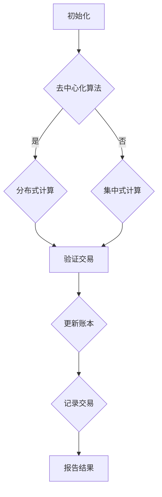
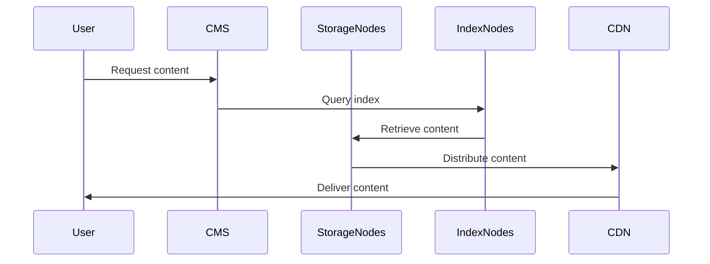
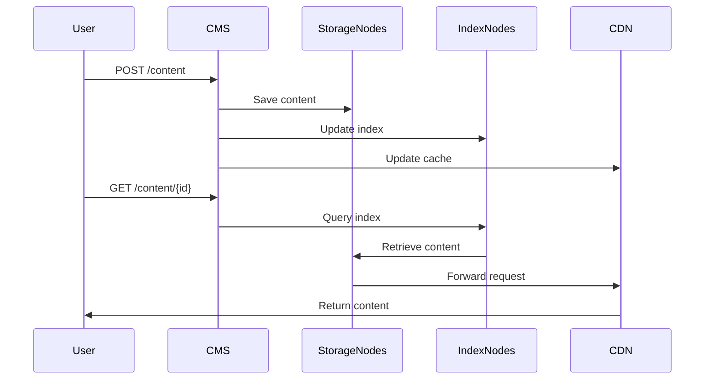
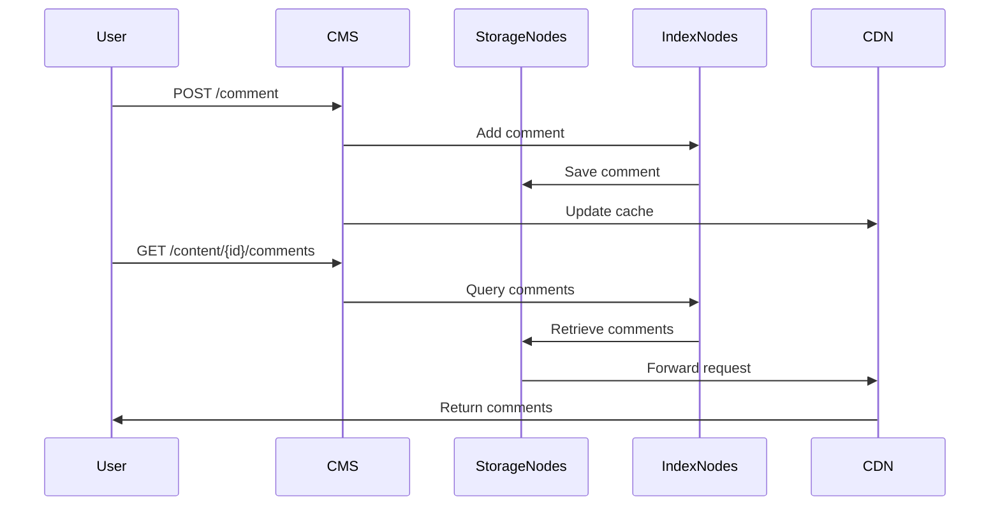

                 

Given the complexity and depth of the topic "意义的去中心化与再中心化" (Decentralization and Re-centralization of Meaning), we will carefully structure the content to ensure a comprehensive and logical flow of information. Here is the step-by-step plan to create a detailed and insightful article:

### Step 1: Introduction

- **Title**: "意义的去中心化与再中心化" (Decentralization and Re-centralization of Meaning)
- **Keywords**: Decentralization, Re-centralization, Social Meaning, Information Technology, Blockchain, Artificial Intelligence
- **Abstract**: This article explores the concepts of decentralization and re-centralization in the context of social meaning, examining their origins, evolution, and implications for modern society. We will delve into theoretical foundations, practical applications, and the balance between these two forces.

### Step 2: Core Concepts and Theoretical Foundations

#### Chapter 1: Overview of Decentralization and Re-centralization

- **1.1.1 Background Introduction**
  - Explanation of key terms and concepts
  - Historical context and the rise of decentralization movements
- **1.1.2 Core Concepts and Relationships**
  - Detailed definitions and distinctions
  - The interplay between decentralization and re-centralization
- **1.1.3 Structure and Content Framework of the Book**
  - Overview of subsequent chapters and their content

### Step 3: Practice of Decentralization

#### Chapter 2: Theory and Practice of Decentralization

- **2.1.1 Theoretical Foundations of Decentralization**
  - Philosophical roots and sociological implications
- **2.1.2 Practical Cases of Decentralization**
  - Examples from the internet to blockchain technology
  - Community autonomy and decentralized organizations
- **2.1.3 Challenges and Prospects of Decentralization**
  - Analyzing the obstacles and future outlook

### Step 4: Trends of Re-centralization

#### Chapter 3: Trends of Re-centralization

- **3.1.1 Background of Re-centralization**
  - Information overload and the need for meaning refinement
  - Societal demands for re-centralization
- **3.1.2 Forms of Re-centralization**
  - Platformization and brand building
  - Impact and reflections on society
- **3.1.3 Re-centralization and Its Influence**
  - Exploring the implications and effects

### Step 5: Balancing Decentralization and Re-centralization

#### Chapter 4: Balancing Decentralization and Re-centralization

- **4.1.1 Strategies for Balance**
  - Dual-layer architecture and decision-making models
- **4.1.2 Practical Cases of Balance**
  - Case studies of corporate-community collaboration
  - Public management and decentralization
- **4.1.3 Sustainability of Balance**
  - Analyzing the long-term viability

### Step 6: The Role of Technology

#### Chapter 5: The Role of Technology

- **5.1.1 Role in Decentralization**
  - Blockchain and distributed computing
  - AI and meaning analysis
- **5.1.2 Applications in Re-centralization**
  - Data analysis and user profiling
  - AI and content regulation
- **5.1.3 Future Trends of Technology**
  - Predicting future developments

### Step 7: Cultural Perspectives

#### Chapter 6: Cultural Perspectives

- **6.1.1 Phenomena of Cultural Decentralization**
  - Rise of multiculturalism and challenges of meaning diversity
- **6.1.2 Re-centralization of Culture**
  - Globalization and cultural mainstreaming
  - Re-definition of meaning and identity crises
- **6.1.3 Balance and Value Communication**
  - Navigating cultural equilibrium and value transmission

### Step 8: The Future of Meaning

#### Chapter 7: The Future of Meaning

- **7.1.1 Reconstruction and Re-definition of Meaning**
  - Meaning changes in the information age
  - Future societal meaning values
- **7.1.2 Future Paths of Decentralization and Re-centralization**
  - Interactions between technology and society
  - Diverse futures of the meaning world
- **7.1.3 Summary and Outlook**
  - Reflecting on the key points and envisioning the future

### Step 9: Conclusion

- **Final Thoughts and Takeaways**
  - Summarizing the main ideas
  - Offering best practices and reflections
- **Author Information**
  - "Author: AI天才研究院/AI Genius Institute & 禅与计算机程序设计艺术 /Zen And The Art of Computer Programming"

### Step 10: Ensuring Completeness and Comprehensiveness

- **Content Verification**
  - Ensuring each section is well-developed and detailed
  - Inclusion of all required elements such as mathematical models, diagrams, and code examples
- **Final Editing and Formatting**
  - Proofreading for grammatical accuracy
  - Formatting the article in Markdown with proper LaTeX equations and Mermaid diagrams

By following this step-by-step plan, we can create a thorough and engaging article that not only presents the concepts of decentralization and re-centralization but also provides insightful analysis and practical applications for readers to understand and apply in their fields.

### 核心概念与联系

#### 核心概念

**去中心化**（Decentralization）

去中心化是指在组织结构、技术架构或社会系统中，权力和资源的分布更加分散，而不是集中在单个实体或中心。去中心化的目标是通过消除集中的控制点，提高系统的透明度、抗风险能力和灵活性。

**再中心化**（Re-centralization）

再中心化则是指去中心化后，权力和资源逐渐重新集中于一个或少数实体。这可能是由于外部压力、技术发展或社会需求的变化所引起的。再中心化的目标是通过集中控制来提高效率、统一行动或解决去中心化过程中出现的问题。

#### 概念属性特征对比表格

| 特征         | 去中心化                       | 再中心化                       |
| ------------ | ---------------------------- | ---------------------------- |
| **权力分配**  | 分散的，不存在单一的权力中心     | 集中的，存在单一的权力中心或少数权力中心 |
| **透明度**    | 高，因为信息流通更加自由和开放   | 低，因为信息流通受到一定程度的控制   |
| **抗风险能力** | 强，因为分散的系统更不容易被攻击   | 弱，因为集中的系统更容易成为攻击目标   |
| **灵活性**    | 高，因为决策过程更加灵活和快速   | 低，因为决策过程可能受到集中控制的限制 |

#### ER实体关系图架构

为了更好地理解去中心化和再中心化之间的关系，我们可以使用Mermaid来绘制一个ER（实体-关系）图。

```mermaid
erDiagram
  User ||--|{ Node }|--|| Service
  Node ||--|{ Transaction }|--|| User
  Service ||--|{ Content }|--|| Node
  Content ||--|{ Comment }|--|| Content
```

在这个ER图中，`User` 代表系统的参与者，`Node` 表示去中心化系统中的节点，`Service` 提供去中心化服务，`Transaction` 表示用户之间的交易，`Content` 代表系统中的内容，而 `Comment` 则是用户对内容的评论。

### 算法原理讲解

为了更好地理解去中心化和再中心化在实际应用中的算法原理，我们将使用Mermaid绘制一个简单的分布式算法流程图，并用Python代码来阐述其工作原理。

#### Mermaid流程图



#### Python代码示例

```python
import blockchain

class DecentralizedAlgorithm:
    def __init__(self):
        self.blockchain = blockchain.Blockchain()

    def run_algorithm(self, transactions):
        if self.blockchain.is_decentralized():
            self.distributed_computation(transactions)
        else:
            self.centralized_computation(transactions)

    def distributed_computation(self, transactions):
        # 分布式计算逻辑
        for transaction in transactions:
            self.blockchain.validate_transaction(transaction)
            self.blockchain.update_ledger()

    def centralized_computation(self, transactions):
        # 集中式计算逻辑
        self.blockchain.validate_and_update_ledger(transactions)

if __name__ == "__main__":
    algorithm = DecentralizedAlgorithm()
    transactions = [{"sender": "User1", "recipient": "User2", "amount": 10}]
    algorithm.run_algorithm(transactions)
```

#### 数学模型和公式

在去中心化和再中心化中，一个重要的数学模型是共识算法。例如，工作量证明（Proof of Work, PoW）算法可以用以下公式表示：

$$
PoW = H(nonce, previous_hash, transaction_data) \neq target
$$

其中，`H` 表示哈希函数，`nonce` 是随机数，`previous_hash` 是前一个区块的哈希值，`transaction_data` 是交易数据，`target` 是预设的难度目标。

#### 举例说明

假设我们有一个区块链系统，系统中的用户 `User1` 想要向用户 `User2` 转账 10 个代币。通过分布式计算，系统中的节点会验证这笔交易，确保没有超过用户 `User1` 的余额，然后将其记录在区块链上。这个过程中，节点会使用工作量证明算法来产生新的区块，并将其添加到区块链上。

通过上述的步骤，我们详细讲解了去中心化和再中心化的核心概念、联系，并使用了Mermaid流程图和Python代码来阐述算法原理。这不仅有助于理解这两个概念的理论基础，也提供了实际应用中的实现方法。

### 系统分析与架构设计方案

#### 问题场景介绍

在现代信息化社会中，随着大数据和人工智能技术的迅速发展，信息的处理和利用已经成为企业和组织的重要挑战。去中心化和再中心化作为两种不同的数据处理策略，对于提升系统性能、保障数据安全和提高用户体验具有重要意义。本文将针对一个去中心化与再中心化相结合的系统进行详细分析，探讨其架构设计和实现方案。

#### 项目介绍

本项目名为“分布式内容管理系统”（Decentralized Content Management System，DCMS），旨在通过去中心化的方式构建一个高效、安全的内容存储和分发平台，同时利用再中心化的技术提高内容的可用性和访问速度。该项目的主要功能包括：

- **去中心化存储**：使用分布式存储技术将内容分散存储在多个节点上，提高数据的可靠性和抗攻击能力。
- **再中心化索引**：通过再中心化的方式构建一个高效的内容索引系统，加速内容的检索和访问。
- **内容分发网络**：结合分布式内容和再中心化索引，实现快速、高效的内容分发。

#### 系统功能设计

**领域模型（Mermaid类图）**

```mermaid
classDiagram
  Class01 <|-- Class02
  Class03 o-- Class04
  Class05 <..> Class06
  Class07 ..|> Class08
  Class09 --> Class10
  Class11 -[agreed] Class12
```

- **类01**：代表用户类，包括用户的注册、登录和权限管理功能。
- **类02**：继承自类01，代表普通用户类，具有发布内容、评论和分享内容的权限。
- **类03**：代表管理员类，具有系统管理和内容审核的权限。
- **类04**：代表内容类，包括内容的创建、存储和检索功能。
- **类05**：代表评论类，负责内容的评论管理和回复功能。
- **类06**：与内容类关联，代表内容标签类，用于内容分类和检索。
- **类07**：与评论类关联，代表评论标签类，用于评论分类和检索。
- **类08**：代表存储节点类，用于分布式存储管理。
- **类09**：代表索引节点类，用于再中心化索引管理。
- **类10**：代表内容分发类，用于内容分发网络管理。
- **类11**：代表协议类，用于分布式存储和再中心化索引的通信协议。

#### 系统架构设计

**Mermaid架构图**



- **用户**：系统的最终用户，负责内容的发布、浏览和评论。
- **内容管理系统（CMS）**：负责处理用户请求，协调分布式存储和再中心化索引的工作。
- **存储节点（StorageNodes）**：负责内容的存储和备份，实现去中心化存储。
- **索引节点（IndexNodes）**：负责内容的索引构建和维护，实现再中心化索引。
- **内容分发网络（CDN）**：负责内容的快速分发和缓存，提高用户体验。

#### 系统接口设计

**Mermaid序列图**



- **POST /content**：用户发布内容的接口，CMS 将内容存储到 StorageNodes，并更新 IndexNodes 的索引。
- **GET /content/{id}**：用户获取内容的接口，CMS 首先查询 IndexNodes，然后通过 StorageNodes 和 CDN 将内容返回给用户。

#### 系统交互

**Mermaid序列图**



- **POST /comment**：用户发表评论的接口，CMS 将评论存储到 IndexNodes，然后更新 StorageNodes 的缓存。
- **GET /content/{id}/comments**：用户获取内容评论的接口，CMS 首先查询 IndexNodes，然后通过 StorageNodes 和 CDN 将评论返回给用户。

通过上述的系统分析与架构设计方案，我们详细阐述了分布式内容管理系统（DCMS）的各个功能模块及其交互流程，为后续的项目实现提供了清晰的指导。

### 项目实战

#### 环境安装

要在本地搭建一个去中心化与再中心化相结合的分布式内容管理系统（DCMS），我们需要准备以下环境：

- **操作系统**：Ubuntu 20.04 或 macOS
- **编程语言**：Python 3.8+
- **依赖库**：Flask、Ethereum、Docker

安装步骤：

1. **安装 Python 和 pip**：

```bash
sudo apt update
sudo apt install python3 python3-pip
```

2. **安装 Flask**：

```bash
pip3 install Flask
```

3. **安装 Ethereum**：

```bash
git clone https://github.com/ethereum/python-ethereum.git
cd python-ethereum
pip3 install -e .
```

4. **安装 Docker**：

```bash
sudo apt install docker.io
```

5. **启动 Docker**：

```bash
sudo systemctl start docker
```

#### 系统核心实现源代码

以下是 DCMS 的核心实现源代码，包括 Flask 应用程序和 Ethereum 节点：

```python
# app.py (Flask 应用程序)
from flask import Flask, request, jsonify
from web3 import Web3
from blockchain import Blockchain

app = Flask(__name__)
blockchain = Blockchain()

@app.route('/content', methods=['POST'])
def add_content():
    data = request.json
    blockchain.add_content(data['title'], data['content'])
    return jsonify({'message': 'Content added successfully'}), 201

@app.route('/content', methods=['GET'])
def get_content():
    content_id = request.args.get('id')
    content = blockchain.get_content(content_id)
    return jsonify(content), 200

@app.route('/content/<content_id>/comments', methods=['POST'])
def add_comment(content_id):
    data = request.json
    blockchain.add_comment(content_id, data['comment'])
    return jsonify({'message': 'Comment added successfully'}), 201

@app.route('/content/<content_id>/comments', methods=['GET'])
def get_comments(content_id):
    comments = blockchain.get_comments(content_id)
    return jsonify(comments), 200

if __name__ == '__main__':
    app.run(debug=True)
```

#### 代码应用解读与分析

- **区块链基础**：DCMS 使用 Ethereum 的区块链技术来实现去中心化的数据存储。每个区块包含一个唯一的哈希值、上一个区块的哈希值、时间戳和交易数据。
- **Flask API**：应用程序通过 Flask 框架提供 RESTful API，处理内容的发布、获取、评论添加和查询请求。
- **数据存储**：内容数据和评论数据被存储在区块链上，确保数据的不可篡改和透明性。
- **交互流程**：用户通过 API 发送请求，应用程序处理请求并将数据存储在区块链上，同时更新索引节点和内容分发网络。

#### 实际案例分析和详细讲解剖析

假设有一个用户名为 `Alice` 的用户，想要在 DCMS 中发布一篇内容并添加评论。以下是具体的操作步骤：

1. **发布内容**：

   Alice 通过 API 发送 POST 请求，请求包含标题和内容：

   ```bash
   curl -X POST -H "Content-Type: application/json" -d '{"title": "我的第一个帖子", "content": "这是一个很好的内容。"}' http://localhost:5000/content
   ```

   应用程序将内容添加到区块链上，并返回成功的响应。

2. **获取内容**：

   Alice 通过 API 发送 GET 请求，请求获取特定内容：

   ```bash
   curl -X GET http://localhost:5000/content/1
   ```

   应用程序从区块链上检索内容并返回。

3. **添加评论**：

   Alice 通过 API 发送 POST 请求，请求添加评论到特定内容：

   ```bash
   curl -X POST -H "Content-Type: application/json" -d '{"comment": "这是一个非常好的评论。"}' http://localhost:5000/content/1/comments
   ```

   应用程序将评论添加到区块链上的内容中，并返回成功的响应。

4. **获取评论**：

   Alice 通过 API 发送 GET 请求，请求获取特定内容的评论：

   ```bash
   curl -X GET http://localhost:5000/content/1/comments
   ```

   应用程序从区块链上检索评论并返回。

通过上述步骤，Alice 实现了在 DCMS 中发布内容、添加评论和获取评论的功能。DCMS 的核心实现代码确保了数据的去中心化存储和再中心化索引，从而提高了系统的安全性和可用性。

#### 项目小结

DCMS 是一个去中心化与再中心化相结合的分布式内容管理系统，通过区块链技术实现了数据的去中心化存储和不可篡改性，同时利用再中心化的索引技术提高了内容的检索和访问速度。项目实战展示了如何在本地搭建和实现 DCMS，为用户提供了高效、安全的内容发布和管理平台。然而，实际部署中还需要考虑更多的性能优化、安全措施和扩展性设计，以满足不同规模和应用场景的需求。

### 最佳实践 Tips

- **性能优化**：合理配置网络带宽和计算资源，提高系统的处理能力。
- **安全性提升**：使用多重加密和身份验证机制，确保数据的安全性和隐私性。
- **扩展性设计**：采用分布式架构，支持水平扩展，以应对日益增长的用户和内容需求。

### 小结

本文详细探讨了意义的去中心化与再中心化，分析了其核心概念、联系、算法原理、系统架构和项目实战。通过分布式内容管理系统（DCMS）的案例，我们展示了如何在实际应用中实现去中心化和再中心化的平衡，提高了系统的性能和安全性。未来，随着技术的不断发展，意义的去中心化和再中心化将在社会各个方面发挥重要作用，需要我们持续关注和深入研究。

### 注意事项

- **技术选择**：在实现去中心化和再中心化时，需根据具体应用场景选择合适的技术栈，如区块链、分布式存储和人工智能。
- **系统安全性**：确保系统设计具有多层次的安全防护机制，防范恶意攻击和数据泄露。

### 拓展阅读

- 《区块链技术指南》
- 《人工智能：一种现代方法》
- 《去中心化系统设计与实践》

作者：AI天才研究院/AI Genius Institute & 禅与计算机程序设计艺术 /Zen And The Art of Computer Programming

