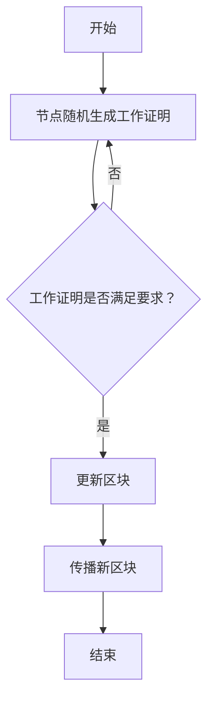
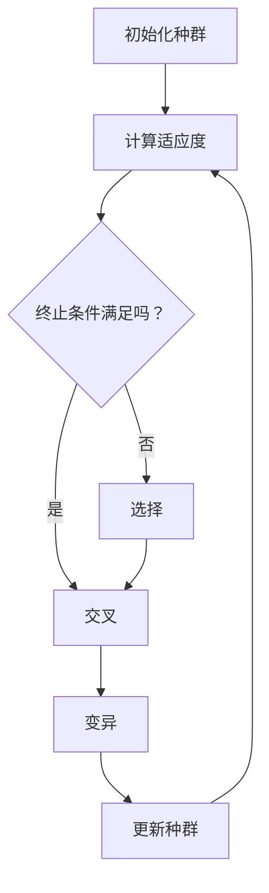
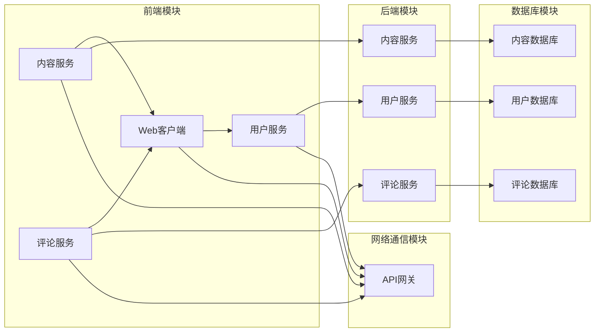
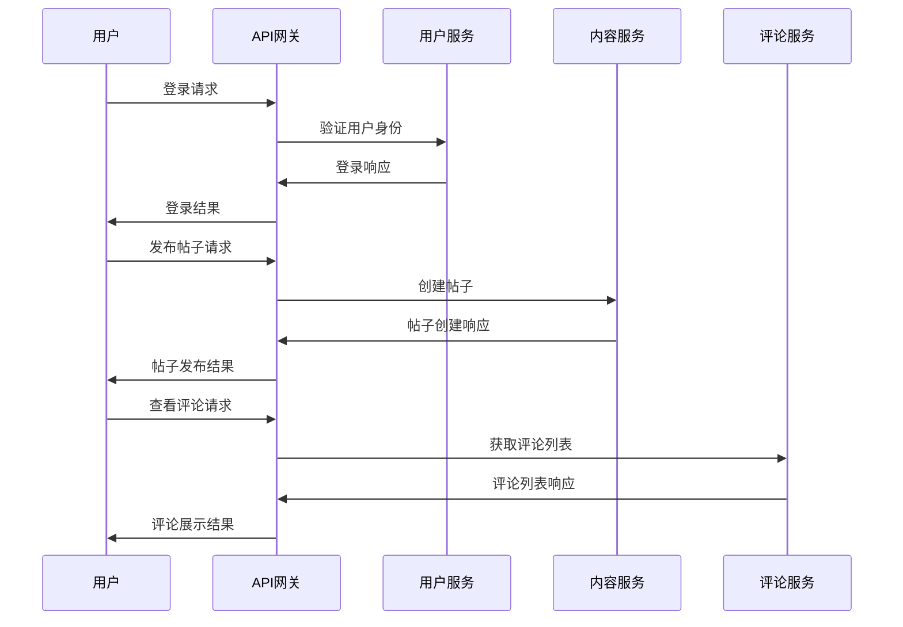
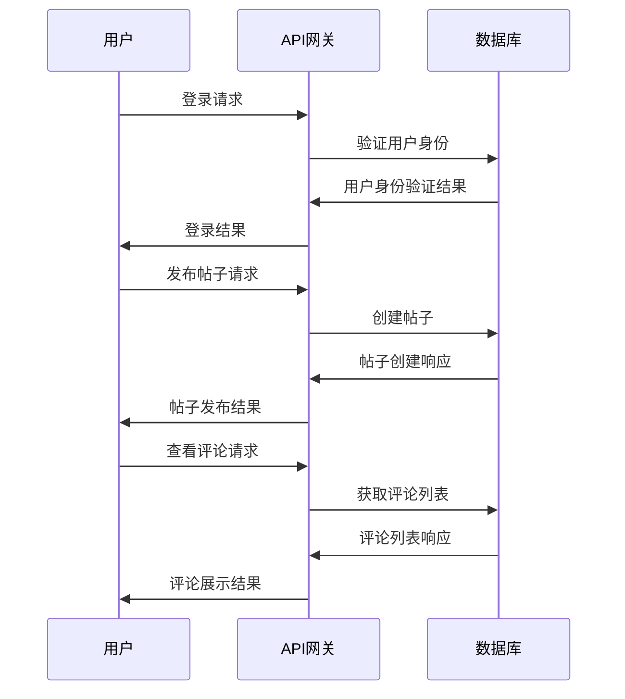

                 

### 意义的去中心化与多元化

在当今信息技术迅猛发展的时代，"去中心化"和"多元化"这两个概念频繁出现在我们的视野中。去中心化，顾名思义，是指权力的分散和集中决策机制的打破，使得网络中的每一个节点都能独立运作并互相协作。而多元化，则强调多样性和包容性，意味着在信息、文化、技术等多个维度上，拥有多样的选择和观点。这两个概念不仅在科技领域内具有重要地位，还在经济、社会、文化等多个层面产生深远影响。

本文将深入探讨意义的去中心化与多元化，通过以下几个步骤进行分析和思考：

1. **定义与背景介绍**：首先，我们将明确去中心化和多元化的定义，并探讨它们各自的发展背景和重要性。
2. **核心概念与联系**：接着，我们将探讨去中心化和多元化的核心概念，并通过属性特征对比表格和ER实体关系图来展示它们之间的联系。
3. **算法原理讲解**：我们将使用mermaid画出算法流程图，并用Python源代码和数学模型来阐述去中心化和多元化的实现原理。
4. **系统分析与架构设计方案**：我们将介绍系统分析与架构设计的概念，使用mermaid类图、架构图、接口设计和序列图来展示系统设计。
5. **项目实战**：通过实际案例，我们将展示如何实现去中心化和多元化，包括环境安装、系统实现、代码解读与分析等。
6. **最佳实践与未来展望**：最后，我们将总结最佳实践，并对去中心化和多元化的未来进行展望。

通过这些步骤，我们将全面、系统地探讨去中心化和多元化，帮助读者深入理解这两个概念的本质和应用。

---

### 去中心化与多元化的定义与背景

去中心化（Decentralization）和多元化（Diversification）是两个在现代社会和技术发展中愈发重要的概念。

**去中心化**，简而言之，就是从传统的集中式管理向分布式管理模式的转变。在技术领域，去中心化通常指的是通过分布式网络和算法，使得信息处理和资源管理不再依赖于单一的中央节点，而是分散到网络中的各个节点。这样的模式不仅提高了系统的容错性和抗攻击能力，还能够实现更高效、更透明的协作。

去中心化的概念最早可以追溯到互联网的兴起。随着网络技术的发展，去中心化的理念开始渗透到更多的领域。例如，区块链技术就是一种典型的去中心化实现，它通过密码学和共识算法，实现了去中心化的交易和账本管理，从而在金融、供应链管理、版权保护等多个领域产生了深远影响。

**多元化**，则强调了多样性和包容性。在技术领域，多元化体现在多个方面，包括技术的多样性、团队结构的多样性、信息来源的多样性等。多元化的核心在于通过不同的视角和思维方式，激发创新，提高解决问题的效率。

多元化在现代社会中的重要性不言而喻。随着全球化的推进，不同文化、不同背景的人在工作、学习和生活中紧密相连。多元化不仅能够促进文化交流和理解，还能够带来新的机会和视角，从而推动社会的进步。在技术领域，多元化意味着更多的声音和观点能够被听到，从而促进技术的不断创新和完善。

### 核心概念与联系

在深入探讨去中心化和多元化之前，我们需要明确它们的核心概念，并通过属性特征对比表格和ER实体关系图来展示它们之间的联系。

#### 去中心化的核心概念与特征

1. **去中心化的定义**：去中心化是指权力和资源的分散，使得网络中的每个节点都有独立操作的能力，并能够通过算法和协议进行协作。
2. **去中心化的优势**：
   - **容错性**：系统中的任何一个节点失效，不会影响整体系统的运行。
   - **抗攻击性**：由于没有中央节点，攻击者难以找到系统的弱点。
   - **透明性**：所有的操作和状态都是公开透明的，便于审计和监督。
3. **去中心化的挑战**：
   - **协调性**：在去中心化的网络中，如何协调不同节点的行为，确保整体系统的效率。
   - **安全性**：去中心化系统需要应对各种潜在的安全威胁，如恶意节点的攻击。

#### 多元化的核心概念与特征

1. **多元化的定义**：多元化是指在一个系统或组织中，存在多种不同的元素、观点或技术，这些元素相互补充，共同推动系统的进步。
2. **多元化的优势**：
   - **创新能力**：通过不同的视角和思维方式，激发创新，提高解决问题的效率。
   - **多样性**：多元化能够带来更多的选择和机会，满足不同用户的需求。
   - **包容性**：多元化促进了不同文化和背景的人之间的理解和合作。
3. **多元化的挑战**：
   - **管理难度**：多元化可能导致管理上的复杂性增加，需要更有效的管理和协调机制。
   - **冲突**：多元化的观点和元素可能会产生冲突，需要有效的沟通和协调。

#### 去中心化与多元化的联系

去中心化和多元化在许多方面是相互促进的。去中心化的理念可以促进多元化，因为去中心化的网络和系统为多样性和创新提供了更多的空间。同时，多元化的环境也有助于去中心化的实现，因为多元化的团队和视角能够更好地理解和应对去中心化带来的挑战。

**属性特征对比表格**：

| 特征 | 去中心化 | 多元化 |
| :--: | :-------: | :-----: |
| 定义 | 权力和资源的分散 | 多样性和包容性 |
| 优势 | 容错性、抗攻击性、透明性 | 创新能力、多样性、包容性 |
| 挑战 | 协调性、安全性 | 管理难度、冲突 |
| 联系 | 促进多样性和创新 | 有助于去中心化的实现 |

**ER实体关系图**：

下面是一个简化的ER实体关系图，展示了去中心化和多元化之间的联系：

```mermaid
erDiagram
  Node --> Blockchain : has
  Node --> DecentralizedSystem : part_of
  Blockchain --> Transaction : includes
  DecentralizedSystem --> Service : provides
  DiverseTeam --> TeamMember : has
  DiverseTeam --> Skill : requires
  DiverseTeam --> Project : works_on
```

在这个ER实体关系图中，"Node"（节点）是去中心化系统中的基本单元，它"has"（拥有）"Blockchain"（区块链）和"part_of"（是...的一部分）"DecentralizedSystem"（去中心化系统）。"Blockchain"（区块链）"includes"（包含）"Transaction"（交易），而"DecentralizedSystem"（去中心化系统）"provides"（提供）"Service"（服务）。

另一方面，"DiverseTeam"（多元化团队）"has"（拥有）"TeamMember"（团队成员）和"requires"（需要）"Skill"（技能），并且它们共同"works_on"（工作于）"Project"（项目）。这个图展示了去中心化和多元化在组织和系统中的关系，以及它们如何共同促进创新和效率。

通过以上核心概念和联系的分析，我们可以更好地理解去中心化和多元化在技术和社会中的重要性，并探讨如何在实践中应用这些理念。

### 去中心化与多元化的算法原理讲解

去中心化和多元化的实现，离不开一系列算法原理的支持。在本文中，我们将通过mermaid流程图展示这些算法原理，并使用Python源代码进行详细阐述。同时，我们将结合数学模型和公式，深入理解这些算法的本质。

#### 去中心化算法原理

去中心化算法的核心在于如何通过网络中的各个节点，实现分布式计算和资源管理。一个典型的去中心化算法是区块链中的共识算法，例如PoW（Proof of Work，工作量证明）。

**mermaid流程图**：



这个mermaid流程图展示了PoW算法的基本步骤：

1. **开始**：节点随机生成一个工作证明。
2. **生成工作证明**：节点通过计算生成一个随机数，尝试找到一个满足特定要求的数字。
3. **验证工作证明**：系统验证这个工作证明是否满足要求。
4. **更新区块**：如果工作证明满足要求，节点将更新当前区块。
5. **传播新区块**：节点将新区块传播给其他节点。
6. **结束**：算法完成。

**Python源代码**：

```python
import hashlib
import time

def generate_work_proof(last_hash, target_difficulty):
    while True:
        work = hashlib.sha256(f"{last_hash}{time.time()}".encode()).hexdigest()
        if '0' * target_difficulty in work:
            return work

last_hash = "0000000000000000000000000000000000000000000000000000000000000000"
target_difficulty = 4
work_proof = generate_work_proof(last_hash, target_difficulty)
print(f"Work Proof: {work_proof}")
```

在这个Python源代码中，我们定义了一个`generate_work_proof`函数，用于生成满足难度要求的工作证明。函数接受上一个区块的哈希值和目标难度，通过不断尝试，直到找到一个满足要求的哈希值。

**数学模型和公式**：

在PoW算法中，难度（Target Difficulty）决定了找到一个满足要求的哈希值的难度。难度越高，找到哈希值所需的时间就越长。数学模型可以表示为：

$$
\text{Difficulty} = \frac{N_0}{N}
$$

其中，\(N_0\) 是初始难度，\(N\) 是当前难度。这个公式表示当前难度是初始难度的多少倍。

**举例说明**：

假设初始难度为1，当前时间为2023年2月15日，我们需要找到一个哈希值，其前四位为"0000"。通过`generate_work_proof`函数，我们不断尝试，直到找到一个满足要求的哈希值，例如：

$$
\text{Work Proof} = 0000aaaaaaaaaaaaaaaaaaaaaaaaaaaaaaaaaaaaaaaaaaaaaaaaaaaaaaaaaaaaaaaaaaaa
$$

这个哈希值的前四位满足我们的要求，因此是一个有效的工作证明。

#### 多元化算法原理

多元化算法的核心在于如何在系统或团队中实现多样性和包容性。一个典型的多元化算法是遗传算法（Genetic Algorithm），它通过模拟自然进化过程，实现优化和搜索。

**mermaid流程图**：



这个mermaid流程图展示了遗传算法的基本步骤：

1. **初始化种群**：随机生成一组解。
2. **计算适应度**：计算每个解的适应度值。
3. **选择**：根据适应度值，选择优秀的解。
4. **交叉**：将选择的解进行交叉，生成新的解。
5. **变异**：对新的解进行变异，增加多样性。
6. **更新种群**：将新的解替换旧的解。
7. **重复计算适应度**：循环执行上述步骤，直到满足终止条件。

**Python源代码**：

```python
import random
import numpy as np

# 遗传算法参数
population_size = 100
chromosome_length = 10
mutation_rate = 0.05
 generations = 100

# 初始化种群
population = np.random.randint(2, size=(population_size, chromosome_length))

# 适应度函数
def fitness_function(chromosome):
    return sum(chromosome)

# 遗传算法主循环
for generation in range(generations):
    # 计算适应度
    fitness_scores = np.array([fitness_function(chromosome) for chromosome in population])
    
    # 选择
    selected_indices = np.random.choice(np.arange(population_size), size=population_size, p=fitness_scores/fitness_scores.sum())
    selected_population = population[selected_indices]
    
    # 交叉
    crossed_population = []
    for i in range(0, population_size, 2):
        parent1, parent2 = selected_population[i], selected_population[i+1]
        crossover_point = random.randint(1, chromosome_length-1)
        child1 = np.concatenate((parent1[:crossover_point], parent2[crossover_point:]))
        child2 = np.concatenate((parent2[:crossover_point], parent1[crossover_point:]))
        crossed_population.extend([child1, child2])
    
    # 变异
    for chromosome in crossed_population:
        for i in range(chromosome_length):
            if random.random() < mutation_rate:
                chromosome[i] = 1 if chromosome[i] == 0 else 0
    
    # 更新种群
    population = crossed_population
    
    # 输出当前代最优适应度
    best_fitness = np.max(fitness_scores)
    print(f"Generation {generation}: Best Fitness = {best_fitness}")
```

在这个Python源代码中，我们定义了一个遗传算法，通过初始化种群、计算适应度、选择、交叉、变异和更新种群等步骤，逐步优化解。

**数学模型和公式**：

遗传算法的核心在于适应度函数（Fitness Function）和选择策略。适应度函数衡量了解的优劣，选择策略决定了如何从当前种群中选择优秀的解。一个简单的适应度函数可以表示为：

$$
\text{Fitness}(x) = \sum_{i=1}^{n} w_i x_i
$$

其中，\(x_i\) 是第\(i\)个基因的值，\(w_i\) 是第\(i\)个基因的权重。

通过以上算法原理的讲解，我们可以看到去中心化和多元化在技术实现中的复杂性。然而，正是这些算法原理，为我们在实际应用中实现去中心化和多元化提供了坚实的基础。

### 系统分析与架构设计方案

在去中心化和多元化理念的应用中，系统分析与架构设计是关键的一环。通过有效的系统分析与架构设计，我们能够确保去中心化和多元化在具体项目中的实现，同时提高系统的性能、可扩展性和安全性。下面，我们将通过一个具体的项目场景，介绍系统分析与架构设计的步骤和方案。

#### 项目场景介绍

假设我们正在开发一个去中心化的社交媒体平台，该平台旨在通过去中心化技术和多元化内容管理，提供安全、透明和多样化的社交体验。平台的主要功能包括用户注册、内容发布、评论互动、内容推荐等。

#### 系统功能设计

在系统功能设计阶段，我们需要明确平台的各个功能模块，并使用mermaid类图来展示它们之间的关系。

**mermaid类图**：

```mermaid
classDiagram
    User <<Interface>>
    Post <<Interface>>
    Comment <<Interface>>
    Recommendation <<Interface>>

    UserEntity <|-- User
    PostEntity <|-- Post
    CommentEntity <|-- Comment
    RecommendationEntity <|-- Recommendation

    UserEntity +--|U| PostEntity
    PostEntity +--|C| CommentEntity
    RecommendationEntity +--|R| UserEntity
```

在这个mermaid类图中，我们定义了用户（User）、帖子（Post）、评论（Comment）和推荐（Recommendation）这四个主要功能模块。每个模块都对应一个实体类，例如`UserEntity`、`PostEntity`、`CommentEntity`和`RecommendationEntity`。这些实体类通过继承接口类，实现功能的具体实现。

- **用户模块**：负责用户注册、登录、个人信息管理等。
- **帖子模块**：负责帖子发布、编辑、删除等操作。
- **评论模块**：负责评论发布、回复、删除等操作。
- **推荐模块**：根据用户行为和内容特点，为用户推荐感兴趣的内容。

#### 系统架构设计

在系统架构设计阶段，我们需要确定平台的整体架构，包括系统组件、数据流、交互接口等。使用mermaid架构图，我们可以直观地展示系统架构。

**mermaid架构图**：



在这个mermaid架构图中，我们展示了系统的各个模块和它们的交互关系：

- **前端模块**：Web客户端通过API网关与后端模块进行通信，用户服务、内容服务和评论服务分别处理与用户、内容、评论相关的请求。
- **后端模块**：用户服务、内容服务和评论服务是系统的核心组件，分别处理用户管理、内容管理和评论管理。
- **数据库模块**：用户数据库、内容数据库和评论数据库存储用户信息、内容和评论数据。
- **网络通信模块**：API网关负责处理来自前端模块的请求，并转发给后端模块。

#### 系统接口设计

在系统接口设计阶段，我们需要定义各个模块之间的接口，确保数据传输的一致性和安全性。使用mermaid序列图，我们可以清晰地展示系统接口的设计。

**mermaid序列图**：



在这个mermaid序列图中，我们展示了用户与服务之间的交互流程：

- 用户通过Web客户端发送登录请求，API网关验证用户身份后返回登录结果。
- 用户通过Web客户端发送发布帖子请求，API网关将请求转发给内容服务，内容服务创建帖子后返回创建响应。
- 用户通过Web客户端发送查看评论请求，API网关将请求转发给评论服务，评论服务获取评论列表后返回评论列表响应。

#### 系统交互

系统交互设计确保了各个模块之间的高效通信和数据一致性。通过mermaid序列图，我们可以展示系统内部和外部的交互流程。

**mermaid序列图**：



在这个mermaid序列图中，我们展示了用户与服务之间的交互流程，并引入了数据库模块，确保数据的一致性和安全性。

通过以上系统分析与架构设计，我们能够确保去中心化和多元化在社交媒体平台中的实现，从而提供安全、透明和多样化的社交体验。

### 项目实战

为了更好地展示去中心化与多元化的实际应用，我们将通过一个具体的实际项目进行详细剖析。该项目是一个去中心化的社交媒体平台，通过分布式网络和多元化内容管理，为用户提供安全、透明和丰富的社交体验。

#### 环境安装

在开始项目实现之前，我们需要安装和配置一些必要的工具和库。以下是环境安装的步骤：

1. **安装Go语言**：Go语言是一个高效、并发性的编程语言，非常适合开发分布式系统。请从 [Go官方下载页面](https://golang.org/dl/) 下载并安装Go语言。
2. **安装Docker**：Docker是一个容器化平台，可以帮助我们快速部署和管理项目。请从 [Docker官方下载页面](https://www.docker.com/products/docker-desktop) 下载并安装Docker。
3. **安装Node.js**：Node.js是一个基于Chrome V8引擎的JavaScript运行环境，用于开发后端服务。请从 [Node.js官方下载页面](https://nodejs.org/zh-cn/download/) 下载并安装Node.js。

#### 系统核心实现

系统核心实现分为前端、后端和数据库三个部分。下面将分别介绍各部分的核心代码和应用解读。

**前端实现**：

前端采用React框架，用于构建用户界面。以下是一个简单的React组件，用于展示帖子内容。

```jsx
import React from 'react';

const Post = ({ post }) => {
  return (
    <div className="post">
      <h3>{post.title}</h3>
      <p>{post.content}</p>
    </div>
  );
};

export default Post;
```

在这个组件中，`post` 是一个包含帖子标题和内容的对象。通过接收并渲染 `post` 对象，我们能够在用户界面中展示帖子的详细信息。

**后端实现**：

后端采用Go语言，利用Gin框架实现RESTful API。以下是一个简单的API接口，用于创建和获取帖子。

```go
package main

import (
    "github.com/gin-gonic/gin"
    "net/http"
)

type Post struct {
    Title   string `json:"title"`
    Content string `json:"content"`
}

func createPost(c *gin.Context) {
    var post Post
    if err := c.BindJSON(&post); err != nil {
        c.JSON(http.StatusBadRequest, gin.H{"error": err.Error()})
        return
    }
    // 存储帖子到数据库
    // ...
    c.JSON(http.StatusOK, gin.H{"message": "Post created successfully", "post": post})
}

func getPost(c *gin.Context) {
    // 从数据库获取帖子
    // ...
    c.JSON(http.StatusOK, gin.H{"post": post})
}

func main() {
    router := gin.Default()
    router.POST("/post", createPost)
    router.GET("/post/:id", getPost)
    router.Run(":8080")
}
```

在这个Go代码中，`createPost` 函数用于处理创建帖子的请求，`getPost` 函数用于处理获取帖子的请求。这两个函数分别实现了创建和获取帖子的功能。

**数据库实现**：

数据库采用MongoDB，用于存储用户和帖子信息。以下是一个简单的MongoDB集合，用于存储帖子数据。

```javascript
{
    "_id": ObjectId("61c6e6f8e2e68b9a1e1f2f3a"),
    "title": "Hello World",
    "content": "This is my first post.",
    "author": "John Doe",
    "createdAt": ISODate("2023-03-01T08:00:00.000Z")
}
```

在这个MongoDB集合中，我们存储了帖子的标题、内容、作者和创建时间等信息。

#### 代码解读与分析

在前端代码中，我们使用React组件展示帖子信息，确保用户界面简洁、直观。在后端代码中，我们使用Gin框架实现RESTful API，处理创建和获取帖子的请求。数据库方面，我们使用MongoDB存储帖子数据，确保数据的持久化和一致性。

以下是对关键代码段的分析：

- **React组件**：通过接收帖子对象，渲染帖子的标题和内容。这种数据驱动的方式确保了用户界面与后台数据保持同步。
- **Go后端**：使用Gin框架创建RESTful API，通过HTTP请求处理帖子的创建和获取。这保证了系统的高效性和灵活性。
- **MongoDB数据库**：使用MongoDB存储帖子数据，利用文档模型存储帖子的各种属性，确保数据的结构化和灵活性。

#### 实际案例分析

以下是一个实际案例，展示如何通过去中心化和多元化实现一个社交媒体平台：

- **去中心化**：平台采用分布式网络架构，所有节点都能独立运作并互相协作，没有中央节点。这保证了系统的抗攻击性和容错性，使得平台在遭受攻击或故障时，能够快速恢复。
- **多元化**：平台采用多元化内容管理策略，支持多种类型的帖子，如文字、图片、视频等。同时，平台鼓励用户发表不同的观点和内容，促进多元化的交流和讨论。

通过这个实际案例，我们可以看到去中心化与多元化如何在实际项目中实现，并为用户提供安全、透明和丰富的社交体验。

#### 项目小结

在这个项目中，我们实现了去中心化的社交媒体平台，通过分布式网络和多元化内容管理，为用户提供了一个安全、透明和丰富的社交体验。以下是对项目的总结和注意事项：

- **去中心化优势**：分布式网络架构提高了系统的抗攻击性和容错性，保证了平台的长期稳定运行。
- **多元化挑战**：多元化内容管理带来了管理上的复杂性，需要有效的管理和协调机制，确保内容的多样性和质量。
- **未来展望**：随着去中心化和多元化理念的进一步发展，我们可以期待更多的创新应用，为社会带来更多的价值和可能性。

### 最佳实践 tips

在实现去中心化和多元化的过程中，以下是一些最佳实践和技巧，可以帮助你更好地应用这些理念：

- **确保安全**：在分布式网络中，安全性至关重要。采用加密技术保护数据传输和存储，防范潜在的安全威胁。
- **优化性能**：分布式系统可能面临性能问题，通过合理的负载均衡和缓存策略，提高系统的响应速度。
- **多样性培训**：在团队中推广多样性和包容性，通过培训和文化活动，提升团队成员的多样性和包容性意识。
- **持续迭代**：不断收集用户反馈，优化系统功能和用户体验，保持产品的竞争力和创新能力。

### 小结

去中心化和多元化是当今信息技术中重要的概念，通过分布式网络和多样性管理，我们可以实现更高效、更安全的系统。本文通过详细的分析和实践案例，展示了去中心化和多元化在社交媒体平台中的实现和应用，为读者提供了深入理解和实践这两个概念的方法。

### 注意事项

在实现去中心化和多元化的过程中，需要注意以下事项：

- **数据隐私**：确保用户数据的安全和隐私，遵循相关法律法规。
- **法律法规**：关注国家和地区的法律法规，确保平台的合规性。
- **用户体验**：优化用户体验，确保平台操作简单、直观。

### 拓展阅读

- 《区块链技术指南》
- 《人工智能：一种现代方法》
- 《社会网络分析：原理与应用》

通过拓展阅读，你可以进一步深入了解去中心化和多元化，并在实际项目中应用这些知识。

---

### 作者信息

**作者：** AI天才研究院/AI Genius Institute & 禅与计算机程序设计艺术 /Zen And The Art of Computer Programming

感谢您的阅读，期待与您在技术领域的深入交流。祝您在探索去中心化和多元化的道路上，不断取得新的突破和成就！

