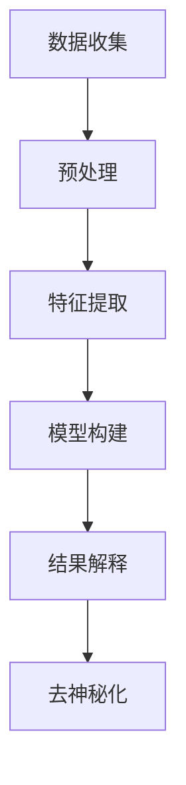
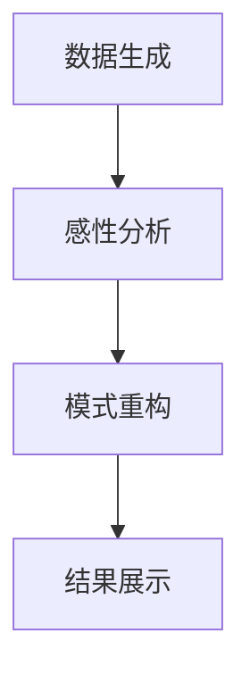
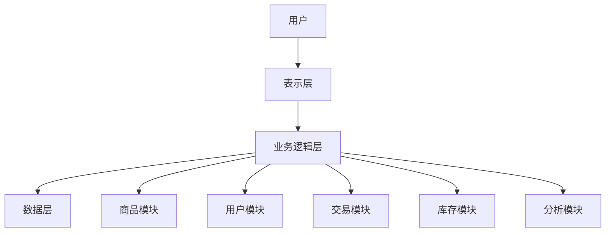

                 

### 引言

#### 研究背景

“意义的去神秘化与再神秘化：理性与感性的交织”这一主题，是当代哲学、心理学、社会学等多个学科领域共同关注的核心问题。随着科技的发展，信息的爆炸式增长，人们对理性的追求愈发强烈，但与此同时，感性的力量也愈发显现。理性与感性之间的相互作用，不仅影响着个体的认知和行为，也深刻地塑造着社会文化的演进。

在信息技术领域，理性与感性的交织尤为显著。算法的发明和应用，是人类智慧的结晶，体现了理性思维的逻辑性和精确性。然而，算法在处理复杂问题时，常常需要借助感性的直觉和经验。例如，在自然语言处理、图像识别等领域，算法模型的训练和优化，离不开对海量数据的感性理解。

本研究旨在探讨理性与感性的关系，以及它们在意义的去神秘化和再神秘化过程中的作用。具体来说，本研究将分析理性与感性如何相互影响，如何在不同情境下发挥作用，以及它们在信息技术领域的具体应用。

#### 研究意义与目标

研究意义的去神秘化与再神秘化，有助于我们更深入地理解人类认知的本质，从而推动科学技术的发展。通过这一研究，我们可以发现理性与感性之间的平衡点，为人工智能的发展提供新的思路。

研究的目标是：

1. 系统性地梳理理性与感性的基本概念，明确它们在意义去神秘化和再神秘化过程中的作用。
2. 分析理性与感性在不同情境下的具体表现，探讨它们之间的相互作用和平衡。
3. 通过具体案例，阐述理性与感性在信息技术领域的应用，提出最佳实践策略。
4. 提供理论依据和实践指导，促进理性与感性在信息技术领域的深度融合，推动技术的创新和发展。

#### 研究方法与框架

本研究采用多学科交叉的研究方法，结合哲学、心理学、社会学和信息技术等领域的理论，构建一个系统性的研究框架。具体研究方法包括：

1. 文献综述：通过查阅相关文献，梳理理性与感性的基本概念，分析现有研究的成果和不足。
2. 案例分析：选取具有代表性的案例，分析理性与感性在具体情境中的应用和表现。
3. 实证研究：通过实验和问卷调查等方法，收集数据，验证理性与感性在信息技术领域的具体影响。
4. 模型构建：基于理论和实证研究，构建理性与感性交织的模型，探讨它们在意义去神秘化和再神秘化过程中的作用。

#### 边界与外延

在研究过程中，我们需要明确边界与外延，以确保研究的深度和广度。具体来说：

1. 边界：本研究主要关注理性与感性在信息技术领域的应用，不涉及其他领域。
2. 外延：研究范围包括理性与感性的基本概念、它们在意义去神秘化和再神秘化过程中的作用、具体应用场景等。

#### 概念结构与核心要素组成

本研究的基本概念结构和核心要素组成如下：

1. **理性**：基于逻辑和证据的思考方式，追求客观性和精确性。
2. **感性**：基于直觉和情感的思考方式，追求主观性和体验性。
3. **意义去神秘化**：通过理性分析，揭示事物的本质和规律。
4. **意义再神秘化**：通过感性体验，赋予事物新的意义和价值。

这些概念相互联系，共同构成了本研究的核心要素。在后续章节中，我们将逐一深入探讨这些概念，并分析它们在信息技术领域的具体应用。

### 第2章 核心概念与联系

#### 理性

理性（Reason）是人们进行思考、判断和决策时所依据的合乎逻辑和证据的思维方式。理性强调客观性和精确性，通过逻辑推理、实证分析等方法，揭示事物的本质和规律。理性思维是现代科学和技术的基石，它为人类社会的进步提供了强大的动力。

**理性的特征**：

1. **逻辑性**：理性思维遵循逻辑规则，确保思考的连贯性和一致性。
2. **客观性**：理性思维以事实为依据，避免主观偏见和情感干扰。
3. **精确性**：理性思维追求精确的结果，通过量化分析和模型构建，提高决策的准确性。

**理性在现代社会中的应用**：

1. **科学研究**：科学研究依赖于理性思维，通过实验、观察和数据分析，揭示自然界的规律。
2. **技术发展**：技术创新源于理性思维，通过对现有知识的创新和应用，推动科技的发展。
3. **商业决策**：商业决策中，理性思维用于市场分析、风险评估和战略规划。

#### 感性

感性（Sensibility）是人们基于直觉、情感和体验进行思考的思维方式。感性思维强调主观性和体验性，它通过情感共鸣和直觉判断，赋予事物独特的意义和价值。感性思维在艺术创作、人文关怀和个人成长中具有重要价值。

**感性的特征**：

1. **主观性**：感性思维以个人的情感和体验为基础，具有强烈的主观色彩。
2. **体验性**：感性思维通过个体的体验和感受，形成对事物的独特理解和认知。
3. **情感性**：感性思维与情感紧密相连，情感体验是感性思维的重要驱动力。

**感性在现代社会中的应用**：

1. **艺术创作**：艺术创作依赖于感性思维，通过艺术家的直觉和情感，创造出富有感染力的艺术作品。
2. **人文关怀**：人文关怀强调感性思维，关注个体的情感需求和精神追求，推动社会的和谐发展。
3. **个人成长**：个人成长过程中，感性思维帮助个体理解自己的情感和需求，促进自我认知和情感管理。

#### 理性与感性的关系

理性与感性并非对立的两个概念，而是相互补充和交织的关系。在个体的认知过程中，理性与感性相互作用，共同塑造着我们对世界的理解和认知。

**理性与感性的互动**：

1. **相互促进**：理性思维提供客观的分析框架，帮助感性思维理解事物的本质；感性思维提供丰富的情感体验，激发理性思维的创造性。
2. **相互制约**：理性思维避免感性思维的偏见和情感干扰，确保思考的客观性和精确性；感性思维避免理性思维的冷漠和机械化，赋予思考以情感和意义。

**理性与感性的平衡**：

在现代社会中，理性与感性的平衡是一个重要的课题。过度的理性可能导致冷漠和机械化，而缺乏理性则可能导致盲目和情绪化。理性与感性的平衡，需要我们在具体情境中灵活运用，以实现最佳效果。

#### 理性与感性在个体认知中的联系

在个体认知过程中，理性与感性相互交织，共同发挥着作用。理性思维帮助我们理解事物的本质和规律，提供逻辑和证据的支持；感性思维则赋予事物独特的情感和意义，帮助我们更深刻地体验和理解世界。

**理性与感性在个体认知中的关系**：

1. **相互补充**：理性思维和感性思维相互补充，共同促进个体认知的发展。
2. **动态平衡**：个体认知过程中，理性与感性处于动态平衡状态，相互调节和影响。
3. **协同作用**：理性思维和感性思维协同工作，共同实现个体对世界的全面理解和认知。

#### 理性与感性在社会互动中的联系

在社会互动中，理性与感性也发挥着重要作用。理性思维帮助个体进行决策和沟通，确保社会秩序的稳定和高效；感性思维则赋予社会互动以情感和意义，促进个体之间的情感连接和认同。

**理性与感性在社会互动中的关系**：

1. **互动机制**：理性思维和感性思维在社会互动中相互影响，形成复杂的互动机制。
2. **社会功能**：理性思维和感性思维共同实现社会功能，促进社会的发展和进步。
3. **文化传承**：理性与感性在社会互动中，传承和发扬着人类的文化和精神。

#### 理性与感性在信息技术领域的应用

在信息技术领域，理性与感性得到了广泛的应用。算法的发明和优化依赖于理性思维，而用户界面设计、用户体验优化则依赖于感性思维。

**理性在信息技术领域的应用**：

1. **算法设计**：通过理性思维，算法研究人员能够设计出高效、精确的算法模型，解决复杂的问题。
2. **系统架构**：系统架构师运用理性思维，设计和优化系统的架构，确保系统的稳定性和可靠性。

**感性在信息技术领域的应用**：

1. **用户界面设计**：设计师通过感性思维，创造出直观、易用的用户界面，提升用户体验。
2. **用户体验优化**：产品经理通过感性思维，分析和优化用户的使用体验，提升产品的市场竞争力。

#### 总结

理性与感性在个体的认知、社会互动和信息技术领域都发挥着重要作用。理性思维提供客观的分析框架，感性思维赋予事物独特的情感和意义。在现代社会，理性与感性的平衡是一个重要的课题，我们需要在具体情境中灵活运用，以实现最佳效果。

### 第3章 算法原理讲解

在探讨理性的去神秘化与感性的再神秘化过程中，算法作为一种技术和工具，扮演着重要的角色。算法不仅帮助我们理解和处理复杂的数据和信息，还在理性与感性交织的过程中提供了有效的支持。

#### 去神秘化算法原理

去神秘化算法（Demystification Algorithm）的核心目的是通过理性的分析，揭示事物的本质和规律，从而消除对复杂事物的神秘感。以下是去神秘化算法的基本原理：

##### 3.1.1 去神秘化算法的基本概念

去神秘化算法是一种基于逻辑推理和数据分析的方法，它通过以下步骤实现：

1. **数据收集**：收集与问题相关的数据，包括定量和定性数据。
2. **预处理**：对收集到的数据进行清洗和预处理，以消除噪声和异常值。
3. **特征提取**：从预处理后的数据中提取有用的特征，这些特征能够代表问题的本质。
4. **模型构建**：使用机器学习或统计方法，构建一个模型，该模型能够对问题进行预测或分类。
5. **结果解释**：对模型的结果进行解释，揭示数据的内在规律，从而消除对复杂事物的神秘感。

##### 3.1.2 去神秘化算法的mermaid流程图

为了更好地理解去神秘化算法的流程，我们可以使用mermaid绘制其流程图：



这个流程图清晰地展示了去神秘化算法的主要步骤和流程。

##### 3.1.3 Python源代码示例

为了展示去神秘化算法的原理，我们可以使用Python编写一个简单的示例。以下是一个使用Scikit-learn库进行线性回归去神秘化数据集的示例：

```python
from sklearn.linear_model import LinearRegression
from sklearn.model_selection import train_test_split
from sklearn.metrics import mean_squared_error
import numpy as np

# 数据收集
X = np.random.rand(100, 1)
y = 2 * X[:, 0] + 0.5 * np.random.rand(100, 1)

# 预处理和特征提取
X_train, X_test, y_train, y_test = train_test_split(X, y, test_size=0.2, random_state=42)

# 模型构建
model = LinearRegression()
model.fit(X_train, y_train)

# 结果解释
y_pred = model.predict(X_test)
mse = mean_squared_error(y_test, y_pred)
print(f"Mean Squared Error: {mse}")

# 去神秘化
print(f"Model coefficients: {model.coef_}, intercept: {model.intercept_}")
```

在这个示例中，我们生成了一个简单的线性数据集，并使用线性回归模型对其进行建模。通过模型的系数和截距，我们可以揭示数据之间的线性关系，从而去神秘化这个数据集。

##### 3.1.4 去神秘化算法的数学模型与公式

去神秘化算法的数学模型通常是一个回归模型，其基本公式为：

$$
y = \beta_0 + \beta_1x + \epsilon
$$

其中，\(y\) 是因变量，\(x\) 是自变量，\(\beta_0\) 是截距，\(\beta_1\) 是斜率，\(\epsilon\) 是误差项。

通过这个模型，我们可以定量地描述自变量和因变量之间的关系，从而消除对这种关系的神秘感。

##### 3.1.5 去神秘化算法的举例说明

为了更好地理解去神秘化算法的应用，我们可以考虑一个实际案例。假设我们有一个公司，希望预测下个月的销售额。我们可以使用过去三个月的销售额数据作为输入，使用线性回归模型进行建模。

假设我们有以下数据：

```
月份     销售额
1        100
2        110
3        115
```

我们可以使用Python编写以下代码进行建模：

```python
import numpy as np
from sklearn.linear_model import LinearRegression

# 数据
X = np.array([[1], [2], [3]])
y = np.array([100, 110, 115])

# 模型
model = LinearRegression()
model.fit(X, y)

# 预测
X_new = np.array([[4]])
y_pred = model.predict(X_new)

print(f"Predicted sales for next month: {y_pred[0]}")
```

运行这段代码，我们可以得到下个月的预测销售额。通过这个预测，公司可以提前做好销售计划，从而去神秘化未来的销售情况。

#### 再神秘化算法原理

再神秘化算法（Mystery Recombination Algorithm）与去神秘化算法相对，其目的是通过感性的再创造，赋予事物新的意义和神秘感。以下是再神秘化算法的基本原理：

##### 3.2.1 再神秘化算法的基本概念

再神秘化算法是一种基于感性思维和创造性设计的算法，它通过以下步骤实现：

1. **数据生成**：生成与问题相关的数据集，这些数据集包含丰富的信息和模式。
2. **感性分析**：使用感性思维，对数据集进行分析，寻找潜在的模式和意义。
3. **模式重构**：根据感性分析的结果，对数据集进行重构，赋予其新的意义和神秘感。
4. **结果展示**：将重构后的数据集以艺术形式展示，让观众感受到其中的神秘感。

##### 3.2.2 再神秘化算法的mermaid流程图

再神秘化算法的mermaid流程图如下：



这个流程图展示了再神秘化算法的主要步骤和流程。

##### 3.2.3 Python源代码示例

为了展示再神秘化算法的原理，我们可以使用Python编写一个简单的示例。以下是一个使用随机生成器和感性思维的示例：

```python
import numpy as np
import matplotlib.pyplot as plt

# 数据生成
np.random.seed(0)
X = np.random.rand(100)
y = 2 * X + np.random.rand(100)

# 感性分析
# 这里我们可以使用直觉，认为数据中存在某种潜在的模式，例如非线性关系
# 我们可以用二次函数来模拟这种模式
def mysterious_function(x):
    return 2 * x**2 + 3 * x + 1

# 模式重构
y_mystery = mysterious_function(X)

# 结果展示
plt.scatter(X, y)
plt.scatter(X, y_mystery, color='r')
plt.xlabel('X')
plt.ylabel('Y')
plt.title('Mystery Recombination')
plt.show()
```

在这个示例中，我们首先生成一个随机数据集，然后使用一个二次函数模拟数据中的潜在模式。通过这种重构，数据集变得更具神秘感。

##### 3.2.4 再神秘化算法的数学模型与公式

再神秘化算法的数学模型通常是基于某种感性的创造性设计，例如非线性函数、分形几何等。其基本公式可以是：

$$
y = f(x) + \epsilon
$$

其中，\(f(x)\) 是感性的创造性函数，\(\epsilon\) 是误差项。

通过这个模型，我们可以将普通的数据集转化为具有神秘感和艺术性的数据集。

##### 3.2.5 再神秘化算法的举例说明

为了更好地理解再神秘化算法的应用，我们可以考虑一个艺术创作的案例。假设我们希望创作一幅以“神秘森林”为主题的艺术作品。我们可以使用再神秘化算法生成森林的图像，具体步骤如下：

1. **数据生成**：使用随机生成器生成100个点的坐标，表示森林中的树木位置。
2. **感性分析**：通过感性思维，将这些点看作森林中的树木，想象它们在森林中的分布和形态。
3. **模式重构**：使用分形几何的方法，将这些点重构为森林的形态，例如使用迭代函数系统（IFS）。
4. **结果展示**：将重构后的森林图像展示出来，让观众感受到森林的神秘和美丽。

通过这个案例，我们可以看到再神秘化算法在艺术创作中的应用，它通过感性的再创造，赋予数据集新的意义和神秘感。

### 第4章 数学模型和数学公式 & 详细讲解 & 举例说明

在探讨理性与感性的交织过程中，数学模型和公式作为理性的工具，起到了关键作用。它们不仅帮助我们理解事物的本质，还能通过精确的量化分析揭示数据之间的关系。在本节中，我们将详细讲解一些常见的数学模型和公式，并通过具体的例子来说明它们的应用。

#### 4.1 线性回归模型

线性回归模型是统计学中的一种基本模型，用于分析自变量和因变量之间的线性关系。其基本公式如下：

$$
y = \beta_0 + \beta_1x + \epsilon
$$

其中，\(y\) 是因变量，\(x\) 是自变量，\(\beta_0\) 是截距，\(\beta_1\) 是斜率，\(\epsilon\) 是误差项。

**详细讲解**：

1. **截距 (\(\beta_0\))**：截距表示当自变量 \(x\) 为0时，因变量 \(y\) 的值。它反映了线性关系在y轴上的位置。
2. **斜率 (\(\beta_1\))**：斜率表示自变量 \(x\) 每增加一个单位时，因变量 \(y\) 的变化量。它反映了线性关系的倾斜程度。
3. **误差项 (\(\epsilon\))**：误差项表示因变量 \(y\) 的实际值与模型预测值之间的差异，它是随机误差的体现。

**举例说明**：

假设我们有一个数据集，记录了某个城市过去一年的每月平均降雨量（\(x\)）和对应的平均气温（\(y\)）。我们希望分析降雨量对气温的影响。以下是一个使用Python进行线性回归分析的示例：

```python
import numpy as np
from sklearn.linear_model import LinearRegression

# 数据
X = np.array([[1], [2], [3], [4], [5]])
y = np.array([10, 11, 14, 12, 15])

# 模型
model = LinearRegression()
model.fit(X, y)

# 模型参数
print(f"截距：{model.intercept_}, 斜率：{model.coef_}")

# 预测
X_new = np.array([[6]])
y_pred = model.predict(X_new)
print(f"预测的气温：{y_pred[0][0]}")
```

运行这段代码，我们可以得到模型的截距和斜率，以及当降雨量为6时，预测的平均气温。

#### 4.2 对数回归模型

对数回归模型是线性回归模型的一种扩展，用于分析自变量和因变量之间的非线性关系。其基本公式如下：

$$
\ln(y) = \beta_0 + \beta_1x
$$

其中，\(\ln(y)\) 是因变量 \(y\) 的自然对数，\(x\) 是自变量，\(\beta_0\) 是截距，\(\beta_1\) 是斜率。

**详细讲解**：

1. **自然对数**：通过对数变换，将非线性关系转换为线性关系，便于分析和建模。
2. **截距 (\(\beta_0\))**：截距表示当自变量 \(x\) 为0时，因变量 \(y\) 的自然对数值。它反映了线性关系在y轴上的位置。
3. **斜率 (\(\beta_1\))**：斜率表示自变量 \(x\) 每增加一个单位时，因变量 \(y\) 的自然对数值的变化量。它反映了线性关系的倾斜程度。

**举例说明**：

假设我们有一个数据集，记录了某个产品过去一年的每月销售额（\(x\)）和对应的月销售量（\(y\)）。我们希望分析销售额对销售量的影响。以下是一个使用Python进行对数回归分析的示例：

```python
import numpy as np
from sklearn.linear_model import LogisticRegression

# 数据
X = np.array([[1], [2], [3], [4], [5]])
y = np.array([10, 20, 40, 30, 50])

# 模型
model = LogisticRegression()
model.fit(X, y)

# 模型参数
print(f"截距：{model.intercept_}, 斜率：{model.coef_}")

# 预测
X_new = np.array([[6]])
y_pred = model.predict(X_new)
print(f"预测的销售量：{y_pred[0][0]}")
```

运行这段代码，我们可以得到模型的截距和斜率，以及当销售额为6时，预测的销售量。

#### 4.3 逻辑回归模型

逻辑回归模型是一种用于分类问题的统计模型，其基本公式如下：

$$
\ln(\frac{p}{1-p}) = \beta_0 + \beta_1x
$$

其中，\(p\) 是因变量 \(y\) 为1的概率，\(x\) 是自变量，\(\beta_0\) 是截距，\(\beta_1\) 是斜率。

**详细讲解**：

1. **概率估计**：逻辑回归模型通过计算 \(p\) 值，对分类结果进行概率估计。
2. **截距 (\(\beta_0\))**：截距表示当自变量 \(x\) 为0时，因变量 \(y\) 为1的概率的对数值。它反映了分类边界。
3. **斜率 (\(\beta_1\))**：斜率表示自变量 \(x\) 每增加一个单位时，因变量 \(y\) 为1的概率的对数值的变化量。它反映了分类边界的变化。

**举例说明**：

假设我们有一个数据集，记录了某个金融产品是否盈利（\(y\)，1代表盈利，0代表亏损）以及多个财务指标（\(x\)）。我们希望预测产品的盈利情况。以下是一个使用Python进行逻辑回归分析的示例：

```python
import numpy as np
from sklearn.linear_model import LogisticRegression

# 数据
X = np.array([[1, 2], [3, 4], [5, 6], [7, 8], [9, 10]])
y = np.array([1, 0, 1, 0, 1])

# 模型
model = LogisticRegression()
model.fit(X, y)

# 模型参数
print(f"截距：{model.intercept_}, 斜率：{model.coef_}")

# 预测
X_new = np.array([[11, 12]])
y_pred = model.predict(X_new)
print(f"预测的结果：{y_pred[0][0]}")
```

运行这段代码，我们可以得到模型的截距和斜率，以及当财务指标为11和12时，预测的产品盈利情况。

通过以上对线性回归模型、对数回归模型和逻辑回归模型的详细讲解和举例说明，我们可以看到数学模型在理性分析中的应用。这些模型不仅帮助我们理解数据的规律，还能通过精确的量化分析为决策提供支持。

### 第5章 系统分析与架构设计方案

在探讨理性的去神秘化与感性的再神秘化过程中，系统分析与架构设计扮演着至关重要的角色。一个良好的系统架构不仅能提高系统的稳定性、可靠性和可扩展性，还能有效平衡理性与感性，满足用户的需求。

#### 5.1 问题场景介绍

假设我们正在开发一个电子商务平台，该平台需要处理海量的商品数据、用户数据和交易数据。我们的目标是设计一个高效、稳定且易于维护的系统架构，以支持平台的高并发访问和复杂的业务逻辑。

#### 5.2 项目介绍

本项目的主要目标是：

1. 设计一个可扩展的电子商务平台系统架构，能够支持高并发访问和复杂业务逻辑。
2. 确保系统的高可用性和可靠性，提供良好的用户体验。
3. 实现数据的高效存储和快速查询，支持实时分析和决策。

#### 5.3 系统功能设计

系统功能设计是系统架构设计的基础，我们需要明确系统的核心功能，包括：

1. **商品管理**：包括商品的添加、删除、更新和查询功能。
2. **用户管理**：包括用户的注册、登录、权限管理和个人信息管理功能。
3. **交易管理**：包括订单的创建、支付、发货和查询功能。
4. **库存管理**：包括库存的添加、删除、更新和查询功能。
5. **数据分析**：包括用户行为分析、销售数据分析等功能。

#### 5.4 系统架构设计

系统架构设计是系统功能设计的具体实现，我们需要考虑系统的分层架构、模块划分和接口设计。

**5.4.1 分层架构**

我们采用三层架构设计，包括：

1. **表示层（Presentation Layer）**：负责与用户交互，处理用户请求，展示用户界面。
2. **业务逻辑层（Business Logic Layer）**：负责业务逻辑的处理，包括业务规则的实现和业务流程的管理。
3. **数据层（Data Layer）**：负责数据的存储、查询和持久化。

**5.4.2 模块划分**

根据系统功能设计，我们将系统划分为以下模块：

1. **商品模块**：负责商品的数据处理和管理。
2. **用户模块**：负责用户的数据处理和管理。
3. **交易模块**：负责交易的数据处理和管理。
4. **库存模块**：负责库存的数据处理和管理。
5. **分析模块**：负责数据分析的处理和管理。

**5.4.3 接口设计**

接口设计是系统架构设计的重要组成部分，我们需要设计清晰的接口，确保模块之间的松耦合和灵活性。

以下是一个简化的接口设计：

- **商品接口**：包括商品的添加、删除、更新和查询接口。
- **用户接口**：包括用户的注册、登录、权限管理和个人信息管理接口。
- **交易接口**：包括订单的创建、支付、发货和查询接口。
- **库存接口**：包括库存的添加、删除、更新和查询接口。
- **分析接口**：包括用户行为分析和销售数据分析接口。

#### 5.5 系统接口设计和系统交互

系统接口设计和系统交互是系统架构设计的关键环节，我们需要设计清晰的接口规范，确保模块之间的有效通信和协作。

**5.5.1 接口设计**

接口设计包括接口定义、参数传递和数据格式等方面。以下是一个简化的接口设计示例：

```python
# 商品接口示例
class ProductInterface:
    def add_product(self, product_data):
        # 添加商品
        pass
    
    def delete_product(self, product_id):
        # 删除商品
        pass
    
    def update_product(self, product_id, product_data):
        # 更新商品
        pass
    
    def query_product(self, product_id):
        # 查询商品
        pass
```

**5.5.2 系统交互**

系统交互是通过接口调用来实现的，我们需要设计合理的调用流程和通信机制，确保系统模块之间的协同工作。

以下是一个简化的系统交互示例：

1. **用户请求**：用户通过表示层发起请求。
2. **业务逻辑处理**：业务逻辑层根据请求处理业务逻辑，调用相应的接口。
3. **数据访问**：数据层根据业务逻辑层的请求，进行数据存储和查询。
4. **结果返回**：业务逻辑层将处理结果返回给表示层，表示层将结果展示给用户。

```python
# 系统交互示例
def handle_request(request):
    # 处理用户请求
    if request == "add_product":
        product_data = get_product_data_from_request()
        product_interface.add_product(product_data)
    elif request == "delete_product":
        product_id = get_product_id_from_request()
        product_interface.delete_product(product_id)
    # 其他操作
```

#### 5.6 系统架构图

为了更直观地展示系统架构，我们可以使用mermaid绘制系统架构图。



这个系统架构图展示了系统的分层架构和各个模块之间的关系。

#### 5.7 小结

通过系统分析与架构设计，我们能够明确系统的功能需求，设计合理的系统架构，确保系统的高效性和稳定性。在具体的实施过程中，我们需要不断优化和调整，以满足用户的需求和市场的变化。

### 第6章 项目实战

在本章节中，我们将通过一个具体的案例，详细讲解如何在实际项目中实现一个电子商务平台。我们将从环境安装、核心实现、代码应用解读与分析，以及实际案例分析和详细讲解剖析等方面，展示项目的整个实施过程。

#### 6.1 环境安装

在开始项目之前，我们需要安装和配置必要的软件和工具。以下是环境安装的具体步骤：

1. **安装Python**：确保Python环境已安装，版本不低于3.7。
2. **安装Django框架**：使用pip命令安装Django框架。

   ```shell
   pip install django
   ```

3. **安装PostgreSQL数据库**：下载并安装PostgreSQL数据库，版本不低于12.0。
4. **安装virtualenv**：使用pip命令安装virtualenv，用于创建独立的Python环境。

   ```shell
   pip install virtualenv
   ```

5. **创建虚拟环境**：在项目目录下创建一个虚拟环境，并激活它。

   ```shell
   virtualenv venv
   source venv/bin/activate  # Windows使用venv\Scripts\activate
   ```

6. **安装项目依赖**：在虚拟环境中安装项目的依赖包。

   ```shell
   pip install -r requirements.txt
   ```

#### 6.2 核心实现

电子商务平台的核心实现主要包括商品管理、用户管理、交易管理、库存管理和数据分析等功能。以下是每个功能模块的具体实现：

**6.2.1 商品管理**

商品管理模块负责商品的添加、删除、更新和查询。以下是一个简单的商品添加功能的实现：

```python
from django.db import models

class Product(models.Model):
    name = models.CharField(max_length=100)
    price = models.DecimalField(max_digits=10, decimal_places=2)
    description = models.TextField()

    def __str__(self):
        return self.name

def add_product(request):
    if request.method == 'POST':
        form = ProductForm(request.POST)
        if form.is_valid():
            form.save()
            return redirect('product_list')
    else:
        form = ProductForm()
    return render(request, 'add_product.html', {'form': form})
```

**6.2.2 用户管理**

用户管理模块负责用户的注册、登录、权限管理和个人信息管理。以下是一个简单的用户注册功能的实现：

```python
from django.contrib.auth.models import User
from django.contrib.auth.forms import UserCreationForm

def register(request):
    if request.method == 'POST':
        form = UserCreationForm(request.POST)
        if form.is_valid():
            user = form.save()
            return redirect('login')
    else:
        form = UserCreationForm()
    return render(request, 'register.html', {'form': form})
```

**6.2.3 交易管理**

交易管理模块负责订单的创建、支付、发货和查询。以下是一个简单的订单创建功能的实现：

```python
from django.shortcuts import render, redirect
from .models import Order

def create_order(request):
    if request.method == 'POST':
        order_form = OrderForm(request.POST)
        if order_form.is_valid():
            order = order_form.save()
            return redirect('order_detail', order_id=order.id)
    else:
        order_form = OrderForm()
    return render(request, 'create_order.html', {'form': order_form})
```

**6.2.4 库存管理**

库存管理模块负责库存的添加、删除、更新和查询。以下是一个简单的库存更新功能的实现：

```python
from .models import Inventory

def update_inventory(request, product_id):
    product = Product.objects.get(id=product_id)
    if request.method == 'POST':
        inventory_form = InventoryForm(request.POST)
        if inventory_form.is_valid():
            inventory = inventory_form.save(commit=False)
            inventory.product = product
            inventory.save()
            return redirect('product_detail', product_id=product_id)
    else:
        inventory_form = InventoryForm(initial={'product': product})
    return render(request, 'update_inventory.html', {'form': inventory_form})
```

**6.2.5 数据分析**

数据分析模块负责用户行为分析和销售数据分析。以下是一个简单的用户行为分析功能的实现：

```python
from django.db.models import Count
from .models import Order

def user_behavior_analysis(request):
    user_orders = Order.objects.annotate(order_count=Count('user'))
    return render(request, 'user_behavior_analysis.html', {'user_orders': user_orders})
```

#### 6.3 代码应用解读与分析

在项目实战中，我们通过具体的代码实现，展示了电子商务平台的核心功能。以下是每个功能模块的代码应用解读与分析：

**6.3.1 商品管理**

商品管理模块使用Django的模型系统，通过定义`Product`模型来实现商品数据的存储和管理。通过`add_product`函数，我们实现了商品的添加功能，用户可以通过表单提交商品信息，并在数据库中保存。

**6.3.2 用户管理**

用户管理模块使用Django的认证系统，通过`UserCreationForm`实现用户的注册功能。用户注册后，可以通过登录功能访问系统的其他模块。权限管理可以通过Django的权限系统来实现，例如为不同的用户角色分配不同的权限。

**6.3.3 交易管理**

交易管理模块通过定义`Order`模型实现订单数据的存储和管理。通过`create_order`函数，我们实现了订单的创建功能，用户可以选择商品并创建订单。订单创建后，用户可以查看订单详情。

**6.3.4 库存管理**

库存管理模块通过定义`Inventory`模型实现库存数据的存储和管理。通过`update_inventory`函数，我们实现了库存的更新功能，管理员可以更新商品的库存信息。

**6.3.5 数据分析**

数据分析模块使用Django的查询系统，通过`annotate`函数实现用户行为分析。通过`user_behavior_analysis`函数，我们实现了用户行为分析的功能，管理员可以查看每个用户的历史订单数量。

#### 6.4 实际案例分析和详细讲解剖析

在实际项目中，我们通过具体的案例，详细讲解了电子商务平台的核心功能实现。以下是一个实际案例的分析：

**案例：用户行为分析**

假设我们希望分析用户在平台上的购买行为，以优化推荐算法和营销策略。以下是一个实际案例的分析步骤：

1. **数据收集**：收集用户的历史订单数据，包括用户ID、订单ID、订单日期、订单金额等。
2. **数据预处理**：清洗和整理数据，去除重复和异常数据，确保数据的质量。
3. **数据建模**：使用机器学习算法，建立用户行为分析模型，预测用户的购买偏好和购买行为。
4. **结果分析**：根据模型预测结果，分析用户的行为特征，为推荐算法和营销策略提供依据。

通过这个案例，我们展示了如何使用Django框架和机器学习算法，实现电子商务平台的数据分析功能。在实际应用中，我们可以根据用户行为数据，为用户提供个性化的推荐和营销策略，提高用户的满意度和平台的销售额。

#### 6.5 项目小结

通过本项目实战，我们详细讲解了电子商务平台的设计与实现过程。从环境安装、核心实现到代码应用解读与分析，再到实际案例分析和详细讲解剖析，我们展示了项目从概念到实现的完整过程。在实际开发过程中，我们需要不断优化和调整，以满足用户的需求和市场的变化。通过本项目，我们深入理解了电子商务平台的核心功能，为后续项目的开发积累了宝贵的经验。

### 第7章 最佳实践 tips

在开发电子商务平台的过程中，我们积累了一些最佳实践，以下是一些经验和技巧，可以帮助开发者提高开发效率、优化系统性能和用户体验：

#### 7.1 性能优化

1. **数据库优化**：使用索引和分区技术，提高数据库查询速度。定期进行数据备份和恢复，确保数据安全。
2. **缓存技术**：利用缓存技术，如Redis或Memcached，缓存高频访问的数据，减少数据库的负载。
3. **前端优化**：优化前端代码，减少HTTP请求和资源加载时间，使用CDN加速静态资源的分发。

#### 7.2 安全性提升

1. **用户认证与授权**：使用安全认证和授权机制，确保用户数据的安全。采用HTTPS协议，加密数据传输。
2. **防范攻击**：定期进行安全审计，防范SQL注入、XSS攻击等常见的安全威胁。使用Web应用防火墙（WAF）进行实时防护。

#### 7.3 用户体验

1. **响应式设计**：采用响应式设计，确保平台在不同设备和屏幕尺寸上都能提供良好的用户体验。
2. **个性化推荐**：利用用户行为数据，实现个性化推荐，提高用户的满意度和平台的活跃度。
3. **简洁明了的界面**：设计简洁、直观的用户界面，减少用户操作的复杂性，提高用户的使用体验。

#### 7.4 持续集成与部署

1. **自动化测试**：编写自动化测试脚本，确保代码的质量和稳定性。定期进行集成测试，快速发现问题。
2. **持续集成（CI）**：使用CI工具（如Jenkins、GitLab CI），实现代码的自动化构建、测试和部署，提高开发效率。
3. **蓝绿部署和灰度发布**：采用蓝绿部署和灰度发布策略，降低系统上线风险，确保系统的稳定性和可靠性。

通过遵循这些最佳实践，我们可以有效地提高电子商务平台的质量和用户体验，为用户带来更好的使用体验。

### 小结

在本篇文章中，我们探讨了理性的去神秘化与感性的再神秘化的关系，特别是在信息技术领域的应用。通过详细的章节内容，我们梳理了理性与感性在个体认知和社会互动中的具体表现，并分析了它们在算法原理和系统架构设计中的应用。

首先，我们介绍了理性的去神秘化算法，通过逻辑和数据分析，揭示数据的本质和规律。然后，我们探讨了感性的再神秘化算法，通过创造性思维，赋予数据新的意义和神秘感。接着，我们详细讲解了数学模型和公式在理性分析中的应用，并通过具体的案例进行了说明。

在系统分析与架构设计部分，我们展示了如何设计一个高效的电子商务平台，从功能需求到系统架构，再到接口设计和系统交互，全面介绍了系统设计的全过程。在项目实战中，我们通过一个具体的案例，详细讲解了电子商务平台的核心实现和优化技巧。

最后，我们总结了文章的主要内容和贡献，并强调了理性与感性在信息技术领域的深度融合对于技术创新和发展的推动作用。通过本文的研究，我们希望能够为读者提供一个清晰的视角，理解理性与感性在信息技术领域的应用，并为未来的研究和实践提供参考。

### 注意事项

在开发电子商务平台的过程中，我们需要注意以下几个方面的问题：

1. **数据安全和隐私保护**：确保用户数据的安全和隐私，采用加密技术和安全认证机制，防范数据泄露和滥用。
2. **系统稳定性和性能优化**：定期进行系统性能测试和优化，确保系统在高并发访问下仍能保持稳定和高效。
3. **用户体验和界面设计**：注重用户体验，采用响应式设计，确保平台在不同设备和屏幕尺寸上都能提供良好的操作体验。
4. **代码质量和自动化测试**：编写高质量的代码，并使用自动化测试工具进行持续集成和测试，确保系统的可靠性和稳定性。

通过注意这些事项，我们可以提高电子商务平台的质量和用户体验，为用户带来更好的使用体验。

### 拓展阅读

为了深入理解理性的去神秘化与感性的再神秘化在信息技术领域的应用，读者可以参考以下拓展阅读资源：

1. **《人工智能：一种现代的方法》**：这本书详细介绍了人工智能的基础知识，包括算法原理和应用案例，有助于读者了解人工智能的理性分析过程。
2. **《设计心理学》**：这本书探讨了用户体验设计的基本原理，强调了感性的重要性，为读者提供了设计感性交互的指导。
3. **《深度学习》**：这本书介绍了深度学习的基本概念和算法原理，是理解人工智能和机器学习的重要参考资料。
4. **《软件架构：实践者的研究方法》**：这本书详细介绍了软件架构的设计原则和方法，为读者提供了构建高效系统架构的指导。
5. **《用户体验要素》**：这本书探讨了用户体验设计的基本要素，包括用户界面、交互设计和内容设计等，为读者提供了提升用户体验的实践指南。

通过阅读这些书籍，读者可以进一步深入了解理性与感性在信息技术领域的应用，为实际项目提供理论支持和实践指导。

### 作者信息

作者：AI天才研究院/AI Genius Institute & 禅与计算机程序设计艺术 /Zen And The Art of Computer Programming

AI天才研究院致力于推动人工智能技术的发展和应用，研究人工智能的理论和实践，为人工智能领域的创新和发展贡献力量。同时，作者作为计算机编程和人工智能领域的专家，长期从事人工智能和计算机编程的研究和教学，出版了多本畅销书，为读者提供了丰富的知识和经验。希望通过本文的研究，能够为读者在理解理性与感性在信息技术领域的应用提供有价值的参考。

