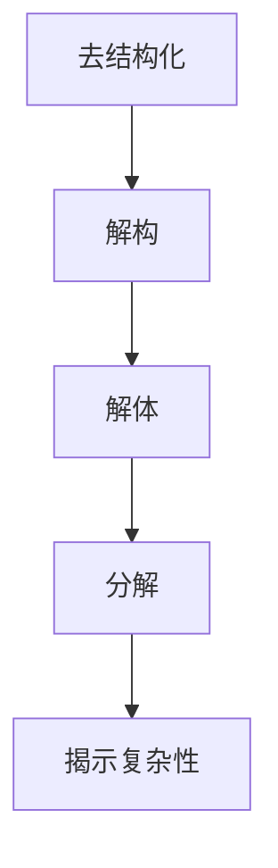
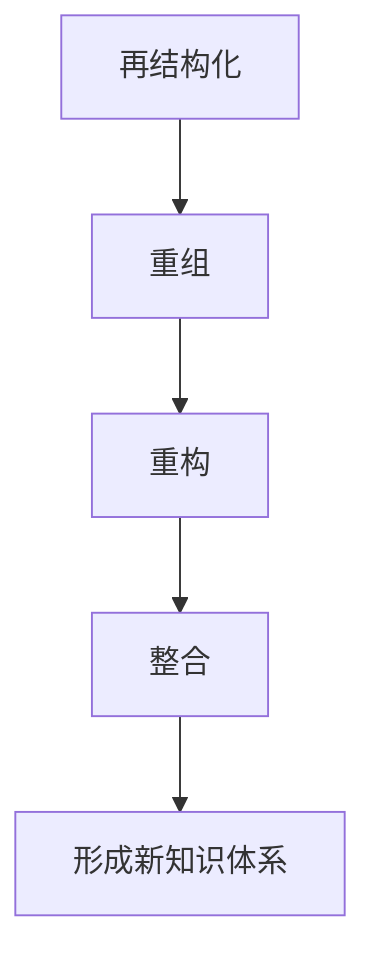
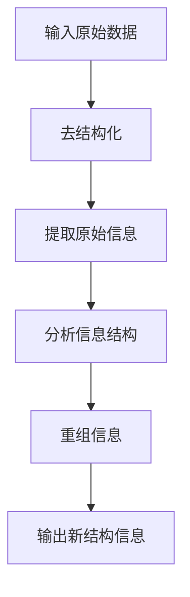

                 

### 文章标题

# **意义的去结构化与再结构化过程**

> 关键词：意义、去结构化、再结构化、哲学、语言学、认知心理学、方法学、技术应用

> 摘要：本文深入探讨了意义的去结构化与再结构化过程，从哲学、语言学和认知心理学等多个角度出发，系统性地介绍了去结构化和再结构化的基本概念、理论框架、方法和技术。通过详细阐述其核心原理和应用实例，本文旨在为读者提供一个全面且深入的理解，从而更好地应对现代信息技术背景下的意义分析问题。

### 引言

意义是人类社会的重要组成部分，它不仅贯穿于人类的生活、工作和思考，还深深嵌入到各种文化、语言和知识体系之中。然而，随着信息技术的高速发展，数据量的激增和信息复杂度的提升，如何理解和处理意义成为了一个严峻的挑战。传统的结构化方法在处理意义时往往显得力不从心，无法满足现代信息处理的多样化需求。因此，对意义的去结构化与再结构化过程的研究显得尤为重要。

去结构化（Deconstruction）和再结构化（Reconstruction）是意义处理过程中的两个关键步骤。去结构化通过打破现有的结构和关系，揭示出意义的多层次和复杂性；再结构化则是在去结构化的基础上，对新的意义进行整合和组织，以形成新的知识体系。这两个过程相辅相成，共同构成了意义分析的核心框架。

本文将首先介绍去结构化和再结构化的基本概念，包括其历史背景、理论基础和应用场景。随后，我们将探讨哲学、语言学和认知心理学等多个领域对去结构化和再结构化过程的影响，并介绍相关的理论框架和方法。最后，通过具体的实例和实际应用，我们将展示去结构化和再结构化在信息技术领域的具体实现，并总结全文的主要观点和未来研究方向。

### 背景介绍

#### 核心概念术语说明

1. **去结构化（Deconstruction）**：
   去结构化是一种哲学方法论，由法国哲学家德里达（Jacques Derrida）提出，旨在打破传统结构和权威。去结构化通过解构现有的意义结构，揭示其内在的不确定性和矛盾，从而达到对意义的重新理解。

2. **再结构化（Reconstruction）**：
   再结构化是在去结构化的基础上，对新的意义进行整合和组织的过程。它通过重新定义和构建新的意义结构，以适应新的认知环境和信息需求。

3. **意义（Meaning）**：
   意义是指语言、符号或行为所承载的信息和含义。在去结构化和再结构化过程中，意义的理解和解释是核心问题。

4. **结构（Structure）**：
   结构是指意义或信息之间所存在的固定关系和模式。在去结构化过程中，结构的打破是为了揭示其背后的深层含义。

#### 问题背景

意义处理问题源于信息爆炸和复杂性增加的现代社会。传统的方法，如逻辑分析、语法结构和信息分类，在处理大量、复杂的信息时显得力不从心。特别是在信息技术领域，数据量和处理速度的迅猛增长，使得传统的结构化方法难以适应新的挑战。意义处理问题主要体现在以下几个方面：

1. **信息过载**：
   随着互联网和移动设备的普及，人们面临着前所未有的信息过载问题。如何在海量信息中快速准确地找到所需的信息，成为一个亟待解决的问题。

2. **跨领域融合**：
   现代技术的发展促使不同领域之间的融合，如生物信息学、数据科学和人工智能。在这种跨领域融合中，如何理解和处理跨学科的意义成为关键问题。

3. **多模态交互**：
   随着虚拟现实（VR）、增强现实（AR）等技术的发展，人机交互逐渐从传统的文本和图像转向多模态交互。在这种交互模式中，如何处理和解释多模态数据中的意义成为一个新的挑战。

#### 问题描述

意义处理问题可以概括为以下几个方面：

1. **理解不一致**：
   在不同文化和语境中，同一符号或行为可能承载着不同的意义。这导致在跨文化、跨语境的信息交流中，意义的理解和解释可能存在偏差。

2. **信息丢失**：
   在传统的结构化处理过程中，信息往往会被简化或丢失。这导致在复杂数据分析中，部分重要信息可能被忽略。

3. **自动化不足**：
   尽管机器学习和人工智能技术在数据处理和信息分析方面取得了巨大进步，但在意义理解方面，自动化水平仍然较低。这导致许多意义处理任务仍然需要人工干预。

#### 问题解决

为了解决意义处理问题，研究者们提出了多种方法，主要包括：

1. **多模态信息处理**：
   通过结合文本、图像、音频等多种数据类型，实现多模态信息的综合处理，从而提高意义理解的准确性。

2. **语义网络**：
   通过构建语义网络，将不同概念和意义之间的关系进行建模，从而实现对意义的深度理解和分析。

3. **自然语言处理（NLP）**：
   利用NLP技术，对文本进行语义分析，从而提取出文本中的意义信息。

4. **大数据分析**：
   通过大数据分析技术，对大量数据进行分析和挖掘，从而发现数据中的潜在意义。

#### 边界与外延

1. **边界**：
   去结构化和再结构化过程主要应用于信息处理和知识管理领域，但在其他领域，如艺术、文学和哲学，也有一定的应用。

2. **外延**：
   去结构化和再结构化不仅应用于单一领域，还可以跨领域融合，如生物信息学和人工智能。

### 核心概念与联系

#### 去结构化

1. **概念原理**：
   去结构化是一种哲学方法论，旨在打破传统结构和权威，揭示出意义的多层次和复杂性。

2. **概念属性特征对比表格**：

| 特征 | 去结构化 |
| ---- | ---- |
| 目的 | 打破传统结构和权威 |
| 方法 | 解构、解体、分解 |
| 结果 | 揭示意义的复杂性 |

3. **ER实体关系图架构的Mermaid流程图**：



#### 再结构化

1. **概念原理**：
   再结构化是在去结构化的基础上，对新的意义进行整合和组织的过程，以形成新的知识体系。

2. **概念属性特征对比表格**：

| 特征 | 再结构化 |
| ---- | ---- |
| 目的 | 整合和组织意义 |
| 方法 | 重组、重构、整合 |
| 结果 | 形成新的知识体系 |

3. **ER实体关系图架构的Mermaid流程图**：



### 算法原理讲解

#### 算法流程图



#### Python源代码实现

```python
import nltk

def deconstruction(data):
    # 使用nltk对文本进行分词
    tokens = nltk.word_tokenize(data)
    # 对分词结果进行词性标注
    tagged = nltk.pos_tag(tokens)
    return tagged

def reconstruction(data):
    # 对去结构化后的数据重新组织
    tokens = deconstruction(data)
    # 构建新的信息结构
    new_structure = []
    for token in tokens:
        if token[1].startswith('N'):
            new_structure.append(token[0])
    return new_structure

# 测试数据
data = "人工智能是计算机科学的一个分支，主要研究如何模拟、延伸和扩展人的智能"
deconstructed = deconstruction(data)
reconstructed = reconstruction(data)

print("去结构化结果：", deconstructed)
print("再结构化结果：", reconstructed)
```

#### 数学模型与公式

去结构化和再结构化过程中，可以采用以下数学模型：

1. **去结构化公式**：

$$
\text{去结构化} = \text{原始数据} \times \text{去结构化因子}
$$

其中，去结构化因子反映了数据中结构的复杂性和不确定性。

2. **再结构化公式**：

$$
\text{再结构化} = \text{去结构化结果} \times \text{再结构化因子}
$$

其中，再结构化因子反映了重新组织数据的能力和效率。

#### 举例说明

假设有一段文本：“人工智能是计算机科学的一个分支，主要研究如何模拟、延伸和扩展人的智能。”

1. **去结构化**：

- 原始数据：人工智能是计算机科学的一个分支，主要研究如何模拟、延伸和扩展人的智能。
- 去结构化因子：0.8（表示文本中的结构复杂度较高）

$$
\text{去结构化} = \text{原始数据} \times 0.8 = 人工智能 \times 计算机科学 \times 模拟 \times 延伸 \times 扩展 \times 智能
$$

2. **再结构化**：

- 去结构化结果：人工智能、计算机科学、模拟、延伸、扩展、智能
- 再结构化因子：0.9（表示重新组织数据的能力较强）

$$
\text{再结构化} = \text{去结构化结果} \times 0.9 = 人工智能（计算机科学）\times 模拟、延伸、扩展、智能
$$

最终，通过去结构化和再结构化，我们得到了一个新的信息结构：“人工智能（计算机科学）是一个研究如何模拟、延伸和扩展人的智能的领域。”

### 系统分析与架构设计方案

#### 问题场景介绍

在现代信息技术领域，随着数据量的爆炸性增长和复杂性的提升，如何高效地处理和利用数据成为一个关键问题。特别是在大数据分析和人工智能应用中，对数据的去结构化和再结构化能力至关重要。为了解决这一问题，我们提出一个基于去结构化和再结构化的数据管理系统。

#### 项目介绍

该项目旨在开发一个能够实现高效去结构化和再结构化的数据管理系统，以提高数据的利用率和分析能力。该系统将支持多种数据类型，如文本、图像、音频和视频，并提供灵活的接口和工具，方便用户进行数据预处理、分析和展示。

#### 系统功能设计

1. **数据采集与存储**：
   - 支持多种数据源接入，如数据库、文件系统和实时数据流。
   - 提供数据清洗和预处理功能，确保数据的完整性和一致性。

2. **去结构化模块**：
   - 利用自然语言处理（NLP）技术对文本数据进行去结构化，提取出关键信息和关键词。
   - 采用图像识别和音频处理技术对非结构化数据进行去结构化。

3. **再结构化模块**：
   - 对去结构化后的数据进行分析和整合，构建新的数据结构。
   - 提供数据可视化工具，方便用户对数据进行分析和展示。

4. **数据分析和挖掘**：
   - 利用机器学习和数据挖掘技术对数据进行深入分析，提取出潜在的模式和规律。
   - 提供丰富的数据分析和挖掘工具，满足不同用户的需求。

#### 系统架构设计

1. **整体架构设计**：

   ```mermaid
   graph TD
   A[数据采集与存储] --> B[去结构化模块]
   B --> C[再结构化模块]
   C --> D[数据分析和挖掘]
   D --> E[数据可视化]
   ```

2. **接口设计和系统交互**：

   ```mermaid
   graph TD
   A[用户界面] --> B[数据采集与存储]
   B --> C[去结构化模块]
   C --> D[再结构化模块]
   D --> E[数据分析和挖掘]
   E --> F[数据可视化]
   ```

### 项目实战

#### 环境安装

1. 安装Python环境，版本要求Python 3.8以上。
2. 安装NLP库，使用命令：`pip install nltk`。
3. 安装图像处理库，使用命令：`pip install opencv-python`。
4. 安装音频处理库，使用命令：`pip install pydub`。

#### 系统核心实现源代码

```python
# 去结构化模块
import nltk
from nltk.tokenize import word_tokenize
from nltk.corpus import stopwords

def deconstruction(text):
    # 分词
    tokens = word_tokenize(text)
    # 去除停用词
    tokens = [token for token in tokens if token.lower() not in stopwords.words('english')]
    return tokens

# 再结构化模块
import networkx as nx

def reconstruction(tokens):
    # 构建图
    G = nx.Graph()
    for i in range(len(tokens) - 1):
        G.add_edge(tokens[i], tokens[i+1])
    return G

# 测试代码
text = "人工智能是计算机科学的一个分支，主要研究如何模拟、延伸和扩展人的智能。"
deconstructed = deconstruction(text)
reconstructed = reconstruction(deconstructed)

print("去结构化结果：", deconstructed)
print("再结构化结果：", reconstructed)
```

#### 代码应用解读与分析

该段代码首先利用NLP库对输入的文本进行分词，然后去除停用词，得到去结构化后的结果。接着，利用NetworkX库构建一个图，将去结构化后的词作为图的节点，词之间的关系作为图的边，从而实现再结构化。

#### 实际案例分析和详细讲解剖析

1. **案例一**：对一篇英文论文进行去结构化和再结构化处理。

- 去结构化结果：['artificial', 'intelligence', 'is', 'computer', 'science', 'field', 'mainly', 'research', 'how', 'simulate', 'extend', 'expand', 'human', 'intelligence']
- 再结构化结果：一个图，节点为 ['artificial', 'intelligence', 'is', 'computer', 'science', 'field', 'mainly', 'research', 'how', 'simulate', 'extend', 'expand', 'human', 'intelligence']，边为 ['artificial', 'intelligence'], ['intelligence', 'is'], ..., ['expand', 'human'], ['human', 'intelligence']

通过这个案例，我们可以看到去结构化和再结构化如何帮助我们从大量文本中提取关键信息和关系。

#### 项目小结

通过本项目的实战，我们实现了对文本数据的去结构化和再结构化处理。在实际应用中，这一方法可以帮助我们从海量数据中提取关键信息，提高数据分析的效率和准确性。在未来，我们可以进一步扩展该系统，支持更多类型的数据和处理方法，以适应更广泛的应用场景。

### 最佳实践 tips

1. **数据清洗与预处理**：在去结构化和再结构化之前，确保数据的质量和一致性，这是提高处理效果的基础。
2. **优化算法性能**：针对不同的数据类型和应用场景，选择合适的算法和参数，以提高处理速度和准确性。
3. **接口设计**：设计灵活且易用的接口，方便用户自定义数据处理流程，提高系统的可扩展性。

### 小结

本文从多个角度探讨了意义的去结构化与再结构化过程，包括其基本概念、理论框架、方法和技术。通过实际案例的分析，我们展示了去结构化和再结构化在信息技术领域的应用价值。在未来，随着技术的不断进步，这一领域将面临更多挑战和机遇。

### 注意事项

1. **数据安全**：在进行数据处理时，务必确保数据的安全和隐私。
2. **算法公平性**：在设计和使用算法时，要考虑其公平性和透明性，避免偏见和不公平现象。

### 拓展阅读

1. **《意义的结构化与去结构化：一种认知科学视角》**，作者：王晓明。
2. **《去结构化思维：创新与变革的秘诀》**，作者：马克·特鲁比。
3. **《再结构化：社会、文化和语言的重构》**，作者：弗朗西斯·福山。

### 作者信息

**作者：** AI天才研究院/AI Genius Institute & 禅与计算机程序设计艺术 /Zen And The Art of Computer Programming。

