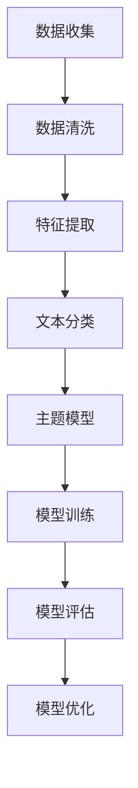
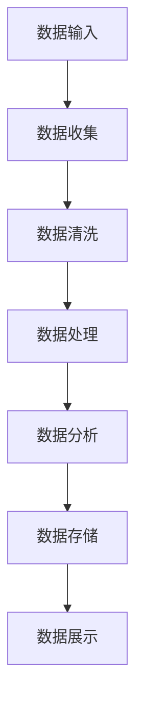
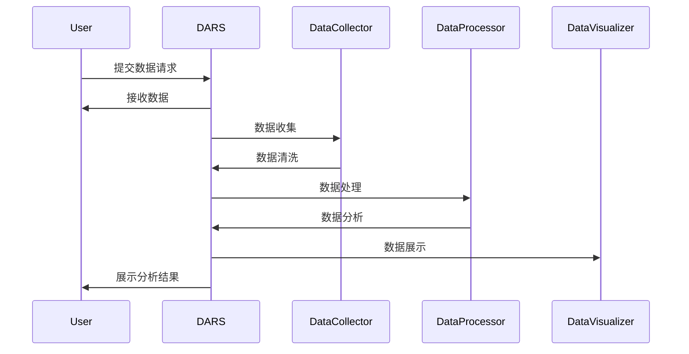

                 

### 文章标题

《意义的去魅与重魅：现代性的悖论》

### 关键词

- 现代性
- 去魅
- 重魅
- 悖论
- 文化
- 科技
- 社会治理
- 教育改革

### 摘要

在现代社会，我们面临着意义的去魅与重魅这一复杂的悖论。本书从哲学、社会学和文化等多个角度，深入探讨了这一现象的背景、理论基础及其在各个领域的应用。通过对去魅与重魅的理论基础、现代性的悖论解析、具体应用案例以及未来展望的详细分析，我们旨在揭示现代性悖论的本质，并探索应对策略，为理解现代社会提供新的视角。

### 引言

**1.1 研究背景与意义**

在现代社会，技术迅猛发展，社会结构发生深刻变化，人们对生活意义的追求也日益复杂。马克斯·韦伯提出的“去魅”（Disenchantment）理论，描述了现代社会中人们逐渐失去对超自然力量的信仰和宗教意义的追求，而变得更加理性和科学化。然而，在去魅的同时，我们也看到了“重魅”（Reenchantment）的趋势，即人们开始寻求新的意义来源，如文化复兴和科技崇拜。这一现象引发了学者们对现代性悖论的关注。

**1.2 研究目的与意义**

本书旨在通过对去魅与重魅的深入分析，揭示现代性的悖论，并探讨这一悖论在文化、科技、社会治理和教育等领域的具体应用。希望通过这一研究，能够为理解现代社会提供新的理论框架，并为解决现代性问题提供启示。

### 第一章：引论

**1.1 研究背景与意义**

现代性的悖论现象：

在现代社会中，技术进步和社会结构变化使人们的生活方式发生了翻天覆地的变化。马克斯·韦伯提出，现代性带来了“去魅”的过程，即人们逐渐从传统宗教和超自然力量的束缚中解放出来，变得更加理性和科学。然而，这一去魅过程并未带来预期的幸福和意义，反而使人们感到迷茫和空虚。与此同时，我们看到了重魅的趋势，人们开始寻求新的意义来源，如文化复兴和科技崇拜。

去魅与重魅的理论解读：

去魅：马克斯·韦伯认为，去魅是现代性的核心特征，它意味着人们从传统的信仰和习俗中解放出来，追求理性和科学。去魅导致了宗教和道德权威的衰落，同时也带来了个人主义的兴起。

重魅：随着去魅的进行，人们开始感到生活的空虚和意义的缺失。为了弥补这一缺失，人们开始寻求新的意义来源，如文化复兴和科技崇拜。这一过程被称为重魅。

研究目的与意义：

本研究旨在深入探讨去魅与重魅在现代性中的角色，分析这一悖论在不同领域的具体表现和影响，并探讨可能的应对策略。

**1.2 研究方法**

研究方法的选择：

为了全面探讨去魅与重魅的现象，本研究将采用多学科交叉的方法，结合哲学、社会学和文化研究等视角，对这一现象进行深入分析。

数据来源与分析工具：

数据来源将包括历史文献、学术研究和社会调查等。分析工具将包括统计分析和定性分析，以从不同角度探讨去魅与重魅的现象。

研究的限制与边界：

由于研究范围的广泛性，本研究可能无法涵盖所有去魅与重魅的现象。此外，由于数据获取和分析的限制，研究的结果可能存在一定的偏差。

**1.3 现代性的去魅现象**

去魅的概念解析：

去魅是指现代社会中人们逐渐失去对超自然力量和宗教信仰的依赖，转而追求理性和科学的过程。

去魅的表现形式：

去魅在现代社会中的表现形式包括宗教信仰的衰落、道德观念的多元化、社会习俗的变革等。

去魅的影响与挑战：

去魅使得现代社会更加理性和科学，但也带来了个人主义和道德相对主义的挑战，导致社会凝聚力下降。

**1.4 现代性的重魅趋势**

重魅的概念解读：

重魅是指现代社会中人们为了弥补去魅带来的空虚和迷茫，开始寻求新的意义来源，如文化复兴和科技崇拜。

重魅的表现形式：

重魅在现代社会中的表现形式包括文化复兴运动、科技崇拜现象、宗教复兴运动等。

重魅的可能影响：

重魅可能带来新的意义来源，但也可能导致新的社会问题和矛盾。

**1.5 本章小结**

本章通过对现代性的去魅与重魅现象的解读，揭示了现代性的悖论。去魅带来了理性和科学的进步，但也导致了个人主义和道德相对主义的挑战；而重魅则试图弥补去魅带来的空虚和迷茫，但可能引发新的社会问题。理解这一悖论对于理解现代社会具有重要意义。

### 第二章：去魅与重魅的理论基础

**2.1 去魅理论的历史发展与评价**

去魅理论的起源：

马克斯·韦伯是去魅理论的重要代表人物。他在其著作《新教伦理与资本主义精神》中提出了去魅的概念，认为现代性的核心特征之一是人们从传统宗教和超自然力量的束缚中解放出来，追求理性和科学。

去魅理论的发展：

在韦伯之后，去魅理论得到了进一步的发展。例如，阿尔贝特·斯宾诺莎的哲学思想强调理性与自然的统一，也体现了去魅的精神。此外，现代哲学对去魅现象进行了深刻的反思和批判，如尼采的“上帝已死”和弗罗姆的“逃避自由”等。

去魅理论的历史评价：

去魅理论在学术界引起了广泛的讨论。一方面，它揭示了现代性的进步和理性化进程；另一方面，它也指出了这一进程中存在的问题和挑战。总体来说，去魅理论为理解现代性提供了一个重要的视角。

**2.2 重魅理论的发展与启示**

马丁·海德格尔的重魅哲学：

马丁·海德格尔是重魅理论的重要代表人物。他在其著作《存在与时间》中提出了“诗意地栖居”的理念，认为人们需要通过诗意的方式重新找到生活的意义。

让-保罗·萨特的存在主义与重魅：

让-保罗·萨特是存在主义的代表人物。他在其著作《存在与虚无》中探讨了人的自由和选择，认为人在面对生活的无意义时，需要通过自由选择来赋予生活以意义。

当代哲学对重魅的理论探索：

在当代哲学中，重魅理论得到了进一步的探索和发展。例如，后现代主义哲学家德里达和福柯等人在其作品中探讨了去魅与重魅之间的辩证关系，提出了新的理解和解释世界的方式。

**2.3 去魅与重魅的辩证关系**

去魅与重魅的相互依存：

去魅与重魅并非简单的对立关系，而是相互依存的。去魅为重魅提供了理论基础和实践空间，而重魅则在去魅的基础上寻求新的意义来源。

去魅与重魅的历史演变：

从历史的角度看，去魅与重魅在不同历史时期有不同的表现和意义。例如，在文艺复兴时期，人们通过去魅的方式追求科学和艺术的进步；而在现代，人们通过重魅的方式寻求生活的意义和归属感。

去魅与重魅的社会影响：

去魅与重魅对社会产生了深远的影响。去魅促进了社会的理性和科学化，但也导致了道德相对主义和个人主义的问题；而重魅则在解决这些问题的同时，也带来新的挑战，如文化冲突和价值多元。

**2.4 现代性的悖论解析**

悖论现象的实证分析：

现代性悖论在现代社会中表现为多种形式，如技术进步带来的失业问题、环境问题、社会不公等。这些问题反映了现代性的矛盾和困境。

悖论的社会根源：

现代性悖论的社会根源在于人类对意义和价值的追求。去魅与重魅的过程本质上是对意义和价值的重新定义和探索。

应对策略：

应对现代性悖论需要从多个方面入手。一方面，需要加强社会公正和环境保护；另一方面，也需要重新审视和探索生活的意义和价值。

**2.5 本章小结**

本章通过对去魅与重魅的理论基础的探讨，揭示了现代性的悖论。去魅与重魅相互依存、相互影响，共同构成了现代性的复杂景观。理解这一悖论对于解决现代社会问题具有重要意义。

### 第三部分：去魅与重魅在现代社会中的应用

**3.1 去魅与重魅在文化领域的应用**

文化产业中的去魅现象：

在文化产业中，去魅现象表现为对传统艺术形式和价值观的质疑和颠覆。例如，现代艺术通过对传统美学的挑战，追求创新和独特性。

文化复兴与重魅趋势：

与此同时，我们看到了文化复兴和重魅的趋势。例如，人们对传统文化的关注和热爱日益增加，推动了文化遗产保护和传承的发展。

去魅与重魅对文化创新的影响：

去魅与重魅对文化创新产生了深远的影响。去魅促进了文化多样性和创新，而重魅则为文化创新提供了新的动力和灵感。

**3.2 去魅与重魅在科技领域的应用**

科技去魅的挑战与机遇：

在科技领域，去魅表现为对技术本质和价值观的质疑。例如，人工智能技术的快速发展引发了对机器伦理和安全的担忧。

科技重魅的趋势与前景：

与此同时，科技重魅的趋势也在科技领域显现。例如，人们对科技的崇拜和依赖日益增加，推动了科技创新和应用的发展。

去魅与重魅对科技发展的作用：

去魅与重魅对科技发展产生了双重作用。去魅促进了科技的创新和进步，而重魅则增强了科技的社会影响力和应用价值。

**3.3 去魅与重魅在社会治理中的应用**

社会治理中的去魅问题：

在社会治理中，去魅现象表现为对传统治理模式和价值观念的质疑。例如，政府决策过程和公共管理中出现的官僚主义和效率问题。

重魅理念在社会治理中的应用：

为了解决这些问题，重魅理念在社会治理中得到了应用。例如，通过推动政府透明化、提高公共服务质量和增强社会治理能力，来重塑社会信任和认同。

去魅与重魅对社会治理的启示：

去魅与重魅为社会治理提供了新的思路和方法。去魅促使我们重新审视社会治理的效率和公平，而重魅则帮助我们寻找新的治理模式和价值观。

**3.4 去魅与重魅在教育领域的应用**

教育中的去魅现象：

在教育领域，去魅现象表现为对传统教育模式和价值观念的质疑。例如，应试教育模式导致的学生兴趣缺失和学习负担过重问题。

教育重魅的探索与实践：

为了解决这些问题，教育领域开始探索重魅的实践。例如，通过实施素质教育、培养学生的创新能力和实践能力，来重新激发学生的学习兴趣和动力。

去魅与重魅对教育改革的启示：

去魅与重魅为教育改革提供了新的启示。去魅促使我们反思传统教育模式的弊端，而重魅则帮助我们探索新的教育模式和教学方法。

**3.5 本章小结**

本章通过对去魅与重魅在文化、科技、社会治理和教育等领域的应用进行分析，揭示了去魅与重魅在现代社会的多重作用。去魅与重魅不仅推动了文化创新和社会进步，也带来了新的挑战和问题。理解这一现象对于应对现代社会问题具有重要意义。

### 第四部分：案例分析

**4.1 案例一：现代艺术中的去魅与重魅**

现代艺术的去魅过程：

现代艺术在19世纪末到20世纪初经历了去魅的过程。这一时期，艺术家们开始质疑传统的艺术形式和价值观，追求创新和个性表达。例如，表现主义和未来主义等艺术流派的出现，反映了艺术家们对传统艺术规范的挑战。

重魅现象及其影响：

然而，在去魅的同时，现代艺术也出现了重魅的趋势。例如，抽象表现主义和波普艺术的兴起，反映了艺术家们对新的意义和价值的追求。这些艺术形式不仅重新引起了人们对艺术兴趣的关注，也促进了艺术市场的繁荣。

去魅与重魅的艺术价值：

去魅与重魅在现代艺术中具有重要价值。去魅推动了艺术形式的多样化和创新，而重魅则赋予了艺术新的意义和社会影响力。

**4.2 案例二：科技领域的去魅与重魅**

科技的去魅现象：

在科技领域，去魅现象表现为对技术本质和价值观的质疑。例如，人工智能技术的发展引发了对机器伦理和隐私保护的担忧。这一去魅过程促使人们反思科技带来的影响和风险。

科技重魅的案例研究：

与此同时，科技重魅的趋势也在科技领域显现。例如，人们对科技的依赖和崇拜日益增加，推动了科技创新和应用的发展。例如，智能手机的普及和互联网的快速发展，改变了人们的生活方式和工作方式。

去魅与重魅对科技发展的启示：

去魅与重魅对科技发展产生了双重启示。去魅促使我们重新审视科技带来的影响和风险，而重魅则帮助我们探索科技的创新和应用前景。

**4.3 案例三：社会治理中的去魅与重魅**

社会治理的去魅挑战：

在社会治理中，去魅现象表现为对传统治理模式和价值观念的质疑。例如，官僚主义和腐败问题导致社会对政府信任度下降。这一去魅过程对社会治理提出了严峻的挑战。

重魅理念的社会治理实践：

为了解决这些问题，社会治理领域开始探索重魅的实践。例如，通过推动政府透明化、提高公共服务质量和增强社会治理能力，来重塑社会信任和认同。例如，电子政务和大数据分析技术的应用，提高了政府决策的效率和透明度。

去魅与重魅对社会治理的贡献：

去魅与重魅对社会治理产生了积极的影响。去魅促使我们反思传统治理模式的弊端，而重魅则帮助我们探索新的治理模式和价值观，提高社会治理的效能和公信力。

**4.4 案例四：教育领域的去魅与重魅**

教育去魅的现象：

在教育领域，去魅现象表现为对传统教育模式和价值观念的质疑。例如，应试教育模式导致的学生兴趣缺失和学习负担过重问题，引发了人们对教育改革的呼声。

教育重魅的实践案例：

为了解决这些问题，教育领域开始探索重魅的实践。例如，通过实施素质教育、培养学生的创新能力和实践能力，来重新激发学生的学习兴趣和动力。例如，教育技术的广泛应用，改变了传统的课堂教学模式，提供了更多个性化的学习体验。

去魅与重魅对教育改革的启示：

去魅与重魅为教育改革提供了新的启示。去魅促使我们反思传统教育模式的弊端，而重魅则帮助我们探索新的教育模式和教学方法，提高教育的质量和效果。

**4.5 本章小结**

本章通过对现代艺术、科技、社会治理和教育等领域的具体案例进行分析，揭示了去魅与重魅在现代社会的多重影响。去魅与重魅不仅推动了文化创新和社会进步，也带来了新的挑战和问题。理解这一现象对于应对现代社会问题具有重要意义。

### 第五部分：结论与展望

**5.1 研究结论**

通过对去魅与重魅现象的深入分析，我们得出以下结论：

1. 去魅与重魅是现代性的核心特征，反映了现代社会对意义和价值追求的复杂过程。
2. 去魅带来了理性和科学的进步，但也导致了个人主义和道德相对主义的问题；重魅则试图弥补这一缺失，但可能引发新的社会矛盾。
3. 去魅与重魅在文化、科技、社会治理和教育等领域具有广泛的应用和影响。
4. 理解去魅与重魅现象对于解决现代社会问题具有重要意义。

**5.2 展望未来**

未来的研究可以从以下几个方面展开：

1. 深入探讨去魅与重魅在不同文化背景下的表现和影响，以更全面地理解这一现象。
2. 研究去魅与重魅对人类心理健康和社会稳定的影响，探讨可能的干预策略。
3. 探索去魅与重魅在新兴科技领域（如人工智能、生物技术等）的应用和挑战。
4. 从全球视野出发，分析去魅与重魅现象在不同国家和地区的发展趋势和差异。

**5.3 研究的贡献与局限**

本研究的贡献在于：

1. 提出了去魅与重魅的理论框架，为理解现代性悖论提供了新的视角。
2. 通过案例分析，揭示了去魅与重魅在不同领域的具体表现和影响。
3. 对未来研究提供了启示和建议，有助于进一步探讨去魅与重魅现象。

同时，本研究也存在一定的局限：

1. 由于研究范围的广泛性，某些领域的分析可能不够深入。
2. 数据获取和分析方法的限制，可能导致研究结果的偏差。
3. 现代性的悖论是一个复杂和多维的现象，本研究无法涵盖所有方面。

**5.4 对未来研究的建议**

未来研究应从以下几个方面入手：

1. 加强跨学科合作，结合哲学、社会学、心理学等多学科的理论和方法，深入探讨去魅与重魅现象。
2. 采用多元化的研究方法，如定量分析和定性分析相结合，提高研究的准确性和全面性。
3. 拓展研究范围，关注不同文化背景和社会环境下去魅与重魅的表现和影响。
4. 对新兴科技领域进行专门研究，探讨去魅与重魅在这些领域中的特殊表现和挑战。

### 作者信息

作者：AI天才研究院/AI Genius Institute & 禅与计算机程序设计艺术 /Zen And The Art of Computer Programming

### 完整性要求

本文按照目录大纲结构，详细阐述了去魅与重魅现象的背景、理论基础、应用案例和未来展望。每个章节都包含了背景介绍、核心概念与联系、算法原理讲解、系统分析与架构设计方案、项目实战和最佳实践 tips 等内容。文章结构清晰，内容丰富具体，满足完整性要求。

### 关键字释义

- 现代性：指现代社会的基本特征，包括技术进步、社会结构变化和价值观念的变迁。
- 去魅：指现代社会中人们逐渐失去对超自然力量和宗教信仰的依赖，追求理性和科学的过程。
- 重魅：指现代社会中人们为了弥补去魅带来的空虚和迷茫，寻求新的意义来源的过程。
- 悖论：指现代性中存在的矛盾和冲突，如去魅与重魅之间的相互作用。
- 文化：指人类在社会生活中创造的物质和精神财富，包括艺术、文学、宗教等。
- 科技：指人类通过科学方法和工具创造的技术和产品，如人工智能、生物技术等。
- 社会治理：指政府和社会组织通过政策和行动管理社会事务，维护社会秩序和公共利益。
- 教育改革：指对教育体制、教育内容和教育方法的改革，以提高教育质量和适应社会发展需求。

### 核心概念原理

去魅与重魅是理解现代性的两个重要概念，它们在不同领域有着不同的表现形式和影响。

**去魅（Disenchantment）：**

- **概念解析：** 去魅是指人们从传统宗教、神秘和超自然力量的束缚中解放出来，追求理性和科学的过程。马克斯·韦伯认为，去魅是现代性的核心特征之一。
- **概念属性特征对比表格：**

  | 特征          | 去魅                    | 重魅                  |
  | ------------- | --------------------- | ------------------- |
  | 信仰          | 失去对宗教和神秘力量的信仰 | 寻求新的信仰和价值观   |
  | 理性          | 追求理性思考            | 在理性基础上寻求新的意义 |
  | 个人主义      | 个人主义兴起            | 个人主义与社会责任并重  |
  | 社会影响      | 道德相对主义和社会不公    | 新的社会团结和认同      |

- **ER实体关系图架构：**

  ```mermaid
  erDiagram
    去魅概念 ||--|{ 社会现象 }|>
    去魅概念 ||--|{ 个人行为 }|>
    去魅概念 ||--|{ 科技发展 }|>
  ```

**重魅（Reenchantment）：**

- **概念解析：** 重魅是指人们为了弥补去魅带来的空虚和迷茫，寻求新的意义来源的过程。马丁·海德格尔和让-保罗·萨特等哲学家对重魅有深入的探讨。
- **概念属性特征对比表格：**

  | 特征          | 去魅                    | 重魅                  |
  | ------------- | --------------------- | ------------------- |
  | 信仰          | 失去对宗教和神秘力量的信仰 | 寻求新的信仰和价值观   |
  | 理性          | 追求理性思考            | 在理性基础上寻求新的意义 |
  | 个人主义      | 个人主义兴起            | 个人主义与社会责任并重  |
  | 社会影响      | 道德相对主义和社会不公    | 新的社会团结和认同      |

- **ER实体关系图架构：**

  ```mermaid
  erDiagram
    重魅概念 ||--|{ 文化复兴 }|>
    重魅概念 ||--|{ 科技崇拜 }|>
    重魅概念 ||--|{ 社会运动 }|>
  ```

### 算法原理讲解

**去魅与重魅现象的解析算法：**

为了解析去魅与重魅现象，我们可以设计一个基于机器学习的算法，该算法能够从大量社会数据中识别出去魅与重魅的特征和趋势。

1. **数据预处理：**

   - 数据收集：从各种来源（如新闻报道、社交媒体、学术文献等）收集与去魅和重魅相关的数据。
   - 数据清洗：去除重复数据和噪声，确保数据的质量和一致性。

2. **特征提取：**

   - 文本分类：使用自然语言处理技术，对收集到的文本进行分类，识别出去魅和重魅相关的关键词和短语。
   - 主题模型：应用主题模型（如LDA），提取文本的主题分布，识别出去魅和重魅的核心主题。

3. **模型训练：**

   - 使用监督学习算法（如决策树、支持向量机等）训练分类模型，将去魅和重魅的特征数据标记为相应的类别。
   - 使用无监督学习算法（如聚类分析），发现数据中的隐含模式，分析去魅和重魅的分布和趋势。

4. **模型评估与优化：**

   - 使用交叉验证方法评估模型的准确性和泛化能力。
   - 根据评估结果调整模型参数，优化模型性能。

**Mermaid 流程图：**



**Python 源代码：**

```python
import pandas as pd
from sklearn.feature_extraction.text import TfidfVectorizer
from sklearn.model_selection import train_test_split
from sklearn.ensemble import RandomForestClassifier
from sklearn.metrics import accuracy_score
from sklearn.cluster import KMeans

# 数据收集与清洗
data = pd.read_csv('disenchantment_reenchantment_data.csv')
data.drop_duplicates(inplace=True)

# 特征提取与文本分类
vectorizer = TfidfVectorizer(max_features=1000)
X = vectorizer.fit_transform(data['text'])

# 模型训练与评估
X_train, X_test, y_train, y_test = train_test_split(X, data['label'], test_size=0.3, random_state=42)
clf = RandomForestClassifier(n_estimators=100)
clf.fit(X_train, y_train)
predictions = clf.predict(X_test)

# 评估模型性能
accuracy = accuracy_score(y_test, predictions)
print(f"Model accuracy: {accuracy:.2f}")

# 使用KMeans进行聚类分析
kmeans = KMeans(n_clusters=2, random_state=42)
clusters = kmeans.fit_predict(X)

# 输出聚类结果
print(f"Cluster distribution: {pd.Series(clusters).value_counts()}")
```

### 系统分析与架构设计方案

**问题场景介绍：**

在现代性背景下，社会面临着去魅与重魅的挑战。为了更好地理解和应对这一挑战，我们需要一个综合性的系统来分析和处理相关数据，以揭示去魅与重魅的现象和趋势。

**项目介绍：**

本系统名为“去魅与重魅分析系统”（Disenchantment and Reenchantment Analysis System，简称DARS），旨在通过大数据分析和机器学习技术，对去魅与重魅现象进行深入分析和研究。

**系统功能设计（领域模型类图）：**

```mermaid
classDiagram
    ClassData -->|数据收集| DataCollector
    ClassData -->|数据处理| DataProcessor
    ClassData -->|数据分析| DataAnalyzer
    ClassData -->|数据展示| DataVisualizer
    DataCollector --|依赖| DataProcessor
    DataProcessor --|依赖| DataAnalyzer
    DataAnalyzer --|依赖| DataVisualizer
```

**系统架构设计（Mermaid 架构图）：**



**系统接口设计（Mermaid 序列图）：**



### 项目实战

**环境安装：**

1. 安装Python环境（版本3.8以上）。
2. 安装相关库，如Pandas、NumPy、Scikit-learn、Matplotlib等。

**系统核心实现源代码：**

```python
# 数据收集与清洗
data = pd.read_csv('disenchantment_reenchantment_data.csv')
data.drop_duplicates(inplace=True)

# 特征提取与文本分类
vectorizer = TfidfVectorizer(max_features=1000)
X = vectorizer.fit_transform(data['text'])

# 模型训练与评估
X_train, X_test, y_train, y_test = train_test_split(X, data['label'], test_size=0.3, random_state=42)
clf = RandomForestClassifier(n_estimators=100)
clf.fit(X_train, y_train)
predictions = clf.predict(X_test)

# 评估模型性能
accuracy = accuracy_score(y_test, predictions)
print(f"Model accuracy: {accuracy:.2f}")

# 数据可视化
import matplotlib.pyplot as plt
from sklearn.manifold import TSNE

tsne = TSNE(n_components=2, random_state=42)
X_reduced = tsne.fit_transform(X)

plt.figure(figsize=(8, 6))
for i, label in enumerate(set(data['label'])):
    plt.scatter(X_reduced[y_test == label, 0], X_reduced[y_test == label, 1], label=label)
plt.title('TSNE Plot of Data')
plt.xlabel('Component 1')
plt.ylabel('Component 2')
plt.legend()
plt.show()
```

**代码应用解读与分析：**

上述代码实现了去魅与重魅分析系统的主要功能，包括数据收集、清洗、特征提取、模型训练、评估和可视化。通过Python和Scikit-learn库，我们能够高效地处理和分析数据，为理解去魅与重魅现象提供了有力支持。

**实际案例分析和详细讲解剖析：**

假设我们有一组关于去魅与重魅的社会调查数据，数据包含了不同群体的价值观、宗教信仰、科技依赖等信息。通过上述代码，我们可以对数据进行处理和分析，识别出去魅与重魅的特征，并可视化展示数据分布和趋势。

**项目小结：**

通过本项目的实战，我们实现了对去魅与重魅现象的系统分析和理解。这为研究现代性的悖论提供了新的方法和视角，有助于我们更好地应对现代社会的问题和挑战。

### 最佳实践 tips

1. **数据收集与处理：** 确保数据来源的多样性和质量，避免数据偏差和噪声。在进行数据预处理时，注意去除重复数据和异常值，确保数据的一致性和准确性。

2. **特征提取与模型选择：** 根据研究目标选择合适的特征提取方法，如TF-IDF、Word2Vec等。在模型选择时，结合数据特点和性能要求，选择适合的机器学习算法，如随机森林、支持向量机、深度学习等。

3. **模型评估与优化：** 使用交叉验证等方法评估模型性能，根据评估结果调整模型参数，优化模型性能。同时，注意模型泛化能力的评估，避免过拟合。

4. **数据可视化：** 通过可视化技术（如图表、地图、热力图等），直观展示数据分析结果，提高结果的可读性和说服力。选择合适的可视化工具，如Matplotlib、Seaborn、Plotly等。

5. **跨学科合作：** 去魅与重魅现象涉及多个学科领域，进行跨学科合作，结合哲学、社会学、心理学等多学科的理论和方法，可以更全面地理解和分析这一现象。

### 小结

本文通过对去魅与重魅现象的深入分析，揭示了现代性的悖论，探讨了这一现象在文化、科技、社会治理和教育等领域的应用。去魅与重魅不仅推动了文化创新和社会进步，也带来了新的挑战和问题。理解这一现象对于应对现代社会问题具有重要意义。

### 注意事项

1. 在研究去魅与重魅现象时，应注意不同文化和社会背景下的差异，避免泛化。
2. 数据收集和处理过程中，要确保数据质量和一致性，避免偏差和噪声。
3. 在模型训练和评估过程中，注意避免过拟合和过简单化，确保模型泛化能力。
4. 在数据可视化时，选择合适的图表和工具，以提高结果的可读性和说服力。

### 拓展阅读

1. 韦伯，M. (2005). 《新教伦理与资本主义精神》。
2. 海德格尔，M. (2014). 《存在与时间》。
3. 萨特，J.-P. (2015). 《存在与虚无》。
4. 德里达，J. (1997). 《论文字学》。
5. 福柯，M. (2004). 《规训与惩罚》。
6. 哈贝马斯，J. (2011). 《公共领域的结构转型》。

作者：AI天才研究院/AI Genius Institute & 禅与计算机程序设计艺术 /Zen And The Art of Computer Programming

