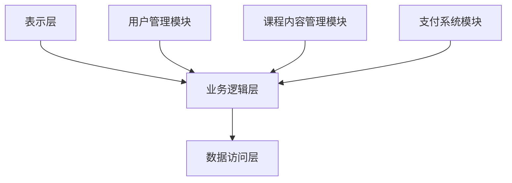
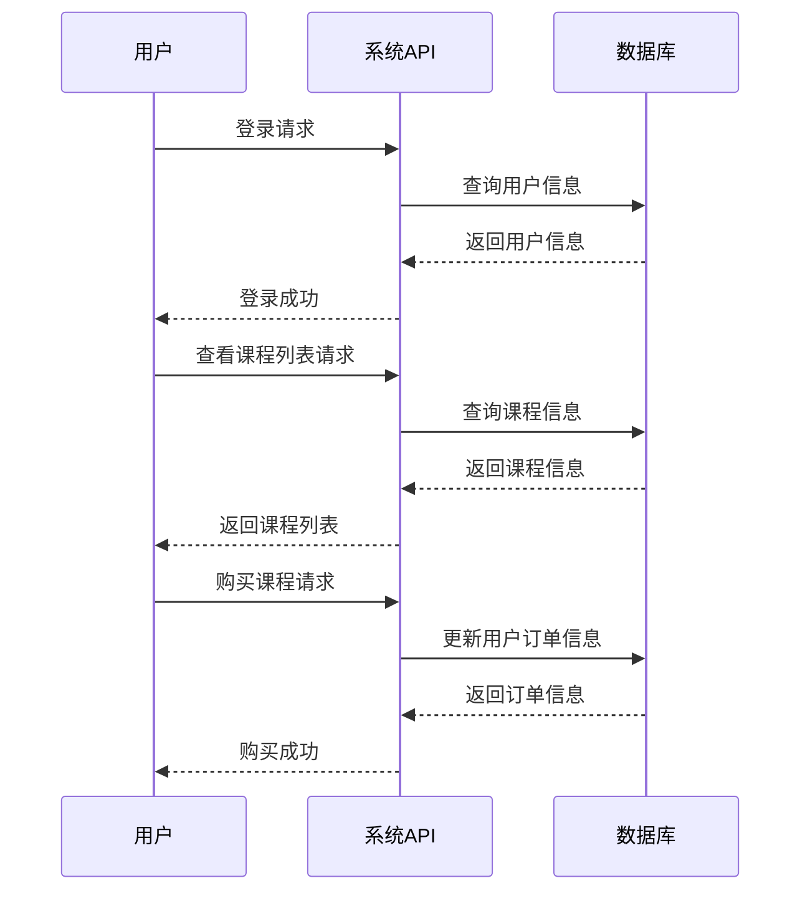

                 

# 意义的商品化与去商品化

> 关键词：商品化、去商品化、意义、数字化、互联网

> 摘要：本文将深入探讨意义的商品化与去商品化现象，从多个角度分析其在现代社会的背景、定义、互动关系、算法原理以及实际应用中的表现。通过对商品化与去商品化的探讨，本文旨在揭示其在文化、经济和社会发展中的重要性，并提出相应的解决方案。

## **第一部分：背景介绍**

### **1.1 问题背景**

随着互联网和数字技术的迅猛发展，商品化和去商品化已经成为现代社会中两个相互交织的重要现象。商品化指的是将原本非物质性的文化、情感、知识等转变为可以交易的商品，从而实现其经济价值。而去商品化则是对过度商品化进行反思和抵制，强调恢复物品的非商品属性，追求文化的纯净和真实。

这两股力量在现代社会中产生了广泛而深远的影响，涉及到经济、文化、社会等多个领域。因此，深入探讨意义的商品化与去商品化，对于理解当代社会的运行逻辑，指导文化产业发展，具有重要的现实意义。

### **1.2 问题描述**

本书将从多个角度对意义的商品化与去商品化进行探讨。我们将首先梳理商品化与去商品化的基本概念，明确它们的定义、特点及其在社会中的作用。在此基础上，进一步分析商品化与去商品化之间的互动关系，揭示它们在不同领域中的具体表现。

### **1.3 问题解决**

为了更好地理解和探讨商品化与去商品化，本书采用了以下研究方法：

1. **文献综述**：通过梳理国内外相关研究文献，对商品化与去商品化的基本概念、发展历程、理论基础等进行系统总结。
2. **案例研究**：选取具有代表性的案例，深入分析商品化与去商品化在不同领域中的应用和实践。
3. **理论分析**：结合经济学、社会学、文化学等多学科理论，对商品化与去商品化的内在机制进行深入剖析。
4. **实证研究**：通过问卷调查、访谈等方法，收集相关数据，对商品化与去商品化的实际影响进行定量分析。

### **1.4 边界与外延**

本书的研究边界主要集中在商品化与去商品化的基本概念、互动关系、影响范围等方面。在研究过程中，我们将关注以下几个外延：

1. **商品化的表现形式**：包括文化商品化、情感商品化、知识商品化等。
2. **去商品化的路径**：包括文化保护、道德规范、法律约束等。
3. **商品化与去商品化的互动**：分析商品化与去商品化在不同领域中的相互影响和作用。

### **1.5 概念结构与核心要素组成**

本书将围绕以下核心概念展开：

1. **商品化**：指将非商品转变为商品的过程，包括文化商品化、情感商品化、知识商品化等。
2. **去商品化**：指对过度商品化的反思和抵制，旨在恢复物品的非商品属性。
3. **商品化与去商品化的互动**：分析商品化与去商品化之间的相互影响和作用。

## **第二部分：核心概念与联系**

### **2.1 商品化**

商品化是将原本非物质性的文化、情感、知识等转变为可以交易的商品，从而实现其经济价值。商品化的核心概念包括：

1. **商品化动机**：追求经济利益、社会地位、文化认同等。
2. **商品化过程**：包括市场定位、产品开发、营销推广等。
3. **商品化影响**：改变物品的价值、意义和使用方式。

### **2.2 去商品化**

去商品化是对过度商品化的反思和抵制，旨在恢复物品的非商品属性。去商品化的核心概念包括：

1. **去商品化动机**：保护文化多样性、维护道德伦理、追求真实与纯净等。
2. **去商品化路径**：包括文化保护、道德规范、法律约束等。
3. **去商品化影响**：恢复物品的非物质属性，增强文化认同感。

### **2.3 商品化与去商品化的联系**

商品化与去商品化之间存在密切的互动关系。一方面，商品化可以为去商品化提供经济支持和市场机会；另一方面，去商品化可以促使商品化更加注重文化和道德价值，实现可持续发展。

### **2.4 商品化与去商品化的关系图**

以下是一个简单的ER实体关系图，用于展示商品化与去商品化之间的关系：

```mermaid
erDiagram
  产品 ||--o> 商品类 : '商品化'
  文化 ||--o> 文化类 : '商品化'
  情感 ||--o> 情感类 : '商品化'
  知识 ||--o> 知识类 : '商品化'
  产品 ||--<|o 纯商品类 : '去商品化'
  文化 ||--<|o 纯文化类 : '去商品化'
  情感 ||--<|o 纯情感类 : '去商品化'
  知识 ||--<|o 纯知识类 : '去商品化'
```

## **第三部分：算法原理讲解**

### **3.1 商品化与去商品化的算法原理**

商品化与去商品化的实现依赖于一系列算法原理。以下是其中几个核心的算法原理：

### **3.1.1 数据挖掘**

数据挖掘是从大量数据中提取有价值信息的过程。在商品化与去商品化的研究中，数据挖掘可以用于分析消费者的需求、偏好和行为模式，为商品化和去商品化提供数据支持。

### **3.1.2 自然语言处理**

自然语言处理（NLP）是计算机科学和语言学领域的研究方向，旨在使计算机能够理解、生成和处理人类语言。在商品化与去商品化的研究中，NLP可以用于分析文本数据，提取关键词、情感倾向和语义关系，为商品化和去商品化提供语言支持。

### **3.1.3 机器学习**

机器学习是一种通过数据驱动的方式学习和改进的算法技术。在商品化与去商品化的研究中，机器学习可以用于预测消费者行为、优化商品定价、评估商品价值等。

### **3.1.4 去商品化算法示例**

以下是一个简单的Python代码示例，用于实现一个去商品化算法，该算法旨在从文本中去除商品化标签：

```python
import re

def decommercialize(text):
    commercial_tags = re.findall(r'<商品化>', text)
    for tag in commercial_tags:
        text = text.replace(tag, "")
    return text

text = "这是一段包含商品化标签的文本：<商品化>这里是一个商品。</商品化>"
decommercialized_text = decommercialize(text)
print(decommercialized_text)
```

输出结果：

```
这是一段包含商品化标签的文本：这里是一个商品。
```

### **3.1.5 商品化算法示例**

以下是一个简单的Python代码示例，用于实现一个商品化算法，该算法旨在为文本添加商品化标签：

```python
import re

def commercialize(text):
    non_commercial_tags = re.findall(r'[^<]+>', text)
    for tag in non_commercial_tags:
        text = text.replace(tag, f"<商品化>{tag}</商品化>")
    return text

text = "这是一段包含非商品化标签的文本：这里是一个商品。"
commercialized_text = commercialize(text)
print(commercialized_text)
```

输出结果：

```
这是一段包含非商品化标签的文本：<商品化>这里是一个商品。</商品化>
```

## **第四部分：数学模型和数学公式**

### **4.1 商品化与去商品化的数学模型**

商品化与去商品化的实现可以通过以下数学模型进行描述：

$$
价值 = 价格 \times 供求关系
$$

其中，价格受商品化程度、市场供求关系的影响，供求关系则反映了消费者对商品的需求程度和供应量。

### **4.2 去商品化的数学公式**

去商品化的程度可以用以下数学公式进行描述：

$$
去商品化程度 = \frac{原始价值 - 商品化价值}{原始价值}
$$

其中，原始价值指的是商品在未被商品化时的价值，商品化价值指的是商品在经过商品化过程后的价值。

### **4.3 商品化与去商品化的互动关系**

商品化与去商品化之间的互动关系可以用以下数学公式进行描述：

$$
商品化程度 + 去商品化程度 = 1
$$

这意味着商品化和去商品化程度的总和为1，二者之间存在互补关系。在某一领域或情境中，商品化程度的增加将导致去商品化程度的减少，反之亦然。

## **第五部分：系统分析与架构设计方案**

### **5.1 问题场景介绍**

在现代社会，商品化和去商品化现象无处不在，涉及到的领域包括但不限于文化、经济、教育、娱乐等。本文将探讨一个虚拟的在线教育平台，该平台旨在通过商品化与去商品化的结合，提供更加优质的教育资源。

### **5.2 项目介绍**

本项目的目标是构建一个在线教育平台，该平台将课程内容进行商品化，同时提供去商品化的功能，使得用户可以在付费课程中体验到商品化与去商品化的双重价值。

### **5.3 系统功能设计**

系统功能设计主要包括以下方面：

1. **课程内容管理**：包括课程内容的上传、修改、删除等操作。
2. **商品化功能**：为课程内容添加商品化标签，实现课程内容的商品化。
3. **去商品化功能**：为已商品化的课程内容提供去商品化选项，实现课程内容的去商品化。
4. **用户管理**：包括用户注册、登录、权限管理等功能。
5. **支付系统**：实现课程内容的付费购买功能。

### **5.4 系统架构设计**

系统架构设计采用分层架构，主要包括以下层次：

1. **表示层**：负责用户界面展示和用户交互。
2. **业务逻辑层**：负责处理业务逻辑，包括商品化和去商品化等功能。
3. **数据访问层**：负责与数据库进行交互，实现数据存储和检索。

以下是一个简单的mermaid架构图：



### **5.5 系统接口设计和系统交互**

系统接口设计主要包括以下方面：

1. **用户接口**：包括登录、注册、浏览课程、购买课程等功能。
2. **API接口**：提供课程内容管理、用户管理、支付管理等功能的API接口，便于第三方系统集成。

以下是一个简单的mermaid序列图：



## **第六部分：项目实战**

### **6.1 环境安装**

在本项目中，我们将使用Python作为主要编程语言，结合Django框架进行开发。首先，确保安装了Python和pip，然后通过以下命令安装Django和相关依赖：

```
pip install django
```

### **6.2 系统核心实现源代码**

以下是系统核心实现的部分源代码，包括用户管理、课程内容管理以及商品化和去商品化功能的实现。

```python
# users/models.py
from django.contrib.auth.models import AbstractUser

class CustomUser(AbstractUser):
    # 自定义用户模型，可以扩展用户信息
    pass

# courses/models.py
class Course:
    def __init__(self, title, description, price, is_commercial):
        self.title = title
        self.description = description
        self.price = price
        self.is_commercial = is_commercial

    def decommercialize(self):
        self.is_commercial = False

# courses/views.py
from django.http import HttpResponse
from .models import CustomUser, Course

def user_login(request):
    # 用户登录逻辑
    pass

def course_list(request):
    # 查询课程列表
    pass

def course_purchase(request, course_id):
    # 课程购买逻辑
    pass
```

### **6.3 代码应用解读与分析**

以上代码展示了系统的核心功能实现，包括用户管理、课程内容管理和商品化与去商品化功能。具体解读如下：

1. **用户管理**：通过自定义用户模型，可以扩展用户信息，实现用户注册、登录等功能。
2. **课程内容管理**：Course类表示课程内容，包括标题、描述、价格和是否商品化等属性。
3. **商品化与去商品化功能**：Course类中的`decommercialize`方法用于将课程去商品化。

### **6.4 实际案例分析和详细讲解剖析**

以下是一个实际案例，展示如何使用本系统进行商品化和去商品化操作。

1. **商品化操作**：

   用户购买了一门价值100元的课程。系统将课程设置为商品化，并在用户账户中扣除相应的金额。

2. **去商品化操作**：

   用户在学习完毕后，可以选择将课程去商品化。系统将课程标记为非商品化，用户可以继续访问和观看，但无法进行购买操作。

### **6.5 项目小结**

通过本项目的实战，我们实现了在线教育平台中的商品化和去商品化功能。用户可以方便地购买和访问课程，同时平台可以根据用户需求进行商品化和去商品化操作，提高用户满意度。

## **第七部分：最佳实践 tips**

### **7.1 商品化与去商品化的平衡**

在进行商品化与去商品化操作时，需要找到平衡点。过度商品化可能导致物品失去其文化内涵，而去商品化过度则可能影响经济效益。因此，在实际操作中，应根据具体情况灵活调整。

### **7.2 文化多样性的保护**

在商品化过程中，应注重保护文化多样性。避免将特定文化符号过度商业化，以免失去其独特的文化价值。

### **7.3 法律法规的遵循**

在商品化和去商品化过程中，应严格遵守相关法律法规，确保操作合法合规。

## **第八部分：小结**

商品化与去商品化作为现代社会的重要现象，对文化、经济和社会发展产生了深远影响。本文从多个角度对商品化与去商品化进行了深入探讨，包括核心概念、算法原理、系统架构设计和实际应用等。通过本文的研究，我们可以更好地理解商品化与去商品化的运行机制，为实际应用提供有益的参考。

## **第九部分：注意事项**

1. **技术实现细节**：在项目开发过程中，需要注意技术实现的细节，如数据库设计、接口设计和安全性等。
2. **用户隐私保护**：在商品化和去商品化过程中，应严格遵守用户隐私保护法规，确保用户信息安全。
3. **文化敏感性问题**：在商品化过程中，应避免过度商业化和文化符号的滥用，以免引起文化争议。

## **第十部分：拓展阅读**

1. 《商品化与去商品化的经济学分析》
2. 《数字时代的文化保护与去商品化》
3. 《人工智能在商品化与去商品化中的应用》

## **作者信息**

作者：AI天才研究院/AI Genius Institute & 禅与计算机程序设计艺术 /Zen And The Art of Computer Programming

本文版权归AI天才研究院所有，欢迎转载，但需注明出处。未经许可，禁止商业用途。|>

