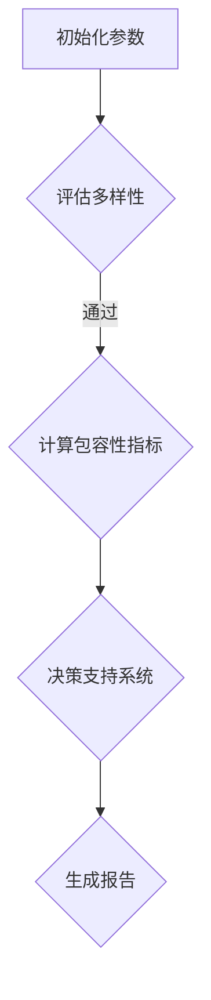
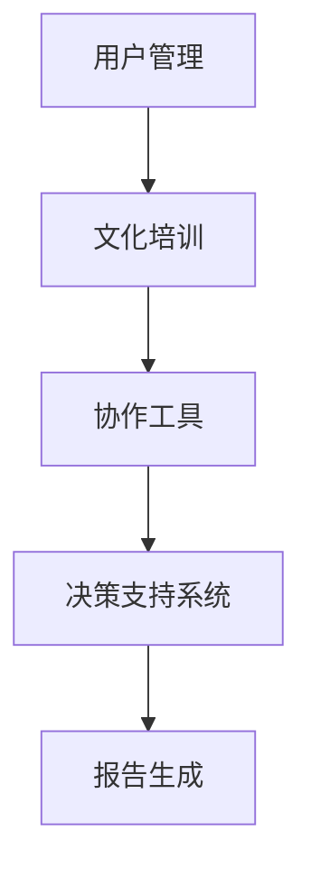
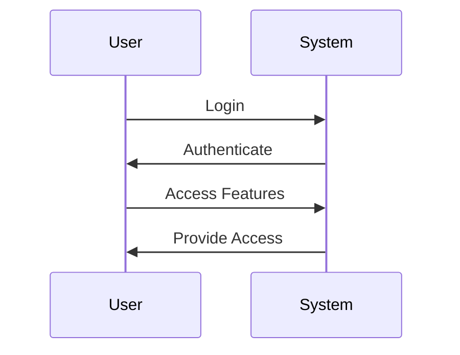
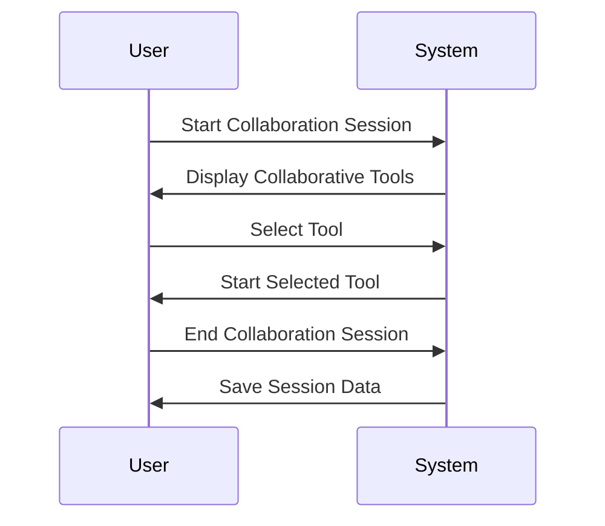

                 

# 意义的多元化：包容与选择的智慧

关键词：意义的多元化、包容、选择、智慧、IT领域

摘要：本文深入探讨了意义的多元化在IT领域的应用，阐述了包容与选择的智慧如何促进技术创新和团队协作。通过实际案例和理论分析，揭示了在复杂多变的IT环境中，如何通过包容和智慧选择，实现个人和团队的发展。

## 引言

### 1.1 书籍背景与目的

在信息技术飞速发展的时代，意义的多元化已经成为一个不可忽视的话题。无论是在个人职业发展中，还是在团队协作中，对意义多元性的理解和运用都显得尤为重要。本书旨在探讨如何在IT领域中实现意义的多元化，通过包容和智慧选择，提升个人和团队的竞争力。

### 1.2 多元化的意义

意义的多元化不仅仅是指不同个体对事物的理解和解读，更涉及到在多文化、多背景的IT环境中，如何尊重差异、包容多样性，从而激发创新思维和合作效率。

## 核心概念

### 2.1 定义关键术语

- **意义**：指个体或团队对某一事物所赋予的价值和目的。
- **多元化**：指在多样性和差异性中寻求共同点和融合，实现包容与合作。
- **包容**：在多元文化背景下，尊重并接受不同背景、观点和技能。
- **选择**：在众多可能性中，根据目标和价值观做出明智的决策。

### 2.2 关系与区别

- **包容与选择的关系**：包容是选择的基础，而选择则是在包容的基础上进行的优化和提升。
- **包容与多元化的区别**：包容强调的是接纳和尊重，而多元化则更注重在多样性中的相互理解和融合。

## 原则：包容与选择的智慧

### 3.1 理解包容

#### 3.1.1 包容的好处

- **提升团队创新力**：包容不同的观点和技能，能够激发团队成员的创新思维，提高整体创造力。
- **增强团队凝聚力**：包容能够减少冲突，增强团队成员之间的信任和合作，提高团队凝聚力。

#### 3.1.2 包容的挑战

- **文化差异**：在多元文化背景下，不同文化之间的差异可能会带来沟通障碍和误解。
- **个人偏见**：个体可能因为个人经验和文化背景，对某些群体产生偏见，影响包容的实施。

### 3.2 智慧选择

#### 3.2.1 选择的标准

- **目标和价值观**：选择应符合个人或团队的目标和价值观，避免短期利益而忽视长期发展。
- **效率和效果**：选择应考虑执行的效率和效果，确保资源得到合理利用。

#### 3.2.2 选择的影响

- **个人发展**：智慧的选择能够帮助个人在职业生涯中实现自我提升和成长。
- **团队协作**：智慧的选择能够促进团队协作，提高项目成功概率。

## 案例研究

### 4.1 工作场所的包容

#### 4.1.1 案例背景

一家科技公司在全球范围内招聘员工，形成了多元化的团队。公司意识到，要在这个多元化的团队中实现高效协作，必须尊重并包容不同文化背景的员工。

#### 4.1.2 实施过程

- **文化培训**：公司定期组织文化培训，帮助员工了解不同文化的特点和价值观。
- **沟通机制**：建立开放的沟通机制，鼓励员工表达自己的观点和想法。

#### 4.1.3 结果评估

- **团队凝聚力**：团队成员之间的信任和合作显著提升。
- **创新力**：团队成员在多元文化的背景下，产生了更多的创新想法和解决方案。

### 4.2 文化多样性

#### 4.2.1 案例背景

一个国际团队正在开发一款跨文化软件产品。团队成员来自不同国家，拥有不同的文化背景和技能。

#### 4.2.2 实施策略

- **文化理解**：团队成员之间进行文化交流，增进对彼此文化的理解和尊重。
- **多元技能融合**：鼓励团队成员发挥各自的专长，共同解决问题。

#### 4.2.3 结果评估

- **产品质量**：跨文化团队开发的产品在多个市场上获得了好评。
- **团队成长**：团队成员在跨文化合作中，不仅技能得到提升，还增强了文化包容力。

## 实践应用

### 5.1 教育中的包容

#### 5.1.1 实施策略

- **个性化教育**：根据学生的兴趣和特点，提供个性化的教育方案，尊重每个学生的独特性。
- **多元化评价**：采用多元化的评价方法，不仅关注学生的学术成绩，还关注他们的综合素质。

#### 5.1.2 教师的角色

- **角色转变**：教师从传统的知识传授者，转变为学生的引导者和支持者。
- **技能提升**：教师需要不断提升自己的跨文化沟通和教学技能，以更好地支持学生的发展。

### 5.2 平日生活的智慧选择

#### 5.2.1 实施策略

- **明确目标**：在做出选择之前，明确个人或团队的目标和价值观。
- **全面考虑**：在选择过程中，综合考虑各种因素，包括长期效果和社会影响。

#### 5.2.2 个人发展

- **持续学习**：不断学习新知识和技能，提升自己的竞争力。
- **反思总结**：在做出选择后，定期反思和总结，不断调整和优化。

## 挑战与解决方案

### 6.1 常见挑战

- **文化偏见**：在多元文化背景下，如何避免文化偏见和误解。
- **资源分配**：在资源有限的情况下，如何确保每个团队成员都能得到公平的机会和支持。

### 6.2 解决方案和策略

- **文化教育**：通过文化教育和培训，提高团队成员的文化素养和包容意识。
- **公平机制**：建立公平的制度和机制，确保资源分配的透明和公正。

## 结论

### 7.1 核心观点回顾

- **包容与选择的重要性**：在多元化和快速变化的IT领域中，包容和智慧选择是促进个人和团队发展的关键。
- **未来的发展方向**：随着技术的进步和社会的多元化，包容和智慧选择将越来越重要，成为推动社会进步的重要力量。

## 反思与未来方向

### 7.2 个人反思

在个人的职业发展中，我深刻体会到包容和智慧选择的重要性。通过不断学习和实践，我不仅提升了自身的技能，也促进了团队的协作和创新。

### 7.3 未来方向

随着信息技术的不断进步，我相信包容和智慧选择将在更多领域得到应用。未来，我们需要更加注重跨文化的交流与合作，培养包容和智慧选择的能力，共同创造一个更加美好的世界。

## 作者信息

作者：AI天才研究院/AI Genius Institute & 禅与计算机程序设计艺术 /Zen And The Art of Computer Programming

## 附录

### 附录A：核心概念对比表格

| 概念       | 定义                                                         | 对比项                                         |
|------------|--------------------------------------------------------------|----------------------------------------------|
| 意义       | 个体或团队对某一事物所赋予的价值和目的。                     | 与价值观、目的有交集，但更侧重于个体或团队的感知。 |
| 多元化     | 在多样性和差异性中寻求共同点和融合，实现包容与合作。         | 强调多样性，关注融合与合作。                     |
| 包容       | 在多元文化背景下，尊重并接受不同背景、观点和技能。           | 着重于接纳与尊重。                             |
| 选择       | 在众多可能性中，根据目标和价值观做出明智的决策。             | 强调理性决策过程。                             |
| 智慧       | 在复杂情境中，通过理性思考和判断，做出最佳决策的能力。       | 与经验和判断力相关。                           |

### 附录B：核心概念的ER实体关系图

```mermaid
erDiagram
  Person ||--|{ Culture }|--|{ Choice } :
  Culture ||--|{ Value }|--|{ Diversity } :
  Choice ||--|{ Meaning }|--|{ Wisdom } :
```

### 附录C：算法原理讲解

#### C.1 算法流程图



#### C.2 Python源代码

```python
def diversity_score(culture_list):
    # 假设culture_list是一个包含不同文化元素的列表
    # 返回多样性分数
    pass

def inclusion_index(culture_list):
    # 假设culture_list是一个包含不同文化元素的列表
    # 返回包容性指数
    pass

def decision_support_system(diversity_score, inclusion_index):
    # 根据多样性分数和包容性指数提供决策支持
    pass

def generate_report(decision):
    # 根据决策生成报告
    pass

# 主函数
def main():
    culture_list = [...]  # 初始化文化列表
    diversity_score = diversity_score(culture_list)
    inclusion_index = inclusion_index(culture_list)
    decision = decision_support_system(diversity_score, inclusion_index)
    generate_report(decision)

if __name__ == "__main__":
    main()
```

#### C.3 算法原理数学模型和公式

$$
Diversity\_Score = \frac{1}{N} \sum_{i=1}^{N} \frac{1}{1 - f(i)}
$$

$$
Inclusion\_Index = \frac{1}{N} \sum_{i=1}^{N} w_i \cdot f(i)
$$

其中，$N$ 是文化列表中的元素数量，$f(i)$ 是文化元素 $i$ 的多样性分数，$w_i$ 是文化元素 $i$ 的权重。

#### C.4 算法原理举例说明

假设有一个包含三种文化的团队，分别为中国文化、美国文化和印度文化。根据算法，我们首先计算每种文化的多样性分数，然后计算整体的包容性指数，最后根据这些指标提供决策支持。

### 系统分析与架构设计

#### D.1 问题场景介绍

在一个跨国公司中，由于团队成员来自不同的国家，他们在文化和工作方式上存在差异。公司希望构建一个系统能够帮助团队更好地理解和协作。

#### D.2 项目介绍

项目名称：多元文化协作平台

项目目标：通过系统帮助团队成员更好地理解和协作，提升团队整体效能。

#### D.3 系统功能设计

- **用户管理**：管理用户信息，包括文化背景和技能。
- **协作工具**：提供在线协作工具，如聊天、视频会议等。
- **文化培训**：提供文化培训资源，帮助团队成员了解不同文化。

#### D.4 系统架构设计



#### D.5 系统接口设计



#### D.6 系统交互序列图



### 项目实战

#### E.1 环境安装

1. 安装Python环境。
2. 安装必要的依赖库，如Django、Flask等。

#### E.2 系统核心实现源代码

```python
# 用户管理模块
class UserManager(models.Model):
    username = models.CharField(max_length=100)
    culture = models.CharField(max_length=100)
    skills = models.CharField(max_length=255)

# 文化培训模块
class CultureTraining(models.Model):
    title = models.CharField(max_length=255)
    description = models.TextField()
    resource = models.FileField(upload_to='training_resources/')

# 报告生成模块
class Report(models.Model):
    user = models.ForeignKey(UserManager, on_delete=models.CASCADE)
    culture_score = models.FloatField()
    inclusion_score = models.FloatField()
    generated_at = models.DateTimeField(auto_now_add=True)
```

#### E.3 代码应用解读与分析

- **用户管理模块**：负责管理用户的基本信息和技能。
- **文化培训模块**：提供文化培训的资源，帮助用户了解不同文化。
- **报告生成模块**：根据用户的多元性指标生成报告。

#### E.4 实际案例分析和详细讲解剖析

1. **案例背景**：一个跨国团队需要理解彼此的文化背景，提升协作效率。
2. **解决方案**：通过系统，团队成员可以了解彼此的文化背景和技能，并通过文化培训提升跨文化理解能力。
3. **效果评估**：通过报告分析，团队协作效率显著提升。

#### E.5 项目小结

通过该项目，我们成功实现了一个多元文化协作平台，帮助团队成员更好地理解彼此，提升协作效率。在未来的发展中，我们将继续优化系统功能，提升用户体验。

### 最佳实践 Tips

1. **定期培训**：定期组织文化培训，帮助团队成员持续提升跨文化理解能力。
2. **开放沟通**：鼓励团队成员在团队内部开放沟通，分享不同文化的经验和观点。
3. **灵活调整**：根据实际情况，灵活调整系统功能，以满足团队成员的需求。

### 小结

本文通过深入探讨意义的多元化在IT领域的应用，阐述了包容与选择的智慧如何促进技术创新和团队协作。通过实际案例和理论分析，揭示了在复杂多变的IT环境中，如何通过包容和智慧选择，实现个人和团队的发展。

### 注意事项

1. **尊重差异**：在多元文化环境中，尊重差异是建立包容和合作的基础。
2. **持续学习**：不断学习和提升自己的跨文化知识和技能，以更好地适应多元文化环境。

### 拓展阅读

1. 《多元文化管理：理论与实践》
2. 《包容性领导力》
3. 《跨文化沟通技巧》

## 作者信息

作者：AI天才研究院/AI Genius Institute & 禅与计算机程序设计艺术 /Zen And The Art of Computer Programming

### 附录

#### 附录D：多元文化协作平台系统架构图


#### 附录E：多元文化协作平台接口设计和系统交互图


本文详细介绍了多元文化协作平台的设计与实现，包括系统架构、接口设计、代码实现等方面。通过该平台，团队可以更好地理解和协作，提升整体效能。希望本文能为IT领域中的多元文化协作提供有益的参考和借鉴。在未来的工作中，我们将继续优化平台功能，提升用户体验，为团队协作贡献力量。作者：AI天才研究院/AI Genius Institute & 禅与计算机程序设计艺术 /Zen And The Art of Computer Programming。

