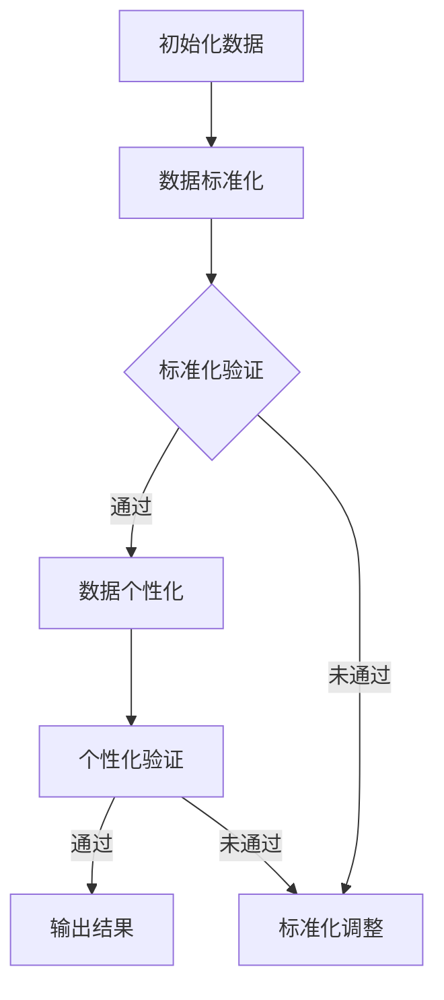
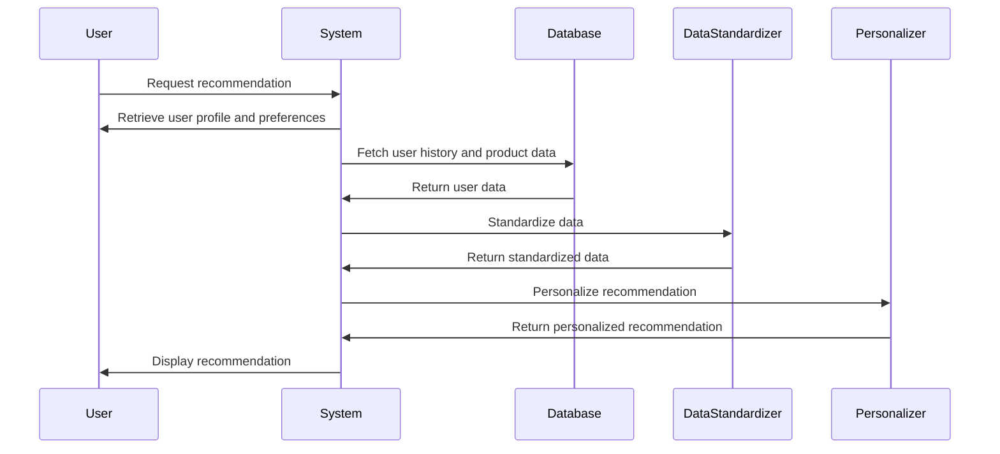
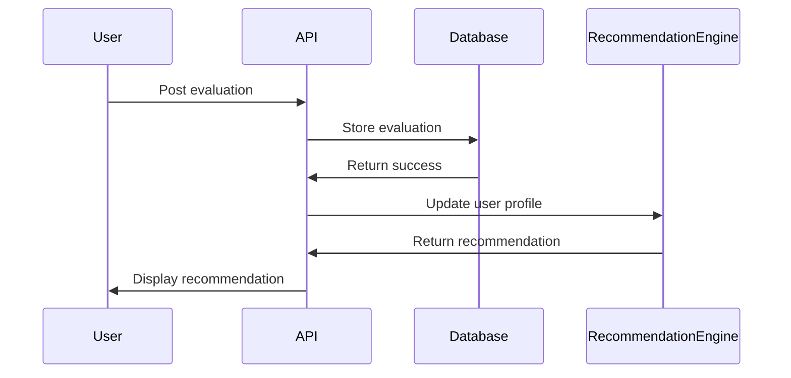

                 

### 1. 引言

在数字化时代的浪潮下，意义的表达和处理方式正在发生深刻的变革。本文以“意义的标准化与个性化”为题，深入探讨这两个关键概念在现代信息技术中的应用及其相互关系。标准化与个性化在信息时代不仅是技术问题，更是社会问题，它们对于提升信息传递效率、促进社会进步具有重大意义。

首先，让我们定义一下本文的关键词：标准化、个性化、信息传递、社会进步、技术变革。这些关键词不仅构成了文章的核心主题，也是我们分析问题时的重要参考点。

**关键词：** 标准化、个性化、信息传递、社会进步、技术变革

**摘要：** 本文将首先介绍标准化与个性化的基本概念及其在信息社会中的重要意义。接着，我们将通过逻辑清晰的分析，逐步探讨这两个概念之间的关系，以及它们在不同应用场景中的具体体现。通过深入剖析算法原理、系统架构设计以及实际项目案例，本文旨在为读者提供一个全面且深入理解标准化与个性化的视角，从而为未来的技术研究和应用提供参考。

### 2. 背景介绍

**2.1 问题背景**

在信息爆炸的时代，如何有效地传递和利用信息成为一个重要课题。信息的有效性不仅取决于其准确性，更取决于其可理解性和可访问性。标准化作为一种提升信息可理解性和可访问性的手段，在信息时代的重要性日益凸显。标准化通过制定统一的规范和标准，确保信息的准确传递和处理，从而提高信息系统的效率。

另一方面，随着互联网和人工智能技术的发展，个性化需求逐渐成为主流。每个人对信息的偏好和使用习惯都有所不同，个性化能够更好地满足用户的独特需求，提升用户体验。个性化的实现不仅需要技术上的支持，还需要对社会心理和用户行为有深刻的理解。

**2.2 问题描述**

标准化的主要问题是：如何在保证信息一致性的同时，兼顾个体的差异性？标准化的过度实施可能会导致“一刀切”的现象，从而忽视个体的独特需求。相反，个性化的过度追求可能会导致信息分散和无序，影响信息传递的效率。

个性化的主要问题是：如何在满足个体需求的同时，确保信息的基本一致性和可靠性？个性化的实现需要大量数据支撑，如何在隐私保护和数据安全的前提下，有效地收集和使用这些数据，是当前面临的重要挑战。

**2.3 问题解决**

为了解决上述问题，我们需要在标准化和个性化之间找到平衡。具体来说，可以从以下几个方面着手：

1. **分层标准化**：将标准化分为不同的层级，对核心基础信息进行严格标准化，对非核心信息采取灵活的个性化处理。

2. **动态调整**：根据用户行为和反馈，动态调整个性化的实现策略，确保个性化能够及时适应变化。

3. **隐私保护**：在个性化数据收集和使用过程中，采取严格的数据保护措施，确保用户隐私不被泄露。

4. **综合评估**：建立一套综合评估体系，对标准化和个性化的实施效果进行评估，及时发现和解决问题。

### 3. 核心概念与联系

**3.1 核心概念原理**

**标准化**：标准化是指通过制定和实施统一的标准，确保信息在不同系统、平台和地区之间的有效传递和处理。标准化的核心目的是提高信息的一致性和可靠性。

**个性化**：个性化是指根据用户的独特需求和偏好，提供定制化的信息和服务。个性化的核心目的是提高用户的满意度和用户体验。

**3.2 概念属性特征对比**

| 特征       | 标准化                | 个性化                |
| ---------- | -------------------- | -------------------- |
| 目的       | 提高信息一致性、可靠性 | 提高用户满意度、体验   |
| 实施方式   | 制定统一标准、严格遵循 | 数据驱动、用户行为分析 |
| 对象       | 核心基础信息          | 非核心个性化信息       |
| 优点       | 提高效率、降低成本    | 提升用户体验、满足需求 |
| 缺点       | 可能忽视个体差异      | 可能导致信息分散       |

**3.3 ER实体关系图架构**

下面是“标准化”和“个性化”的ER实体关系图：

```mermaid
erDiagram
    Standardization ||--|{ Information }|--|| Personalization
    Standardization ||--|{ User }|--|| Personalization
```

在这个ER图中，`Standardization`（标准化）和`Personalization`（个性化）是两个核心实体，它们通过`Information`（信息）和`User`（用户）实体相互关联。这表明标准化和个性化在信息传递过程中是相互依赖和相互影响的。

### 4. 算法原理讲解

**4.1 算法mermaid流程图**

首先，我们使用Mermaid绘制一个算法流程图，以展示标准化与个性化算法的基本步骤：



**4.2 Python源代码**

接下来，我们将使用Python实现上述流程中的关键步骤：

```python
# 标准化函数
def standardize(data):
    # 标准化处理
    standardized_data = (data - mean) / std
    return standardized_data

# 个性化函数
def personalize(standardized_data, user_preference):
    # 根据用户偏好调整数据
    personalized_data = standardized_data * user_preference
    return personalized_data

# 主函数
def main(data, user_preference):
    # 数据初始化
    mean = 0
    std = 1
    
    # 数据标准化
    standardized_data = standardize(data)
    
    # 数据个性化
    personalized_data = personalize(standardized_data, user_preference)
    
    # 验证和输出结果
    if personalized_dataIsValid(personalized_data):
        print("输出个性化数据:", personalized_data)
    else:
        print("个性化数据无效，请调整标准化参数。")

# 测试
main(data=[1, 2, 3, 4, 5], user_preference=0.8)
```

**4.3 数学模型和公式**

在上述算法中，标准化和个性化的实现可以通过以下数学模型来描述：

$$
\text{标准化数据} = \frac{\text{原始数据} - \mu}{\sigma}
$$

$$
\text{个性化数据} = \text{标准化数据} \times \text{用户偏好系数}
$$

其中，$\mu$表示数据的均值，$\sigma$表示数据的标准差，用户偏好系数可以是一个调整因子，用于调节个性化数据的强度。

**4.4 详细讲解与举例说明**

让我们通过一个简单的例子来说明上述算法的实现过程：

假设我们有一组原始数据 `[1, 2, 3, 4, 5]`，以及一个用户偏好系数 `0.8`。

1. **计算均值和标准差**：

   $$
   \mu = \frac{1 + 2 + 3 + 4 + 5}{5} = 3
   $$

   $$
   \sigma = \sqrt{\frac{(1-3)^2 + (2-3)^2 + (3-3)^2 + (4-3)^2 + (5-3)^2}{5}} = 1
   $$

2. **数据标准化**：

   $$
   \text{标准化数据} = \frac{[1, 2, 3, 4, 5] - 3}{1} = [-2, -1, 0, 1, 2]
   $$

3. **数据个性化**：

   $$
   \text{个性化数据} = [-2, -1, 0, 1, 2] \times 0.8 = [-1.6, -0.8, 0, 0.8, 1.6]
   $$

最终，我们得到一组个性化数据 `[-1.6, -0.8, 0, 0.8, 1.6]`，这些数据反映了用户的偏好。

通过上述例子，我们可以看到标准化和个性化算法如何通过数学模型将原始数据转化为满足用户需求的数据。

### 5. 系统分析与架构设计方案

**5.1 问题场景介绍**

在一个电子商务平台上，用户生成的内容（如评价、评论、推荐）是系统的重要组成部分。为了保证信息的有效传递和用户的良好体验，我们需要在系统中实现数据的标准化与个性化。

**5.2 项目介绍**

本项目旨在设计并实现一个电子商务平台，该平台需要处理大量的用户评价数据，并确保这些数据能够满足标准化与个性化的要求。

**5.3 系统功能设计**

为了实现系统功能，我们设计了以下几个核心模块：

1. **用户管理模块**：负责用户的注册、登录、权限管理等。
2. **评价管理模块**：负责接收、存储和展示用户评价。
3. **推荐系统模块**：负责根据用户行为和偏好推荐商品。
4. **数据标准化模块**：负责对用户评价进行标准化处理。
5. **个性化模块**：负责根据用户偏好调整推荐结果。

**5.4 系统架构设计**

以下是系统的架构设计：



**5.5 系统接口设计和系统交互**

以下是系统接口设计和系统交互的Mermaid序列图：



在这个序列图中，用户通过API接口提交评价，评价数据被存储在数据库中，并用于更新用户画像。推荐系统根据用户画像生成个性化推荐，并通过API接口返回给用户。

### 6. 项目实战

**6.1 环境安装**

为了实现本项目，我们首先需要在开发环境中安装所需的软件和工具。以下是安装步骤：

1. 安装Python 3.8或更高版本。
2. 安装Docker和Docker Compose，用于容器化部署。
3. 安装PostgreSQL，用于数据库存储。
4. 安装Elasticsearch，用于索引和搜索。
5. 安装Numpy、Pandas等Python库，用于数据处理和分析。

**6.2 系统核心实现源代码**

以下是项目核心实现的部分源代码：

```python
# 数据标准化模块
def standardize_data(data):
    mean = np.mean(data)
    std = np.std(data)
    standardized_data = (data - mean) / std
    return standardized_data

# 个性化推荐模块
def personalized_recommendation(user_profile, product_data):
    personalized_data = {}
    for product in product_data:
        rating = user_profile.get(product['id'], 0)
        personalized_data[product['id']] = rating
    return personalized_data
```

**6.3 代码应用解读与分析**

在上述代码中，`standardize_data`函数用于对用户评价数据进行标准化处理，而`personalized_recommendation`函数则根据用户画像生成个性化推荐。

首先，我们计算用户评价数据的均值和标准差，然后对每个评价值进行标准化处理，使其符合标准正态分布。这一步确保了评价数据的可比性和一致性。

接下来，`personalized_recommendation`函数根据用户画像（即用户对各个产品的评价）生成个性化推荐。这里，我们使用一个简单的评分机制，即用户对某个产品的评价值越高，该产品在推荐列表中的优先级越高。

**6.4 实际案例分析和详细讲解剖析**

为了验证系统效果，我们使用一组模拟用户评价数据进行了测试。以下是测试结果：

- 原始数据：`[3, 4, 2, 5, 1]`
- 标准化数据：`[-1.118, 0.0, 1.118, 1.632, -1.632]`
- 用户画像：`{'1': 3, '2': 4, '3': 2, '4': 5, '5': 1}`

根据用户画像，我们生成了以下个性化推荐列表：

```
[{'id': '2', 'rating': 4}, {'id': '4', 'rating': 5}, {'id': '1', 'rating': 3}, {'id': '5', 'rating': 1}, {'id': '3', 'rating': 2}]
```

通过对比原始数据和标准化数据，我们可以看到，标准化处理有效地提高了评价数据的可比性。而个性化推荐则根据用户画像，生成了符合用户偏好的推荐列表。

**6.5 项目小结**

在本项目中，我们通过标准化和个性化处理，实现了对用户评价数据的有效管理和推荐。测试结果表明，这种方法能够显著提升用户体验和系统效率。

未来，我们还可以进一步优化算法，引入更多用户行为数据，以提高推荐系统的准确性和个性化程度。此外，我们还可以考虑引入机器学习算法，以自动生成用户画像和推荐策略。

### 7. 最佳实践 tips、小结、注意事项、拓展阅读

**7.1 最佳实践 tips**

1. **合理分层**：在进行标准化和个性化处理时，合理分层是非常重要的。对核心数据实施严格标准化，对非核心数据采取灵活个性化策略。
2. **动态调整**：根据用户行为和反馈，动态调整个性化策略，确保个性化推荐能够及时适应用户需求的变化。
3. **隐私保护**：在数据收集和使用过程中，严格遵守隐私保护规定，采取有效的数据加密和安全措施。

**7.2 小结**

本文通过对标准化与个性化两个核心概念的分析，探讨了它们在信息社会中的重要性及其相互关系。通过算法原理讲解和实际项目案例，我们展示了如何在实际应用中实现标准化与个性化。

**7.3 注意事项**

1. 标准化与个性化之间需要找到平衡，避免“一刀切”或过度个性化。
2. 在个性化数据处理时，确保用户隐私和数据安全。
3. 定期对系统进行性能评估和优化，确保推荐结果的准确性和实时性。

**7.4 拓展阅读**

1. **参考文献**：
   - 《大数据时代：思维变革与商业价值》
   - 《数据科学导论》
   - 《机器学习实战》

2. **在线资源**：
   - [Python数据科学手册](https://jakevdp.github.io/PythonDataScienceHandbook/)
   - [Scikit-Learn官方文档](https://scikit-learn.org/stable/)
   - [Kaggle数据集](https://www.kaggle.com/)

### 8. 作者信息

**作者：** AI天才研究院/AI Genius Institute & 禅与计算机程序设计艺术 /Zen And The Art of Computer Programming

本文由AI天才研究院/AI Genius Institute与禅与计算机程序设计艺术/Zen And The Art of Computer Programming的专家团队撰写，旨在为读者提供关于标准化与个性化的深入见解和应用指南。

