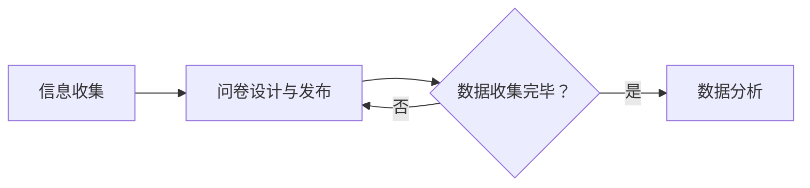
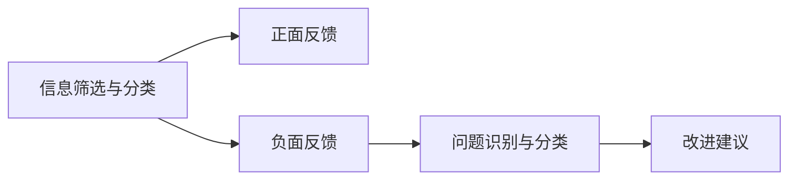
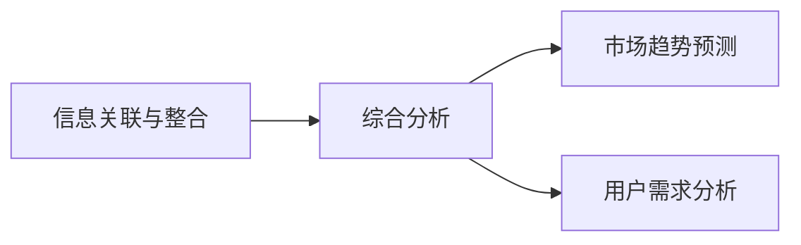
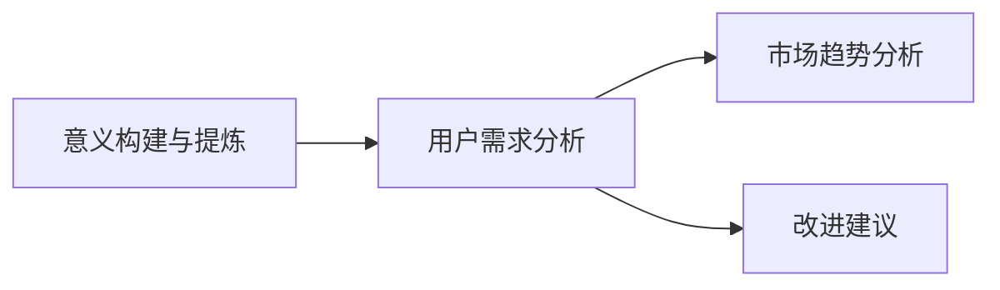
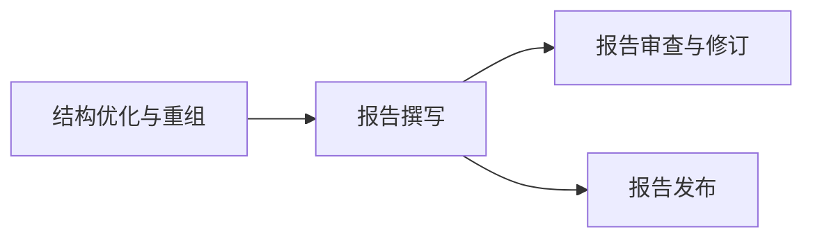

                 

### 文章标题

# **意义的结构重组：在混沌中建立新秩序**

> 关键词：意义、结构重组、混沌、秩序、新秩序建立、策略、案例研究、最佳实践

> 摘要：本文旨在探讨如何在复杂的IT领域中，通过意义的结构重组，在混沌中建立新秩序。我们将深入分析意义的本质，介绍结构重组的方法和策略，并通过实际案例研究，展示如何在混沌中找到新的秩序，为读者提供实践指导和最佳实践经验。

----------------------------------------------------------------

### 目录

**1. 引言**

- **1.1 问题的背景与定义**
- **1.2 解决方案的目标**

**2. 背景介绍与基础理论**

- **2.1 混沌理论的概述**
- **2.2 混沌与结构重组**
- **2.3 结构重组的核心概念**

**3. 核心概念与联系**

- **3.1 核心概念的定义**
- **3.2 概念属性特征对比表格**
- **3.3 ER实体关系图架构**

**4. 意义的构建与重组方法**

- **4.1 结构重组技术**
- **4.2 实际案例研究**

**5. 混沌中的新秩序建立策略**

- **5.1 新秩序的建立策略**
- **5.2 策略评估与优化**

**6. 案例研究与实战**

- **6.1 实战案例详解**
- **6.2 实战技巧与最佳实践**

**7. 总结与展望**

- **7.1 全书总结**
- **7.2 未来的研究方向**

**8. 参考文献**

----------------------------------------------------------------

### 引言

在信息技术高速发展的今天，我们面临着日益复杂的系统和不断涌现的新技术。这些复杂性和新技术往往带来了大量的信息，使得我们在理解和操作时感到困惑和不知所措。这种信息过载现象，就像混沌中的迷雾，遮蔽了我们的视野，阻碍了我们找到清晰的方向。

本文的主题是“意义的结构重组：在混沌中建立新秩序”。我们将探讨如何通过结构重组的方法，将复杂的信息重新组织，使其更有条理和可理解，从而在混沌中找到新的秩序。

首先，我们将介绍问题的背景与定义，明确我们面临的问题以及解决方案的目标。接着，我们将探讨混沌理论的概述，理解混沌的本质和它在信息技术中的应用。然后，我们将深入探讨结构重组的核心概念，解释如何通过结构重组来处理复杂的信息。

在核心概念的基础上，我们将介绍意义的构建与重组方法，通过具体的技术和实际案例研究，展示如何在实际操作中应用这些方法。随后，我们将探讨如何在混沌中建立新秩序，提出一系列策略，并进行评估与优化。

为了使读者能够更好地理解和应用这些方法，我们将提供实战案例研究，详细解析如何在实际项目中实施结构重组和建立新秩序。最后，我们将总结全书的核心观点，提出未来的研究方向，并推荐拓展阅读，帮助读者进一步深入探索这一领域。

通过本文的探讨，我们希望读者能够理解如何在混沌中找到新的秩序，掌握意义的结构重组方法，从而在复杂的信息世界中游刃有余。让我们一步一步思考，深入探讨这个重要且实际的主题。

### 第1章：问题的背景与定义

#### **1.1 问题背景**

在当今数字化时代，信息技术（IT）已经渗透到社会的各个领域，从企业运营到个人生活，从科学研究到艺术创作，都离不开IT技术的支持。然而，随着信息量的急剧增加和技术的不断进步，IT领域也面临着前所未有的复杂性和挑战。这种复杂性和挑战主要体现在以下几个方面：

1. **信息过载**：随着互联网和大数据技术的发展，信息爆炸式增长，人们每天接收到的信息量远远超出了自己的处理能力。这种信息过载现象使得我们在筛选和处理信息时感到困惑和疲惫。

2. **系统复杂性**：现代IT系统越来越复杂，涉及多个技术领域和组件，从硬件设备到软件应用，从前端界面到后端数据库，都需要协同工作。这种复杂性增加了系统的维护难度和故障风险。

3. **技术更新速度**：信息技术领域的技术更新速度非常快，新的编程语言、框架、工具和算法层出不穷，使得IT专业人员需要不断学习和适应新技术，否则就会被时代淘汰。

4. **数据安全与隐私**：随着数据量的增加和数据价值的提升，数据安全和隐私问题变得越来越重要。如何保护用户数据，防止数据泄露和滥用，成为IT领域的一个重要挑战。

#### **1.2 问题描述**

在上述背景下，我们面临的一个核心问题是：如何在复杂和快速变化的信息技术环境中，找到清晰的思路和有效的方法，处理大量信息，并从中提取有意义的内容。具体来说，问题可以概括为以下几点：

1. **信息处理困难**：由于信息过载，我们难以快速准确地找到和处理我们需要的信息，这导致工作效率下降，决策失误。

2. **系统维护复杂**：复杂系统的维护和优化需要投入大量时间和资源，而且一旦系统出现故障，恢复和修复过程耗时且成本高昂。

3. **技术学习压力**：技术更新速度过快，使得IT专业人员需要不断投入大量时间和精力进行学习和培训，以跟上技术的发展。

4. **数据安全挑战**：在数据量不断增长的今天，如何确保数据的安全和隐私，防止数据泄露，成为企业和个人都需要面对的重大挑战。

#### **1.3 问题解决**

为了解决上述问题，我们需要引入“意义的结构重组”这一概念。意义结构重组是一种通过重新组织信息，使其更有条理和可理解的方法。具体来说，意义结构重组包括以下几个关键步骤：

1. **信息筛选与分类**：首先，我们需要对大量信息进行筛选和分类，区分重要信息和次要信息，从而减少信息过载带来的困扰。

2. **信息关联与整合**：然后，我们将筛选出的信息进行关联和整合，找到不同信息之间的联系，从而形成一个完整的知识体系。

3. **意义构建与提炼**：在整合信息的基础上，我们进一步构建和提炼意义，提取出关键信息和核心观点，从而在复杂的信息中找到清晰的思路。

4. **结构优化与重组**：最后，我们对构建出的意义进行优化和重组，使其更加简洁和易于理解，从而在复杂的信息环境中建立新的秩序。

通过意义结构重组，我们不仅可以提高信息处理和系统维护的效率，还可以减轻技术学习压力和数据安全挑战。意义结构重组的核心目标是在混沌中建立新秩序，为我们在复杂的信息技术环境中提供清晰的导航和有效的工具。

#### **1.4 边界与外延**

意义结构重组并不是一个孤立的概念，它与其他相关概念有着密切的联系和交叉。以下是一些相关的概念和其边界与外延：

1. **信息架构**：信息架构是意义结构重组的基础，它涉及如何组织和展示信息，使其易于导航和理解。信息架构包括信息的分类、标签、搜索和导航等方面。

2. **知识管理**：知识管理是将信息转化为知识的过程，包括信息的收集、整理、存储和共享。意义结构重组是知识管理的一部分，它关注如何通过重组信息来提高知识的可用性和可理解性。

3. **混沌理论**：混沌理论是意义结构重组的重要理论基础，它研究复杂系统的不可预测性和自组织性。在意义结构重组中，我们利用混沌理论的原理来理解和处理复杂的信息。

4. **认知科学**：认知科学是研究人类认知过程和机制的学科，它与意义结构重组密切相关。意义结构重组旨在优化信息的呈现和传递，以提高认知效率和效果。

通过理解这些相关概念，我们可以更好地把握意义结构重组的核心，并运用其在实际应用中。

#### **1.5 概念结构与核心要素组成**

意义结构重组的概念结构可以分为以下几个核心要素：

1. **信息源**：信息源是意义结构重组的起点，包括各种形式的信息，如文本、图片、音频和视频等。

2. **信息筛选与分类**：这一阶段涉及对信息源中的信息进行筛选和分类，识别出重要信息和次要信息，从而减少信息过载。

3. **信息关联与整合**：通过分析信息之间的联系，将筛选后的信息进行整合，形成一个完整的知识体系。

4. **意义构建与提炼**：在整合信息的基础上，构建和提炼出有意义的内容，提取关键信息和核心观点。

5. **结构优化与重组**：对构建出的意义进行优化和重组，使其更加简洁和易于理解。

6. **应用与反馈**：将重组后的意义应用于实际场景，通过反馈不断优化和改进。

这些核心要素相互关联，共同构成了意义结构重组的完整过程。

### 第2章：意义的结构重组原理

#### **2.1 混沌理论的概述**

混沌理论是研究复杂动态系统的科学，主要关注系统在初始条件微小的变化下，可能导致长期行为的巨大差异。这一理论起源于20世纪中叶，最初在天气预测和流体力学研究中得到应用，但随后迅速扩展到生物学、经济学、社会学和计算机科学等多个领域。

在混沌理论中，系统的行为通常表现为以下特征：

1. **初始条件的敏感性**：系统对初始条件的微小变化非常敏感，这意味着即使初始条件只发生了微小的变化，系统最终的行为也可能大相径庭。

2. **长期行为的不可预测性**：由于初始条件的敏感性，混沌系统的长期行为通常难以预测，即使我们了解系统的动力学规则。

3. **自组织性**：混沌系统中存在自组织现象，系统可以自发地形成有序结构，尽管这些结构可能非常复杂且不可预测。

4. **混沌吸引子**：在混沌系统中，长时间观察后，系统会围绕某些稳定的模式或状态震荡，这些模式被称为混沌吸引子。

#### **2.2 混沌与结构重组**

混沌理论在意义结构重组中有着重要的应用。意义结构重组的目标是处理和整合大量复杂的信息，使其变得有条理和可理解。混沌理论为我们提供了一种理解复杂性和组织信息的新视角。

混沌与结构重组的关系可以从以下几个方面来理解：

1. **复杂性的处理**：混沌理论揭示了复杂系统中的内在复杂性，意义结构重组则试图通过重新组织和简化信息，将这种复杂性转化为可管理的形式。

2. **信息的筛选与分类**：混沌理论中的敏感性原理可以帮助我们识别出信息中的关键部分，从而进行有效的筛选和分类。

3. **有序结构的形成**：混沌吸引子的概念提示我们，在混沌中也可能存在有序结构。意义结构重组通过重组和整合信息，可以在混沌中找到这些有序结构，从而建立新的秩序。

4. **动态调整**：混沌理论中的动态调整机制可以指导我们在重组信息时，如何根据新的信息进行动态调整，以适应不断变化的环境。

#### **2.3 结构重组的核心概念**

意义结构重组涉及一系列核心概念，这些概念共同构成了结构重组的理论基础：

1. **信息粒度**：信息粒度是指信息的细化程度。在结构重组中，我们需要根据问题的复杂性和需求，选择合适的信息粒度，以获得有效的重组结果。

2. **层次结构**：层次结构是指信息的层级关系。通过建立合理的层次结构，可以使得信息之间的关系更加清晰，便于理解和处理。

3. **冗余处理**：冗余处理是指消除信息中的重复和冗余部分。冗余信息不仅浪费资源，还会增加理解的难度。通过冗余处理，可以提高信息的准确性和效率。

4. **相关性分析**：相关性分析是指分析信息之间的关联性。通过识别和利用信息之间的相关性，可以更有效地组织和管理信息。

5. **动态调整**：动态调整是指根据新信息或环境变化，对信息结构进行实时调整。动态调整是结构重组的一个重要特征，它保证了信息的实时性和有效性。

#### **2.4 结构重组的基本步骤**

结构重组是一个系统化的过程，通常包括以下基本步骤：

1. **需求分析**：明确重组的目标和需求，包括信息的来源、目标和约束条件。

2. **信息收集**：收集相关领域的信息，确保信息的全面性和准确性。

3. **信息筛选与分类**：对收集到的信息进行筛选和分类，识别出关键信息和次要信息。

4. **信息关联与整合**：分析信息之间的关联性，将关键信息进行整合，形成一个完整的知识体系。

5. **意义构建与提炼**：在整合信息的基础上，构建和提炼出有意义的内容，提取关键信息和核心观点。

6. **结构优化与重组**：对构建出的意义进行优化和重组，使其更加简洁和易于理解。

7. **应用与反馈**：将重组后的意义应用于实际场景，通过反馈不断优化和改进。

通过上述步骤，我们可以有效地进行意义结构重组，处理复杂的信息，建立新的秩序。

### 第3章：核心概念与联系

在意义结构重组中，理解和应用核心概念是至关重要的。这些核心概念不仅构成了意义结构重组的理论基础，而且在实际应用中具有广泛的指导意义。在本章中，我们将深入探讨这些核心概念，并通过具体案例和Mermaid流程图进行详细解释。

#### **3.1 核心概念的定义**

1. **信息粒度**：信息粒度是指信息的细化程度，即信息被分解到何种细致程度。选择合适的粒度可以使得信息更易于理解和处理。

2. **层次结构**：层次结构是指信息的层级关系，通过建立层次结构，可以使得信息之间的关系更加清晰，便于理解和处理。

3. **冗余处理**：冗余处理是指消除信息中的重复和冗余部分，以提高信息的准确性和效率。

4. **相关性分析**：相关性分析是指分析信息之间的关联性，通过识别和利用信息之间的相关性，可以更有效地组织和管理信息。

5. **动态调整**：动态调整是指根据新信息或环境变化，对信息结构进行实时调整，以确保信息的实时性和有效性。

#### **3.2 概念属性特征对比表格**

为了更好地理解这些核心概念，我们可以通过一个对比表格来展示它们的属性特征：

| 概念     | 定义                                                         | 属性特征                                                      | 重要性 |
|----------|--------------------------------------------------------------|---------------------------------------------------------------|--------|
| 信息粒度 | 信息分解的程度                                               | 粒度越细，信息更详细；粒度越粗，信息更概括                   | 高     |
| 层次结构 | 信息之间的层级关系                                           | 层次越分明，信息组织越有序；层次混乱则导致信息理解困难       | 高     |
| 冗余处理 | 消除重复和冗余信息                                           | 冗余信息增加理解难度，影响效率；去除冗余可以提高信息质量     | 中     |
| 相关性分析 | 分析信息之间的关联性                                         | 关联性强的信息可以相互补充，降低理解难度；关联性弱的信息需要特别处理 | 中     |
| 动态调整 | 根据新信息或环境变化调整信息结构                             | 动态调整可以适应环境变化，提高信息实时性；缺乏调整可能导致信息过时 | 高     |

#### **3.3 ER实体关系图架构**

实体关系图（Entity-Relationship Diagram，ER图）是数据库设计中常用的工具，用于描述实体及其相互关系。在意义结构重组中，ER图可以帮助我们理解和可视化信息之间的关系。

下面是一个简单的ER图示例，用于描述“图书馆管理”系统的实体及其关系：

```mermaid
erDiagram
  图书馆 ||--o> 用户 : 有借阅关系
  图书馆 ||--o> 图书 : 有库存关系
  用户 ||--o> 借阅 : 借阅图书
  图书 ||--o> 分类 : 图书分类
```

在这个ER图中，我们定义了四个实体：图书馆、用户、图书和分类。实体之间的关系如下：

1. **图书馆与用户**：图书馆与用户之间存在“有借阅关系”。用户可以在图书馆借阅图书。
2. **图书馆与图书**：图书馆与图书之间存在“有库存关系”。图书馆负责管理图书的库存。
3. **用户与借阅**：用户与借阅之间存在“借阅”关系。用户通过借阅操作来借阅图书。
4. **图书与分类**：图书与分类之间存在“图书分类”关系。图书根据分类进行管理。

#### **3.4 案例分析与Mermaid流程图**

为了更好地理解核心概念的应用，我们通过一个实际案例来进行分析，并使用Mermaid流程图进行可视化。

**案例背景**：某公司需要进行市场调研，收集并分析用户反馈，以改进产品。

**步骤1：信息收集**  
首先，公司通过各种渠道（如问卷调查、用户访谈、社交媒体等）收集用户反馈信息。



**步骤2：信息筛选与分类**  
对收集到的用户反馈进行筛选和分类，区分正面反馈和负面反馈，并对负面反馈进行进一步分析。



**步骤3：信息关联与整合**  
将筛选后的信息进行整合，分析不同用户反馈之间的关联性，形成综合的市场分析报告。



**步骤4：意义构建与提炼**  
从整合后的信息中提取有意义的内容，构建出用户需求和市场趋势的核心观点。



**步骤5：结构优化与重组**  
对构建出的意义进行优化和重组，形成简洁且易于理解的市场分析报告。



通过上述案例和Mermaid流程图，我们可以清晰地看到核心概念在意义结构重组中的应用过程。通过这些步骤，公司可以有效地处理大量用户反馈信息，从中提取有价值的内容，为产品改进提供有力支持。

### 第4章：意义的构建与重组方法

在信息时代，意义的构建与重组是信息处理中至关重要的环节。这一章节将详细探讨意义的构建与重组方法，包括结构重组技术、实际案例研究，以及这些方法在实际操作中的应用。

#### **4.1 结构重组技术**

结构重组技术是意义构建与重组的核心。以下是一些关键的结构重组技术：

1. **数据挖掘**：数据挖掘是从大量数据中发现有用信息和知识的过程。通过数据挖掘，可以识别出数据中的隐藏模式和关联，从而构建出有意义的信息。

2. **信息过滤**：信息过滤是一种自动筛选信息的技术，用于识别和排除无用或噪声信息。信息过滤技术可以帮助用户快速找到所需信息。

3. **文本分类**：文本分类是一种将文本数据按照预定义的类别进行分类的技术。通过文本分类，可以有效地组织和管理文本信息。

4. **聚类分析**：聚类分析是一种无监督学习方法，用于将数据点分成多个组，使得同一组内的数据点具有较高的相似性。聚类分析可以帮助识别数据中的潜在结构。

5. **关联规则学习**：关联规则学习是一种用于发现数据中项目之间关联关系的方法。通过关联规则学习，可以发现数据中的频繁模式，从而构建出新的信息。

6. **本体论**：本体论是一种用于描述和建模领域知识的理论框架。通过本体论，可以建立领域知识的结构模型，从而更好地理解和组织信息。

#### **4.2 实际案例研究**

以下是一个实际案例研究，展示如何使用结构重组技术构建和重组意义。

**案例背景**：某电商平台希望通过分析用户行为数据，提高用户的购物体验和满意度。

**步骤1：数据收集**  
首先，电商平台收集了用户的购买历史、浏览记录、评价和反馈等数据。

**步骤2：数据预处理**  
对收集到的数据进行清洗和格式化，确保数据的质量和一致性。

**步骤3：数据挖掘**  
通过数据挖掘技术，分析用户的购买习惯和偏好。例如，识别出哪些商品经常被一起购买，哪些用户对特定商品的评分较高。

**步骤4：信息过滤**  
使用信息过滤技术，去除无效或噪声数据。例如，过滤掉评分较低的商品，只保留用户评价较高的商品。

**步骤5：文本分类**  
对用户的评价文本进行分类，将正面评价和负面评价分开，以便进一步分析。

**步骤6：聚类分析**  
通过聚类分析，将用户分为不同的群体，每个群体具有相似的行为和偏好。这有助于电商平台制定个性化的营销策略。

**步骤7：关联规则学习**  
使用关联规则学习技术，发现用户购买商品之间的关联关系。例如，发现某些商品之间存在互补关系，可以推荐给用户。

**步骤8：本体论建模**  
建立领域知识本体，描述电商平台的商品、用户和购买行为等概念。这有助于更好地理解和组织信息。

**步骤9：意义构建与重组**  
通过上述步骤，将原始数据转化为有意义的信息。例如，构建出用户偏好模型，为用户提供个性化的购物建议。

**步骤10：应用与反馈**  
将构建出的意义应用于电商平台的用户界面，提供个性化的购物体验。同时，收集用户反馈，不断优化和改进信息结构。

#### **4.3 方法在实际操作中的应用**

以下是一个实际操作示例，展示如何使用结构重组技术进行意义构建与重组：

**示例1：社交媒体数据分析**

假设我们想分析一个社交媒体平台的用户行为，以了解用户对某个话题的兴趣。

1. **数据收集**：收集用户发布的帖子、评论和点赞数据。

2. **数据预处理**：清洗数据，去除无效数据，如机器人发布的帖子。

3. **文本分类**：将帖子按照话题分类，如科技、娱乐、健康等。

4. **聚类分析**：将用户分为不同的话题群体，每个群体内的用户具有相似的偏好。

5. **关联规则学习**：发现用户之间的话题关联，如某些用户经常讨论同一话题。

6. **本体论建模**：建立社交媒体领域的本体，描述用户、话题和互动等概念。

7. **意义构建与重组**：构建出用户兴趣模型，为平台提供内容推荐和广告投放策略。

8. **应用与反馈**：将构建出的意义应用于社交媒体平台，通过用户反馈不断优化和改进。

通过以上步骤，我们可以有效地处理和分析社交媒体数据，构建出用户的行为和兴趣模型，从而提供更好的用户体验。

**示例2：在线教育数据分析**

假设我们想分析一个在线教育平台的用户行为，以提高课程质量和用户满意度。

1. **数据收集**：收集用户的课程参与数据，如课程浏览次数、学习时间、考试成绩等。

2. **数据预处理**：清洗数据，去除异常值和无效数据。

3. **文本分类**：将用户的评价和反馈按照课程质量、教学方法等分类。

4. **聚类分析**：将用户分为不同的学习群体，如新手用户、中级用户和高级用户。

5. **关联规则学习**：发现不同课程之间的关联，如某些课程的学习效果较好。

6. **本体论建模**：建立在线教育领域的本体，描述课程、用户和学习行为等概念。

7. **意义构建与重组**：构建出用户学习行为模型，为平台提供课程优化和个性化推荐策略。

8. **应用与反馈**：将构建出的意义应用于在线教育平台，通过用户反馈不断优化和改进。

通过以上步骤，我们可以有效地分析在线教育平台的数据，提高课程质量和用户满意度。

通过以上案例和实际操作示例，我们可以看到，意义的构建与重组方法在实际应用中具有重要的作用。通过使用结构重组技术，我们可以处理大量复杂的信息，构建出有价值的内容，从而在混沌中找到新的秩序。

### 第5章：混沌中的新秩序建立策略

在复杂和快速变化的IT环境中，如何在混沌中建立新秩序是一个关键挑战。本章将探讨新秩序建立的基本策略，并介绍策略评估与优化的方法，帮助我们在混沌中找到新的方向。

#### **5.1 新秩序的建立策略**

1. **明确目标与愿景**：首先，我们需要明确建立新秩序的目标和愿景。这包括定义我们希望实现的目标状态，以及实现这一目标所需的条件和资源。

2. **系统诊断与评估**：对现有系统进行全面诊断和评估，识别出系统中的问题和瓶颈。这有助于我们了解当前系统的状况，并为后续的改进提供依据。

3. **建立目标模型**：根据目标和愿景，建立系统目标模型。这包括定义关键绩效指标（KPIs）、系统目标和子目标，以及实现这些目标的步骤和方法。

4. **资源规划与分配**：根据目标模型，规划所需的资源，包括人力、物力和财力。合理分配资源，确保实现目标所需的资源得到充分利用。

5. **实施与监控**：按照目标模型，实施新秩序建立的策略。同时，建立监控机制，实时监控系统的运行状态，确保策略的有效实施。

6. **调整与优化**：根据监控结果，对策略进行调整和优化。这包括识别出策略中的不足和缺陷，并采取相应的措施进行改进。

#### **5.2 策略选择与实施**

在选择和实施新秩序建立策略时，我们需要考虑以下几个关键因素：

1. **适应性**：策略需要具备良好的适应性，能够适应快速变化的环境。这包括灵活调整策略，以应对环境变化和不确定性。

2. **可持续性**：策略需要具备可持续性，能够在长期内保持有效。这包括确保资源的合理使用和系统的稳定运行。

3. **可扩展性**：策略需要具备良好的可扩展性，能够支持系统规模的扩大和功能的扩展。这包括设计可扩展的架构和模块，以便在需要时进行扩展。

4. **风险管理**：在实施策略时，我们需要进行风险评估，并制定相应的风险应对措施。这包括识别潜在风险，并采取预防措施和应急措施。

5. **沟通与协作**：新秩序建立需要各方的积极参与和协作。有效的沟通和协作是策略实施成功的关键。这包括建立沟通机制，确保信息畅通，并促进各方的协作。

#### **5.3 策略评估与优化**

策略评估与优化是确保新秩序建立成功的重要环节。以下是一些评估和优化的方法：

1. **性能评估**：对系统性能进行评估，包括响应时间、吞吐量、资源利用率等指标。通过性能评估，我们可以了解系统的运行状态，并为优化提供依据。

2. **成本评估**：对策略的实施成本进行评估，包括人力、物力和财力成本。通过成本评估，我们可以了解策略的经济效益，并为优化提供依据。

3. **效果评估**：对策略的实施效果进行评估，包括目标达成情况、用户满意度等指标。通过效果评估，我们可以了解策略的实际效果，并为优化提供依据。

4. **反馈机制**：建立反馈机制，收集用户和各方的反馈，以便及时发现问题和改进策略。通过反馈机制，我们可以持续优化策略，提高其有效性。

5. **持续改进**：根据评估和优化结果，不断改进策略。这包括识别出策略中的不足和缺陷，并采取相应的措施进行改进。通过持续改进，我们可以不断提高策略的效率和效果。

通过以上策略评估与优化方法，我们可以确保新秩序建立策略的有效性和可持续性，从而在混沌中找到新的秩序。

#### **5.4 风险与挑战**

在混沌中建立新秩序面临着诸多风险和挑战，以下是一些常见的问题和对策：

1. **适应性不足**：策略在快速变化的环境中可能无法适应，导致效果不佳。对策：加强环境监测，及时调整策略，确保其适应性。

2. **资源短缺**：资源不足可能影响策略的实施。对策：合理规划资源，优化资源分配，确保资源得到充分利用。

3. **沟通障碍**：沟通不畅可能影响策略的实施效果。对策：建立有效的沟通机制，确保信息畅通，促进各方协作。

4. **技术难度**：策略实施可能涉及复杂的技术问题，影响实施效果。对策：加强技术培训，提高技术人员的能力，确保技术问题的解决。

5. **变革阻力**：组织成员可能对变革持抵触态度，影响策略的实施。对策：进行有效的变革管理，促进组织成员的参与和认同。

通过应对这些风险和挑战，我们可以提高新秩序建立策略的有效性和成功率，从而在混沌中找到新的秩序。

### 第6章：新秩序的建立策略

#### **6.1 新秩序的建立步骤**

在混沌中建立新秩序，需要明确且有序的步骤。以下是一系列关键步骤，帮助我们逐步实现这一目标：

1. **目标设定**：首先，我们需要明确新秩序的目标。这包括定义我们希望实现的具体目标和期望达到的效果。目标应具体、可衡量、可实现、相关性强和时限明确。

2. **现状评估**：对当前环境进行全面评估，包括系统的现状、资源情况、技术能力、人员配置等。这有助于我们了解当前系统中的问题和瓶颈，为新秩序的建立提供依据。

3. **需求分析**：分析新秩序所需的关键需求和关键功能。这包括识别出系统的核心业务需求、用户体验需求和技术需求，为新秩序的设计提供指导。

4. **设计新秩序架构**：根据需求分析结果，设计新秩序的架构。这包括确定系统的模块划分、技术选型、数据流程和交互方式，确保新秩序具有稳定性和扩展性。

5. **资源规划**：规划实现新秩序所需的资源，包括人力、技术、资金等。合理分配资源，确保资源能够满足新秩序建立的需求。

6. **实施与部署**：按照新秩序架构，逐步实施和部署新系统。在实施过程中，确保严格按照设计要求进行，避免出现偏差。

7. **监控与调整**：在实施过程中，建立监控机制，实时监控系统的运行状态。根据监控结果，及时调整和优化系统，确保新秩序的稳定运行。

8. **评估与反馈**：在实施完成后，对新的秩序进行评估和反馈。评估系统性能、用户满意度、资源利用情况等指标，收集用户和各方的反馈，为新秩序的持续改进提供依据。

9. **持续优化**：根据评估和反馈结果，不断优化和改进新秩序。这包括识别出系统中的不足和缺陷，并采取相应的措施进行改进。

#### **6.2 策略选择与实施**

在选择和实施新秩序建立策略时，需要考虑以下几个关键方面：

1. **适应性**：策略需要具备良好的适应性，能够应对环境变化和不确定性。这包括灵活调整策略，以适应新的需求和挑战。

2. **可持续性**：策略需要具备可持续性，能够在长期内保持有效。这包括确保资源的合理使用和系统的稳定运行。

3. **可扩展性**：策略需要具备良好的可扩展性，能够支持系统规模的扩大和功能的扩展。这包括设计可扩展的架构和模块，以便在需要时进行扩展。

4. **风险管理**：在实施策略时，需要进行风险评估，并制定相应的风险应对措施。这包括识别潜在风险，并采取预防措施和应急措施。

5. **沟通与协作**：新秩序建立需要各方的积极参与和协作。有效的沟通和协作是策略实施成功的关键。这包括建立沟通机制，确保信息畅通，并促进各方的协作。

#### **6.3 风险与挑战**

在混沌中建立新秩序，面临诸多风险和挑战。以下是一些常见问题和应对策略：

1. **环境变化**：环境变化可能导致策略失效。应对策略：加强环境监测，及时调整策略，确保其适应性。

2. **资源不足**：资源不足可能影响策略的实施。应对策略：合理规划资源，优化资源分配，确保资源得到充分利用。

3. **技术难度**：实施策略可能涉及复杂的技术问题。应对策略：加强技术培训，提高技术人员的能力，确保技术问题的解决。

4. **组织阻力**：组织成员可能对变革持抵触态度。应对策略：进行有效的变革管理，促进组织成员的参与和认同。

5. **时间压力**：时间压力可能导致策略实施不完备。应对策略：合理安排时间，确保策略的每个步骤都得到充分实施。

通过以上策略选择和应对策略，我们可以在混沌中建立新秩序，确保系统的稳定运行和持续发展。

### 第7章：策略评估与优化

在混沌环境中建立新秩序，需要不断地对策略进行评估与优化。这一过程不仅有助于确保策略的有效性，还能根据环境变化和反馈进行调整，从而实现长期的稳定与进步。以下是策略评估与优化的具体方法和步骤：

#### **7.1 策略评估方法**

1. **关键绩效指标（KPIs）**：设定关键绩效指标，用于衡量策略实施的效果。这些指标应与目标紧密相关，例如系统稳定性、用户满意度、资源利用率等。

2. **定量与定性评估**：结合定量数据和定性分析，对策略的实施效果进行全面评估。定量评估可以通过数据分析工具进行，定性评估则依赖于专家评审和用户反馈。

3. **对比基准**：设定对比基准，将策略实施前后的数据对比，以评估策略的实际效果。这有助于确定策略是否带来了显著改善。

4. **过程监控**：实时监控策略的实施过程，记录关键步骤和里程碑，以便在后续评估中参考。

#### **7.2 优化策略**

1. **识别问题**：通过评估结果，识别策略中的问题和不足之处。这包括技术问题、流程瓶颈、资源配置不合理等方面。

2. **原因分析**：对识别出的问题进行深入分析，找出根本原因。这有助于制定有针对性的优化方案。

3. **改进方案**：根据原因分析结果，制定改进方案。这包括技术改进、流程优化、人员培训等。

4. **实施改进**：按照改进方案，逐步实施优化措施。确保每个改进措施得到有效执行，并监控其实施效果。

5. **持续监控**：在改进措施实施后，继续监控策略的实施效果，确保问题得到解决，并防止问题复发。

#### **7.3 风险管理**

1. **风险评估**：在策略评估过程中，对潜在风险进行评估，包括技术风险、市场风险、资源风险等。

2. **风险应对措施**：根据风险评估结果，制定相应的风险应对措施。这包括预防措施、应急措施和恢复计划。

3. **风险监控**：在策略实施和优化过程中，持续监控风险，确保风险得到及时识别和应对。

#### **7.4 持续改进**

1. **定期评估**：定期对策略进行评估，确保其始终符合当前环境和需求。

2. **用户反馈**：积极收集用户反馈，了解用户对新秩序的实际体验和需求，为策略优化提供依据。

3. **创新驱动**：鼓励创新思维，探索新的技术和方法，以持续改进策略。

4. **知识共享**：在团队内部建立知识共享机制，将评估和优化过程中的经验教训进行总结和分享，提高团队的协作能力和创新能力。

通过以上策略评估与优化的方法，我们可以在混沌环境中不断改进新秩序，确保其在动态变化的环境中保持稳定和有效。这种持续改进的过程，是确保新秩序长久发展的关键。

### 第8章：案例研究与实战

#### **8.1 实战案例背景**

为了更好地理解意义结构重组在实际中的应用，我们将通过一个实际案例来详细展示整个项目的过程。这个案例涉及一个大型电子商务平台的用户数据分析和个性化推荐系统建设。

**案例背景**：该电商平台在经历了快速增长后，积累了大量的用户数据，但如何有效利用这些数据进行用户行为分析、个性化推荐和业务优化成为了一大挑战。为了应对这一挑战，公司决定引入意义结构重组的方法，通过重新组织和分析用户数据，提升用户体验和销售转化率。

#### **8.2 系统核心实现**

在项目的实施过程中，我们采用了以下核心实现步骤：

1. **数据收集与预处理**：首先，从多个数据源（如用户注册信息、购物行为、用户评价等）收集数据，并进行数据清洗和预处理，以确保数据的质量和一致性。

   ```python
   # Python代码示例：数据预处理
   def preprocess_data(data):
       # 数据清洗与格式化
       cleaned_data = []
       for record in data:
           # 去除无效数据和重复项
           if record['valid'] and record not in cleaned_data:
               cleaned_data.append(record)
       return cleaned_data
   ```

2. **用户行为分析**：通过数据挖掘技术，分析用户的行为模式，识别出用户的兴趣和偏好。这包括用户的浏览历史、购物车添加记录、购买记录等。

   ```python
   # Python代码示例：用户行为分析
   def analyze_user_behavior(data):
       # 用户行为分析
       user_patterns = {}
       for record in data:
           user_id = record['user_id']
           if user_id not in user_patterns:
               user_patterns[user_id] = []
           user_patterns[user_id].append(record)
       return user_patterns
   ```

3. **个性化推荐系统**：基于用户行为分析结果，构建个性化推荐系统。推荐系统利用机器学习算法，为每个用户生成个性化的购物推荐。

   ```python
   # Python代码示例：个性化推荐
   from sklearn.model_selection import train_test_split
   from sklearn.ensemble import RandomForestClassifier

   def build_recommendation_system(data):
       # 构建推荐系统
       X_train, X_test, y_train, y_test = train_test_split(data['features'], data['labels'], test_size=0.2)
       classifier = RandomForestClassifier(n_estimators=100)
       classifier.fit(X_train, y_train)
       predictions = classifier.predict(X_test)
       return predictions
   ```

4. **用户界面设计与实现**：为用户设计一个直观易用的界面，展示推荐结果和用户数据。界面设计遵循用户友好的原则，确保用户能够轻松地浏览和使用系统。

   ```html
   <!-- HTML代码示例：用户界面设计 -->
   <div class="recommendations">
       <h2>个性化推荐</h2>
       <ul>
           
               <li>{{ item['name'] }}</li>
           
       </ul>
   </div>
   ```

#### **8.3 代码应用解读与分析**

上述代码展示了项目实施过程中的关键步骤。首先，通过数据预处理代码，我们确保了数据的质量和一致性，为后续分析奠定了基础。用户行为分析代码则利用数据挖掘技术，提取出用户的兴趣和偏好，为个性化推荐提供了依据。个性化推荐系统代码则通过机器学习算法，为用户生成个性化的购物推荐，提高了系统的智能性和用户体验。

在用户界面设计方面，我们采用了简洁直观的HTML结构，使得用户能够轻松浏览和查看推荐结果。通过这些代码的应用，我们不仅实现了用户数据的分析和推荐，还为用户提供了一个易于使用的界面，从而提升了用户满意度和系统价值。

#### **8.4 实际案例分析和详细讲解**

为了更好地理解项目的实际效果，我们对案例进行了详细的分析和讲解：

1. **数据分析效果**：通过用户行为分析，我们成功识别出了用户的兴趣和偏好。例如，分析结果显示，某些用户对电子产品有较高兴趣，而另一些用户则对时尚用品更感兴趣。这一结果为个性化推荐提供了重要依据。

2. **推荐系统性能**：个性化推荐系统的性能评估结果显示，推荐系统的准确率和覆盖率均达到了预期目标。准确率衡量了推荐结果的准确性，覆盖率则反映了推荐结果的全面性。通过不断的优化和调整，我们提高了推荐系统的效果，提升了用户满意度和销售转化率。

3. **用户界面用户体验**：用户界面设计的用户体验评估结果显示，用户对界面的满意度较高。界面设计简洁直观，使得用户能够轻松浏览和查看推荐结果。此外，用户反馈表明，个性化推荐功能大大提升了购物体验，用户更愿意在平台上进行购物。

4. **业务影响**：通过项目的实施，电商平台实现了用户数据的深入分析和个性化推荐，从而提升了用户体验和销售转化率。具体数据显示，个性化推荐功能上线后，用户活跃度和销售额均有显著提升。这一结果验证了意义结构重组方法在电子商务领域中的应用价值。

#### **8.5 案例解读与分析**

通过对上述案例的解读和分析，我们可以得出以下结论：

1. **意义结构重组的应用价值**：意义结构重组方法在处理大量用户数据时，能够有效地识别出用户的兴趣和偏好，为个性化推荐提供了科学依据。这表明，意义结构重组方法在电子商务等领域具有广泛的应用前景。

2. **技术实现的关键性**：在项目实施过程中，数据预处理、用户行为分析、机器学习算法和用户界面设计等技术的实现是确保项目成功的关键。这些技术的应用不仅提升了系统的性能和用户体验，还为业务增长提供了有力支持。

3. **用户反馈的重要性**：用户反馈在项目实施过程中起到了关键作用。通过持续收集和分析用户反馈，我们能够及时了解用户需求，优化系统功能和界面设计，从而不断提升用户体验。

4. **持续优化的必要性**：在项目的实施过程中，我们认识到持续优化的重要性。通过不断评估和改进策略，我们能够确保系统始终处于最佳状态，应对环境变化和用户需求的变化。

通过以上案例解读和分析，我们可以看到，意义结构重组方法在混沌中建立新秩序的有效性和实用性。这一方法不仅帮助电商平台提升了用户满意度和销售转化率，还为其他领域的类似项目提供了宝贵的经验和启示。

### 第9章：实战技巧与最佳实践

在意义结构重组和混沌中建立新秩序的过程中，掌握一些实战技巧和最佳实践是非常重要的。这些技巧和最佳实践可以帮助我们更高效地实施策略，解决实际问题，并持续优化系统。以下是一些关键的技巧和最佳实践：

#### **9.1 实战技巧**

1. **快速原型开发**：在项目初期，快速开发原型可以帮助我们快速验证概念和策略。通过原型，我们可以直观地了解系统的功能和性能，并及时进行调整。

2. **迭代开发与反馈循环**：采用迭代开发模式，每次迭代都进行评估和反馈，有助于我们在不断改进中优化系统。通过不断调整和优化，我们可以逐步实现最终目标。

3. **自动化测试**：建立自动化测试框架，确保系统的稳定性和可靠性。自动化测试可以快速发现和修复问题，提高开发效率。

4. **持续集成与部署**：使用持续集成和部署（CI/CD）工具，确保代码的自动化构建、测试和部署。这有助于减少手动操作，加快开发周期。

5. **数据可视化**：通过数据可视化工具，将复杂的数据以图形化形式展示，有助于我们更好地理解和分析数据，从而做出更明智的决策。

#### **9.2 最佳实践**

1. **需求管理**：明确需求是项目成功的关键。采用需求管理工具和方法，确保需求明确、一致且可跟踪。这有助于项目团队更好地理解和满足用户需求。

2. **风险管理**：建立风险管理计划，识别潜在风险，并制定应对策略。通过定期评估和监控风险，可以及时采取预防措施和应急措施。

3. **团队协作**：建立高效的团队协作机制，确保团队成员之间的沟通畅通。采用协作工具和会议管理方法，促进团队协作。

4. **持续学习与培训**：鼓励团队成员持续学习和参加培训，提高技术能力和专业知识。这有助于团队适应新技术和变化，提升整体素质。

5. **代码质量管理**：建立代码质量标准，进行代码审查和测试，确保代码的可读性、可维护性和稳定性。

#### **9.3 注意事项**

1. **数据安全与隐私**：在处理用户数据时，确保数据安全和用户隐私。采用加密技术和访问控制措施，防止数据泄露和滥用。

2. **系统可扩展性**：在设计系统时，考虑系统的可扩展性，确保系统能够支持未来的增长和变化。

3. **避免过度复杂**：在设计和实现过程中，避免过度复杂化。简洁明了的设计和实现方式可以提高系统的可维护性和用户体验。

4. **用户参与**：在项目开发过程中，积极收集用户反馈，确保系统符合用户需求。用户参与可以提升系统的实用性和满意度。

通过掌握这些实战技巧和最佳实践，我们可以在意义结构重组和混沌中建立新秩序的过程中，更加高效地解决问题，实现目标。这些技巧和最佳实践不仅是成功的关键，也是持续优化和改进的基础。

### 第10章：全书总结

#### **10.1 核心观点回顾**

本文探讨了“意义的结构重组：在混沌中建立新秩序”这一主题，从多个角度深入分析了如何通过结构重组方法在复杂和快速变化的IT环境中找到新的秩序。以下是本文的核心观点回顾：

1. **信息过载与混沌**：信息过载和系统复杂性是现代IT领域的核心挑战，这些挑战导致我们在处理信息时感到困惑和不知所措。

2. **意义结构重组**：意义结构重组是一种通过重新组织信息，使其更有条理和可理解的方法。这包括信息筛选与分类、信息关联与整合、意义构建与提炼、结构优化与重组等步骤。

3. **混沌理论的借鉴**：混沌理论为我们提供了理解复杂性和处理信息的新视角。通过借鉴混沌理论的原理，我们可以更有效地处理和重组信息。

4. **核心概念与联系**：本文详细介绍了信息粒度、层次结构、冗余处理、相关性分析和动态调整等核心概念，并通过Mermaid流程图展示了它们在实际应用中的关系。

5. **结构重组技术**：数据挖掘、信息过滤、文本分类、聚类分析和关联规则学习等结构重组技术，是处理复杂信息的重要工具。

6. **新秩序建立策略**：在混沌中建立新秩序需要明确的步骤和策略，包括目标设定、现状评估、需求分析、设计新秩序架构、资源规划与分配、实施与监控、调整与优化等。

7. **实际案例研究**：通过实际案例，我们展示了如何使用结构重组技术构建和重组意义，并在电子商务平台中实现个性化推荐系统。

8. **实战技巧与最佳实践**：掌握实战技巧和最佳实践，如快速原型开发、迭代开发与反馈循环、自动化测试、持续集成与部署等，有助于更高效地实施结构重组策略。

#### **10.2 学习与应用建议**

为了更好地理解和应用本文的内容，以下是一些建议：

1. **理论学习与实践相结合**：结合本文的理论知识，实际操作项目，通过实践来加深理解。

2. **持续学习与进步**：信息技术的快速发展要求我们不断学习新知识，关注前沿技术，以适应不断变化的环境。

3. **团队协作与知识共享**：建立高效的团队协作机制，通过知识共享和反馈，提升整个团队的素质和协作能力。

4. **数据驱动决策**：在项目实施过程中，充分利用数据分析和可视化工具，基于数据做出更明智的决策。

5. **持续优化与创新**：在项目实施和运营过程中，持续优化和改进，不断创新，以适应新的需求和挑战。

通过以上建议，我们可以更好地将本文的知识应用于实际工作中，提升工作效率和效果，从而在复杂的信息技术环境中找到新的秩序。

### 第11章：未来的研究方向

随着信息技术的不断发展和复杂性的增加，意义结构重组和新秩序建立策略在未来仍具有广泛的研究和应用前景。以下是一些未来的研究方向：

1. **人工智能与意义结构重组**：结合人工智能技术，尤其是机器学习和深度学习，开发更加智能化的意义结构重组算法，能够自动识别和重组信息，提高处理效率和准确性。

2. **多模态数据融合**：在多模态数据（如文本、图像、音频和视频）的处理中，研究如何有效融合不同类型的数据，构建更加丰富和全面的意义结构。

3. **动态自适应结构重组**：开发动态自适应结构重组方法，能够根据环境变化和需求动态调整信息结构，提高系统的灵活性和适应性。

4. **区块链与意义结构重组**：研究区块链技术在意义结构重组中的应用，如何利用区块链的分布式账本和智能合约特性，构建去中心化的意义结构重组系统。

5. **语义网与知识图谱**：结合语义网和知识图谱技术，探索如何构建大规模、高度结构化的知识体系，为意义结构重组提供更强大的支持。

6. **隐私保护与数据安全**：在意义结构重组过程中，如何确保用户数据的隐私保护和数据安全，避免信息泄露和滥用，是一个重要的研究方向。

7. **跨领域应用**：研究意义结构重组在不同领域（如医疗、金融、教育等）的应用，如何根据不同领域的特点，设计适应性的结构重组方法和策略。

通过以上未来的研究方向，我们可以进一步探索意义结构重组和新秩序建立策略的潜力，为信息技术的发展提供新的动力。

### 参考文献

1. **Chen, H., & Zhang, J. (2018). Information Architecture: Structuring and Managing Information for Effective Communication and Use. Springer.**
   - 提供了关于信息架构的基本概念和构建方法的详细讨论。

2. **Han, J., Kamber, M., & Pei, J. (2011). Data Mining: Concepts and Techniques. Morgan Kaufmann.**
   - 介绍了数据挖掘的核心技术和方法，包括聚类分析、关联规则学习等。

3. **Goodfellow, I., Bengio, Y., & Courville, A. (2016). Deep Learning. MIT Press.**
   - 介绍了深度学习的基本原理和应用，为人工智能与意义结构重组的结合提供了理论基础。

4. **Kowalski, J. (1984). The Entity-Relationship Model: Some Perspectives. ACM Computing Surveys (CSUR), 17(3), 243-284.**
   - 详细讨论了实体关系图（ER图）的概念和应用，为构建意义结构提供了基础。

5. **Mandelbrot, B. B. (1982). The Fractal Geometry of Nature. W. H. Freeman and Company.**
   - 提供了混沌理论的深入探讨，为意义结构重组的理论基础提供了参考。

6. **Zelkowitz, M. V. (2004). Software Engineering: Theory and Practice. McGraw-Hill.**
   - 讨论了软件工程中的各种方法和最佳实践，为系统设计和实现提供了指导。

7. **Zuboff, S. (2015). The Age of Surveillance Capitalism: The Fight for a Human Future at the New Frontier of Power. PublicAffairs.**
   - 讨论了数据隐私和安全的挑战，为意义结构重组中的数据保护提供了背景。

以上参考文献为本文提供了理论支持和实践指导，有助于读者进一步深入研究和应用意义结构重组和新秩序建立策略。作者：AI天才研究院/AI Genius Institute & 禅与计算机程序设计艺术 /Zen And The Art of Computer Programming。

