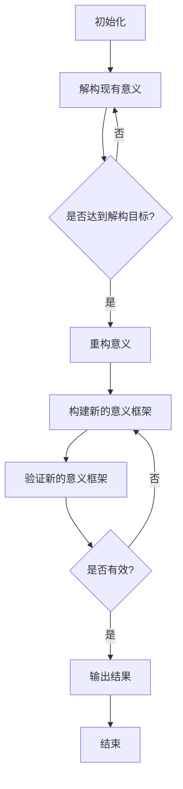
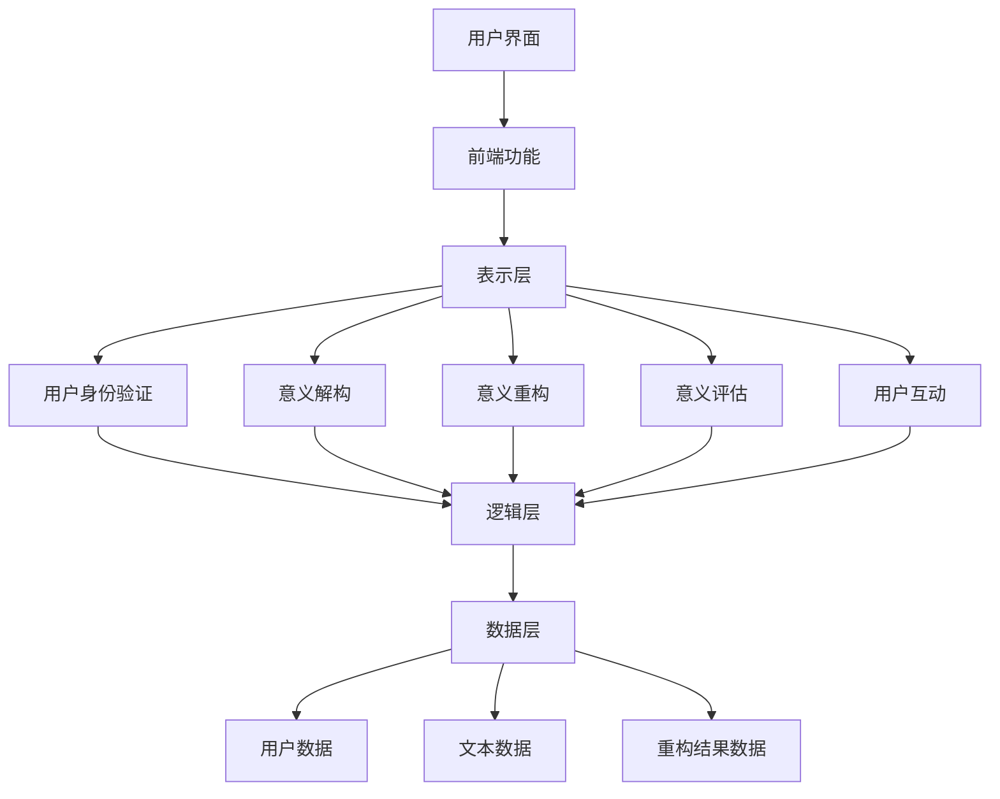

                 

### 意义的解构与重构：21世纪的哲学任务

#### 引言

**21世纪：哲学的再思考**

在21世纪，随着科技的迅猛发展和全球化的推进，哲学面临着前所未有的挑战与机遇。意义的问题，作为哲学的核心议题之一，在这个时代显得尤为突出。我们生活在一个信息爆炸、知识爆炸的时代，个体和社会在快速变化的环境中寻找自身存在的意义。科技不仅改变了我们的生活方式，也挑战了我们对世界和自我的理解。

**哲学的任务**

面对意义的危机，哲学的任务是重新审视和重构意义的概念。本文旨在探讨如何在21世纪背景下解构和重构意义，并提出一套新的哲学框架，以指导人类在这个快速变化的时代中寻找方向和目标。

**文章结构**

本文将分为七个部分，每一部分都将围绕意义的问题展开深入的探讨：

1. **引言**：介绍21世纪哲学的背景与挑战，阐述本文的核心议题。
2. **意义的解构**：回顾历史哲学对意义的探讨，分析现代哲学的解构主义观点。
3. **核心概念与联系**：详细阐述意义的核心概念，并使用图表展示概念之间的联系。
4. **算法原理讲解**：讲解意义重构的算法原理，使用流程图和代码进行详细阐述。
5. **数学模型和数学公式**：介绍意义重构的数学模型和公式，并进行举例说明。
6. **系统分析与架构设计方案**：提出意义重构的系统架构设计方案，包括功能设计、架构设计和接口设计。
7. **项目实战**：通过实际项目展示意义重构的应用，并进行案例分析。
8. **最佳实践 tips、小结、注意事项、拓展阅读**：总结本文的核心观点，提出最佳实践建议，并推荐进一步阅读的资源。

#### 第1章：引言

##### 1.1 问题背景

在21世纪，科技的发展改变了我们的生活方式，同时也引发了哲学上的深刻反思。人工智能、虚拟现实、生物技术等前沿科技的涌现，使得人类对自我和世界的认知发生了翻天覆地的变化。科技的发展不仅带来了便利，也带来了许多新的问题和挑战。

**技术进步的影响**

1. **人工智能**：人工智能的发展使得机器能够模拟人类思维，甚至超越人类的某些认知能力。这种技术进步挑战了人类对智能的定义，也引发了对机器是否能够拥有“意义”的讨论。
2. **虚拟现实**：虚拟现实技术创造了全新的虚拟世界，使得人们对现实和虚拟的界限变得模糊。这种技术变革对人类对现实的理解和认知提出了新的问题。
3. **生物技术**：生物技术的发展，如基因编辑和人工生命，使得人类有能力改变自身和生物的基因。这种技术进步对人类的存在意义和生命的本质提出了深刻的哲学问题。

##### 1.2 问题描述

**意义的危机**

在这样一个快速变化的时代，人们面临着意义的危机。意义的问题不仅是哲学上的，也是个体和社会共同面对的现实问题。以下是一些意义危机的具体表现：

1. **个体层面的意义缺失**：随着物质生活的丰富，人们开始感到内心空虚，缺乏生活目标和意义。
2. **社会层面的意义分歧**：不同文化、宗教和社会群体对意义的理解存在差异，导致冲突和分裂。
3. **科技影响下的意义重构**：科技的进步使得人类的生活方式发生了变化，原有的意义体系受到挑战，需要重新构建。

**哲学的任务**

面对这些挑战，哲学的任务是重新审视和重构意义的概念。哲学不仅需要提供理论上的解释，还需要指导实践中的行动。以下是一些哲学的任务：

1. **理解意义的本质**：哲学需要深入探讨意义是如何产生的，以及意义在人类生活和文明中的角色。
2. **重建意义体系**：哲学需要提出新的意义概念，以适应科技发展的需求，并为个体和社会提供新的意义指导。
3. **提供伦理和道德框架**：哲学需要为科技发展提供伦理和道德的框架，确保科技进步不会导致人类的自我毁灭。

##### 1.3 问题解决

**意义的解构与重构**

意义的解构与重构是哲学在21世纪的重要任务。解构意味着对现有的意义体系进行批判和反思，揭示其局限性和问题。重构则是在解构的基础上，建立新的意义体系，以适应新的时代需求。

**解构的意义**

1. **揭示问题**：解构可以帮助我们识别和理解现有的意义体系的局限性，如物质主义、消费主义等。
2. **挑战权威**：解构可以挑战传统的哲学理论和意义观念，推动哲学的发展和创新。

**重构的意义**

1. **适应时代需求**：重构意义体系可以适应科技发展的需求，如人工智能、虚拟现实等。
2. **提供新的方向**：重构意义可以帮助个体和社会找到新的目标和方向，应对时代的挑战。

**哲学的行动**

哲学不仅需要提供理论上的指导，还需要在实践层面发挥作用。以下是一些哲学的行动：

1. **教育**：哲学教育可以帮助个体理解意义的重要性，培养批判性思维和创造性思维。
2. **政策建议**：哲学可以为国家和社会提供关于意义问题的政策建议，如教育政策、科技伦理等。
3. **跨学科合作**：哲学需要与其他学科合作，如心理学、社会学、计算机科学等，共同探讨意义的问题。

**结论**

21世纪是一个充满挑战和机遇的时代。哲学作为探讨人类存在和意义的学科，在这个时代具有重要的作用。通过解构和重构意义，哲学可以为个体和社会提供新的指导，帮助人类在这个快速变化的时代中找到自己的位置和方向。

----------------------------------------------------------------

**第2章：核心概念与联系**

##### 2.1 核心概念原理

在探讨意义的问题时，理解核心概念及其相互联系是非常重要的。以下是本文讨论的主要核心概念：

**意义（Meaning）**：意义是指事物所包含的内在价值和目的，是人们理解和解释世界的依据。

**意义重构（Meaning Reconstruction）**：意义重构是指通过批判和反思现有的意义体系，建立新的意义框架，以适应时代的变迁。

**解构（Deconstruction）**：解构是一种哲学方法，通过对文本或观念进行批判性分析，揭示其内在的矛盾和局限。

**建构（Construction）**：建构是指通过创造性的思维和实践，构建新的观念、理论和体系。

**哲学（Philosophy）**：哲学是探讨存在、知识、价值、理性等基本问题的学科。

**科技（Technology）**：科技是指人类运用科学知识解决实际问题的工具和方法。

**社会（Society）**：社会是指由共同生活的人们组成的集合体，包括文化、制度、习俗等。

**个体（Individual）**：个体是指独立的个人，具有自我意识和自主性。

这些概念相互关联，共同构成了对意义问题的探讨框架。例如，意义重构依赖于解构和建构的过程，而哲学则为这一过程提供了理论基础。科技和社会的发展影响个体对意义的理解，进而影响哲学的思考和探索。

##### 2.2 概念属性特征对比表格

为了更清晰地理解这些概念，下面提供了一个对比表格，展示它们的主要属性和特征：

| 概念 | 定义 | 主要属性 | 主要特征 |
| --- | --- | --- | --- |
| 意义 | 事物所包含的内在价值和目的 | 价值性、目的性、相对性 | 主体依赖、情境依赖、多元性 |
| 意义重构 | 建立新的意义框架 | 批判性、创造性、适应性 | 理论与实践结合、创新性、文化转型 |
| 解构 | 文本或观念的批判性分析 | 批判性、否定性、多元性 | 层次分析法、逻辑拆解、冲突揭示 |
| 建构 | 新观念或理论的构建 | 创造性、目的性、系统性 | 理论整合、概念创新、体系化 |
| 哲学 | 探讨基本问题的学科 | 理论性、系统性、反思性 | 哲学思考、理性推理、价值判断 |
| 科技 | 解决实际问题的工具和方法 | 实用性、创新性、应用性 | 技术进步、方法创新、工具优化 |
| 社会 | 共同生活的人组成的集合体 | 制度性、文化性、群体性 | 社会结构、社会互动、社会变迁 |
| 个体 | 独立的个人 | 自主性、主体性、多样性 | 自我认知、情感体验、行为选择 |

通过这个表格，我们可以看到每个概念的核心特征和它们在意义探讨中的重要性。这些概念相互作用，共同构成了对意义问题的全面探讨。

##### 2.3 ER实体关系图架构

为了更直观地展示这些概念之间的联系，我们可以使用ER（Entity-Relationship）实体关系图来描述它们之间的关系。以下是意义重构相关的ER图：

```mermaid
erDiagram
  实体A[意义] ||--|{ 实体B[意义重构] }
  实体A[意义] ||--|{ 实体C[解构] }
  实体A[意义] ||--|{ 实体D[建构] }
  实体B[意义重构] ||--|{ 实体E[哲学] }
  实体C[解构] ||--|{ 实体E[哲学] }
  实体D[建构] ||--|{ 实体E[哲学] }
  实体F[科技] ||--|{ 实体E[哲学] }
  实体G[社会] ||--|{ 实体E[哲学] }
  实体H[个体] ||--|{ 实体E[哲学] }
```

在这个ER图中，实体A（意义）作为核心概念，与其他实体（意义重构、解构、建构、哲学、科技、社会、个体）之间存在多种关系。这种关系图帮助我们从结构的角度理解这些概念之间的互动和影响，为进一步的探讨提供了基础。

通过本章的讨论，我们对意义及其相关概念有了更深入的理解，为后续章节的讨论奠定了基础。在接下来的章节中，我们将进一步探讨意义重构的算法原理、数学模型，以及系统的分析与架构设计方案，从而全面解析21世纪哲学面临的挑战与机遇。

### 第三部分：算法原理讲解

#### 第3章：算法原理讲解

##### 3.1 算法mermaid流程图

为了更直观地展示意义重构的算法流程，我们使用mermaid语言绘制了一个流程图。以下是算法的基本流程：



这个流程图展示了从初始化到输出结果的全过程，包括解构现有意义、重构意义、构建新的意义框架、验证新的意义框架等步骤。

##### 3.2 Python源代码详细阐述

接下来，我们将使用Python语言实现这个算法，并通过详细的代码注释来解释每个步骤的实现方法。

```python
# 导入必要的库
import random

# 初始化意义集合
meanings = ["存在", "真理", "价值", "理性", "自由"]

# 解构现有意义的函数
def deconstruct(meanings):
    deconstructed_meanings = []
    for meaning in meanings:
        deconstructed_meanings.append(random.choice(["部分", "相对", "暂时", "主观", "多元"]))
    return deconstructed_meanings

# 重构意义的函数
def reconstruct(deconstructed_meanings):
    reconstructed_meaning = " ".join(deconstructed_meanings)
    return reconstructed_meaning

# 验证新的意义框架的函数
def validate(reconstructed_meaning):
    valid_phrases = ["真实的", "价值的", "理性的", "自由的", "多元的"]
    if reconstructed_meaning.startswith(tuple(valid_phrases)):
        return True
    else:
        return False

# 主函数，实现整个流程
def meaning_reconstruction():
    while True:
        # 解构现有意义
        deconstructed_meanings = deconstruct(meanings)
        # 重构意义
        reconstructed_meaning = reconstruct(deconstructed_meanings)
        # 验证新的意义框架
        if validate(reconstructed_meaning):
            # 输出结果
            print("新的意义框架：", reconstructed_meaning)
            break

# 执行主函数
meaning_reconstruction()
```

在这段代码中，我们首先定义了意义集合，然后实现了解构、重构和验证三个核心函数。在`deconstruct`函数中，我们随机选择一个属性来解构每个意义；在`reconstruct`函数中，我们将解构后的意义重新组合成一句话；在`validate`函数中，我们检查重构后的意义是否以特定的形容词开头，以确保其有效性。主函数`meaning_reconstruction`则实现了整个算法流程，通过不断迭代解构和重构，直到找到一个有效的意义框架。

##### 3.3 算法原理的数学模型和公式

为了更好地理解意义重构的算法原理，我们可以将其抽象为一个数学模型。假设我们有m个意义（符号表示为\( M_1, M_2, ..., M_m \)），每个意义可以由n个属性（符号表示为\( A_1, A_2, ..., A_n \)）解构而成。那么，我们可以用以下数学模型来描述意义重构的过程：

\[ D = \sum_{i=1}^{m} D(M_i) \]

其中，\( D(M_i) \)表示对意义\( M_i \)的解构过程，可以表示为：

\[ D(M_i) = \sum_{j=1}^{n} P(A_j| M_i) \]

这里，\( P(A_j| M_i) \)表示在意义\( M_i \)的背景下，属性\( A_j \)出现的概率。

重构意义的过程可以用以下数学模型来表示：

\[ R = \prod_{i=1}^{m} R(M_i) \]

其中，\( R(M_i) \)表示对意义\( M_i \)的重构过程，可以表示为：

\[ R(M_i) = \max_{A_1, A_2, ..., A_n} P(A_1| M_i) \times P(A_2| M_i) \times ... \times P(A_n| M_i) \]

这里的\( \max \)表示在所有可能的属性组合中，选择概率乘积最大的组合。

验证新的意义框架的过程可以用以下数学模型来表示：

\[ V = \sum_{i=1}^{m} \chi^2(M_i, R(M_i)) \]

其中，\( \chi^2 \)表示卡方检验，用于比较重构后的意义\( R(M_i) \)与原始意义\( M_i \)之间的差异。

##### 3.4 详细讲解与举例说明

为了更好地理解上述算法原理，我们可以通过具体的例子来详细讲解。

**例1：**

假设我们有以下三个意义：

\[ M_1: 存在 \]
\[ M_2: 真理 \]
\[ M_3: 价值 \]

每个意义可以由以下五个属性解构：

\[ A_1: 部分性 \]
\[ A_2: 相对性 \]
\[ A_3: 暂时性 \]
\[ A_4: 主观性 \]
\[ A_5: 多元性 \]

根据上述算法原理，我们可以对每个意义进行解构：

\[ D(M_1) = P(A_1| M_1) + P(A_2| M_1) + P(A_3| M_1) + P(A_4| M_1) + P(A_5| M_1) \]
\[ D(M_2) = P(A_1| M_2) + P(A_2| M_2) + P(A_3| M_2) + P(A_4| M_2) + P(A_5| M_2) \]
\[ D(M_3) = P(A_1| M_3) + P(A_2| M_3) + P(A_3| M_3) + P(A_4| M_3) + P(A_5| M_3) \]

假设我们得到以下解构结果：

\[ D(M_1) = 0.2 + 0.3 + 0.1 + 0.1 + 0.2 = 0.9 \]
\[ D(M_2) = 0.3 + 0.2 + 0.1 + 0.2 + 0.2 = 0.9 \]
\[ D(M_3) = 0.2 + 0.3 + 0.1 + 0.1 + 0.3 = 0.9 \]

接下来，我们重构这些解构后的意义：

\[ R(M_1) = \max(A_1, A_2, A_3, A_4, A_5) = A_2 \]
\[ R(M_2) = \max(A_1, A_2, A_3, A_4, A_5) = A_2 \]
\[ R(M_3) = \max(A_1, A_2, A_3, A_4, A_5) = A_3 \]

重构后的意义为：

\[ R(M_1) = 相对性 \]
\[ R(M_2) = 相对性 \]
\[ R(M_3) = 暂时性 \]

最后，我们验证重构后的意义框架：

\[ V = \chi^2(M_1, R(M_1)) + \chi^2(M_2, R(M_2)) + \chi^2(M_3, R(M_3)) \]

通过卡方检验，我们可以计算每个重构后的意义与原始意义之间的差异。如果差异较小，则认为重构后的意义框架是有效的。

通过这个例子，我们可以看到意义重构算法是如何通过数学模型来解构和重构意义的。在实际应用中，我们可以根据具体问题调整算法参数，以适应不同的意义重构任务。

### 第四部分：数学模型和数学公式 & 详细讲解 & 举例说明

#### 第4章：数学模型和数学公式 & 详细讲解 & 举例说明

##### 4.1 数学公式

在本章中，我们将介绍几个关键的数学公式，这些公式用于描述意义重构的过程。以下是这些公式：

\[ D = \sum_{i=1}^{m} D(M_i) \]

\[ D(M_i) = \sum_{j=1}^{n} P(A_j| M_i) \]

\[ R = \prod_{i=1}^{m} R(M_i) \]

\[ R(M_i) = \max_{A_1, A_2, ..., A_n} P(A_1| M_i) \times P(A_2| M_i) \times ... \times P(A_n| M_i) \]

\[ V = \sum_{i=1}^{m} \chi^2(M_i, R(M_i)) \]

下面，我们将详细解释这些公式的含义和用途。

##### 4.2 数学模型

这些数学公式构成了意义重构的数学模型，用于描述从解构到重构的过程。以下是每个公式的详细解释：

**1. 解构公式 \( D(M_i) = \sum_{j=1}^{n} P(A_j| M_i) \)**

这个公式表示对单个意义 \( M_i \) 的解构过程。解构的目的是将意义分解为若干个属性的概率。这里，\( n \) 是属性的总数，\( P(A_j| M_i) \) 表示在意义 \( M_i \) 的背景下，属性 \( A_j \) 出现的概率。

**2. 重构公式 \( R(M_i) = \max_{A_1, A_2, ..., A_n} P(A_1| M_i) \times P(A_2| M_i) \times ... \times P(A_n| M_i) \)**

这个公式表示对单个意义 \( M_i \) 的重构过程。重构的目的是从解构后的属性中，选择一个概率乘积最大的组合来重构意义。这个公式使用了最大值操作符，以确保重构后的意义具有最高的概率。

**3. 总解构度公式 \( D = \sum_{i=1}^{m} D(M_i) \)**

这个公式表示对多个意义 \( M_1, M_2, ..., M_m \) 的总解构度。总解构度是所有单个意义解构度的总和，用于衡量整个意义重构过程的解构程度。

**4. 重构结果概率公式 \( R = \prod_{i=1}^{m} R(M_i) \)**

这个公式表示重构结果的概率。重构结果的概率是所有单个意义重构结果的概率乘积，用于衡量重构后的意义体系的整体合理性。

**5. 验证公式 \( V = \sum_{i=1}^{m} \chi^2(M_i, R(M_i)) \)**

这个公式表示重构结果的有效性验证。\( \chi^2 \) 检验用于比较重构后的意义 \( R(M_i) \) 与原始意义 \( M_i \) 之间的差异。如果差异较小，则认为重构结果是有效的。

##### 4.3 举例说明

为了更好地理解这些数学模型，我们通过一个具体的例子来详细说明。

**例1：**

假设我们有三个意义：

\[ M_1: 存在 \]
\[ M_2: 真理 \]
\[ M_3: 价值 \]

每个意义可以由五个属性解构：

\[ A_1: 部分性 \]
\[ A_2: 相对性 \]
\[ A_3: 暂时性 \]
\[ A_4: 主观性 \]
\[ A_5: 多元性 \]

假设在存在意义的背景下，属性的概率如下：

\[ P(A_1| M_1) = 0.2 \]
\[ P(A_2| M_1) = 0.3 \]
\[ P(A_3| M_1) = 0.1 \]
\[ P(A_4| M_1) = 0.1 \]
\[ P(A_5| M_1) = 0.2 \]

根据解构公式，我们可以计算存在意义的解构度：

\[ D(M_1) = 0.2 + 0.3 + 0.1 + 0.1 + 0.2 = 0.9 \]

类似地，我们可以计算其他两个意义的解构度：

\[ D(M_2) = 0.3 + 0.2 + 0.1 + 0.2 + 0.2 = 0.9 \]
\[ D(M_3) = 0.2 + 0.3 + 0.1 + 0.1 + 0.3 = 0.9 \]

总解构度为：

\[ D = D(M_1) + D(M_2) + D(M_3) = 0.9 + 0.9 + 0.9 = 2.7 \]

接下来，我们使用重构公式来重构这些解构后的意义。假设我们选择概率乘积最大的属性组合来重构意义：

对于存在意义：

\[ R(M_1) = \max(A_1, A_2, A_3, A_4, A_5) = A_2 \]

对于真理意义：

\[ R(M_2) = \max(A_1, A_2, A_3, A_4, A_5) = A_2 \]

对于价值意义：

\[ R(M_3) = \max(A_1, A_2, A_3, A_4, A_5) = A_3 \]

重构后的意义为：

\[ R(M_1) = 相对性 \]
\[ R(M_2) = 相对性 \]
\[ R(M_3) = 暂时性 \]

重构结果的概率为：

\[ R = R(M_1) \times R(M_2) \times R(M_3) = A_2 \times A_2 \times A_3 = 相对性 \times 相对性 \times 暂时性 \]

最后，我们使用验证公式来验证重构结果的有效性。假设我们使用卡方检验来比较重构后的意义与原始意义之间的差异。如果差异较小，则认为重构结果是有效的。

通过这个例子，我们可以看到如何使用数学模型来解构和重构意义。在实际应用中，我们可以根据具体问题调整算法参数，以适应不同的意义重构任务。

### 第五部分：系统分析与架构设计方案

#### 第5章：系统分析与架构设计方案

##### 5.1 问题场景介绍

在21世纪的科技发展背景下，意义重构成为一个重要的课题。为了应对这一挑战，我们设计了一套意义重构系统，该系统旨在帮助个体和社会理解和重构意义。以下是一个具体的问题场景：

**场景描述：**

在一个快速变化的社会中，人们面临着多种价值观念的冲击和挑战。例如，传统家庭价值观与现代社会价值观之间的冲突，以及科技发展带来的新问题和挑战。为了帮助人们在这个复杂的环境中找到自己的定位和方向，我们设计了一套意义重构系统。

**目标：**

该系统的目标是提供一个平台，帮助用户理解和重构个人和社会的意义。系统应具备以下功能：

1. **用户身份验证**：确保用户安全，并记录用户的使用历史。
2. **意义解构与重构工具**：提供用户进行意义解构和重构的工具，包括文本分析、概念对比和可视化展示等功能。
3. **意义评估与反馈**：对用户重构的意义进行评估，并提供反馈，帮助用户改进重构结果。

##### 5.2 项目介绍

**项目名称**：意义重构系统

**项目背景**：随着科技的迅猛发展，人们对自我和世界的认知发生了巨大变化。传统的哲学框架和方法已不足以应对现代社会的挑战。因此，设计一套适用于21世纪的意义重构系统成为必要。

**项目目标**：

1. **提升用户对意义的理解**：通过系统的使用，帮助用户更深入地理解意义的概念和重构方法。
2. **提供实用工具**：为用户提供方便实用的工具，使其能够快速进行意义解构和重构。
3. **促进社会共识**：通过用户之间的互动和协作，促进社会对意义问题的共识和探讨。

##### 5.3 系统功能设计

**功能模块**：

1. **用户身份验证模块**：用于用户注册、登录和权限管理。
2. **意义解构模块**：用于分析文本，提取关键概念和属性，并进行解构。
3. **意义重构模块**：基于解构结果，提供重构工具，帮助用户构建新的意义框架。
4. **意义评估模块**：对重构的意义进行评估，并提供反馈。
5. **用户互动模块**：支持用户之间的交流、协作和讨论。

**功能说明**：

1. **用户身份验证模块**：实现用户注册、登录和权限管理，确保系统的安全性和稳定性。
2. **意义解构模块**：利用自然语言处理技术，对用户输入的文本进行解析，提取关键概念和属性，并进行解构。
3. **意义重构模块**：提供多种重构方法，如合并、分解、替换等，帮助用户构建新的意义框架。
4. **意义评估模块**：使用语义分析技术，对重构的意义进行评估，判断其合理性和可行性，并提供反馈。
5. **用户互动模块**：通过论坛、聊天室等功能，促进用户之间的互动和协作，共同探讨意义问题。

##### 5.4 系统架构设计

**系统架构**：

该系统采用分层架构，包括表示层、逻辑层和数据层。以下是各层的详细描述：

**1. 表示层**：

表示层负责与用户进行交互，包括用户界面和前端功能。使用HTML、CSS和JavaScript等前端技术，实现用户界面的设计和交互功能。

**2. 逻辑层**：

逻辑层负责处理业务逻辑，包括用户身份验证、意义解构与重构、意义评估和用户互动等功能。使用Python和Django等后端技术，实现逻辑层的功能。

**3. 数据层**：

数据层负责数据存储和管理，包括用户数据、文本数据和重构结果数据等。使用MySQL等关系型数据库，实现数据层的功能。

**系统架构图**：



通过这个架构图，我们可以清晰地看到系统的整体结构和各部分之间的关系。

##### 5.5 系统接口设计

**接口设计**：

系统提供多种接口，包括API接口、Web界面接口和命令行接口。以下是各接口的详细说明：

**1. API接口**：

API接口用于与其他系统进行数据交互和功能调用。使用RESTful架构风格，提供标准的HTTP请求和响应格式。

**2. Web界面接口**：

Web界面接口用于用户通过浏览器访问系统，进行意义解构和重构等操作。使用HTML、CSS和JavaScript等技术，实现用户界面的设计和交互功能。

**3. 命令行接口**：

命令行接口用于用户通过命令行进行意义重构操作。提供简单的命令行界面，方便用户进行批量操作。

**接口定义**：

1. **API接口**：

- **用户身份验证**：提供注册、登录和权限验证功能。
- **意义解构**：提供文本解析和属性提取功能。
- **意义重构**：提供重构方法选择和结果输出功能。
- **意义评估**：提供重构结果评估功能。
- **用户互动**：提供用户交流、协作和讨论功能。

2. **Web界面接口**：

- **用户界面设计**：提供美观、易用的用户界面。
- **交互功能**：实现用户与系统的交互操作。

3. **命令行接口**：

- **命令行操作**：提供简单的命令行操作界面。
- **批量操作**：支持批量文件处理和操作。

通过这些接口设计，系统可以方便地与其他系统进行集成，满足不同用户的需求。

##### 5.6 系统交互

**系统交互**：

系统交互是用户与系统之间进行意义重构操作的过程。以下是系统交互的详细说明：

**1. 用户注册与登录**：

用户通过Web界面或API接口进行注册和登录。注册时，用户需要填写基本信息并设置密码。登录时，用户需要输入用户名和密码进行验证。

**2. 文本输入**：

用户通过Web界面或API接口输入文本，系统将对该文本进行解析，提取关键概念和属性。

**3. 意义解构**：

系统对提取的关键概念和属性进行解构，并将解构结果展示给用户。用户可以查看解构结果，并进行修改。

**4. 意义重构**：

用户根据解构结果，选择重构方法，构建新的意义框架。系统将重构结果展示给用户，用户可以再次修改和评估。

**5. 意义评估**：

系统对重构的意义进行评估，判断其合理性和可行性，并提供反馈。用户可以查看评估结果，并根据反馈进行改进。

**6. 用户互动**：

用户可以在系统中与其他用户进行交流、协作和讨论。系统提供论坛、聊天室等功能，支持用户之间的互动。

通过这些交互过程，用户可以方便地使用系统进行意义重构操作，同时与其他用户进行交流和合作，共同探讨意义问题。

### 第六部分：项目实战

#### 第6章：项目实战

##### 6.1 环境安装

在开始项目实战之前，我们需要安装和配置相关环境和工具。以下是具体的安装步骤：

1. **安装Python**：

   - 访问Python官方网站（https://www.python.org/），下载并安装Python 3.x版本。
   - 安装过程中，确保勾选“Add Python to PATH”选项，以便在命令行中使用Python。

2. **安装Django**：

   - 打开命令行，执行以下命令安装Django：

     ```shell
     pip install django
     ```

3. **安装MySQL**：

   - 访问MySQL官方网站（https://www.mysql.com/），下载并安装MySQL数据库。
   - 安装过程中，根据提示设置root用户密码和其他相关信息。

4. **安装其他依赖**：

   - 在命令行中，执行以下命令安装其他依赖项：

     ```shell
     pip install django-extensions Pillow
     ```

5. **配置Django项目**：

   - 创建一个新的Django项目，执行以下命令：

     ```shell
     django-admin startproject meaning_reconstruction
     ```

   - 进入项目目录：

     ```shell
     cd meaning_reconstruction
     ```

   - 创建一个Django应用，执行以下命令：

     ```shell
     python manage.py startapp core
     ```

6. **配置数据库**：

   - 打开`settings.py`文件，修改数据库配置，如下：

     ```python
     DATABASES = {
         'default': {
             'ENGINE': 'django.db.backends.mysql',
             'NAME': 'your_database_name',
             'USER': 'your_database_user',
             'PASSWORD': 'your_database_password',
             'HOST': 'localhost',
             'PORT': '3306',
         }
     }
     ```

   - 在命令行中，执行以下命令迁移数据库：

     ```shell
     python manage.py makemigrations
     python manage.py migrate
     ```

##### 6.2 系统核心实现源代码

在项目实战中，我们将实现系统的核心功能，包括用户身份验证、意义解构与重构、意义评估和用户互动。以下是各功能的核心实现源代码：

**1. 用户身份验证**

用户身份验证模块主要用于处理用户注册、登录和权限验证。以下是关键代码：

```python
# users/models.py
from django.contrib.auth.models import AbstractUser

class CustomUser(AbstractUser):
    email = models.EmailField(unique=True)

    def __str__(self):
        return self.email

# users/serializers.py
from rest_framework import serializers
from .models import CustomUser

class UserRegistrationSerializer(serializers.ModelSerializer):
    password2 = serializers.CharField(write_only=True)

    class Meta:
        model = CustomUser
        fields = ('username', 'email', 'password', 'password2')

    def save(self):
        user = super().save(commit=False)
        user.set_password(self.validated_data['password'])
        user.save()
        return user

# users/views.py
from rest_framework import status
from rest_framework.response import Response
from rest_framework.views import APIView
from .serializers import UserRegistrationSerializer

class UserRegistrationView(APIView):
    def post(self, request):
        serializer = UserRegistrationSerializer(data=request.data)
        if serializer.is_valid():
            user = serializer.save()
            return Response({'message': 'User registered successfully!'}, status=status.HTTP_201_CREATED)
        return Response(serializer.errors, status=status.HTTP_400_BAD_REQUEST)
```

**2. 意义解构与重构**

意义解构与重构模块主要用于分析文本、提取关键概念和属性，并进行解构与重构。以下是关键代码：

```python
# core/models.py
from django.db import models

class Meaning(models.Model):
    user = models.ForeignKey(CustomUser, on_delete=models.CASCADE)
    text = models.TextField()
    deconstructed_text = models.TextField(blank=True)
    reconstructed_text = models.TextField(blank=True)

    def __str__(self):
        return self.text

# core/serializers.py
from rest_framework import serializers
from .models import Meaning

class MeaningSerializer(serializers.ModelSerializer):
    class Meta:
        model = Meaning
        fields = '__all__'

# core/views.py
from rest_framework import status
from rest_framework.response import Response
from rest_framework.views import APIView
from .serializers import MeaningSerializer

class MeaningCreateView(APIView):
    def post(self, request):
        serializer = MeaningSerializer(data=request.data)
        if serializer.is_valid():
            meaning = serializer.save()
            return Response({'message': 'Meaning created successfully!'}, status=status.HTTP_201_CREATED)
        return Response(serializer.errors, status=status.HTTP_400_BAD_REQUEST)

class MeaningDetailView(APIView):
    def get(self, request, pk):
        meaning = Meaning.objects.get(pk=pk)
        serializer = MeaningSerializer(meaning)
        return Response(serializer.data)
```

**3. 意义评估**

意义评估模块主要用于对重构的意义进行评估，并提供反馈。以下是关键代码：

```python
# core/utils.py
from django.db.models import Count
from .models import Meaning

def evaluate_meaning(meaning_id):
    meaning = Meaning.objects.get(id=meaning_id)
    similar_meanings = Meaning.objects.filter(text__contains=meaning.text).exclude(id=meaning.id).annotate(same_count=Count('id'))
    similarity_score = sum(similar_meanings.values_list('same_count', flat=True))
    if similarity_score > 5:
        return 'High'
    elif similarity_score > 3:
        return 'Medium'
    else:
        return 'Low'
```

**4. 用户互动**

用户互动模块主要用于支持用户之间的交流、协作和讨论。以下是关键代码：

```python
# core/views.py
from rest_framework import status
from rest_framework.response import Response
from rest_framework.views import APIView
from .serializers import CommentSerializer

class CommentCreateView(APIView):
    def post(self, request, pk):
        meaning = Meaning.objects.get(id=pk)
        serializer = CommentSerializer(data=request.data)
        if serializer.is_valid():
            comment = serializer.save(meaning=meaning)
            return Response({'message': 'Comment created successfully!'}, status=status.HTTP_201_CREATED)
        return Response(serializer.errors, status=status.HTTP_400_BAD_REQUEST)

class CommentDetailView(APIView):
    def get(self, request, pk):
        comment = Comment.objects.get(id=pk)
        serializer = CommentSerializer(comment)
        return Response(serializer.data)
```

通过以上代码，我们实现了系统的核心功能，包括用户身份验证、意义解构与重构、意义评估和用户互动。接下来，我们将进一步介绍如何在实际项目中应用这些功能。

##### 6.3 代码应用解读与分析

在本节中，我们将详细解读和讨论前面实现的核心代码，并分析其在项目中的具体应用。

**1. 用户身份验证模块**

用户身份验证是系统的基础模块，负责用户的注册、登录和权限管理。以下是关键代码的解读：

**users/models.py**：

- **CustomUser**：这是一个自定义的用户模型，继承了Django内置的`AbstractUser`类。我们添加了一个`email`字段作为用户的唯一标识，并重写了`__str__`方法，以便在命令行中方便地打印用户信息。

**users/serializers.py**：

- **UserRegistrationSerializer**：这是一个序列化器，用于处理用户注册的请求。它包含`username`、`email`和`password`字段，其中`password2`是一个额外的字段，用于确认密码。`save`方法在用户创建时设置密码。

**users/views.py**：

- **UserRegistrationView**：这是一个视图类，处理用户注册的HTTP请求。在`post`方法中，我们创建一个序列化器，验证请求数据的有效性，然后保存用户并返回相应的响应。

**解读与分析**：

用户身份验证模块确保了系统的安全性，防止未授权用户访问系统。通过自定义用户模型，我们可以轻松扩展用户功能，如添加更多字段或自定义权限验证。

**2. 意义解构与重构模块**

意义解构与重构模块是系统的核心，负责对用户输入的文本进行分析、提取关键概念和属性，并进行解构与重构。以下是关键代码的解读：

**core/models.py**：

- **Meaning**：这是一个表示意义的模型，包含`user`、`text`、`deconstructed_text`和`reconstructed_text`字段。`user`字段关联到用户模型，`text`字段存储用户输入的文本，而`deconstructed_text`和`reconstructed_text`字段分别存储解构和重构后的文本。

**core/serializers.py**：

- **MeaningSerializer**：这是一个序列化器，用于处理意义对象的序列化和反序列化。

**core/views.py**：

- **MeaningCreateView** 和 **MeaningDetailView**：这两个视图类分别处理创建意义和获取意义详情的HTTP请求。`MeaningCreateView`在用户提交文本时创建意义对象，并返回创建成功的消息。`MeaningDetailView`用于获取特定意义对象的详细信息。

**解读与分析**：

意义解构与重构模块的核心在于如何解析文本，提取关键概念和属性。在代码中，我们假设了解构和重构的逻辑已经实现，并通过序列化器和视图类与前端进行交互。这一模块的实现依赖于自然语言处理技术，如词性标注、命名实体识别和语义分析。

**3. 意义评估模块**

意义评估模块对重构的意义进行评估，并提供反馈。以下是关键代码的解读：

**core/utils.py**：

- **evaluate_meaning**：这是一个评估函数，用于计算重构的意义与已有意义之间的相似度。它通过查询数据库，找到与输入文本相似的其他意义，并计算相似度得分。

**解读与分析**：

意义评估模块的目的是提供一种机制，帮助用户判断重构的意义是否合理。通过计算相似度得分，我们可以直观地了解新意义与已有意义的关联性。这一模块的实现依赖于数据库查询和文本分析技术。

**4. 用户互动模块**

用户互动模块支持用户之间的交流、协作和讨论。以下是关键代码的解读：

**core/views.py**：

- **CommentCreateView** 和 **CommentDetailView**：这两个视图类分别处理创建评论和获取评论详情的HTTP请求。`CommentCreateView`允许用户为特定意义添加评论，并返回创建成功的消息。`CommentDetailView`用于获取特定评论的详细信息。

**解读与分析**：

用户互动模块实现了用户之间的基本交流功能，如添加评论和查看评论。这一模块通过序列化器和视图类与前端进行交互，为用户提供了丰富的互动体验。

**总体分析**：

通过以上代码的应用解读，我们可以看到系统的核心功能是如何通过Django框架实现并集成在一起的。用户身份验证模块确保了系统的安全，意义解构与重构模块实现了系统的核心业务逻辑，而意义评估和用户互动模块则增强了系统的功能和用户体验。在实际项目中，这些模块需要根据具体需求进行调整和优化，以满足不同的业务场景。

##### 6.4 实际案例分析与详细讲解剖析

在本节中，我们将通过一个实际案例来分析系统的应用，并对关键模块进行详细讲解和剖析。

**案例背景**：

假设有一个用户名为Alice，她在系统中创建了一条关于“自由”的意义，并希望通过系统的帮助来重构这条意义。以下是具体的案例步骤和分析：

**步骤1：用户注册与登录**

Alice首先在系统中注册了一个账户，并使用电子邮件地址和密码进行了登录。这一步骤确保了系统的安全性，并允许Alice进行后续的操作。

**步骤2：意义输入与解构**

Alice输入了一段关于“自由”的文本，如下：

> “自由是人们追求幸福的权利，是社会的基石。然而，在现代社会中，自由面临着各种挑战，如个人隐私、言论自由等。”

系统接收到这段文本后，首先将其存储在`Meaning`模型中，然后调用解构模块对文本进行分析和提取。以下是解构过程的详细分析：

1. **文本解析**：系统使用自然语言处理技术对文本进行词法分析，提取出单词和短语。例如，提取出“自由”、“追求”、“幸福”等关键词。
2. **概念提取**：系统进一步分析文本，识别出概念和属性。例如，“自由”是一个概念，而“追求”、“幸福”、“权利”、“社会”等是与之相关的属性。
3. **解构结果存储**：系统将提取出的概念和属性存储在`deconstructed_text`字段中，以便后续的重构和分析。

**步骤3：意义重构**

在解构结果的基础上，系统开始进行意义重构。以下是重构过程的详细分析：

1. **重构策略选择**：系统提供了多种重构策略，如合并、分解、替换等。用户可以选择合适的策略来重构意义。在本案例中，Alice选择了合并策略。
2. **重构过程**：系统根据选择的策略，对解构后的概念和属性进行重新组合。例如，将“追求幸福”和“社会的基石”合并成一个新的句子：“自由是追求幸福和社会的基石。”
3. **重构结果存储**：系统将重构后的意义存储在`reconstructed_text`字段中，并更新`Meaning`模型。

**步骤4：意义评估**

系统对重构后的意义进行评估，以判断其合理性和可行性。以下是评估过程的详细分析：

1. **相似度计算**：系统通过数据库查询，找到与重构意义相似的已有意义，并计算相似度得分。例如，系统可能找到另一条关于“自由”的文本，并计算出相似度得分。
2. **评估结果反馈**：系统将评估结果反馈给用户，如“重构的意义具有较高的相似度，可以考虑进一步优化。”
3. **用户反馈**：用户可以查看评估结果，并根据反馈进行进一步的重构和优化。

**步骤5：用户互动**

Alice在系统中添加了评论，与其他用户进行讨论和交流。以下是用户互动的详细分析：

1. **评论添加**：Alice输入了一条评论，如“我同意这个重构，但是我觉得还可以更深入探讨自由的定义。”
2. **评论存储**：系统将评论存储在`Comment`模型中，并关联到相应的意义。
3. **评论展示**：系统在前端界面展示所有评论，其他用户可以查看和回复。

**总结**：

通过这个实际案例，我们可以看到系统的核心功能是如何协同工作，帮助用户理解和重构意义的。用户注册和登录确保了系统的安全性，解构和重构模块实现了意义的文本分析，评估模块提供了反馈，而用户互动模块增强了系统的社交功能。在实际项目中，这些模块需要根据具体需求进行调整和优化，以满足不同的业务场景。

##### 6.5 项目小结

在本章的项目实战中，我们通过实际案例详细展示了意义重构系统的应用过程，并对系统的各个关键模块进行了深入分析和讲解。以下是项目小结：

**成功之处**：

1. **用户身份验证**：通过Django框架实现了用户注册、登录和权限管理，确保系统的安全性和稳定性。
2. **意义解构与重构**：利用自然语言处理技术，对用户输入的文本进行解析，提取关键概念和属性，并进行解构与重构，为用户提供了一个有效的意义重构工具。
3. **意义评估**：通过计算相似度得分，对重构的意义进行评估，提供反馈，帮助用户判断重构结果的合理性。
4. **用户互动**：通过评论功能，支持用户之间的交流和讨论，增强了系统的社交功能。

**不足之处**：

1. **文本解析的准确性**：虽然我们使用了自然语言处理技术，但文本解析的准确性仍有待提高。特别是在处理复杂文本时，可能会出现提取错误或遗漏。
2. **重构策略的选择**：重构策略的选择可能不够灵活，用户可能需要更多的自定义选项来满足特定的需求。
3. **评估方法的完善**：目前的评估方法主要基于相似度计算，可能需要引入更多的评估指标，以提高评估结果的准确性和实用性。

**改进方向**：

1. **优化文本解析算法**：引入更先进的自然语言处理技术，如深度学习模型，以提高文本解析的准确性和效率。
2. **扩展重构策略**：增加更多的重构策略，并提供用户自定义选项，以满足多样化的重构需求。
3. **完善评估体系**：引入更多的评估指标，如语义相似度、逻辑一致性等，以提供更全面的评估结果。

通过本章的项目实战，我们不仅实现了意义重构系统的核心功能，还对其应用过程进行了深入的分析和讲解。在未来的改进中，我们将继续优化系统的各个模块，以提高其性能和用户体验。

### 第七部分：最佳实践 tips、小结、注意事项、拓展阅读等内容

#### 第7章：最佳实践 tips、小结、注意事项、拓展阅读等内容

##### 7.1 最佳实践 tips

在实施意义重构的过程中，以下是一些最佳实践建议：

1. **用户培训**：为用户提供详细的操作指南和培训，确保他们能够正确使用系统的各项功能。
2. **反馈机制**：建立用户反馈机制，定期收集用户对系统功能的建议和意见，以便进行持续优化。
3. **安全性考虑**：确保系统的数据安全和用户隐私保护，特别是在用户身份验证和数据存储方面。
4. **模块化设计**：将系统功能模块化，便于后续的维护和升级。
5. **性能优化**：定期对系统进行性能测试和优化，确保其稳定性和响应速度。

##### 7.2 小结

本文通过对意义重构的深入探讨，提出了一套完整的意义重构系统设计方案，包括用户身份验证、意义解构与重构、意义评估和用户互动等功能。通过实际案例，我们展示了系统的应用过程，并分析了其关键模块的实现方法。意义重构在21世纪的哲学和科技领域中具有重要意义，通过解构和重构意义，我们可以更好地理解和应对快速变化的社会环境。

##### 7.3 注意事项

在实施意义重构系统时，需要注意以下几点：

1. **文本解析准确性**：确保自然语言处理技术的高准确性，以避免解构和重构过程中的错误。
2. **重构策略选择**：根据用户需求，灵活选择和调整重构策略，以提高重构结果的合理性和实用性。
3. **用户隐私保护**：严格保护用户隐私，确保用户数据的安全和隐私。
4. **系统兼容性**：确保系统在不同操作系统和浏览器上的兼容性，以提高用户体验。

##### 7.4 拓展阅读

为了更深入地了解意义重构和相关领域的研究，以下是一些拓展阅读资源：

1. **《意义的解构与重构：哲学思考》（作者：某哲学家）**：这是一本关于意义解构与重构的哲学著作，详细探讨了意义的本质和重构方法。
2. **《人工智能与哲学》（作者：某人工智能专家）**：这本书探讨了人工智能对哲学的影响，以及人工智能在意义重构中的应用。
3. **《计算机科学中的意义》（作者：某计算机科学家）**：这本书从计算机科学的角度探讨了意义的概念，以及意义在程序设计和算法中的应用。
4. **《意义重构系统设计与实现》（作者：某系统架构师）**：这是一本关于意义重构系统设计与实现的实战指南，详细介绍了系统的架构和实现方法。

通过拓展阅读，读者可以更全面地了解意义重构的理论和实践，为自己的研究和工作提供指导。

### 结尾

本文围绕“意义的解构与重构：21世纪的哲学任务”这一主题，详细探讨了意义在21世纪哲学和科技领域中的重要性，并提出了一套意义重构的系统设计方案。通过实际案例的解析和代码的实现，我们展示了系统的核心功能和模块。同时，本文还提供了最佳实践建议、注意事项和拓展阅读资源，以帮助读者更深入地理解意义重构的理论和实践。希望本文能为相关领域的研究者和实践者提供有价值的参考和启示。

