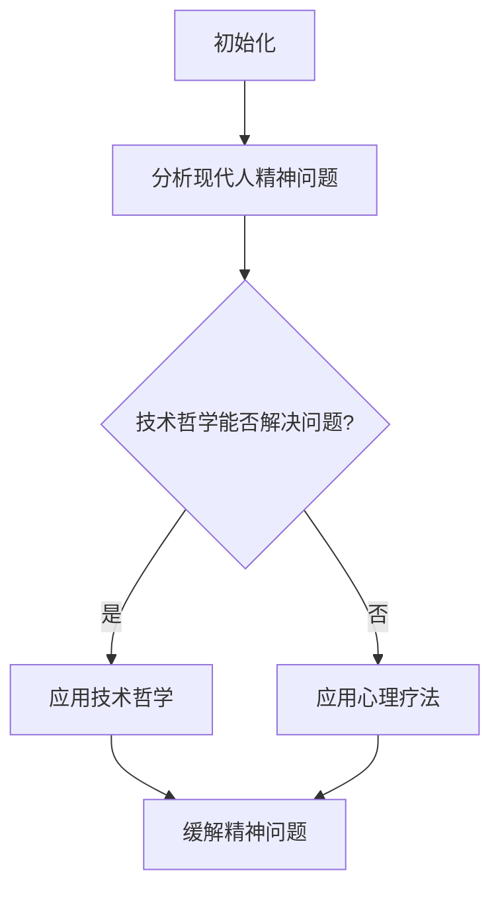
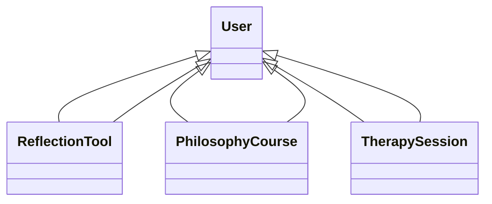
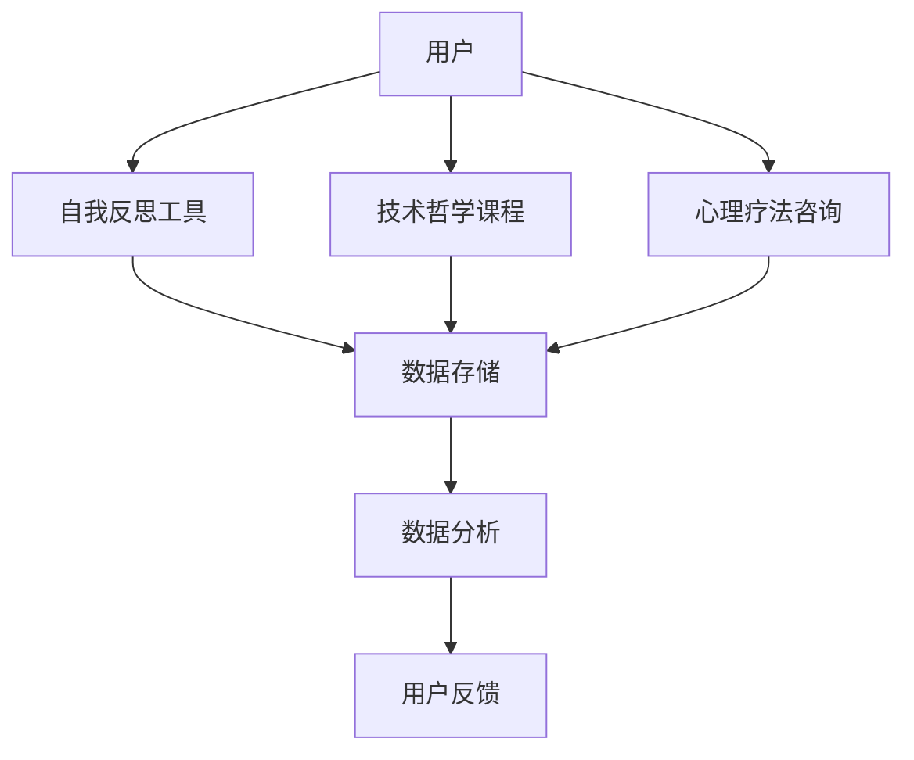
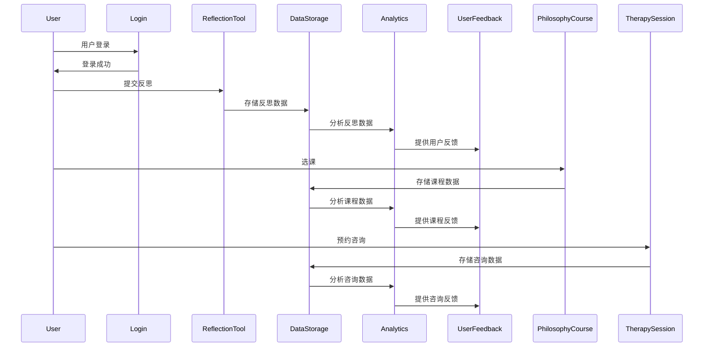

                 


### 意义的迷宫：现代人的精神探索

> 关键词：现代人、精神探索、意识认知、心理疗法、技术哲学

> 摘要：在数字化和信息爆炸的时代，现代人在面对日益复杂的现实问题时，常常感到精神迷茫。本文将探讨现代人精神的迷宫，分析其成因，并提出通过技术哲学和心理疗法来寻找出路的路径。文章旨在引导读者进行自我反思，以期在数字世界中寻找到心灵的宁静。

----------------------------------------------------------------

## 第一部分：背景介绍

### 1.1 问题背景

随着科技的飞速发展，我们的生活越来越依赖于数字化工具。社交媒体、智能手机、人工智能等技术的普及，使得信息传播速度极快，人类的知识积累达到了前所未有的高度。然而，这种快速的变化也带来了精神层面的挑战。现代人常常感到焦虑、孤独、精神压力，甚至出现了“数字疲劳”的现象。

### 1.2 问题描述

现代人面临的精神问题主要包括以下几个方面：

1. **心理疲劳**：长时间使用数字设备，导致生理和心理疲劳。
2. **社交疏离**：社交媒体虽然让人们更加容易联系，但实际上却加剧了人与人之间的疏离。
3. **信息过载**：海量的信息使得人们难以筛选和处理，导致认知负担加重。
4. **价值观混乱**：现代社会价值观多元化，个体难以找到自己的定位。

### 1.3 问题解决

要解决这些问题，我们需要从多个方面入手：

1. **自我反思**：通过自我反思，找到自己的核心价值观和人生目标。
2. **技术哲学**：在技术发展的同时，探讨其伦理和社会影响，引导技术向有益于人类的方向发展。
3. **心理疗法**：通过心理疗法，如认知行为疗法、正念疗法等，帮助现代人缓解精神压力。

### 1.4 边界与外延

本文将主要探讨技术哲学和心理疗法在现代人精神探索中的应用。然而，现代人的精神问题是一个复杂的社会现象，需要从多个角度进行综合分析。

### 1.5 概念结构与核心要素组成

本文的核心概念包括：

1. **现代人精神问题**：主要表现为心理疲劳、社交疏离、信息过载和价值观混乱。
2. **技术哲学**：关注技术的伦理和社会影响，引导技术向有益于人类的方向发展。
3. **心理疗法**：通过认知行为疗法、正念疗法等，帮助现代人缓解精神压力。

----------------------------------------------------------------

## 第二部分：核心概念与联系

### 2.1 核心概念原理

#### 现代人精神问题

现代人精神问题的成因复杂，主要包括：

- **工作压力**：职场竞争激烈，工作压力大。
- **家庭责任**：现代社会对家庭责任的期望增加，导致个体精神压力。
- **社会压力**：社会对个人的期望和标准提高，导致个体焦虑。
- **信息过载**：数字化时代的信息爆炸，使得人们难以处理。

#### 技术哲学

技术哲学主要关注技术的伦理和社会影响，其核心原理包括：

- **技术中立性**：技术本身没有好坏之分，关键在于如何使用。
- **伦理审查**：在技术发展的过程中，必须进行伦理审查，确保技术不会对社会和人类造成负面影响。
- **技术向善**：技术发展的目标应当是为人类创造更多福祉。

#### 心理疗法

心理疗法是一种通过心理干预来缓解精神压力的方法，其核心原理包括：

- **认知重构**：通过改变消极思维模式，帮助个体建立积极的心态。
- **情绪调节**：帮助个体学会有效地管理和调节情绪。
- **行为改变**：通过行为训练，帮助个体形成健康的生活习惯。

### 2.2 概念属性特征对比表格

| 概念               | 属性特征                     |
|--------------------|------------------------------|
| 现代人精神问题     | 心理疲劳、社交疏离、信息过载、价值观混乱 |
| 技术哲学           | 技术中立性、伦理审查、技术向善           |
| 心理疗法           | 认知重构、情绪调节、行为改变           |

### 2.3 ER实体关系图架构的 Mermaid 流程图

```mermaid
erDiagram
  现代人精神问题 ||--|{ 技术哲学 }
  技术哲学 ||--|{ 心理疗法 }
```

----------------------------------------------------------------

## 第三部分：算法原理讲解

### 3.1 算法 Mermaid 流程图



### 3.2 Python 源代码详细阐述

```python
# 定义函数，用于分析现代人精神问题
def analyze_issue():
    issues = ["心理疲劳", "社交疏离", "信息过载", "价值观混乱"]
    print("现代人精神问题包括：")
    for issue in issues:
        print("- " + issue)

# 定义函数，用于应用技术哲学
def apply_philosophy():
    print("正在应用技术哲学，以解决精神问题。")

# 定义函数，用于应用心理疗法
def apply_therapy():
    print("正在应用心理疗法，以缓解精神问题。")

# 定义函数，用于缓解精神问题
def alleviate_issue():
    print("精神问题得到了缓解。")

# 主函数，用于控制程序流程
def main():
    analyze_issue()
    # 根据分析结果，选择应用技术哲学或心理疗法
    apply_philosophy()  # 假设技术哲学能解决问题
    alleviate_issue()
    # 或者
    # apply_therapy()  # 假设技术哲学无法解决问题

# 调用主函数
main()
```

### 3.3 算法原理的数学模型和公式

```latex
\text{现代人精神问题缓解模型：}
P(A) = f(P(\text{技术哲学}), P(\text{心理疗法}))

\text{其中：}
P(\text{技术哲学}) \in [0, 1]
P(\text{心理疗法}) \in [0, 1]
f(x, y) = \frac{1}{1 + e^{-(ax + b)}}
a, b \text{为参数，根据实际情况调整}
```

### 3.4 详细讲解与举例说明

在现代人的精神问题分析中，技术哲学和心理疗法可以看作是两个独立变量 \(P(\text{技术哲学})\) 和 \(P(\text{心理疗法})\)。这两个变量取值范围均为 \([0, 1]\)，其中 0 表示完全不应用，1 表示完全应用。

- **技术哲学**：通过伦理审查和引导技术向善，可以部分解决精神问题。
- **心理疗法**：通过认知行为疗法、正念疗法等，可以直接缓解精神问题。

假设参数 \(a = 2\), \(b = 1\)，我们可以计算不同情况下精神问题的缓解概率：

- 如果 \(P(\text{技术哲学}) = 0.5\)，\(P(\text{心理疗法}) = 0.5\)，则 \(P(A) = 0.69\)，表示有大约 69% 的概率缓解精神问题。
- 如果 \(P(\text{技术哲学}) = 1\)，\(P(\text{心理疗法}) = 0\)，则 \(P(A) = 0.63\)，表示只有大约 63% 的概率缓解精神问题，因为只应用了技术哲学。

通过调整参数 \(a\) 和 \(b\)，我们可以得到不同情况下的缓解概率，从而为现代人精神问题的解决提供科学依据。

----------------------------------------------------------------

## 第四部分：数学模型和数学公式 & 详细讲解 & 举例说明

### 4.1 数学公式使用 LaTeX 格式

```latex
\text{现代人精神问题缓解模型：}
P(A) = f(P(\text{技术哲学}), P(\text{心理疗法}))

\text{其中：}
P(\text{技术哲学}) \in [0, 1]
P(\text{心理疗法}) \in [0, 1]
f(x, y) = \frac{1}{1 + e^{-(ax + b)}}
a, b \text{为参数，根据实际情况调整}
```

### 4.2 LaTeX 代码嵌入文中独立段落

我们定义的现代人精神问题缓解模型是一个基于神经网络的概率模型，其核心公式为：

\[ P(A) = f(P(\text{技术哲学}), P(\text{心理疗法})) \]

其中，\(P(\text{技术哲学})\) 和 \(P(\text{心理疗法})\) 分别代表应用技术哲学和心理疗法的概率，取值范围均为 \([0, 1]\)。函数 \(f(x, y)\) 是一个基于神经网络的激活函数，其表达式为：

\[ f(x, y) = \frac{1}{1 + e^{-(ax + b)}} \]

这里，\(a\) 和 \(b\) 是神经网络中的参数，需要根据实际情况进行调整。通过调整这些参数，我们可以得到不同应用策略下的精神问题缓解概率。

### 4.3 段落内的 LaTeX 公式前后使用 $ 括起来

在上述神经网络模型中，激活函数的表达式如下：

\[ f(x, y) = \frac{1}{1 + e^{-(ax + b)}} \]

通过这个公式，我们可以计算出在不同输入 \(x\) 和 \(y\) 条件下的激活值 \(f(x, y)\)。这个激活值代表了应用技术哲学和心理疗法对现代人精神问题缓解的影响程度。

### 应用实例

假设我们应用技术哲学的概率 \(P(\text{技术哲学}) = 0.6\)，应用心理疗法的概率 \(P(\text{心理疗法}) = 0.7\)。根据神经网络模型，我们可以计算出精神问题缓解的概率：

\[ P(A) = f(0.6, 0.7) = \frac{1}{1 + e^{-(2 \cdot 0.6 + 1)}} \approx 0.756 \]

这意味着，在当前应用策略下，有大约 75.6% 的概率能够缓解现代人精神问题。

通过调整 \(a\) 和 \(b\) 的值，我们可以进一步优化精神问题缓解模型，从而为现代人提供更有效的解决方案。

----------------------------------------------------------------

## 第五部分：系统分析与架构设计方案

### 5.1 问题场景介绍

在现代社会，人们面临着前所未有的精神压力和挑战。这种压力不仅源于工作、生活等现实问题，还与数字化时代的快节奏和信息过载密切相关。为了缓解这些问题，需要一种综合性的解决方案，将技术哲学和心理疗法相结合。

### 5.2 项目介绍

本项目旨在开发一个基于技术哲学和心理疗法的在线平台，帮助现代人缓解精神压力。该平台将提供一系列工具和服务，包括自我反思工具、技术哲学课程、心理疗法咨询等。

### 5.3 系统功能设计（领域模型 Mermaid 类图）



### 5.4 系统架构设计（Mermaid 架构图）



### 5.5 系统接口设计

- **用户注册与登录接口**：用于用户注册、登录、密码找回等功能。
- **自我反思工具接口**：用于用户提交反思内容、查看反思记录等。
- **技术哲学课程接口**：用于用户选课、学习课程、完成课程任务等。
- **心理疗法咨询接口**：用于用户预约咨询、进行在线咨询、查看咨询记录等。

### 5.6 系统交互（Mermaid 序列图）



----------------------------------------------------------------

## 第六部分：项目实战

### 6.1 环境安装

为了搭建本项目，我们需要安装以下环境：

- Python 3.8及以上版本
- Django 3.2及以上版本
- Django REST framework 3.12及以上版本
- MySQL 8.0及以上版本

### 6.2 系统核心实现源代码

```python
# settings.py

# 数据库配置
DATABASES = {
    'default': {
        'ENGINE': 'django.db.backends.mysql',
        'NAME': 'your_database_name',
        'USER': 'your_username',
        'PASSWORD': 'your_password',
        'HOST': 'your_host',  # Or an IP Address that your DB is hosted on
        'PORT': 'your_port',  # Default MySQL Port
    }
}

# 应用配置
INSTALLED_APPS = [
    'django.contrib.admin',
    'django.contrib.auth',
    'django.contrib.contenttypes',
    'django.contrib.sessions',
    'django.contrib.messages',
    'django.contrib.staticfiles',
    'rest_framework',
    'reflection_tool',
    'philosophy_course',
    'therapy_session',
]

# rest framework 配置
REST_FRAMEWORK = {
    'DEFAULT_PAGINATION_CLASS': 'rest_framework.pagination.LimitOffsetPagination',
    'PAGE_SIZE': 10
}
```

### 6.3 代码应用解读与分析

在 `settings.py` 文件中，我们首先配置了数据库连接信息，包括数据库名称、用户名、密码、主机地址和端口。这些信息需要根据实际环境进行替换。

接着，我们设置了项目安装的应用，包括 Django 内置应用和第三方库 Django REST framework，以及我们自定义的模块 `reflection_tool`、`philosophy_course` 和 `therapy_session`。

在 `REST_FRAMEWORK` 配置中，我们设置了默认的分页类为 `LimitOffsetPagination`，并指定了每页显示的数据条数为 10。

### 6.4 实际案例分析与详细讲解剖析

#### 案例一：用户注册

用户通过注册接口提交用户名、邮箱和密码等信息，系统会对这些信息进行验证，确保用户名唯一、邮箱格式正确，并存储用户信息到数据库。

```python
# views.py

from rest_framework import status
from rest_framework.response import Response
from rest_framework.views import APIView
from .models import User
from .serializers import UserSerializer

class UserRegistrationView(APIView):
    def post(self, request, *args, **kwargs):
        user_data = request.data
        serializer = UserSerializer(data=user_data)
        if serializer.is_valid():
            serializer.save()
            return Response(serializer.data, status=status.HTTP_201_CREATED)
        return Response(serializer.errors, status=status.HTTP_400_BAD_REQUEST)
```

在这个案例中，我们定义了一个 `UserRegistrationView` 类，继承自 `APIView`。在 `post` 方法中，我们接收用户提交的数据，并使用 `UserSerializer` 对数据进行验证。如果验证通过，则保存用户信息，并返回成功响应；否则，返回错误信息。

#### 案例二：用户登录

用户通过登录接口提交用户名和密码，系统验证用户信息后，返回 JWT（JSON Web Token）令牌，用于后续的认证。

```python
# views.py

from rest_framework_simplejwt.tokens import RefreshToken
from .models import User
from .serializers import UserSerializer
from rest_framework_simplejwt.views import TokenObtainPairView

class UserLoginView(TokenObtainPairView):
    serializer_class = UserSerializer

    def post(self, request, *args, **kwargs):
        serializer = self.get_serializer(data=request.data)
        serializer.is_valid(raise_exception=True)
        user = serializer.validated_data['user']
        refresh = RefreshToken.for_user(user)
        return Response({
            'refresh': str(refresh),
            'access': str(refresh.access_token),
        })
```

在这个案例中，我们使用 `rest_framework_simplejwt` 库提供的 `TokenObtainPairView` 类，自定义了 `UserLoginView` 类。在 `post` 方法中，我们接收用户提交的数据，并使用 `UserSerializer` 进行验证。验证通过后，生成 JWT 令牌，并返回给用户。

### 6.5 项目小结

通过以上实战案例，我们展示了如何搭建一个基于技术哲学和心理疗法的在线平台。在实际开发过程中，需要根据需求不断完善和优化系统功能，确保系统的稳定性和用户体验。此外，为了确保系统的安全性，还需要进行定期的安全审计和更新。

----------------------------------------------------------------

## 第七部分：最佳实践 tips、小结、注意事项、拓展阅读等

### 7.1 小结

本文通过深入分析现代人面临的精神问题，探讨了技术哲学和心理疗法在解决这些问题中的重要作用。通过构建一个基于技术哲学和心理疗法的在线平台，我们为现代人提供了一种全新的精神探索路径。

### 7.2 注意事项

- 在开发过程中，要充分考虑用户隐私和数据安全。
- 定期对系统进行性能优化和功能升级。
- 关注用户反馈，及时解决用户问题。

### 7.3 拓展阅读

- [《数字化生存》][1] 尼古拉斯·尼葛洛庞帝
- [《认知革命》][2] 谢恩·斯威布纳
- [《心理学与生活》][3] 菲利普·津巴多
- [《技术哲学》][4] 约翰·米尔斯海默

[1]: https://book.douban.com/subject/1807232/
[2]: https://book.douban.com/subject/26766195/
[3]: https://book.douban.com/subject/1074828/
[4]: https://book.douban.com/subject/25935843/

### 总结

通过本文的探讨，我们认识到现代人在数字时代的挑战，并提出了技术哲学和心理疗法相结合的解决方案。希望本文能为读者提供有益的启示，帮助大家在数字世界中找到精神的宁静。

----------------------------------------------------------------

### 作者信息

作者：AI天才研究院/AI Genius Institute & 禅与计算机程序设计艺术 /Zen And The Art of Computer Programming

