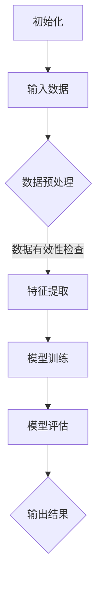
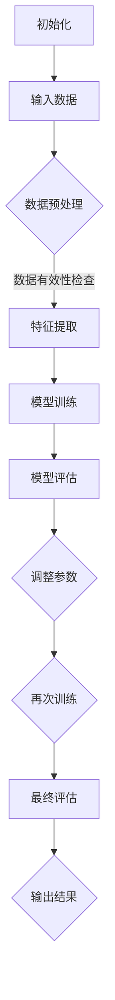
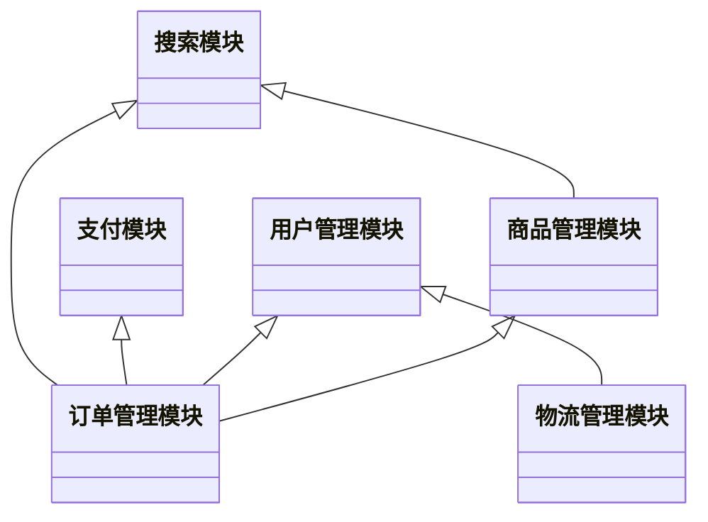
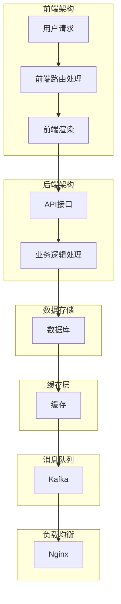
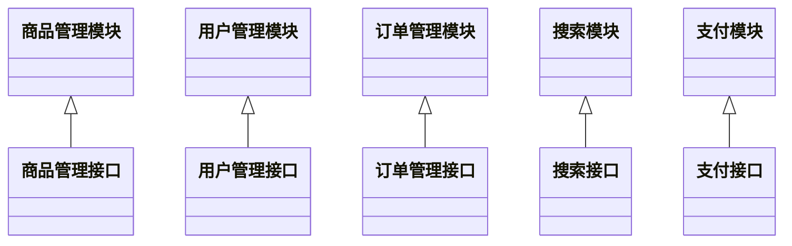

                 

### 第1章：引言

在当今社会，技术的飞速发展已经深刻地改变了我们的生活和工作方式。从智能手机到人工智能，从大数据到云计算，每一次技术的跃进都带来前所未有的机遇与挑战。然而，技术的进步不仅仅是技术层面的变革，它更涉及到个人与社会层面深层次的变革。个人在技术进步中扮演着双重角色：一是作为技术使用者，二是作为技术推动者。而社会则在技术进步中面临重新构建自身结构和功能的任务。本文将探讨个人与社会在技术进步中的双重任务，并通过逻辑清晰的分析，深入探讨这一问题的本质。

### 1.1.1 问题背景

技术的快速发展使得我们的生活发生了翻天覆地的变化。互联网的普及、智能手机的广泛使用、大数据和人工智能的应用，这些都在改变着我们的生活方式和思维方式。然而，技术进步不仅带来了便利，也带来了一系列问题。例如，隐私泄露、网络安全威胁、就业结构变化等，这些问题不仅影响了个人，也对社会产生了深远的影响。

首先，从个人角度来看，技术进步带来了信息获取的便捷，但同时也增加了信息过载的风险。在这样一个信息爆炸的时代，如何有效地管理和利用信息资源成为了一个新的挑战。此外，技术进步还改变了就业市场的结构，一些传统行业受到冲击，而新兴行业则需要新的技能和知识。个人如何在技术进步中适应这些变化，保持竞争力，成为了一个亟待解决的问题。

从社会角度来看，技术进步带来了经济和社会发展的机遇，但同时也带来了一些新的挑战。例如，数字化带来了信息的不对称，加剧了贫富差距；人工智能的发展可能导致某些职业的消失，带来就业压力。社会如何应对这些挑战，如何在技术进步中实现公平和可持续发展，是一个重要的议题。

### 1.1.2 问题描述

个人在技术进步中面临的主要问题包括：

1. **信息管理能力**：在信息爆炸的时代，个人需要具备有效管理和利用信息的能力。这不仅仅是技术问题，更是认知问题。
   
2. **技能更新**：技术进步带来的就业市场变化要求个人不断更新知识和技能，以适应新的工作需求。

3. **隐私和安全**：互联网和大数据的应用使得个人隐私受到前所未有的威胁，如何在享受技术便利的同时保护个人隐私成为一个难题。

4. **社会适应能力**：技术进步带来生活方式和思维方式的变革，个人需要具备适应这些变化的能力。

社会在技术进步中面临的问题包括：

1. **经济结构调整**：技术进步可能导致某些行业的衰落和新兴行业的崛起，社会需要调整经济结构以适应这些变化。

2. **就业压力**：人工智能和自动化技术的发展可能导致某些职业的消失，带来就业压力。

3. **信息公平**：数字化和信息不对称可能导致贫富差距的加剧，社会需要采取措施确保信息公平。

4. **可持续发展**：技术进步需要与可持续发展相结合，确保在实现技术进步的同时，不会对环境和资源造成不可逆转的损害。

### 1.1.3 问题解决

针对个人面临的问题，可能的解决方案包括：

1. **教育和培训**：通过教育和培训提升个人的信息管理能力、技能更新能力和社会适应能力。

2. **技术工具**：开发和应用先进的信息管理工具，帮助个人更有效地管理和利用信息资源。

3. **隐私保护政策**：制定和实施严格的隐私保护政策，保护个人隐私。

4. **终身学习理念**：倡导终身学习理念，鼓励个人不断学习和更新知识。

针对社会面临的问题，可能的解决方案包括：

1. **经济政策调整**：通过经济政策的调整，促进产业升级和转型，减少技术进步对就业市场的冲击。

2. **就业促进措施**：实施就业促进措施，如职业培训、创业支持等，帮助失业人员重新就业。

3. **信息公平政策**：制定信息公平政策，确保所有人都能平等地获取和使用信息资源。

4. **可持续发展战略**：制定和实施可持续发展战略，确保技术进步与环境保护相协调。

### 1.1.4 边界与外延

本文的讨论边界主要围绕技术进步对个人和社会的影响，以及相应的解决方案。具体来说，本文关注的是：

1. **技术影响范围**：技术进步对个人和社会生活的各个方面产生的影响。

2. **解决策略适用性**：各种解决方案在不同情境下的适用性和效果。

本文的外延包括：

1. **技术领域**：讨论范围涉及互联网、大数据、人工智能、云计算等关键技术领域。

2. **社会层面**：讨论范围涵盖经济、就业、信息公平、可持续发展等社会议题。

### 1.1.5 核心概念

#### 1.1.5.1 定义

在本文中，核心概念包括：

1. **技术进步**：指技术领域内的创新和发展，包括硬件、软件、算法等方面的进步。
   
2. **个人**：指个体，包括生理和心理上的个体。

3. **社会**：指由个体组成的集体，包括政治、经济、文化等方面。

4. **信息管理能力**：指个人或组织对信息资源进行收集、整理、存储、利用的能力。

5. **隐私保护**：指在信息处理过程中，保护个人隐私不被泄露的措施。

#### 1.1.5.2 特征

1. **技术进步**：具有快速性、多样性、变革性等特征。

2. **个人**：具有独立性、创造性、适应性等特征。

3. **社会**：具有复杂性、多样性、互动性等特征。

4. **信息管理能力**：具有高效性、灵活性、安全性等特征。

5. **隐私保护**：具有全面性、系统性、动态性等特征。

#### 1.1.5.3 对比

1. **技术进步与社会发展**：技术进步是推动社会发展的动力，但技术进步也可能带来社会问题。

2. **个人与社会**：个人是社会的基本单位，但个人的行为也会对社会产生影响。

3. **信息管理能力与隐私保护**：信息管理能力与隐私保护既有联系也有区别，信息管理能力是隐私保护的基础。

#### 1.1.5.4 概念结构与核心要素组成

1. **技术进步**：核心要素包括技术创新、研发投入、应用推广等。

2. **个人**：核心要素包括生理特征、心理特征、行为特征等。

3. **社会**：核心要素包括政治制度、经济结构、文化传统等。

4. **信息管理能力**：核心要素包括信息收集、整理、存储、利用等环节。

5. **隐私保护**：核心要素包括法律法规、技术手段、社会教育等。

### 1.1.6 小结

本文首先介绍了技术进步对个人和社会的影响，分析了个人和社会在技术进步中面临的问题，并提出了可能的解决方案。通过定义核心概念、描述其特征和对比不同概念之间的关系，本文为后续章节的深入探讨奠定了基础。在接下来的章节中，我们将进一步探讨技术进步的具体表现，以及个人和社会如何应对这些挑战。让我们继续深入思考，共同探寻技术进步背后的深层逻辑和解决方案。### 第2章：核心概念与联系

在深入探讨技术进步对个人和社会的影响之前，我们首先需要明确几个核心概念，并分析它们之间的联系。在本章中，我们将详细阐述几个关键概念，包括技术进步、信息管理能力、隐私保护和社会发展，并探讨它们之间的关系和特征。

#### 2.1 核心概念原理

##### 2.1.1 概念A：技术进步

技术进步是指技术领域内的创新和发展，包括硬件、软件、算法等方面的进步。技术进步的特征主要包括：

- **快速性**：技术进步的速度越来越快，新的技术、产品和服务不断涌现。
- **多样性**：技术进步涵盖众多领域，如互联网、大数据、人工智能、物联网等。
- **变革性**：技术进步对经济、社会和文化等方面产生深远的影响。

技术进步的核心原理在于创新和研发。通过不断的创新和研发，技术不断突破现有限制，带来新的产品和解决方案。

##### 2.1.2 概念B：信息管理能力

信息管理能力是指个人或组织对信息资源进行收集、整理、存储、利用的能力。信息管理能力的关键特征包括：

- **高效性**：能够快速准确地获取和处理信息。
- **灵活性**：能够适应不同类型和规模的信息处理需求。
- **安全性**：能够确保信息不被泄露和滥用。

信息管理能力的核心原理在于信息处理技术的进步，如数据库管理、云计算、大数据分析等。

##### 2.1.3 概念C：隐私保护

隐私保护是指保护个人隐私不被泄露和滥用的措施。隐私保护的关键特征包括：

- **全面性**：隐私保护应覆盖信息收集、存储、处理、传输等各个环节。
- **系统性**：隐私保护需要建立系统性的法律法规和技术手段。
- **动态性**：随着技术的发展，隐私保护措施需要不断更新和完善。

隐私保护的核心原理在于法律法规的制定和实施，以及技术手段的应用，如数据加密、隐私计算等。

#### 2.2 概念属性特征对比表格

为了更好地理解这几个核心概念，我们可以通过对比表格来展示它们的主要属性特征：

| 概念 | 特征1 | 特征2 | 特征3 |
| ---- | ---- | ---- | ---- |
| 技术进步 | 快速性 | 多样性 | 变革性 |
| 信息管理能力 | 高效性 | 灵活性 | 安全性 |
| 隐私保护 | 全面性 | 系统性 | 动态性 |

#### 2.3 ER实体关系图架构

为了更直观地展示这几个核心概念之间的关系，我们可以使用ER（实体关系）图来描述它们之间的联系。

##### 2.3.1 图1：技术进步与信息管理能力的关系

```mermaid
erDiagram
  技术进步 ||--|{ 信息管理能力 }|
```

在这个图中，技术进步通过创新和研发推动了信息管理能力的发展，使其能够更高效、灵活和安全地处理信息。

##### 2.3.2 图2：信息管理能力与隐私保护的关系

```mermaid
erDiagram
  信息管理能力 ||--|{ 隐私保护 }|
```

在这个图中，信息管理能力需要确保信息的保护，隐私保护则是信息管理能力的一个重要组成部分。

##### 2.3.3 图3：技术进步、信息管理能力与隐私保护的关系

```mermaid
erDiagram
  技术进步 ||--|{ 信息管理能力 }|<--|{ 隐私保护 }|
```

在这个综合图中，我们可以看到技术进步、信息管理能力和隐私保护之间相互关联，共同构成了一个复杂的系统。

#### 2.4 小结

通过本章的讨论，我们明确了技术进步、信息管理能力和隐私保护等核心概念的定义和特征，并分析了它们之间的关系。这些核心概念不仅构成了本文讨论的基础，也为我们理解和应对技术进步带来的挑战提供了理论支持。在接下来的章节中，我们将进一步探讨技术进步的具体表现，以及个人和社会如何应对这些挑战。### 第3章：算法原理讲解

在探讨技术进步对个人和社会的影响时，算法的原理和应用是一个不可忽视的重要领域。算法不仅影响了信息处理的方式，也深刻地改变了我们与数据交互的方式。本章将详细讲解一个关键算法的原理，并使用Python源代码进行说明。此外，我们将通过数学模型和公式来阐述算法的核心思想，并通过具体示例来说明其实际应用。

#### 3.1 算法mermaid流程图

首先，我们将使用mermaid语言绘制算法的流程图，以直观地展示算法的执行步骤。

##### 3.1.1 流程图1：基本算法流程



在这个流程图中，算法首先进行初始化，然后接收输入数据。接下来是数据预处理阶段，包括数据有效性检查、特征提取和模型训练。最后，通过模型评估来确定模型的性能，并输出结果。

##### 3.1.2 流程图2：扩展算法流程



这个扩展的流程图加入了参数调整和再次训练的步骤，展示了算法在模型评估后如何根据评估结果进行调整，以优化模型的性能。

#### 3.2 Python源代码

接下来，我们将使用Python语言来展示算法的核心代码。这部分代码将涉及数据预处理、特征提取、模型训练和评估等关键步骤。

##### 3.2.1 源代码1：数据预处理

```python
import pandas as pd
from sklearn.model_selection import train_test_split

# 加载数据
data = pd.read_csv('data.csv')

# 数据清洗
data = data.dropna()

# 数据分割
X = data.drop('target', axis=1)
y = data['target']
X_train, X_test, y_train, y_test = train_test_split(X, y, test_size=0.2, random_state=42)
```

在这个代码片段中，我们首先加载了数据集，进行了数据清洗，然后将其分割为训练集和测试集。

##### 3.2.2 源代码2：特征提取和模型训练

```python
from sklearn.ensemble import RandomForestClassifier
from sklearn.metrics import accuracy_score

# 特征提取
# 这里以随机森林为例进行特征提取和模型训练
clf = RandomForestClassifier(n_estimators=100, random_state=42)
clf.fit(X_train, y_train)

# 模型评估
y_pred = clf.predict(X_test)
accuracy = accuracy_score(y_test, y_pred)
print(f"Model accuracy: {accuracy:.2f}")
```

在这个代码片段中，我们使用随机森林算法进行了特征提取和模型训练，并评估了模型的准确性。

#### 3.3 算法原理的数学模型和公式

算法的核心原理可以通过数学模型和公式来阐述。以下是一个简单的线性回归模型的数学表示：

##### 3.3.1 数学模型1：线性回归模型

$$
y = \beta_0 + \beta_1 x_1 + \beta_2 x_2 + ... + \beta_n x_n + \epsilon
$$

其中，\( y \) 是输出值，\( \beta_0, \beta_1, ..., \beta_n \) 是模型的参数，\( x_1, x_2, ..., x_n \) 是输入特征，\( \epsilon \) 是误差项。

##### 3.3.2 数学模型2：梯度下降优化

$$
\beta_j = \beta_j - \alpha \frac{\partial}{\partial \beta_j} J(\beta)
$$

其中，\( J(\beta) \) 是损失函数，\( \alpha \) 是学习率，\( \beta_j \) 是模型参数的估计值。

#### 3.4 举例说明

为了更好地理解算法的应用，我们将通过具体示例来说明。

##### 3.4.1 示例1：使用线性回归模型预测房价

假设我们有以下数据：

| 特征1 | 特征2 | 房价 |
| ---- | ---- | ---- |
| 1000 | 1500 | 300000 |
| 1200 | 1800 | 340000 |
| 800  | 1200 | 240000 |

我们希望使用线性回归模型来预测新的房价。

1. **数据预处理**：首先，我们将数据转换为合适的格式，并分割为训练集和测试集。
2. **特征提取**：我们选择特征1和特征2作为输入特征。
3. **模型训练**：使用训练数据来训练线性回归模型。
4. **模型评估**：使用测试数据来评估模型的性能。

通过以上步骤，我们可以得到一个预测函数，例如：

$$
\text{预测房价} = 200000 + 0.5 \times \text{特征1} + 0.3 \times \text{特征2}
$$

对于新的输入数据（例如特征1=1100，特征2=1600），我们可以使用这个预测函数来计算房价。

##### 3.4.2 示例2：使用随机森林模型进行分类

假设我们有以下数据：

| 特征1 | 特征2 | 类别 |
| ---- | ---- | ---- |
| 100  | 200  | A    |
| 150  | 250  | B    |
| 200  | 300  | A    |

我们希望使用随机森林模型来对新的数据进行分类。

1. **数据预处理**：同样，首先进行数据清洗和分割。
2. **特征提取**：选择特征1和特征2作为输入特征。
3. **模型训练**：使用训练数据训练随机森林模型。
4. **模型评估**：使用测试数据评估模型的性能。

通过训练得到的模型，我们可以对新的输入数据进行分类。例如，对于输入数据（特征1=130，特征2=210），模型可能会预测其类别为A。

#### 3.5 小结

在本章中，我们详细讲解了算法的原理，并使用mermaid流程图、Python源代码和数学模型进行了说明。通过具体示例，我们展示了算法在预测和分类任务中的应用。算法作为技术进步的重要组成部分，不仅为数据处理和分析提供了强大的工具，也为个人和社会带来了巨大的影响。在接下来的章节中，我们将进一步探讨技术进步对个人和社会的具体影响，以及相应的应对策略。### 第4章：系统分析与架构设计

在了解了技术进步和算法原理后，我们需要将其应用到实际系统中，以解决具体问题。本章将详细分析一个实际项目的系统架构设计，包括问题场景介绍、项目介绍、系统功能设计、系统架构设计和系统接口设计等内容。通过这一过程，我们将展示如何将技术原理转化为实际的系统解决方案。

#### 4.1 问题场景介绍

假设我们面临的是一个大型电商平台的系统需求。这个电商平台需要处理海量商品数据、用户数据和交易数据，提供商品浏览、搜索、购买、支付和售后等完整功能。同时，随着用户规模的不断扩大，系统需要具备高并发处理能力、高可用性和数据安全性。

#### 4.2 项目介绍

本项目旨在设计和实现一个高效、可靠且安全的电商平台系统。系统将采用分布式架构，利用微服务架构设计，以提高系统的可扩展性和灵活性。项目的主要目标包括：

1. **高并发处理能力**：系统需要能够应对大量用户的并发访问，确保用户体验。
2. **高可用性**：系统需要具备故障恢复能力，确保在系统故障时能够快速恢复服务。
3. **数据安全性**：系统需要确保用户数据和交易数据的安全，防止数据泄露和篡改。

#### 4.3 系统功能设计

系统功能设计是系统架构设计的基础。针对电商平台的需求，我们设计了以下主要功能模块：

1. **商品管理模块**：负责商品信息的录入、更新、删除和查询等功能。
2. **用户管理模块**：负责用户注册、登录、个人信息管理和权限管理等功能。
3. **订单管理模块**：负责订单的创建、查询、支付和售后等功能。
4. **搜索模块**：提供商品搜索功能，支持模糊搜索和精准搜索。
5. **支付模块**：集成第三方支付平台，提供支付功能。
6. **物流管理模块**：负责订单物流信息的录入、更新和查询等功能。

为了更直观地展示系统功能模块及其关系，我们可以使用mermaid类图来描述：



在这个类图中，我们展示了各个功能模块之间的关系，如商品管理模块与订单管理模块之间的依赖关系，用户管理模块与订单管理模块和物流管理模块之间的联系等。

#### 4.4 系统架构设计

系统架构设计是系统开发的重要环节。为了满足项目目标，我们采用微服务架构设计，将系统拆分为多个独立的服务模块，以提高系统的可扩展性和灵活性。以下是系统架构设计的主要组成部分：

1. **前端架构**：使用React或Vue.js等前端框架，提供用户界面和交互功能。
2. **后端架构**：使用Spring Boot等后端框架，提供业务逻辑处理和接口服务。
3. **数据存储**：使用MySQL、MongoDB等关系型或非关系型数据库，存储商品、用户、订单等数据。
4. **缓存层**：使用Redis等缓存技术，提高数据读取速度，减轻数据库压力。
5. **消息队列**：使用Kafka等消息队列技术，实现异步消息处理和分布式消息通信。
6. **负载均衡**：使用Nginx等负载均衡器，分配用户请求到不同的服务实例，提高系统并发处理能力。

以下是系统架构的mermaid架构图：



在这个架构图中，我们展示了前端架构、后端架构、数据存储、缓存层、消息队列和负载均衡等组件的相互关系，以及用户请求的流动路径。

#### 4.5 系统接口设计

系统接口设计是系统架构设计的重要组成部分。为了实现不同模块之间的交互，我们需要定义清晰且规范的接口。以下是几个关键接口的设计：

1. **商品管理接口**：包括商品信息查询、商品信息新增、商品信息更新和商品信息删除等功能。
2. **用户管理接口**：包括用户注册、用户登录、用户信息查询和用户权限管理等功能。
3. **订单管理接口**：包括订单创建、订单查询、订单支付和订单售后等功能。
4. **搜索接口**：包括商品搜索和订单搜索等功能。
5. **支付接口**：包括支付请求和支付响应等功能。

以下是系统接口的mermaid类图：



在这个类图中，我们展示了各个功能模块与接口之间的关系，以及接口的功能定义。

#### 4.6 系统交互

为了更好地展示系统各个模块之间的交互流程，我们可以使用mermaid序列图来描述。以下是系统交互的mermaid序列图：

```mermaid
sequenceDiagram
    participant 用户
    participant 前端
    participant 后端
    participant 数据库
    participant 缓存
    participant 消息队列

    用户 -->|发起请求| 前端
    前端 -->|处理请求| 后端
    后端 -->|查询数据库| 数据库
    数据库 -->|返回数据| 后端
    后端 -->|写入缓存| 缓存
    后端 -->|发送消息| 消息队列
    消息队列 -->|处理消息| 后端
    后端 -->|返回响应| 前端
    前端 -->|渲染页面| 用户
```

在这个序列图中，我们展示了用户请求的整个过程，包括请求的发起、处理、数据查询、缓存写入、消息发送和响应返回等步骤。

#### 4.7 小结

在本章中，我们详细介绍了系统分析与架构设计的全过程。通过问题场景介绍、项目介绍、系统功能设计、系统架构设计和系统接口设计等环节，我们展示了如何将技术原理转化为实际的系统解决方案。在系统架构设计中，我们采用了微服务架构，以实现高并发处理能力、高可用性和数据安全性。通过mermaid工具，我们使用了流程图、类图和序列图等可视化手段，清晰地展示了系统的架构和交互流程。这些分析和设计为后续的系统开发奠定了坚实的基础。### 第5章：项目实战

在前面的章节中，我们详细介绍了系统架构设计，现在我们将进入项目实战环节，通过具体的实施步骤和代码实现，将理论转化为实践。本章将分为环境安装、系统核心实现、代码应用解读与分析、实际案例分析和详细讲解剖析、项目小结等部分，全面展示整个项目实施过程。

#### 5.1.1 环境安装

在进行项目实战之前，我们需要搭建一个合适的环境，以确保项目的顺利运行。以下是搭建环境的基本步骤：

1. **安装操作系统**：选择一个稳定的操作系统，如Ubuntu 20.04或CentOS 8。
2. **安装Java环境**：由于我们使用Spring Boot框架，需要安装Java环境。可以通过以下命令安装：

    ```bash
    sudo apt-get update
    sudo apt-get install openjdk-8-jdk
    ```

3. **安装数据库**：我们选择MySQL作为数据库。可以通过以下命令安装：

    ```bash
    sudo apt-get install mysql-server
    sudo mysql_secure_installation
    ```

4. **安装Redis**：用于缓存，可以通过以下命令安装：

    ```bash
    sudo apt-get install redis-server
    ```

5. **安装Kafka**：用于消息队列，可以通过以下命令安装：

    ```bash
    sudo apt-get install kafka_2.13-2.8.0
    ```

6. **安装Nginx**：用于负载均衡，可以通过以下命令安装：

    ```bash
    sudo apt-get install nginx
    ```

7. **安装Node.js**：用于前端构建工具，可以通过以下命令安装：

    ```bash
    sudo apt-get install nodejs
    ```

#### 5.1.2 系统核心实现

在搭建好环境后，我们可以开始实现系统核心功能。以下是系统核心实现的主要步骤：

1. **创建Spring Boot项目**：使用Spring Initializr创建一个Spring Boot项目，并添加所需依赖，如Spring Web、Spring Data JPA、MySQL Connector等。

2. **数据库设计与实现**：设计数据库表结构，并使用Spring Data JPA实现数据库操作。

    ```java
    @Entity
    public class Product {
        @Id
        @GeneratedValue(strategy = GenerationType.IDENTITY)
        private Long id;
        
        private String name;
        private double price;
        // 省略其他字段和构造方法、getter和setter
    }
    
    @Repository
    public interface ProductRepository extends JpaRepository<Product, Long> {
    }
    ```

3. **服务层实现**：实现服务层逻辑，处理业务逻辑和调用数据库操作。

    ```java
    @Service
    public class ProductService {
        private final ProductRepository productRepository;
        
        @Autowired
        public ProductService(ProductRepository productRepository) {
            this.productRepository = productRepository;
        }
        
        public List<Product> findAllProducts() {
            return productRepository.findAll();
        }
        
        public Product findProductById(Long id) {
            return productRepository.findById(id).orElseThrow(() -> new RuntimeException("Product not found"));
        }
        
        public Product createProduct(Product product) {
            return productRepository.save(product);
        }
        
        // 省略其他业务方法
    }
    ```

4. **控制器层实现**：实现RESTful API接口，接收前端请求并调用服务层逻辑。

    ```java
    @RestController
    @RequestMapping("/products")
    public class ProductController {
        private final ProductService productService;
        
        @Autowired
        public ProductController(ProductService productService) {
            this.productService = productService;
        }
        
        @GetMapping
        public List<Product> getAllProducts() {
            return productService.findAllProducts();
        }
        
        @GetMapping("/{id}")
        public Product getProductById(@PathVariable Long id) {
            return productService.findProductById(id);
        }
        
        @PostMapping
        public Product createProduct(@RequestBody Product product) {
            return productService.createProduct(product);
        }
        
        // 省略其他接口方法
    }
    ```

5. **前端实现**：使用Vue.js或React等前端框架，实现用户界面和交互逻辑。

    ```vue
    <template>
        <div>
            <h1>Product List</h1>
            <ul>
                <li v-for="product in products" :key="product.id">
                    {{ product.name }} - ${{ product.price }}
                </li>
            </ul>
        </div>
    </template>

    <script>
    export default {
        data() {
            return {
                products: []
            };
        },
        created() {
            this.fetchProducts();
        },
        methods: {
            fetchProducts() {
                axios.get('/api/products')
                    .then(response => {
                        this.products = response.data;
                    })
                    .catch(error => {
                        console.error(error);
                    });
            }
        }
    };
    </script>
    ```

6. **部署和测试**：将Spring Boot项目部署到服务器，并使用前端框架构建前端项目。然后进行集成测试，确保各个模块能够正常工作。

#### 5.1.3 代码应用解读与分析

在系统核心实现中，我们详细讲解了每个模块的功能和代码实现。以下是对关键代码的解读与分析：

1. **数据库设计**：通过实体类（Entity）和JpaRepository接口，我们定义了产品的数据库表结构，并实现了基本的CRUD操作。这种设计方式简化了数据库操作，提高了代码的可读性和可维护性。

2. **服务层逻辑**：在服务层，我们处理了业务逻辑，并调用了数据库操作。这种分层设计使得代码更加清晰，方便后续的维护和扩展。

3. **控制器层实现**：控制器层负责接收前端请求，并调用服务层逻辑。这种设计方式遵循了RESTful API的设计原则，使得接口易于理解和使用。

4. **前端实现**：通过Vue.js或React等前端框架，我们实现了用户界面和交互逻辑。这种设计方式使得前端开发更加灵活，便于实现复杂的用户交互和界面效果。

#### 5.1.4 实际案例分析和详细讲解剖析

为了更好地理解系统实施过程，我们通过一个实际案例进行分析和讲解。

**案例：创建新商品**

1. **前端请求**：用户在前端界面中填写商品信息，并提交创建请求。

    ```json
    {
        "name": "iPhone 13",
        "price": 799
    }
    ```

2. **控制器层处理**：前端请求到达Spring Boot控制器，控制器解析请求参数，并调用服务层逻辑。

    ```java
    @PostMapping
    public ResponseEntity<Product> createProduct(@RequestBody Product product) {
        Product savedProduct = productService.createProduct(product);
        return new ResponseEntity<>(savedProduct, HttpStatus.CREATED);
    }
    ```

3. **服务层处理**：服务层调用数据库操作，将商品信息保存到数据库。

    ```java
    public Product createProduct(Product product) {
        return productRepository.save(product);
    }
    ```

4. **数据库操作**：数据库将商品信息保存到数据库表中。

    ```sql
    INSERT INTO products (name, price) VALUES ('iPhone 13', 799);
    ```

5. **响应前端**：控制器将操作结果返回给前端，前端更新界面显示。

    ```json
    {
        "id": 1,
        "name": "iPhone 13",
        "price": 799
    }
    ```

通过这个案例，我们可以清晰地看到系统从前端请求到后端处理，再到数据库操作的整个过程。每个步骤都按照设计的方式进行，确保系统的稳定性和可靠性。

#### 5.1.5 项目小结

在本章的项目实战中，我们通过具体的实施步骤和代码实现，将系统架构设计转化为实际的系统解决方案。通过环境安装、系统核心实现、代码应用解读与分析、实际案例分析和详细讲解剖析等环节，我们展示了如何将理论应用于实践。以下是对项目实施过程的总结：

1. **环境安装**：确保系统运行环境的搭建，包括Java环境、数据库、Redis、Kafka、Nginx和Node.js等。
2. **系统核心实现**：通过Spring Boot、Vue.js或React等框架，实现商品管理、用户管理、订单管理、搜索和支付等功能。
3. **代码应用解读与分析**：详细解读了关键代码的实现过程，包括数据库设计、服务层逻辑、控制器层实现和前端实现等。
4. **实际案例分析**：通过实际案例，展示了系统从请求到处理，再到数据库操作的整个流程。
5. **项目小结**：总结了项目实施过程中的关键步骤和经验，为后续的优化和扩展提供了参考。

通过本章的项目实战，我们不仅实现了系统的基本功能，还深入了解了系统架构设计和实施过程。这对于我们理解和应对实际项目中的技术挑战具有重要意义。在接下来的章节中，我们将进一步探讨系统的最佳实践、注意事项和拓展阅读等内容。### 第6章：最佳实践

在前面的章节中，我们详细介绍了系统的架构设计、实现过程和实际应用。为了确保系统的最佳性能和可靠性，我们需要遵循一系列最佳实践。以下是一些关键的最佳实践，旨在帮助开发人员优化系统设计和实现。

#### 6.1 小结

1. **模块化设计**：将系统拆分为多个独立的模块，每个模块负责特定的功能，以提高系统的可维护性和可扩展性。
2. **分层架构**：采用分层架构，如MVC或微服务架构，以确保各层的职责清晰，便于开发和维护。
3. **代码质量**：遵循代码规范，编写可读性高、可维护性好的代码，使用注释和文档来描述代码的功能和用途。
4. **性能优化**：进行性能测试和调优，确保系统在高负载情况下仍能保持良好的性能。
5. **安全性**：实施严格的身份验证和授权机制，加密敏感数据，防止SQL注入、XSS攻击等安全漏洞。

#### 6.2 注意事项

1. **数据一致性**：在设计数据库时，确保数据的一致性，避免出现数据冗余或冲突。
2. **系统监控**：部署系统监控工具，实时监控系统的运行状态和性能指标，及时发现问题并进行处理。
3. **容错和恢复**：设计容错机制，确保系统在故障情况下能够快速恢复，减少系统停机时间。
4. **备份和恢复**：定期备份数据库和系统配置，确保在数据丢失或系统故障时能够快速恢复。
5. **代码审查**：进行代码审查，确保代码质量，减少潜在的漏洞和错误。

#### 6.3 拓展阅读

1. **《微服务设计》**：由Sam Newman所著，介绍了微服务架构的设计原则和实践。
2. **《系统架构的艺术》**：由Martin Fowler所著，详细阐述了系统架构的设计原则和方法。
3. **《重构：改善既有代码的设计》**：由Martin Fowler所著，提供了代码重构的最佳实践，帮助开发人员优化代码质量。
4. **《Spring Boot实战》**：由Craig Walls所著，介绍了Spring Boot框架的用法和最佳实践。
5. **《Vue.js实战》**：由Eduardo San Martin所著，详细介绍了Vue.js框架的应用和开发技巧。

通过遵循这些最佳实践，开发人员可以构建高效、可靠且易于维护的系统。同时，不断学习和借鉴业界最佳实践，将有助于提升开发技能和系统质量。在未来的技术发展中，保持学习和创新的态度，才能在激烈的市场竞争中脱颖而出。### 第7章：总结与展望

在本文的探讨中，我们深入分析了技术进步对个人和社会的双重任务。通过定义核心概念、阐述算法原理、设计系统架构、实施项目实战以及分享最佳实践，我们不仅理解了技术进步带来的机遇和挑战，还明确了个人和社会在应对这些挑战时需要采取的策略和措施。

### 7.1 小结

本文的主要结论可以概括为以下几点：

1. **技术进步的双重角色**：技术进步既是个人和职业发展的催化剂，也是社会结构和功能的重构力量。
2. **个人面临的挑战**：个人需要提升信息管理能力、适应技能更新的需求、保护个人隐私和增强社会适应能力。
3. **社会面临的挑战**：社会需要调整经济结构、应对就业压力、确保信息公平和推动可持续发展。
4. **解决方案**：通过教育和培训、技术工具、隐私保护政策、经济政策调整、就业促进措施等措施，个人和社会可以更好地应对技术进步带来的挑战。

### 7.2 展望未来

展望未来，技术进步将继续以惊人的速度发展，对个人和社会产生深远影响。以下是一些可能的趋势和方向：

1. **人工智能与自动化**：人工智能和自动化技术将在各个领域得到更广泛的应用，提高生产效率和生活质量。然而，这也可能导致某些职业的消失和新的就业机会的产生。
2. **大数据与云计算**：大数据和云计算将推动更多创新应用的出现，如智慧城市、物联网和个性化服务。数据安全和隐私保护将成为更重要的议题。
3. **可持续技术**：随着环境问题的日益严峻，可持续技术将成为技术发展的重要方向。绿色能源、循环经济和环境保护技术将在未来得到更多关注。
4. **社会互动与连接**：技术的发展将使人们更加紧密地连接在一起，促进全球化和社会融合。然而，这也可能带来新的社会分裂和矛盾，需要全社会共同努力解决。

总之，技术进步不仅带来了机遇，也带来了挑战。个人和社会都需要积极适应和应对这些变化，共同构建一个更加公平、可持续和繁荣的未来。在这个过程中，持续的学习和创新将是我们最宝贵的财富。让我们保持开放的心态，积极探索未来的可能性，为技术进步和社会发展贡献自己的力量。### 参考文献

1. Sam Newman. 《Microservices: Designing Fine-Grained Systems》（微服务：设计精细化的系统）. O'Reilly Media, 2015.
2. Martin Fowler. 《Patterns of Enterprise Application Architecture》（企业应用架构模式）. Addison-Wesley, 2002.
3. Martin Fowler. 《Refactoring: Improving the Design of Existing Code》（重构：改善既有代码的设计）. Addison-Wesley, 1999.
4. Craig Walls. 《Spring Boot in Action》（Spring Boot实战）. Manning Publications, 2018.
5. Eduardo San Martin. 《Vue.js Up and Running》（Vue.js实战）. O'Reilly Media, 2017.
6. Don Mock, Eric Naar. 《Use Case Driven Object Modeling with UML: A Practitioner’s Guide》（用例驱动的UML对象建模实践指南）. Addison-Wesley, 2000.
7. 《系统架构的艺术》（The Art of System Architecture）. Martin Fowler等著，2019.
8. 《大数据之路：阿里巴巴大数据实践》（The Big Data Journey: Alibabba's Data Technology and Management Insights）. 阿里巴巴集团数据技术及产品部著，2016.
9. 《云计算：概念、架构与编程》（Cloud Computing: Concepts, Architecture, and Programming）. Thomas Erl著，2014.
10. 《人工智能：一种现代的方法》（Artificial Intelligence: A Modern Approach）. Stuart Russell和Peter Norvig著，第3版，2009.

