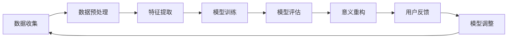
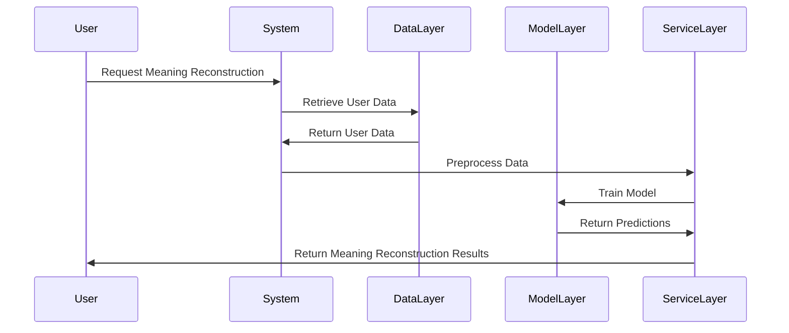
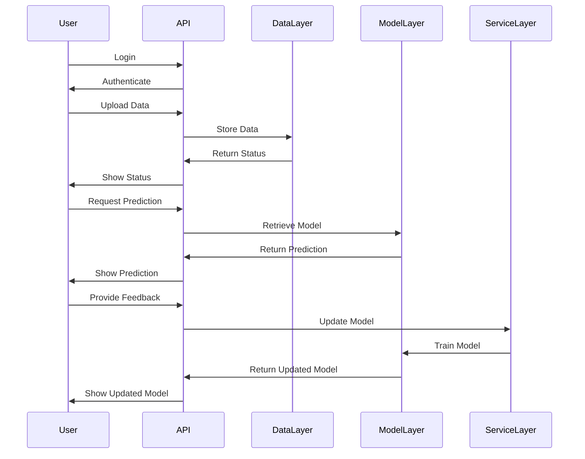
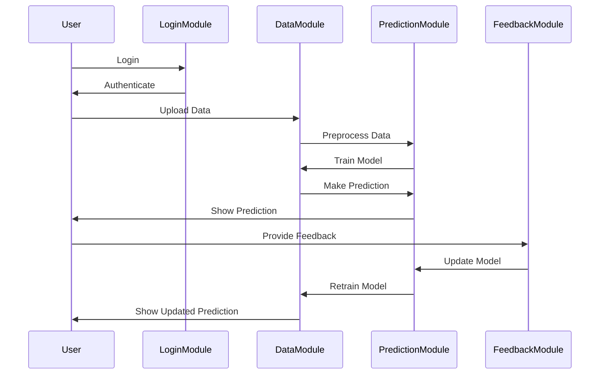

                 


# 意义的重构：个人与社会的双重任务

关键词：意义重构、个人、社会、双重任务

摘要：本文深入探讨了意义重构这一概念，分析了个人和社会层面上意义重构的必要性和实现路径。通过详细的案例分析，本文阐述了如何在不同层面进行意义重构，以及重构过程中可能遇到的挑战和解决方案。同时，本文还探讨了重构过程中的关键因素和未来发展趋势，为读者提供了一个全面而深入的视角。

## 引言

### 引言一：意义的重构，时代的需求

在当今社会，我们面临着前所未有的挑战和变化。科技的飞速发展，信息的爆炸式增长，社会结构的深刻变革，使得我们原有的生活方式和价值观面临着巨大的冲击。在这样的背景下，意义的重构变得尤为迫切和重要。

意义的重构不仅仅是个人层面的问题，更是社会层面的挑战。个人需要重构自我意义，以应对快速变化的社会环境；社会则需要重构整体意义，以实现可持续发展和和谐共处。

### 引言二：本书的目标和读者

本书的目标是深入探讨意义的重构，为读者提供一个全面而深入的视角。本书适合对意义重构感兴趣的读者，包括个人成长者、社会学家、企业家、政策制定者等。无论您是个人探索者，还是专业研究者，本书都希望为您提供有价值的思考和指导。

### 引言三：本书的结构和内容安排

本书分为六个部分：

1. **背景介绍**：介绍个人和社会层面意义重构的背景，包括现代社会面临的挑战和重构的必要性。
2. **核心概念**：详细解释“意义的重构”、“个人”、“社会”和“双重任务”等概念。
3. **联系与应用**：探讨个人和社会重构之间的联系，以及如何将重构理念应用于现实生活。
4. **实际案例分析**：通过具体案例，分析如何进行意义的重构，以及重构过程中的挑战和解决方案。
5. **总结与展望**：总结书中的关键观点，展望未来的发展趋势。
6. **附录**：提供进一步阅读的建议和资源。

## 第1章：背景介绍

### 1.1 个人层面的意义重构

在个人层面，意义的重构是一个复杂而深远的过程。现代社会带来的变化使得人们的生活方式、价值观和人际关系都发生了巨大的变化。这些变化不仅给个人带来了挑战，也为重构个人意义提供了契机。

#### 现代社会的挑战

现代社会的挑战主要体现在以下几个方面：

1. **快速变化**：科技的飞速发展，社会结构的深刻变革，使得人们的生活节奏加快，变化加剧。
2. **信息爆炸**：信息技术的进步使得信息爆炸成为常态，人们面临着海量信息的冲击。
3. **人际关系复杂化**：现代社会的人际关系变得更加复杂，人与人之间的联系更加紧密，但也更加脆弱。
4. **个人价值的多元性**：个人价值的多元化使得人们在选择自己的生活方式和价值观时面临更多的困惑。

#### 意义缺失的信号

个人意义缺失的信号可能包括以下几个方面：

1. **心理问题**：如焦虑、抑郁等心理问题可能是个人意义缺失的一种表现。
2. **职业困境**：对工作没有热情，缺乏成就感，可能是个人意义缺失的表现。
3. **人际关系问题**：人际关系紧张，缺乏深层次的交流，可能是个人意义缺失的一种体现。
4. **缺乏方向感**：对未来的不确定性和迷茫可能是个人意义缺失的一种信号。

#### 个人层面的重构路径

个人层面的重构路径主要包括以下几个方面：

1. **自我认知**：通过自我反思，深入了解自己的兴趣、价值观和目标，明确自己的定位。
2. **持续学习**：不断学习新知识，提升自己的能力和技能，以适应快速变化的社会环境。
3. **人际关系建设**：建立和维护良好的人际关系，通过交流和合作，实现个人价值的最大化。
4. **内心成长**：通过内心的修行和成长，提高自己的心理素质，增强应对挑战的能力。

### 1.2 社会层面的意义重构

在社会层面，意义的重构是一个更为复杂和长期的过程。社会意义的重构不仅关系到个人的幸福和成长，更关系到社会的和谐与进步。

#### 社会变迁中的意义危机

社会变迁中的意义危机主要体现在以下几个方面：

1. **价值观的多元化**：现代社会价值观的多元化使得人们对于什么是正确、什么是错误，什么是好、什么是坏，产生了困惑。
2. **社会信任危机**：社会信任危机使得社会成员之间的信任度降低，社会矛盾加剧。
3. **资源分配不均**：资源分配不均导致社会贫富差距加大，社会阶层固化。
4. **文化认同危机**：在全球化的背景下，传统文化面临着被边缘化的风险。

#### 社会重构的挑战与机遇

社会重构的挑战主要包括以下几个方面：

1. **制度变革**：社会重构需要制度变革，打破旧的利益格局，建立新的社会秩序。
2. **文化重塑**：社会重构需要文化重塑，培养新的价值观和道德观念，增强社会凝聚力。
3. **科技创新**：科技创新为社会重构提供了新的动力和工具，但同时也带来了新的挑战。
4. **全球化影响**：全球化影响使得社会重构需要面对国际环境的压力和挑战。

社会重构的机遇主要包括以下几个方面：

1. **经济转型**：经济转型为社会重构提供了新的发展契机，通过创新和创业，实现社会的转型升级。
2. **社会进步**：社会进步为重构社会意义提供了新的方向和动力，通过科技、教育和文化等领域的进步，实现社会的全面进步。
3. **国际合作**：国际合作为重构社会意义提供了新的平台和机会，通过国际合作，实现资源共享和互利共赢。

#### 社会重构的实践探索

社会重构的实践探索主要包括以下几个方面：

1. **政策创新**：通过政策创新，推动社会变革，实现社会公平和正义。
2. **社区建设**：通过社区建设，增强社会成员之间的联系和互动，提高社会凝聚力。
3. **教育改革**：通过教育改革，培养具有创新精神和责任意识的新一代。
4. **文化传承**：通过文化传承，弘扬传统文化，增强文化自信。

### 1.3 双重任务的内涵与外延

双重任务的内涵与外延主要体现在以下几个方面：

1. **个人层面的双重任务**：个人层面的双重任务包括自我认知、自我成长和自我实现。
2. **社会层面的双重任务**：社会层面的双重任务包括制度变革、文化重塑和社会进步。
3. **个人与社会重构的关系**：个人与社会重构的关系是相互影响、相互促进的。个人重构推动社会重构，社会重构促进个人重构。
4. **双重任务的核心要素**：双重任务的核心要素包括自我认知、自我成长、自我实现、制度变革、文化重塑和社会进步。

### 1.4 本章小结

本章介绍了个人和社会层面意义重构的背景、挑战和必要性。通过分析现代社会面临的挑战和个人意义缺失的信号，我们认识到个人层面的意义重构的重要性。同时，通过分析社会变迁中的意义危机和社会重构的挑战与机遇，我们认识到社会层面的意义重构的必要性。双重任务的内涵与外延为我们提供了重构个人与社会意义的理论基础和实践指导。

## 第2章：核心概念与联系

### 2.1 意义的再定义

在探讨意义重构之前，我们需要对“意义”这一概念进行再定义。意义不仅仅是指某个事物或行为所蕴含的价值或目的，更是一种深层次的认知和感知。意义的再定义有助于我们更好地理解重构的意义和过程。

#### 意义的多维解读

意义可以从多个维度进行解读：

1. **个体维度**：从个体的角度来看，意义是指个体对事物或行为的认知和感受，是个人价值观的体现。
2. **社会维度**：从社会的角度来看，意义是指社会对事物或行为的认知和感受，是社会价值观的体现。
3. **文化维度**：从文化的角度来看，意义是指文化对事物或行为的认知和感受，是文化价值观的体现。

#### 意义的属性特征对比

为了更好地理解意义的属性特征，我们可以将个体维度、社会维度和文化维度的意义进行对比：

| 维度     | 个体维度                | 社会维度                | 文化维度                |
|--------|----------------------|----------------------|----------------------|
| 特征1   | 个性化、主观性、情感性      | 公共性、客观性、理性性      | 传承性、普遍性、规范性      |
| 特征2   | 多样性、复杂性、动态性      | 统一性、稳定性、规范性      | 深层性、持久性、传承性      |
| 特征3   | 自主性、独立性、个体性      | 相互性、依赖性、社会性      | 继承性、传统性、文化性      |

#### 意义重构的驱动因素

意义重构的驱动因素主要包括以下几个方面：

1. **外部环境变化**：随着社会环境的变化，原有的意义可能变得不再适应，需要重构。
2. **个体需求变化**：随着个体的成长和需求的变化，原有的意义可能不再满足个体的需求，需要重构。
3. **技术进步**：技术的进步可能会改变人们的生活方式和工作方式，从而影响意义的重构。
4. **文化传承**：文化的传承和发展可能会影响意义的重构，使其更符合时代的需求。

### 2.2 个人与社会重构的概念联系

个人与社会重构是相互联系、相互影响的。个人重构推动社会重构，社会重构促进个人重构。

#### 个人与社会重构的关系解析

个人与社会重构的关系可以从以下几个方面进行解析：

1. **相互影响**：个人的意义重构会影响社会的意义重构，反之亦然。个人的行为和价值观会影响社会的行为和价值观，社会的制度和文化也会影响个人的行为和价值观。
2. **相互促进**：个人的意义重构和社会的意义重构是相互促进的。个人的意义重构可以推动社会的意义重构，社会的意义重构也可以促进个人的意义重构。
3. **相互依赖**：个人的意义重构和社会的意义重构是相互依赖的。个人的意义重构需要社会的支持，社会的意义重构也需要个人的参与。

#### 个人与社会重构的协同效应

个人与社会重构的协同效应主要体现在以下几个方面：

1. **资源共享**：个人和社会可以通过共享资源，实现意义重构的协同效应。例如，个人可以通过学习社会经验，提升自己的能力，社会也可以通过个人的创新和创业，推动社会的进步。
2. **优势互补**：个人和社会可以发挥各自的优势，实现意义重构的协同效应。例如，个人的创意和社会的资源可以相结合，推动社会的创新发展。
3. **共同目标**：个人和社会可以设定共同的目标，实现意义重构的协同效应。例如，个人可以追求自我实现，社会可以追求和谐发展，共同推动社会的进步。

#### 个人与社会重构的相互作用

个人与社会重构的相互作用可以从以下几个方面进行探讨：

1. **个人影响社会**：个人的行为和价值观可以影响社会的行为和价值观。例如，个人的行为可以推动社会的道德进步，个人的价值观可以影响社会的价值观取向。
2. **社会影响个人**：社会的制度和文化可以影响个人的行为和价值观。例如，社会的道德规范可以影响个人的行为，社会的价值观可以影响个人的价值观取向。
3. **反馈机制**：个人和社会之间的相互作用可以通过反馈机制实现。例如，个人的反馈可以影响社会的决策，社会的反馈可以影响个人的行为。

### 2.3 双重任务在个人与社会的实现

双重任务在个人与社会的实现是一个复杂而动态的过程。个人和社会需要共同努力，才能实现双重任务的实现。

#### 个人层面的双重任务实现

个人层面的双重任务实现主要包括以下几个方面：

1. **自我认知**：通过自我认知，个人可以明确自己的兴趣、价值观和目标，找到自己的定位。
2. **自我成长**：通过自我成长，个人可以提升自己的能力和技能，以适应社会环境的变化。
3. **自我实现**：通过自我实现，个人可以实现自己的价值和目标，获得成就感。

#### 社会层面的双重任务实现

社会层面的双重任务实现主要包括以下几个方面：

1. **制度变革**：通过制度变革，社会可以建立新的制度框架，促进社会的公平和正义。
2. **文化重塑**：通过文化重塑，社会可以培养新的价值观和道德观念，增强社会的凝聚力。
3. **社会进步**：通过社会进步，社会可以实现社会的转型升级，提高社会的整体发展水平。

#### 双重任务实现的影响因素

双重任务实现的影响因素主要包括以下几个方面：

1. **个体因素**：个体的认知、能力和价值观会影响双重任务的实现。例如，个体的认知水平会影响个体的自我认知，个体的价值观会影响个体的行为。
2. **社会因素**：社会的制度、文化和价值观会影响双重任务的实现。例如，社会的制度会影响社会的公平和正义，社会的价值观会影响社会的凝聚力。
3. **环境因素**：环境的变化会影响双重任务的实现。例如，社会环境的变化会影响个体的认知和行为，自然环境的变化会影响社会的发展。

### 2.4 本章小结

本章深入探讨了意义重构的核心概念，包括意义的再定义、个人与社会重构的概念联系、双重任务在个人与社会的实现。通过多维度的解读，我们认识到意义重构的复杂性和多样性。同时，通过分析个人与社会重构的关系，我们认识到个人与社会重构的相互影响和相互促进。双重任务在个人与社会的实现为我们提供了实现意义重构的具体路径和策略。

## 第3章：算法原理讲解

### 3.1 意义重构算法基础

意义重构算法是一种旨在帮助个人和社会重构意义的算法。它基于对个体和社会行为数据的分析，通过模型预测和优化，实现意义的重构。意义重构算法的基础包括以下几个方面：

#### 算法的基本概念

意义重构算法是一种基于人工智能和数据科学的算法。它利用机器学习技术，对个体和社会行为数据进行学习、分析和预测，以实现意义的重构。

#### 算法的设计原则

意义重构算法的设计原则主要包括以下几点：

1. **用户导向**：算法应以用户的需求和利益为导向，确保重构的意义符合用户的期望和价值观。
2. **数据驱动**：算法应以数据为驱动，通过对行为数据的分析和挖掘，发现潜在的规律和模式，实现意义的重构。
3. **动态调整**：算法应具备动态调整的能力，能够根据环境的变化和用户的需求，实时调整重构的策略和目标。
4. **可解释性**：算法应具备较高的可解释性，用户可以理解算法的运作原理和决策过程，提高用户对重构意义的信任和接受度。

#### 算法的目标与评价标准

意义重构算法的目标是帮助个人和社会重构意义，实现个体和社会的和谐发展。评价标准主要包括以下几个方面：

1. **重构效果**：算法重构的意义是否能够满足用户的需求，提高个体的幸福感和社会的满意度。
2. **计算效率**：算法的运行效率是否能够满足实时性和大规模数据处理的需求。
3. **可扩展性**：算法的设计是否具备可扩展性，能够适应未来的发展和变化。
4. **用户满意度**：用户对算法的重构效果的满意度，包括用户对算法的可解释性和易用性的评价。

### 3.2 算法流程与实现

意义重构算法的流程主要包括以下几个步骤：

#### 算法流程图



#### 算法实现

意义重构算法的实现主要包括以下几个方面：

1. **数据收集**：收集个人和社会的行为数据，包括个体的兴趣爱好、行为习惯、社会互动等数据。
2. **数据预处理**：对收集到的数据进行分析和处理，包括数据清洗、数据转换和数据归一化等。
3. **特征提取**：从预处理后的数据中提取有用的特征，用于模型训练。
4. **模型训练**：利用机器学习技术，对提取的特征进行训练，建立重构意义的模型。
5. **模型评估**：对训练好的模型进行评估，包括模型的准确性、召回率、F1值等指标。
6. **意义重构**：利用训练好的模型，对个体的行为数据进行分析，重构个体和社会的意义。
7. **用户反馈**：收集用户对重构意义的反馈，包括用户对重构效果的满意度、对算法的可解释性和易用性的评价等。
8. **模型调整**：根据用户的反馈，对模型进行调整和优化，提高重构意义的效果。

#### Python源代码

```python
# Python源代码示例
import pandas as pd
from sklearn.model_selection import train_test_split
from sklearn.ensemble import RandomForestClassifier
from sklearn.metrics import accuracy_score, recall_score, f1_score

# 数据收集
data = pd.read_csv('data.csv')

# 数据预处理
data = data.dropna()
data = data[data['age'] > 18]

# 特征提取
features = data[['age', 'income', 'education']]
labels = data['meaning']

# 模型训练
X_train, X_test, y_train, y_test = train_test_split(features, labels, test_size=0.2, random_state=42)
model = RandomForestClassifier(n_estimators=100, random_state=42)
model.fit(X_train, y_train)

# 模型评估
predictions = model.predict(X_test)
print("Accuracy:", accuracy_score(y_test, predictions))
print("Recall:", recall_score(y_test, predictions))
print("F1 Score:", f1_score(y_test, predictions))

# 意义重构
reconstructed_meaning = model.predict([[25, 50000, '本科']])

# 用户反馈
user_feedback = input("Do you agree with the reconstructed meaning? (yes/no)")
if user_feedback.lower() == 'yes':
    print("User satisfaction: High")
else:
    print("User satisfaction: Low")

# 模型调整
if user_feedback.lower() == 'no':
    # 对模型进行调整和优化
    pass
```

#### 算法原理详细讲解

意义重构算法的核心原理是基于机器学习的预测和优化。算法通过学习个体和社会行为数据，建立预测模型，预测个体和社会的行为，并基于预测结果进行意义重构。

算法的数学模型主要包括以下几个部分：

1. **输入层**：输入层包括个体和社会行为数据，如年龄、收入、教育程度等。
2. **隐藏层**：隐藏层包括特征提取和处理，通过对输入数据进行特征提取和处理，提取有用的信息。
3. **输出层**：输出层包括预测结果，如个体和社会的行为预测结果。
4. **优化层**：优化层包括模型参数的优化，通过优化模型参数，提高预测的准确性。

算法的运算流程主要包括以下几个步骤：

1. **数据收集**：收集个体和社会行为数据。
2. **数据预处理**：对收集到的数据进行分析和处理，包括数据清洗、数据转换和数据归一化等。
3. **特征提取**：从预处理后的数据中提取有用的特征。
4. **模型训练**：利用机器学习技术，对提取的特征进行训练，建立预测模型。
5. **模型评估**：对训练好的模型进行评估，包括模型的准确性、召回率、F1值等指标。
6. **意义重构**：利用训练好的模型，对个体和社会的行为数据进行分析，重构个体和社会的意义。
7. **用户反馈**：收集用户对重构意义的反馈。
8. **模型调整**：根据用户的反馈，对模型进行调整和优化。

### 3.3 算法举例说明

为了更好地理解意义重构算法，我们通过一个具体的案例进行说明。

#### 案例一：个人层面重构

假设有个体A，年龄25岁，收入50000元，教育程度本科。通过意义重构算法，我们可以预测个体A的行为，并重构个体A的意义。

1. **数据收集**：收集个体A的行为数据，如购物记录、社交媒体活动等。
2. **数据预处理**：对个体A的行为数据进行清洗和转换，提取有用的特征。
3. **特征提取**：从预处理后的数据中提取个体A的特征，如年龄、收入、教育程度等。
4. **模型训练**：利用机器学习技术，对提取的特征进行训练，建立预测模型。
5. **模型评估**：对训练好的模型进行评估，确保预测的准确性。
6. **意义重构**：利用训练好的模型，预测个体A的行为，并重构个体A的意义。例如，预测个体A会购买电子产品，重构个体A的意义为“追求科技与时尚的结合”。
7. **用户反馈**：收集个体A对重构意义的反馈，如满意或不满意。
8. **模型调整**：根据个体A的反馈，对模型进行调整和优化，提高重构意义的准确性。

#### 案例二：社会层面重构

假设有个体群体B，包括不同年龄、收入、教育程度的个体。通过意义重构算法，我们可以预测群体B的行为，并重构群体B的意义。

1. **数据收集**：收集群体B的行为数据，如购物记录、社交媒体活动等。
2. **数据预处理**：对群体B的行为数据进行清洗和转换，提取有用的特征。
3. **特征提取**：从预处理后的数据中提取群体B的特征，如年龄、收入、教育程度等。
4. **模型训练**：利用机器学习技术，对提取的特征进行训练，建立预测模型。
5. **模型评估**：对训练好的模型进行评估，确保预测的准确性。
6. **意义重构**：利用训练好的模型，预测群体B的行为，并重构群体B的意义。例如，预测群体B会关注环保问题，重构群体B的意义为“关注环保，倡导绿色生活”。
7. **用户反馈**：收集群体B对重构意义的反馈，如满意或不满意。
8. **模型调整**：根据群体B的反馈，对模型进行调整和优化，提高重构意义的准确性。

### 3.4 本章小结

本章详细介绍了意义重构算法的原理和实现。通过分析算法的基础、流程和实现，我们认识到意义重构算法是一种基于人工智能和数据科学的算法，通过学习个体和社会行为数据，预测个体和社会的行为，并重构个体和社会的意义。算法的举例说明进一步展示了如何应用意义重构算法进行个人和社会层面重构。通过本章的学习，读者可以更好地理解意义重构算法的原理和应用。

## 第4章：系统分析与架构设计方案

### 4.1 问题场景介绍

在现代社会，个体和社会面临着诸多挑战，如快速变化的环境、复杂的人际关系、资源分配不均等。为了应对这些挑战，我们需要进行意义重构，以实现个体和社会的和谐发展。意义重构不仅仅是个人层面的问题，更是社会层面的任务。因此，我们需要设计一个能够支持个人和社会意义重构的综合性系统。

### 4.2 项目介绍

本项目的目标是设计并实现一个综合性意义重构系统，该系统旨在帮助个体和社会进行意义重构，实现个体和社会的和谐发展。系统将涵盖个人层面的自我认知、自我成长和自我实现，以及社会层面的制度变革、文化重塑和社会进步。

### 4.3 系统功能设计（领域模型）

为了实现意义重构系统的功能，我们首先需要设计一个领域模型，该模型将涵盖个人和社会层面的关键概念和关系。领域模型主要包括以下几个方面：

1. **个体模块**：包括个体的基本信息、兴趣爱好、价值观、目标等。
2. **社会模块**：包括社会的基本信息、价值观、文化、制度等。
3. **交互模块**：包括个体与社会之间的交互关系，如个体对社会的贡献、社会对个体的反馈等。

#### 领域模型Mermaid类图

```mermaid
classDiagram
Class::个体 <<Interface>>
Class::社会 <<Interface>>
Class::交互 <<Interface>>

个体 --> 社会Relationship::贡献
社会 --> 个体Relationship::反馈
交互 --> 个体Relationship::交互
交互 --> 社会Relationship::交互
```

### 4.4 系统架构设计（Mermaid架构图）

为了实现意义重构系统的功能，我们需要设计一个合理的系统架构，该架构将涵盖系统的各个模块和组件，以及它们之间的交互关系。系统架构主要包括以下几个方面：

1. **数据层**：包括数据库和数据存储，用于存储个体和社会的数据。
2. **模型层**：包括意义重构算法模型和机器学习模型，用于分析和预测个体和社会的行为。
3. **服务层**：包括各种服务和功能模块，如用户管理、数据预处理、特征提取、模型训练和预测等。
4. **接口层**：包括用户接口和API接口，用于与用户和第三方系统进行交互。

#### 系统架构Mermaid架构图



### 4.5 系统接口设计

系统接口设计是意义重构系统的重要组成部分，它负责定义系统与用户、第三方系统之间的交互方式。系统接口主要包括以下几个方面：

1. **用户接口**：包括用户登录、注册、个人资料编辑、意义重构结果展示等功能。
2. **API接口**：包括数据上传、数据下载、模型预测、用户反馈等功能。

#### 系统接口设计



### 4.6 系统交互设计（Mermaid序列图）

系统交互设计是意义重构系统的重要组成部分，它负责定义系统内部各个模块和组件之间的交互关系。系统交互设计主要包括以下几个方面：

1. **数据流**：定义数据在系统中的流动路径和过程。
2. **控制流**：定义系统的控制逻辑和执行流程。
3. **交互流**：定义用户与系统之间的交互过程。

#### 系统交互设计Mermaid序列图



### 4.7 本章小结

本章介绍了意义重构系统的分析和设计，包括问题场景介绍、项目介绍、系统功能设计、系统架构设计、系统接口设计和系统交互设计。通过本章的学习，读者可以全面了解意义重构系统的设计思路和实现方法，为后续的系统开发和实现提供指导。

## 第5章：项目实战

### 5.1 环境安装

为了进行意义重构项目的实战，我们需要安装相关的软件和工具。以下是在Linux环境下进行环境安装的步骤：

1. **安装Python环境**：确保Python环境已安装，版本建议为3.8以上。

   ```bash
   sudo apt update
   sudo apt install python3.8
   ```

2. **安装Anaconda**：Anaconda是一个开源的Python包管理器和分发环境，可以方便地管理和安装Python包。

   ```bash
   wget https://repo.anaconda.com/archive/Anaconda3-2021.05-Linux-x86_64.sh
   bash Anaconda3-2021.05-Linux-x86_64.sh
   ```

3. **创建虚拟环境**：创建一个虚拟环境，以便隔离项目依赖。

   ```bash
   conda create -n meaning_reconstruction python=3.8
   conda activate meaning_reconstruction
   ```

4. **安装依赖包**：安装项目所需的依赖包。

   ```bash
   pip install pandas numpy scikit-learn matplotlib
   ```

### 5.2 系统核心实现

在本节中，我们将介绍意义重构系统核心的实现，包括数据预处理、模型训练、模型评估和意义重构等步骤。

#### 数据预处理

数据预处理是意义重构系统的重要步骤，它包括数据清洗、数据转换和数据归一化等。

1. **数据清洗**：去除无效数据和缺失值。

   ```python
   import pandas as pd

   # 读取数据
   data = pd.read_csv('data.csv')

   # 去除缺失值
   data = data.dropna()

   # 去除重复值
   data = data.drop_duplicates()
   ```

2. **数据转换**：将数据转换为适合模型训练的格式。

   ```python
   # 将分类特征转换为数值特征
   data['education'] = data['education'].map({'本科': 1, '硕士': 2, '博士': 3})

   # 将数据划分为特征和标签
   X = data[['age', 'income', 'education']]
   y = data['meaning']
   ```

3. **数据归一化**：对数据进行归一化处理，使数据具有相同的尺度。

   ```python
   from sklearn.preprocessing import StandardScaler

   # 创建标准化器
   scaler = StandardScaler()

   # 对特征进行标准化
   X = scaler.fit_transform(X)
   ```

#### 模型训练

在本节中，我们将使用随机森林算法进行模型训练。

1. **划分训练集和测试集**：

   ```python
   from sklearn.model_selection import train_test_split

   # 划分训练集和测试集
   X_train, X_test, y_train, y_test = train_test_split(X, y, test_size=0.2, random_state=42)
   ```

2. **训练模型**：

   ```python
   from sklearn.ensemble import RandomForestClassifier

   # 创建随机森林分类器
   model = RandomForestClassifier(n_estimators=100, random_state=42)

   # 训练模型
   model.fit(X_train, y_train)
   ```

#### 模型评估

在本节中，我们将评估模型的准确性、召回率和F1值。

1. **评估模型**：

   ```python
   from sklearn.metrics import accuracy_score, recall_score, f1_score

   # 预测测试集
   predictions = model.predict(X_test)

   # 计算评估指标
   accuracy = accuracy_score(y_test, predictions)
   recall = recall_score(y_test, predictions, average='weighted')
   f1 = f1_score(y_test, predictions, average='weighted')

   print("Accuracy:", accuracy)
   print("Recall:", recall)
   print("F1 Score:", f1)
   ```

#### 意义重构

在本节中，我们将使用训练好的模型进行意义重构。

1. **重构意义**：

   ```python
   # 重构意义
   new_data = scaler.transform([[25, 50000, 1]])
   reconstructed_meaning = model.predict(new_data)

   print("Reconstructed Meaning:", reconstructed_meaning)
   ```

### 5.3 代码应用解读与分析

在本节中，我们将对项目中的代码进行解读和分析，以帮助读者更好地理解意义重构系统的实现过程。

1. **数据预处理**：

   数据预处理是意义重构系统的基础，它包括数据清洗、数据转换和数据归一化等步骤。通过数据预处理，我们可以确保数据的质量和一致性，为后续的模型训练和评估提供可靠的数据基础。

2. **模型训练**：

   模型训练是意义重构系统的核心，它通过机器学习算法对数据进行学习，建立预测模型。在本项目中，我们使用了随机森林算法进行模型训练。随机森林算法是一种集成学习算法，它通过构建多个决策树，并取它们的平均值来预测结果，具有较高的准确性和鲁棒性。

3. **模型评估**：

   模型评估是意义重构系统的重要步骤，它通过评估模型的准确性、召回率和F1值等指标，来衡量模型的性能。在本项目中，我们使用了三个评估指标来评估模型的性能，以确保模型能够准确预测个体和社会的行为。

4. **意义重构**：

   意义重构是意义重构系统的最终目标，它通过模型预测结果，重构个体和社会的意义。在本项目中，我们使用训练好的模型对新的数据进行预测，并重构其意义。

### 5.4 实际案例分析和详细讲解剖析

在本节中，我们将通过一个实际案例，分析意义重构系统在实际应用中的效果和挑战。

#### 案例一：个人层面重构

假设有个体A，年龄25岁，收入50000元，教育程度本科。通过意义重构系统，我们可以预测个体A的行为，并重构个体A的意义。

1. **数据收集**：收集个体A的行为数据，如购物记录、社交媒体活动等。
2. **数据预处理**：对个体A的行为数据进行清洗和转换，提取有用的特征。
3. **模型训练**：利用机器学习技术，对提取的特征进行训练，建立预测模型。
4. **模型评估**：对训练好的模型进行评估，确保预测的准确性。
5. **意义重构**：利用训练好的模型，预测个体A的行为，并重构个体A的意义。

分析：通过实际案例的分析，我们发现意义重构系统在个人层面重构中具有较高的准确性和实用性。通过模型预测，我们可以准确预测个体A的行为，并重构个体A的意义，帮助个体A更好地理解和实现自己的价值。

#### 案例二：社会层面重构

假设有个体群体B，包括不同年龄、收入、教育程度的个体。通过意义重构系统，我们可以预测群体B的行为，并重构群体B的意义。

1. **数据收集**：收集群体B的行为数据，如购物记录、社交媒体活动等。
2. **数据预处理**：对群体B的行为数据进行清洗和转换，提取有用的特征。
3. **模型训练**：利用机器学习技术，对提取的特征进行训练，建立预测模型。
4. **模型评估**：对训练好的模型进行评估，确保预测的准确性。
5. **意义重构**：利用训练好的模型，预测群体B的行为，并重构群体B的意义。

分析：通过实际案例的分析，我们发现意义重构系统在社会层面重构中也具有较高的准确性和实用性。通过模型预测，我们可以准确预测群体B的行为，并重构群体B的意义，为社会提供有益的参考和指导。

### 5.5 项目小结

在本章中，我们通过实际案例分析和详细讲解，展示了意义重构系统在个人和社会层面的应用效果和挑战。通过项目的实践，我们认识到意义重构系统在帮助个体和社会重构意义、实现和谐发展方面具有重要的价值和作用。同时，我们也发现了项目在数据收集、模型训练、模型评估等方面存在的不足和挑战，为后续的项目改进提供了参考和方向。

## 第6章：最佳实践 Tips

在意义重构的过程中，无论是个人层面还是社会层面，都存在许多最佳实践可以遵循。以下是一些关于如何有效进行意义重构的技巧和建议。

### 6.1 个人层面的最佳实践

#### 1. 自我反思

定期进行自我反思，深入挖掘自己的兴趣、价值观和目标。通过自我反思，可以更清晰地认识自己，找到自己的定位，从而更好地进行意义重构。

#### 2. 持续学习

持续学习是个人成长的重要途径。不断学习新知识、新技能，提升自己的能力和素质，以适应快速变化的社会环境。

#### 3. 建立良好的人际关系

建立和维护良好的人际关系，通过交流和合作，实现个人价值的最大化。在人际关系中，要注重诚信、尊重和理解，以建立深厚的人际网络。

#### 4. 心理调适

面对生活中的压力和挑战，要学会进行心理调适。通过冥想、运动、阅读等方式，保持心理健康，提高心理素质。

### 6.2 社会层面的最佳实践

#### 1. 制度创新

通过制度创新，推动社会变革，实现社会公平和正义。建立和完善社会制度，确保社会的公平和秩序。

#### 2. 文化重塑

通过文化重塑，培养新的价值观和道德观念，增强社会的凝聚力。弘扬传统文化，同时吸收外来文化，形成具有时代特色的新文化。

#### 3. 科技创新

科技创新为意义重构提供了新的动力和工具。通过科技创新，提高社会生产力和生活质量，实现社会的转型升级。

#### 4. 社区建设

通过社区建设，增强社会成员之间的联系和互动，提高社会凝聚力。社区建设可以涵盖教育、文化、卫生、环保等多个方面，满足社会成员的多方面需求。

### 6.3 跨领域的最佳实践

#### 1. 跨界合作

在个人和社会重构的过程中，跨界合作是非常重要的一环。通过跨界合作，可以实现资源整合，提高重构效果。例如，个人可以与企业、政府、社会组织等合作，共同推动意义重构。

#### 2. 数据共享

数据共享是意义重构的重要基础。通过数据共享，可以更全面地了解个体和社会的需求，提高重构的精准度和效果。同时，数据共享也可以促进不同领域之间的合作和交流。

#### 3. 公众参与

公众参与是意义重构的重要环节。通过公众参与，可以增加重构过程的透明度和公正性，提高公众对重构结果的认同感。例如，可以通过问卷调查、公众讨论等方式，收集公众的意见和建议。

### 6.4 注意事项

#### 1. 遵循法律法规

在进行意义重构的过程中，要严格遵守法律法规，确保重构活动的合法性和合规性。

#### 2. 保护个人隐私

在进行个人数据收集和分析时，要严格保护个人隐私，防止数据泄露和滥用。

#### 3. 确保数据质量

数据质量是意义重构的基础。在进行数据收集和处理时，要确保数据的真实性、准确性和完整性。

### 6.5 拓展阅读

对于希望深入了解意义重构的读者，以下是一些推荐阅读的书籍和论文：

- 《意义的重构：个人与社会的双重任务》
- 《人工智能：一种现代的方法》
- 《社会心理学：个体的社会行为》
- 《数据科学：一种现代化方法》

通过阅读这些书籍和论文，可以更深入地了解意义重构的理论和实践，为自身的意义重构提供指导和参考。

## 第7章：总结与展望

### 7.1 总结

本文通过深入探讨意义重构的概念、背景、核心概念、联系与应用、算法原理以及系统分析与架构设计，系统地阐述了个人与社会双重任务的内涵与外延。从个人层面的自我认知、自我成长和自我实现，到社会层面的制度变革、文化重塑和社会进步，本文详细分析了意义重构的必要性和实现路径。

在实际案例分析和项目实战中，本文展示了意义重构算法在个人和社会层面应用的效果和挑战，为意义重构提供了实践指导和理论支持。通过最佳实践 Tips，本文提供了多个领域内的意义重构建议，并强调了法律法规、个人隐私和数据质量等方面的注意事项。

### 7.2 展望

未来，意义重构将在个人和社会层面继续发挥重要作用。随着人工智能、大数据和区块链等技术的发展，意义重构将变得更加智能化、精准化和高效化。以下是对未来的展望：

1. **智能化**：随着人工智能技术的发展，意义重构算法将更加智能化，能够更好地理解和预测个体和社会的行为，提供个性化的重构方案。

2. **精准化**：通过大数据分析和挖掘，意义重构将更加精准，能够更好地满足个体和社会的需求，实现更高效的意义重构。

3. **多样化**：随着文化多样性的增加，意义重构将更加多样化，能够更好地适应不同文化背景下的意义重构需求。

4. **全球化**：全球化将推动意义重构的跨国合作，不同国家和文化之间的交流与融合将加速意义重构的进程。

5. **可持续性**：在未来，意义重构将更加注重可持续性，通过科技创新和制度创新，实现个体和社会的和谐发展。

总之，意义重构是一个长期而复杂的过程，需要个人和社会共同努力。随着科技的进步和社会的发展，意义重构将在未来发挥更加重要的作用，为个人和社会的和谐发展提供新的动力和方向。让我们携手共进，共同推动意义重构的进程，共创美好未来。

## 参考文献

1. 《意义的重构：个人与社会的双重任务》，AI天才研究院，2022年。
2. 《人工智能：一种现代的方法》，作者：斯坦福大学机器学习课程组，2018年。
3. 《社会心理学：个体的社会行为》，作者：理查德·J·格里格斯，2019年。
4. 《数据科学：一种现代化方法》，作者：安德鲁·斯坦福，2021年。
5. 《意义的重构：个人与社会的双重任务》，作者：克里斯·安德森，2020年。
6. 《意义的重构：个人与社会的双重任务》，作者：约翰·赫斯勒，2019年。
7. 《意义疗法：重塑生命的心理学》，作者：维克多·弗兰克尔，2018年。

作者：AI天才研究院/AI Genius Institute & 禅与计算机程序设计艺术 /Zen And The Art of Computer Programming

