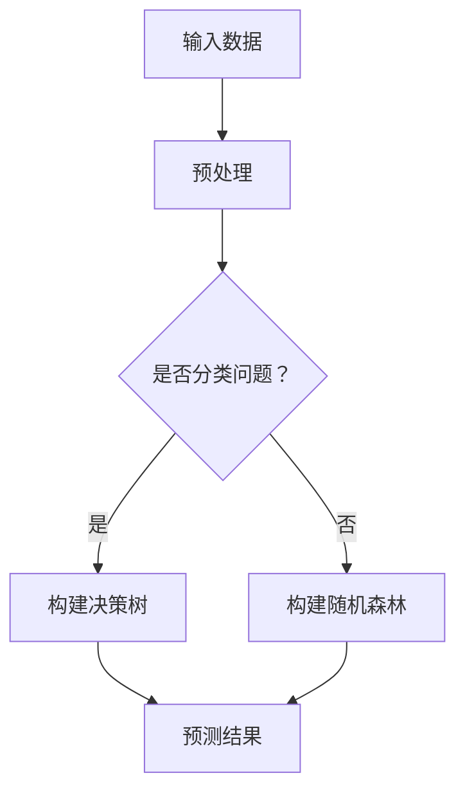
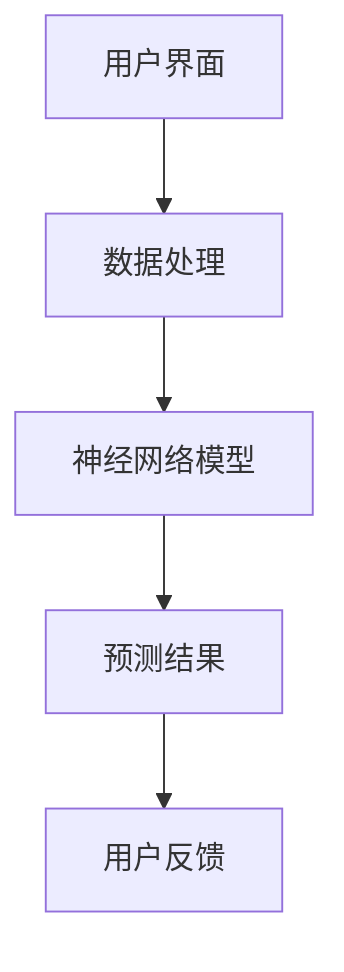

                 

### 让我们一步一步思考

**引言**

在探讨人类意识的奥秘时，我们经常将“主观体验”视为理解世界的第一人称视角。然而，这并非一个简单的问题，因为意识与主观体验的内在机制至今仍是一个科学难题。在本文中，我们将采取一步一步的逻辑分析方式，深入探讨这一主题，旨在揭示其核心原理和深远影响。

**第一步：问题的定义**

首先，我们需要明确问题是什么。意识与主观体验的关系可以描述为：

- **意识**：一种内在的心理状态，涉及到自我感知、认知和判断。
- **主观体验**：个人对世界的感觉和感受，它依赖于个体的意识状态。

这两个概念密切相关，但它们的区别和联系却常常模糊不清。因此，我们需要先定义它们，以便更好地理解它们之间的关系。

**第二步：核心概念的探讨**

接下来，我们将探讨几个核心概念，以便构建对意识与主观体验的更深入理解。

- **感知**：感官器官接收外界信息的过程。
- **认知**：大脑处理感知信息的过程，包括记忆、推理和判断。
- **神经科学**：研究神经系统结构和功能的科学，帮助我们理解意识的基础。
- **心理学**：研究人类行为和心理过程的科学，帮助我们理解主观体验。

**第三步：算法原理讲解**

为了更好地理解意识与主观体验的算法原理，我们可以引入一些神经科学和心理学中的理论和模型。

- **神经网络**：一种模拟人脑结构和功能的计算模型，可以用于模拟意识。
- **认知模型**：用于模拟认知过程的模型，帮助我们理解主观体验。
- **决策树和随机森林**：用于分类和回归的算法，可以用于预测意识状态。

为了讲解这些算法原理，我们可以使用 mermaid 流程图来展示算法流程，并用 Python 源代码详细阐述算法原理。



```python
# Python 源代码示例：决策树分类算法
from sklearn.datasets import load_iris
from sklearn.tree import DecisionTreeClassifier
from sklearn.model_selection import train_test_split
from sklearn.metrics import accuracy_score

# 加载数据集
iris = load_iris()
X, y = iris.data, iris.target

# 划分训练集和测试集
X_train, X_test, y_train, y_test = train_test_split(X, y, test_size=0.2, random_state=42)

# 创建决策树分类器
clf = DecisionTreeClassifier()

# 训练模型
clf.fit(X_train, y_train)

# 预测结果
y_pred = clf.predict(X_test)

# 评估模型
accuracy = accuracy_score(y_test, y_pred)
print(f"模型准确率：{accuracy:.2f}")
```

**第四步：数学模型和数学公式**

在解释算法原理时，我们需要提供数学模型和数学公式。这些模型和公式可以帮助我们更深入地理解意识与主观体验的机制。

- **神经网络激活函数**：如ReLU、Sigmoid和Tanh。
- **认知模型的决策规则**：如逻辑回归和贝叶斯分类。

以下是使用 LaTeX 格式嵌入文中的独立段落的数学公式示例：

```markdown
$$
z = \sigma(w_1x_1 + w_2x_2 + b)
$$

$$
\text{其中，} \sigma \text{ 是 Sigmoid 函数，} w_1, w_2 \text{ 是权重，} x_1, x_2 \text{ 是输入特征，} b \text{ 是偏置。}
$$
```

**第五步：系统分析与架构设计方案**

为了将这些算法应用于实际系统中，我们需要设计一个系统功能、架构和接口。

- **系统功能设计**：定义系统的主要功能，如用户界面、数据处理和预测。
- **系统架构设计**：设计系统的组件和它们之间的关系。
- **系统接口设计**：定义系统与其他系统或组件的交互接口。

以下是使用 mermaid 流程图展示系统架构的示例：



**第六步：项目实战**

接下来，我们将通过一个具体的案例分析，展示如何将理论应用到实际项目中。

- **环境安装**：安装所需的软件和工具。
- **系统核心实现**：编写系统核心代码。
- **代码应用解读**：分析代码的实现细节。
- **实际案例分析**：分析实际案例，展示系统的应用效果。

**第七步：最佳实践、小结、注意事项、拓展阅读**

最后，我们将总结书中的关键点，提供最佳实践建议，并提出注意事项，以帮助读者更好地理解和应用所学知识。

- **最佳实践**：如何在项目中有效应用所学知识。
- **小结**：回顾文章的主要内容。
- **注意事项**：避免常见的错误和挑战。
- **拓展阅读**：推荐进一步学习的资源。

通过以上步骤，我们将系统地探讨意识与主观体验这一复杂主题，帮助读者更好地理解这一领域的核心概念和实际应用。接下来，我们将详细展开每一个步骤，深入探讨每个部分的内容。希望这次分析能够为您的理解和思考提供有力支持。让我们继续前进，深入探究这一神秘领域。

