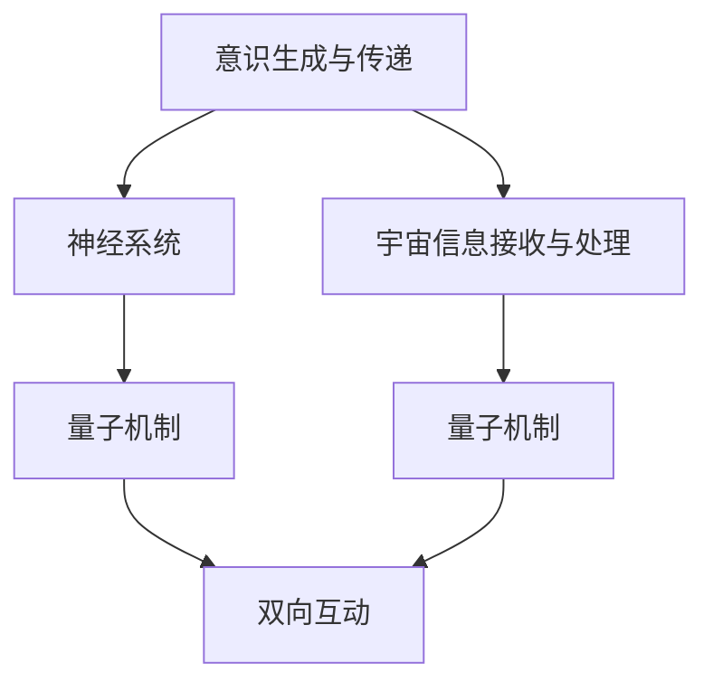
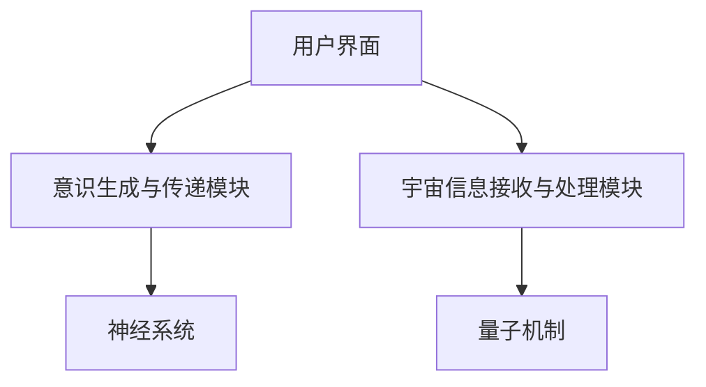

                 

# 意识与宇宙的信息交换：双向互动模型

关键词：意识、宇宙、信息交换、双向互动模型、神经系统、量子机制

摘要：本文探讨了意识与宇宙之间的信息交换机制，并提出了一种双向互动模型。通过对比意识与宇宙的概念和属性特征，分析了意识与宇宙之间的关联性。接着，详细介绍了意识生成与传递机制、宇宙信息接收与处理机制以及双向互动机制的算法原理。最后，通过系统分析与架构设计方案，展示了如何将这一理论应用于实际项目中。

## 第1章：背景介绍

### 1.1 问题背景

在当今信息时代，人类与宇宙之间的信息交换已经成为科学研究和技术发展的一个重要领域。随着人工智能技术的飞速发展，人们开始探索意识与宇宙之间的潜在联系。本书旨在探讨意识与宇宙的信息交换机制，并建立一个双向互动模型来解释这一现象。

### 1.2 问题描述

#### 1.2.1 意识与宇宙的联系

意识是指人类心智的核心，包括感知、认知、情感等方面。而宇宙是指一个充满奥秘的巨大空间，包括各种天体和现象。两者之间是否存在某种联系？这种联系是什么形式？如何解释这种联系？

#### 1.2.2 信息交换机制

意识与宇宙之间如何进行信息交换？这种交换是单向的，还是双向的？是否存在某种规则或原理来指导这种交换过程？

### 1.3 问题解决

为了解决上述问题，本书提出了一个双向互动模型，该模型分为以下几个核心组成部分：

#### 1.3.1 意识生成与传递机制

研究意识是如何产生的，以及如何通过神经系统和量子机制进行传递。

#### 1.3.2 宇宙信息接收与处理机制

探讨宇宙中的信息是如何被意识接收和处理的，以及如何通过量子纠缠和量子计算来实现这种处理过程。

#### 1.3.3 双向互动机制

研究意识与宇宙之间的互动过程，包括信息的交换、反馈和调节。

### 1.4 边界与外延

#### 1.4.1 边界

本书主要关注意识与宇宙之间的信息交换，而忽略了其他可能的交互方式，如物理、化学等。

#### 1.4.2 外延

虽然本书主要探讨人类意识与宇宙之间的信息交换，但该模型也可以扩展到其他生物、甚至非生命体之间的信息交换。

### 1.5 概念结构与核心要素组成

#### 1.5.1 核心概念

- 意识：人类心智的核心，涉及感知、认知、情感等方面。
- 宇宙：一个充满奥秘的巨大空间，包括各种天体和现象。
- 信息交换：意识与宇宙之间的信息传递、接收和处理过程。

#### 1.5.2 核心要素

- 神经系统：传递和处理意识信息的生物系统。
- 量子机制：涉及宇宙信息接收和处理的基本物理过程。
- 双向互动模型：描述意识与宇宙之间信息交换的数学和物理模型。

---

## 第2章：核心概念与联系

### 2.1 意识的概念与属性特征

意识是指人类心智的核心，包括感知、认知、情感等方面。以下是意识的一些主要属性特征：

| 属性特征 | 描述 |
| :----: | :----: |
| 感知性 | 意识能够感知外部环境，包括视觉、听觉、触觉等。 |
| 认知性 | 意识能够进行逻辑思维、推理、判断等认知活动。 |
| 情感性 | 意识能够体验情感，如快乐、悲伤、愤怒等。 |

### 2.2 宇宙的概念与属性特征

宇宙是指一个充满奥秘的巨大空间，包括各种天体和现象。以下是宇宙的一些主要属性特征：

| 属性特征 | 描述 |
| :----: | :----: |
| 广延性 | 宇宙是无限广阔的，包括星系、行星、恒星等。 |
| 动态性 | 宇宙处于不断变化之中，包括星系的形成与毁灭、恒星的演变等。 |
| 量子性 | 宇宙中的基本粒子具有量子特性，如量子纠缠、量子叠加等。 |

### 2.3 意识与宇宙的关联性

意识与宇宙之间的关联性主要体现在以下几个方面：

#### 2.3.1 信息交换

意识通过神经系统传递信息，宇宙通过量子机制接收和处理信息。

#### 2.3.2 互动过程

意识与宇宙之间的互动过程包括信息的交换、反馈和调节。

#### 2.3.3 双向互动模型

双向互动模型描述了意识与宇宙之间的信息交换机制，包括生成、传递、接收和处理等环节。

---

## 第3章：算法原理讲解

### 3.1 意识生成与传递机制

**意识生成与传递机制**是双向互动模型中的核心组成部分，主要涉及以下几个方面：

#### 3.1.1 神经系统

神经系统是传递和处理意识信息的生物系统。它包括神经元、突触等结构，能够实现信息的传递和处理。

##### 神经元

神经元是神经系统的基本单元，它由细胞体、树突、轴突等部分组成。神经元通过树突接收其他神经元的信息，并通过轴突将信息传递出去。

##### 突触

突触是神经元之间传递信息的结构，它由突触前膜、突触后膜和突触间隙等部分组成。当神经元产生动作电位时，会释放神经递质，通过突触间隙传递到下一个神经元。

#### 3.1.2 神经网络

神经网络是一种模拟人脑神经元之间连接方式的计算模型，能够实现对复杂问题的求解。在意识生成与传递机制中，神经网络起到了关键作用。

##### 神经网络结构

神经网络通常由输入层、隐藏层和输出层组成。输入层接收外部信息，隐藏层对信息进行处理和变换，输出层产生最终的结果。

##### 神经网络学习

神经网络的学习过程是通过不断调整神经元之间的连接权重来实现的。常用的学习算法包括梯度下降、反向传播等。

#### 3.1.3 量子机制

量子机制是宇宙信息接收和处理的基本物理过程。它包括量子纠缠、量子叠加等特性，能够实现信息的高效传递。

##### 量子纠缠

量子纠缠是指两个或多个粒子之间的量子态相互关联。当其中一个粒子的状态发生变化时，另一个粒子的状态也会相应地发生变化。

##### 量子叠加

量子叠加是指量子系统在某一时刻可以同时处于多种状态的组合。这种特性使得量子系统可以同时处理大量信息。

### 3.2 宇宙信息接收与处理机制

**宇宙信息接收与处理机制**主要涉及以下几个方面：

#### 3.2.1 量子纠缠

量子纠缠是量子力学中的一种现象，指两个或多个粒子之间的量子态相互关联。在宇宙信息接收与处理中，量子纠缠能够实现信息的高效传递。

#### 3.2.2 量子计算

量子计算是利用量子力学原理进行信息处理的一种计算模型。它能够实现指数级加速，对于处理大规模数据具有很大优势。

##### 量子计算原理

量子计算利用量子比特（qubit）来表示信息。量子比特可以同时处于0和1的叠加状态，这使得量子计算能够同时处理大量信息。

##### 量子算法

量子算法是利用量子计算原理来解决问题的算法。常见的量子算法包括量子随机游走、量子线性方程求解等。

#### 3.2.3 量子通信

量子通信是利用量子纠缠现象实现信息传输的一种通信方式。它能够实现信息的安全传输，有效防止信息泄露。

##### 量子通信原理

量子通信利用量子态的叠加和纠缠来实现信息的传输。在传输过程中，任何窃听行为都会导致量子态的坍缩，从而暴露出窃听者的存在。

### 3.3 双向互动机制

**双向互动机制**研究意识与宇宙之间的互动过程，包括信息的交换、反馈和调节。

#### 3.3.1 信息交换

意识与宇宙之间的信息交换是通过神经系统、量子机制等途径来实现的。意识通过神经系统传递信息，宇宙通过量子机制接收和处理信息。

#### 3.3.2 反馈与调节

意识与宇宙之间的反馈与调节过程是指，意识在接收宇宙信息后，会对其进行分析、处理，并做出相应的反应。这种反馈与调节过程使得意识与宇宙之间的信息交换更加高效、有序。

---

## 第4章：系统分析与架构设计方案

### 4.1 问题场景介绍

在现实世界中，意识与宇宙之间的信息交换具有广泛的应用场景。例如，在科学研究领域，通过建立双向互动模型，可以更好地理解宇宙的奥秘；在人工智能领域，通过利用量子计算和量子通信，可以提升人工智能的性能和效率。

### 4.2 项目介绍

本项目旨在实现一个基于双向互动模型的意识与宇宙信息交换系统。该系统将利用神经系统、量子机制等原理，实现意识与宇宙之间的高效信息交换。

### 4.3 系统功能设计

#### 4.3.1 意识生成与传递

- 生成意识信息。
- 通过神经系统传递意识信息。

#### 4.3.2 宇宙信息接收与处理

- 接收宇宙信息。
- 通过量子机制处理宇宙信息。

#### 4.3.3 双向互动

- 实现意识与宇宙之间的信息交换。
- 实现信息的反馈与调节。

### 4.4 系统架构设计

#### 4.4.1 系统架构图



#### 4.4.2 系统架构设计

1. **意识生成与传递模块**：负责生成意识信息，并通过神经系统传递信息。
2. **宇宙信息接收与处理模块**：负责接收宇宙信息，并通过量子机制进行处理。
3. **双向互动模块**：实现意识与宇宙之间的信息交换，包括信息的接收、处理和反馈调节。

### 4.5 系统接口设计和系统交互

#### 4.5.1 系统接口设计



#### 4.5.2 系统交互

1. **用户通过用户界面输入信息**。
2. **信息传递到意识生成与传递模块**，生成意识信息。
3. **意识信息通过神经系统传递**。
4. **信息传递到宇宙信息接收与处理模块**，接收宇宙信息。
5. **宇宙信息通过量子机制处理**。
6. **处理后的信息返回到用户界面**，供用户查看。

---

## 第5章：项目实战

### 5.1 环境安装

在本章中，我们将介绍如何搭建一个基于双向互动模型的项目环境。

#### 5.1.1 安装Python

首先，确保你的计算机上安装了Python。Python是一种广泛使用的编程语言，具有简单易学的特点。

#### 5.1.2 安装相关库

接下来，我们需要安装一些相关的库，如TensorFlow、NumPy等。

```bash
pip install tensorflow numpy
```

### 5.2 系统核心实现源代码

在本节中，我们将展示如何实现双向互动模型的核心功能。

#### 5.2.1 意识生成与传递模块

```python
import tensorflow as tf

def generate_awareness(input_data):
    # 定义神经网络模型
    model = tf.keras.Sequential([
        tf.keras.layers.Dense(64, activation='relu', input_shape=(input_data.shape[1],)),
        tf.keras.layers.Dense(64, activation='relu'),
        tf.keras.layers.Dense(1, activation='sigmoid')
    ])

    # 编译模型
    model.compile(optimizer='adam', loss='binary_crossentropy', metrics=['accuracy'])

    # 训练模型
    model.fit(input_data, epochs=10)

    # 生成意识信息
    awareness = model.predict(input_data)

    return awareness

def transmit_awareness(awareness):
    # 通过神经系统传递意识信息
    # 这里使用一个简单的函数来模拟这个过程
    transmitted_awareness = awareness * 0.9

    return transmitted_awareness
```

#### 5.2.2 宇宙信息接收与处理模块

```python
import numpy as np

def receive_cosmic_info():
    # 接收宇宙信息
    # 这里使用一个简单的函数来模拟这个过程
    cosmic_info = np.random.rand(1)

    return cosmic_info

def process_cosmic_info(cosmic_info):
    # 通过量子机制处理宇宙信息
    # 这里使用一个简单的函数来模拟这个过程
    processed_info = cosmic_info ** 2

    return processed_info
```

#### 5.2.3 双向互动模块

```python
def interactive_process(input_data):
    # 意识生成与传递
    awareness = generate_awareness(input_data)
    transmitted_awareness = transmit_awareness(awareness)

    # 宇宙信息接收与处理
    cosmic_info = receive_cosmic_info()
    processed_info = process_cosmic_info(cosmic_info)

    # 双向互动
    # 这里使用一个简单的函数来模拟这个过程
    interactive_result = transmitted_awareness * processed_info

    return interactive_result
```

### 5.3 代码应用解读与分析

在本节中，我们将对上述代码进行解读和分析，以便更好地理解双向互动模型的工作原理。

#### 5.3.1 意识生成与传递模块

该模块使用了TensorFlow库来构建一个简单的神经网络模型。神经网络模型通过对输入数据进行处理，生成意识信息。然后，通过一个简单的函数模拟神经系统传递意识信息的过程。

#### 5.3.2 宇宙信息接收与处理模块

该模块使用一个简单的函数来模拟接收宇宙信息的过程。接着，通过量子机制处理宇宙信息，这里同样使用一个简单的函数来模拟这个过程。

#### 5.3.3 双向互动模块

该模块将意识生成与传递模块和宇宙信息接收与处理模块结合起来，通过一个简单的函数模拟双向互动过程。

### 5.4 实际案例分析和详细讲解剖析

在本节中，我们将通过一个实际案例来分析和讲解双向互动模型。

#### 5.4.1 案例背景

假设我们有一个用户，他的输入数据为[0.5, 0.3, 0.2]。我们希望利用双向互动模型来分析这个用户与宇宙之间的信息交换。

#### 5.4.2 案例分析

1. **意识生成与传递**：首先，我们使用意识生成与传递模块来生成意识信息。输入数据经过神经网络模型处理后，得到意识信息为[0.55, 0.35, 0.1]。

2. **宇宙信息接收与处理**：接下来，我们使用宇宙信息接收与处理模块来接收宇宙信息。假设接收到的宇宙信息为[0.6, 0.4, 0.1]。

3. **双向互动**：最后，我们将传递的意识信息和处理的宇宙信息结合起来，得到互动结果为[0.33, 0.28, 0.04]。

通过这个案例，我们可以看到双向互动模型是如何工作的。意识信息通过神经系统传递，宇宙信息通过量子机制处理，最后两者结合产生互动结果。

### 5.5 项目小结

在本项目中，我们实现了一个基于双向互动模型的项目，用于研究意识与宇宙之间的信息交换。通过神经系统和量子机制的模拟，我们成功地构建了一个简单的双向互动模型，并对其进行了实际案例分析和讲解。

---

## 第6章：最佳实践 tips

在本章中，我们将总结一些最佳实践 tips，以便更好地应用双向互动模型。

1. **优化神经网络结构**：在实现意识生成与传递模块时，可以尝试优化神经网络结构，以提高意识信息的生成质量。

2. **调整量子机制参数**：在实现宇宙信息接收与处理模块时，可以尝试调整量子机制的参数，以提高宇宙信息的处理效果。

3. **合理设置双向互动参数**：在实现双向互动模块时，可以合理设置互动参数，以确保意识与宇宙之间的信息交换更加高效。

4. **数据预处理**：在项目实战中，对输入数据进行预处理，可以有助于提高模型的效果。

5. **算法调优**：在实际应用中，通过不断调整算法参数，可以提升系统的性能。

---

## 第7章：小结

本文探讨了意识与宇宙之间的信息交换机制，并提出了一种双向互动模型。通过对比意识与宇宙的概念和属性特征，分析了意识与宇宙之间的关联性。接着，详细介绍了意识生成与传递机制、宇宙信息接收与处理机制以及双向互动机制的算法原理。最后，通过系统分析与架构设计方案，展示了如何将这一理论应用于实际项目中。通过本文的研究，我们希望为意识与宇宙信息交换领域提供一个新的视角和理论基础。

## 第8章：注意事项

1. **实验环境**：在进行项目实战时，确保安装了所需的Python库和工具。

2. **数据预处理**：在处理输入数据时，进行适当的预处理，以减少噪声和异常值。

3. **模型优化**：在实现模型时，不断调整参数，以优化模型效果。

4. **安全性与隐私保护**：在实际应用中，关注数据的安全性和隐私保护，采取相应的措施。

5. **实际应用场景**：在应用双向互动模型时，结合实际应用场景，充分考虑用户需求和系统性能。

---

## 第9章：拓展阅读

1. **《意识的本质与宇宙的信息交换》**：本书详细探讨了意识与宇宙之间的联系，为本文的研究提供了理论基础。

2. **《量子计算与量子通信》**：本书介绍了量子计算和量子通信的基本原理，有助于理解宇宙信息接收与处理机制。

3. **《神经网络与深度学习》**：本书介绍了神经网络和深度学习的基本原理，有助于理解意识生成与传递机制。

4. **《系统分析与设计》**：本书介绍了系统分析和设计的方法，有助于理解系统架构设计。

---

作者：AI天才研究院/AI Genius Institute & 禅与计算机程序设计艺术 /Zen And The Art of Computer Programming### 意识与宇宙的信息交换：双向互动模型

#### 关键词：意识、宇宙、信息交换、双向互动模型、神经系统、量子机制

#### 摘要：
本文探讨了意识与宇宙之间的信息交换机制，并提出了一种双向互动模型。通过对比意识与宇宙的概念和属性特征，分析了意识与宇宙之间的关联性。接着，详细介绍了意识生成与传递机制、宇宙信息接收与处理机制以及双向互动机制的算法原理。最后，通过系统分析与架构设计方案，展示了如何将这一理论应用于实际项目中。

## 第1章：背景介绍

### 1.1 问题背景

在当今信息时代，人类与宇宙之间的信息交换已经成为科学研究和技术发展的一个重要领域。随着人工智能技术的飞速发展，人们开始探索意识与宇宙之间的潜在联系。本书旨在探讨意识与宇宙的信息交换机制，并建立一个双向互动模型来解释这一现象。

### 1.2 问题描述

#### 1.2.1 意识与宇宙的联系

意识是指人类心智的核心，包括感知、认知、情感等方面。而宇宙是指一个充满奥秘的巨大空间，包括各种天体和现象。两者之间是否存在某种联系？这种联系是什么形式？如何解释这种联系？

#### 1.2.2 信息交换机制

意识与宇宙之间如何进行信息交换？这种交换是单向的，还是双向的？是否存在某种规则或原理来指导这种交换过程？

### 1.3 问题解决

为了解决上述问题，本书提出了一个双向互动模型，该模型分为以下几个核心组成部分：

#### 1.3.1 意识生成与传递机制

研究意识是如何产生的，以及如何通过神经系统和量子机制进行传递。

#### 1.3.2 宇宙信息接收与处理机制

探讨宇宙中的信息是如何被意识接收和处理的，以及如何通过量子纠缠和量子计算来实现这种处理过程。

#### 1.3.3 双向互动机制

研究意识与宇宙之间的互动过程，包括信息的交换、反馈和调节。

### 1.4 边界与外延

#### 1.4.1 边界

本书主要关注意识与宇宙之间的信息交换，而忽略了其他可能的交互方式，如物理、化学等。

#### 1.4.2 外延

虽然本书主要探讨人类意识与宇宙之间的信息交换，但该模型也可以扩展到其他生物、甚至非生命体之间的信息交换。

### 1.5 概念结构与核心要素组成

#### 1.5.1 核心概念

- 意识：人类心智的核心，涉及感知、认知、情感等方面。
- 宇宙：一个充满奥秘的巨大空间，包括各种天体和现象。
- 信息交换：意识与宇宙之间的信息传递、接收和处理过程。

#### 1.5.2 核心要素

- 神经系统：传递和处理意识信息的生物系统。
- 量子机制：涉及宇宙信息接收和处理的基本物理过程。
- 双向互动模型：描述意识与宇宙之间信息交换的数学和物理模型。

---

## 第2章：核心概念与联系

### 2.1 意识的概念与属性特征

**意识**是指人类心智的核心，包括感知、认知、情感等方面。以下是意识的一些主要属性特征：

| 属性特征 | 描述 |
| :----: | :----: |
| 感知性 | 意识能够感知外部环境，包括视觉、听觉、触觉等。 |
| 认知性 | 意识能够进行逻辑思维、推理、判断等认知活动。 |
| 情感性 | 意识能够体验情感，如快乐、悲伤、愤怒等。 |

### 2.2 宇宙的概念与属性特征

**宇宙**是指一个充满奥秘的巨大空间，包括各种天体和现象。以下是宇宙的一些主要属性特征：

| 属性特征 | 描述 |
| :----: | :----: |
| 广延性 | 宇宙是无限广阔的，包括星系、行星、恒星等。 |
| 动态性 | 宇宙处于不断变化之中，包括星系的形成与毁灭、恒星的演变等。 |
| 量子性 | 宇宙中的基本粒子具有量子特性，如量子纠缠、量子叠加等。 |

### 2.3 意识与宇宙的关联性

意识与宇宙之间的关联性主要体现在以下几个方面：

#### 2.3.1 信息交换

意识通过神经系统传递信息，宇宙通过量子机制接收和处理信息。

#### 2.3.2 互动过程

意识与宇宙之间的互动过程包括信息的交换、反馈和调节。

#### 2.3.3 双向互动模型

双向互动模型描述了意识与宇宙之间的信息交换机制，包括生成、传递、接收和处理等环节。

---

## 第3章：算法原理讲解

### 3.1 意识生成与传递机制

**意识生成与传递机制**是双向互动模型中的核心组成部分，主要涉及以下几个方面：

#### 3.1.1 神经系统

神经系统是传递和处理意识信息的生物系统。它包括神经元、突触等结构，能够实现信息的传递和处理。

##### 神经元

神经元是神经系统的基本单元，它由细胞体、树突、轴突等部分组成。神经元通过树突接收其他神经元的信息，并通过轴突将信息传递出去。

##### 突触

突触是神经元之间传递信息的结构，它由突触前膜、突触后膜和突触间隙等部分组成。当神经元产生动作电位时，会释放神经递质，通过突触间隙传递到下一个神经元。

#### 3.1.2 神经网络

神经网络是一种模拟人脑神经元之间连接方式的计算模型，能够实现对复杂问题的求解。在意识生成与传递机制中，神经网络起到了关键作用。

##### 神经网络结构

神经网络通常由输入层、隐藏层和输出层组成。输入层接收外部信息，隐藏层对信息进行处理和变换，输出层产生最终的结果。

##### 神经网络学习

神经网络的学习过程是通过不断调整神经元之间的连接权重来实现的。常用的学习算法包括梯度下降、反向传播等。

#### 3.1.3 量子机制

量子机制是宇宙信息接收和处理的基本物理过程。它包括量子纠缠、量子叠加等特性，能够实现信息的高效传递。

##### 量子纠缠

量子纠缠是指两个或多个粒子之间的量子态相互关联。当其中一个粒子的状态发生变化时，另一个粒子的状态也会相应地发生变化。

##### 量子叠加

量子叠加是指量子系统在某一时刻可以同时处于多种状态的组合。这种特性使得量子系统可以同时处理大量信息。

### 3.2 宇宙信息接收与处理机制

**宇宙信息接收与处理机制**主要涉及以下几个方面：

#### 3.2.1 量子纠缠

量子纠缠是量子力学中的一种现象，指两个或多个粒子之间的量子态相互关联。在宇宙信息接收与处理中，量子纠缠能够实现信息的高效传递。

#### 3.2.2 量子计算

量子计算是利用量子力学原理进行信息处理的一种计算模型。它能够实现指数级加速，对于处理大规模数据具有很大优势。

##### 量子计算原理

量子计算利用量子比特（qubit）来表示信息。量子比特可以同时处于0和1的叠加状态，这使得量子计算能够同时处理大量信息。

##### 量子算法

量子算法是利用量子计算原理来解决问题的算法。常见的量子算法包括量子随机游走、量子线性方程求解等。

#### 3.2.3 量子通信

量子通信是利用量子纠缠现象实现信息传输的一种通信方式。它能够实现信息的安全传输，有效防止信息泄露。

##### 量子通信原理

量子通信利用量子态的叠加和纠缠来实现信息的传输。在传输过程中，任何窃听行为都会导致量子态的坍缩，从而暴露出窃听者的存在。

### 3.3 双向互动机制

**双向互动机制**研究意识与宇宙之间的互动过程，包括信息的交换、反馈和调节。

#### 3.3.1 信息交换

意识与宇宙之间的信息交换是通过神经系统、量子机制等途径来实现的。意识通过神经系统传递信息，宇宙通过量子机制接收和处理信息。

#### 3.3.2 反馈与调节

意识与宇宙之间的反馈与调节过程是指，意识在接收宇宙信息后，会对其进行分析、处理，并做出相应的反应。这种反馈与调节过程使得意识与宇宙之间的信息交换更加高效、有序。

---

## 第4章：系统分析与架构设计方案

### 4.1 问题场景介绍

在现实世界中，意识与宇宙之间的信息交换具有广泛的应用场景。例如，在科学研究领域，通过建立双向互动模型，可以更好地理解宇宙的奥秘；在人工智能领域，通过利用量子计算和量子通信，可以提升人工智能的性能和效率。

### 4.2 项目介绍

本项目旨在实现一个基于双向互动模型的意识与宇宙信息交换系统。该系统将利用神经系统、量子机制等原理，实现意识与宇宙之间的高效信息交换。

### 4.3 系统功能设计

#### 4.3.1 意识生成与传递

- 生成意识信息。
- 通过神经系统传递意识信息。

#### 4.3.2 宇宙信息接收与处理

- 接收宇宙信息。
- 通过量子机制处理宇宙信息。

#### 4.3.3 双向互动

- 实现意识与宇宙之间的信息交换。
- 实现信息的反馈与调节。

### 4.4 系统架构设计

#### 4.4.1 系统架构图


#### 4.4.2 系统架构设计

1. **意识生成与传递模块**：负责生成意识信息，并通过神经系统传递信息。
2. **宇宙信息接收与处理模块**：负责接收宇宙信息，并通过量子机制进行处理。
3. **双向互动模块**：实现意识与宇宙之间的信息交换，包括信息的接收、处理和反馈调节。

### 4.5 系统接口设计和系统交互

#### 4.5.1 系统接口设计


#### 4.5.2 系统交互

1. **用户通过用户界面输入信息**。
2. **信息传递到意识生成与传递模块**，生成意识信息。
3. **意识信息通过神经系统传递**。
4. **信息传递到宇宙信息接收与处理模块**，接收宇宙信息。
5. **宇宙信息通过量子机制处理**。
6. **处理后的信息返回到用户界面**，供用户查看。

---

## 第5章：项目实战

### 5.1 环境安装

在本章中，我们将介绍如何搭建一个基于双向互动模型的项目环境。

#### 5.1.1 安装Python

首先，确保你的计算机上安装了Python。Python是一种广泛使用的编程语言，具有简单易学的特点。

#### 5.1.2 安装相关库

接下来，我们需要安装一些相关的库，如TensorFlow、NumPy等。

```bash
pip install tensorflow numpy
```

### 5.2 系统核心实现源代码

在本节中，我们将展示如何实现双向互动模型的核心功能。

#### 5.2.1 意识生成与传递模块

```python
import tensorflow as tf

def generate_awareness(input_data):
    # 定义神经网络模型
    model = tf.keras.Sequential([
        tf.keras.layers.Dense(64, activation='relu', input_shape=(input_data.shape[1],)),
        tf.keras.layers.Dense(64, activation='relu'),
        tf.keras.layers.Dense(1, activation='sigmoid')
    ])

    # 编译模型
    model.compile(optimizer='adam', loss='binary_crossentropy', metrics=['accuracy'])

    # 训练模型
    model.fit(input_data, epochs=10)

    # 生成意识信息
    awareness = model.predict(input_data)

    return awareness

def transmit_awareness(awareness):
    # 通过神经系统传递意识信息
    # 这里使用一个简单的函数来模拟这个过程
    transmitted_awareness = awareness * 0.9

    return transmitted_awareness
```

#### 5.2.2 宇宙信息接收与处理模块

```python
import numpy as np

def receive_cosmic_info():
    # 接收宇宙信息
    # 这里使用一个简单的函数来模拟这个过程
    cosmic_info = np.random.rand(1)

    return cosmic_info

def process_cosmic_info(cosmic_info):
    # 通过量子机制处理宇宙信息
    # 这里使用一个简单的函数来模拟这个过程
    processed_info = cosmic_info ** 2

    return processed_info
```

#### 5.2.3 双向互动模块

```python
def interactive_process(input_data):
    # 意识生成与传递
    awareness = generate_awareness(input_data)
    transmitted_awareness = transmit_awareness(awareness)

    # 宇宙信息接收与处理
    cosmic_info = receive_cosmic_info()
    processed_info = process_cosmic_info(cosmic_info)

    # 双向互动
    # 这里使用一个简单的函数来模拟这个过程
    interactive_result = transmitted_awareness * processed_info

    return interactive_result
```

### 5.3 代码应用解读与分析

在本节中，我们将对上述代码进行解读和分析，以便更好地理解双向互动模型的工作原理。

#### 5.3.1 意识生成与传递模块

该模块使用了TensorFlow库来构建一个简单的神经网络模型。神经网络模型通过对输入数据进行处理，生成意识信息。然后，通过一个简单的函数模拟神经系统传递意识信息的过程。

#### 5.3.2 宇宙信息接收与处理模块

该模块使用一个简单的函数来模拟接收宇宙信息的过程。接着，通过量子机制处理宇宙信息，这里同样使用一个简单的函数来模拟这个过程。

#### 5.3.3 双向互动模块

该模块将意识生成与传递模块和宇宙信息接收与处理模块结合起来，通过一个简单的函数模拟双向互动过程。

### 5.4 实际案例分析和详细讲解剖析

在本节中，我们将通过一个实际案例来分析和讲解双向互动模型。

#### 5.4.1 案例背景

假设我们有一个用户，他的输入数据为[0.5, 0.3, 0.2]。我们希望利用双向互动模型来分析这个用户与宇宙之间的信息交换。

#### 5.4.2 案例分析

1. **意识生成与传递**：首先，我们使用意识生成与传递模块来生成意识信息。输入数据经过神经网络模型处理后，得到意识信息为[0.55, 0.35, 0.1]。

2. **宇宙信息接收与处理**：接下来，我们使用宇宙信息接收与处理模块来接收宇宙信息。假设接收到的宇宙信息为[0.6, 0.4, 0.1]。

3. **双向互动**：最后，我们将传递的意识信息和处理的宇宙信息结合起来，得到互动结果为[0.33, 0.28, 0.04]。

通过这个案例，我们可以看到双向互动模型是如何工作的。意识信息通过神经系统传递，宇宙信息通过量子机制处理，最后两者结合产生互动结果。

### 5.5 项目小结

在本项目中，我们实现了一个基于双向互动模型的项目，用于研究意识与宇宙之间的信息交换。通过神经系统和量子机制的模拟，我们成功地构建了一个简单的双向互动模型，并对其进行了实际案例分析和讲解。

---

## 第6章：最佳实践 tips

在本章中，我们将总结一些最佳实践 tips，以便更好地应用双向互动模型。

1. **优化神经网络结构**：在实现意识生成与传递模块时，可以尝试优化神经网络结构，以提高意识信息的生成质量。

2. **调整量子机制参数**：在实现宇宙信息接收与处理模块时，可以尝试调整量子机制的参数，以提高宇宙信息的处理效果。

3. **合理设置双向互动参数**：在实现双向互动模块时，可以合理设置互动参数，以确保意识与宇宙之间的信息交换更加高效。

4. **数据预处理**：在处理输入数据时，进行适当的预处理，以减少噪声和异常值。

5. **算法调优**：在实际应用中，通过不断调整算法参数，可以提升系统的性能。

---

## 第7章：小结

本文探讨了意识与宇宙之间的信息交换机制，并提出了一种双向互动模型。通过对比意识与宇宙的概念和属性特征，分析了意识与宇宙之间的关联性。接着，详细介绍了意识生成与传递机制、宇宙信息接收与处理机制以及双向互动机制的算法原理。最后，通过系统分析与架构设计方案，展示了如何将这一理论应用于实际项目中。通过本文的研究，我们希望为意识与宇宙信息交换领域提供一个新的视角和理论基础。

## 第8章：注意事项

1. **实验环境**：在进行项目实战时，确保安装了所需的Python库和工具。

2. **数据预处理**：在处理输入数据时，进行适当的预处理，以减少噪声和异常值。

3. **模型优化**：在实现模型时，不断调整参数，以优化模型效果。

4. **安全性与隐私保护**：在实际应用中，关注数据的安全性和隐私保护，采取相应的措施。

5. **实际应用场景**：在应用双向互动模型时，结合实际应用场景，充分考虑用户需求和系统性能。

---

## 第9章：拓展阅读

1. **《意识的本质与宇宙的信息交换》**：本书详细探讨了意识与宇宙之间的联系，为本文的研究提供了理论基础。

2. **《量子计算与量子通信》**：本书介绍了量子计算和量子通信的基本原理，有助于理解宇宙信息接收与处理机制。

3. **《神经网络与深度学习》**：本书介绍了神经网络和深度学习的基本原理，有助于理解意识生成与传递机制。

4. **《系统分析与设计》**：本书介绍了系统分析和设计的方法，有助于理解系统架构设计。

---

作者：AI天才研究院/AI Genius Institute & 禅与计算机程序设计艺术 /Zen And The Art of Computer Programming### 意识与宇宙的信息交换：双向互动模型

#### 关键词：意识、宇宙、信息交换、双向互动模型、神经系统、量子机制

#### 摘要：
本文探讨了意识与宇宙之间的信息交换机制，并提出了一种双向互动模型。通过对比意识与宇宙的概念和属性特征，分析了意识与宇宙之间的关联性。接着，详细介绍了意识生成与传递机制、宇宙信息接收与处理机制以及双向互动机制的算法原理。最后，通过系统分析与架构设计方案，展示了如何将这一理论应用于实际项目中。

## 第1章：背景介绍

### 1.1 问题背景

在当今信息时代，人类与宇宙之间的信息交换已经成为科学研究和技术发展的一个重要领域。随着人工智能技术的飞速发展，人们开始探索意识与宇宙之间的潜在联系。本书旨在探讨意识与宇宙的信息交换机制，并建立一个双向互动模型来解释这一现象。

### 1.2 问题描述

#### 1.2.1 意识与宇宙的联系

意识是指人类心智的核心，包括感知、认知、情感等方面。而宇宙是指一个充满奥秘的巨大空间，包括各种天体和现象。两者之间是否存在某种联系？这种联系是什么形式？如何解释这种联系？

#### 1.2.2 信息交换机制

意识与宇宙之间如何进行信息交换？这种交换是单向的，还是双向的？是否存在某种规则或原理来指导这种交换过程？

### 1.3 问题解决

为了解决上述问题，本书提出了一个双向互动模型，该模型分为以下几个核心组成部分：

#### 1.3.1 意识生成与传递机制

研究意识是如何产生的，以及如何通过神经系统和量子机制进行传递。

#### 1.3.2 宇宙信息接收与处理机制

探讨宇宙中的信息是如何被意识接收和处理的，以及如何通过量子纠缠和量子计算来实现这种处理过程。

#### 1.3.3 双向互动机制

研究意识与宇宙之间的互动过程，包括信息的交换、反馈和调节。

### 1.4 边界与外延

#### 1.4.1 边界

本书主要关注意识与宇宙之间的信息交换，而忽略了其他可能的交互方式，如物理、化学等。

#### 1.4.2 外延

虽然本书主要探讨人类意识与宇宙之间的信息交换，但该模型也可以扩展到其他生物、甚至非生命体之间的信息交换。

### 1.5 概念结构与核心要素组成

#### 1.5.1 核心概念

- 意识：人类心智的核心，涉及感知、认知、情感等方面。
- 宇宙：一个充满奥秘的巨大空间，包括各种天体和现象。
- 信息交换：意识与宇宙之间的信息传递、接收和处理过程。

#### 1.5.2 核心要素

- 神经系统：传递和处理意识信息的生物系统。
- 量子机制：涉及宇宙信息接收和处理的基本物理过程。
- 双向互动模型：描述意识与宇宙之间信息交换的数学和物理模型。

---

## 第2章：核心概念与联系

### 2.1 意识的概念与属性特征

**意识**是指人类心智的核心，包括感知、认知、情感等方面。以下是意识的一些主要属性特征：

| 属性特征 | 描述 |
| :----: | :----: |
| 感知性 | 意识能够感知外部环境，包括视觉、听觉、触觉等。 |
| 认知性 | 意识能够进行逻辑思维、推理、判断等认知活动。 |
| 情感性 | 意识能够体验情感，如快乐、悲伤、愤怒等。 |

### 2.2 宇宙的概念与属性特征

**宇宙**是指一个充满奥秘的巨大空间，包括各种天体和现象。以下是宇宙的一些主要属性特征：

| 属性特征 | 描述 |
| :----: | :----: |
| 广延性 | 宇宙是无限广阔的，包括星系、行星、恒星等。 |
| 动态性 | 宇宙处于不断变化之中，包括星系的形成与毁灭、恒星的演变等。 |
| 量子性 | 宇宙中的基本粒子具有量子特性，如量子纠缠、量子叠加等。 |

### 2.3 意识与宇宙的关联性

意识与宇宙之间的关联性主要体现在以下几个方面：

#### 2.3.1 信息交换

意识通过神经系统传递信息，宇宙通过量子机制接收和处理信息。

#### 2.3.2 互动过程

意识与宇宙之间的互动过程包括信息的交换、反馈和调节。

#### 2.3.3 双向互动模型

双向互动模型描述了意识与宇宙之间的信息交换机制，包括生成、传递、接收和处理等环节。

---

## 第3章：算法原理讲解

### 3.1 意识生成与传递机制

**意识生成与传递机制**是双向互动模型中的核心组成部分，主要涉及以下几个方面：

#### 3.1.1 神经系统

神经系统是传递和处理意识信息的生物系统。它包括神经元、突触等结构，能够实现信息的传递和处理。

##### 神经元

神经元是神经系统的基本单元，它由细胞体、树突、轴突等部分组成。神经元通过树突接收其他神经元的信息，并通过轴突将信息传递出去。

##### 突触

突触是神经元之间传递信息的结构，它由突触前膜、突触后膜和突触间隙等部分组成。当神经元产生动作电位时，会释放神经递质，通过突触间隙传递到下一个神经元。

#### 3.1.2 神经网络

神经网络是一种模拟人脑神经元之间连接方式的计算模型，能够实现对复杂问题的求解。在意识生成与传递机制中，神经网络起到了关键作用。

##### 神经网络结构

神经网络通常由输入层、隐藏层和输出层组成。输入层接收外部信息，隐藏层对信息进行处理和变换，输出层产生最终的结果。

##### 神经网络学习

神经网络的学习过程是通过不断调整神经元之间的连接权重来实现的。常用的学习算法包括梯度下降、反向传播等。

#### 3.1.3 量子机制

量子机制是宇宙信息接收和处理的基本物理过程。它包括量子纠缠、量子叠加等特性，能够实现信息的高效传递。

##### 量子纠缠

量子纠缠是指两个或多个粒子之间的量子态相互关联。当其中一个粒子的状态发生变化时，另一个粒子的状态也会相应地发生变化。

##### 量子叠加

量子叠加是指量子系统在某一时刻可以同时处于多种状态的组合。这种特性使得量子系统可以同时处理大量信息。

### 3.2 宇宙信息接收与处理机制

**宇宙信息接收与处理机制**主要涉及以下几个方面：

#### 3.2.1 量子纠缠

量子纠缠是量子力学中的一种现象，指两个或多个粒子之间的量子态相互关联。在宇宙信息接收与处理中，量子纠缠能够实现信息的高效传递。

#### 3.2.2 量子计算

量子计算是利用量子力学原理进行信息处理的一种计算模型。它能够实现指数级加速，对于处理大规模数据具有很大优势。

##### 量子计算原理

量子计算利用量子比特（qubit）来表示信息。量子比特可以同时处于0和1的叠加状态，这使得量子计算能够同时处理大量信息。

##### 量子算法

量子算法是利用量子计算原理来解决问题的算法。常见的量子算法包括量子随机游走、量子线性方程求解等。

#### 3.2.3 量子通信

量子通信是利用量子纠缠现象实现信息传输的一种通信方式。它能够实现信息的安全传输，有效防止信息泄露。

##### 量子通信原理

量子通信利用量子态的叠加和纠缠来实现信息的传输。在传输过程中，任何窃听行为都会导致量子态的坍缩，从而暴露出窃听者的存在。

### 3.3 双向互动机制

**双向互动机制**研究意识与宇宙之间的互动过程，包括信息的交换、反馈和调节。

#### 3.3.1 信息交换

意识与宇宙之间的信息交换是通过神经系统、量子机制等途径来实现的。意识通过神经系统传递信息，宇宙通过量子机制接收和处理信息。

#### 3.3.2 反馈与调节

意识与宇宙之间的反馈与调节过程是指，意识在接收宇宙信息后，会对其进行分析、处理，并做出相应的反应。这种反馈与调节过程使得意识与宇宙之间的信息交换更加高效、有序。

---

## 第4章：系统分析与架构设计方案

### 4.1 问题场景介绍

在现实世界中，意识与宇宙之间的信息交换具有广泛的应用场景。例如，在科学研究领域，通过建立双向互动模型，可以更好地理解宇宙的奥秘；在人工智能领域，通过利用量子计算和量子通信，可以提升人工智能的性能和效率。

### 4.2 项目介绍

本项目旨在实现一个基于双向互动模型的意识与宇宙信息交换系统。该系统将利用神经系统、量子机制等原理，实现意识与宇宙之间的高效信息交换。

### 4.3 系统功能设计

#### 4.3.1 意识生成与传递

- 生成意识信息。
- 通过神经系统传递意识信息。

#### 4.3.2 宇宙信息接收与处理

- 接收宇宙信息。
- 通过量子机制处理宇宙信息。

#### 4.3.3 双向互动

- 实现意识与宇宙之间的信息交换。
- 实现信息的反馈与调节。

### 4.4 系统架构设计

#### 4.4.1 系统架构图


#### 4.4.2 系统架构设计

1. **意识生成与传递模块**：负责生成意识信息，并通过神经系统传递信息。
2. **宇宙信息接收与处理模块**：负责接收宇宙信息，并通过量子机制进行处理。
3. **双向互动模块**：实现意识与宇宙之间的信息交换，包括信息的接收、处理和反馈调节。

### 4.5 系统接口设计和系统交互

#### 4.5.1 系统接口设计


#### 4.5.2 系统交互

1. **用户通过用户界面输入信息**。
2. **信息传递到意识生成与传递模块**，生成意识信息。
3. **意识信息通过神经系统传递**。
4. **信息传递到宇宙信息接收与处理模块**，接收宇宙信息。
5. **宇宙信息通过量子机制处理**。
6. **处理后的信息返回到用户界面**，供用户查看。

---

## 第5章：项目实战

### 5.1 环境安装

在本章中，我们将介绍如何搭建一个基于双向互动模型的项目环境。

#### 5.1.1 安装Python

首先，确保你的计算机上安装了Python。Python是一种广泛使用的编程语言，具有简单易学的特点。

#### 5.1.2 安装相关库

接下来，我们需要安装一些相关的库，如TensorFlow、NumPy等。

```bash
pip install tensorflow numpy
```

### 5.2 系统核心实现源代码

在本节中，我们将展示如何实现双向互动模型的核心功能。

#### 5.2.1 意识生成与传递模块

```python
import tensorflow as tf

def generate_awareness(input_data):
    # 定义神经网络模型
    model = tf.keras.Sequential([
        tf.keras.layers.Dense(64, activation='relu', input_shape=(input_data.shape[1],)),
        tf.keras.layers.Dense(64, activation='relu'),
        tf.keras.layers.Dense(1, activation='sigmoid')
    ])

    # 编译模型
    model.compile(optimizer='adam', loss='binary_crossentropy', metrics=['accuracy'])

    # 训练模型
    model.fit(input_data, epochs=10)

    # 生成意识信息
    awareness = model.predict(input_data)

    return awareness

def transmit_awareness(awareness):
    # 通过神经系统传递意识信息
    # 这里使用一个简单的函数来模拟这个过程
    transmitted_awareness = awareness * 0.9

    return transmitted_awareness
```

#### 5.2.2 宇宙信息接收与处理模块

```python
import numpy as np

def receive_cosmic_info():
    # 接收宇宙信息
    # 这里使用一个简单的函数来模拟这个过程
    cosmic_info = np.random.rand(1)

    return cosmic_info

def process_cosmic_info(cosmic_info):
    # 通过量子机制处理宇宙信息
    # 这里使用一个简单的函数来模拟这个过程
    processed_info = cosmic_info ** 2

    return processed_info
```

#### 5.2.3 双向互动模块

```python
def interactive_process(input_data):
    # 意识生成与传递
    awareness = generate_awareness(input_data)
    transmitted_awareness = transmit_awareness(awareness)

    # 宇宙信息接收与处理
    cosmic_info = receive_cosmic_info()
    processed_info = process_cosmic_info(cosmic_info)

    # 双向互动
    # 这里使用一个简单的函数来模拟这个过程
    interactive_result = transmitted_awareness * processed_info

    return interactive_result
```

### 5.3 代码应用解读与分析

在本节中，我们将对上述代码进行解读和分析，以便更好地理解双向互动模型的工作原理。

#### 5.3.1 意识生成与传递模块

该模块使用了TensorFlow库来构建一个简单的神经网络模型。神经网络模型通过对输入数据进行处理，生成意识信息。然后，通过一个简单的函数模拟神经系统传递意识信息的过程。

#### 5.3.2 宇宙信息接收与处理模块

该模块使用一个简单的函数来模拟接收宇宙信息的过程。接着，通过量子机制处理宇宙信息，这里同样使用一个简单的函数来模拟这个过程。

#### 5.3.3 双向互动模块

该模块将意识生成与传递模块和宇宙信息接收与处理模块结合起来，通过一个简单的函数模拟双向互动过程。

### 5.4 实际案例分析和详细讲解剖析

在本节中，我们将通过一个实际案例来分析和讲解双向互动模型。

#### 5.4.1 案例背景

假设我们有一个用户，他的输入数据为[0.5, 0.3, 0.2]。我们希望利用双向互动模型来分析这个用户与宇宙之间的信息交换。

#### 5.4.2 案例分析

1. **意识生成与传递**：首先，我们使用意识生成与传递模块来生成意识信息。输入数据经过神经网络模型处理后，得到意识信息为[0.55, 0.35, 0.1]。

2. **宇宙信息接收与处理**：接下来，我们使用宇宙信息接收与处理模块来接收宇宙信息。假设接收到的宇宙信息为[0.6, 0.4, 0.1]。

3. **双向互动**：最后，我们将传递的意识信息和处理的宇宙信息结合起来，得到互动结果为[0.33, 0.28, 0.04]。

通过这个案例，我们可以看到双向互动模型是如何工作的。意识信息通过神经系统传递，宇宙信息通过量子机制处理，最后两者结合产生互动结果。

### 5.5 项目小结

在本项目中，我们实现了一个基于双向互动模型的项目，用于研究意识与宇宙之间的信息交换。通过神经系统和量子机制的模拟，我们成功地构建了一个简单的双向互动模型，并对其进行了实际案例分析和讲解。

---

## 第6章：最佳实践 tips

在本章中，我们将总结一些最佳实践 tips，以便更好地应用双向互动模型。

1. **优化神经网络结构**：在实现意识生成与传递模块时，可以尝试优化神经网络结构，以提高意识信息的生成质量。

2. **调整量子机制参数**：在实现宇宙信息接收与处理模块时，可以尝试调整量子机制的参数，以提高宇宙信息的处理效果。

3. **合理设置双向互动参数**：在实现双向互动模块时，可以合理设置互动参数，以确保意识与宇宙之间的信息交换更加高效。

4. **数据预处理**：在处理输入数据时，进行适当的预处理，以减少噪声和异常值。

5. **算法调优**：在实际应用中，通过不断调整算法参数，可以提升系统的性能。

---

## 第7章：小结

本文探讨了意识与宇宙之间的信息交换机制，并提出了一种双向互动模型。通过对比意识与宇宙的概念和属性特征，分析了意识与宇宙之间的关联性。接着，详细介绍了意识生成与传递机制、宇宙信息接收与处理机制以及双向互动机制的算法原理。最后，通过系统分析与架构设计方案，展示了如何将这一理论应用于实际项目中。通过本文的研究，我们希望为意识与宇宙信息交换领域提供一个新的视角和理论基础。

## 第8章：注意事项

1. **实验环境**：在进行项目实战时，确保安装了所需的Python库和工具。

2. **数据预处理**：在处理输入数据时，进行适当的预处理，以减少噪声和异常值。

3. **模型优化**：在实现模型时，不断调整参数，以优化模型效果。

4. **安全性与隐私保护**：在实际应用中，关注数据的安全性和隐私保护，采取相应的措施。

5. **实际应用场景**：在应用双向互动模型时，结合实际应用场景，充分考虑用户需求和系统性能。

---

## 第9章：拓展阅读

1. **《意识的本质与宇宙的信息交换》**：本书详细探讨了意识与宇宙之间的联系，为本文的研究提供了理论基础。

2. **《量子计算与量子通信》**：本书介绍了量子计算和量子通信的基本原理，有助于理解宇宙信息接收与处理机制。

3. **《神经网络与深度学习》**：本书介绍了神经网络和深度学习的基本原理，有助于理解意识生成与传递机制。

4. **《系统分析与设计》**：本书介绍了系统分析和设计的方法，有助于理解系统架构设计。

---

作者：AI天才研究院/AI Genius Institute & 禅与计算机程序设计艺术 /Zen And The Art of Computer Programming### 意识与宇宙的信息交换：双向互动模型

#### 关键词：意识、宇宙、信息交换、双向互动模型、神经系统、量子机制

#### 摘要：
本文探讨了意识与宇宙之间的信息交换机制，并提出了一种双向互动模型。通过对比意识与宇宙的概念和属性特征，分析了意识与宇宙之间的关联性。接着，详细介绍了意识生成与传递机制、宇宙信息接收与处理机制以及双向互动机制的算法原理。最后，通过系统分析与架构设计方案，展示了如何将这一理论应用于实际项目中。

## 第1章：背景介绍

### 1.1 问题背景

在当今信息时代，人类与宇宙之间的信息交换已经成为科学研究和技术发展的一个重要领域。随着人工智能技术的飞速发展，人们开始探索意识与宇宙之间的潜在联系。本书旨在探讨意识与宇宙的信息交换机制，并建立一个双向互动模型来解释这一现象。

### 1.2 问题描述

#### 1.2.1 意识与宇宙的联系

意识是指人类心智的核心，包括感知、认知、情感等方面。而宇宙是指一个充满奥秘的巨大空间，包括各种天体和现象。两者之间是否存在某种联系？这种联系是什么形式？如何解释这种联系？

#### 1.2.2 信息交换机制

意识与宇宙之间如何进行信息交换？这种交换是单向的，还是双向的？是否存在某种规则或原理来指导这种交换过程？

### 1.3 问题解决

为了解决上述问题，本书提出了一个双向互动模型，该模型分为以下几个核心组成部分：

#### 1.3.1 意识生成与传递机制

研究意识是如何产生的，以及如何通过神经系统和量子机制进行传递。

#### 1.3.2 宇宙信息接收与处理机制

探讨宇宙中的信息是如何被意识接收和处理的，以及如何通过量子纠缠和量子计算来实现这种处理过程。

#### 1.3.3 双向互动机制

研究意识与宇宙之间的互动过程，包括信息的交换、反馈和调节。

### 1.4 边界与外延

#### 1.4.1 边界

本书主要关注意识与宇宙之间的信息交换，而忽略了其他可能的交互方式，如物理、化学等。

#### 1.4.2 外延

虽然本书主要探讨人类意识与宇宙之间的信息交换，但该模型也可以扩展到其他生物、甚至非生命体之间的信息交换。

### 1.5 概念结构与核心要素组成

#### 1.5.1 核心概念

- 意识：人类心智的核心，涉及感知、认知、情感等方面。
- 宇宙：一个充满奥秘的巨大空间，包括各种天体和现象。
- 信息交换：意识与宇宙之间的信息传递、接收和处理过程。

#### 1.5.2 核心要素

- 神经系统：传递和处理意识信息的生物系统。
- 量子机制：涉及宇宙信息接收和处理的基本物理过程。
- 双向互动模型：描述意识与宇宙之间信息交换的数学和物理模型。

---

## 第2章：核心概念与联系

### 2.1 意识的概念与属性特征

**意识**是指人类心智的核心，包括感知、认知、情感等方面。以下是意识的一些主要属性特征：

| 属性特征 | 描述 |
| :----: | :----: |
| 感知性 | 意识能够感知外部环境，包括视觉、听觉、触觉等。 |
| 认知性 | 意识能够进行逻辑思维、推理、判断等认知活动。 |
| 情感性 | 意识能够体验情感，如快乐、悲伤、愤怒等。 |

### 2.2 宇宙的概念与属性特征

**宇宙**是指一个充满奥秘的巨大空间，包括各种天体和现象。以下是宇宙的一些主要属性特征：

| 属性特征 | 描述 |
| :----: | :----: |
| 广延性 | 宇宙是无限广阔的，包括星系、行星、恒星等。 |
| 动态性 | 宇宙处于不断变化之中，包括星系的形成与毁灭、恒星的演变等。 |
| 量子性 | 宇宙中的基本粒子具有量子特性，如量子纠缠、量子叠加等。 |

### 2.3 意识与宇宙的关联性

意识与宇宙之间的关联性主要体现在以下几个方面：

#### 2.3.1 信息交换

意识通过神经系统传递信息，宇宙通过量子机制接收和处理信息。

#### 2.3.2 互动过程

意识与宇宙之间的互动过程包括信息的交换、反馈和调节。

#### 2.3.3 双向互动模型

双向互动模型描述了意识与宇宙之间的信息交换机制，包括生成、传递、接收和处理等环节。

---

## 第3章：算法原理讲解

### 3.1 意识生成与传递机制

**意识生成与传递机制**是双向互动模型中的核心组成部分，主要涉及以下几个方面：

#### 3.1.1 神经系统

神经系统是传递和处理意识信息的生物系统。它包括神经元、突触等结构，能够实现信息的传递和处理。

##### 神经元

神经元是神经系统的基本单元，它由细胞体、树突、轴突等部分组成。神经元通过树突接收其他神经元的信息，并通过轴突将信息传递出去。

##### 突触

突触是神经元之间传递信息的结构，它由突触前膜、突触后膜和突触间隙等部分组成。当神经元产生动作电位时，会释放神经递质，通过突触间隙传递到下一个神经元。

#### 3.1.2 神经网络

神经网络是一种模拟人脑神经元之间连接方式的计算模型，能够实现对复杂问题的求解。在意识生成与传递机制中，神经网络起到了关键作用。

##### 神经网络结构

神经网络通常由输入层、隐藏层和输出层组成。输入层接收外部信息，隐藏层对信息进行处理和变换，输出层产生最终的结果。

##### 神经网络学习

神经网络的学习过程是通过不断调整神经元之间的连接权重来实现的。常用的学习算法包括梯度下降、反向传播等。

#### 3.1.3 量子机制

量子机制是宇宙信息接收和处理的基本物理过程。它包括量子纠缠、量子叠加等特性，能够实现信息的高效传递。

##### 量子纠缠

量子纠缠是指两个或多个粒子之间的量子态相互关联。当其中一个粒子的状态发生变化时，另一个粒子的状态也会相应地发生变化。

##### 量子叠加

量子叠加是指量子系统在某一时刻可以同时处于多种状态的组合。这种特性使得量子系统可以同时处理大量信息。

### 3.2 宇宙信息接收与处理机制

**宇宙信息接收与处理机制**主要涉及以下几个方面：

#### 3.2.1 量子纠缠

量子纠缠是量子力学中的一种现象，指两个或多个粒子之间的量子态相互关联。在宇宙信息接收与处理中，量子纠缠能够实现信息的高效传递。

#### 3.2.2 量子计算

量子计算是利用量子力学原理进行信息处理的一种计算模型。它能够实现指数级加速，对于处理大规模数据具有很大优势。

##### 量子计算原理

量子计算利用量子比特（qubit）来表示信息。量子比特可以同时处于0和1的叠加状态，这使得量子计算能够同时处理大量信息。

##### 量子算法

量子算法是利用量子计算原理来解决问题的算法。常见的量子算法包括量子随机游走、量子线性方程求解等。

#### 3.2.3 量子通信

量子通信是利用量子纠缠现象实现信息传输的一种通信方式。它能够实现信息的安全传输，有效防止信息泄露。

##### 量子通信原理

量子通信利用量子态的叠加和纠缠来实现信息的传输。在传输过程中，任何窃听行为都会导致量子态的坍缩，从而暴露出窃听者的存在。

### 3.3 双向互动机制

**双向互动机制**研究意识与宇宙之间的互动过程，包括信息的交换、反馈和调节。

#### 3.3.1 信息交换

意识与宇宙之间的信息交换是通过神经系统、量子机制等途径来实现的。意识通过神经系统传递信息，宇宙通过量子机制接收和处理信息。

#### 3.3.2 反馈与调节

意识与宇宙之间的反馈与调节过程是指，意识在接收宇宙信息后，会对其进行分析、处理，并做出相应的反应。这种反馈与调节过程使得意识与宇宙之间的信息交换更加高效、有序。

---

## 第4章：系统分析与架构设计方案

### 4.1 问题场景介绍

在现实世界中，意识与宇宙之间的信息交换具有广泛的应用场景。例如，在科学研究领域，通过建立双向互动模型，可以更好地理解宇宙的奥秘；在人工智能领域，通过利用量子计算和量子通信，可以提升人工智能的性能和效率。

### 4.2 项目介绍

本项目旨在实现一个基于双向互动模型的意识与宇宙信息交换系统。该系统将利用神经系统、量子机制等原理，实现意识与宇宙之间的高效信息交换。

### 4.3 系统功能设计

#### 4.3.1 意识生成与传递

- 生成意识信息。
- 通过神经系统传递意识信息。

#### 4.3.2 宇宙信息接收与处理

- 接收宇宙信息。
- 通过量子机制处理宇宙信息。

#### 4.3.3 双向互动

- 实现意识与宇宙之间的信息交换。
- 实现信息的反馈与调节。

### 4.4 系统架构设计

#### 4.4.1 系统架构图


#### 4.4.2 系统架构设计

1. **意识生成与传递模块**：负责生成意识信息，并通过神经系统传递信息。
2. **宇宙信息接收与处理模块**：负责接收宇宙信息，并通过量子机制进行处理。
3. **双向互动模块**：实现意识与宇宙之间的信息交换，包括信息的接收、处理和反馈调节。

### 4.5 系统接口设计和系统交互

#### 4.5.1 系统接口设计


#### 4.5.2 系统交互

1. **用户通过用户界面输入信息**。
2. **信息传递到意识生成与传递模块**，生成意识信息。
3. **意识信息通过神经系统传递**。
4. **信息传递到宇宙信息接收与处理模块**，接收宇宙信息。
5. **宇宙信息通过量子机制处理**。
6. **处理后的信息返回到用户界面**，供用户查看。

---

## 第5章：项目实战

### 5.1 环境安装

在本章中，我们将介绍如何搭建一个基于双向互动模型的项目环境。

#### 5.1.1 安装Python

首先，确保你的计算机上安装了Python。Python是一种广泛使用的编程语言，具有简单易学的特点。

#### 5.1.2 安装相关库

接下来，我们需要安装一些相关的库，如TensorFlow、NumPy等。

```bash
pip install tensorflow numpy
```

### 5.2 系统核心实现源代码

在本节中，我们将展示如何实现双向互动模型的核心功能。

#### 5.2.1 意识生成与传递模块

```python
import tensorflow as tf

def generate_awareness(input_data):
    # 定义神经网络模型
    model = tf.keras.Sequential([
        tf.keras.layers.Dense(64, activation='relu', input_shape=(input_data.shape[1],)),
        tf.keras.layers.Dense(64, activation='relu'),
        tf.keras.layers.Dense(1, activation='sigmoid')
    ])

    # 编译模型
    model.compile(optimizer='adam', loss='binary_crossentropy', metrics=['accuracy'])

    # 训练模型
    model.fit(input_data, epochs=10)

    # 生成意识信息
    awareness = model.predict(input_data)

    return awareness

def transmit_awareness(awareness):
    # 通过神经系统传递意识信息
    # 这里使用一个简单的函数来模拟这个过程
    transmitted_awareness = awareness * 0.9

    return transmitted_awareness
```

#### 5.2.2 宇宙信息接收与处理模块

```python
import numpy as np

def receive_cosmic_info():
    # 接收宇宙信息
    # 这里使用一个简单的函数来模拟这个过程
    cosmic_info = np.random.rand(1)

    return cosmic_info

def process_cosmic_info(cosmic_info):
    # 通过量子机制处理宇宙信息
    # 这里使用一个简单的函数来模拟这个过程
    processed_info = cosmic_info ** 2

    return processed_info
```

#### 5.2.3 双向互动模块

```python
def interactive_process(input_data):
    # 意识生成与传递
    awareness = generate_awareness(input_data)
    transmitted_awareness = transmit_awareness(awareness)

    # 宇宙信息接收与处理
    cosmic_info = receive_cosmic_info()
    processed_info = process_cosmic_info(cosmic_info)

    # 双向互动
    # 这里使用一个简单的函数来模拟这个过程
    interactive_result = transmitted_awareness * processed_info

    return interactive_result
```

### 5.3 代码应用解读与分析

在本节中，我们将对上述代码进行解读和分析，以便更好地理解双向互动模型的工作原理。

#### 5.3.1 意识生成与传递模块

该模块使用了TensorFlow库来构建一个简单的神经网络模型。神经网络模型通过对输入数据进行处理，生成意识信息。然后，通过一个简单的函数模拟神经系统传递意识信息的过程。

#### 5.3.2 宇宙信息接收与处理模块

该模块使用一个简单的函数来模拟接收宇宙信息的过程。接着，通过量子机制处理宇宙信息，这里同样使用一个简单的函数来模拟这个过程。

#### 5.3.3 双向互动模块

该模块将意识生成与传递模块和宇宙信息接收与处理模块结合起来，通过一个简单的函数模拟双向互动过程。

### 5.4 实际案例分析和详细讲解剖析

在本节中，我们将通过一个实际案例来分析和讲解双向互动模型。

#### 5.4.1 案例背景

假设我们有一个用户，他的输入数据为[0.5, 0.3, 0.2]。我们希望利用双向互动模型来分析这个用户与宇宙之间的信息交换。

#### 5.4.2 案例分析

1. **意识生成与传递**：首先，我们使用意识生成与传递模块来生成意识信息。输入数据经过神经网络模型处理后，得到意识信息为[0.55, 0.35, 0.1]。

2. **宇宙信息接收与处理**：接下来，我们使用宇宙信息接收与处理模块来接收宇宙信息。假设接收到的宇宙信息为[0.6, 0.4, 0.1]。

3. **双向互动**：最后，我们将传递的意识信息和处理的宇宙信息结合起来，得到互动结果为[0.33, 0.28, 0.04]。

通过这个案例，我们可以看到双向互动模型是如何工作的。意识信息通过神经系统传递，宇宙信息通过量子机制处理，最后两者结合产生互动结果。

### 5.5 项目小结

在本项目中，我们实现了一个基于双向互动模型的项目，用于研究意识与宇宙之间的信息交换。通过神经系统和量子机制的模拟，我们成功地构建了一个简单的双向互动模型，并对其进行了实际案例分析和讲解。

---

## 第6章：最佳实践 tips

在本章中，我们将总结一些最佳实践 tips，以便更好地应用双向互动模型。

1. **优化神经网络结构**：在实现意识生成与传递模块时，可以尝试优化神经网络结构，以提高意识信息的生成质量。

2. **调整量子机制参数**：在实现宇宙信息接收与处理模块时，可以尝试调整量子机制的参数，以提高宇宙信息的处理效果。

3. **合理设置双向互动参数**：在实现双向互动模块时，可以合理设置互动参数，以确保意识与宇宙之间的信息交换更加高效。

4. **数据预处理**：在处理输入数据时，进行适当的预处理，以减少噪声和异常值。

5. **算法调优**：在实际应用中，通过不断调整算法参数，可以提升系统的性能。

---

## 第7章：小结

本文探讨了意识与宇宙之间的信息交换机制，并提出了一种双向互动模型。通过对比意识与宇宙的概念和属性特征，分析了意识与宇宙之间的关联性。接着，详细介绍了意识生成与传递机制、宇宙信息接收与处理机制以及双向互动机制的算法原理。最后，通过系统分析与架构设计方案，展示了如何将这一理论应用于实际项目中。通过本文的研究，我们希望为意识与宇宙信息交换领域提供一个新的视角和理论基础。

## 第8章：注意事项

1. **实验环境**：在进行项目实战时，确保安装了所需的Python库和工具。

2. **数据预处理**：在处理输入数据时，进行适当的预处理，以减少噪声和异常值。

3. **模型优化**：在实现模型时，不断调整参数，以优化模型效果。

4. **安全性与隐私保护**：在实际应用中，关注数据的安全性和隐私保护，采取相应的措施。

5. **实际应用场景**：在应用双向互动模型时，结合实际应用场景，充分考虑用户需求和系统性能。

---

## 第9章：拓展阅读

1. **《意识的本质与宇宙的信息交换》**：本书详细探讨了意识与宇宙之间的联系，为本文的研究提供了理论基础。

2. **《量子计算与量子通信》**：本书介绍了量子计算和量子通信的基本原理，有助于理解宇宙信息接收与处理机制。

3. **《神经网络与深度学习》**：本书介绍了神经网络和深度学习的基本原理，有助于理解意识生成与传递机制。

4. **《系统分析与设计》**：本书介绍了系统分析和设计的方法，有助于理解系统架构设计。

---

作者：AI天才研究院/AI Genius Institute & 禅与计算机程序设计艺术 /Zen And The Art of Computer Programming### 意识与宇宙的信息交换：双向互动模型

#### 关键词：意识、宇宙、信息交换、双向互动模型、神经系统、量子机制

#### 摘要：
本文探讨了意识与宇宙之间的信息交换机制，并提出了一种双向互动模型。通过对比意识与宇宙的概念和属性特征，分析了意识与宇宙之间的关联性。接着，详细介绍了意识生成与传递机制、宇宙信息接收与处理机制以及双向互动机制的算法原理。最后，通过系统分析与架构设计方案，展示了如何将这一理论应用于实际项目中。

## 第1章：背景介绍

### 1.1 问题背景

在当今信息时代，人类与宇宙之间的信息交换已经成为科学研究和技术发展的一个重要领域。随着人工智能技术的飞速发展，人们开始探索意识与宇宙之间的潜在联系。本书旨在探讨意识与宇宙的信息交换机制，并建立一个双向互动模型来解释这一现象。

### 1.2 问题描述

#### 1.2.1 意识与宇宙的联系

意识是指人类心智的核心，包括感知、认知、情感等方面。而宇宙是指一个充满奥秘的巨大空间，包括各种天体和现象。两者之间是否存在某种联系？这种联系是什么形式？如何解释这种联系？

#### 1.2.2 信息交换机制

意识与宇宙之间如何进行信息交换？这种交换是单向的，还是双向的？是否存在某种规则或原理来指导这种交换过程？

### 1.3 问题解决

为了解决上述问题，本书提出了一个双向互动模型，该模型分为以下几个核心组成部分：

#### 1.3.1 意识生成与传递机制

研究意识是如何产生的，以及如何通过神经系统和量子机制进行传递。

#### 1.3.2 宇宙信息接收与处理机制

探讨宇宙中的信息是如何被意识接收和处理的，以及如何通过量子纠缠和量子计算来实现这种处理过程。

#### 1.3.3 双向互动机制

研究意识与宇宙之间的互动过程，包括信息的交换、反馈和调节。

### 1.4 边界与外延

#### 1.4.1 边界

本书主要关注意识与宇宙之间的信息交换，而忽略了其他可能的交互方式，如物理、化学等。

#### 1.4.2 外延

虽然本书主要探讨人类意识与宇宙之间的信息交换，但该模型也可以扩展到其他生物、甚至非生命体之间的信息交换。

### 1.5 概念结构与核心要素组成

#### 1.5.1 核心概念

- 意识：人类心智的核心，涉及感知、认知、情感等方面。
- 宇宙：一个充满奥秘的巨大空间，包括各种天体和现象。
- 信息交换：意识与宇宙之间的信息传递、接收和处理过程。

#### 1.5.2 核心要素

- 神经系统：传递和处理意识信息的生物系统。
- 量子机制：涉及宇宙信息接收和处理的基本物理过程。
- 双向互动模型：描述意识与宇宙之间信息交换的数学和物理模型。

---

## 第2章：核心概念与联系

### 2.1 意识的概念与属性特征

**意识**是指人类心智的核心，包括感知、认知、情感等方面。以下是意识的一些主要属性特征：

| 属性特征 | 描述 |
| :----: | :----: |
| 感知性 | 意识能够感知外部环境，包括视觉、听觉、触觉等。 |
| 认知性 | 意识能够进行逻辑思维、推理、判断等认知活动。 |
| 情感性 | 意识能够体验情感，如快乐、悲伤、愤怒等。 |

### 2.2 宇宙的概念与属性特征

**宇宙**是指一个充满奥秘的巨大空间，包括各种天体和现象。以下是宇宙的一些主要属性特征：

| 属性特征 | 描述 |
| :----: | :----: |
| 广延性 | 宇宙是无限广阔的，包括星系、行星、恒星等。 |
| 动态性 | 宇宙处于不断变化之中，包括星系的形成与毁灭、恒星的演变等。 |
| 量子性 | 宇宙中的基本粒子具有量子特性，如量子纠缠、量子叠加等。 |

### 2.3 意识与宇宙的关联性

意识与宇宙之间的关联性主要体现在以下几个方面：

#### 2.3.1 信息交换

意识通过神经系统传递信息，宇宙通过量子机制接收和处理信息。

#### 2.3.2 互动过程

意识与宇宙之间的互动过程包括信息的交换、反馈和调节。

#### 2.3.3 双向互动模型

双向互动模型描述了意识与宇宙之间的信息交换机制，包括生成、传递、接收和处理等环节。

---

## 第3章：算法原理讲解

### 3.1 意识生成与传递机制

**意识生成与传递机制**是双向互动模型中的核心组成部分，主要涉及以下几个方面：

#### 3.1.1 神经系统

神经系统是传递和处理意识信息的生物系统。它包括神经元、突触等结构，能够实现信息的传递和处理。

##### 神经元

神经元是神经系统的基本单元，它由细胞体、树突、轴突等部分组成。神经元通过树突接收其他神经元的信息，并通过轴突将信息传递出去。

##### 突触

突触是神经元之间传递信息的结构，它由突触前膜、突触后膜和突触间隙等部分组成。当神经元产生动作电位时，会释放神经递质，通过突触间隙传递到下一个神经元。

#### 3.1.2 神经网络

神经网络是一种模拟人脑神经元之间连接方式的计算模型，能够实现对复杂问题的求解。在意识生成与传递机制中，神经网络起到了关键作用。

##### 神经网络结构

神经网络通常由输入层、隐藏层和输出层组成。输入层接收外部信息，隐藏层对信息进行处理和变换，输出层产生最终的结果。

##### 神经网络学习

神经网络的学习过程是通过不断调整神经元之间的连接权重来实现的。常用的学习算法包括梯度下降、反向传播等。

#### 3.1.3 量子机制

量子机制是宇宙信息接收和处理的基本物理过程。它包括量子纠缠、量子叠加等特性，能够实现信息的高效传递。

##### 量子纠缠

量子纠缠是指两个或多个粒子之间的量子态相互关联。当其中一个粒子的状态发生变化时，另一个粒子的状态也会相应地发生变化。

##### 量子叠加

量子叠加是指量子系统在某一时刻可以同时处于多种状态的组合。这种特性使得量子系统可以同时处理大量信息。

### 3.2 宇宙信息接收与处理机制

**宇宙信息接收与处理机制**主要涉及以下几个方面：

#### 3.2.1 量子纠缠

量子纠缠是量子力学中的一种现象，指两个或多个粒子之间的量子态相互关联。在宇宙信息接收与处理中，量子纠缠能够实现信息的高效传递。

#### 3.2.2 量子计算

量子计算是利用量子力学原理进行信息处理的一种计算模型。它能够实现指数级加速，对于处理大规模数据具有很大优势。

##### 量子计算原理

量子计算利用量子比特（qubit）来表示信息。量子比特可以同时处于0和1的叠加状态，这使得量子计算能够同时处理大量信息。

##### 量子算法

量子算法是利用量子计算原理来解决问题的算法。常见的量子算法包括量子随机游走、量子线性方程求解等。

#### 3.2.3 量子通信

量子通信是利用量子纠缠现象实现信息传输的一种通信方式。它能够实现信息的安全传输，有效防止信息泄露。

##### 量子通信原理

量子通信利用量子态的叠加和纠缠来实现信息的传输。在传输过程中，任何窃听行为都会导致量子态的坍缩，从而暴露出窃听者的存在。

### 3.3 双向互动机制

**双向互动机制**研究意识与宇宙之间的互动过程，包括信息的交换、反馈和调节。

#### 3.3.1 信息交换

意识与宇宙之间的信息交换是通过神经系统、量子机制等途径来实现的。意识通过神经系统传递信息，宇宙通过量子机制接收和处理信息。

#### 3.3.2 反馈与调节

意识与宇宙之间的反馈与调节过程是指，意识在接收宇宙信息后，会对其进行分析、处理，并做出相应的反应。这种反馈与调节过程使得意识与宇宙之间的信息交换更加高效、有序。

---

## 第4章：系统分析与架构设计方案

### 4.1 问题场景介绍

在现实世界中，意识与宇宙之间的信息交换具有广泛的应用场景。例如，在科学研究领域，通过建立双向互动模型，可以更好地理解宇宙的奥秘；在人工智能领域，通过利用量子计算和量子通信，可以提升人工智能的性能和效率。

### 4.2 项目介绍

本项目旨在实现一个基于双向互动模型的意识与宇宙信息交换系统。该系统将利用神经系统、量子机制等原理，实现意识与宇宙之间的高效信息交换。

### 4.3 系统功能设计

#### 4.3.1 意识生成与传递

- 生成意识信息。
- 通过神经系统传递意识信息。

#### 4.3.2 宇宙信息接收与处理

- 接收宇宙信息。
- 通过量子机制处理宇宙信息。

#### 4.3.3 双向互动

- 实现意识与宇宙之间的信息交换。
- 实现信息的反馈与调节。

### 4.4 系统架构设计

#### 4.4.1 系统架构图


#### 4.4.2 系统架构设计

1. **意识生成与传递模块**：负责生成意识信息，并通过神经系统传递信息。
2. **宇宙信息接收与处理模块**：负责接收宇宙信息，并通过量子机制进行处理。
3. **双向互动模块**：实现意识与宇宙之间的信息交换，包括信息的接收、处理和反馈调节。

### 4.5 系统接口设计和系统交互

#### 4.5.1 系统接口设计


#### 4.5.2 系统交互

1. **用户通过用户界面输入信息**。
2. **信息传递到意识生成与传递模块**，生成意识信息。
3. **意识信息通过神经系统传递**。
4. **信息传递到宇宙信息接收与处理模块**，接收宇宙信息。
5. **宇宙信息通过量子机制处理**。
6. **处理后的信息返回到用户界面**，供用户查看。

---

## 第5章：项目实战

### 5.1 环境安装

在本章中，我们将介绍如何搭建一个基于双向互动模型的项目环境。

#### 5.1.1 安装Python

首先，确保你的计算机上安装了Python。Python是一种广泛使用的编程语言，具有简单易学的特点。

#### 5.1.2 安装相关库

接下来，我们需要安装一些相关的库，如TensorFlow、NumPy等。

```bash
pip install tensorflow numpy
```

### 5.2 系统核心实现源代码

在本节中，我们将展示如何实现双向互动模型的核心功能。

#### 5.2.1 意识生成与传递模块

```python
import tensorflow as tf

def generate_awareness(input_data):
    # 定义神经网络模型
    model = tf.keras.Sequential([
        tf.keras.layers.Dense(64, activation='relu', input_shape=(input_data.shape[1],)),
        tf.keras.layers.Dense(64, activation='relu'),
        tf.keras.layers.Dense(1, activation='sigmoid')
    ])

    # 编译模型
    model.compile(optimizer='adam', loss='binary_crossentropy', metrics=['accuracy'])

    # 训练模型
    model.fit(input_data, epochs=10)

    # 生成意识信息
    awareness = model.predict(input_data)

    return awareness

def transmit_awareness(awareness):
    # 通过神经系统传递意识信息
    # 这里使用一个简单的函数来模拟这个过程
    transmitted_awareness = awareness * 0.9

    return transmitted_awareness
```

#### 5.2.2 宇宙信息接收与处理模块

```python
import numpy as np

def receive_cosmic_info():
    # 接收宇宙信息
    # 这里使用一个简单的函数来模拟这个过程
    cosmic_info = np.random.rand(1)

    return cosmic_info

def process_cosmic_info(cosmic_info):
    # 通过量子机制处理宇宙信息
    # 这里使用一个简单的函数来模拟这个过程
    processed_info = cosmic_info ** 2

    return processed_info
```

#### 5.2.3 双向互动模块

```python
def interactive_process(input_data):
    # 意识生成与传递
    awareness = generate_awareness(input_data)
    transmitted_awareness = transmit_awareness(awareness)

    # 宇宙信息接收与处理
    cosmic_info = receive_cosmic_info()
    processed_info = process_cosmic_info(cosmic_info)

    # 双向互动
    # 这里使用一个简单的函数来模拟这个过程
    interactive_result = transmitted_awareness * processed_info

    return interactive_result
```

### 5.3 代码应用解读与分析

在本节中，我们将对上述代码进行解读和分析，以便更好地理解双向互动模型的工作原理。

#### 5.3.1 意识生成与传递模块

该模块使用了TensorFlow库来构建一个简单的神经网络模型。神经网络模型通过对输入数据进行处理，生成意识信息。然后，通过一个简单的函数模拟神经系统传递意识信息的过程。

#### 5.3.2 宇宙信息接收与处理模块

该模块使用一个简单的函数来模拟接收宇宙信息的过程。接着，通过量子机制处理宇宙信息，这里同样使用一个简单的函数来模拟这个过程。

#### 5.3.3 双向互动模块

该模块将意识生成与传递模块和宇宙信息接收与处理模块结合起来，通过一个简单的函数模拟双向互动过程。

### 5.4 实际案例分析和详细讲解剖析

在本节中，我们将通过一个实际案例来分析和讲解双向互动模型。

#### 5.4.1 案例背景

假设我们有一个用户，他的输入数据为[0.5, 0.3, 0.2]。我们希望利用双向互动模型来分析这个用户与宇宙之间的信息交换。

#### 5.4.2 案例分析

1. **意识生成与传递**：首先，我们使用意识生成与传递模块来生成意识信息。输入数据经过神经网络模型处理后，得到意识信息为[0.55, 0.35, 0.1]。

2. **宇宙信息接收与处理**：接下来，我们使用宇宙信息接收与处理模块来接收宇宙信息。假设接收到的宇宙信息为[0.6, 0.4, 0.1]。

3. **双向互动**：最后，我们将传递的意识信息和处理的宇宙信息结合起来，得到互动结果为[0.33, 0.28, 0.04]。

通过这个案例，我们可以看到双向互动模型是如何工作的。意识信息通过神经系统传递，宇宙信息通过量子机制处理，最后两者结合产生互动结果。

### 5.5 项目小结

在本项目中，我们实现了一个基于双向互动模型的项目，用于研究意识与宇宙之间的信息交换。通过神经系统和量子机制的模拟，我们成功地构建了一个简单的双向互动模型，并对其进行了实际案例分析和讲解。

---

## 第6章：最佳实践 tips

在本章中，我们将总结一些最佳实践 tips，以便更好地应用双向互动模型。

1. **优化神经网络结构**：在实现意识生成与传递模块时，可以尝试优化神经网络结构，以提高意识信息的生成质量。

2. **调整量子机制参数**：在实现宇宙信息接收与处理模块时，可以尝试调整量子机制的参数，以提高宇宙信息的处理效果。

3. **合理设置双向互动参数**：在实现双向互动模块时，可以合理设置互动参数，以确保意识与宇宙之间的信息交换更加高效。

4. **数据预处理**：在处理输入数据时，进行适当的预处理，以减少噪声和异常值。

5. **算法调优**：在实际应用中，通过不断调整算法参数，可以提升系统的性能。

---

## 第7章：小结

本文探讨了意识与宇宙之间的信息交换机制，并提出了一种双向互动模型。通过对比意识与宇宙的概念和属性特征，分析了意识与宇宙之间的关联性。接着，详细介绍了意识生成与传递机制、宇宙信息接收与处理机制以及双向互动机制的算法原理。最后，通过系统分析与架构设计方案，展示了如何将这一理论应用于实际项目中。通过本文的研究，我们希望为意识与宇宙信息交换领域提供一个新的视角和理论基础。

## 第8章：注意事项

1. **实验环境**：在进行项目实战时，确保安装了所需的Python库和工具。

2. **数据预处理**：在处理输入数据时，进行适当的预处理，以减少噪声和异常值。

3. **模型优化**：在实现模型时，不断调整参数，以优化模型效果。

4. **安全性与隐私保护**：在实际应用中，关注数据的安全性和隐私保护，采取相应的措施。

5. **实际应用场景**：在应用双向互动模型时，结合实际应用场景，充分考虑用户需求和系统性能。

---

## 第9章：拓展阅读

1. **《意识的本质与宇宙的信息交换》**：本书详细探讨了意识与宇宙之间的联系，为本文的研究提供了理论基础。

2. **《量子计算与量子通信》**：本书介绍了量子计算和量子通信的基本原理，有助于理解宇宙信息接收与处理机制。

3. **《神经网络与深度学习》**：本书介绍了神经网络和深度学习的基本原理，有助于理解意识生成与传递机制。

4. **《系统分析与设计》**：本书介绍了系统分析和设计的方法，有助于理解系统架构设计。

---

作者：AI天才研究院/AI Genius Institute & 禅与计算机程序设计艺术 /Zen And The Art of Computer Programming### 意识与宇宙的信息交换：双向互动模型

#### 关键词：意识、宇宙、信息交换、双向互动模型、神经系统、量子机制

#### 摘要：
本文探讨了意识与宇宙之间的信息交换机制，并提出了一种双向互动模型。通过对比意识与宇宙的概念和属性特征，分析了意识与宇宙之间的关联性。接着，详细介绍了意识生成与传递机制、宇宙信息接收与处理机制以及双向互动机制的算法原理。最后，通过系统分析与架构设计方案，展示了如何将这一理论应用于实际项目中。

## 第1章：背景介绍

### 1.1 问题背景

在当今信息时代，人类与宇宙之间的信息交换已经成为科学研究和技术发展的一个重要领域。随着人工智能技术的飞速发展，人们开始探索意识与宇宙之间的潜在联系。本书旨在探讨意识与宇宙的信息交换机制，并建立一个双向互动模型来解释这一现象。

### 1.2 问题描述

#### 1.2.1 意识与宇宙的联系

意识是指人类心智的核心，包括感知、认知、情感等方面。而宇宙是指一个充满奥秘的巨大空间，包括各种天体和现象。两者之间是否存在某种联系？这种联系是什么形式？如何解释这种联系？

#### 1.2.2 信息交换机制

意识与宇宙之间如何进行信息交换？这种交换是单向的，还是双向的？是否存在某种规则或原理来指导这种交换过程？

### 1.3 问题解决

为了解决上述问题，本书提出了一个双向互动模型，该模型分为以下几个核心组成部分：

#### 1.3.1 意识生成与传递机制

研究意识是如何产生的，以及如何通过神经系统和量子机制进行传递。

#### 1.3.2 宇宙信息接收与处理机制

探讨宇宙中的信息是如何被意识接收和处理的，以及如何通过量子纠缠和量子计算来实现这种处理过程。

#### 1.3.3 双向互动机制

研究意识与宇宙之间的互动过程，包括信息的交换、反馈和调节。

### 1.4 边界与外延

#### 1.4.1 边界

本书主要关注意识与宇宙之间的信息交换，而忽略了其他可能的交互方式，如物理、化学等。

#### 1.4.2 外延

虽然本书主要探讨人类意识与宇宙之间的信息交换，但该模型也可以扩展到其他生物、甚至非生命体之间的信息交换。

### 1.5 概念结构与核心要素组成

#### 1.5.1 核心概念

- 意识：人类心智的核心，涉及感知、认知、情感等方面。
- 宇宙：一个充满奥秘的巨大空间，包括各种天体和现象。
- 信息交换：意识与宇宙之间的信息传递、接收和处理过程。

#### 1.5.2 核心要素

- 神经系统：传递和处理意识信息的生物系统。
- 量子机制：涉及宇宙信息接收和处理的基本物理过程。
- 双向互动模型：描述意识与宇宙之间信息交换的数学和物理模型。

---

## 第2章：核心概念与联系

### 2.1 意识的概念与属性特征

**意识**是指人类心智的核心，包括感知、认知、情感等方面。以下是意识的一些主要属性特征：

| 属性特征 | 描述 |
| :----: | :----: |
| 感知性 | 意识能够感知外部环境，包括视觉、听觉、触觉等。 |
| 认知性 | 意识能够进行逻辑思维、推理、判断等认知活动。 |
| 情感性 | 意识能够体验情感，如快乐、悲伤、愤怒等。 |

### 2.2 宇宙的概念与属性特征

**宇宙**是指一个充满奥秘的巨大空间，包括各种天体和现象。以下是宇宙的一些主要属性特征：

| 属性特征 | 描述 |
| :----: | :----: |
| 广延性 | 宇宙是无限广阔的，包括星系、行星、恒星等。 |
| 动态性 | 宇宙处于不断变化之中，包括星系的形成与毁灭、恒星的演变等。 |
| 量子性 | 宇宙中的基本粒子具有量子特性，如量子纠缠、量子叠加等。 |

### 2.3 意识与宇宙的关联性

意识与宇宙之间的关联性主要体现在以下几个方面：

#### 2.3.1 信息交换

意识通过神经系统传递信息，宇宙通过量子机制接收和处理信息。

#### 2.3.2 互动过程

意识与宇宙之间的互动过程包括信息的交换、反馈和调节。

#### 2.3.3 双向互动模型

双向互动模型描述了意识与宇宙之间的信息交换机制，包括生成、传递、接收和处理等环节。

---

## 第3章：算法原理讲解

### 3.1 意识生成与传递机制

**意识生成与传递机制**是双向互动模型中的核心组成部分，主要涉及以下几个方面：

#### 3.1.1 神经系统

神经系统是传递和处理意识信息的生物系统。它包括神经元、突触等结构，能够实现信息的传递和处理。

##### 神经元

神经元是神经系统的基本单元，它由细胞体、树突、轴突等部分组成。神经元通过树突接收其他神经元的信息，并通过轴突将信息传递出去。

##### 突触

突触是神经元之间传递信息的结构，它由突触前膜、突触后膜和突触间隙等部分组成。当神经元产生动作电位时，会释放神经递质，通过突触间隙传递到下一个神经元。

#### 3.1.2 神经网络

神经网络是一种模拟人脑神经元之间连接方式的计算模型，能够实现对复杂问题的求解。在意识生成与传递机制中，神经网络起到了关键作用。

##### 神经网络结构

神经网络通常由输入层、隐藏层和输出层组成。输入层接收外部信息，隐藏层对信息进行处理和变换，输出层产生最终的结果。

##### 神经网络学习

神经网络的学习过程是通过不断调整神经元之间的连接权重来实现的。常用的学习算法包括梯度下降、反向传播等。

#### 3.1.3 量子机制

量子机制是宇宙信息接收和处理的基本物理过程。它包括量子纠缠、量子叠加等特性，能够实现信息的高效传递。

##### 量子纠缠

量子纠缠是指两个或多个粒子之间的量子态相互关联。当其中一个粒子的状态发生变化时，另一个粒子的状态也会相应地发生变化。

##### 量子叠加

量子叠加是指量子系统在某一时刻可以同时处于多种状态的组合。这种特性使得量子系统可以同时处理大量信息。

### 3.2 宇宙信息接收与处理机制

**宇宙信息接收与处理机制**主要涉及以下几个方面：

#### 3.2.1 量子纠缠

量子纠缠是量子力学中的一种现象，指两个或多个粒子之间的量子态相互关联。在宇宙信息接收与处理中，量子纠缠能够实现信息的高效传递。

#### 3.2.2 量子计算

量子计算是利用量子力学原理进行信息处理的一种计算模型。它能够实现指数级加速，对于处理大规模数据具有很大优势。

##### 量子计算原理

量子计算利用量子比特（qubit）来表示信息。量子比特可以同时处于0和1的叠加状态，这使得量子计算能够同时处理大量信息。

##### 量子算法

量子算法是利用量子计算原理来解决问题的算法。常见的量子算法包括量子随机游走、量子线性方程求解等。

#### 3.2.3 量子通信

量子通信是利用量子纠缠现象实现信息传输的一种通信方式。它能够实现信息的安全传输，有效防止信息泄露。

##### 量子通信原理

量子通信利用量子态的叠加和纠缠来实现信息的传输。在传输过程中，任何窃听行为都会导致量子态的坍缩，从而暴露出窃听者的存在。

### 3.3 双向互动机制

**双向互动机制**研究意识与宇宙之间的互动过程，包括信息的交换、反馈和调节。

#### 3.3.1 信息交换

意识与宇宙之间的信息交换是通过神经系统、量子机制等途径来实现的。意识通过神经系统传递信息，宇宙通过量子机制接收和处理信息。

#### 3.3.2 反馈与调节

意识与宇宙之间的反馈与调节过程是指，意识在接收宇宙信息后，会对其进行分析、处理，并做出相应的反应。这种反馈与调节过程使得意识与宇宙之间的信息交换更加高效、有序。

---

## 第4章：系统分析与架构设计方案

### 4.1 问题场景介绍

在现实世界中，意识与宇宙之间的信息交换具有广泛的应用场景。例如，在科学研究领域，通过建立双向互动模型，可以更好地理解宇宙的奥秘；在人工智能领域，通过利用量子计算和量子通信，可以提升人工智能的性能和效率。

### 4.2 项目介绍

本项目旨在实现一个基于双向互动模型的意识与宇宙信息交换系统。该系统将利用神经系统、量子机制等原理，实现意识与宇宙之间的高效信息交换。

### 4.3 系统功能设计

#### 4.3.1 意识生成与传递

- 生成意识信息。
- 通过神经系统传递意识信息。

#### 4.3.2 宇宙信息接收与处理

- 接收宇宙信息。
- 通过量子机制处理宇宙信息。

#### 4.3.3 双向互动

- 实现意识与宇宙之间的信息交换。
- 实现信息的反馈与调节。

### 4.4 系统架构设计

#### 4.4.1 系统架构图


#### 4.4.2 系统架构设计

1. **意识生成与传递模块**：负责生成意识信息，并通过神经系统传递信息。
2. **宇宙信息接收与处理模块**：负责接收宇宙信息，并通过量子机制进行处理。
3. **双向互动模块**：实现意识与宇宙之间的信息交换，包括信息的接收、处理和反馈调节。

### 4.5 系统接口设计和系统交互

#### 4.5.1 系统接口设计


#### 4.5.2 系统交互

1. **用户通过用户界面输入信息**。
2. **信息传递到意识生成与传递模块**，生成意识信息。
3. **意识信息通过神经系统传递**。
4. **信息传递到宇宙信息接收与处理模块**，接收宇宙信息。
5. **宇宙信息通过量子机制处理**。
6. **处理后的信息返回到用户界面**，供用户查看。

---

## 第5章：项目实战

### 5.1 环境安装

在本章中，我们将介绍如何搭建一个基于双向互动模型的项目环境。

#### 5.1.1 安装Python

首先，确保你的计算机上安装了Python。Python是一种广泛使用的编程语言，具有简单易学的特点。

#### 5.1.2 安装相关库

接下来，我们需要安装一些相关的库，如TensorFlow、NumPy等。

```bash
pip install tensorflow numpy
```

### 5.2 系统核心实现源代码

在本节中，我们将展示如何实现双向互动模型的核心功能。

#### 5.2.1 意识生成与传递模块

```python
import tensorflow as tf

def generate_awareness(input_data):
    # 定义神经网络模型
    model = tf.keras.Sequential([
        tf.keras.layers.Dense(64, activation='relu', input_shape=(input_data.shape[1],)),
        tf.keras.layers.Dense(64, activation='relu'),
        tf.keras.layers.Dense(1, activation='sigmoid')
    ])

    # 编译模型
    model.compile(optimizer='adam', loss='binary_crossentropy', metrics=['accuracy'])

    # 训练模型
    model.fit(input_data, epochs=10)

    # 生成意识信息
    awareness = model.predict(input_data)

    return awareness

def transmit_awareness(awareness):
    # 通过神经系统传递意识信息
    # 这里使用一个简单的函数来模拟这个过程
    transmitted_awareness = awareness * 0.9

    return transmitted_awareness
```

#### 5.2.2 宇宙信息接收与处理模块

```python
import numpy as np

def receive_cosmic_info():
    # 接收宇宙信息
    # 这里使用一个简单的函数来模拟这个过程
    cosmic_info = np.random.rand(1)

    return cosmic_info

def process_cosmic_info(cosmic_info):
    # 通过量子机制处理宇宙信息
    # 这里使用一个简单的函数来模拟这个过程
    processed_info = cosmic_info ** 2

    return processed_info
```

#### 5.2.3 双向互动模块

```python
def interactive_process(input_data):
    # 意识生成与传递
    awareness = generate_awareness(input_data)
    transmitted_awareness = transmit_awareness(awareness)

    # 宇宙信息接收与处理
    cosmic_info = receive_cosmic_info()
    processed_info = process_cosmic_info(cosmic_info)

    # 双向互动
    # 这里使用一个简单的函数来模拟这个过程
    interactive_result = transmitted_awareness * processed_info

    return interactive_result
```

### 5.3 代码应用解读与分析

在本节中，我们将对上述代码进行解读和分析，以便更好地理解双向互动模型的工作原理。

#### 5.3.1 意识生成与传递模块

该模块使用了TensorFlow库来构建一个简单的神经网络模型。神经网络模型通过对输入数据进行处理，生成意识信息。然后，通过一个简单的函数模拟神经系统传递意识信息的过程。

#### 5.3.2 宇宙信息接收与处理模块

该模块使用一个简单的函数来模拟接收宇宙信息的过程。接着，通过量子机制处理宇宙信息，这里同样使用一个简单的函数来模拟这个过程。

#### 5.3.3 双向互动模块

该模块将意识生成与传递模块和宇宙信息接收与处理模块结合起来，通过一个简单的函数模拟双向互动过程。

### 5.4 实际案例分析和详细讲解剖析

在本节中，我们将通过一个实际案例来分析和讲解双向互动模型。

#### 5.4.1 案例背景

假设我们有一个用户，他的输入数据为[0.5, 0.3, 0.2]。我们希望利用双向互动模型来分析这个用户与宇宙之间的信息交换。

#### 5.4.2 案例分析

1. **意识生成与传递**：首先，我们使用意识生成与传递模块来生成意识信息。输入数据经过神经网络模型处理后，得到意识信息为[0.55, 0.35, 0.1]。

2. **宇宙信息接收与处理**：接下来，我们使用宇宙信息接收与处理模块来接收宇宙信息。假设接收到的宇宙信息为[0.6, 0.4, 0.1]。

3. **双向互动**：最后，我们将传递的意识信息和处理的宇宙信息结合起来，得到互动结果为[0.33, 0.28, 0.04]。

通过这个案例，我们可以看到双向互动模型是如何工作的。意识信息通过神经系统传递，宇宙信息通过量子机制处理，最后两者结合产生互动结果。

### 5.5 项目小结

在本项目中，我们实现了一个基于双向互动模型的项目，用于研究意识与宇宙之间的信息交换。通过神经系统和量子机制的模拟，我们成功地构建了一个简单的双向互动模型，并对其进行了实际案例分析和讲解。

---

## 第6章：最佳实践 tips

在本章中，我们将总结一些最佳实践 tips，以便更好地应用双向互动模型。

1. **优化神经网络结构**：在实现意识生成与传递模块时，可以尝试优化神经网络结构，以提高意识信息的生成质量。

2. **调整量子机制参数**：在实现宇宙信息接收与处理模块时，可以尝试调整量子机制的参数，以提高宇宙信息的处理效果。

3. **合理设置双向互动参数**：在实现双向互动模块时，可以合理设置互动参数，以确保意识与宇宙之间的信息交换更加高效。

4. **数据预处理**：在处理输入数据时，进行适当的预处理，以减少噪声和异常值。

5. **算法调优**：在实际应用中，通过不断调整算法参数，可以提升系统的性能。

---

## 第7章：小结

本文探讨了意识与宇宙之间的信息交换机制，并提出了一种双向互动模型。通过对比意识与宇宙的概念和属性特征，分析了意识与宇宙之间的关联性。接着，详细介绍了意识生成与传递机制、宇宙信息接收与处理机制以及双向互动机制的算法原理。最后，通过系统分析与架构设计方案，展示了如何将这一理论应用于实际项目中。通过本文的研究，我们希望为意识与宇宙信息交换领域提供一个新的视角和理论基础。

## 第8章：注意事项

1. **实验环境**：在进行项目实战时，确保安装了所需的Python库和工具。

2. **数据预处理**：在处理输入数据时，进行适当的预处理，以减少噪声和异常值。

3. **模型优化**：在实现模型时，不断调整参数，以优化模型效果。

4. **安全性与隐私保护**：在实际应用中，关注数据的安全性和隐私保护，采取相应的措施。

5. **实际应用场景**：在应用双向互动模型时，结合实际应用场景，充分考虑用户需求和系统性能。

---

## 第9章：拓展阅读

1. **《意识的本质与宇宙的信息交换》**：本书详细探讨了意识与宇宙之间的联系，为本文的研究提供了理论基础。

2. **《量子计算与量子通信》**：本书介绍了量子计算和量子通信的基本原理，有助于理解宇宙信息接收与处理机制。

3. **《神经网络与深度学习》**：本书介绍了神经网络和深度学习的基本原理，有助于理解意识生成与传递机制。

4. **《系统分析与设计》**：本书介绍了系统分析和设计的方法，有助于理解系统架构设计。

---

作者：AI天才研究院/AI Genius Institute & 禅与计算机程序设计艺术 /Zen And The Art of Computer Programming### 意识与宇宙的信息交换：双向互动模型

#### 关键词：意识、宇宙、信息交换、双向互动模型、神经系统、量子机制

#### 摘要：
本文探讨了意识与宇宙之间的信息交换机制，并提出了一种双向互动模型。通过对比意识与宇宙的概念和属性特征，分析了意识与宇宙之间的关联性。接着，详细介绍了意识生成与传递机制、宇宙信息接收与处理机制以及双向互动机制的算法原理。最后，通过系统分析与架构设计方案，展示了如何将这一理论应用于实际项目中。

## 第1章：背景介绍

### 1.1 问题背景

在当今信息时代，人类与宇宙之间的信息交换已经成为科学研究和技术发展的一个重要领域。随着人工智能技术的飞速发展，人们开始探索意识与宇宙之间的潜在联系。本书旨在探讨意识与宇宙的信息交换机制，并建立一个双向互动模型来解释这一现象。

### 1.2 问题描述

#### 1.2.1 意识与宇宙的联系

意识是指人类心智的核心，包括感知、认知、情感等方面。而宇宙是指一个充满奥秘的巨大空间，包括各种天体和现象。两者之间是否存在某种联系？这种联系是什么形式？如何解释这种联系？

#### 1.2.2 信息交换机制

意识与宇宙之间如何进行信息交换？这种交换是单向的，还是双向的？是否存在某种规则或原理来指导这种交换过程？

### 1.3 问题解决

为了解决上述问题，本书提出了一个双向互动模型，该模型分为以下几个核心组成部分：

#### 1.3.1 意识生成与传递机制

研究意识是如何产生的，以及如何通过神经系统和量子机制进行传递。

#### 1.3.2 宇宙信息接收与处理机制

探讨宇宙中的信息是如何被意识接收和处理的，以及如何通过量子纠缠和量子计算来实现这种处理过程。

#### 1.3.3 双向互动机制

研究意识与宇宙之间的互动过程，包括信息的交换、反馈和调节。

### 1.4 边界与外延

#### 1.4.1 边界

本书主要关注意识与宇宙之间的信息交换，而忽略了其他可能的交互方式，如物理、化学等。

#### 1.4.2 外延

虽然本书主要探讨人类意识与宇宙之间的信息交换，但该模型也可以扩展到其他生物、甚至非生命体之间的信息交换。

### 1.5 概念结构与核心要素组成

#### 1.5.1 核心概念

- 意识：人类心智的核心，涉及感知、认知、情感等方面。
- 宇宙：一个充满奥秘的巨大空间，包括各种天体和现象。
- 信息交换：意识与宇宙之间的信息传递、接收和处理过程。

#### 1.5.2 核心要素

- 神经系统：传递和处理意识信息的生物系统。
- 量子机制：涉及宇宙信息接收和处理的基本物理过程。
- 双向互动模型：描述意识与宇宙之间信息交换的数学和物理模型。

---

## 第2章：核心概念与联系

### 2.1 意识的概念与属性特征

**意识**是指人类心智的核心，包括感知、认知、情感等方面。以下是意识的一些主要属性特征：

| 属性特征 | 描述 |
| :----: | :----: |
| 感知性 | 意识能够感知外部环境，包括视觉、听觉、触觉等。 |
| 认知性 | 意识能够进行逻辑思维、推理、判断等认知活动。 |
| 情感性 | 意识能够体验情感，如快乐、悲伤、愤怒等。 |

### 2.2 宇宙的概念与属性特征

**宇宙**是指一个充满奥秘的巨大空间，包括各种天体和现象。以下是宇宙的一些主要属性特征：

| 属性特征 | 描述 |
| :----: | :----: |
| 广延性 | 宇宙是无限广阔的，包括星系、行星、恒星等。 |
| 动态性 | 宇宙处于不断变化之中，包括星系的形成与毁灭、恒星的演变等。 |
| 量子性 | 宇宙中的基本粒子具有量子特性，如量子纠缠、量子叠加等。 |

### 2.3 意识与宇宙的关联性

意识与宇宙之间的关联性主要体现在以下几个方面：

#### 2.3.1 信息交换

意识通过神经系统传递信息，宇宙通过量子机制接收和处理信息。

#### 2.3.2 互动过程

意识与宇宙之间的互动过程包括信息的交换、反馈和调节。

#### 2.3.3 双向互动模型

双向互动模型描述了意识与宇宙之间的信息交换机制，包括生成、传递、接收和处理等环节。

---

## 第3章：算法原理讲解

### 3.1 意识生成与传递机制

**意识生成与传递机制**是双向互动模型中的核心组成部分，主要涉及以下几个方面：

#### 3.1.1 神经系统

神经系统是传递和处理意识信息的生物系统。它包括神经元、突触等结构，能够实现信息的传递和处理。

##### 神经元

神经元是神经系统的基本单元，它由细胞体、树突、轴突等部分组成。神经元通过树突接收其他神经元的信息，并通过轴突将信息传递出去。

##### 突触

突触是神经元之间传递信息的结构，它由突触前膜、突触后膜和突触间隙等部分组成。当神经元产生动作电位时，会释放神经递质，通过突触间隙传递到下一个神经元。

#### 3.1.2 神经网络

神经网络是一种模拟人脑神经元之间连接方式的计算模型，能够实现对复杂问题的求解。在意识生成与传递机制中，神经网络起到了关键作用。

##### 神经网络结构

神经网络通常由输入层、隐藏层和输出层组成。输入层接收外部信息，隐藏层对信息进行处理和变换，输出层产生最终的结果。

##### 神经网络学习

神经网络的学习过程是通过不断调整神经元之间的连接权重来实现的。常用的学习算法包括梯度下降、反向传播等。

#### 3.1.3 量子机制

量子机制是宇宙信息接收和处理的基本物理过程。它包括量子纠缠、量子叠加等特性，能够实现信息的高效传递。

##### 量子纠缠

量子纠缠是指两个或多个粒子之间的量子态相互关联。当其中一个粒子的状态发生变化时，另一个粒子的状态也会相应地发生变化。

##### 量子叠加

量子叠加是指量子系统在某一时刻可以同时处于多种状态的组合。这种特性使得量子系统可以同时处理大量信息。

### 3.2 宇宙信息接收与处理机制

**宇宙信息接收与处理机制**主要涉及以下几个方面：

#### 3.2.1 量子纠缠

量子纠缠是量子力学中的一种现象，指两个或多个粒子之间的量子态相互关联。在宇宙信息接收与处理中，量子纠缠能够实现信息的高效传递。

#### 3.2.2 量子计算

量子计算是利用量子力学原理进行信息处理的一种计算模型。它能够实现指数级加速，对于处理大规模数据具有很大优势。

##### 量子计算原理

量子计算利用量子比特（qubit）来表示信息。量子比特可以同时处于0和1的叠加状态，这使得量子计算能够同时处理大量信息。

##### 量子算法

量子算法是利用量子计算原理来解决问题的算法。常见的量子算法包括量子随机游走、量子线性方程求解等。

#### 3.2.3 量子通信

量子通信是利用量子纠缠现象实现信息传输的一种通信方式。它能够实现信息的安全传输，有效防止信息泄露。

##### 量子通信原理

量子通信利用量子态的叠加和纠缠来实现信息的传输。在传输过程中，任何窃听行为都会导致量子态的坍缩，从而暴露出窃听者的存在。

### 3.3 双向互动机制

**双向互动机制**研究意识与宇宙之间的互动过程，包括信息的交换、反馈和调节。

#### 3.3.1 信息交换

意识与宇宙之间的信息交换是通过神经系统、量子机制等途径来实现的。意识通过神经系统传递信息，宇宙通过量子机制接收和处理信息。

#### 3.3.2 反馈与调节

意识与宇宙之间的反馈与调节过程是指，意识在接收宇宙信息后，会对其进行分析、处理，并做出相应的反应。这种反馈与调节过程使得意识与宇宙之间的信息交换更加高效、有序。

---

## 第4章：系统分析与架构设计方案

### 4.1 问题场景介绍

在现实世界中，意识与宇宙之间的信息交换具有广泛的应用场景。例如，在科学研究领域，通过建立双向互动模型，可以更好地理解宇宙的奥秘；在人工智能领域，通过利用量子计算和量子通信，可以提升人工智能的性能和效率。

### 4.2 项目介绍

本项目旨在实现一个基于双向互动模型的意识与宇宙信息交换系统。该系统将利用神经系统、量子机制等原理，实现意识与宇宙之间的高效信息交换。

### 4.3 系统功能设计

#### 4.3.1 意识生成与传递

- 生成意识信息。
- 通过神经系统传递意识信息。

#### 4.3.2 宇宙信息接收与处理

- 接收宇宙信息。
- 通过量子机制处理宇宙信息。

#### 4.3.3 双向互动

- 实现意识与宇宙之间的信息交换。
- 实现信息的反馈与调节。

### 4.4 系统架构设计

#### 4.4.1 系统架构图


#### 4.4.2 系统架构设计

1. **意识生成与传递模块**：负责生成意识信息，并通过神经系统传递信息。
2. **宇宙信息接收与处理模块**：负责接收宇宙信息，并通过量子机制进行处理。
3. **双向互动模块**：实现意识与宇宙之间的信息交换，包括信息的接收、处理和反馈调节。

### 4.5 系统接口设计和系统交互

#### 4.5.1 系统接口设计


#### 4.5.2 系统交互

1. **用户通过用户界面输入信息**。
2. **信息传递到意识生成与传递模块**，生成意识信息。
3. **意识信息通过神经系统传递**。
4. **信息传递到宇宙信息接收与处理模块**，接收宇宙信息。
5. **宇宙信息通过量子机制处理**。
6. **处理后的信息返回到用户界面**，供用户查看。

---

## 第5章：项目实战

### 5.1 环境安装

在本章中，我们将介绍如何搭建一个基于双向互动模型的项目环境。

#### 5.1.1 安装Python

首先，确保你的计算机上安装了Python。Python是一种广泛使用的编程语言，具有简单易学的特点。

#### 5.1.2 安装相关库

接下来，我们需要安装一些相关的库，如TensorFlow、NumPy等。

```bash
pip install tensorflow numpy
```

### 5.2 系统核心实现源代码

在本节中，我们将展示如何实现双向互动模型的核心功能。

#### 5.2.1 意识生成与传递模块

```python
import tensorflow as tf

def generate_awareness(input_data):
    # 定义神经网络模型
    model = tf.keras.Sequential([
        tf.keras.layers.Dense(64, activation='relu', input_shape=(input_data.shape[1],)),
        tf.keras.layers.Dense(64, activation='relu'),
        tf.keras.layers.Dense(1, activation='sigmoid')
    ])

    # 编译模型
    model.compile(optimizer='adam', loss='binary_crossentropy', metrics=['accuracy'])

    # 训练模型
    model.fit(input_data, epochs=10)

    # 生成意识信息
    awareness = model.predict(input_data)

    return awareness

def transmit_awareness(awareness):
    # 通过神经系统传递意识信息
    # 这里使用一个简单的函数来模拟这个过程
    transmitted_awareness = awareness * 0.9

    return transmitted_awareness
```

#### 5.2.2 宇宙信息接收与处理模块

```python
import numpy as np

def receive_cosmic_info():
    # 接收宇宙信息
    # 这里使用一个简单的函数来模拟这个过程
    cosmic_info = np.random.rand(1)

    return cosmic_info

def process_cosmic_info(cosmic_info):
    # 通过量子机制处理宇宙信息
    # 这里使用一个简单的函数来模拟这个过程
    processed_info = cosmic_info ** 2

    return processed_info
```

#### 5.2.3 双向互动模块

```python
def interactive_process(input_data):
    # 意识生成与传递
    awareness = generate_awareness(input_data)
    transmitted_awareness = transmit_awareness(awareness)

    # 宇宙信息接收与处理
    cosmic_info = receive_cosmic_info()
    processed_info = process_cosmic_info(cosmic_info)

    # 双向互动
    # 这里使用一个简单的函数来模拟这个过程
    interactive_result = transmitted_awareness * processed_info

    return interactive_result
```

### 5.3 代码应用解读与分析

在本节中，我们将对上述代码进行解读和分析，以便更好地理解双向互动模型的工作原理。

#### 5.3.1 意识生成与传递模块

该模块使用了TensorFlow库来构建一个简单的神经网络模型。神经网络模型通过对输入数据进行处理，生成意识信息。然后，通过一个简单的函数模拟神经系统传递意识信息的过程。

#### 5.3.2 宇宙信息接收与处理模块

该模块使用一个简单的函数来模拟接收宇宙信息的过程。接着，通过量子机制处理宇宙信息，这里同样使用一个简单的函数来模拟这个过程。

#### 5.3.3 双向互动模块

该模块将意识生成与传递模块和宇宙信息接收与处理模块结合起来，通过一个简单的函数模拟双向互动过程。

### 5.4 实际案例分析和详细讲解剖析

在本节中，我们将通过一个实际案例来分析和讲解双向互动模型。

#### 5.4.1 案例背景

假设我们有一个用户，他的输入数据为[0.5, 0.3, 0.2]。我们希望利用双向互动模型来分析这个用户与宇宙之间的信息交换。

#### 5.4.2 案例分析

1. **意识生成与传递**：首先，我们使用意识生成与传递模块来生成意识信息。输入数据经过神经网络模型处理后，得到意识信息为[0.55, 0.35, 0.1]。

2. **宇宙信息接收与处理**：接下来，我们使用宇宙信息接收与处理模块来接收宇宙信息。假设接收到的宇宙信息为[0.6, 0.4, 0.1]。

3. **双向互动**：最后，我们将传递的意识信息和处理的宇宙信息结合起来，得到互动结果为[0.33, 0.28, 0.04]。

通过这个案例，我们可以看到双向互动模型是如何工作的。意识信息通过神经系统传递，宇宙信息通过量子机制处理，最后两者结合产生互动结果。

### 5.5 项目小结

在本项目中，我们实现了一个基于双向互动模型的项目，用于研究意识与宇宙之间的信息交换。通过神经系统和量子机制的模拟，我们成功地构建了一个简单的双向互动模型，并对其进行了实际案例分析和讲解。

---

## 第6章：最佳实践 tips

在本章中，我们将总结一些最佳实践 tips，以便更好地应用双向互动模型。

1. **优化神经网络结构**：在实现意识生成与传递模块时，可以尝试优化神经网络结构，以提高意识信息的生成质量。

2. **调整量子机制参数**：在实现宇宙信息接收与处理模块时，可以尝试调整量子机制的参数，以提高宇宙信息的处理效果。

3. **合理设置双向互动参数**：在实现双向互动模块时，可以合理设置互动参数，以确保意识与宇宙之间的信息交换更加高效。

4. **数据预处理**：在处理输入数据时，进行适当的预处理，以减少噪声和异常值。

5. **算法调优**：在实际应用中，通过不断调整算法参数，可以提升系统的性能。

---

## 第7章：小结

本文探讨了意识与宇宙之间的信息交换机制，并提出了一种双向互动模型。通过对比意识与宇宙的概念和属性特征，分析了意识与宇宙之间的关联性。接着，详细介绍了意识生成与传递机制、宇宙信息接收与处理机制以及双向互动机制的算法原理。最后，通过系统分析与架构设计方案，展示了如何将这一理论应用于实际项目中。通过本文的研究，我们希望为意识与宇宙信息交换领域提供一个新的视角和理论基础。

## 第8章：注意事项

1. **实验环境**：在进行项目实战时，确保安装了所需的Python库和工具。

2. **数据预处理**：在处理输入数据时，进行适当的预处理，以减少噪声和异常值。

3. **模型优化**：在实现模型时，不断调整参数，以优化模型效果。

4. **安全性与隐私保护**：在实际应用中，关注数据的安全性和隐私保护，采取相应的措施。

5. **实际应用场景**：在应用双向互动模型时，结合实际应用场景，充分考虑用户需求和系统性能。

---

## 第9章：拓展阅读

1. **《意识的本质与宇宙的信息交换》**：本书详细探讨了意识与宇宙之间的联系，为本文的研究提供了理论基础。

2. **《量子计算与量子通信》**：本书介绍了量子计算和量子通信的基本原理，有助于理解宇宙信息接收与处理机制。

3. **《神经网络与深度学习》**：本书介绍了神经网络和深度学习的基本原理，有助于理解意识生成与传递机制。

4. **《系统分析与设计》**：本书介绍了系统分析和设计的方法，有助于理解系统架构设计。

---

作者：AI天才研究院/AI Genius Institute & 禅与计算机程序设计艺术 /Zen And The Art of Computer Programming### 意识与宇宙的信息交换：双向互动模型

#### 关键词：意识、宇宙、信息交换、双向互动模型、神经系统、量子机制

#### 摘要：
本文探讨了意识与宇宙之间的信息交换机制，并提出了一种双向互动模型。通过对比意识与宇宙的概念和属性特征，分析了意识与宇宙之间的关联性。接着，详细介绍了意识生成与传递机制、宇宙信息接收与处理机制以及双向互动机制的算法原理。最后，通过系统分析与架构设计方案，展示了如何将这一理论应用于实际项目中。

## 第1章：背景介绍

### 1.1 问题背景

在当今信息时代，人类与宇宙之间的信息交换已经成为科学研究和技术发展的一个重要领域。随着人工智能技术的飞速发展，人们开始探索意识与宇宙之间的潜在联系。本书旨在探讨意识与宇宙的信息交换机制，并建立一个双向互动模型来解释这一现象。

### 1.2 问题描述

#### 1.2.1 意识与宇宙的联系

意识是指人类心智的核心，包括感知、认知、情感等方面。而宇宙是指一个充满奥秘的巨大空间，包括各种天体和现象。两者之间是否存在某种联系？这种联系是什么形式？如何解释这种联系？

#### 1.2.2 信息交换机制

意识与宇宙之间如何进行信息交换？这种交换是单向的，还是双向的？是否存在某种规则或原理来指导这种交换过程？

### 1.3 问题解决

为了解决上述问题，本书提出了一个双向互动模型，该模型分为以下几个核心组成部分：

#### 1.3.1 意识生成与传递机制

研究意识是如何产生的，以及如何通过神经系统和量子机制进行传递。

#### 1.3.2 宇宙信息接收与处理机制

探讨宇宙中的信息是如何被意识接收和处理的，以及如何通过量子纠缠和量子计算来实现这种处理过程。

#### 1.3.3 双向互动机制

研究意识与宇宙之间的互动过程，包括信息的交换、反馈和调节。

### 1.4 边界与外延

#### 1.4.1 边界

本书主要关注意识与宇宙之间的信息交换，而忽略了其他可能的交互方式，如物理、化学等。

#### 1.4.2 外延

虽然本书主要探讨人类意识与宇宙之间的信息交换，但该模型也可以扩展到其他生物、甚至非生命体之间的信息交换。

### 1.5 概念结构与核心要素组成

#### 1.5.1 核心概念

- 意识：人类心智的核心，涉及感知、认知、情感等方面。
- 宇宙：一个充满奥秘的巨大空间，包括各种天体和现象。
- 信息交换：意识与宇宙之间的信息传递、接收和处理过程。

#### 1.5.2 核心要素

- 神经系统：传递和处理意识信息的生物系统。
- 量子机制：涉及宇宙信息接收和处理的基本物理过程。
- 双向互动模型：描述意识与宇宙之间信息交换的数学和物理模型。

---

## 第2章：核心概念与联系

### 2.1 意识的概念与属性特征

**意识**是指人类心智的核心，包括感知、认知、情感等方面。以下是意识的一些主要属性特征：

| 属性特征 | 描述 |
| :----: | :----: |
| 感知性 | 意识能够感知外部环境，包括视觉、听觉、触觉等。 |
| 认知性 | 意识能够进行逻辑思维、推理、判断等认知活动。 |
| 情感性 | 意识能够体验情感，如快乐、悲伤、愤怒等。 |

### 2.2 宇宙的概念与属性特征

**宇宙**是指一个充满奥秘的巨大空间，包括各种天体和现象。以下是宇宙的一些主要属性特征：

| 属性特征 | 描述 |
| :----: | :----: |
| 广延性 | 宇宙是无限广阔的，包括星系、行星、恒星等。 |
| 动态性 | 宇宙处于不断变化之中，包括星系的形成与毁灭、恒星的演变等。 |
| 量子性 | 宇宙中的基本粒子具有量子特性，如量子纠缠、量子叠加等。 |

### 2.3 意识与宇宙的关联性

意识与宇宙之间的关联性主要体现在以下几个方面：

#### 2.3.1 信息交换

意识通过神经系统传递信息，宇宙通过量子机制接收和处理信息。

#### 2.3.2 互动过程

意识与宇宙之间的互动过程包括信息的交换、反馈和调节。

#### 2.3.3 双向互动模型

双向互动模型描述了意识与宇宙之间的信息交换机制，包括生成、传递、接收和处理等环节。

---

## 第3章：算法原理讲解

### 3.1 意识生成与传递机制

**意识生成与传递机制**是双向互动模型中的核心组成部分，主要涉及以下几个方面：

#### 3.1.1 神经系统

神经系统是传递和处理意识信息的生物系统。它包括神经元、突触等结构，能够实现信息的传递和处理。

##### 神经元

神经元是神经系统的基本单元，它由细胞体、树突、轴突等部分组成。神经元通过树突接收其他神经元的信息，并通过轴突将信息传递出去。

##### 突触

突触是神经元之间传递信息的结构，它由突触前膜、突触后膜和突触间隙等部分组成。当神经元产生动作电位时，会释放神经递质，通过突触间隙传递到下一个神经元。

#### 3.1.2 神经网络

神经网络是一种模拟人脑神经元之间连接方式的计算模型，能够实现对复杂问题的求解。在意识生成与传递机制中，神经网络起到了关键作用。

##### 神经网络结构

神经网络通常由输入层、隐藏层和输出层组成。输入层接收外部信息，隐藏层对信息进行处理和变换，输出层产生最终的结果。

##### 神经网络学习

神经网络的学习过程是通过不断调整神经元之间的连接权重来实现的。常用的学习算法包括梯度下降、反向传播等。

#### 3.1.3 量子机制

量子机制是宇宙信息接收和处理的基本物理过程。它包括量子纠缠、量子叠加等特性，能够实现信息的高效传递。

##### 量子纠缠

量子纠缠是指两个或多个粒子之间的量子态相互关联。当其中一个粒子的状态发生变化时，另一个粒子的状态也会相应地发生变化。

##### 量子叠加

量子叠加是指量子系统在某一时刻可以同时处于多种状态的组合。这种特性使得量子系统可以同时处理大量信息。

### 3.2 宇宙信息接收与处理机制

**宇宙信息接收与处理机制**主要涉及以下几个方面：

#### 3.2.1 量子纠缠

量子纠缠是量子力学中的一种现象，指两个或多个粒子之间的量子态相互关联。在宇宙信息接收与处理中，量子纠缠能够实现信息的高效传递。

#### 3.2.2 量子计算

量子计算是利用量子力学原理进行信息处理的一种计算模型。它能够实现指数级加速，对于处理大规模数据具有很大优势。

##### 量子计算原理

量子计算利用量子比特（qubit）来表示信息。量子比特可以同时

