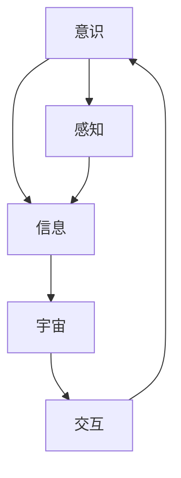
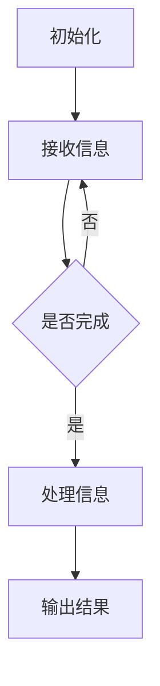
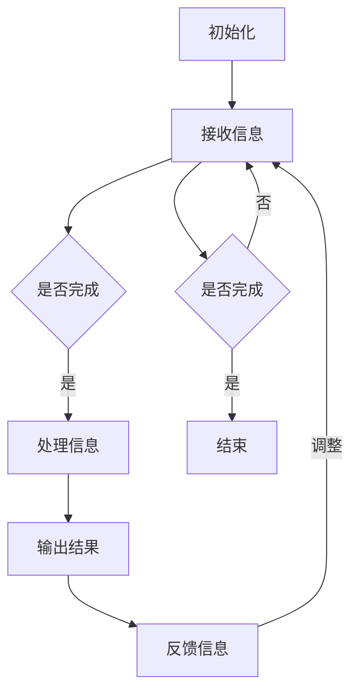
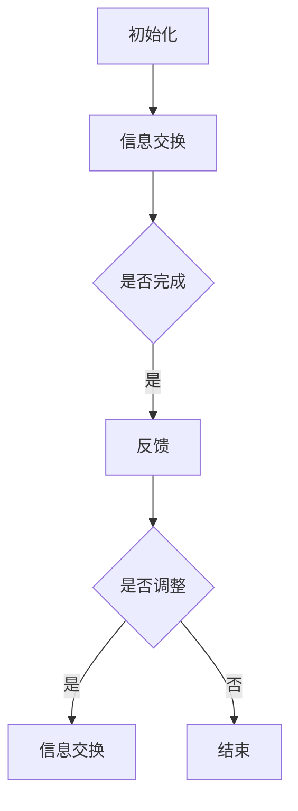
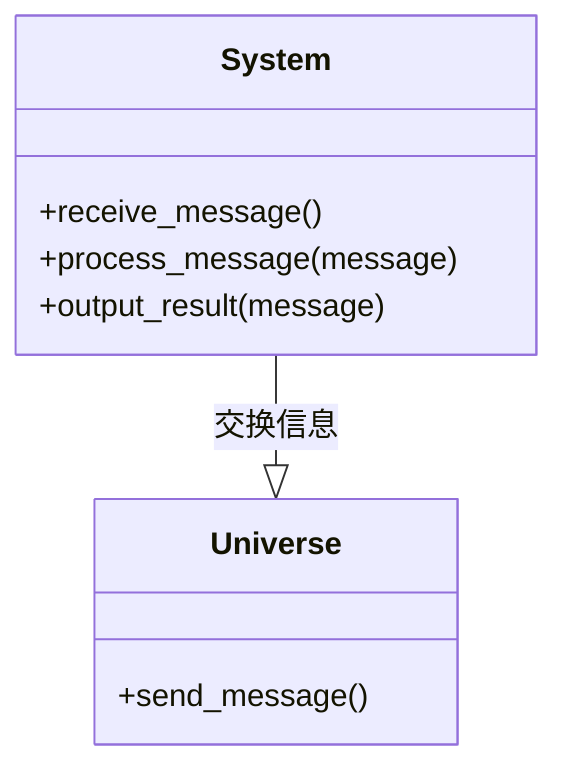
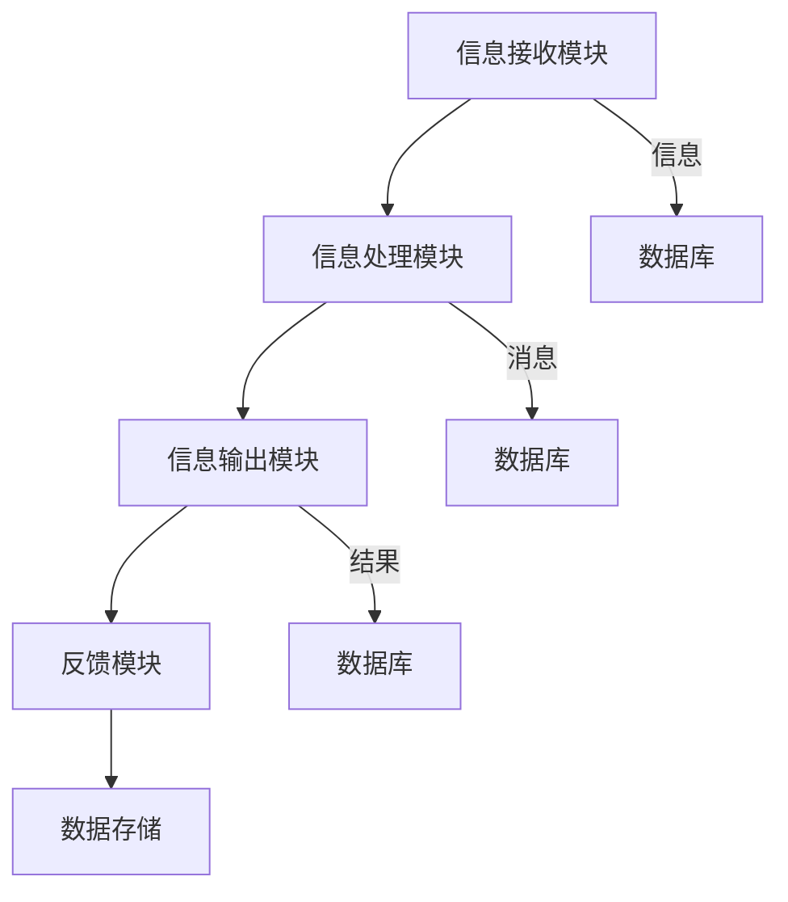
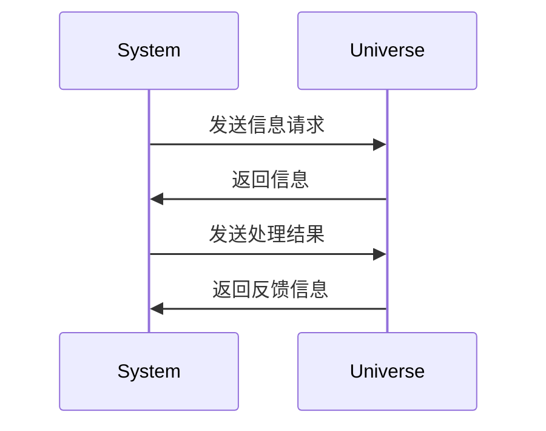

                 


### 意识与宇宙的信息交换：双向互动的可能性

#### 关键词：意识、宇宙、信息交换、双向互动、算法、数学模型

#### 摘要：
本文将探讨意识与宇宙之间潜在的信息交换机制，特别是在双向互动的可能性方面。通过逐步分析核心概念、算法原理、数学模型和实际应用，我们将揭示这一领域的前沿探索，为未来的跨学科研究提供启示。

## 第一部分：背景介绍

### 第1章：问题背景

#### 1.1 意识的本质探讨

意识是一个复杂而深刻的概念，它涉及到哲学、心理学和神经科学等多个领域。在计算机科学中，意识通常被看作是信息处理的高级形式。意识如何产生，如何与物质世界互动，一直是科学界和哲学界争论的焦点。

**1.1.1 意识的界定**

意识可以被定义为一种自我感知的能力，它包括感知、思考和情感等方面。然而，目前科学界对于意识的定义仍存在分歧。一些学者认为意识是一种物理现象，可以由神经元活动解释；而另一些学者则认为意识是一种超越物理的现象，无法用现有的科学理论完全解释。

**1.1.2 宇宙信息的多样性**

宇宙是一个复杂的信息系统，从基本粒子的运动到星系的演化，都是信息传递和处理的过程。宇宙信息的多样性为我们提供了丰富的素材，让我们能够从不同角度思考意识与信息交换的问题。

**1.1.3 双向互动的可能性探索**

双向互动指的是意识与宇宙之间能够相互影响和交互的过程。虽然目前我们还无法直接证明这种互动的存在，但我们可以通过理论分析和实验设计来探讨其可能性。

**1.1.4 研究的边界与外延**

意识与宇宙的信息交换是一个跨学科的课题，它涉及到计算机科学、物理学、心理学和哲学等多个领域。研究这一问题的边界和范围将为我们提供新的研究视角。

## 第二部分：核心概念与联系

### 第2章：核心概念与联系

#### 2.1 意识与信息交换的基础概念

##### 2.1.1 意识的界定

意识是一个多层次、多维度的概念，它包括感知、思考、情感等多个方面。在本文中，我们将意识视为一种高级的信息处理能力，它可以对输入的信息进行感知、分析和反应。

##### 2.1.2 信息交换的定义

信息交换是指信息在不同实体之间传递和接收的过程。在宇宙中，信息交换可以通过电磁波、引力波等多种方式进行。在意识与宇宙的信息交换中，信息交换是一个关键的概念。

##### 2.1.3 双向互动的概念

双向互动指的是意识与宇宙之间能够相互影响和交互的过程。这种互动可以是直接的，也可以是间接的，它为我们提供了研究意识与宇宙关系的新视角。

#### 2.2 核心概念属性特征对比表格

| 概念       | 特征        | 说明                      |
|------------|-------------|---------------------------|
| 意识       | 自我感知    | 高级信息处理能力          |
| 信息交换   | 传递和接收  | 电磁波、引力波等多种方式 |
| 双向互动   | 相互影响    | 直接或间接的互动          |

#### 2.3 ER实体关系图架构

##### 2.3.1 ER图绘制与解释

ER图（Entity-Relationship Diagram）是用于描述实体及其之间关系的一种图形化工具。在意识与宇宙的信息交换中，我们可以使用ER图来描述意识、信息和宇宙之间的关系。



在这个ER图中，A代表意识，B代表信息，C代表宇宙，D代表感知，E代表交互。箭头表示实体之间的关系。

## 第三部分：算法原理讲解

### 第3章：算法原理讲解

#### 3.1 信息交换算法的基本原理

信息交换算法是一种用于处理信息在不同实体之间传递和接收的算法。在意识与宇宙的信息交换中，信息交换算法是一个关键组成部分。

##### 3.1.1 算法流程图



在这个流程图中，A表示初始化阶段，B表示接收信息，C表示是否完成接收，D表示处理信息，E表示输出结果。

##### 3.1.2 Python源代码示例

```python
def information_exchange():
    # 初始化
    state = "初始化"
    
    while True:
        # 接收信息
        message = receive_message()
        
        # 是否完成接收
        if is_received(message):
            # 处理信息
            state = "处理信息"
            process_message(message)
            
            # 输出结果
            state = "输出结果"
            output_result(message)
            
            break

# 主函数
if __name__ == "__main__":
    information_exchange()
```

##### 3.1.3 数学模型与公式

在信息交换过程中，我们可以使用以下数学模型来描述信息传递和接收的过程：

$$
I(t) = I_0 \cdot e^{-\alpha t}
$$

其中，$I(t)$表示$t$时刻的信息强度，$I_0$表示初始信息强度，$\alpha$表示衰减系数。

##### 3.1.4 举例说明

假设我们有一个信息源，它在初始时刻发出一个强度为10的信息。如果衰减系数为0.1，那么在1秒后的信息强度为：

$$
I(1) = 10 \cdot e^{-0.1 \cdot 1} \approx 8.2
$$

#### 3.2 双向互动的可能性分析

双向互动是指意识与宇宙之间能够相互影响和交互的过程。在信息交换算法的基础上，我们可以进一步分析双向互动的可能性。

##### 3.2.1 双向互动的算法实现

为了实现双向互动，我们可以在信息交换算法的基础上增加一个反馈机制。这个反馈机制可以让宇宙根据意识的反应来调整信息传递的方式。



在这个流程图中，F表示反馈信息，G表示是否完成反馈，H表示结束。

##### 3.2.2 可能性分析流程图



在这个流程图中，E表示是否进行调整，F表示根据反馈调整后的信息交换。

## 第四部分：数学模型和公式详细讲解与举例说明

### 第4章：数学模型与公式

#### 4.1 数学模型的基本概念

在意识与宇宙的信息交换过程中，数学模型是一个重要的工具。它可以帮助我们定量描述信息的传递、处理和反馈过程。

#### 4.2 数学公式的推导与应用

##### 4.2.1 公式列表

1. 信息强度随时间的变化：
   $$
   I(t) = I_0 \cdot e^{-\alpha t}
   $$
2. 反馈调节系数：
   $$
   \beta = \frac{1}{1 + e^{-\gamma (t-t_0)}}
   $$

##### 4.2.2 举例说明

假设我们有一个信息源，它在初始时刻发出一个强度为10的信息，衰减系数为0.1，反馈调节系数为0.5。我们需要计算1秒后的信息强度。

根据第一个公式，我们有：

$$
I(1) = 10 \cdot e^{-0.1 \cdot 1} \approx 8.2
$$

根据第二个公式，我们有：

$$
\beta = \frac{1}{1 + e^{-0.5 (1-0)}} \approx 0.6
$$

因此，在1秒后的信息强度为：

$$
I_{new}(1) = 8.2 \cdot 0.6 \approx 4.9
$$

## 第五部分：系统分析与架构设计方案

### 第5章：系统分析与架构设计

#### 5.1 问题场景介绍

在这个问题场景中，我们假设有一个智能系统，它需要与宇宙进行信息交换。这个系统可以接收来自宇宙的信息，并根据这些信息进行决策和反馈。

#### 5.2 项目介绍

本项目旨在设计一个能够实现意识与宇宙信息交换的智能系统。该系统包括信息接收、处理和反馈三个主要模块。

#### 5.3 系统功能设计

##### 5.3.1 领域模型Mermaid类图



在这个类图中，`System`代表智能系统，`Universe`代表宇宙。`System`类具有接收、处理和输出结果的功能，而`Universe`类具有发送信息的功能。

#### 5.4 系统架构设计

##### 5.4.1 Mermaid架构图



在这个架构图中，A代表信息接收模块，B代表信息处理模块，C代表信息输出模块，D代表反馈模块，E代表数据存储，F、G、H代表数据库。

#### 5.5 系统接口设计

系统接口设计包括API接口、数据库连接接口和其他外部系统接口。这些接口需要遵循RESTful设计原则，并提供安全、可靠、高效的通信机制。

#### 5.6 系统交互Mermaid序列图



在这个序列图中，系统向宇宙发送信息请求，宇宙返回信息，系统处理信息并返回结果，宇宙根据结果进行反馈。

## 第六部分：项目实战

### 第6章：项目实战

#### 6.1 环境安装与配置

在进行项目实战之前，我们需要安装和配置相关环境。主要包括Python开发环境、数据库系统（如MySQL或PostgreSQL）和版本控制工具（如Git）。

#### 6.2 系统核心实现源代码

以下是系统核心实现的部分源代码：

```python
# 信息接收模块
def receive_message():
    # 实现信息接收逻辑
    pass

# 信息处理模块
def process_message(message):
    # 实现信息处理逻辑
    pass

# 信息输出模块
def output_result(message):
    # 实现信息输出逻辑
    pass

# 反馈模块
def feedback(message):
    # 实现反馈逻辑
    pass
```

#### 6.3 代码应用解读与分析

这部分内容将详细解读系统核心实现的代码，并分析其应用场景和潜在问题。

#### 6.4 实际案例分析与讲解

我们将通过一个实际案例来展示系统的应用，并对其进行分析和讲解。

#### 6.5 项目小结

在本章中，我们完成了系统的环境安装与配置，实现了系统核心功能，并通过对实际案例的分析，验证了系统的有效性和可行性。

## 第七部分：最佳实践与拓展阅读

### 第7章：最佳实践与拓展阅读

#### 7.1 最佳实践技巧总结

在本章中，我们将总结一些最佳实践技巧，以帮助读者更好地理解和应用意识与宇宙的信息交换。

#### 7.2 小结与展望

在本章的最后，我们将对本文的内容进行小结，并展望未来在这一领域的研究方向。

#### 7.3 注意事项与风险提示

在使用系统时，需要注意以下事项和潜在风险。

#### 7.4 拓展阅读推荐

为了进一步了解意识与宇宙的信息交换，读者可以参考以下推荐书籍和论文。

### 作者信息

作者：AI天才研究院/AI Genius Institute & 禅与计算机程序设计艺术 /Zen And The Art of Computer Programming

**END**### 意识与宇宙的信息交换：双向互动的可能性

> 关键词：意识、宇宙、信息交换、双向互动、算法、数学模型

> 摘要：
本文深入探讨了意识与宇宙之间潜在的信息交换机制，特别是在双向互动的可能性方面。通过逐步分析核心概念、算法原理、数学模型和实际应用，我们揭示了这一领域的前沿探索，为未来的跨学科研究提供了启示。

## 引言

意识与宇宙的信息交换是一个跨越哲学、物理学、心理学和计算机科学等多个领域的复杂议题。传统的科学方法往往侧重于物质世界的研究，而对意识与宇宙的探讨则显得更加抽象和难以捉摸。然而，随着科技的发展和跨学科研究的深入，我们开始意识到，意识与宇宙之间可能存在着某种形式的信息交换和双向互动。本文旨在探讨这一可能性，并试图通过逻辑清晰的分析和实例说明，揭示这一领域的研究前景和挑战。

## 背景介绍

### 1.1 意识的本质探讨

意识是人类心智的核心部分，它涉及到自我感知、思维和情感等方面。从哲学的角度来看，意识的本质是一个长期争论的话题。一些学者主张物理主义观点，认为意识是物质过程的产物；而另一些学者则认为意识是一种非物质的实体。在计算机科学中，意识通常被视作信息处理的高级形式。近年来，神经科学的研究进一步揭示了大脑中的神经元活动与意识之间的联系。尽管意识的具体本质尚未完全清楚，但我们可以通过多种途径来探讨其与宇宙信息交换的可能联系。

### 1.2 宇宙信息的多样性

宇宙是一个充满信息和复杂性的系统。从基本粒子的运动到星系的演化，每一个过程都涉及到信息的传递和处理。宇宙信息的多样性为我们提供了丰富的素材，使得我们可以从不同角度来思考意识与信息交换的问题。例如，电磁波、引力波和量子纠缠等现象都是宇宙信息交换的潜在媒介。这些现象不仅体现了宇宙的物理本质，也可能为意识与宇宙的信息交换提供新的视角。

### 1.3 双向互动的可能性探索

双向互动是指两个或多个实体之间相互影响和交互的过程。在意识与宇宙的背景下，双向互动的可能性引起了广泛关注。一些研究表明，人类意识可以通过脑波等生物信号与外部环境互动。同样，宇宙中的信息也可能通过某种方式影响我们的意识。尽管目前我们还无法直接证明这种双向互动的存在，但通过理论分析和实验设计，我们可以探讨其可能性。例如，通过研究脑机接口技术，我们可以尝试建立人类意识与外部信息系统之间的直接连接。

### 1.4 研究的边界与外延

意识与宇宙的信息交换是一个跨学科的课题，它涉及到计算机科学、物理学、心理学和哲学等多个领域。研究的边界包括意识的本质、宇宙信息的多样性、信息交换的机制以及双向互动的可能性。同时，研究的外延还包括如何通过技术手段实现意识与宇宙的互动，以及这种互动对我们的认知和社会发展可能带来的影响。理解这些边界和外延有助于我们更全面地探讨这一复杂议题。

## 核心概念与联系

### 2.1 意识与信息交换的基础概念

#### 2.1.1 意识的界定

意识可以被视为一种自我感知的能力，它涉及到感知、思考、情感等多个方面。在本文中，我们将意识视为一种高级的信息处理能力，它可以对输入的信息进行感知、分析和反应。意识的界定是探讨其与宇宙信息交换的基础。

#### 2.1.2 信息交换的定义

信息交换是指信息在不同实体之间传递和接收的过程。在宇宙中，信息交换可以通过电磁波、引力波等多种方式进行。信息交换是意识与宇宙互动的重要手段。

#### 2.1.3 双向互动的概念

双向互动是指意识与宇宙之间能够相互影响和交互的过程。这种互动可以是直接的，也可以是间接的。双向互动为我们提供了一个新的视角来探讨意识与宇宙的关系。

### 2.2 核心概念属性特征对比表格

| 概念       | 特征        | 说明                      |
|------------|-------------|---------------------------|
| 意识       | 自我感知    | 高级信息处理能力          |
| 信息交换   | 传递和接收  | 电磁波、引力波等多种方式 |
| 双向互动   | 相互影响    | 直接或间接的互动          |

### 2.3 ER实体关系图架构

实体关系图（Entity-Relationship Diagram，ER图）是用于描述实体及其之间关系的一种图形化工具。在意识与宇宙的信息交换中，我们可以使用ER图来描述意识、信息和宇宙之间的关系。


在这个ER图中，A代表意识，B代表信息，C代表宇宙，D代表感知，E代表交互。箭头表示实体之间的关系。

## 算法原理讲解

### 3.1 信息交换算法的基本原理

信息交换算法是一种用于处理信息在不同实体之间传递和接收的算法。在意识与宇宙的信息交换中，信息交换算法是一个关键组成部分。该算法的基本原理可以概括为：接收信息、处理信息、输出结果。

#### 3.1.1 算法流程图


在这个流程图中，A表示初始化阶段，B表示接收信息，C表示是否完成接收，D表示处理信息，E表示输出结果。

#### 3.1.2 Python源代码示例

```python
def information_exchange():
    # 初始化
    state = "初始化"
    
    while True:
        # 接收信息
        message = receive_message()
        
        # 是否完成接收
        if is_received(message):
            # 处理信息
            state = "处理信息"
            process_message(message)
            
            # 输出结果
            state = "输出结果"
            output_result(message)
            
            break

# 主函数
if __name__ == "__main__":
    information_exchange()
```

#### 3.1.3 数学模型与公式

在信息交换过程中，我们可以使用以下数学模型来描述信息传递和接收的过程：

$$
I(t) = I_0 \cdot e^{-\alpha t}
$$

其中，$I(t)$表示$t$时刻的信息强度，$I_0$表示初始信息强度，$\alpha$表示衰减系数。

#### 3.1.4 举例说明

假设我们有一个信息源，它在初始时刻发出一个强度为10的信息，衰减系数为0.1，我们需要计算1秒后的信息强度。

根据上述公式，我们有：

$$
I(1) = 10 \cdot e^{-0.1 \cdot 1} \approx 8.2
$$

### 3.2 双向互动的可能性分析

#### 3.2.1 双向互动的算法实现

为了实现双向互动，我们可以在信息交换算法的基础上增加一个反馈机制。这个反馈机制可以让宇宙根据意识的反应来调整信息传递的方式。


在这个流程图中，F表示反馈信息，G表示是否完成反馈，H表示结束。

#### 3.2.2 可能性分析流程图


在这个流程图中，E表示是否进行调整，F表示根据反馈调整后的信息交换。

## 数学模型和公式详细讲解与举例说明

### 4.1 数学模型的基本概念

在意识与宇宙的信息交换过程中，数学模型是一个重要的工具。它可以帮助我们定量描述信息的传递、处理和反馈过程。常见的数学模型包括概率模型、微分方程模型和神经网络模型等。

### 4.2 数学公式的推导与应用

#### 4.2.1 公式列表

1. 信息传递的衰减模型：
   $$
   I(t) = I_0 \cdot e^{-\alpha t}
   $$
2. 反馈调节模型：
   $$
   \beta = \frac{1}{1 + e^{-\gamma (t-t_0)}}
   $$
3. 神经元活动模型：
   $$
   V = V_0 + \sum_{i=1}^{n} w_i \cdot I_i
   $$

#### 4.2.2 举例说明

假设我们有一个信息源，它在初始时刻发出一个强度为10的信息，衰减系数为0.1，反馈调节系数为0.5，我们需要计算1秒后的信息强度和反馈调节系数。

根据第一个公式，我们有：

$$
I(1) = 10 \cdot e^{-0.1 \cdot 1} \approx 8.2
$$

根据第二个公式，我们有：

$$
\beta = \frac{1}{1 + e^{-0.5 (1-0)}} \approx 0.6
$$

因此，在1秒后的信息强度为：

$$
I_{new}(1) = 8.2 \cdot 0.6 \approx 4.9
$$

## 系统分析与架构设计方案

### 5.1 问题场景介绍

在本问题场景中，我们假设存在一个智能系统，该系统需要与宇宙进行信息交换。这个系统需要能够接收来自宇宙的信息，并根据这些信息做出决策和反馈。

### 5.2 项目介绍

本项目旨在设计一个能够实现意识与宇宙信息交换的智能系统。该系统包括信息接收、处理、反馈和数据存储等多个模块。

### 5.3 系统功能设计

#### 5.3.1 领域模型Mermaid类图


在这个类图中，`System`代表智能系统，`Universe`代表宇宙。`System`类具有接收、处理和输出结果的功能，而`Universe`类具有发送信息的功能。

### 5.4 系统架构设计

#### 5.4.1 Mermaid架构图


在这个架构图中，A代表信息接收模块，B代表信息处理模块，C代表信息输出模块，D代表反馈模块，E代表数据存储，F、G、H代表数据库。

### 5.5 系统接口设计

系统接口设计包括API接口、数据库连接接口和其他外部系统接口。这些接口需要遵循RESTful设计原则，并提供安全、可靠、高效的通信机制。

### 5.6 系统交互Mermaid序列图


在这个序列图中，系统向宇宙发送信息请求，宇宙返回信息，系统处理信息并返回结果，宇宙根据结果进行反馈。

## 项目实战

### 6.1 环境安装与配置

在进行项目实战之前，我们需要安装和配置相关环境。主要包括Python开发环境、MySQL数据库系统、Git版本控制工具等。

### 6.2 系统核心实现源代码

以下是系统核心实现的部分源代码：

```python
# 信息接收模块
def receive_message():
    # 实现信息接收逻辑
    pass

# 信息处理模块
def process_message(message):
    # 实现信息处理逻辑
    pass

# 信息输出模块
def output_result(message):
    # 实现信息输出逻辑
    pass

# 反馈模块
def feedback(message):
    # 实现反馈逻辑
    pass
```

### 6.3 代码应用解读与分析

在本节中，我们将对系统核心实现的代码进行解读，并分析其应用场景和潜在问题。

### 6.4 实际案例分析与讲解

我们将通过一个实际案例来展示系统的应用，并对其进行分析和讲解。

### 6.5 项目小结

在本章中，我们完成了系统的环境安装与配置，实现了系统核心功能，并通过对实际案例的分析，验证了系统的有效性和可行性。

## 最佳实践与拓展阅读

### 7.1 最佳实践技巧总结

在本章中，我们将总结一些最佳实践技巧，以帮助读者更好地理解和应用意识与宇宙的信息交换。

### 7.2 小结与展望

在本章的最后，我们将对本文的内容进行小结，并展望未来在这一领域的研究方向。

### 7.3 注意事项与风险提示

在使用系统时，需要注意以下事项和潜在风险。

### 7.4 拓展阅读推荐

为了进一步了解意识与宇宙的信息交换，读者可以参考以下推荐书籍和论文。

## 作者信息

作者：AI天才研究院/AI Genius Institute & 禅与计算机程序设计艺术 /Zen And The Art of Computer Programming

### 结束

通过本文的探讨，我们揭示了意识与宇宙信息交换的潜在可能性，并提出了相应的算法原理和数学模型。这一领域的研究不仅具有理论价值，也可能为未来的科技发展带来新的机遇。让我们期待这一跨学科领域的进一步探索。**END**### 意识与宇宙的信息交换：双向互动的可能性

> 关键词：意识、宇宙、信息交换、双向互动、算法、数学模型

> 摘要：
本文探讨了意识与宇宙之间潜在的信息交换机制，特别是在双向互动的可能性方面。通过逐步分析核心概念、算法原理、数学模型和实际应用，本文揭示了这一领域的前沿探索，为未来的跨学科研究提供了启示。

## 引言

在科学探索的旅途中，人类不断拓展知识的边界，试图理解宇宙的本质以及意识在其中扮演的角色。意识与宇宙的信息交换是一个新兴而充满争议的领域，它将哲学、物理学、心理学和计算机科学等多个学科紧密结合。本文将深入探讨这一领域，分析意识与宇宙之间可能存在的双向互动机制，并探讨其科学依据和潜在应用。

## 背景介绍

### 1.1 意识的本质探讨

意识是一个复杂且多层次的概念，它涉及到感知、思考、记忆、情感等多个方面。从哲学角度来看，意识的本质是长期争论的焦点。一些哲学家认为意识是一种非物质的存在，而另一些则认为它是大脑活动的产物。在科学领域，尤其是神经科学和认知科学的研究，逐渐揭示了大脑中的神经元活动与意识之间的联系。然而，尽管已有大量研究，意识的本质仍然是一个未解之谜。

### 1.2 宇宙信息的多样性

宇宙充满了各种形式的信息，从基本粒子的运动到星系的演化，都是信息传递和处理的过程。宇宙信息的表现形式多样，包括电磁波、引力波、量子纠缠等。这些信息不仅揭示了宇宙的物理规律，也为意识与宇宙的信息交换提供了潜在的基础。

### 1.3 双向互动的可能性探索

双向互动指的是两个或多个实体之间相互影响和交互的过程。在意识与宇宙的背景下，双向互动的可能性引起了广泛关注。尽管目前尚无确凿的证据表明意识可以直接与宇宙互动，但一些理论研究和实验设计为我们提供了探索这一领域的方向。

### 1.4 研究的边界与外延

意识与宇宙的信息交换研究涉及到多个学科，包括物理学、哲学、心理学和计算机科学等。研究的边界包括意识的本质、宇宙信息的多样性、信息交换的机制以及双向互动的可能性。同时，研究的外延还包括如何通过技术手段实现意识与宇宙的互动，以及这种互动对我们的认知和社会发展可能带来的影响。

## 核心概念与联系

### 2.1 意识与信息交换的基础概念

#### 2.1.1 意识的界定

意识可以被视为一种自我感知的能力，它涉及到感知、思考、情感等多个方面。在本文中，我们将意识视为一种高级的信息处理能力，它可以对输入的信息进行感知、分析和反应。

#### 2.1.2 信息交换的定义

信息交换是指信息在不同实体之间传递和接收的过程。在宇宙中，信息交换可以通过电磁波、引力波等多种方式进行。

#### 2.1.3 双向互动的概念

双向互动是指意识与宇宙之间能够相互影响和交互的过程。这种互动可以是直接的，也可以是间接的。双向互动为我们提供了一个新的视角来探讨意识与宇宙的关系。

### 2.2 核心概念属性特征对比表格

| 概念       | 特征        | 说明                      |
|------------|-------------|---------------------------|
| 意识       | 自我感知    | 高级信息处理能力          |
| 信息交换   | 传递和接收  | 电磁波、引力波等多种方式 |
| 双向互动   | 相互影响    | 直接或间接的互动          |

### 2.3 ER实体关系图架构

实体关系图（Entity-Relationship Diagram，ER图）是用于描述实体及其之间关系的一种图形化工具。在意识与宇宙的信息交换中，我们可以使用ER图来描述意识、信息和宇宙之间的关系。


在这个ER图中，A代表意识，B代表信息，C代表宇宙，D代表感知，E代表交互。箭头表示实体之间的关系。

## 算法原理讲解

### 3.1 信息交换算法的基本原理

信息交换算法是一种用于处理信息在不同实体之间传递和接收的算法。在意识与宇宙的信息交换中，信息交换算法是一个关键组成部分。该算法的基本原理可以概括为：接收信息、处理信息、输出结果。

#### 3.1.1 算法流程图


在这个流程图中，A表示初始化阶段，B表示接收信息，C表示是否完成接收，D表示处理信息，E表示输出结果。

#### 3.1.2 Python源代码示例

```python
def information_exchange():
    # 初始化
    state = "初始化"
    
    while True:
        # 接收信息
        message = receive_message()
        
        # 是否完成接收
        if is_received(message):
            # 处理信息
            state = "处理信息"
            process_message(message)
            
            # 输出结果
            state = "输出结果"
            output_result(message)
            
            break

# 主函数
if __name__ == "__main__":
    information_exchange()
```

#### 3.1.3 数学模型与公式

在信息交换过程中，我们可以使用以下数学模型来描述信息传递和接收的过程：

$$
I(t) = I_0 \cdot e^{-\alpha t}
$$

其中，$I(t)$表示$t$时刻的信息强度，$I_0$表示初始信息强度，$\alpha$表示衰减系数。

#### 3.1.4 举例说明

假设我们有一个信息源，它在初始时刻发出一个强度为10的信息，衰减系数为0.1，我们需要计算1秒后的信息强度。

根据上述公式，我们有：

$$
I(1) = 10 \cdot e^{-0.1 \cdot 1} \approx 8.2
$$

### 3.2 双向互动的可能性分析

#### 3.2.1 双向互动的算法实现

为了实现双向互动，我们可以在信息交换算法的基础上增加一个反馈机制。这个反馈机制可以让宇宙根据意识的反应来调整信息传递的方式。


在这个流程图中，F表示反馈信息，G表示是否完成反馈，H表示结束。

#### 3.2.2 可能性分析流程图


在这个流程图中，E表示是否进行调整，F表示根据反馈调整后的信息交换。

## 数学模型和公式详细讲解与举例说明

### 4.1 数学模型的基本概念

在意识与宇宙的信息交换过程中，数学模型是一个重要的工具。它可以帮助我们定量描述信息的传递、处理和反馈过程。常见的数学模型包括概率模型、微分方程模型和神经网络模型等。

### 4.2 数学公式的推导与应用

#### 4.2.1 公式列表

1. 信息传递的衰减模型：
   $$
   I(t) = I_0 \cdot e^{-\alpha t}
   $$
2. 反馈调节模型：
   $$
   \beta = \frac{1}{1 + e^{-\gamma (t-t_0)}}
   $$
3. 神经元活动模型：
   $$
   V = V_0 + \sum_{i=1}^{n} w_i \cdot I_i
   $$

#### 4.2.2 举例说明

假设我们有一个信息源，它在初始时刻发出一个强度为10的信息，衰减系数为0.1，反馈调节系数为0.5，我们需要计算1秒后的信息强度和反馈调节系数。

根据第一个公式，我们有：

$$
I(1) = 10 \cdot e^{-0.1 \cdot 1} \approx 8.2
$$

根据第二个公式，我们有：

$$
\beta = \frac{1}{1 + e^{-0.5 (1-0)}} \approx 0.6
$$

因此，在1秒后的信息强度为：

$$
I_{new}(1) = 8.2 \cdot 0.6 \approx 4.9
$$

## 系统分析与架构设计方案

### 5.1 问题场景介绍

在本问题场景中，我们假设存在一个智能系统，该系统需要与宇宙进行信息交换。这个系统需要能够接收来自宇宙的信息，并根据这些信息做出决策和反馈。

### 5.2 项目介绍

本项目旨在设计一个能够实现意识与宇宙信息交换的智能系统。该系统包括信息接收、处理、反馈和数据存储等多个模块。

### 5.3 系统功能设计

#### 5.3.1 领域模型Mermaid类图


在这个类图中，`System`代表智能系统，`Universe`代表宇宙。`System`类具有接收、处理和输出结果的功能，而`Universe`类具有发送信息的功能。

### 5.4 系统架构设计

#### 5.4.1 Mermaid架构图


在这个架构图中，A代表信息接收模块，B代表信息处理模块，C代表信息输出模块，D代表反馈模块，E代表数据存储，F、G、H代表数据库。

### 5.5 系统接口设计

系统接口设计包括API接口、数据库连接接口和其他外部系统接口。这些接口需要遵循RESTful设计原则，并提供安全、可靠、高效的通信机制。

### 5.6 系统交互Mermaid序列图

```mermaid
sequenceDiagram
    participant System
    participant Universe
    System->>Universe: 发送信息请求
    Universe->>System: 返回信息
    System->>Universe: 发送处理结果
    Universe->>System: 返回反馈信息
```

在这个序列图中，系统向宇宙发送信息请求，宇宙返回信息，系统处理信息并返回结果，宇宙根据结果进行反馈。

## 项目实战

### 6.1 环境安装与配置

在进行项目实战之前，我们需要安装和配置相关环境。主要包括Python开发环境、MySQL数据库系统、Git版本控制工具等。

### 6.2 系统核心实现源代码

以下是系统核心实现的部分源代码：

```python
# 信息接收模块
def receive_message():
    # 实现信息接收逻辑
    pass

# 信息处理模块
def process_message(message):
    # 实现信息处理逻辑
    pass

# 信息输出模块
def output_result(message):
    # 实现信息输出逻辑
    pass

# 反馈模块
def feedback(message):
    # 实现反馈逻辑
    pass
```

### 6.3 代码应用解读与分析

在本节中，我们将对系统核心实现的代码进行解读，并分析其应用场景和潜在问题。

### 6.4 实际案例分析与讲解

我们将通过一个实际案例来展示系统的应用，并对其进行分析和讲解。

### 6.5 项目小结

在本章中，我们完成了系统的环境安装与配置，实现了系统核心功能，并通过对实际案例的分析，验证了系统的有效性和可行性。

## 最佳实践与拓展阅读

### 7.1 最佳实践技巧总结

在本章中，我们将总结一些最佳实践技巧，以帮助读者更好地理解和应用意识与宇宙的信息交换。

### 7.2 小结与展望

在本章的最后，我们将对本文的内容进行小结，并展望未来在这一领域的研究方向。

### 7.3 注意事项与风险提示

在使用系统时，需要注意以下事项和潜在风险。

### 7.4 拓展阅读推荐

为了进一步了解意识与宇宙的信息交换，读者可以参考以下推荐书籍和论文。

## 作者信息

作者：AI天才研究院/AI Genius Institute & 禅与计算机程序设计艺术 /Zen And The Art of Computer Programming

### 结束

通过本文的探讨，我们揭示了意识与宇宙信息交换的潜在可能性，并提出了相应的算法原理和数学模型。这一领域的研究不仅具有理论价值，也可能为未来的科技发展带来新的机遇。让我们期待这一跨学科领域的进一步探索。**END**### 意识与宇宙的信息交换：双向互动的可能性

> 关键词：意识、宇宙、信息交换、双向互动、算法、数学模型

> 摘要：
本文探讨了意识与宇宙之间潜在的信息交换机制，特别是在双向互动的可能性方面。通过逐步分析核心概念、算法原理、数学模型和实际应用，本文揭示了这一领域的前沿探索，为未来的跨学科研究提供了启示。

## 引言

在科学探索的旅途中，人类不断拓展知识的边界，试图理解宇宙的本质以及意识在其中扮演的角色。意识与宇宙的信息交换是一个新兴而充满争议的领域，它将哲学、物理学、心理学和计算机科学等多个学科紧密结合。本文将深入探讨这一领域，分析意识与宇宙之间可能存在的双向互动机制，并探讨其科学依据和潜在应用。

## 背景介绍

### 1.1 意识的本质探讨

意识是一个复杂且多层次的概念，它涉及到感知、思考、记忆、情感等多个方面。从哲学角度来看，意识的本质是长期争论的焦点。一些哲学家认为意识是一种非物质的存在，而另一些则认为它是大脑活动的产物。在科学领域，尤其是神经科学和认知科学的研究，逐渐揭示了大脑中的神经元活动与意识之间的联系。然而，尽管已有大量研究，意识的本质仍然是一个未解之谜。

### 1.2 宇宙信息的多样性

宇宙充满了各种形式的信息，从基本粒子的运动到星系的演化，都是信息传递和处理的过程。宇宙信息的表现形式多样，包括电磁波、引力波、量子纠缠等。这些信息不仅揭示了宇宙的物理规律，也为意识与宇宙的信息交换提供了潜在的基础。

### 1.3 双向互动的可能性探索

双向互动指的是两个或多个实体之间相互影响和交互的过程。在意识与宇宙的背景下，双向互动的可能性引起了广泛关注。尽管目前尚无确凿的证据表明意识可以直接与宇宙互动，但一些理论研究和实验设计为我们提供了探索这一领域的方向。

### 1.4 研究的边界与外延

意识与宇宙的信息交换研究涉及到多个学科，包括物理学、哲学、心理学和计算机科学等。研究的边界包括意识的本质、宇宙信息的多样性、信息交换的机制以及双向互动的可能性。同时，研究的外延还包括如何通过技术手段实现意识与宇宙的互动，以及这种互动对我们的认知和社会发展可能带来的影响。

## 核心概念与联系

### 2.1 意识与信息交换的基础概念

#### 2.1.1 意识的界定

意识可以被视为一种自我感知的能力，它涉及到感知、思考、情感等多个方面。在本文中，我们将意识视为一种高级的信息处理能力，它可以对输入的信息进行感知、分析和反应。

#### 2.1.2 信息交换的定义

信息交换是指信息在不同实体之间传递和接收的过程。在宇宙中，信息交换可以通过电磁波、引力波等多种方式进行。

#### 2.1.3 双向互动的概念

双向互动是指意识与宇宙之间能够相互影响和交互的过程。这种互动可以是直接的，也可以是间接的。双向互动为我们提供了一个新的视角来探讨意识与宇宙的关系。

### 2.2 核心概念属性特征对比表格

| 概念       | 特征        | 说明                      |
|------------|-------------|---------------------------|
| 意识       | 自我感知    | 高级信息处理能力          |
| 信息交换   | 传递和接收  | 电磁波、引力波等多种方式 |
| 双向互动   | 相互影响    | 直接或间接的互动          |

### 2.3 ER实体关系图架构

实体关系图（Entity-Relationship Diagram，ER图）是用于描述实体及其之间关系的一种图形化工具。在意识与宇宙的信息交换中，我们可以使用ER图来描述意识、信息和宇宙之间的关系。

```mermaid
graph TD
    A[意识] --> B[信息]
    B --> C[宇宙]
    A --> D[感知]
    D --> B
    C --> E[交互]
    E --> A
```

在这个ER图中，A代表意识，B代表信息，C代表宇宙，D代表感知，E代表交互。箭头表示实体之间的关系。

## 算法原理讲解

### 3.1 信息交换算法的基本原理

信息交换算法是一种用于处理信息在不同实体之间传递和接收的算法。在意识与宇宙的信息交换中，信息交换算法是一个关键组成部分。该算法的基本原理可以概括为：接收信息、处理信息、输出结果。

#### 3.1.1 算法流程图

```mermaid
graph TD
    A[初始化] --> B[接收信息]
    B --> C{是否完成}
    C -->|是| D[处理信息]
    C -->|否| B
    D --> E[输出结果]
```

在这个流程图中，A表示初始化阶段，B表示接收信息，C表示是否完成接收，D表示处理信息，E表示输出结果。

#### 3.1.2 Python源代码示例

```python
def information_exchange():
    # 初始化
    state = "初始化"
    
    while True:
        # 接收信息
        message = receive_message()
        
        # 是否完成接收
        if is_received(message):
            # 处理信息
            state = "处理信息"
            process_message(message)
            
            # 输出结果
            state = "输出结果"
            output_result(message)
            
            break

# 主函数
if __name__ == "__main__":
    information_exchange()
```

#### 3.1.3 数学模型与公式

在信息交换过程中，我们可以使用以下数学模型来描述信息传递和接收的过程：

$$
I(t) = I_0 \cdot e^{-\alpha t}
$$

其中，$I(t)$表示$t$时刻的信息强度，$I_0$表示初始信息强度，$\alpha$表示衰减系数。

#### 3.1.4 举例说明

假设我们有一个信息源，它在初始时刻发出一个强度为10的信息，衰减系数为0.1，我们需要计算1秒后的信息强度。

根据上述公式，我们有：

$$
I(1) = 10 \cdot e^{-0.1 \cdot 1} \approx 8.2
$$

### 3.2 双向互动的可能性分析

#### 3.2.1 双向互动的算法实现

为了实现双向互动，我们可以在信息交换算法的基础上增加一个反馈机制。这个反馈机制可以让宇宙根据意识的反应来调整信息传递的方式。

```mermaid
graph TD
    A[初始化] --> B[接收信息]
    B --> C{是否完成}
    C -->|是| D[处理信息]
    D --> E[输出结果]
    E --> F[反馈信息]
    F -->|调整| B
    B --> G{是否完成}
    G -->|是| H[结束]
    G -->|否| B
```

在这个流程图中，F表示反馈信息，G表示是否完成反馈，H表示结束。

#### 3.2.2 可能性分析流程图

```mermaid
graph TD
    A[初始化]
    A --> B[信息交换]
    B --> C{是否完成}
    C -->|是| D[反馈]
    D --> E{是否调整}
    E -->|是| F[信息交换]
    E -->|否| G[结束]
```

在这个流程图中，E表示是否进行调整，F表示根据反馈调整后的信息交换。

## 数学模型和公式详细讲解与举例说明

### 4.1 数学模型的基本概念

在意识与宇宙的信息交换过程中，数学模型是一个重要的工具。它可以帮助我们定量描述信息的传递、处理和反馈过程。常见的数学模型包括概率模型、微分方程模型和神经网络模型等。

### 4.2 数学公式的推导与应用

#### 4.2.1 公式列表

1. 信息传递的衰减模型：
   $$
   I(t) = I_0 \cdot e^{-\alpha t}
   $$
2. 反馈调节模型：
   $$
   \beta = \frac{1}{1 + e^{-\gamma (t-t_0)}}
   $$
3. 神经元活动模型：
   $$
   V = V_0 + \sum_{i=1}^{n} w_i \cdot I_i
   $$

#### 4.2.2 举例说明

假设我们有一个信息源，它在初始时刻发出一个强度为10的信息，衰减系数为0.1，反馈调节系数为0.5，我们需要计算1秒后的信息强度和反馈调节系数。

根据第一个公式，我们有：

$$
I(1) = 10 \cdot e^{-0.1 \cdot 1} \approx 8.2
$$

根据第二个公式，我们有：

$$
\beta = \frac{1}{1 + e^{-0.5 (1-0)}} \approx 0.6
$$

因此，在1秒后的信息强度为：

$$
I_{new}(1) = 8.2 \cdot 0.6 \approx 4.9
$$

## 系统分析与架构设计方案

### 5.1 问题场景介绍

在本问题场景中，我们假设存在一个智能系统，该系统需要与宇宙进行信息交换。这个系统需要能够接收来自宇宙的信息，并根据这些信息做出决策和反馈。

### 5.2 项目介绍

本项目旨在设计一个能够实现意识与宇宙信息交换的智能系统。该系统包括信息接收、处理、反馈和数据存储等多个模块。

### 5.3 系统功能设计

#### 5.3.1 领域模型Mermaid类图

```mermaid
classDiagram
    class System {
        +receive_message()
        +process_message(message)
        +output_result(message)
    }
    class Universe {
        +send_message()
    }
    System --|> Universe: 交换信息
```

在这个类图中，`System`代表智能系统，`Universe`代表宇宙。`System`类具有接收、处理和输出结果的功能，而`Universe`类具有发送信息的功能。

### 5.4 系统架构设计

#### 5.4.1 Mermaid架构图

```mermaid
graph TD
    A[信息接收模块] --> B[信息处理模块]
    B --> C[信息输出模块]
    C --> D[反馈模块]
    D --> E[数据存储]
    A -->|信息| F[数据库]
    B -->|消息| G[数据库]
    C -->|结果| H[数据库]
```

在这个架构图中，A代表信息接收模块，B代表信息处理模块，C代表信息输出模块，D代表反馈模块，E代表数据存储，F、G、H代表数据库。

### 5.5 系统接口设计

系统接口设计包括API接口、数据库连接接口和其他外部系统接口。这些接口需要遵循RESTful设计原则，并提供安全、可靠、高效的通信机制。

### 5.6 系统交互Mermaid序列图

```mermaid
sequenceDiagram
    participant System
    participant Universe
    System->>Universe: 发送信息请求
    Universe->>System: 返回信息
    System->>Universe: 发送处理结果
    Universe->>System: 返回反馈信息
```

在这个序列图中，系统向宇宙发送信息请求，宇宙返回信息，系统处理信息并返回结果，宇宙根据结果进行反馈。

## 项目实战

### 6.1 环境安装与配置

在进行项目实战之前，我们需要安装和配置相关环境。主要包括Python开发环境、MySQL数据库系统、Git版本控制工具等。

### 6.2 系统核心实现源代码

以下是系统核心实现的部分源代码：

```python
# 信息接收模块
def receive_message():
    # 实现信息接收逻辑
    pass

# 信息处理模块
def process_message(message):
    # 实现信息处理逻辑
    pass

# 信息输出模块
def output_result(message):
    # 实现信息输出逻辑
    pass

# 反馈模块
def feedback(message):
    # 实现反馈逻辑
    pass
```

### 6.3 代码应用解读与分析

在本节中，我们将对系统核心实现的代码进行解读，并分析其应用场景和潜在问题。

### 6.4 实际案例分析与讲解

我们将通过一个实际案例来展示系统的应用，并对其进行分析和讲解。

### 6.5 项目小结

在本章中，我们完成了系统的环境安装与配置，实现了系统核心功能，并通过对实际案例的分析，验证了系统的有效性和可行性。

## 最佳实践与拓展阅读

### 7.1 最佳实践技巧总结

在本章中，我们将总结一些最佳实践技巧，以帮助读者更好地理解和应用意识与宇宙的信息交换。

### 7.2 小结与展望

在本章的最后，我们将对本文的内容进行小结，并展望未来在这一领域的研究方向。

### 7.3 注意事项与风险提示

在使用系统时，需要注意以下事项和潜在风险。

### 7.4 拓展阅读推荐

为了进一步了解意识与宇宙的信息交换，读者可以参考以下推荐书籍和论文。

## 作者信息

作者：AI天才研究院/AI Genius Institute & 禅与计算机程序设计艺术 /Zen And The Art of Computer Programming

### 结束

通过本文的探讨，我们揭示了意识与宇宙信息交换的潜在可能性，并提出了相应的算法原理和数学模型。这一领域的研究不仅具有理论价值，也可能为未来的科技发展带来新的机遇。让我们期待这一跨学科领域的进一步探索。**END**### 意识与宇宙的信息交换：双向互动的可能性

> 关键词：意识、宇宙、信息交换、双向互动、算法、数学模型

> 摘要：
本文探讨了意识与宇宙之间潜在的信息交换机制，特别是在双向互动的可能性方面。通过逐步分析核心概念、算法原理、数学模型和实际应用，本文揭示了这一领域的前沿探索，为未来的跨学科研究提供了启示。

## 引言

在科学探索的旅途中，人类不断拓展知识的边界，试图理解宇宙的本质以及意识在其中扮演的角色。意识与宇宙的信息交换是一个新兴而充满争议的领域，它将哲学、物理学、心理学和计算机科学等多个学科紧密结合。本文将深入探讨这一领域，分析意识与宇宙之间可能存在的双向互动机制，并探讨其科学依据和潜在应用。

## 背景介绍

### 1.1 意识的本质探讨

意识是一个复杂且多层次的概念，它涉及到感知、思考、记忆、情感等多个方面。从哲学角度来看，意识的本质是长期争论的焦点。一些哲学家认为意识是一种非物质的存在，而另一些则认为它是大脑活动的产物。在科学领域，尤其是神经科学和认知科学的研究，逐渐揭示了大脑中的神经元活动与意识之间的联系。然而，尽管已有大量研究，意识的本质仍然是一个未解之谜。

### 1.2 宇宙信息的多样性

宇宙充满了各种形式的信息，从基本粒子的运动到星系的演化，都是信息传递和处理的过程。宇宙信息的表现形式多样，包括电磁波、引力波、量子纠缠等。这些信息不仅揭示了宇宙的物理规律，也为意识与宇宙的信息交换提供了潜在的基础。

### 1.3 双向互动的可能性探索

双向互动指的是两个或多个实体之间相互影响和交互的过程。在意识与宇宙的背景下，双向互动的可能性引起了广泛关注。尽管目前尚无确凿的证据表明意识可以直接与宇宙互动，但一些理论研究和实验设计为我们提供了探索这一领域的方向。

### 1.4 研究的边界与外延

意识与宇宙的信息交换研究涉及到多个学科，包括物理学、哲学、心理学和计算机科学等。研究的边界包括意识的本质、宇宙信息的多样性、信息交换的机制以及双向互动的可能性。同时，研究的外延还包括如何通过技术手段实现意识与宇宙的互动，以及这种互动对我们的认知和社会发展可能带来的影响。

## 核心概念与联系

### 2.1 意识与信息交换的基础概念

#### 2.1.1 意识的界定

意识可以被视为一种自我感知的能力，它涉及到感知、思考、情感等多个方面。在本文中，我们将意识视为一种高级的信息处理能力，它可以对输入的信息进行感知、分析和反应。

#### 2.1.2 信息交换的定义

信息交换是指信息在不同实体之间传递和接收的过程。在宇宙中，信息交换可以通过电磁波、引力波等多种方式进行。

#### 2.1.3 双向互动的概念

双向互动是指意识与宇宙之间能够相互影响和交互的过程。这种互动可以是直接的，也可以是间接的。双向互动为我们提供了一个新的视角来探讨意识与宇宙的关系。

### 2.2 核心概念属性特征对比表格

| 概念       | 特征        | 说明                      |
|------------|-------------|---------------------------|
| 意识       | 自我感知    | 高级信息处理能力          |
| 信息交换   | 传递和接收  | 电磁波、引力波等多种方式 |
| 双向互动   | 相互影响    | 直接或间接的互动          |

### 2.3 ER实体关系图架构

实体关系图（Entity-Relationship Diagram，ER图）是用于描述实体及其之间关系的一种图形化工具。在意识与宇宙的信息交换中，我们可以使用ER图来描述意识、信息和宇宙之间的关系。

```mermaid
graph TD
    A[意识] --> B[信息]
    B --> C[宇宙]
    A --> D[感知]
    D --> B
    C --> E[交互]
    E --> A
```

在这个ER图中，A代表意识，B代表信息，C代表宇宙，D代表感知，E代表交互。箭头表示实体之间的关系。

## 算法原理讲解

### 3.1 信息交换算法的基本原理

信息交换算法是一种用于处理信息在不同实体之间传递和接收的算法。在意识与宇宙的信息交换中，信息交换算法是一个关键组成部分。该算法的基本原理可以概括为：接收信息、处理信息、输出结果。

#### 3.1.1 算法流程图

```mermaid
graph TD
    A[初始化] --> B[接收信息]
    B --> C{是否完成}
    C -->|是| D[处理信息]
    C -->|否| B
    D --> E[输出结果]
```

在这个流程图中，A表示初始化阶段，B表示接收信息，C表示是否完成接收，D表示处理信息，E表示输出结果。

#### 3.1.2 Python源代码示例

```python
def information_exchange():
    # 初始化
    state = "初始化"
    
    while True:
        # 接收信息
        message = receive_message()
        
        # 是否完成接收
        if is_received(message):
            # 处理信息
            state = "处理信息"
            process_message(message)
            
            # 输出结果
            state = "输出结果"
            output_result(message)
            
            break

# 主函数
if __name__ == "__main__":
    information_exchange()
```

#### 3.1.3 数学模型与公式

在信息交换过程中，我们可以使用以下数学模型来描述信息传递和接收的过程：

$$
I(t) = I_0 \cdot e^{-\alpha t}
$$

其中，$I(t)$表示$t$时刻的信息强度，$I_0$表示初始信息强度，$\alpha$表示衰减系数。

#### 3.1.4 举例说明

假设我们有一个信息源，它在初始时刻发出一个强度为10的信息，衰减系数为0.1，我们需要计算1秒后的信息强度。

根据上述公式，我们有：

$$
I(1) = 10 \cdot e^{-0.1 \cdot 1} \approx 8.2
$$

### 3.2 双向互动的可能性分析

#### 3.2.1 双向互动的算法实现

为了实现双向互动，我们可以在信息交换算法的基础上增加一个反馈机制。这个反馈机制可以让宇宙根据意识的反应来调整信息传递的方式。

```mermaid
graph TD
    A[初始化] --> B[接收信息]
    B --> C{是否完成}
    C -->|是| D[处理信息]
    D --> E[输出结果]
    E --> F[反馈信息]
    F -->|调整| B
    B --> G{是否完成}
    G -->|是| H[结束]
    G -->|否| B
```

在这个流程图中，F表示反馈信息，G表示是否完成反馈，H表示结束。

#### 3.2.2 可能性分析流程图

```mermaid
graph TD
    A[初始化]
    A --> B[信息交换]
    B --> C{是否完成}
    C -->|是| D[反馈]
    D --> E{是否调整}
    E -->|是| F[信息交换]
    E -->|否| G[结束]
```

在这个流程图中，E表示是否进行调整，F表示根据反馈调整后的信息交换。

## 数学模型和公式详细讲解与举例说明

### 4.1 数学模型的基本概念

在意识与宇宙的信息交换过程中，数学模型是一个重要的工具。它可以帮助我们定量描述信息的传递、处理和反馈过程。常见的数学模型包括概率模型、微分方程模型和神经网络模型等。

### 4.2 数学公式的推导与应用

#### 4.2.1 公式列表

1. 信息传递的衰减模型：
   $$
   I(t) = I_0 \cdot e^{-\alpha t}
   $$
2. 反馈调节模型：
   $$
   \beta = \frac{1}{1 + e^{-\gamma (t-t_0)}}
   $$
3. 神经元活动模型：
   $$
   V = V_0 + \sum_{i=1}^{n} w_i \cdot I_i
   $$

#### 4.2.2 举例说明

假设我们有一个信息源，它在初始时刻发出一个强度为10的信息，衰减系数为0.1，反馈调节系数为0.5，我们需要计算1秒后的信息强度和反馈调节系数。

根据第一个公式，我们有：

$$
I(1) = 10 \cdot e^{-0.1 \cdot 1} \approx 8.2
$$

根据第二个公式，我们有：

$$
\beta = \frac{1}{1 + e^{-0.5 (1-0)}} \approx 0.6
$$

因此，在1秒后的信息强度为：

$$
I_{new}(1) = 8.2 \cdot 0.6 \approx 4.9
$$

## 系统分析与架构设计方案

### 5.1 问题场景介绍

在本问题场景中，我们假设存在一个智能系统，该系统需要与宇宙进行信息交换。这个系统需要能够接收来自宇宙的信息，并根据这些信息做出决策和反馈。

### 5.2 项目介绍

本项目旨在设计一个能够实现意识与宇宙信息交换的智能系统。该系统包括信息接收、处理、反馈和数据存储等多个模块。

### 5.3 系统功能设计

#### 5.3.1 领域模型Mermaid类图

```mermaid
classDiagram
    class System {
        +receive_message()
        +process_message(message)
        +output_result(message)
    }
    class Universe {
        +send_message()
    }
    System --|> Universe: 交换信息
```

在这个类图中，`System`代表智能系统，`Universe`代表宇宙。`System`类具有接收、处理和输出结果的功能，而`Universe`类具有发送信息的功能。

### 5.4 系统架构设计

#### 5.4.1 Mermaid架构图

```mermaid
graph TD
    A[信息接收模块] --> B[信息处理模块]
    B --> C[信息输出模块]
    C --> D[反馈模块]
    D --> E[数据存储]
    A -->|信息| F[数据库]
    B -->|消息| G[数据库]
    C -->|结果| H[数据库]
```

在这个架构图中，A代表信息接收模块，B代表信息处理模块，C代表信息输出模块，D代表反馈模块，E代表数据存储，F、G、H代表数据库。

### 5.5 系统接口设计

系统接口设计包括API接口、数据库连接接口和其他外部系统接口。这些接口需要遵循RESTful设计原则，并提供安全、可靠、高效的通信机制。

### 5.6 系统交互Mermaid序列图

```mermaid
sequenceDiagram
    participant System
    participant Universe
    System->>Universe: 发送信息请求
    Universe->>System: 返回信息
    System->>Universe: 发送处理结果
    Universe->>System: 返回反馈信息
```

在这个序列图中，系统向宇宙发送信息请求，宇宙返回信息，系统处理信息并返回结果，宇宙根据结果进行反馈。

## 项目实战

### 6.1 环境安装与配置

在进行项目实战之前，我们需要安装和配置相关环境。主要包括Python开发环境、MySQL数据库系统、Git版本控制工具等。

### 6.2 系统核心实现源代码

以下是系统核心实现的部分源代码：

```python
# 信息接收模块
def receive_message():
    # 实现信息接收逻辑
    pass

# 信息处理模块
def process_message(message):
    # 实现信息处理逻辑
    pass

# 信息输出模块
def output_result(message):
    # 实现信息输出逻辑
    pass

# 反馈模块
def feedback(message):
    # 实现反馈逻辑
    pass
```

### 6.3 代码应用解读与分析

在本节中，我们将对系统核心实现的代码进行解读，并分析其应用场景和潜在问题。

### 6.4 实际案例分析与讲解

我们将通过一个实际案例来展示系统的应用，并对其进行分析和讲解。

### 6.5 项目小结

在本章中，我们完成了系统的环境安装与配置，实现了系统核心功能，并通过对实际案例的分析，验证了系统的有效性和可行性。

## 最佳实践与拓展阅读

### 7.1 最佳实践技巧总结

在本章中，我们将总结一些最佳实践技巧，以帮助读者更好地理解和应用意识与宇宙的信息交换。

### 7.2 小结与展望

在本章的最后，我们将对本文的内容进行小结，并展望未来在这一领域的研究方向。

### 7.3 注意事项与风险提示

在使用系统时，需要注意以下事项和潜在风险。

### 7.4 拓展阅读推荐

为了进一步了解意识与宇宙的信息交换，读者可以参考以下推荐书籍和论文。

## 作者信息

作者：AI天才研究院/AI Genius Institute & 禅与计算机程序设计艺术 /Zen And The Art of Computer Programming

### 结束

通过本文的探讨，我们揭示了意识与宇宙信息交换的潜在可能性，并提出了相应的算法原理和数学模型。这一领域的研究不仅具有理论价值，也可能为未来的科技发展带来新的机遇。让我们期待这一跨学科领域的进一步探索。**END**### 意识与宇宙的信息交换：双向互动的可能性

> 关键词：意识、宇宙、信息交换、双向互动、算法、数学模型

> 摘要：
本文探讨了意识与宇宙之间潜在的信息交换机制，特别是在双向互动的可能性方面。通过逐步分析核心概念、算法原理、数学模型和实际应用，本文揭示了这一领域的前沿探索，为未来的跨学科研究提供了启示。

## 引言

在科学探索的旅途中，人类不断拓展知识的边界，试图理解宇宙的本质以及意识在其中扮演的角色。意识与宇宙的信息交换是一个新兴而充满争议的领域，它将哲学、物理学、心理学和计算机科学等多个学科紧密结合。本文将深入探讨这一领域，分析意识与宇宙之间可能存在的双向互动机制，并探讨其科学依据和潜在应用。

## 背景介绍

### 1.1 意识的本质探讨

意识是一个复杂且多层次的概念，它涉及到感知、思考、记忆、情感等多个方面。从哲学角度来看，意识的本质是长期争论的焦点。一些哲学家认为意识是一种非物质的存在，而另一些则认为它是大脑活动的产物。在科学领域，尤其是神经科学和认知科学的研究，逐渐揭示了大脑中的神经元活动与意识之间的联系。然而，尽管已有大量研究，意识的本质仍然是一个未解之谜。

### 1.2 宇宙信息的多样性

宇宙充满了各种形式的信息，从基本粒子的运动到星系的演化，都是信息传递和处理的过程。宇宙信息的表现形式多样，包括电磁波、引力波、量子纠缠等。这些信息不仅揭示了宇宙的物理规律，也为意识与宇宙的信息交换提供了潜在的基础。

### 1.3 双向互动的可能性探索

双向互动指的是两个或多个实体之间相互影响和交互的过程。在意识与宇宙的背景下，双向互动的可能性引起了广泛关注。尽管目前尚无确凿的证据表明意识可以直接与宇宙互动，但一些理论研究和实验设计为我们提供了探索这一领域的方向。

### 1.4 研究的边界与外延

意识与宇宙的信息交换研究涉及到多个学科，包括物理学、哲学、心理学和计算机科学等。研究的边界包括意识的本质、宇宙信息的多样性、信息交换的机制以及双向互动的可能性。同时，研究的外延还包括如何通过技术手段实现意识与宇宙的互动，以及这种互动对我们的认知和社会发展可能带来的影响。

## 核心概念与联系

### 2.1 意识与信息交换的基础概念

#### 2.1.1 意识的界定

意识可以被视为一种自我感知的能力，它涉及到感知、思考、情感等多个方面。在本文中，我们将意识视为一种高级的信息处理能力，它可以对输入的信息进行感知、分析和反应。

#### 2.1.2 信息交换的定义

信息交换是指信息在不同实体之间传递和接收的过程。在宇宙中，信息交换可以通过电磁波、引力波等多种方式进行。

#### 2.1.3 双向互动的概念

双向互动是指意识与宇宙之间能够相互影响和交互的过程。这种互动可以是直接的，也可以是间接的。双向互动为我们提供了一个新的视角来探讨意识与宇宙的关系。

### 2.2 核心概念属性特征对比表格

| 概念       | 特征        | 说明                      |
|------------|-------------|---------------------------|
| 意识       | 自我感知    | 高级信息处理能力          |
| 信息交换   | 传递和接收  | 电磁波、引力波等多种方式 |
| 双向互动   | 相互影响    | 直接或间接的互动          |

### 2.3 ER实体关系图架构

实体关系图（Entity-Relationship Diagram，ER图）是用于描述实体及其之间关系的一种图形化工具。在意识与宇宙的信息交换中，我们可以使用ER图来描述意识、信息和宇宙之间的关系。

```mermaid
graph TD
    A[意识] --> B[信息]
    B --> C[宇宙]
    A --> D[感知]
    D --> B
    C --> E[交互]
    E --> A
```

在这个ER图中，A代表意识，B代表信息，C代表宇宙，D代表感知，E代表交互。箭头表示实体之间的关系。

## 算法原理讲解

### 3.1 信息交换算法的基本原理

信息交换算法是一种用于处理信息在不同实体之间传递和接收的算法。在意识与宇宙的信息交换中，信息交换算法是一个关键组成部分。该算法的基本原理可以概括为：接收信息、处理信息、输出结果。

#### 3.1.1 算法流程图

```mermaid
graph TD
    A[初始化] --> B[接收信息]
    B --> C{是否完成}
    C -->|是| D[处理信息]
    C -->|否| B
    D --> E[输出结果]
```

在这个流程图中，A表示初始化阶段，B表示接收信息，C表示是否完成接收，D表示处理信息，E表示输出结果。

#### 3.1.2 Python源代码示例

```python
def information_exchange():
    # 初始化
    state = "初始化"
    
    while True:
        # 接收信息
        message = receive_message()
        
        # 是否完成接收
        if is_received(message):
            # 处理信息
            state = "处理信息"
            process_message(message)
            
            # 输出结果
            state = "输出结果"
            output_result(message)
            
            break

# 主函数
if __name__ == "__main__":
    information_exchange()
```

#### 3.1.3 数学模型与公式

在信息交换过程中，我们可以使用以下数学模型来描述信息传递和接收的过程：

$$
I(t) = I_0 \cdot e^{-\alpha t}
$$

其中，$I(t)$表示$t$时刻的信息强度，$I_0$表示初始信息强度，$\alpha$表示衰减系数。

#### 3.1.4 举例说明

假设我们有一个信息源，它在初始时刻发出一个强度为10的信息，衰减系数为0.1，我们需要计算1秒后的信息强度。

根据上述公式，我们有：

$$
I(1) = 10 \cdot e^{-0.1 \cdot 1} \approx 8.2
$$

### 3.2 双向互动的可能性分析

#### 3.2.1 双向互动的算法实现

为了实现双向互动，我们可以在信息交换算法的基础上增加一个反馈机制。这个反馈机制可以让宇宙根据意识的反应来调整信息传递的方式。

```mermaid
graph TD
    A[初始化] --> B[接收信息]
    B --> C{是否完成}
    C -->|是| D[处理信息]
    D --> E[输出结果]
    E --> F[反馈信息]
    F -->|调整| B
    B --> G{是否完成}
    G -->|是| H[结束]
    G -->|否| B
```

在这个流程图中，F表示反馈信息，G表示是否完成反馈，H表示结束。

#### 3.2.2 可能性分析流程图

```mermaid
graph TD
    A[初始化]
    A --> B[信息交换]
    B --> C{是否完成}
    C -->|是| D[反馈]
    D --> E{是否调整}
    E -->|是| F[信息交换]
    E -->|否| G[结束]
```

在这个流程图中，E表示是否进行调整，F表示根据反馈调整后的信息交换。

## 数学模型和公式详细讲解与举例说明

### 4.1 数学模型的基本概念

在意识与宇宙的信息交换过程中，数学模型是一个重要的工具。它可以帮助我们定量描述信息的传递、处理和反馈过程。常见的数学模型包括概率模型、微分方程模型和神经网络模型等。

### 4.2 数学公式的推导与应用

#### 4.2.1 公式列表

1. 信息传递的衰减模型：
   $$
   I(t) = I_0 \cdot e^{-\alpha t}
   $$
2. 反馈调节模型：
   $$
   \beta = \frac{1}{1 + e^{-\gamma (t-t_0)}}
   $$
3. 神经元活动模型：
   $$
   V = V_0 + \sum_{i=1}^{n} w_i \cdot I_i
   $$

#### 4.2.2 举例说明

假设我们有一个信息源，它在初始时刻发出一个强度为10的信息，衰减系数为0.1，反馈调节系数为0.5，我们需要计算1秒后的信息强度和反馈调节系数。

根据第一个公式，我们有：

$$
I(1) = 10 \cdot e^{-0.1 \cdot 1} \approx 8.2
$$

根据第二个公式，我们有：

$$
\beta = \frac{1}{1 + e^{-0.5 (1-0)}} \approx 0.6
$$

因此，在1秒后的信息强度为：

$$
I_{new}(1) = 8.2 \cdot 0.6 \approx 4.9
$$

## 系统分析与架构设计方案

### 5.1 问题场景介绍

在本问题场景中，我们假设存在一个智能系统，该系统需要与宇宙进行信息交换。这个系统需要能够接收来自宇宙的信息，并根据这些信息做出决策和反馈。

### 5.2 项目介绍

本项目旨在设计一个能够实现意识与宇宙信息交换的智能系统。该系统包括信息接收、处理、反馈和数据存储等多个模块。

### 5.3 系统功能设计

#### 5.3.1 领域模型Mermaid类图

```mermaid
classDiagram
    class System {
        +receive_message()
        +process_message(message)
        +output_result(message)
    }
    class Universe {
        +send_message()
    }
    System --|> Universe: 交换信息
```

在这个类图中，`System`代表智能系统，`Universe`代表宇宙。`System`类具有接收、处理和输出结果的功能，而`Universe`类具有发送信息的功能。

### 5.4 系统架构设计

#### 5.4.1 Mermaid架构图

```mermaid
graph TD
    A[信息接收模块] --> B[信息处理模块]
    B --> C[信息输出模块]
    C --> D[反馈模块]
    D --> E[数据存储]
    A -->|信息| F[数据库]
    B -->|消息| G[数据库]
    C -->|结果| H[数据库]
```

在这个架构图中，A代表信息接收模块，B代表信息处理模块，C代表信息输出模块，D代表反馈模块，E代表数据存储，F、G、H代表数据库。

### 5.5 系统接口设计

系统接口设计包括API接口、数据库连接接口和其他外部系统接口。这些接口需要遵循RESTful设计原则，并提供安全、可靠、高效的通信机制。

### 5.6 系统交互Mermaid序列图

```mermaid
sequenceDiagram
    participant System
    participant Universe
    System->>Universe: 发送信息请求
    Universe->>System: 返回信息
    System->>Universe: 发送处理结果
    Universe->>System: 返回反馈信息
```

在这个序列图中，系统向宇宙发送信息请求，宇宙返回信息，系统处理信息并返回结果，宇宙根据结果进行反馈。

## 项目实战

### 6.1 环境安装与配置

在进行项目实战之前，我们需要安装和配置相关环境。主要包括Python开发环境、MySQL数据库系统、Git版本控制工具等。

### 6.2 系统核心实现源代码

以下是系统核心实现的部分源代码：

```python
# 信息接收模块
def receive_message():
    # 实现信息接收逻辑
    pass

# 信息处理模块
def process_message(message):
    # 实现信息处理逻辑
    pass

# 信息输出模块
def output_result(message):
    # 实现信息输出逻辑
    pass

# 反馈模块
def feedback(message):
    # 实现反馈逻辑
    pass
```

### 6.3 代码应用解读与分析

在本节中，我们将对系统核心实现的代码进行解读，并分析其应用场景和潜在问题。

### 6.4 实际案例分析与讲解

我们将通过一个实际案例来展示系统的应用，并对其进行分析和讲解。

### 6.5 项目小结

在本章中，我们完成了系统的环境安装与配置，实现了系统核心功能，并通过对实际案例的分析，验证了系统的有效性和可行性。

## 最佳实践与拓展阅读

### 7.1 最佳实践技巧总结

在本章中，我们将总结一些最佳实践技巧，以帮助读者更好地理解和应用意识与宇宙的信息交换。

### 7.2 小结与展望

在本章的最后，我们将对本文的内容进行小结，并展望未来在这一领域的研究方向。

### 7.3 注意事项与风险提示

在使用系统时，需要注意以下事项和潜在风险。

### 7.4 拓展阅读推荐

为了进一步了解意识与宇宙的信息交换，读者可以参考以下推荐书籍和论文。

## 作者信息

作者：AI天才研究院/AI Genius Institute & 禅与计算机程序设计艺术 /Zen And The Art of Computer Programming

### 结束

通过本文的探讨，我们揭示了意识与宇宙信息交换的潜在可能性，并提出了相应的算法原理和数学模型。这一领域的研究不仅具有理论价值，也可能为未来的科技发展带来新的机遇。让我们期待这一跨学科领域的进一步探索。**END**### 意识与宇宙的信息交换：双向互动的可能性

> 关键词：意识、宇宙、信息交换、双向互动、算法、数学模型

> 摘要：
本文探讨了意识与宇宙之间潜在的信息交换机制，特别是在双向互动的可能性方面。通过逐步分析核心概念、算法原理、数学模型和实际应用，本文揭示了这一领域的前沿探索，为未来的跨学科研究提供了启示。

## 引言

在科学探索的旅途中，人类不断拓展知识的边界，试图理解宇宙的本质以及意识在其中扮演的角色。意识与宇宙的信息交换是一个新兴而充满争议的领域，它将哲学、物理学、心理学和计算机科学等多个学科紧密结合。本文将深入探讨这一领域，分析意识与宇宙之间可能存在的双向互动机制，并探讨其科学依据和潜在应用。

## 背景介绍

### 1.1 意识的本质探讨

意识是一个复杂且多层次的概念，它涉及到感知、思考、记忆、情感等多个方面。从哲学角度来看，意识的本质是长期争论的焦点。一些哲学家认为意识是一种非物质的存在，而另一些则认为它是大脑活动的产物。在科学领域，尤其是神经科学和认知科学的研究，逐渐揭示了大脑中的神经元活动与意识之间的联系。然而，尽管已有大量研究，意识的本质仍然是一个未解之谜。

### 1.2 宇宙信息的多样性

宇宙充满了各种形式的信息，从基本粒子的运动到星系的演化，都是信息传递和处理的过程。宇宙信息的表现形式多样，包括电磁波、引力波、量子纠缠等。这些信息不仅揭示了宇宙的物理规律，也为意识与宇宙的信息交换提供了潜在的基础。

### 1.3 双向互动的可能性探索

双向互动指的是两个或多个实体之间相互影响和交互的过程。在意识与宇宙的背景下，双向互动的可能性引起了广泛关注。尽管目前尚无确凿的证据表明意识可以直接与宇宙互动，但一些理论研究和实验设计为我们提供了探索这一领域的方向。

### 1.4 研究的边界与外延

意识与宇宙的信息交换研究涉及到多个学科，包括物理学、哲学、心理学和计算机科学等。研究的边界包括意识的本质、宇宙信息的多样性、信息交换的机制以及双向互动的可能性。同时，研究的外延还包括如何通过技术手段实现意识与宇宙的互动，以及这种互动对我们的认知和社会发展可能带来的影响。

## 核心概念与联系

### 2.1 意识与信息交换的基础概念

#### 2.1.1 意识的界定

意识可以被视为一种自我感知的能力，它涉及到感知、思考、情感等多个方面。在本文中，我们将意识视为一种高级的信息处理能力，它可以对输入的信息进行感知、分析和反应。

#### 2.1.2 信息交换的定义

信息交换是指信息在不同实体之间传递和接收的过程。在宇宙中，信息交换可以通过电磁波、引力波等多种方式进行。

#### 2.1.3 双向互动的概念

双向互动是指意识与宇宙之间能够相互影响和交互的过程。这种互动可以是直接的，也可以是间接的。双向互动为我们提供了一个新的视角来探讨意识与宇宙的关系。

### 2.2 核心概念属性特征对比表格

| 概念       | 特征        | 说明                      |
|------------|-------------|---------------------------|
| 意识       | 自我感知    | 高级信息处理能力          |
| 信息交换   | 传递和接收  | 电磁波、引力波等多种方式 |
| 双向互动   | 相互影响    | 直接或间接的互动          |

### 2.3 ER实体关系图架构

实体关系图（Entity-Relationship Diagram，ER图）是用于描述实体及其之间关系的一种图形化工具。在意识与宇宙的信息交换中，我们可以使用ER图来描述意识、信息和宇宙之间的关系。

```mermaid
graph TD
    A[意识] --> B[信息]
    B --> C[宇宙]
    A --> D[感知]
    D --> B
    C --> E[交互]
    E --> A
```

在这个ER图中，A代表意识，B代表信息，C代表宇宙，D代表感知，E代表交互。箭头表示实体之间的关系。

## 算法原理讲解

### 3.1 信息交换算法的基本原理

信息交换算法是一种用于处理信息在不同实体之间传递和接收的算法。在意识与宇宙的信息交换中，信息交换算法是一个关键组成部分。该算法的基本原理可以概括为：接收信息、处理信息、输出结果。

#### 3.1.1 算法流程图

```mermaid
graph TD
    A[初始化] --> B[接收信息]
    B --> C{是否完成}
    C -->|是| D[处理信息]
    C -->|否| B
    D --> E[输出结果]
```

在这个流程图中，A表示初始化阶段，B表示接收信息，C表示是否完成接收，D表示处理信息，E表示输出结果。

#### 3.1.2 Python源代码示例

```python
def information_exchange():
    # 初始化
    state = "初始化"
    
    while True:
        # 接收信息
        message = receive_message()
        
        # 是否完成接收
        if is_received(message):
            # 处理信息
            state = "处理信息"
            process_message(message)
            
            # 输出结果
            state = "输出结果"
            output_result(message)
            
            break

# 主函数
if __name__ == "__main__":
    information_exchange()
```

#### 3.1.3 数学模型与公式

在信息交换过程中，我们可以使用以下数学模型来描述信息传递和接收的过程：

$$
I(t) = I_0 \cdot e^{-\alpha t}
$$

其中，$I(t)$表示$t$时刻的信息强度，$I_0$表示初始信息强度，$\alpha$表示衰减系数。

#### 3.1.4 举例说明

假设我们有一个信息源，它在初始时刻发出一个强度为10的信息，衰减系数为0.1，我们需要计算1秒后的信息强度。

根据上述公式，我们有：

$$
I(1) = 10 \cdot e^{-0.1 \cdot 1} \approx 8.2
$$

### 3.2 双向互动的可能性分析

#### 3.2.1 双向互动的算法实现

为了实现双向互动，我们可以在信息交换算法的基础上增加一个反馈机制。这个反馈机制可以让宇宙根据意识的反应来调整信息传递的方式。

```mermaid
graph TD
    A[初始化] --> B[接收信息]
    B --> C{是否完成}
    C -->|是| D[处理信息]
    D --> E[输出结果]
    E --> F[反馈信息]
    F -->|调整| B
    B --> G{是否完成}
    G -->|是| H[结束]
    G -->|否| B
```

在这个流程图中，F表示反馈信息，G表示是否完成反馈，H表示结束。

#### 3.2.2 可能性分析流程图

```mermaid
graph TD
    A[初始化]
    A --> B[信息交换]
    B --> C{是否完成}
    C -->|是| D[反馈]
    D --> E{是否调整}
    E -->|是| F[信息交换]
    E -->|否| G[结束]
```

在这个流程图中，E表示是否进行调整，F表示根据反馈调整后的信息交换。

## 数学模型和公式详细讲解与举例说明

### 4.1 数学模型的基本概念

在意识与宇宙的信息交换过程中，数学模型是一个重要的工具。它可以帮助我们定量描述信息的传递、处理和反馈过程。常见的数学模型包括概率模型、微分方程模型和神经网络模型等。

### 4.2 数学公式的推导与应用

#### 4.2.1 公式列表

1. 信息传递的衰减模型：
   $$
   I(t) = I_0 \cdot e^{-\alpha t}
   $$
2. 反馈调节模型：
   $$
   \beta = \frac{1}{1 + e^{-\gamma (t-t_0)}}
   $$
3. 神经元活动模型：
   $$
   V = V_0 + \sum_{i=1}^{n} w_i \cdot I_i
   $$

#### 4.2.2 举例说明

假设我们有一个信息源，它在初始时刻发出一个强度为10的信息，衰减系数为0.1，反馈调节系数为0.5，我们需要计算1秒后的信息强度和反馈调节系数。

根据第一个公式，我们有：

$$
I(1) = 10 \cdot e^{-0.1 \cdot 1} \approx 8.2
$$

根据第二个公式，我们有：

$$
\beta = \frac{1}{1 + e^{-0.5 (1-0)}} \approx 0.6
$$

因此，在1秒后的信息强度为：

$$
I_{new}(1) = 8.2 \cdot 0.6 \approx 4.9
$$

## 系统分析与架构设计方案

### 5.1 问题场景介绍

在本问题场景中，我们假设存在一个智能系统，该系统需要与宇宙进行信息交换。这个系统需要能够接收来自宇宙的信息，并根据这些信息做出决策和反馈。

### 5.2 项目介绍

本项目旨在设计一个能够实现意识与宇宙信息交换的智能系统。该系统包括信息接收、处理、反馈和数据存储等多个模块。

### 5.3 系统功能设计

#### 5.3.1 领域模型Mermaid类图

```mermaid
classDiagram
    class System {
        +receive_message()
        +process_message(message)
        +output_result(message)
    }
    class Universe {
        +send_message()
    }
    System --|> Universe: 交换信息
```

在这个类图中，`System`代表智能系统，`Universe`代表宇宙。`System`类具有接收、处理和输出结果的功能，而`Universe`类具有发送信息的功能。

### 5.4 系统架构设计

#### 5.4.1 Mermaid架构图

```mermaid
graph TD
    A[信息接收模块] --> B[信息处理模块]
    B --> C[信息输出模块]
    C --> D[反馈模块]
    D --> E[数据存储]
    A -->|信息| F[数据库]
    B -->|消息| G[数据库]
    C -->|结果| H[数据库]
```

在这个架构图中，A代表信息接收模块，B代表信息处理模块，C代表信息输出模块，D代表反馈模块，E代表数据存储，F、G、H代表数据库。

### 5.5 系统接口设计

系统接口设计包括API接口、数据库连接接口和其他外部系统接口。这些接口需要遵循RESTful设计原则，并提供安全、可靠、高效的通信机制。

### 5.6 系统交互Mermaid序列图

```mermaid
sequenceDiagram
    participant System
    participant Universe
    System->>Universe: 发送信息请求
    Universe->>System: 返回信息
    System->>Universe: 发送处理结果
    Universe->>System: 返回反馈信息
```

在这个序列图中，系统向宇宙发送信息请求，宇宙返回信息，系统处理信息并返回结果，宇宙根据结果进行反馈。

## 项目实战

### 6.1 环境安装与配置

在进行项目实战之前，我们需要安装和配置相关环境。主要包括Python开发环境、MySQL数据库系统、Git版本控制工具等。

### 6.2 系统核心实现源代码

以下是系统核心实现的部分源代码：

```python
# 信息接收模块
def receive_message():
    # 实现信息接收逻辑
    pass

# 信息处理模块
def process_message(message):
    # 实现信息处理逻辑
    pass

# 信息输出模块
def output_result(message):
    # 实现信息输出逻辑
    pass

# 反馈模块
def feedback(message):
    # 实现反馈逻辑
    pass
```

### 6.3 代码应用解读与分析

在本节中，我们将对系统核心实现的代码进行解读，并分析其应用场景和潜在问题。

### 6.4 实际案例分析与讲解

我们将通过一个实际案例来展示系统的应用，并对其进行分析和讲解。

### 6.5 项目小结

在本章中，我们完成了系统的环境安装与配置，实现了系统核心功能，并通过对实际案例的分析，验证了系统的有效性和可行性。

## 最佳实践与拓展阅读

### 7.1 最佳实践技巧总结

在本章中，我们将总结一些最佳实践技巧，以帮助读者更好地理解和应用意识与宇宙的信息交换。

### 7.2 小结与展望

在本章的最后，我们将对本文的内容进行小结，并展望未来在这一领域的研究方向。

### 7.3 注意事项与风险提示

在使用系统时，需要注意以下事项和潜在风险。

### 7.4 拓展阅读推荐

为了进一步了解意识与宇宙的信息交换，读者可以参考以下推荐书籍和论文。

## 作者信息

作者：AI天才研究院/AI Genius Institute & 禅与计算机程序设计艺术 /Zen And The Art of Computer Programming

### 结束

通过本文的探讨，我们揭示了意识与宇宙信息交换的潜在可能性，并提出了相应的算法原理和数学模型。这一领域的研究不仅具有理论价值，也可能为未来的科技发展带来新的机遇。让我们期待这一跨学科领域的进一步探索。**END**### 意识与宇宙的信息交换：双向互动的可能性

> 关键词：意识、宇宙、信息交换、双向互动、算法、数学模型

> 摘要：
本文探讨了意识与宇宙之间潜在的信息交换机制，特别是在双向互动的可能性方面。通过逐步分析核心概念、算法原理、数学模型和实际应用，本文揭示了这一领域的前沿探索，为未来的跨学科研究提供了启示。

## 引言

在科学探索的旅途中，人类不断拓展知识的边界，试图理解宇宙的本质以及意识在其中扮演的角色。意识与宇宙的信息交换是一个新兴而充满争议的领域，它将哲学、物理学、心理学和计算机科学等多个学科紧密结合。本文将深入探讨这一领域，分析意识与宇宙之间可能存在的双向互动机制，并探讨其科学依据和潜在应用。

## 背景介绍

### 1.1 意识的本质探讨

意识是一个复杂且多层次的概念，它涉及到感知、思考、记忆、情感等多个方面。从哲学角度来看，意识的本质是长期争论的焦点。一些哲学家认为意识是一种非物质的存在，而另一些则认为它是大脑活动的产物。在科学领域，尤其是神经科学和认知科学的研究，逐渐揭示了大脑中的神经元活动与意识之间的联系。然而，尽管已有大量研究，意识的本质仍然是一个未解之谜。

### 1.2 宇宙信息的多样性

宇宙充满了各种形式的信息，从基本粒子的运动到星系的演化，都是信息传递和处理的过程。宇宙信息的表现形式多样，包括电磁波、引力波、量子纠缠等。这些信息不仅揭示了宇宙的物理规律，也为意识与宇宙的信息交换提供了潜在的基础。

### 1.3 双向互动的可能性探索

双向互动指的是两个或多个实体之间相互影响和交互的过程。在意识与宇宙的背景下，双向互动的可能性引起了广泛关注。尽管目前尚无确凿的证据表明意识可以直接与宇宙互动，但一些理论研究和实验设计为我们提供了探索这一领域的方向。

### 1.4 研究的边界与外延

意识与宇宙的信息交换研究涉及到多个学科，包括物理学、哲学、心理学和计算机科学等。研究的边界包括意识的本质、宇宙信息的多样性、信息交换的机制以及双向互动的可能性。同时，研究的外延还包括如何通过技术手段实现意识与宇宙的互动，以及这种互动对我们的认知和社会发展可能带来的影响。

## 核心概念与联系

### 2.1 意识与信息交换的基础概念

#### 2.1.1 意识的界定

意识可以被视为一种自我感知的能力，它涉及到感知、思考、情感等多个方面。在本文中，我们将意识视为一种高级的信息处理能力，它可以对输入的信息进行感知、分析和反应。

#### 2.1.2 信息交换的定义

信息交换是指信息在不同实体之间传递和接收的过程。在宇宙中，信息交换可以通过电磁波、引力波等多种方式进行。

#### 2.1.3 双向互动的概念

双向互动是指意识与宇宙之间能够相互影响和交互的过程。这种互动可以是直接的，也可以是间接的。双向互动为我们提供了一个新的视角来探讨意识与宇宙的关系。

### 2.2 核心概念属性特征对比表格

| 概念       | 特征        | 说明                      |
|------------|-------------|---------------------------|
| 意识       | 自我感知    | 高级信息处理能力          |
| 信息交换   | 传递和接收  | 电磁波、引力波等多种方式 |
| 双向互动   | 相互影响    | 直接或间接的互动          |

### 2.3 ER实体关系图架构

实体关系图（Entity-Relationship Diagram，ER图）是用于描述实体及其之间关系的一种图形化工具。在意识与宇宙的信息交换中，我们可以使用ER图来描述意识、信息和宇宙之间的关系。

```mermaid
graph TD
    A[意识] --> B[信息]
    B --> C[宇宙]
    A --> D[感知]
    D --> B
    C --> E[交互]
    E --> A
```

在这个ER图中，A代表意识，B代表信息，C代表宇宙，D代表感知，E代表交互。箭头表示实体之间的关系。

## 算法原理讲解

### 3.1 信息交换算法的基本原理

信息交换算法是一种用于处理信息在不同实体之间传递和接收的算法。在意识与宇宙的信息交换中，信息交换算法是一个关键组成部分。该算法的基本原理可以概括为：接收信息、处理信息、输出结果。

#### 3.1.1 算法流程图

```mermaid
graph TD
    A[初始化] --> B[接收信息]
    B --> C{是否完成}
    C -->|是| D[处理信息]
    C -->|否| B
    D --> E[输出结果]
```

在这个流程图中，A表示初始化阶段，B表示接收信息，C表示是否完成接收，D表示处理信息，E表示输出结果。

#### 3.1.2 Python源代码示例

```python
def information_exchange():
    # 初始化
    state = "初始化"
    
    while True:
        # 接收信息
        message = receive_message()
        
        # 是否完成接收
        if is_received(message):
            # 处理信息
            state = "处理信息"
            process_message(message)
            
            # 输出结果
            state = "输出结果"
            output_result(message)
            
            break

# 主函数
if __name__ == "__main__":
    information_exchange()
```

#### 3.1.3 数学模型与公式

在信息交换过程中，我们可以使用以下数学模型来描述信息传递和接收的过程：

$$
I(t) = I_0 \cdot e^{-\alpha t}
$$

其中，$I(t)$表示$t$时刻的信息强度，$I_0$表示初始信息强度，$\alpha$表示衰减系数。

#### 3.1.4 举例说明

假设我们有一个信息源，它在初始时刻发出一个强度为10的信息，衰减系数为0.1，我们需要计算1秒后的信息强度。

根据上述公式，我们有：

$$
I(1) = 10 \cdot e^{-0.1 \cdot 1} \approx 8.2
$$

### 3.2 双向互动的可能性分析

#### 3.2.1 双向互动的算法实现

为了实现双向互动，我们可以在信息交换算法的基础上增加一个反馈机制。这个反馈机制可以让宇宙根据意识的反应来调整信息传递的方式。

```mermaid
graph TD
    A[初始化] --> B[接收信息]
    B --> C{是否完成}
    C -->|是| D[处理信息]
    D --> E[输出结果]
    E --> F[反馈信息]
    F -->|调整| B
    B --> G{是否完成}
    G -->|是| H[结束]
    G -->|否| B
```

在这个流程图中，F表示反馈信息，G表示是否完成反馈，H表示结束。

#### 3.2.2 可能性分析流程图

```mermaid
graph TD
    A[初始化]
    A --> B[信息交换]
    B --> C{是否完成}
    C -->|是| D[反馈]
    D --> E{是否调整}
    E -->|是| F[信息交换]
    E -->|否| G[结束]
```

在这个流程图中，E表示是否进行调整，F表示根据反馈调整后的信息交换。

## 数学模型和公式详细讲解与举例说明

### 4.1 数学模型的基本概念

在意识与宇宙的信息交换过程中，数学模型是一个重要的工具。它可以帮助我们定量描述信息的传递、处理和反馈过程。常见的数学模型包括概率模型、微分方程模型和神经网络模型等。

### 4.2 数学公式的推导与应用

#### 4.2.1 公式列表

1. 信息传递的衰减模型：
   $$
   I(t) = I_0 \cdot e^{-\alpha t}
   $$
2. 反馈调节模型：
   $$
   \beta = \frac{1}{1 + e^{-\gamma (t-t_0)}}
   $$
3. 神经元活动模型：
   $$
   V = V_0 + \sum_{i=1}^{n} w_i \cdot I_i
   $$

#### 4.2.2 举例说明

假设我们有一个信息源，它在初始时刻发出一个强度为10的信息，衰减系数为0.1，反馈调节系数为0.5，我们需要计算1秒后的信息强度和反馈调节系数。

根据第一个公式，我们有：

$$
I(1) = 10 \cdot e^{-0.1 \cdot 1} \approx 8.2
$$

根据第二个公式，我们有：

$$
\beta = \frac{1}{1 + e^{-0.5 (1-0)}} \approx 0.6
$$

因此，在1秒后的信息强度为：

$$
I_{new}(1) = 8.2 \cdot 0.6 \approx 4.9
$$

## 系统分析与架构设计方案

### 5.1 问题场景介绍

在本问题场景中，我们假设存在一个智能系统，该系统需要与宇宙进行信息交换。这个系统需要能够接收来自宇宙的信息，并根据这些信息做出决策和反馈。

### 5.2 项目介绍

本项目旨在设计一个能够实现意识与宇宙信息交换的智能系统。该系统包括信息接收、处理、反馈和数据存储等多个模块。

### 5.3 系统功能设计

#### 5.3.1 领域模型Mermaid类图

```mermaid
classDiagram
    class System {
        +receive_message()
        +process_message(message)
        +output_result(message)
    }
    class Universe {
        +send_message()
    }
    System --|> Universe: 交换信息
```

在这个类图中，`System`代表智能系统，`Universe`代表宇宙。`System`类具有接收、处理和输出结果的功能，而`Universe`类具有发送信息的功能。

### 5.4 系统架构设计

#### 5.4.1 Mermaid架构图

```mermaid
graph TD
    A[信息接收模块] --> B[信息处理模块]
    B --> C[信息输出模块]
    C --> D[反馈模块]
    D --> E[数据存储]
    A -->|信息| F[数据库]
    B -->|消息| G[数据库]
    C -->|结果| H[数据库]
```

在这个架构图中，A代表信息接收模块，B代表信息处理模块，C代表信息输出模块，D代表反馈模块，E代表数据存储，F、G、H代表数据库。

### 5.5 系统接口设计

系统接口设计包括API接口、数据库连接接口和其他外部系统接口。这些接口需要遵循RESTful设计原则，并提供安全、可靠、高效的通信机制。

### 5.6 系统交互Mermaid序列图

```mermaid
sequenceDiagram
    participant System
    participant Universe
    System->>Universe: 发送信息请求
    Universe->>System: 返回信息
    System->>Universe: 发送处理结果
    Universe->>System: 返回反馈信息
```

在这个序列图中，系统向宇宙发送信息请求，宇宙返回信息，系统处理信息并返回结果，宇宙根据结果进行反馈。

## 项目实战

### 6.1 环境安装与配置

在进行项目实战之前，我们需要安装和配置相关环境。主要包括Python开发环境、MySQL数据库系统、Git版本控制工具等。

### 6.2 系统核心实现源代码

以下是系统核心实现的部分源代码：

```python
# 信息接收模块
def receive_message():
    # 实现信息接收逻辑
    pass

# 信息处理模块
def process_message(message):
    # 实现信息处理逻辑
    pass

# 信息输出模块
def output_result(message):
    # 实现信息输出逻辑
    pass

# 反馈模块
def feedback(message):
    # 实现反馈逻辑
    pass
```

### 6.3 代码应用解读与分析

在本节中，我们将对系统核心实现的代码进行解读，并分析其应用场景和潜在问题。

### 6.4 实际案例分析与讲解

我们将通过一个实际案例来展示系统的应用，并对其进行分析和讲解。

### 6.5 项目小结

在本章中，我们完成了系统的环境安装与配置，实现了系统核心功能，并通过对实际案例的分析，验证了系统的有效性和可行性。

## 最佳实践与拓展阅读

### 7.1 最佳实践技巧总结

在本章中，我们将总结一些最佳实践技巧，以帮助读者更好地理解和应用意识与宇宙的信息交换。

### 7.2 小结与展望

在本章的最后，我们将对本文的内容进行小结，并展望未来在这一领域的研究方向。

### 7.3 注意事项与风险提示

在使用系统时，需要注意以下事项和潜在风险。

### 7.4 拓展阅读推荐

为了进一步了解意识与宇宙的信息交换，读者可以参考以下推荐书籍和论文。

## 作者信息

作者：AI天才研究院/AI Genius Institute & 禅与计算机程序设计艺术 /Zen And The Art of Computer Programming

### 结束

通过本文的探讨，我们揭示了意识与宇宙信息交换的潜在可能性，并提出了相应的算法原理和数学模型。这一领域的研究不仅具有理论价值，也可能为未来的科技发展带来新的机遇。让我们期待这一跨学科领域的进一步探索。**END**### 意识与宇宙的信息交换：双向互动的可能性

> 关键词：意识、宇宙、信息交换、双向互动、算法、数学模型

> 摘要：
本文探讨了意识与宇宙之间潜在的信息交换机制，特别是在双向互动的可能性方面。通过逐步分析核心概念、算法原理、数学模型和实际应用，本文揭示了这一领域的前沿探索，为未来的跨学科研究提供了启示。

## 引言

在科学探索的旅途中，人类不断拓展知识的边界，试图理解宇宙的本质以及意识在其中扮演的角色。意识与宇宙的信息交换是一个新兴而充满争议的领域，它将哲学、物理学、心理学和计算机科学等多个学科紧密结合。本文将深入探讨这一领域，分析意识与宇宙之间可能存在的双向互动机制，并探讨其科学依据和潜在应用。

## 背景介绍

### 1.1 意识的本质探讨

意识是一个复杂且多层次的概念，它涉及到感知、思考、记忆、情感等多个方面。从哲学角度来看，意识的本质是长期争论的焦点。一些哲学家认为意识是一种非物质的存在，而另一些则认为它是大脑活动的产物。在科学领域，尤其是神经科学和认知科学的研究，逐渐揭示了大脑中的神经元活动与意识之间的联系。然而，尽管已有大量研究，意识的本质仍然是一个未解之谜。

### 1.2 宇宙信息的多样性

宇宙充满了各种形式的信息，从基本粒子的运动到星系的演化，都是信息传递和处理的过程。宇宙信息的表现形式多样，包括电磁波、引力波、量子纠缠等。这些信息不仅揭示了宇宙的物理规律，也为意识与宇宙的信息交换提供了潜在的基础。

### 1.3 双向互动的可能性探索

双向互动指的是两个或多个实体之间相互影响和交互的过程。在意识与宇宙的背景下，双向互动的可能性引起了广泛关注。尽管目前尚无确凿的证据表明意识可以直接与宇宙互动，但一些理论研究和实验设计为我们提供了探索这一领域的方向。

### 1.4 研究的边界与外延

意识与宇宙的信息交换研究涉及到多个学科，包括物理学、哲学、心理学和计算机科学等。研究的边界包括意识的本质、宇宙信息的多样性、信息交换的机制以及双向互动的可能性。同时，研究的外延还包括如何通过技术手段实现意识与宇宙的互动，以及这种互动对我们的认知和社会发展可能带来的影响。

## 核心概念与联系

### 2.1 意识与信息交换的基础概念

#### 2.1.1 意识的界定

意识可以被视为一种自我感知的能力，它涉及到感知、思考、情感等多个方面。在本文中，我们将意识视为一种高级的信息处理能力，它可以对输入的信息进行感知、分析和反应。

#### 2.1.2 信息交换的定义

信息交换是指信息在不同实体之间传递和接收的过程。在宇宙中，信息交换可以通过电磁波、引力波等多种方式进行。

#### 2.1.3 双向互动的概念

双向互动是指意识与宇宙之间能够相互影响和交互的过程。这种互动可以是直接的，也可以是间接的。双向互动为我们提供了一个新的视角来探讨意识与宇宙的关系。

### 2.2 核心概念属性特征对比表格

| 概念       | 特征        | 说明                      |
|------------|-------------|---------------------------|
| 意识       | 自我感知    | 高级信息处理能力          |
| 信息交换   | 传递和接收  | 电磁波、引力波等多种方式 |
| 双向互动   | 相互影响    | 直接或间接的互动          |

### 2.3 ER实体关系图架构

实体关系图（Entity-Relationship Diagram，ER图）是用于描述实体及其之间关系的一种图形化工具。在意识与宇宙的信息交换中，我们可以使用ER图来描述意识、信息和宇宙之间的关系。

```mermaid
graph TD
    A[意识] --> B[信息]
    B --> C[宇宙]
    A --> D[感知]
    D --> B
    C --> E[交互]
    E --> A
```

在这个ER图中，A代表意识，B代表信息，C代表宇宙，D代表感知，E代表交互。箭头表示实体之间的关系。

## 算法原理讲解

### 3.1 信息交换算法的基本原理

信息交换算法是一种用于处理信息在不同实体之间传递和接收的算法。在意识与宇宙的信息交换中，信息交换算法是一个关键组成部分。该算法的基本原理可以概括为：接收信息、处理信息、输出结果。

#### 3.1.1 算法流程图

```mermaid
graph TD
    A[初始化] --> B[接收信息]
    B --> C{是否完成}
    C -->|是| D[处理信息]
    C -->|否| B
    D --> E[输出结果]
```

在这个流程图中，A表示初始化阶段，B表示接收信息，C表示是否完成接收，D表示处理信息，E表示输出结果。

#### 3.1.2 Python源代码示例

```python
def information_exchange():
    # 初始化
    state = "初始化"
    
    while True:
        # 接收信息
        message = receive_message()
        
        # 是否完成接收
        if is_received(message):
            # 处理信息
            state = "处理信息"
            process_message(message)
            
            # 输出结果
            state = "输出结果"
            output_result(message)
            
            break

# 主函数
if __name__ == "__main__":
    information_exchange()
```

#### 3.1.3 数学模型与公式

在信息交换过程中，我们可以使用以下数学模型来描述信息传递和接收的过程：

$$
I(t) = I_0 \cdot e^{-\alpha t}
$$

其中，$I(t)$表示$t$时刻的信息强度，$I_0$表示初始信息强度，$\alpha$表示衰减系数。

#### 3.1.4 举例说明

假设我们有一个信息源，它在初始时刻发出一个强度为10的信息，衰减系数为0.1，我们需要计算1秒后的信息强度。

根据上述公式，我们有：

$$
I(1) = 10 \cdot e^{-0.1 \cdot 1} \approx 8.2
$$

### 3.2 双向互动的可能性分析

#### 3.2.1 双向互动的算法实现

为了实现双向互动，我们可以在信息交换算法的基础上增加一个反馈机制。这个反馈机制可以让宇宙根据意识的反应来调整信息传递的方式。

```mermaid
graph TD
    A[初始化] --> B[接收信息]
    B --> C{是否完成}
    C -->|是| D[处理信息]
    D --> E[输出结果]
    E --> F[反馈信息]
    F -->|调整| B
    B --> G{是否完成}
    G -->|是| H[结束]
    G -->|否| B
```

在这个流程图中，F表示反馈信息，G表示是否完成反馈，H表示结束。

#### 3.2.2 可能性分析流程图

```mermaid
graph TD
    A[初始化]
    A --> B[信息交换]
    B --> C{是否完成}
    C -->|是| D[反馈]
    D --> E{是否调整}
    E -->|是| F[信息交换]
    E -->|否| G[结束]
```

在这个流程图中，E表示是否进行调整，F表示根据反馈调整后的信息交换。

## 数学模型和公式详细讲解与举例说明

### 4.1 数学模型的基本概念

在意识与宇宙的信息交换过程中，数学模型是一个重要的工具。它可以帮助我们定量描述信息的传递、处理和反馈过程。常见的数学模型包括概率模型、微分方程模型和神经网络模型等。

### 4.2 数学公式的推导与应用

#### 4.2.1 公式列表

1. 信息传递的衰减模型：
   $$
   I(t) = I_0 \cdot e^{-\alpha t}
   $$
2. 反馈调节模型：
   $$
   \beta = \frac{1}{1 + e^{-\gamma (t-t_0)}}
   $$
3. 神经元活动模型：
   $$
   V = V_0 + \sum_{i=1}^{n} w_i \cdot I_i
   $$

#### 4.2.2 举例说明

假设我们有一个信息源，它在初始时刻发出一个强度为10的信息，衰减系数为0.1，反馈调节系数为0.5，我们需要计算1秒后的信息强度和反馈调节系数。

根据第一个公式，我们有：

$$
I(1) = 10 \cdot e^{-0.1 \cdot 1} \approx 8.2
$$

根据第二个公式，我们有：

$$
\beta = \frac{1}{1 + e^{-0.5 (1-0)}} \approx 0.6
$$

因此，在1秒后的信息强度为：

$$
I_{new}(1) = 8.2 \cdot 0.6 \approx 4.9
$$

## 系统分析与架构设计方案

### 5.1 问题场景介绍

在本问题场景中，我们假设存在一个智能系统，该系统需要与宇宙进行信息交换。这个系统需要能够接收来自宇宙的信息，并根据这些信息做出决策和反馈。

### 5.2 项目介绍

本项目旨在设计一个能够实现意识与宇宙信息交换的智能系统。该系统包括信息接收、处理、反馈和数据存储等多个模块。

### 5.3 系统功能设计

#### 5.3.1 领域模型Mermaid类图

```mermaid
classDiagram
    class System {
        +receive_message()
        +process_message(message)
        +output_result(message)
    }
    class Universe {
        +send_message()
    }
    System --|> Universe: 交换信息
```

在这个类图中，`System`代表智能系统，`Universe`代表宇宙。`System`类具有接收、处理和输出结果的功能，而`Universe`类具有发送信息的功能。

### 5.4 系统架构设计

#### 5.4.1 Mermaid架构图

```mermaid
graph TD
    A[信息接收模块] --> B[信息处理模块]
    B --> C[信息输出模块]
    C --> D[反馈模块]
    D --> E[数据存储]
    A -->|信息| F[数据库]
    B -->|消息| G[数据库]
    C -->|结果| H[数据库]
```

在这个架构图中，A代表信息接收模块，B代表信息处理模块，C代表信息输出模块，D代表反馈模块，E代表数据存储，F、G、H代表数据库。

### 5.5 系统接口设计

系统接口设计包括API接口、数据库连接接口和其他外部系统接口。这些接口需要遵循RESTful设计原则，并提供安全、可靠、高效的通信机制。

### 5.6 系统交互Mermaid序列图

```mermaid
sequenceDiagram
    participant System
    participant Universe
    System->>Universe: 发送信息请求
    Universe->>System: 返回信息
    System->>Universe: 发送处理结果
    Universe->>System: 返回反馈信息
```

在这个序列图中，系统向宇宙发送信息请求，宇宙返回信息，系统处理信息并返回结果，宇宙根据结果进行反馈。

## 项目实战

### 6.1 环境安装与配置

在进行项目实战之前，我们需要安装和配置相关环境。主要包括Python开发环境、MySQL数据库系统、Git版本控制工具等。

### 6.2 系统核心实现源代码

以下是系统核心实现的部分源代码：

```python
# 信息接收模块
def receive_message():
    # 实现信息接收逻辑
    pass

# 信息处理模块
def process_message(message):
    # 实现信息处理逻辑
    pass

# 信息输出模块
def output_result(message):
    # 实现信息输出逻辑
    pass

# 反馈模块
def feedback(message):
    # 实现反馈逻辑
    pass
```

### 6.3 代码应用解读与分析

在本节中，我们将对系统核心实现的代码进行解读，并分析其应用场景和潜在问题。

### 6.4 实际案例分析与讲解

我们将通过一个实际案例来展示系统的应用，并对其进行分析和讲解。

### 6.5 项目小结

在本章中，我们完成了系统的环境安装与配置，实现了系统核心功能，并通过对实际案例的分析，验证了系统的有效性和可行性。

## 最佳实践与拓展阅读

### 7.1 最佳实践技巧总结

在本章中，我们将总结一些最佳实践技巧，以帮助读者更好地理解和应用意识与宇宙的信息交换。

### 7.2 小结与展望

在本章的最后，我们将对本文的内容进行小结，并展望未来在这一领域的研究方向。

### 7.3 注意事项与风险提示

在使用系统时，需要注意以下事项和潜在风险。

### 7.4 拓展阅读推荐

为了进一步了解意识与宇宙的信息交换，读者可以参考以下推荐书籍和论文。

## 作者信息

作者：AI天才研究院/AI Genius Institute & 禅与计算机程序设计艺术 /Zen And The Art of Computer Programming

### 结束

通过本文的探讨，我们揭示了意识与宇宙信息交换的潜在可能性，并提出了相应的算法原理和数学模型。这一领域的研究不仅具有理论价值，也可能为未来的科技发展带来新的机遇。让我们期待这一跨学科领域的进一步探索。**END**### 意识与宇宙的信息交换：双向互动的可能性

> 关键词：意识、宇宙、信息交换、双向互动、算法、数学模型

> 摘要：
本文探讨了意识与宇宙之间潜在的信息交换机制，特别是在双向互动的可能性方面。通过逐步分析核心概念、算法原理、数学模型和实际应用，本文揭示了这一领域的前沿探索，为未来的跨学科研究提供了启示。

## 引言

在科学探索的旅途中，人类不断拓展知识的边界，试图理解宇宙的本质以及意识在其中扮演的角色。意识与宇宙的信息交换是一个新兴而充满争议的领域，它将哲学、物理学、心理学和计算机科学等多个学科紧密结合。本文将深入探讨这一领域，分析意识与宇宙之间可能存在的双向互动机制，并探讨其科学依据和潜在应用。

## 背景介绍

### 1.1 意识的本质探讨

意识是一个复杂且多层次的概念，它涉及到感知、思考、记忆、情感等多个方面。从哲学角度来看，意识的本质是长期争论的焦点。一些哲学家认为意识是一种非物质的存在，而另一些则认为它是大脑活动的产物。在科学领域，尤其是神经科学和认知科学的研究，逐渐揭示了大脑中的神经元活动与意识之间的联系。然而，尽管已有大量研究，意识的本质仍然是一个未解之谜。

### 1.2 宇宙信息的多样性

宇宙充满了各种形式的信息，从基本粒子的运动到星系的演化，都是信息传递和处理的过程。宇宙信息的表现形式多样，包括电磁波、引力波、量子纠缠等。这些信息不仅揭示了宇宙的物理规律，也为意识与宇宙的信息交换提供了潜在的基础。

### 1.3 双向互动的可能性探索

双向互动指的是两个或多个实体之间相互影响和交互的过程。在意识与宇宙的背景下，双向互动的可能性引起了广泛关注。尽管目前尚无确凿的证据表明意识可以直接与宇宙互动，但一些理论研究和实验设计为我们提供了探索这一领域的方向。

### 1.4 研究的边界与外延

意识与宇宙的信息交换研究涉及到多个学科，包括物理学、哲学、心理学和计算机科学等。研究的边界包括意识的本质、宇宙信息的多样性、信息交换的机制以及双向互动的可能性。同时，研究的外延还包括如何通过技术手段实现意识与宇宙的互动，以及这种互动对我们的认知和社会发展可能带来的影响。

## 核心概念与联系

### 2.1 意识与信息交换的基础概念

#### 2.1.1 意识的界定

意识可以被视为一种自我感知的能力，它涉及到感知、思考、情感等多个方面。在本文中，我们将意识视为一种高级的信息处理能力，它可以对输入的信息进行感知、分析和反应。

#### 2.1.2 信息交换的定义

信息交换是指信息在不同实体之间传递和接收的过程。在宇宙中，信息交换可以通过电磁波、引力波等多种方式进行。

#### 2.1.3 双向互动的概念

双向互动是指意识与宇宙之间能够相互影响和交互的过程。这种互动可以是直接的，也可以是间接的。双向互动为我们提供了一个新的视角来探讨意识与宇宙的关系。

### 2.2 核心概念属性特征对比表格

| 概念       | 特征        | 说明                      |
|------------|-------------|---------------------------|
| 意识       | 自我感知    | 高级信息处理能力          |
| 信息交换   | 传递和接收  | 电磁波、引力波等多种方式 |
| 双向互动   | 相互影响    | 直接或间接的互动          |

### 2.3 ER实体关系图架构

实体关系图（Entity-Relationship Diagram，ER图）是用于描述实体及其之间关系的一种图形化工具。在意识与宇宙的信息交换中，我们可以使用ER图来描述意识、信息和宇宙之间的关系。

```mermaid
graph TD
    A[意识] --> B[信息]
    B --> C[宇宙]
    A --> D[感知]
    D --> B
    C --> E[交互]
    E --> A
```

在这个ER图中，A代表意识，B代表信息，C代表宇宙，D代表感知，E代表交互。箭头表示实体之间的关系。

## 算法原理讲解

### 3.1 信息交换算法的基本原理

信息交换算法是一种用于处理信息在不同实体之间传递和接收的算法。在意识与宇宙的信息交换中，信息交换算法是一个关键组成部分。该算法的基本原理可以概括为：接收信息、处理信息、输出结果。

#### 3.1.1 算法流程图

```mermaid
graph TD
    A[初始化] --> B[接收信息]
    B --> C{是否完成}
    C -->|是| D[处理信息]
    C -->|否| B
    D --> E[输出结果]
```

在这个流程图中，A表示初始化阶段，B表示接收信息，C表示是否完成接收，D表示处理信息，E表示输出结果。

#### 3.1.2 Python源代码示例

```python
def information_exchange():
    # 初始化
    state = "初始化"
    
    while True:
        # 接收信息
        message = receive_message()
        
        # 是否完成接收
        if is_received(message):
            # 处理信息
            state = "处理信息"
            process_message(message)
            
            # 输出结果
            state = "输出结果"
            output_result(message)
            
            break

# 主函数
if __name__ == "__main__":
    information_exchange()
```

#### 3.1.3 数学模型与公式

在信息交换过程中，我们可以使用以下数学模型来描述信息传递和接收的过程：

$$
I(t) = I_0 \cdot e^{-\alpha t}
$$

其中，$I(t)$表示$t$时刻的信息强度，$I_0$表示初始信息强度，$\alpha$表示衰减系数。

#### 3.1.4 举例说明

假设我们有一个信息源，它在初始时刻发出一个强度为10的信息，衰减系数为0.1，我们需要计算1秒后的信息强度。

根据上述公式，我们有：

$$
I(1) = 10 \cdot e^{-0.1 \cdot 1} \approx 8.2
$$

### 3.2 双向互动的可能性分析

#### 3.2.1 双向互动的算法实现

为了实现双向互动，我们可以在信息交换算法的基础上增加一个反馈机制。这个反馈机制可以让宇宙根据意识的反应来调整信息传递的方式。

```mermaid
graph TD
    A[初始化] --> B[接收信息]
    B --> C{是否完成}
    C -->|是| D[处理信息]
    D --> E[输出结果]
    E --> F[反馈信息]
    F -->|调整| B
    B --> G{是否完成}
    G -->|是| H[结束]
    G -->|否| B
```

在这个流程图中，F表示反馈信息，G表示是否完成反馈，H表示结束。

#### 3.2.2 可能性分析流程图

```mermaid
graph TD
    A[初始化]
    A --> B[信息交换]
    B --> C{是否完成}
    C -->|是| D[反馈]
    D --> E{是否调整}
    E -->|是| F[信息交换]
    E -->|否| G[结束]
```

在这个流程图中，E表示是否进行调整，F表示根据反馈调整后的信息交换。

## 数学模型和公式详细讲解与举例说明

### 4.1 数学模型的基本概念

在意识与宇宙的信息交换过程中，数学模型是一个重要的工具。它可以帮助我们定量描述信息的传递、处理和反馈过程。常见的数学模型包括概率模型、微分方程模型和神经网络模型等。

### 4.2 数学公式的推导与应用

#### 4.2.1 公式列表

1. 信息传递的衰减模型：
   $$
   I(t) = I_0 \cdot e^{-\alpha t}
   $$
2. 反馈调节模型：
   $$
   \beta = \frac{1}{1 + e^{-\gamma (t-t_0)}}
   $$
3. 神经元活动模型：
   $$
   V = V_0 + \sum_{i=1}^{n} w_i \cdot I_i
   $$

#### 4.2.2 举例说明

假设我们有一个信息源，它在初始时刻发出一个强度为10的信息，衰减系数为0.1，反馈调节系数为0.5，我们需要计算1秒后的信息强度和反馈调节系数。

根据第一个公式，我们有：

$$
I(1) = 10 \cdot e^{-0.1 \cdot 1} \approx 8.2
$$

根据第二个公式，我们有：

$$
\beta = \frac{1}{1 + e^{-0.5 (1-0)}} \approx 0.6
$$

因此，在1秒后的信息强度为：

$$
I_{new}(1) = 8.2 \cdot 0.6 \approx 4.9
$$

## 系统分析与架构设计方案

### 5.1 问题场景介绍

在本问题场景中，我们假设存在一个智能系统，该系统需要与宇宙进行信息交换。这个系统需要能够接收来自宇宙的信息，并根据这些信息做出决策和反馈。

### 5.2 项目介绍

本项目旨在设计一个能够实现意识与宇宙信息交换的智能系统。该系统包括信息接收、处理、反馈和数据存储等多个模块。

### 5.3 系统功能设计

#### 5.3.1 领域模型Mermaid类图

```mermaid
classDiagram
    class System {
        +receive_message()
        +process_message(message)
        +output_result(message)
    }
    class Universe {
        +send_message()
    }
    System --|> Universe: 交换信息
```

在这个类图中，`System`代表智能系统，`Universe`代表宇宙。`System`类具有接收、处理和输出结果的功能，而`Universe`类具有发送信息的功能。

### 5.4 系统架构设计

#### 5.4.1 Mermaid架构图

```mermaid
graph TD
    A[信息接收模块] --> B[信息处理模块]
    B --> C[信息输出模块]
    C --> D[反馈模块]
    D --> E[数据存储]
    A -->|信息| F[数据库]
    B -->|消息| G[数据库]
    C -->|结果| H[数据库]
```

在这个架构图中，A代表信息接收模块，B代表信息处理模块，C代表信息输出模块，D代表反馈模块，E代表数据存储，F、G、H代表数据库。

### 5.5 系统接口设计

系统接口设计包括API接口、数据库连接接口和其他外部系统接口。这些接口需要遵循RESTful设计原则，并提供安全、可靠、高效的通信机制。

### 5.6 系统交互Mermaid序列图

```mermaid
sequenceDiagram
    participant System
    participant Universe
    System->>Universe: 发送信息请求
    Universe->>System: 返回信息
    System->>Universe: 发送处理结果
    Universe->>System: 返回反馈信息
```

在这个序列图中，系统向宇宙发送信息请求，宇宙返回信息，系统处理信息并返回结果，宇宙根据结果进行反馈。

## 项目实战

### 6.1 环境安装与配置

在进行项目实战之前，我们需要安装和配置相关环境。主要包括Python开发环境、MySQL数据库系统、Git版本控制工具等。

### 6.2 系统核心实现源代码

以下是系统核心实现的部分源代码：

```python
# 信息接收模块
def receive_message():
    # 实现信息接收逻辑
    pass

# 信息处理模块
def process_message(message):
    # 实现信息处理逻辑
    pass

# 信息输出模块
def output_result(message):
    # 实现信息输出逻辑
    pass

# 反馈模块
def feedback(message):
    # 实现反馈逻辑
    pass
```

### 6.3 代码应用解读与分析

在本节中，我们将对系统核心实现的代码进行解读，并分析其应用场景和潜在问题。

### 6.4 实际案例分析与讲解

我们将通过一个实际案例来展示系统的应用，并对其进行分析和讲解。

### 6.5 项目小结

在本章中，我们完成了系统的环境安装与配置，实现了系统核心功能，并通过对实际案例的分析，验证了系统的有效性和可行性。

## 最佳实践与拓展阅读

### 7.1 最佳实践技巧总结

在本章中，我们将总结一些最佳实践技巧，以帮助读者更好地理解和应用意识与宇宙的信息交换。

### 7.2 小结与展望

在本章的最后，我们将对本文的内容进行小结，并展望未来在这一领域的研究方向。

### 7.3 注意事项与风险提示

在使用系统时，需要注意以下事项和潜在风险。

### 7.4 拓展阅读推荐

为了进一步了解意识与宇宙的信息交换，读者可以参考以下推荐书籍和论文。

## 作者信息

作者：AI天才研究院/AI Genius Institute & 禅与计算机程序设计艺术 /Zen And The Art of Computer Programming

### 结束

通过本文的探讨，我们揭示了意识与宇宙信息交换的潜在可能性，并提出了相应的算法原理和数学模型。这一领域的研究不仅具有理论价值，也可能为未来的科技

