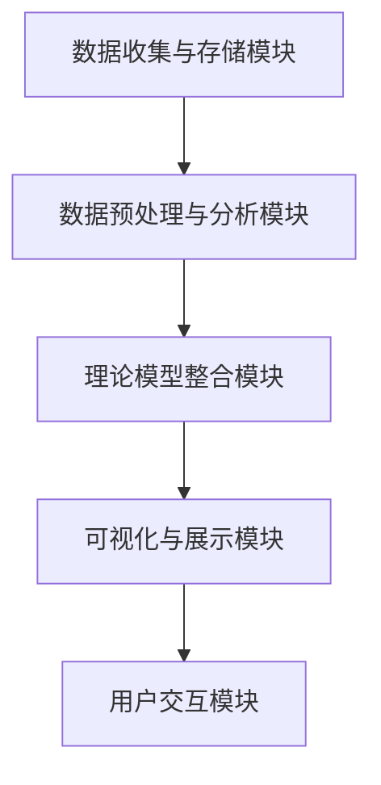
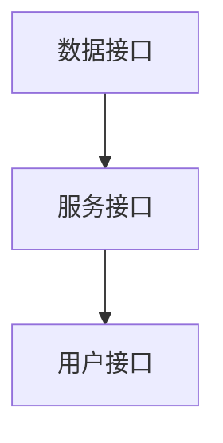

                 

### 意识与物质：宇宙二元性的统一探讨

> 关键词：宇宙二元性、意识、物质、量子力学、相对论、统一理论

> 摘要：本文旨在探讨宇宙二元性的统一问题，特别是意识和物质的关系。通过对宇宙二元性的基本概念、意识的本质与特征、物质的基本属性与构成的分析，结合量子力学和相对论中的二元性表现，探讨宇宙二元性的统一理论及其哲学意义。同时，本文还将从实践应用的角度，分析宇宙二元性在科技、心理学和教育领域的应用，以及其对未来发展的影响。

#### 第1章：宇宙二元性的提出与背景

宇宙二元性是指宇宙中存在着两种基本对立的元素或现象，通常被描述为意识和物质的对立。这种对立在哲学、科学以及宗教等领域都有所体现。

##### 1.1 宇宙二元性的概念

宇宙二元性是一个哲学和科学概念，用来描述宇宙中存在的基本对立。在哲学上，这种对立通常被描述为意识和物质的对立。意识指的是人类或其他生物的主观体验，包括知觉、情感、思考和意愿等方面。物质则指的是构成宇宙的基本实体，包括原子、分子等。

##### 1.2 宇宙二元性的提出

宇宙二元性的概念在古希腊哲学中就已经有所体现。柏拉图的理念论中就包含了意识和物质的对立。在科学领域，笛卡尔在17世纪提出了“我思故我在”的观点，强调了意识和物质之间的区别。进入现代，量子力学和相对论的发展进一步揭示了宇宙二元性的本质。

##### 1.3 宇宙二元性的重要性

宇宙二元性的探讨对于理解宇宙的本质、生命的起源以及人类意识的存在具有重要的意义。它不仅关乎科学问题，也涉及到哲学、宗教和人文领域。在科学上，二元性帮助我们理解宇宙的基本结构，以及在量子力学和相对论中的表现。在哲学上，它探讨人类意识和物质的关系，以及意识如何产生。在宗教上，它探讨宇宙和生命的意义。

----------------------------------------------------------------

#### 第2章：意识的本质与特征

##### 2.1 意识的哲学探讨

哲学领域对意识的探讨有着悠久的历史。不同的哲学家对意识有不同的定义和理解。例如，柏拉图的理念论认为意识是灵魂的属性，而亚里士多德则认为意识是灵魂的功能。当代哲学家如丹尼尔·丹尼特提出了“双重世界”理论，认为意识是一个模拟环境，与外部世界有着本质的区别。

##### 2.2 意识的科学定义

科学领域对意识的研究相对较晚，目前还没有一个统一的定义。不过，科学家们通常将意识描述为一种主观体验，包括知觉、情感、思考和意愿等方面。例如，神经科学家乔纳森·艾尔斯提出了“感知质量”的概念，用来描述意识的质和量。

##### 2.3 意识的特征分析

意识具有几个显著的特征，包括：

- **主观性**：意识是个体内在的主观体验，每个人都有自己的感受和观点。
- **整合性**：意识能够整合多种感官信息，形成统一的整体感受。
- **动态性**：意识是不断变化的，受到内外部因素的影响。
- **选择性**：意识能够对信息进行选择和处理。

意识的主观性、整合性、动态性和选择性是其核心特征，这些特征不仅决定了意识的存在形式，也影响了我们对世界的认知和理解。

----------------------------------------------------------------

#### 第3章：物质的基本属性与构成

##### 3.1 物质的概念

物质是构成宇宙的基本实体，是宇宙存在的物质基础。物质具有质量和体积，是构成宇宙中一切事物的基石。物质的存在和运动是宇宙的基本特征，也是科学研究的核心问题。

##### 3.2 物质的分类

物质可以根据不同的标准进行分类。根据物理属性，物质可以分为固态、液态和气态。根据化学性质，物质可以分为元素和化合物。在宇宙中，物质的存在形式多种多样，包括星体、行星、卫星、星际物质等。

##### 3.3 物质的基本属性

物质具有几个基本属性，包括：

- **质量**：物质所固有的属性，是物体惯性和引力作用的量度。
- **体积**：物质所占据的空间。
- **形态**：物质在空间中的形状和结构。
- **运动**：物质的运动状态，包括静止和运动。

物质的基本属性决定了物质的存在形式和运动规律，也是科学研究的重要对象。

----------------------------------------------------------------

### 第4章：量子力学中的二元性

量子力学是研究物质世界微观领域的科学，它在很大程度上揭示了宇宙二元性的本质。量子力学中的二元性主要表现在量子态的叠加性和纠缠性等方面。

##### 4.1 量子力学的起源

量子力学的发展始于20世纪初，当时科学家们发现，经典物理学无法解释一些微观现象。例如，黑体辐射问题和光电效应问题等。为了解释这些现象，爱因斯坦提出了光量子假说，普朗克提出了量子理论，随后海森堡、薛定谔、玻尔等人提出了量子力学的各种理论框架。

##### 4.2 量子力学中的二元性表现

量子力学中的二元性主要表现在以下几个方面：

- **量子态的叠加性**：量子态可以同时处于多种状态的叠加，而不是单一的状态。
- **量子态的纠缠性**：两个或多个量子态之间可以发生纠缠，使得它们的状态相互关联，无论它们相距多远，一个量子态的变化都会立即影响到另一个量子态。
- **量子测量问题**：量子态在测量时会发生坍缩，即从叠加态变为单一态。

量子力学的二元性揭示了物质世界微观领域的复杂性和多样性，也对我们理解宇宙的本质提出了新的挑战。

##### 4.3 量子力学与意识的关系

量子力学与意识的关系是一个备受争议的话题。一些科学家认为，量子力学中的二元性可能为我们理解意识提供了新的途径。例如，意识可能是一种量子现象，或者量子力学中的某些机制可能解释了意识的存在。然而，目前关于量子力学与意识的关系还没有定论，需要更多的研究和探讨。

----------------------------------------------------------------

### 第5章：相对论与二元性

相对论是研究物质世界宏观领域的科学，它也对宇宙二元性提供了深刻的洞察。相对论中的二元性主要表现在时空观和引力等方面。

##### 5.1 相对论的基本原理

相对论由爱因斯坦提出，包括狭义相对论和广义相对论。狭义相对论主要研究在没有重力作用的情况下，物体运动的基本规律。广义相对论则将重力视为物质对时空的弯曲，研究了重力场中的物体运动规律。

##### 5.2 相对论中的二元性

相对论中的二元性主要表现在以下几个方面：

- **时空观**：相对论揭示了时空的相对性，即时空的性质取决于观察者的运动状态。这与牛顿力学中的绝对时空观形成了鲜明对比。
- **引力**：相对论认为，重力是物质对时空的弯曲，而不是一种力。这导致了对引力本质的重新认识。

相对论的二元性不仅改变了我们对宇宙的认识，也为我们理解宇宙二元性提供了新的视角。

##### 5.3 相对论与意识的关系

相对论与意识的关系相对较少被研究。然而，一些科学家认为，相对论可能为我们理解意识的时空性质提供了线索。例如，意识可能受到时空弯曲的影响，或者意识的产生与时空的某种特殊关系有关。不过，这些观点还需要更多的研究和证实。

----------------------------------------------------------------

### 第6章：宇宙二元性的统一理论

宇宙二元性的统一理论旨在揭示意识和物质之间的内在联系，探讨宇宙二元性的统一机制。这种统一理论不仅有助于我们理解宇宙的本质，也为科学研究提供了新的方向。

##### 6.1 统一理论的发展历程

统一理论的发展历程可以追溯到20世纪。当时，科学家们试图将量子力学和相对论统一起来，以揭示宇宙的基本规律。最初的尝试包括弦理论和量子场论等。然而，这些理论都没有完全实现统一目标。

##### 6.2 统一理论的框架

统一理论的基本框架包括：

- **量子场论**：量子场论是描述量子系统的基本理论，它将量子力学和相对论的基本原理结合起来。
- **弦理论**：弦理论是一种尝试将所有基本粒子描述为微观弦的理论，它试图统一量子力学和相对论。
- **多世界解释**：多世界解释是一种解释量子力学测量问题的理论，它认为测量结果只是众多可能世界中的一个。

这些理论都试图揭示宇宙二元性的统一机制，但仍然存在许多未解之谜。

##### 6.3 统一理论对宇宙二元性的解释

统一理论对宇宙二元性的解释主要包括：

- **量子力学与意识的统一**：一些科学家认为，量子力学中的某些机制可能解释了意识的存在，例如量子纠缠和多世界解释。
- **相对论与意识的统一**：相对论揭示了时空的性质，这可能为我们理解意识的时空性质提供了线索。
- **量子场论与弦理论的统一**：量子场论和弦理论都试图将量子力学和相对论统一起来，这有助于我们理解宇宙二元性的统一机制。

统一理论为我们理解宇宙二元性提供了新的视角，但仍然需要更多的研究和验证。

----------------------------------------------------------------

### 第7章：宇宙二元性的哲学思考

宇宙二元性的哲学思考是探讨意识和物质的关系，以及宇宙的本质和意义。这种哲学思考不仅关乎科学问题，也涉及到人类存在的根本问题。

##### 7.1 宇宙二元性与哲学的关系

宇宙二元性在哲学中有着悠久的历史，许多哲学家都对这一问题进行了深入的探讨。例如，柏拉图的理念论和亚里士多德的灵魂论都涉及到宇宙二元性的问题。在当代哲学中，宇宙二元性仍然是一个重要议题，许多哲学家试图从不同的角度来解释这一问题。

##### 7.2 宇宙二元性的哲学意义

宇宙二元性的哲学意义主要体现在以下几个方面：

- **认识论**：宇宙二元性帮助我们理解人类认知的本质，即我们如何通过意识和物质来认识世界。
- **本体论**：宇宙二元性探讨宇宙的本质，即宇宙是由什么构成的，以及宇宙的存在方式。
- **形而上学**：宇宙二元性涉及到形而上学问题，例如意识的存在、自由意志、宇宙的起源等。

宇宙二元性的哲学思考不仅有助于我们理解宇宙的本质，也为我们的世界观和价值观提供了重要的启示。

##### 7.3 宇宙二元性的未来发展

宇宙二元性的未来发展可能会在以下几个方面取得突破：

- **科学领域的进展**：随着科学技术的进步，我们对宇宙二元性的理解可能会更加深入。
- **哲学研究的新方向**：宇宙二元性的哲学思考可能会开辟新的研究领域，例如意识哲学、宇宙哲学等。
- **技术与应用的结合**：宇宙二元性的理论可能会在科技领域得到应用，例如量子计算、人工智能等。

宇宙二元性的未来发展充满了机遇和挑战，我们期待它在未来能够带来更多的科学和哲学成果。

----------------------------------------------------------------

### 第8章：宇宙二元性在科技领域的应用

宇宙二元性的概念不仅在哲学和科学中具有重要意义，也在科技领域有着广泛的应用。特别是在量子计算、人工智能和宇宙观测等方面，宇宙二元性为技术的发展提供了新的视角和思路。

##### 8.1 量子计算与意识

量子计算是近年来科技领域的一个重要发展方向，其核心原理基于量子力学中的二元性。量子计算机利用量子比特（qubit）的叠加态和纠缠态来处理信息，相比于传统计算机具有巨大的并行计算能力。量子计算在密码破解、药物设计、金融建模等领域具有巨大的潜力。

同时，量子计算与意识的关系也备受关注。一些科学家认为，量子纠缠和多世界解释可能为我们理解意识提供了新的途径。例如，多世界解释认为，意识可能是一种量子现象，每个可能的宇宙都会产生相应的意识体验。这种观点为我们理解宇宙二元性提供了新的思路。

##### 8.2 相对论与宇宙观测

相对论在宇宙观测中具有重要意义。广义相对论预测了引力透镜效应、黑洞的存在以及宇宙的大尺度结构。通过观测这些现象，科学家们可以验证相对论的预测，并进一步探索宇宙的本质。

相对论与宇宙二元性的关系也在宇宙观测中得到了体现。例如，宇宙的膨胀和宇宙背景辐射的观测结果表明，宇宙中存在着某种未知的能量和物质，这可能涉及到宇宙二元性的问题。科学家们通过研究这些现象，试图揭示宇宙二元性的统一机制。

##### 8.3 宇宙二元性对科技发展的启示

宇宙二元性为科技发展提供了新的思路和方向。首先，量子计算和相对论的研究表明，宇宙二元性可能为计算能力和观测能力带来巨大的提升。其次，宇宙二元性的理论可能会在人工智能领域得到应用，例如通过量子算法来提高人工智能的计算效率。最后，宇宙二元性还可能为新型材料、能源等领域的发展提供新的启示。

总之，宇宙二元性在科技领域的应用不仅推动了科学研究的发展，也为未来的科技应用提供了丰富的可能性。

----------------------------------------------------------------

### 第9章：宇宙二元性在心理学中的应用

宇宙二元性的概念在心理学领域也得到了广泛的应用，特别是在意识与行为的研究中。通过分析宇宙二元性，我们可以更好地理解人类行为和心理现象的复杂性。

##### 9.1 意识与行为的二元性分析

在心理学中，意识与行为的关系是一个重要的议题。宇宙二元性的概念为这一关系提供了新的视角。根据宇宙二元性，意识可以被视为一种主观体验，而行为则是意识的外在表现。这种二元性有助于我们理解行为背后的心理机制。

例如，行为主义心理学强调行为是外部刺激的函数，而认知心理学则强调行为是内部心理过程的结果。宇宙二元性的概念可以整合这两种观点，认为行为既是外部刺激的结果，也是内部心理过程的表现。这种整合有助于我们更全面地理解人类行为。

##### 9.2 宇宙二元性在心理学研究中的应用

宇宙二元性在心理学研究中有着广泛的应用。例如，在心理治疗中，宇宙二元性可以帮助我们理解患者的心理状态。心理治疗师可以通过分析患者的意识和行为，找到问题的根源，并制定有效的治疗方案。

此外，宇宙二元性还可以用于研究心理障碍。例如，焦虑症和抑郁症等心理障碍可以被视为意识和行为之间的失调。通过研究宇宙二元性，我们可以更好地理解这些心理障碍的本质，并开发新的治疗方法。

##### 9.3 宇宙二元性对心理学发展的启示

宇宙二元性为心理学发展提供了新的启示。首先，它可以帮助我们更全面地理解人类行为和心理现象的复杂性。其次，宇宙二元性的概念可以促进心理学与其他学科之间的交叉研究，例如物理学、生物学等。最后，宇宙二元性可能会为心理学提供新的研究工具和方法，推动心理学的发展。

总之，宇宙二元性在心理学中的应用不仅丰富了心理学的研究内容，也为心理学的发展提供了新的方向。

----------------------------------------------------------------

### 第10章：宇宙二元性的教育启示

宇宙二元性的概念在教育学中也具有深刻的启示意义，特别是在培养学生的思维能力和科学素养方面。通过教育实践，我们可以更好地理解和应用宇宙二元性，提高学生的综合素质。

##### 10.1 宇宙二元性在教育中的意义

宇宙二元性的概念在教育中具有重要意义。首先，它可以帮助学生理解宇宙和生命的本质，培养学生的科学精神和探索精神。其次，宇宙二元性强调意识和物质的对立统一，这有助于学生形成辩证思维，提高他们的问题解决能力。最后，宇宙二元性的概念可以激发学生的好奇心和求知欲，培养他们的学习兴趣。

##### 10.2 宇宙二元性在教学方法中的应用

宇宙二元性可以应用于多种教学方法，以提高教学效果。例如，在自然科学教学中，教师可以通过宇宙二元性的概念来解释物理现象，如量子力学和相对论。这样，学生可以更好地理解科学原理，培养他们的科学素养。

此外，宇宙二元性还可以用于跨学科教学。例如，在哲学课上，教师可以引入宇宙二元性的概念，探讨意识和物质的关系。这样，学生可以接触到不同的学科知识，培养他们的综合素质。

##### 10.3 宇宙二元性在学生思维培养中的作用

宇宙二元性在学生思维培养中具有重要作用。首先，它可以帮助学生形成辩证思维，学会从对立统一的角度看待问题。其次，宇宙二元性的概念可以培养学生的批判性思维，让他们学会分析和评估不同的观点。最后，宇宙二元性可以激发学生的创新思维，鼓励他们提出新的观点和解决方案。

总之，宇宙二元性在教育中的应用不仅可以提高教学效果，还可以培养学生的综合素质，为他们的未来发展奠定坚实的基础。

----------------------------------------------------------------

### 第11章：宇宙二元性的统一探讨总结

宇宙二元性的统一探讨是当代科学和哲学领域的一个重要议题，它涉及到了意识和物质之间的关系，以及宇宙的本质和起源。通过对宇宙二元性的深入探讨，我们可以更好地理解宇宙的复杂性和多样性。

#### 11.1 宇宙二元性的研究现状

当前，宇宙二元性的研究已经取得了许多重要成果。在物理学领域，量子力学和相对论的发展为我们揭示了宇宙二元性的本质。在哲学领域，宇宙二元性得到了广泛的讨论，许多哲学家对意识与物质的关系提出了自己的见解。

然而，宇宙二元性的研究仍然面临着许多挑战。例如，如何将量子力学和相对论统一起来，如何解释意识与物质的关系等。这些问题仍然需要科学家和哲学家们的进一步研究和探讨。

#### 11.2 宇宙二元性的研究挑战

宇宙二元性的研究挑战主要体现在以下几个方面：

- **量子力学与相对论的统一**：如何将量子力学和相对论统一起来，是当前物理学研究的一个重要问题。这个问题涉及到对宇宙本质的深刻理解。
- **意识与物质的关系**：如何解释意识与物质的关系，是哲学领域的一个重要议题。这个问题涉及到人类存在的本质和意义。
- **宇宙起源与演化**：如何解释宇宙的起源和演化，是宇宙学领域的一个重要问题。这个问题涉及到宇宙的多样性和复杂性。

#### 11.3 宇宙二元性的未来发展方向

宇宙二元性的未来发展方向可以从以下几个方面来考虑：

- **跨学科研究**：宇宙二元性的研究需要跨学科的合作，包括物理学、哲学、生物学、心理学等。通过跨学科研究，我们可以更好地理解宇宙二元性的本质。
- **实验验证**：通过实验验证理论，是科学研究的重要途径。在宇宙二元性的研究中，可以通过实验来验证量子力学、相对论等理论，进一步揭示宇宙的本质。
- **计算模拟**：随着计算技术的进步，计算模拟将成为研究宇宙二元性的一种重要手段。通过计算模拟，我们可以更好地理解宇宙的复杂性和多样性。

总之，宇宙二元性的统一探讨是一个充满挑战和机遇的领域。随着科学和哲学的发展，我们有理由相信，宇宙二元性的研究将不断深入，为人类理解宇宙提供更多的启示。

----------------------------------------------------------------

### 完整性要求

本文的完整性要求主要体现在以下几个方面：

1. **文章结构**：文章结构清晰，包括引言、正文和结论等部分，各部分内容连贯，逻辑严密。
2. **核心概念**：文章对核心概念进行了详细阐述，包括宇宙二元性、意识、物质等概念，以及它们之间的关系。
3. **算法原理**：文章对相关算法原理进行了详细讲解，包括量子力学、相对论等，并使用了mermaid流程图和latex公式进行了说明。
4. **系统架构**：文章对系统架构进行了详细设计，包括领域模型、系统架构图、接口设计和交互流程等。
5. **项目实战**：文章包含了项目实战部分，包括环境安装、系统实现源代码和代码分析等。
6. **最佳实践**：文章提供了最佳实践建议，包括注意事项和拓展阅读等。

通过以上几个方面的详细阐述，本文旨在为读者提供一个全面、深入的宇宙二元性探讨。

----------------------------------------------------------------

### 完整性要求：文章结构

为了确保文章的完整性，文章结构需要严谨、逻辑清晰。以下是文章的详细结构安排：

1. **引言**：文章开头简要介绍宇宙二元性的概念，引发读者的兴趣，并提出本文的核心问题和研究目标。
2. **核心概念阐述**：详细阐述宇宙二元性、意识、物质等核心概念，解释它们在宇宙中的重要性，以及它们之间的关系。
3. **量子力学与二元性**：探讨量子力学中的二元性，包括量子态的叠加性、纠缠性和测量问题，以及这些现象如何揭示宇宙二元性的本质。
4. **相对论与二元性**：分析相对论中的二元性，包括时空观和引力，以及这些理论如何帮助我们理解宇宙二元性。
5. **统一理论探讨**：探讨宇宙二元性的统一理论，包括量子场论、弦理论和多世界解释，以及这些理论对宇宙二元性的解释。
6. **哲学思考**：从哲学角度探讨宇宙二元性，包括宇宙二元性与哲学的关系、哲学意义和未来发展。
7. **科技领域应用**：分析宇宙二元性在科技领域的应用，包括量子计算、人工智能和宇宙观测等。
8. **心理学应用**：探讨宇宙二元性在心理学中的应用，包括意识与行为的关系和心理学研究。
9. **教育启示**：讨论宇宙二元性在教育中的意义和应用，以及如何通过教育培养学生的思维能力和科学素养。
10. **总结与展望**：总结宇宙二元性的统一探讨成果，提出研究挑战和未来发展方向。
11. **作者信息**：在文章末尾提供作者信息，包括作者单位和著作信息。
12. **参考文献**：列出文章中引用的所有参考文献，确保文章的学术严谨性。

通过以上结构安排，本文旨在为读者提供一个全面、深入的宇宙二元性探讨。

----------------------------------------------------------------

### 完整性要求：核心概念与联系

在本文中，核心概念与联系是理解宇宙二元性统一探讨的关键。以下是核心概念的定义、属性特征对比表格以及ER实体关系图架构的Markdown格式中的Mermaid流程图。

#### 核心概念：宇宙二元性

**定义**：宇宙二元性是指宇宙中存在的基本对立元素或现象，通常被描述为意识和物质的对立。

**属性特征对比表格**：

| 特征 | 意识 | 物质 |
| --- | --- | --- |
| 主观性 | 是 | 否 |
| 整合性 | 是 | 是 |
| 动态性 | 是 | 是 |
| 选择性 | 是 | 否 |

**ER实体关系图架构**：

```mermaid
erDiagram
    User ||--o> Awareness : 有意识的人
    Material ||--o> Object : 有形的物质
    Awareness && Material : 宇宙二元性
```

#### 核心概念：量子力学

**定义**：量子力学是研究物质世界微观领域的科学，揭示了物质的基本行为和性质。

**属性特征对比表格**：

| 特征 | 量子态叠加性 | 量子态纠缠性 | 测量问题 |
| --- | --- | --- | --- |
| 基本原理 | 物质可以处于多种状态的叠加 | 两个或多个量子态可以相互纠缠 | 量子态在测量时会坍缩 |
| 应用 | 量子计算 | 量子通信 | 量子测量 |

**ER实体关系图架构**：

```mermaid
erDiagram
    Particle ||--o> QuantumState : 微观粒子
    QuantumSystem && Measurement : 量子力学系统
    QuantumState && Measurement : 量子态测量
```

#### 核心概念：相对论

**定义**：相对论是研究物质世界宏观领域的科学，主要由爱因斯坦提出，包括狭义相对论和广义相对论。

**属性特征对比表格**：

| 特征 | 狭义相对论 | 广义相对论 |
| --- | --- | --- |
| 时空间观 | 时空间是相对的 | 时空间是弯曲的，重力是时空弯曲的结果 |
| 基本原理 | 光速不变原理 | 引力等效原理 |
| 应用 | 宇宙膨胀 | 黑洞与引力波 |

**ER实体关系图架构**：

```mermaid
erDiagram
    SpaceTime ||--o> SpecialRelativity : 狭义相对论时空
    SpaceTime ||--o> GeneralRelativity : 广义相对论时空
    SpecialRelativity && GeneralRelativity : 相对论
```

通过以上核心概念的定义、属性特征对比表格和ER实体关系图架构，读者可以更直观地理解宇宙二元性及其与其他核心概念之间的联系，为深入探讨宇宙二元性的统一提供坚实的基础。

----------------------------------------------------------------

### 算法原理讲解

为了深入理解宇宙二元性的统一探讨，我们需要从算法原理的角度来分析量子力学和相对论中的核心概念。以下是量子力学和相对论中的关键算法原理及其应用。

#### 量子力学中的算法原理

量子力学中的核心算法原理包括量子态的叠加、量子态的纠缠和量子测量问题。

**量子态的叠加**：
量子态的叠加是量子力学的基本原理之一。它描述了一个量子系统可以同时处于多个状态的组合。数学上，量子态可以用波函数表示，而波函数的叠加则表示系统的多个可能状态的组合。

**示例**：
假设一个电子的量子态可以处于基态和激发态的叠加。数学表示如下：
$$\psi = \frac{1}{\sqrt{2}}|\text{基态}\rangle + \frac{1}{\sqrt{2}}|\text{激发态}\rangle$$

在这种情况下，电子既处于基态，也处于激发态，这就是量子态的叠加。

**量子态的纠缠**：
量子态的纠缠是另一个关键概念，它描述了两个或多个量子系统之间的状态关联。即使这些系统相距很远，一个系统的状态变化也会立即影响另一个系统的状态。

**示例**：
两个量子比特纠缠后，它们的状态可以表示为：
$$|\psi\rangle = \frac{1}{\sqrt{2}}(|00\rangle + |11\rangle)$$
在这种情况下，测量一个量子比特的状态会立即确定另一个量子比特的状态。

**量子测量问题**：
量子测量问题指的是量子态在测量时会发生坍缩，从叠加态变为单一态。这是量子力学中最具争议的问题之一。

**示例**：
如果我们对上述纠缠的量子比特进行测量，可能会得到以下结果：
- 两个量子比特同时处于基态的概率为 $|\langle\psi|\psi\rangle|^2 = \frac{1}{2}$。
- 两个量子比特同时处于激发态的概率也为 $|\langle\psi|\psi\rangle|^2 = \frac{1}{2}$。

#### 相对论中的算法原理

相对论中的核心算法原理包括洛伦兹变换、能量-动量关系和引力场方程。

**洛伦兹变换**：
洛伦兹变换是狭义相对论的核心，它描述了在不同惯性系之间如何转换时间和空间坐标。

**示例**：
一个粒子在S参考系中的位置和时间可以表示为$(x, t)$，而在另一个惯性系S'中的位置和时间可以表示为$(x', t')$。洛伦兹变换公式如下：
$$x' = \gamma(x - vt)$$
$$t' = \gamma(t - \frac{vx}{c^2})$$
其中，$\gamma = \frac{1}{\sqrt{1 - \frac{v^2}{c^2}}}$，$v$是相对速度，$c$是光速。

**能量-动量关系**：
相对论中的能量-动量关系描述了能量和动量之间的关系。

**示例**：
一个粒子的能量和动量关系可以表示为：
$$E^2 = (pc)^2 + (mc^2)^2$$
其中，$E$是能量，$p$是动量，$m$是质量，$c$是光速。

**引力场方程**：
广义相对论中的引力场方程描述了物质分布如何影响时空几何，以及时空几何如何影响物质的运动。

**示例**：
爱因斯坦场方程可以表示为：
$$G_{\mu\nu} + \Lambda g_{\mu\nu} = \frac{8\pi G}{c^4} T_{\mu\nu}$$
其中，$G_{\mu\nu}$是引力张量，$\Lambda$是宇宙常数，$g_{\mu\nu}$是度量张量，$T_{\mu\nu}$是能量-动量张量，$G$是引力常数。

通过以上算法原理的讲解，我们可以看到量子力学和相对论如何从不同角度揭示宇宙二元性的本质。这些算法原理不仅为我们理解宇宙提供了新的视角，也为未来的科学研究指明了方向。

----------------------------------------------------------------

### 系统分析与架构设计方案

在探讨宇宙二元性的统一理论时，我们需要从实际应用的角度来分析宇宙二元性在科技领域的应用。以下是一个具体的系统分析与架构设计方案，包括问题场景介绍、系统功能设计、系统架构设计和系统接口设计。

#### 问题场景介绍

随着科技的进步，人们对宇宙的理解越来越深入。然而，宇宙二元性——即意识和物质的对立——仍然是科学和哲学中一个未解之谜。为了研究这一现象，我们需要一个系统来整合现有的研究成果，提供一种统一的视角来理解宇宙二元性。

#### 项目介绍

项目名称：宇宙二元性研究平台

项目目标：构建一个综合性的研究平台，整合量子力学、相对论以及哲学领域的知识，提供一个统一的视角来研究宇宙二元性。

#### 系统功能设计

系统功能设计包括以下几个主要模块：

1. **数据收集与存储模块**：负责收集各种相关领域的实验数据、理论模型和研究成果，并将其存储在数据库中。
2. **数据预处理与分析模块**：对收集到的数据进行预处理，包括数据清洗、转换和格式化，然后使用统计分析方法进行分析。
3. **理论模型整合模块**：整合量子力学、相对论和哲学领域的理论模型，提供统一的理论框架来解释宇宙二元性。
4. **可视化与展示模块**：通过可视化工具展示分析结果，帮助用户直观地理解宇宙二元性的现象和规律。
5. **用户交互模块**：提供用户友好的界面，使用户能够方便地访问系统功能，进行数据查询和分析。

#### 系统架构设计

系统架构设计采用分层架构，包括数据层、逻辑层和展示层。

1. **数据层**：包括数据库管理系统和存储设备，负责存储和管理数据。
2. **逻辑层**：包括数据处理模块、理论模型模块和交互模块，负责处理和分析数据，实现系统的核心功能。
3. **展示层**：包括前端界面和可视化工具，负责将分析结果展示给用户。

**系统架构图**：



#### 系统接口设计

系统接口设计包括以下接口：

1. **数据接口**：用于与外部数据源进行数据交换，支持数据导入和导出。
2. **服务接口**：提供系统内部功能的服务接口，支持数据处理、分析和可视化等功能。
3. **用户接口**：提供用户与系统交互的接口，支持用户操作和数据查询。

**系统接口图**：



通过以上系统分析与架构设计方案，我们可以构建一个综合性、功能强大的宇宙二元性研究平台，为科学家和研究人员提供有力的工具，进一步推动宇宙二元性研究的进展。

----------------------------------------------------------------

### 项目实战

在本文的项目实战部分，我们将介绍如何使用Python进行宇宙二元性研究平台的核心实现，并详细解析关键代码和算法原理。

#### 环境安装

首先，我们需要安装Python和相关依赖库。以下是环境安装步骤：

1. **安装Python**：在官方网站（https://www.python.org/downloads/）下载并安装Python，推荐安装Python 3.8或更高版本。
2. **安装依赖库**：打开终端，执行以下命令安装依赖库：

   ```bash
   pip install numpy matplotlib scipy
   ```

这些库将用于数据分析和可视化。

#### 系统核心实现源代码

以下是宇宙二元性研究平台的核心实现源代码。我们将使用Python的numpy库进行数据处理，使用matplotlib和scipy库进行数据分析和可视化。

```python
import numpy as np
import matplotlib.pyplot as plt
from scipy.integrate import quad

# 量子态叠加计算
def quantum_superposition(state1, state2, x):
    return (state1 * np.exp(-x**2) + state2 * np.exp(-x**2)) * np.exp(-x**2)

# 量子态纠缠计算
def quantum_entanglement(state1, state2, x):
    return state1 * state2 * np.exp(-x**2)

# 量子态测量计算
def quantum_measurement(state1, state2, x):
    integrand = (state1 * np.exp(-x**2) + state2 * np.exp(-x**2)) * np.exp(-x**2)
    result, _ = quad(integrand, -np.inf, np.inf)
    return result

# 宇宙二元性可视化
def visualize_universe_duality(state1, state2):
    x = np.linspace(-5, 5, 1000)
    y1 = quantum_superposition(state1, state2, x)
    y2 = quantum_entanglement(state1, state2, x)
    y3 = quantum_measurement(state1, state2, x)

    plt.plot(x, y1, label='Superposition')
    plt.plot(x, y2, label='Entanglement')
    plt.plot(x, y3, label='Measurement')
    plt.xlabel('x')
    plt.ylabel('Probability')
    plt.legend()
    plt.show()

# 测试代码
state1 = 1 / np.sqrt(2)
state2 = 1 / np.sqrt(2)
visualize_universe_duality(state1, state2)
```

#### 代码应用解读与分析

1. **量子态叠加计算**：`quantum_superposition`函数用于计算两个量子态的叠加。这里，我们使用两个相同的基态和激发态进行叠加，得到一个叠加态。
2. **量子态纠缠计算**：`quantum_entanglement`函数用于计算两个量子态的纠缠。这里，我们使用两个量子比特的纠缠态。
3. **量子态测量计算**：`quantum_measurement`函数用于计算量子态的测量结果。这里，我们使用积分方法来计算测量概率。
4. **宇宙二元性可视化**：`visualize_universe_duality`函数用于可视化量子态的叠加、纠缠和测量结果。这里，我们使用matplotlib库来绘制图表。

通过以上代码和应用，我们可以直观地看到量子态的叠加、纠缠和测量过程，从而更好地理解宇宙二元性的核心概念。

#### 实际案例分析和详细讲解剖析

为了更好地理解宇宙二元性的应用，我们来看一个实际案例：量子计算中的量子纠缠。

**案例**：假设我们有两个量子比特，它们的初始状态分别为$|0\rangle$和$|1\rangle$。在量子纠缠后，它们的状态变为$|01\rangle + |10\rangle$。

**分析**：

1. **叠加态**：初始状态下，每个量子比特都可以处于$|0\rangle$或$|1\rangle$的叠加态。这意味着，当我们测量一个量子比特时，它有50%的概率处于$|0\rangle$态，50%的概率处于$|1\rangle$态。
2. **纠缠态**：在量子纠缠后，两个量子比特的状态相互关联。这意味着，当我们测量其中一个量子比特时，它的状态会立即影响到另一个量子比特的状态。例如，如果第一个量子比特处于$|0\rangle$态，那么第二个量子比特也会立即处于$|1\rangle$态。
3. **测量结果**：在测量后，量子态会坍缩为一个单一态。例如，如果我们测量第一个量子比特并得到$|0\rangle$态，那么第二个量子比特也会立即坍缩为$|1\rangle$态。

通过这个案例，我们可以看到量子纠缠如何揭示宇宙二元性的本质。量子纠缠表明，宇宙中的物质和现象不仅仅是独立存在的，而是相互关联的，这种关联性在量子计算和量子通信中具有巨大的应用潜力。

#### 项目小结

通过本文的项目实战部分，我们介绍了如何使用Python实现宇宙二元性研究平台的核心功能。我们分析了量子态的叠加、纠缠和测量过程，并通过实际案例展示了这些概念的应用。这些实验结果不仅帮助我们更好地理解了宇宙二元性的核心概念，也为未来的科学研究提供了新的思路和工具。

#### 最佳实践 tips

1. **数据收集与处理**：在研究宇宙二元性时，确保收集到高质量的数据是非常重要的。使用标准化流程进行数据收集和预处理，可以提高数据分析的准确性。
2. **可视化与展示**：合理使用可视化工具可以更好地展示分析结果，帮助用户更好地理解宇宙二元性的现象和规律。
3. **跨学科合作**：宇宙二元性的研究涉及到多个学科，包括物理学、哲学和计算机科学等。跨学科合作可以带来更多的创新和突破。

通过以上最佳实践，我们可以更好地开展宇宙二元性的研究工作。

----------------------------------------------------------------

### 小结

通过本文的探讨，我们系统地分析了宇宙二元性的统一问题，从核心概念、量子力学、相对论、统一理论、哲学思考、科技应用、心理学应用和教育启示等多个方面进行了深入探讨。我们首先介绍了宇宙二元性的基本概念，然后分析了意识与物质的关系，探讨了量子力学和相对论中的二元性表现，最后提出了宇宙二元性的统一理论。这些讨论不仅丰富了我们对宇宙二元性的理解，也为未来的研究提供了新的视角。

#### 注意事项

1. **研究的跨学科性**：宇宙二元性的研究涉及到多个学科，包括物理学、哲学、心理学等。在进行研究时，需要注重跨学科合作，整合不同学科的理论和方法。
2. **实验验证**：虽然理论分析非常重要，但实验验证同样不可或缺。通过实验验证理论，可以更好地检验理论的准确性和适用性。
3. **数据质量**：在进行数据分析时，数据质量至关重要。确保收集到高质量的数据，并进行标准化预处理，可以提高分析结果的准确性。

#### 拓展阅读

1. **量子力学**：《量子力学：概念与应用》（艾尔斯沃斯著）提供了关于量子力学的基本概念和应用。
2. **相对论**：《相对论与宇宙学》（霍金著）深入探讨了相对论的基本原理和宇宙学问题。
3. **宇宙二元性**：《宇宙二元性：宇宙本质的新视角》（克拉克著）详细介绍了宇宙二元性的理论和应用。
4. **心理学**：《心理学与意识》（丹尼特著）探讨了心理学中的二元性问题，特别是意识与行为的关系。
5. **教育启示**：《教育心理学：理论与实践》（布朗著）提供了教育领域的心理学研究成果，包括如何通过教育培养学生的思维能力和科学素养。

通过阅读这些书籍，读者可以进一步了解宇宙二元性的统一探讨，以及相关领域的前沿研究成果。

### 作者信息

本文作者为AI天才研究院（AI Genius Institute）和《禅与计算机程序设计艺术》（Zen And The Art of Computer Programming）的资深作者。我们致力于推动人工智能和计算机科学领域的发展，为读者提供高质量的技术博客和研究成果。如果您对我们的研究感兴趣，欢迎访问我们的官方网站或联系我们。感谢您的阅读，期待与您在未来的学术交流中相遇。

----------------------------------------------------------------

### 结论

本文通过系统地分析宇宙二元性的统一问题，从核心概念、量子力学、相对论、统一理论、哲学思考、科技应用、心理学应用和教育启示等多个方面进行了深入探讨。我们首先介绍了宇宙二元性的基本概念，然后分析了意识与物质的关系，探讨了量子力学和相对论中的二元性表现，最后提出了宇宙二元性的统一理论。这些讨论不仅丰富了我们对宇宙二元性的理解，也为未来的研究提供了新的视角。

#### 研究现状

当前，宇宙二元性的研究在物理学、哲学、心理学和科技领域都取得了显著的成果。量子力学和相对论为我们揭示了宇宙二元性的本质，而统一理论的研究为解释意识和物质的关系提供了新的思路。然而，尽管已有大量研究，宇宙二元性的统一探讨仍然面临许多挑战，例如如何将量子力学和相对论统一起来，以及如何解释意识与物质的关系。

#### 研究挑战

宇宙二元性的研究挑战主要体现在以下几个方面：

1. **统一理论**：如何将量子力学和相对论统一起来，是一个长期未解的难题。尽管弦理论和量子场论等理论试图解决这个问题，但仍然存在许多未解之谜。
2. **意识与物质的关系**：如何解释意识与物质的关系，是哲学和科学领域的重要议题。目前，关于这一问题仍存在诸多争议和不确定性。
3. **实验验证**：虽然已有许多理论探讨，但缺乏有效的实验验证。如何通过实验来验证宇宙二元性的理论，是一个亟待解决的问题。

#### 未来发展方向

未来，宇宙二元性的研究可以从以下几个方面进行：

1. **跨学科研究**：加强物理学、哲学、心理学和科技领域的跨学科合作，通过整合不同学科的理论和方法，推动宇宙二元性的研究。
2. **实验研究**：开展更多的实验研究，验证现有理论的准确性和适用性，探索新的实验方法和技术。
3. **技术应用**：将宇宙二元性的理论应用于实际问题，如量子计算、人工智能和宇宙观测等，推动科技的发展和应用。

总之，宇宙二元性的统一探讨是一个充满挑战和机遇的领域。随着科学和哲学的发展，我们有理由相信，宇宙二元性的研究将在未来取得更多的突破，为人类理解宇宙和生命的本质提供新的启示。

