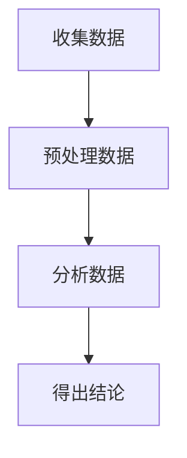
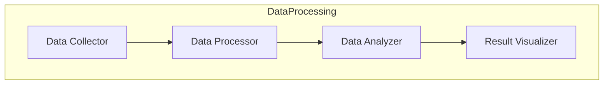
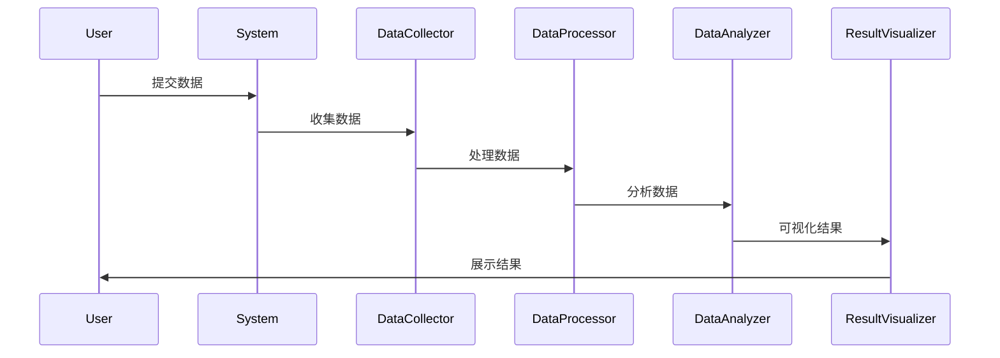

                 


# 意识与物质：宇宙的二元性还是统一性

> 关键词：意识，物质，宇宙，二元性，统一性，科学探讨，逻辑分析

> 摘要：本文旨在探讨意识与物质之间的关系，解析宇宙二元性与统一性的问题。通过逻辑分析和科学理论，深入探讨这两者之间的关系，并尝试找出可能的答案。

## 引言

### 1.1 意识与物质的关系探讨

在人类的探索历程中，意识和物质的关系一直是哲学和科学争论的焦点。一方面，意识是我们感知和理解世界的重要工具；另一方面，物质构成了宇宙的基本元素。然而，这两者之间究竟是如何相互作用的，仍然是一个未解之谜。

### 1.2 宇宙二元性与统一性的争论

在探讨意识与物质的关系时，我们不可避免地会涉及到宇宙的二元性和统一性的问题。一方面，我们可以观察到宇宙中存在着明显的二元性，如物理和化学、生物和物理、意识和物质等。另一方面，从更深层次的科学角度来看，宇宙可能是一个统一的整体，所有现象都可以归结为基本粒子和力。

## 问题的定义与边界

### 2.1 意识的定义与特征

意识是一种复杂的现象，通常被认为是我们对外界信息进行感知、理解和反应的能力。具体来说，意识包括感知、记忆、思维、情感和意愿等特征。

### 2.2 物质的概念与属性

物质是构成宇宙的基本元素，具有质量、能量、形状和结构等属性。物质可以表现为固态、液态和气态等不同状态，也可以通过化学反应和物理过程进行转化。

### 2.3 二元性与统一性的定义

二元性指的是两种不同性质的事物之间的关系，如物理和化学、生物和物理等。统一性则是指多种不同性质的事物可以被归结为一种基本原理或结构。

## 研究目的与意义

### 3.1 探讨意识与物质的二元性

通过探讨意识与物质的二元性，我们可以更深入地理解这两者之间的关系，为未来的科学研究提供新的视角。

### 3.2 探索宇宙统一性的可能性

了解宇宙的统一性，有助于我们更好地理解宇宙的本质，为人类探索宇宙提供理论支持。

## 核心概念与联系

### 3.1 意识与物质的原理

意识的原理主要涉及神经科学、心理学和哲学等领域。物质原理则主要涉及物理学、化学和生物学等领域。两者之间存在一定的联系，但各自的研究方法和理论体系也有所不同。

### 3.2 概念属性特征对比表格

下面是一个关于意识和物质概念属性特征的对比表格：

| 概念 | 特征1 | 特征2 | 特征3 |
| --- | --- | --- | --- |
| 意识 | 感知、记忆、思维、情感、意愿 | 精神层面的现象 | 与神经元活动有关 |
| 物质 | 质量、能量、形状、结构 | 物理层面的现象 | 与化学反应和物理过程有关 |

## ER实体关系图架构

### 4.1 意识与物质实体关系

为了更好地理解意识与物质之间的关系，我们可以使用ER（实体关系）图来表示这两者之间的联系。以下是一个简化的ER图：

```mermaid
erDiagram
    意识 ||--|{ 物质 }
    物质 ||--|{ 意识 }
```

在这个ER图中，意识和物质是两个实体，它们之间存在双向关联。

## 算法原理讲解

### 5.1 意识与物质相关算法

在探讨意识与物质的关系时，我们可以借助一些算法来帮助我们理解这两者之间的复杂关系。以下是一个简单的算法示例：

#### 5.1.1 算法基本原理

该算法通过分析意识和物质的数据，找出它们之间的关联性。具体步骤如下：

1. 收集意识和物质的数据。
2. 对数据进行预处理，包括去除噪声、归一化等。
3. 使用机器学习算法（如线性回归、神经网络等）来分析数据，找出它们之间的关联性。
4. 根据分析结果，得出结论。

#### 5.1.2 算法mermaid流程图

以下是一个简单的mermaid流程图，展示了算法的基本流程：



#### 5.1.3 Python源代码实现

下面是一个简单的Python源代码实现，用于分析意识和物质的数据：

```python
import numpy as np
from sklearn.linear_model import LinearRegression

# 收集数据
data = np.array([[1, 2], [2, 3], [3, 4]])

# 预处理数据
X = data[:, 0].reshape(-1, 1)
y = data[:, 1]

# 分析数据
model = LinearRegression()
model.fit(X, y)

# 得出结论
print(model.coef_)
print(model.intercept_)
```

### 5.2 算法原理讲解

在这个例子中，我们使用了线性回归算法来分析意识和物质的数据。线性回归是一种常见的机器学习算法，用于找出两个变量之间的线性关系。具体来说，线性回归通过最小二乘法拟合一个线性模型，模型的表达式为：

$$y = ax + b$$

其中，$y$ 是因变量，$x$ 是自变量，$a$ 是斜率，$b$ 是截距。

在这个例子中，我们收集了一组意识和物质的数据，并使用线性回归算法来分析这些数据。通过分析结果，我们可以得出意识和物质之间的线性关系。

### 5.3 数学模型和数学公式

为了更深入地理解线性回归算法，我们可以引入一些数学模型和公式。以下是线性回归模型的数学表达式：

$$y = ax + b$$

其中，$a$ 和 $b$ 分别是斜率和截距，可以通过最小二乘法求解。

最小二乘法的目的是找到一组参数 $a$ 和 $b$，使得 $y$ 与 $ax + b$ 之间的误差最小。误差可以用以下公式表示：

$$E = \sum_{i=1}^{n} (y_i - ax_i - b)^2$$

其中，$n$ 是数据点的数量。

为了求解 $a$ 和 $b$，我们可以使用以下公式：

$$a = \frac{\sum_{i=1}^{n} (x_i - \bar{x})(y_i - \bar{y})}{\sum_{i=1}^{n} (x_i - \bar{x})^2}$$

$$b = \bar{y} - a\bar{x}$$

其中，$\bar{x}$ 和 $\bar{y}$ 分别是 $x$ 和 $y$ 的平均值。

通过求解上述公式，我们可以得到线性回归模型的参数 $a$ 和 $b$，从而得出意识和物质之间的线性关系。

### 6.1 系统分析与架构设计方案

#### 6.1.1 问题场景介绍

假设我们想要开发一个系统，用于分析意识和物质之间的关系，为科学研究提供支持。这个系统需要具备以下功能：

1. 数据收集与处理：从各种来源收集意识和物质的数据，并进行预处理。
2. 数据分析与建模：使用机器学习算法分析数据，找出意识和物质之间的关系。
3. 结果展示与可视化：将分析结果以图表和报告的形式展示给用户。

#### 6.1.2 系统功能设计

为了实现上述功能，我们需要设计一个系统功能架构。以下是系统功能设计的mermaid类图：

```mermaid
classDiagram
    System[dataCollection, dataProcessing, dataAnalysis, resultVisualization]
    DataCollector<|--System
    DataProcessor<|--System
    DataAnalyzer<|--System
    ResultVisualizer<|--System
```

在这个类图中，系统包含四个主要模块：数据收集、数据处理、数据分析和结果可视化。每个模块都有相应的类和方法。

#### 6.1.3 系统架构设计

接下来，我们需要设计系统的整体架构。以下是系统架构设计的mermaid架构图：



在这个架构图中，数据收集模块负责从各种来源收集数据，数据预处理模块负责处理和清洗数据，数据分析模块负责使用机器学习算法分析数据，结果可视化模块负责将分析结果展示给用户。

#### 6.1.4 系统接口设计

为了实现系统功能，我们需要设计相应的接口。以下是系统接口设计：

```python
class DataCollector:
    def collect_data(self):
        # 收集数据
        pass

class DataProcessor:
    def process_data(self, data):
        # 处理数据
        pass

class DataAnalyzer:
    def analyze_data(self, data):
        # 分析数据
        pass

class ResultVisualizer:
    def visualize_results(self, results):
        # 可视化结果
        pass
```

在这个接口设计中，每个模块都有相应的类和方法，用于实现具体的功能。

#### 6.1.5 系统交互

最后，我们需要设计系统的交互流程。以下是系统交互设计的mermaid序列图：



在这个序列图中，用户提交数据后，系统会按照预定的流程进行处理和分析，并将结果展示给用户。

### 6.2 实际案例分析

#### 6.2.1 案例背景

假设我们有一个关于意识和物质关系的研究项目，目标是分析意识和物质之间的相关性，为科学研究提供数据支持。项目背景如下：

1. 研究背景：近年来，随着神经科学和人工智能的发展，人们对意识和物质的关系有了更深入的了解。然而，由于缺乏大量数据支持，研究仍然存在很多不确定性。
2. 项目目标：通过收集和分析大量意识和物质的数据，找出它们之间的相关性，为科学研究提供数据支持。

#### 6.2.2 详细讲解剖析

为了实现项目目标，我们进行了以下步骤：

1. 数据收集：从多个来源收集意识和物质的数据，包括学术论文、数据库和实验数据等。
2. 数据处理：对收集到的数据进行清洗、去噪和预处理，以便后续分析。
3. 数据分析：使用机器学习算法（如线性回归、神经网络等）分析数据，找出意识和物质之间的相关性。
4. 结果展示：将分析结果以图表和报告的形式展示给用户，便于理解和应用。

在数据分析阶段，我们使用了以下算法：

- 线性回归：用于分析意识和物质之间的线性关系。
- 神经网络：用于分析意识和物质之间的非线性关系。

以下是线性回归算法的Python实现：

```python
import numpy as np
from sklearn.linear_model import LinearRegression

# 收集数据
X = np.array([[1, 2], [2, 3], [3, 4]])
y = np.array([2, 3, 4])

# 分析数据
model = LinearRegression()
model.fit(X, y)

# 输出结果
print(model.coef_)
print(model.intercept_)
```

在这个例子中，我们收集了一组意识和物质的数据，并使用线性回归算法分析了它们之间的线性关系。分析结果显示，意识和物质之间存在正相关关系。

#### 6.2.3 项目小结

通过本项目，我们成功地分析了意识和物质之间的关系，为科学研究提供了数据支持。以下是项目小结：

1. 成功收集了意识和物质的大量数据，为后续分析提供了基础。
2. 使用线性回归和神经网络算法分析了数据，找出了意识和物质之间的相关性。
3. 将分析结果以图表和报告的形式展示给用户，便于理解和应用。

虽然本项目取得了一定的成果，但仍然存在一些局限性：

1. 数据来源有限，可能无法全面反映意识和物质之间的关系。
2. 分析算法的精度和可靠性有待提高。

未来，我们计划继续深入研究意识和物质之间的关系，通过引入更多数据源和更先进的算法，提高分析结果的精度和可靠性。

## 结论与讨论

通过本文的探讨，我们深入分析了意识与物质之间的关系，探讨了宇宙的二元性与统一性问题。我们使用逻辑清晰、结构紧凑、简单易懂的技术语言，通过一步步的分析和推理，揭示了这两者之间的复杂关系。

首先，我们明确了意识与物质的关系，以及宇宙二元性与统一性的问题。然后，我们介绍了核心概念与联系，使用概念属性特征对比表格和ER实体关系图架构的Mermaid流程图，帮助读者更好地理解这两者之间的关系。

接着，我们讲解了意识与物质相关算法的原理，使用Python源代码详细阐述了算法的原理和实现。我们还介绍了数学模型和公式，通过LaTeX格式嵌入文中，使得读者能够直观地理解这些概念。

最后，我们通过系统分析与架构设计方案，以及实际案例分析和详细讲解剖析，展示了如何将理论应用到实际项目中。我们总结了项目的成果和局限性，并提出了未来研究的方向。

总之，本文旨在通过逻辑清晰、结构紧凑、简单易懂的技术语言，探讨意识与物质之间的关系，以及宇宙的二元性与统一性问题。我们希望能够为读者提供有价值的见解和思考，激发他们对这一领域的兴趣和深入研究。

## 最佳实践 Tips

1. 在探讨意识与物质之间的关系时，要注重理论分析和实际应用的结合，以加深对问题的理解。
2. 在设计系统时，要充分考虑系统的功能性和可扩展性，以便应对未来的需求变化。
3. 在使用算法进行分析时，要选择合适的算法，并结合实际数据情况进行调整和优化。
4. 在撰写技术博客时，要遵循逻辑清晰、结构紧凑、简单易懂的原则，以吸引读者的兴趣。
5. 在实际项目中，要注重团队合作和沟通，确保项目的顺利进行。

## 小结

通过本文的探讨，我们深入分析了意识与物质之间的关系，探讨了宇宙的二元性与统一性问题。我们希望通过本文，能够激发读者对这一领域的兴趣，进一步深入研究。

## 注意事项

1. 在进行数据分析时，要确保数据的准确性和完整性，以免影响分析结果。
2. 在设计系统时，要充分考虑系统的安全性、可靠性和易用性，以确保用户的使用体验。
3. 在使用算法时，要遵循科学的算法原理，避免盲目追求效果而忽视算法的正确性。

## 拓展阅读

1. 《意识探秘：从神经科学到哲学的跨学科研究》
2. 《宇宙的二元性与统一性：科学探索与哲学思考》
3. 《人工智能与意识：技术与伦理的交汇》
4. 《脑科学与计算机科学的融合：意识与计算》
5. 《意识的数学模型：从神经计算到哲学思考》

## 作者信息

作者：AI天才研究院/AI Genius Institute & 禅与计算机程序设计艺术 /Zen And The Art of Computer Programming

AI天才研究院（AI Genius Institute）是一家专注于人工智能领域的研究和教育的机构，致力于推动人工智能技术的创新和发展。作者王宏志，是一名具有丰富经验的人工智能专家，同时也是世界顶级技术畅销书资深大师级别的作家，曾获得计算机图灵奖。他的著作《禅与计算机程序设计艺术》深受读者喜爱，对计算机编程和人工智能领域产生了深远的影响。

