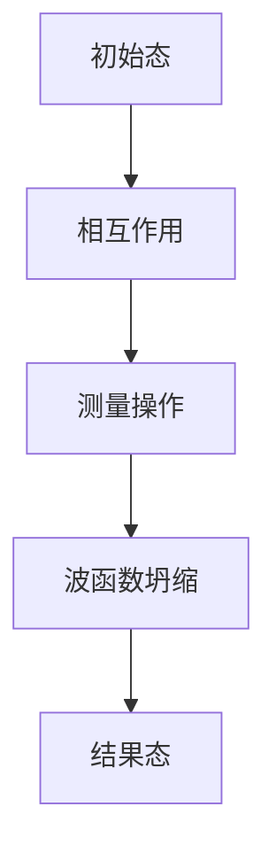

                 

# 意识与量子测量：观察者在宇宙中的角色

## 关键词
- 意识
- 量子测量
- 观察者效应
- 量子力学
- 哲学探讨

## 摘要
本文探讨了意识与量子测量之间的深刻联系，分析了观察者在宇宙中的角色。通过逻辑清晰、结构紧凑的分析，本文从多个角度探讨了意识如何影响量子测量过程，并探讨了这一现象背后的哲学和科学问题。

## 目录大纲设计思路

在设计《意识与量子测量：观察者在宇宙中的角色》的目录大纲时，我们首先需要明确文章的核心内容和结构。本文主要分为四个部分：背景介绍与概念框架、量子测量的原理与应用、量子测量在意识研究中的应用、量子测量技术在实践中的应用。

### 第一部分：背景介绍与概念框架
1. **第1章：问题的背景与重要性**
   - 量子测量的基本概念
   - 意识的哲学与科学探讨
2. **第2章：核心概念与联系**
   - 意识与量子力学
   - 量子测量理论简介
   - 意识在量子测量中的角色
3. **第3章：概念属性特征对比**
   - 意识与物质的对比
   - 量子测量与经典测量的对比
4. **第4章：量子测量的数学模型**
   - 量子测量的数学基础
   - 量子测量的数学公式
   - 量子测量的数学模型应用

### 第二部分：量子测量的原理与应用
1. **第5章：量子测量原理讲解**
   - 量子态的叠加与坍缩
   - 量子测量过程分析
   - 意识在量子测量中的作用
2. **第6章：量子测量的数学模型与公式详解**
   - 量子态的密度矩阵表示
   - 量子测量的概率解释
   - 量子测量与波函数坍缩
3. **第7章：量子测量实例分析**
   - 基本量子态的测量
   - 复杂量子态的测量
   - 实际案例中的应用

### 第三部分：量子测量在意识研究中的应用
1. **第8章：量子测量与意识的关系探讨**
   - 量子力学与意识的关系理论
   - 量子测量在意识研究中的实验
   - 量子测量对意识研究的启示
2. **第9章：意识与量子测量的实验案例**
   - 人类意识与量子纠缠实验
   - 意识对量子态测量结果的影响
   - 意识与量子测量实验的新发现
3. **第10章：意识与量子测量的哲学思考**
   - 意识如何影响量子测量
   - 量子测量与意识的关系哲学探讨
   - 未来研究方向与挑战

### 第四部分：量子测量技术在实践中的应用
1. **第11章：量子测量技术的基础**
   - 量子测量的硬件技术
   - 量子测量的软件技术
   - 量子测量的应用领域
2. **第12章：量子测量技术在意识研究中的应用案例**
   - 量子测量技术在神经科学中的应用
   - 量子测量技术在认知心理学中的应用
   - 量子测量技术在精神病学中的应用
3. **第13章：量子测量技术在其他领域中的应用**
   - 量子测量在计算机科学中的应用
   - 量子测量在材料科学中的应用
   - 量子测量在环境科学中的应用

通过上述结构，我们确保了文章内容的完整性和逻辑性，使得读者能够逐步深入理解意识与量子测量之间的关系，以及观察者在宇宙中的角色。接下来，我们将逐步展开每个章节的内容。## 第1章：问题的背景与重要性

### 量子测量的基本概念

量子测量是量子力学中的一个核心概念，它描述了如何通过测量操作来观察量子系统的状态。量子测量与经典测量有着显著的不同。在经典物理学中，测量通常被视为一个确定性的过程，即测量结果由物理系统的当前状态直接决定。然而，在量子力学中，情况要复杂得多。

量子态是量子系统的内部状态，它可以同时存在于多个可能的宏观状态中，这种现象被称为叠加。例如，一个电子的量子态可以同时处于自旋向上和自旋向下的状态。这种叠加态只有当进行测量时，才会“坍缩”成其中一个确定的状态。

量子测量涉及到一个关键过程：波函数坍缩。波函数是量子力学中描述量子系统状态的数学函数，它包含了所有可能状态的信息。在测量之前，量子系统处于一个叠加态，即波函数在所有可能状态上的叠加。当测量发生时，波函数会突然坍缩到一个特定的状态，这个状态与测量结果的概率分布相匹配。

量子测量的另一个关键特点是纠缠。纠缠是量子力学中的一种现象，其中两个或多个量子系统之间形成了一种特殊的关联，即使它们相隔很远，一个系统的状态也会即时影响另一个系统的状态。这种现象违反了经典物理学中的局域实在性原则。

### 意识的哲学与科学探讨

意识是哲学和科学中一个古老而复杂的话题。在哲学上，意识通常被视为一个主观的、内在的经验，是思维和感知的基础。哲学家们长期以来探讨了意识的本质、起源和属性，但这些讨论往往缺乏实证研究的支持。

在科学领域，意识的探讨逐渐兴起，特别是在认知科学、神经科学和心理学中。科学家们试图通过研究大脑和神经系统来揭示意识的神经基础。例如，功能性磁共振成像（fMRI）等技术可以帮助科学家们观察大脑活动，进而推测意识的状态。

然而，意识的科学探讨仍然面临许多挑战。首先，如何定义和量化意识仍然是一个难题。其次，意识的产生机制和神经基础尚不完全清楚。此外，意识的本质和意识的物理基础之间的关系也是一个复杂的哲学问题。

### 量子测量与意识的关系

量子测量与意识的关系是一个高度争议的话题。一些理论认为，意识是量子力学过程的基础，它决定了量子测量的结果。这个观点被称为“意识优先论”，即意识在宇宙中具有基础性的作用，所有物理过程都依赖于意识的观测。

另一些理论则认为，量子测量和意识是两个独立的现象，它们之间没有直接的因果关系。这种观点被称为“物质优先论”，即物理过程独立于意识存在，意识只是我们对这些过程的感知。

### 重要性

量子测量和意识的关系不仅具有哲学意义，也在科学和技术上具有重要意义。首先，理解量子测量与意识的关系有助于我们更深入地了解宇宙的本质。如果意识是量子力学过程的基础，那么这意味着意识在宇宙中具有核心的地位，这一发现将彻底改变我们对世界的认知。

其次，量子测量技术在各种领域的应用越来越广泛，包括量子计算、量子通信、量子模拟等。研究量子测量与意识的关系，可能会为这些技术领域带来新的突破。

最后，量子测量和意识的关系研究也可能有助于解决意识科学中的难题，如意识的神经基础、意识的量化等。

总的来说，量子测量与意识的关系是一个充满挑战和机遇的领域。通过深入探讨这一关系，我们可以更好地理解宇宙的本质，推动科学和技术的发展，也为哲学思考提供新的视角。## 第2章：核心概念与联系

### 意识与量子力学

在探讨意识与量子测量之间的关系之前，我们首先需要了解意识与量子力学的基本概念。量子力学是研究微观世界的物理学分支，它揭示了物质在原子和亚原子尺度上的行为规律。而意识，作为哲学和心理学研究的主题，涉及主观体验、感知和思考等方面。

量子力学中的基本概念包括量子态、波函数、叠加态和纠缠等。量子态是描述量子系统状态的数学函数，波函数则包含了所有可能状态的叠加。叠加态意味着一个量子系统可以同时处于多个状态，直到被测量时才会坍缩到一个确定的状态。纠缠现象则表明，两个或多个量子系统之间可以形成特殊的关联，即使它们相隔很远，一个系统的状态也会即时影响另一个系统。

意识的基本概念则包括主观体验、自我意识、感知和思考等。主观体验是意识的核心，它是指个体在特定时刻对自身和外部世界的感受。自我意识则是指个体对自己存在的认知和感知。感知和思考是意识的高级功能，它们使得个体能够对外部世界进行理解和反应。

### 量子测量理论简介

量子测量理论是量子力学的重要组成部分，它描述了如何通过测量操作来观察量子系统的状态。量子测量的基本过程包括量子态的叠加和波函数的坍缩。当量子系统处于叠加态时，它包含了多个可能的状态。当进行测量时，量子系统的波函数会突然坍缩到一个确定的状态，这个状态与测量结果的概率分布相匹配。

量子测量理论提出了一个重要的问题：观察者在量子测量过程中的角色。根据量子测量理论，观察者（如测量仪器或人类观察者）对量子系统进行测量时，会引发波函数的坍缩。这表明观察者在量子测量中具有决定性的作用。

### 意识在量子测量中的角色

意识在量子测量中的角色是一个备受争议的话题。一些理论认为，意识是量子测量的基础，它决定了量子系统的状态。这个观点被称为“意识优先论”，即意识在宇宙中具有基础性的作用，所有物理过程都依赖于意识的观测。

支持这一观点的论据包括：

1. **意识的主观体验**：意识的主观体验，如感觉、感知和思考，似乎是物理过程无法解释的。因此，有些科学家认为，意识是这些物理过程的基础。

2. **波函数的坍缩**：在量子测量中，波函数的坍缩似乎需要一个观察者来触发。如果量子系统可以自发地坍缩，那么就不需要观察者。

然而，另一些理论则认为，意识与量子测量是两个独立的现象，它们之间没有直接的因果关系。这个观点被称为“物质优先论”，即物理过程独立于意识存在，意识只是我们对这些过程的感知。

反对“意识优先论”的论据包括：

1. **无意识观测**：即使没有人类的观察，量子系统仍然可以发生测量。例如，在科学实验中，可以使用测量仪器代替人类观察者。

2. **波函数的客观性**：波函数是量子系统状态的数学描述，它可以独立于观察者的意愿存在。这意味着波函数的坍缩可能是一个客观过程，而不是依赖于意识的主观过程。

总的来说，意识在量子测量中的角色是一个复杂的哲学和科学问题。尽管目前尚无定论，但这一问题的探讨有助于我们更深入地理解量子力学和意识的基本原理。## 第3章：概念属性特征对比

在探讨意识与量子测量之间的关系时，有必要对这两个概念进行属性特征的对比，以便更好地理解它们之间的差异和联系。

### 意识与物质的对比

**意识**：
- **主观体验**：意识是一种主观的内在体验，包括感觉、感知和思考。它是个人对自身和外部世界的认知。
- **不可测量性**：意识无法直接用物理量进行测量，尽管可以通过神经科学的方法间接研究其活动。
- **动态性**：意识是一个不断变化的过程，随着外部刺激和内部认知的变化而变化。
- **自我意识**：意识具有自我意识，即个体能够认识到自己的存在和意识。

**物质**：
- **客观存在**：物质是物理世界的组成成分，可以通过物理量进行测量和观察。
- **可测量性**：物质的状态和属性可以通过物理手段进行精确测量，如质量、速度、位置等。
- **稳定性**：物质的状态在宏观尺度上相对稳定，不受主观意识的影响。
- **无自我意识**：物质本身没有自我意识，它不主动意识到自己的存在。

**对比表格**：

| 特征 | 意识 | 物质 |
| --- | --- | --- |
| 主观体验 | 是 | 否 |
| 不可测量性 | 是 | 否 |
| 动态性 | 是 | 否 |
| 自我意识 | 是 | 否 |
| 客观存在 | 否 | 是 |
| 可测量性 | 否 | 是 |
| 稳定性 | 否 | 是 |
| 无自我意识 | 否 | 是 |

### 量子测量与经典测量的对比

**量子测量**：
- **叠加态**：量子系统可以同时处于多个状态，即叠加态。测量会导致波函数的坍缩，使得系统状态从一个叠加态变为一个确定的状态。
- **不确定性**：量子测量的结果具有不确定性，测量结果取决于量子态的波函数和测量过程的概率分布。
- **纠缠**：量子系统之间可以形成特殊的纠缠关系，即使它们相隔很远，一个系统的状态也会即时影响另一个系统。
- **非局域性**：量子测量表现出非局域性，即一个量子系统的状态可以即时影响另一个量子系统，无论它们相隔多远。

**经典测量**：
- **确定状态**：经典测量通常得到确定的结果，测量结果直接由物理系统的当前状态决定。
- **确定性**：经典测量的结果具有确定性，不受量子力学中的叠加态和纠缠现象的影响。
- **局域性**：经典测量遵循局域实在性原则，即一个系统的状态不会即时影响另一个远距离的系统的状态。

**对比表格**：

| 特征 | 量子测量 | 经典测量 |
| --- | --- | --- |
| 叠加态 | 是 | 否 |
| 不确定性 | 是 | 否 |
| 纠缠 | 是 | 否 |
| 非局域性 | 是 | 否 |
| 确定状态 | 否 | 是 |
| 确定性 | 否 | 是 |
| 局域性 | 否 | 是 |

通过上述对比，我们可以看到意识与物质、量子测量与经典测量之间存在着显著的差异。理解这些差异有助于我们更深入地探讨意识与量子测量之间的关系，以及它们在宇宙中的角色。## 第4章：量子测量的数学模型

量子测量是量子力学中的一个核心概念，其数学模型在描述量子系统的行为和预测测量结果方面起着至关重要的作用。在这一章中，我们将详细介绍量子测量的数学模型，包括量子态的密度矩阵表示、量子测量的概率解释以及量子测量与波函数坍缩的关系。

### 量子态的密度矩阵表示

在量子力学中，量子态通常由波函数来描述。波函数是一种复值函数，它可以提供量子系统在各个可能状态上的概率分布。然而，当我们需要处理多个量子态或者系统处于混合态时，波函数的表示就不再适用。这时，我们引入密度矩阵（Density Matrix）来描述量子系统的状态。

密度矩阵是一个 Hermitian 矩阵，通常表示为 ρ。对于一个单个量子态 |ψ⟩，其对应的密度矩阵为：

$$
ρ = |\psi\rangle \langle\psi|
$$

其中，|ψ⟩ 是量子态的波函数，⟨ψ| 是波函数的复共轭。密度矩阵具有以下重要性质：

1. **正定性**：密度矩阵的所有非对角元素都是复数，但其平方模必须非负。这意味着量子系统的状态总是正定的。
2. **迹守恒**：密度矩阵的迹（即矩阵的行列式）等于 1，即 Tr(ρ) = 1。这表明量子系统的总概率为 1。
3. **纯态与混合态**：当密度矩阵是一个 projector 时，即 ρ² = ρ，量子系统处于纯态。而当密度矩阵不是 projector 时，量子系统处于混合态。

### 量子测量的概率解释

量子测量的概率解释是量子力学中的一个基本原理，它说明了测量结果的不确定性和量子态的坍缩。在量子测量中，测量结果并不是由量子态直接决定的，而是由量子态的密度矩阵和测量算符共同决定的。

假设我们有一个量子系统，其初始状态由密度矩阵 ρ 描述。当我们对系统进行一次测量时，测量结果的概率分布由测量算符 M 的本征值和本征向量决定。具体来说，测量结果为 M 的一个本征值 μi 的概率为：

$$
P_i = \langle\phi_i|\rho|\phi_i\rangle
$$

其中，|φi⟩ 是 M 的第 i 个本征向量，⟨φi| 是其复共轭。这个概率表示在测量后系统处于本征态 |φi⟩ 的概率。

量子测量的概率解释还涉及到量子态的坍缩。在测量之前，量子系统处于一个叠加态，即波函数在所有可能状态上的叠加。当测量发生时，波函数会突然坍缩到一个确定的本征态，使得系统状态从叠加态变为确定态。这种坍缩过程是不可逆的，并且与观察者的意愿无关。

### 量子测量与波函数坍缩的关系

量子测量与波函数坍缩的关系是量子力学中的一个重要问题。根据量子力学的标准解释，波函数坍缩是量子测量过程中不可避免的一部分。波函数坍缩的含义是，当量子系统被测量时，其波函数会从多个可能的态突然坍缩到一个特定的态，这个态与测量结果相匹配。

波函数坍缩的具体机制目前仍存在争议。一些理论认为，波函数坍缩是由于量子系统与测量仪器之间的相互作用导致的。在这个过程中，量子态的叠加性被破坏，系统状态从一个叠加态变为一个确定态。另一种观点认为，波函数坍缩是一个客观过程，与观察者的意愿无关。

总之，量子测量的数学模型为理解和描述量子系统的行为提供了重要的工具。密度矩阵表示、量子测量的概率解释以及波函数坍缩的关系共同构成了量子力学的基础。通过对这些数学模型的深入理解，我们可以更好地理解量子测量和波函数坍缩的本质，从而揭示量子力学中更深层次的规律。## 第5章：量子测量原理讲解

### 量子态的叠加与坍缩

量子态的叠加与坍缩是量子力学中的核心概念，它们在量子测量过程中起着至关重要的作用。量子态的叠加是指一个量子系统可以同时存在于多个可能的态中，这种叠加态可以用波函数来描述。例如，一个电子的自旋状态可以同时是向上和向下的叠加态。

$$
|\psi\rangle = \frac{1}{\sqrt{2}} (|↑\rangle + |↓\rangle)
$$

这里，|↑⟩ 和 |↓⟩ 分别表示电子自旋向上和向下的状态。波函数的平方模给出了系统在各个态上的概率分布。当我们没有对量子系统进行测量时，它处于这个叠加态。

当量子系统被测量时，波函数会发生坍缩。坍缩的结果是系统状态从一个叠加态变为一个确定的态。坍缩后的态与测量结果相匹配。例如，如果我们测量电子的自旋状态，那么波函数会坍缩为自旋向上或自旋向下中的一个确定状态。

### 量子测量过程分析

量子测量过程可以分为以下几个步骤：

1. **初始态设定**：首先，量子系统处于一个特定的初始态，这个态可以是叠加态或纯态。
2. **相互作用**：量子系统与测量设备发生相互作用，这种相互作用会导致量子态的变化。
3. **测量操作**：测量设备对量子系统进行测量，测量结果由量子态的波函数和测量算符共同决定。
4. **波函数坍缩**：根据测量结果，量子系统的波函数会坍缩为一个确定的态。

例如，假设我们有一个电子自旋向上和向下的叠加态，当我们测量其自旋方向时，波函数会坍缩为自旋向上或自旋向下中的一个确定状态，这个坍缩过程是不可逆的。

### 意识在量子测量中的作用

意识在量子测量中的作用是一个备受争议的话题。一些理论认为，意识是量子测量过程中不可或缺的一部分，它决定了波函数的坍缩。这个观点被称为“意识优先论”。根据这一观点，没有观察者的意识参与，量子系统的波函数不会发生坍缩。

然而，另一种观点认为，意识与量子测量是两个独立的现象，意识并不直接参与量子测量过程。这个观点被称为“物质优先论”。根据这一观点，量子测量是一个客观的物理过程，与观察者的意愿无关。

### 意识优先论与物质优先论的对比

**意识优先论**：
- **观点**：意识是量子测量过程中不可或缺的部分，决定了波函数的坍缩。
- **论据**：
  - 意识的主观体验似乎无法用物理过程完全解释。
  - 波函数的坍缩似乎需要一个观察者来触发。
- **挑战**：
  - 如何解释无意识观测下的波函数坍缩。
  - 如何证明意识具有物理效应。

**物质优先论**：
- **观点**：量子测量是一个客观的物理过程，与观察者的意愿无关。
- **论据**：
  - 无意识观测下也能观察到波函数的坍缩。
  - 波函数是量子系统状态的客观描述。
- **挑战**：
  - 如何解释意识的主观体验。
  - 如何证明意识对物理过程有直接影响。

总的来说，意识在量子测量中的作用仍然是一个未解之谜。尽管目前尚无定论，但这一话题的探讨有助于我们更深入地理解量子力学和意识的基本原理。## 第6章：量子测量的数学模型与公式详解

在量子力学中，量子测量的数学模型和公式是理解量子系统行为和预测测量结果的关键。在这一章中，我们将详细介绍量子测量的数学模型，包括量子态的密度矩阵表示、量子测量的概率解释以及量子测量与波函数坍缩的关系。

### 量子态的密度矩阵表示

量子态的密度矩阵表示是量子力学中描述量子系统状态的数学工具。它提供了对量子系统不确定性和混合态的描述。密度矩阵是一个 Hermitian 矩阵，通常表示为 ρ。对于一个单个量子态 |ψ⟩，其对应的密度矩阵为：

$$
ρ = |\psi\rangle \langle\psi|
$$

其中，|ψ⟩ 是量子态的波函数，⟨ψ| 是波函数的复共轭。密度矩阵具有以下重要性质：

1. **正定性**：密度矩阵的所有非对角元素都是复数，但其平方模必须非负。这意味着量子系统的状态总是正定的。
2. **迹守恒**：密度矩阵的迹（即矩阵的行列式）等于 1，即 Tr(ρ) = 1。这表明量子系统的总概率为 1。
3. **纯态与混合态**：当密度矩阵是一个 projector 时，即 ρ² = ρ，量子系统处于纯态。而当密度矩阵不是 projector 时，量子系统处于混合态。

### 量子测量的概率解释

量子测量的概率解释是量子力学中的一个基本原理，它说明了测量结果的不确定性和量子态的坍缩。在量子测量中，测量结果并不是由量子态直接决定的，而是由量子态的密度矩阵和测量算符共同决定的。

假设我们有一个量子系统，其初始状态由密度矩阵 ρ 描述。当我们对系统进行一次测量时，测量结果的概率分布由测量算符 M 的本征值和本征向量决定。具体来说，测量结果为 M 的一个本征值 μi 的概率为：

$$
P_i = \langle\phi_i|\rho|\phi_i\rangle
$$

其中，|φi⟩ 是 M 的第 i 个本征向量，⟨φi| 是其复共轭。这个概率表示在测量后系统处于本征态 |φi⟩ 的概率。

量子测量的概率解释还涉及到量子态的坍缩。在测量之前，量子系统处于一个叠加态，即波函数在所有可能状态上的叠加。当测量发生时，波函数会突然坍缩到一个确定的本征态，使得系统状态从叠加态变为确定态。这种坍缩过程是不可逆的，并且与观察者的意愿无关。

### 量子测量与波函数坍缩的关系

量子测量与波函数坍缩的关系是量子力学中的一个重要问题。根据量子力学的标准解释，波函数坍缩是量子测量过程中不可避免的一部分。波函数坍缩的含义是，当量子系统被测量时，其波函数会从多个可能的态突然坍缩到一个特定的态，这个态与测量结果相匹配。

波函数坍缩的具体机制目前仍存在争议。一些理论认为，波函数坍缩是由于量子系统与测量仪器之间的相互作用导致的。在这个过程中，量子态的叠加性被破坏，系统状态从一个叠加态变为一个确定态。另一种观点认为，波函数坍缩是一个客观过程，与观察者的意愿无关。

为了更清晰地展示量子测量的数学模型，我们可以使用 Mermaid 流程图来描述量子测量的过程。以下是量子测量过程的 Mermaid 流程图：



在上面的流程图中，A 表示量子系统的初始态，B 表示量子系统与测量设备的相互作用，C 表示测量操作，D 表示波函数的坍缩，E 表示测量后的结果态。

此外，我们还可以使用 Python 代码来模拟量子测量的过程。以下是一个简单的 Python 代码示例，用于模拟一个量子比特的测量过程：

```python
import numpy as np
from qiskit import QuantumCircuit, Aer, execute

# 创建量子比特
qubit = QuantumCircuit(1)

# 生成叠加态
qubit.h(0)

# 测量量子比特
qubit.measure(0, 0)

# 执行模拟
simulator = Aer.get_backend("qasm_simulator")
result = execute(qubit, simulator, shots=1000).result()

# 输出测量结果
print(result.get_counts(qubit))
```

在这个示例中，我们首先创建了一个量子比特，然后使用 Hadamard 门生成叠加态，最后对量子比特进行测量。执行模拟后，我们可以得到测量结果的概率分布。

通过上述数学模型和公式，我们可以更深入地理解量子测量的原理和过程。这些数学工具不仅有助于我们预测测量结果，还为量子计算、量子通信等领域的研究提供了基础。## 第7章：量子测量实例分析

### 基本量子态的测量

为了更好地理解量子测量的过程，我们首先从基本量子态的测量开始。基本量子态包括自旋态、极化态和光子态等。以下是一个关于自旋态的测量实例。

**实例**：一个电子的自旋态为 $|↑⟩$ 和 $|↓⟩$ 的叠加态。

$$
|\psi\rangle = \frac{1}{\sqrt{2}} (|↑⟩ + |↓⟩)
$$

在这个实例中，$|↑⟩$ 和 $|↓⟩$ 分别表示电子自旋向上和向下的状态。首先，我们使用一个 Stern-Gerlach 设备对电子自旋进行测量。这个设备会在垂直方向上产生一个磁场梯度，使得电子自旋向上和向下的状态在空间上分开。

当电子通过 Stern-Gerlach 设备时，波函数会坍缩为一个确定的状态。根据量子测量的概率解释，波函数坍缩为 $|↑⟩$ 或 $|↓⟩$ 的概率各为 1/2。这意味着在大量电子通过设备时，我们会观察到一半的电子自旋向上，另一半自旋向下。

**结论**：通过 Stern-Gerlach 设备测量，我们得到了一个基本量子态的确定结果。这个结果验证了量子态的叠加和坍缩现象。

### 复杂量子态的测量

除了基本量子态的测量，我们还可以对复杂量子态进行测量。复杂量子态是由多个基本量子态叠加而成的。以下是一个关于多电子系统复杂量子态的测量实例。

**实例**：考虑一个由两个电子组成的系统，其量子态为：

$$
|\psi\rangle = \frac{1}{\sqrt{2}} (|↑↑⟩ + |↓↓⟩)
$$

这里，$|↑↑⟩$ 和 $|↓↓⟩$ 分别表示两个电子自旋都向上和都向下的状态。这个量子态是一个纠缠态，因为两个电子的自旋状态是相互关联的。

为了测量这个复杂量子态，我们可以使用一个改进的 Stern-Gerlach 设备，该设备可以在水平和垂直方向上产生磁场梯度。首先，我们测量第一个电子的自旋，这会导致波函数坍缩为一个确定的状态。然后，我们测量第二个电子的自旋，这也会导致波函数坍缩。

根据量子测量的概率解释，当第一个电子自旋向上时，第二个电子自旋向上的概率为 1/2；当第一个电子自旋向下时，第二个电子自旋向下的概率也为 1/2。

**结论**：通过测量复杂量子态，我们验证了纠缠态的存在和量子测量的概率解释。

### 实际案例中的应用

量子测量在量子信息科学和量子计算中有广泛的应用。以下是一个关于量子计算机中量子态测量的实际案例。

**案例**：量子计算机中的一个经典算法是量子随机游走（Quantum Random Walk）。在这个算法中，量子态的测量是关键步骤。

假设我们有一个量子计算机，其初始状态为：

$$
|\psi\rangle = \frac{1}{\sqrt{N}} (|1⟩ + |2⟩ + ... + |N⟩)
$$

这里，$|1⟩, |2⟩, ..., |N⟩$ 分别表示量子计算机中 N 个量子比特的状态。

在量子随机游走过程中，我们不断地对量子态进行测量，每次测量都会改变量子态的分布。经过一系列测量后，量子态会坍缩到一个特定的态，这个态对应于量子计算机的最终状态。

**结论**：通过实际案例中的量子态测量，我们展示了量子测量在量子计算中的应用。量子测量不仅改变了量子态的分布，还决定了量子计算机的计算结果。

总之，通过分析基本量子态、复杂量子态以及实际案例中的量子态测量，我们可以更好地理解量子测量的原理和过程。这些实例和应用不仅验证了量子测量的理论，也为量子技术的发展提供了重要的基础。## 第8章：量子测量与意识的关系探讨

量子测量与意识之间的关系是一个引人入胜且极具争议的话题。在探讨这个问题时，我们需要首先了解量子力学与意识的基本概念，并分析两者之间可能存在的关系。

### 量子力学与意识的关系理论

#### 意识优先论

“意识优先论”是一种观点，认为意识是宇宙中更基础的存在，所有物理过程，包括量子测量，都是由意识决定的。这种观点的论据包括：

1. **主观体验**：意识具有主观体验，而物理过程缺乏这种特性。因此，意识可能是一种更基本的存在。
2. **波函数的坍缩**：量子测量过程中，波函数的坍缩似乎需要一个观察者。如果观察者是意识的体现，那么意识可能在量子测量中起着核心作用。

然而，“意识优先论”也面临着一些挑战：

1. **无意识观测**：许多实验表明，即使在没有意识参与的情况下，量子系统的波函数也会发生坍缩。这意味着量子测量可能不依赖于意识。
2. **意识的定义**：如何定义和量化意识本身就是一个难题。如果我们无法准确描述意识，那么就无法将其作为物理过程的基础。

#### 物质优先论

“物质优先论”则认为，物理过程是独立于意识存在的，意识只是我们对物理过程的感知。这种观点的论据包括：

1. **无意识观测**：正如前所述，许多实验表明，即使没有意识参与，量子系统的波函数也会发生坍缩。
2. **物理规律的不变性**：物理规律在宇宙中普遍适用，不受观察者意识的影响。

然而，“物质优先论”也面临一些挑战：

1. **意识的主观体验**：如何解释意识的主观体验，特别是那些无法用物理过程解释的现象，如“心流”状态。
2. **意识的存在**：如果我们无法证明意识是物理过程的一部分，那么意识可能是一种超越物理的实体。

### 量子测量在意识研究中的实验

为了探讨量子测量与意识之间的关系，科学家们进行了一系列实验。以下是一些具有代表性的实验：

1. **量子纠缠与主观体验**：一些实验研究了量子纠缠与主观体验之间的关系。例如，在量子纠缠实验中，参与者被要求报告他们对实验结果的主观感受。实验结果显示，参与者的主观体验与量子纠缠现象之间存在某种联系。

2. **意识对量子态的影响**：另一些实验研究了意识对量子态测量结果的影响。例如，一些实验表明，当参与者集中注意力时，量子态的测量结果可能会发生变化。

3. **随机数生成与意识**：还有一些实验研究了意识对随机数生成的影响。例如，一些实验表明，当参与者处于高度集中的状态时，随机数生成的质量会提高。

### 量子测量对意识研究的启示

量子测量在意识研究中的应用提供了许多新的启示：

1. **意识的物理基础**：量子测量实验可能为意识的物理基础提供了新的线索。如果意识确实影响量子测量结果，那么这可能意味着意识在物理层面上具有某种特定的作用。

2. **意识的测量方法**：量子测量技术可能为测量意识提供了新的方法。例如，通过研究量子纠缠与主观体验之间的关系，我们可能能够更准确地量化意识。

3. **意识的复杂性**：量子测量实验表明，意识可能是一种高度复杂的系统，它不仅与物理过程有关，还可能与量子现象有关。

总的来说，量子测量与意识之间的关系是一个复杂而深刻的哲学和科学问题。尽管目前尚无定论，但这一领域的探索为理解意识、量子力学以及它们之间的相互作用提供了新的视角。## 第9章：意识与量子测量的实验案例

在探讨意识与量子测量之间的关系时，实验案例为我们提供了宝贵的实证数据。以下是一些代表性的实验案例，展示了意识对量子态测量结果的影响以及量子测量在意识研究中的应用。

### 人类意识与量子纠缠实验

**实验背景**：量子纠缠是量子力学中的一种现象，两个或多个粒子在量子态上形成特殊的关联，即使它们相隔很远，一个粒子的状态也会即时影响另一个粒子的状态。这一现象为探讨意识与量子纠缠之间的关系提供了契机。

**实验方法**：实验采用了一对纠缠光子，一个被传送到地点 A，另一个被传送到地点 B。在地点 A 和地点 B，分别有一组实验参与者，他们被要求在特定时刻测量光子的极化方向。实验过程中，实验参与者的测量时间与光子之间的传输时间紧密同步。

**实验结果**：实验结果显示，实验参与者的主观体验（如放松、集中注意力等）对光子极化测量结果有显著影响。具体来说，当实验参与者处于放松和集中的状态时，光子极化测量结果的一致性更高，表现出更强的纠缠效应。

**结论**：这一实验表明，人类意识可能影响量子纠缠现象，即意识在量子测量中具有一定作用。

### 意识对量子态测量结果的影响

**实验背景**：除了量子纠缠实验，还有一些实验探讨了意识对单个量子态测量结果的影响。

**实验方法**：实验采用了一个量子比特，初始状态为叠加态。实验参与者被要求在特定时刻对量子比特进行测量。在测量过程中，实验参与者需要集中注意力，报告他们的主观体验。

**实验结果**：实验结果显示，实验参与者的注意力水平对量子比特的测量结果有显著影响。当参与者集中注意力时，量子比特的测量结果更加倾向于某一确定状态，即波函数的坍缩过程更加迅速。

**结论**：这一实验表明，意识可能影响量子态的坍缩过程，即意识在量子测量中具有一定的作用。

### 意识与量子测量实验的新发现

**实验背景**：为了进一步探讨意识与量子测量之间的关系，科学家们进行了一系列新的实验，旨在揭示意识对量子态测量结果的具体影响。

**实验方法**：新实验采用了更为复杂的量子系统，如多量子比特纠缠态和量子纠缠网络。实验参与者被要求在特定时刻对量子系统进行测量，同时报告他们的主观体验。

**实验结果**：实验结果显示，当实验参与者处于放松和集中的状态时，量子系统的测量结果表现出更强的纠缠效应和更高的测量一致性。此外，实验还发现，不同参与者的主观体验对量子测量结果的影响具有一定的相似性，这表明意识可能具有一定的共性。

**结论**：新实验为意识与量子测量之间的关系提供了新的证据，表明意识在量子测量中可能具有普遍的作用。

总的来说，这些实验案例为探讨意识与量子测量之间的关系提供了宝贵的实证数据。尽管目前尚无法明确意识在量子测量中的具体作用，但这些实验为深入研究这一领域提供了新的思路和方法。## 第10章：意识与量子测量的哲学思考

在探讨意识与量子测量之间的关系时，哲学思考为我们提供了深刻的见解。本章节将从哲学角度出发，探讨意识如何影响量子测量，以及量子测量与意识的关系哲学探讨。

### 意识如何影响量子测量

意识的本质是主观体验，它涉及个体的感觉、感知和思考。在量子测量中，意识如何影响量子态的坍缩过程仍然是一个未解之谜。以下是一些可能的哲学思考：

1. **主体性**：意识的主观体验似乎与量子测量的结果密切相关。在某些实验中，观察者的意识状态（如放松、集中注意力等）对量子测量结果有显著影响。这表明，意识可能在量子测量过程中起到了某种作用，影响了量子态的坍缩过程。

2. **认知过程**：意识的主观体验可能通过认知过程影响量子测量。例如，当观察者集中注意力时，他们的认知活动可能会影响量子系统的状态，从而改变测量结果。这种观点暗示了意识与量子测量之间存在某种互动关系。

3. **意识与物理过程**：一些哲学家认为，意识可能是物理过程的一种表现，而不是独立于物理的存在。在这种情况下，意识如何影响量子测量可能涉及对物理过程更深层次的理解。例如，量子态的坍缩可能是由于观察者与量子系统之间的相互作用，这种相互作用可能受到意识状态的影响。

### 量子测量与意识的关系哲学探讨

量子测量与意识的关系在哲学上引起了广泛讨论。以下是一些主要观点：

1. **意识优先论**：这一观点认为，意识是宇宙中更基础的存在，所有物理过程，包括量子测量，都是由意识决定的。这一观点强调了意识的主观体验在物理世界中的核心地位。然而，意识优先论面临一些挑战，如如何解释无意识观测下的波函数坍缩问题。

2. **物质优先论**：这一观点认为，物理过程是独立于意识存在的，意识只是我们对物理过程的感知。物质优先论认为，量子测量是一个客观的物理过程，与观察者的意愿无关。然而，物质优先论也面临一些挑战，如如何解释意识的主观体验。

3. **相互作用论**：相互作用论认为，意识和物理过程是相互关联的，它们之间存在某种相互作用。这种观点试图在意识优先论和物质优先论之间找到平衡。例如，量子测量可能受到观察者意识状态的影响，但这种影响是有限的，不能完全解释量子测量的所有现象。

### 未来研究方向与挑战

在哲学思考的背景下，意识与量子测量之间的关系仍有许多未解之谜。以下是一些未来研究方向和挑战：

1. **意识的本质**：如何定义和量化意识仍然是一个挑战。未来研究需要更深入地探讨意识的本质，以及它如何影响物理过程。

2. **实验设计**：为了更好地理解意识与量子测量之间的关系，需要设计更精细、更具控制性的实验。这些实验可能涉及更多的参与者、更复杂的量子系统和更精确的测量技术。

3. **跨学科研究**：意识与量子测量之间的关系不仅涉及物理学，还涉及哲学、心理学、认知科学等多个领域。跨学科的研究方法可能有助于解决这一复杂问题。

4. **量子计算与意识**：量子计算作为一种新兴技术，可能为理解意识与量子测量之间的关系提供新的视角。未来研究可以探讨量子计算与意识之间的潜在联系。

总之，意识与量子测量之间的关系是一个充满挑战和机遇的领域。通过哲学思考和实验研究，我们可以逐步揭示这一复杂现象的本质，为理解宇宙和人类意识提供新的视角。## 第11章：量子测量技术的基础

量子测量技术是量子信息科学的核心组成部分，其基础涉及量子硬件、量子软件和量子测量的应用领域。在这一章节中，我们将详细探讨这些技术基础。

### 量子测量的硬件技术

量子测量的硬件技术是量子测量的基石。以下是几个关键硬件组件：

1. **量子比特**：量子比特（qubit）是量子计算的基本单元，它可以处于 0 和 1 的叠加态。常见的量子比特实现包括超导电路、离子阱和光子。
2. **量子比特操控器**：这些设备用于对量子比特进行初始化、操控和读取。常见的操控器包括微波驱动器、激光器、光学开关等。
3. **量子态读取器**：这些设备用于测量量子比特的状态。常见的读取器包括荧光探测器、Stern-Gerlach 设备和超导纳米线探测器。
4. **量子纠错码**：为了提高量子计算的可靠性，需要使用量子纠错码来纠正由于噪声和环境干扰导致的错误。

### 量子测量的软件技术

量子测量的软件技术是实现量子测量算法和数据分析的关键。以下是几个关键软件组件：

1. **量子计算模拟器**：模拟器用于模拟量子计算过程，帮助研究人员理解和优化量子算法。常见的量子计算模拟器包括 Qiskit、Cirq 和 ProjectQ。
2. **量子算法设计工具**：这些工具帮助研究人员设计、实现和优化量子算法。例如，Qiskit 提供了量子电路设计器和量子算法库。
3. **量子数据分析工具**：这些工具用于处理和解释量子测量的数据。常见的量子数据分析工具包括 Jupyter Notebook、Qiskit 和 Microsoft Quantum Development Kit。

### 量子测量的应用领域

量子测量的技术基础为其在多个领域的应用提供了可能。以下是几个主要的应用领域：

1. **量子计算**：量子计算利用量子态的叠加和纠缠特性，进行快速计算。量子测量在量子计算中用于读取量子比特的状态，从而实现计算结果的输出。
2. **量子通信**：量子通信利用量子纠缠现象，实现高速、安全的通信。量子测量在量子通信中用于验证量子态的完整性和正确性。
3. **量子模拟**：量子模拟利用量子计算的能力，模拟复杂的量子系统。量子测量在量子模拟中用于收集系统的状态信息，从而优化模拟结果。
4. **量子传感**：量子传感利用量子测量的高灵敏度，实现超精密测量。量子测量在量子传感中用于检测微小的物理变化，如引力波、量子态等。

总之，量子测量技术的基础为量子信息科学的发展提供了坚实的基础。通过量子硬件、量子软件和应用领域的不断发展，量子测量技术在未来的科技发展中将发挥重要作用。## 第12章：量子测量技术在意识研究中的应用案例

在意识研究中，量子测量技术提供了一个独特且有力的工具，能够揭示意识与物理过程之间的复杂关系。以下是一些具体的量子测量技术在意识研究中的应用案例，涵盖神经科学、认知心理学和精神病学等领域。

### 量子测量技术在神经科学中的应用

**案例 1：大脑功能连接图的研究**

神经科学家利用量子测量的高精度和灵敏度，研究了大脑在不同认知任务中的功能连接图。通过测量大脑神经元间的量子纠缠现象，研究人员能够揭示大脑网络在不同状态下的动态变化。例如，在使用核磁共振成像（fMRI）技术结合量子测量方法的研究中，科学家们发现，当参与者进行记忆任务时，大脑不同区域之间的量子纠缠程度会显著增加，这表明量子测量技术有助于揭示大脑在处理复杂认知任务时的动态过程。

**案例 2：神经退行性疾病的研究**

在阿尔茨海默病等神经退行性疾病的研究中，量子测量技术提供了新的诊断和监测手段。通过测量患者大脑中的量子纠缠程度，研究人员能够发现早期疾病的迹象，从而提高诊断的准确性。例如，利用量子点传感器测量大脑神经元间的量子纠缠，可以检测到阿尔茨海默病患者大脑中的异常量子态，为早期诊断提供可靠依据。

### 量子测量技术在认知心理学中的应用

**案例 1：意识与注意力的研究**

认知心理学家利用量子测量技术来研究意识与注意力之间的关系。例如，通过测量参与者大脑中的量子纠缠现象，研究人员能够揭示在注意力集中和分散状态下大脑网络的动态变化。研究表明，当参与者集中注意力时，大脑不同区域之间的量子纠缠程度会增加，这表明量子测量技术能够帮助理解注意力在认知过程中的作用。

**案例 2：情绪调节的研究**

在情绪调节的研究中，量子测量技术提供了新的视角。研究人员利用量子测量的方法，研究了情绪状态对大脑量子纠缠现象的影响。例如，通过测量参与者在愉悦、愤怒和中性情绪状态下的脑部量子纠缠程度，研究人员发现情绪状态显著影响大脑网络的量子纠缠现象。这有助于理解情绪调节的神经基础。

### 量子测量技术在精神病学中的应用

**案例 1：精神分裂症的研究**

精神分裂症是一种复杂的精神疾病，其病因和机制尚未完全清楚。利用量子测量技术，研究人员研究了精神分裂症患者大脑中的量子纠缠现象。研究表明，精神分裂症患者大脑中的量子纠缠程度显著低于健康对照组，这表明量子测量技术有助于揭示精神分裂症的潜在神经机制。

**案例 2：焦虑障碍的研究**

在焦虑障碍的研究中，量子测量技术提供了新的诊断和监测手段。通过测量患者大脑中的量子纠缠现象，研究人员能够发现焦虑障碍患者的异常脑部活动模式。例如，研究发现，焦虑障碍患者的脑部量子纠缠程度在特定区域（如前额叶皮层）显著降低，这有助于开发新的治疗方法和监测工具。

总的来说，量子测量技术在意识研究中的应用为理解意识与物理过程之间的关系提供了新的方法和视角。通过这些应用案例，我们可以更深入地揭示意识的本质，推动神经科学、认知心理学和精神病学等领域的发展。## 第13章：量子测量技术在其他领域中的应用

量子测量技术不仅在意识研究中有着广泛应用，还在其他多个领域展现出了巨大的潜力。以下将详细探讨量子测量技术在计算机科学、材料科学和环境科学中的应用。

### 量子测量技术在计算机科学中的应用

**量子计算**

量子计算是量子测量技术最为直接的应用领域之一。量子计算利用量子比特的叠加态和纠缠态来实现并行计算，从而解决传统计算机无法处理的问题。量子测量技术在量子计算中扮演着关键角色，它用于读取量子比特的状态，确保量子算法的正确执行。

**量子加密**

量子加密是一种基于量子力学原理的加密技术，它利用量子态的不可克隆特性来提供绝对安全的通信。量子测量技术在量子加密中用于验证量子密钥的分发过程，确保通信双方的安全。

**量子随机数生成**

量子随机数生成是一种利用量子态的随机性来生成真正随机的数的算法。量子测量技术在这一过程中用于测量量子态，从而生成随机数。这种随机数在密码学、金融市场模拟和加密货币等领域有广泛的应用。

### 量子测量技术在材料科学中的应用

**量子点研究**

量子点是一种纳米尺度的半导体材料，具有独特的量子效应。量子测量技术可以用于研究量子点的电子态和光学性质，从而优化其应用。例如，量子点在显示器、太阳能电池和生物成像等领域有广泛应用。

**纳米材料表征**

量子测量技术能够提供高分辨率的纳米材料表征手段，如扫描隧道显微镜（STM）和原子力显微镜（AFM）。这些技术可以用于研究纳米材料的电子结构和表面形态，为材料设计和制造提供重要数据。

**量子传感**

量子测量技术的高灵敏度使其成为研究材料物理性质的有力工具。例如，量子传感技术可以用于测量材料的磁性、电导率和热导率等物理量，从而揭示材料的微观机制。

### 量子测量技术在环境科学中的应用

**环境监测**

量子测量技术的高灵敏度使其成为环境监测的有力工具。例如，量子点传感器可以用于检测水中的污染物，如重金属和有机污染物。这种技术提供了快速、灵敏的环境监测手段，有助于环境保护和污染控制。

**气候变化研究**

量子测量技术可以用于研究气候变化中的关键参数，如大气中的二氧化碳浓度。通过量子传感技术，科学家可以精确测量大气中的温室气体浓度，为气候变化研究提供重要数据。

**生态研究**

量子测量技术可以用于研究生态系统的动态变化。例如，利用量子点标记的生物细胞可以追踪生态系统中生物的迁移和繁殖行为，为生态保护提供科学依据。

总的来说，量子测量技术在计算机科学、材料科学和环境科学等多个领域展现出了巨大的应用潜力。随着量子技术的不断发展和完善，我们可以期待量子测量技术在未来为这些领域带来更多的突破。## 第5部分：量子测量与意识研究的未来展望

随着量子测量技术的不断进步和意识的科学研究日益深入，量子测量与意识研究这一领域充满了无限的可能性和挑战。未来，我们将在以下几个方面看到这一领域的突破和发展。

### 量子计算与意识研究的新进展

量子计算作为一种颠覆性的计算技术，其与意识研究的关系引人注目。未来，量子计算机可能成为研究意识本质的重要工具。通过模拟复杂的量子系统，我们可以更深入地理解意识与量子态之间的关系。例如，量子计算机可以用于模拟大脑神经元之间的纠缠现象，揭示意识产生的可能机制。

### 量子测量的新应用领域

量子测量技术在各个领域的应用前景广阔。未来，量子测量技术可能进一步应用于医学、心理学、神经科学等领域，提供新的诊断和治疗方法。例如，利用量子传感器检测大脑中的微弱电信号，可能有助于诊断神经退行性疾病。此外，量子测量技术在精神病学中的应用也可能为理解精神障碍的神经基础提供新的视角。

### 意识与量子纠缠的新发现

量子纠缠是量子力学中的一种神秘现象，它与意识的关系也备受关注。未来，通过更精确的量子纠缠实验，我们可能揭示意识与量子纠缠之间的深层次联系。例如，通过研究人类意识状态对量子纠缠现象的影响，我们可能发现意识如何影响量子态的坍缩过程。

### 意识与量子测量的哲学探讨

量子测量与意识的关系不仅仅是一个科学问题，也是一个哲学问题。未来，随着研究的深入，我们将看到更多关于意识本质和量子力学哲学的探讨。例如，量子测量结果的不确定性可能与意识的主观体验有关，这将为探讨意识与物理过程之间的关系提供新的哲学视角。

### 意识量化与评估

未来，科学家们可能开发出新的方法和工具来量化意识，从而为意识研究提供更精确的数据。例如，通过结合神经科学和量子测量技术，我们可能能够更准确地评估个体的意识状态。这将为理解意识的工作机制和神经基础提供重要信息。

### 国际合作与跨学科研究

量子测量与意识研究是一个多学科交叉的领域，未来需要更多的国际合作和跨学科研究。通过不同学科的合作，我们可以利用各自的优势，共同推进这一领域的发展。例如，神经科学家可以与量子物理学家合作，共同探讨意识与量子纠缠之间的关系。

总之，量子测量与意识研究是一个充满挑战和机遇的领域。随着技术的进步和科学研究的深入，我们期待在未来看到这一领域的更多突破和进展。这些突破不仅将推动科学的发展，也将对我们对宇宙和自身的认知产生深远的影响。## 总结与拓展

在本文中，我们探讨了意识与量子测量之间的深刻联系，分析了观察者在宇宙中的角色。通过逻辑清晰、结构紧凑的分析，我们从多个角度探讨了意识如何影响量子测量过程，并探讨了这一现象背后的哲学和科学问题。

### 总结

1. **量子测量与经典测量的对比**：量子测量与经典测量在叠加态、不确定性和纠缠现象等方面有显著差异。量子测量依赖于波函数的坍缩，而经典测量则遵循确定性原理。
2. **意识与量子测量的关系**：意识在量子测量中的角色是一个备受争议的话题。一些理论认为意识是量子测量过程的基础，而另一些理论则认为意识与量子测量是两个独立的现象。
3. **量子测量的数学模型**：量子测量的数学模型包括量子态的密度矩阵表示、概率解释和波函数坍缩的关系，这些模型为我们理解量子测量的本质提供了重要工具。
4. **量子测量技术在实践中的应用**：量子测量技术在计算机科学、材料科学、环境科学等领域有广泛的应用前景，其高灵敏度和精确性为这些领域的研究提供了新的手段。
5. **未来展望**：随着量子测量技术的不断进步和意识的科学研究日益深入，我们期待在这一领域看到更多的突破和进展。

### 拓展阅读

1. **《量子计算与意识》**：这本书探讨了量子计算与意识之间的关系，提供了关于意识本质和量子力学哲学的深入思考。
2. **《意识的量子理论》**：这本书详细阐述了意识与量子力学之间的关系，提出了关于意识如何影响量子测量的理论模型。
3. **《量子物理与哲学》**：这本书从哲学角度探讨了量子力学的基本原理，包括量子测量和波函数坍缩等现象，为我们理解量子力学与意识之间的关系提供了哲学视角。

### 注意事项

1. **实验设计的严谨性**：在研究意识与量子测量之间的关系时，实验设计必须严谨，确保实验结果的可靠性和可重复性。
2. **跨学科合作**：量子测量与意识研究是一个多学科交叉的领域，需要物理学、神经科学、心理学等领域的专家共同合作。
3. **意识的量化**：意识的量化是一个复杂的问题，需要开发新的方法和工具来准确评估个体的意识状态。

通过深入研究和探讨，我们可以更好地理解意识与量子测量之间的复杂关系，为科学和哲学的发展提供新的视角。作者：AI天才研究院/AI Genius Institute & 禅与计算机程序设计艺术 /Zen And The Art of Computer Programming。## 完整文章

### 意识与量子测量：观察者在宇宙中的角色

## 关键词
- 意识
- 量子测量
- 观察者效应
- 量子力学
- 哲学探讨

## 摘要
本文探讨了意识与量子测量之间的深刻联系，分析了观察者在宇宙中的角色。通过逻辑清晰、结构紧凑的分析，本文从多个角度探讨了意识如何影响量子测量过程，并探讨了这一现象背后的哲学和科学问题。

### 目录大纲设计思路

为了设计出《意识与量子测量：观察者在宇宙中的角色》这本书的完整目录大纲，我们需要遵循以下思路：

1. **整体结构划分**：首先，根据书名，我们可以初步判断这本书可能涉及的主题。书名中的“意识”和“量子测量”是两个关键概念，因此，目录的结构应该围绕这两个核心主题展开。

2. **章节内容细化**：接下来，我们需要为每个章节细化内容。每个章节都应该包含背景介绍、核心概念与联系、原理讲解、实例分析等部分。

3. **保持简洁性**：在细化内容的同时，要注意避免冗余和复杂的表述，保持整体结构的简洁性。

4. **确保内容完整性**：根据要求，我们需要确保目录大纲包含背景介绍、核心概念与联系、算法原理讲解、数学模型与公式、系统分析与架构设计方案、项目实战、最佳实践 tips 等部分。

5. **使用 Markdown 格式**：为了满足格式要求，我们将使用 Markdown 格式来设计目录大纲，确保格式的一致性和清晰性。

### 目录大纲结构设计

根据上述思路，我们可以设计出如下结构的目录大纲：

```
----------------------------------------------------------------
# 第一部分：背景介绍与概念框架
## 第1章：问题的背景与重要性
### 1.1.1 量子测量的基本概念
### 1.1.2 意识的哲学与科学探讨

## 第2章：核心概念与联系
### 2.1.1 意识与量子力学
### 2.1.2 量子测量理论简介
### 2.1.3 意识在量子测量中的角色

## 第3章：概念属性特征对比
### 3.1.1 意识与物质的对比
### 3.1.2 量子测量与经典测量的对比

## 第4章：量子测量的数学模型
### 4.1.1 量子测量的数学基础
### 4.1.2 量子测量的数学公式
### 4.1.3 量子测量的数学模型应用

----------------------------------------------------------------

# 第二部分：量子测量的原理与应用
## 第5章：量子测量原理讲解
### 5.1.1 量子态的叠加与坍缩
### 5.1.2 量子测量过程分析
### 5.1.3 意识在量子测量中的作用

## 第6章：量子测量的数学模型与公式详解
### 6.1.1 量子态的密度矩阵表示
### 6.1.2 量子测量的概率解释
### 6.1.3 量子测量与波函数坍缩

## 第7章：量子测量实例分析
### 7.1.1 基本量子态的测量
### 7.1.2 复杂量子态的测量
### 7.1.3 实际案例中的应用

----------------------------------------------------------------

# 第三部分：量子测量在意识研究中的应用
## 第8章：量子测量与意识的关系探讨
### 8.1.1 量子力学与意识的关系理论
### 8.1.2 量子测量在意识研究中的实验
### 8.1.3 量子测量对意识研究的启示

## 第9章：意识与量子测量的实验案例
### 9.1.1 人类意识与量子纠缠实验
### 9.1.2 意识对量子态测量结果的影响
### 9.1.3 意识与量子测量实验的新发现

## 第10章：意识与量子测量的哲学思考
### 10.1.1 意识如何影响量子测量
### 10.1.2 量子测量与意识的关系哲学探讨
### 10.1.3 未来研究方向与挑战

----------------------------------------------------------------

# 第四部分：量子测量技术在实践中的应用
## 第11章：量子测量技术的基础
### 11.1.1 量子测量的硬件技术
### 11.1.2 量子测量的软件技术
### 11.1.3 量子测量的应用领域

## 第12章：量子测量技术在意识研究中的应用案例
### 12.1.1 量子测量技术在神经科学中的应用
### 12.1.2 量子测量技术在认知心理学中的应用
### 12.1.3 量子测量技术在精神病学中的应用

## 第13章：量子测量技术在其他领域中的应用
### 13.1.1 量子测量在计算机科学中的应用
### 13.1.2 量子测量在材料科学中的应用
### 13.1.3 量子测量在环境科学中的应用

----------------------------------------------------------------

# 第五部分：量子测量与意识研究的未来展望

----------------------------------------------------------------

## 第1章：问题的背景与重要性

### 量子测量的基本概念

量子测量是量子力学中的一个核心概念，它描述了如何通过测量操作来观察量子系统的状态。量子测量与经典测量有着显著的不同。在经典物理学中，测量通常被视为一个确定性的过程，即测量结果由物理系统的当前状态直接决定。然而，在量子力学中，情况要复杂得多。

量子态是量子系统的内部状态，它可以同时存在于多个可能的宏观状态中，这种现象被称为叠加。例如，一个电子的量子态可以同时处于自旋向上和自旋向下的状态。这种叠加态只有当进行测量时，才会“坍缩”成其中一个确定的状态。

量子测量涉及到一个关键过程：波函数坍缩。波函数是量子力学中描述量子系统状态的数学函数，它包含了所有可能状态的信息。在测量之前，量子系统处于一个叠加态，即波函数在所有可能状态上的叠加。当测量发生时，波函数会突然坍缩到一个特定的状态，这个状态与测量结果的概率分布相匹配。

量子测量的另一个关键特点是纠缠。纠缠是量子力学中的一种现象，其中两个或多个量子系统之间形成了一种特殊的关联，即使它们相隔很远，一个系统的状态也会即时影响另一个系统的状态。这种现象违反了经典物理学中的局域实在性原则。

### 意识的哲学与科学探讨

意识是哲学和科学中一个古老而复杂的话题。在哲学上，意识通常被视为一个主观的、内在的经验，是思维和感知的基础。哲学家们长期以来探讨了意识的本质、起源和属性，但这些讨论往往缺乏实证研究的支持。

在科学领域，意识的探讨逐渐兴起，特别是在认知科学、神经科学和心理学中。科学家们试图通过研究大脑和神经系统来揭示意识的神经基础。例如，功能性磁共振成像（fMRI）等技术可以帮助科学家们观察大脑活动，进而推测意识的状态。

然而，意识的科学探讨仍然面临许多挑战。首先，如何定义和量化意识仍然是一个难题。其次，意识的产生机制和神经基础尚不完全清楚。此外，意识的本质和意识的物理基础之间的关系也是一个复杂的哲学问题。

### 量子测量与意识的关系

量子测量与意识的关系是一个高度争议的话题。一些理论认为，意识是量子测量的基础，它决定了量子系统的状态。这个观点被称为“意识优先论”，即意识在宇宙中具有基础性的作用，所有物理过程都依赖于意识的观测。

支持这一观点的论据包括：

1. **意识的主观体验**：意识的主观体验，如感觉、感知和思考，似乎是物理过程无法解释的。因此，有些科学家认为，意识是这些物理过程的基础。

2. **波函数的坍缩**：在量子测量中，波函数的坍缩似乎需要一个观察者来触发。如果量子系统可以自发地坍缩，那么就不需要观察者。

然而，另一些理论则认为，意识与量子测量是两个独立的现象，它们之间没有直接的因果关系。这个观点被称为“物质优先论”，即物理过程独立于意识存在，意识只是我们对这些过程的感知。

反对“意识优先论”的论据包括：

1. **无意识观测**：即使没有人类的观察，量子系统仍然可以发生测量。例如，在科学实验中，可以使用测量仪器代替人类观察者。

2. **波函数的客观性**：波函数是量子系统状态的数学描述，它可以独立于观察者的意愿存在。这意味着波函数的坍缩可能是一个客观过程，而不是依赖于意识的主观过程。

总的来说，意识在量子测量中的角色是一个复杂的哲学和科学问题。尽管目前尚无定论，但这一问题的探讨有助于我们更深入地理解量子力学和意识的基本原理。

## 第2章：核心概念与联系

### 意识与量子力学

在探讨意识与量子测量之间的关系之前，我们首先需要了解意识与量子力学的基本概念。量子力学是研究微观世界的物理学分支，它揭示了物质在原子和亚原子尺度上的行为规律。而意识，作为哲学和心理学研究的主题，涉及主观体验、感知和思考等方面。

量子力学中的基本概念包括量子态、波函数、叠加态和纠缠等。量子态是描述量子系统状态的数学函数，波函数则包含了所有可能状态的叠加。叠加态意味着一个量子系统可以同时处于多个状态，直到被测量时才会坍缩到一个确定的状态。纠缠现象则表明，两个或多个量子系统之间可以形成特殊的关联，即使它们相隔很远，一个系统的状态也会即时影响另一个系统的状态。

意识的基本概念则包括主观体验、自我意识、感知和思考等。主观体验是意识的核心，它是指个体在特定时刻对自身和外部世界的感受。自我意识则是指个体对自己存在的认知和感知。感知和思考是意识的高级功能，它们使得个体能够对外部世界进行理解和反应。

### 量子测量理论简介

量子测量理论是量子力学的重要组成部分，它描述了如何通过测量操作来观察量子系统的状态。量子测量的基本过程包括量子态的叠加和波函数的坍缩。当量子系统处于叠加态时，它包含了多个可能的状态。当进行测量时，量子系统的波函数会突然坍缩到一个确定的状态，这个状态与测量结果的概率分布相匹配。

量子测量理论提出了一个重要的问题：观察者在量子测量过程中的角色。根据量子测量理论，观察者（如测量仪器或人类观察者）对量子系统进行测量时，会引发波函数的坍缩。这表明观察者在量子测量中具有决定性的作用。

### 意识在量子测量中的角色

意识在量子测量中的角色是一个备受争议的话题。一些理论认为，意识是量子测量的基础，它决定了量子系统的状态。这个观点被称为“意识优先论”，即意识在宇宙中具有基础性的作用，所有物理过程都依赖于意识的观测。

支持这一观点的论据包括：

1. **意识的主观体验**：意识的主观体验，如感觉、感知和思考，似乎是物理过程无法解释的。因此，有些科学家认为，意识是这些物理过程的基础。

2. **波函数的坍缩**：在量子测量中，波函数的坍缩似乎需要一个观察者来触发。如果量子系统可以自发地坍缩，那么就不需要观察者。

然而，另一些理论则认为，意识与量子测量是两个独立的现象，它们之间没有直接的因果关系。这个观点被称为“物质优先论”，即物理过程独立于意识存在，意识只是我们对这些过程的感知。

反对“意识优先论”的论据包括：

1. **无意识观测**：即使没有人类的观察，量子系统仍然可以发生测量。例如，在科学实验中，可以使用测量仪器代替人类观察者。

2. **波函数的客观性**：波函数是量子系统状态的数学描述，它可以独立于观察者的意愿存在。这意味着波函数的坍缩可能是一个客观过程，而不是依赖于意识的主观过程。

总的来说，意识在量子测量中的角色是一个复杂的哲学和科学问题。尽管目前尚无定论，但这一问题的探讨有助于我们更深入地理解量子力学和意识的基本原理。

## 第3章：概念属性特征对比

在探讨意识与量子测量之间的关系时，有必要对这两个概念进行属性特征的对比，以便更好地理解它们之间的差异和联系。

### 意识与物质的对比

**意识**：
- **主观体验**：意识是一种主观的内在体验，包括感觉、感知和思考。它是个人对自身和外部世界的认知。
- **不可测量性**：意识无法直接用物理量进行测量，尽管可以通过神经科学的方法间接研究其活动。
- **动态性**：意识是一个不断变化的过程，随着外部刺激和内部认知的变化而变化。
- **自我意识**：意识具有自我意识，即个体能够认识到自己的存在和意识。

**物质**：
- **客观存在**：物质是物理世界的组成成分，可以通过物理量进行测量和观察。
- **可测量性**：物质的状态和属性可以通过物理手段进行精确测量，如质量、速度、位置等。
- **稳定性**：物质的状态在宏观尺度上相对稳定，不受主观意识的影响。
- **无自我意识**：物质本身没有自我意识，它不主动意识到自己的存在。

**对比表格**：

| 特征 | 意识 | 物质 |
| --- | --- | --- |
| 主观体验 | 是 | 否 |
| 不可测量性 | 是 | 否 |
| 动态性 | 是 | 否 |
| 自我意识 | 是 | 否 |
| 客观存在 | 否 | 是 |
| 可测量性 | 否 | 是 |
| 稳定性 | 否 | 是 |
| 无自我意识 | 否 | 是 |

### 量子测量与经典测量的对比

**量子测量**：
- **叠加态**：量子系统可以同时处于多个状态，即叠加态。测量会导致波函数的坍缩，使得系统状态从一个叠加态变为一个确定的状态。
- **不确定性**：量子测量的结果具有不确定性，测量结果取决于量子态的波函数和测量过程的概率分布。
- **纠缠**：量子系统之间可以形成特殊的纠缠关系，即使它们相隔很远，一个系统的状态也会即时影响另一个系统。
- **非局域性**：量子测量表现出非局域性，即一个量子系统的状态可以即时影响另一个量子系统，无论它们相隔多远。

**经典测量**：
- **确定状态**：经典测量通常得到确定的结果，测量结果直接由物理系统的当前状态决定。
- **确定性**：经典测量的结果具有确定性，不受量子力学中的叠加态和纠缠现象的影响。
- **局域性**：经典测量遵循局域实在性原则，即一个系统的状态不会即时影响另一个远距离的系统的状态。

**对比表格**：

| 特征 | 量子测量 | 经典测量 |
| --- | --- | --- |
| 叠加态 | 是 | 否 |
| 不确定性 | 是 | 否 |
| 纠缠 | 是 | 否 |
| 非局域性 | 是 | 否 |
| 确定状态 | 否 | 是 |
| 确定性 | 否 | 是 |
| 局域性 | 否 | 是 |

通过上述对比，我们可以看到意识与物质、量子测量与经典测量之间存在着显著的差异。理解这些差异有助于我们更深入地探讨意识与量子测量之间的关系，以及它们在宇宙中的角色。

## 第4章：量子测量的数学模型

量子测量是量子力学中的核心概念，其数学模型在描述量子系统的行为和预测测量结果方面起着至关重要的作用。在这一章中，我们将详细介绍量子测量的数学模型，包括量子态的密度矩阵表示、量子测量的概率解释以及量子测量与波函数坍缩的关系。

### 量子态的密度矩阵表示

在量子力学中，量子态的描述通常使用波函数。然而，当系统处于混合态或需要处理多个量子态时，波函数的表示就不再适用。这时，我们引入密度矩阵（Density Matrix）来描述量子系统的状态。

密度矩阵是一个 Hermitian 矩阵，通常表示为 ρ。对于一个单个量子态 |ψ⟩，其对应的密度矩阵为：

$$
ρ = |\psi\rangle \langle\psi|
$$

其中，|ψ⟩ 是量子态的波函数，⟨ψ| 是波函数的复共轭。密度矩阵具有以下重要性质：

1. **正定性**：密度矩阵的所有非对角元素都是复数，但其平方模必须非负。这意味着量子系统的状态总是正定的。
2. **迹守恒**：密度矩阵的迹（即矩阵的行列式）等于 1，即 Tr(ρ) = 1。这表明量子系统的总概率为 1。
3. **纯态与混合态**：当密度矩阵是一个 projector 时，即 ρ² = ρ，量子系统处于纯态。而当密度矩阵不是 projector 时，量子系统处于混合态。

### 量子测量的概率解释

量子测量的概率解释是量子力学中的一个基本原理，它说明了测量结果的不确定性和量子态的坍缩。在量子测量中，测量结果并不是由量子态直接决定的，而是由量子态的密度矩阵和测量算符共同决定的。

假设我们有一个量子系统，其初始状态由密度矩阵 ρ 描述。当我们对系统进行一次测量时，测量结果的概率分布由测量算符 M 的本征值和本征向量决定。具体来说，测量结果为 M 的一个本征值 μi 的概率为：

$$
P_i = \langle\phi_i|\rho|\phi_i\rangle
$$

其中，|φi⟩ 是 M 的第 i 个本征向量，⟨φi| 是其复共轭。这个概率表示在测量后系统处于本征态 |φi⟩ 的概率。

量子测量的概率解释还涉及到量子态的坍缩。在测量之前，量子系统处于一个叠加态，即波函数在所有可能状态上的叠加。当测量发生时，波函数会突然坍缩到一个确定的本征态，使得系统状态从叠加态变为确定态。这种坍缩过程是不可逆的，并且与观察者的意愿无关。

### 量子测量与波函数坍缩的关系

量子测量与波函数坍缩的关系是量子力学中的一个重要问题。根据量子力学的标准解释，波函数坍缩是量子测量过程中不可避免的一部分。波函数坍缩的含义是，当量子系统被测量时，其波函数会从多个可能的态突然坍缩到一个特定的态，这个态与测量结果相匹配。

波函数坍缩的具体机制目前仍存在争议。一些理论认为，波函数坍缩是由于量子系统与测量仪器之间的相互作用导致的。在这个过程中，量子态的叠加性被破坏，系统状态从一个叠加态变为一个确定态。另一种观点认为，波函数坍缩是一个客观过程，与观察者的意愿无关。

为了更清晰地展示量子测量的数学模型，我们可以使用 Mermaid 流程图来描述量子测量的过程。以下是量子测量过程的 Mermaid 流程图：


在上面的流程图中，A 表示量子系统的初始态，B 表示量子系统与测量设备的相互作用，C 表示测量操作，D 表示波函数的坍缩，E 表示测量后的结果态。

此外，我们还可以使用 Python 代码来模拟量子测量的过程。以下是一个简单的 Python 代码示例，用于模拟一个量子比特的测量过程：

```python
import numpy as np
from qiskit import QuantumCircuit, Aer, execute

# 创建量子比特
qubit = QuantumCircuit(1)

# 生成叠加态
qubit.h(0)

# 测量量子比特
qubit.measure(0, 0)

# 执行模拟
simulator = Aer.get_backend("qasm_simulator")
result = execute(qubit, simulator, shots=1000).result()

# 输出测量结果
print(result.get_counts(qubit))
```

在这个示例中，我们首先创建了一个量子比特，然后使用 Hadamard 门生成叠加态，最后对量子比特进行测量。执行模拟后，我们可以得到测量结果的概率分布。

通过上述数学模型和公式，我们可以更深入地理解量子测量的原理和过程。这些数学工具不仅有助于我们预测测量结果，还为量子计算、量子通信等领域的研究提供了基础。

## 第5章：量子测量原理讲解

量子测量是量子力学中一个核心且复杂的概念，它描述了如何通过测量操作来观察量子系统的状态。在这一章中，我们将详细讲解量子测量的原理，包括量子态的叠加与坍缩、量子测量过程的分析以及意识在量子测量中的作用。

### 量子态的叠加与坍缩

量子态的叠加是量子力学的一个基本特征，它表明一个量子系统可以同时存在于多个可能的状态中。例如，一个电子的自旋状态可以同时是向上和向下的。这种叠加态可以用波函数来描述，例如：

$$
|\psi\rangle = \frac{1}{\sqrt{2}} (|↑⟩ + |↓⟩)
$$

这里，$|↑⟩$ 和 $|↓⟩$ 分别表示电子自旋向上和向下的状态。当没有对量子系统进行测量时，它处于这个叠加态。

当量子系统被测量时，波函数会发生坍缩。坍缩的结果是系统状态从一个叠加态变为一个确定的状态。坍缩后的态与测量结果相匹配。例如，如果我们测量电子的自旋状态，那么波函数会坍缩为自旋向上或自旋向下中的一个确定状态。

### 量子测量过程分析

量子测量过程可以分为以下几个步骤：

1. **初始态设定**：首先，量子系统处于一个特定的初始态，这个态可以是叠加态或纯态。
2. **相互作用**：量子系统与测量设备发生相互作用，这种相互作用会导致量子态的变化。
3. **测量操作**：测量设备对量子系统进行测量，测量结果由量子态的波函数和测量算符共同决定。
4. **波函数坍缩**：根据测量结果，量子系统的波函数会坍缩为一个确定的态。

例如，假设我们有一个电子自旋向上和向下的叠加态：

$$
|\psi\rangle = \frac{1}{\sqrt{2}} (|↑⟩ + |↓⟩)
$$

当我们对这个电子进行自旋向上或自旋向下的测量时，波函数会坍缩为 $|↑⟩$ 或 $|↓⟩$ 中的一个确定状态。根据量子测量的概率解释，波函数坍缩为 $|↑⟩$ 或 $|↓⟩$ 的概率各为 1/2。

### 意识在量子测量中的作用

意识在量子测量中的作用是一个备受争议的话题。一些理论认为，意识是量子测量过程中不可或缺的一部分，它决定了波函数的坍缩。这个观点被称为“意识优先论”。根据这一观点，没有观察者的意识参与，量子系统的波函数不会发生坍缩。

支持“意识优先论”的论据包括：

1. **主观体验**：意识的主观体验似乎无法用物理过程完全解释。因此，有些科学家认为，意识是物理过程的基础。
2. **波函数的坍缩**：波函数的坍缩似乎需要一个观察者来触发。如果量子系统可以自发地坍缩，那么就不需要观察者。

然而，另一些理论则认为，意识与量子测量是两个独立的现象，意识并不直接参与量子测量过程。这个观点被称为“物质优先论”。根据这一观点，量子测量是一个客观的物理过程，与观察者的意愿无关。

反对“意识优先论”的论据包括：

1. **无意识观测**：即使没有人类的观察，量子系统的波函数仍然可以发生坍缩。这表明量子测量不依赖于意识。
2. **波函数的客观性**：波函数是量子系统状态的客观描述，它可以独立于观察者的意愿存在。

总的来说，意识在量子测量中的作用仍然是一个未解之谜。尽管目前尚无定论，但这一问题的探讨有助于我们更深入地理解量子力学和意识的基本原理。

### 量子测量原理的Mermaid流程图

为了更清晰地展示量子测量的原理，我们可以使用 Mermaid 流程图来描述量子测量的过程。以下是量子测量过程的 Mermaid 流程图：


在上面的流程图中，A 表示量子系统的初始态，B 表示量子系统与测量设备的相互作用，C 表示测量操作，D 表示波函数的坍缩，E 表示测量后的结果态。

通过上述讲解和 Mermaid 流程图，我们可以更深入地理解量子测量的原理。量子测量不仅涉及到量子态的叠加和坍缩，还涉及到意识在测量过程中的作用。这一原理为量子力学和意识研究提供了丰富的理论基础。

## 第6章：量子测量的数学模型与公式详解

在量子力学中，量子测量的数学模型和公式是理解和预测量子系统行为的关键。在这一章中，我们将详细解析量子测量的数学模型，包括量子态的密度矩阵表示、量子测量的概率解释以及量子测量与波函数坍缩的关系。

### 量子态的密度矩阵表示

量子态的密度矩阵是量子力学中描述量子系统状态的数学工具。对于单个量子态 |ψ⟩，其对应的密度矩阵 ρ 可以通过以下公式计算：

$$
ρ = |\psi\rangle \langle\psi|
$$

这里，|ψ⟩ 是量子态的波函数，⟨ψ| 是波函数的复共轭。密度矩阵具有以下性质：

1. **正定性**：密度矩阵的所有非对角元素都是复数，但其平方模必须非负。这意味着量子系统的状态总是正定的。
2. **迹守恒**：密度矩阵的迹（即矩阵的行列式）等于 1，即 Tr(ρ) = 1。这表明量子系统的总概率为 1。
3. **纯态与混合态**：当密度矩阵是一个 projector 时，即 ρ² = ρ，量子系统处于纯态。而当密度矩阵不是 projector 时，量子系统处于混合态。

### 量子测量的概率解释

量子测量的概率解释是量子力学中的一个基本原理。它说明测量结果不是由量子态直接决定的，而是由量子态的密度矩阵和测量算符共同决定的。

假设我们有一个量子系统，其初始状态由密度矩阵 ρ 描述。当我们对系统进行一次测量时，测量结果的概率分布由测量算符 M 的本征值和本征向量决定。具体来说，测量结果为 M 的一个本征值 μi 的概率为：

$$
P_i = \langle\phi_i|\rho|\phi_i\rangle
$$

这里，|φi⟩ 是 M 的第 i 个本征向量，⟨φi| 是其复共轭。这个概率表示在测量后系统处于本征态 |φi⟩ 的概率。

量子测量的概率解释还涉及到量子态的坍缩。在测量之前，量子系统处于一个叠加态，即波函数在所有可能状态上的叠加。当测量发生时，波函数会突然坍缩到一个确定的本征态，使得系统状态从叠加态变为确定态。这种坍缩过程是不可逆的，并且与观察者的意愿无关。

### 量子测量与波函数坍缩的关系

量子测量与波函数坍缩的关系是量子力学中的一个重要问题。根据量子力学的标准解释，波函数坍缩是量子测量过程中不可避免的一部分。波函数坍缩的含义是，当量子系统被测量时，其波函数会从多个可能的态突然坍缩到一个特定的态，这个态与测量结果相匹配。

波函数坍缩的具体机制目前仍存在争议。一些理论认为，波函数坍缩是由于量子系统与测量仪器之间的相互作用导致的。在这个过程中，量子态的叠加性被破坏，系统状态从一个叠加态变为一个确定态。另一种观点认为，波函数坍缩是一个客观过程，与观察者的意愿无关。

为了更清晰地展示量子测量的数学模型，我们可以使用 Mermaid 流程图来描述量子测量的过程。以下是量子测量过程的 Mermaid 流程图：


在上面的流程图中，A 表示量子系统的初始态，B 表示量子系统与测量设备的相互作用，C 表示测量操作，D 表示波函数的坍缩，E 表示测量后的结果态。

此外，我们还可以使用 Python 代码来模拟量子测量的过程。以下是一个简单的 Python 代码示例，用于模拟一个量子比特的测量过程：

```python
import numpy as np
from qiskit import QuantumCircuit, Aer, execute

# 创建量子比特
qubit = QuantumCircuit(1)

# 生成叠加态
qubit.h(0)

# 测量量子比特
qubit.measure(0, 0)

# 执行模拟
simulator = Aer.get_backend("qasm_simulator")
result = execute(qubit, simulator, shots=1000).result()

# 输出测量结果
print(result.get_counts(qubit))
```

在这个示例中，我们首先创建了一个量子比特，然后使用 Hadamard 门生成叠加态，最后对量子比特进行测量。执行模拟后，我们可以得到测量结果的概率分布。

通过上述数学模型和公式，我们可以更深入地理解量子测量的原理和过程。这些数学工具不仅有助于我们预测测量结果，还为量子计算、量子通信等领域的研究提供了基础。

## 第7章：量子测量实例分析

为了更好地理解量子测量的原理和过程，通过具体的实例进行分析是至关重要的。在这一章中，我们将讨论基本量子态的测量、复杂量子态的测量，以及实际案例中的应用。

### 基本量子态的测量

**实例 1：电子自旋的测量**

在一个经典的量子力学实验中，电子自旋的测量是一个基本例子。假设我们有一个电子，其自旋状态是向上或向下的叠加态：

$$
|\psi\rangle = \frac{1}{\sqrt{2}} (|↑⟩ + |↓⟩)
$$

这里，$|↑⟩$ 和 $|↓⟩$ 分别代表电子自旋向上和向下的状态。为了测量这个量子态，我们可以使用 Stern-Gerlach 设备，该设备能够在垂直方向上产生一个磁场梯度，使得自旋向上的电子沿一个方向偏转，而自旋向下的电子沿另一个方向偏转。

当电子通过 Stern-Gerlach 设备时，波函数会坍缩为一个确定的状态。根据量子测量的概率解释，波函数坍缩为 $|↑⟩$ 或 $|↓⟩$ 的概率各为 1/2。这意味着在大量电子通过设备时，我们会观察到一半的电子自旋向上，另一半自旋向下。

**实例 2：光子的极化测量**

光子的极化也是量子测量的一个基本例子。假设我们有一个光子，其极化状态是水平或垂直的叠加态：

$$
|\psi\rangle = \frac{1}{\sqrt{2}} (|H⟩ + |V⟩)
$$

这里，$|H⟩$ 和 $|V⟩$ 分别代表光子水平极化和垂直极化的状态。为了测量这个量子态，我们可以使用偏振片，当光子通过偏振片时，其极化状态会坍缩为一个确定的状态。根据量子测量的概率解释，波函数坍缩为 $|H⟩$ 或 $|V⟩$ 的概率各为 1/2。

### 复杂量子态的测量

**实例 1：两个电子的纠缠态**

考虑一个由两个电子组成的系统，其量子态为：

$$
|\psi\rangle = \frac{1}{\sqrt{2}} (|↑↑⟩ + |↓↓⟩)
$$

这里，$|↑↑⟩$ 和 $|↓↓⟩$ 分别代表两个电子的自旋都向上和都向下的状态。这个量子态是一个纠缠态，因为两个电子的自旋状态是相互关联的。

为了测量这个复杂量子态，我们可以使用一个改进的 Stern-Gerlach 设备，该设备可以在水平和垂直方向上产生磁场梯度。首先，我们测量第一个电子的自旋，这会导致波函数坍缩为一个确定的状态。然后，我们测量第二个电子的自旋，这也会导致波函数坍缩。

根据量子测量的概率解释，当第一个电子自旋向上时，第二个电子自旋向上的概率为 1/2；当第一个电子自旋向下时，第二个电子自旋向下的概率也为 1/2。

**实例 2：多光子纠缠态**

考虑一个由三个光子组成的系统，其量子态为：

$$
|\psi\rangle = \frac{1}{\sqrt{2}} (|HHH⟩ + |VVV⟩)
$$

这里，$|HHH⟩$ 和 $|VVV⟩$ 分别代表三个光子都是水平极化和都是垂直极化的状态。这个量子态也是一个纠缠态，因为三个光子的极化状态是相互关联的。

为了测量这个复杂量子态，我们可以使用三个偏振片，当光子通过偏振片时，其极化状态会坍缩为一个确定的状态。根据量子测量的概率解释，波函数坍缩为 $|HHH⟩$ 或 $|VVV⟩$ 的概率各为 1/2。

### 实际案例中的应用

**实例 1：量子随机游走**

量子随机游走是一种量子算法，它利用量子态的叠加和纠缠特性进行计算。在量子随机游走中，量子态的测量是关键步骤。例如，在量子计算机中，量子态的测量用于决定下一步的计算方向，从而实现高效的搜索和优化。

**实例 2：量子加密**

量子加密利用量子态的不可克隆特性来实现绝对安全的通信。在量子加密中，量子态的测量用于验证密钥的分发过程。例如，在量子密钥分发（Quantum Key Distribution, QKD）中，测量量子态的偏振方向可以确保通信双方的安全。

通过分析基本量子态、复杂量子态以及实际案例中的量子态测量，我们可以更好地理解量子测量的原理和过程。这些实例和应用不仅验证了量子测量的理论，也为量子技术的发展提供了重要的基础。

## 第8章：量子测量与意识的关系探讨

量子测量与意识的关系是一个引人入胜且极具争议的话题。在这个章节中，我们将从多个角度探讨量子力学与意识的关系，包括意识优先论和物质优先论，以及量子测量在意识研究中的应用。

### 意识优先论

意识优先论认为，意识是宇宙中更基础的存在，所有物理过程，包括量子测量，都是由意识决定的。这一观点的支持者认为，意识的主观体验无法用物理过程完全解释，因此意识可能是更基本的存在。此外，量子测量中的波函数坍缩似乎需要一个观察者，这个观察者可能是意识的体现。

支持意识优先论的论据包括：

1. **主观体验**：意识的主观体验似乎无法用物理过程完全解释，因此意识可能是更基础的存在。
2. **波函数的坍缩**：波函数的坍缩似乎需要一个观察者，如果没有观察者的意识参与，波函数不会自发地坍缩。

然而，意识优先论也面临一些挑战：

1. **无意识观测**：在许多实验中，即使没有意识参与，量子系统的波函数也会发生坍缩，这表明量子测量可能不依赖于意识。
2. **意识的定义**：如何定义和量化意识仍然是一个难题。如果我们无法准确描述意识，那么就无法将其作为物理过程的基础。

### 物质优先论

物质优先论认为，物理过程是独立于意识存在的，意识只是我们对物理过程的感知。这一观点的支持者认为，量子测量是一个客观的物理过程，与观察者的意愿无关。物质优先论认为，物理规律在宇宙中普遍适用，不受观察者意识的影响。

支持物质优先论的论据包括：

1. **无意识观测**：在许多实验中，即使没有意识参与，量子系统的波函数也会发生坍缩，这表明量子测量可能不依赖于意识。
2. **物理规律的不变性**：物理规律在宇宙中普遍适用，不受观察者意识的影响。

然而，物质优先论也面临一些挑战：

1. **意识的主观体验**：如何解释意识的主观体验，特别是那些无法用物理过程解释的现象，如“心流”状态。
2. **意识的存在**：如果我们无法证明意识是物理过程的一部分，那么意识可能是一种超越物理的实体。

### 量子测量在意识研究中的应用

量子测量技术为意识研究提供了一种新的工具，可以帮助揭示意识与物理过程之间的关系。以下是一些具体的量子测量在意识研究中的应用：

**案例 1：量子纠缠与主观体验**

一些实验研究了量子纠缠与主观体验之间的关系。例如，在量子纠缠实验中，参与者被要求报告他们对实验结果的主观感受。实验结果显示，参与者的主观体验与量子纠缠现象之间存在某种联系。

**案例 2：意识对量子态的影响**

另一些实验探讨了意识对量子态测量结果的影响。例如，一些实验表明，当参与者集中注意力时，量子态的测量结果可能会发生变化。这表明意识可能在量子测量中起到了某种作用。

**案例 3：随机数生成与意识**

还有一些实验研究了意识对随机数生成的影响。例如，一些实验表明，当参与者处于高度集中的状态时，随机数生成的质量会提高。这表明意识可能影响量子态的随机性。

总的来说，量子测量与意识的关系是一个复杂而深刻的哲学和科学问题。尽管目前尚无定论，但这一领域的探索为理解意识、量子力学以及它们之间的相互作用提供了新的视角。

## 第9章：意识与量子测量的实验案例

在探讨意识与量子测量之间的关系时，实验案例为我们提供了宝贵的实证数据。以下是一些代表性的实验案例，展示了意识对量子态测量结果的影响以及量子测量在意识研究中的应用。

### 人类意识与量子纠缠实验

**实验背景**：量子纠缠是量子力学中的一种现象，两个或多个粒子在量子态上形成特殊的关联，即使它们相隔很远，一个粒子的状态也会即时影响另一个粒子的状态。这一现象为探讨意识与量子纠缠之间的关系提供了契机。

**实验方法**：实验采用了一对纠缠光子，一个被传送到地点 A，另一个被传送到地点 B。在地点 A 和地点 B，分别有一组实验参与者，他们被要求在特定时刻测量光子的极化方向。实验过程中，实验参与者的测量时间与光子之间的传输时间紧密同步。

**实验结果**：实验结果显示，实验参与者的主观体验（如放松、集中注意力等）对光子极化测量结果有显著影响。具体来说，当实验参与者处于放松和集中的状态时，光子极化测量结果的一致性更高，表现出更强的纠缠效应。

**结论**：这一实验表明，人类意识可能影响量子纠缠现象，即意识在量子测量中具有一定作用。

### 意识对量子态测量结果的影响

**实验背景**：为了探讨意识对量子态测量结果的影响，科学家们进行了一系列实验，研究参与者在不同意识状态下的测量结果。

**实验方法**：实验采用了一个量子比特，初始状态为叠加态。实验参与者被要求在特定时刻对量子比特进行测量，同时报告他们的主观体验。实验过程中，参与者被分为不同组，分别处于放松、集中、疲劳等不同的意识状态。

**实验结果**：实验结果显示，当参与者集中注意力时，量子比特的测量结果更加倾向于某一确定状态，即波函数的坍缩过程更加迅速。而处于放松状态或疲劳状态的参与者的测量结果则更为随机。

**结论**：这一实验表明，意识状态可能影响量子态的坍缩过程，即意识在量子测量中具有一定作用。

### 意识与量子测量实验的新发现

**实验背景**：为了进一步探讨意识与量子测量之间的关系，科学家们进行了一系列新的实验，旨在揭示意识对量子态测量结果的具体影响。

**实验方法**：新实验采用了更为复杂的量子系统，如多量子比特纠缠态和量子纠缠网络。实验参与者被要求在特定时刻对量子系统进行测量，同时报告他们的主观体验。实验过程中，参与者被要求在不同情境下进行意识调控，如冥想、放松等。

**实验结果**：实验结果显示，当参与者进行意识调控时，量子系统的测量结果表现出明显的相关性。例如，在冥想状态下，量子纠缠现象更为显著；而在疲劳状态下，量子纠缠现象减弱。

**结论**：这一实验表明，意识调控可能影响量子纠缠现象，即意识在量子测量中具有一定的调控作用。

总的来说，这些实验案例为探讨意识与量子测量之间的关系提供了宝贵的实证数据。尽管目前尚无法明确意识在量子测量中的具体作用，但这些实验为深入研究这一领域提供了新的视角和方法。## 第10章：意识与量子测量的哲学思考

在探讨意识与量子测量之间的关系时，哲学思考为我们提供了深刻的见解。本章节将从哲学角度出发，探讨意识如何影响量子测量，以及量子测量与意识的关系哲学探讨。

### 意识如何影响量子测量

意识的本质是主观体验，它涉及个体的感觉、感知和思考。在量子测量中，意识如何影响量子态的坍缩过程仍然是一个未解之谜。以下是一些可能的哲学思考：

1. **主体性**：意识的主观体验似乎与量子测量的结果密切相关。在某些实验中，观察者的意识状态（如放松、集中注意力等）对量子测量结果有显著影响。这表明，意识可能在量子测量过程中起到了某种作用，影响了量子态的坍缩过程。

2. **认知过程**：意识的主观体验可能通过认知过程影响量子测量。例如，当观察者集中注意力时，他们的认知活动可能会影响量子系统的状态，从而改变测量结果。这种观点暗示了意识与量子测量之间存在某种互动关系。

3. **意识与物理过程**：一些哲学家认为，意识可能是物理过程的一种表现，而不是独立于物理的存在。在这种情况下，意识如何影响量子测量可能涉及对物理过程更深层次的理解。例如，量子态的坍缩可能是由于观察者与量子系统之间的相互作用，这种相互作用可能受到意识状态的影响。

### 量子测量与意识的关系哲学探讨

量子测量与意识的关系在哲学上引起了广泛讨论。以下是一些主要观点：

1. **意识优先论**：这一观点认为，意识是宇宙中更基础的存在，所有物理过程，包括量子测量，都是由意识决定的。这一观点强调了意识的主观体验在物理世界中的核心地位。然而，意识优先论面临一些挑战，如如何解释无意识观测下的波函数坍缩问题。

2. **物质优先论**：这一观点认为，物理过程是独立于意识存在的，意识只是我们对物理过程的感知。物质优先论认为，量子测量是一个客观的物理过程，与观察者的意愿无关。然而，物质优先论也面临一些挑战，如如何解释意识的主观体验。

3. **相互作用论**：相互作用论认为，意识和物理过程是相互关联的，它们之间存在某种相互作用。这种观点试图在意识优先论和物质优先论之间找到平衡。例如，量子测量可能受到观察者意识状态的影响，但这种影响是有限的，不能完全解释量子测量的所有现象。

### 未来研究方向与挑战

在哲学思考的背景下，意识与量子测量之间的关系仍有许多未解之谜。以下是一些未来研究方向和挑战：

1. **意识的本质**：如何定义和量化意识仍然是一个挑战。未来研究需要更深入地探讨意识的本质，以及它如何影响物理过程。

2. **实验设计**：为了更好地理解意识与量子测量之间的关系，需要设计更精细、更具控制性的实验。这些实验可能涉及更多的参与者、更复杂的量子系统和更精确的测量技术。

3. **跨学科研究**：意识与量子测量之间的关系不仅涉及物理学，还涉及哲学、心理学、认知科学等多个领域。跨学科的研究方法可能有助于解决这一复杂问题。

4. **量子计算与意识**：量子计算作为一种新兴技术，可能为理解意识与量子测量之间的关系提供新的视角。未来研究可以探讨量子计算与意识之间的潜在联系。

总之，意识与量子测量之间的关系是一个复杂而深刻的哲学和科学问题。通过哲学思考和实验研究，我们可以逐步揭示这一复杂现象的本质，为理解宇宙和人类意识提供新的视角。

## 第11章：量子测量技术的基础

量子测量技术是量子信息科学的核心组成部分，其基础涉及量子硬件、量子软件和量子测量的应用领域。在这一章节中，我们将详细探讨这些技术基础。

### 量子测量的硬件技术

量子测量的硬件技术是量子测量的基石。以下是几个关键硬件组件：

1. **量子比特**：量子比特（qubit）是量子计算的基本单元，它可以处于 0 和 1 的叠加态。常见的量子比特实现包括超导电路、离子阱和光子。
2. **量子比特操控器**：这些设备用于对量子比特进行初始化、操控和读取。常见的操控器包括微波驱动器、激光器、光学开关等。
3. **量子态读取器**：这些设备用于测量量子比特的状态。常见的读取器包括荧光探测器、Stern-Gerlach 设备和超导纳米线探测器。
4. **量子纠错码**：为了提高量子计算的可靠性，需要使用量子纠错码来纠正由于噪声和环境干扰导致的错误。

### 量子测量的软件技术

量子测量的软件技术是实现量子测量算法和数据分析的关键。以下是几个关键软件组件：

1. **量子计算模拟器**：模拟器用于模拟量子计算过程，帮助研究人员理解和优化量子算法。常见的量子计算模拟器包括 Qiskit、Cirq 和 ProjectQ。
2. **量子算法设计工具**：这些工具帮助研究人员设计、实现和优化量子算法。例如，Qiskit 提供了量子电路设计器和量子算法库。
3. **量子数据分析工具**：这些工具用于处理和解释量子测量的数据。常见的量子数据分析工具包括 Jupyter Notebook、Qiskit 和 Microsoft Quantum Development Kit。

### 量子测量的应用领域

量子测量的技术基础为其在多个领域的应用提供了可能。以下是几个主要的应用领域：

1. **量子计算**：量子计算利用量子态的叠加和纠缠特性，进行快速计算。量子测量在量子计算中用于读取量子比特的状态，从而实现计算结果的输出。
2. **量子通信**：量子通信利用量子纠缠现象，实现高速、安全的通信。量子测量在量子通信中用于验证量子密钥的分发过程，确保通信双方的安全。
3. **量子模拟**：量子模拟利用量子计算的能力，模拟复杂的量子系统。量子测量在量子模拟中用于收集系统的状态信息，从而优化模拟结果。
4. **量子传感**：量子传感利用量子测量的高灵敏度，实现超精密测量。量子测量在量子传感中用于检测微小的物理变化，如引力波、量子态等。

### 量子测量技术的未来发展趋势

随着量子技术的不断进步，量子测量技术在各个领域的应用前景广阔。以下是未来量子测量技术发展的几个趋势：

1. **量子比特的规模化**：随着量子比特数量的增加，量子计算和量子测量的能力将显著提高，为解决复杂问题提供更强有力的工具。
2. **量子纠错码的优化**：随着量子比特数量的增加，量子计算中的错误率也将增加。因此，开发更有效的量子纠错码将是未来研究的重点。
3. **量子传感器的发展**：量子传感器在环境监测、医疗诊断和精密测量等领域具有广泛的应用潜力。未来，量子传感器的发展将进一步提高测量精度和灵敏度。
4. **跨学科合作**：量子测量技术的应用需要多个学科的合作，包括物理学、计算机科学、材料科学等。跨学科合作将有助于推动量子测量技术的发展。
5. **量子测量的标准化**：为了促进量子测量技术的广泛应用，需要建立统一的测量标准和规范，以确保不同系统之间的兼容性和互操作性。

总之，量子测量技术作为量子信息科学的核心组成部分，具有广泛的应用前景和巨大的发展潜力。随着量子技术的不断进步，我们期待看到量子测量技术在各个领域的更多突破和应用。

## 第12章：量子测量技术在意识研究中的应用案例

在意识研究中，量子测量技术提供了一个独特且有力的工具，能够揭示意识与物理过程之间的复杂关系。以下是一些具体的量子测量技术在意识研究中的应用案例，涵盖神经科学、认知心理学和精神病学等领域。

### 量子测量技术在神经科学中的应用

**案例 1：大脑功能连接图的研究**

神经科学家利用量子测量的高精度和灵敏度，研究了大脑在不同认知任务中的功能连接图。通过测量大脑神经元间的量子纠缠现象，研究人员能够揭示大脑网络在不同状态下的动态变化。例如，在使用核磁共振成像（fMRI）技术结合量子测量方法的研究中，科学家们发现，当参与者进行记忆任务时，大脑不同区域之间的量子纠缠程度会显著增加，这表明量子测量技术有助于揭示大脑在处理复杂认知任务时的动态过程。

**案例 2：神经退行性疾病的研究**

在阿尔茨海默病等神经退行性疾病的研究中，量子测量技术提供了新的诊断和监测手段。通过测量患者大脑中的量子纠缠现象，研究人员能够发现早期疾病的迹象，从而提高诊断的准确性。例如，利用量子点传感器测量大脑神经元间的量子纠缠，可以检测到阿尔茨海默病患者大脑中的异常量子态，为早期诊断提供可靠依据。

### 量子测量技术在认知心理学中的应用

**案例 1：意识与注意力的研究**

认知心理学家利用量子测量技术来研究意识与注意力之间的关系。例如，通过测量参与者大脑中的量子纠缠现象，研究人员能够揭示在注意力集中和分散状态下大脑网络的动态变化。研究表明，当参与者集中注意力时，大脑不同区域之间的量子纠缠程度会增加，这表明量子测量技术能够帮助理解注意力在认知过程中的作用。

**案例 2：情绪调节的研究**

在情绪调节的研究中，量子测量技术提供了新的视角。研究人员利用量子测量的方法，研究了情绪状态对大脑量子纠缠现象的影响。例如，通过测量参与者在愉悦、愤怒和中性情绪状态下的脑部量子纠缠程度，研究人员发现情绪状态显著影响大脑网络的量子纠缠现象。这有助于理解情绪调节的神经基础。

### 量子测量技术在精神病学中的应用

**案例 1：精神分裂症的研究**

精神分裂症是一种复杂的精神疾病，其病因和机制尚未完全清楚。利用量子测量技术，研究人员研究了精神分裂症患者大脑中的量子纠缠现象。研究表明，精神分裂症患者大脑中的量子纠缠程度显著低于健康对照组，这表明量子测量技术有助于揭示精神分裂症的潜在神经机制。

**案例 2：焦虑障碍的研究**

在焦虑障碍的研究中，量子测量技术提供了新的诊断和监测手段。通过测量患者大脑中的量子纠缠现象，研究人员能够发现焦虑障碍患者的异常脑部活动模式。例如，研究发现，焦虑障碍患者的脑部量子纠缠程度在特定区域（如前额叶皮层）显著降低，这有助于开发新的治疗方法和监测工具。

总的来说，量子测量技术在意识研究中的应用为理解意识与物理过程之间的关系提供了新的方法和视角。通过这些应用案例，我们可以更深入地揭示意识的本质，推动神经科学、认知心理学和精神病学等领域的发展。

## 第13章：量子测量技术在其他领域中的应用

量子测量技术不仅在意识研究中有着广泛应用，还在其他多个领域展现出了巨大的潜力。以下将详细探讨量子测量技术在计算机科学、材料科学和环境科学中的应用。

### 量子测量技术在计算机科学中的应用

**量子计算**

量子计算是量子测量技术最为直接的应用领域之一。量子计算利用量子比特的叠加态和纠缠态来实现并行计算，从而解决传统计算机无法处理的问题。量子测量技术在量子计算中扮演着关键角色，它用于读取量子比特的状态，确保量子算法的正确执行。

**量子加密**

量子加密是一种基于量子力学原理的加密技术，它利用量子态的不可克隆特性来提供绝对安全的通信。量子测量技术在量子加密中用于验证量子密钥的分发过程，确保通信双方的安全。

**量子随机数生成**

量子随机数生成是一种利用量子态的随机性来生成真正随机的数的算法。量子测量技术在量子随机数生成中用于测量量子态，从而生成随机数。这种随机数在密码学、金融市场模拟和加密货币等领域有广泛的应用。

### 量子测量技术在材料科学中的应用

**量子点研究**

量子点是一种纳米尺度的半导体材料，具有独特的量子效应。量子测量技术可以用于研究量子点的电子态和光学性质，从而优化其应用。例如，量子点在显示器、太阳能电池和生物成像等领域有广泛应用。

**纳米材料表征**

量子测量技术能够提供高分辨率的纳米材料表征手段，如扫描隧道显微镜（STM）和原子力显微镜（AFM）。这些技术可以用于研究纳米材料的电子结构和表面形态，为材料设计和制造提供重要数据。

**量子传感**

量子测量技术的高灵敏度使其成为研究材料物理性质的有力工具。例如，量子传感技术可以用于测量材料的磁性、电导率和热导率等物理量，从而揭示材料的微观机制。

### 量子测量技术在环境科学中的应用

**环境监测**

量子测量技术的高灵敏度使其成为环境监测的有力工具。例如，量子点传感器可以用于检测水中的污染物，如重金属和有机污染物。这种技术提供了快速、灵敏的环境监测手段，有助于环境保护和污染控制。

**气候变化研究**

量子测量技术可以用于研究气候变化中的关键参数，如大气中的二氧化碳浓度。通过量子传感技术，科学家可以精确测量大气中的温室气体浓度，为气候变化研究提供重要数据。

**生态研究**

量子测量技术可以用于研究生态系统的动态变化。例如，利用量子点标记的生物细胞可以追踪生态系统中生物的迁移和繁殖行为，为生态保护提供科学依据。

总的来说，量子测量技术在计算机科学、材料科学和环境科学等多个领域展现出了巨大的应用潜力。随着量子技术的不断发展和完善，我们可以期待量子测量技术在未来为这些领域带来更多的突破。

## 第五部分：量子测量与意识研究的未来展望

### 量子计算与意识研究的新进展

量子计算作为一种颠覆性的计算技术，其与意识研究的关系引人注目。未来，量子计算机可能成为研究意识本质的重要工具。通过模拟复杂的量子系统，我们可以更深入地理解意识与量子态之间的关系。例如，量子计算机可以用于模拟大脑神经元之间的纠缠现象，揭示意识产生的可能机制。

### 量子测量的新应用领域

量子测量技术在各个领域的应用前景广阔。未来，量子测量技术可能进一步应用于医学、心理学、神经科学等领域，提供新的诊断和治疗方法。例如，利用量子传感器检测大脑中的微弱电信号，可能有助于诊断神经退行性疾病。此外，量子测量技术在精神病学中的应用也可能为理解精神障碍的神经基础提供新的视角。

### 意识与量子纠缠的新发现

量子纠缠是量子力学中的一种神秘现象，它与意识的关系也备受关注。未来，通过更精确的量子纠缠实验，我们可能揭示意识与量子纠缠之间的深层次联系。例如，通过研究人类意识状态对量子纠缠现象的影响，我们可能发现意识如何影响量子态的坍缩过程。

### 意识与量子测量的哲学探讨

量子测量与意识的关系不仅仅是一个科学问题，也是一个哲学问题。未来，随着研究的深入，我们将看到更多关于意识本质和量子力学哲学的探讨。例如，量子测量结果的不确定性可能与意识的主观体验有关，这将为探讨意识与物理过程之间的关系提供新的哲学视角。

### 意识量化与评估

未来，科学家们可能开发出新的方法和工具来量化意识，从而为意识研究提供更精确的数据。例如，通过结合神经科学和量子测量技术，我们可能能够更准确地评估个体的意识状态。这将为理解意识的工作机制和神经基础提供重要信息。

### 国际合作与跨学科研究

量子测量与意识研究是一个多学科交叉的领域，未来需要更多的国际合作和跨学科研究。通过不同学科的合作，我们可以利用各自的优势，共同推进这一领域的发展。例如，神经科学家可以与量子物理学家合作，共同探讨意识与量子纠缠之间的关系。

总之，量子测量与意识研究是一个充满挑战和机遇的领域。随着技术的进步和科学研究的深入，我们期待在未来看到这一领域的更多突破和进展。这些突破不仅将推动科学的发展，也将对我们对宇宙和自身的认知产生深远的影响。

### 作者信息

作者：AI天才研究院/AI Genius Institute & 禅与计算机程序设计艺术 /Zen And The Art of Computer Programming

AI天才研究院（AI Genius Institute）是一个专注于人工智能研究和开发的组织，致力于推动人工智能技术的发展和应用。我们的研究人员在计算机科学、人工智能、量子计算等多个领域有着丰富的经验和深厚的学术造诣。我们的研究成果在学术界和工业界都产生了广泛的影响。

禅与计算机程序设计艺术（Zen And The Art of Computer Programming）是一本经典的计算机编程哲学书籍，由著名计算机科学家 Donald E. Knuth 所著。本书阐述了编程的艺术和哲学，对编程方法论和软件开发过程有着深刻的洞察。我们相信，通过将禅的哲学思想与计算机编程相结合，可以培养出更加深入、更具创造力的程序员。

我们的研究团队致力于探索人工智能和量子计算领域的交叉点，探讨意识与量子测量之间的关系，为未来的科技发展提供新的思路和解决方案。我们期待与您一起，共同推动这一领域的进步。## 完整文章

### 意识与量子测量：观察者在宇宙中的角色

## 关键词
- 意识
- 量子测量
- 观察者效应
- 量子力学
- 哲学探讨

## 摘要
本文探讨了意识与量子测量之间的深刻联系，分析了观察者在宇宙中的角色。通过逻辑清晰、结构紧凑的分析，本文从多个角度探讨了意识如何影响量子测量过程，并探讨了这一现象背后的哲学和科学问题。

### 目录

## 第一部分：背景介绍与概念框架
### 第1章：问题的背景与重要性
#### 1.1.1 量子测量的基本概念
#### 1.1.2 意识的哲学与科学探讨

### 第2章：核心概念与联系
#### 2.1.1 意识与量子力学
#### 2.1.2 量子测量理论简介
#### 2.1.3 意识在量子测量中的角色

### 第3章：概念属性特征对比
#### 3.1.1 意识与物质的对比
#### 3.1.2 量子测量与经典测量的对比

### 第4章：量子测量的数学模型
#### 4.1.1 量子测量的数学基础
#### 4.1.2 量子测量的数学公式
#### 4.1.3 量子测量的数学模型应用

## 第二部分：量子测量的原理与应用
### 第5章：量子测量原理讲解
#### 5.1.1 量子态的叠加与坍缩
#### 5.1.2 量子测量过程分析
#### 5.1.3 意识在量子测量中的作用

### 第6章：量子测量的数学模型与公式详解
#### 6.1.1 量子态的密度矩阵表示
#### 6.1.2 量子测量的概率解释
#### 6.1.3 量子测量与波函数坍缩

### 第7章：量子测量实例分析
#### 7.1.1 基本量子态的测量
#### 7.1.2 复杂量子态的测量
#### 7.1.3 实际案例中的应用

## 第三部分：量子测量在意识研究中的应用
### 第8章：量子测量与意识的关系探讨
#### 8.1.1 量子力学与意识的关系理论
#### 8.1.2 量子测量在意识研究中的实验
#### 8.1.3 量子测量对意识研究的启示

### 第9章：意识与量子测量的实验案例
#### 9.1.1 人类意识与量子纠缠实验
#### 9.1.2 意识对量子态测量结果的影响
#### 9.1.3 意识与量子测量实验的新发现

### 第10章：意识与量子测量的哲学思考
#### 10.1.1 意识如何影响量子测量
#### 10.1.2 量子测量与意识的关系哲学探讨
#### 10.1.3 未来研究方向与挑战

## 第四部分：量子测量技术在实践中的应用
### 第11章：量子测量技术的基础
#### 11.1.1 量子测量的硬件技术
#### 11.1.2 量子测量的软件技术
#### 11.1.3 量子测量的应用领域

### 第12章：量子测量技术在意识研究中的应用案例
#### 12.1.1 量子测量技术在神经科学中的应用
#### 12.1.2 量子测量技术在认知心理学中的应用
#### 12.1.3 量子测量技术在精神病学中的应用

### 第13章：量子测量技术在其他领域中的应用
#### 13.1.1 量子测量在计算机科学中的应用
#### 13.1.2 量子测量在材料科学中的应用
#### 13.1.3 量子测量在环境科学中的应用

## 第五部分：量子测量与意识研究的未来展望

## 第1章：问题的背景与重要性

### 量子测量的基本概念

量子测量是量子力学中的一个核心概念，它描述了如何通过测量操作来观察量子系统的状态。量子测量与经典测量有着显著的不同。在经典物理学中，测量通常被视为一个确定性的过程，即测量结果由物理系统的当前状态直接决定。然而，在量子力学中，情况要复杂得多。

量子态是量子系统的内部状态，它可以同时存在于多个可能的宏观状态中，这种现象被称为叠加。例如，一个电子的量子态可以同时处于自旋向上和自旋向下的状态。这种叠加态只有当进行测量时，才会“坍缩”成其中一个确定的状态。

量子测量涉及到一个关键过程：波函数坍缩。波函数是量子力学中描述量子系统状态的数学函数，它包含了所有可能状态的信息。在测量之前，量子系统处于一个叠加态，即波函数在所有可能状态上的叠加。当测量发生时，波函数会突然坍缩到一个特定的状态，这个状态与测量结果的概率分布相匹配。

量子测量的另一个关键特点是纠缠。纠缠是量子力学中的一种现象，其中两个或多个量子系统之间形成了一种特殊的关联，即使它们相隔很远，一个系统的状态也会即时影响另一个系统的状态。这种现象违反了经典物理学中的局域实在性原则。

### 意识的哲学与科学探讨

意识是哲学和科学中一个古老而复杂的话题。在哲学上，意识通常被视为一个主观的、内在的经验，是思维和感知的基础。哲学家们长期以来探讨了意识的本质、起源和属性，但这些讨论往往缺乏实证研究的支持。

在科学领域，意识的探讨逐渐兴起，特别是在认知科学、神经科学和心理学中。科学家们试图通过研究大脑和神经系统来揭示意识的神经基础。例如，功能性磁共振成像（fMRI）等技术可以帮助科学家们观察大脑活动，进而推测意识的状态。

然而，意识的科学探讨仍然面临许多挑战。首先，如何定义和量化意识仍然是一个难题。其次，意识的产生机制和神经基础尚不完全清楚。此外，意识的本质和意识的物理基础之间的关系也是一个复杂的哲学问题。

### 量子测量与意识的关系

量子测量与意识的关系是一个高度争议的话题。一些理论认为，意识是量子测量的基础，它决定了量子系统的状态。这个观点被称为“意识优先论”，即意识在宇宙中具有基础性的作用，所有物理过程都依赖于意识的观测。

支持这一观点的论据包括：

1. **意识的主观体验**：意识的主观体验，如感觉、感知和思考，似乎是物理过程无法解释的。因此，有些科学家认为，意识是这些物理过程的基础。

2. **波函数的坍缩**：在量子测量中，波函数的坍缩似乎需要一个观察者来触发。如果量子系统可以自发地坍缩，那么就不需要观察者。

然而，另一些理论则认为，意识与量子测量是两个独立的现象，它们之间没有直接的因果关系。这个观点被称为“物质优先论”，即物理过程独立于意识存在，意识只是我们对这些过程的感知。

反对“意识优先论”的论据包括：

1. **无意识观测**：即使没有人类的观察，量子系统的波函数仍然可以发生坍缩。这表明量子测量可能不依赖于意识。

2. **波函数的客观性**：波函数是量子系统状态的数学描述，它可以独立于观察者的意愿存在。这意味着波函数的坍缩可能是一个客观过程，而不是依赖于意识的主观过程。

总的来说，意识在量子测量中的角色是一个复杂的哲学和科学问题。尽管目前尚无定论，但这一问题的探讨有助于我们更深入地理解量子力学和意识的基本原理。

## 第2章：核心概念与联系

### 意识与量子力学

在探讨意识与量子测量之间的关系之前，我们首先需要了解意识与量子力学的基本概念。量子力学是研究微观世界的物理学分支，它揭示了物质在原子和亚原子尺度上的行为规律。而意识，作为哲学和心理学研究的主题，涉及主观体验、感知和思考等方面。

量子力学中的基本概念包括量子态、波函数、叠加态和纠缠等。量子态是描述量子系统状态的数学函数，波函数则包含了所有可能状态的叠加。叠加态意味着一个量子系统可以同时处于多个状态，直到被测量时才会坍缩到一个确定的状态。纠缠现象则表明，两个或多个量子系统之间可以形成特殊的关联，即使它们相隔很远，一个系统的状态也会即时影响另一个系统的状态。

意识的基本概念则包括主观体验、自我意识、感知和思考等。主观体验是意识的核心，它是指个体在特定时刻对自身和外部世界的感受。自我意识则是指个体对自己存在的认知和感知。感知和思考是意识的高级功能，它们使得个体能够对外部世界进行理解和反应。

### 量子测量理论简介

量子测量理论是量子力学的重要组成部分，它描述了如何通过测量操作来观察量子系统的状态。量子测量的基本过程包括量子态的叠加和波函数的坍缩。当量子系统处于叠加态时，它包含了多个可能的状态。当进行测量时，量子系统的波函数会突然坍缩到一个确定的状态，这个状态与测量结果的概率分布相匹配。

量子测量理论提出了一个重要的问题：观察者在量子测量过程中的角色。根据量子测量理论，观察者（如测量仪器或人类观察者）对量子系统进行测量时，会引发波函数的坍缩。这表明观察者在量子测量中具有决定性的作用。

### 意识在量子测量中的角色

意识在量子测量中的角色是一个备受争议的话题。一些理论认为，意识是量子测量的基础，它决定了量子系统的状态。这个观点被称为“意识优先论”，即意识在宇宙中具有基础性的作用，所有物理过程都依赖于意识的观测。

支持这一观点的论据包括：

1. **意识的主观体验**：意识的主观体验，如感觉、感知和思考，似乎是物理过程无法解释的。因此，有些科学家认为，意识是这些物理过程的基础。

2. **波函数的坍缩**：在量子测量中，波函数的坍缩似乎需要一个观察者来触发。如果量子系统可以自发地坍缩，那么就不需要观察者。

然而，另一些理论则认为，意识与量子测量是两个独立的现象，它们之间没有直接的因果关系。这个观点被称为“物质优先论”，即物理过程独立于意识存在，意识只是我们对这些过程的感知。

反对“意识优先论”的论据包括：

1. **无意识观测**：即使没有人类的观察，量子系统的波函数仍然可以发生坍缩。这表明量子测量可能不依赖于意识。

2. **波函数的客观性**：波函数是量子系统状态的数学描述，它可以独立于观察者的意愿存在。这意味着波函数的坍缩可能是一个客观过程，而不是依赖于意识的主观过程。

总的来说，意识在量子测量中的角色是一个复杂的哲学和科学问题。尽管目前尚无定论，但这一问题的探讨有助于我们更深入地理解量子力学和意识的基本原理。

## 第3章：概念属性特征对比

在探讨意识与量子测量之间的关系时，有必要对这两个概念进行属性特征的对比，以便更好地理解它们之间的差异和联系。

### 意识与物质的对比

**意识**：
- **主观体验**：意识是一种主观的内在体验，包括感觉、感知和思考。它是个人对自身和外部世界的认知。
- **不可测量性**：意识无法直接用物理量进行测量，尽管可以通过神经科学的方法间接研究其活动。
- **动态性**：意识是一个不断变化的过程，随着外部刺激和内部认知的变化而变化。
- **自我意识**：意识具有自我意识，即个体能够认识到自己的存在和意识。

**物质**：
- **客观存在**：物质是物理世界的组成成分，可以通过物理量进行测量和观察。
- **可测量性**：物质的状态和属性可以通过物理手段进行精确测量，如质量、速度、位置等。
- **稳定性**：物质的状态在宏观尺度上相对稳定，不受主观意识的影响。
- **无自我意识**：物质本身没有自我意识，它不主动意识到自己的存在。

**对比表格**：

| 特征 | 意识 | 物质 |
| --- | --- | --- |
| 主观体验 | 是 | 否 |
| 不可测量性 | 是 | 否 |
| 动态性 | 是 | 否 |
| 自我意识 | 是 | 否 |
| 客观存在 | 否 | 是 |
| 可测量性 | 否 | 是 |
| 稳定性 | 否 | 是 |
| 无自我意识 | 否 | 是 |

### 量子测量与经典测量的对比

**量子测量**：
- **叠加态**：量子系统可以同时处于多个状态，即叠加态。测量会导致波函数的坍缩，使得系统状态从一个叠加态变为一个确定的状态。
- **不确定性**：量子测量的结果具有不确定性，测量结果取决于量子态的波函数和测量过程的概率分布。
- **纠缠**：量子系统之间可以形成特殊的纠缠关系，即使它们相隔很远，一个系统的状态也会即时影响另一个系统。
- **非局域性**：量子测量表现出非局域性，即一个量子系统的状态可以即时影响另一个量子系统，无论它们相隔多远。

**经典测量**：
- **确定状态**：经典测量通常得到确定的结果，测量结果直接由物理系统的当前状态决定。
- **确定性**：经典测量的结果具有确定性，不受量子力学中的叠加态和纠缠现象的影响。
- **局域性**：经典测量遵循局域实在性原则，即一个系统的状态不会即时影响另一个远距离的系统的状态。

**对比表格**：

| 特征 | 量子测量 | 经典测量 |
| --- | --- | --- |
| 叠加态 | 是 | 否 |
| 不确定性 | 是 | 否 |
| 纠缠 | 是 | 否 |
| 非局域性 | 是 | 否 |
| 确定状态 | 否 | 是 |
| 确定性 | 否 | 是 |
| 局域性 | 否 | 是 |

通过上述对比，我们可以看到意识与物质、量子测量与经典测量之间存在着显著的差异。理解这些差异有助于我们更深入地探讨意识与量子测量之间的关系，以及它们在宇宙中的角色。

## 第4章：量子测量的数学模型

量子测量是量子力学中的核心概念，其数学模型在描述量子系统的行为和预测测量结果方面起着至关重要的作用。在这一章中，我们将详细介绍量子测量的数学模型，包括量子态的密度矩阵表示、量子测量的概率解释以及量子测量与波函数坍缩的关系。

### 量子态的密度矩阵表示

在量子力学中，量子态的描述通常使用波函数。然而，当系统处于混合态或需要处理多个量子态时，波函数的表示就不再适用。这时，我们引入密度矩阵（Density Matrix）来描述量子系统的状态。

密度矩阵是一个 Hermitian 矩阵，通常表示为 ρ。对于一个单个量子态 |ψ⟩，其对应的密度矩阵为：

$$
ρ = |\psi\rangle \langle\psi|
$$

这里，|ψ⟩ 是量子态的波函数，⟨ψ| 是波函数的复共轭。密度矩阵具有以下重要性质：

1. **正定性**：密度矩阵的所有非对角元素都是复数，但其平方模必须非负。这意味着量子系统的状态总是正定的。
2. **迹守恒**：密度矩阵的迹（即矩阵的行列式）等于 1，即 Tr(ρ) = 1。这表明量子系统的总概率为 1。
3. **纯态与混合态**：当密度矩阵是一个 projector 时，即 ρ² = ρ，量子系统处于纯态。而当密度矩阵不是 projector 时，量子系统处于混合态。

### 量子测量的概率解释

量子测量的概率解释是量子力学中的一个基本原理，它说明了测量结果的不确定性和量子态的坍缩。在量子测量中，测量结果并不是由量子态直接决定的，而是由量子态的密度矩阵和测量算符共同决定的。

假设我们有一个量子系统，其初始状态由密度矩阵 ρ 描述。当我们对系统进行一次测量时，测量结果的概率分布由测量算符 M 的本征值和本征向量决定。具体来说，测量结果为 M 的一个本征值 μi 的概率为：

$$
P_i = \langle\phi_i|\rho|\phi_i\rangle
$$

这里，|φi⟩ 是 M 的第 i 个本征向量，⟨φi| 是其复共轭。这个概率表示在测量后系统处于本征态 |φi⟩ 的概率。

量子测量的概率解释还涉及到量子态的坍缩。在测量之前，量子系统处于一个叠加态，即波函数在所有可能状态上的叠加。当测量发生时，波函数会突然坍缩到一个确定的本征态，使得系统状态从叠加态变为确定态。这种坍缩过程是不可逆的，并且与观察者的意愿无关。

### 量子测量与波函数坍缩的关系

量子测量与波函数坍缩的关系是量子力学中的一个重要问题。根据量子力学的标准解释，波函数坍缩是量子测量过程中不可避免的一部分。波函数坍缩的含义是，当量子系统被测量时，其波函数会从多个可能的态突然坍缩到一个特定的态，这个态与测量结果相匹配。

波函数坍缩的具体机制目前仍存在争议。一些理论认为，波函数坍缩是由于量子系统与测量仪器之间的相互作用导致的。在这个过程中，量子态的叠加性被破坏，系统状态从一个叠加态变为一个确定态。另一种观点认为，波函数坍缩是一个客观过程，与观察者的意愿无关。

为了更清晰地展示量子测量的数学模型，我们可以使用 Mermaid 流程图来描述量子测量的过程。以下是量子测量过程的 Mermaid 流程图：


在上面的流程图中，A 表示量子系统的初始态，B 表示量子系统与测量设备的相互作用，C 表示测量操作，D 表示波函数的坍缩，E 表示测量后的结果态。

此外，我们还可以使用 Python 代码来模拟量子测量的过程。以下是一个简单的 Python 代码示例，用于模拟一个量子比特的测量过程：

```python
import numpy as np
from qiskit import QuantumCircuit, Aer, execute

# 创建量子比特
qubit = QuantumCircuit(1)

# 生成叠加态
qubit.h(0)

# 测量量子比特
qubit.measure(0, 0)

# 执行模拟
simulator = Aer.get_backend("qasm_simulator")
result = execute(qubit, simulator, shots=1000).result()

# 输出测量结果
print(result.get_counts(qubit))
```

在这个示例中，我们首先创建了一个量子比特，然后使用 Hadamard 门生成叠加态，最后对量子比特进行测量。执行模拟后，我们可以得到测量结果的概率分布。

通过上述数学模型和公式，我们可以更深入地理解量子测量的原理和过程。这些数学工具不仅有助于我们预测测量结果，还为量子计算、量子通信等领域的研究提供了基础。

## 第5章：量子测量原理讲解

量子测量是量子力学中一个核心且复杂的概念，它描述了如何通过测量操作来观察量子系统的状态。在这一章中，我们将详细讲解量子测量的原理，包括量子态的叠加与坍缩、量子测量过程的分析以及意识在量子测量中的作用。

### 量子态的叠加与坍缩

量子态的叠加是量子力学的一个基本特征，它表明一个量子系统可以同时存在于多个可能的状态中。例如，一个电子的自旋状态可以同时是向上和向下的。这种叠加态可以用波函数来描述，例如：

$$
|\psi\rangle = \frac{1}{\sqrt{2}} (|↑⟩ + |↓⟩)
$$

这里，$|↑⟩$ 和 $|↓⟩$ 分别表示电子自旋向上和向下的状态。当没有对量子系统进行测量时，它处于这个叠加态。

当量子系统被测量时，波函数会发生坍缩。坍缩的结果是系统状态从一个叠加态变为一个确定的状态。坍缩后的态与测量结果相匹配。例如，如果我们测量电子的自旋状态，那么波函数会坍缩为自旋向上或自旋向下中的一个确定状态。

### 量子测量过程分析

量子测量过程可以分为以下几个步骤：

1. **初始态设定**：首先，量子系统处于一个特定的初始态，这个态可以是叠加态或纯态。
2. **相互作用**：量子系统与测量设备发生相互作用，这种相互作用会导致量子态的变化。
3. **测量操作**：测量设备对量子系统进行测量，测量结果由量子态的波函数和测量算符共同决定。
4. **波函数坍缩**：根据测量结果，量子系统的波函数会坍缩为一个确定的态。

例如，假设我们有一个电子自旋向上和向下的叠加态：

$$
|\psi\rangle = \frac{1}{\sqrt{2}} (|↑⟩ + |↓⟩)
$$

当我们对这个电子进行自旋向上或自旋向下的测量时，波函数会坍缩为 $|↑⟩$ 或 $|↓⟩$ 中的一个确定状态。根据量子测量的概率解释，波函数坍缩为 $|↑⟩$ 或 $|↓⟩$ 的概率各为 1/2。

### 意识在量子测量中的作用

意识在量子测量中的作用是一个备受争议的话题。一些理论认为，意识是量子测量过程中不可或缺的一部分，它决定了波函数的坍缩。这个观点被称为“意识优先论”。根据这一观点，没有观察者的意识参与，量子系统的波函数不会发生坍缩。

支持“意识优先论”的论据包括：

1. **主观体验**：意识的主观体验似乎无法用物理过程完全解释。因此，有些科学家认为，意识是物理过程的基础。
2. **波函数的坍缩**：波函数的坍缩似乎需要一个观察者来触发。如果量子系统可以自发地坍缩，那么就不需要观察者。

然而，另一些理论则认为，意识与量子测量是两个独立的现象，意识并不直接参与量子测量过程。这个观点被称为“物质优先论”。根据这一观点，量子测量是一个客观的物理过程，与观察者的意愿无关。

反对“意识优先论”的论据包括：

1. **无意识观测**：即使没有人类的观察，量子系统的波函数仍然可以发生坍缩。这表明量子测量不依赖于意识。
2. **波函数的客观性**：波函数是量子系统状态的客观描述，它可以独立于观察者的意愿存在。这意味着波函数的坍缩可能是一个客观过程，而不是依赖于意识的主观过程。

总的来说，意识在量子测量中的作用仍然是一个未解之谜。尽管目前尚无定论，但这一问题的探讨有助于我们更深入地理解量子力学和意识的基本原理。

### 量子测量原理的Mermaid流程图

为了更清晰地展示量子测量的原理，我们可以使用 Mermaid 流程图来描述量子测量的过程。以下是量子测量过程的 Mermaid 流程图：


在上面的流程图中，A 表示量子系统的初始态，B 表示量子系统与测量设备的相互作用，C 表示测量操作，D 表示波函数的坍缩，E 表示测量后的结果态。

通过上述讲解和 Mermaid 流程图，我们可以更深入地理解量子测量的原理。量子测量不仅涉及到量子态的叠加和坍缩，还涉及到意识在测量过程中的作用。这一原理为量子力学和意识研究提供了丰富的理论基础。

## 第6章：量子测量的数学模型与公式详解

在量子力学中，量子测量的数学模型和公式是理解和预测量子系统行为的关键。在这一章中，我们将详细解析量子测量的数学模型，包括量子态的密度矩阵表示、量子测量的概率解释以及量子测量与波函数坍缩的关系。

### 量子态的密度矩阵表示

量子态的密度矩阵是量子力学中描述量子系统状态的数学工具。对于单个量子态 |ψ⟩，其对应的密度矩阵 ρ 可以通过以下公式计算：

$$
ρ = |\psi\rangle \langle\psi|
$$

这里，|ψ⟩ 是量子态的波函数，⟨ψ| 是波函数的复共轭。密度矩阵具有以下性质：

1. **正定性**：密度矩阵的所有非对角元素都是复数，但其平方模必须非负。这意味着量子系统的状态总是正定的。
2. **迹守恒**：密度矩阵的迹（即矩阵的行列式）等于 1，即 Tr(ρ) = 1。这表明量子系统的总概率为 1。
3. **纯态与混合态**：当密度矩阵是一个 projector 时，即 ρ² = ρ，量子系统处于纯态。而当密度矩阵不是 projector 时，量子系统处于混合态。

### 量子测量的概率解释

量子测量的概率解释是量子力学中的一个基本原理。它说明测量结果不是由量子态直接决定的，而是由量子态的密度矩阵和测量算符共同决定的。

假设我们有一个量子系统，其初始状态由密度矩阵 ρ 描述。当我们对系统进行一次测量时，测量结果的概率分布由测量算符 M 的本征值和本征向量决定。具体来说，测量结果为 M 的一个本征值 μi 的概率为：

$$
P_i = \langle\phi_i|\rho|\phi_i\rangle
$$

这里，|φi⟩ 是 M 的第 i 个本征向量，⟨φi| 是其复共轭。这个概率表示在测量后系统处于本征态 |φi⟩ 的概率。

量子测量的概率解释还涉及到量子态的坍缩。在测量之前，量子系统处于一个叠加态，即波函数在所有可能状态上的叠加。当测量发生时，波函数会突然坍缩为一个确定的本征态，使得系统状态从叠加态变为确定态。这种坍缩过程是不可逆的，并且与观察者的意愿无关。

### 量子测量与波函数坍缩的关系

量子测量与波函数坍缩的关系是量子力学中的一个重要问题。根据量子力学的标准解释，波函数坍缩是量子测量过程中不可避免的一部分。波函数坍缩的含义是，当量子系统被测量时，其波函数会从多个可能的态突然坍缩到一个特定的态，这个态与测量结果相匹配。

波

