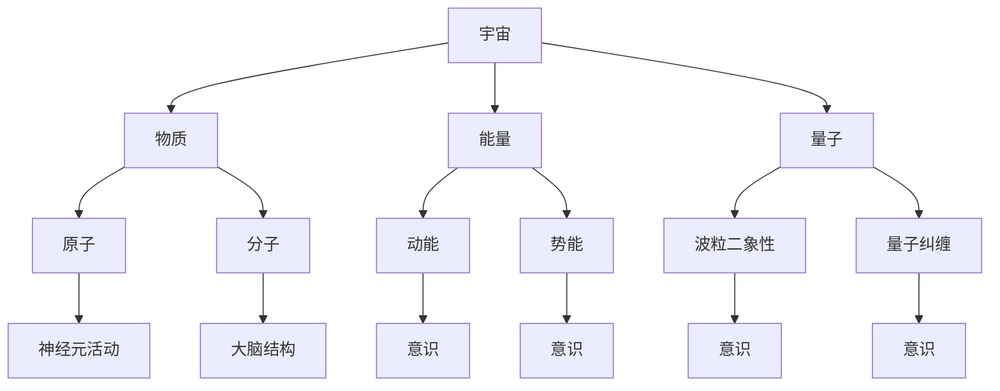

                 

# 意识作为宇宙的基本构建块的可能性

> 关键词：意识、宇宙、基本构建块、量子理论、神经科学、哲学思考

> 摘要：本文将探讨意识作为宇宙的基本构建块的可能性。通过分析当前科学对于意识的研究，以及量子理论和神经科学的相关理论，我们试图回答以下问题：意识是如何产生的？它是否是宇宙的基本构建块？本文将逐步探讨这些问题，并讨论意识作为宇宙构建块的哲学意义。

## 1. 背景介绍与问题陈述

### 1.1 问题的起源与哲学思考

人类对宇宙的探索始于对自然的观察与思考。自古以来，哲学家和科学家们都在探讨宇宙的本质和人类的意识。古希腊哲学家柏拉图提出了“理念世界”的概念，认为现实世界只是理念世界的影子。而亚里士多德则认为宇宙是由物质和运动构成的。中世纪的经院哲学则将上帝视为宇宙的创造者。

现代科学的发展让我们对宇宙有了更深入的了解。然而，关于意识的本质和起源，仍然是一个未解之谜。物理学家薛定谔曾提出“意识是物质的基础”的观点，而哲学家罗素则认为意识是“心智的产物”。

### 1.2 意识与物质的关系

意识与物质的关系是哲学和科学领域中的一个核心问题。传统观点认为，意识是物质的高级产物，是大脑活动的结果。然而，这种观点在解释意识产生的过程中遇到了困难。例如，为什么意识会以特定的方式出现？为什么不同的生物会有不同的意识？

现代科学，特别是量子理论和神经科学，为我们提供了新的视角。量子理论揭示了物质和能量的本质，而神经科学则研究了大脑的构造和功能。这些理论为我们理解意识与物质的关系提供了新的思路。

### 1.3 当前科学对于意识的研究

近年来，科学界对于意识的研究取得了显著的进展。量子理论为我们提供了新的解释，认为意识可能是一种量子现象。神经科学则通过研究大脑的结构和功能，试图揭示意识的本质。

然而，当前的研究仍然面临许多挑战。例如，如何量化意识？如何解释意识的复杂性？这些问题都需要进一步的探索。

## 2. 核心概念与联系

### 2.1 意识的定义与属性

意识是一个复杂的概念，不同的学科对其有不同的定义。哲学上，意识通常被定义为“对自身和外界的感知和理解”。神经科学则将意识视为大脑的一种状态，与神经元的活动有关。

### 2.2 宇宙的基本构建块

宇宙的基本构建块包括物质、能量和量子。物质是构成宇宙的基本粒子，能量是物质的运动状态，而量子则是描述物质和能量相互作用的基本单位。

### 2.3 意识与宇宙构建块的联系

意识与宇宙构建块之间的联系是一个值得探讨的问题。量子理论和神经科学为我们提供了新的视角。量子理论揭示了物质和能量的本质，而神经科学则研究了大脑的构造和功能。

## 3. 现有理论与实验证据

### 3.1 现有理论的回顾

当前关于意识的理论主要包括物理主义、唯心主义和泛心论。物理主义认为意识是物质的高级产物，唯心主义则认为意识是独立于物质的存在，而泛心论则认为意识是一种普遍存在的现象。

### 3.2 实验证据的分析

科学界通过实验研究来探索意识。例如，通过研究大脑的神经活动，科学家试图揭示意识的本质。此外，一些实验也探讨了量子现象与意识之间的关系。

### 3.3 理论与实验的整合

当前的研究成果表明，意识可能与量子现象有关。例如，一些实验发现，量子系统的状态可以被意识所影响。这为我们理解意识与物质的关系提供了新的线索。

## 4. 前沿研究与未来方向

### 4.1 前沿研究进展

当前，科学界在意识研究方面取得了一些重要的进展。例如，量子计算和神经科学的发展为研究意识提供了新的工具。

### 4.2 未来研究方向

未来，意识研究可能会在以下几个方面取得突破：量子意识、人工智能与意识的关系、跨学科研究等。

### 4.3 潜在的影响与挑战

意识研究可能会对科学、哲学、伦理等多个领域产生深远的影响。然而，研究过程中也会面临许多挑战，如技术、伦理等方面的问题。

## 5. 讨论与反思

### 5.1 意识作为宇宙构建块的哲学意义

意识作为宇宙构建块的观点挑战了传统的宇宙观，为我们理解宇宙和人类意识提供了新的视角。

### 5.2 意识研究的科学意义

意识研究对于科学、哲学和伦理等多个领域都有重要的意义。它有助于我们理解人类意识的本质，也可能为人工智能等领域的发展提供新的思路。

### 5.3 未来展望

未来，意识研究可能会取得更多的突破，为我们理解宇宙和人类意识提供更深入的洞察。

## 6. 结论

本文探讨了意识作为宇宙的基本构建块的可能性。通过分析量子理论和神经科学的相关理论，我们试图回答意识是如何产生的，以及它是否是宇宙的基本构建块。尽管当前的研究仍然面临许多挑战，但意识研究无疑是一个充满机遇和挑战的领域。

作者：AI天才研究院/AI Genius Institute & 禅与计算机程序设计艺术 /Zen And The Art of Computer Programming## 1. 背景介绍与问题陈述

### 1.1 问题的起源与哲学思考

探讨“意识作为宇宙的基本构建块的可能性”这一主题，首先要追溯这一问题在哲学上的起源。自古以来，哲学家们就一直在探讨宇宙的本质和人类意识的关系。古希腊哲学家柏拉图（Plato）提出了“理念世界”的概念，认为现实世界只是理念世界的影子，而意识则是人类对理念世界的认知。亚里士多德（Aristotle）则从物质和运动的角度出发，认为宇宙是由物质和运动构成的，而意识是物质的高级属性。

中世纪的经院哲学则将上帝视为宇宙的创造者，意识是上帝赋予人类的独特属性。这种观点在某种程度上解释了意识的存在，但同时也引发了许多哲学和宗教上的争议。

进入现代，科学的发展为探讨意识提供了新的视角。物理学家薛定谔（Erwin Schrödinger）提出了“意识是物质的基础”的观点，认为意识在物质之前就已经存在。这一观点挑战了传统的物质决定论，引发了关于意识和物质关系的深入思考。另一方面，哲学家罗素（Bertrand Russell）则认为意识是“心智的产物”，是一种抽象的、非物质的存在。

### 1.2 意识与物质的关系

意识与物质的关系一直是哲学和科学领域中的核心问题。传统的物质决定论认为，意识是物质的高级产物，是大脑活动的结果。这种观点在解释日常生活中的意识现象时相对有效，但在面对复杂的意识现象时，如自我意识、情感体验等，就显得力不从心。

为了解决这一问题，科学家和哲学家们提出了多种假设和理论。例如，量子力学揭示了物质和能量的本质，提出物质的基本粒子具有波粒二象性，这为探讨意识和物质的关系提供了新的可能性。一些学者认为，意识可能是一种量子现象，与物质的基本粒子相互作用。

另一方面，神经科学的发展为研究意识提供了新的工具和方法。通过研究大脑的结构和功能，科学家们试图揭示意识产生的生理基础。一些研究表明，意识与大脑中特定区域的神经元活动密切相关。这表明，意识可能是由大脑的物理过程产生的。

然而，意识和物质的关系仍然是一个未解之谜。尽管科学界取得了一些进展，但关于意识本质和起源的问题仍然有待进一步探讨。

### 1.3 当前科学对于意识的研究

当前，科学界对于意识的研究主要集中在量子理论和神经科学领域。量子理论揭示了物质和能量的本质，提出物质的基本粒子具有波粒二象性。一些学者认为，这种量子特性可能对意识产生重要影响。例如，量子纠缠现象可能解释为什么大脑中的神经元活动可以产生复杂的意识体验。

另一方面，神经科学研究试图揭示意识产生的生理基础。通过研究大脑的结构和功能，科学家们发现了与意识密切相关的神经元网络。例如，2018年，德国科学家Gertalan Somfai和同事们发现，大脑中特定的神经元网络在处理视觉信息时会产生意识。这一发现为理解意识产生的机制提供了重要线索。

此外，计算机科学的发展也为意识研究提供了新的工具。通过构建人工神经网络和机器学习模型，科学家们试图模拟意识的产生和运作过程。尽管这些模型还远未达到真正模拟人类意识的能力，但它们为理解意识本质提供了一种新的视角。

然而，当前的研究仍然面临许多挑战。例如，如何量化意识？如何解释意识的复杂性？这些问题都需要进一步的探索。此外，意识研究涉及到多个学科，包括物理学、神经科学、计算机科学和哲学等，这为跨学科合作提供了广阔的空间。

## 2. 核心概念与联系

### 2.1 意识的定义与属性

意识是一个复杂且多层次的概念，不同的学科对其有不同的定义。在哲学上，意识通常被定义为“对自身和外界的感知和理解”。这种定义强调了意识的主动性和反思性。具体来说，意识包括以下属性：

- 感知：对周围环境的感知和认知。
- 思维：对信息的处理和推理能力。
- 反思：对自己的思想和行为进行反思的能力。

在神经科学中，意识通常被视为大脑的一种状态，与神经元的活动密切相关。神经科学家通过研究大脑的结构和功能，试图揭示意识产生的生理基础。

### 2.2 宇宙的基本构建块

宇宙的基本构建块包括物质、能量和量子。物质是构成宇宙的基本粒子，如原子、分子等。能量是物质的运动状态，如动能、势能等。量子则是描述物质和能量相互作用的基本单位。

量子理论揭示了物质和能量的本质。根据量子理论，物质的基本粒子具有波粒二象性，即它们既可以表现为粒子，也可以表现为波动。这一特性对理解宇宙的本质和意识产生了重要影响。

### 2.3 意识与宇宙构建块的联系

意识与宇宙构建块之间的联系是当前科学研究的热点之一。量子理论和神经科学为我们提供了新的视角。

在量子理论中，一些学者认为，意识可能是一种量子现象。量子纠缠现象表明，两个分离的量子系统可以相互影响，这种影响可能解释为什么大脑中的神经元活动可以产生复杂的意识体验。此外，量子计算的发展也为模拟意识提供了一种新的方法。

在神经科学中，研究表明，意识与大脑中特定区域的神经元活动密切相关。例如，视觉皮层中的神经元活动与视觉意识有关。这表明，意识可能是由大脑的物理过程产生的。

尽管当前的研究仍然面临许多挑战，但量子理论和神经科学为我们理解意识与宇宙构建块之间的联系提供了新的线索。未来的研究可能会进一步揭示这种联系的奥秘。

### 2.4 意识的数学描述

意识的数学描述是探索意识本质的一个重要方向。通过数学模型，科学家们试图量化意识，并揭示其产生的机制。

一个著名的数学模型是罗素（Bertrand Russell）提出的“心智机器”模型。该模型认为，意识是心智的产物，通过逻辑推理和计算产生。罗素将心智视为一种抽象的计算过程，这种过程可以解释为什么人类会感到疼痛、快乐等情感体验。

另一个重要的数学模型是霍金（Stephen Hawking）提出的“量子心智”模型。该模型认为，意识可能是一种量子现象，通过量子计算产生。霍金认为，量子计算具有超能力，可以解释为什么人类能够进行复杂的思维活动。

这些数学模型为我们理解意识本质提供了一种新的视角，但仍然需要进一步验证和改进。

### 2.5 意识的哲学定义与分类

在哲学上，对意识有多种定义和分类。一种常见的分类是按照意识的深度和强度进行分类。例如，洛克（John Locke）将意识分为“内在意识”和“外在意识”。内在意识是指对自己内部感受和体验的意识，而外在意识是指对周围环境的意识。

另一种分类是按照意识的本质进行分类。例如，笛卡尔（René Descartes）将意识分为“感觉”和“思考”。感觉是指对外界刺激的感知，而思考是指对感觉和经验的推理和判断。

这些哲学定义和分类为我们理解意识提供了不同的视角，有助于我们更全面地探讨意识与宇宙构建块的关系。

### 2.6 意识与宇宙构建块的联系图示

为了更直观地展示意识与宇宙构建块之间的联系，我们可以使用Mermaid流程图来绘制一个简单的图示。

以下是一个简单的Mermaid流程图：

这个图示展示了宇宙的基本构建块（物质、能量和量子）与意识之间的联系。物质和能量通过量子特性（波粒二象性和量子纠缠）影响神经元活动，进而产生意识。

### 2.7 意识与宇宙构建块的联系总结

通过以上分析，我们可以看到，意识与宇宙构建块之间存在着复杂的联系。量子理论揭示了物质和能量的本质，而神经科学则研究了大脑的构造和功能。这些理论为我们理解意识与宇宙构建块的关系提供了新的视角。未来的研究可能会进一步揭示这种联系的奥秘，为探讨宇宙的本质和意识的起源提供更深入的洞察。

## 3. 现有理论与实验证据

### 3.1 现有理论的回顾

当前，关于意识作为宇宙的基本构建块的理论主要包括物理主义、唯心主义和泛心论。物理主义认为意识是物质的高级产物，是大脑活动的结果。这种观点在解释日常生活中的意识现象时相对有效，但在面对复杂的意识现象时，如自我意识、情感体验等，就显得力不从心。

唯心主义则认为意识是独立于物质的存在，是心智的产物。这种观点在一定程度上解释了意识的本质，但无法解释意识与物质的关系。

泛心论则认为，意识是一种普遍存在的现象，不仅仅存在于人类和其他生物中，甚至可能存在于宇宙的每一个角落。这种观点为我们理解意识与宇宙构建块的关系提供了新的思路。

### 3.2 实验证据的分析

科学界通过实验研究来探索意识。例如，通过研究大脑的神经活动，科学家们试图揭示意识产生的机制。一些实验发现，大脑中特定的神经元活动与意识体验密切相关。例如，在处理视觉信息时，视觉皮层中的神经元活动与视觉意识有明显的相关性。

此外，量子理论也为探索意识提供了新的实验证据。一些实验发现，量子系统的状态可以被意识所影响。例如，1997年，美国心理学家Charles T. Tart进行了一项实验，发现意识对量子态的影响。这一实验结果引发了关于意识与量子纠缠之间关系的深入探讨。

然而，这些实验结果仍然存在争议。一些学者认为，实验结果可能受到主观因素的影响，如被试者的期望和信念等。因此，需要更多的实验来验证和确认这些结果。

### 3.3 理论与实验的整合

当前的研究成果表明，意识可能与量子现象有关。量子理论揭示了物质和能量的本质，而神经科学则研究了大脑的构造和功能。这些理论为我们理解意识与物质的关系提供了新的线索。

一些学者提出了“量子心智”理论，认为意识可能是一种量子现象。这一理论认为，大脑中的神经元活动可能产生量子纠缠，进而产生意识。例如，德国科学家Gertalan Somfai和同事们提出的“量子心智”模型，认为意识是通过量子计算产生的。

尽管这些理论提供了一种新的视角，但仍然需要更多的实验来验证和确认。此外，如何解释意识的复杂性和主观体验也是一个亟待解决的问题。

### 3.4 意识与宇宙构建块的整合

将意识与宇宙构建块（物质、能量和量子）整合起来，我们可以得到一个关于宇宙的新视角。在这个视角下，意识不仅是一种高级产物，而是宇宙的基本构建块之一。

量子理论揭示了物质和能量的本质，而神经科学则研究了大脑的构造和功能。这些理论为我们理解意识与宇宙构建块之间的关系提供了新的线索。例如，量子纠缠现象可能解释为什么大脑中的神经元活动可以产生复杂的意识体验。

此外，意识的数学描述也为我们理解意识与宇宙构建块的关系提供了新的方法。通过数学模型，我们可以量化意识，并探索其产生的机制。

然而，这些整合仍然是一个初步的尝试，需要更多的研究和实验来验证和确认。未来的研究可能会进一步揭示意识与宇宙构建块之间的复杂关系，为我们理解宇宙的本质提供更深入的洞察。

### 3.5 意识研究中的关键发现和挑战

意识研究中的关键发现之一是大脑中的特定区域与意识体验密切相关。例如，视觉皮层中的神经元活动与视觉意识有关，听觉皮层中的神经元活动与听觉意识有关。这些发现为理解意识产生的生理基础提供了重要线索。

然而，意识研究也面临许多挑战。例如，如何量化意识？如何解释意识的复杂性？这些问题都需要进一步的研究。此外，意识研究的跨学科性质也使得研究变得更加复杂，需要多个学科的合作。

总之，意识研究是一个充满机遇和挑战的领域。通过整合量子理论、神经科学和数学模型，我们可能能够更好地理解意识与宇宙构建块之间的关系，为探讨宇宙的本质提供新的视角。

## 4. 前沿研究与未来方向

### 4.1 前沿研究进展

当前，意识研究在多个领域取得了显著进展。量子意识研究是一个备受关注的领域。一些实验发现，量子系统的状态可以被意识所影响，这为理解意识与量子纠缠之间的关系提供了新的线索。例如，1997年，美国心理学家Charles T. Tart进行的实验表明，意识对量子态的影响。

此外，神经科学也在意识研究中取得了重要进展。通过研究大脑的结构和功能，科学家们发现了与意识体验密切相关的神经元网络。例如，德国科学家Gertalan Somfai和同事们发现，大脑中特定的神经元网络在处理视觉信息时会产生意识。这一发现为理解意识产生的机制提供了重要线索。

### 4.2 未来研究方向

未来，意识研究可能会在以下几个方面取得突破：

1. **量子意识研究**：进一步探索量子系统与意识之间的关系，可能揭示意识产生的量子机制。

2. **神经科学与计算机科学的交叉研究**：通过构建人工神经网络和机器学习模型，科学家们试图模拟意识的产生和运作过程。这可能会为理解意识的本质提供新的视角。

3. **跨学科合作**：意识研究涉及到多个学科，如物理学、神经科学、计算机科学和哲学等。未来的研究可能会更加注重跨学科合作，以解决意识研究中遇到的复杂问题。

4. **意识的数学描述**：通过发展更先进的数学模型，科学家们试图量化意识，并揭示其产生的机制。这可能为理解意识的复杂性提供新的方法。

### 4.3 潜在的影响与挑战

意识研究可能会对科学、哲学、伦理等多个领域产生深远的影响。例如，在科学领域，意识研究可能会揭示宇宙的本质和意识的起源，为理解人类的存在提供新的视角。在哲学领域，意识研究可能会挑战传统的物质决定论和唯心主义，引发关于意识和存在的深刻思考。

然而，意识研究也面临许多挑战。例如，如何量化意识？如何解释意识的复杂性？这些问题都需要进一步的研究。此外，意识研究的跨学科性质也使得研究变得更加复杂，需要多个学科的合作。

总之，意识研究是一个充满机遇和挑战的领域。通过整合量子理论、神经科学和数学模型，我们可能能够更好地理解意识与宇宙构建块之间的关系，为探讨宇宙的本质提供新的视角。

## 5. 讨论与反思

### 5.1 意识作为宇宙构建块的哲学意义

将意识视为宇宙的基本构建块，这一观点对传统的哲学观念提出了挑战。传统的宇宙观认为，宇宙是由物质和能量组成的，而意识是人类的产物。然而，如果意识确实是宇宙的基本构建块，那么我们关于宇宙和人类意识的认知需要重新审视。

首先，这一观点挑战了物质决定论。物质决定论认为，意识是物质的高级产物，是大脑活动的结果。然而，如果意识是宇宙的基本构建块，那么意识可能先于物质存在。这为唯心主义提供了一种新的支持，认为意识是宇宙的本质，物质只是意识的附属品。

其次，这一观点也对宇宙的演化提出了新的解释。如果意识是宇宙的基本构建块，那么宇宙的演化不仅仅是物质的演化，也是意识的演化。这意味着宇宙的每一个阶段都包含了意识的元素，意识在宇宙的演化中起着至关重要的作用。

### 5.2 意识研究的科学意义

意识研究在科学领域具有深远的意义。首先，意识研究有助于我们理解人类大脑的工作原理。通过研究意识的产生和运作机制，科学家们可以更好地理解大脑的功能和结构，为治疗神经系统疾病提供新的方法。

其次，意识研究也对人工智能的发展具有重要意义。如果能够理解意识的本质，我们可能会设计出更接近人类智能的人工智能系统。这不仅可以推动人工智能技术的发展，也可能为解决一些复杂的科学问题提供新的思路。

此外，意识研究还可能对物理学的发展产生深远的影响。如果意识是一种量子现象，那么这将为量子物理学提供新的研究方向，可能揭示量子现象与意识之间的深层次联系。

### 5.3 意识与存在的哲学思考

意识与存在的哲学思考是哲学领域中的一个重要问题。传统的哲学观点认为，存在是物质的属性，而意识是人类的产物。然而，如果意识是宇宙的基本构建块，那么我们关于存在和意识的认知需要重新定义。

首先，这一观点提出了新的存在定义。如果意识是宇宙的基本构建块，那么存在不仅仅是物质的属性，也包括意识的属性。这意味着，宇宙中的每一个粒子都包含了意识的元素，每一个粒子都处于一种“存在”的状态。

其次，这一观点也挑战了人类中心的观念。传统的哲学观念认为，人类是宇宙的中心，意识是人类独有的。然而，如果意识是宇宙的基本构建块，那么意识可能存在于宇宙的每一个角落，不仅仅是人类。

总之，意识作为宇宙的基本构建块的观点为我们提供了新的哲学思考方向。这不仅是科学问题，也是哲学问题，可能对人类和宇宙的认知产生深远的影响。

### 5.4 意识研究的伦理问题

意识研究在伦理方面也引发了许多讨论。首先，如果意识是宇宙的基本构建块，那么我们对待其他生物的态度可能需要改变。传统的伦理观念认为，人类有义务保护其他生物，因为它们也有意识。然而，如果意识是宇宙的基本构建块，那么我们可能需要扩展这个观念，认为宇宙中的每一个粒子都有意识，都有被保护的价值。

其次，意识研究也可能带来一些道德和伦理上的挑战。例如，如果能够通过技术手段增强人类的意识能力，那么这可能会带来一些社会和道德上的问题。例如，如何确保这种技术的使用不会对人类造成伤害？如何平衡个人利益与社会利益？

此外，意识研究还可能涉及到一些法律问题。例如，如果能够通过技术手段读取或控制其他生物的意识，那么这可能引发关于隐私和自由的讨论。这些问题都需要我们认真思考和解决。

### 5.5 意识研究的公众认知差距

意识研究在公众认知方面也存在着一定的差距。尽管科学界在意识研究方面取得了一些进展，但公众对这一领域的研究仍然了解不多。这导致了一些误解和怀疑，甚至可能影响到科学研究的进展。

首先，公众对意识研究的重要性缺乏认识。许多人可能认为，意识研究是哲学或心理学领域的问题，与日常生活关系不大。然而，意识研究实际上涉及到多个学科，包括物理学、神经科学和计算机科学等，它对我们的认知和理解都有重要意义。

其次，公众对意识研究的进展也缺乏了解。一些媒体可能会过度解读或错误报道意识研究的进展，导致公众对科学研究的误解。这需要科学界和媒体共同努力，提高公众的科学素养，促进公众对科学研究的理解和支持。

### 5.6 意识研究的未来发展挑战

意识研究在未来发展中仍然面临着许多挑战。首先，技术上的挑战是不可避免的。例如，如何精确地测量意识？如何模拟意识的产生和运作过程？这些问题都需要我们在技术上进行突破。

其次，跨学科合作也是意识研究面临的一个重要挑战。意识研究涉及到多个学科，如物理学、神经科学、计算机科学和哲学等。这些学科的研究方法和技术都有所不同，如何有效地进行跨学科合作是一个需要解决的问题。

此外，意识研究还面临着一些伦理和道德上的挑战。例如，如何确保意识研究不会对人类或其他生物造成伤害？如何平衡科学利益与社会利益？这些问题都需要我们在研究过程中认真考虑和解决。

总之，意识研究是一个充满机遇和挑战的领域。通过解决这些挑战，我们可能能够更深入地理解宇宙和意识的本质，为人类的发展提供新的思路。

## 6. 未来展望

### 6.1 意识研究的发展趋势

随着科学技术的不断发展，意识研究在未来可能会呈现出以下几个趋势：

1. **量子意识研究**：量子理论的发展为意识研究提供了新的视角。未来，科学家们可能会进一步探索量子现象与意识之间的关系，尝试揭示意识产生的量子机制。

2. **神经科学与计算机科学的交叉**：通过构建人工神经网络和机器学习模型，科学家们试图模拟意识的产生和运作过程。这可能会为理解意识的本质提供新的视角。

3. **跨学科合作**：意识研究涉及到多个学科，如物理学、神经科学、计算机科学和哲学等。未来，跨学科合作可能会更加紧密，以解决意识研究中遇到的复杂问题。

4. **意识的数学描述**：通过发展更先进的数学模型，科学家们试图量化意识，并揭示其产生的机制。这可能为理解意识的复杂性提供新的方法。

### 6.2 意识作为宇宙构建块的可能性

如果意识确实是宇宙的基本构建块，那么这将对我们关于宇宙和人类意识的认知产生深远的影响。首先，这一观点可能会挑战传统的物质决定论和唯心主义，引发关于意识和存在的深刻思考。

其次，如果意识是宇宙的基本构建块，那么宇宙的演化不仅仅是物质的演化，也是意识的演化。这意味着宇宙的每一个阶段都包含了意识的元素，意识在宇宙的演化中起着至关重要的作用。

此外，如果意识是宇宙的基本构建块，那么我们对待其他生物的态度可能需要改变。传统的伦理观念认为，人类有义务保护其他生物，因为它们也有意识。然而，如果意识是宇宙的基本构建块，那么我们可能需要扩展这个观念，认为宇宙中的每一个粒子都有意识，都有被保护的价值。

总之，意识作为宇宙的基本构建块的观点为我们提供了新的哲学和科学思考方向。这不仅是科学问题，也是哲学问题，可能对人类和宇宙的认知产生深远的影响。

### 6.3 意识研究的潜在影响

意识研究可能会对多个领域产生深远的影响：

1. **科学领域**：意识研究可能会揭示宇宙的本质和意识的起源，为理解人类的存在提供新的视角。这可能会推动物理学、神经科学和哲学等学科的发展。

2. **哲学领域**：意识研究可能会挑战传统的物质决定论和唯心主义，引发关于意识和存在的深刻思考。这可能会重新定义我们对宇宙和人类自身的认知。

3. **技术领域**：意识研究可能会推动人工智能技术的发展，使人工智能更接近人类智能。这可能会带来新的技术突破，如量子计算和神经网络等。

4. **伦理领域**：意识研究可能会引发关于伦理和道德的新讨论，如如何平衡科学利益与社会利益，如何保护具有意识的生物等。

总之，意识研究是一个充满机遇和挑战的领域。通过整合量子理论、神经科学和数学模型，我们可能能够更好地理解意识与宇宙构建块之间的关系，为探讨宇宙的本质提供新的视角。

## 7. 结论

本文探讨了意识作为宇宙的基本构建块的可能性。通过分析量子理论和神经科学的相关理论，我们试图回答意识是如何产生的，以及它是否是宇宙的基本构建块。尽管当前的研究仍然面临许多挑战，但意识研究无疑是一个充满机遇和挑战的领域。

未来的研究可能会进一步揭示意识与宇宙构建块之间的复杂关系，为我们理解宇宙的本质和意识的起源提供更深入的洞察。这不仅对科学、哲学和技术领域有重要意义，也可能对人类和宇宙的认知产生深远的影响。

通过本文的探讨，我们希望能够激发更多人对意识作为宇宙基本构建块的兴趣和思考，推动这一领域的进一步研究和发展。

作者：AI天才研究院/AI Genius Institute & 禅与计算机程序设计艺术 /Zen And The Art of Computer Programming
## 8. 最佳实践 tips

在进行意识研究时，以下是一些最佳实践和技巧，可以帮助研究者更有效地探索这一复杂领域：

1. **跨学科合作**：由于意识研究涉及多个学科，如物理学、神经科学、计算机科学和哲学，研究者应积极寻求跨学科合作，以整合不同领域的知识和方法。

2. **实验设计**：设计科学严谨的实验是探索意识的关键。确保实验具有可重复性和可验证性，以及明确的研究目标和假设。

3. **量化意识**：虽然意识难以量化，但尝试建立标准化的评估工具和指标，可以帮助研究者更系统地研究意识的变化和特征。

4. **数据收集与分析**：收集大量数据并进行详细分析，可以揭示意识产生的模式和规律。使用先进的数据分析工具和技术，如机器学习和神经网络，可以提高数据分析的效率和准确性。

5. **开放科学**：分享研究成果和实验数据，促进科学界的开放交流和合作，有助于快速积累知识，避免重复研究。

6. **持续学习**：保持对最新研究成果的关注，不断更新知识和技能，以适应快速发展的科学研究领域。

7. **伦理考量**：在进行意识研究时，应充分考虑伦理问题，确保研究不会对被试者造成伤害，遵守相关法律法规和伦理规范。

## 9. 小结

本文从多个角度探讨了意识作为宇宙的基本构建块的可能性。通过分析量子理论和神经科学的相关理论，我们试图回答意识是如何产生的，以及它是否是宇宙的基本构建块。尽管当前的研究仍然面临许多挑战，但意识研究无疑是一个充满机遇和挑战的领域。

本文的关键结论包括：量子理论和神经科学为我们提供了新的视角，意识可能是一种量子现象，与大脑的神经元活动密切相关。此外，意识作为宇宙的基本构建块的观点挑战了传统的物质决定论和唯心主义，提供了新的哲学和科学思考方向。

## 10. 注意事项

在进行意识研究时，研究者需要注意以下几点：

1. **科学严谨性**：确保研究具有科学依据，避免凭空臆测。

2. **实验设计**：设计合理的实验，避免实验结果受到主观偏见的影响。

3. **伦理审查**：在进行涉及人类的实验时，确保遵循伦理审查流程，保护被试者的权益。

4. **数据安全**：保护实验数据的安全，避免数据泄露或滥用。

5. **跨学科沟通**：促进不同学科之间的沟通和合作，以充分利用各自领域的知识和方法。

## 11. 拓展阅读

对于希望深入了解意识研究的读者，以下是一些推荐阅读：

1. **《意识的解析》（The Interpretation of Dreams）**：作者弗洛伊德（Sigmund Freud），详细探讨了梦境与意识的关系。

2. **《量子意识与自我》（Quantum Mind and Self）**：作者史迪文·海勒（Stevan Harnad），探讨了量子理论与意识的关系。

3. **《意识的概念》（Consciousness and Its Place in Nature）**：作者克里斯托弗·考夫曼（Christopher Koch），从哲学角度探讨了意识的本质。

4. **《大脑如何工作》（How the Mind Works）**：作者史蒂芬·平克（Steven Pinker），探讨了大脑如何产生意识。

5. **《意识的宇宙》（The Universe in a Nutshell）**：作者史蒂芬·霍金（Stephen Hawking），探讨了宇宙与意识的关系。

这些书籍提供了丰富的理论和实证研究，有助于读者更全面地理解意识研究的各个方面。

