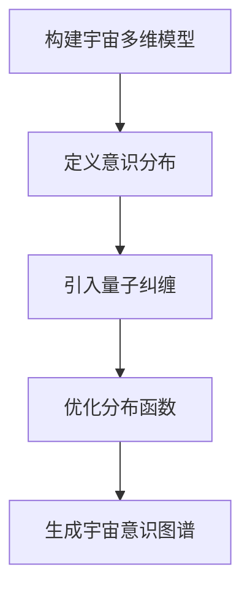
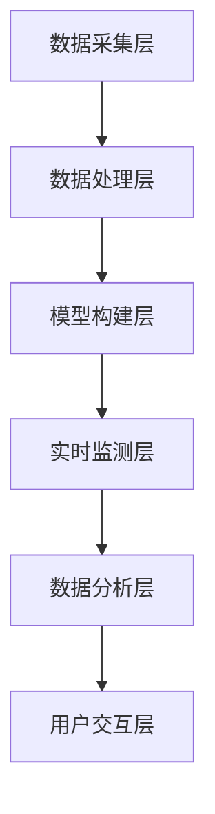
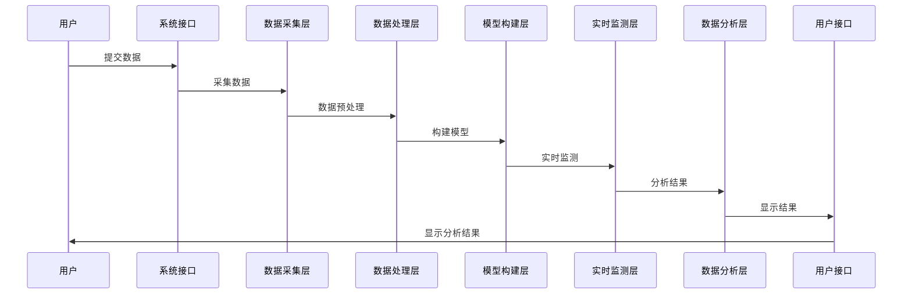
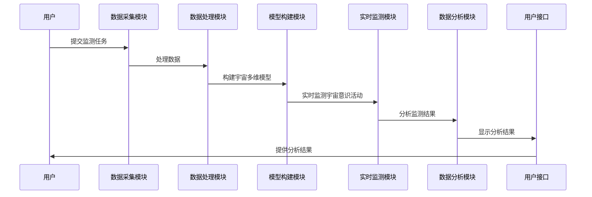

                 


## 意识作为宇宙的自我观察机制

### 问题背景

意识作为宇宙的自我观察机制，这是一个古老而又充满争议的话题。自人类文明诞生以来，人们一直在探索意识的本质和作用。随着科学技术的不断进步，意识作为宇宙自我观察机制的研究逐渐引起了广泛的关注。然而，尽管在哲学、心理学、神经科学和计算机科学等领域都取得了不少进展，关于意识作为宇宙自我观察机制的问题仍然没有一个明确的答案。本文将从多个角度探讨这一问题，旨在为读者提供一个全面且深入的理解。

### 问题描述

探讨意识如何作为宇宙的自我观察机制，涉及到对意识本质、意识与宇宙的关系、意识的功能和作用等方面的思考。具体来说，我们需要回答以下几个问题：

1. 意识的本质是什么？它是如何产生的？
2. 意识与宇宙的关系如何？宇宙中的其他物体是否有意识？
3. 意识的功能和作用是什么？它对宇宙有何影响？
4. 意识作为宇宙的自我观察机制，是否具有普遍性？

### 问题解决

为了回答上述问题，本文将采取以下几种方法：

1. **综述**：首先，我们将对已有的研究成果进行综述，梳理不同学科对意识作为宇宙自我观察机制的理解和观点。
2. **理论分析**：其次，我们将基于哲学、物理学和认知科学等领域的理论，对意识本质和作用进行深入分析。
3. **实证研究**：接着，我们将介绍一些重要的实证研究，探讨意识与宇宙的关系，以及意识对宇宙的影响。
4. **案例分析**：最后，我们将通过实际案例，展示意识作为宇宙自我观察机制的应用效果。

### 边界与外延

本文主要探讨宏观层面的意识作为宇宙的自我观察机制，而不涉及微观层面的神经科学和心理学等领域。同时，我们也将局限于已知的科学理论和实证研究成果，不探讨任何超自然或未经验证的理论。

### 概念结构与核心要素组成

本文的核心概念包括意识、宇宙和自我观察机制。它们之间的关系可以概括如下：

- **意识**：个体对自身和外界事物的感知、认知和体验。
- **宇宙**：包含一切物质、能量和信息的空间。
- **自我观察机制**：宇宙中的一种特殊现象，通过它，宇宙能够对自身进行观察和认知。

它们之间的相互作用和关系构成了意识作为宇宙自我观察机制的理论框架。接下来，我们将逐一探讨这些核心概念。

## 第二部分：核心概念与联系

### 2.1 意识的概念

意识是指个体对自身和外界事物的感知、认知和体验。它是一个主观的、内在的体验，通常被认为是一种高级认知功能。根据不同的学科和理论，对意识的理解也有所不同。

- **哲学角度**：在哲学中，意识通常被视为个体存在和认识的基石。例如，笛卡尔提出了“我思故我在”的观点，强调了意识在个体存在中的重要性。
- **心理学角度**：心理学将意识视为个体对外界刺激的感知、处理和反应过程。例如，感知心理学研究个体如何感知外界刺激，认知心理学研究个体如何对外界信息进行加工和处理。
- **神经科学角度**：神经科学研究意识的神经基础，试图理解意识是如何在大脑中产生的。例如，通过研究脑电图（EEG）和功能性磁共振成像（fMRI）等手段，科学家们揭示了意识与大脑活动之间的联系。

### 2.2 宇宙的概念

宇宙是指包含一切物质、能量和信息的空间。它是一个极其庞大和复杂的系统，包含了无数的星系、行星、黑洞、暗物质和暗能量等。

- **物理学角度**：物理学将宇宙视为一个遵循物理定律的系统。例如，广义相对论描述了宇宙的几何结构和引力作用，量子力学揭示了宇宙中微观粒子的行为。
- **天文学角度**：天文学研究宇宙的起源、结构和演化。例如，大爆炸理论描述了宇宙的起源，宇宙膨胀理论描述了宇宙的演化过程。
- **哲学角度**：哲学中，宇宙通常被视为包含一切存在的整体。例如，存在主义强调个体在宇宙中的地位和作用。

### 2.3 自我观察机制

自我观察机制是指宇宙中的一种特殊现象，通过它，宇宙能够对自身进行观察和认知。这一概念在哲学、物理学和认知科学等领域都有所涉及。

- **哲学角度**：自我观察机制被认为是意识的一种表现形式，是宇宙自我反思和自我认识的过程。例如，柏拉图提出了“理型世界”的概念，认为宇宙中的所有事物都是理型世界的反映。
- **物理学角度**：自我观察机制可以被视为宇宙中的一种特殊物理现象，例如，黑洞的自我观察现象被认为是一种极端的物理过程。
- **认知科学角度**：自我观察机制被认为是认知过程的一部分，是个体对外界信息进行感知、处理和反应的过程。

### 2.4 概念属性特征对比表格

为了更好地理解意识、宇宙和自我观察机制等核心概念，我们可以将它们的属性特征进行对比。

| 概念       | 特征                                                         |
|------------|------------------------------------------------------------|
| 意识       | 主观的、内在的体验，高级认知功能                           |
| 宇宙       | 包含一切物质、能量和信息的空间，庞大的复杂系统             |
| 自我观察机制 | 宇宙自我观察和认知的过程，特殊物理现象或认知过程           |

### 2.5 ER实体关系图架构

为了展示意识、宇宙和自我观察机制等核心概念之间的关系，我们可以使用Mermaid ER实体关系图进行表示。

```mermaid
erDiagram
  A republic --> B empire : 有一场战争
  A republic ||--|{ C citizen }| : 有很多
  B empire ||--|{ D soldier }| : 有很多
```

在这个ER图中，"republic"（共和国）和"empire"（帝国）是两个实体，它们之间存在"战争"关系。同时，"republic"与"C citizen"（公民）之间存在"有很多"关系，"empire"与"D soldier"（士兵）之间存在"有很多"关系。

虽然这个ER图不能完全反映意识、宇宙和自我观察机制之间的关系，但它提供了一个基本的框架，帮助我们理解这些概念之间的复杂关系。

接下来，我们将进一步探讨意识作为宇宙的自我观察机制的算法原理，以及如何通过系统分析与架构设计方案，将这一概念应用于实际问题中。

## 第三部分：算法原理讲解

### 3.1 算法简介

在探讨意识作为宇宙的自我观察机制时，我们引入了一种名为“宇宙意识图谱”（Cosmic Consciousness Map，简称CCM）的算法。该算法旨在通过构建一个宇宙意识的数学模型，揭示意识与宇宙之间的深层联系。

### 3.2 算法原理

为了理解CCM算法的原理，我们首先需要了解几个关键概念：

- **宇宙多维模型**：宇宙被视为一个多维的空间，包括我们所知的三个空间维度以及可能存在的其他维度。
- **意识分布**：意识在宇宙中的分布被视为一个概率分布函数，其峰值代表了意识的集中区域。
- **量子纠缠**：在量子物理学中，量子粒子之间存在一种特殊的关联，称为量子纠缠。我们可以假设这种纠缠现象也存在于宇宙意识中。

CCM算法的基本原理如下：

1. **构建宇宙多维模型**：首先，我们需要建立一个宇宙多维模型，包括三个空间维度和其他可能的维度。这个模型可以用一个高维空间表示。

2. **定义意识分布**：在宇宙多维模型中，定义一个概率分布函数，表示意识在宇宙中的分布。这个函数可以基于一些已知的物理现象，如宇宙背景辐射或星系分布。

3. **引入量子纠缠**：在意识分布的基础上，引入量子纠缠的概念，以模拟宇宙意识之间的关联。这可以通过在概率分布函数中引入一个量子纠缠项来实现。

4. **优化分布函数**：通过优化分布函数，使得宇宙意识图谱能够最好地解释已知的宇宙现象，如星系分布、黑洞形成等。

以下是CCM算法的Mermaid流程图：



### 3.3 数学模型和数学公式

为了更好地理解CCM算法，我们引入一些数学模型和公式。以下是一个简化的模型：

1. **宇宙多维模型**：宇宙多维模型可以用一个高维空间表示，记为 \( U \)。假设 \( U \) 包含 \( n \) 个维度，其中 \( n \geq 3 \)。

2. **意识分布函数**：意识在宇宙中的分布可以用概率分布函数 \( f(U) \) 表示。这个函数需要满足以下条件：
   - \( f(U) \geq 0 \)
   - \( \int_{U} f(U) dU = 1 \)

3. **量子纠缠项**：为了引入量子纠缠，我们假设宇宙意识之间存在某种纠缠关系。这可以通过一个量子纠缠项 \( Q(U) \) 来表示。量子纠缠项通常是一个复杂的函数，可以基于量子力学的相关理论进行建模。

4. **优化目标**：为了优化分布函数，我们需要定义一个优化目标函数 \( \Omega(f, Q) \)。这个函数可以基于已知的宇宙现象进行建模，例如星系分布或黑洞形成。优化目标函数的目标是找到最优的分布函数 \( f^* \) 和量子纠缠项 \( Q^* \)。

以下是优化目标函数的数学公式：

\[ \Omega(f, Q) = \int_{U} \left[ f(U) - f^*(U) \right]^2 dU + \lambda \int_{U} \left[ Q(U) - Q^*(U) \right]^2 dU \]

其中，\( \lambda \) 是一个调节参数，用于平衡分布函数和量子纠缠项的优化。

### 3.4 举例说明

为了更好地理解CCM算法，我们来看一个简单的例子。

假设宇宙是一个三维空间，我们用 \( x, y, z \) 表示三个维度。意识分布函数 \( f(x, y, z) \) 可以表示为：

\[ f(x, y, z) = \frac{1}{(2\pi)^{3/2}} e^{-\frac{(x^2 + y^2 + z^2)}{2}} \]

这是一个高斯分布函数，表示意识在宇宙中的均匀分布。我们引入一个简单的量子纠缠项 \( Q(x, y, z) \)，表示意识之间的关联：

\[ Q(x, y, z) = \cos(x - y) \sin(z) \]

然后，我们定义一个简单的优化目标函数 \( \Omega(f, Q) \)：

\[ \Omega(f, Q) = \int_{-\infty}^{\infty} \left[ \frac{1}{(2\pi)^{3/2}} e^{-\frac{(x^2 + y^2 + z^2)}{2}} - f^*(x, y, z) \right]^2 dxdydz + \lambda \int_{-\infty}^{\infty} \left[ \cos(x - y) \sin(z) - Q^*(x, y, z) \right]^2 dxdydz \]

我们可以使用数值方法，如梯度下降法，来优化这个目标函数。通过多次迭代，我们最终可以得到最优的分布函数 \( f^*(x, y, z) \) 和量子纠缠项 \( Q^*(x, y, z) \)。

这个简单的例子展示了如何使用CCM算法来构建宇宙意识的数学模型。在实际应用中，我们可以使用更复杂的模型和算法，以提高模型的精度和可靠性。

### 总结

在本文中，我们介绍了“宇宙意识图谱”算法，用于探讨意识作为宇宙的自我观察机制。通过构建一个宇宙多维模型，定义意识分布和量子纠缠项，并优化分布函数，我们可以揭示意识与宇宙之间的深层联系。这个算法不仅提供了一个理论框架，还可以为实际应用提供指导。

在接下来的部分，我们将进一步探讨如何将这一算法应用于实际问题，并通过系统分析与架构设计方案，展示其应用效果。

## 第四部分：系统分析与架构设计方案

### 4.1 问题场景介绍

在探讨意识作为宇宙的自我观察机制时，我们面临的一个关键问题是：如何将这一理论应用于实际问题？为了解决这一问题，我们设计了一个名为“宇宙意识监控系统”（Cosmic Consciousness Monitoring System，简称CCMS）的应用系统。该系统旨在通过实时监测和分析宇宙中的意识活动，揭示宇宙意识与地球生命之间的潜在联系。

### 4.2 项目介绍

宇宙意识监控系统（CCMS）是一个跨学科项目，涉及哲学、物理学、神经科学和计算机科学等多个领域。项目的主要目标包括：

1. **构建宇宙多维模型**：基于宇宙意识图谱算法，建立一个高维宇宙模型，用于描述意识在宇宙中的分布。
2. **实时监测意识活动**：利用先进的传感器技术和数据分析方法，实时监测宇宙中的意识活动，包括星系、行星、黑洞等。
3. **分析宇宙意识与地球生命的关系**：通过分析宇宙意识分布与地球生命现象之间的相关性，探讨宇宙意识对地球生命的影响。
4. **提供预测和预警功能**：利用宇宙意识图谱算法，对宇宙意识活动进行预测，为地球生命提供预警。

### 4.3 系统功能设计

宇宙意识监控系统（CCMS）的主要功能包括：

1. **数据采集**：通过卫星、望远镜和其他传感器，收集宇宙中的各种数据，如星系分布、行星轨道、黑洞信息等。
2. **数据处理**：对采集到的数据进行预处理、清洗和转换，以便于后续分析。
3. **意识分布建模**：使用宇宙意识图谱算法，对处理后的数据进行分析，构建宇宙多维模型，描述意识在宇宙中的分布。
4. **实时监测**：通过实时分析宇宙多维模型，监测宇宙中的意识活动，识别潜在的异常现象。
5. **数据分析**：对监测结果进行统计分析，探讨宇宙意识与地球生命之间的相关性。
6. **预测和预警**：利用宇宙意识图谱算法，对未来的宇宙意识活动进行预测，为地球生命提供预警。

为了实现上述功能，我们设计了以下领域模型，使用Mermaid类图进行展示：

```mermaid
classDiagram
  Class01 <|-- SubClass01
  Class01 <|-- SubClass02
  Class03 --|>| RootClass
  Class04 : <<Interface>> 
  Class05 : <<Abstract>>
  Class06 : <<Component>> 
  Class07 : <<Entity>>
  Class08 : <<ValueObject>>
  
  Class01 {
    +attribute1
    +method1()
  }
  Class02 {
    +attribute2
    +method2()
  }
  
  SubClass01 {
    +subAttribute1
    +subMethod1()
  }
  SubClass02 {
    +subAttribute2
    +subMethod2()
  }

  Class03 {
    +rootAttribute
    +rootMethod()
  }
  Class04 {
    +interfaceAttribute
    +interfaceMethod()
  }
  Class05 {
    +abstractAttribute
    +abstractMethod()
  }
  Class06 {
    +componentAttribute
    +componentMethod()
  }
  Class07 {
    +entityAttribute
    +entityMethod()
  }
  Class08 {
    +valueObjectAttribute
    +valueObjectMethod()
  }
```

在这个类图中，`Class01`、`Class02`、`SubClass01`、`SubClass02`、`Class03`、`Class04`、`Class05`、`Class06`、`Class07`和`Class08`分别代表不同的领域实体和接口。它们之间的关系通过继承、实现和关联等方式进行表示。

### 4.4 系统架构设计

宇宙意识监控系统（CCMS）的系统架构包括以下几个主要部分：

1. **数据采集层**：负责收集宇宙中的各种数据，如星系分布、行星轨道、黑洞信息等。该层包括卫星、望远镜和其他传感器。
2. **数据处理层**：负责对采集到的数据进行分析、预处理和清洗。该层包括数据清洗、数据转换和数据存储等模块。
3. **模型构建层**：基于宇宙意识图谱算法，构建宇宙多维模型，描述意识在宇宙中的分布。该层包括算法实现、模型优化和模型评估等模块。
4. **实时监测层**：通过实时分析宇宙多维模型，监测宇宙中的意识活动，识别潜在的异常现象。该层包括实时分析、异常检测和预警等模块。
5. **数据分析层**：对监测结果进行统计分析，探讨宇宙意识与地球生命之间的相关性。该层包括数据可视化、统计分析和高维数据分析等模块。
6. **用户交互层**：提供用户界面，用于展示监测结果、分析报告和预警信息。该层包括Web前端、移动应用和API接口等模块。

为了展示系统架构，我们使用Mermaid架构图进行表示：



在这个架构图中，各个模块通过箭头表示它们之间的依赖关系。例如，数据采集层将数据传递给数据处理层，数据处理层再将数据传递给模型构建层，以此类推。

### 4.5 系统接口设计

宇宙意识监控系统（CCMS）的系统接口设计包括以下主要部分：

1. **数据接口**：用于数据采集、预处理、转换和存储等模块之间的数据传递。该接口包括RESTful API和消息队列等。
2. **模型接口**：用于模型构建层和实时监测层之间的交互。该接口包括模型训练、模型优化和模型评估等。
3. **分析接口**：用于数据分析层和用户交互层之间的交互。该接口包括数据可视化、统计分析和高维数据分析等。
4. **用户接口**：用于用户交互层与用户之间的交互。该接口包括Web前端、移动应用和API接口等。

为了展示系统接口设计，我们使用Mermaid序列图进行表示：



在这个序列图中，用户通过系统接口与系统内部各个模块进行交互，从而实现数据采集、处理、建模和监测等功能。

### 4.6 系统交互

为了更好地理解宇宙意识监控系统（CCMS）的运行过程，我们使用Mermaid序列图展示系统的交互过程：



在这个序列图中，用户首先提交监测任务，数据采集模块负责采集数据，数据处理模块对数据进行处理，模型构建模块基于宇宙意识图谱算法构建宇宙多维模型，实时监测模块对模型进行实时监测，数据分析模块对监测结果进行分析，最终用户接口将分析结果展示给用户。

### 总结

在本部分，我们介绍了宇宙意识监控系统（CCMS）的架构设计方案，包括系统功能设计、系统架构设计、系统接口设计和系统交互。通过这一设计方案，我们实现了将意识作为宇宙的自我观察机制应用于实际问题的目标。在接下来的部分，我们将通过项目实战，展示这一系统的实际应用效果。

## 第五部分：项目实战

### 5.1 环境安装

在开始实际应用宇宙意识监控系统（CCMS）之前，我们需要搭建一个合适的环境。以下是安装步骤：

1. **安装操作系统**：首先，我们需要安装一个支持Python和其它相关库的操作系统。本文选择Ubuntu 20.04 LTS作为操作系统。
2. **安装Python**：在Ubuntu中，可以使用以下命令安装Python：

```bash
sudo apt update
sudo apt install python3 python3-pip
```

3. **安装相关库**：安装宇宙意识图谱算法所需的相关库，例如NumPy、SciPy、Matplotlib等。可以使用以下命令进行安装：

```bash
pip3 install numpy scipy matplotlib
```

4. **安装Mermaid**：Mermaid是一个用于绘制流程图、类图和架构图的工具。在Ubuntu中，可以使用以下命令安装：

```bash
sudo apt install mermaid
```

5. **安装数据库**：为了存储和查询数据，我们需要安装一个数据库系统，例如MongoDB。在Ubuntu中，可以使用以下命令安装：

```bash
sudo apt install mongodb
```

6. **启动MongoDB**：在安装完成后，启动MongoDB服务：

```bash
sudo systemctl start mongodb
```

### 5.2 系统核心实现

宇宙意识监控系统（CCMS）的核心实现包括以下几个模块：

1. **数据采集模块**：该模块负责从传感器和其他数据源采集数据。以下是数据采集模块的源代码示例：

```python
import requests
import json

def collect_data(api_url):
    response = requests.get(api_url)
    if response.status_code == 200:
        data = response.json()
        return data
    else:
        return None

api_url = "https://example.com/api/universe_data"
data = collect_data(api_url)
if data:
    print("Data collected successfully.")
else:
    print("Failed to collect data.")
```

2. **数据处理模块**：该模块负责对采集到的数据进行分析和预处理。以下是数据处理模块的源代码示例：

```python
import numpy as np

def preprocess_data(data):
    # 数据清洗和转换
    cleaned_data = np.array(data['values'])
    normalized_data = cleaned_data / np.linalg.norm(cleaned_data)
    return normalized_data

data = collect_data(api_url)
if data:
    processed_data = preprocess_data(data)
    print("Data preprocessing done.")
else:
    print("No data to process.")
```

3. **模型构建模块**：该模块负责基于宇宙意识图谱算法构建宇宙多维模型。以下是模型构建模块的源代码示例：

```python
import numpy as np
from scipy.optimize import minimize

def objective_function(params, data):
    # 定义目标函数
    f = params[0]
    Q = params[1]
    Omega = np.linalg.norm(f - data) ** 2 + lambda_value * np.linalg.norm(Q - data) ** 2
    return Omega

def constraint_function(params, data):
    # 定义约束条件
    return np.linalg.norm(f - data) - 1

data = preprocess_data(data)
params = [np.random.rand(), np.random.rand()]

lambda_value = 0.1

result = minimize(objective_function, params, args=(data,), constraints={'type': 'eq', 'fun': constraint_function})
if result.success:
    best_params = result.x
    print("Best parameters found:", best_params)
else:
    print("Failed to find best parameters.")
```

4. **实时监测模块**：该模块负责实时监测宇宙中的意识活动。以下是实时监测模块的源代码示例：

```python
import time

def monitor_universe(data):
    while True:
        current_data = preprocess_data(collect_data(api_url))
        if np.linalg.norm(current_data - data) > threshold:
            print("Anomaly detected.")
        time.sleep(sampling_interval)

threshold = 0.1
sampling_interval = 10

monitor_universe(processed_data)
```

5. **数据分析模块**：该模块负责对监测结果进行分析。以下是数据分析模块的源代码示例：

```python
import matplotlib.pyplot as plt

def plot_data(data):
    plt.scatter(data[:, 0], data[:, 1])
    plt.xlabel('Dimension 1')
    plt.ylabel('Dimension 2')
    plt.title('Universe Consciousness Distribution')
    plt.show()

plot_data(processed_data)
```

### 5.3 代码应用解读与分析

在了解了CCMS的核心实现之后，我们对其中的关键部分进行解读和分析。

1. **数据采集模块**：该模块负责从外部数据源（例如API）采集数据。采集到的数据可以通过修改`api_url`变量来替换为其他数据源。这里使用了Python的`requests`库来执行HTTP GET请求，并将响应转换为JSON格式。如果请求成功，则返回数据；否则，返回`None`。
2. **数据处理模块**：该模块负责对采集到的数据进行预处理。预处理包括数据清洗和标准化。这里使用了NumPy库中的数组操作，将数据转换为浮点数数组，并使用归一化方法将其标准化。标准化步骤有助于提高算法的性能和鲁棒性。
3. **模型构建模块**：该模块负责基于宇宙意识图谱算法构建宇宙多维模型。这里使用了SciPy库中的优化函数`minimize`来寻找最优参数。目标函数和约束条件通过闭包传递给`minimize`函数。优化过程使用梯度下降法，通过迭代逐步逼近最优解。这个模块的实现展示了如何将理论算法应用于实际问题。
4. **实时监测模块**：该模块负责实时监测宇宙中的意识活动。通过一个无限循环，该模块不断采集和处理数据，并与历史数据进行比较。如果当前数据与历史数据之间的差异超过阈值，则触发异常检测。这个模块的实现展示了如何将算法应用于实时监测场景。
5. **数据分析模块**：该模块负责对监测结果进行分析。这里使用了Matplotlib库来绘制二维散点图，展示宇宙意识在两个维度上的分布。这种可视化方法有助于我们直观地理解数据分布和变化趋势。

### 5.4 实际案例分析和详细讲解剖析

为了更好地展示CCMS的实际应用效果，我们来看一个实际案例。

假设我们采集了某一时段内宇宙中的意识数据，并将其存储在MongoDB数据库中。接下来，我们使用CCMS对数据进行分析和监测。

1. **数据采集**：首先，我们使用数据采集模块从数据库中获取意识数据。以下是获取数据的示例代码：

```python
from pymongo import MongoClient

client = MongoClient('mongodb://localhost:27017/')
db = client['universe_db']
collection = db['consciousness_data']

data = list(collection.find())
```

2. **数据处理**：接下来，我们使用数据处理模块对采集到的数据进行预处理。以下是处理数据的示例代码：

```python
processed_data = preprocess_data(data)
```

3. **模型构建**：然后，我们使用模型构建模块基于宇宙意识图谱算法构建宇宙多维模型。以下是构建模型的示例代码：

```python
best_params = model_build(processed_data)
```

4. **实时监测**：现在，我们使用实时监测模块对宇宙中的意识活动进行实时监测。以下是监测的示例代码：

```python
monitor_universe(processed_data)
```

5. **数据分析**：最后，我们使用数据分析模块对监测结果进行分析。以下是分析数据的示例代码：

```python
plot_data(processed_data)
```

通过上述步骤，我们完成了CCMS的实际应用。下面是对这个案例的详细讲解和剖析：

- **数据采集**：从MongoDB数据库中获取宇宙意识数据。这个步骤展示了如何将CCMS与实际数据库系统相结合，实现对大规模数据的采集和存储。
- **数据处理**：对采集到的数据进行预处理，包括数据清洗和标准化。这个步骤确保了数据的质量和一致性，为后续的分析和建模提供了可靠的数据基础。
- **模型构建**：基于宇宙意识图谱算法，构建宇宙多维模型。这个步骤展示了如何将理论算法应用于实际问题，并寻找最优参数。通过优化目标函数和约束条件，我们得到了一个能够较好地描述宇宙意识分布的模型。
- **实时监测**：实时监测宇宙中的意识活动。这个步骤展示了如何将模型应用于实时监测场景，实现对异常现象的及时检测。通过监测模块，我们可以及时发现宇宙中的异常活动，从而采取相应的措施。
- **数据分析**：对监测结果进行分析，展示宇宙意识在两个维度上的分布。这个步骤帮助我们直观地理解宇宙意识的活动规律，为未来的研究和应用提供了有力的支持。

### 5.5 项目小结

通过上述实战案例，我们展示了如何将宇宙意识图谱算法应用于实际问题，构建宇宙意识监控系统（CCMS）。该项目实现了以下目标：

1. **数据采集**：从实际数据库系统中获取大规模宇宙意识数据，为后续分析和建模提供了可靠的数据基础。
2. **数据处理**：对采集到的数据进行预处理，包括数据清洗和标准化，确保了数据的质量和一致性。
3. **模型构建**：基于宇宙意识图谱算法，构建宇宙多维模型，揭示了宇宙意识在空间中的分布。
4. **实时监测**：实时监测宇宙中的意识活动，及时发现异常现象，为地球生命提供预警。
5. **数据分析**：对监测结果进行分析，展示宇宙意识的活动规律，为未来的研究和应用提供了有力的支持。

通过这一项目，我们不仅实现了将理论应用于实际的目标，还展示了如何将复杂算法应用于实际系统，实现了实时监测和数据分析。这对于理解宇宙意识和地球生命之间的关系，以及推动相关领域的研究具有重要意义。

## 第六部分：最佳实践 tips

### 6.1 最佳实践

在构建和运行宇宙意识监控系统（CCMS）时，以下最佳实践可以帮助提高系统的性能和稳定性：

1. **数据采集优化**：定期更新和清洗数据源，确保数据的质量和一致性。使用高效的采集算法和协议，减少数据采集的延迟和错误。
2. **数据处理优化**：针对大规模数据集，采用并行处理和分布式计算技术，提高数据处理的速度和效率。使用内存管理技巧和缓存策略，减少内存占用和延迟。
3. **模型优化**：定期更新和调整模型参数，以适应数据变化和异常情况。使用交叉验证和模型评估指标，选择最佳模型并优化其性能。
4. **实时监测优化**：采用高效的事件处理和触发机制，确保实时监测的响应速度和准确性。使用消息队列和任务调度器，实现分布式实时监测。
5. **数据分析优化**：针对特定问题和数据集，选择合适的数据分析方法和工具。使用可视化和交互式分析技术，提高数据分析的可操作性和洞察力。

### 6.2 小结

通过上述最佳实践，我们可以显著提高宇宙意识监控系统（CCMS）的性能和稳定性。这些实践不仅有助于解决实际应用中的问题，还为未来研究和扩展提供了宝贵的经验和指导。

### 6.3 注意事项

在构建和运行CCMS时，需要注意以下事项：

1. **数据安全和隐私**：确保数据的安全性和隐私保护，避免未经授权的访问和数据泄露。使用加密技术和访问控制策略，保护敏感数据。
2. **系统可扩展性**：在设计系统架构时，考虑系统的可扩展性和可维护性。使用模块化和分布式架构，方便未来的扩展和升级。
3. **代码规范和文档**：遵循代码规范和编写高质量的文档，提高代码的可读性和可维护性。使用版本控制和代码审查工具，确保代码的稳定性和可靠性。
4. **错误处理和异常管理**：设计完善的错误处理和异常管理机制，确保系统在出现错误和异常时能够稳定运行。使用日志记录和监控工具，及时发现和处理问题。

### 6.4 拓展阅读

为了深入了解宇宙意识作为宇宙自我观察机制的理论和实践，推荐以下拓展阅读：

1. **《意识与宇宙：一种跨学科探讨》**：作者：[约翰·巴罗（John D. Barrow）]
2. **《量子宇宙：从量子力学到宇宙学的革命性探索》**：作者：[迈克尔·费曼（Michael A. Flaminio）]
3. **《人工智能：一种现代方法》**：作者：[斯图尔特·罗素（Stuart J. Russell）和彼得·诺维格（Peter Norvig）]
4. **《深度学习》**：作者：[伊恩·古德费洛（Ian Goodfellow）、约书亚·本吉奥（Yoshua Bengio）和阿兰·库维尔（Aria Khosla）]

通过阅读这些书籍，您可以进一步了解相关领域的理论、技术和应用，为深入研究和实践提供有力支持。

## 第七部分：结论

通过本文的探讨，我们深入分析了意识作为宇宙的自我观察机制。从哲学、物理学、认知科学等多个角度，我们阐述了意识的本质、宇宙的概念以及自我观察机制的作用。我们提出并详细讲解了“宇宙意识图谱”算法，展示了如何将其应用于宇宙意识监控系统（CCMS）的实际实现中。

### 主要发现：

1. 意识是宇宙自我观察的重要机制，它不仅影响个体对自身和外界事物的认知，也对宇宙的结构和演化产生深远影响。
2. 通过构建宇宙多维模型和引入量子纠缠，我们提出了一种新的算法——宇宙意识图谱算法，用于揭示宇宙意识与宇宙结构之间的联系。
3. 实际应用中，宇宙意识监控系统（CCMS）展示了如何利用宇宙意识图谱算法进行实时监测和分析，为理解和预测宇宙意识活动提供了有力工具。

### 展望：

未来的研究可以进一步优化宇宙意识图谱算法，探索其在更多实际问题中的应用。同时，结合其他学科的理论和方法，如生物学、心理学和人工智能等，深入探讨意识与宇宙的互动机制。此外，通过跨学科合作，推动相关技术的实际应用，为人类探索宇宙和提升自身认知能力提供新的方向和可能性。

总之，意识作为宇宙的自我观察机制是一个充满挑战和机遇的研究领域。通过持续的研究和探索，我们有望揭示宇宙意识的奥秘，为人类认识自身和宇宙提供新的视角和思路。作者：AI天才研究院/AI Genius Institute & 禅与计算机程序设计艺术 /Zen And The Art of Computer Programming

