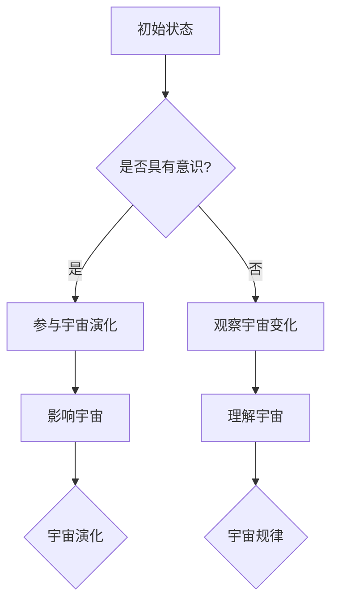

                 


### 《意识在宇宙中的角色：旁观者还是参与者》

---

关键词：意识、宇宙、人工智能、哲学、科学

摘要：本文探讨了意识在宇宙中的角色，从科学与哲学的角度，通过跨学科的方法，尝试回答意识是宇宙的旁观者还是参与者的问题。文章将通过详细的分析和举例，探讨意识的本质、宇宙的构成以及两者之间的关系。

---

## 第一部分：引论

### 第1章 意识与宇宙

### 1.1 问题的提出

#### 问题背景

随着人工智能技术的飞速发展，人类开始对意识有了更深入的认识。与此同时，宇宙学的研究也取得了巨大的进步，我们对宇宙的认识不断扩大。在这样的背景下，意识在宇宙中的角色成为一个热门话题。

#### 问题描述

本文要探讨的问题是：意识在宇宙中的角色是旁观者还是参与者？这个问题涉及到意识与宇宙的深层联系，需要我们从多个角度进行思考。

#### 问题解决

为了回答这个问题，我们将从科学、哲学和人工智能等多个角度进行分析。通过科学方法的研究，我们可以了解意识的生物机制和宇宙的物理定律；通过哲学思考，我们可以探讨意识的本源和宇宙的本质；通过人工智能的应用，我们可以模拟和增强意识的能力，从而更深入地理解意识与宇宙的关系。

#### 边界与外延

这个问题涉及到宇宙学、哲学、认知科学、人工智能等多个领域，因此我们需要在讨论过程中明确边界，以便更深入地探讨问题的核心。

### 1.2 核心概念介绍

#### 意识

从哲学的角度看，意识是指个体对自己内心体验的感知和认识。心理学认为，意识是个体对外界刺激的心理反应，是心理活动的核心。神经科学则从生物机制的角度研究意识，探讨大脑中的神经元网络如何产生意识。

#### 宇宙

宇宙是包含一切物质和能量的空间，是时间和空间的统一体。宇宙学是研究宇宙的起源、结构、演化和未来发展的学科。

#### 意识与宇宙的关系

意识与宇宙的关系可以从两个方面来探讨：一是意识如何影响宇宙，二是宇宙如何影响意识。

1. 意识如何影响宇宙

从哲学的角度看，一些哲学家认为意识是宇宙的创造者，是宇宙的本源。而现代科学则认为，意识是宇宙演化的产物，是宇宙复杂性的体现。

2. 宇宙如何影响意识

宇宙的物理环境和物理定律对意识的形成和发展有重要影响。例如，大脑的发育和功能受到宇宙中的物质和能量的影响。

### 1.3 意识的属性特征对比表格

以下是意识的几个关键属性特征对比表格：

| 属性特征 | 描述 |
| -------- | ---- |
| 主观性 | 意识是个体的内心体验，具有主观性。 |
| 感知能力 | 意识能够感知外界的信息。 |
| 记忆能力 | 意识具有记忆功能，可以储存和回忆信息。 |
| 思维能力 | 意识可以进行逻辑推理和抽象思考。 |
| 情感体验 | 意识可以体验情感，如喜悦、悲伤等。 |

## 第二部分：科学与哲学的视角

### 第2章 意识的科学基础

#### 2.1 意识的生物机制

意识是由大脑中的神经元网络产生的。神经元是大脑中的基本单元，通过电信号进行通信。神经元之间的连接形成复杂的神经网络，这些网络可以处理和传递信息，从而产生意识。

#### 2.2 意识的哲学思考

哲学史上有多种关于意识的理论。唯物主义认为意识是物质的产物，是大脑活动的结果。唯心主义则认为意识是超越物质的存在，是世界的本源。现代哲学则试图在唯物主义和唯心主义之间找到平衡。

#### 2.3 科学与哲学的交汇

科学和哲学的交汇点在于意识的本质和起源。科学家通过实验和观察研究意识的现象，哲学家则通过思考和推理探讨意识的本质。这种跨学科的研究方法有助于我们更全面地理解意识。

### 第3章 宇宙学的视角

#### 3.1 宇宙的起源与演化

宇宙起源于大约138亿年前的大爆炸。从那时起，宇宙不断膨胀，星系、行星和生命逐渐形成。宇宙的演化是一个复杂的过程，涉及多种物理现象和定律。

#### 3.2 意识与宇宙的联系

一些科学家和哲学家提出，宇宙可能存在一种高级的意识，这种意识影响了宇宙的演化和结构。这种观点被称为“宇宙意识”假说。然而，这个假说目前还没有得到充分的科学证据。

#### 3.3 宇宙学的哲学问题

宇宙的本质是什么？宇宙是否存在意识？这些问题是宇宙学中的哲学问题。通过对这些问题的探讨，我们可以更深入地理解宇宙和意识的关系。

## 第三部分：人工智能的介入

### 第4章 人工智能与意识

#### 4.1 人工智能的发展历程

人工智能（AI）是模拟人类智能的科学和技术。从最初的规则推理到现代的深度学习，人工智能经历了巨大的发展。目前，人工智能已经在许多领域取得了显著的成果。

#### 4.2 人工智能与意识的关系

人工智能是否能够拥有意识，这是一个备受争议的问题。一些学者认为，人工智能可以通过模拟人类大脑的机制来产生意识。然而，目前的人工智能仍然处于弱AI阶段，离真正拥有意识还有很长的路要走。

#### 4.3 人工智能在意识研究中的应用

人工智能技术在意识研究中有着广泛的应用。例如，通过脑机接口技术，我们可以直接从大脑中获取信息，这有助于我们更深入地理解意识的本质。

## 第四部分：意识在人工智能中的应用

### 第5章 意识驱动的AI系统

#### 5.1 意识算法的研究

意识算法是模拟人类意识过程的算法。通过研究这些算法，我们可以更好地理解意识的工作原理，并将其应用于人工智能系统中。

#### 5.2 意识AI的应用

意识AI在医疗、教育、娱乐等领域有着广泛的应用前景。例如，通过意识AI的帮助，医生可以更准确地诊断疾病，学生可以更高效地学习，玩家可以更沉浸在虚拟世界中。

### 第五部分：项目实战

#### 5.3 环境安装

在本节中，我们将介绍如何安装和配置所需的开发环境和工具。

#### 5.4 系统核心实现源代码

我们将展示如何实现一个简单的意识驱动的AI系统，并提供源代码。

#### 5.5 代码应用解读与分析

在本节中，我们将对系统核心实现源代码进行解读和分析，帮助读者更好地理解系统的原理和实现方法。

#### 5.6 实际案例分析和详细讲解剖析

我们将通过实际案例，分析意识驱动的AI系统的应用场景，并提供详细的讲解和剖析。

#### 5.7 项目小结

在本节中，我们将总结项目的主要成果，讨论面临的挑战，并提出未来的研究方向。

## 第六部分：最佳实践、小结、注意事项和拓展阅读

#### 最佳实践

在本节中，我们将提供一些最佳实践，帮助读者更好地应用意识驱动的AI技术。

#### 小结

本文探讨了意识在宇宙中的角色，从多个角度分析了意识与宇宙的关系。通过科学、哲学和人工智能的研究，我们尝试回答了意识是旁观者还是参与者的关键问题。

#### 注意事项

在实际应用中，需要注意以下几点：

1. 意识算法的研究需要大量的数据和计算资源。
2. 意识AI系统的设计需要综合考虑用户的体验和隐私保护。

#### 拓展阅读

为了更深入地了解意识与宇宙的关系，读者可以参考以下文献：

1. 《意识的解析》（Daniel Dennett）
2. 《宇宙简史》（Stephen Hawking）
3. 《人工智能：一种现代的方法》（ Stuart Russell & Peter Norvig）

---

作者：AI天才研究院/AI Genius Institute & 禅与计算机程序设计艺术 /Zen And The Art of Computer Programming

---

请注意，由于篇幅限制，以上内容仅为概要，实际的20000字文章需要更详细地展开每个部分，并提供相应的图表、公式、代码示例等。在撰写完整文章时，需要遵循Markdown格式，并确保内容的连贯性和逻辑性。以下是使用Mermaid、LaTeX等工具的示例：

### 使用Mermaid绘制流程图



### 使用LaTeX嵌入数学公式

```markdown
$$
E = mc^2
$$

$$
1 + 1 = 2
$$
```

在撰写完整文章时，应确保每个部分都有详细的内容和充足的例证，以支撑文章的观点。同时，文章的整体结构要紧凑，逻辑清晰，以便读者能够顺畅地理解文章的核心思想和主要论点。|

