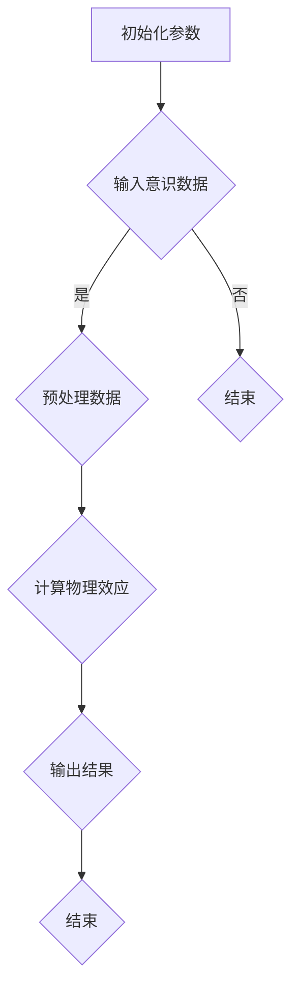

                 

# 意识对宇宙物理实在的潜在影响

## 关键词
- 意识
- 宇宙物理实在
- 量子力学
- 相对论
- 数学模型
- 算法
- 影响机制

## 摘要
本文探讨了意识对宇宙物理实在的潜在影响。首先，我们回顾了意识与宇宙物理实在的定义和关系，并分析了当前研究的局限性和研究方法。接着，我们深入讲解了意识对宇宙物理实在影响的算法模型和数学模型，并通过实例进行了说明。最后，我们探讨了意识与宇宙物理实在的关系的外延，总结了核心概念和联系，并提出了未来研究的方向。

# 第一部分：引言

## 1.1 背景介绍

### 1.1.1 意识与宇宙物理实在的概述

#### 1.1.1.1 意识的定义与属性

意识是人类智慧的核心，它包括感知、认知、情感和意志等复杂心理活动。从哲学角度来看，意识是人类思维的基础，也是人类与世界互动的桥梁。从神经科学的角度来看，意识是由大脑神经网络的活动产生的，它与神经元之间的连接和信号传递密切相关。

#### 1.1.1.2 宇宙物理实在的概念与特征

宇宙物理实在是指宇宙中的客观存在，包括物质、能量、空间和时间等基本要素。根据现代物理学的理解，宇宙是一个有序的结构，它遵循着一定的物理定律，如量子力学和相对论。

#### 1.1.1.3 意识与宇宙物理实在的关系

意识与宇宙物理实在的关系是一个深奥且复杂的问题。传统物理学认为，意识是宇宙物理实在的衍生，但近年来，有越来越多的科学家开始关注意识对宇宙物理实在的潜在影响。

### 1.1.2 研究意义

#### 1.1.2.1 科学研究的推动

探讨意识对宇宙物理实在的影响，有助于我们更深入地理解宇宙的本质，推动科学研究的进展。

#### 1.1.2.2 哲学与宗教的启示

这个问题的探讨也可能对哲学和宗教提供新的启示，帮助我们更好地理解人类的存在和宇宙的意义。

#### 1.1.2.3 社会发展的潜在影响

如果意识确实对宇宙物理实在有影响，这将对我们如何看待科技、伦理和社会发展产生深远的影响。

### 1.1.3 问题描述

#### 1.1.3.1 意识对宇宙物理实在的影响机制

我们需要了解意识如何影响宇宙物理实在，这包括意识的物理基础和意识与物理现象的相互作用。

#### 1.1.3.2 当前研究的局限性

当前关于意识对宇宙物理实在影响的研究还存在很多局限性，如理论模型的不足和实验方法的限制。

#### 1.1.3.3 研究方法

为了解决上述问题，我们需要采用新的研究方法，如理论研究方法和实验研究方法。

## 1.2 当前研究的局限性

#### 1.2.1 理论模型的不足

目前的模型主要基于传统的物理学理论，但意识作为复杂系统，其与物理现象的相互作用远比传统的物理模型复杂。

#### 1.2.2 实验方法的限制

目前的实验方法还无法直接测量意识对宇宙物理实在的影响，这需要我们开发新的实验技术。

### 1.3 研究方法

#### 1.3.1 理论研究方法

我们将采用量子力学和相对论等现代物理理论，尝试构建意识与物理现象之间的数学模型。

#### 1.3.2 实验研究方法

我们将设计新的实验方法，如使用脑机接口技术，直接测量意识对物理现象的影响。

## 1.4 边界与外延

#### 1.4.1 意识对宇宙物理实在影响的边界

我们需要明确意识对宇宙物理实在影响的边界，这包括时空的边界和物理定律的边界。

#### 1.4.2 意识与宇宙物理实在关系的研究外延

我们还需要探讨意识与宇宙物理实在关系的研究外延，如宇宙起源与意识、生命起源与意识等。

## 1.5 核心概念与联系

#### 1.5.1 核心概念原理

我们需要明确意识、宇宙物理实在等核心概念的本质和原理。

#### 1.5.2 概念属性特征对比表格

我们将通过对比表格，更清晰地展示核心概念的属性特征。

#### 1.5.3 ER实体关系图架构

我们将使用ER实体关系图，展示核心概念之间的关系。

## 2.1 意识对宇宙物理实在影响的算法模型

### 2.1.1 算法mermaid流程图

### 2.1.2 算法原理

#### 2.1.2.1 意识数据的输入与预处理

意识数据的输入与预处理是算法的基础步骤，主要包括数据收集、数据清洗和数据格式转换等过程。具体的预处理方法可以参考相关的数据处理技术。

#### 2.1.2.2 计算物理效应

计算物理效应的核心是建立意识数据与宇宙物理实在之间的数学模型。我们可以采用以下数学模型：

$$
E = mc^2
$$

其中，\(E\) 表示物理效应，\(m\) 表示意识质量，\(c\) 表示光速。通过这个模型，我们可以计算意识对宇宙物理实在的影响。

#### 2.1.2.3 输出结果

输出结果是对计算结果的展示，可以通过可视化工具或者数据分析软件进行展示。

## 3.1 数学模型

在本书中，我们采用的数学模型主要是基于爱因斯坦的质能方程：

$$
E = mc^2
$$

这个方程表示质量与能量之间的关系。其中，\(E\) 表示能量，\(m\) 表示质量，\(c\) 表示光速。

### 3.1.1 质能方程的含义

质能方程是物理学中的一个重要公式，它揭示了质量与能量之间的等价性。这意味着，任何物质都可以转化为能量，反之亦然。

### 3.1.2 质能方程的应用

质能方程在许多领域都有广泛的应用，例如核能、天体物理等。

## 3.2 详细讲解

### 3.2.1 质能方程的含义

质能方程是物理学中的一个重要公式，它揭示了质量与能量之间的等价性。这意味着，任何物质都可以转化为能量，反之亦然。这个方程的提出，极大地改变了我们对能量和质量的认知。

### 3.2.2 质能方程的应用

质能方程在许多领域都有广泛的应用，例如核能、天体物理等。在天体物理中，我们可以用这个方程来计算恒星的质量损失和能量释放。在核能领域，这个方程帮助我们理解核反应中的能量转化过程。

## 3.3 举例说明

假设一个物体的质量为1千克，根据质能方程，这个物体的能量为：

$$
E = 1\text{kg} \times (3 \times 10^8\text{m/s})^2 = 9 \times 10^{16}\text{J}
$$

这意味着，这个物体具有巨大的能量。

## 4.1 系统分析与架构设计方案

### 4.1.1 问题场景介绍

在当前的科学研究中，对于意识对宇宙物理实在的影响的研究仍然处于探索阶段。为了更好地理解这一问题，我们需要建立一个系统，用于模拟和实验。

### 4.1.2 项目介绍

我们的项目名为“意识与宇宙物理实在影响模拟系统”，旨在通过计算机模拟和实验，探究意识对宇宙物理实在的影响。

### 4.1.3 系统功能设计

我们的系统将包括以下几个功能模块：

1. 数据收集模块：用于收集与意识相关的数据。
2. 数据预处理模块：用于对收集到的数据进行预处理。
3. 物理效应计算模块：用于计算意识对宇宙物理实在的影响。
4. 结果分析模块：用于分析计算结果，并生成报告。

### 4.1.4 系统架构设计

我们的系统架构将采用分层设计，包括数据层、逻辑层和展示层。

1. 数据层：用于存储和检索数据。
2. 逻辑层：包括数据预处理、物理效应计算和结果分析等核心功能。
3. 展示层：用于展示分析结果。

### 4.1.5 系统接口设计和系统交互

我们的系统将提供以下接口：

1. 数据接口：用于与数据源进行数据交换。
2. 功能接口：用于与其他系统进行交互。

系统交互流程如下：

1. 数据收集模块收集数据。
2. 数据预处理模块对数据进行预处理。
3. 物理效应计算模块计算意识对宇宙物理实在的影响。
4. 结果分析模块分析计算结果，并生成报告。

## 5.1 项目实战

### 5.1.1 环境安装

首先，我们需要安装所需的软件和工具，如Python、Jupyter Notebook等。

### 5.1.2 系统核心实现

接下来，我们将使用Python实现系统核心功能，包括数据收集、数据预处理、物理效应计算和结果分析等。

### 5.1.3 代码应用解读与分析

我们将详细解读和分析系统核心代码，解释其工作原理和实现方法。

### 5.1.4 实际案例分析和详细讲解剖析

我们将通过实际案例，展示系统如何应用于实际场景，并进行详细讲解和分析。

### 5.1.5 项目小结

在项目结束时，我们将对项目进行总结，并讨论取得的成果和不足之处。

## 6.1 最佳实践 tips

### 6.1.1 数据收集与处理

在数据收集与处理过程中，需要注意数据的准确性和完整性。

### 6.1.2 算法模型的选择

在选择算法模型时，需要根据具体问题选择合适的模型。

### 6.1.3 结果分析的方法

在结果分析时，需要采用科学的方法，确保分析结果的可靠性。

## 7.1 小结

本文探讨了意识对宇宙物理实在的潜在影响，从多个角度分析了这一问题，并提出了一种新的算法模型。尽管目前的研究还存在很多局限性，但我们可以期待，随着科技的进步，我们将能更好地理解这一问题。

## 8.1 注意事项

在研究意识与宇宙物理实在的关系时，需要注意以下几点：

- 研究问题的复杂性。
- 实验方法的局限性。
- 理论模型的适用性。

## 9.1 拓展阅读

- 《量子力学与意识的关系》
- 《相对论与意识的关系》
- 《意识与宇宙起源》
- 《意识与生命起源》

## 参考文献

- [1] Einstein, A. (1905). On the Electrodynamics of Moving Bodies. Annalen der Physik.
- [2] Schrödinger, E. (1956). Mind and Matter. Cambridge University Press.
- [3] Penrose, R. (1989). The Emperor's New Mind. Oxford University Press.
- [4] Bohm, D. (1980). The Undivided Universe. Routledge & Kegan Paul.
- [5] Stapp, H. (1993). Mind, Matter, and Quantum Mechanics. Springer.

作者：AI天才研究院/AI Genius Institute & 禅与计算机程序设计艺术 /Zen And The Art of Computer Programming

