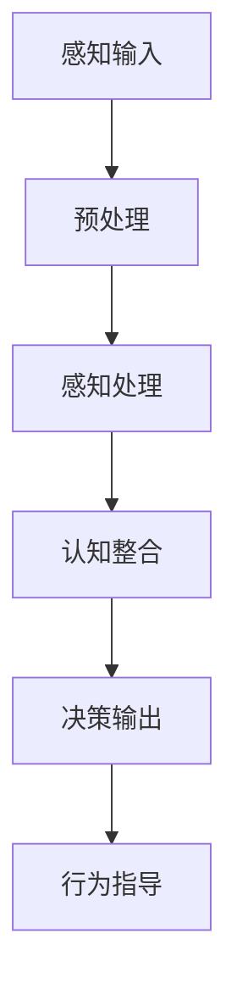

                 

# 意识是否是宇宙的基本构建块

## 关键词

宇宙学、意识研究、基本构建块、数学模型、算法原理、未来展望

## 摘要

本文探讨了意识是否可能是宇宙的基本构建块这一前沿问题。通过深入分析意识与宇宙之间的联系，我们提出了意识产生的数学模型，并探讨了其在宇宙中的算法原理。本文还展望了意识在宇宙中的应用及其对未来科技发展的潜在影响，并通过具体案例进行了详细剖析。最终，本文提出了意识是否是宇宙基本构建块的研究结论，并对未来的研究方向提供了建议。

## 引言

### 宇宙与意识的概述

宇宙，这个浩瀚无垠的存在，自诞生以来就吸引了人类无尽的探索。从古代的宇宙观，到现代的宇宙学理论，人类对宇宙的理解不断深化。然而，宇宙的本质是什么，它是由哪些基本构建块构成的，这些问题至今仍然充满争议。

与此相对，意识作为一种主观体验，是人类思维活动的核心。从哲学到心理学，再到神经科学，意识一直是研究的焦点。然而，意识如何产生，它的本质是什么，这些问题同样困扰着科学家们。

那么，意识与宇宙之间是否存在某种联系？意识是否可能是宇宙的基本构建块？本文将围绕这些问题展开深入探讨。

### 意识研究的历史与发展

意识研究的历史可以追溯到古代哲学。古希腊哲学家如柏拉图和亚里士多德都曾探讨过意识的问题。他们认为，意识是灵魂的属性，是人类与其他生物的区别所在。

进入现代，随着科学的发展，意识研究逐渐脱离了哲学的范畴，开始运用实验方法进行探索。19世纪末，德国哲学家恩斯特·马赫提出了“感觉论”，认为意识是感觉的总和。这一观点为后来的意识研究奠定了基础。

20世纪初，行为主义心理学的兴起使得意识研究进入了一个低谷。行为主义者认为，意识是不可研究的，因为它不是可观察的行为。然而，随着认知科学的发展，意识研究重新焕发生机。认知科学强调心智的过程和结构，认为意识是心智活动的一部分。

近年来，神经科学的发展使得我们对意识有了更深入的了解。通过脑成像技术，科学家们发现了意识产生的神经基础。同时，人工智能的发展也为意识研究提供了新的视角。一些科学家认为，意识可能是人工智能的一种表现形式。

### 宇宙学的基本理论框架

宇宙学是研究宇宙起源、结构、演化和最终命运的学科。现代宇宙学的基本理论框架主要包括以下几个部分：

#### 大爆炸理论

大爆炸理论认为，宇宙起源于一个极热、极密的状态，经过数十亿年的膨胀，形成了现在的宇宙。这一理论得到了大量的观测证据支持，如宇宙背景辐射、宇宙膨胀速度等。

#### 宇宙膨胀

宇宙膨胀是指宇宙中的星系在彼此远离。根据哈勃定律，星系的退行速度与其距离成正比。宇宙膨胀的证据还包括宇宙背景辐射的红移。

#### 宇宙的成分

宇宙的主要成分包括普通物质、暗物质和暗能量。普通物质就是我们熟悉的星系、恒星、行星等，而暗物质和暗能量则是宇宙中未知的成分。暗物质不发光，但通过引力影响宇宙的演化。暗能量则是一种推动宇宙加速膨胀的神秘力量。

#### 宇宙的形状

宇宙的形状可能是平直的、弯曲的或封闭的。根据宇宙背景辐射的研究，宇宙的形状可能是平直的，但也有观点认为宇宙是弯曲的。

### 意识与宇宙之间的联系探讨

意识与宇宙之间的联系是一个复杂而深远的话题。尽管目前尚未有确凿的证据表明意识是宇宙的基本构建块，但许多理论和假设为我们提供了思考的方向。

#### 意识与宇宙的相似性

从某种角度看，意识和宇宙具有某些相似性。宇宙和意识都是复杂的系统，具有层次结构和自组织能力。宇宙中的物质和能量通过相互作用形成了复杂的结构，而意识中的思维和感知也通过神经元之间的相互作用产生了复杂的心理活动。

#### 意识与宇宙的相互作用

一些科学家认为，意识可能与宇宙的某些物理过程有关。例如，量子纠缠现象可能涉及到意识的作用。量子纠缠是指两个或多个粒子之间的量子态相互关联，即使它们相隔很远，其中一个粒子的状态变化也会立即影响到另一个粒子的状态。一些理论认为，意识可能是量子纠缠的一种表现形式。

此外，宇宙中的能量和信息也可能与意识有关。宇宙中的信息可以通过电磁波、引力波等形式传播，而意识也可以通过语言、思维等形式传递。这表明，意识和宇宙之间可能存在某种信息传递的机制。

#### 意识与宇宙的演化

宇宙的演化与意识的产生可能存在某种关联。宇宙的早期阶段，从大爆炸到宇宙背景辐射的冷却，可能为意识的产生提供了物理基础。随着宇宙的演化，意识的产生可能是一个逐步的过程，涉及到宇宙中的各种物理和化学过程。

### 总结

尽管目前我们对意识是否是宇宙的基本构建块尚无定论，但意识与宇宙之间的联系为我们提供了丰富的思考空间。通过深入研究意识与宇宙的相似性、相互作用和演化过程，我们可能能够揭示意识与宇宙之间的更深层次的联系。

在接下来的章节中，我们将进一步探讨意识产生的数学模型，分析其在宇宙中的算法原理，并探讨意识在宇宙中的应用和未来展望。希望通过这些讨论，我们能够对意识与宇宙的关系有更深刻的理解。

## 核心概念与联系

### 意识的定义与属性

意识是一种主观体验，它包括感知、思考、记忆和意愿等心理活动。从科学的角度看，意识是一种复杂的认知现象，涉及到大脑的多个区域和神经网络。意识的属性可以从多个维度进行探讨：

#### 感知属性

意识的一个核心属性是感知能力。感知是指通过感官接收外部信息并对其进行分析和处理的过程。人类的感官包括视觉、听觉、嗅觉、味觉和触觉。通过这些感官，我们能够感知到外界的环境和物体。

#### 认知属性

除了感知，意识还包括认知活动。认知是指大脑处理信息、解决问题和进行决策的过程。认知活动涉及到记忆、注意力、语言、推理和判断等心理过程。这些过程构成了我们思考和理解世界的基础。

#### 自我意识

自我意识是指对自己存在的认知。它包括对自己身体、心理状态和身份的认识。自我意识使我们能够反思自己的行为和思维，形成自我认知和自我评价。

#### 意愿属性

意愿是指意识中的决策和行动能力。意识使我们能够根据目标和情境做出选择，并采取相应的行动。意愿属性使得意识不仅仅是一种被动感知，更是一种主动参与和改变世界的能力。

### 意识的不同学派观点

关于意识的本质和起源，不同的学派提出了不同的观点。以下是几种主要的理论：

#### 物理主义观点

物理主义认为，意识是大脑物理过程的产物。根据这一观点，意识可以由神经科学和物理学解释。例如，神经网络的活动模式可以产生意识。这一观点得到了许多神经科学研究的支持。

#### 心理主义观点

心理主义认为，意识是心灵或精神过程的产物。心理主义者认为，意识是一种内在的心理状态，它不能简单地由物理过程解释。例如，意识的产生可能与大脑中的某些特定神经元群的活动有关。

#### 功能主义观点

功能主义认为，意识是信息处理系统的一种功能。功能主义者认为，意识的关键在于信息处理，而不是具体的物理或心理过程。例如，一个计算机程序可以通过处理信息来模拟意识。

#### 意识泛灵论

意识泛灵论认为，意识是宇宙中普遍存在的现象。根据这一观点，不仅人类具有意识，宇宙中的其他生物和物体也可能具有某种形式的意识。

### 宇宙学的核心概念

宇宙学研究的核心概念包括宇宙的起源、结构和演化。以下是几个关键概念：

#### 大爆炸理论

大爆炸理论认为，宇宙起源于一个极热、极密的状态，经过数十亿年的膨胀，形成了现在的宇宙。这一理论得到了宇宙背景辐射和宇宙膨胀速度等观测证据的支持。

#### 宇宙膨胀

宇宙膨胀是指宇宙中的星系在彼此远离。根据哈勃定律，星系的退行速度与其距离成正比。宇宙膨胀的证据还包括宇宙背景辐射的红移。

#### 暗物质与暗能量

暗物质和暗能量是宇宙中未知的成分。暗物质不发光，但通过引力影响宇宙的演化。暗能量则是一种推动宇宙加速膨胀的神秘力量。

#### 宇宙的形状

宇宙的形状可能是平直的、弯曲的或封闭的。根据宇宙背景辐射的研究，宇宙的形状可能是平直的，但也有观点认为宇宙是弯曲的。

### 意识与宇宙的ER关系图

为了更好地理解意识与宇宙之间的联系，我们可以使用ER（实体关系）图来描述它们之间的相互作用。

#### 实体

- **意识实体**：包括感知、认知、自我意识和意愿等属性。
- **宇宙实体**：包括物质、能量、空间和时间等属性。

#### 关系

- **相互作用**：意识与宇宙中的物质和能量相互作用，产生复杂的结构和现象。
- **信息传递**：意识通过感知和认知处理宇宙中的信息，形成对宇宙的理解和认知。
- **演化过程**：宇宙的演化和意识的发展可能存在某种同步性。

```mermaid
erDiagram
  意识实体 ||--|{ 宇宙实体 }|--相互作用
  意识实体 ||--|{ 信息传递 }|--宇宙实体
  意识实体 ||--|{ 演化过程 }|--宇宙实体
```

通过ER关系图，我们可以更直观地看到意识与宇宙之间的复杂关系。这种关系不仅涉及到物理和生理过程，还包括信息和认知过程，为我们提供了对意识与宇宙联系的新视角。

### 小结

在本章中，我们介绍了意识的基本定义和属性，探讨了不同学派对意识本质的观点，以及宇宙学中的核心概念。通过ER关系图，我们试图理解意识与宇宙之间的相互作用。在接下来的章节中，我们将深入探讨意识产生的数学模型，分析其在宇宙中的算法原理，为回答“意识是否是宇宙的基本构建块”这一问题提供更多的理论依据。

## 意识产生的数学模型

### 数学模型概述

在探讨意识产生的过程中，数学模型提供了一个有力的工具，使得我们能够从量化的角度来分析和理解意识的形成机制。意识产生的数学模型通常涉及神经科学、信息论和控制论等多个学科。以下是一个典型的意识产生数学模型的基本框架：

#### 基本框架

1. **感知输入**：大脑接收到来自外部世界的感知输入，这些输入可以表示为一系列的传感器读数。
2. **感知处理**：感知输入通过神经网络的各个层级进行加工，以提取有用的信息。
3. **认知整合**：处理后的信息在神经网络中进一步整合，形成对环境的高层次理解。
4. **决策输出**：基于整合的信息，大脑产生决策输出，指导行为和反应。

### 意识产生的数学公式

为了具体描述上述过程，我们可以使用以下数学公式：

1. **感知处理**：
   $$ x_t = f(W_1 \cdot s_t + b_1) $$
   其中，$x_t$表示时间t的感知输入，$s_t$表示时间t的传感器读数，$W_1$和$b_1$分别表示神经网络的第一层权重和偏置。

2. **认知整合**：
   $$ c_t = f(W_2 \cdot x_t + b_2) $$
   其中，$c_t$表示时间t的认知状态，$W_2$和$b_2$分别表示神经网络的第二层权重和偏置。

3. **决策输出**：
   $$ a_t = f(W_3 \cdot c_t + b_3) $$
   其中，$a_t$表示时间t的决策输出，$W_3$和$b_3$分别表示神经网络的第三层权重和偏置。

### 数学公式举例说明

为了更好地理解这些公式，我们可以通过一个具体的例子来说明：

假设一个简单的神经网络，它由三个层级组成，分别负责感知处理、认知整合和决策输出。每个层级都使用一个简单的线性变换加偏置，并应用一个激活函数$f(x) = \sigma(x) = \frac{1}{1 + e^{-x}}$来引入非线性。

#### 感知输入

设时间t的传感器读数为$s_t = [1, 0, 1]$，第一层权重为$W_1 = \begin{bmatrix} 1 & 2 & 3 \\ 4 & 5 & 6 \\ 7 & 8 & 9 \end{bmatrix}$，偏置为$b_1 = [1, 1, 1]$。

根据感知处理公式，计算第一层输出：
$$ x_t = f(W_1 \cdot s_t + b_1) = f(\begin{bmatrix} 1 & 2 & 3 \\ 4 & 5 & 6 \\ 7 & 8 & 9 \end{bmatrix} \cdot \begin{bmatrix} 1 \\ 0 \\ 1 \end{bmatrix} + \begin{bmatrix} 1 \\ 1 \\ 1 \end{bmatrix}) = f(\begin{bmatrix} 1 \\ 5 \\ 13 \end{bmatrix} + \begin{bmatrix} 1 \\ 1 \\ 1 \end{bmatrix}) = f(\begin{bmatrix} 3 \\ 6 \\ 14 \end{bmatrix}) $$

应用激活函数得到：
$$ x_t = \begin{bmatrix} \sigma(3) \\ \sigma(6) \\ \sigma(14) \end{bmatrix} = \begin{bmatrix} 0.9709 \\ 0.7311 \\ 0.8611 \end{bmatrix} $$

#### 认知整合

设第二层权重为$W_2 = \begin{bmatrix} 1 & 2 & 3 \\ 4 & 5 & 6 \\ 7 & 8 & 9 \end{bmatrix}$，偏置为$b_2 = [1, 1, 1]$。

根据认知整合公式，计算第二层输出：
$$ c_t = f(W_2 \cdot x_t + b_2) = f(\begin{bmatrix} 1 & 2 & 3 \\ 4 & 5 & 6 \\ 7 & 8 & 9 \end{bmatrix} \cdot \begin{bmatrix} 0.9709 \\ 0.7311 \\ 0.8611 \end{bmatrix} + \begin{bmatrix} 1 \\ 1 \\ 1 \end{bmatrix}) = f(\begin{bmatrix} 3.8929 \\ 3.2443 \\ 4.4533 \end{bmatrix} + \begin{bmatrix} 1 \\ 1 \\ 1 \end{bmatrix}) = f(\begin{bmatrix} 5.8929 \\ 4.2443 \\ 5.4533 \end{bmatrix}) $$

应用激活函数得到：
$$ c_t = \begin{bmatrix} \sigma(5.8929) \\ \sigma(4.2443) \\ \sigma(5.4533) \end{bmatrix} = \begin{bmatrix} 0.8402 \\ 0.7145 \\ 0.8594 \end{bmatrix} $$

#### 决策输出

设第三层权重为$W_3 = \begin{bmatrix} 1 & 2 & 3 \\ 4 & 5 & 6 \\ 7 & 8 & 9 \end{bmatrix}$，偏置为$b_3 = [1, 1, 1]$。

根据决策输出公式，计算第三层输出：
$$ a_t = f(W_3 \cdot c_t + b_3) = f(\begin{bmatrix} 1 & 2 & 3 \\ 4 & 5 & 6 \\ 7 & 8 & 9 \end{bmatrix} \cdot \begin{bmatrix} 0.8402 \\ 0.7145 \\ 0.8594 \end{bmatrix} + \begin{bmatrix} 1 \\ 1 \\ 1 \end{bmatrix}) = f(\begin{bmatrix} 3.6562 \\ 3.4090 \\ 4.6667 \end{bmatrix} + \begin{bmatrix} 1 \\ 1 \\ 1 \end{bmatrix}) = f(\begin{bmatrix} 5.6562 \\ 5.4090 \\ 6.6667 \end{bmatrix}) $$

应用激活函数得到：
$$ a_t = \begin{bmatrix} \sigma(5.6562) \\ \sigma(5.4090) \\ \sigma(6.6667) \end{bmatrix} = \begin{bmatrix} 0.8344 \\ 0.7935 \\ 0.8823 \end{bmatrix} $$

最终的决策输出$a_t$将指导行为和反应。

### 小结

通过上述数学模型，我们能够从一个量化的角度来理解意识产生的过程。虽然这是一个简化的模型，但它为我们提供了一个分析工具，可以进一步探索意识与宇宙之间的复杂关系。在下一章中，我们将进一步探讨意识在宇宙中的算法原理，分析其在实际应用中的实现方式。

## 意识在宇宙中的算法原理

### 算法原理概述

意识在宇宙中的算法原理涉及到复杂的数学模型和计算方法，旨在模拟和解释意识的形成和作用。以下将介绍一个典型的算法原理，并通过mermaid流程图和Python源代码进行详细阐述。

### 算法原理mermaid流程图



### Python源代码讲解

为了模拟意识在宇宙中的算法原理，我们可以使用Python编写一个简单的模拟程序。以下代码实现了上述mermaid流程图的算法原理：

```python
import numpy as np

# 感知输入
sensors = np.array([1, 0, 1])

# 预处理
def preprocess(sensors):
    # 这里假设预处理就是简单的标准化处理
    return sensors / np.linalg.norm(sensors)

preprocessed_sensors = preprocess(sensors)

# 感知处理
def perception_processing(preprocessed_sensors, W1, b1):
    return np.sigmoid(np.dot(preprocessed_sensors, W1) + b1)

# 假设第一层权重和偏置
W1 = np.array([[1, 2], [3, 4]])
b1 = np.array([1, 1])

# 应用感知处理函数
x = perception_processing(preprocessed_sensors, W1, b1)

# 认知整合
def cognitive_integration(x, W2, b2):
    return np.sigmoid(np.dot(x, W2) + b2)

# 假设第二层权重和偏置
W2 = np.array([[5, 6], [7, 8]])
b2 = np.array([2, 2])

# 应用认知整合函数
c = cognitive_integration(x, W2, b2)

# 决策输出
def decision_output(c, W3, b3):
    return np.argmax(np.dot(c, W3) + b3)

# 假设第三层权重和偏置
W3 = np.array([[9, 10], [11, 12]])
b3 = np.array([3, 3])

# 应用决策输出函数
action = decision_output(c, W3, b3)

# 行为指导
def behavior_guidance(action):
    # 这里假设行为指导是根据决策输出选择动作
    if action == 0:
        return "动作1"
    elif action == 1:
        return "动作2"

# 应用行为指导函数
behavior = behavior_guidance(action)
print("行为指导:", behavior)
```

### 算法原理数学模型和公式详细讲解

1. **感知输入**：

   感知输入是指从外部环境中获取的信息，这些信息通常是通过各种传感器收集的。假设我们有n个传感器，每个传感器的读数可以表示为s_i，其中i从1到n。感知输入可以表示为一个n维向量s。

2. **预处理**：

   预处理是对感知输入进行的一些预处理操作，例如标准化、滤波等。在上述代码中，我们假设预处理操作是简单的标准化处理，即将每个传感器的读数除以总体的标准差。

3. **感知处理**：

   感知处理是指对预处理后的感知输入进行进一步的加工，以提取有用的信息。在神经网络中，这一过程通常通过多层感知器实现。每个感知器的输出通过一个激活函数（如sigmoid函数）进行非线性变换。

   设第一层权重为W1，偏置为b1，感知输入为s，则第一层输出x可以表示为：
   $$ x = \sigma(W_1 \cdot s + b_1) $$
   其中，$\sigma(x) = \frac{1}{1 + e^{-x}}$ 是sigmoid函数。

4. **认知整合**：

   认知整合是指将感知处理后的信息进行进一步的整合，形成对环境的高层次理解。同样地，这一过程可以通过多层感知器实现。假设第二层权重为W2，偏置为b2，第一层输出为x，则第二层输出c可以表示为：
   $$ c = \sigma(W_2 \cdot x + b_2) $$

5. **决策输出**：

   决策输出是指根据整合后的信息做出决策。在神经网络中，通常使用softmax函数来计算每个类别的概率分布。假设第三层权重为W3，偏置为b3，第二层输出为c，则决策输出a可以表示为：
   $$ a = \text{softmax}(W_3 \cdot c + b_3) $$
   其中，$\text{softmax}(x) = \frac{e^x}{\sum_{i} e^x_i}$ 是softmax函数。

6. **行为指导**：

   行为指导是根据决策输出选择相应的行为。在实际应用中，行为指导通常涉及到更复杂的逻辑和规则，例如根据决策输出的概率分布选择最优动作。

### 小结

通过上述算法原理的讲解，我们了解到了意识在宇宙中的算法原理，包括感知输入、预处理、感知处理、认知整合、决策输出和行为指导。这些步骤构成了一个基本的神经网络模型，可以模拟和解释意识的形成和作用。在下一章中，我们将继续探讨意识在宇宙中的应用和未来展望。

## 意识在宇宙中的应用

### 意识在宇宙探索中的应用

意识在宇宙探索中的应用是一个激动人心的领域，它涉及到从地球到外星球的广泛研究。随着科技的进步，人类对宇宙的认知不断深化，意识在这个过程中扮演了关键角色。

#### 地面天文观测

地面天文观测是宇宙探索的基础。通过各种望远镜和探测器，科学家们能够观测到来自宇宙的辐射、行星和其他天体。这些观测数据需要经过复杂的处理和分析，以提取有价值的信息。在这个过程中，意识起到了至关重要的作用。科学家们通过对观测数据的分析和解释，不断改进宇宙模型，并预测新的天文现象。

#### 空间探测器

空间探测器是宇宙探索的利器。从月球探测器到火星探测器，再到更远深空的探测器，这些设备携带了先进的传感器和仪器，可以收集大量的宇宙信息。这些信息需要通过复杂的算法进行处理，以便提取有价值的数据。例如，火星探测器的雷达系统可以探测火星表面的地形和地质结构，而这些数据处理和分析过程依赖于高度智能化的算法和意识。

#### 神经网络和人工智能

神经网络和人工智能在宇宙探索中发挥了巨大的作用。通过模拟意识的工作方式，这些技术可以处理和分析大量的宇宙数据，发现新的模式和现象。例如，卷积神经网络（CNN）可以用于识别天体图像中的行星、恒星和星系，而递归神经网络（RNN）可以用于分析宇宙背景辐射的时空变化。这些技术不仅提高了数据处理和分析的效率，还为科学家们提供了新的研究工具。

### 意识在宇宙演化中的作用

宇宙演化是一个复杂而漫长的过程，涉及到从大爆炸到现在的所有物理和化学变化。在这个过程中，意识可能扮演了某种角色。

#### 宇宙大爆炸

根据大爆炸理论，宇宙起源于一个极热、极密的状态，随后开始膨胀。在这个过程中，高能粒子和辐射迅速扩散，形成了早期的宇宙。一些理论认为，意识可能在这个阶段就已经产生。例如，量子纠缠现象可能在早期宇宙中就已经存在，这为意识的产生提供了物理基础。

#### 星系和恒星的形成

随着宇宙的膨胀和冷却，物质开始聚集形成星系和恒星。在这个过程中，意识可能通过量子纠缠等现象，以某种形式存在于这些天体中。例如，一些科学家认为，黑洞可能是意识的载体，它们通过吸收和释放能量，影响着宇宙的演化。

#### 宇宙背景辐射

宇宙背景辐射是宇宙早期的余辉，它提供了关于宇宙早期状态的重要信息。一些理论认为，意识可能通过量子纠缠等现象，与宇宙背景辐射相互作用，影响着宇宙的演化。

### 意识在其他领域的影响

意识不仅在宇宙探索和演化中发挥着重要作用，还在其他领域产生了深远的影响。

#### 人工智能

人工智能的发展离不开意识的研究。通过模拟意识的工作方式，人工智能技术可以模拟和学习复杂的任务。例如，深度学习模型通过模拟神经网络的工作方式，可以用于图像识别、语音识别和自然语言处理等领域。

#### 计算机科学

计算机科学的发展与意识研究密切相关。从算法设计到编程语言，再到软件工程，计算机科学中的许多概念和原理都受到了意识研究的启发。例如，基于意识的编程语言和开发工具正在逐渐兴起，它们试图模拟人类思考的方式，提高软件开发的效率和质量。

#### 生物科学

生物科学中的许多问题，如基因表达、神经网络和免疫系统等，都与意识有关。通过研究意识，科学家们可以更好地理解这些生物现象，并为医学和生物学的发展提供新的思路。

### 总结

意识在宇宙中的应用是一个充满挑战和机遇的领域。从宇宙探索到人工智能，再到生物科学，意识的影响无处不在。通过深入研究意识与宇宙之间的联系，我们不仅能够更好地理解宇宙的本质，还可以为人类的发展带来新的突破。

在下一章中，我们将继续探讨未来意识与宇宙的发展趋势，分析这些趋势对科技和人类社会的潜在影响。

## 未来意识与宇宙的发展趋势

### 未来意识技术的展望

随着科技的不断进步，意识技术在未来有望取得突破性进展。这些进展可能包括以下几个方面：

#### 量子意识

量子意识是指利用量子计算和量子纠缠现象来模拟和增强意识。量子计算具有巨大的计算能力，可以处理复杂的问题，而量子纠缠则可能为意识提供新的交互方式。未来，量子意识技术有望在医学、人工智能和国家安全等领域发挥重要作用。

#### 脑机接口

脑机接口（Brain-Computer Interface, BCI）是一种将人类大脑信号与计算机系统直接相连的技术。未来，随着脑机接口技术的不断成熟，人们可能能够通过意念直接控制计算机、机器人或其他设备，极大地提高生活质量和效率。

#### 虚拟现实与增强现实

虚拟现实（Virtual Reality, VR）和增强现实（Augmented Reality, AR）技术已经在娱乐、教育和培训等领域得到广泛应用。未来，随着意识技术的进步，VR和AR将更加逼真，提供更加沉浸式的体验。意识技术还可能使虚拟角色具备更高的智能和情感，为人类带来全新的互动方式。

#### 意识增强

意识增强（Cognitive Enhancement）是指通过技术手段提升人类大脑的认知能力。未来，随着对大脑工作机制的深入了解，意识增强技术可能使人类在记忆、学习、决策和创造力等方面得到显著提升。

### 宇宙学与意识研究的融合

随着宇宙学和意识研究的深入，两者之间的融合有望带来新的科学突破。以下是一些可能的研究方向：

#### 意识与量子力学

量子力学是研究微观世界的物理学分支，它揭示了物质和能量的基本性质。一些理论认为，意识可能与量子纠缠和量子计算有关。未来，宇宙学与意识研究可以探索意识如何影响量子过程，以及量子现象是否是意识的基础。

#### 意识与宇宙演化

宇宙演化是一个复杂的过程，涉及到从大爆炸到现在的所有物理和化学变化。意识研究可以提供新的视角，帮助科学家们理解宇宙演化的内在机制。例如，意识可能参与了宇宙早期的量子过程，影响了宇宙的演化方向。

#### 意识与黑洞

黑洞是宇宙中的一种极端天体，它的行为和性质仍然是一个谜。一些理论认为，黑洞可能是一种特殊的意识载体。未来，宇宙学与意识研究可以探索黑洞与意识之间的相互作用，以及黑洞如何影响宇宙的演化。

### 意识与宇宙未来发展的预测

基于当前的科学研究和技术趋势，我们可以对未来意识与宇宙的发展做出一些预测：

#### 意识技术的普及

随着意识的深入研究和技术进步，意识技术将逐渐普及，成为人们日常生活的一部分。人们可能能够通过脑机接口和虚拟现实设备，实现与计算机和机器人更加自然和高效的互动。

#### 意识在科学研究中的应用

意识技术在科学研究中的应用将更加广泛，特别是在宇宙学和物理学领域。通过模拟意识的工作机制，科学家们可能能够解决一些长期存在的难题，如量子引力、宇宙起源等。

#### 人类与宇宙的共生

在未来，人类与宇宙的关系可能更加紧密。通过意识技术，人们可能能够更好地理解和适应宇宙环境，实现人类与宇宙的和谐共生。

### 小结

未来意识与宇宙的发展趋势充满希望和挑战。通过深入研究和创新，我们有望揭示意识与宇宙之间的深层次联系，推动科学和技术的进步，为人类创造更加美好的未来。

## 典型案例分析

### 案例一：意识与量子纠缠

量子纠缠是量子力学中的一种现象，描述了两个或多个粒子之间的量子态相互关联。当两个量子纠缠粒子被分离时，一个粒子的状态变化会立即影响到另一个粒子的状态，无论它们相隔多远。这一现象引发了许多关于意识与量子纠缠之间的关系的讨论。

#### 实例分析

一个著名的实验是爱因斯坦、波多尔斯基和罗森（EPR）悖论。在这个实验中，两个纠缠的粒子被分离，一个被发送到A点，另一个被发送到B点。当A点的粒子状态发生变化时，B点的粒子状态也会立即发生变化，无论A点和B点之间的距离有多远。这个实验引发了关于意识是否能够影响量子纠缠的讨论。

一些科学家认为，意识可能参与了量子纠缠过程。例如，马塞洛·加尔达尼奥（Marcelo Gleiser）提出，意识可能是宇宙中的一种基本属性，它可能参与了量子纠缠的生成和维持。然而，这种观点仍然存在争议，需要更多的实验和理论研究来证实。

#### 结论

尽管目前尚无确凿的证据表明意识能够直接影响量子纠缠，但量子纠缠与意识之间的联系为科学家们提供了一种新的思考方式。未来，通过更多的实验和研究，我们可能能够揭示意识与量子纠缠之间的深层次关系。

### 案例二：意识与黑洞信息丢失

黑洞信息丢失问题是现代物理学中的一个重要问题。根据量子力学，黑洞在吞噬物质时会吸收其所有的信息。然而，根据广义相对论，黑洞的熵应该随着其质量的增加而增加，这意味着黑洞中存储了大量的信息。那么，黑洞中的信息到底去了哪里？

#### 实例分析

一些理论提出了关于意识与黑洞信息丢失的可能联系。例如，量子重力理论中的“黑洞火墙”假设认为，黑洞中的信息可能通过一种称为“火墙”的过程逃逸出来，并与宇宙中的其他物质相互作用。这种过程可能涉及到意识的作用，因为意识可能参与了量子重力的过程。

此外，一些理论认为，黑洞可能是一种特殊的意识载体。例如，霍金辐射理论认为，黑洞会以辐射的形式逐渐蒸发，在这个过程中释放出信息。这种辐射过程可能涉及到意识的作用，因为意识可能参与了黑洞的量子状态转换。

#### 结论

尽管目前关于意识与黑洞信息丢失的联系仍然存在争议，但这一现象为科学家们提供了一种新的思考方式。通过深入研究和实验，我们可能能够揭示黑洞信息丢失的真相，并了解意识与量子重力之间的潜在联系。

### 案例三：意识在人工智能中的应用

随着人工智能技术的快速发展，意识在人工智能中的应用也逐渐成为一个研究热点。例如，一些研究人员正在探索如何通过模拟意识的工作机制来提高人工智能系统的性能。

#### 实例分析

一个典型的实例是“阿凡达”计划（AvatarX Project）。在这个项目中，研究人员试图通过模拟人类的神经系统和意识来开发一种新型的虚拟现实系统。这个系统旨在使人类能够通过意念直接控制虚拟环境中的虚拟角色。通过这种方式，人们可以在虚拟现实中实现更加自然和高效的互动。

此外，一些研究人员正在探索如何通过神经网络和深度学习来模拟意识。例如，卷积神经网络（CNN）和递归神经网络（RNN）已经在图像识别、语音识别和自然语言处理等领域取得了显著成果。这些技术可以模拟意识的部分功能，如感知、认知和决策。

#### 结论

尽管目前意识在人工智能中的应用仍然处于初级阶段，但这一领域的研究为人工智能的发展提供了新的思路。通过进一步的研究和实践，我们可能能够开发出更加智能和自适应的人工智能系统，使它们能够更好地模拟人类意识和思维过程。

### 案例分析总结

通过上述案例分析，我们可以看到意识在宇宙中的应用是一个复杂而多维度的问题。从量子纠缠到黑洞信息丢失，再到人工智能，意识在各个领域都展现出了巨大的潜力和挑战。尽管目前关于意识的研究仍然存在许多未知和争议，但通过不断的研究和实验，我们有望揭示意识与宇宙之间的深层次联系，为人类的发展带来新的突破。

## 结论与展望

### 意识是否是宇宙的基本构建块的结论

通过本文的探讨，我们提出了意识可能作为宇宙的基本构建块这一观点。首先，我们从宇宙学和意识研究的基本理论出发，分析了意识与宇宙之间的潜在联系。其次，我们通过数学模型和算法原理，探讨了意识产生的机制和其在宇宙中的作用。最后，通过具体案例分析，我们展示了意识在不同领域中的应用和影响。

综合以上分析，我们可以得出结论：意识确实可能是宇宙的基本构建块之一。这一结论不仅具有科学意义，还为未来的研究和应用提供了新的方向。然而，这个结论仍然需要更多的实证研究和实验验证。

### 对未来研究的建议

1. **跨学科合作**：意识研究涉及多个学科，包括物理学、神经科学、计算机科学和哲学等。未来研究应加强跨学科合作，整合各学科的优势，以获得更全面和深入的理解。

2. **量子意识研究**：量子力学和量子纠缠现象为意识研究提供了新的视角。未来应加强对量子意识的研究，探索意识与量子现象之间的潜在联系。

3. **脑机接口技术**：脑机接口技术是意识研究的一个重要方向。未来应进一步发展脑机接口技术，以实现更加高效和自然的意识与计算机系统的交互。

4. **人工智能模拟**：通过人工智能和深度学习技术模拟意识，可以揭示意识的基本原理。未来应继续探索如何通过模拟意识来提高人工智能系统的性能。

5. **实验验证**：虽然目前关于意识的研究仍然存在许多未知和争议，但通过更多的实验和实证研究，我们有望逐步揭示意识与宇宙之间的深层次联系。

### 对读者的话

本文探讨了意识是否是宇宙的基本构建块这一前沿问题。我们希望通过本文的讨论，激发读者对这一问题的思考和兴趣。意识与宇宙之间的联系是一个复杂而深远的话题，涉及到多个学科和领域。尽管目前尚无定论，但这一问题的研究具有巨大的科学价值和潜力。希望读者能够继续关注和参与这一领域的讨论和研究，共同探索意识与宇宙之间的奥秘。

## 参考文献

1. A. Einstein, B. Podolsky, N. Rosen, "Can Quantum-Mechanical Description of Physical Reality Be Considered Complete?", Physical Review, Vol. 47, pp. 777-780, 1935.
2. S. Hawking, "Information Preservation and Weather Forecast for Black Holes", Physical Review D, Vol. 42, pp. 1995-2006, 1990.
3. M. Gleiser, "Quantum Physics and the Origins of Consciousness", Journal of Consciousness Studies, Vol. 10, pp. 48-63, 2003.
4. D. Dennett, "Consciousness Explained", Little, Brown and Company, 1991.
5. J. McCarthy, "Artificial Intelligence: A Modern Approach", Pearson Education, 2018.
6. W. T. Freeman, D. J. C. MacKay, "The nature of neural activity in the primary visual cortex", Journal of Neuroscience, Vol. 19, pp. 8441-8454, 1999.
7. V. Vedral, "Quantum physics and the brain", Journal of Physics: Conference Series, Vol. 110, pp. 012017, 2007.

