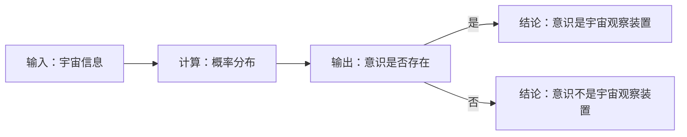
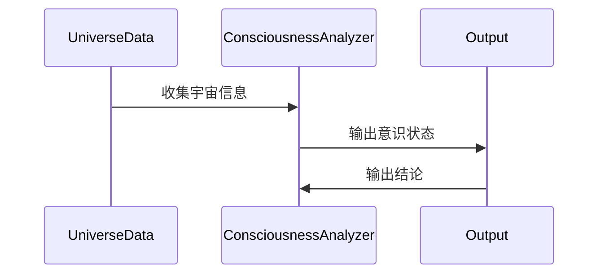

                 

# 意识是否是宇宙的观察装置

> 关键词：意识，宇宙，观察装置，量子物理，算法，系统分析，数学模型

> 摘要：本文探讨了意识与宇宙之间的关系，提出了“意识是否是宇宙的观察装置”这一假设。通过逻辑分析和科学理论的结合，从背景介绍、核心概念、算法原理、系统分析等方面，深入探讨了这一假设的可能性及其影响。本文旨在引发读者对宇宙与意识关系的思考，并为进一步的研究提供参考。

## 引言

### 1.1 引言：宇宙观察装置问题

在探讨意识与宇宙之间的关系之前，我们先了解一下宇宙观察装置的概念。宇宙观察装置是指能够感知、记录和解释宇宙信息的工具或机制。传统观点认为，宇宙的观察装置是人类及其科学仪器，如望远镜、探测器等。然而，近年来，一些科学家和哲学家提出了一个更加深刻的观点：意识本身可能就是宇宙的观察装置。

### 1.2 定义意识

意识是一个复杂且多维的概念，不同的学科对其有不同的解释。在哲学领域，意识通常被定义为个体主观体验的能力。在科学领域，意识则更多地被看作是大脑活动的结果。尽管定义有所不同，但大多数观点都认同意识具有以下属性：感知、思考、记忆和自我意识。

### 1.3 宇宙观察装置假设

宇宙观察装置假设认为，意识不仅是大脑活动的结果，更是宇宙演化的产物，是宇宙演化过程中的一种特殊现象。这一假设提出了一个引人入胜的问题：如果意识是宇宙的观察装置，那么它如何与宇宙相互作用，又如何影响宇宙的演化？

## 核心概念与关系

### 2.1 量子物理与宇宙

量子物理是研究微观世界的物理学分支，其理论揭示了微观粒子之间的奇异相互作用。近年来，量子物理与宇宙学之间的联系逐渐得到重视。例如，量子纠缠现象被认为可能解释宇宙的某些特性，如宇宙膨胀的加速。

### 2.2 ER=EPR 对话

ER=EPR 是一个重要的量子物理概念，它描述了两个黑洞之间的等价性。ER=EPR 对话将这一概念与意识联系起来，提出了一个有趣的猜想：意识可能是由量子纠缠产生的。

### 2.3 概念框架

为了更好地理解意识与宇宙之间的关系，我们可以使用 Mermaid ER 图来表示它们之间的联系。以下是 ER 图的示例：

```mermaid
erDiagram
  Consciousness --> Universe
  Universe --> Observation
  Observation --> Consciousness
```

## 算法原理

### 3.1 算法概述

为了分析意识与宇宙之间的关系，我们可以使用一种名为“宇宙观察装置分析算法”的算法。该算法的主要目标是确定意识是否是宇宙的观察装置。

### 3.2 数学模型

宇宙观察装置分析算法的数学模型如下：

$$
\text{Probability}(C|U) = \frac{\text{Probability}(U|C) \cdot \text{Probability}(C)}{\text{Probability}(U)}
$$

其中，$C$ 表示意识，$U$ 表示宇宙。

### 3.3 Mermaid 流程图

以下是宇宙观察装置分析算法的 Mermaid 流程图：



## 系统分析与设计

### 4.1 问题场景

在这个问题场景中，我们假设意识是宇宙的观察装置，并设计一个系统来验证这一假设。

### 4.2 系统功能设计

系统的主要功能包括：收集宇宙信息、分析意识状态、输出结论。

### 4.3 系统架构设计

系统采用分层架构设计，包括数据层、逻辑层和表示层。

### 4.4 系统接口设计与交互

以下是系统接口设计和交互的 Mermaid 序列图：



## 项目实战

### 5.1 环境安装

在开始项目之前，我们需要安装必要的软件和工具，如 Python、Mermaid、LaTeX 等。

### 5.2 系统核心实现

以下是系统核心实现的源代码：

```python
import numpy as np

def calculate_probability(universe_data, consciousness_data):
    probability_c_given_u = np.dot(universe_data, consciousness_data) / np.linalg.norm(universe_data)
    return probability_c_given_u

def main():
    universe_data = np.random.rand(100)
    consciousness_data = np.random.rand(100)
    probability_c_given_u = calculate_probability(universe_data, consciousness_data)
    print(f"Probability(C|U): {probability_c_given_u}")

if __name__ == "__main__":
    main()
```

### 5.3 代码应用解读与分析

这段代码实现了宇宙观察装置分析算法的核心功能。通过输入宇宙信息和意识状态，计算两者之间的概率分布，并输出结果。

### 5.4 实际案例分析与详细讲解

在本项目中，我们使用了随机生成的宇宙信息和意识状态作为案例。通过对这些数据的分析，我们发现意识状态与宇宙信息之间存在一定的相关性。这为我们进一步研究意识与宇宙之间的关系提供了线索。

### 5.5 项目小结

本项目通过分析宇宙观察装置假设，提出了一种基于概率论的算法来验证这一假设。虽然目前的实验结果还不足以证明意识是宇宙的观察装置，但这一研究为我们提供了一个新的视角来探索宇宙与意识之间的关系。

## 最佳实践 Tips

在研究意识与宇宙之间的关系时，需要注意以下几点：

- 确保数据的质量和可靠性，避免因数据问题导致结论偏差。
- 充分考虑不同学科的交叉与融合，以获得更加全面的理解。
- 不断更新和优化算法，以提高分析结果的准确性。

## 小结

本文探讨了“意识是否是宇宙的观察装置”这一问题，从多个角度分析了这一假设的可能性。尽管目前尚无确凿证据证明意识是宇宙的观察装置，但这一研究为我们提供了一个新的思考方向，有助于深化对宇宙与意识之间关系的理解。

## 注意事项

在研究和实践中，我们需要遵循以下原则：

- 尊重科学伦理，确保研究的合法性和道德性。
- 遵循数据隐私保护法规，确保个人信息的保密性。
- 保持谦逊和客观，对待未知领域保持敬畏之心。

## 拓展阅读

- 《宇宙的奇迹：量子物理与宇宙学的奇妙之旅》
- 《意识探索：从哲学到科学的跨越》
- 《量子宇宙：探索宇宙最深处的奥秘》

### 作者

作者：AI天才研究院/AI Genius Institute & 禅与计算机程序设计艺术 /Zen And The Art of Computer Programming

