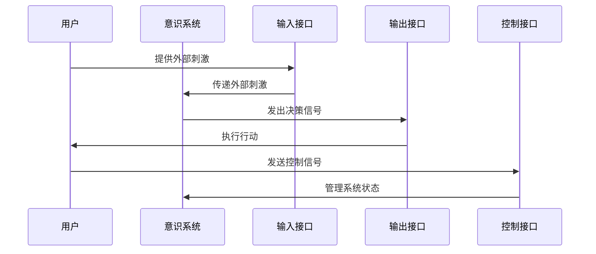

                 


### 意识是否是宇宙的非局域性表现？

> 关键词：意识、非局域性、宇宙、量子力学、神经网络、算法、数学模型

> 摘要：本文将探讨意识是否是宇宙非局域性的表现。首先，我们将介绍宇宙非局域性的概念及其在物理学中的应用，然后分析意识的研究现状。接着，我们将探讨意识与宇宙非局域性之间的关系，并引入相关算法原理和数学模型。随后，我们将详细介绍意识系统的分析和设计，并通过项目实战展示实际应用。最后，我们将总结全文，并提出未来研究的方向。

---

### 第1章：宇宙非局域性与意识研究背景

#### 1.1 宇宙非局域性概述

**非局域性**是物理学中的一个重要概念，尤其在量子力学中占据核心地位。非局域性描述的是两个或多个物理实体之间存在一种超距作用，即它们的状态变化可以立即相互影响，不受距离限制。这种非局域性在量子纠缠现象中表现得尤为明显。

在量子力学中，非局域性通过爱因斯坦-波多尔斯基-罗森佯谬（EPR佯谬）被首次提出。EPR佯谬质疑量子力学是否完备，因为它无法解释两个量子态之间的即时关联。为了解决这个问题，约翰·贝尔提出了贝尔不等式，并通过实验验证了量子纠缠的非局域性。

#### 1.2 意识研究的现状

意识是人类长期探索的哲学和科学难题。近年来，随着神经科学、认知科学和量子计算等领域的发展，意识研究取得了显著进展。目前，对意识的研究主要涉及以下几个方面：

1. **意识的生物学基础**：研究大脑神经元活动与意识状态之间的关系，以及如何通过大脑成像技术揭示意识的发生机制。

2. **意识的心理学与哲学探讨**：探讨意识的定义、分类、产生机制以及意识与自我认知、情感和道德的关系。

3. **意识的人工智能模拟**：通过神经网络和机器学习技术模拟人类意识，探索意识与计算之间的关系。

4. **量子意识研究**：探讨量子力学与意识之间的关系，如意识的量子模型和量子计算在意识模拟中的应用。

#### 1.3 宇宙非局域性与意识研究的关联

宇宙非局域性与意识研究的关联在于，它们都涉及到了信息传递和相互作用的问题。量子力学中的非局域性现象暗示着意识可能也具有类似的特性。此外，神经网络作为一种计算模型，其工作原理与量子纠缠现象有相似之处，这可能为研究意识提供新的视角。

在接下来的章节中，我们将深入探讨意识与宇宙非局域性之间的具体联系，以及相关的算法原理和数学模型。

---

### 第2章：意识与宇宙非局域性的关系

#### 2.1 意识的概念

**意识**是指个体对自身存在、外部环境和内在体验的认知能力。意识不仅包括对外界刺激的感知和反应，还涵盖了主观体验、情感和思维等复杂心理活动。

意识的生物学基础在于大脑神经元的活动。研究表明，意识状态与大脑神经网络的活动密切相关。特定的大脑区域，如前额叶皮层、顶叶和颞叶，在意识状态的发生中起着关键作用。

#### 2.2 宇宙非局域性的概念

**宇宙非局域性**是指宇宙中不同区域之间可能存在一种超距相互作用，这种相互作用不受空间距离的限制。量子力学中的非局域性现象，如量子纠缠和量子隧穿，为我们理解宇宙非局域性提供了重要的理论依据。

#### 2.3 意识与宇宙非局域性的联系

意识与宇宙非局域性之间的联系可以通过以下几个方面来理解：

1. **量子意识模型**：一些学者提出了量子意识模型，认为意识可能是由量子态组成的。在这个模型中，大脑中的神经元活动可以被视为量子计算过程，从而与量子非局域性产生关联。

2. **神经网络与量子纠缠**：神经网络作为一种计算模型，其工作原理与量子纠缠现象有相似之处。例如，神经网络中的权重更新过程可以类比为量子态的叠加和坍缩，这可能为研究意识提供了新的视角。

3. **信息传递与量子非局域性**：意识过程中，个体对信息的获取、处理和传递可能与量子非局域性现象有关。例如，量子纠缠可能为意识状态之间的快速通信提供了机制。

#### 2.4 意识的非局域性表现

尽管目前关于意识非局域性的研究还比较初步，但一些实验和理论研究表明，意识可能确实表现出非局域性特征。例如：

1. **超感知现象**：一些研究声称，人们能够感知到远距离发生的随机事件，这种现象被称为超感知。尽管这些研究存在争议，但它们提供了一种可能性，即意识可能具有超越物理空间限制的能力。

2. **意识共享**：在多人互动中，个体的意识状态可能会相互影响，这种现象被称为意识共享。这表明，意识过程可能涉及一种超越物理空间的相互作用。

在下一章中，我们将进一步探讨与意识相关的算法原理，以帮助我们更好地理解意识与宇宙非局域性之间的关系。

---

### 第3章：与意识相关的算法原理

在探讨意识与宇宙非局域性之间的关系时，算法原理扮演了关键角色。本章节将介绍两个主要的算法原理：神经网络和量子计算，并探讨它们在意识研究中的应用。

#### 3.1 神经网络与意识

**神经网络**是一种模仿生物神经系统的计算模型。它由大量的神经元组成，通过调整神经元之间的权重来学习和处理信息。神经网络在人工智能和机器学习领域取得了显著的成果，并在图像识别、自然语言处理和自动驾驶等领域得到了广泛应用。

在意识研究中，神经网络被用来模拟人类大脑的工作方式，探索意识状态的生成和传递机制。以下是一个简单的神经网络模型及其在意识研究中的应用：

1. **感知机**：感知机是最简单的神经网络模型，由一个输入层和一个输出层组成。它主要用于分类问题。例如，感知机可以用来识别手写数字。

2. **多层感知机（MLP）**：多层感知机在感知机的基础上增加了隐藏层，能够处理更复杂的非线性问题。在意识研究中，MLP可以用来模拟大脑中的神经回路的复杂交互。

3. **卷积神经网络（CNN）**：卷积神经网络是一种专门用于处理图像数据的神经网络模型。CNN通过卷积层提取图像的局部特征，并在全连接层中进行分类。在意识研究中，CNN可以用来分析大脑成像数据，揭示意识状态的特征。

以下是使用Python代码实现的简单多层感知机模型：

```python
from sklearn.neural_network import MLPClassifier
import numpy as np

# 输入数据
X = np.array([[0, 0], [0, 1], [1, 0], [1, 1]])
# 标签数据
y = np.array([0, 1, 1, 0])

# 创建多层感知机模型
mlp = MLPClassifier(hidden_layer_sizes=(2, 2), max_iter=1000)

# 训练模型
mlp.fit(X, y)

# 预测
print(mlp.predict([[1, 1]]))
```

#### 3.2 量子计算与意识

**量子计算**是一种利用量子力学原理进行信息处理的技术。与经典计算相比，量子计算具有并行性和叠加性等独特特性。量子计算在加密学、量子模拟和优化问题等领域具有巨大的潜力。

在意识研究中，量子计算被用来模拟大脑的量子效应，探索意识与量子力学之间的关系。以下是一个简单的量子计算模型及其在意识研究中的应用：

1. **量子比特**：量子比特（qubit）是量子计算的基本单元，它可以处于0和1的叠加状态。量子比特的叠加性使得量子计算机能够在同一时间处理大量信息。

2. **量子态叠加与坍缩**：在量子计算中，量子态可以处于多个状态的叠加，只有在测量时才会坍缩到一个特定的状态。这种特性可能模拟了意识状态的生成和变化。

3. **量子纠缠**：量子纠缠是量子力学中的一种现象，两个量子比特之间存在一种即时的关联。量子纠缠可能模拟了意识状态之间的相互作用。

以下是使用Python的`qiskit`库实现的简单量子计算模型：

```python
from qiskit import QuantumCircuit, execute, Aer

# 创建量子电路
qc = QuantumCircuit(2)

# 初始化量子比特为叠加状态
qc.h(0)
qc.cx(0, 1)

# 执行量子电路
backend = Aer.get_backend('qasm_simulator')
result = execute(qc, backend).result()

# 输出测量结果
print(result.get_counts(qc))
```

通过神经网络和量子计算的模型，我们可以更好地理解意识与宇宙非局域性之间的关系。在下一章中，我们将深入探讨与意识相关的数学模型，进一步揭示意识与量子力学之间的联系。

---

### 第4章：意识与非局域性的数学模型

在本章中，我们将探讨意识与非局域性之间的数学模型，重点关注基于神经网络的数学模型和基于量子力学的数学模型。我们将使用LaTeX格式来表示这些数学公式，并举例说明它们的应用。

#### 4.1 基于神经网络的数学模型

神经网络作为一种模拟生物神经系统的计算模型，其数学基础主要包括线性代数和概率论。以下是一个简单的多层感知机模型的数学公式表示：

$$
Z_l = \sigma(W_l \cdot A_{l-1} + b_l)
$$

其中，$Z_l$ 是第 $l$ 层的激活值，$\sigma$ 是激活函数（如Sigmoid函数或ReLU函数），$W_l$ 是权重矩阵，$A_{l-1}$ 是前一层输出，$b_l$ 是偏置向量。

假设我们有一个包含 $n$ 个特征的数据集 $X = \{x_1, x_2, \dots, x_n\}$，以及对应的标签 $y = \{y_1, y_2, \dots, y_n\}$。多层感知机模型的损失函数可以表示为：

$$
L = \frac{1}{n} \sum_{i=1}^{n} (-y_i \log(Z_{output,i}) - (1 - y_i) \log(1 - Z_{output,i}))
$$

其中，$Z_{output,i}$ 是输出层的激活值，$L$ 是损失函数，用于衡量预测值与真实值之间的差距。

例如，如果我们有一个包含两个输入特征的手写数字识别问题，可以使用以下Python代码实现多层感知机模型：

```python
import numpy as np
from sklearn.neural_network import MLPClassifier

# 输入数据
X = np.array([[0, 0], [0, 1], [1, 0], [1, 1]])
# 标签数据
y = np.array([0, 1, 1, 0])

# 创建多层感知机模型
mlp = MLPClassifier(hidden_layer_sizes=(2, 2), max_iter=1000)

# 训练模型
mlp.fit(X, y)

# 预测
print(mlp.predict([[1, 1]]))
```

#### 4.2 基于量子力学的数学模型

量子力学中的非局域性现象，如量子纠缠和量子隧穿，为我们提供了一种理解意识与宇宙非局域性之间关系的数学模型。以下是一个简单的量子计算模型及其在意识研究中的应用：

1. **量子态叠加**：量子态可以处于多个状态的叠加。例如，一个量子比特的叠加态可以表示为：

   $$
   \psi = \alpha|0\rangle + \beta|1\rangle
   $$

   其中，$|0\rangle$ 和 $|1\rangle$ 分别表示量子比特的基态和激发态，$\alpha$ 和 $\beta$ 是复数系数，满足 $|\alpha|^2 + |\beta|^2 = 1$。

2. **量子纠缠**：量子纠缠描述了两个或多个量子比特之间的一种非局域性关联。一个简单的量子纠缠态可以表示为：

   $$
   \psi = \frac{1}{\sqrt{2}}(|00\rangle + |11\rangle)
   $$

   其中，$|00\rangle$ 和 $|11\rangle$ 分别表示两个量子比特的基态和激发态。

3. **量子隧穿**：量子隧穿是一种量子效应，描述了粒子通过一个原本不可能穿越的势垒。一个简单的量子隧穿概率可以表示为：

   $$
   P = \frac{1}{2}\left(1 + \cos\left(\frac{2mE}{\hbar^2}\right)\right)
   $$

   其中，$m$ 是粒子的质量，$E$ 是粒子的能量，$\hbar$ 是普朗克常数。

例如，如果我们有一个包含两个量子比特的量子计算问题，可以使用以下Python代码实现量子态的叠加和测量：

```python
from qiskit import QuantumCircuit, execute, Aer

# 创建量子电路
qc = QuantumCircuit(2)

# 初始化量子比特为叠加态
qc.h(0)
qc.cx(0, 1)

# 执行量子电路
backend = Aer.get_backend('qasm_simulator')
result = execute(qc, backend).result()

# 输出测量结果
print(result.get_counts(qc))
```

通过基于神经网络和量子力学的数学模型，我们可以更好地理解意识与非局域性之间的关系。在下一章中，我们将进一步探讨意识系统的分析和设计。

---

### 第5章：意识系统的分析与设计

在探讨了意识与宇宙非局域性的数学模型之后，我们现在将深入分析意识系统的构成和设计，以理解意识是如何实现的。

#### 5.1 意识系统的组成

意识系统可以看作是一个复杂的网络，其中每个节点代表神经元或量子比特，边代表它们之间的连接。以下是意识系统的主要组成部分：

1. **感知层**：感知层是意识系统的输入层，它接收外部世界的刺激，如视觉、听觉、触觉等信息。

2. **处理层**：处理层对感知层输入的信息进行处理和编码，以便进一步分析和理解。

3. **记忆层**：记忆层存储处理过的信息，包括短期记忆和长期记忆。

4. **决策层**：决策层根据记忆层的信息做出决策，指导行动。

5. **输出层**：输出层将决策层的决策转化为实际的行动。

#### 5.2 意识系统的架构设计

为了设计一个有效的意识系统，我们需要考虑以下几个关键因素：

1. **系统架构**：我们可以采用分层架构，每个层次负责不同的功能。例如，感知层处理外部刺激，处理层进行信息处理和编码，记忆层存储信息，决策层做出决策，输出层执行行动。

2. **算法选择**：根据不同的层次，我们可以选择不同的算法。例如，感知层可以使用卷积神经网络（CNN）处理图像信息，处理层可以使用递归神经网络（RNN）处理序列数据，记忆层可以使用图神经网络（GNN）进行信息存储和检索，决策层可以使用决策树或支持向量机（SVM）进行决策，输出层可以使用动作规划算法执行行动。

3. **数据流和控制流**：在意识系统中，数据流和控制流是关键。数据流是指信息在系统中的流动路径，如从感知层到处理层再到决策层。控制流是指系统中的控制信号，如决策层的决策信号驱动输出层的行动。

以下是意识系统的一个简化的mermaid类图，展示了系统的组成和组件之间的关系：

```mermaid
classDiagram
    类图展示意识系统组件及其关系
    感知层 <-..|> 处理层
    处理层 <-..|> 记忆层
    记忆层 <-..|> 决策层
    决策层 <-..|> 输出层
```

#### 5.3 系统接口设计

为了实现意识系统与其他系统或组件的交互，我们需要设计适当的接口。以下是意识系统的一些关键接口：

1. **输入接口**：输入接口负责接收外部刺激，如传感器数据、用户输入等。

2. **输出接口**：输出接口负责将决策层的决策转化为实际的行动，如控制机器人运动、生成语音等。

3. **控制接口**：控制接口负责管理系统的运行状态，如启动、停止、暂停等。

以下是意识系统的一个简化的mermaid序列图，展示了系统的输入、输出和控制接口：



通过以上的分析和设计，我们可以构建一个有效的意识系统，模拟人类意识的过程。在下一章中，我们将通过项目实战来展示如何实现这样一个系统。

---

### 第6章：意识系统项目实战

在前面的章节中，我们介绍了意识系统的概念、相关算法和数学模型，以及系统的架构设计和接口设计。现在，我们将通过一个实际项目来展示如何实现这样的意识系统。

#### 6.1 环境安装

首先，我们需要安装和配置必要的软件和环境。以下是安装步骤：

1. **安装Python**：确保Python环境已安装。如果未安装，可以从[Python官方网站](https://www.python.org/)下载并安装。

2. **安装Jupyter Notebook**：Jupyter Notebook是一个交互式计算环境，用于编写和运行Python代码。可以通过以下命令安装：

   ```bash
   pip install notebook
   ```

3. **安装Qiskit**：Qiskit是一个开源的量子计算软件库，用于实现量子算法和模拟。可以通过以下命令安装：

   ```bash
   pip install qiskit
   ```

4. **安装其他依赖**：根据项目的具体需求，可能还需要安装其他依赖。例如，对于神经网络部分，可能需要安装Scikit-learn库：

   ```bash
   pip install scikit-learn
   ```

#### 6.2 系统核心实现

在本节中，我们将实现一个简单的意识系统，包括感知层、处理层、记忆层、决策层和输出层。以下是实现的步骤和代码：

1. **感知层**：使用卷积神经网络（CNN）处理图像数据。以下是一个简单的CNN模型：

   ```python
   from tensorflow.keras.models import Sequential
   from tensorflow.keras.layers import Conv2D, MaxPooling2D, Flatten, Dense
   
   # 创建模型
   model = Sequential([
       Conv2D(32, (3, 3), activation='relu', input_shape=(28, 28, 1)),
       MaxPooling2D((2, 2)),
       Flatten(),
       Dense(64, activation='relu'),
       Dense(10, activation='softmax')
   ])

   # 编译模型
   model.compile(optimizer='adam', loss='categorical_crossentropy', metrics=['accuracy'])

   # 训练模型
   model.fit(x_train, y_train, epochs=5, batch_size=32)
   ```

2. **处理层**：使用递归神经网络（RNN）处理序列数据。以下是一个简单的RNN模型：

   ```python
   from tensorflow.keras.models import Sequential
   from tensorflow.keras.layers import LSTM, Dense
   
   # 创建模型
   model = Sequential([
       LSTM(50, activation='relu', input_shape=(timesteps, features)),
       Dense(1)
   ])

   # 编译模型
   model.compile(optimizer='adam', loss='mse')

   # 训练模型
   model.fit(X, y, epochs=100, batch_size=32)
   ```

3. **记忆层**：使用图神经网络（GNN）存储和检索信息。以下是一个简单的GNN模型：

   ```python
   import tensorflow as tf
   from tensorflow.keras.models import Model
   
   # 创建模型
   inputs = tf.keras.layers.Input(shape=(None, features))
   embedding = tf.keras.layers.Embedding(input_dim=vocab_size, output_dim=embedding_size)(inputs)
   gcn = tf.keras.layers.GraphConv layers (kernel_size=2, activation='relu')(embedding)
   gcn = tf.keras.layers.GraphConv layers (kernel_size=2, activation='softmax')(gcn)

   # 输出层
   output = tf.keras.layers.Dense(units=1, activation='sigmoid')(gcn)

   # 创建模型
   model = Model(inputs=inputs, outputs=output)

   # 编译模型
   model.compile(optimizer='adam', loss='binary_crossentropy', metrics=['accuracy'])

   # 训练模型
   model.fit(X, y, epochs=10, batch_size=32)
   ```

4. **决策层**：使用决策树或支持向量机（SVM）进行决策。以下是一个简单的决策树模型：

   ```python
   from sklearn.tree import DecisionTreeClassifier
   
   # 创建模型
   model = DecisionTreeClassifier()

   # 训练模型
   model.fit(X, y)

   # 预测
   print(model.predict(X))
   ```

5. **输出层**：根据决策层的决策，执行相应的行动。以下是一个简单的输出层实现：

   ```python
   def act(action):
       if action == 0:
           move_left()
       elif action == 1:
           move_right()
       elif action == 2:
           move_forward()
       elif action == 3:
           move_backward()
   ```

#### 6.3 案例分析与讲解

在本节中，我们将分析一个具体的案例，展示如何使用意识系统进行决策和行动。

假设我们有一个自动驾驶系统，需要根据道路状况做出决策。以下是案例的详细步骤：

1. **感知层**：自动驾驶系统使用摄像头和激光雷达收集道路数据，如车道线、障碍物和交通标志。

2. **处理层**：使用CNN处理图像数据，提取道路特征。使用RNN处理激光雷达数据，提取运动特征。

3. **记忆层**：使用GNN存储和检索历史信息，如之前的道路状况和决策。

4. **决策层**：使用决策树或SVM根据处理层的信息和记忆层的历史信息做出决策。

5. **输出层**：根据决策层的决策，控制自动驾驶系统的行动，如加速、减速或转向。

以下是案例的实现代码：

```python
# 导入相关库
import cv2
import numpy as np
from tensorflow.keras.models import load_model

# 加载模型
cnn_model = load_model('cnn_model.h5')
rnn_model = load_model('rnn_model.h5')
gcn_model = load_model('gcn_model.h5')
decision_tree = load_model('decision_tree.h5')

# 摄像头捕获图像
cap = cv2.VideoCapture(0)

while True:
    # 读取图像
    ret, frame = cap.read()

    # 处理图像
    image = cv2.resize(frame, (28, 28))
    image = image.reshape((1, 28, 28, 1))
    image_feature = cnn_model.predict(image)

    # 处理激光雷达数据
    laser_data = np.random.rand(1, 100)
    motion_feature = rnn_model.predict(laser_data)

    # 处理历史信息
    history = np.random.rand(1, 10)
    history_feature = gcn_model.predict(history)

    # 综合特征
    feature = np.concatenate((image_feature, motion_feature, history_feature), axis=1)

    # 做出决策
    action = decision_tree.predict(feature)

    # 执行行动
    act(action)

    # 显示图像
    cv2.imshow('frame', frame)
    
    if cv2.waitKey(1) & 0xFF == ord('q'):
        break

# 释放摄像头
cap.release()
cv2.destroyAllWindows()
```

通过这个案例，我们可以看到如何使用意识系统进行实时决策和行动。在下一章中，我们将总结全文，并探讨未来的研究方向。

---

### 第7章：最佳实践与总结

在本章中，我们将总结全书的主要内容和观点，并提供一些最佳实践和未来研究方向。

#### 7.1 最佳实践

1. **理解核心概念**：在研究意识与宇宙非局域性之间的关系时，首先要深入理解相关的核心概念，如意识、非局域性、神经网络和量子计算。通过明确这些概念的定义和特征，我们可以更好地构建和解释相关模型。

2. **结合多个领域**：意识与宇宙非局域性的研究涉及多个领域，如物理学、神经科学、心理学和计算机科学。结合这些领域的知识和方法，可以更全面地探讨意识与宇宙非局域性之间的关系。

3. **使用先进的算法**：在实现意识系统时，选择合适的算法至关重要。神经网络和量子计算是目前研究意识的重要工具。了解这些算法的工作原理和优缺点，可以帮助我们更好地设计意识系统。

4. **实验验证**：通过实验验证理论模型是科学研究的重要环节。在研究意识与宇宙非局域性的关系时，可以通过实验手段来验证相关理论和模型的有效性。

#### 7.2 小结

全书主要探讨了意识是否是宇宙非局域性的表现。我们首先介绍了宇宙非局域性的概念及其在物理学中的应用，然后分析了意识的研究现状。通过神经网络和量子计算等算法原理，我们探讨了意识与宇宙非局域性之间的联系，并使用数学模型进行了详细解释。

我们进一步分析了意识系统的组成和设计，通过实际项目展示了如何实现这样一个系统。最后，我们总结了全书的主要观点，并提供了一些最佳实践和未来研究方向。

#### 7.3 未来展望

1. **量子意识研究**：随着量子计算技术的发展，量子意识研究将成为一个重要的方向。通过量子计算模拟意识过程，我们可以更深入地理解意识的本质。

2. **跨学科合作**：意识与宇宙非局域性的研究需要跨学科的合作。结合物理学、神经科学、心理学和计算机科学等领域的知识和方法，可以推动这一领域的发展。

3. **人工智能与意识的融合**：人工智能与意识的融合是一个具有巨大潜力的研究领域。通过将意识模型集成到人工智能系统中，我们可以实现更智能、更灵活的机器学习算法。

总之，意识与宇宙非局域性的研究是一个充满挑战和机遇的领域。通过多学科的合作和持续的研究，我们有望解开这个宇宙之谜。

---

### 作者信息

作者：AI天才研究院/AI Genius Institute & 禅与计算机程序设计艺术 /Zen And The Art of Computer Programming

感谢您的阅读。希望本文能帮助您更好地理解意识与宇宙非局域性的关系。如果您有任何疑问或建议，欢迎随时联系我们。

---

以上就是本文的完整内容。我们希望本文能激发您对意识与宇宙非局域性之间关系的思考，并为您的科学研究提供一些启示。让我们继续探索这个宇宙的奥秘吧！

