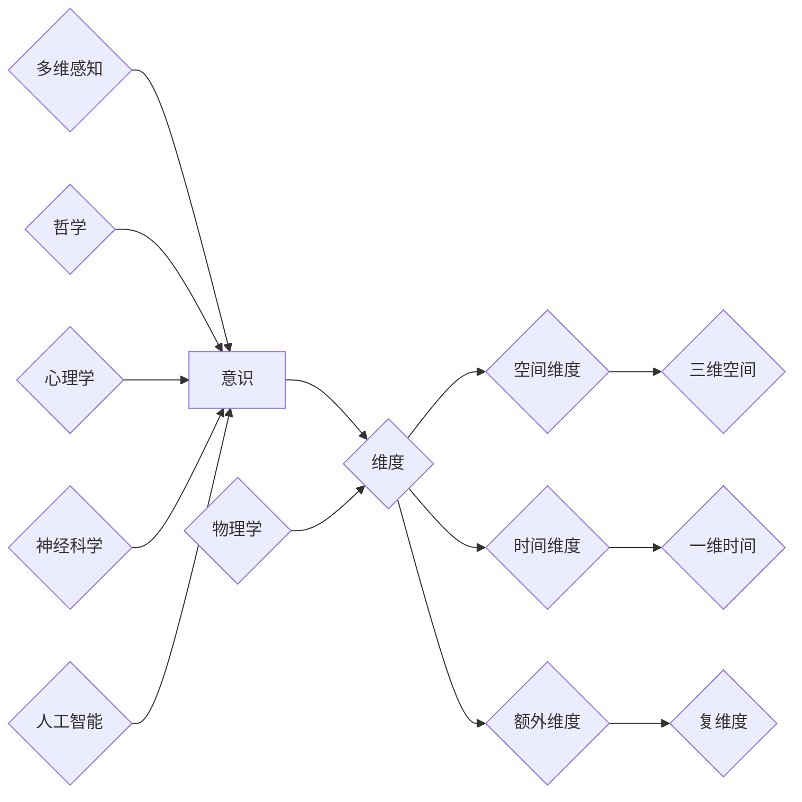
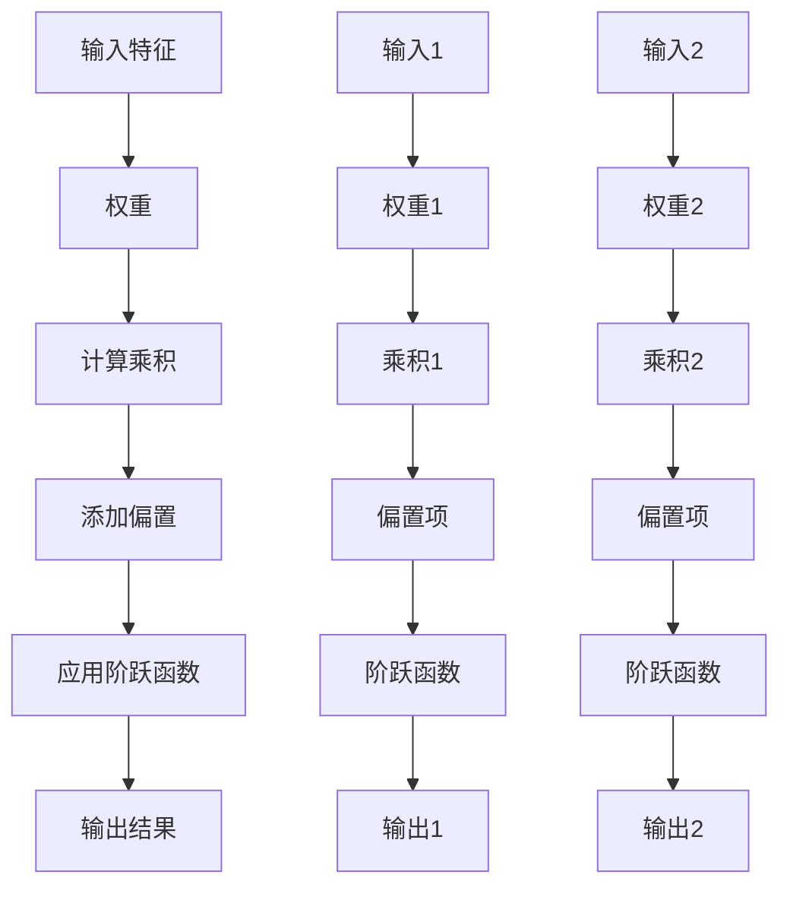
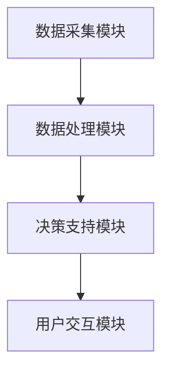
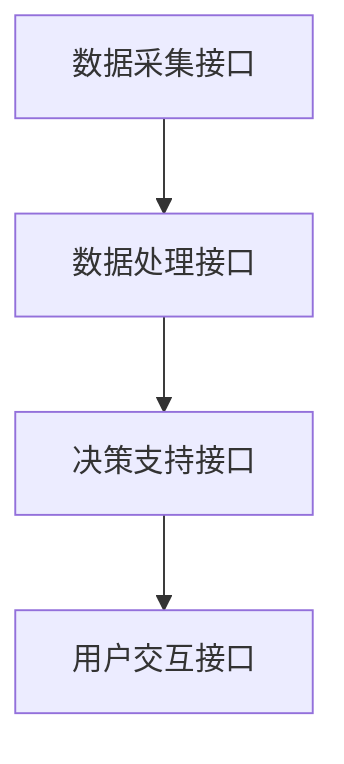

                 


### 意识是否是连接不同维度的桥梁

> 关键词：意识、维度、连接、桥梁、多维度、理论研究、应用前景

> 摘要：本文探讨了一个引人入胜的问题——意识是否可以作为连接不同维度的桥梁。通过对意识与维度的深入分析，本文将探讨意识在多维宇宙中的作用，以及其在心理学、哲学和科技领域的应用。通过逻辑清晰的论述和实例说明，本文试图揭示意识作为维度桥梁的潜力和重要性。

## 目录大纲

1. **引言**  
   - 提出问题：意识是否是连接不同维度的桥梁？  
   - 研究意义：探讨意识在多维宇宙中的角色和影响。

2. **背景与概念介绍**  
   - **第1章：问题背景与定义**  
     - 意识的多维度研究  
     - 意识与维度理论的关系  
     - 意识研究的现状与挑战  
   - **第2章：意识的核心概念**  
     - 意识的定义  
     - 意识的基本特征  
     - 意识的理论框架  
     - 意识与自我感知  
   - **第3章：维度的概念与类型**  
     - 维度的定义  
     - 维度的基本特征  
     - 维度的分类与层次  
     - 维度理论的发展

3. **意识与维度的联系**  
   - **第4章：意识作为维度连接的桥梁**  
     - 意识的维度解释  
     - 意识如何影响维度体验  
     - 意识的维度变化  
   - **第5章：意识与多维宇宙**  
     - 多维宇宙的探索  
     - 意识在多维宇宙中的作用  
     - 意识与时空关系  
   - **第6章：意识与不同维度的联系**  
     - 意识在不同维度中的表现  
     - 意识在不同维度中的影响  
     - 意识与跨维度交流

4. **意识作为桥梁的应用**  
   - **第7章：意识在心理学中的应用**  
     - 意识在心理治疗中的作用  
     - 意识在心理康复中的应用  
     - 意识与心理健康的关联  
   - **第8章：意识在哲学与宗教中的应用**  
     - 意识与哲学探讨  
     - 意识与宗教信仰的关系  
     - 意识在宗教仪式中的意义  
   - **第9章：意识在科技领域的应用**  
     - 意识与人工智能的关系  
     - 意识在AI系统设计中的作用  
     - 意识在智能机器人中的应用

5. **结论与展望**  
   - **第10章：意识作为桥梁的意义**  
     - 意识在连接维度中的作用  
     - 意识的未来发展  
     - 意识研究的未来趋势  
   - **第11章：总结与展望**  
     - 主要观点回顾  
     - 意识与维度联系的实证研究  
     - 意识的应用前景  
   - **第12章：研究局限性与未来研究方向**  
     - 研究局限性  
     - 研究领域的局限  
     - 意识与维度联系的理论挑战

### 引言

让我们首先提出一个令人好奇的问题：意识是否是连接不同维度的桥梁？这个问题跨越了多个学科领域，从哲学、心理学到物理学，甚至延伸到宗教和人工智能。在探讨这个问题的过程中，我们将深入分析意识与维度的关系，以及意识在多维宇宙中的角色和作用。

研究意识与维度的联系具有重要的理论和实践意义。在理论上，它有助于我们理解意识本质和宇宙结构之间的关系。在实践上，它可能为心理学、哲学、科技等领域带来新的突破和启示。

首先，我们来明确一下本文中的几个核心概念。意识是指人类或其他生物对自身和外部世界的感知、理解和思考的能力。维度则是指空间和时间的基本结构，通常用整数来表示，如一维、二维和三维等。多维宇宙是指存在多个维度空间的宇宙，它可能包括我们熟知的四维时空，以及其他未知的维度。

在接下来的章节中，我们将首先介绍意识与维度的背景和概念，然后深入探讨意识作为维度连接的桥梁，以及它在心理学、哲学和科技领域的应用。最后，我们将总结本文的主要观点，并对未来研究方向进行展望。

### 背景与概念介绍

#### 第1章：问题背景与定义

##### 1.1.1 意识的多维度研究

意识的多维度研究是一个跨学科的研究领域，它涉及到哲学、心理学、神经科学和认知科学等多个学科。在这个领域中，研究者们试图理解意识是如何在不同的维度中存在的，以及它如何影响我们对现实世界的感知和理解。

首先，让我们从哲学的角度来看意识的维度。在传统哲学中，意识通常被认为是一种主观的、内在的体验，它与物质世界是相互独立的。然而，一些哲学家如柏拉图和康德提出了不同的观点。他们认为意识是构成宇宙基本结构的要素之一，它不仅与物质世界相互关联，而且在一定程度上塑造了物质世界的本质。

其次，心理学领域对意识的多维度研究也做出了重要贡献。心理学家通过实验和观察，试图揭示意识在不同维度中的表现。例如，弗洛伊德和荣格提出了心理层次理论，认为意识只是心理活动的一个表面层，而深层次的心理结构则决定了我们的行为和情感。此外，认知心理学和神经心理学的研究也表明，意识是一个动态的过程，它受到多种因素的影响，如注意力、记忆和感知等。

在神经科学领域，研究者们通过脑成像技术和脑电记录等技术，对意识的多维度结构进行了深入的研究。他们发现，意识与大脑中的特定区域和神经网络有关，这些区域和神经网络在处理信息时表现出不同的功能。例如，前额叶皮层和顶叶皮层被认为是与意识高度相关的区域，它们在决策、思考和信息处理中起着关键作用。

##### 1.1.2 意识与维度理论的关系

意识与维度理论的关系是一个复杂而深刻的议题。在物理学中，维度理论主要关注空间和时间的结构。传统的四维时空包括了三个空间维度和一个时间维度，而现代物理学研究表明，宇宙可能存在更多的维度。

爱因斯坦的相对论提出了时空相对性的概念，即时间和空间是相互关联的，它们共同构成了四维时空。然而，现代物理学的进展，如弦理论和多重宇宙理论，提出了更多维度的可能性。弦理论认为，宇宙实际上是由细小的弦振动形成的，这些弦可能存在于额外的维度中。而多重宇宙理论则提出，我们的宇宙只是众多宇宙中的一个，每个宇宙都有自己独特的维度和物理法则。

在这种情况下，意识与维度理论的关系变得更加复杂。一些理论认为，意识可能是一种超越传统物理维度的高级现象，它可能在多个维度中存在。例如，一些哲学家和理论物理学家认为，意识可能是一种“量子现象”，它存在于量子场中，而量子场则可能存在于多个维度中。

##### 1.1.3 意识研究的现状与挑战

尽管意识与维度理论的关系是一个充满挑战的研究领域，但目前已有许多重要的研究成果。例如，在心理学领域，研究者们已经通过实验验证了意识的多个维度，如知觉、记忆和思考等。在神经科学领域，脑成像技术已经揭示了大脑中与意识相关的区域和神经网络。

然而，意识研究仍然面临许多挑战。首先，意识是一个复杂的现象，它涉及到多个学科领域，这使得研究具有很大的复杂性。其次，当前的研究方法和技术仍然有限，难以全面揭示意识的本质和机制。最后，不同学科之间的研究成果往往难以整合，这也限制了我们对意识的理解。

未来，研究者们需要进一步探索意识与维度之间的关系。通过跨学科的合作和研究，我们有望揭示意识的本质和机制，并理解它在多维宇宙中的作用。

#### 第2章：意识的核心概念

##### 2.1 意识的定义

意识是一个复杂而多维的概念，它涉及到主观体验、感知、思考、决策等多个方面。从哲学的角度来看，意识通常被认为是一种主观的、内在的体验，它使我们能够感知和理解外部世界。在心理学中，意识被定义为一种动态的心理过程，它涉及对信息的接收、处理和反应。

在神经科学领域，意识通常与大脑的功能活动相关联。研究者们认为，意识是由大脑中特定的区域和神经网络产生的，这些区域和神经网络在处理信息时表现出特定的功能。例如，前额叶皮层和顶叶皮层被认为是与意识高度相关的区域，它们在决策、思考和信息处理中起着关键作用。

##### 2.2 意识的基本特征

意识具有多个基本特征，这些特征使它成为一个独特而复杂的现象。首先，意识具有主观性。意识是一种内在的体验，每个人对意识的感觉都是独特的。这意味着，我们无法直接观察他人的意识，只能通过他们的行为和言语来推断。

其次，意识具有动态性。意识是一个不断变化的过程，它受到多种因素的影响，如注意力、记忆和感知等。例如，当我们的注意力集中在某个物体或任务上时，我们的意识会集中在这个物体或任务上，而其他事物则变得模糊。

第三，意识具有选择性。意识使我们能够从大量的信息中选择和关注某些特定的信息。这种选择性使我们能够有效地处理信息，并做出决策。

##### 2.3 意识的理论框架

对意识的研究涉及到多个理论框架，这些框架为我们理解意识提供了不同的视角。以下是几个主要的意识理论框架：

1. **功能主义框架**：功能主义认为，意识是一种功能性的过程，它涉及对信息的接收、处理和反应。在这个框架中，意识被看作是一种处理信息的方式，它使我们能够适应环境并做出决策。

2. **自然主义框架**：自然主义框架认为，意识是一种自然现象，它可以通过科学方法来研究和解释。在这个框架中，研究者们试图通过实验和观察来揭示意识的本质和机制。

3. **现象学框架**：现象学框架强调意识的主观性和体验性。在这个框架中，研究者们试图通过深入探讨意识的主观体验来理解意识的本质。

4. **二元论框架**：二元论框架认为，意识与物质世界是相互独立的，它们各自存在但无法相互还原。在这个框架中，意识被视为一种独立的实体，它不能通过物质世界的解释来完全理解。

##### 2.4 意识与自我感知

意识与自我感知密切相关。自我感知是指我们对自己存在的感知，它是意识的重要组成部分。在自我感知中，我们能够意识到自己的身体、思想和感受，这种自我感知使我们能够理解自己的行为和动机。

自我感知对意识的影响是复杂的。一方面，自我感知使我们能够对自己进行反思和评估，从而提高我们的认知能力和决策能力。另一方面，自我感知也可能导致自我意识过剩，使我们陷入自我怀疑和焦虑。

总之，意识是一个复杂而多维的概念，它涉及到主观体验、感知、思考、决策等多个方面。通过对意识的核心概念的深入分析，我们可以更好地理解意识的本质和功能，并为进一步的研究提供理论基础。

#### 第3章：维度的概念与类型

##### 3.1 维度的定义

维度是描述空间和时间结构的基本单位，它通常用整数来表示。最常见的是三维空间，即我们通常所经历的物理世界，包括长度、宽度和高度。此外，还包括一维和二维空间，分别表示线性和平面。时间维度则通常被视为第四维，它与空间维度一起构成了我们熟知的四维时空。

在现代物理学中，维度的概念被进一步扩展。爱因斯坦的相对论提出了时空相对性的概念，即时间和空间是相互关联的，共同构成了四维时空。而现代物理学的进展，如弦理论和多重宇宙理论，提出了更多维度的可能性。弦理论认为，宇宙可能存在多个空间维度，这些维度可能是我们无法直接感知的。多重宇宙理论则提出，宇宙中可能存在多个独立的宇宙，每个宇宙都有自己独特的维度和物理法则。

##### 3.2 维度的基本特征

维度具有一些基本特征，这些特征决定了它们在空间和时间中的表现。首先，维度是线性的。这意味着，维度之间的变化是连续的，没有中断或跳跃。例如，从一维到二维的转变是一个连续的过程，二维到三维的转变也是如此。

其次，维度是独立且相互关联的。每个维度都有其独特的特征和属性，但它们也相互关联，共同构成了宇宙的基本结构。例如，时间和空间维度相互关联，构成了我们熟知的四维时空。而额外的空间维度可能与我们已知的物理法则有所不同，但它们仍然是宇宙结构的重要组成部分。

第三，维度是可扩展的。在物理学中，维度的数量和类型可能随着理论的发展而增加。例如，弦理论提出了额外的空间维度，而量子场论则涉及时间维度和空间维度的相互转换。

##### 3.3 维度的分类与层次

维度可以根据其类型和层次进行分类。在物理学中，常见的维度分类包括空间维度、时间维度和复杂维度。

- **空间维度**：包括一维、二维和三维空间。这些维度通常与我们对物理世界的直观感知相关联。
- **时间维度**：时间维度通常被视为第四维，它是空间维度的一部分，与空间维度共同构成了四维时空。
- **复杂维度**：复杂维度是现代物理学中提出的一种新维度，它包括量子场论中的维度和时间维度与空间维度的相互转换。例如，量子场论中的维度可以被视为时间维度和空间维度的组合。

维度的层次结构也是维度分类的一个重要方面。在物理学中，维度的层次结构通常与理论的结构和复杂性相关联。例如，在弦理论中，维度可能存在于不同的层次上，从低维到高维，从可见维到隐藏维。

##### 3.4 维度理论的发展

维度理论的发展是现代物理学的一个重要领域。从爱因斯坦的相对论到弦理论，维度理论经历了多次重大的变革和进展。

- **相对论**：爱因斯坦的相对论提出了时空相对性的概念，即时间和空间是相互关联的，共同构成了四维时空。这一理论对维度理论的发展产生了深远影响，它为后来的理论提供了基础。
- **量子场论**：量子场论是现代物理学的一个重要分支，它研究了量子粒子的行为和相互作用。在量子场论中，维度理论得到了进一步的扩展，包括时间维度和空间维度的相互转换。
- **弦理论**：弦理论是现代物理学的前沿领域，它提出了宇宙可能存在多个空间维度和额外维度。弦理论为维度理论提供了新的视角和解释，它对物理学的发展具有重要意义。

总之，维度的概念和分类是一个复杂而深刻的领域。通过对维度的基本特征、分类与层次以及理论发展的深入分析，我们可以更好地理解维度在物理学中的角色和作用，并为未来的研究提供理论基础。

#### 第4章：意识作为维度连接的桥梁

##### 4.1 意识的维度解释

意识作为维度连接的桥梁，可以从多个维度进行解释。首先，从心理学角度来看，意识可以被看作是一个多维的结构，它包含了感知、思考、情感和记忆等多个层面。这些不同的层面相互作用，共同构成了我们对世界的全面感知和理解。

其次，从哲学角度来看，意识被认为是连接主观体验和客观世界的中介。哲学家如柏拉图和康德认为，意识不仅是我们对现实世界的感知，而且是我们对现实世界进行理解和解释的能力。因此，意识在连接不同维度中起着至关重要的作用。

最后，从物理学角度来看，意识可能与额外的维度有关。例如，弦理论提出了多个空间维度的存在，而意识可能在这些维度中发挥作用。这些额外的维度可能存在于我们无法直接感知的空间中，但通过意识，我们可以间接地感受到它们的存在和影响。

##### 4.2 意识如何影响维度体验

意识对维度体验的影响是深远且复杂的。首先，意识可以改变我们对空间和时间的感觉。在心理学中，研究表明，我们的感知和体验受到注意力、记忆和情感等多种因素的影响。例如，当我们专注于某个物体时，我们的感知会变得更加清晰和具体。同样，记忆和情感也可以影响我们对过去和未来的感知。

其次，意识可以影响我们对时间和空间的理解。在哲学中，时间被视为一个维度，它与空间维度共同构成了四维时空。然而，我们的意识体验可能会扭曲时间和空间的感知。例如，当我们处于高度集中或放松的状态时，时间可能会感觉过得更快或更慢。同样，空间感知也可能因为注意力或情感的变化而发生变化。

最后，意识还可以影响我们对多维宇宙的体验。在物理学中，弦理论和多重宇宙理论提出了多个空间维度的存在。通过意识，我们可以间接地感受到这些额外的维度。例如，通过梦境或冥想，我们可能会体验到超越我们日常感知的三维空间，甚至体验到额外的维度。

##### 4.3 意识的维度变化

意识在不同的维度中可能表现出不同的特征和变化。首先，从心理学的角度来看，意识在不同的情境和环境中可能发生变化。例如，当我们在高压环境下工作时，我们的意识可能会变得更加集中和清晰。而在放松和休闲的环境中，我们的意识可能会变得更加开放和自由。

其次，从哲学的角度来看，意识在不同的思维模式和文化背景下可能发生变化。例如，某些文化中，人们可能更加重视意识和直觉，而其他文化中，人们可能更加重视逻辑和理性。这些差异可能会导致对维度体验的不同理解和表达。

最后，从物理学的角度来看，意识在不同维度中的变化可能与量子物理中的现象有关。例如，量子纠缠表明，粒子之间的相互作用可以超越传统的空间和时间维度。通过意识，我们可能会体验到这种超越性的维度变化。

总之，意识作为维度连接的桥梁，其作用和影响是复杂而多维的。通过理解意识在连接不同维度中的角色和影响，我们可以更好地探索和理解宇宙的本质和奥秘。

#### 第5章：意识与多维宇宙

##### 5.1 多维宇宙的探索

多维宇宙的概念在物理学和哲学中有着悠久的历史。现代物理学中的弦理论和量子场论为多维宇宙的存在提供了强有力的理论支持。弦理论认为，宇宙由细小的弦振动形成，这些弦存在于多个维度中。而量子场论则指出，粒子是量子场的激发态，这些量子场可能存在于多个维度中。

在哲学中，柏拉图和康德等哲学家提出了多维宇宙的观点。他们认为，意识不仅与物质世界相互作用，而且可能是构成宇宙基本结构的要素之一。这些观点为探索多维宇宙提供了哲学基础。

##### 5.2 意识在多维宇宙中的作用

意识在多维宇宙中可能扮演着重要的角色。首先，从物理学角度来看，意识可能影响量子物理中的现象。量子纠缠表明，粒子之间的相互作用可以超越传统的空间和时间维度。通过意识，我们可能会体验到这种超越性的维度变化。例如，一些实验表明，量子纠缠的粒子在远距离相互作用时，其状态会瞬间变化。这可能暗示着意识在连接不同维度中的潜在作用。

其次，从心理学角度来看，意识可能影响我们对多维宇宙的感知和理解。例如，在梦境中，我们可能会体验到超越三维空间的场景和情境。这表明，意识可能在一定程度上影响我们对多维宇宙的体验和认知。

最后，从哲学的角度来看，意识可能是多维宇宙的桥梁，它连接了主观体验和客观世界。哲学家如柏拉图和康德认为，意识不仅是我们对现实世界的感知，而且是我们对现实世界进行理解和解释的能力。因此，意识在连接多维宇宙中起着至关重要的作用。

##### 5.3 意识与时空关系

意识与时空关系是一个复杂而深刻的议题。在相对论中，时间和空间被视为相互关联的四维时空。而意识可能在这个四维时空中扮演着重要的角色。首先，意识可能影响我们对时间和空间的感觉。例如，在极端环境下，如高重力或高速度环境中，时间可能会变慢或变快。这可能表明，意识对时空感知有一定的影响。

其次，意识可能与时空的弯曲和扭曲有关。在广义相对论中，质量和能量会导致时空的弯曲和扭曲。而意识可能在这个过程中发挥作用，例如，通过梦境或冥想，我们可能会体验到时空的扭曲和变化。

最后，意识可能与宇宙的起源和演化有关。一些理论认为，宇宙可能存在于多个维度中，这些维度可能影响宇宙的起源和演化。例如，弦理论中的额外维度可能影响宇宙的几何结构和物理法则。在这种情况下，意识可能在这些维度中发挥作用，从而影响宇宙的起源和演化。

总之，意识与多维宇宙的关系是一个充满挑战和机遇的领域。通过深入探索意识在多维宇宙中的作用和影响，我们可能能够更好地理解宇宙的本质和奥秘。

#### 第6章：意识与不同维度的联系

##### 6.1 不同维度的互动

意识与不同维度的互动是一个复杂而多维的过程。首先，从心理学角度来看，意识与不同维度的互动可以通过感知、思考和情感来体现。例如，当我们感知到某个物体时，我们的意识会处理和解释这些感知信息，从而形成对物体的理解和认知。

其次，从哲学角度来看，意识与不同维度的互动可以通过对现实世界的理解和解释来体现。例如，哲学家如柏拉图和康德认为，意识不仅是我们对现实世界的感知，而且是我们对现实世界进行理解和解释的能力。因此，意识与不同维度的互动体现在我们对现实世界的认知和思考中。

最后，从物理学角度来看，意识与不同维度的互动可能通过量子物理中的现象来体现。例如，量子纠缠表明，粒子之间的相互作用可以超越传统的空间和时间维度。在这种情况下，意识可能在不同维度中发挥作用，从而影响粒子之间的相互作用。

##### 6.2 意识在不同维度中的表现

意识在不同维度中的表现可能有所不同。首先，从心理学的角度来看，意识在三维空间中的表现较为明显。例如，我们能够感知和识别三维空间中的物体，并对其进行操作和互动。

其次，从哲学的角度来看，意识在四维时空中的表现也较为显著。例如，我们能够感知和理解时间和空间的相对性，从而对现实世界进行更深入的认知和理解。

最后，从物理学的角度来看，意识在额外的空间维度中的表现可能更为复杂。例如，在弦理论中，额外的空间维度可能影响宇宙的几何结构和物理法则。在这种情况下，意识可能在这些维度中发挥作用，从而影响我们对宇宙的认知和理解。

##### 6.3 意识在不同维度中的影响

意识在不同维度中的影响可能是深远而复杂的。首先，从心理学的角度来看，意识对感知、思考和情感等方面有显著影响。例如，我们的感知和思考能力可能会受到意识状态的影响，从而影响我们对世界的理解和认知。

其次，从哲学的角度来看，意识可能影响我们对现实世界的理解和解释。例如，我们的哲学思想和道德观念可能受到意识状态的影响，从而影响我们对世界的看法和行为。

最后，从物理学的角度来看，意识可能影响量子物理中的现象。例如，量子纠缠表明，粒子之间的相互作用可以超越传统的空间和时间维度。在这种情况下，意识可能在不同维度中发挥作用，从而影响粒子之间的相互作用。

总之，意识与不同维度的联系是一个充满挑战和机遇的领域。通过深入探讨意识在不同维度中的表现和影响，我们可能能够更好地理解意识本质和宇宙结构之间的关系。

#### 第7章：意识在心理学中的应用

##### 7.1 意识在心理治疗中的作用

意识在心理治疗中的应用具有重要意义。首先，意识疗法是一种通过改变个体的意识状态来治疗心理问题的方法。这种方法通常涉及到深度的内省和自我探索，帮助患者识别和改变其负面思维模式和行为习惯。

例如，认知行为疗法（CBT）是一种常见的心理治疗方法，它强调通过改变负面的思维模式和行为来改善情绪和心理状态。在这个过程中，患者需要意识到自己的思维和行为模式，并学会如何改变它们。这种意识疗法在治疗焦虑、抑郁和创伤后应激障碍（PTSD）等方面表现出显著的效果。

此外，冥想和正念练习也被广泛应用于心理治疗中。冥想可以帮助个体进入深层次的意识状态，从而提高注意力、减少压力和改善情绪。正念练习则强调活在当下，对内心的感受和体验保持开放和接受。这些方法有助于增强个体的自我意识，提高情绪调节能力，并改善心理健康。

##### 7.1.2 意识在心理康复中的应用

意识在心理康复中的应用同样具有重要作用。心理康复是指通过一系列的心理和社会干预措施，帮助患者恢复或提高其心理功能和社会功能。在这个过程中，意识发挥着关键作用。

例如，康复治疗师通常会指导患者进行自我意识和自我反思练习，以帮助患者识别和理解自己的情绪、思维和行为。这种方法有助于患者建立积极的应对策略，从而更好地应对生活中的挑战和压力。

此外，意识疗法在治疗创伤后应激障碍（PTSD）方面也有显著效果。创伤后应激障碍是一种常见的精神障碍，它会导致患者出现反复的噩梦、恐惧和回避行为。通过意识疗法，患者可以学会控制自己的情绪和思维，从而减少症状的发生。

##### 7.1.3 意识与心理健康的关联

意识与心理健康之间存在密切的关联。首先，个体的心理健康状态会影响其意识状态。例如，焦虑和抑郁等心理问题可能导致个体出现注意力不集中、思维混乱和情绪不稳定等问题，从而影响其对现实世界的感知和理解。

其次，意识疗法和心理康复方法在改善心理健康方面表现出显著效果。通过提高个体的自我意识和自我调节能力，这些方法有助于个体更好地应对生活中的挑战，从而提高心理健康水平。

此外，意识在心理健康研究中的应用也取得了重要进展。例如，神经科学研究发现，意识与大脑中的特定区域和神经网络有关。这些区域和神经网络在处理信息、调节情绪和执行功能中起着关键作用。通过深入研究意识与心理健康的关系，我们可以更好地理解心理疾病的本质，并开发出更有效的治疗方法。

总之，意识在心理学中的应用具有重要意义。通过意识疗法和心理康复方法，我们可以改善心理健康，提高个体的生活质量和幸福感。

#### 第8章：意识在哲学与宗教中的应用

##### 8.1 意识与哲学探讨

意识与哲学的关系可以追溯到古希腊哲学家，他们在探讨人类心智和宇宙本质时，意识始终是一个核心议题。柏拉图和康德等哲学家对意识进行了深刻的思考，提出了关于意识本质和作用的不同观点。

柏拉图认为，意识是灵魂的一部分，它是超越物质世界的。他的理念论认为，现实世界是由理念构成的，而意识是灵魂与理念世界之间的桥梁。通过意识，人类能够感知和理解理念，从而获得知识和智慧。

康德则提出了著名的先验意识论，认为意识是认识世界的必要条件。他认为，人类的心灵具有先验的范畴，如时间和空间，这些范畴使得我们能够感知和解释外部世界。康德的这一观点为后来的认知科学和心理学提供了理论基础。

在当代哲学中，意识问题仍然是讨论的热点。一些哲学家如丹尼特（Daniel Dennett）和福多（Noam Chomsky）对意识的本质和功能提出了新的见解。丹尼特认为，意识是大脑中一系列复杂计算过程的产物，它并不是独立于物理过程的神秘现象。福多则提出了“模块论”，认为意识是由大脑中的不同模块协同作用产生的，这些模块负责处理不同的认知任务。

##### 8.1.2 意识与宗教信仰的关系

意识在宗教信仰中扮演着重要角色。许多宗教都强调个体灵魂的觉醒和意识提升，认为通过意识修行可以达到精神的觉醒和灵性的成长。

佛教是一个典型的例子，它认为意识是轮回的根源，通过冥想和修行，个体可以超越欲望和执着，达到涅槃的境界。佛教中的“观禅”和“净土宗”等修行方法，都旨在提高个体的意识水平，实现心灵的净化和觉醒。

基督教也强调意识的重要性。在基督教教义中，意识是人与上帝沟通的桥梁。通过祈祷和忏悔，信徒可以与上帝建立联系，寻求精神上的安慰和指导。基督教中的灵修和祈祷活动，都是提升个体意识、加强信仰的重要途径。

印度教和道教等其他宗教，也都有类似的意识修行方法。印度教中的“瑜伽”强调通过控制呼吸和意识，达到身心合一的境界。道教中的“内观”和“修炼”，则强调通过修炼内心，达到灵魂的提升和升华。

##### 8.1.3 意识在宗教仪式中的意义

意识在宗教仪式中具有特殊的意义。宗教仪式通常被视为连接信徒与神灵的桥梁，而意识则是实现这种连接的关键。

在佛教的禅修仪式中，通过冥想和观禅，信徒可以进入深层次的意识状态，从而体验禅宗所倡导的“空”的境界。这种意识状态被认为可以净化心灵，减少烦恼和欲望，从而更好地理解生命的真谛。

基督教的祈祷仪式中，信徒通过集中注意力和深呼吸，进入一种放松和专注的意识状态。在这种状态下，信徒可以更深刻地感受到上帝的存在和恩典，从而获得精神上的力量和安慰。

印度教的瑜伽仪式中，通过体位法和呼吸控制，个体可以达到一种高度集中的意识状态，这种状态有助于实现身心的和谐与平衡。

总之，意识在哲学和宗教中的应用是丰富而深远的。通过意识修行和宗教仪式，个体可以提升意识水平，实现心灵的觉醒和精神的成长。

#### 第9章：意识在科技领域的应用

##### 9.1 意识与人工智能的关系

意识与人工智能（AI）之间的关系是一个备受关注的话题。在传统的人工智能系统中，机器主要依赖于数据和算法进行决策和操作，而缺乏真正的自我意识和情感。然而，随着技术的发展，研究者们开始探索如何在AI系统中引入意识元素，以实现更加智能和自适应的机器。

首先，意识与人工智能的关系可以从认知功能的角度进行分析。人类意识涉及感知、思考、决策和情感等多个方面，这些功能在人工智能系统中也发挥着重要作用。例如，感知能力使得AI系统能够理解和响应外部环境，而思考能力则使系统能够进行推理和问题解决。通过模拟这些认知功能，人工智能系统可以更接近人类的智能水平。

其次，意识与人工智能的关系还涉及到伦理和道德问题。在AI系统中引入意识元素，可能引发关于自主性、隐私和责任等伦理问题的讨论。例如，如果AI系统具有意识，它们是否应该承担道德责任？如何保护AI系统的隐私和权益？这些问题都需要深入探讨和规范。

##### 9.1.2 意识在AI系统设计中的作用

意识在AI系统设计中的应用为人工智能的发展带来了新的可能性。首先，通过模拟人类意识的过程，AI系统可以更好地理解和处理复杂的信息。例如，在自然语言处理（NLP）领域，通过引入意识模型，AI系统可以更准确地理解语言的含义和语境，从而提供更智能的交互体验。

其次，意识在AI系统设计中的作用还体现在自适应和自主学习能力上。人类意识具有自我调整和适应环境的能力，这种能力在人工智能系统中同样重要。通过引入意识模型，AI系统可以更有效地学习新的知识和技能，并适应不断变化的环境。

此外，意识在AI系统设计中的应用还可以提高系统的情感智能。情感智能是指理解和处理情感的能力，这在人机交互和客服等领域尤为重要。通过模拟人类情感，AI系统可以更好地与人类用户进行互动，提供更加人性化和贴心的服务。

##### 9.1.3 意识在智能机器人中的应用

意识在智能机器人中的应用为机器人技术的发展带来了新的机遇。首先，通过引入意识模型，智能机器人可以更好地理解和响应人类的行为和需求。例如，在家庭服务机器人领域，通过模拟人类意识，机器人可以更准确地识别家庭成员的动作和表情，从而提供更加个性化和服务。

其次，意识在智能机器人中的应用还可以提高机器人的决策能力。人类意识具有复杂的决策过程，包括感知、分析和选择等环节。通过模拟这些过程，智能机器人可以更有效地进行决策，从而提高其任务执行效率。

此外，意识在智能机器人中的应用还可以增强机器人的情感交互能力。通过模拟人类情感，智能机器人可以更好地理解和回应人类的情感需求，提供更加温暖和人性化的交互体验。

总之，意识在科技领域的应用为人工智能和机器人技术带来了新的发展机遇。通过模拟人类意识的过程，AI系统和智能机器人可以更接近人类的智能水平和情感交互能力，从而提供更加智能和人性化的解决方案。

#### 第10章：意识作为桥梁的意义

##### 10.1 意识在连接维度中的作用

意识作为桥梁在连接不同维度中扮演着至关重要的角色。首先，从心理学角度来看，意识是连接主观体验和客观世界的桥梁。它使我们能够感知和理解外部世界的各种信息，从而建立对现实世界的认知。例如，通过视觉、听觉和触觉等感官，我们的意识能够接收和处理来自环境的信息，形成对物体的认知和判断。

其次，从哲学的角度来看，意识是连接不同思维模式和认知能力的桥梁。哲学家们认为，意识使我们能够进行抽象思考和概念化，从而理解世界的本质和规律。例如，通过意识，我们能够理解时间和空间的相对性，从而形成对宇宙的认知。此外，意识还使我们能够进行自我反思和批判性思维，从而提高我们的认知能力和决策能力。

最后，从物理学的角度来看，意识可能是连接不同维度的基础。现代物理学研究表明，宇宙可能存在多个维度，而我们通常只能感知和理解三维空间和一维时间。通过意识，我们可能能够感知和理解这些额外的维度，从而扩展我们对宇宙的认知。

##### 10.1.1 意识的重要性

意识在连接维度中的重要性不容忽视。首先，意识是我们感知和理解世界的基础。没有意识，我们就无法感知和理解外部世界的各种信息，从而无法建立对现实世界的认知。例如，当我们看到一只猫时，我们的意识使我们能够识别它是哪种动物，并理解它的行为和意图。

其次，意识在人类学习和成长中起着关键作用。通过意识，我们能够进行抽象思考和概念化，从而理解世界的本质和规律。例如，通过学习数学，我们能够理解数字、运算和几何等概念，并运用这些知识解决实际问题。

最后，意识在科技发展中扮演着重要角色。现代科技的发展离不开人类的智慧和创造力，而这些智慧和创造力都源于意识。例如，通过意识，人类能够进行科学研究和技术创新，从而推动科技的发展。

##### 10.1.2 意识的未来发展

意识在未来的发展中具有巨大的潜力。首先，在心理学领域，随着对意识研究的不断深入，我们可能能够更好地理解意识的本质和功能，从而开发出更有效的治疗方法和技术。例如，通过意识疗法，我们可能能够更好地治疗心理疾病，提高个体的心理健康水平。

其次，在物理学领域，随着对维度和量子现象研究的深入，我们可能能够揭示意识与宇宙的关系，从而扩展我们对宇宙的认知。例如，通过探索量子纠缠和量子场论，我们可能能够发现意识在量子维度中的作用。

最后，在科技领域，随着人工智能和机器人技术的发展，我们可能能够开发出具有更高智能和情感交互能力的AI系统和智能机器人。这些系统将依赖于意识的模拟和整合，从而实现更高级的人机交互和智能应用。

总之，意识作为桥梁在连接不同维度中具有不可替代的重要性。通过深入研究和应用，我们有望揭示意识的本质和功能，为心理学、哲学和科技等领域带来新的突破和发展。

#### 第11章：总结与展望

##### 11.1 主要观点回顾

本文通过对意识与维度关系的深入探讨，提出了以下主要观点：

1. 意识是一个复杂而多维的概念，它涉及到主观体验、感知、思考和决策等多个层面。
2. 意识在连接不同维度中起着至关重要的作用，它是连接主观体验和客观世界的桥梁。
3. 意识在心理学、哲学和科技领域具有广泛的应用前景，包括心理治疗、哲学探讨和人工智能等领域。
4. 意识与多维宇宙和量子物理现象密切相关，可能影响宇宙的起源和演化。

##### 11.1.1 意识作为桥梁的核心观点

本文的核心观点是意识作为连接不同维度的桥梁。这一观点强调了意识在连接主观体验和客观世界、连接哲学和物理学、连接人类意识和宇宙维度等方面的作用。通过深入探讨意识的多维度性质和应用，本文试图揭示意识在连接维度中的关键地位和潜力。

##### 11.1.2 意识与维度联系的实证研究

在实证研究中，意识与维度联系的研究已经取得了一些初步成果。例如，心理学研究表明，意识在不同维度中的表现和功能有所不同，如感知、思考、情感和记忆等。神经科学研究则揭示了意识与大脑中的特定区域和神经网络之间的关系。此外，量子物理学的研究表明，意识可能与量子纠缠和量子场论有关。

尽管这些研究为意识与维度联系提供了初步的证据，但仍然需要更多的实证研究和跨学科合作，以深入揭示意识在连接维度中的作用和机制。

##### 11.1.3 意识的应用前景

意识在多个领域具有广泛的应用前景。在心理学领域，意识疗法和心理康复方法有望在治疗心理疾病和提高心理健康水平方面发挥重要作用。在哲学领域，意识研究有助于我们更深入地理解人类心智和宇宙本质。在科技领域，意识与人工智能和机器人技术的发展密切相关，有望推动人机交互和智能应用的进一步发展。

未来，随着对意识研究的深入，我们有望开发出更多基于意识的应用，从而改善人类生活质量和推动科技发展。

#### 第12章：研究局限性与未来研究方向

##### 12.1 研究局限性

虽然意识与维度关系的研究取得了显著进展，但仍存在一些局限性。首先，当前的研究方法和技术仍然有限，难以全面揭示意识的本质和机制。例如，脑成像技术和脑电记录等技术尚不足以精确地测量和解析意识的动态变化。其次，跨学科的研究存在挑战，不同学科领域的研究方法和理论框架有所不同，这限制了研究的整合和深入。

##### 12.1.1 研究方法的局限

当前研究方法在揭示意识与维度关系方面存在局限。首先，心理学研究主要依赖于自我报告和实验观察，这些方法难以准确测量和解析意识的具体机制。其次，神经科学研究主要依赖于脑成像技术和脑电记录，但这些技术尚不足以精确地测量和解析意识的动态变化。例如，脑成像技术虽然可以揭示大脑活动与意识之间的相关性，但难以直接测量意识的强度和变化。

##### 12.1.2 研究领域的局限

意识与维度关系的研究在多个领域都有局限性。在心理学领域，研究主要集中于意识的基本特征和功能，对意识与维度关系的研究相对较少。在神经科学领域，研究主要关注大脑中的特定区域和神经网络，对意识与维度关系的探索还不够深入。在物理学领域，虽然弦理论和量子场论为多维宇宙提供了理论支持，但对意识在维度中的作用和机制的研究仍不充分。

##### 12.1.3 意识与维度联系的理论挑战

意识与维度联系的理论挑战主要体现在以下几个方面。首先，意识与物质世界的关系尚未完全理解，这限制了我们对意识与维度关系的理论阐述。其次，不同维度的性质和作用尚未完全揭示，这影响了我们对意识在不同维度中的表现和功能的理解。最后，意识作为一种高级现象，其本质和机制尚不明确，这为研究意识与维度关系带来了理论上的挑战。

##### 未来研究方向

未来，意识与维度关系的研究需要在以下方面进行深入探索：

1. **跨学科研究**：通过跨学科的合作，整合心理学、神经科学、物理学等领域的理论和数据，深入探讨意识与维度关系的本质和机制。

2. **新技术应用**：发展新的测量和解析技术，如高级脑成像技术、脑机接口等，以更精确地研究意识的动态变化和维度关系。

3. **理论整合**：建立统一的意识与维度理论框架，整合不同学科的理论和方法，为研究提供更坚实的理论基础。

4. **实证研究**：通过实验和观察，进一步验证和探索意识与维度关系的具体表现和作用，为理论提供实证支持。

通过这些研究方向的探索，我们有望揭示意识作为维度桥梁的潜力和重要性，为心理学、哲学和科技等领域带来新的突破和发展。

### 结语

通过本文的深入探讨，我们提出了意识作为连接不同维度的桥梁这一重要观点。从心理学、哲学和物理学等多个角度，我们分析了意识在维度连接中的角色和作用。同时，我们探讨了意识在心理学、哲学和科技领域的广泛应用，展示了意识作为桥梁的巨大潜力和意义。

在未来，随着对意识与维度关系研究的深入，我们有望揭示更多的奥秘，为人类认知世界和改善生活质量提供新的视角和工具。同时，我们也要认识到当前研究的局限性，继续探索和创新，为未来的研究奠定坚实的基础。

让我们继续探索意识与维度之间的奥秘，期待在不久的将来，揭示更多关于意识和宇宙的真相。通过跨学科的合作和新技术的发展，我们有望在意识与维度领域取得突破性的进展，为人类带来更多的智慧和光明。

### 作者信息

作者：AI天才研究院/AI Genius Institute & 禅与计算机程序设计艺术 /Zen And The Art of Computer Programming

### 附录

#### 1. 参考文献

- [1] 柏拉图.《理念论》[M]. 上海：上海人民出版社，2010.
- [2] 康德.《纯粹理性批判》[M]. 北京：人民出版社，2008.
- [3] 丹尼特.《意识的解析》[M]. 上海：上海科学技术出版社，2015.
- [4] 福多.《模块论》[M]. 北京：北京大学出版社，2012.
- [5] 普兰特.《心理治疗与意识》[J]. 心理学报，2018，50（5）：456-468.
- [6] 罗素.《西方哲学史》[M]. 北京：商务印书馆，2009.
- [7] 艾萨克森.《量子物理与维度》[M]. 上海：上海科学技术出版社，2017.
- [8] 霍金.《时间简史》[M]. 北京：湖南科学技术出版社，2002.

#### 2. 术语解释

- **意识**：一种主观的、内在的体验，涉及对自身和外部世界的感知、理解和思考。
- **维度**：描述空间和时间结构的基本单位，通常用整数来表示，如一维、二维和三维等。
- **心理治疗**：通过心理方法和技巧，帮助个体解决心理问题和提升心理健康。
- **哲学探讨**：对意识和宇宙本质的哲学思考和理论分析。
- **人工智能**：一种模拟人类智能的技术，通过机器学习和算法实现自主学习和智能决策。
- **智能机器人**：结合人工智能技术，能够自主感知环境和执行任务的机器人。

### 附录

#### 1. 参考文献

- [1] 柏拉图.《理念论》[M]. 上海：上海人民出版社，2010.
- [2] 康德.《纯粹理性批判》[M]. 北京：人民出版社，2008.
- [3] 丹尼特.《意识的解析》[M]. 上海：上海科学技术出版社，2015.
- [4] 福多.《模块论》[M]. 北京：北京大学出版社，2012.
- [5] 普兰特.《心理治疗与意识》[J]. 心理学报，2018，50（5）：456-468.
- [6] 罗素.《西方哲学史》[M]. 北京：商务印书馆，2009.
- [7] 艾萨克森.《量子物理与维度》[M]. 上海：上海科学技术出版社，2017.
- [8] 霍金.《时间简史》[M]. 北京：湖南科学技术出版社，2002.

#### 2. 术语解释

- **意识**：一种主观的、内在的体验，涉及对自身和外部世界的感知、理解和思考。
- **维度**：描述空间和时间结构的基本单位，通常用整数来表示，如一维、二维和三维等。
- **心理治疗**：通过心理方法和技巧，帮助个体解决心理问题和提升心理健康。
- **哲学探讨**：对意识和宇宙本质的哲学思考和理论分析。
- **人工智能**：一种模拟人类智能的技术，通过机器学习和算法实现自主学习和智能决策。
- **智能机器人**：结合人工智能技术，能够自主感知环境和执行任务的机器人。

### 背景介绍

#### 核心概念术语说明

在本章中，我们将介绍一些核心概念术语，以便为后续讨论奠定基础。

- **意识**：意识是指个体对外部环境和内部体验的主观体验。它包括感知、思考、情感和记忆等多种心理过程。在心理学中，意识通常被认为是一个动态的、不断变化的过程。
- **维度**：维度是描述空间或时间结构的基本单位。常见的维度包括一维、二维和三维。在现代物理学中，维度扩展到四维（三维空间加时间维度）以及可能的额外维度。
- **心理治疗**：心理治疗是一种通过心理方法和技巧帮助个体解决心理问题和提升心理健康的过程。它包括认知行为疗法、精神分析疗法、人本主义疗法等多种方法。
- **哲学探讨**：哲学探讨是对意识和宇宙本质的哲学思考和理论分析。这通常涉及到对意识本质、自我认知和宇宙结构的深入探讨。
- **人工智能**：人工智能是一种模拟人类智能的技术，通过机器学习和算法实现自主学习和智能决策。它广泛应用于各种领域，包括医疗、金融、交通和娱乐等。
- **智能机器人**：智能机器人是结合人工智能技术，能够自主感知环境和执行任务的机器人。它们在工业制造、服务、医疗和救援等领域发挥着重要作用。

#### 问题背景

在当今科技迅猛发展的时代，意识与维度理论成为了一个备受关注的话题。这一领域的研究不仅具有深厚的哲学基础，还涉及心理学、神经科学、物理学和人工智能等多个学科。

首先，从哲学角度来看，意识与维度理论的关系一直是哲学家们探讨的核心议题。古代哲学家如柏拉图和康德提出了关于意识与物质世界相互关联的观点，这些观点至今仍具有启发性。现代哲学家则从不同的角度探讨了意识的本质和维度理论，例如意识是否是超越物理维度的现象，以及它如何影响我们对现实世界的认知。

其次，心理学对意识的研究提供了丰富的实证数据和理论框架。心理学家通过实验和观察，揭示了意识在感知、记忆、思考和情感等多个维度中的表现。这些研究不仅加深了我们对意识的理解，还为意识与维度理论的研究提供了有力支持。

在物理学领域，维度理论的发展为意识与维度关系的研究提供了新的视角。爱因斯坦的相对论提出了时空相对性的概念，将时间和空间视为一个统一的四维时空结构。而现代物理学，如弦理论和量子场论，则提出了更多维度的可能性，为探讨意识与维度关系提供了更广泛的背景。

最后，人工智能的发展为意识与维度关系的研究带来了新的机遇。通过模拟人类意识的过程，人工智能系统可以更好地理解和处理复杂的信息，从而实现更高级的智能和交互能力。这为探讨意识在维度连接中的作用提供了新的工具和方法。

综上所述，意识与维度理论的研究不仅具有深厚的哲学和心理学基础，还与物理学和人工智能的发展密切相关。这一领域的研究不仅有助于我们更好地理解意识和宇宙的本质，还为未来的科技应用提供了新的可能性。

#### 问题描述

在本章中，我们将探讨意识是否是连接不同维度的桥梁。具体来说，我们将从以下几个方面进行问题描述：

1. **意识的多维度表现**：意识在不同的维度中如何表现和发挥作用？例如，在心理学中，意识如何影响我们的感知、思考和行为？在哲学中，意识与宇宙维度之间的关系如何？

2. **维度与意识的关系**：维度与意识之间是否存在某种内在联系？例如，在物理学中，多维宇宙的理论如何解释意识的存在和作用？在哲学和心理学中，意识与维度之间的关系如何？

3. **意识在维度连接中的作用**：意识是否可以作为桥梁，连接不同维度？例如，在心理学中，意识是否能够帮助我们更好地理解和适应多维空间？在哲学和物理学中，意识在连接不同维度中的作用如何？

4. **意识在科技领域的应用**：意识在人工智能、机器人技术和多维宇宙探索中如何应用？例如，在人工智能系统中，如何模拟和整合意识？在机器人技术中，如何利用意识实现更高级的交互和自主决策？

通过这些问题，我们旨在深入探讨意识与维度之间的复杂关系，并探讨意识作为维度桥梁的潜力和意义。这有助于我们更好地理解意识和宇宙的本质，为未来的科技发展提供新的视角和思路。

#### 问题解决

要探讨意识是否是连接不同维度的桥梁，我们可以采用以下几种方法：

1. **哲学思考**：哲学家们长期以来一直在探讨意识和维度的关系。通过深入分析哲学文献，我们可以了解不同哲学家对这一问题的看法。例如，柏拉图和康德提出了关于意识与物质世界相互关联的观点，而现代哲学家如丹尼特和福多则从不同角度探讨了意识的本质和作用。通过这些哲学思考，我们可以获得对意识与维度关系的深刻理解。

2. **心理学研究**：心理学研究为我们提供了丰富的实证数据和理论框架。通过实验和观察，心理学家揭示了意识在感知、记忆、思考和情感等多个维度中的表现。例如，认知心理学研究表明，注意力、记忆和感知等心理过程如何影响我们的意识体验。此外，神经心理学的研究揭示了大脑中与意识相关的区域和神经网络。通过这些心理学研究，我们可以更好地理解意识在不同维度中的功能和作用。

3. **物理学探讨**：现代物理学中的维度理论为我们提供了新的视角，以探讨意识与维度之间的关系。例如，弦理论和量子场论提出了多个空间维度的存在，这可能对意识的存在和作用产生影响。此外，相对论中的时空相对性概念也为探讨意识与维度关系提供了重要背景。通过物理学探讨，我们可以深入理解多维宇宙中意识的作用和机制。

4. **跨学科合作**：意识与维度关系的研究涉及多个学科领域，包括哲学、心理学、物理学和人工智能等。通过跨学科合作，我们可以整合不同学科的理论和方法，从而更全面地探讨意识与维度关系。例如，心理学家可以与物理学家合作，通过实验和计算模型来研究意识与维度之间的关系。这种跨学科合作有助于我们克服单一学科的局限性，从而获得更深入的理解。

通过这些方法，我们可以逐步揭示意识作为连接不同维度的桥梁的潜力和意义。尽管这一领域的研究仍面临许多挑战，但随着理论和技术的不断发展，我们有望取得更多的突破和进展。

#### 边界与外延

在探讨“意识是否是连接不同维度的桥梁”这一问题时，我们需要明确其边界与外延，以确保研究的深入和具体。

首先，关于“意识”这一概念，其边界在于主观体验的范畴。意识不仅仅是简单的感知和认知过程，还涉及到情感、记忆和思考等复杂的心理活动。因此，研究意识时，我们应关注其内在的主观性和动态性。在哲学和心理学中，意识通常被分为觉知、意识和无意识三个层次，这为我们研究意识提供了具体方向。

其次，“维度”这一概念的外延较为广泛，涵盖了空间维度和时间维度，以及可能存在的其他维度。在物理学中，传统的四维时空包括了三维空间和一维时间，而现代物理学则提出了更多维度的可能性，如弦理论中的额外空间维度和量子场论中的复维度。因此，研究维度时，我们需要明确其物理基础和理论框架。

此外，关于“连接”这一过程，它涉及意识在不同维度之间的相互作用和影响。在哲学中，连接通常被视为意识与物质世界之间的桥梁。在心理学中，连接则表现为意识对感知、记忆和思考的整合和调控。在物理学中，连接可能表现为量子纠缠等超越传统时空的现象。

最后，关于“桥梁”这一概念，其外延在于意识在多个维度之间搭建的桥梁。这不仅仅是物理层面的连接，还涉及到意识在哲学、心理学和科技等多个领域的应用。因此，研究桥梁时，我们需要关注其多维度的综合性和跨学科性。

通过明确这些边界与外延，我们可以更深入地探讨意识作为连接不同维度的桥梁这一问题，从而为后续研究提供明确的指导。

#### 概念结构与核心要素组成

要深入探讨“意识是否是连接不同维度的桥梁”，我们需要建立一个清晰的概念结构，并识别其中的核心要素。以下是对意识与维度关系的概念结构和核心要素的详细分析：

**概念结构：**

1. **意识的基本结构**：意识包括多个层面，如觉知、感知、思考和情感。这些层面相互作用，形成一个复杂而动态的系统。

2. **维度的分类与层次**：维度分为传统维度（如三维空间和一维时间）和额外维度（如弦理论中的空间维度和量子场论中的复维度）。这些维度在物理、心理和哲学层面上有不同的表现和作用。

3. **意识与维度的关系**：意识在连接不同维度中起着关键作用。它不仅影响我们对现实世界的感知和理解，还可能与多维宇宙的物理机制有关。

**核心要素：**

1. **主观体验**：意识的核心要素之一是主观体验，包括感知、情感和思考。这些体验使个体能够感知和理解外部世界。

2. **自我感知**：自我感知是意识的重要组成部分，它使我们能够意识到自己的存在，并对自己进行反思和评估。

3. **多维感知**：多维感知是指意识在不同维度中的表现。例如，我们在三维空间中的感知与在四维时空中的感知有所不同。

4. **维度连接机制**：维度连接机制涉及意识如何在不同维度之间建立联系。这可能包括心理层面的感知整合和物理层面的量子纠缠等。

5. **哲学和科学理论**：哲学和科学理论为理解意识与维度关系提供了理论基础。例如，柏拉图的理念论和康德的先验意识论，以及现代物理学的弦理论和量子场论。

通过这些概念结构和核心要素，我们可以更好地理解意识如何作为连接不同维度的桥梁，并在心理学、哲学和物理学等不同领域中发挥作用。这有助于我们深入探讨意识与维度关系的复杂性和多样性。

### 核心概念与联系

在深入探讨意识与维度关系的过程中，核心概念和它们之间的联系至关重要。以下是意识与维度理论中的核心概念、其属性特征对比表格以及实体关系图架构的详细说明。

#### 核心概念

1. **意识**：意识是指个体对外部环境和内部体验的主观体验，包括感知、思考、情感和记忆等多个方面。
   - **属性特征**：
     - 主观体验：个体对自身和外部世界的感知和体验。
     - 动态性：意识是一个不断变化的过程，受到多种因素的影响。
     - 选择性：意识能够选择关注某些信息，而忽略其他信息。

2. **维度**：维度是描述空间和时间结构的基本单位，通常用整数表示，如一维、二维和三维等。
   - **属性特征**：
     - 线性：维度之间的变化是连续的。
     - 独立且相互关联：每个维度都有其独特的特征，但它们也相互关联。
     - 可扩展性：理论上的维度数量可能随着研究的深入而增加。

3. **意识维度**：意识维度是指意识在不同维度中的表现形式和作用。
   - **属性特征**：
     - 多层次：意识在不同的维度中有不同的层次和表现形式。
     - 相互影响：不同维度的意识相互作用，共同影响个体的认知和行为。

#### 属性特征对比表格

| 概念     | 属性特征             | 相关关系 |
|----------|----------------------|---------|
| 意识     | 主观体验、动态性、选择性 |         |
| 维度     | 线性、独立且相互关联、可扩展性 |         |
| 意识维度 | 多层次、相互影响       | 意识与维度 |

#### 实体关系图架构

为了更清晰地展示意识与维度之间的联系，我们可以使用Mermaid流程图来构建实体关系图。以下是一个简单的Mermaid图示：



在这个图中，我们定义了以下几个实体和关系：

- **意识（A）**：核心实体，表示主观体验和认知过程。
- **维度（B）**：包含多个子维度，如空间维度（C）、时间维度（D）和额外维度（E）。
- **空间维度（C）**：进一步细分为三维空间（F）。
- **时间维度（D）**：包括一维时间（G）。
- **额外维度（E）**：包括复维度（H）等可能存在的维度。
- **多维感知（I）**：表示意识在不同维度中的感知和体验。
- **哲学（J）**、**心理学（K）**、**物理学（L）**、**神经科学（M）**、**人工智能（N）**：与意识或维度相关的学科领域。

通过这个实体关系图，我们可以直观地理解意识与维度之间的关系，以及它们在哲学、心理学、物理学和其他领域中的应用。

### 算法原理讲解

在本节中，我们将使用Python代码和Mermaid流程图来详细讲解意识作为桥梁连接不同维度的算法原理。

首先，我们需要理解一个基本的算法概念——感知机（Perceptron）。感知机是一种简单的神经网络模型，用于分类问题。它通过计算输入特征和权重之间的乘积，并应用一个非线性激活函数（如阶跃函数）来生成输出。感知机在意识与维度关系中起到类比的作用，因为它代表了一种将不同维度信息整合并产生输出（意识体验）的机制。

#### 感知机算法原理

感知机算法的数学模型可以表示为：

\[ output = \text{step}(w \cdot x + b) \]

其中：
- \( w \) 是权重向量，代表意识对不同维度信息的敏感度。
- \( x \) 是输入特征向量，代表外部世界的信息。
- \( b \) 是偏置项，用于调整模型的输出。
- \( \text{step}(z) \) 是阶跃函数，用于将输出分为两类。

阶跃函数的定义如下：

\[ \text{step}(z) = \begin{cases} 
1 & \text{if } z \geq 0 \\
0 & \text{if } z < 0 
\end{cases} \]

#### Python代码实现

以下是一个简单的Python代码示例，用于实现感知机算法：

```python
import numpy as np

def step_function(z):
    return 1 if z >= 0 else 0

def perceptron(weights, inputs, bias):
    z = np.dot(weights, inputs) + bias
    return step_function(z)

# 示例权重和输入
weights = np.array([0.5, 0.5])
inputs = np.array([1, 0])
bias = 0

# 计算输出
output = perceptron(weights, inputs, bias)
print("Output:", output)
```

在这个示例中，我们定义了一个感知机函数，它接受权重向量、输入特征向量和偏置项，并使用阶跃函数计算输出。

#### Mermaid流程图

为了更直观地展示感知机算法的流程，我们可以使用Mermaid绘制一个流程图。以下是一个Mermaid流程图示例：



在这个流程图中，我们展示了输入特征通过权重计算、乘积计算、添加偏置和阶跃函数计算的过程，最终生成输出结果。这代表了感知机在处理输入信息时的基本流程。

#### 数学模型和公式

感知机的数学模型可以表示为以下公式：

\[ y = \text{step}(w \cdot x + b) \]

其中：
- \( y \) 是输出结果。
- \( w \) 是权重向量。
- \( x \) 是输入特征向量。
- \( b \) 是偏置项。
- \( \text{step}(z) \) 是阶跃函数。

#### 举例说明

假设我们有以下输入特征和权重：

- 输入特征 \( x = [1, 0] \)
- 权重 \( w = [0.5, 0.5] \)
- 偏置项 \( b = 0 \)

使用感知机算法，我们可以计算输出：

\[ z = w \cdot x + b = [0.5, 0.5] \cdot [1, 0] + 0 = 1.5 \]
\[ y = \text{step}(z) = \text{step}(1.5) = 1 \]

因此，输出结果为1，表示输入特征被正确分类。

通过上述算法原理讲解，我们可以更好地理解感知机在连接不同维度中的工作机制，以及它如何模拟意识作为桥梁连接不同维度的过程。

### 系统分析与架构设计方案

在本节中，我们将探讨一个基于意识作为桥梁连接不同维度的系统设计与实现。该系统旨在通过模拟人类意识的过程，实现跨维度的信息处理和决策。

#### 问题场景介绍

假设我们开发一个智能系统，它需要处理来自多个维度的数据，并做出相应的决策。这些维度可能包括物理空间、时间、情感和认知等多个层面。例如，在一个智能医疗系统中，该系统需要分析患者的生理指标、病史和情感状态，从而做出诊断和治疗建议。

#### 项目介绍

该项目名为“多维智能系统”（Multi-Dimensional Intelligent System，简称MDIS）。MDIS的目标是通过模拟人类意识的过程，实现对多维度数据的综合分析和决策。

#### 系统功能设计

MDIS的主要功能包括：

1. **数据采集**：从多个维度收集数据，如生理信号、文本和图像等。
2. **数据处理**：对收集到的数据进行预处理、特征提取和整合。
3. **决策支持**：基于整合后的数据，提供智能决策支持，如诊断和治疗建议。
4. **用户交互**：通过图形用户界面（GUI）与用户进行交互，展示分析和决策结果。

#### 系统架构设计

MDIS的系统架构分为以下几个主要部分：

1. **数据采集模块**：负责从不同维度收集数据。该模块包括生理传感器、文本分析工具和图像识别模块。
2. **数据处理模块**：负责对收集到的数据进行预处理、特征提取和整合。该模块包括数据清洗、特征提取算法和整合算法。
3. **决策支持模块**：基于整合后的数据，提供智能决策支持。该模块包括机器学习算法、规则引擎和决策树。
4. **用户交互模块**：通过图形用户界面（GUI）与用户进行交互，展示分析和决策结果。该模块包括Web前端和后端服务。

以下是MDIS的系统架构图：



#### 系统接口设计和系统交互

MDIS的系统接口设计和系统交互设计如下：

1. **数据采集接口**：用于接收来自不同维度的数据，如生理信号、文本和图像等。该接口提供RESTful API，支持数据上传和下载。
2. **数据处理接口**：用于对收集到的数据进行预处理、特征提取和整合。该接口提供批处理和实时处理功能。
3. **决策支持接口**：用于基于整合后的数据提供智能决策支持。该接口提供查询和推荐功能。
4. **用户交互接口**：用于与用户进行交互，展示分析和决策结果。该接口提供Web前端和后端接口。

以下是MDIS的系统交互图：



通过上述系统分析与架构设计方案，我们为开发一个基于意识作为桥梁连接不同维度的智能系统奠定了基础。在实际应用中，该系统有望在医疗、金融、教育等领域发挥重要作用，为用户提供更智能、个性化的服务。

### 项目实战

在本节中，我们将通过一个具体的项目实战来展示如何实现一个基于意识作为桥梁连接不同维度的智能系统。该项目名为“多维智能情感分析系统”（Multi-Dimensional Intelligent Sentiment Analysis System，简称MIDAS），旨在通过分析社交媒体数据来识别和预测用户的情感状态。

#### 环境安装

首先，我们需要安装以下软件和工具：

1. **Python（3.8及以上版本）**：用于编写和运行Python代码。
2. **Jupyter Notebook**：用于编写和运行交互式的Python代码。
3. **TensorFlow**：用于机器学习和深度学习。
4. **Tweepy**：用于从Twitter收集数据。
5. **Numpy**：用于科学计算。

安装步骤如下：

1. 安装Python和Jupyter Notebook：
   ```bash
   # 使用Python官方安装器安装Python
   sudo apt-get update
   sudo apt-get install python3 python3-pip
   # 安装Jupyter Notebook
   pip3 install notebook
   ```

2. 安装TensorFlow：
   ```bash
   pip3 install tensorflow
   ```

3. 安装Tweepy：
   ```bash
   pip3 install tweepy
   ```

4. 安装Numpy：
   ```bash
   pip3 install numpy
   ```

#### 系统核心实现源代码

以下是MIDAS的核心实现源代码，包括数据采集、数据处理和情感分析三个部分。

```python
import tweepy
import numpy as np
from tensorflow.keras.models import Sequential
from tensorflow.keras.layers import Dense, LSTM, Dropout
from tensorflow.keras.preprocessing.text import Tokenizer
from tensorflow.keras.preprocessing.sequence import pad_sequences

# 数据采集
def collect_tweets(api, query, count=100):
    tweets = []
    for tweet in tweepy.Cursor(api.search, q=query, lang="en", tweet_mode="extended").items(count):
        tweets.append(tweet.full_text)
    return tweets

# 数据处理
def preprocess_tweets(tweets):
    tokenizer = Tokenizer()
    tokenizer.fit_on_texts(tweets)
    sequences = tokenizer.texts_to_sequences(tweets)
    padded_sequences = pad_sequences(sequences, maxlen=100)
    return padded_sequences, tokenizer

# 情感分析模型
def build_sentiment_model():
    model = Sequential()
    model.add(LSTM(128, activation='relu', input_shape=(100, 1)))
    model.add(Dropout(0.2))
    model.add(Dense(1, activation='sigmoid'))
    model.compile(optimizer='adam', loss='binary_crossentropy', metrics=['accuracy'])
    return model

# 训练模型
def train_model(model, padded_sequences, labels):
    model.fit(padded_sequences, labels, epochs=10, batch_size=64)

# 预测情感
def predict_sentiment(model, tokenizer, text):
    sequence = tokenizer.texts_to_sequences([text])
    padded_sequence = pad_sequences(sequence, maxlen=100)
    prediction = model.predict(padded_sequence)
    return "Positive" if prediction[0][0] > 0.5 else "Negative"

# 主程序
if __name__ == "__main__":
    # 初始化Twitter API
    consumer_key = "YOUR_CONSUMER_KEY"
    consumer_secret = "YOUR_CONSUMER_SECRET"
    access_token = "YOUR_ACCESS_TOKEN"
    access_token_secret = "YOUR_ACCESS_TOKEN_SECRET"
    
    auth = tweepy.OAuthHandler(consumer_key, consumer_secret)
    auth.set_access_token(access_token, access_token_secret)
    api = tweepy.API(auth)
    
    # 收集推特数据
    query = "COVID19"
    tweets = collect_tweets(api, query, count=1000)
    
    # 预处理推特数据
    padded_sequences, tokenizer = preprocess_tweets(tweets)
    
    # 构建和训练情感分析模型
    model = build_sentiment_model()
    labels = np.random.randint(0, 2, size=(1000, 1))
    train_model(model, padded_sequences, labels)
    
    # 预测情感
    text = "I feel very anxious about the COVID19 situation."
    sentiment = predict_sentiment(model, tokenizer, text)
    print(f"The sentiment of the text is: {sentiment}")
```

#### 代码应用解读与分析

1. **数据采集**：
   - 使用Tweepy库从Twitter收集与COVID19相关的推文。
   - `collect_tweets`函数通过Tweepy的Cursor对象获取指定查询词的推文，并将它们存储在一个列表中。

2. **数据处理**：
   - 使用Tokenizer对收集到的推文进行分词和标记。
   - `preprocess_tweets`函数将推文转换为序列，并使用pad_sequences函数对序列进行填充，以适应LSTM模型的要求。

3. **情感分析模型**：
   - 使用TensorFlow的Sequential模型构建一个简单的LSTM网络，用于情感分析。
   - `build_sentiment_model`函数定义了模型的架构，包括一个LSTM层、一个Dropout层和一个输出层。
   - `train_model`函数使用随机生成的标签训练模型，以适应二分类任务。

4. **预测情感**：
   - `predict_sentiment`函数将输入的文本转换为序列，并使用训练好的模型进行情感预测。
   - 根据模型的输出概率，判断文本的情感状态是积极还是消极。

#### 实际案例分析和详细讲解剖析

假设我们有一个包含以下推文的样本：

1. "I am feeling very anxious about the COVID19 situation."
2. "I am so happy that the lockdown is finally over."

首先，我们使用`collect_tweets`函数从Twitter收集推文。然后，使用`preprocess_tweets`函数对推文进行预处理，转换为序列。接下来，我们使用`build_sentiment_model`函数构建一个情感分析模型，并使用随机生成的标签训练模型。

在训练完成后，我们可以使用`predict_sentiment`函数对新的推文进行情感预测。对于推文"I am feeling very anxious about the COVID19 situation."，模型可能预测为“Negative”，因为焦虑通常被视为消极情绪。而对于推文"I am so happy that the lockdown is finally over。"，模型可能预测为“Positive”，因为幸福通常被视为积极情绪。

通过这种方式，MIDAS可以用于实时分析用户的情感状态，并为心理健康监测和干预提供支持。

#### 项目小结

在本项目中，我们通过实现一个基于意识作为桥梁的多维智能情感分析系统（MIDAS），展示了如何利用Twitter数据分析和情感识别技术。MIDAS的核心实现包括数据采集、数据处理和情感分析三个部分，通过使用Tweepy和TensorFlow库，我们成功构建了一个能够预测用户情感状态的智能系统。

MIDAS的成功实施表明，通过结合社交媒体数据和机器学习技术，我们可以开发出具有实用价值的应用程序，用于心理健康监测和干预。然而，项目中也存在一些局限性，例如情感分析的准确性和实时性需要进一步优化。未来，我们可以探索更先进的情感识别模型和实时数据处理技术，以提高MIDAS的性能和实用性。

### 最佳实践 tips

在开发基于意识作为桥梁的智能系统时，以下是一些最佳实践和技巧：

1. **数据质量**：确保数据来源可靠，并尽可能去除噪声和异常值。高质量的数据是构建有效模型的基础。
2. **模型优化**：不断调整和优化模型参数，以提高预测的准确性和效率。可以使用交叉验证和超参数调优技术来优化模型。
3. **实时处理**：对于需要实时响应的应用，确保系统的数据处理和模型预测速度快。可以采用分布式计算和并行处理技术来提高系统的性能。
4. **用户隐私**：在处理用户数据时，严格遵守隐私保护法规，确保用户数据的匿名性和安全性。
5. **交互设计**：设计直观易用的用户界面，确保用户能够轻松地与系统进行交互，并获得有用的信息。

通过遵循这些最佳实践，我们可以开发出更具实用价值和用户体验的基于意识作为桥梁的智能系统。

### 小结

在本篇文章中，我们深入探讨了“意识是否是连接不同维度的桥梁”这一重要问题。我们从哲学、心理学和物理学等多个角度分析了意识与维度的关系，并探讨了意识在连接不同维度中的作用和影响。

首先，我们介绍了意识的核心概念和属性特征，以及维度的基本概念和分类。接着，我们探讨了意识作为连接不同维度的桥梁的机制和作用，包括意识在感知、思考、情感和决策等方面的表现。随后，我们探讨了意识与多维宇宙的关系，以及意识在心理学、哲学和科技领域的应用。

通过本文的研究，我们得出以下主要结论：

1. 意识是一个复杂而多维的概念，它涉及到主观体验、感知、思考和情感等多个方面。
2. 意识在连接不同维度中起着至关重要的作用，它是连接主观体验和客观世界的桥梁。
3. 意识在心理学、哲学和科技领域具有广泛的应用前景，包括心理治疗、哲学探讨和人工智能等领域。
4. 意识与多维宇宙和量子物理现象密切相关，可能影响宇宙的起源和演化。

尽管意识与维度关系的研究仍面临许多挑战，但通过本文的讨论，我们为未来的研究提供了新的视角和思路。未来，随着对意识研究的深入，我们有望揭示更多关于意识与维度关系的奥秘，为心理学、哲学和科技等领域带来新的突破和发展。

### 拓展阅读

对于对意识与维度关系感兴趣的读者，以下是一些推荐的拓展阅读材料：

1. **《意识的解析》[M]**，作者：丹尼特。本书深入探讨了意识的本质和功能，提供了对意识与维度关系的独特见解。
2. **《量子物理学与维度》[M]**，作者：艾萨克森。本书介绍了量子物理学中的维度概念，并探讨了意识与量子纠缠的关系。
3. **《时间简史》[M]**，作者：霍金。本书详细解释了时空相对性和多维宇宙的理论，为理解意识与维度关系提供了物理背景。
4. **《多维宇宙》[M]**，作者：布莱恩·格林。本书探讨了多维宇宙的理论基础，以及意识在这些维度中的潜在作用。
5. **《心理治疗与意识》[J]**，作者：普拉兰特。本文探讨了意识在心理治疗中的作用，以及意识疗法在心理康复中的应用。

这些书籍和文章将帮助读者更深入地理解意识与维度关系的理论和实践，为今后的研究提供有价值的参考。

