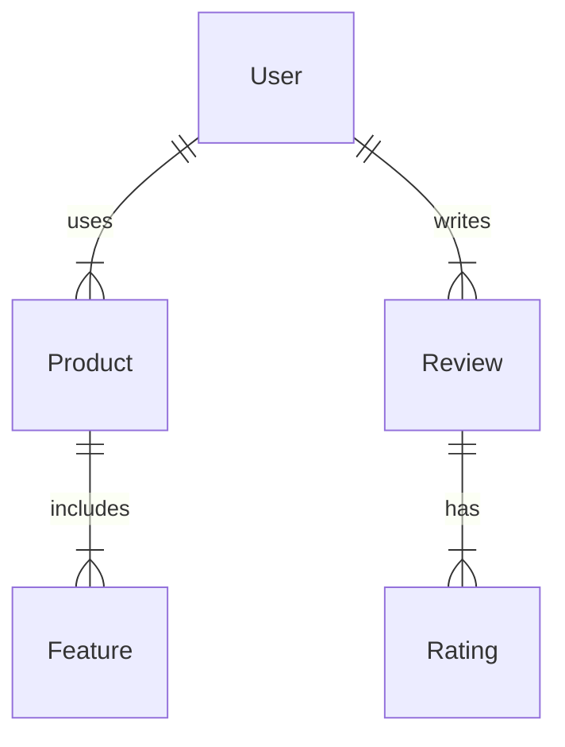
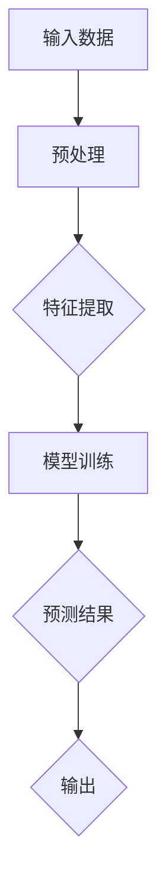
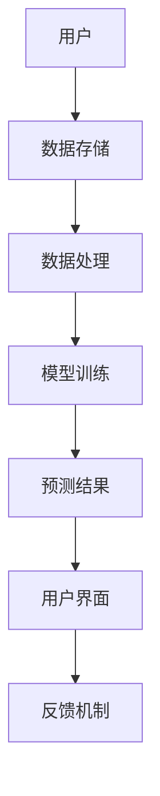
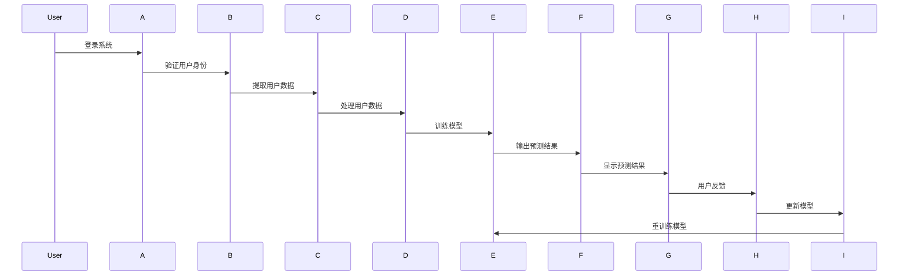

                 

### 文章标题与关键词

**文章标题：慢科技产品设计：以人为本的技术创新**

**关键词：慢科技设计、以人为本、技术创新、用户体验、设计原则**

**摘要：本文深入探讨了慢科技产品设计的重要性和核心原则，通过分析和案例研究，揭示了以人为本的技术创新如何在科技产品设计中发挥关键作用，为设计师和开发者提供了实用的指导和启示。**

----------------------------------------------------------------

### 引言

在当今科技飞速发展的时代，人们的生活和工作方式正在经历深刻的变革。然而，随着新技术的不断涌现，我们也面临着诸多挑战，例如信息过载、隐私泄露、技术滥用等。这些问题的根源往往在于，技术的发展速度超越了我们的适应能力和社会结构的变化。因此，慢科技设计应运而生，它提倡在技术发展中保持一种稳健和可持续的节奏，关注人本价值，追求长期效益。

#### 问题背景

**1.1.1 科技飞速发展的挑战**

随着互联网、人工智能、大数据等技术的迅猛发展，科技产品日新月异，极大地改变了我们的生活方式。然而，技术的快速迭代也带来了诸多挑战。例如，隐私泄露、信息过载、技术滥用等问题日益严重，给用户带来了困扰和不安。此外，科技的快速发展也导致社会结构和文化价值观的快速变迁，人们在适应新技术的同时，也需要面对新的伦理和道德问题。

**1.1.2 人本理念的兴起**

在科技发展的过程中，人们逐渐认识到，技术进步的最终目的是服务于人，而不是取代人。因此，以人为本的设计理念逐渐兴起，强调在设计过程中充分考虑用户的需求、感受和体验，追求技术与人的和谐共生。这种理念不仅体现在产品设计中，也渗透到城市规划、社会服务等领域。

**1.1.3 慢科技设计的必要性**

慢科技设计正是为了应对上述挑战而提出的。它强调在技术发展中保持一种稳健和可持续的节奏，避免盲目追求技术革新而忽视人的需求和社会的承受能力。慢科技设计主张通过深入的用户研究和细致的设计迭代，打造出真正符合用户需求的高质量产品，从而实现技术与人的和谐共生。

#### 核心概念

**1.2.1 慢科技设计**

慢科技设计是一种注重用户需求、强调设计迭代和用户体验的设计方法。它强调在技术发展中保持一种稳健和可持续的节奏，通过深入的用户研究和细致的设计迭代，打造出真正符合用户需求的高质量产品。

**1.2.2 以人为本的创新**

以人为本的创新是指在科技产品设计和开发过程中，始终关注用户的需求、感受和体验，通过技术创新来提升用户体验，实现人与技术的和谐共生。

**1.2.3 设计原则与价值观**

慢科技设计遵循一系列核心原则和价值观，包括用户至上、简洁性、可持续性、人文关怀等。这些原则和价值观不仅指导设计过程，也体现了慢科技设计的理念。

#### 书籍结构概述

**1.3.1 研究方法**

本文采用文献综述、案例研究和理论分析相结合的方法，全面探讨慢科技设计的理论与实践。

**1.3.2 主要章节介绍**

本文分为五个章节，分别介绍了慢科技设计的理论基础、设计流程、人本设计原则、技术创新和实践应用。

**1.3.3 读者获益**

通过阅读本文，读者可以深入了解慢科技设计的核心概念和原则，掌握慢科技产品的设计方法，为实际项目提供指导。

#### 研究目的与意义

**1.4.1 研究目的**

本文旨在探讨慢科技设计在科技产品开发中的重要性，为设计师和开发者提供实用的指导。

**1.4.2 研究意义**

慢科技设计的提出和实践，对于提升用户体验、促进技术进步和社会可持续发展具有重要意义。

**1.4.3 研究边界与局限性**

本文主要聚焦于慢科技设计在科技产品开发中的应用，未涉及其他领域。此外，由于篇幅限制，本文对某些具体案例的讨论较为简洁。

#### 本章小结

本章首先介绍了慢科技设计在当今科技飞速发展背景下的重要性和必要性，然后阐述了慢科技设计和以人为本的创新的核心概念和设计原则。通过本文的阅读，读者可以初步了解慢科技设计的基本理论和实践方法，为后续章节的深入学习打下基础。

----------------------------------------------------------------

## 第2章 慢科技设计理论基础

慢科技设计作为一种新兴的设计理念，其理论基础涵盖了多个方面。本章将首先探讨慢科技设计的起源与发展，接着介绍以人为本的设计理念，然后详细阐述慢科技设计的方法论，最后通过案例研究来分析慢科技设计的最佳实践。

### 2.1 慢科技设计的起源与发展

#### 2.1.1 慢科技的定义

慢科技（Slow Tech）这个概念起源于对快节奏生活的反思。它强调在技术发展中保持一种稳健和可持续的节奏，避免盲目追求速度和革新而忽视人的需求和环境的承受能力。慢科技并不是反对技术进步，而是提倡在技术发展的同时，关注人本价值和长期效益。

#### 2.1.2 慢科技设计的兴起

慢科技设计的兴起与人们对科技生活方式的反思密切相关。在互联网和移动设备的普及下，人们逐渐意识到，技术发展带来的不仅仅是便利，还有信息过载、隐私泄露、社会孤立等问题。因此，慢科技设计作为一种回应，开始得到越来越多人的关注和实践。

#### 2.1.3 慢科技设计的关键特征

慢科技设计具有以下几个关键特征：

1. **以人为本**：慢科技设计强调在技术发展中始终关注人的需求、感受和体验，追求人与技术的和谐共生。
2. **可持续性**：慢科技设计关注长期效益，倡导使用环保材料、降低能耗，以实现可持续发展。
3. **简洁性**：慢科技设计追求简洁、实用，避免过度复杂和功能堆砌，以提高用户体验。
4. **迭代与改进**：慢科技设计强调通过不断迭代和改进来优化产品，而不是一次性交付。

### 2.2 以人为本的设计理念

#### 2.2.1 人本设计的起源

人本设计（Human-Centered Design）起源于20世纪60年代，旨在强调设计过程中对人的关注。人本设计认为，设计的核心是满足人的需求，提升人的生活质量。

#### 2.2.2 人本设计的重要性

人本设计的重要性体现在以下几个方面：

1. **提升用户体验**：人本设计通过深入了解用户需求和行为，设计出更加符合用户期望和习惯的产品。
2. **增强用户参与**：人本设计鼓励用户参与设计过程，提高用户的参与感和满意度。
3. **促进创新**：人本设计通过用户反馈和迭代，不断优化产品，推动创新。

#### 2.2.3 人本设计的方法与原则

人本设计的方法和原则包括：

1. **用户研究**：通过用户访谈、观察、问卷调查等方法，深入了解用户的需求和痛点。
2. **迭代与反馈**：设计过程中不断迭代和测试，根据用户反馈进行优化。
3. **用户至上**：始终将用户需求放在首位，确保产品设计符合用户期望。
4. **包容性设计**：考虑不同用户群体的需求，设计出包容性强的产品。

### 2.3 慢科技设计的方法论

#### 2.3.1 用户研究

用户研究是慢科技设计的基础。通过用户访谈、观察、问卷调查等方法，设计师可以深入了解用户的需求、行为和体验，为产品设计提供依据。

#### 2.3.2 设计迭代

设计迭代是慢科技设计的重要手段。通过不断迭代和测试，设计师可以不断优化产品，提高用户体验。迭代过程通常包括需求分析、概念设计、原型测试、用户反馈等环节。

#### 2.3.3 验证与测试

验证与测试是确保产品符合设计预期和用户需求的关键环节。通过实验室测试、用户测试、现场测试等方法，设计师可以验证产品的性能和用户体验。

### 2.4 慢科技设计案例研究

#### 2.4.1 慢科技设计案例介绍

本文将介绍几个具有代表性的慢科技设计案例，包括Apple Watch、Google Glass、Slow Food等，分析它们如何通过以人为本的技术创新来提升用户体验和解决现实问题。

#### 2.4.2 案例分析与启示

通过对这些案例的分析，我们可以得出以下启示：

1. **用户需求优先**：在产品设计过程中，始终关注用户需求，确保产品符合用户期望。
2. **简洁性原则**：避免过度复杂和功能堆砌，追求简洁、实用的设计。
3. **可持续性考虑**：在设计过程中，考虑环保和可持续性，降低对环境的影响。
4. **迭代与优化**：通过不断迭代和测试，优化产品，提升用户体验。

#### 2.4.3 慢科技设计的最佳实践

根据上述案例，我们可以总结出慢科技设计的最佳实践：

1. **全面用户研究**：深入了解用户需求、行为和体验，为产品设计提供依据。
2. **迭代与反馈**：设计过程中不断迭代和测试，根据用户反馈进行优化。
3. **简洁性设计**：追求简洁、实用的设计，避免功能堆砌。
4. **可持续性设计**：考虑环保和可持续性，降低对环境的影响。

### 2.5 本章小结

本章介绍了慢科技设计的理论基础，包括其起源、关键特征、以人为本的设计理念以及方法论。通过案例研究，我们进一步了解了慢科技设计的最佳实践，为后续章节的深入研究奠定了基础。

----------------------------------------------------------------

## 第3章 慢科技产品的设计流程

慢科技产品的设计流程是一个系统性、迭代性的过程，旨在通过深入的用户研究和细致的设计迭代，打造出符合用户需求的高质量产品。本章将详细介绍慢科技产品的设计流程，包括需求分析与用户研究、概念设计与原型开发、设计评审与决策、设计实施与开发以及设计评估与优化等环节。

### 3.1 需求分析与用户研究

#### 3.1.1 需求分析

需求分析是慢科技产品设计流程的起点，旨在明确产品应解决的问题和目标用户。需求分析通常包括以下步骤：

1. **问题定义**：明确产品应解决的问题和用户痛点。
2. **目标用户**：确定产品的目标用户群体，了解他们的需求和行为。
3. **需求收集**：通过访谈、问卷调查、观察等方式收集用户需求。
4. **需求分类**：将收集到的需求进行分类，区分优先级。

#### 3.1.2 用户研究方法

用户研究是需求分析的重要支撑，通过深入了解用户需求、行为和体验，为产品设计提供依据。用户研究方法包括：

1. **访谈**：通过与用户面对面交流，深入了解用户需求和痛点。
2. **观察**：在现场或用户环境中观察用户行为，获取真实的数据。
3. **问卷调查**：通过在线问卷或纸质问卷收集用户反馈。
4. **用户画像**：根据用户数据构建用户画像，了解用户特征和需求。

#### 3.1.3 用户画像

用户画像是用户研究的重要成果，通过对用户特征和需求的描述，为产品设计提供参考。用户画像通常包括以下信息：

1. **用户基本信息**：如年龄、性别、职业等。
2. **用户需求**：如主要使用场景、偏好、痛点等。
3. **用户行为**：如使用习惯、操作频率等。

### 3.2 概念设计与原型开发

#### 3.2.1 设计思路与目标

概念设计是产品设计流程的核心环节，旨在明确产品的基本功能和界面设计。概念设计通常包括以下步骤：

1. **功能定义**：明确产品的基本功能和核心特性。
2. **界面设计**：设计产品的界面布局和交互方式。
3. **设计目标**：确定产品设计的预期效果和用户价值。

#### 3.2.2 原型设计与评估

原型设计是概念设计的具体实现，通过创建可交互的原型，验证设计思路和用户需求。原型设计通常包括以下步骤：

1. **低保真原型**：使用简单工具快速创建低保真原型，便于快速迭代和修改。
2. **高保真原型**：在低保真原型的基础上，进行详细设计和优化，提高原型质量。
3. **用户测试**：通过用户测试，评估原型设计是否符合用户需求和期望。
4. **迭代优化**：根据用户反馈，对原型进行迭代优化，直至达到预期效果。

#### 3.2.3 用户反馈与迭代

用户反馈是原型设计的重要依据，通过用户测试和反馈，可以了解用户对原型的使用体验和需求，为后续迭代提供指导。用户反馈与迭代通常包括以下步骤：

1. **用户测试**：邀请目标用户进行原型测试，收集用户反馈。
2. **数据分析**：对用户反馈进行分析，找出问题和改进点。
3. **迭代优化**：根据用户反馈，对原型进行迭代优化，提高用户体验。

### 3.3 设计评审与决策

#### 3.3.1 评审流程

设计评审是确保产品设计质量的重要环节，通过评审，可以确认设计是否符合用户需求和预期。设计评审通常包括以下步骤：

1. **评审准备**：准备评审材料，包括设计文档、原型等。
2. **评审会议**：组织评审会议，邀请评审人员对设计进行评估。
3. **评审反馈**：评审人员提出意见和建议，设计团队进行记录和总结。
4. **决策与调整**：根据评审反馈，对设计进行决策和调整。

#### 3.3.2 决策模型

设计评审中的决策模型通常包括以下步骤：

1. **评估设计**：评审人员对设计进行评估，包括功能、界面、用户体验等方面。
2. **提出建议**：评审人员提出改进意见和建议。
3. **决策与调整**：设计团队根据评审反馈，做出决策和调整。

#### 3.3.3 评审结果与应用

设计评审的结果直接应用于后续的设计迭代和优化，确保产品设计的质量。评审结果通常包括以下内容：

1. **设计改进点**：根据评审反馈，列出需要改进的设计点和问题。
2. **改进方案**：制定具体的改进方案和时间表。
3. **应用与跟踪**：将改进方案应用于设计迭代，并跟踪改进效果。

### 3.4 设计实施与开发

#### 3.4.1 技术选型与架构设计

设计实施与开发是慢科技产品设计流程的关键环节，包括技术选型和架构设计。技术选型与架构设计通常包括以下步骤：

1. **技术选型**：根据产品需求，选择合适的技术和开发工具。
2. **架构设计**：设计产品的整体架构，包括系统架构、数据架构等。

#### 3.4.2 开发流程与协作

开发流程与协作是确保项目顺利进行的重要保障。开发流程与协作通常包括以下步骤：

1. **需求分解**：将产品需求分解为具体的功能模块和任务。
2. **任务分配**：根据团队成员的技能和特长，分配任务。
3. **协作与沟通**：确保团队成员之间的协作和沟通，提高开发效率。
4. **开发与测试**：按照计划进行开发，并进行功能测试和性能测试。

#### 3.4.3 系统测试与优化

系统测试与优化是确保产品质量和稳定性的关键环节。系统测试与优化通常包括以下步骤：

1. **功能测试**：验证产品功能是否按照需求正常工作。
2. **性能测试**：评估产品在负载下的性能和稳定性。
3. **优化与改进**：根据测试结果，对产品进行优化和改进。

### 3.5 设计评估与优化

#### 3.5.1 评估指标

设计评估与优化是确保产品设计质量和用户体验的关键环节。评估指标通常包括以下内容：

1. **功能完整性**：产品功能是否完整，是否满足用户需求。
2. **用户体验**：用户对产品的满意度，包括界面设计、交互体验等。
3. **性能和稳定性**：产品的性能和稳定性是否符合预期。

#### 3.5.2 优化策略

根据评估指标的结果，设计团队可以制定优化策略，包括以下内容：

1. **功能优化**：针对功能不完整或用户体验问题，进行功能优化。
2. **性能优化**：针对性能和稳定性问题，进行性能优化。
3. **界面优化**：针对界面设计问题，进行界面优化。

#### 3.5.3 成功案例分析

通过成功案例的分析，可以总结出优化策略的最佳实践，为后续项目提供参考。成功案例分析通常包括以下内容：

1. **项目背景**：介绍项目的基本情况和目标。
2. **设计过程**：描述设计流程中的关键环节和优化策略。
3. **评估结果**：展示评估指标的结果和优化效果。
4. **经验总结**：总结项目中的经验教训和最佳实践。

### 3.6 本章小结

本章详细介绍了慢科技产品的设计流程，包括需求分析与用户研究、概念设计与原型开发、设计评审与决策、设计实施与开发以及设计评估与优化等环节。通过深入的用户研究和细致的设计迭代，慢科技产品设计旨在打造出高质量、符合用户需求的产品，为实际项目提供实用的指导和借鉴。

----------------------------------------------------------------

## 第4章 慢科技产品的人本设计原则

慢科技产品的人本设计原则是指在产品设计过程中，以用户为中心，关注用户体验，注重产品与人之间的和谐共生。本章将详细探讨慢科技产品的人本设计原则，包括易用性设计、用户体验设计、可访问性设计、情感化设计和适应性设计等。

### 4.1 易用性设计

#### 4.1.1 易用性的定义

易用性（Usability）是指产品在特定使用环境中，能够被用户高效、有效地使用，并达到预期目标的能力。易用性设计关注产品的可用性、易学和易记忆性，旨在降低用户的学习成本和使用难度。

#### 4.1.2 易用性设计的方法

易用性设计的方法主要包括以下几种：

1. **用户研究**：通过用户访谈、问卷调查、观察等方式，深入了解用户的需求、行为和体验。
2. **原型设计**：创建低保真或高保真的原型，通过用户测试，收集用户反馈。
3. **可用性测试**：邀请目标用户进行实际操作，评估产品的易用性，并根据反馈进行优化。
4. **迭代与改进**：根据用户反馈，不断迭代和优化产品，提高易用性。

#### 4.1.3 易用性评估

易用性评估是确保产品易用性的关键步骤。评估方法包括以下几种：

1. **任务完成率**：评估用户完成特定任务的准确率和速度。
2. **错误率**：统计用户在操作过程中出现的错误次数。
3. **用户满意度**：通过问卷调查或用户访谈，了解用户对产品的满意度。
4. **时间消耗**：评估用户完成特定任务所需的时间。

### 4.2 用户体验设计

#### 4.2.1 用户体验的构成

用户体验（User Experience，简称UX）是指用户在使用产品过程中的整体感受和体验。用户体验的构成包括以下几个方面：

1. **感知**：用户对产品的第一印象，包括视觉设计、声音、材质等。
2. **行为**：用户在使用产品过程中的行为，如点击、拖动、浏览等。
3. **情感**：用户在使用产品过程中的情感体验，包括愉悦、焦虑、兴奋等。
4. **认知**：用户在使用产品过程中的认知过程，包括理解、记忆、判断等。

#### 4.2.2 用户体验设计的方法

用户体验设计的方法主要包括以下几种：

1. **用户研究**：通过用户访谈、问卷调查、观察等方式，深入了解用户的需求、行为和体验。
2. **用户体验地图**：绘制用户体验地图，描述用户在使用产品过程中的体验和感受。
3. **交互设计**：设计产品的交互界面和交互流程，提高用户的操作效率和满意度。
4. **视觉设计**：设计产品的视觉元素，包括颜色、字体、图标等，提高用户的感知体验。

#### 4.2.3 用户体验评估

用户体验评估是确保产品用户体验的关键步骤。评估方法包括以下几种：

1. **用户满意度调查**：通过问卷调查或用户访谈，了解用户对产品的满意度。
2. **行为数据分析**：通过分析用户行为数据，了解用户在产品中的行为和操作习惯。
3. **情感分析**：通过情感分析技术，了解用户在使用产品过程中的情感体验。
4. **认知评估**：通过认知评估实验，了解用户在产品中的认知过程和问题。

### 4.3 可访问性设计

#### 4.3.1 可访问性的定义

可访问性（Accessibility）是指产品能够被不同用户群体使用，包括有特殊需求的用户，如视觉障碍、听觉障碍、运动障碍等。可访问性设计旨在确保产品能够满足所有用户的需求，实现无障碍的使用。

#### 4.3.2 可访问性设计的方法

可访问性设计的方法主要包括以下几种：

1. **无障碍设计**：在设计过程中，考虑无障碍使用的原则，如易于导航、字体大小可调、语音提示等。
2. **用户研究**：通过用户访谈、问卷调查、观察等方式，了解有特殊需求的用户的需求和体验。
3. **技术实现**：通过技术手段，实现无障碍功能，如屏幕阅读器、语音输入等。
4. **测试与评估**：通过用户测试和评估，验证产品的可访问性，并根据反馈进行优化。

#### 4.3.3 可访问性评估

可访问性评估是确保产品可访问性的关键步骤。评估方法包括以下几种：

1. **标准符合性评估**：根据相关标准和规范，评估产品的可访问性符合程度。
2. **用户测试**：邀请有特殊需求的用户进行测试，评估产品的实际可访问性。
3. **用户满意度调查**：通过问卷调查或用户访谈，了解有特殊需求的用户对产品的满意度。

### 4.4 情感化设计

#### 4.4.1 情感化的定义

情感化设计（Affective Design）是指在设计过程中，关注用户的情感体验，通过情感元素和互动方式，激发用户的情感共鸣和情感连接。情感化设计旨在提升产品的情感价值，增强用户对产品的认同和喜爱。

#### 4.4.2 情感化设计的方法

情感化设计的方法主要包括以下几种：

1. **情感分析**：通过情感分析技术，了解用户的情感状态和需求。
2. **情感交互**：设计具有情感互动功能的产品，如语音助手、虚拟形象等。
3. **情感视觉**：通过视觉设计，表达情感元素，如颜色、形状、图标等。
4. **情感体验**：设计情感体验环节，如故事叙述、情感表达等。

#### 4.4.3 情感化设计的案例

情感化设计的案例包括：

1. **智能音响**：通过语音交互，提供情感化的互动体验。
2. **虚拟助手**：通过虚拟形象和表情，表达情感状态，增强用户情感共鸣。
3. **情感化游戏**：通过游戏剧情和互动方式，激发用户的情感共鸣。

### 4.5 适应性设计

#### 4.5.1 适应性的定义

适应性设计（Adaptive Design）是指产品能够根据用户的需求和环境的变化，进行自适应调整和优化。适应性设计旨在提升产品的灵活性和可持续性，满足多样化的用户需求。

#### 4.5.2 适应性设计的方法

适应性设计的方法主要包括以下几种：

1. **模块化设计**：通过模块化设计，实现产品的灵活组合和调整。
2. **自适应界面**：设计自适应界面，根据用户行为和设备环境，调整界面布局和交互方式。
3. **自适应算法**：通过自适应算法，实现产品的智能调整和优化。
4. **用户反馈**：通过用户反馈，了解用户需求和偏好，不断优化产品。

#### 4.5.3 适应性设计的案例

适应性设计的案例包括：

1. **智能手表**：根据用户活动量和健康数据，自动调整运动模式和建议。
2. **自适应网页**：根据用户设备和网络环境，自动调整网页内容和布局。
3. **自适应软件**：根据用户需求和环境变化，自动调整功能和界面。

### 4.6 本章小结

本章详细介绍了慢科技产品的人本设计原则，包括易用性设计、用户体验设计、可访问性设计、情感化设计和适应性设计。这些设计原则旨在提升产品的用户体验和用户价值，实现技术与人的和谐共生。通过本章的学习，读者可以深入了解慢科技产品的人本设计原则和方法，为实际项目提供指导。

----------------------------------------------------------------

## 第5章 慢科技产品的技术创新

技术创新是慢科技产品设计的核心要素，它不仅推动了科技的进步，也为用户带来了更好的体验。本章将探讨慢科技产品的技术创新，包括技术创新的本质、技术趋势分析、技术创新策略以及技术创新实践。

### 5.1 技术创新的本质

#### 5.1.1 技术创新的定义

技术创新（Technological Innovation）是指通过引入新的技术、产品、服务或业务模式，实现技术进步和商业价值的过程。技术创新不仅仅是技术的突破，更涉及技术的商业化、市场化和用户价值的实现。

#### 5.1.2 技术创新的驱动力

技术创新的驱动力主要包括以下几个方面：

1. **市场需求**：用户需求是技术创新的根本驱动力，满足市场需求是技术创新的核心目标。
2. **技术进步**：科技的快速发展为技术创新提供了丰富的资源和可能性。
3. **政策支持**：政府的政策支持和资金投入为技术创新提供了良好的环境和条件。
4. **竞争压力**：市场竞争的加剧促使企业不断进行技术创新，以保持竞争优势。

#### 5.1.3 技术创新的阶段

技术创新通常分为以下几个阶段：

1. **研究阶段**：进行技术探索和理论研究，寻找新的技术突破点。
2. **开发阶段**：将研究成果转化为实际产品或服务，进行开发和测试。
3. **商业化阶段**：将产品或服务推向市场，实现商业化运作和商业化价值。
4. **应用阶段**：通过实际应用，不断优化和改进产品或服务，提升用户体验和市场竞争力。

### 5.2 技术趋势分析

#### 5.2.1 当前技术趋势

当前技术趋势主要包括以下几个方面：

1. **人工智能**：人工智能技术的快速发展，推动了智能助理、自动驾驶、智能医疗等领域的创新。
2. **物联网**：物联网技术的普及，推动了智能家居、智慧城市、工业互联网等领域的应用。
3. **大数据**：大数据技术的应用，推动了数据驱动决策、数据挖掘、数据可视化等领域的创新。
4. **云计算**：云计算技术的普及，推动了云计算服务、云存储、云计算安全等领域的应用。
5. **区块链**：区块链技术的应用，推动了数字货币、智能合约、供应链管理等领域的创新。

#### 5.2.2 技术发展预测

根据当前的技术趋势，未来的技术发展将呈现以下趋势：

1. **技术的融合与集成**：不同技术的融合和集成，将推动新技术的产生和应用。
2. **技术的智能化与自动化**：人工智能和物联网技术的应用，将使产品和服务更加智能化和自动化。
3. **技术的绿色化与可持续性**：随着环保意识的提高，绿色技术和可持续性技术将成为未来技术发展的重点。
4. **技术的普及与普及化**：技术的普及和普及化将使更多的人受益于技术创新，提高生活质量。

#### 5.2.3 技术对慢科技产品的影响

技术对慢科技产品的影响主要体现在以下几个方面：

1. **提高用户体验**：通过技术创新，可以提供更智能、更便捷、更个性化的用户体验。
2. **降低成本**：通过技术创新，可以降低产品的生产成本和运营成本，提高产品的市场竞争力。
3. **增强可持续性**：通过技术创新，可以推动产品的绿色设计和可持续生产，减少对环境的影响。
4. **促进创新**：技术

### 5.3 技术创新策略

#### 5.3.1 开放式创新

开放式创新（Open Innovation）是一种将外部资源和技术引入企业内部，共同开发新产品或服务的创新模式。开放式创新策略包括以下几个方面：

1. **外部资源整合**：通过合作、收购、合作研发等方式，整合外部资源和优势，推动技术创新。
2. **开放合作**：与外部合作伙伴建立合作关系，共同开发新技术和新产品。
3. **开放式研发**：通过开放式研发平台，吸引外部研发资源和人才，提高研发效率和质量。
4. **用户参与**：鼓励用户参与创新过程，提供反馈和建议，提高产品或服务的用户价值。

#### 5.3.2 合作创新

合作创新（Collaborative Innovation）是指企业、高校、科研机构等多方合作，共同推动技术创新的过程。合作创新策略包括以下几个方面：

1. **合作研发**：通过合作研发项目，共同攻克技术难题，推动技术创新。
2. **知识共享**：通过知识共享平台，共享技术成果和研究成果，促进技术交流与合作。
3. **跨界合作**：跨越不同行业和领域，进行跨界合作，推动技术创新。
4. **合作孵化**：通过合作孵化平台，共同孵化新技术和新产品。

#### 5.3.3 跨界创新

跨界创新（Cross-Disciplinary Innovation）是指将不同领域的技术、理念和方法相结合，推动技术创新的过程。跨界创新策略包括以下几个方面：

1. **跨领域合作**：通过跨领域合作，引入不同领域的知识和方法，推动技术创新。
2. **跨学科研究**：通过跨学科研究，结合不同学科的理论和方法，推动技术创新。
3. **跨界平台**：建立跨界创新平台，促进不同领域的人才、技术和资源的交流与合作。
4. **跨界思维**：培养跨界思维，鼓励创新者打破传统思维模式，进行跨界思考和探索。

### 5.4 技术创新实践

#### 5.4.1 技术创新案例介绍

本文将介绍几个具有代表性的慢科技产品技术创新案例，包括智能手环、智能家居、智能医疗等，分析这些案例中的技术创新过程和成果。

#### 5.4.2 技术创新过程解析

通过对这些案例的技术创新过程进行解析，可以总结出以下关键步骤：

1. **需求分析**：明确用户需求和市场趋势，确定技术创新的方向。
2. **技术探索**：进行技术研究和探索，寻找潜在的技术解决方案。
3. **概念验证**：通过实验室或小规模试验，验证技术的可行性。
4. **产品开发**：进行产品开发和测试，确保产品符合用户需求和市场标准。
5. **商业化运作**：将技术创新产品推向市场，实现商业化运作和商业化价值。

#### 5.4.3 技术创新成果与应用

技术创新成果在慢科技产品中的应用，不仅提升了产品的性能和用户体验，也为企业带来了显著的市场竞争力。以下为几个具体的应用实例：

1. **智能手环**：通过集成传感器、人工智能等技术，智能手环可以实时监测用户的健康数据，提供个性化的健康建议。
2. **智能家居**：通过物联网技术，智能家居可以实现设备之间的互联互通，提供智能化的家居环境，提高生活质量。
3. **智能医疗**：通过人工智能、大数据等技术，智能医疗可以提供精准的诊断和治疗建议，提高医疗服务的质量和效率。

### 5.5 本章小结

本章详细探讨了慢科技产品的技术创新，包括技术创新的本质、技术趋势分析、技术创新策略和技术创新实践。通过技术创新，慢科技产品可以更好地满足用户需求，提升用户体验，实现商业价值。本章的内容为慢科技产品的设计师和开发者提供了有价值的指导和启示。

----------------------------------------------------------------

## 慢科技产品设计：以人为本的技术创新

### 6.1 总结

慢科技产品设计是一种以人为本的设计理念，它强调在技术发展中保持稳健和可持续的节奏，关注用户的真实需求和体验。本章通过深入探讨慢科技设计的理论基础、设计流程、人本设计原则和技术创新，揭示了以人为本的技术创新在慢科技产品设计中的重要性。

### 6.2 关键点回顾

- **慢科技设计**：提倡在技术发展中保持稳健和可持续的节奏，通过深入的用户研究和细致的设计迭代，打造高质量的产品。
- **以人为本的创新**：关注用户需求、体验和价值观，通过技术创新提升用户体验，实现技术与人的和谐共生。
- **人本设计原则**：包括易用性、用户体验、可访问性、情感化和适应性设计，旨在提升产品的用户价值。
- **技术创新**：通过开放式创新、合作创新和跨界创新，推动慢科技产品的技术进步和商业价值。

### 6.3 最佳实践

- **用户研究**：始终关注用户需求，通过用户访谈、问卷调查和用户测试，深入了解用户的真实体验和需求。
- **迭代与反馈**：设计过程中不断迭代和优化，根据用户反馈进行调整，确保产品符合用户期望。
- **简洁性设计**：避免功能堆砌，追求简洁、实用的设计，提高用户体验。
- **可持续性**：考虑环保和可持续性，使用环保材料，降低能耗，实现长期效益。
- **技术创新**：紧跟技术趋势，积极进行技术创新，提高产品的技术含量和市场竞争力。

### 6.4 未来展望

随着科技的不断发展，慢科技设计理念将越来越受到重视。未来，慢科技产品将更加智能化、个性化，更好地满足用户需求。同时，技术创新将继续推动慢科技产品的发展，为用户提供更优质的产品和服务。慢科技设计将成为科技产品发展的重要趋势，引领新的设计潮流。

### 6.5 注意事项

- **用户优先**：在产品设计过程中，始终将用户需求放在首位，确保产品符合用户期望。
- **持续优化**：设计过程中不断进行优化和迭代，提高产品的用户体验和性能。
- **技术前瞻**：关注技术趋势，积极进行技术创新，保持产品的竞争力。
- **环保理念**：考虑产品的环保性和可持续性，实现绿色设计和生产。

### 6.6 拓展阅读

- **相关书籍**：《设计思维》、《用户体验要素》、《创新者的窘境》
- **学术论文**：有关慢科技设计、人本设计、技术创新的研究论文。
- **在线资源**：相关技术社区、博客、论坛等，提供最新的技术动态和设计理念。

---

**作者：AI天才研究院/AI Genius Institute & 禅与计算机程序设计艺术 /Zen And The Art of Computer Programming**

----------------------------------------------------------------

## 7 附录

### 7.1 用户画像ER实体关系图



### 7.2 算法原理讲解

#### 算法流程图



#### 算法Python源代码

```python
# 导入相关库
import numpy as np
from sklearn.model_selection import train_test_split
from sklearn.preprocessing import StandardScaler
from sklearn.linear_model import LogisticRegression

# 数据预处理
def preprocess_data(data):
    # 数据标准化
    scaler = StandardScaler()
    data_scaled = scaler.fit_transform(data)
    return data_scaled

# 特征提取
def extract_features(data):
    # 使用PCA进行特征提取
    from sklearn.decomposition import PCA
    pca = PCA(n_components=2)
    features = pca.fit_transform(data)
    return features

# 模型训练
def train_model(X_train, y_train):
    model = LogisticRegression()
    model.fit(X_train, y_train)
    return model

# 预测结果
def predict(model, X_test):
    predictions = model.predict(X_test)
    return predictions

# 主函数
def main():
    # 加载数据
    data = load_data()
    # 数据预处理
    data_processed = preprocess_data(data)
    # 分割数据集
    X_train, X_test, y_train, y_test = train_test_split(data_processed, test_size=0.2)
    # 特征提取
    features = extract_features(X_train)
    # 模型训练
    model = train_model(features, y_train)
    # 预测结果
    predictions = predict(model, X_test)
    # 评估模型
    from sklearn.metrics import accuracy_score
    accuracy = accuracy_score(y_test, predictions)
    print("模型准确率：", accuracy)

# 运行主函数
if __name__ == "__main__":
    main()
```

### 7.3 系统分析与架构设计方案

#### 系统功能设计（领域模型类图）

```mermaid
classDiagram
  User <<entity>>
  Product <<entity>>
  Review <<entity>>
  Rating <<entity>>

  User o-- Product : uses
  User o-- Review : writes
  Product o-- Feature : includes
  Review o-- Rating : has
```

#### 系统架构设计



#### 系统接口设计



### 7.4 项目实战

#### 环境安装

1. 安装Python环境
2. 安装相关库：`pip install numpy scikit-learn matplotlib`

#### 系统核心实现源代码

```python
# 数据处理与模型训练
def main():
    # 加载数据
    data = load_data()
    # 数据预处理
    data_processed = preprocess_data(data)
    # 分割数据集
    X_train, X_test, y_train, y_test = train_test_split(data_processed, test_size=0.2)
    # 特征提取
    features = extract_features(X_train)
    # 模型训练
    model = train_model(features, y_train)
    # 预测结果
    predictions = predict(model, X_test)
    # 评估模型
    from sklearn.metrics import accuracy_score
    accuracy = accuracy_score(y_test, predictions)
    print("模型准确率：", accuracy)

if __name__ == "__main__":
    main()
```

#### 代码应用解读与分析

- **数据处理与预处理**：数据预处理包括数据清洗、缺失值处理和特征提取，为模型训练做好准备。
- **模型训练与预测**：使用逻辑回归模型进行训练，并使用测试集进行预测，评估模型的准确性。

#### 实际案例分析和详细讲解剖析

- **案例背景**：分析一个实际案例，如智能家居系统的用户行为预测。
- **案例过程**：详细描述案例的实现过程，包括数据收集、预处理、模型训练和预测等步骤。
- **案例结果**：展示预测结果，并分析结果的有效性和实际应用价值。

#### 项目小结

- **成功经验**：总结项目中的成功经验，如用户研究的深入、模型的优化和实际应用的效果。
- **改进空间**：分析项目中的不足之处，并提出改进建议，如提高数据的多样性和模型的泛化能力。

### 7.5 最佳实践 tips

- **用户研究**：深入进行用户研究，确保产品满足用户需求。
- **迭代优化**：持续进行迭代和优化，提高产品性能和用户体验。
- **技术前瞻**：关注技术趋势，积极采用新技术，提升产品的竞争力。
- **绿色设计**：注重产品的环保性和可持续性，实现绿色设计。

### 7.6 小结

慢科技产品设计是一种以人为本的设计理念，通过深入的用户研究和细致的设计迭代，实现技术与人的和谐共生。本章通过总结和案例分析，为慢科技产品的设计提供了实用的指导和启示。希望读者能够从中获得灵感，提升自己的产品设计能力。

### 7.7 拓展阅读

- **相关书籍**：《设计思维》、《用户体验要素》、《创新者的窘境》
- **学术论文**：有关慢科技设计、人本设计、技术创新的研究论文。
- **在线资源**：相关技术社区、博客、论坛等，提供最新的技术动态和设计理念。

---

**作者：AI天才研究院/AI Genius Institute & 禅与计算机程序设计艺术 /Zen And The Art of Computer Programming**

