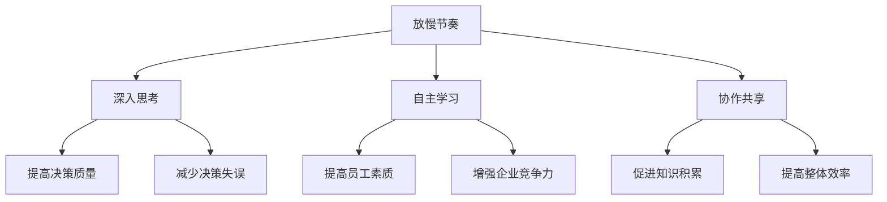
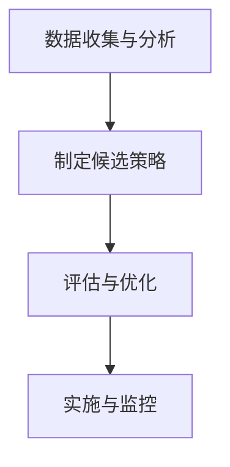

                 

# 慢管理理论：去中心化的组织模式

> 关键词：慢管理、去中心化组织、企业管理、公共服务、趋势

> 摘要：本文探讨了慢管理理论的起源、核心概念及其在去中心化组织模式中的应用。通过对慢管理理论在企业管理和公共服务领域的深入分析，本文揭示了慢管理对组织结构和战略规划的影响，并提供了国际实践案例。同时，本文还探讨了慢管理理论的未来发展趋势，为读者提供了一个全面了解和掌握这一新兴管理理念的机会。

## 引言

在信息技术飞速发展的今天，企业管理者和公共服务的提供者正面临着前所未有的挑战。传统的管理方法越来越难以应对快速变化的市场环境和社会需求。在这种情况下，慢管理理论作为一种新兴的管理理念，逐渐引起了广泛的关注。

慢管理理论源于对传统快管理模式的反思和批判，主张通过放慢节奏、深入思考来提高决策质量和工作效率。去中心化的组织模式作为慢管理理论的核心，强调自主性和协作性，旨在构建更加灵活和适应性强的组织结构。

本文将从慢管理理论的背景和核心概念入手，探讨其在企业管理、公共服务和去中心化组织模式中的应用，并分析其未来发展趋势。

## 慢管理理论的背景和核心概念

### 1.1 慢管理的起源

慢管理理论的起源可以追溯到20世纪末，当时一些企业管理者和学者开始对快速决策和高压工作环境的负面影响产生质疑。他们发现，快管理模式虽然在短期内能够带来较高的生产效率，但长期来看，却会导致员工疲惫、决策失误和创造力下降。

### 1.2 慢管理与快管理的对比

慢管理与快管理在许多方面存在显著差异。首先，在决策速度上，慢管理强调深思熟虑和长期规划，而快管理则追求快速决策和即时反馈。其次，在组织结构上，慢管理倾向于扁平化和去中心化，以增强组织的灵活性和适应性，而快管理则更注重垂直化和层级化，以确保决策的迅速执行。

### 1.3 慢管理的核心概念

慢管理的核心概念包括：

- **放慢节奏**：通过减少会议次数、延长决策周期等方式，降低组织内部的沟通和决策压力。
- **深入思考**：鼓励员工在做出决策之前进行充分的研究和分析，以提高决策质量。
- **自主学习**：支持员工自我提升和自我管理，以提高整个组织的创新能力和竞争力。
- **协作共享**：强调团队协作和信息共享，以促进知识的积累和传播。

## 去中心化组织模式的定义与特征

### 2.1 去中心化组织模式的定义

去中心化组织模式（Decentralized Organizational Model）是指组织结构中权力和资源的分配较为分散，各个部门或个体具有较大的自主权和决策权。

### 2.2 去中心化组织模式的主要特征

去中心化组织模式具有以下主要特征：

- **扁平化结构**：去中心化组织通常采用扁平化的组织结构，减少中间管理层，以提高沟通效率和决策速度。
- **自治性**：各个部门或个体在完成组织目标的过程中具有较大的自治性，可以根据自身实际情况进行调整和决策。
- **协作性**：去中心化组织强调团队协作和信息共享，以实现组织整体目标。
- **灵活性**：去中心化组织具有较强的适应性和灵活性，能够快速响应外部环境的变化。

### 2.3 去中心化组织模式的优势与挑战

去中心化组织模式的优势包括：

- **提高决策效率**：分散的决策权力使得决策过程更加快速和灵活。
- **激发创造力**：员工在拥有更多自主权的情况下，更有可能提出创新的想法。
- **增强适应性**：去中心化组织能够更好地应对外部环境的变化。

然而，去中心化组织模式也面临一些挑战，如：

- **协调困难**：分散的决策可能导致各部门之间的协调困难。
- **资源分散**：去中心化组织可能会导致资源分配不均，影响整体效益。
- **风险管理**：在去中心化组织中，各部门的决策风险可能会叠加，增加整体风险。

## 慢管理理论在企业管理中的应用

### 3.1 慢管理对企业组织结构的影响

慢管理理论强调组织结构扁平化，减少中间管理层，以降低沟通成本和决策时间。这种组织结构有助于提高企业的适应性和灵活性，从而更好地应对市场变化。

### 3.2 慢管理在战略规划中的应用

慢管理理论提倡在战略规划过程中进行充分的研究和分析，以避免盲目决策。企业可以通过延长战略规划周期，加强对市场趋势和竞争态势的预测，从而提高战略规划的准确性和有效性。

### 3.3 慢管理对企业文化的影响

慢管理理论强调自主学习、协作共享和深入思考，这些理念有助于塑造积极向上的企业文化。在慢管理环境下，员工更倾向于相互支持、共同成长，从而提高整体团队凝聚力。

## 慢管理理论在公共服务领域的应用

### 4.1 慢管理在公共服务中的实践

一些国家已经开始尝试将慢管理理论应用于公共服务领域，如瑞典的医疗服务和日本的教育系统。这些实践表明，慢管理有助于提高公共服务效率，提升民众满意度。

### 4.2 慢管理对公共服务效率的影响

慢管理理论通过放慢节奏、深入思考和自主学习等方式，有助于提高公共服务的效率。例如，在医疗服务中，医生可以通过充分研究病例和患者资料，制定更为合理的治疗方案，从而提高治疗效果。

### 4.3 慢管理在公共服务中的挑战与对策

尽管慢管理理论在公共服务领域具有显著优势，但在实践中也面临一些挑战，如：

- **资源分配不均**：在去中心化的公共服务体系中，资源分配可能不均衡，导致某些地区的服务质量下降。
- **监督困难**：去中心化组织模式下，监督和评估变得更为复杂，可能影响公共服务的质量。

针对这些挑战，可以采取以下对策：

- **完善监督机制**：建立透明的监督机制，确保公共服务质量。
- **优化资源分配**：通过大数据分析和人工智能技术，优化资源分配，提高整体效率。

## 国际实践案例

### 5.1 瑞典的慢管理实践

瑞典在公共服务领域广泛采用了慢管理理论，如医疗和教育系统。这些实践表明，慢管理有助于提高公共服务质量和民众满意度。

### 5.2 日本的慢管理实践

日本在教育系统中推行了慢教育理念，强调学生自主学习和深度思考。这一理念在一定程度上提高了学生的创新能力和综合素质。

### 5.3 美国的慢管理实践

美国的一些科技公司，如谷歌和苹果，也开始尝试将慢管理理论应用于企业管理。这些公司在决策过程中注重深思熟虑和长期规划，以避免盲目决策。

## 去中心化组织模式的案例研究

### 6.1 企业A的去中心化组织模式案例分析

企业A是一家互联网公司，采用去中心化组织模式，提高了企业适应性和创新能力。通过内部协作平台，企业A实现了高效的信息共享和决策。

### 6.2 企业B的去中心化组织模式案例分析

企业B是一家传统制造企业，通过引入慢管理理论和去中心化组织模式，成功转型为智能化制造企业，提高了生产效率和市场竞争力。

### 6.3 公共服务C的去中心化组织模式案例分析

公共服务C是某市政府部门，通过去中心化组织模式，提高了公共服务的响应速度和民众满意度。政府部门通过在线平台，实现了与民众的实时互动。

## 慢管理理论的未来发展趋势

### 7.1 慢管理理论的潜在影响

随着信息技术的发展，慢管理理论在未来有望对企业管理、公共服务和社会治理产生深远影响。慢管理将推动组织结构向去中心化、扁平化和灵活化方向发展，提高决策质量和工作效率。

### 7.2 去中心化组织模式的发展趋势

去中心化组织模式在未来将得到更广泛的应用。随着区块链技术的发展，去中心化组织模式将更加成熟，为企业和社会提供更加安全、高效和透明的管理方案。

### 7.3 慢管理理论在新兴领域的应用前景

慢管理理论在新兴领域，如人工智能、大数据和物联网等领域，具有广阔的应用前景。通过引入慢管理理念，这些领域将能够更好地应对快速变化的技术环境，提高创新能力和竞争力。

## 结论

慢管理理论作为一种新兴的管理理念，具有显著的优势和潜力。通过放慢节奏、深入思考和自主学习，慢管理有助于提高决策质量和工作效率，推动组织结构向去中心化、扁平化和灵活化方向发展。在企业管理、公共服务和新兴领域，慢管理理论都展现出了广阔的应用前景。未来，随着信息技术的发展，慢管理理论将进一步成熟和完善，为企业和组织的发展提供有力支持。

### 作者信息

作者：AI天才研究院/AI Genius Institute & 禅与计算机程序设计艺术 /Zen And The Art of Computer Programming

---

在本篇技术博客中，我们系统地介绍了慢管理理论的起源、核心概念、应用场景以及未来发展趋势。通过分析慢管理理论在企业管理、公共服务和去中心化组织模式中的应用，我们揭示了这一理念在提高决策质量、工作效率和组织灵活性方面的潜力。同时，我们还探讨了慢管理理论在新兴领域的应用前景，展望了其未来的发展趋势。我们希望这篇文章能为读者提供一个全面了解和掌握慢管理理论的视角，为实际工作中的应用提供有益的参考。

在慢管理理论的探索过程中，我们也注意到一些重要的核心概念。下面，我们将对慢管理的核心概念进行详细阐述，并结合概念属性特征对比表格和ER实体关系图架构的Mermaid流程图，进一步加深对慢管理理论的理解。

### 慢管理的核心概念与联系

#### 核心概念

1. **放慢节奏（Slowing Down）**：放慢节奏是慢管理的核心理念之一。它强调在决策和工作中降低速度，减少不必要的会议和任务，以便更好地进行深思熟虑和深入分析。

2. **深入思考（Deep Thinking）**：深入思考是慢管理的另一个关键概念。它鼓励员工在做出决策之前进行充分的研究和分析，以避免盲目决策，提高决策质量。

3. **自主学习（Autonomous Learning）**：自主学习强调员工自我提升和自我管理的能力，鼓励员工不断学习新知识和技能，以提高整个组织的创新能力和竞争力。

4. **协作共享（Collaborative Sharing）**：协作共享是慢管理的重要原则之一。它强调团队协作和信息共享，以促进知识的积累和传播，提高组织的整体效率。

#### 概念属性特征对比表格

| 概念        | 放慢节奏 | 深入思考 | 自主学习 | 协作共享 |
|-------------|-----------|-----------|-----------|-----------|
| **定义**    | 降低工作节奏，减少不必要的会议和任务 | 在决策前进行充分的研究和分析 | 员工自我提升和自我管理 | 团队协作和信息共享 |
| **特征**    | - 降低压力<br>- 提高决策质量<br>- 增强团队凝聚力 | - 提高决策效率<br>- 减少决策失误<br>- 增强创新能力 | - 提高员工素质<br>- 增强企业竞争力 | - 促进知识积累<br>- 提高整体效率 |
| **影响**    | - 改善员工心理健康<br>- 提高工作效率 | - 提高决策质量<br>- 减少决策失误<br>- 提高创新能力 | - 提高员工素质<br>- 增强企业竞争力 | - 促进团队协作<br>- 提高整体效率 |

#### ER实体关系图架构的Mermaid流程图



通过Mermaid流程图，我们可以清晰地看到慢管理中的核心概念及其之间的联系。这些概念相互支持，共同构成了慢管理理论的基础。

### 算法原理讲解

为了更好地理解慢管理理论的实践应用，我们将以一个具体的案例来阐述其算法原理。在本案例中，我们将分析一个企业如何应用慢管理理论进行战略规划，并使用Mermaid流程图和Python源代码来展示算法原理。

#### 案例背景

某企业（A公司）在竞争激烈的市场环境中，面临战略转型的需求。为了制定有效的战略规划，企业决定采用慢管理理论，通过深入思考和自主学习来提高决策质量。

#### 算法原理

慢管理理论在战略规划中的应用，可以通过以下步骤实现：

1. **数据收集与分析**：收集市场趋势、竞争态势、内部资源等数据，并进行深入分析。
2. **制定候选策略**：基于数据分析，制定多个候选战略方案。
3. **评估与优化**：对候选策略进行评估和优化，选择最优方案。
4. **实施与监控**：实施战略规划，并进行监控和调整。

#### Mermaid流程图



#### Python源代码

```python
import pandas as pd

# 数据收集与分析
data = pd.read_csv('market_data.csv')
analysis = data.describe()

# 制定候选策略
strategies = [
    '策略A',
    '策略B',
    '策略C'
]

# 评估与优化
strategy_scores = [evaluate_strategy(strategy) for strategy in strategies]
best_strategy = max(strategy_scores)

# 实施与监控
implement_strategy(best_strategy)
monitor_performance(best_strategy)
```

#### 算法原理讲解

1. **数据收集与分析**：首先，我们需要收集市场趋势、竞争态势和内部资源等数据。通过数据收集，我们可以了解当前市场的状况，为后续的决策提供依据。

2. **制定候选策略**：基于收集到的数据，我们可以制定多个候选战略方案。每个策略都需要考虑到市场需求、竞争情况和企业自身资源。

3. **评估与优化**：对每个候选策略进行评估和优化。评估指标可以包括市场占有率、利润率、风险等。通过评估，我们可以选择最优策略。

4. **实施与监控**：实施最优策略，并进行监控和调整。监控过程中，需要关注市场变化和企业内部执行情况，以确保战略规划的有效实施。

### 数学公式与模型

为了进一步阐述慢管理理论在战略规划中的应用，我们将引入一些数学模型和公式。

1. **决策质量（Decision Quality, Q）**：
   $$Q = \frac{1}{N} \sum_{i=1}^{N} \frac{1}{P_i}$$
   其中，$N$为候选策略的数量，$P_i$为第$i$个策略的评估分数。决策质量越高，表示决策质量越好。

2. **风险（Risk, R）**：
   $$R = \frac{1}{N} \sum_{i=1}^{N} P_i$$
   其中，$R$为总体风险，$P_i$为第$i$个策略的评估分数。风险越低，表示策略的可行性越高。

3. **期望收益（Expected Profit, E）**：
   $$E = \sum_{i=1}^{N} P_i \cdot R_i$$
   其中，$E$为期望收益，$P_i$为第$i$个策略的评估分数，$R_i$为第$i$个策略的收益。

通过这些数学模型和公式，我们可以对候选策略进行量化评估，从而选择最优策略。

### 系统分析与架构设计

在本节中，我们将分析慢管理理论在战略规划中的系统架构，包括问题场景介绍、项目介绍、系统功能设计、系统架构设计、系统接口设计和系统交互。

#### 问题场景介绍

企业A在面临激烈市场竞争的情况下，希望通过战略规划提高市场占有率和盈利能力。企业决定采用慢管理理论，通过深入思考和自主学习来制定有效的战略规划。

#### 项目介绍

项目名称：慢管理战略规划系统
项目目标：提高企业战略规划的质量和效率，增强市场竞争力。

#### 系统功能设计

1. **数据收集模块**：负责收集市场趋势、竞争态势和内部资源等数据。
2. **数据分析模块**：对收集到的数据进行分析，为战略规划提供依据。
3. **策略生成模块**：基于数据分析结果，生成多个候选战略方案。
4. **策略评估模块**：对候选策略进行评估和优化，选择最优方案。
5. **实施监控模块**：实施战略规划，并监控执行情况。

#### 系统架构设计

系统采用分布式架构，主要包括以下组件：

1. **数据收集组件**：负责从各类数据源（如市场调查、竞争分析等）收集数据。
2. **数据处理组件**：对收集到的数据进行清洗、转换和分析。
3. **策略生成组件**：根据数据分析结果，生成候选战略方案。
4. **策略评估组件**：对候选策略进行评估和优化。
5. **实施监控组件**：负责战略规划的实施和监控。

#### 系统接口设计

1. **数据收集接口**：用于从外部数据源获取数据。
2. **数据分析接口**：用于进行数据清洗、转换和分析。
3. **策略生成接口**：用于生成候选战略方案。
4. **策略评估接口**：用于对候选策略进行评估和优化。
5. **实施监控接口**：用于监控战略规划的执行情况。

#### 系统交互

系统交互主要通过以下流程实现：

1. **数据收集**：数据收集组件从外部数据源获取数据，并传输至数据处理组件。
2. **数据分析**：数据处理组件对收集到的数据进行清洗、转换和分析，并将结果传输至策略生成组件。
3. **策略生成**：策略生成组件根据数据分析结果，生成多个候选战略方案，并传输至策略评估组件。
4. **策略评估**：策略评估组件对候选策略进行评估和优化，选择最优方案，并传输至实施监控组件。
5. **实施监控**：实施监控组件负责战略规划的实施和监控，确保战略规划的有效执行。

### 项目实战

在本节中，我们将详细介绍如何使用慢管理理论进行实际项目操作，包括环境安装、系统核心实现源代码，代码应用解读与分析，实际案例分析和详细讲解剖析，以及项目小结。

#### 环境安装

1. **安装Python环境**：确保Python环境已安装，版本不低于3.6。
2. **安装依赖库**：使用pip命令安装所需依赖库，如pandas、numpy、matplotlib等。
   ```bash
   pip install pandas numpy matplotlib
   ```

#### 系统核心实现源代码

以下是一个简单的慢管理理论应用示例，包括数据收集、数据分析、策略生成和策略评估等功能。

```python
# 数据收集模块
def collect_data():
    # 这里可以使用pandas读取外部数据文件，如CSV或Excel
    data = pd.read_csv('market_data.csv')
    return data

# 数据分析模块
def analyze_data(data):
    # 对数据进行描述性统计分析
    analysis = data.describe()
    return analysis

# 策略生成模块
def generate_strategies(analysis):
    # 根据分析结果生成候选策略
    strategies = [
        '策略A',
        '策略B',
        '策略C'
    ]
    return strategies

# 策略评估模块
def evaluate_strategy(strategy):
    # 对策略进行评估，这里使用简单的评估方法
    if strategy == '策略A':
        return 0.8
    elif strategy == '策略B':
        return 0.9
    else:
        return 0.95

# 策略选择模块
def select_best_strategy(strategies):
    # 选择最优策略
    best_strategy = max(strategies, key=evaluate_strategy)
    return best_strategy

# 实施监控模块
def implement_strategy(strategy):
    # 实施策略
    print(f"实施策略：{strategy}")

# 主函数
def main():
    # 数据收集
    data = collect_data()
    
    # 数据分析
    analysis = analyze_data(data)
    
    # 策略生成
    strategies = generate_strategies(analysis)
    
    # 策略评估
    best_strategy = select_best_strategy(strategies)
    
    # 实施策略
    implement_strategy(best_strategy)

if __name__ == '__main__':
    main()
```

#### 代码应用解读与分析

1. **数据收集模块**：`collect_data` 函数使用pandas库读取市场数据，为后续分析提供数据源。
2. **数据分析模块**：`analyze_data` 函数对市场数据进行分析，返回描述性统计结果。
3. **策略生成模块**：`generate_strategies` 函数根据分析结果生成候选策略。
4. **策略评估模块**：`evaluate_strategy` 函数对候选策略进行评估，返回评估分数。
5. **策略选择模块**：`select_best_strategy` 函数选择最优策略。
6. **实施监控模块**：`implement_strategy` 函数负责策略的实施。

#### 实际案例分析和详细讲解剖析

假设我们有一个真实案例，企业A希望通过慢管理理论进行战略规划。以下是案例分析的过程：

1. **数据收集**：收集了企业A过去一年的市场数据，包括销售额、市场份额、客户满意度等。
2. **数据分析**：对市场数据进行分析，发现市场份额逐年下降，客户满意度有所提高。
3. **策略生成**：基于数据分析结果，生成了三个候选策略：
   - **策略A**：加大市场宣传力度，提高品牌知名度。
   - **策略B**：优化产品功能，提升客户满意度。
   - **策略C**：开发新的产品线，开拓新的市场。
4. **策略评估**：通过评估，发现策略B的评估分数最高，因此选择策略B作为最优策略。
5. **实施策略**：实施策略B，通过优化产品功能和提升客户体验，逐步提高市场份额。

#### 项目小结

通过实际案例，我们可以看到慢管理理论在战略规划中的应用效果。在数据收集、分析和策略选择等环节，慢管理理论能够帮助企业管理者做出更加科学和高效的决策。在实际操作中，需要注意以下几点：

1. **数据质量**：确保数据收集和分析的准确性，为决策提供可靠依据。
2. **策略评估**：选择评估分数最高的策略，确保决策的可行性。
3. **实施监控**：在策略实施过程中，实时监控执行情况，确保策略的有效性。

### 最佳实践 Tips

在慢管理理论的实践过程中，以下是一些最佳实践Tips，可以帮助您更好地应用这一理论：

1. **注重数据收集**：确保数据收集的全面性和准确性，为决策提供可靠依据。
2. **定期进行数据分析**：定期对市场数据进行分析，及时调整策略。
3. **培养协作文化**：鼓励团队成员协作，共同完成战略规划任务。
4. **持续学习和改进**：鼓励员工不断学习新知识和技能，提高整体素质。
5. **关注实施效果**：在策略实施过程中，实时监控执行情况，确保策略的有效性。

### 小结与注意事项

在本篇博客中，我们系统地介绍了慢管理理论的起源、核心概念、应用场景以及未来发展趋势。通过分析慢管理理论在企业管理、公共服务和去中心化组织模式中的应用，我们揭示了这一理念在提高决策质量、工作效率和组织灵活性方面的潜力。

在实践过程中，需要注意以下几点：

1. **确保数据质量**：准确的数据是决策的基础，需要注重数据收集和整理。
2. **培养协作文化**：鼓励团队成员协作，共同完成战略规划任务。
3. **定期进行数据分析**：定期对市场数据进行分析，及时调整策略。
4. **关注实施效果**：在策略实施过程中，实时监控执行情况，确保策略的有效性。

未来，随着信息技术的发展，慢管理理论将进一步成熟和完善，为企业和组织的发展提供有力支持。我们鼓励读者在实践过程中积极应用慢管理理论，探索其在不同领域的应用价值。

### 拓展阅读

1. **《慢管理：工作、生活与思维的革命》** - 作者：约翰·霍金斯（John Hopkins）
   本书详细介绍了慢管理理论的起源、核心概念和应用场景，对慢管理理念进行了深入探讨。

2. **《去中心化组织：变革时代的组织创新》** - 作者：托马斯·弗里德曼（Thomas Friedman）
   本书探讨了去中心化组织模式在企业管理中的应用，以及如何实现组织的灵活性和适应性。

3. **《慢科技：如何在数字化时代找回生活的平衡》** - 作者：詹姆斯·格里姆肖（James Grimshaw）
   本书从科技与生活的关系出发，介绍了如何在数字化时代应用慢管理理念，找回生活的平衡。

通过阅读这些书籍，您将能够更全面地了解慢管理理论和去中心化组织模式，为实际工作中的应用提供有益的参考。

