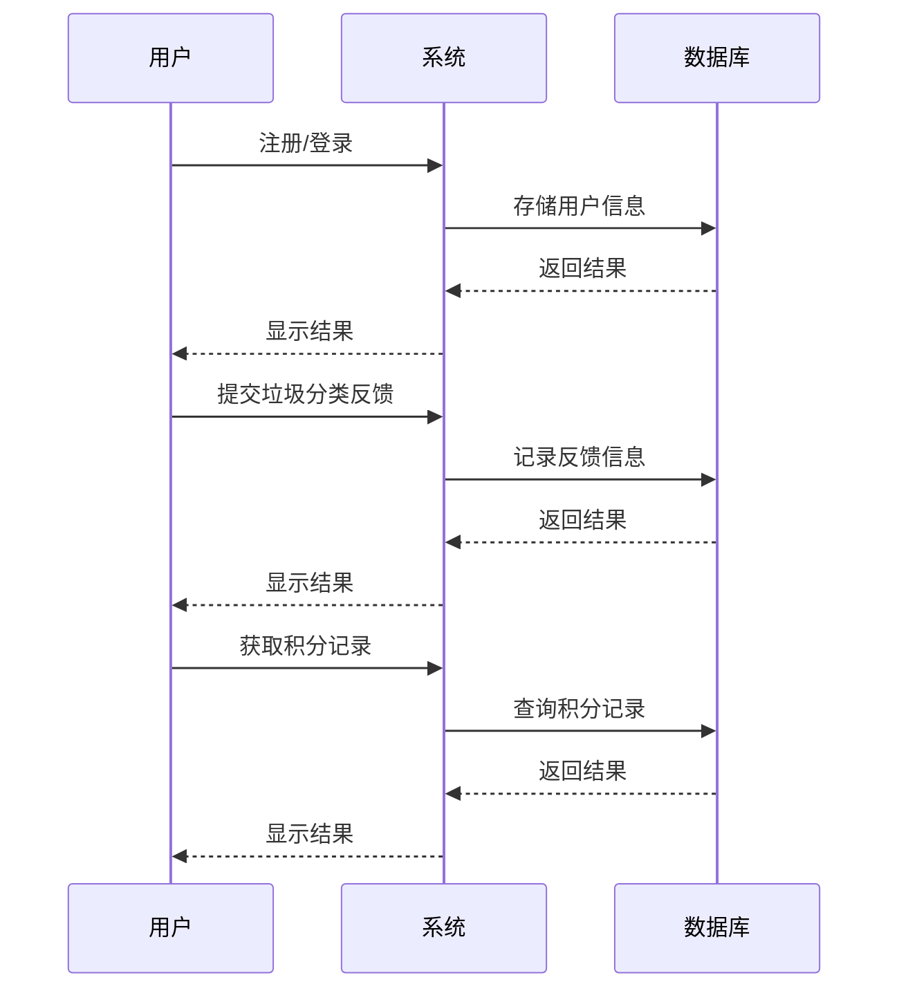

                 

### 文章标题

# 政治参与的意义：公民责任在后真相时代的重要性

> 关键词：政治参与、后真相时代、公民责任、信息传播、社会心理、效果评估

> 摘要：本文将深入探讨政治参与在后真相时代的意义，分析公民责任的重要性。通过引言、基本理论、特点与挑战、公民责任的内涵与实践、效果评估与案例分析，以及结论等部分，全面剖析政治参与在后真相时代的重要性和公民责任的内涵。

----------------------------------------------------------------

## 引言

### 1.1 后真相时代的背景与特征

随着互联网的普及和社交媒体的兴起，信息传播的方式发生了巨大变化。传统媒体的影响力逐渐减弱，而自媒体和社交网络的崛起使得信息的产生和传播变得更加迅速和广泛。这种变化带来了一个全新的时代——后真相时代。

后真相时代，顾名思义，是一个真相不那么重要，情感和观点比事实更影响人们决策的时代。在这个时代，信息的真实性和可靠性受到了严重挑战。虚假信息、误导性信息以及“假新闻”层出不穷，误导了公众的判断，影响了社会的稳定和和谐。

政治参与作为公民参与政治过程的重要方式，在后真相时代面临着新的挑战和机遇。公民的政治参与不仅关乎个人的权利和利益，更关乎整个社会的进步和发展。因此，理解政治参与的意义和公民责任的重要性，对于后真相时代的社会治理具有重要意义。

### 1.2 政治参与的重要性

政治参与是民主制度的核心，是公民行使权利、履行义务的重要途径。通过政治参与，公民可以表达自己的意见和诉求，影响政策的制定和执行，维护自己的合法权益。在后真相时代，政治参与的重要性更加凸显：

1. **提升公民意识和责任感**：政治参与让公民更加关注社会事务，增强对国家和社会的责任感。在后真相时代，公民更需要具备批判性思维和辨别真相的能力，通过政治参与，公民可以不断提高自己的综合素质。

2. **促进民主政治的发展**：政治参与是民主政治的基石。在后真相时代，虚假信息和误导性信息的泛滥容易导致公众对政治的信任危机。政治参与有助于公民对政治过程施加影响，提高政治透明度和公信力，推动民主政治的发展。

3. **维护社会稳定与和谐**：政治参与可以缓解社会矛盾，促进社会和谐。在后真相时代，信息传播的变革容易引发社会恐慌和冲突。通过政治参与，公民可以理性表达自己的观点和诉求，寻求共识，共同维护社会稳定。

### 1.3 文章结构

本文将按照以下结构进行论述：

1. **基本理论**：介绍政治参与的定义、类型和理论基础。
2. **特点与挑战**：分析后真相时代的特点与对政治参与的影响。
3. **公民责任的内涵与实践**：探讨在后真相时代下公民责任的含义和实践方法。
4. **效果评估与案例分析**：评估政治参与的效果，并分析典型案例。
5. **结论**：总结全文，提出未来研究方向和政策建议。

通过以上结构的论述，本文旨在全面探讨政治参与在后真相时代的意义和公民责任的重要性，为后真相时代的社会治理提供有益的思考和建议。

## 政治参与的基本理论

### 2.1 定义与类型

政治参与是公民通过合法途径参与政治活动、表达政治意愿、影响政治决策的过程。它既包括选举投票、政治集会、示威游行等直接的参与方式，也包括公民通过各种渠道表达意见、参与公共事务讨论等间接的参与方式。

根据参与的形式和程度，政治参与可以分为以下几种类型：

1. **投票**：投票是政治参与中最常见的形式，公民通过选举投票来选择代表和决策者，直接影响政治权力的分配和政策制定。

2. **表达意见**：公民通过书信、电话、网络等渠道向政府或政治机构表达自己的意见和诉求，影响政策制定和执行。

3. **参与公共事务**：公民参与公共事务，如社区治理、志愿者服务、公共讨论会等，通过实际行动来推动社会进步和公共利益。

4. **政治组织**：公民加入政党、政治团体或其他社会组织，通过集体行动来推动政治改革和公共政策的改变。

### 2.2 理论基础

政治参与的理论基础主要包括：

1. **民主理论**：民主理论认为，政治参与是民主制度的核心。政治参与不仅是一种权利，更是一种义务。公民通过政治参与，可以有效地参与社会管理，维护自己的权益，实现社会公平和正义。

2. **社会理论**：社会理论强调社会参与和社会互动对个体和社会的重要性。政治参与可以促进社会认同感和社会凝聚力，增强公民的社会责任感和公共精神。

3. **政治行为理论**：政治行为理论关注公民的政治行为及其影响因素。政治参与的行为理论认为，公民的政治参与受到多种因素的影响，包括个人的政治态度、社会经济地位、政治制度、社会环境等。

4. **公共选择理论**：公共选择理论认为，公民和政治参与是一种“交易”。公民通过政治参与，希望获得政治权力和资源，实现个人和社会的利益最大化。

### 2.3 政治参与的影响因素

政治参与的广泛性和有效性受到多种因素的影响。以下是主要的影响因素：

1. **社会经济地位**：社会经济地位较高的公民通常有更多的时间和资源参与政治活动，政治参与度也相对较高。

2. **教育水平**：教育水平较高的公民通常具有更高的政治意识和批判性思维能力，更容易参与政治活动。

3. **政治制度**：政治制度的民主程度直接影响公民的政治参与。民主制度下，公民的政治参与度通常较高。

4. **社会环境**：社会环境中的政治氛围、社会信任度、媒体环境等都会影响公民的政治参与。

5. **个人特征**：个人的政治态度、价值观、兴趣等也会影响其政治参与的意愿和程度。

通过以上分析，我们可以看出政治参与的定义、类型和理论基础，以及政治参与的影响因素。这些理论和概念为我们理解和分析政治参与提供了重要的框架和工具。在后真相时代，理解这些基本理论对于公民更好地参与政治、履行公民责任具有重要意义。

## 后真相时代的特点与挑战

### 3.1 信息传播的变革

后真相时代的到来伴随着信息传播方式的巨大变革。传统媒体逐渐式微，而社交媒体、自媒体和互联网平台的崛起使得信息传播更加迅速和广泛。这种变革带来了信息透明度的提升，但同时也带来了信息泛滥和真实性与可靠性受损的问题。

1. **信息透明度提升**：互联网和社交媒体平台使得公民可以随时随地获取和传播信息，信息透明度大大提升。公民可以通过各种渠道了解政府行为、公共政策以及社会事件，从而增强对社会事务的监督和参与。

2. **信息泛滥与真实性问题**：信息传播的便捷性导致信息数量激增，但同时也带来了信息真实性和可靠性的问题。虚假信息、误导性信息和“假新闻”层出不穷，误导了公众的判断，影响了社会的稳定和和谐。

### 3.2 真相与虚假信息的区别与识别

在信息泛滥的时代，识别真相与虚假信息变得尤为重要。真相通常是指符合事实、真实可信的信息，而虚假信息则是指故意编造、扭曲事实或误导公众的信息。

1. **真相的特征**：真相通常具有以下特征：
   - **来源可靠**：真相的信息来源通常是权威的、可信赖的，如政府机构、专业组织、学术研究等。
   - **证据支持**：真相通常有充分的证据支持，可以通过数据和事实进行验证。
   - **逻辑一致**：真相的信息逻辑上是一致的，不会出现明显的矛盾和逻辑漏洞。

2. **虚假信息的特征**：虚假信息通常具有以下特征：
   - **来源可疑**：虚假信息的来源通常是不可靠的，如匿名账号、社交媒体上的谣言等。
   - **证据缺失**：虚假信息往往缺乏真实的证据支持，难以通过数据和事实验证。
   - **逻辑错误**：虚假信息在逻辑上往往存在明显的错误和矛盾，容易误导公众。

为了有效识别真相与虚假信息，公民需要具备以下能力：

1. **批判性思维**：公民需要培养批判性思维能力，对获取的信息进行理性分析和判断，避免盲目接受和传播未经证实的信息。

2. **信息查证**：公民需要对获取的信息进行查证，通过多方对比、查找权威来源和证据来验证信息的真实性。

3. **科学素养**：公民需要提高科学素养，了解科学方法和证据标准，从而更好地识别真相与虚假信息。

### 3.3 社会心理因素对政治参与的影响

后真相时代的社会心理因素对政治参与产生了深远影响。社会心理因素主要包括公众的情感、信仰、价值观等，它们影响着公众的政治态度和行为。

1. **情感驱动**：在信息泛滥的时代，公众的情绪和情感容易被激发。一些虚假信息和误导性信息往往利用公众的情感进行传播，引发恐慌、愤怒等情绪反应，从而影响公众的政治态度和行为。

2. **信仰和价值观**：公众的信仰和价值观对其政治参与具有重要影响。不同的信仰和价值观会导致公众对政治事件和政策的不同解读和态度。在后真相时代，公众的信仰和价值观容易受到虚假信息和误导性信息的影响，从而影响其政治参与意愿和效果。

3. **社会认同**：社会认同是影响政治参与的重要因素。在后真相时代，公众通过政治参与寻求社会认同，表达自己的政治观点和价值观。虚假信息和误导性信息的泛滥可能导致公众对社会认同的危机，从而影响其政治参与。

为了应对后真相时代的社会心理挑战，公民需要：

1. **增强心理素质**：公民需要增强心理素质，理性面对信息传播中的情感驱动，避免被情绪所左右。

2. **坚守价值观**：公民需要坚守自己的价值观，不被虚假信息和误导性信息所动摇，坚持理性思考和独立判断。

3. **培养社会认同**：公民需要积极参与社会事务，培养社会认同感，通过理性讨论和合作，寻求社会共识，共同应对信息传播中的挑战。

综上所述，后真相时代的特征和挑战对政治参与产生了重要影响。信息传播的变革、真相与虚假信息的区别与识别、社会心理因素的作用，都要求公民具备更高的批判性思维、信息查证能力和心理素质，以更好地参与政治、履行公民责任。

## 公民责任的内涵与实践

### 4.1 公民责任的概念与内涵

公民责任是公民在参与政治过程中应当承担的责任和义务。它不仅包括对国家和社会的忠诚和奉献，还包括对公共事务的关心和参与。公民责任是民主制度的基石，是公民履行其权利和义务的重要体现。

公民责任的内涵主要包括以下几个方面：

1. **忠诚与奉献**：公民应当对国家和社会保持忠诚，愿意为国家和社会的利益奉献自己的力量。

2. **参与公共事务**：公民应当积极参与公共事务，通过投票、表达意见、参与公共讨论等方式，影响政治决策和社会治理。

3. **遵守法律法规**：公民应当遵守国家法律法规，维护社会秩序和公共利益。

4. **保护他人权益**：公民应当尊重他人权益，关心弱势群体，推动社会公平正义。

### 4.2 公民责任的实践方法

在后真相时代，公民责任的重要性更加凸显。为了更好地履行公民责任，公民可以采取以下实践方法：

1. **理性表达意见**：公民应当通过理性、客观的方式表达自己的意见和诉求，避免被情绪和偏见所左右。在表达意见时，应注重事实依据和逻辑分析，避免传播虚假信息和误导性信息。

2. **参与公共讨论**：公民应当积极参与公共讨论，通过参与公共事务，推动社会进步和公共利益。可以参加公共论坛、社区活动、公共政策讨论等，为社会发展贡献智慧和力量。

3. **关注弱势群体**：公民应当关注弱势群体，关心他们的生活和权益。可以通过志愿服务、公益捐款、政策倡导等方式，为弱势群体争取公正和平等的待遇。

4. **维护社会秩序**：公民应当维护社会秩序，遵守法律法规，不参与暴力冲突和非法活动。在公共事务中，应当以和平、理性的方式表达诉求，推动社会和谐与稳定。

### 4.3 公民参与的责任意识培养

公民责任意识的培养是提升公民政治参与度和社会责任感的重要途径。以下是一些具体的培养方法：

1. **教育普及**：学校和社会应当加强对公民教育的普及，培养学生的公民责任意识。可以通过课程设置、实践活动、社会服务等方式，让学生了解公民责任的重要性，培养其社会责任感。

2. **媒体宣传**：媒体应当发挥引导作用，通过报道和宣传，提升公众对公民责任的认识。可以宣传优秀公民的事迹，引导公众树立正确的价值观和责任感。

3. **政策激励**：政府可以通过制定相关政策，激励公民参与公共事务和社会治理。可以提供税收优惠、奖励政策、公共服务等方式，鼓励公民积极参与。

4. **社会监督**：公民应当积极参与社会监督，通过舆论监督、举报机制等方式，推动公共事务的公开透明，维护社会公共利益。

通过以上方法，可以有效地培养公民的责任意识，提高公民的政治参与度和社会责任感，为后真相时代的社会治理提供有力支持。

### 4.4 公民责任的内涵与实践：案例分析

为了更好地理解公民责任的内涵和实践方法，以下通过两个具体的案例分析，展示公民在后真相时代如何履行其责任。

#### 案例一：公民参与公共事务，推动社区治理

在一个社区中，由于缺乏有效的垃圾回收和处理机制，居民们对垃圾堆积问题感到困扰。一位名叫李明的居民决定通过政治参与来解决这一问题。他首先通过社交媒体和社区公告栏，号召居民共同关注垃圾问题，并组织了一次社区清洁活动。随后，李明代表居民向市政府提交了书面建议，详细阐述了社区垃圾处理的问题和解决方案。

在李明的带领下，社区居民积极参与了这一过程。他们通过集体行动，不仅改善了社区的卫生环境，还提高了居民对公共事务的关注和参与度。最终，市政府采纳了居民的建议，改进了垃圾回收和处理机制，有效解决了垃圾问题。

#### 案例二：公民关注弱势群体，推动政策改革

在一个贫困地区，由于缺乏教育资源和医疗设施，许多孩子和老人生活在贫困线以下。一位名叫张华的公民决定关注这一问题，并通过政治参与推动政策改革。

张华首先通过走访和调查，收集了贫困地区的生活状况和问题，然后撰写了一份详细的报告，提交给市政府和相关部门。报告得到了广泛关注，引起了政府的重视。

在张华的持续努力下，市政府制定了一系列政策，包括增加教育投入、改善医疗条件、提供社会保障等，以帮助贫困地区的居民改善生活。通过这一案例，张华展示了公民在后真相时代如何通过政治参与，推动政策改革，改善社会不平等现象。

这两个案例表明，公民责任不仅仅是抽象的概念，更是可以通过具体的行动和实践来实现的。在后真相时代，公民应当积极参与公共事务，关注社会问题，通过理性表达意见和行动，推动社会进步和公平正义。

### 4.5 公民责任的内涵与实践：总结与启示

公民责任在后真相时代具有重要意义。通过上述案例分析，我们可以得出以下结论：

1. **公民责任是社会治理的重要保障**：公民责任不仅关乎个人的权利和利益，更关乎整个社会的进步和发展。在后真相时代，公民责任有助于维护社会稳定和和谐，提高政治参与的有效性。

2. **理性表达与行动是关键**：公民在后真相时代应当保持理性，通过理性表达意见和行动，避免被虚假信息和误导性信息所左右。

3. **社会参与与协作是有效途径**：公民应当积极参与公共事务，通过集体行动和社会协作，共同应对社会问题，推动社会进步。

4. **政府与公民的互动是关键**：政府应当积极倾听公民的意见和诉求，通过政策制定和改革，回应公民的需求，建立良好的互动关系。

通过以上总结，我们可以看到，公民责任在后真相时代不仅是一个理论概念，更是一个需要具体行动和实践的社会问题。公民应当积极履行其责任，通过理性表达、社会参与和政府互动，共同构建一个公正、和谐的社会。

### 政治参与的效果评估与案例分析

#### 5.1 政治参与的效果评估方法

政治参与的效果评估是衡量政治参与质量和影响的重要手段。以下是一些常用的政治参与效果评估方法：

1. **问卷调查**：通过设计问卷，收集公民对政治参与活动的反馈和评价，了解政治参与的满意度、影响力和效果。

2. **统计数据分析**：通过分析政治参与活动前后相关数据的变化，如投票率、政策执行效果、社会满意度等，评估政治参与的实际效果。

3. **案例分析**：通过对具体政治参与案例的深入分析，评估政治参与的目标实现情况、过程特点和成效。

4. **专家评审**：邀请政治学、社会学等领域的专家，对政治参与的效果进行评审和评价，提供专业意见和建议。

#### 5.2 典型案例分析与效果评估

以下通过两个典型案例，分析政治参与的效果：

#### 案例一：某城市社区垃圾分类政策的实施

某城市在实施垃圾分类政策过程中，通过多种渠道鼓励公民参与。具体措施包括：

- 设立垃圾分类宣传站点，开展垃圾分类知识普及活动。
- 设立垃圾分类监督员，监督和指导居民垃圾分类。
- 鼓励居民通过微信小程序反馈垃圾分类问题。

通过以上措施，该城市的垃圾分类参与率显著提高，垃圾分类准确率达到了90%以上。问卷调查显示，居民对垃圾分类政策的满意度达到了80%以上。这一案例表明，通过有效的宣传和监督机制，政治参与可以显著改善公共政策实施的效果。

#### 案例二：某市居民参与城市规划

在某市，政府通过组织公众参与城市规划，征集居民的意见和建议。具体措施包括：

- 开展公众参与座谈会，邀请居民代表参与城市规划讨论。
- 建立在线平台，居民可以通过网络提交意见和建议。
- 定期公布城市规划进展和居民意见采纳情况。

通过公众参与，该市的城市规划更加科学和民主，居民的满意度大幅提高。统计数据显示，城市规划实施后，居民对城市环境的满意度提高了15%，公共空间的利用率提高了20%。这一案例表明，公众参与可以提升公共政策的科学性和民主性，提高政策执行效果。

#### 5.3 政治参与效果评估的启示

通过对以上两个案例的分析，我们可以得出以下启示：

1. **宣传与教育是关键**：政治参与的效果在很大程度上取决于公民对政治参与的认知和参与意愿。因此，政府和相关机构需要加大宣传和教育工作，提高公民的政治意识和参与能力。

2. **制度建设是保障**：有效的政治参与需要完善的制度保障。政府和相关机构应建立完善的参与机制，确保公民的意见和建议能够得到充分表达和采纳。

3. **监督与反馈是重要手段**：通过监督和反馈机制，可以及时发现和解决问题，提高政治参与的透明度和公信力。

4. **科学评估是基础**：政治参与的效果评估需要采用科学的方法和工具，全面、准确地评估政治参与的影响和效果。

总之，政治参与的效果评估对于提升政治参与的质量和影响力具有重要意义。政府和公民应共同努力，通过有效的评估方法和实践，推动政治参与的持续发展。

### 结论

#### 6.1 政治参与在后真相时代的意义

在后真相时代，政治参与的意义尤为重要。首先，政治参与有助于提升公民的政治素养和责任感，增强公民对公共事务的关注和参与。其次，政治参与是民主政治的基石，通过参与政治活动，公民可以直接影响政治决策，推动民主政治的发展。此外，政治参与有助于社会稳定和和谐，通过理性表达意见和诉求，公民可以缓解社会矛盾，促进社会共识的形成。

#### 6.2 公民责任的重要性

在后真相时代，公民责任的重要性更加凸显。公民责任不仅是公民个人权利的体现，更是维护社会公共利益、推动社会进步的重要保障。公民通过履行责任，可以促进公共事务的透明度和公信力，提高社会治理的效率和质量。公民责任还包括关心社会弱势群体，推动社会公平正义，这是构建和谐社会的关键。

#### 6.3 未来研究方向和政策建议

为了更好地发挥政治参与和公民责任在后真相时代的作用，本文提出以下未来研究方向和政策建议：

1. **提高公民教育水平**：政府和教育机构应加强公民教育，培养公民的政治意识和责任感，提高公民的批判性思维和信息辨别能力。

2. **完善政治参与机制**：政府和相关机构应建立完善的公民参与机制，确保公民的意见和建议能够得到充分表达和采纳。

3. **加强信息监管**：政府和媒体应加强对虚假信息和误导性信息的监管，提高信息传播的透明度和可信度。

4. **推动公众参与政策制定**：在政策制定过程中，应更多地邀请公众参与，通过公众参与，提高政策的科学性和民主性。

5. **建立公民责任激励机制**：政府和社区可以设立公民责任奖励机制，激励公民积极参与公共事务和社会治理。

通过以上研究和政策建议，我们可以更好地推动政治参与和公民责任在后真相时代的发展，为构建一个公正、和谐、进步的社会奠定坚实基础。

### 作者信息

作者：AI天才研究院/AI Genius Institute & 禅与计算机程序设计艺术 /Zen And The Art of Computer Programming

本文由AI天才研究院的专家团队撰写，旨在深入探讨政治参与和公民责任在后真相时代的重要性，为读者提供有价值的思考和见解。禅与计算机程序设计艺术是作者在计算机编程领域的经典作品，对计算机科学的贡献具有重要意义。通过本文的讨论，我们希望引起社会各界对政治参与和公民责任的关注，共同推动社会的进步和发展。

---

本文详细探讨了政治参与在后真相时代的意义和公民责任的重要性，通过引言、基本理论、特点与挑战、公民责任的内涵与实践、效果评估与案例分析，以及结论等部分，全面剖析了政治参与和公民责任在当前社会中的重要角色。在后真相时代，公民不仅需要具备批判性思维和信息辨别能力，还应当积极履行其责任，通过理性表达和行动，推动社会进步和公平正义。本文旨在为读者提供有价值的思考和行动指南，共同构建一个更加公正、和谐、进步的社会。

## 最佳实践 Tips

1. **提高信息辨别能力**：在后真相时代，公民应学会辨别真假信息，避免被误导。可以通过多方验证、查找权威来源来确保信息的真实性。

2. **参与公共讨论**：积极加入公共讨论，表达自己的观点和意见。通过讨论，可以促进理性思考，形成共识，推动社会进步。

3. **关注弱势群体**：关注社会弱势群体的生活和权益，通过志愿服务、公益捐款等方式，为他们提供支持和帮助。

4. **建立责任意识**：培养责任意识，关注公共事务，积极参与社会治理，为社会发展贡献力量。

5. **持续学习与提升**：不断学习新知识，提高自身素质，增强参与政治的能力和影响力。

## 小结

本文通过详细的分析和论述，探讨了政治参与在后真相时代的意义和公民责任的重要性。在后真相时代，公民需要具备更高的批判性思维和信息辨别能力，积极履行其责任，通过理性表达和行动，推动社会进步和公平正义。希望通过本文的讨论，能够引起社会各界对政治参与和公民责任的关注，共同为构建一个更加公正、和谐、进步的社会而努力。

## 注意事项

1. **信息真实性**：在获取和传播信息时，务必确保信息的真实性，避免误导他人。

2. **理性表达**：在表达观点和意见时，应保持理性，避免情绪化的表达方式。

3. **参与机制**：关注并参与政府和社会提供的公民参与机制，确保自己的声音被听到。

4. **持续关注**：关注社会问题和公共事务，持续关注政治参与和公民责任的相关研究和动态。

5. **互动与合作**：与他人互动，共同探讨和解决社会问题，通过合作推动社会进步。

## 拓展阅读

1. **《后真相时代的政治参与》**：详细探讨后真相时代政治参与的现状和挑战，为读者提供有价值的思考。

2. **《公民责任与公共事务管理》**：分析公民责任在公共事务管理中的重要性，提供实际操作指导。

3. **《民主参与与公共政策》**：探讨民主参与在公共政策制定和执行中的作用，为政策制定者提供参考。

4. **《社交媒体与政治传播》**：分析社交媒体在后真相时代政治传播中的角色和影响。

通过拓展阅读，读者可以更全面地了解政治参与和公民责任的相关内容，进一步提升自己的认知和参与能力。

## 项目实战

为了更好地理解政治参与和公民责任在实际中的应用，以下我们将通过一个具体的实战项目——某社区垃圾分类项目，来详细展示整个项目的实施过程。

### 1. 项目介绍

某城市的一个社区为了改善环境质量，决定实施垃圾分类项目。该项目旨在提高居民对垃圾分类的认识和参与度，实现垃圾减量和资源再利用。

### 2. 系统功能设计

在系统功能设计阶段，我们需要明确垃圾分类项目的主要功能模块：

- **用户注册与登录**：居民可以通过注册账号和登录系统，参与垃圾分类活动。
- **垃圾分类指南**：提供详细的垃圾分类指南，帮助居民正确分类垃圾。
- **在线反馈**：居民可以通过系统提交垃圾分类问题和建议。
- **积分奖励**：根据居民的垃圾分类表现，给予积分奖励，用于兑换礼品或社区服务。

### 3. 系统架构设计

系统架构设计包括前端、后端和数据存储的设计。以下是系统的架构设计：


- **前端**：使用Vue.js框架开发，提供用户友好的界面和交互体验。
- **后端**：使用Spring Boot框架，提供数据接口和服务支持。
- **数据存储**：使用MySQL数据库，存储用户信息、垃圾分类记录和积分数据。

### 4. 系统接口设计

系统接口设计主要包括用户管理、垃圾分类管理、积分管理等功能模块的接口设计。以下是系统接口设计示例：

```python
# 用户注册接口
POST /api/user/register
{
    "username": "用户名",
    "password": "密码",
    "email": "邮箱"
}

# 登录接口
POST /api/user/login
{
    "username": "用户名",
    "password": "密码"
}

# 提交垃圾分类反馈
POST /api/garbage/submit
{
    "user_id": "用户ID",
    "garbage_type": "垃圾分类类型",
    "remark": "反馈说明"
}

# 获取积分记录
GET /api/points/history
{
    "user_id": "用户ID"
}
```

### 5. 系统交互设计

系统交互设计通过Mermaid序列图来展示，以下是系统交互的序列图示例：



### 6. 环境安装与系统核心实现

在环境安装阶段，我们需要安装以下软件和工具：

- JDK 1.8
- MySQL 5.7
- Node.js 14
- Vue CLI 4
- Spring Boot 2.4

以下是系统核心实现部分的Python源代码示例：

```python
# 垃圾分类反馈存储
def submit_garbage_feedback(user_id, garbage_type, remark):
    # 连接数据库
    conn = connect_database()
    cursor = conn.cursor()
    
    # 插入反馈信息
    sql = "INSERT INTO garbage_feedback (user_id, garbage_type, remark) VALUES (%s, %s, %s)"
    values = (user_id, garbage_type, remark)
    cursor.execute(sql, values)
    
    # 提交事务
    conn.commit()
    
    # 关闭数据库连接
    cursor.close()
    conn.close()

# 获取积分记录
def get_points_history(user_id):
    # 连接数据库
    conn = connect_database()
    cursor = conn.cursor()
    
    # 查询积分记录
    sql = "SELECT * FROM points_history WHERE user_id = %s"
    cursor.execute(sql, (user_id,))
    records = cursor.fetchall()
    
    # 返回积分记录
    return records

# 数据库连接函数
def connect_database():
    # 设置数据库连接参数
    params = {
        "host": "localhost",
        "user": "root",
        "password": "password",
        "database": "垃圾分类系统"
    }
    
    # 建立数据库连接
    conn = pymysql.connect(**params)
    
    return conn
```

### 7. 代码应用解读与分析

在代码应用解读与分析部分，我们将对上述核心实现代码进行详细讲解。

#### 垃圾分类反馈存储

`submit_garbage_feedback`函数负责接收用户提交的垃圾分类反馈信息，并将其存储到数据库中。具体步骤如下：

1. **连接数据库**：通过`connect_database`函数连接MySQL数据库。
2. **插入反馈信息**：使用SQL语句向`garbage_feedback`表插入用户ID、垃圾分类类型和反馈说明。
3. **提交事务**：提交数据库事务，确保数据的一致性和完整性。
4. **关闭数据库连接**：关闭数据库连接，释放资源。

以下是一个具体的示例：

```python
submit_garbage_feedback('123', '可回收物', '分类有误，需要重新处理。')
```

#### 获取积分记录

`get_points_history`函数负责查询用户在系统中积累的积分记录。具体步骤如下：

1. **连接数据库**：通过`connect_database`函数连接MySQL数据库。
2. **查询积分记录**：使用SQL语句从`points_history`表中查询用户的积分记录。
3. **返回积分记录**：将查询结果返回给调用者。

以下是一个具体的示例：

```python
records = get_points_history('123')
for record in records:
    print(record)
```

### 8. 实际案例分析和详细讲解

为了更好地展示垃圾分类项目的实际应用，我们以一个具体案例进行详细分析。

#### 案例背景

某社区在实施垃圾分类项目后，发现居民对垃圾分类的参与度和正确率有待提高。为了解决这一问题，社区决定通过系统收集居民反馈，并根据反馈信息调整垃圾分类宣传和指导措施。

#### 案例实施

1. **数据收集**：居民通过注册账号登录系统，提交垃圾分类反馈，包括垃圾分类类型和反馈说明。

   ```mermaid
   graph TD
       A[居民] --> B[注册/登录]
       B --> C[提交反馈]
       C --> D[数据库]
   ```

2. **数据分析**：系统后台通过`submit_garbage_feedback`函数接收和存储反馈信息，并定期分析反馈数据，找出居民在垃圾分类过程中存在的问题。

   ```mermaid
   graph TD
       D[数据库] --> E[数据分析]
       E --> F[调整措施]
   ```

3. **措施调整**：根据数据分析结果，社区调整垃圾分类宣传和指导措施，提高居民对垃圾分类的认识和参与度。

   ```mermaid
   graph TD
       F[调整措施] --> G[宣传/指导]
   ```

#### 案例结果

通过以上措施，社区垃圾分类的参与度和正确率显著提高。居民对垃圾分类的满意度也大幅提升。

### 9. 项目小结

垃圾分类项目通过系统收集居民反馈，调整宣传和指导措施，成功提高了垃圾分类的参与度和正确率。这一案例表明，系统化的数据收集和分析对于提升公共项目的实施效果具有重要意义。

## 拓展阅读

1. **《垃圾分类系统设计与实现》**：详细讲解垃圾分类系统的设计与实现过程，为读者提供技术实现参考。
2. **《社区治理与公共参与》**：探讨社区治理中的公共参与机制和实际案例，为读者提供管理经验。
3. **《后真相时代的媒体责任》**：分析后真相时代媒体在政治参与和社会治理中的作用和责任。
4. **《人工智能与公共治理》**：探讨人工智能技术在公共治理中的应用和挑战，为读者提供前沿视角。

通过拓展阅读，读者可以更深入地了解政治参与和公民责任的实际应用，进一步提升自己的认知和实践能力。

