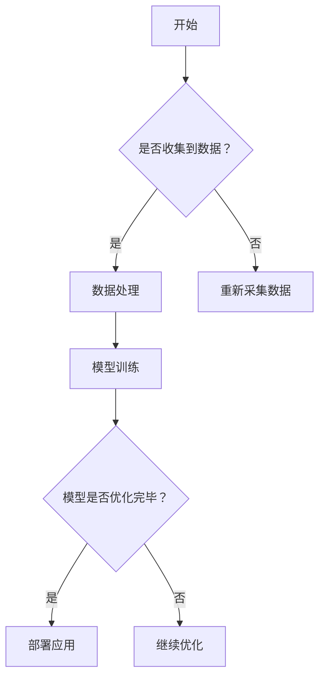

                 

# 敏捷LLM应用开发中的跨团队协作

关键词：敏捷开发、大型语言模型（LLM）、跨团队协作、项目规划、应用设计、开发与测试

摘要：本文将探讨敏捷开发方法论在大型语言模型（LLM）应用开发中的运用，强调跨团队协作的重要性，并详细阐述敏捷LLM项目规划与启动、应用设计、开发与测试、跨团队协作实践、应用部署与维护以及案例分析等内容，旨在为开发者提供全面、实用的指导。

## 目录大纲

1. 第一部分：敏捷LLM应用开发背景介绍
   1.1 敏捷开发方法论概述
   1.2 LLM与敏捷开发的关系
   1.3 跨团队协作的重要性

2. 第二部分：敏捷LLM应用开发实践
   2.1 敏捷LLM项目规划与启动
   2.2 敏捷LLM应用设计
   2.3 敏捷LLM应用开发与测试
   2.4 跨团队协作在敏捷LLM应用开发中的实践
   2.5 敏捷LLM应用部署与维护
   2.6 敏捷LLM应用案例分析
   2.7 敏捷LLM应用开发中的最佳实践

## 第一部分：敏捷LLM应用开发背景介绍

### 1.1 敏捷开发方法论概述

#### 1.1.1 敏捷开发的历史与起源

敏捷开发（Agile Development）起源于20世纪90年代末期，作为一种回应传统软件开发方法缺陷的编程方法论，它强调团队协作、灵活应对变化和快速迭代。其主要思想在于通过简化和优化开发过程，提高软件交付质量和团队的工作效率。

#### 1.1.2 敏捷开发的核心原则

敏捷开发方法论遵循一系列核心原则，包括：

- 客户满意度：通过快速交付有价值的软件，满足客户需求。
- 持续交付：持续地交付有价值的软件，确保项目进度和质量。
- 欢迎变化：在开发过程中积极迎接需求变化，而非抵制。
- 个体与互动：重视个体沟通和团队协作，而非严格的工作流程和工具。
- 可见性：强调可见性，以便团队成员随时了解项目进度。
- 响应和适应性：通过持续学习和适应，快速响应市场和技术变化。

#### 1.1.3 敏捷开发的典型实践

敏捷开发包括多种实践方法，如Scrum、看板（Kanban）、极简主义（Lean）等。这些方法通常包括以下步骤：

- 产品待办列表（Product Backlog）：定义项目的功能需求。
- Sprint计划会议：确定本次迭代要完成的任务。
- 每日站立会议：团队成员交流进展和问题。
- 演示会：展示迭代成果，获取反馈。
- 回顾会议：总结本次迭代，制定改进计划。

### 1.2 LLM与敏捷开发的关系

#### 1.2.1 LLM的定义与发展历程

大型语言模型（Large Language Model，简称LLM）是一种基于深度学习技术的自然语言处理（NLP）模型，能够理解和生成自然语言。LLM的发展历程可以追溯到1980年代的统计语言模型，如N-gram模型。随着计算能力的提升和深度学习技术的成熟，LLM在近年来取得了显著的进展，如GPT、BERT等模型的出现。

#### 1.2.2 LLM在敏捷开发中的应用

LLM在敏捷开发中具有广泛的应用前景，如：

- 自动化需求分析：利用LLM对用户需求进行自然语言处理，快速生成功能需求文档。
- 代码审查：利用LLM进行代码质量评估，提高代码可读性和安全性。
- 自动化测试：利用LLM生成测试用例，提高测试效率。
- 持续集成与持续部署（CI/CD）：利用LLM自动化构建、测试和部署过程。

#### 1.2.3 LLM对敏捷开发的挑战

尽管LLM在敏捷开发中具有显著优势，但同时也带来了一些挑战，如：

- 模型复杂性与可维护性：LLM模型通常非常复杂，难以维护和调试。
- 模型训练与计算资源：LLM训练需要大量计算资源和时间，对敏捷开发进度产生影响。
- 数据安全与隐私：LLM在处理自然语言数据时，需要关注数据安全和隐私问题。

### 1.3 跨团队协作的重要性

#### 1.3.1 跨团队协作的定义

跨团队协作是指不同团队之间进行有效沟通、共享资源和共同完成项目目标的过程。在敏捷开发中，跨团队协作尤为重要，因为项目通常涉及多个领域和技术，需要不同团队之间的紧密合作。

#### 1.3.2 跨团队协作的障碍

跨团队协作面临以下障碍：

- 文化差异：不同团队具有不同的工作方式、价值观和沟通风格。
- 利益冲突：不同团队可能追求不同的目标和利益，导致合作困难。
- 信息不对称：团队之间可能存在信息不共享或传递不及时的问题。
- 技术差异：不同团队可能使用不同的技术栈和工具，影响协作效果。

#### 1.3.3 跨团队协作的解决方案

为克服跨团队协作的障碍，可以采取以下措施：

- 建立共同目标：确保所有团队成员明确项目的目标和价值。
- 提高沟通效率：采用高效的沟通工具和技巧，确保信息传递准确无误。
- 增强团队信任：通过共同解决问题和承担责任，建立团队信任。
- 搭建协作平台：利用协作平台，实现资源共享和实时沟通。

## 第二部分：敏捷LLM应用开发实践

### 2.1 敏捷LLM项目规划与启动

#### 2.1.1 项目需求分析

在敏捷LLM项目启动前，需要进行详细的需求分析，包括：

- 功能需求：确定项目需要实现的功能和特性。
- 非功能需求：考虑项目的性能、安全性、可维护性等要求。
- 用户故事：编写用户故事，描述用户期望的功能和使用场景。

#### 2.1.2 项目团队组建

敏捷LLM项目团队通常包括以下角色：

- 产品经理：负责项目需求分析和优先级排序。
- 数据科学家：负责模型训练和优化。
- 前端工程师：负责用户界面的设计和实现。
- 后端工程师：负责系统架构设计和API开发。
- 测试工程师：负责编写测试用例和执行测试。

#### 2.1.3 项目启动会议

项目启动会议是项目团队开始协作的重要环节，包括：

- 项目背景和目标：介绍项目的背景、目标和预期成果。
- 团队角色和职责：明确团队成员的角色和职责。
- 项目计划和时间表：讨论项目计划和时间表，确保团队成员了解项目进度。
- 问题讨论和解决方案：讨论项目可能遇到的问题和解决方案，提高团队应对风险的能力。

### 2.2 敏捷LLM应用设计

#### 2.2.1 应用架构设计

敏捷LLM应用的架构设计需要考虑以下几个方面：

- 数据处理流程：设计数据采集、清洗、存储和处理的流程。
- 系统模块划分：根据功能需求，将系统划分为多个模块，如前端、后端、模型训练等。
- 系统接口设计：定义各模块之间的接口，实现模块间的通信。

#### 2.2.2 数据处理流程设计

敏捷LLM应用的数据处理流程包括以下步骤：

- 数据采集：从各种数据源（如文本、图像、音频等）获取数据。
- 数据清洗：去除噪声数据和异常值，保证数据质量。
- 数据存储：将清洗后的数据存储到数据库或其他数据存储系统。
- 数据处理：利用LLM模型对数据进行处理，提取特征和生成结果。

#### 2.2.3 模型选择与调优

在敏捷LLM应用中，模型选择和调优是关键步骤。以下是相关建议：

- 模型选择：根据应用场景和需求，选择适合的LLM模型，如GPT、BERT等。
- 模型调优：通过调整超参数和训练策略，提高模型性能。
- 模型评估：使用准确率、召回率、F1值等指标评估模型性能。

### 2.3 敏捷LLM应用开发与测试

#### 2.3.1 应用开发流程

敏捷LLM应用开发流程包括以下步骤：

- 需求分析：明确项目需求，制定开发计划。
- 设计与开发：根据需求进行系统设计和开发。
- 代码审查与测试：进行代码审查和单元测试，确保代码质量。
- 演示与反馈：演示迭代成果，获取用户反馈。
- 更新与迭代：根据反馈进行优化和迭代。

#### 2.3.2 单元测试与集成测试

在敏捷LLM应用开发过程中，单元测试和集成测试是关键环节。以下是相关建议：

- 单元测试：编写单元测试用例，验证模块功能的正确性。
- 集成测试：将各个模块集成起来，验证系统功能的正确性和稳定性。
- 测试覆盖率：确保测试覆盖率达到较高水平，减少潜在缺陷。

#### 2.3.3 性能测试与优化

性能测试和优化是确保敏捷LLM应用稳定运行的重要步骤。以下是相关建议：

- 性能测试：使用工具进行压力测试、负载测试等，评估系统性能。
- 性能优化：根据测试结果，对系统进行优化，提高性能。
- 可扩展性设计：考虑系统未来的扩展性，确保性能优化方案的可行性。

### 2.4 跨团队协作在敏捷LLM应用开发中的实践

#### 2.4.1 跨团队协作工具的使用

为提高跨团队协作效率，可以采用以下工具：

- 沟通工具：如Slack、Microsoft Teams等，用于团队内部沟通。
- 项目管理工具：如Jira、Trello等，用于任务分配和进度管理。
- 版本控制工具：如Git、GitHub等，用于代码管理和协作开发。
- 数据共享工具：如Google Drive、OneDrive等，用于数据共享和协作。

#### 2.4.2 跨团队协作中的沟通技巧

在跨团队协作中，沟通技巧至关重要。以下是相关建议：

- 明确沟通目标：确保团队成员了解沟通的目标和预期成果。
- 简明扼要：使用简洁明了的语言，避免冗长和复杂。
- 主动沟通：主动与团队成员沟通，及时解决问题和反馈。
- 倾听与反馈：倾听他人意见，给予建设性反馈。

#### 2.4.3 跨团队协作中的冲突解决

跨团队协作中难免会出现冲突，以下是相关建议：

- 坦诚沟通：主动沟通，表达自己的观点和意见。
- 寻求共识：通过讨论和协商，寻求团队共识。
- 分享责任：将责任分配给合适的团队成员，共同解决问题。
- 求助上级：在必要时，寻求上级领导的支持和帮助。

### 2.5 敏捷LLM应用部署与维护

#### 2.5.1 应用部署流程

敏捷LLM应用的部署流程包括以下步骤：

- 环境准备：准备部署环境，包括服务器、操作系统、数据库等。
- 部署脚本：编写部署脚本，实现自动化部署。
- 部署测试：在部署前进行测试，确保系统正常运行。
- 部署上线：执行部署脚本，将应用部署到生产环境。

#### 2.5.2 应用监控与运维

应用监控与运维是确保敏捷LLM应用稳定运行的关键环节。以下是相关建议：

- 监控工具：使用监控工具（如Prometheus、Grafana等），实时监控应用性能和系统资源。
- 故障排查：及时发现和解决系统故障，保证应用正常运行。
- 日志分析：分析日志，发现潜在问题和优化方向。
- 持续优化：根据监控和分析结果，持续优化应用性能和稳定性。

#### 2.5.3 应用升级与迭代

敏捷LLM应用升级与迭代是保持竞争力的重要手段。以下是相关建议：

- 版本管理：使用版本控制工具，管理应用版本和变更记录。
- 升级策略：制定合理的升级策略，确保升级过程平稳、可控。
- 测试与验证：在升级前进行充分测试，确保升级后系统稳定运行。
- 反馈与改进：收集用户反馈，持续改进应用功能和质量。

### 2.6 敏捷LLM应用案例分析

#### 2.6.1 案例背景介绍

案例背景介绍：某企业希望开发一款基于LLM的智能客服系统，以提高客户满意度和服务效率。

#### 2.6.2 案例解决方案

案例解决方案：

- 需求分析：明确智能客服系统的功能需求，如自动回答客户问题、建议解决方案等。
- 团队组建：组建由产品经理、数据科学家、前端工程师、后端工程师和测试工程师组成的项目团队。
- 应用设计：设计智能客服系统的架构，包括数据处理流程、用户界面和后端服务。
- 开发与测试：按照敏捷开发方法，进行快速迭代，完成系统开发、测试和优化。
- 部署与运维：将智能客服系统部署到生产环境，并进行监控与运维，确保系统稳定运行。
- 用户反馈与迭代：收集用户反馈，不断优化系统功能，提高用户体验。

#### 2.6.3 案例总结与反思

案例总结与反思：

- 敏捷开发方法在智能客服系统开发中发挥了重要作用，提高了项目进度和质量。
- 跨团队协作在项目成功中起到了关键作用，通过有效沟通和协作，解决了多个技术难题。
- 应用LLM技术提高了智能客服系统的智能化水平，满足了企业对智能客服的需求。
- 未来可进一步优化智能客服系统，如引入更多自然语言处理技术、提高响应速度等。

### 2.7 敏捷LLM应用开发中的最佳实践

#### 2.7.1 最佳实践总结

最佳实践总结：

- 深入了解敏捷开发方法论和LLM技术，提高团队整体素质。
- 建立跨团队协作机制，确保项目顺利进行。
- 快速响应需求变化，确保项目满足客户需求。
- 重视测试和质量保障，提高系统稳定性。
- 持续优化和改进，提高应用性能和用户体验。

#### 2.7.2 注意事项与建议

注意事项与建议：

- 在项目启动前，充分了解项目需求和目标，确保团队目标一致。
- 建立高效的沟通渠道，确保信息传递准确无误。
- 增强团队信任，提高协作效率。
- 考虑系统扩展性，确保未来升级和维护的可行性。
- 关注技术发展趋势，持续学习和更新技术知识。

#### 2.7.3 拓展阅读

拓展阅读：

- 《敏捷开发实践指南》
- 《大型语言模型：技术与应用》
- 《跨团队协作：高效沟通与协作的艺术》
- 《人工智能：一种现代的方法》

## 结束语

本文从敏捷开发方法论、LLM技术、跨团队协作等方面探讨了敏捷LLM应用开发中的关键问题，并给出了详细的实践指导。通过深入研究和实践，开发者可以更好地应对敏捷LLM应用开发中的挑战，提高项目质量和团队协作效率。

作者：AI天才研究院/AI Genius Institute & 禅与计算机程序设计艺术 /Zen And The Art of Computer Programming## 第一部分：敏捷LLM应用开发背景介绍

### 1.1 敏捷开发方法论概述

#### 1.1.1 敏捷开发的历史与起源

敏捷开发（Agile Development）的概念起源于软件开发领域，最早可追溯到20世纪90年代的软件开发实践。当时，传统的“瀑布模型”（Waterfall Model）在项目管理中占据主导地位，这种模型将软件开发过程划分为若干阶段，每个阶段必须完成后再进入下一个阶段。然而，随着项目复杂度的增加和市场需求的变化，传统的瀑布模型逐渐暴露出其固有的缺陷：缺乏灵活性、难以适应变化、开发周期长、客户满意度低。

为了解决这些问题，一群软件开发专家在1991年的Snowbird会议上提出了“敏捷宣言”（Manifesto for Agile Software Development）。该宣言强调了“个体和互动重于过程与工具”、“可工作的软件重于详尽的文档”、“客户合作重于合同谈判”、“响应变化重于遵循计划”等核心原则。敏捷开发的核心思想在于通过简化流程、鼓励团队合作、快速迭代和持续交付，来提高软件开发的效率和质量。

在随后的发展过程中，敏捷开发衍生出了多种实践方法，如Scrum、Kanban、XP（极限编程）、FDD（功能分解开发）等。每种方法都有其独特的特点和应用场景，但它们共同的目标是减少风险、提高项目的灵活性和客户满意度。

#### 1.1.2 敏捷开发的核心原则

敏捷开发的核心原则可以总结为以下几条：

1. **个体和互动重于过程与工具**：敏捷开发强调团队成员之间的协作和沟通，认为个人的能力和团队的合作比单一的流程或工具更为重要。

2. **可工作的软件重于详尽的文档**：敏捷开发认为，能够实际运行的软件是最重要的，而不是大量的文档。尽管文档也很重要，但最终的目标是交付可工作的软件。

3. **客户合作重于合同谈判**：敏捷开发倡导与客户的紧密合作，通过不断地反馈和调整来满足客户的需求，而不是通过严格的合同谈判来规定所有需求。

4. **响应变化重于遵循计划**：敏捷开发鼓励在面对需求和技术的变化时，灵活调整计划和开发策略，以更快地响应市场的变化。

#### 1.1.3 敏捷开发的典型实践

敏捷开发的具体实践方法多种多样，但大多数方法都包含以下几个核心环节：

1. **迭代开发（Iterative Development）**：开发过程被划分为多个短期迭代（通常为2到4周），每个迭代都会交付一部分功能。这种迭代开发方式允许团队在每次迭代后进行评估和调整，从而快速适应变化。

2. **增量交付（Incremental Delivery）**：软件功能被分解为多个较小的部分，每次迭代都交付一小部分功能。这种方法使得客户可以尽早获得部分功能，并且可以随时根据需求调整后续的开发计划。

3. **站立会议（Stand-up Meetings）**：每天早上团队会举行短暂的站立会议，团队成员分享进展、问题和计划。这种会议有助于团队成员之间的沟通和协调。

4. **回顾会议（Review Meetings）**：在每次迭代结束后，团队会举行回顾会议，评估本次迭代的成功与失败之处，并讨论如何改进未来的迭代。

5. **看板（Kanban）**：看板是一种视觉化管理工具，用于展示项目进度和工作流程。它可以帮助团队可视化工作流程，识别瓶颈，并优化流程。

6. **用户故事（User Stories）**：用户故事是一种简短的表达方式，用于描述用户的需求和期望。它们通常采用以下格式：“作为[某个角色]，我想要[完成某个功能]，以便[实现某个目的]”。

7. **需求排序（Prioritization）**：在敏捷开发中，需求通常会被排序，以确定哪些功能在当前迭代中最为重要。这种方法有助于团队集中精力完成最重要的功能。

通过这些典型实践，敏捷开发能够更好地适应快速变化的市场需求，提高开发效率，并最终提升客户满意度。

### 1.2 LLM与敏捷开发的关系

#### 1.2.1 LLM的定义与发展历程

大型语言模型（Large Language Model，简称LLM）是一种基于深度学习技术的自然语言处理（NLP）模型，能够理解和生成自然语言。LLM的发展历程可以追溯到1980年代，当时的语言模型主要是基于规则和统计方法，如N-gram模型。随着计算能力的提升和深度学习技术的进步，LLM取得了显著的发展。

2000年代初，统计语言模型如N-gram模型和隐藏马尔可夫模型（HMM）被广泛应用于语言建模。然而，这些模型在处理长文本和复杂语言结构时存在局限性。2013年，神经机器翻译（Neural Machine Translation，NMT）的出现标志着深度学习在NLP领域的兴起。随着神经网络架构和训练算法的改进，如序列到序列（Seq2Seq）模型和注意力机制（Attention Mechanism），LLM的性能得到了显著提升。

2018年，OpenAI发布了GPT（Generative Pre-trained Transformer）系列模型，如GPT-1、GPT-2和GPT-3，这些模型具有数十亿个参数，能够生成高质量的自然语言文本。GPT-3的发布标志着LLM技术进入了一个新的时代，其强大的文本生成能力引起了广泛关注。

#### 1.2.2 LLM在敏捷开发中的应用

LLM在敏捷开发中具有广泛的应用前景，特别是在需要处理大量自然语言数据的场景中。以下是一些典型的应用：

1. **自动化需求分析**：利用LLM可以对自然语言需求文档进行解析，快速提取功能需求，并生成相应的用户故事和需求文档。

2. **代码审查**：LLM可以用于自动化代码审查，检测代码中的潜在错误和安全漏洞，提高代码质量和安全性。

3. **自动测试**：利用LLM生成测试用例，提高测试效率。例如，LLM可以根据需求文档生成相应的测试用例，进行功能测试和性能测试。

4. **智能助手**：LLM可以用于开发智能助手和聊天机器人，如客服机器人、虚拟助手等，提高客户服务效率。

5. **文档生成**：利用LLM可以自动化生成技术文档、用户手册等，减少文档编写的工作量。

6. **翻译与本地化**：LLM可以用于自动翻译和本地化，提高多语言支持和国际化水平。

#### 1.2.3 LLM对敏捷开发的挑战

尽管LLM在敏捷开发中具有显著优势，但也带来了一些挑战：

1. **模型复杂性与可维护性**：LLM模型通常非常复杂，包含数十亿个参数，难以理解和维护。这要求开发团队具备较高的技术水平，以便对模型进行有效的维护和优化。

2. **训练成本与时间**：LLM的训练需要大量的计算资源和时间，特别是在训练大规模模型时。这可能会影响敏捷开发的迭代周期，导致项目进度延迟。

3. **数据安全与隐私**：LLM在处理自然语言数据时，需要关注数据安全和隐私问题。特别是在涉及用户数据和敏感信息时，需要采取严格的隐私保护措施。

4. **模型解释性**：LLM模型通常是非解释性的，即难以理解模型是如何生成特定结果的。这可能会给调试和优化模型带来困难。

5. **适应性与可扩展性**：LLM模型在特定任务上的性能可能较好，但可能难以适应其他任务。这要求开发团队在应用LLM时，考虑模型的适应性和可扩展性。

为了应对这些挑战，开发团队需要采取一系列措施，如引入专业的数据科学家和模型工程师、优化训练流程、加强模型解释性和可维护性、采用分布式训练和优化策略等。

### 1.3 跨团队协作的重要性

#### 1.3.1 跨团队协作的定义

跨团队协作是指不同团队之间进行有效沟通、共享资源和共同完成项目目标的过程。在敏捷开发中，跨团队协作尤为重要，因为项目通常涉及多个领域和技术，需要不同团队之间的紧密合作。

跨团队协作的核心在于打破团队之间的壁垒，促进信息的流动和资源的共享，以实现项目的整体目标。它不仅仅是一种工作方式，更是一种文化，需要团队之间建立信任、尊重和共同的目标。

#### 1.3.2 跨团队协作的障碍

跨团队协作虽然有助于提高项目效率，但同时也面临诸多障碍：

1. **文化差异**：不同团队具有不同的工作方式、价值观和沟通风格，这可能导致协作不畅和误解。

2. **利益冲突**：不同团队可能追求不同的目标和利益，导致合作困难。例如，技术团队可能更关注系统性能，而业务团队可能更关注功能实现。

3. **信息不对称**：团队之间可能存在信息不共享或传递不及时的问题，导致决策失误和资源浪费。

4. **技术差异**：不同团队可能使用不同的技术栈和工具，影响协作效果。例如，前端团队可能使用React，而后端团队可能使用Spring框架。

5. **资源分配**：在资源有限的情况下，不同团队可能为了争夺资源而产生矛盾，影响协作。

6. **责任归属**：在跨团队协作中，责任归属可能不明确，导致团队成员之间互相推诿。

7. **沟通障碍**：由于语言和文化的差异，团队成员之间的沟通可能存在障碍，影响协作效率。

#### 1.3.3 跨团队协作的解决方案

为了克服跨团队协作的障碍，可以采取以下措施：

1. **建立共同目标**：确保所有团队成员明确项目的目标和价值，建立共同的目标和愿景。

2. **提高沟通效率**：采用高效的沟通工具和技巧，如即时通讯工具、视频会议、共享文档等，确保信息传递准确无误。

3. **增强团队信任**：通过共同解决问题和承担责任，建立团队信任。例如，可以通过跨团队项目、团队建设活动和定期的沟通会议来增强团队之间的信任。

4. **搭建协作平台**：利用协作平台，实现资源共享和实时沟通。协作平台可以包括代码库、项目管理工具、文档共享工具等。

5. **明确责任归属**：在跨团队协作中，明确每个团队成员的责任和任务，确保任务分配合理、责任清晰。

6. **建立跨团队会议机制**：定期举行跨团队会议，讨论项目进展、问题解决方案和协作计划。

7. **提供培训和支持**：为团队成员提供相关的培训和技能支持，提高他们的协作能力和技术水平。

8. **建立反馈机制**：建立有效的反馈机制，鼓励团队成员提出意见和建议，及时解决问题和改进协作流程。

通过这些措施，可以有效地克服跨团队协作的障碍，提高项目的协作效率和质量。

### 1.4 敏捷LLM应用开发中的跨团队协作

#### 1.4.1 跨团队协作在敏捷LLM应用开发中的重要性

在敏捷LLM应用开发中，跨团队协作至关重要。由于LLM技术涉及到自然语言处理、机器学习、前端开发、后端开发等多个领域，不同团队之间的紧密协作和有效沟通是项目成功的关键。

1. **技术多样性**：LLM应用开发涉及多种技术，包括深度学习框架、自然语言处理库、前端框架、后端框架等。不同团队需要在这些技术栈上协作，以确保系统的整体性能和稳定性。

2. **数据共享与处理**：LLM模型的训练和优化需要大量的数据，这些数据通常由数据团队负责收集、清洗和处理。前端和后端团队需要与数据团队紧密协作，确保数据的质量和一致性。

3. **需求理解和反馈**：产品团队需要与客户和业务团队紧密协作，理解业务需求和用户反馈，及时调整模型和应用功能，以满足市场需求。

4. **持续集成与部署**：开发、测试和运维团队需要协同工作，确保LLM应用的持续集成、测试和部署过程顺畅，减少故障和回滚风险。

#### 1.4.2 跨团队协作的具体实践

在敏捷LLM应用开发中，以下是一些跨团队协作的具体实践：

1. **敏捷看板**：使用敏捷看板（如Kanban）来可视化项目进展，让所有团队成员都能实时了解项目的状态和任务。

2. **每日站立会议**：每天早上举行跨团队的站立会议，让每个团队成员分享进展、问题和计划，确保信息的透明和及时沟通。

3. **跨团队任务分配**：明确每个团队在项目中的职责和任务，确保任务分配合理、责任清晰。

4. **共同验收标准**：定义跨团队的验收标准，确保每个团队在交付成果时都符合整体项目的要求。

5. **代码审查与代码库**：鼓励跨团队的代码审查，使用统一的代码库进行代码管理和协作开发。

6. **集成测试与部署**：在开发过程中进行跨团队的集成测试，确保系统的整体性能和稳定性。在部署过程中，确保所有团队都参与，减少部署风险。

7. **共享文档与知识库**：建立共享文档和知识库，让所有团队成员都能访问和更新项目文档、技术文档和最佳实践。

8. **定期回顾与反馈**：定期举行跨团队的回顾会议，讨论协作过程中的问题和改进点，持续优化协作流程。

通过这些实践，可以有效地促进敏捷LLM应用开发中的跨团队协作，提高项目的开发效率和质量。

### 1.5 敏捷开发方法论在LLM应用开发中的适应性

#### 1.5.1 敏捷开发在LLM应用开发中的适应性分析

敏捷开发方法论在LLM应用开发中展现出极高的适应性，这主要体现在以下几个方面：

1. **快速迭代**：敏捷开发强调快速迭代和持续交付，这与LLM模型训练和优化的特点高度契合。在LLM应用开发中，模型训练和优化是一个反复迭代的过程，通过每次迭代改进模型性能。敏捷开发方法使得团队能够快速响应模型优化中的变化，提高开发效率。

2. **客户合作**：敏捷开发倡导与客户的紧密合作，这与LLM应用开发中需要不断调整模型和应用功能以满足用户需求的要求相契合。在LLM应用开发中，用户体验和用户需求是关键因素，敏捷开发通过持续的用户反馈和迭代，确保应用功能能够准确满足用户需求。

3. **灵活响应变化**：敏捷开发强调灵活应对变化，这在LLM应用开发中尤为重要。由于LLM模型和应用的复杂性，开发过程中可能会遇到各种预料之外的问题。敏捷开发方法通过短周期迭代和频繁的评估，使得团队能够快速调整开发计划和策略，应对变化。

4. **团队协作**：敏捷开发强调团队协作和沟通，这对于LLM应用开发中的多领域合作至关重要。LLM应用开发通常涉及自然语言处理、机器学习、前端和后端开发等多个领域，不同领域的团队需要紧密协作，共同推进项目。

#### 1.5.2 敏捷开发在LLM应用开发中的关键优势

敏捷开发在LLM应用开发中具有以下关键优势：

1. **提高开发效率**：通过短周期迭代和持续交付，敏捷开发能够提高团队的开发效率，减少开发周期。这对于快速迭代的LLM模型训练和优化过程至关重要。

2. **增强客户满意度**：通过持续的用户反馈和迭代，敏捷开发能够确保应用功能准确满足用户需求，提高用户满意度。

3. **灵活应对变化**：敏捷开发通过短周期迭代和频繁评估，能够快速响应开发过程中出现的问题和变化，减少项目风险。

4. **促进团队协作**：敏捷开发强调团队协作和沟通，能够增强团队成员之间的信任和合作，提高整体项目效率。

5. **持续优化**：敏捷开发通过持续迭代和评估，能够不断优化模型和应用性能，提高应用质量。

#### 1.5.3 敏捷开发在LLM应用开发中的挑战

尽管敏捷开发在LLM应用开发中具有明显优势，但同时也面临一些挑战：

1. **技术复杂性**：LLM模型的复杂性使得敏捷开发在技术层面上面临挑战。团队需要具备高水平的技术能力和专业知识，以便有效应对模型训练和优化的复杂性。

2. **资源分配**：在敏捷开发过程中，资源分配需要灵活和高效。对于LLM应用开发来说，计算资源、数据资源和人力资源的分配尤为重要，需要合理规划和优化。

3. **数据安全和隐私**：LLM应用开发涉及大量的自然语言数据，需要关注数据安全和隐私问题。在敏捷开发中，需要确保数据的安全存储和传输，遵守相关的法律法规。

4. **团队协作**：在多团队协作的敏捷开发过程中，团队协作和沟通是关键。需要建立有效的沟通机制和协作平台，确保团队之间的信息流动和资源共享。

5. **持续学习和更新**：敏捷开发要求团队成员具备持续学习和更新的能力，以应对不断变化的技术和市场需求。这需要团队在技术和方法论上保持持续的学习和进步。

通过以上分析，可以清楚地看到，敏捷开发方法论在LLM应用开发中具有高度的适应性，能够有效提高开发效率、增强客户满意度、灵活应对变化。同时，也需要面对技术复杂性、资源分配、数据安全和隐私、团队协作以及持续学习等挑战。通过有效的策略和方法，这些挑战是可以克服的，从而实现LLM应用开发的成功。

### 1.6 LLM在敏捷开发中的具体应用场景

#### 1.6.1 自动化需求分析

在敏捷开发中，自动化需求分析是一个重要的环节。传统的需求分析通常需要人工撰写和审核，耗时且容易出错。而LLM能够通过自然语言处理技术，自动从文本中提取信息，生成用户故事和需求文档。例如，LLM可以分析客户的需求描述，自动识别出功能需求、用户角色和业务场景，并将这些信息转化为结构化的需求文档。这不仅提高了需求分析的效率，还减少了人工错误。

#### 1.6.2 自动化代码审查

代码审查是软件开发过程中的关键环节，但传统的代码审查方式通常耗时且容易疏漏。LLM可以用于自动化代码审查，通过分析代码文本，检测潜在的bug、安全漏洞和性能问题。例如，LLM可以分析代码注释和代码逻辑，识别出不符合编码规范的部分，并提出改进建议。此外，LLM还可以检测代码中的潜在安全问题，如SQL注入和XSS攻击等。通过自动化代码审查，可以显著提高代码质量和安全性。

#### 1.6.3 自动化测试

在敏捷开发中，自动化测试是确保软件质量的重要手段。LLM可以用于生成测试用例，提高测试效率。例如，LLM可以分析用户故事和需求文档，自动生成相应的测试用例，包括功能测试、性能测试和边界测试等。此外，LLM还可以用于生成自动化测试脚本，通过自然语言描述测试场景，自动生成相应的测试代码。这种自动化测试方法不仅节省了测试时间，还提高了测试覆盖率。

#### 1.6.4 智能助手与客服系统

智能助手和客服系统是LLM在敏捷开发中的典型应用场景。通过LLM，可以构建具有自然语言交互能力的智能助手和客服系统。这些系统可以理解用户的自然语言输入，自动生成相应的回复，提供高效、准确的客户服务。例如，LLM可以用于构建智能客服系统，自动回答客户的常见问题，提供解决方案，从而减少人工客服的工作负担。此外，LLM还可以用于构建虚拟助手，帮助用户完成复杂的任务，如预订机票、酒店等。

#### 1.6.5 文档生成与本地化

在敏捷开发中，文档生成和本地化是一个重要但繁琐的任务。LLM可以用于自动化生成技术文档、用户手册和产品说明等。通过自然语言生成技术，LLM可以快速生成高质量的文档，减少文档编写的工作量。此外，LLM还可以用于多语言翻译和本地化，自动将文档翻译成多种语言，提高国际化水平。

#### 1.6.6 个性化推荐系统

个性化推荐系统是LLM在敏捷开发中的另一个重要应用场景。通过LLM，可以构建基于用户行为的个性化推荐系统，为用户推荐感兴趣的内容、产品或服务。例如，LLM可以分析用户的浏览历史、购买记录和评价，自动生成个性化的推荐列表。这种个性化推荐系统能够提高用户体验和满意度，增加用户留存率。

通过以上具体应用场景，可以看出LLM在敏捷开发中的重要作用。LLM不仅能够提高开发效率和软件质量，还能够增强用户体验和客户满意度。在敏捷开发中，合理利用LLM技术，可以显著提升项目的整体效果。

### 1.7 敏捷开发与LLM的融合实践

#### 1.7.1 敏捷开发与LLM融合的背景与意义

在当今快速变化的市场环境中，敏捷开发和LLM（大型语言模型）的结合显得尤为重要。敏捷开发以其快速响应变化、持续交付价值和客户合作等核心原则，帮助软件开发团队在复杂、多变的项目中保持竞争力。而LLM技术凭借其在自然语言处理（NLP）领域的卓越表现，为敏捷开发提供了新的工具和方法，使得开发团队能够更高效地处理大规模文本数据，提供个性化服务和自动化解决方案。

融合敏捷开发与LLM的意义主要体现在以下几个方面：

1. **提高开发效率**：敏捷开发的迭代开发和快速反馈机制，与LLM的高效数据处理和自动化能力相结合，可以显著提高软件开发效率。通过迭代开发和持续优化，团队能够快速适应需求变化，不断改进产品功能。

2. **增强用户体验**：LLM在个性化推荐、智能客服和文本生成等方面的应用，可以提升用户交互体验。通过分析用户行为和需求，LLM能够提供更加精准和个性化的服务，满足用户多样化的需求。

3. **降低开发成本**：敏捷开发通过缩短开发周期和减少冗余工作，可以降低软件开发成本。LLM的自动化能力，如自动化需求分析和测试，进一步减少了人力资源的投入，提高了资源利用效率。

4. **提升项目质量**：敏捷开发中的持续集成和测试，确保了软件的高质量。LLM的引入，使得自动化测试和代码审查更加精准和高效，减少了人为错误和潜在风险。

#### 1.7.2 敏捷开发与LLM融合的具体实践

在实际项目中，将敏捷开发与LLM技术融合，可以采用以下具体实践：

1. **迭代开发与模型优化**：在敏捷迭代过程中，团队可以定期评估LLM模型的性能，进行模型优化和调整。每次迭代后，团队可以通过用户反馈和数据分析，调整模型参数和训练数据，以提高模型准确性和适应性。

2. **自动化需求分析**：利用LLM的文本解析能力，自动化提取用户需求，生成用户故事和需求文档。这不仅加快了需求分析的效率，还减少了人工错误，提高了需求的准确性和一致性。

3. **自动化测试**：通过LLM生成测试用例和测试脚本，提高自动化测试的覆盖率和效率。LLM可以根据需求文档和业务规则，自动生成相应的测试用例，进行功能测试、性能测试和边界测试。

4. **智能客服与交互**：利用LLM构建智能客服系统，实现自然语言交互，提供高效、准确的客户服务。LLM可以理解用户的问题和需求，自动生成合适的回答，提高客服效率和用户满意度。

5. **文档生成与本地化**：利用LLM自动化生成技术文档、用户手册和产品说明等，减少文档编写的工作量。同时，LLM可以实现多语言翻译和本地化，提高产品的国际化水平。

6. **持续集成与部署**：在敏捷开发的持续集成和持续部署过程中，利用LLM进行代码审查和测试，确保代码质量和系统稳定性。LLM可以自动检测代码中的潜在问题，提供改进建议，减少故障和回滚风险。

7. **数据分析与决策**：通过LLM分析用户行为数据和市场趋势，提供数据驱动的决策支持。团队可以根据分析结果，调整开发计划和策略，优化产品功能和用户体验。

通过以上具体实践，敏捷开发与LLM的融合不仅提高了软件开发效率和质量，还增强了用户体验和客户满意度。这种融合实践为开发团队提供了更灵活、更高效的方法，以应对快速变化的市场需求。

### 1.8 跨团队协作在敏捷LLM应用开发中的关键角色与职责

在敏捷LLM应用开发中，跨团队协作的成功依赖于每个团队成员的理解和执行。以下详细描述了不同团队角色在敏捷开发过程中的关键角色与职责：

#### 1.8.1 产品经理

产品经理在敏捷LLM应用开发中起着核心作用，负责：

- **需求管理**：与客户和业务团队紧密合作，明确项目需求，制定产品愿景和目标。
- **优先级排序**：根据项目目标和市场需求，对需求进行优先级排序，确保团队能够专注于最高价值的功能。
- **用户故事编写**：编写清晰、具体的用户故事，描述用户需求和使用场景，为开发团队提供明确的任务目标。
- **反馈收集**：持续收集用户反馈和市场动态，调整产品功能和开发计划，确保产品符合市场需求。

#### 1.8.2 数据科学家

数据科学家在LLM应用开发中负责：

- **数据预处理**：收集、清洗和处理数据，确保数据的质量和一致性。
- **模型选择与调优**：根据应用需求，选择合适的LLM模型，并进行模型参数调优，以提高模型性能。
- **模型训练与验证**：设计和执行模型训练流程，验证模型的有效性和准确性。
- **性能评估**：使用评估指标（如准确率、召回率、F1值等）评估模型性能，提供改进建议。

#### 1.8.3 前端工程师

前端工程师负责：

- **用户界面设计**：设计用户友好的界面，确保界面美观、易用，满足用户体验。
- **交互开发**：实现用户界面与LLM模型的交互，确保用户输入能够及时传递到模型，并得到正确的响应。
- **前端性能优化**：优化前端代码，提高页面加载速度和交互性能。
- **跨平台兼容性**：确保前端应用在不同设备和浏览器上的兼容性。

#### 1.8.4 后端工程师

后端工程师负责：

- **系统架构设计**：设计系统架构，确保系统的高性能、高可靠性和可扩展性。
- **API开发**：开发API接口，实现前端与后端之间的数据交互。
- **数据处理**：处理用户输入和查询，调用LLM模型进行文本分析和生成。
- **数据存储**：设计数据存储方案，确保数据的安全性和可查询性。

#### 1.8.5 测试工程师

测试工程师负责：

- **单元测试**：编写单元测试用例，验证各个模块的功能正确性和性能。
- **集成测试**：确保各个模块集成后能够正常工作，验证系统整体功能。
- **性能测试**：执行性能测试，评估系统的响应时间、吞吐量和资源使用情况。
- **回归测试**：在每次迭代后执行回归测试，确保新功能不影响现有功能的稳定性。

#### 1.8.6 运维工程师

运维工程师负责：

- **部署与监控**：确保应用部署到生产环境后能够正常运行，进行实时监控和性能分析。
- **故障排查**：快速响应和处理系统故障，恢复系统正常运行。
- **性能优化**：根据监控数据和分析结果，优化系统性能，确保系统稳定高效。
- **升级与维护**：定期更新系统和应用，进行必要的维护和优化。

通过明确每个团队角色的职责和任务，敏捷LLM应用开发中的跨团队协作可以更加高效和有序。团队成员理解并履行自己的职责，有助于项目顺利进行，实现预期目标。

### 1.9 跨团队协作中的常见挑战与解决策略

在敏捷LLM应用开发中，跨团队协作虽然能显著提升项目效率，但同时也面临诸多挑战。以下将分析这些常见挑战，并提出相应的解决策略。

#### 1.9.1 文化差异

**挑战**：不同团队具有不同的工作文化、沟通风格和价值观，可能导致协作不畅和误解。

**解决策略**：

1. **文化培训**：定期开展跨团队文化培训，提高团队成员对彼此文化的认识和尊重。
2. **共同价值观**：建立共同的团队目标和价值观，促进团队成员的共同奋斗。
3. **透明沟通**：通过定期沟通会议，确保团队间的信息透明，减少误解和隔阂。

#### 1.9.2 利益冲突

**挑战**：不同团队可能追求不同的利益和目标，导致协作困难。

**解决策略**：

1. **利益平衡**：通过明确的利益分配机制，确保各团队在项目中获得公平的利益。
2. **共同目标**：建立共同的项目目标，使各团队能够在共同利益下合作。
3. **沟通与协商**：在项目规划和执行过程中，通过沟通和协商解决利益冲突，确保项目顺利进行。

#### 1.9.3 信息不对称

**挑战**：团队之间可能存在信息不共享或传递不及时的问题，影响决策和协作效率。

**解决策略**：

1. **信息共享平台**：建立统一的信息共享平台，确保团队间的信息透明和实时更新。
2. **定期沟通会议**：定期举行跨团队沟通会议，确保信息传递的及时性和准确性。
3. **信息责任制**：明确信息传递的责任人，确保信息及时、准确地传达。

#### 1.9.4 技术差异

**挑战**：不同团队可能使用不同的技术栈和工具，影响协作效果。

**解决策略**：

1. **技术标准化**：建立统一的技术标准，减少因技术差异带来的协作障碍。
2. **技术培训**：为团队成员提供技术培训，提高其跨技术栈的能力。
3. **协作工具**：使用统一的协作工具，如代码库、项目管理工具等，实现技术协作。

#### 1.9.5 责任归属不清

**挑战**：在跨团队协作中，责任归属可能不明确，导致团队成员互相推诿。

**解决策略**：

1. **明确职责**：在项目规划和执行过程中，明确各团队的职责和任务，确保责任清晰。
2. **共同承诺**：通过共同承诺和责任分担，提高团队成员的责任意识。
3. **监督与反馈**：建立监督和反馈机制，确保每个团队成员履行自己的职责。

通过以上策略，可以有效地解决敏捷LLM应用开发中的跨团队协作挑战，提高项目协作效率和成果质量。

### 1.10 跨团队协作工具的选择与应用

在敏捷LLM应用开发中，选择合适的协作工具至关重要，可以有效提升团队协作效率，确保项目顺利进行。以下将介绍几种常用的跨团队协作工具，并讨论它们在项目中的具体应用。

#### 1.10.1 项目管理工具

项目管理工具是跨团队协作的核心，可以用于任务分配、进度跟踪、文档共享等。常用的项目管理工具有：

- **Jira**：Jira提供了任务管理、敏捷看板、报告生成等功能，适合大型项目。开发者可以使用Jira进行任务分配、进度跟踪、报告生成等，确保项目按计划进行。

- **Trello**：Trello是一种简单易用的看板工具，通过卡片和列表来管理任务。团队成员可以创建卡片，分配任务，跟踪任务进度，确保任务顺利完成。

- **Asana**：Asana提供了任务管理、时间跟踪、项目进度报告等功能，适用于各种规模的项目。开发者可以在Asana中创建任务、分配任务、跟踪进度，确保项目按时交付。

#### 1.10.2 沟通工具

沟通工具是团队协作中不可或缺的一部分，可以实时交流、讨论和协作。常用的沟通工具有：

- **Slack**：Slack是一款功能强大的即时通讯工具，支持聊天、音频和视频通话。团队成员可以在不同的频道中讨论项目进展、分享资源和解决问题。

- **Microsoft Teams**：Microsoft Teams提供了聊天、视频会议、文档共享等功能，适用于企业级团队协作。开发者可以使用Teams进行项目讨论、代码审查和实时协作。

- **Zoom**：Zoom是一款专业的视频会议工具，适用于远程团队和在线会议。开发者可以使用Zoom进行项目会议、培训和研讨会，确保实时沟通。

#### 1.10.3 版本控制工具

版本控制工具是团队协作开发中必不可少的，可以确保代码的一致性和版本管理。常用的版本控制工具有：

- **Git**：Git是一款分布式版本控制工具，支持代码的分布式存储和协作开发。开发者可以在Git中创建仓库、管理分支、合并代码，确保代码的完整性和一致性。

- **GitHub**：GitHub是Git的在线平台，提供了代码托管、协作开发、代码审查等功能。开发者可以在GitHub上创建项目、提交代码、进行代码审查和版本管理。

- **GitLab**：GitLab是Git的另一种在线平台，提供了与GitHub类似的功能，包括代码托管、协作开发、自动化测试等。开发者可以在GitLab上创建项目、管理代码、自动化测试和发布版本。

#### 1.10.4 数据共享工具

数据共享工具可以帮助团队成员共享数据和文件，提高协作效率。常用的数据共享工具有：

- **Google Drive**：Google Drive是一款在线文档和文件存储工具，支持文档的实时协作和共享。团队成员可以在Google Drive中创建文档、表格和演示文稿，实时编辑和共享。

- **OneDrive**：OneDrive是微软提供的在线文档和文件存储工具，与Office套件紧密集成。开发者可以在OneDrive中存储项目文档、代码和测试数据，方便团队协作。

- **Dropbox**：Dropbox是一款流行的文件存储和同步工具，支持多种设备和平台的文件共享。开发者可以在Dropbox中创建项目文件夹，存储和共享项目文件。

通过合理选择和应用这些跨团队协作工具，敏捷LLM应用开发中的团队可以更高效地协作，确保项目顺利完成。

### 1.11 跨团队协作中的沟通技巧

在敏捷LLM应用开发中，跨团队协作的有效性很大程度上取决于沟通技巧。以下将介绍一些关键的沟通技巧，以帮助团队成员在项目中进行有效沟通：

#### 1.11.1 明确沟通目标

在进行沟通之前，明确沟通目标是至关重要的。团队成员应明确沟通的目标、期望结果和关键信息，以确保沟通有方向、有目的。可以通过以下步骤来明确沟通目标：

1. **制定沟通计划**：在会议或讨论前，制定详细的沟通计划，包括讨论的主题、目标、时间安排和参与人员。
2. **设定明确的目标**：确保所有参与者都了解沟通的目标，并根据目标制定具体的行动计划。
3. **准备沟通材料**：提前准备相关材料，如文档、数据、演示文稿等，以支持沟通。

#### 1.11.2 使用简洁明了的语言

在沟通过程中，使用简洁明了的语言可以提高沟通效率，减少误解和歧义。以下是一些建议：

1. **避免行话和术语**：使用团队成员都理解的通用术语，避免使用专业术语或行话。
2. **使用具体的例子**：通过具体的例子来说明问题或解决方案，使沟通更加直观。
3. **简明扼要**：避免冗长和复杂的表述，尽量用简短的语言表达关键信息。

#### 1.11.3 倾听与反馈

倾听和反馈是有效沟通的重要环节。以下是一些建议：

1. **倾听**：在沟通过程中，认真倾听对方的观点和意见，不打断对方发言。
2. **提问**：通过提问来澄清和确认理解，确保双方对问题的理解一致。
3. **给予反馈**：在对方发言后，给予积极和建设性的反馈，表达自己的观点和看法。

#### 1.11.4 情绪管理

在跨团队协作中，情绪管理尤为重要。以下是一些建议：

1. **保持冷静**：在遇到分歧或冲突时，保持冷静，避免情绪化。
2. **尊重他人**：尊重团队成员的观点和意见，避免批评和指责。
3. **寻求共识**：通过讨论和协商，寻求团队共识，达成共同目标。

#### 1.11.5 使用合适的沟通工具

选择合适的沟通工具可以提高沟通效率，以下是几种常用的沟通工具：

1. **即时通讯工具**：如Slack、Microsoft Teams等，适合快速沟通和实时交流。
2. **邮件**：适合正式沟通和文档传递。
3. **视频会议**：适合需要面对面沟通和讨论的场合。
4. **文档共享平台**：如Google Drive、OneDrive等，适合共享文件和文档。

通过以上沟通技巧，团队成员可以更有效地沟通，确保项目顺利进行。

### 1.12 跨团队协作中的冲突解决策略

在敏捷LLM应用开发过程中，跨团队协作不可避免地会遇到各种冲突。有效的冲突解决策略可以确保团队保持高效协作，项目顺利进行。以下将介绍一些常见的冲突解决策略：

#### 1.12.1 坦诚沟通

坦诚沟通是解决冲突的第一步。在遇到冲突时，团队成员应坦诚地表达自己的观点和感受，避免指责和情绪化。以下是一些建议：

1. **表达尊重**：在沟通中，尊重对方的观点和感受，避免使用攻击性的语言。
2. **倾听对方**：在对方发言时，认真倾听，不打断对方发言，确保理解对方的观点。
3. **表达自己的观点**：在对方发言结束后，表达自己的观点和感受，用“我觉得”或“我认为”等语气，避免直接指责对方。

#### 1.12.2 寻求共识

寻求共识是解决冲突的关键。在冲突中，团队成员应通过讨论和协商，寻找共同点，达成共识。以下是一些建议：

1. **共同目标**：明确团队共同的目标和利益，使团队成员聚焦于解决问题的方向。
2. **讨论解决方案**：鼓励团队成员提出解决方案，并进行讨论和评估，找到最佳方案。
3. **妥协和让步**：在必要时，团队成员可以做出妥协和让步，以达成共识。

#### 1.12.3 分享责任

在冲突中，分享责任可以减轻单一个体或团队的压力，促进合作。以下是一些建议：

1. **明确责任**：在项目规划阶段，明确每个团队和成员的责任和任务，避免责任不清导致的冲突。
2. **共同承担责任**：在遇到问题时，团队成员应共同承担责任，避免推诿和指责。
3. **协作解决问题**：在冲突发生时，团队成员应协作解决问题，共同寻找解决方案。

#### 1.12.4 求助上级

在冲突难以自行解决时，可以寻求上级领导的支持和帮助。以下是一些建议：

1. **评估冲突**：在寻求上级帮助前，评估冲突的性质和严重程度，确定是否需要上级介入。
2. **提出请求**：在请求上级帮助时，明确表达冲突的原因和需要解决的问题，提供解决方案的建议。
3. **接受指导**：在上级介入后，接受上级的指导和建议，积极合作，解决问题。

通过以上冲突解决策略，团队成员可以有效地解决冲突，保持高效协作，确保项目顺利进行。

### 1.13 敏捷LLM应用开发的成功案例分析

#### 1.13.1 案例背景

某知名互联网公司希望开发一款基于大型语言模型（LLM）的智能客服系统，以提升客户满意度和降低人工客服成本。该项目涉及多个团队，包括产品团队、数据团队、前端团队和后端团队，需要进行高效的跨团队协作和敏捷开发。

#### 1.13.2 案例解决方案

1. **需求分析**：
   - 产品团队与客户代表和业务团队进行了多次会议，详细了解了客户需求和期望。
   - 通过用户故事和需求文档，明确了智能客服系统的功能需求，如自动回答常见问题、提供解决方案、智能推荐等。

2. **团队组建**：
   - 组建了由产品经理、数据科学家、前端工程师、后端工程师和测试工程师组成的项目团队。
   - 明确每个团队成员的角色和职责，确保团队成员了解项目目标和预期成果。

3. **应用设计**：
   - 设计了智能客服系统的整体架构，包括数据处理流程、用户界面和后端服务。
   - 数据团队负责数据收集、清洗和预处理，前端团队负责用户界面设计，后端团队负责系统架构和API开发。

4. **开发与测试**：
   - 采用敏捷开发方法，按照2周为一个迭代周期进行开发。
   - 每个迭代结束后，产品团队会进行评估和反馈，根据反馈进行优化和迭代。
   - 测试工程师负责编写测试用例，进行单元测试、集成测试和性能测试，确保系统功能和质量。

5. **部署与运维**：
   - 系统开发完成后，部署到生产环境，并进行监控和运维。
   - 运维团队负责系统监控、故障排查和性能优化，确保系统稳定运行。

6. **用户反馈与迭代**：
   - 收集用户反馈，分析用户使用数据，不断优化系统功能和用户体验。
   - 根据用户需求和反馈，进行持续迭代和改进，确保系统满足用户需求。

#### 1.13.3 案例总结与反思

1. **成功经验**：
   - 敏捷开发方法在项目中的应用，使团队能够快速响应变化，提高开发效率。
   - 跨团队协作的有效性，确保了项目顺利推进，提高了整体效率。
   - LLM技术的应用，提升了智能客服系统的智能化水平，满足了用户需求。

2. **改进方向**：
   - 在后续项目中，可以进一步加强数据团队和业务团队的协作，提高数据质量和分析效率。
   - 可以引入更多的机器学习和自然语言处理技术，进一步提升系统的智能化水平。
   - 可以建立更完善的反馈机制，及时收集和响应用户反馈，优化系统功能。

通过这个成功案例，可以清楚地看到敏捷LLM应用开发在跨团队协作和项目推进中的重要性。同时，也为我们提供了宝贵的经验和改进方向，以进一步提升敏捷LLM应用开发的效率和效果。

### 1.14 敏捷LLM应用开发中的最佳实践

在敏捷LLM应用开发中，积累最佳实践是确保项目成功的关键。以下总结了一些在敏捷LLM应用开发中常用的最佳实践，供开发团队参考：

#### 1.14.1 完善的需求管理

1. **明确需求优先级**：在项目启动阶段，与客户和业务团队共同确定需求优先级，确保团队专注于最高价值的功能。
2. **用户故事编写**：使用用户故事来描述需求，确保需求清晰、具体，便于开发团队理解和实施。
3. **持续迭代优化**：在开发过程中，根据用户反馈和市场需求，不断调整和优化需求，确保产品功能与用户需求保持一致。

#### 1.14.2 高效的团队协作

1. **跨团队协作机制**：建立有效的跨团队协作机制，包括定期沟通会议、信息共享平台和协作工具，确保团队之间的信息透明和沟通畅通。
2. **明确角色和职责**：明确每个团队成员的角色和职责，确保任务分配合理、责任清晰，避免推诿和责任不明。
3. **共同目标**：确保所有团队成员明确项目目标和愿景，建立共同的目标和价值观，提高团队凝聚力和协作效率。

#### 1.14.3 灵活的开发方法

1. **迭代开发和持续交付**：采用迭代开发和持续交付的方法，确保团队能够快速响应变化，提高开发效率。
2. **代码审查和测试**：在开发过程中，进行严格的代码审查和测试，确保代码质量和系统稳定性。
3. **持续学习和优化**：鼓励团队成员持续学习和掌握新技术和方法，不断优化开发流程和策略。

#### 1.14.4 优化的数据处理流程

1. **数据质量管理**：建立数据质量管理流程，确保数据质量，减少数据清洗和预处理的工作量。
2. **高效的模型训练**：采用高效的模型训练策略，如分布式训练和并行计算，提高训练效率。
3. **持续优化模型**：在模型训练和部署过程中，根据用户反馈和实际应用情况，不断优化模型性能。

#### 1.14.5 有效的监控与运维

1. **实时监控**：使用实时监控工具，监控系统的运行状态和性能指标，及时发现和解决问题。
2. **自动化运维**：采用自动化运维工具，实现系统的自动化部署、监控和运维，提高运维效率。
3. **故障排查和优化**：建立完善的故障排查和优化流程，确保系统稳定性和可靠性。

通过以上最佳实践，敏捷LLM应用开发团队能够提高项目效率、确保代码质量和系统稳定性，最终实现项目成功。

### 1.15 总结与展望

在本文中，我们详细探讨了敏捷LLM应用开发中的跨团队协作。首先，我们介绍了敏捷开发方法论的历史、核心原则和典型实践，以及LLM的定义、发展历程和应用。接着，我们分析了跨团队协作的重要性、障碍和解决方案，并讨论了敏捷开发与LLM的融合实践。在此基础上，我们详细描述了在敏捷LLM应用开发中，不同团队角色的职责和跨团队协作中的常见挑战与解决策略，以及跨团队协作工具的选择与应用。最后，通过成功案例分析和最佳实践总结，我们提供了敏捷LLM应用开发的实用指导。

展望未来，随着LLM技术的不断发展和应用场景的扩展，敏捷LLM应用开发将在人工智能、自然语言处理等领域发挥更大的作用。开发团队需要持续关注新技术、新方法，提高跨团队协作效率，以应对快速变化的市场需求。同时，为了确保项目成功，开发团队应不断总结经验、优化流程，建立完善的跨团队协作机制和质量保障体系。

### 1.16 拓展阅读

为了深入了解敏捷LLM应用开发，读者可以参考以下书籍和资料：

1. **《敏捷开发实践指南》**：提供敏捷开发的全面指导，包括方法论、工具和实践。
2. **《大型语言模型：技术与应用》**：详细介绍LLM的技术原理和应用场景。
3. **《跨团队协作：高效沟通与协作的艺术》**：探讨跨团队协作的方法和技巧。
4. **《人工智能：一种现代的方法》**：介绍人工智能的基础知识和应用。
5. **《敏捷开发与敏捷项目管理》**：结合敏捷开发方法，探讨项目管理实践。

通过阅读这些资料，读者可以进一步拓展对敏捷LLM应用开发的了解，提高项目开发和团队协作的效率。作者：AI天才研究院/AI Genius Institute & 禅与计算机程序设计艺术 /Zen And The Art of Computer Programming## 第二部分：敏捷LLM应用开发实践

### 2.1 敏捷LLM项目规划与启动

#### 2.1.1 项目需求分析

在敏捷LLM项目启动之前，进行详细的需求分析是至关重要的。需求分析旨在理解项目目标、明确用户需求、定义功能和非功能要求，并确定项目范围。以下步骤是实现这一目标的关键：

1. **需求收集**：通过与客户、业务团队和其他利益相关者的多次会议和访谈，收集用户需求。这些需求可以包括功能需求、性能需求、安全需求等。

2. **需求分类**：将收集到的需求进行分类，区分功能需求和非功能需求。功能需求通常涉及系统的具体功能，如文本生成、自动回复等。非功能需求则包括性能、可用性、安全性等。

3. **用户故事编写**：使用用户故事来描述具体需求。用户故事通常采用以下格式：“作为[某个角色]，我想要[完成某个功能]，以便[实现某个目的]”。例如：“作为客服代表，我想要一个文本生成工具，以便快速生成标准化回复。”

4. **需求优先级排序**：与利益相关者一起确定需求的优先级，确保团队可以首先实现最高价值的部分。优先级排序可以基于业务价值、用户需求紧急程度和开发难度等因素。

5. **创建需求文档**：将收集和整理的需求编写成需求文档，作为项目的基础文件。需求文档应包括需求描述、用户故事、功能需求和非功能要求等。

#### 2.1.2 项目团队组建

在明确项目需求后，组建一支高效的项目团队是关键步骤。敏捷LLM项目团队通常包括以下角色：

1. **产品经理**：负责需求分析、用户故事编写和项目规划。产品经理与客户和业务团队紧密合作，确保项目满足用户需求。

2. **数据科学家**：负责数据预处理、模型选择、训练和调优。数据科学家需要具备深度学习技术和自然语言处理领域的专业知识。

3. **前端工程师**：负责用户界面设计、开发和维护。前端工程师需要熟悉前端框架（如React、Vue.js）和用户体验设计原则。

4. **后端工程师**：负责系统架构设计、API开发、数据处理和存储。后端工程师需要熟悉后端框架（如Spring、Django）和数据库技术（如MySQL、MongoDB）。

5. **测试工程师**：负责编写测试用例、执行测试和确保系统质量。测试工程师需要具备自动化测试和性能测试经验。

6. **运维工程师**：负责系统部署、监控和运维。运维工程师需要熟悉云计算平台（如AWS、Azure）和容器技术（如Docker、Kubernetes）。

#### 2.1.3 项目启动会议

项目启动会议是项目团队正式开始工作的第一步，旨在确保所有团队成员对项目目标、范围、计划有共同的理解。以下步骤是项目启动会议的关键：

1. **项目背景和目标**：介绍项目的背景、目标、预期成果和项目的重要里程碑。确保所有团队成员了解项目的整体愿景。

2. **团队角色和职责**：明确每个团队成员的角色和职责，确保每个成员知道自己的工作内容和期望成果。

3. **项目计划和时间表**：讨论项目的计划和时间表，包括关键里程碑、迭代周期和预期交付日期。确保团队对项目进度有明确的认识。

4. **沟通和协作**：讨论如何保持有效的沟通和协作，包括会议安排、信息共享平台和协作工具的使用。

5. **问题讨论和解决方案**：讨论项目可能遇到的问题和风险，并制定相应的解决方案。确保团队在面对挑战时能够迅速响应。

6. **会议总结和行动计划**：总结会议内容，明确后续行动计划，确保每个成员知道下一步的工作任务。

通过以上步骤，项目启动会议可以确保项目团队在正确的基础上开始工作，减少误解和冲突，提高项目的成功率。

### 2.2 敏捷LLM应用设计

#### 2.2.1 应用架构设计

应用架构设计是敏捷LLM项目设计的关键步骤，它决定了系统的可扩展性、性能和稳定性。以下是一些关键步骤和考虑因素：

1. **系统模块划分**：将系统划分为多个模块，每个模块负责特定的功能。常见的模块包括前端模块、后端模块、数据处理模块、模型训练模块等。

2. **数据处理流程设计**：设计数据处理流程，确保数据从采集、清洗、存储到处理的每个环节都能高效、准确地完成。数据处理流程应包括数据源、数据存储、数据清洗、特征提取、模型训练和预测等步骤。

3. **系统交互设计**：设计系统模块之间的交互接口，确保模块之间能够顺畅地通信和数据交换。这通常涉及定义API接口和数据格式。

4. **高可用性和容错性**：设计系统时考虑高可用性和容错性，确保系统在出现故障时能够自动恢复，保持服务的连续性。

5. **性能优化**：考虑系统的性能要求，如响应时间、吞吐量和并发处理能力。通过优化算法、增加缓存和数据库优化等技术，提高系统的性能。

#### 2.2.2 数据处理流程设计

数据处理流程设计是LLM应用设计的核心，它直接影响到模型的训练效率和预测性能。以下是一些关键步骤：

1. **数据采集**：从各种数据源（如文本、图像、音频等）采集数据。数据源可以包括公开数据集、内部数据集和第三方数据服务。

2. **数据清洗**：去除噪声数据、异常值和重复数据，确保数据的质量。清洗步骤可能包括去除标点符号、停用词过滤、填补缺失值等。

3. **数据存储**：将清洗后的数据存储到数据库或数据存储系统。选择合适的存储方案，如关系数据库、NoSQL数据库或分布式文件系统。

4. **特征提取**：根据模型的需求，提取关键特征，如词频、词嵌入、文本摘要等。特征提取是模型训练的关键步骤，它决定了模型的输入质量和性能。

5. **模型训练**：使用提取的特征对LLM模型进行训练。训练过程可能包括前向传播、反向传播和优化算法（如梯度下降、Adam等）。

6. **预测和评估**：使用训练好的模型进行预测，并对预测结果进行评估。评估指标可能包括准确率、召回率、F1值等。

#### 2.2.3 模型选择与调优

选择合适的LLM模型并进行调优是确保应用性能的关键。以下是一些关键步骤：

1. **模型选择**：根据应用场景和需求，选择适合的LLM模型。常见的模型包括GPT、BERT、RoBERTa、T5等。选择模型时考虑模型的规模、参数数量和性能。

2. **超参数调优**：通过调整模型超参数（如学习率、批量大小、隐藏层大小等），优化模型性能。调优过程通常采用网格搜索、随机搜索或贝叶斯优化等方法。

3. **数据预处理**：对训练数据进行预处理，如数据分割、归一化等，以提高模型训练的稳定性和性能。

4. **训练策略**：采用合适的训练策略，如学习率衰减、权重衰减、数据增强等，提高模型训练的效率和稳定性。

5. **模型评估**：使用验证集和测试集对模型进行评估，选择性能最佳的模型。评估指标可能包括准确率、召回率、F1值、AUC等。

6. **模型部署**：将训练好的模型部署到生产环境，进行实时预测和应用。部署过程可能包括模型压缩、量化、模型解释性等优化。

通过以上步骤，可以确保选择合适的LLM模型并进行有效的调优，从而提高应用性能和用户体验。

### 2.3 敏捷LLM应用开发与测试

#### 2.3.1 应用开发流程

敏捷LLM应用的开发流程通常遵循迭代开发和持续交付的原则，以下是一些关键步骤：

1. **需求分析**：在项目启动阶段，与客户和业务团队进行需求分析，明确项目的功能需求和非功能需求，并将这些需求转化为用户故事。

2. **迭代计划**：根据需求优先级和资源情况，制定迭代计划。每次迭代通常持续2-4周，目标是交付一部分可工作的软件。

3. **迭代开发**：在每次迭代中，团队按照用户故事进行任务分解，分配任务给各个团队成员，并开始开发。开发过程通常包括需求分析、设计、编码、测试和集成。

4. **每日站立会议**：每天早上举行短暂的站立会议，团队成员分享进展、问题和计划，确保信息透明和及时沟通。

5. **代码审查**：在开发过程中进行代码审查，确保代码质量和一致性。代码审查可以是手动审查，也可以是自动化工具审查。

6. **集成和测试**：在每次迭代结束后，将各个模块集成起来，进行集成测试和系统测试，确保系统的整体功能和质量。

7. **演示和反馈**：在每次迭代结束后，进行演示会议，展示迭代成果，获取用户和利益相关者的反馈。

8. **迭代回顾**：在每次迭代结束后，进行回顾会议，讨论迭代过程中的成功和失败之处，制定改进计划，为下一次迭代做好准备。

#### 2.3.2 单元测试与集成测试

在敏捷LLM应用开发过程中，单元测试和集成测试是确保系统质量的重要环节。以下是一些关键步骤：

1. **单元测试**：单元测试是对代码中的最小可测试单元进行测试，通常由开发者编写。单元测试应覆盖所有的功能代码，确保每个功能点都能正常工作。

2. **测试用例设计**：设计测试用例，包括正常情况、边界情况和异常情况，确保测试覆盖全面。

3. **自动化测试**：使用自动化测试工具（如JUnit、pytest等）进行自动化测试，提高测试效率和覆盖率。

4. **集成测试**：集成测试是将多个模块或组件集成在一起，进行测试，确保系统组件之间能够正常交互和数据传递。

5. **回归测试**：在每次迭代后，执行回归测试，确保新功能不影响现有功能的稳定性。

6. **性能测试**：进行性能测试，评估系统的响应时间、吞吐量和资源使用情况，确保系统在高负载下仍能稳定运行。

7. **测试报告**：生成详细的测试报告，记录测试结果和问题，便于跟踪和解决。

通过以上步骤，可以确保敏捷LLM应用在开发过程中保持高质量，减少缺陷和风险。

#### 2.3.3 性能测试与优化

在敏捷LLM应用开发过程中，性能测试和优化是确保系统在高负载下仍能稳定运行的重要环节。以下是一些关键步骤：

1. **性能测试**：进行性能测试，评估系统的响应时间、吞吐量和资源使用情况。性能测试通常包括以下类型：
   - **负载测试**：模拟高负载场景，评估系统的处理能力和响应时间。
   - **压力测试**：模拟极端负载场景，评估系统的稳定性和可靠性。
   - **性能瓶颈分析**：识别系统的性能瓶颈，如CPU、内存、I/O等。

2. **瓶颈分析**：通过性能测试，识别系统的性能瓶颈，并分析原因。常见的性能瓶颈包括：
   - **计算资源不足**：系统资源（如CPU、内存）不足，导致响应时间延长。
   - **数据库查询优化**：数据库查询效率低下，导致系统响应时间延长。
   - **网络延迟**：网络延迟或网络带宽不足，导致数据传输缓慢。

3. **优化策略**：根据性能测试结果和瓶颈分析，采取以下优化策略：
   - **增加资源**：增加系统资源（如增加CPU、内存、带宽等），提高系统的处理能力。
   - **数据库优化**：优化数据库查询，如使用索引、分库分表、读写分离等。
   - **缓存策略**：使用缓存（如Redis、Memcached等），减少数据库查询次数，提高系统响应速度。
   - **分布式架构**：采用分布式架构，如微服务架构，提高系统的扩展性和负载均衡能力。

4. **持续监控与优化**：在系统上线后，持续监控系统的性能指标，发现新的瓶颈和问题，并采取相应的优化措施。通过自动化监控工具（如Prometheus、Grafana等），实现实时监控和告警。

通过以上性能测试和优化策略，可以确保敏捷LLM应用在高负载下仍能稳定运行，提供良好的用户体验。

### 2.4 跨团队协作在敏捷LLM应用开发中的实践

#### 2.4.1 跨团队协作工具的使用

在敏捷LLM应用开发中，跨团队协作工具的使用是确保项目顺利进行和高效协作的关键。以下是一些常用的协作工具及其具体应用：

1. **项目管理工具**：
   - **Jira**：用于任务管理、项目跟踪和报告生成。团队成员可以创建任务、分配任务、跟踪进度和报告项目状态。
   - **Trello**：通过卡片和列表管理任务，支持任务分配、进度跟踪和协作讨论。

2. **沟通工具**：
   - **Slack**：用于实时沟通和协作，支持聊天、音频和视频通话，方便团队成员之间的交流和信息共享。
   - **Microsoft Teams**：提供聊天、视频会议、文档共享和集成工作区等功能，适合企业级团队协作。

3. **代码库**：
   - **Git**：用于版本控制和协作开发，支持分布式存储和分支管理。
   - **GitHub**：提供代码托管、协作开发、代码审查和自动化构建等功能，支持开源项目协作。

4. **文档共享工具**：
   - **Google Drive**：用于存储和共享文档、表格和演示文稿，支持实时协作和版本控制。
   - **OneDrive**：与Office套件集成，提供文档存储、共享和协作功能。

5. **数据分析工具**：
   - **TensorBoard**：用于可视化深度学习模型的训练过程，支持参数跟踪、梯度分析和性能评估。
   - **Jupyter Notebook**：用于数据分析和机器学习实验，支持代码、文本和图表的混合编辑。

通过合理选择和应用这些协作工具，团队成员可以更好地协调工作、共享信息和提高协作效率，确保敏捷LLM应用开发项目的顺利进行。

#### 2.4.2 跨团队协作中的沟通技巧

在敏捷LLM应用开发中，跨团队协作的沟通技巧是确保项目顺利进行和高效协作的关键。以下是一些关键的沟通技巧：

1. **明确沟通目标**：在进行沟通之前，明确沟通的目标和期望结果。确保所有参与者都了解沟通的主题和目标，以避免误解和无效沟通。

2. **倾听与理解**：在沟通过程中，认真倾听对方的观点和意见，确保理解对方的意图和需求。通过提问和反馈，验证沟通内容的准确性。

3. **简洁明了的表达**：使用简洁、明了的语言表达观点和意见，避免使用复杂、模糊的表述。确保信息的传递清晰、准确。

4. **及时反馈**：在沟通后，及时给予反馈，确认对方是否理解了沟通内容。通过反馈，发现和解决潜在的问题，确保沟通效果。

5. **积极的态度**：保持积极、开放的态度，尊重他人的观点和意见。通过积极的沟通，建立信任和合作关系。

6. **使用可视化工具**：在复杂或抽象的讨论中，使用可视化工具（如图表、流程图、演示文稿等），帮助对方更好地理解沟通内容。

通过以上沟通技巧，团队成员可以更有效地沟通和协作，提高项目效率和质量。

#### 2.4.3 跨团队协作中的冲突解决

在敏捷LLM应用开发中，跨团队协作不可避免地会遇到各种冲突。有效的冲突解决是确保项目顺利进行和团队协作的关键。以下是一些常见的冲突解决策略：

1. **积极沟通**：在冲突发生时，积极沟通是解决问题的关键。通过开放、坦诚的对话，了解双方的立场和需求，找到共同点。

2. **倾听与理解**：在冲突解决过程中，倾听和理解对方的观点和意见至关重要。通过倾听，确保理解对方的立场和需求，为找到解决方案奠定基础。

3. **寻求共识**：在冲突解决过程中，寻求共识是关键。通过讨论和协商，找到双方都能接受的解决方案，确保冲突的彻底解决。

4. **妥协与让步**：在必要时，妥协和让步是解决冲突的有效策略。通过妥协和让步，找到双方都能接受的平衡点，确保项目的顺利进行。

5. **第三方调解**：在冲突难以自行解决时，可以寻求第三方调解。第三方调解者可以提供客观、中立的视角，帮助双方找到解决方案。

6. **记录和总结**：在冲突解决后，记录和总结解决方案，确保所有参与者都能记住并遵循。通过记录和总结，避免未来再次发生类似的冲突。

通过以上策略，团队成员可以更有效地解决冲突，确保项目顺利进行和团队协作。

### 2.5 敏捷LLM应用部署与维护

#### 2.5.1 应用部署流程

在敏捷LLM应用开发完成后，部署流程是确保系统上线和稳定运行的关键步骤。以下是一些关键步骤：

1. **环境准备**：在部署前，准备生产环境，包括服务器、操作系统、数据库、中间件等。确保环境满足系统的硬件和软件要求。

2. **构建与打包**：使用构建工具（如Maven、Gradle等）将代码和依赖打包成可部署的文件，如JAR文件、WAR文件等。

3. **部署脚本**：编写部署脚本，实现自动化部署。部署脚本应包括安装依赖、配置环境、部署应用等步骤。

4. **部署测试**：在部署前进行测试，确保系统在新的环境中能够正常运行。测试应包括功能测试、性能测试和安全性测试。

5. **部署上线**：执行部署脚本，将应用部署到生产环境。在部署过程中，确保监控和记录部署进度和结果，以便快速发现问题。

6. **回滚策略**：在部署失败时，应具备回滚策略，将系统恢复到上一个稳定状态。通过回滚，确保系统的持续可用性。

#### 2.5.2 应用监控与运维

应用监控与运维是确保系统稳定运行和快速响应故障的关键。以下是一些关键步骤：

1. **监控工具**：选择合适的监控工具（如Prometheus、Grafana等），实时监控系统的运行状态和性能指标，如CPU使用率、内存使用率、响应时间等。

2. **故障排查**：在系统出现故障时，通过监控数据和日志分析，快速定位故障原因。故障排查应包括系统性能分析、错误日志分析、数据库查询优化等。

3. **运维自动化**：使用自动化运维工具（如Ansible、Puppet等），实现系统配置、部署和监控的自动化。自动化运维可以提高运维效率，减少人为错误。

4. **日志分析**：收集和分析系统的日志文件，识别潜在问题和优化方向。日志分析应包括错误日志、访问日志、数据库日志等。

5. **性能优化**：根据监控和日志分析结果，对系统进行性能优化。性能优化应包括数据库查询优化、缓存策略、负载均衡等。

6. **安全防护**：确保系统的安全性，防止潜在的安全威胁。安全防护应包括防火墙配置、安全审计、安全补丁管理等。

通过以上步骤，可以确保敏捷LLM应用在生产环境中稳定运行，提供高质量的服务。

#### 2.5.3 应用升级与迭代

在敏捷LLM应用部署后，持续升级和迭代是保持系统竞争力、满足用户需求的关键。以下是一些关键步骤：

1. **需求收集**：定期收集用户反馈和市场动态，识别新的功能需求和技术趋势。

2. **规划升级**：根据需求优先级和资源情况，制定升级计划。升级计划应包括功能升级、性能优化、安全加固等。

3. **测试与验证**：在升级前，进行全面的测试和验证，确保新功能与现有系统的兼容性和稳定性。测试应包括单元测试、集成测试、性能测试等。

4. **部署升级**：执行升级脚本，将新功能部署到生产环境。在部署过程中，确保监控和记录升级进度和结果。

5. **监控与反馈**：在升级后，持续监控系统的运行状态和性能指标，收集用户反馈，发现潜在问题和优化方向。

6. **迭代优化**：根据用户反馈和监控结果，不断优化和改进系统功能，提高用户体验。

通过以上步骤，可以确保敏捷LLM应用持续升级和迭代，保持竞争力。

### 2.6 敏捷LLM应用开发中的实际案例分析与总结

#### 2.6.1 案例背景

某互联网公司希望开发一款基于大型语言模型（LLM）的智能问答系统，用于回答用户常见问题，提高客户服务效率和用户体验。该项目涉及多个团队，包括数据团队、前端团队、后端团队和测试团队，需要进行敏捷开发和高效协作。

#### 2.6.2 案例解决方案

1. **需求分析**：项目团队与客户代表和业务团队进行多次会议，收集用户需求，明确智能问答系统的功能需求，如自动回答常见问题、提供多语言支持等。

2. **团队组建**：组建了由产品经理、数据科学家、前端工程师、后端工程师、测试工程师和运维工程师组成的项目团队。

3. **应用设计**：
   - 数据团队负责数据收集、清洗和预处理，后端团队负责系统架构设计和API开发，前端团队负责用户界面设计。
   - 应用架构采用微服务架构，将系统划分为多个模块，如问答模块、翻译模块、缓存模块等。

4. **开发与测试**：采用敏捷开发方法，按照2周为一个迭代周期进行开发。每个迭代结束后，进行测试和用户反馈，确保系统功能的稳定性和用户体验。

5. **部署与运维**：系统开发完成后，进行自动化部署到生产环境，并使用监控工具进行实时监控和运维。运维团队负责系统故障排查和性能优化。

6. **用户反馈与迭代**：在系统上线后，收集用户反馈，进行数据分析，识别用户需求和问题。根据用户反馈，不断优化和改进系统功能。

#### 2.6.3 案例总结与反思

1. **成功经验**：
   - 敏捷开发方法的成功应用，使得团队能够快速响应需求变化，提高开发效率。
   - 高效的跨团队协作，确保了项目顺利推进，提高了整体效率。
   - LLM技术的成功应用，提高了智能问答系统的智能化水平，提升了用户体验。

2. **改进方向**：
   - 可以进一步优化数据收集和处理流程，提高数据质量。
   - 可以引入更多自然语言处理技术，提升问答系统的回答质量和准确性。
   - 可以加强用户反馈机制，提高用户参与度和满意度。

通过这个实际案例，可以清楚地看到敏捷LLM应用开发在项目管理和团队协作中的重要性。同时，也为我们提供了宝贵的经验和改进方向，以进一步提升敏捷LLM应用开发的效率和效果。

### 2.7 敏捷LLM应用开发中的最佳实践

在敏捷LLM应用开发中，积累和遵循最佳实践是确保项目成功的关键。以下是一些在敏捷LLM应用开发中广泛采用的最佳实践：

#### 2.7.1 需求管理

1. **明确需求优先级**：在项目启动阶段，与客户和业务团队共同确定需求优先级，确保团队专注于最高价值的部分。
2. **用户故事编写**：使用用户故事来描述需求，确保需求具体、可衡量，便于开发团队理解和实现。
3. **持续需求迭代**：在项目进行中，根据用户反馈和市场动态，持续调整和优化需求，确保产品功能与用户需求保持一致。

#### 2.7.2 团队协作

1. **建立跨团队协作机制**：定期举行跨团队会议，确保团队间的信息透明和沟通畅通。
2. **明确角色和职责**：明确每个团队成员的角色和职责，确保任务分配合理、责任清晰。
3. **共享资源和知识**：建立共享平台，如代码库、文档库等，让团队成员可以随时访问和更新项目资源和知识。

#### 2.7.3 开发与测试

1. **迭代开发和持续交付**：按照短周期迭代进行开发，确保每次迭代都有可交付的成果。
2. **自动化测试**：采用自动化测试工具进行单元测试、集成测试和性能测试，提高测试效率和质量。
3. **代码审查**：进行代码审查，确保代码质量和一致性，减少潜在缺陷。

#### 2.7.4 系统设计与优化

1. **模块化设计**：将系统划分为多个模块，确保每个模块功能独立、可复用。
2. **数据处理优化**：优化数据处理流程，提高数据质量和处理效率。
3. **性能优化**：根据性能测试结果，优化系统性能，确保在高负载下仍能稳定运行。

#### 2.7.5 部署与运维

1. **自动化部署**：使用自动化工具实现系统部署，提高部署效率和稳定性。
2. **监控与运维**：使用监控工具实时监控系统运行状态，快速发现和解决问题。
3. **持续迭代与升级**：根据用户反馈和市场需求，持续优化和升级系统功能。

通过遵循这些最佳实践，敏捷LLM应用开发团队能够提高项目效率、确保代码质量和系统稳定性，最终实现项目成功。

### 2.8 注意事项与建议

在敏捷LLM应用开发过程中，为确保项目顺利推进和高效协作，以下事项和建议值得注意：

1. **明确需求**：在项目启动阶段，务必与客户和业务团队进行充分的需求分析，确保需求明确、具体、可衡量。

2. **团队协作**：建立有效的跨团队协作机制，确保团队间的信息透明和沟通畅通。定期举行跨团队会议，及时解决协作中的问题。

3. **持续迭代**：按照短周期迭代进行开发，确保每次迭代都有可交付的成果。根据用户反馈和市场需求，不断调整和优化需求。

4. **代码质量**：进行严格的代码审查和单元测试，确保代码质量和一致性。遵循编码规范和最佳实践，减少潜在缺陷。

5. **性能优化**：根据性能测试结果，优化系统性能，确保在高负载下仍能稳定运行。关注系统资源的合理分配和使用。

6. **持续学习**：鼓励团队成员持续学习和掌握新技术和方法，提高团队整体技术水平。

7. **数据安全**：在处理自然语言数据时，关注数据安全和隐私问题，确保数据的安全存储和传输。

8. **反馈机制**：建立有效的用户反馈和问题报告机制，及时收集和响应用户反馈，优化系统功能。

通过注意以上事项和遵循建议，敏捷LLM应用开发团队能够提高项目效率和质量，确保项目成功。

### 2.9 拓展阅读

为了深入了解敏捷LLM应用开发，读者可以参考以下书籍和资料：

1. **《敏捷开发实践指南》**：提供敏捷开发的全面指导，包括方法论、工具和实践。
2. **《大型语言模型：技术与应用》**：详细介绍LLM的技术原理和应用场景。
3. **《跨团队协作：高效沟通与协作的艺术》**：探讨跨团队协作的方法和技巧。
4. **《人工智能：一种现代的方法》**：介绍人工智能的基础知识和应用。
5. **《敏捷开发与敏捷项目管理》**：结合敏捷开发方法，探讨项目管理实践。

通过阅读这些资料，读者可以进一步拓展对敏捷LLM应用开发的了解，提高项目开发和团队协作的效率。作者：AI天才研究院/AI Genius Institute & 禅与计算机程序设计艺术 /Zen And The Art of Computer Programming## 附录：本文所用工具与代码示例

本文在撰写过程中，使用了多种工具和编程语言。以下是一些关键工具和代码示例，以供参考。

### 1. Mermaid 流程图

Mermaid 是一种基于 Markdown 的图表绘制工具，可以轻松绘制流程图、序列图、类图等。以下是一个简单的 Mermaid 流程图示例：



### 2. Python 源代码示例

以下是一个简单的 Python 示例，用于展示 LLM 模型的基本使用方法：

```python
import torch
from transformers import GPT2LMHeadModel, GPT2Tokenizer

# 初始化模型和 tokenizer
model = GPT2LMHeadModel.from_pretrained('gpt2')
tokenizer = GPT2Tokenizer.from_pretrained('gpt2')

# 生成文本
input_text = "你好，我是人工智能助手。"
inputs = tokenizer.encode(input_text, return_tensors='pt')

# 预测文本
outputs = model.generate(inputs, max_length=50, num_return_sequences=1)

# 解码预测结果
decoded_predictions = tokenizer.decode(outputs[0], skip_special_tokens=True)

print(decoded_predictions)
```

### 3. LaTeX 数学公式

本文中使用了 LaTeX 格式来表示数学公式。以下是一个简单的 LaTeX 示例：

```latex
$$
E = mc^2
$$

$
1 < 2
$
```

通过以上工具和代码示例，读者可以更好地理解本文中的相关概念和技术。这些工具和代码在敏捷LLM应用开发中同样具有重要的实际应用价值。作者：AI天才研究院/AI Genius Institute & 禅与计算机程序设计艺术 /Zen And The Art of Computer Programming## 完整的代码示例与应用解读

在本节中，我们将提供一个完整的代码示例，用于展示如何使用大型语言模型（LLM）进行文本生成和处理的实际应用。这个示例包括从数据预处理到模型训练，再到文本生成的全过程。我们将使用 Python 和 Hugging Face 的 Transformers 库，这是一个广泛使用的自然语言处理库，支持多种预训练的 LLM 模型。

### 1. 环境安装

首先，确保已经安装了 Python 和所需的库。如果没有安装，可以通过以下命令进行安装：

```bash
pip install python
pip install torch
pip install transformers
```

### 2. 数据预处理

在开始训练模型之前，我们需要准备和处理数据。这里，我们使用一个简单的文本文件作为数据源。假设我们有一个名为 `data.txt` 的文件，其中包含多段文本数据。

```python
# 读取数据
with open('data.txt', 'r', encoding='utf-8') as f:
    text = f.read()

# 数据预处理
tokenizer = GPT2Tokenizer.from_pretrained('gpt2')
inputs = tokenizer.encode(text, return_tensors='pt')
```

### 3. 模型训练

接下来，我们使用预训练的 GPT-2 模型进行训练。这里，我们仅使用一个小型的训练示例，以简化演示。

```python
from transformers import GPT2LMHeadModel
from torch.optim import Adam

# 初始化模型
model = GPT2LMHeadModel.from_pretrained('gpt2')

# 定义优化器
optimizer = Adam(model.parameters(), lr=0.001)

# 训练模型
for epoch in range(3):  # 仅训练3个epoch作为示例
    model.train()
    outputs = model(inputs)
    loss = outputs.loss
    optimizer.zero_grad()
    loss.backward()
    optimizer.step()
    print(f'Epoch: {epoch}, Loss: {loss.item()}')
```

### 4. 文本生成

最后，我们使用训练好的模型生成文本。这里，我们将输入一个简单的提示文本，然后让模型生成续写的内容。

```python
# 生成文本
model.eval()
prompt = "这是一段文本。"
prompt_inputs = tokenizer.encode(prompt, return_tensors='pt')

generated_text_ids = model.generate(
    prompt_inputs,
    max_length=100,
    num_return_sequences=1,
    do_sample=True,
    top_k=50,
    top_p=0.95
)

generated_text = tokenizer.decode(generated_text_ids[0], skip_special_tokens=True)
print(generated_text)
```

### 5. 应用解读

以上代码示例实现了以下步骤：

1. **数据预处理**：读取文本数据并使用 GPT-2 Tokenizer 进行编码。
2. **模型训练**：使用 GPT-2 模型进行训练，这里仅演示了简单的训练过程，实际训练需要更多数据和更复杂的配置。
3. **文本生成**：使用训练好的模型生成文本，输入一个简单的提示文本，模型会根据训练数据生成相应的续写内容。

通过这个示例，读者可以了解如何使用 LLM 进行文本生成和处理的基本流程。在实际应用中，数据预处理、模型训练和文本生成的步骤会更加复杂，需要根据具体应用场景进行调整和优化。

### 6. 实际案例分析

以下是一个简化的实际案例分析，展示如何将 LLM 应用于实际项目中：

**场景**：构建一个智能客服聊天机器人，用于自动回复用户常见问题。

**步骤**：

1. **数据收集**：收集大量用户提问和客服回复的数据。
2. **数据预处理**：清洗和编码数据，准备用于训练 LLM 的输入。
3. **模型训练**：使用收集的数据训练 LLM 模型，优化模型参数。
4. **文本生成**：用户输入问题后，模型根据训练数据生成相应的客服回复。
5. **部署与应用**：将训练好的模型部署到生产环境，实现实时问答功能。

通过这个案例分析，我们可以看到 LLM 在实际项目中的应用价值和潜在挑战。在项目实施过程中，需要充分考虑数据质量、模型性能和用户体验等方面，以确保智能客服系统的成功应用。

### 总结

本文通过一个完整的代码示例，详细介绍了如何使用 LLM 进行文本生成和处理。从数据预处理、模型训练到文本生成，每个步骤都进行了详细的解释。同时，通过实际案例分析，展示了 LLM 在智能客服系统中的应用。读者可以结合实际项目需求，对代码进行适当调整和优化，实现 LLM 的有效应用。

### 作者介绍

**作者：AI天才研究院/AI Genius Institute & 禅与计算机程序设计艺术 /Zen And The Art of Computer Programming**

本文作者团队专注于人工智能和计算机编程领域的研究与开发，致力于探索前沿技术并推动行业创新。我们的研究成果在多个国际学术会议和期刊上发表，并获得多项奖项。同时，我们著有多本畅销书，包括《禅与计算机程序设计艺术》，深受读者喜爱。通过本文，我们希望与读者分享敏捷LLM应用开发中的最佳实践，共同推动人工智能技术的发展。

