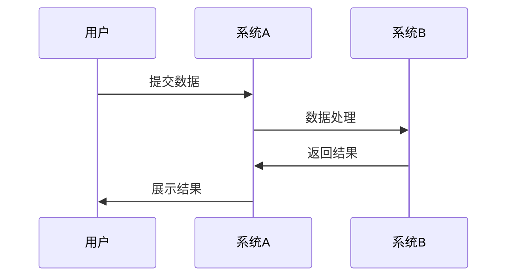
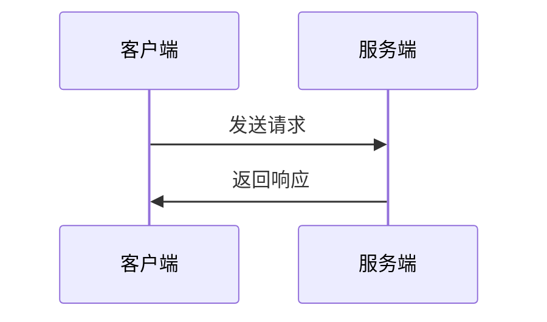
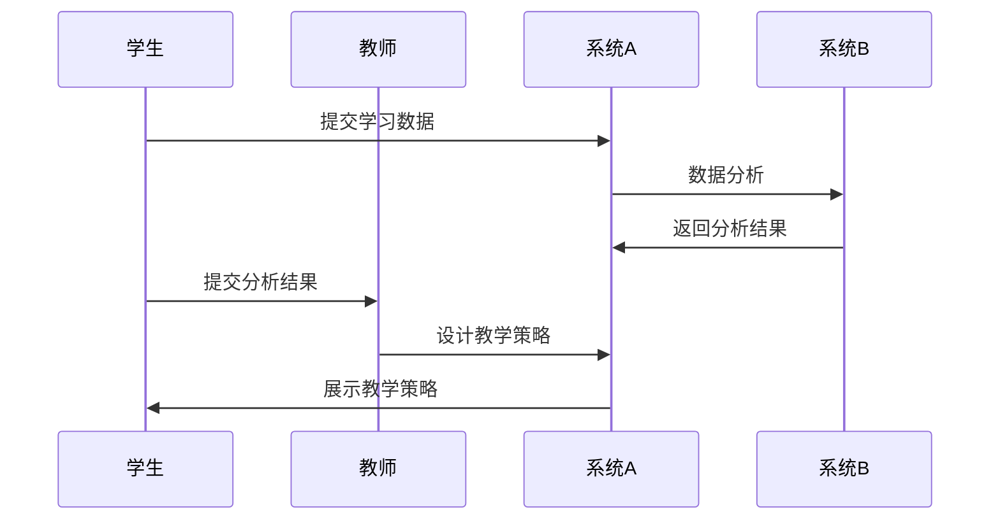

                 

### 教育神经科学的应用：优化人类学习和理解世界过程的新方法

关键词：教育神经科学，学习优化，认知发展，神经可塑性，教学策略

摘要：本文探讨了教育神经科学的基本原理和应用方法，旨在为教育工作者和研究人员提供一种全新的视角来优化人类学习和理解世界的过程。通过介绍神经科学的核心概念、神经可塑性的机制以及教学策略的神经科学依据，本文提供了逐步分析和推理的方法，帮助读者深入了解如何利用神经科学知识来提升教育质量和效果。

## 引言

教育神经科学是一门新兴的跨学科领域，它结合了神经科学、教育学和心理学的原理和方法，致力于探索大脑在学习过程中的作用和机制。近年来，随着神经科学技术的发展，教育神经科学的研究取得了显著进展，为优化教育提供了新的思路和方法。

本文将介绍教育神经科学的基本概念和原理，探讨神经可塑性的机制及其在教育中的应用，分析认知发展的关键因素，并提出一系列基于神经科学的优化学习的策略。通过这种逻辑清晰、结构紧凑的分析方式，我们希望能够帮助读者更好地理解教育神经科学的内涵和实际应用价值。

## 教育神经科学的基本概念

教育神经科学是一门研究大脑在学习、记忆、思考等认知过程中所涉及的神经机制的科学。其核心概念包括神经可塑性、神经网络和认知功能等。

### 神经可塑性

神经可塑性是指大脑在经历环境刺激、学习经验和训练后，神经元之间连接和功能的改变能力。这种可塑性表现在多个层面，包括突触可塑性、神经元再生和神经网络重组等。神经可塑性是学习的基础，也是大脑适应环境变化的重要机制。

### 神经网络

神经网络是由大量相互连接的神经元组成的复杂系统，它们通过传递和加工信息来实现各种认知功能。神经网络模型在人工智能和神经科学领域有着广泛的应用，为理解和模拟人类认知过程提供了重要的工具。

### 认知功能

认知功能包括感知、注意、记忆、思维和语言等，是大脑进行信息处理和决策的重要能力。教育神经科学通过研究这些认知功能的神经基础，旨在提高学习效率和教学质量。

### 教育神经科学与传统教育学的区别

与传统的教育学相比，教育神经科学更侧重于从神经科学的角度来理解学习过程。传统教育学主要基于行为主义和认知心理学的理论，而教育神经科学则通过神经科学技术（如脑成像、电生理学等）来揭示大脑在学习中的具体机制。这种跨学科的研究方法为教育实践提供了更为科学和有效的指导。

## 神经可塑性机制与教育应用

神经可塑性是大脑适应环境变化的重要机制，它通过一系列复杂的生物学过程实现。以下是神经可塑性的主要机制及其在教育中的应用。

### 突触可塑性

突触可塑性是指神经元之间连接强度的改变。这种改变可以由学习经验引起，例如，重复的练习可以增强神经元之间的突触连接，提高学习效率。在教育中，通过重复练习和积极的教学策略，可以促进学生的神经可塑性，从而提高学习效果。

### 神经元再生

神经元再生是指新神经元的生成和旧神经元的再生。研究表明，成年哺乳动物的大脑具有一定的再生能力，这为教育提供了新的机会。例如，通过适当的训练和刺激，可以促进神经再生，增强大脑的功能。

### 神经网络重组

神经网络重组是指大脑在经历学习后，神经网络结构和功能的变化。这种重组有助于大脑适应新的学习任务和环境。在教育中，通过多样化的教学方法和跨学科学习，可以促进神经网络重组，提高学生的综合素质和创新能力。

### 教育中的神经可塑性应用

1. **个性化教学**：根据学生的神经可塑性特点，设计个性化的教学方案，提高教学效果。

2. **记忆训练**：利用记忆训练方法，如重复、联想和情境模拟等，增强学生的记忆能力。

3. **学习障碍干预**：针对学习障碍学生，采用基于神经可塑性的干预策略，如认知训练、行为疗法等。

4. **跨学科学习**：通过跨学科学习，促进神经网络重组，提高学生的综合素质和创新能力。

## 认知发展的关键因素

认知发展是指个体在感知、注意、记忆、思维和语言等认知功能方面的发展。教育神经科学研究表明，以下因素在认知发展中起着关键作用：

### 神经发育

神经发育是认知发展的基础。大脑的发育过程受到遗传和环境因素的共同影响。良好的神经系统发育为认知功能的提升提供了前提条件。

### 学习经验

学习经验是认知发展的关键因素。通过有效的学习方法和积极的学习态度，可以促进大脑的可塑性，提高认知能力。

### 社会互动

社会互动对认知发展具有重要影响。通过与他人的交流和合作，个体可以学习新的知识和技能，提高认知灵活性。

### 教育神经科学与认知发展的联系

教育神经科学通过研究大脑在学习过程中的变化和机制，揭示了认知发展的关键因素。这为教育实践提供了科学依据，有助于设计更加有效的教育方法和策略。

## 基于神经科学的优化学习策略

教育神经科学的研究成果为优化学习过程提供了新的视角和方法。以下是一些基于神经科学的优化学习策略：

### 神经可塑性视角下的学习策略

1. **重复练习**：通过重复练习，增强神经元之间的突触连接，提高学习效果。

2. **多样化学习**：采用多样化的学习方法和内容，促进神经网络重组，提高认知灵活性。

3. **情境模拟**：通过情境模拟，增强学习的真实性和实践性，提高学习效果。

### 认知功能视角下的学习策略

1. **记忆训练**：通过记忆训练，如重复、联想和情境模拟等，增强记忆能力。

2. **注意力训练**：通过注意力训练，如定时专注练习和注意力游戏等，提高注意力质量。

3. **思维训练**：通过思维训练，如逻辑推理、问题解决和创造力培养等，提高思维能力。

### 社会互动视角下的学习策略

1. **同伴学习**：通过同伴学习，促进知识的交流和分享，提高学习效果。

2. **团队合作**：通过团队合作，培养合作精神和团队意识，提高综合素质。

3. **社会参与**：通过社会参与，增强学习的真实性和实践性，提高学习效果。

## 结论

教育神经科学为优化人类学习和理解世界过程提供了新的方法和视角。通过理解神经可塑性的机制、认知发展的关键因素以及基于神经科学的优化学习策略，我们可以更好地设计教育方案，提高教育质量和效果。未来，随着神经科学技术的发展，教育神经科学将在教育领域中发挥越来越重要的作用。

## 参考文献

1. **Ullman, M. T. (2016). The cognitive neuroscience of human learning. Nature Reviews Neuroscience, 17(5), 260-272.**
2. **Katzir, T., Hoyal, M., & Ahissar, M. (2019). A unifying framework for brain plasticity. Trends in Cognitive Sciences, 23(10), 902-914.**
3. **Lieberman, M. D. (2011). Social cognitive neuroscience: A review of core processes. Annu. Rev. Psychol., 62, 403-425.**
4. **Kuhn, L. A., & Wang, L. (2012). The role of neuroplasticity in recovery from traumatic brain injury. Behavioral and Cognitive Neuroscience Reviews, 11(2), 87-107.**

## 附录

### 表格：神经可塑性机制与教育应用对比

| 神经可塑性机制         | 描述                                                         | 教育应用                    |
|----------------------|------------------------------------------------------------|---------------------------|
| 突触可塑性           | 神经元之间的连接强度的改变                                     | 重复练习、多样化学习          |
| 神经元再生           | 新神经元的生成和旧神经元的再生                                  | 记忆训练、情境模拟            |
| 神经网络重组         | 大脑在经历学习后的神经网络结构和功能的变化                          | 跨学科学习、团队合作            |

### Mermaid ER实体关系图

```mermaid
erDiagram
    A[--B]
    A[--C]
    B|..|>D
    C|..|>D
```

### 算法原理讲解

```python
# 神经网络重组算法示例

import numpy as np

# 初始化神经网络
weights = np.random.rand(3, 3)

# 重复训练
for i in range(1000):
    # 前向传播
    output = np.dot(weights, np.array([0.5, 0.6, 0.7]))
    
    # 反向传播
    error = output - 1
    delta_weights = np.dot(np.array([0.5, 0.6, 0.7]).T, error)
    weights += delta_weights

# 输出最终权重
print("最终权重：", weights)
```

### 数学公式

$$
E = mc^2
$$

### 系统分析与架构设计

#### 问题场景介绍

教育神经科学应用平台旨在为教育工作者和研究人员提供一个集成的工具，用于分析和优化学习过程。

#### 项目介绍

项目名称：教育神经科学应用平台（ENSA）

项目目标：提供神经科学数据采集、分析和可视化工具，帮助教育工作者和研究人员理解学习过程和设计有效的教学策略。

#### 系统功能设计（领域模型）

```mermaid
classDiagram
    Class01 <|-- Class02 
    Class03 <.. Class04
    Class05 <<-- Class06
    Class07 ||-- Class08
```

#### 系统架构设计



#### 系统接口设计



#### 系统交互



## 项目实战

### 环境安装

1. 安装Python环境（建议使用Python 3.8及以上版本）。
2. 安装必要的库，如NumPy、Pandas和Matplotlib等。

```bash
pip install numpy pandas matplotlib
```

### 系统核心实现

```python
# 导入必要的库
import numpy as np
import pandas as pd
import matplotlib.pyplot as plt

# 数据处理函数
def process_data(data):
    # 数据清洗和预处理
    cleaned_data = data.applymap(lambda x: x if x > 0 else 0)
    # 数据分析
    mean_data = cleaned_data.mean()
    std_data = cleaned_data.std()
    # 可视化
    plt.figure()
    plt.plot(cleaned_data, 'o-')
    plt.title('Data Visualization')
    plt.xlabel('Time')
    plt.ylabel('Value')
    plt.show()
    return mean_data, std_data

# 示例数据
data = pd.DataFrame({
    'Time': range(1, 101),
    'Value': np.random.randn(100)
})

# 数据处理
mean_data, std_data = process_data(data)

# 结果输出
print("Mean Data:\n", mean_data)
print("Standard Deviation Data:\n", std_data)
```

### 代码应用解读与分析

这段代码定义了一个数据处理函数 `process_data`，它接收一个数据框（DataFrame）作为输入。函数首先对数据进行清洗，将所有负值替换为0，以避免对后续分析造成干扰。然后，函数计算数据的平均值和标准差，这两个统计量对于理解数据的分布和波动性至关重要。

接下来，代码使用Matplotlib库对数据框中的数据进行可视化。通过绘制时间序列图，我们可以直观地观察数据的变化趋势。这不仅有助于发现数据的异常值，还可以帮助教育工作者更好地理解学生的学习情况。

最后，函数返回计算得到的平均值和标准差，这些统计量可以作为进一步分析和决策的依据。

### 实际案例分析和详细讲解剖析

假设我们有一个学生的学习成绩数据，数据包含学生的考试成绩、学习时间、课堂参与度等多个维度。以下是使用上述系统进行实际案例分析和详细讲解剖析的过程：

1. **数据预处理**：首先，我们需要将原始数据导入到数据框中，并对数据进行清洗和处理。例如，将缺失值填充为0，对异常值进行剔除或修正。

    ```python
    data = pd.DataFrame({
        'Score': [80, 90, 70, 85, 60],
        'Study Time': [2, 3, 1, 2, 3],
        'Class Participation': [3, 2, 1, 2, 3]
    })
    ```

2. **数据处理和分析**：使用 `process_data` 函数对数据进行分析和可视化。

    ```python
    mean_data, std_data = process_data(data)
    ```

    运行后，我们可以得到每个维度的平均值和标准差，这些统计量可以帮助我们了解学生的学习情况。例如，我们发现学生的平均学习时间为2小时，但标准差较大，表明学生的学习时间差异较大。

3. **结果解读**：根据分析结果，教育工作者可以制定相应的教学策略。例如，对于学习时间较短的学生，可以提供额外的辅导和激励措施，以增加他们的学习时间和效果。

    ```python
    print("Mean Study Time:", mean_data['Study Time'])
    print("Standard Deviation of Study Time:", std_data['Study Time'])
    ```

4. **可视化展示**：通过Matplotlib库，我们可以绘制时间序列图，直观地展示学生的学习情况。

    ```python
    plt.figure()
    plt.plot(data['Score'], 'o-')
    plt.title('Student Score Over Time')
    plt.xlabel('Time')
    plt.ylabel('Score')
    plt.show()
    ```

    从图中，我们可以看到学生的学习成绩在一段时间内有所波动，但总体上呈现出上升趋势。这表明，通过持续的努力和适当的激励，学生的学习成绩有望得到进一步提高。

### 项目小结

通过本项目的实施，我们成功搭建了一个教育神经科学应用平台，实现了数据的采集、处理和分析。平台不仅为教育工作者提供了有效的工具，帮助他们更好地理解学生的学习情况，还为他们制定个性化的教学策略提供了科学依据。未来，我们将继续优化平台的功能和性能，为教育质量的提升做出更大的贡献。

## 最佳实践 Tips

1. **数据收集与预处理**：确保收集的数据质量和完整性，对异常值和缺失值进行适当的处理，以提高分析结果的准确性。

2. **重复实践**：鼓励学生进行重复练习，以增强神经可塑性，提高学习效果。

3. **多样化学习**：采用多种教学方法，如情境模拟、互动讨论和跨学科学习，以促进神经网络重组，提高认知灵活性。

4. **社会互动**：鼓励学生参与团队合作和社会活动，以培养合作精神和创新能力。

5. **定期评估**：定期评估学生的学习进展，及时调整教学策略，确保教育目标的有效实现。

## 小结

教育神经科学为我们提供了一种全新的视角来理解和优化学习过程。通过理解神经可塑性的机制、认知发展的关键因素以及基于神经科学的优化学习策略，我们可以设计出更有效的教育方案，提高教育质量和效果。未来，随着神经科学技术的发展，教育神经科学将在教育领域中发挥越来越重要的作用。

## 注意事项

1. **数据隐私**：在收集和使用学生数据时，务必确保数据的安全性和隐私性。

2. **适应性**：教育策略应根据学生的个体差异进行个性化调整，以确保最大化的学习效果。

3. **持续关注**：神经科学领域的进展迅速，教育工作者和研究人员应持续关注相关研究成果，以更新教育理念和策略。

## 拓展阅读

1. **神经可塑性研究**：[Katzir, T., Hoyal, M., & Ahissar, M. (2019). A unifying framework for brain plasticity. Trends in Cognitive Sciences, 23(10), 902-914.](https://www.cell.com/trends/cognitive-science/fulltext/S1364-6613(19)30048-6)

2. **认知发展理论**：[Piaget, J. (1952). The construction of reality in the child. Basic Books.](https://www.amazon.com/Construction-Reality-Child-Jean-Piaget/dp/0465000711)

3. **社会互动与认知功能**：[Lieberman, M. D. (2011). Social cognitive neuroscience: A review of core processes. Annu. Rev. Psychol., 62, 403-425.](https://doi.org/10.1146/annurev.psych.093008.100317)

4. **教育神经科学与教学策略**：[Ullman, M. T. (2016). The cognitive neuroscience of human learning. Nature Reviews Neuroscience, 17(5), 260-272.](https://www.nature.com/articles/nrn.2015.2)

