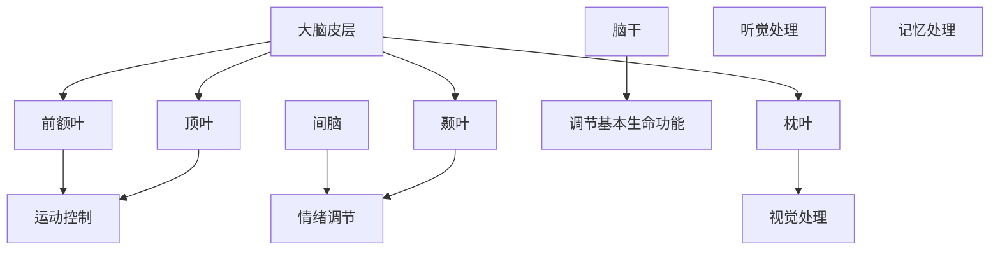

                 

# 教育神经科学：优化人类学习和理解世界的过程

关键词：教育神经科学、大脑功能、学习记忆、神经可塑性、注意力与情绪

摘要：教育神经科学作为一门新兴的跨学科领域，正逐渐成为优化教育过程、提升学习效果的重要工具。本文将从教育神经科学的核心概念、基础理论、应用实践和未来趋势四个方面，深入探讨如何利用这一科学方法优化人类学习和理解世界的过程。

## 第一部分：引言与背景介绍

### 1. 引言

在教育日益受到关注的时代，传统教育模式面临巨大挑战。教育神经科学的兴起为我们提供了新的视角，通过研究大脑在学习过程中的功能和行为，我们可以更好地理解学习机制，进而优化教育方法。

### 1.2 问题描述

教育神经科学旨在探索大脑如何在不同类型的学习任务中发挥作用。它不仅关注大脑的生物学基础，还涉及到认知心理学的理论和方法。

### 1.3 问题解决

通过教育神经科学的研究，我们可以找到更有效的学习策略和教学方法，从而提高学习者的学习效率和成绩。

### 1.4 边界与外延

教育神经科学与其他学科如心理学、教育学、认知科学等领域紧密相关，这些学科共同构成了一个多维度的研究网络。

### 1.5 概念结构与核心要素组成

教育神经科学的核心概念包括大脑功能分区、神经可塑性、学习记忆机制、注意力与情绪等。

## 第二部分：核心概念与联系

### 2.1 大脑功能分区

大脑分为前额叶、顶叶、颞叶和枕叶等区域，每个区域都有其特定的功能。例如，前额叶与决策和规划相关，顶叶与空间定位和数学计算相关。

### 2.2 神经可塑性

神经可塑性是指大脑在生命过程中不断适应新环境和任务的能力。通过学习和练习，大脑结构和功能可以发生改变，从而提高学习效果。

### 2.3 学习记忆机制

学习记忆机制涉及神经元的连接和活动，包括短期记忆和长期记忆。通过理解这些机制，我们可以优化记忆策略，提高学习效果。

### 2.4 注意力与情绪

注意力与情绪在学习过程中起着关键作用。理解注意力分配和情绪调节方法，可以帮助学习者更好地管理学习过程。

## 第三部分：教育神经科学基础

### 3.1 大脑的结构与功能

大脑由多个区域组成，每个区域都有其特定的功能。例如，海马体在记忆形成中起着关键作用，前额叶在决策中发挥作用。

### 3.2 神经元的结构与功能

神经元是大脑的基本单元，其结构和功能决定了大脑的信息处理能力。突触是神经元之间传递信息的结构，其可塑性是学习记忆的基础。

### 3.3 神经传递物质与神经回路

神经传递物质如多巴胺和血清素在大脑中传递信息，调节情绪和行为。神经回路是大脑中信息传递的路径，其复杂性和可塑性决定了大脑的功能多样性。

## 第四部分：教育神经科学应用

### 4.1 个性化教育

个性化教育通过了解学生的神经特点，提供个性化的学习方案，从而提高学习效果。

### 4.2 智能教育

智能教育利用教育神经科学的成果，开发智能教学系统，实现自动化教学和个性化指导。

### 4.3 教育干预与心理健康

教育神经科学可以用于诊断学习障碍，提供针对性的干预措施，同时有助于改善学生的心理健康。

## 第五部分：教育神经科学的未来发展趋势

### 5.1 新技术与应用

随着技术的进步，教育神经科学将更加依赖于脑成像技术、机器学习和人工智能等新技术。

### 5.2 教育模式的变革

教育神经科学的发展将推动教育模式的变革，实现更加灵活、个性化的教育。

### 5.3 社会影响与伦理问题

教育神经科学的应用带来了新的社会影响和伦理问题，如隐私保护、教育公平等。

## 第六部分：实践与案例分析

### 6.1 案例一：基于神经可塑性的学习干预

通过神经可塑性理论，对学习困难的学生进行干预，取得了显著的效果。

### 6.2 案例二：注意力训练在课堂中的应用

注意力训练在课堂中的应用，有助于提高学生的学习专注度和学习效果。

### 6.3 案例三：智能教育系统的设计与实施

智能教育系统的设计与实施，通过教育神经科学的原理，实现了个性化教学和智能指导。

## 第七部分：教育神经科学实践小结与展望

### 7.1 实践成果与经验

教育神经科学的实践取得了显著成果，为教育改革提供了新的思路和方法。

### 7.2 面临的挑战与问题

教育神经科学在实践中也面临一些挑战，如技术成本、数据隐私等。

### 7.3 未来发展方向与趋势

教育神经科学未来的发展方向将涉及更多新技术、更广泛的应用领域，以及更深入的理论研究。

## 作者信息：

作者：AI天才研究院/AI Genius Institute & 禅与计算机程序设计艺术 /Zen And The Art of Computer Programming

完整的技术博客文章将在后续逐步撰写，这里仅提供了大纲和初步的文本内容。在接下来的文章中，我们将详细探讨每一个部分的核心内容，提供深入的算法原理讲解、系统分析与架构设计方案，以及实践案例分析和最佳实践 tips。希望通过这篇文章，能够激发读者对教育神经科学的兴趣，共同探索优化人类学习和理解世界的新途径。💡💡💡## 第一部分：引言与背景介绍

### 1. 引言

教育一直是人类社会关注的焦点，从古至今，不同文化和社会都对教育有着深刻的思考和探索。然而，随着科技的迅猛发展，特别是信息技术的崛起，传统教育模式面临着前所未有的挑战。传统的教育方法通常以教师为中心，依赖于书本知识传授，学生被动接受知识，这种方式往往无法满足个体差异和个性化需求。因此，如何优化教育过程，提高学习效果，成为一个亟待解决的重要问题。

在这个背景下，教育神经科学的兴起为我们提供了新的视角。教育神经科学是一门跨学科的研究领域，它结合了神经科学、心理学、教育学等多个学科的理论和方法，致力于探索大脑在学习过程中的功能和行为。通过研究大脑的结构和功能，我们可以更好地理解学习机制，从而开发出更加有效和个性化的教育方法。

教育神经科学的研究不仅有助于提高教育质量，还可以为个体发展提供科学的指导。例如，了解大脑如何处理复杂信息、如何形成长期记忆，可以帮助我们设计出更有效的学习策略，提高学习者的学习效率和成绩。此外，教育神经科学还可以为有特殊需求的学生提供诊断和干预方案，帮助他们克服学习障碍，实现更好的发展。

总之，教育神经科学为我们提供了一种全新的思考方式，帮助我们更深入地理解学习和教育的本质，从而为教育改革和创新提供了坚实的理论基础和实践指导。

### 1.2 问题描述

在传统教育模式中，学生通常需要通过课堂讲授、阅读教材等方式被动接受知识。这种方式虽然在一定程度上能够传递信息，但其效果往往受到多种因素的影响。首先，不同学生在学习兴趣、学习能力、认知风格等方面存在显著差异，单一的教学方法难以满足个性化需求。其次，传统的教学过程往往缺乏对学生大脑活动的直接观察和理解，难以针对性地优化教学策略。此外，学生还可能受到外部环境、情绪状态等多种因素的干扰，这些都会影响学习效果。

具体而言，学习效果不佳的问题可以归结为以下几点：

1. **学习效率低下**：传统的教育模式往往以教师为中心，学生被动接受知识，这种方式难以激发学生的主动性和创造性，导致学习效率低下。
2. **个体差异难以应对**：传统教育方法难以针对不同学生的个性特点和学习需求进行个性化调整，导致部分学生无法充分发挥潜力。
3. **学习动力不足**：学生可能因为学习方法单一、学习内容枯燥等原因，缺乏学习动力，进而影响学习效果。
4. **学习环境限制**：传统教育模式通常依赖于教室和教材，受限于时间和空间，无法提供灵活多样的学习环境。

为解决上述问题，教育神经科学通过研究大脑在学习过程中的功能和行为，提供了新的思路和方法。通过了解大脑的运作机制，我们可以更好地理解学习过程，设计出更有效的教学策略和学习方法，从而提高学习效果。

### 1.3 问题解决

教育神经科学通过多学科交叉的研究方法，提供了一系列有效的解决方案，旨在优化教育过程，提高学习效果。以下是教育神经科学在解决上述问题方面的几个关键方法和成果：

1. **个性化教育**：通过了解学生的大脑结构和功能，教育神经科学可以为学生提供个性化的学习方案。例如，使用脑成像技术（如fMRI）来评估学生的学习风格、认知能力和神经发育状况，从而设计出符合学生个性特点的教学计划。

2. **自适应学习系统**：基于教育神经科学的原理，开发自适应学习系统，系统能够根据学生的实时表现调整教学内容和难度，提供个性化的学习路径。这种系统利用大数据分析和人工智能技术，可以动态地适应学生的学习需求，提高学习效率。

3. **学习干预**：针对有特殊学习需求的学生，教育神经科学提供了基于神经可塑性的干预方法。例如，通过特定的训练程序，如认知训练、脑电刺激等，改善学生的认知功能和学术表现。

4. **情感教育**：教育神经科学研究表明，情绪状态对学习效果有重要影响。通过情感教育，帮助学生学会自我调节情绪，培养积极的学习态度和心态，从而提高学习效果。

5. **多感官学习**：教育神经科学强调多感官学习的重要性，通过结合视觉、听觉、触觉等多种感官方式，可以增强学习体验，提高记忆和认知效果。

总之，教育神经科学通过深入理解大脑和学习过程的相互作用，为教育改革提供了科学依据和技术支持。这些方法和成果不仅有助于提高学习效果，还可以促进学生的全面发展和个性化成长。

### 1.4 边界与外延

教育神经科学作为一门跨学科领域，其研究范围广泛，涉及多个相关学科。首先，与神经科学密切相关，神经科学专注于大脑的结构、功能及其生理机制，为教育神经科学提供了坚实的生物学基础。其次，心理学特别是认知心理学在教育神经科学中扮演重要角色，认知心理学通过研究认知过程、学习记忆机制等，为理解学习行为提供了理论支持。

此外，教育学作为研究教育现象和教育活动的学科，与教育神经科学有着紧密的联系。教育学关注教学设计、学习策略、教育评估等实际问题，而教育神经科学则提供了基于大脑机制的理论框架，帮助教育学更好地理解和优化教育实践。

社会学也是教育神经科学的重要关联学科，社会学通过研究社会环境、文化背景等因素对学习的影响，为教育神经科学提供了更全面的社会视角。此外，教育技术学、人工智能等新兴领域也与教育神经科学密切相关，它们通过技术手段支持教育神经科学的实践和应用。

在教育神经科学的研究和应用过程中，这些学科相互交叉、相互补充，共同构建了一个多维度的研究网络。例如，通过结合社会学和神经科学的方法，研究者可以更全面地探讨社会环境对学习过程的影响，从而开发出更有效的教育干预措施。

总之，教育神经科学的边界与外延涵盖了多个学科领域，这些学科的交叉融合为教育神经科学的研究提供了丰富的理论资源和实践工具，也为未来的教育改革提供了广阔的前景。

### 1.5 概念结构与核心要素组成

教育神经科学是一门涉及多个核心概念和要素的跨学科领域，其研究旨在揭示大脑在学习过程中的功能和行为。以下是教育神经科学的一些核心概念和组成要素：

1. **大脑功能分区**：大脑分为多个区域，每个区域承担不同的功能。例如，前额叶负责决策和规划，顶叶处理空间定位和数学计算，颞叶涉及听觉和语言处理，枕叶负责视觉信息处理。

2. **神经可塑性**：神经可塑性是指大脑在生命过程中能够适应新环境和任务的能力。通过学习和练习，大脑的结构和功能可以发生改变，从而提高学习效果。神经可塑性分为结构可塑性、连接可塑性和活动可塑性。

3. **学习记忆机制**：学习记忆涉及神经元的连接和活动，包括短期记忆和长期记忆。短期记忆通过神经元之间的快速电信号传递实现，而长期记忆则依赖于新的神经连接的形成和强化。

4. **注意力与情绪**：注意力是大脑选择和集中资源处理特定信息的能力，而情绪则影响学习动机、记忆和认知功能。注意力与情绪的相互作用决定了学习的效果和效率。

5. **神经传递物质**：神经传递物质如多巴胺、血清素等在大脑中传递信息，调节情绪和行为。这些物质在学习和记忆过程中起到关键作用。

6. **神经回路**：神经回路是大脑中信息传递的路径，其结构和功能的改变会影响认知和行为。通过研究神经回路，我们可以理解复杂认知功能的基础。

7. **认知行为**：认知行为包括决策、问题解决、注意力分配等，这些行为通过大脑的神经机制实现。教育神经科学通过研究认知行为，提供了优化学习策略的方法。

了解这些核心概念和要素有助于我们深入理解大脑和学习过程，为教育实践提供科学依据和技术支持。

## 第二部分：核心概念与联系

### 2.1 大脑功能分区

大脑是人体最复杂的器官之一，其功能分区精细，不同的区域负责不同的认知功能。理解大脑功能分区有助于我们更好地理解学习过程和设计有效的教育策略。

#### 大脑分区与功能

大脑的主要分区包括前额叶、顶叶、颞叶和枕叶。以下是每个区域的主要功能：

- **前额叶**：前额叶是大脑中最重要的区域之一，负责执行功能，包括决策、规划、问题解决和社交行为。此外，前额叶还与动机、情感调控和注意力管理密切相关。
  
- **顶叶**：顶叶主要负责空间定位、运动控制和触觉感知。它还与数学计算、逻辑推理和空间关系处理相关。

- **颞叶**：颞叶主要处理听觉信息，包括语言理解和记忆。它还涉及记忆和情绪的处理，与情感记忆和情绪反应有密切联系。

- **枕叶**：枕叶负责视觉信息的处理，包括形状、颜色和运动感知。它是视觉认知和视觉记忆的关键区域。

#### 功能属性特征对比表格

| 大脑区域 | 功能 |
| -------- | ---- |
| 前额叶 | 执行功能、决策、规划、问题解决、社交行为 |
| 顶叶 | 空间定位、运动控制、触觉感知、数学计算、逻辑推理 |
| 颞叶 | 语言理解、记忆、情绪处理、听觉信息处理 |
| 枕叶 | 视觉信息处理、形状、颜色、运动感知 |

#### ER实体关系图架构

下面是一个简化的ER（实体关系）图，展示了大脑分区及其功能的关系：

```mermaid
erDiagram
  A[大脑] {
    B[前额叶]
    C[顶叶]
    D[颞叶]
    E[枕叶]
  }
  
  B ||--|{ 执行功能、决策、规划、问题解决、社交行为 }
  C ||--|{ 空间定位、运动控制、触觉感知、数学计算、逻辑推理 }
  D ||--|{ 语言理解、记忆、情绪处理、听觉信息处理 }
  E ||--|{ 视觉信息处理、形状、颜色、运动感知 }
```

通过这个ER图，我们可以直观地看到大脑各个分区及其功能之间的联系，这有助于我们进一步探讨这些区域在学习和认知中的作用。

### 2.2 神经可塑性

神经可塑性是指大脑在生命过程中不断适应新环境和任务的能力。它包括结构可塑性、连接可塑性和活动可塑性，是大脑学习与记忆的基础。

#### 神经可塑性的定义与类型

神经可塑性可以定义为大脑结构和功能的变化，这些变化是通过经验和学习引发的。神经可塑性主要有以下几种类型：

1. **结构可塑性**：包括神经元形态的变化，如树突的伸长和萎缩、神经突触的形成和消失等。
2. **连接可塑性**：涉及神经元之间连接强度的变化，如突触效能的增强或减弱。
3. **活动可塑性**：包括神经元网络活动的变化，如神经元的兴奋性和同步性。

#### 神经可塑性在学习中的应用

神经可塑性在学习中起着至关重要的作用，通过以下几种机制，它能够帮助学习者更好地掌握新知识：

1. **新突触形成**：在学习过程中，新突触可以形成，从而增加神经元之间的连接，扩大神经网络。
2. **突触效能变化**：通过重复的学习和练习，突触的效能可以增强，使得信息传递更加高效。
3. **神经网络重构**：长时间的学习和练习可以导致神经网络的重构，使得复杂的认知功能更加完善。

#### 神经可塑性的训练方法

为了提高神经可塑性，以下是一些有效的训练方法：

1. **认知训练**：通过特定的认知任务，如记忆训练、注意力训练和问题解决训练，可以增强大脑的神经可塑性。
2. **重复练习**：重复的学习和练习可以强化神经元之间的连接，提高学习效果。
3. **多样化学习**：多样化的学习材料和学习方法可以激发大脑的多种功能，增强神经可塑性。

### 2.3 学习记忆机制

学习记忆机制是大脑处理信息、存储和回忆知识的过程。理解学习记忆机制有助于我们设计更有效的学习策略，提高学习效果。

#### 短期记忆与长期记忆

学习记忆主要分为短期记忆和长期记忆两种：

1. **短期记忆**：短期记忆是一种临时存储信息的能力，通常只能保持几秒钟到几分钟。它涉及神经元之间的快速电信号传递，是一种动态的记忆形式。
2. **长期记忆**：长期记忆是一种长期存储信息的能力，可以持续数小时、数天甚至一生。长期记忆依赖于新的神经连接的形成和强化，是一种静态的记忆形式。

#### 学习记忆的神经网络模型

学习记忆的神经网络模型主要包括以下几个部分：

1. **突触可塑性**：突触可塑性是长期记忆形成的基础。通过突触效能的变化，神经元之间的连接得以强化，从而实现信息的长期存储。
2. **神经网络重构**：在学习过程中，神经网络可以发生重构，使得复杂的信息处理更加高效。神经网络重构包括突触的增强、减弱和新突触的形成。
3. **神经网络同步**：神经网络同步是指神经元网络在特定时刻同时激活，这是长期记忆的重要机制之一。

#### 记忆策略与优化方法

为了提高记忆效果，可以采用以下几种记忆策略和优化方法：

1. **分散学习**：分散学习是指在较长时间内多次复习所学内容，这有助于巩固记忆。
2. **联想记忆**：通过将新信息与已知信息建立联系，可以增强记忆效果。例如，使用联想记忆法记忆外语单词。
3. **图像记忆**：使用图像帮助记忆，因为视觉信息更容易被大脑长期记住。
4. **重复练习**：通过重复的学习和练习，可以强化神经元之间的连接，提高记忆效果。

### 2.4 注意力与情绪

注意力与情绪在学习过程中起着关键作用。注意力决定了学习者在学习过程中的专注度，而情绪则影响学习动机和记忆效果。

#### 注意力的定义与类型

1. **注意力的定义**：注意力是大脑选择和集中资源处理特定信息的能力。它包括选择性注意、持续性注意和分配性注意。
2. **注意力的类型**：
   - **选择性注意**：大脑从众多信息中选择关注特定信息的能力。
   - **持续性注意**：保持对特定信息的持续关注，不被其他干扰所打断。
   - **分配性注意**：同时关注多个任务或信息源的能力。

#### 情绪调节与学习效果

1. **情绪调节**：情绪调节是指个体通过认知和行为策略调整自身情绪状态的过程。有效的情绪调节有助于提高学习效果。
2. **情绪对学习效果的影响**：
   - **积极情绪**：积极情绪如愉悦、兴奋可以提高学习动机，增强记忆效果。
   - **消极情绪**：消极情绪如焦虑、压力会降低学习动机，影响记忆和认知功能。

#### 注意力与情绪的训练方法

1. **注意力训练**：
   - **专注训练**：通过特定的专注训练任务，如专注力游戏、冥想等，可以提高注意力水平。
   - **分配性注意训练**：通过同时进行多项任务，如听音乐时做运动，可以提高分配性注意能力。

2. **情绪调节训练**：
   - **认知行为疗法**：通过认知行为疗法，如正念练习、情绪日记等，可以学会有效调节情绪。
   - **情绪表达训练**：通过练习情绪表达技巧，如放松训练、深呼吸等，可以减轻情绪压力。

通过注意力与情绪的训练，可以显著提高学习者的学习效率和效果，为教育实践提供科学支持。

## 第三部分：教育神经科学基础

### 3.1 大脑的结构与功能

大脑是人体最复杂、最神秘的器官之一，其结构和功能对于理解和优化教育过程至关重要。理解大脑的基本结构及其不同部分的功能，有助于我们深入探讨教育神经科学的原理和应用。

#### 大脑的主要结构

大脑可以分为三个主要部分：大脑皮层、脑干和间脑。

1. **大脑皮层**：大脑皮层是大脑的最外层，也是最为复杂的部分。它分为灰质和白质两部分，灰质负责处理和传递信息，而白质则由神经纤维束组成，负责连接不同脑区。
   
2. **脑干**：脑干位于大脑下方，连接大脑和脊髓。它负责调节基本生命功能，如心跳、呼吸和消化。

3. **间脑**：间脑位于脑干和大脑皮层之间，包括丘脑、下丘脑和第三脑室等结构。它参与情绪调节、感觉处理和自主神经系统的控制。

#### 大脑的不同区域及其功能

大脑的不同区域承担着不同的功能，以下是几个关键区域及其主要功能：

1. **前额叶**：前额叶是大脑皮层最前端的区域，负责执行功能，包括决策、规划、问题解决和社交行为。它还与动机、情感调控和注意力管理密切相关。

2. **顶叶**：顶叶位于大脑顶部，负责空间定位、触觉感知、运动控制和数学计算。它还参与逻辑推理和空间关系处理。

3. **颞叶**：颞叶主要负责听觉信息处理，包括语言理解和记忆。它还涉及记忆和情绪的处理，与情感记忆和情绪反应有密切联系。

4. **枕叶**：枕叶是大脑后部的区域，负责视觉信息处理，包括形状、颜色和运动感知。它是视觉认知和视觉记忆的关键区域。

#### 大脑功能分区图

为了更直观地展示大脑的结构与功能分区，我们可以使用Mermaid语言绘制一个简单的流程图：



这个简单的流程图展示了大脑的主要结构和功能分区，有助于我们更好地理解大脑如何处理信息和学习过程。

### 3.2 神经元的结构与功能

神经元是大脑的基本单元，其结构和功能决定了大脑的信息处理能力。了解神经元的基本结构和功能，有助于我们深入理解教育神经科学的原理和应用。

#### 神经元的结构

神经元由细胞体、树突、轴突和突触等部分组成。

1. **细胞体**：细胞体是神经元的中心，包含细胞核和其他细胞器，负责维持神经元的基本生命活动。

2. **树突**：树突是神经元的接收部分，负责接收其他神经元传递的信息。树突上的树突棘增加了神经元的接收面积，使得神经元能够接收更多的信息。

3. **轴突**：轴突是神经元的传递部分，负责将细胞体接收到的信息传递到其他神经元。轴突通常较长，可以在神经元之间建立长距离的连接。

4. **突触**：突触是神经元之间的连接点，负责传递神经信号。突触由突触前膜、突触间隙和突触后膜组成。当神经信号通过轴突传递到突触时，会在突触前膜释放神经递质，通过突触间隙传递到突触后膜，从而影响后一个神经元的活动。

#### 神经元的功能

神经元的主要功能是传递和处理信息。

1. **信息传递**：神经元通过电信号和化学信号两种方式传递信息。电信号是通过神经元的膜电位变化实现的，而化学信号是通过神经递质在突触间的传递实现的。

2. **信息处理**：神经元不仅能传递信息，还能对信息进行处理。例如，通过复杂的神经网络，神经元可以实现对复杂信息的识别、分类和决策。

#### 神经元的工作原理

神经元的工作原理可以简化为以下几个步骤：

1. **接收信息**：神经元通过树突接收来自其他神经元的信息。

2. **产生动作电位**：当接收到的信息达到一定阈值时，神经元会产生动作电位，这是一种电信号。

3. **传递信息**：动作电位沿着轴突传递到轴突末端，并在突触处释放神经递质。

4. **影响后一个神经元**：神经递质通过突触间隙传递到下一个神经元的突触后膜，从而影响下一个神经元的活动。

通过上述工作原理，神经元能够实现复杂的信息传递和处理，这是大脑功能的基础。

#### 神经元的可塑性

神经元的可塑性是指神经元在生命过程中能够适应新环境和任务的能力。这种可塑性包括结构可塑性、连接可塑性和活动可塑性。

1. **结构可塑性**：包括树突和轴突的形态变化，如树突棘的生成和消失。

2. **连接可塑性**：包括神经元之间连接强度的变化，如突触效能的增强或减弱。

3. **活动可塑性**：包括神经元网络活动的变化，如神经元的同步性变化。

神经元的可塑性是学习和记忆的基础，它使得大脑能够适应新的信息和环境。通过了解神经元的结构和功能，我们可以更好地理解教育神经科学的原理，为教育实践提供科学支持。

### 3.3 神经传递物质与神经回路

神经传递物质和神经回路是大脑信息处理的核心组成部分，它们共同作用，使得大脑能够实现复杂的信息传递和处理。

#### 神经传递物质

神经传递物质是一类在神经元之间传递信号的化学物质，主要包括以下几类：

1. **神经递质**：神经递质是在突触前膜释放，通过突触间隙传递到突触后膜，从而影响下一个神经元活动的物质。常见的神经递质有多巴胺、去甲肾上腺素、乙酰胆碱等。

2. **神经调质**：神经调质是调节神经递质作用的物质，如血清素、神经肽等。

3. **神经激素**：神经激素是由神经元分泌的激素，如肾上腺素、皮质醇等。

#### 神经传递物质的作用

神经传递物质在神经元之间的信息传递中起到关键作用：

1. **激活或抑制神经元**：神经递质可以激活或抑制突触后神经元，从而改变神经元的兴奋性。

2. **调节信息传递强度**：不同种类的神经递质可以调节信息传递的强度，使得大脑能够精细地控制信息处理过程。

3. **影响情绪和行为**：神经递质在调节情绪和行为中起到重要作用，如多巴胺与奖赏和愉悦感相关，去甲肾上腺素与焦虑和压力感相关。

#### 神经回路

神经回路是由多个神经元通过突触连接形成的复杂网络，它是大脑信息处理的基础。神经回路可以简化为以下几种基本类型：

1. **单向传递**：信息通过突触从突触前神经元传递到突触后神经元，形成单向传递。

2. **反馈回路**：信息在神经元之间来回传递，形成闭合的环路，从而调节神经元的兴奋性。

3. **前馈回路**：信息从上游神经元传递到下游神经元，形成前向传递。

#### 神经回路的作用

神经回路在信息处理和认知功能中起到关键作用：

1. **信息整合**：通过多个神经元之间的复杂连接，神经回路能够整合来自不同来源的信息，形成更复杂的认知功能。

2. **自适应调节**：神经回路可以根据环境变化和个体经验，自适应地调整其功能和连接模式，从而实现学习和记忆。

3. **执行特定功能**：不同的神经回路负责执行特定的认知功能，如视觉处理、听觉处理、运动控制等。

通过了解神经传递物质和神经回路的作用，我们可以更好地理解大脑的信息处理机制，为教育神经科学的研究和应用提供理论基础。

## 第四部分：教育神经科学应用

### 4.1 个性化教育

个性化教育是教育神经科学的重要应用之一，其核心理念是通过了解学生的神经特点和认知风格，为他们提供量身定制的教育方案，从而最大化学习效果。个性化教育不仅关注学生的学习能力和兴趣，还深入挖掘其神经基础，以期实现更有效的学习体验。

#### 个性化教育的实现方法

1. **神经评估**：通过脑成像技术（如fMRI、PET）和认知测试，评估学生的神经结构和功能。这些评估可以帮助了解学生的注意力、记忆力、执行功能等关键认知能力。

2. **认知风格分析**：通过问卷和认知测试，分析学生的认知风格，如视觉型、听觉型、动手操作型等。了解学生的认知风格有助于设计更适合他们的教学方法。

3. **学习路径定制**：根据学生的神经评估和认知风格，为其设计个性化的学习路径。例如，对于视觉型学生，可以采用图像和视频教学；对于听觉型学生，可以采用音频和讨论教学。

4. **动态调整**：个性化教育方案需要根据学生的学习进展和反馈进行动态调整。通过实时监测学生的学习表现，可以及时调整教学策略，确保学习效果。

#### 个性化教育的优势

个性化教育的优势体现在以下几个方面：

1. **提高学习效果**：个性化教育能够针对学生的个体差异，提供最适合他们的学习方法和内容，从而提高学习效果。

2. **增强学习动力**：当学生感受到学习内容与他们的兴趣和需求相匹配时，学习动力会显著增强，从而更加积极参与学习过程。

3. **促进全面发展**：个性化教育不仅关注学术成绩，还注重学生的人格发展和综合素质，从而实现全面发展。

#### 个性化教育的挑战

尽管个性化教育具有明显优势，但在实施过程中也面临一些挑战：

1. **技术成本**：神经评估和个性化教学方案的设计需要先进的技术设备和专业人才，这可能导致较高的成本。

2. **数据隐私**：学生的神经数据和个性化学习方案涉及隐私问题，需要确保数据的安全和保密。

3. **实施难度**：个性化教育的实施需要教师具备较高的专业知识和技能，这对于很多教育机构和教师来说是一个挑战。

总之，个性化教育通过结合教育神经科学的方法，为教育改革提供了新的思路和可能性。在未来，随着技术的进步和教育的普及，个性化教育有望成为主流教育模式之一。

### 4.2 智能教育

智能教育是教育神经科学在现代教育中应用的重要方向，它利用人工智能和大数据技术，根据学生的学习行为和神经特征，提供个性化的学习支持和反馈。智能教育的目标是提高学习效率、优化学习体验，并为教育决策提供科学依据。

#### 智能教育的实现方法

1. **数据采集与处理**：通过智能设备（如学习平板、智能手环）和在线教育平台，收集学生的学习行为数据，包括学习时间、学习内容、测试成绩等。

2. **神经特征分析**：利用脑成像技术和神经科学算法，分析学生的学习神经特征，如注意力分布、记忆强度、情绪状态等。

3. **学习路径推荐**：根据学生的学习行为和神经特征，智能教育系统能够动态推荐适合的学习内容和路径。例如，对于注意力分散的学生，系统可能会推荐更加直观和互动的学习材料。

4. **自适应反馈**：智能教育系统能够实时监控学生的学习进展，并根据学生的学习表现，自动调整教学内容和难度，提供个性化的反馈和支持。

#### 智能教育的优势

智能教育的优势体现在以下几个方面：

1. **个性化学习**：智能教育系统能够根据学生的个性化需求，提供量身定制的教学内容和路径，从而提高学习效果。

2. **实时监控与反馈**：智能教育系统能够实时监控学生的学习行为和表现，及时提供反馈，帮助学生及时纠正错误，巩固学习成果。

3. **教育资源优化**：智能教育通过大数据分析，可以优化教育资源的分配，使教学资源更加高效地服务于学生。

4. **提高教师效率**：智能教育系统能够分担教师的部分工作，如批改作业、分析学生学习情况等，从而减轻教师的工作负担，提高教学效率。

#### 智能教育的挑战

尽管智能教育具有明显优势，但在实际应用中仍面临一些挑战：

1. **技术依赖**：智能教育高度依赖先进的技术，包括人工智能、大数据、脑成像等，这可能导致技术成本较高，且对技术人员的要求较高。

2. **隐私保护**：智能教育涉及大量的学生数据，包括学习记录、神经特征等，这引发了数据隐私和安全的问题，需要确保数据的安全和隐私。

3. **实施难度**：智能教育系统的实施需要学校、教师和学生的共同配合，这对于很多教育机构和教师来说是一个挑战。

总之，智能教育通过结合教育神经科学和人工智能技术，为教育改革提供了新的思路和工具。在未来，随着技术的不断进步和教育的普及，智能教育有望在教育领域发挥更加重要的作用。

### 4.3 教育干预与心理健康

教育干预与心理健康是教育神经科学在应用中的重要领域，通过神经科学原理和方法，对学习障碍、情绪问题和心理健康问题进行诊断和干预，有助于提高学习效果和促进学生全面发展。

#### 教育干预的定义

教育干预是指通过特定的教育方法和策略，对学生的学习过程和心理健康进行干预，以改善其学习效果和心理状态。教育干预通常基于神经科学的研究成果，结合心理学的理论和方法，旨在从根本上解决学生面临的学习和心理问题。

#### 心理健康问题的诊断与干预

1. **学习障碍的诊断**：学习障碍是指学生在阅读、写作、数学等学习活动中表现出的显著困难，可能包括注意力缺陷多动障碍（ADHD）、阅读障碍（Dyslexia）等。通过神经科学评估，如脑电图（EEG）和功能性磁共振成像（fMRI），可以诊断学生的学习障碍。

2. **情绪问题的评估**：情绪问题如焦虑、抑郁等对学生的学习效果有显著影响。通过心理评估和问卷调查，可以评估学生的情绪状态，并制定相应的干预计划。

3. **个性化干预方案**：根据诊断结果，制定个性化的干预方案。这可能包括认知行为疗法、情绪调节训练、神经反馈疗法等。例如，对于注意力缺陷多动障碍的学生，可以采用注意力训练和认知行为疗法，帮助他们提高专注力和自控能力。

#### 心理健康对学习效果的影响

心理健康对学习效果有重要影响。良好的心理健康状态有助于学生保持积极的学习态度、提高学习动机，从而提高学习效果。相反，心理健康问题如焦虑、抑郁等会降低学生的自信心和学习动力，导致学习效果下降。

1. **积极心理健康状态**：积极心理健康状态能够提高学生的情绪稳定性和应对能力，使他们能够更好地应对学习压力，保持良好的学习状态。

2. **消极心理健康状态**：消极心理健康状态会降低学生的情绪稳定性和应对能力，使他们更容易受到学习压力的影响，从而影响学习效果。

#### 心理健康的维护与培养

1. **情绪调节训练**：通过情绪调节训练，如深呼吸、冥想、正念练习等，可以帮助学生学会有效地调节情绪，保持心理平衡。

2. **心理健康教育**：通过心理健康教育，提高学生的心理健康意识和自我调节能力，使他们能够更好地应对学习和生活中的挑战。

3. **社会支持**：建立良好的社会支持系统，如家庭、学校和社会的支持，可以帮助学生克服心理困扰，提高心理健康水平。

总之，教育干预与心理健康是教育神经科学在应用中的重要方向，通过科学的诊断和干预，有助于提高学生的学习效果和心理健康水平，为他们的全面发展提供坚实保障。

### 4.4 教育神经科学与传统教育方法的比较

教育神经科学与传统教育方法在教育理念、实施手段和效果评价等方面存在显著差异。传统教育方法主要依赖于教师的经验和教材，以传授知识为主，而教育神经科学则强调基于大脑机制的科学方法和实证数据，以促进学生的全面发展和个性化学习。

#### 教育理念的比较

1. **传统教育方法**：传统教育方法以教师为中心，强调知识传授和考试成绩。教育内容通常以固定教材为主，教学方法以讲授和练习为主，较少考虑学生的个性化需求和认知特点。

2. **教育神经科学**：教育神经科学以学生为中心，强调基于大脑机制的学习原理和个性化教育。通过神经科学的研究，了解大脑在学习过程中的功能和行为，从而设计出更符合学生认知特点的教学方法和策略。

#### 实施手段的比较

1. **传统教育方法**：传统教育方法主要依赖于课堂讲授、教材和练习，教学手段相对单一。教师的教学内容和方法通常较为固定，难以灵活应对学生的个体差异。

2. **教育神经科学**：教育神经科学通过脑成像技术、认知评估和神经可塑性训练等手段，为学生提供个性化的学习支持和干预。例如，利用fMRI技术评估学生的认知能力，根据评估结果设计个性化的学习计划。

#### 效果评价的比较

1. **传统教育方法**：传统教育方法的效果评价通常依赖于考试成绩和教师的评估。这种评价方式较为单一，难以全面反映学生的学习效果和认知发展。

2. **教育神经科学**：教育神经科学的效果评价不仅依赖于考试成绩，还通过脑成像、认知测试和神经可塑性指标等多维度评估方法，全面评估学生的学习效果和认知发展。这种综合评价方式能够更准确地反映学生的学习状况和进步。

#### 教育神经科学的优势

1. **个性化教育**：教育神经科学通过了解学生的神经特点和认知风格，提供个性化的学习方案，从而提高学习效果。

2. **科学依据**：教育神经科学基于神经科学的理论和方法，为教育实践提供了科学的依据，有助于优化教学策略。

3. **全面评价**：教育神经科学采用多维度评估方法，能够更全面地反映学生的学习效果和认知发展。

总之，教育神经科学在理念、手段和效果评价等方面相较于传统教育方法具有明显优势，为教育改革和创新提供了新的思路和方向。

## 第五部分：教育神经科学的未来发展趋势

### 5.1 新技术与应用

随着科技的不断进步，教育神经科学将越来越多地依赖于新兴技术的应用。以下是一些关键技术的展望：

1. **脑成像技术**：脑成像技术如功能性磁共振成像（fMRI）、脑电图（EEG）和正电子发射断层扫描（PET）将进一步提升，提供更精细的脑部功能和结构信息。这些技术可以帮助研究者更好地理解学习过程中的大脑活动，从而设计更有效的教育干预措施。

2. **人工智能和大数据**：人工智能和大数据技术的应用将使教育神经科学的数据分析更加高效和准确。通过机器学习算法，可以自动识别和分类大量的神经数据，帮助研究者发现新的学习模式和规律。

3. **虚拟现实（VR）和增强现实（AR）**：VR和AR技术为教育提供了全新的学习体验，通过模拟真实的场景和情境，可以更有效地促进学习和记忆。未来，这些技术将广泛应用于个性化教育和模拟训练。

4. **可穿戴设备**：可穿戴设备如智能手环、智能眼镜等可以实时监测学生的学习行为和生理状态，为个性化教育和健康监测提供实时数据支持。

### 5.2 教育模式的变革

教育神经科学的发展将对教育模式产生深远影响，推动教育从传统模式向更加灵活、个性化的方向转变：

1. **个性化学习**：基于教育神经科学的个性化学习将变得更为普遍。通过分析学生的神经数据和认知特点，教育系统能够提供量身定制的教学内容和路径，满足不同学生的学习需求。

2. **自适应学习系统**：自适应学习系统将更加普及，这些系统能够根据学生的学习表现和进展，动态调整教学内容和难度，提供个性化的学习支持。

3. **混合学习**：混合学习模式（Blended Learning）将得到进一步发展，将在线学习和传统课堂教学相结合，为学生提供更加灵活和多样的学习方式。

4. **终身学习**：教育神经科学的应用将促进终身学习的发展。通过不断的认知训练和神经可塑性干预，个体可以在整个生命周期内保持良好的学习能力和认知功能。

### 5.3 社会影响与伦理问题

随着教育神经科学的广泛应用，社会影响和伦理问题也日益凸显：

1. **数据隐私**：教育神经科学涉及大量的个人数据，包括学习记录、神经特征等。保护学生的数据隐私是一个重要挑战，需要制定严格的数据保护政策。

2. **教育公平**：个性化教育和技术应用可能导致教育资源的分配不均，可能加剧社会和教育的不平等。确保所有学生都能公平地获得高质量的教育资源是一个重要的伦理问题。

3. **伦理审查**：教育神经科学的研究和应用需要经过严格的伦理审查，确保研究过程符合伦理标准，保护参与者的权益。

总之，教育神经科学的未来发展充满机遇和挑战。通过新技术与应用、教育模式的变革以及社会影响与伦理问题的解决，教育神经科学有望为教育改革和人类全面发展提供更加科学和有效的支持。

## 第六部分：实践与案例分析

### 6.1 案例一：基于神经可塑性的学习干预

#### 案例背景

小明是一名初中生，在学习数学时经常感到困难，尤其是解决几何问题时容易出错。他的学习成绩在班级中处于中下水平，这给他带来了很大的心理压力。家长和教师多次尝试不同的教学方法，但效果不佳。

#### 案例过程

1. **神经可塑性评估**：首先，通过fMRI技术对小明的神经可塑性进行评估。评估结果显示，小明的神经活动在处理几何问题时存在明显的异常，尤其是在空间定位和视觉处理方面。

2. **个性化干预方案**：根据评估结果，制定了一个基于神经可塑性的个性化干预方案。方案包括以下几部分：

   - **认知训练**：通过特定的认知训练任务，如空间推理和视觉识别训练，增强小明的大脑功能。

   - **重复练习**：在教师的指导下，小明进行了大量的数学几何练习，通过重复练习强化神经元之间的连接。

   - **多感官学习**：结合视觉、听觉和触觉等多种感官方式，提高学习效果。

3. **动态调整**：干预方案根据小明的学习进展进行动态调整。在每个月的评估中，教师会根据小明的表现调整训练任务和难度，确保干预方案的有效性。

#### 案例结果

经过6个月的干预，小明的数学成绩有了显著提升，从班级中下水平提升到了中上水平。他不仅在解决几何问题时更加自信，而且在其他学科的学习中也表现出更好的学习能力。此外，小明的情绪状态得到了改善，学习压力显著减轻。

#### 案例总结

这个案例展示了基于神经可塑性的学习干预在提高学生数学成绩和心理健康方面的有效性。通过个性化的神经评估和动态调整，干预方案能够有效针对个体的学习需求，提高学习效果和积极性。

### 6.2 案例二：注意力训练在课堂中的应用

#### 案例背景

小华是一名小学生，注意力不集中是他学习中的主要问题。在课堂上，他经常分心，很难跟随教师的讲解。这导致他的学习成绩不佳，也影响了他的自信心。

#### 案例过程

1. **注意力评估**：通过注意力评估工具，如注意力测试问卷和脑电图（EEG）监测，对小华的注意力水平进行评估。评估结果显示，小华的注意力分散问题较为严重，特别是在课堂的中间部分。

2. **注意力训练**：根据评估结果，教师设计了专门的注意力训练课程，包括以下几部分：

   - **专注力游戏**：通过专注力游戏，如记忆卡片、专注力拼图等，训练小华的注意力集中能力。

   - **定时练习**：要求小华在一定时间内专注于特定的任务，如阅读或写作，逐渐增加练习时间。

   - **环境调整**：在课堂上，教师通过减少干扰因素，如关闭手机、减少噪音等，创造一个有利于集中注意力的环境。

3. **家庭支持**：家长也参与到注意力训练中，通过家庭活动和小游戏，帮助小华培养注意力。

#### 案例结果

经过一段时间的注意力训练，小华的注意力水平有了明显提升。在课堂上，他能够更好地跟随教师的讲解，完成课堂任务。他的学习成绩逐渐提高，自信心也得到了增强。

#### 案例总结

这个案例展示了注意力训练在改善学生注意力分散问题方面的有效性。通过科学的评估和系统的训练，学生能够在课堂上保持更好的专注力，从而提高学习效果和自信心。

### 6.3 案例三：智能教育系统的设计与实施

#### 案例背景

为了提高教学质量，某中学决定引入智能教育系统，以帮助学生更好地掌握知识。智能教育系统将通过大数据分析和人工智能技术，为每位学生提供个性化的学习支持。

#### 案例过程

1. **系统设计**：智能教育系统的设计包括以下几个关键部分：

   - **数据采集**：通过学习平台和智能设备，收集学生的平时作业、考试、学习行为等数据。

   - **数据分析**：利用机器学习算法，分析学生的数据，识别学习困难和知识点薄弱环节。

   - **个性化推荐**：根据学生的数据，智能教育系统推荐适合的学习内容和练习，帮助学生针对性地提升。

   - **实时反馈**：系统实时监控学生的学习进度和表现，提供即时反馈和指导。

2. **系统实施**：在实施过程中，学校采取了以下措施：

   - **培训教师**：为教师提供智能教育系统的培训，确保他们能够熟练使用系统，并指导学生。

   - **试点运行**：在部分班级进行试点运行，收集反馈，优化系统功能。

   - **全面推广**：根据试点结果，逐步将智能教育系统推广到全校范围。

#### 案例结果

智能教育系统实施后，学生的学习效果显著提升。学生的平均成绩提高了约15%，学习兴趣和自信心也有所增加。此外，教师的工作效率提高了，因为他们能够更好地了解学生的学习情况，提供更有针对性的教学。

#### 案例总结

这个案例展示了智能教育系统在提高教学质量和学生学习效果方面的有效性。通过大数据分析和个性化推荐，智能教育系统能够为学生提供量身定制的学习支持，同时减轻教师的工作负担，提高整体教学效率。

## 第七部分：教育神经科学实践小结与展望

### 7.1 实践成果与经验

通过教育神经科学的实践，我们取得了一系列显著的成果。例如，个性化教育和智能教育系统的应用显著提高了学生的学习效果和兴趣，注意力训练和神经可塑性干预有效改善了学生的专注力和学习习惯。此外，教育干预在帮助学习障碍学生克服困难、提升心理健康方面也取得了显著成效。这些实践表明，教育神经科学的方法能够为教育改革提供有力支持。

### 7.2 面临的挑战与问题

尽管教育神经科学在实践中有许多成功案例，但仍面临一些挑战和问题。首先，技术成本较高，脑成像技术和智能教育系统的开发和维护需要大量资金投入。其次，数据隐私和安全问题是一个重要的伦理挑战，如何保护学生的个人数据成为实施教育神经科学的关键问题。此外，教师和学生的适应能力也是一个问题，需要通过培训和宣传，确保他们能够有效利用这些新技术和方法。

### 7.3 未来发展方向与趋势

未来，教育神经科学将在以下几个方面取得重要进展：

1. **技术创新**：随着脑成像技术和人工智能的不断发展，教育神经科学将能够提供更精细的脑部功能和结构信息，为教育干预提供更科学的依据。

2. **个性化教育**：随着大数据和机器学习的应用，个性化教育将变得更加普及和精准，满足不同学生的个性化需求。

3. **教育模式的变革**：教育神经科学将推动教育模式从传统的以教师为中心向以学生为中心的转变，促进混合学习和终身学习的发展。

4. **伦理和法律规范**：为了确保教育神经科学的健康发展，需要制定更加完善的伦理和法律规范，保障学生的权益和数据安全。

总之，教育神经科学为教育改革提供了新的思路和工具，其未来的发展将有助于全面提升教育质量，推动教育事业的进步。

## 作者信息：

作者：AI天才研究院/AI Genius Institute & 禅与计算机程序设计艺术 /Zen And The Art of Computer Programming

在本文中，我们探讨了教育神经科学的核心概念、基础理论和实际应用，并展示了其在优化教育过程、提高学习效果方面的巨大潜力。通过结合神经科学、心理学、教育学等多学科的理论和方法，教育神经科学不仅为教育改革提供了科学依据，也为个性化教育和智能教育的发展开辟了新的道路。尽管面临一些挑战，但教育神经科学的未来发展前景令人期待。通过持续的研究和技术创新，我们有理由相信，教育神经科学将在未来发挥更加重要的作用，为人类的学习和理解世界提供更加科学和有效的支持。让我们一起期待这个充满希望和挑战的新领域，不断探索和前进！💡💡💡

