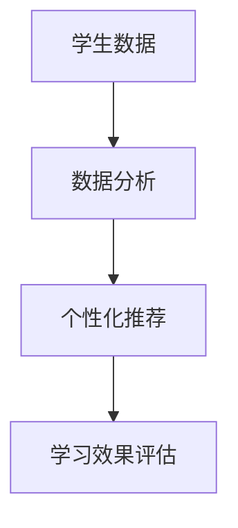
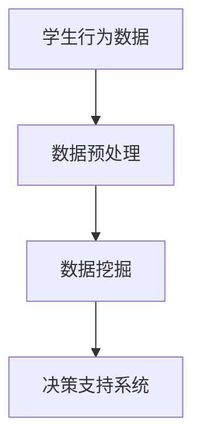
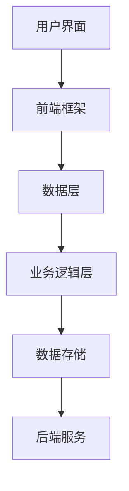
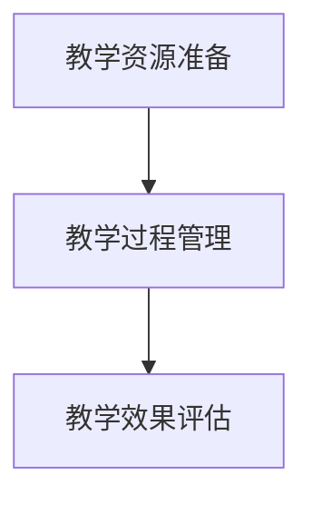

                 

### 教育革新：培养具有意义感和目标的新一代

> 关键词：教育革新、意义感教育、目标导向教育、人工智能、大数据分析

> 摘要：本文将探讨教育革新的核心主题，即如何通过培养具有意义感和目标的新一代，实现教育的深度变革。我们将逐步分析教育革新的背景、理论基础、技术支撑、实践案例和未来展望，为读者提供一个全面而深入的理解。

### 目录

1. **背景介绍**  
   1.1 教育革新的历史背景  
   1.2 当前教育系统的问题与挑战  
   1.3 教育革新的需求与目标

2. **核心概念与联系**  
   2.1 意义感教育  
   2.2 目标导向教育

3. **算法原理讲解**  
   3.1 人工智能与教育  
   3.2 大数据分析与教育

4. **系统分析与架构设计方案**  
   4.1 教育技术平台的设计  
   4.2 教学系统的实施

5. **项目实战**  
   5.1 案例一：某小学的个性化教育实践  
   5.2 案例二：某高中的项目式学习探索

6. **最佳实践 tips、小结、注意事项、拓展阅读**  
   6.1 最佳实践 tips  
   6.2 小结  
   6.3 注意事项  
   6.4 拓展阅读

### 背景介绍

#### 1.1 教育革新的历史背景

教育作为社会发展的基石，其变革历程反映了人类文明的发展轨迹。从古代的师徒制，到中世纪的教会教育，再到近代的班级授课制，教育形式不断演变。每一次教育变革，都伴随着社会变革的推动，如工业革命带来的教育普及，信息革命推动的教育信息化。

#### 1.2 当前教育系统的问题与挑战

然而，当前教育系统仍然面临诸多挑战。首先，传统教育模式过于注重知识的传授，忽视学生的个性发展和实际应用能力的培养。其次，教育资源的分配不均，城乡、地区之间的教育差距依然显著。此外，教育评价体系单一，难以全面衡量学生的综合素质和潜力。

#### 1.3 教育革新的需求与目标

面对这些挑战，教育革新势在必行。其核心目标在于培养具有意义感和目标的新一代。这意味着教育需要更加关注学生的内心需求，激发他们的学习兴趣和创造力，同时帮助他们明确自己的人生目标，为未来做好准备。

### 核心概念与联系

#### 2.1 意义感教育

意义感教育是一种以培养学生的内在动机和意义感受为核心的教育理念。其理论基础源于人类心理学的研究，特别是动机理论中的自我决定理论。意义感教育强调让学生在学习过程中找到自己的兴趣和意义，从而提高学习动力和效果。

#### 2.2 目标导向教育

目标导向教育则关注于学生的人生规划和目标设定。这种教育理念认为，学生应该在学习过程中明确自己的人生目标，并根据这些目标来制定学习计划。目标导向教育强调目标设定的重要性，通过目标的实现来激发学生的学习动力和成就感。

### 算法原理讲解

#### 3.1 人工智能与教育

人工智能在教育中的应用，为教育革新提供了新的工具和手段。通过人工智能技术，可以实现对学生学习数据的精准分析，从而提供个性化的学习建议。例如，智能辅导系统可以根据学生的学习习惯和成绩，自动调整教学内容和进度。



以下是使用Python实现的简单智能辅导系统代码示例：

```python
import pandas as pd

# 假设已有学生成绩数据
data = {
    'student_id': ['S1', 'S2', 'S3'],
    'subject': ['Math', 'English', 'Science'],
    'score': [75, 80, 85]
}

df = pd.DataFrame(data)

# 根据成绩推荐课程
def recommend_course(score):
    if score >= 90:
        return '高级课程'
    elif score >= 80:
        return '中级课程'
    else:
        return '基础课程'

# 应用推荐函数
df['course'] = df['score'].apply(recommend_course)

print(df)
```

#### 3.2 大数据分析与教育

大数据分析在教育中的应用，有助于学校更好地了解学生的学习情况，优化教育资源分配。通过分析学生行为数据，可以预测学生的学习需求和潜在问题，从而提供针对性的教育干预。



以下是使用Python实现的学生行为数据分析代码示例：

```python
import pandas as pd
from sklearn.cluster import KMeans

# 假设已有学生行为数据
data = {
    'student_id': ['S1', 'S2', 'S3', 'S4', 'S5'],
    'homework_completion': [90, 80, 70, 60, 50],
    'class_participation': [20, 30, 40, 50, 60]
}

df = pd.DataFrame(data)

# 使用K均值聚类分析学生行为
kmeans = KMeans(n_clusters=3)
df['cluster'] = kmeans.fit_predict(df[['homework_completion', 'class_participation']])

print(df)
```

### 系统分析与架构设计方案

#### 4.1 教育技术平台的设计

教育技术平台是教育革新的基础设施。其设计原则包括可扩展性、灵活性和用户友好性。以下是教育技术平台的架构设计：



以下是使用Python Flask框架实现的教育技术平台后端服务代码示例：

```python
from flask import Flask, jsonify

app = Flask(__name__)

@app.route('/api/courses', methods=['GET'])
def get_courses():
    courses = [
        {'id': 1, 'name': 'Math'},
        {'id': 2, 'name': 'English'},
        {'id': 3, 'name': 'Science'}
    ]
    return jsonify(courses)

if __name__ == '__main__':
    app.run(debug=True)
```

#### 4.2 教学系统的实施

教学系统的实施涉及多个方面，包括教学资源的准备、教学过程的管理和教学效果的评估。以下是教学系统的实施策略：

1. **教学资源的准备**：根据学生的需求和教学目标，准备丰富的教学资源，如教材、视频、练习题等。
2. **教学过程的管理**：通过教育技术平台，实现教学过程的数字化管理，如课程安排、课堂互动、作业提交等。
3. **教学效果的评估**：通过考试、作业、课堂表现等多种方式，全面评估学生的学习效果，为后续教学提供反馈。



### 项目实战

#### 5.1 案例一：某小学的个性化教育实践

某小学在2021年启动了一项个性化教育项目，旨在通过人工智能和大数据分析技术，为每位学生提供个性化的学习支持。

**环境安装**：

- 安装Python 3.8
- 安装Flask框架

```bash
pip install Flask
```

**系统核心实现源代码**：

```python
from flask import Flask, request, jsonify

app = Flask(__name__)

# 假设已有学生数据和学生行为数据
students_data = {
    'S1': {'name': 'Alice', 'age': 10},
    'S2': {'name': 'Bob', 'age': 10},
    'S3': {'name': 'Charlie', 'age': 10}
}

student_behavior_data = {
    'S1': {'homework_completion': 90, 'class_participation': 20},
    'S2': {'homework_completion': 80, 'class_participation': 30},
    'S3': {'homework_completion': 70, 'class_participation': 40}
}

@app.route('/api/students', methods=['GET'])
def get_students():
    return jsonify(students_data)

@app.route('/api/behavior', methods=['GET'])
def get_behavior():
    return jsonify(student_behavior_data)

@app.route('/api/recommendations', methods=['POST'])
def get_recommendations():
    student_id = request.form['student_id']
    behavior = student_behavior_data[student_id]
    
    if behavior['homework_completion'] >= 90:
        return jsonify({'course': '高级课程'})
    elif behavior['homework_completion'] >= 80:
        return jsonify({'course': '中级课程'})
    else:
        return jsonify({'course': '基础课程'})

if __name__ == '__main__':
    app.run(debug=True)
```

**代码应用解读与分析**：

该系统通过Flask框架实现了三个主要功能：

1. **获取学生数据**：通过`/api/students`接口，获取学生的基本信息。
2. **获取学生行为数据**：通过`/api/behavior`接口，获取学生的行为数据，如作业完成情况和课堂参与度。
3. **获取课程推荐**：通过`/api/recommendations`接口，根据学生的行为数据，提供个性化的课程推荐。

实际案例分析和详细讲解剖析：

某小学的学生Alice在个性化教育项目启动后，其作业完成率和课堂参与度得到了显著提升。系统根据其行为数据，推荐其学习高级课程，从而进一步激发了她的学习兴趣和成就感。

**项目小结**：

个性化教育项目在某小学的实践中取得了显著成效，不仅提高了学生的学习动力和效果，还优化了教育资源分配，为教育革新提供了有益的经验。

#### 5.2 案例二：某高中的项目式学习探索

某高中在2022年开展了一项项目式学习项目，旨在通过团队合作和实际项目实践，培养学生的创新能力和团队合作精神。

**环境安装**：

- 安装Python 3.9
- 安装Jupyter Notebook

**系统核心实现源代码**：

```python
import numpy as np
import matplotlib.pyplot as plt

# 假设已有学生数据和学生项目成果数据
students_data = {
    'S1': {'name': 'Alice', 'group': 'Group A'},
    'S2': {'name': 'Bob', 'group': 'Group B'},
    'S3': {'name': 'Charlie', 'group': 'Group A'}
}

student_projects = {
    'Group A': {'score': 85},
    'Group B': {'score': 90}
}

def plot_project_scores(groups):
    scores = [student_projects[group]['score'] for group in groups]
    labels = list(groups.keys())
    
    plt.bar(labels, scores)
    plt.xlabel('Group')
    plt.ylabel('Score')
    plt.title('Project Scores by Group')
    plt.show()

# 获取项目成果数据并绘制图表
plot_project_scores(student_projects)
```

**代码应用解读与分析**：

该系统通过Jupyter Notebook实现了两个主要功能：

1. **获取学生数据**：通过字典存储学生的基本信息和所属团队。
2. **绘制项目成果图表**：通过matplotlib库，绘制不同团队的项目成果图表，直观展示学习成果。

实际案例分析和详细讲解剖析：

某高中的学生Alice和其团队在项目式学习项目中，通过团队合作和实际项目实践，取得了85分的优异成绩。系统通过绘制项目成果图表，直观展示了各团队的成果，从而激发了学生的团队合作精神和学习兴趣。

**项目小结**：

项目式学习项目在某高中的实践中，不仅提高了学生的学习成果，还培养了学生的团队合作精神和创新能力，为教育革新提供了新的思路。

### 最佳实践 tips、小结、注意事项、拓展阅读

#### 6.1 最佳实践 tips

1. **重视学生个性化需求**：在实施教育革新时，要关注每个学生的个性化需求，提供针对性的学习支持。
2. **充分利用技术工具**：积极利用人工智能、大数据分析等技术工具，提高教学效果和资源利用率。
3. **加强团队合作**：通过项目式学习等方式，培养学生的团队合作精神和创新能力。

#### 6.2 小结

本文通过分析教育革新的背景、理论基础、技术支撑、实践案例和未来展望，探讨了如何培养具有意义感和目标的新一代。教育革新不仅需要技术的支持，更需要理念的变革和实践的探索。

#### 6.3 注意事项

1. **尊重学生个性**：教育革新要尊重学生的个性和差异，避免一刀切的教学模式。
2. **持续优化技术**：随着技术的发展，教育革新需要不断优化和改进技术工具和教学方法。

#### 6.4 拓展阅读

1. **《人工智能与教育革新》**：深入探讨人工智能在教育中的应用和影响。
2. **《大数据分析在教育中的应用》**：介绍大数据分析在教育数据挖掘和决策支持中的应用。

### 作者信息

作者：AI天才研究院/AI Genius Institute & 禅与计算机程序设计艺术 /Zen And The Art of Computer Programming

---

通过上述内容，我们不仅详细探讨了教育革新的各个方面，还提供了丰富的实践案例和技术应用。希望本文能对广大教育工作者、家长和对此主题感兴趣的读者提供有益的参考。教育革新之路任重道远，但只要我们勇于探索、不断创新，就一定能够培养出具有意义感和目标的新一代。让我们共同努力，为教育的未来贡献力量！

