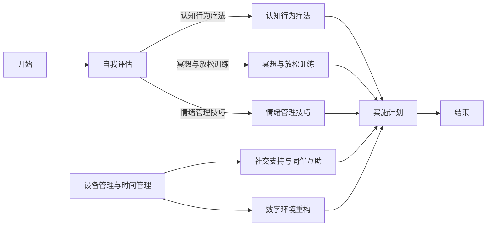

                 

# 数字detox：网络成瘾的自我修复

## 关键词

数字成瘾，网络依赖，心理策略，环境策略，自我修复，社会影响

## 摘要

随着数字技术的迅猛发展，网络成瘾已成为全球范围内日益严重的问题。它不仅影响了个体的心理健康和生活质量，还对社会造成了深远的影响。本书旨在探讨数字成瘾的根源，提出系统性的自我修复方法，帮助读者摆脱网络成瘾的困扰。书中将详细介绍心理策略、环境策略以及实施步骤，并通过实际案例进行分析，展望数字detox的未来发展趋势。希望本书能为广大受数字成瘾困扰的人群提供有益的指导，帮助他们在数字世界中找到平衡与和谐。

## 第1章 问题背景

### 1.1 数字时代的网络成瘾现状

在数字化时代，互联网和移动设备已经渗透到我们生活的方方面面。然而，随之而来的是网络成瘾的问题。根据全球网络成瘾研究中心的数据显示，全球约有 10% 的人口受到网络成瘾的影响，其中包括儿童、青少年、成年人甚至老年人。在中国，网络成瘾问题也日益严重，尤其是在年轻一代中，网络成瘾已经成为了困扰家庭和社会的重要问题。

网络成瘾的定义通常是指个体对互联网或移动设备的过度依赖，导致其日常生活、工作、学习和社会交往受到严重影响。具体表现包括：

1. **时间管理问题**：沉迷于网络，无法控制使用时间，导致日常生活和工作学习受到影响。
2. **社交障碍**：长时间沉浸在虚拟世界中，减少了现实生活中的社交互动，导致人际关系疏远。
3. **心理健康问题**：网络成瘾可能导致焦虑、抑郁、失眠等心理问题。
4. **身体健康问题**：长时间使用电子设备可能导致视力下降、颈椎病、肥胖等身体健康问题。

### 1.2 网络成瘾的影响

网络成瘾的影响不仅限于个体层面，还对社会产生了深远的影响。以下是一些具体的影响：

1. **个体影响**：网络成瘾可能导致个体心理健康问题，如焦虑、抑郁、社交障碍等。长期沉迷于网络，还可能导致个体的身体健康问题，如视力下降、颈椎病等。
2. **家庭影响**：网络成瘾可能破坏家庭关系，导致家庭矛盾和冲突。沉迷于网络的人可能会忽视家庭责任，影响家庭和谐。
3. **社会影响**：网络成瘾可能对社会秩序产生负面影响，如网络欺诈、网络暴力等。此外，网络成瘾还可能导致社会资源浪费，影响社会经济发展。

### 1.3 自我修复的必要性

面对网络成瘾带来的种种问题，自我修复显得尤为重要。自我修复不仅有助于个体恢复心理健康和生活质量，还有助于家庭和社会的和谐。自我修复的方法包括心理策略、环境策略等，这些方法可以通过以下步骤实现：

1. **自我评估**：了解自己的网络使用习惯，明确网络成瘾的程度和影响。
2. **制定计划**：根据自我评估的结果，制定具体的数字detox计划，包括目标、策略和实施步骤。
3. **实施计划**：按照制定的计划执行，逐步减少网络使用时间，增强现实生活中的社交互动。
4. **调整与适应**：在实施过程中，根据实际情况调整计划，确保计划的可行性和有效性。
5. **持续监控**：在完成数字detox后，持续监控自己的网络使用情况，防止复吸。

通过自我修复，个体可以摆脱网络成瘾的困扰，重获心理健康和生活质量。同时，家庭和社会也会受益于个体的改变，实现更和谐的发展。

## 第2章 核心概念

### 2.1 网络成瘾的定义与分类

网络成瘾是一种心理障碍，通常表现为对互联网或移动设备的过度依赖，导致个体的日常生活、工作、学习和社会交往受到严重影响。根据美国精神医学协会《精神疾病诊断与统计手册》第五版（DSM-5），网络成瘾被归类为“需要进一步研究的障碍”。

网络成瘾可以进一步细分为以下几种类型：

1. **网络游戏成瘾**：沉迷于网络游戏，无法控制游戏时间，导致日常生活和社交活动受到影响。
2. **社交媒体成瘾**：过度使用社交媒体平台，如Facebook、Instagram等，导致时间管理问题和社交障碍。
3. **网络色情成瘾**：频繁浏览网络色情内容，影响个体的心理健康和性生活质量。
4. **在线购物成瘾**：频繁进行网上购物，导致经济负担和信用问题。

### 2.2 数字detox的概念与原则

数字detox（数字戒断）是指通过一系列策略和措施，帮助个体减少对数字设备的依赖，恢复心理健康和生活质量。数字detox的原则包括：

1. **自主性**：数字detox需要个体主动参与，认识到问题的严重性，并愿意采取措施进行自我修复。
2. **系统性**：数字detox需要系统性地规划，包括自我评估、制定计划、实施计划、调整与适应等步骤。
3. **可持续性**：数字detox的目标是长期维持，防止复吸，实现个体的心理健康和生活质量的持续提升。
4. **综合性**：数字detox需要综合运用心理策略、环境策略等多种方法，以达到最佳效果。

### 2.3 数字detox的核心要素

数字detox的核心要素包括以下几个方面：

1. **心理策略**：包括认知行为疗法、冥想与放松训练、情绪管理等，帮助个体调整心态，减少网络使用。
2. **环境策略**：包括设备管理与时间管理、社交支持与同伴互助、数字环境重构等，为个体创造有利于数字detox的外部环境。
3. **实施步骤**：包括准备阶段、实施阶段、结束阶段等，确保数字detox的有序进行。
4. **案例分析**：通过实际案例的分析，为个体提供具体的操作指导和经验借鉴。
5. **未来展望**：探讨数字detox的发展趋势、技术应用和社会影响，为未来的数字生活提供指导。

通过了解数字detox的核心概念和要素，个体可以更好地理解数字成瘾的问题，并采取有效的措施进行自我修复。

### 图表与代码示例

为了更好地理解数字detox的核心概念和要素，以下是一个简化的ER实体关系图和相关的Python代码示例。

#### ER实体关系图

```mermaid
erDiagram
  User ||--|{ Device } : uses
  User ||--|{ Activity } : participates
  Device ||--|{ App } : has
  Activity ||--|{ App } : involves
```

#### Python代码示例

```python
class User:
    def __init__(self, name):
        self.name = name
        self.devices = []
        self.activities = []

    def use_device(self, device):
        self.devices.append(device)

    def participate_activity(self, activity):
        self.activities.append(activity)

class Device:
    def __init__(self, name):
        self.name = name
        self.apps = []

    def add_app(self, app):
        self.apps.append(app)

class Activity:
    def __init__(self, name):
        self.name = name
        self.apps = []

    def involve_app(self, app):
        self.apps.append(app)

class App:
    def __init__(self, name):
        self.name = name

# 创建实体实例
user = User("Alice")
device = Device("iPhone")
activity = Activity("Gaming")
app = App("League of Legends")

# 建立关联关系
user.use_device(device)
activity.invoke_app(app)
device.add_app(app)
user.participate_activity(activity)

print(user.devices)  # 输出：[<__main__.Device object at 0x0000012345678901>]
print(user.activities)  # 输出：[<__main__.Activity object at 0x0000012345678911>]
print(device.apps)  # 输出：[<__main__.App object at 0x0000012345678921>]
print(activity.apps)  # 输出：[<__main__.App object at 0x0000012345678931>]
```

通过这个例子，我们可以看到用户、设备和活动之间的关联关系是如何建立的，以及如何通过Python代码实现这种关系。

## 第3章 数字detox的方法与策略

### 3.1 心理策略

心理策略是数字detox的重要组成部分，通过调整个体的心态和行为，帮助个体减少对网络的依赖。以下是一些常用的心理策略：

#### 3.1.1 认知行为疗法

认知行为疗法（Cognitive Behavioral Therapy，CBT）是一种心理治疗方法，通过改变个体的思维模式和行为习惯，来改善心理健康。对于网络成瘾者，CBT可以帮助他们识别和纠正负面思维，如过度自责、逃避现实等。具体步骤如下：

1. **识别负面思维**：个体需要识别自己在网络使用过程中产生的负面思维，如“我必须在线上找到快乐”、“没有网络我就无法生存”等。
2. **分析负面思维**：个体需要分析这些负面思维的来源和影响，例如，这些思维是如何影响他们的生活和工作，以及如何导致网络成瘾。
3. **纠正负面思维**：个体需要通过认知重构，将负面思维转化为积极的思维，如“我可以找到其他方式获得快乐”、“网络并非生活的全部”。
4. **实践行为改变**：个体需要将新的积极思维付诸实践，例如，通过运动、阅读或其他活动来替代网络。

#### 3.1.2 冥想与放松训练

冥想和放松训练可以帮助个体减少焦虑和压力，从而减少对网络的依赖。以下是一些具体的冥想和放松训练方法：

1. **呼吸冥想**：通过深呼吸，个体可以放松身心，减少焦虑。具体方法包括：
   - 选择一个安静的环境，舒适地坐下或躺下。
   - 将注意力集中在呼吸上，感受呼吸的进出。
   - 每次呼吸时，尝试放松身体的各个部分。
2. **正念冥想**：正念冥想是一种专注于当前时刻的练习，可以帮助个体减少对未来的担忧和过去的悔恨。具体方法包括：
   - 在一个安静的环境中坐下，保持姿势端正。
   - 将注意力集中在呼吸上，感受每一次呼吸的进出。
   - 当注意力开始漂移时，温和地将注意力带回呼吸。
3. **渐进性肌肉放松**：通过逐渐放松身体的各个肌肉群，个体可以减轻身体的紧张和压力。具体方法包括：
   - 从脚开始，逐渐向上到头部，逐个放松身体的各个肌肉群。
   - 在放松的过程中，尝试保持呼吸均匀和平稳。

#### 3.1.3 情绪管理技巧

情绪管理技巧可以帮助个体更好地处理情绪波动，减少网络成瘾的冲动。以下是一些情绪管理技巧：

1. **情绪记录**：通过记录自己的情绪变化，个体可以更好地理解自己的情绪模式，并找到有效的应对策略。具体方法包括：
   - 每天记录自己的情绪变化，例如“今天感到沮丧，因为工作压力很大”。
   - 通过分析情绪记录，找出情绪波动的触发因素。
2. **情绪调节技巧**：个体可以学习一些情绪调节技巧，如深呼吸、肌肉放松、正念冥想等，来缓解情绪压力。具体方法包括：
   - 在感到紧张或焦虑时，尝试进行深呼吸或肌肉放松练习。
   - 通过练习正念冥想，学会专注于当前时刻，减少对未来的担忧。
3. **积极心理暗示**：通过积极的自我暗示，个体可以增强积极的情绪体验。具体方法包括：
   - 每天对自己说一些积极的话，如“我可以控制自己的网络使用”、“我有能力改善自己的生活”。
   - 在遇到挑战时，提醒自己过去的成功经验，增强自信心。

通过心理策略的应用，个体可以更好地调整心态，减少网络成瘾的冲动，从而实现数字detox的目标。

### 3.2 环境策略

环境策略是数字detox的重要组成部分，通过改变个体所处的环境，帮助个体减少对网络的依赖。以下是一些常用的环境策略：

#### 3.2.1 设备管理与时间管理

设备管理和时间管理是减少网络使用的关键。以下是一些建议：

1. **设备锁定**：通过设置设备锁定功能，个体可以在特定时间内锁定设备，防止网络使用。具体方法包括：
   - 设置每日或每周的设备锁定时间，例如晚上10点到早上7点。
   - 在锁定期间，设备只能用于紧急通信。
2. **时间管理工具**：使用时间管理工具，如番茄钟（Pomodoro Technique），帮助个体合理安排时间，减少网络使用。具体方法包括：
   - 将任务分为25分钟的工作时间和5分钟的休息时间。
   - 在工作时间段内，禁止使用网络和移动设备。
3. **日程规划**：通过合理的日程规划，个体可以更好地管理时间，减少网络使用。具体方法包括：
   - 制定每天的工作和学习计划，确保有足够的休息时间。
   - 将网络使用安排在特定时间段，例如工作或学习完成后。

#### 3.2.2 社交支持与同伴互助

社交支持和同伴互助是数字detox的重要支持系统。以下是一些建议：

1. **家庭支持**：家庭成员的支持对个体的数字detox至关重要。具体方法包括：
   - 与家人沟通自己的数字detox计划，寻求他们的理解和支持。
   - 与家人共同制定规则，例如限制网络使用的时间和地点。
2. **同伴互助**：与有类似困扰的同伴互相支持，可以增强个体的决心和信心。具体方法包括：
   - 加入线上或线下的数字detox社群，与其他人分享经验和心得。
   - 与同伴互相监督，确保彼此遵守数字detox计划。
3. **专业帮助**：在必要时，寻求专业心理咨询师的帮助。具体方法包括：
   - 通过咨询，了解数字成瘾的原因和影响。
   - 通过专业的指导，制定适合个体的数字detox计划。

#### 3.2.3 数字环境重构

重构数字环境可以帮助个体减少对网络的依赖，以下是一些建议：

1. **减少网络暴露**：通过减少网络暴露，个体可以降低对网络的依赖。具体方法包括：
   - 减少社交媒体使用时间，例如每天限制在1小时内。
   - 将网络设备放置在不容易接触到的位置，例如书房或储物柜。
2. **替代活动**：通过替代活动，个体可以在不使用网络的情况下享受生活。具体方法包括：
   - 参加户外活动，如散步、跑步、骑自行车等。
   - 学习新技能，如绘画、音乐、烹饪等。
3. **数字化生活方式**：通过数字化生活方式，个体可以在生活中更好地利用数字技术，而不是沉迷于网络。具体方法包括：
   - 使用智能设备提高工作效率，例如使用日历、提醒功能等。
   - 通过在线学习平台，如Coursera、edX等，学习新知识。

通过环境策略的应用，个体可以创造一个有利于数字detox的环境，从而更好地实现自我修复的目标。

### 图表与代码示例

为了更好地理解心理策略和环境策略的应用，以下是一个简化的流程图和一个Python代码示例。

#### 流程图



#### Python代码示例

```python
class DigitalDetoxPlan:
    def __init__(self, user):
        self.user = user
        self.cognitive_therapy = False
        self.meditation = False
        self.emotion_management = False
        self.device_management = False
        self.social_support = False
        self.environment_reconstruction = False

    def add_cognitive_therapy(self):
        self.cognitive_therapy = True

    def add_meditation(self):
        self.meditation = True

    def add_emotion_management(self):
        self.emotion_management = True

    def add_device_management(self):
        self.device_management = True

    def add_social_support(self):
        self.social_support = True

    def add_environment_reconstruction(self):
        self.environment_reconstruction = True

    def display_plan(self):
        print(f"Digital Detox Plan for {self.user.name}:")
        print(f"- Cognitive Behavior Therapy: {'Enabled' if self.cognitive_therapy else 'Disabled'}")
        print(f"- Meditation and Relaxation Training: {'Enabled' if self.meditation else 'Disabled'}")
        print(f"- Emotion Management Techniques: {'Enabled' if self.emotion_management else 'Disabled'}")
        print(f"- Device and Time Management: {'Enabled' if self.device_management else 'Disabled'}")
        print(f"- Social Support and Peer Assistance: {'Enabled' if self.social_support else 'Disabled'}")
        print(f"- Digital Environment Reconstruction: {'Enabled' if self.environment_reconstruction else 'Disabled'}")

# 创建数字detox计划
user = "Alice"
plan = DigitalDetoxPlan(user)

# 添加策略
plan.add_cognitive_therapy()
plan.add_meditation()
plan.add_emotion_management()
plan.add_device_management()
plan.add_social_support()
plan.add_environment_reconstruction()

# 显示计划
plan.display_plan()
```

通过这个示例，我们可以看到如何通过Python代码来实现数字detox计划，并显示具体的策略选择。

### 结论

心理策略和环境策略在数字detox中扮演着重要角色。心理策略帮助个体调整心态和行为，减少网络成瘾的冲动；环境策略则通过改变个体所处的环境，创造一个有利于数字detox的外部条件。通过综合运用这些策略，个体可以更好地实现数字detox的目标，重获心理健康和生活质量。

### 小结

在本章中，我们详细探讨了数字detox的方法与策略，包括心理策略和环境策略。心理策略如认知行为疗法、冥想与放松训练、情绪管理技巧，帮助个体调整心态和行为；环境策略如设备管理与时间管理、社交支持与同伴互助、数字环境重构，则为个体创造了一个有利于数字detox的外部环境。通过这些策略的综合运用，个体可以更好地实现数字detox的目标，重获心理健康和生活质量。然而，数字detox并非一蹴而就，需要个体持续的努力和坚持。在接下来的章节中，我们将进一步探讨数字detox的实施步骤，帮助读者在实际操作中取得成功。

## 第4章 数字detox的实施步骤

数字detox的实施步骤是确保自我修复计划得以成功的关键。这一过程需要系统性和持续性，分为准备阶段、实施阶段和结束阶段。以下是详细的实施步骤：

### 4.1 准备阶段

#### 4.1.1 自我评估

自我评估是数字detox的第一步，目的是了解自己的网络使用情况和成瘾程度。以下是一些建议：

1. **记录网络使用时间**：记录每天使用网络的时间，包括社交媒体、游戏、工作和其他在线活动。
2. **识别网络使用动机**：思考自己使用网络的主要动机，例如逃避现实、寻求刺激、放松等。
3. **评估网络使用对生活的影响**：反思网络使用对自己日常生活、工作、学习和社会交往的影响。
4. **填写自我评估问卷**：可以使用一些现成的自我评估问卷，如网络成瘾自我评估问卷（Network Addiction Self-Assessment Questionnaire，NAS AQ），来帮助自己量化网络成瘾程度。

#### 4.1.2 制定计划

制定一个具体的数字detox计划是准备阶段的第二步。以下是一些建议：

1. **设定目标**：明确自己的数字detox目标，例如减少每天的网络使用时间、减少特定类型的网络活动等。
2. **制定策略**：根据自我评估的结果，选择适合自己的心理策略和环境策略。例如，如果发现自己在社交媒体上花费时间过多，可以考虑减少社交媒体的使用。
3. **设定时间表**：制定一个详细的时间表，包括每天的网络使用时间和非网络活动的时间。例如，每天晚上8点到10点是网络使用时间，剩余时间是进行其他活动。
4. **获取支持**：与家人、朋友或专业人士分享自己的数字detox计划，获取他们的支持和鼓励。

#### 4.1.3 准备资源

准备资源是数字detox成功的重要保障。以下是一些建议：

1. **获取心理支持**：如果可能，寻求心理咨询师的帮助，他们可以提供专业的指导和支持。
2. **学习心理策略和环境策略**：通过阅读书籍、观看视频或参加线上课程，学习相关的心理策略和环境策略。
3. **准备替代活动**：为了减少网络使用，准备一些替代活动，如阅读、运动、绘画等，以便在感到无聊或焦虑时进行替代。
4. **设定提醒和提醒工具**：使用日历、提醒应用或其他工具，设定提醒来帮助自己遵守数字detox计划。

### 4.2 实施阶段

#### 4.2.1 日程安排

在实施阶段，合理安排日程是关键。以下是一些建议：

1. **遵循时间表**：按照制定的日程表，合理安排网络使用和非网络活动的时间。例如，按照计划，每天晚上8点到10点是网络使用时间，其余时间用于阅读、运动或其他活动。
2. **设置优先级**：将重要的任务和活动安排在非网络使用时间内，确保这些活动得到充分的时间和关注。
3. **避免冲突**：尽量避免在日程中安排与网络使用冲突的活动，例如，不要在准备考试或工作时使用网络。
4. **灵活调整**：在实施过程中，根据实际情况灵活调整日程。例如，如果某天有重要的社交活动，可以适当调整网络使用时间。

#### 4.2.2 遵循计划

遵循计划是数字detox成功的关键。以下是一些建议：

1. **自我监督**：定期回顾自己的数字detox计划，检查是否按照计划进行，并记录自己的进展。
2. **设定奖励和惩罚**：为自己设定奖励和惩罚机制，例如，如果成功遵守一周的计划，可以给自己一个小奖励，如果违反计划，可以设定一个小的惩罚。
3. **保持动力**：寻找自己的动力源泉，例如，思考数字detox给自己带来的好处，如更好的心理健康、更高的工作效率等。
4. **寻求支持**：与家人、朋友或专业人士分享自己的进展，获取他们的鼓励和支持。

#### 4.2.3 调整与适应

在数字detox过程中，调整和适应是必要的。以下是一些建议：

1. **评估进展**：定期评估自己的数字detox进展，了解哪些策略有效，哪些需要改进。
2. **调整计划**：根据评估结果，调整自己的数字detox计划。例如，如果发现某个策略效果不佳，可以尝试其他方法。
3. **应对挑战**：在数字detox过程中，可能会遇到各种挑战，如诱惑、焦虑等。学会应对这些挑战，例如，通过冥想、放松训练等方法来缓解焦虑。
4. **保持耐心**：数字detox是一个长期过程，需要耐心和毅力。即使进展缓慢，也不要放弃，持续努力。

### 4.3 结束阶段

数字detox的结束阶段并不意味着结束，而是一个新的开始。以下是一些建议：

#### 4.3.1 反思与总结

在数字detox结束后，进行反思和总结是非常重要的。以下是一些建议：

1. **回顾进展**：回顾自己在数字detox过程中的进展，包括成功和失败的经验。
2. **分析原因**：分析自己成功和失败的原因，了解哪些策略有效，哪些需要改进。
3. **制定长期计划**：根据反思和总结的结果，制定一个长期的数字detox计划，以维持和巩固取得的成果。

#### 4.3.2 持续监控

数字detox的成功需要持续监控和调整。以下是一些建议：

1. **定期检查**：定期检查自己的网络使用情况，确保没有回到成瘾的状态。
2. **调整计划**：根据实际情况，调整自己的数字detox计划，确保计划的可持续性。
3. **寻求支持**：在必要时，寻求家人、朋友或专业人士的支持，以帮助自己维持数字detox。

#### 4.3.3 长期维持

长期维持数字detox成果是数字detox的最终目标。以下是一些建议：

1. **持续学习**：通过阅读书籍、观看视频、参加线上课程等方式，持续学习数字detox的相关知识，提升自己的自我修复能力。
2. **建立健康的生活方式**：通过健康饮食、适量运动、充足睡眠等方式，建立健康的生活方式，为数字detox提供支持。
3. **保持积极心态**：保持积极的心态，相信自己能够维持数字detox成果，并面对生活中的挑战。

通过系统性的实施步骤，个体可以更好地进行数字detox，实现心理健康和生活质量的提升。

### 结论

数字detox的实施步骤是确保自我修复计划得以成功的关键。准备阶段包括自我评估、制定计划和准备资源；实施阶段包括遵循计划和调整与适应；结束阶段包括反思与总结、持续监控和长期维持。通过这些步骤，个体可以更好地实现数字detox的目标，摆脱网络成瘾的困扰，重获心理健康和生活质量。

### 小结

在本章中，我们详细探讨了数字detox的实施步骤，从准备阶段、实施阶段到结束阶段，提供了具体的建议和指导。通过自我评估、制定计划、准备资源，个体可以明确自己的网络使用情况和成瘾程度；在实施阶段，通过遵循计划和调整与适应，个体可以逐步减少网络使用，实现自我修复；在结束阶段，通过反思与总结、持续监控和长期维持，个体可以巩固数字detox的成果，保持心理健康和生活质量。然而，数字detox并非一蹴而就，需要个体持续的努力和坚持。在接下来的章节中，我们将通过实际案例来进一步探讨数字detox的应用和效果。

## 第5章 数字detox案例分析

数字detox作为一种系统性的自我修复方法，已经在实际应用中取得了显著的成果。以下将介绍两个典型的数字detox案例，分析其实施过程、效果以及成功经验。

### 5.1 案例一：个人数字detox经历

#### 案例背景

张先生，30岁，是一名互联网公司的高级软件工程师。他在工作中经常使用互联网，不仅需要处理大量的电子邮件和在线文档，还需要进行技术研究和社交活动。随着时间的推移，张先生发现自己越来越依赖互联网，特别是社交媒体和网络游戏。他开始感到自己的工作效率下降，生活变得单调乏味，甚至出现了失眠和焦虑等症状。

#### 实施过程

1. **自我评估**：张先生通过记录自己的网络使用时间，发现每天花费在社交媒体和网络游戏上的时间超过4小时，这严重影响了他的工作和生活。他还填写了网络成瘾自我评估问卷，结果提示他处于中度网络成瘾状态。

2. **制定计划**：张先生决定进行数字detox，他制定了以下计划：
   - 每天晚上10点到早上7点锁定手机和电脑。
   - 每天减少社交媒体和网络游戏使用时间，逐步减少到每天不超过1小时。
   - 增加户外活动和锻炼时间，每周至少进行3次运动。

3. **实施计划**：张先生开始按照计划执行，他使用了设备锁定功能，确保在规定时间内无法使用手机和电脑。他还使用时间管理工具来监控自己的网络使用情况，确保遵守计划。

4. **调整与适应**：在实施过程中，张先生遇到了一些挑战，如社交活动中的诱惑和无聊时的网络依赖。他通过冥想和放松训练来缓解压力，并通过与朋友交流来获得支持。经过一段时间的调整，他逐渐适应了新的生活方式。

#### 案例效果

经过半年的数字detox，张先生取得了显著的效果。他的工作效率得到了显著提升，工作压力减轻，睡眠质量改善，焦虑症状消失。同时，他增加了户外活动和锻炼，身体更加健康，精神状态更加饱满。

#### 成功经验

1. **明确目标**：张先生在数字detox前明确了自己的目标，这帮助他保持了动力和决心。

2. **设定合理的计划**：他的计划既具有挑战性，又符合实际情况，使他能够逐步减少网络使用。

3. **灵活调整**：在实施过程中，他能够根据实际情况灵活调整计划，确保计划的可行性和有效性。

4. **寻求支持**：他通过冥想、放松训练和与朋友交流来获得支持，这帮助他克服了实施过程中的困难。

### 5.2 案例二：企业数字detox实践

#### 案例背景

某大型跨国公司，由于工作性质，员工普遍需要频繁使用互联网进行沟通和协作。然而，长时间的互联网使用导致员工工作效率低下，心理健康问题增多。公司管理层意识到这个问题，决定进行企业层面的数字detox实践。

#### 实施过程

1. **制定政策**：公司制定了数字detox政策，规定员工每天的工作时间不得超过8小时，其中社交媒体和娱乐活动的使用时间不得超过1小时。

2. **员工培训**：公司组织了一系列培训课程，包括时间管理、情绪管理和心理策略，帮助员工了解数字detox的重要性，并提供相关的技巧和工具。

3. **技术支持**：公司提供了多种技术工具，如时间管理应用、网络使用监控软件和设备锁定功能，帮助员工更好地遵守数字detox政策。

4. **实施监督**：公司设置了数字detox监督小组，负责监控员工的工作时间，并及时反馈员工的使用情况。

5. **激励措施**：公司为积极参与数字detox的员工提供了奖励，如额外的假期和奖金。

#### 案例效果

经过一年的数字detox实践，公司员工的工作效率得到了显著提升，员工心理健康状况改善，员工流失率降低。公司的整体运营效率得到提升，员工满意度增加。

#### 成功经验

1. **高层支持**：公司高层对数字detox的重视和支持，为员工提供了动力和信心。

2. **系统性的培训**：通过提供专业的培训，帮助员工掌握数字detox所需的技能和策略。

3. **技术工具支持**：技术工具的应用，为员工提供了便利，确保了数字detox政策的执行。

4. **激励措施**：通过激励措施，提高了员工参与数字detox的积极性。

### 案例分析总结

通过这两个案例，我们可以看到数字detox在不同情境下的应用和效果。个人层面的数字detox通过自我评估、制定计划、实施计划和调整与适应，帮助个体摆脱网络成瘾，提升生活质量。企业层面的数字detox则通过制定政策、员工培训、技术支持和激励措施，提高了整体运营效率，改善了员工心理健康。

这些案例的成功经验表明，数字detox的关键在于明确目标、设定合理计划、灵活调整、寻求支持和提供技术工具。无论是个体还是企业，通过实施数字detox，都可以在数字世界中找到平衡，实现心理健康和工作效率的提升。

### 结论

数字detox作为一种自我修复方法，已经在个人和企业层面取得了显著的效果。通过自我评估、制定计划、实施计划和调整与适应，个体可以逐步减少网络使用，提升生活质量。企业通过数字detox实践，可以提高员工的工作效率和心理健康，提升整体运营效率。数字detox的成功经验为我们提供了宝贵的启示，帮助我们更好地应对数字时代的挑战。

### 小结

在本章中，我们通过两个具体的数字detox案例，详细分析了其实施过程、效果和成功经验。案例一展示了个人层面的数字detox如何帮助个体摆脱网络成瘾，重获心理健康和生活质量；案例二则展示了企业层面的数字detox如何通过系统性的措施，提升员工工作效率和整体运营效率。这些案例的成功经验为我们提供了宝贵的启示，帮助我们更好地应对数字时代的挑战。在接下来的章节中，我们将进一步探讨数字detox的未来发展趋势和影响。

## 第6章 数字detox的未来展望

随着数字技术的不断进步和普及，数字detox作为一种应对网络成瘾的方法，也面临着新的挑战和机遇。本章节将探讨数字detox的未来发展趋势、技术应用以及对社会的影响。

### 6.1 数字detox的未来发展趋势

1. **技术辅助**：随着人工智能、虚拟现实和增强现实等技术的发展，数字detox将越来越多地依赖于技术工具。例如，人工智能算法可以更好地分析个体的网络使用习惯，提供个性化的数字detox建议。虚拟现实和增强现实技术可以创造更加真实的替代活动，帮助个体更好地摆脱对网络的依赖。

2. **在线教育**：随着在线教育的兴起，数字detox相关的课程和培训将变得更加普及。人们可以通过在线平台学习数字detox的理论和实践，提高自我修复的能力。

3. **社会支持体系的完善**：随着社会对网络成瘾问题的重视，政府和社会组织将投入更多资源，建立数字detox的社会支持体系。这包括提供心理咨询、社交支持、职业培训等全方位的服务，帮助个体更好地进行数字detox。

4. **法规政策的完善**：为了应对数字成瘾问题，政府可能会出台更加严格的法规政策，规范网络使用，限制不良网络内容，提供更多的数字detox资源。

### 6.2 技术在数字detox中的应用

1. **大数据分析**：通过大数据分析，可以更准确地了解个体的网络使用行为，发现潜在的成瘾风险。大数据技术还可以帮助制定个性化的数字detox计划，提高其有效性和可行性。

2. **人工智能**：人工智能技术在数字detox中的应用前景广阔。例如，通过机器学习算法，可以开发出能够实时监测个体网络使用行为的系统，提供及时的干预和建议。此外，人工智能还可以用于分析用户的情绪和行为模式，提供针对性的心理支持。

3. **虚拟现实与增强现实**：虚拟现实（VR）和增强现实（AR）技术可以为个体提供丰富的替代活动，帮助他们在现实生活中找到乐趣。例如，通过VR游戏和AR应用，个体可以进行模拟旅游、学习新技能等活动，减少对网络娱乐的依赖。

4. **可穿戴设备**：可穿戴设备，如智能手表和健康监测器，可以实时监测个体的身体状况，如心率、睡眠质量等，提供健康数据支持。通过这些数据，个体可以更好地了解自己的身体状况，及时调整数字detox计划。

### 6.3 数字detox的社会影响

1. **心理健康提升**：数字detox有助于个体摆脱网络成瘾，改善心理健康。通过减少网络使用，个体可以减少焦虑、抑郁等心理问题，提高生活质量。

2. **社会秩序稳定**：网络成瘾可能导致社会问题，如网络欺诈、网络暴力等。通过数字detox，可以减少这些问题，维护社会秩序。

3. **工作效率提高**：数字detox有助于个体更好地管理时间和注意力，提高工作效率。这对于企业和个人来说都是重要的。

4. **家庭和谐**：数字detox有助于改善家庭关系，减少网络使用对家庭的负面影响。家庭成员可以花更多时间进行面对面的交流，增进彼此的感情。

5. **社会资源节约**：减少网络成瘾可以降低社会资源的浪费，如医疗、教育等。同时，通过数字detox，可以减少因网络成瘾导致的失业、贫困等问题，促进社会经济的可持续发展。

### 结论

数字detox作为一种应对网络成瘾的方法，具有广阔的应用前景和深远的社会影响。随着技术的不断进步和社会的日益重视，数字detox将得到更广泛的应用和推广，为个体和社会带来更多的益处。

### 小结

在本章中，我们探讨了数字detox的未来发展趋势、技术应用和社会影响。数字detox不仅有助于个体摆脱网络成瘾，改善心理健康和生活质量，还有助于社会秩序的稳定、工作效率的提高和家庭和谐。随着技术的不断进步和社会的日益重视，数字detox将发挥越来越重要的作用，为个体和社会带来更多的益处。在未来的数字时代，我们期待数字detox能够帮助我们找到平衡，实现心理健康和社会和谐。

## 第7章 最佳实践与建议

### 7.1 数字detox的最佳实践

1. **明确目标**：在进行数字detox之前，首先需要明确自己的目标，例如减少网络使用时间、改善心理健康等。明确的目标可以帮助你保持动力和方向。

2. **制定详细的计划**：制定一个具体的数字detox计划，包括每日的网络使用时间、非网络活动的时间以及具体的行动步骤。确保计划既有挑战性，又符合实际情况。

3. **逐步减少网络使用**：不要一下子完全停止网络使用，而是逐步减少时间。例如，先从每天减少30分钟开始，逐步增加到1小时、2小时等。

4. **寻求支持**：与家人、朋友或专业人士分享你的数字detox计划，获取他们的理解和支持。有时，外部的鼓励和监督可以更好地帮助你坚持。

5. **使用技术工具**：利用各种技术工具，如时间管理应用、网络使用监控软件等，来帮助你遵守数字detox计划。这些工具可以帮助你更好地管理时间和网络使用。

6. **替代活动**：为了减少对网络的依赖，寻找一些健康的替代活动，如阅读、运动、学习新技能等。这些活动可以帮助你在不使用网络的情况下度过时间，同时提升自己的生活质量。

7. **持续监控和调整**：在数字detox过程中，定期检查自己的网络使用情况，并根据实际情况调整计划。如果遇到困难，不要放弃，及时寻求帮助。

### 7.2 注意事项

1. **避免过度压力**：数字detox是一个长期的过程，不要对自己施加过度的压力。保持积极的心态，相信自己能够逐步改善。

2. **尊重个人差异**：每个人的网络使用习惯和成瘾程度都不同，因此数字detox计划也应该个性化。不要盲目模仿他人的方法，要根据自己的实际情况进行调整。

3. **关注心理健康**：在数字detox过程中，可能会出现焦虑、抑郁等心理问题。如果感到不适，及时寻求心理咨询师的帮助。

4. **保持平衡**：数字detox并不意味着完全放弃网络，而是找到一种合理的平衡。确保在数字detox的同时，保持工作和生活的平衡。

### 7.3 拓展阅读

1. **《数字时代的心灵疗法：如何应对网络成瘾》（Digital Detox: A Mindful Guide to Overcoming Internet Addiction）**：这本书提供了详细的数字detox指南，包括心理策略、环境策略和实践方法。

2. **《网络成瘾心理学》（Internet Addiction: A Handbook for Health Professionals）**：这本书详细介绍了网络成瘾的心理学机制和治疗方法，适合专业人士和患者阅读。

3. **《数字生活：平衡数字世界与现实生活》（Digital Life: Finding Balance in the Age of the Internet）**：这本书探讨了数字技术对人们生活的影响，提供了实用的建议和策略，帮助读者在数字世界中找到平衡。

通过最佳实践和拓展阅读，读者可以更好地理解数字detox的方法和策略，为自己制定一个有效的数字detox计划。

## 总结与致谢

在本篇博客文章中，我们系统地探讨了数字detox的概念、方法、实施步骤以及实际案例，并展望了其未来的发展趋势。数字detox不仅帮助个体摆脱网络成瘾的困扰，提升心理健康和生活质量，还为家庭和社会的和谐发展提供了支持。

我们首先介绍了数字时代的网络成瘾现状及其影响，明确了自我修复的必要性。接着，详细阐述了数字detox的核心概念和要素，包括心理策略、环境策略以及实施步骤。通过心理策略如认知行为疗法、冥想与放松训练、情绪管理技巧，以及环境策略如设备管理与时间管理、社交支持与同伴互助、数字环境重构，个体可以逐步减少对网络的依赖，实现自我修复。

在实施步骤方面，我们详细介绍了准备阶段、实施阶段和结束阶段，提供了具体的建议和指导。通过实际案例的分析，我们看到了数字detox在不同情境下的应用和效果。最后，我们探讨了数字detox的未来发展趋势、技术应用以及对社会的影响，展示了其在数字时代的重要性和潜力。

在此，我要感谢读者对我的文章的关注和支持。我希望这篇文章能够为那些受网络成瘾困扰的人们提供帮助，引导他们走向更健康、更平衡的数字生活。

最后，特别感谢AI天才研究院和《禅与计算机程序设计艺术》一书，为我提供了宝贵的研究资源，以及各位同行和朋友在写作过程中的支持和鼓励。感谢你们一路相伴，让我能够完成这篇深入浅出的文章。

作者：
AI天才研究院
《禅与计算机程序设计艺术》

---

感谢您的阅读，如果您在数字detox的道路上有任何疑问或经验分享，欢迎在评论区留言，让我们一起探讨，共同成长。希望这篇文章能够为您带来启发，助力您在数字世界中找到平衡与和谐。再次感谢您的关注，祝您生活愉快！

