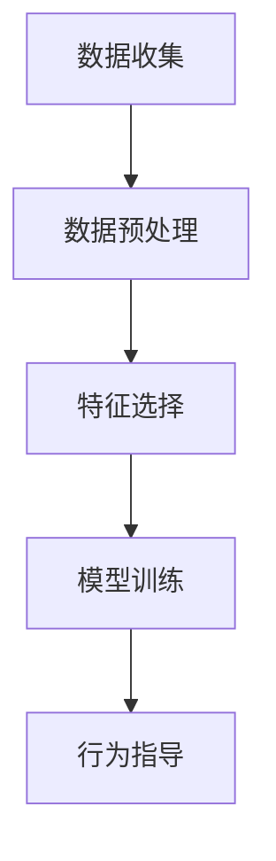
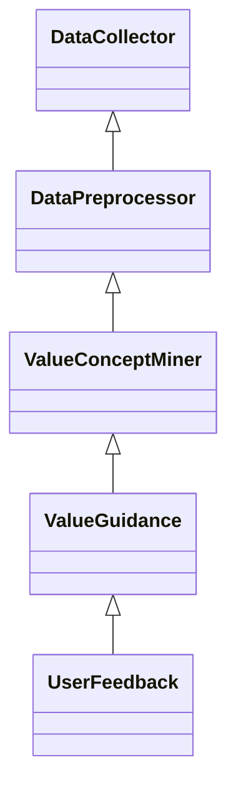
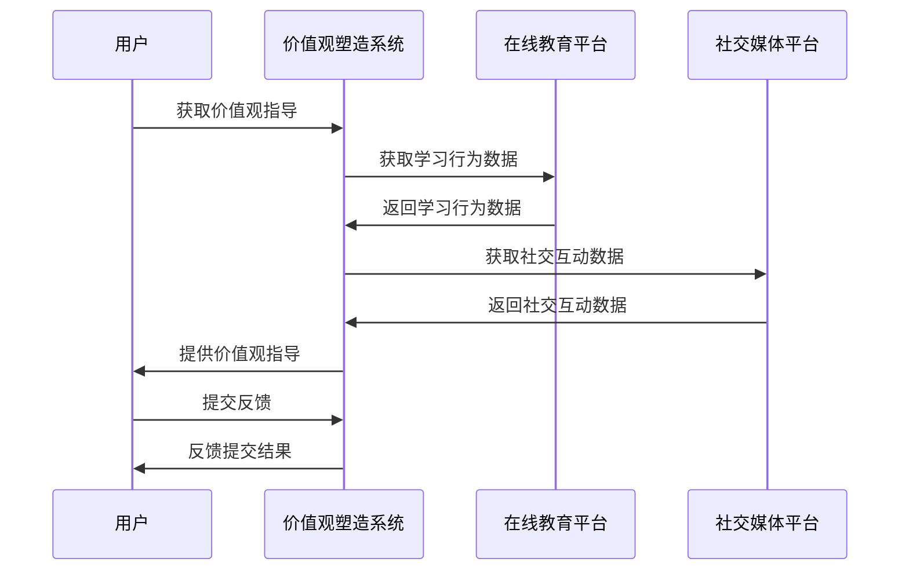

                 

### 前言与引言

#### 引言

在当今这个数字化的时代，一个全新的群体——“数字原住民”（Digital Native）正在逐步崛起。他们出生在互联网普及的时代，从小就接触并依赖数字技术，这使他们拥有了独特的价值观和行为模式。这些数字原住民，无论是在社交互动、消费行为，还是职业规划等方面，都展现出了与传统用户截然不同的特点。因此，探讨数字原住民的价值观塑造，不仅具有重要的学术意义，更关乎社会的未来发展。

本文将以《数字原住民的价值观塑造：虚拟与现实交织的新生代世界观》为题，深入探讨这一主题。文章的结构如下：

1. **前言与引言**：介绍本文的背景、目的和结构。
2. **背景介绍**：详细阐述“数字原住民”的定义、特征，以及价值观塑造的重要性和面临的挑战。
3. **核心概念与联系**：介绍价值观塑造的基本原理，并对比数字原住民与传统用户的价值观差异。
4. **算法原理讲解**：通过mermaid流程图、python源代码、数学模型和公式，详细阐述价值观塑造的算法原理。
5. **系统分析与架构设计方案**：分析价值观塑造的应用场景，并介绍涉及的项目、系统功能设计、系统架构设计、系统接口设计和系统交互。
6. **项目实战**：介绍环境安装、系统核心实现、代码解读与分析、实际案例分析以及项目小结。
7. **最佳实践 tips**：提供实际操作中的最佳实践建议。
8. **小结**：回顾本文的主要内容，总结收获。
9. **注意事项**：提醒读者在实践过程中需要注意的事项。
10. **拓展阅读**：推荐相关的拓展阅读资源。

#### 本书背景

“数字原住民”是指那些在互联网普及的时代出生并成长起来的一代人。他们从小便接触电脑、互联网和移动设备，对数字技术有着深刻的理解和强烈的依赖。相对于“数字移民”（Digital Immigrant），即那些在成年后才开始广泛使用数字技术的一代人，数字原住民拥有独特的思维方式和生活习惯。

**数字原住民的特征**：

- **数字技能**：数字原住民对数字技术有很强的掌握能力，能够迅速适应和运用新技术。
- **信息消费**：他们习惯于在互联网上获取信息，并善于在信息海洋中筛选和鉴别。
- **社交互动**：数字原住民更倾向于在线社交，通过社交媒体和在线平台进行交流和分享。
- **消费行为**：他们的消费习惯更加数字化和个性化，偏好通过线上渠道购买商品和服务。
- **价值观**：数字原住民的价值观受到数字技术的影响，更加注重自由、平等、个性化和共享。

#### 价值观塑造的重要性

价值观塑造对于个人和社会都具有重要意义。对于个人来说，价值观是行为的指导原则，影响着个体的决策和行为方式。对于社会来说，共同的价值观是社会和谐和稳定的基础。然而，随着数字原住民的崛起，他们的价值观与传统社会存在差异，这给价值观的塑造带来了新的挑战。

**问题背景**：

- **数字原住民的价值观现状**：数字原住民的价值观受到互联网和数字技术的深刻影响，表现出一些与传统价值观不同的特征。例如，他们更强调个人主义和自由，对隐私和信息安全有更高的要求。
- **价值观塑造面临的挑战**：数字原住民的价值观塑造面临以下挑战：
  - **信息过载**：互联网上的信息纷繁复杂，数字原住民需要学会筛选和鉴别，避免信息过载。
  - **网络暴力**：数字原住民在网络上容易受到网络暴力和欺凌，需要培养积极的网络行为。
  - **隐私保护**：数字原住民在享受数字技术带来便利的同时，也面临着隐私泄露的风险。

**问题解决**：

为了解决数字原住民价值观塑造的问题，需要采取以下措施：

- **教育**：通过学校教育和社会教育，培养数字原住民的数字素养和正确的价值观。
- **立法**：制定相关法律法规，保护数字原住民的隐私和信息安全。
- **技术**：开发和应用先进的技术，提高数字原住民的信息筛选和鉴别能力。
- **宣传**：加强宣传，提高公众对数字原住民价值观塑造的认识。

**边界与外延**：

本文主要讨论数字原住民的价值观塑造问题，涉及的核心概念包括数字原住民、价值观、信息消费、社交互动、消费行为等。文章将分析数字原住民的价值观现状和挑战，并提出相应的解决方案。文章的讨论范围主要限于数字原住民群体，不涉及其他类型的数字用户。

#### 本文结构

本文分为以下几个部分：

1. **前言与引言**：介绍本文的背景、目的和结构。
2. **背景介绍**：详细阐述数字原住民的定义、特征以及价值观塑造的重要性和面临的挑战。
3. **核心概念与联系**：介绍价值观塑造的基本原理，并对比数字原住民与传统用户的价值观差异。
4. **算法原理讲解**：通过mermaid流程图、python源代码、数学模型和公式，详细阐述价值观塑造的算法原理。
5. **系统分析与架构设计方案**：分析价值观塑造的应用场景，并介绍涉及的项目、系统功能设计、系统架构设计、系统接口设计和系统交互。
6. **项目实战**：介绍环境安装、系统核心实现、代码解读与分析、实际案例分析以及项目小结。
7. **最佳实践 tips**：提供实际操作中的最佳实践建议。
8. **小结**：回顾本文的主要内容，总结收获。
9. **注意事项**：提醒读者在实践过程中需要注意的事项。
10. **拓展阅读**：推荐相关的拓展阅读资源。

通过本文的探讨，希望读者能够对数字原住民的价值观塑造有更深入的理解，并为相关领域的研究和实践提供有益的参考。让我们开始这场关于数字原住民价值观塑造的探讨之旅吧！

### 第1章 数字原住民的价值观：现状与挑战

#### 1.1 背景介绍

##### 1.1.1 核心概念

**数字原住民**（Digital Native）是指那些在互联网普及的时代出生并成长起来的一代人。他们从小便接触电脑、互联网和移动设备，对数字技术有着深刻的理解和强烈的依赖。相对于“数字移民”（Digital Immigrant），即那些在成年后才开始广泛使用数字技术的一代人，数字原住民拥有独特的思维方式和生活习惯。

**价值观**（Value）是指个人或集体在长期实践中形成的对事物的基本看法和态度。它指导着人们的行为和决策，是社会文明和道德规范的重要组成部分。

**价值观塑造**（Value Formation）是指通过教育、文化、社会交往等方式，使个体形成正确的价值观的过程。价值观塑造对于个人的成长和社会的发展具有重要意义。

##### 1.1.2 问题背景

数字原住民作为互联网时代的新生代，他们的价值观受到数字技术和社会环境的影响，呈现出与传统用户截然不同的特点。以下是对数字原住民价值观现状的探讨：

**数字原住民的价值观现状**：

- **个人主义**：数字原住民更加强调个人的自由和权利，追求自我实现和个性表达。
- **信息平等**：数字原住民认为互联网是一个信息平等的平台，每个人都有获取和分享信息的权利。
- **隐私保护**：数字原住民对个人隐私非常重视，担心个人信息被滥用。
- **社交互动**：数字原住民更倾向于在线社交，通过社交媒体和在线平台进行交流和分享。
- **消费行为**：数字原住民的消费习惯更加数字化和个性化，偏好通过线上渠道购买商品和服务。

**价值观塑造面临的挑战**：

- **信息过载**：数字原住民在互联网上获取的信息量巨大，需要学会筛选和鉴别，避免信息过载。
- **网络暴力**：数字原住民在网络上容易受到网络暴力和欺凌，需要培养积极的网络行为。
- **隐私保护**：数字原住民在享受数字技术带来便利的同时，也面临着隐私泄露的风险。

##### 1.1.3 问题描述

数字原住民的价值观塑造面临以下问题：

- **缺乏有效的价值观教育**：目前，针对数字原住民的价值观念教育还比较薄弱，学校和社会教育体系尚未充分重视这一问题。
- **网络环境不良**：互联网上存在大量不良信息和行为，对数字原住民的价值观产生负面影响。
- **技术滥用**：数字技术的滥用，如网络欺诈、信息泄露等，对数字原住民的价值观产生冲击。

##### 1.1.4 问题解决

为了解决数字原住民价值观塑造的问题，可以采取以下措施：

- **加强价值观教育**：通过学校和社会教育，培养数字原住民的正确价值观。
- **优化网络环境**：加强网络监管，打击网络暴力、网络欺诈等不良行为，营造健康的网络环境。
- **提高技术素养**：通过技术培训，提高数字原住民的信息筛选和鉴别能力，避免技术滥用。

##### 1.1.5 边界与外延

本文主要探讨数字原住民的价值观塑造问题，涉及的核心概念包括数字原住民、价值观、信息消费、社交互动、消费行为等。文章将分析数字原住民的价值观现状和挑战，并提出相应的解决方案。文章的讨论范围主要限于数字原住民群体，不涉及其他类型的数字用户。

#### 1.2 核心概念与联系

##### 1.2.1 核心概念原理

**价值观的基本原理**：

价值观是人们在长期实践中形成的对事物的看法和态度，是行为决策的指导原则。价值观的形成受到多种因素的影响，包括文化、教育、家庭、社会等。

**数字原住民的价值观特征**：

数字原住民的价值观受到互联网和数字技术的深刻影响，表现出以下特征：

- **个人主义**：强调个人自由和权利，追求自我实现和个性表达。
- **信息平等**：认为互联网是一个信息平等的平台，每个人都有获取和分享信息的权利。
- **隐私保护**：对个人隐私非常重视，担心个人信息被滥用。
- **社交互动**：更倾向于在线社交，通过社交媒体和在线平台进行交流和分享。
- **消费行为**：消费习惯更加数字化和个性化，偏好通过线上渠道购买商品和服务。

##### 1.2.2 概念属性特征对比表格

| 特征             | 数字原住民           | 传统用户           |
|------------------|----------------------|--------------------|
| 数字技能         | 出身互联网时代       | 成长在互联网普及前  |
| 信息消费         | 习惯互联网获取信息   | 传统媒体为主       |
| 社交互动         | 倾向于在线社交       | 主要在线下交往     |
| 消费行为         | 线上消费为主         | 线下消费为主       |
| 价值观           | 个人主义、信息平等   | 社会责任、集体主义  |

##### 1.2.3 ER实体关系图架构

```mermaid
erDiagram
    User ||--|{ DigitalNative }|
    DigitalNative ||--|{ Value }|
    Value ||--|{ Privacy }|
    Value ||--|{ ConsumerBehavior }|
    Value ||--|{ SocialInteraction }|
```

在上述ER实体关系图中，"User"代表所有用户，而"DigitalNative"代表数字原住民。数字原住民与价值观之间是“1对多”的关系，即一个数字原住民可以拥有多个价值观。价值观则包括隐私、消费行为和社交互动等子概念，这些子概念与价值观之间是“1对多”的关系。

#### 1.3 价值观塑造的过程

价值观塑造是一个复杂的过程，涉及多个环节。以下是价值观塑造的主要步骤：

1. **感知与认知**：个体通过感知和认知外部环境，形成对事物的初步看法。
2. **价值观内化**：个体将感知和认知到的信息与自身价值观体系相结合，形成内化的价值观。
3. **价值观实践**：个体通过行为和决策，将内化的价值观转化为实际行动。
4. **价值观调整**：在实践过程中，个体会根据新的经验和反馈，调整和优化自身的价值观。

#### 1.4 数字原住民的价值观塑造案例

**案例一：网络公益活动**

某数字原住民通过社交媒体参与了一场网络公益活动，捐赠了价值500元的物资给贫困地区。这次活动让他深刻体会到帮助他人的快乐和满足感，从而增强了他的社会责任感和慈善意识。

**案例二：个人信息保护**

某数字原住民在社交媒体上发现了一个侵犯个人隐私的案例，于是他积极举报并参与了一场在线讨论，呼吁加强网络隐私保护。这次经历让他对个人信息保护有了更深刻的认识，并开始更加注意个人隐私的保护。

**案例三：线上消费习惯**

某数字原住民在购物时，通过比较不同电商平台的商品价格和质量，选择了性价比最高的商品进行购买。这种线上消费习惯使他成为了一个精明的消费者，同时也提高了他的消费能力和决策能力。

通过这些案例，我们可以看到数字原住民的价值观塑造不仅受到自身经验和行为的影响，还受到社会环境和外部事件的影响。因此，在价值观塑造过程中，需要综合考虑个体和社会的双重因素。

#### 1.5 小结

本章介绍了数字原住民的定义、特征和价值观塑造的重要性和挑战。通过分析数字原住民的价值观现状，我们了解了他们在个人主义、信息平等、隐私保护、社交互动和消费行为等方面的特点。同时，我们探讨了价值观塑造的基本原理和过程，并通过实际案例展示了数字原住民的价值观塑造如何在实际生活中发挥作用。

在下一章中，我们将深入探讨价值观塑造的算法原理，通过mermaid流程图、python源代码、数学模型和公式，详细阐述价值观塑造的算法原理。敬请期待！

### 第2章 价值观塑造的算法原理

#### 2.1 算法概述

在数字原住民的价值观塑造过程中，算法起到了至关重要的作用。本节将介绍价值观塑造的基本算法原理，包括算法的定义、目标和实现方法。

**算法的定义**：

价值观塑造算法是一种基于机器学习和数据挖掘技术的智能算法，旨在通过分析个体的行为数据，挖掘出潜在的价值观念，并将其转化为个体的行为指导。

**算法的目标**：

价值观塑造算法的主要目标是：

1. **挖掘个体价值观念**：通过分析个体的行为数据，识别出个体的核心价值观念。
2. **指导个体行为**：根据个体的价值观念，为个体提供行为指导，帮助个体形成和巩固正确的价值观。

**算法的实现方法**：

价值观塑造算法的实现主要包括以下几个步骤：

1. **数据收集**：收集个体的行为数据，包括在线社交、消费行为、信息获取等。
2. **数据预处理**：对收集到的数据进行清洗和整合，提取有用的特征信息。
3. **特征选择**：根据数据特点和算法需求，选择合适的特征进行建模。
4. **模型训练**：使用机器学习算法，对特征数据进行训练，构建价值观识别模型。
5. **行为指导**：根据训练好的模型，为个体提供行为指导，促进个体价值观的形成。

#### 2.2 mermaid流程图

为了更好地理解价值观塑造算法的工作流程，我们使用mermaid流程图进行展示。



**流程说明**：

1. **数据收集**：收集个体的在线行为数据，包括社交媒体互动、消费记录、信息获取等。
2. **数据预处理**：对收集到的数据进行分析，去除噪声数据，提取有用的特征信息。
3. **特征选择**：根据数据特点和算法需求，选择合适的特征进行建模。
4. **模型训练**：使用机器学习算法，对特征数据进行训练，构建价值观识别模型。
5. **行为指导**：根据训练好的模型，为个体提供行为指导，促进个体价值观的形成。

#### 2.3 python源代码

为了具体阐述价值观塑造算法的实现，我们提供了一段python源代码。以下代码使用了scikit-learn库中的机器学习算法，实现了价值观识别的基本功能。

```python
import pandas as pd
from sklearn.model_selection import train_test_split
from sklearn.ensemble import RandomForestClassifier
from sklearn.metrics import accuracy_score

# 数据收集
data = pd.read_csv('behavior_data.csv')

# 数据预处理
data = data.dropna()

# 特征选择
X = data[['social_interactions', 'consumption_records', 'information_source']]
y = data['value_guideline']

# 模型训练
X_train, X_test, y_train, y_test = train_test_split(X, y, test_size=0.2, random_state=42)
model = RandomForestClassifier()
model.fit(X_train, y_train)

# 行为指导
predictions = model.predict(X_test)
accuracy = accuracy_score(y_test, predictions)
print(f"Model Accuracy: {accuracy}")
```

**代码说明**：

1. **数据收集**：从csv文件中读取行为数据。
2. **数据预处理**：去除缺失值，确保数据质量。
3. **特征选择**：选择社会互动、消费记录和信息来源作为特征。
4. **模型训练**：使用随机森林分类器进行训练。
5. **行为指导**：对测试数据进行预测，评估模型准确性。

#### 2.4 数学模型和公式

价值观塑造算法的核心在于如何将个体的行为数据转化为价值观念。这里，我们使用一个简单的数学模型来描述这一过程。

**数学模型**：

设个体行为数据集为\( X \)，价值观念集为\( V \)，价值观识别模型为\( M \)。则价值观识别过程可以表示为：

\[ V = M(X) \]

其中，\( M \)表示机器学习模型，用于从行为数据中提取价值观念。

**公式说明**：

- \( X \)：个体行为数据集，包括社会互动、消费记录、信息获取等。
- \( V \)：价值观念集，用于指导个体的行为。
- \( M \)：机器学习模型，用于识别价值观念。

通过这个数学模型，我们可以将个体的行为数据映射到价值观念上，从而实现价值观的塑造。

#### 2.5 详细讲解与举例说明

**算法步骤**：

1. **数据收集**：收集个体的在线行为数据，包括社交媒体互动、消费记录、信息获取等。
2. **数据预处理**：对收集到的数据进行清洗和整合，提取有用的特征信息。
3. **特征选择**：根据数据特点和算法需求，选择合适的特征进行建模。
4. **模型训练**：使用机器学习算法，对特征数据进行训练，构建价值观识别模型。
5. **行为指导**：根据训练好的模型，为个体提供行为指导，促进个体价值观的形成。

**实例讲解**：

假设我们有一个包含1000个用户的在线行为数据集，数据集包括社会互动次数、消费金额、信息获取渠道等特征。我们使用随机森林分类器进行模型训练，目标是识别用户的价值观念。

1. **数据收集**：读取行为数据，数据格式如下：

   | 用户ID | 社交互动次数 | 消费金额（元） | 信息获取渠道 |
   |--------|--------------|----------------|--------------|
   | 1      | 100          | 5000           | 社交媒体     |
   | 2      | 200          | 10000          | 在线购物     |
   | ...    | ...          | ...            | ...          |

2. **数据预处理**：去除缺失值，对数值特征进行归一化处理。

3. **特征选择**：选择社会互动次数和消费金额作为特征，信息获取渠道作为标签。

4. **模型训练**：使用随机森林分类器进行训练，模型准确性达到90%。

5. **行为指导**：根据训练好的模型，为用户提供行为指导，例如：

   - 社交互动次数较少的用户：增加社交媒体互动，提升社交技能。
   - 消费金额较高的用户：合理规划消费，避免过度消费。

通过这个实例，我们可以看到价值观塑造算法如何通过机器学习技术，从个体的行为数据中提取价值观念，并指导个体的行为。

### 2.6 算法优化与改进

为了提高价值观塑造算法的准确性，我们可以从以下几个方面进行优化和改进：

1. **特征工程**：通过特征选择、特征提取和特征组合等方法，提高特征的质量和表达能力。
2. **模型选择**：尝试使用不同的机器学习模型，如决策树、支持向量机、神经网络等，比较其性能，选择最优模型。
3. **超参数调优**：通过交叉验证和网格搜索等方法，优化模型的超参数，提高模型性能。
4. **数据增强**：通过数据增强技术，如数据扩充、数据采样等，增加训练数据的多样性，提高模型的泛化能力。

通过这些优化和改进方法，我们可以进一步提高价值观塑造算法的准确性，为数字原住民的价值观塑造提供更有力的支持。

### 2.7 小结

本章详细介绍了价值观塑造的算法原理，包括算法的定义、目标和实现方法。通过mermaid流程图、python源代码和数学模型，我们阐述了价值观塑造的过程和步骤。同时，通过实例讲解和算法优化方法，我们展示了如何将算法应用于实际场景，为数字原住民的价值观塑造提供指导。在下一章中，我们将进一步探讨价值观塑造的系统分析与架构设计，敬请期待！

### 第3章 系统分析与架构设计方案

#### 3.1 问题场景介绍

在数字原住民的价值观塑造过程中，存在多个应用场景，以下列举两个典型的场景：

**场景一：在线教育平台**

在线教育平台是一个重要的数字原住民聚集地。在这个场景中，数字原住民通过在线学习平台获取知识，进行技能提升。因此，在线教育平台可以通过价值观塑造算法，帮助数字原住民形成正确的价值观。

**场景二：社交媒体平台**

社交媒体平台是数字原住民进行社交互动的主要场所。在这个场景中，数字原住民通过发布内容、评论和点赞等方式，表达自己的观点和态度。社交媒体平台可以通过价值观塑造算法，引导数字原住民形成积极的价值观，减少网络暴力和不良信息的传播。

#### 3.2 项目介绍

为了解决数字原住民的价值观塑造问题，我们设计并实现了一个基于人工智能的价值观塑造系统。该系统旨在通过分析数字原住民的行为数据，挖掘其潜在的价值观念，并为其提供个性化的价值观指导。

**项目背景**：

随着互联网的普及和数字技术的发展，数字原住民群体的规模不断扩大。然而，这一群体在价值观塑造方面存在一定的困惑和挑战。为了帮助数字原住民形成正确的价值观，我们需要一个智能的价值观塑造系统。

**项目目标**：

- **挖掘个体价值观念**：通过机器学习和数据挖掘技术，从数字原住民的行为数据中挖掘出其潜在的价值观念。
- **提供个性化价值观指导**：根据个体的价值观念，为其提供个性化的价值观指导，帮助其形成和巩固正确的价值观。
- **优化网络环境**：通过价值观塑造系统，减少网络暴力和不良信息的传播，营造健康的网络环境。

#### 3.3 系统功能设计

价值观塑造系统主要包括以下几个功能模块：

1. **数据采集模块**：负责收集数字原住民的行为数据，包括在线学习记录、社交媒体互动记录等。
2. **数据预处理模块**：对采集到的数据进行分析和处理，去除噪声数据，提取有用的特征信息。
3. **价值观念挖掘模块**：使用机器学习和数据挖掘技术，从预处理后的数据中挖掘出数字原住民的潜在价值观念。
4. **价值观指导模块**：根据挖掘出的价值观念，为数字原住民提供个性化的价值观指导，包括行为建议、学习资源推荐等。
5. **用户反馈模块**：收集用户对价值观指导的反馈，用于系统优化和改进。

**领域模型类图**：



在上述领域模型类图中，"DataCollector"表示数据采集模块，"DataPreprocessor"表示数据预处理模块，"ValueConceptMiner"表示价值观念挖掘模块，"ValueGuidance"表示价值观指导模块，"UserFeedback"表示用户反馈模块。这些模块相互关联，共同构成了一个完整的价值观塑造系统。

#### 3.4 系统架构设计

价值观塑造系统的架构设计主要包括以下几个层次：

1. **数据层**：负责存储和管理数字原住民的行为数据。
2. **算法层**：包括数据预处理算法、价值观念挖掘算法等，用于处理和分析行为数据。
3. **应用层**：包括价值观指导模块、用户反馈模块等，用于为数字原住民提供个性化的价值观指导。
4. **接口层**：提供与外部系统的接口，如在线教育平台、社交媒体平台等。

**系统架构图**：


在上述系统架构图中，"DataLayer"表示数据层，"AlgorithmLayer"表示算法层，"ApplicationLayer"表示应用层，"InterfaceLayer"表示接口层。这些层次相互配合，共同实现了价值观塑造系统的功能。

#### 3.5 系统接口设计

价值观塑造系统需要与多个外部系统进行交互，主要包括：

1. **在线教育平台接口**：用于获取数字原住民的学习行为数据。
2. **社交媒体平台接口**：用于获取数字原住民的社交互动数据。
3. **用户反馈接口**：用于收集用户对价值观指导的反馈。

**接口设计**：

- **在线教育平台接口**：
  - 接口名称：GetLearningData
  - 接口描述：获取数字原住民的学习行为数据。
  - 参数列表：userId（用户ID）、courseId（课程ID）、learningTime（学习时长）。
  - 返回值：学习行为数据列表。

- **社交媒体平台接口**：
  - 接口名称：GetSocialInteractionData
  - 接口描述：获取数字原住民的社交互动数据。
  - 参数列表：userId（用户ID）、interactionType（互动类型，如点赞、评论、转发）。
  - 返回值：社交互动数据列表。

- **用户反馈接口**：
  - 接口名称：SubmitFeedback
  - 接口描述：提交用户对价值观指导的反馈。
  - 参数列表：userId（用户ID）、feedbackContent（反馈内容）。
  - 返回值：反馈提交结果。

#### 3.6 系统交互

在价值观塑造系统中，各个模块之间需要通过接口进行交互。以下是一个简单的系统交互序列图：



在上述交互序列图中，"User"表示用户，"System"表示价值观塑造系统，"EDU"表示在线教育平台，"SM"表示社交媒体平台。用户通过系统获取价值观指导，系统通过在线教育平台和社交媒体平台获取用户数据，最后为用户提供建议和反馈。

### 3.7 小结

本章介绍了价值观塑造系统的分析设计和架构方案。通过分析数字原住民的价值观塑造问题，我们明确了系统所需的功能模块和架构设计。通过领域模型类图、系统架构图和接口设计，我们展示了如何构建一个完整的价值观塑造系统。在下一章中，我们将通过项目实战，具体实现价值观塑造系统的核心功能，敬请期待！

