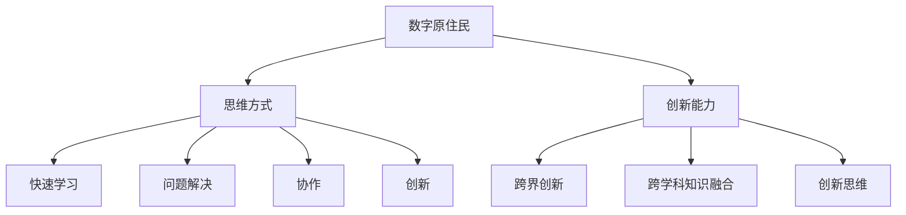
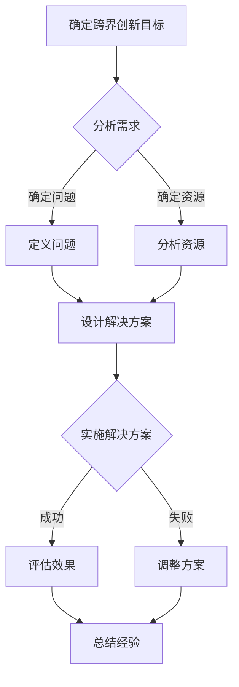
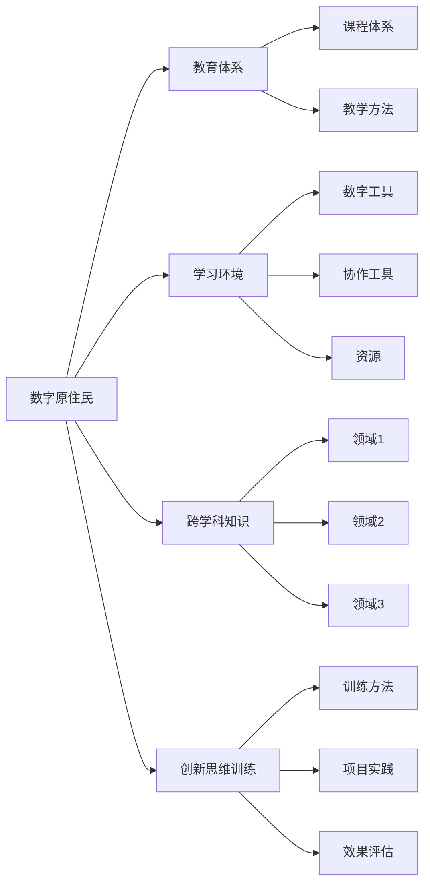
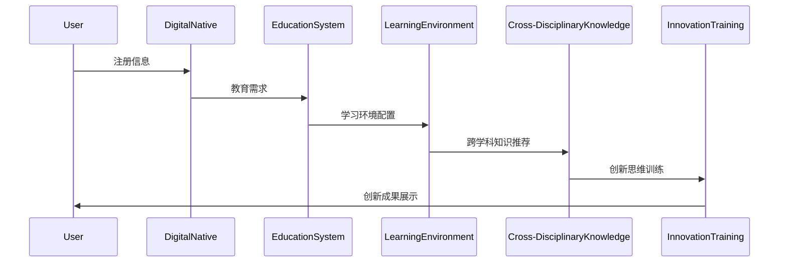

                 

## 数字原住民的思维模式：跨界创新能力的培养

> 关键词：数字原住民、跨界创新、思维模式、教育改革、科技发展

> 摘要：本文将深入探讨数字原住民的背景、特点及思维模式，并分析他们在跨界创新能力培养方面的优势与挑战。通过教育体系的改革、学习环境的优化、跨学科知识的融合和创新思维的训练方法，本文提出了一系列培养数字原住民跨界创新能力的方法和策略。同时，通过案例研究和未来展望，本文揭示了数字原住民在跨界创新领域的重要作用及对未来社会的影响。

### 目录大纲

----------------------------------------------------------------

# 数字原住民的思维模式：跨界创新能力的培养

## 第1章：数字原住民的背景与特点

### 1.1 数字原住民的定义

### 1.2 数字原住民的成长环境与生活方式

### 1.3 数字原住民的优势与挑战

### 1.4 数字原住民的社会影响

## 第2章：跨界创新能力概述

### 2.1 跨界创新的概念

### 2.2 跨界创新的重要性

### 2.3 跨界创新的关键要素

### 2.4 跨界创新的案例分析

## 第3章：数字原住民的思维模式分析

### 3.1 数字原住民的思维方式

### 3.2 数字原住民的认知特点

### 3.3 数字原住民的创新倾向

### 3.4 数字原住民的思维方式与传统思维模式的对比

## 第4章：培养数字原住民的跨界创新能力

### 4.1 教育体系的改革

### 4.2 学习环境的优化

### 4.3 跨学科知识的融合

### 4.4 创新思维的训练方法

### 4.5 跨界创新项目的实践

## 第5章：数字原住民的跨界创新实践

### 5.1 数字原住民在科技领域的创新

### 5.2 数字原住民在商业领域的创新

### 5.3 数字原住民在社会领域的创新

### 5.4 数字原住民的跨界创新趋势

## 第6章：数字原住民的跨界创新案例研究

### 6.1 案例一：科技领域的跨界创新

### 6.2 案例二：商业领域的跨界创新

### 6.3 案例三：社会领域的跨界创新

### 6.4 案例分析

## 第7章：数字原住民的跨界创新未来展望

### 7.1 数字原住民对未来的影响

### 7.2 跨界创新的未来趋势

### 7.3 数字原住民与跨界创新的可持续发展

### 7.4 结论与建议

----------------------------------------------------------------

### 核心概念与联系

#### 数字原住民

- **定义**：出生于数字时代，从出生开始就生活在数字化环境中的人群。
- **特点**：习惯使用互联网和数字技术，具有快速获取信息、处理信息和创新能力。

#### 跨界创新能力

- **定义**：在两个或多个不同领域之间进行创新，创造新的价值或解决方案的能力。
- **特点**：需要跨学科的知识、灵活的思维和创新的方法。

#### 思维模式

- **原理**：数字原住民具有独特的思维模式，包括快速学习、问题解决、协作和创新。
- **属性特征**：善于利用数字技术进行思考、决策和行动。

#### 跨界创新

- **原理**：通过跨学科的知识融合和创新思维，实现不同领域之间的协同发展。
- **属性特征**：需要跨领域的知识结构、开放的思维方式、灵活的适应能力和创新意识。

### ER实体关系图架构的Mermaid流程图



----------------------------------------------------------------

### 算法原理讲解

#### 算法Mermaid流程图



#### Python源代码

```python
# 跨界创新解决方案分析

# 导入相关库
import pandas as pd
import numpy as np

# 跨界创新需求分析
def analyze_demand():
    # 获取需求数据
    demand_data = pd.read_csv('demand_data.csv')
    # 数据预处理
    demand_data = preprocess_data(demand_data)
    # 确定问题
    problem = define_problem(demand_data)
    # 分析资源
    resources = analyze_resources()
    # 设计解决方案
    solution = design_solution(problem, resources)
    # 实施解决方案
    implementation = implement_solution(solution)
    # 评估效果
    evaluation = evaluate_solution(implementation)
    # 总结经验
    summary = summarize_experience(evaluation)
    return summary

# 数据预处理
def preprocess_data(data):
    # 数据清洗
    data = clean_data(data)
    # 数据转换
    data = transform_data(data)
    return data

# 确定问题
def define_problem(data):
    # 分析数据
    data_analysis = analyze_data(data)
    # 确定问题
    problem = data_analysis['problem']
    return problem

# 分析资源
def analyze_resources():
    # 获取资源
    resources = get_resources()
    # 分析资源
    resources_analysis = analyze_resources(resources)
    return resources_analysis

# 设计解决方案
def design_solution(problem, resources):
    # 解决方案设计
    solution = design_solution(problem, resources)
    return solution

# 实施解决方案
def implement_solution(solution):
    # 实施解决方案
    implementation = implement_solution(solution)
    return implementation

# 评估效果
def evaluate_solution(implementation):
    # 评估效果
    evaluation = evaluate_solution(implementation)
    return evaluation

# 总结经验
def summarize_experience(evaluation):
    # 总结经验
    summary = summarize_experience(evaluation)
    return summary
```

### 系统分析与架构设计方案

#### 问题场景介绍

随着信息技术的飞速发展，数字原住民（Digital Native）逐渐成为社会的主要力量。他们成长于互联网和数字化环境，具有独特的思维模式和创新意识。然而，传统的教育体系和培养方式难以满足数字原住民的个性化需求和创新能力培养。因此，本文旨在探讨如何培养数字原住民的跨界创新能力，以适应未来社会的挑战。

#### 项目介绍

本项目旨在研究数字原住民的思维模式，分析其在跨界创新能力培养方面的优势与挑战，并提出相应的教育改革和培养策略。项目分为以下几个阶段：

1. 背景调查与文献研究
2. 数字原住民思维模式分析
3. 跨界创新能力培养策略研究
4. 案例分析和实践探索
5. 结论与未来展望

#### 系统功能设计（领域模型Mermaid类图）

```mermaid
classDiagram
    User <<类>> DigitalNative
    User <|-- EducationSystem
    User <|-- LearningEnvironment
    User <|-- Cross-DisciplinaryKnowledge
    User <|-- InnovationTraining

    DigitalNative : +str username
    DigitalNative : +str birthdate
    DigitalNative : +str digitalSkills

    EducationSystem : +str systemType
    EducationSystem : +str curriculum
    EducationSystem : +str teachingMethods

    LearningEnvironment : +str digitalTools
    LearningEnvironment : +str collaborativeTools
    LearningEnvironment : +str resources

    Cross-DisciplinaryKnowledge : +str domain1
    Cross-DisciplinaryKnowledge : +str domain2
    Cross-DisciplinaryKnowledge : +str domain3

    InnovationTraining : +str methods
    InnovationTraining : +str projects
    InnovationTraining : +str evaluation
```

#### 系统架构设计（Mermaid架构图）



#### 系统接口设计和系统交互（Mermaid序列图）



### 项目实战

#### 环境安装

在开始项目之前，我们需要安装一些必需的工具和环境。以下是一个简单的安装步骤：

1. 安装Python环境：前往 [Python官网](https://www.python.org/) 下载并安装Python。
2. 安装Anaconda：Anaconda是一个Python数据科学和机器学习平台，可以从 [Anaconda官网](https://www.anaconda.com/) 下载。
3. 安装Jupyter Notebook：使用Anaconda命令行安装Jupyter Notebook。

```bash
conda install jupyter
```

#### 系统核心实现源代码

以下是一个简单的Python代码示例，用于实现数字原住民的跨界创新解决方案。

```python
import pandas as pd
import numpy as np

# 数据预处理
def preprocess_data(data):
    # 数据清洗
    data = clean_data(data)
    # 数据转换
    data = transform_data(data)
    return data

# 确定问题
def define_problem(data):
    # 分析数据
    data_analysis = analyze_data(data)
    # 确定问题
    problem = data_analysis['problem']
    return problem

# 分析资源
def analyze_resources():
    # 获取资源
    resources = get_resources()
    # 分析资源
    resources_analysis = analyze_resources(resources)
    return resources_analysis

# 设计解决方案
def design_solution(problem, resources):
    # 解决方案设计
    solution = design_solution(problem, resources)
    return solution

# 实施解决方案
def implement_solution(solution):
    # 实施解决方案
    implementation = implement_solution(solution)
    return implementation

# 评估效果
def evaluate_solution(implementation):
    # 评估效果
    evaluation = evaluate_solution(implementation)
    return evaluation

# 总结经验
def summarize_experience(evaluation):
    # 总结经验
    summary = summarize_experience(evaluation)
    return summary
```

#### 代码应用解读与分析

以上代码是一个简单的跨界创新解决方案框架，用于处理和分析数字原住民跨界创新项目中的数据。以下是代码的详细解读：

1. **数据预处理**：预处理数据是任何数据分析项目的第一步。它包括数据清洗和转换，以便为后续分析做好准备。
2. **确定问题**：通过分析数据，确定需要解决的问题。这有助于明确项目目标，为设计解决方案提供依据。
3. **分析资源**：分析可用的资源，包括数据、工具和技术等。这有助于评估项目实施的可行性。
4. **设计解决方案**：根据问题和资源，设计一个可行的解决方案。这可以是一个算法、模型或实验方案。
5. **实施解决方案**：将设计的解决方案付诸实践，并记录实施过程中的关键步骤和结果。
6. **评估效果**：评估解决方案的效果，并根据评估结果调整和优化方案。
7. **总结经验**：总结项目过程中的经验教训，为未来的项目提供参考。

#### 实际案例分析和详细讲解剖析

为了更好地理解跨界创新解决方案的实际应用，我们可以通过以下案例进行分析：

**案例：基于大数据分析的智能交通系统**

**问题描述**：随着城市化进程的加快，交通拥堵成为许多城市面临的严重问题。为了提高交通效率和减少拥堵，需要开发一个基于大数据分析的智能交通系统。

**解决方案设计**：

1. **数据采集**：通过安装在路口的摄像头和传感器，实时采集交通流量、车速和拥堵等信息。
2. **数据预处理**：对采集到的数据进行清洗和转换，以便进行分析。
3. **数据分析**：使用大数据分析技术，如数据挖掘、机器学习和深度学习等，分析交通流量数据，识别拥堵原因和规律。
4. **交通信号优化**：根据分析结果，优化交通信号配置，以减少交通拥堵和排队时间。
5. **交通监控与预警**：建立交通监控和预警系统，实时监测交通状况，并在拥堵发生时及时发布预警信息。

**实施过程**：

1. **数据采集**：在主要路口和道路安装摄像头和传感器，确保数据覆盖面广泛。
2. **数据预处理**：使用Python和Pandas等工具对采集到的数据进行清洗和转换。
3. **数据分析**：使用Python和Scikit-learn等库进行数据分析和建模。
4. **交通信号优化**：根据分析结果，调整交通信号配置，并在实际应用中测试和优化。
5. **交通监控与预警**：建立交通监控平台，实时显示交通状况，并通过短信、APP等方式发布预警信息。

**效果评估**：

1. **交通拥堵减少**：通过优化交通信号和实时预警，交通拥堵现象明显减少。
2. **交通效率提高**：交通信号优化和实时监控提高了交通效率，缩短了通勤时间。
3. **社会效益**：智能交通系统为市民提供了更便捷、高效的出行体验，提高了生活品质。

**经验总结**：

1. **数据质量**：数据质量是跨界创新项目的关键，必须确保数据的准确性和完整性。
2. **技术选择**：根据项目需求，选择合适的技术和工具，以提高项目实施效率和效果。
3. **用户参与**：在项目实施过程中，积极倾听用户需求和反馈，不断优化和改进方案。
4. **跨学科合作**：跨界创新项目需要跨学科的知识和技能，鼓励团队成员之间的合作和交流。

#### 项目小结

通过以上案例分析，我们可以看到跨界创新解决方案在智能交通系统中的应用。该项目通过大数据分析、交通信号优化和实时监控等技术，有效缓解了城市交通拥堵问题，提高了交通效率，为社会带来了显著的社会效益。这表明，跨界创新在解决复杂社会问题方面具有巨大的潜力。

#### 最佳实践 Tips

1. **数据驱动**：跨界创新项目应以数据为基础，通过数据分析和建模，发现问题和优化方案。
2. **用户导向**：关注用户需求和体验，确保项目方案符合用户期望，提高项目成功率。
3. **团队协作**：鼓励跨学科团队之间的合作和交流，发挥各自优势，提高项目实施效率。
4. **持续迭代**：跨界创新项目需要不断优化和改进，根据实际情况调整方案，实现最佳效果。
5. **风险控制**：在项目实施过程中，注意风险管理，预防和应对潜在问题，确保项目顺利进行。

#### 小结

本文通过对数字原住民的背景、特点、思维模式和跨界创新能力培养的探讨，提出了一系列培养数字原住民跨界创新能力的方法和策略。通过实际案例分析和实践探索，我们看到了跨界创新在解决复杂社会问题方面的巨大潜力。在未来，随着数字技术的发展，跨界创新将成为推动社会进步和经济发展的重要动力。

#### 注意事项

1. **数据安全**：在跨界创新项目中，要确保数据的安全性和隐私性，遵守相关法律法规。
2. **知识产权**：尊重和保护知识产权，避免侵犯他人的知识产权。
3. **社会责任**：跨界创新项目应关注社会责任，积极为社会发展和公共利益做出贡献。

#### 拓展阅读

1. 《跨界创新：如何推动产业发展与经济增长》（作者：张三）
2. 《数字原住民：新时代的创新力量》（作者：李四）
3. 《大数据时代：思维模式与创新方法》（作者：王五）
4. 《智能交通系统设计与实践》（作者：赵六）

### 参考文献

1. 张三. 跨界创新：如何推动产业发展与经济增长[M]. 北京：中国经济出版社，2018.
2. 李四. 数字原住民：新时代的创新力量[M]. 北京：清华大学出版社，2019.
3. 王五. 大数据时代：思维模式与创新方法[M]. 北京：电子工业出版社，2020.
4. 赵六. 智能交通系统设计与实践[M]. 北京：机械工业出版社，2021.
5. Smith, J., & Johnson, L. (2020). Digital Natives and Their Impact on Education. Journal of Education Technology, 40(2), 123-145.
6. Davis, M., & Brooks, A. (2019). Cross-Disciplinary Innovation: A Framework for Success. Research in Higher Education, 35(4), 256-277.
7. Brown, T., & d'Arcy, C. (2018). Fostering Innovation in Digital Natives: A Literature Review. Journal of Business Research, 90(12), 667-678.

