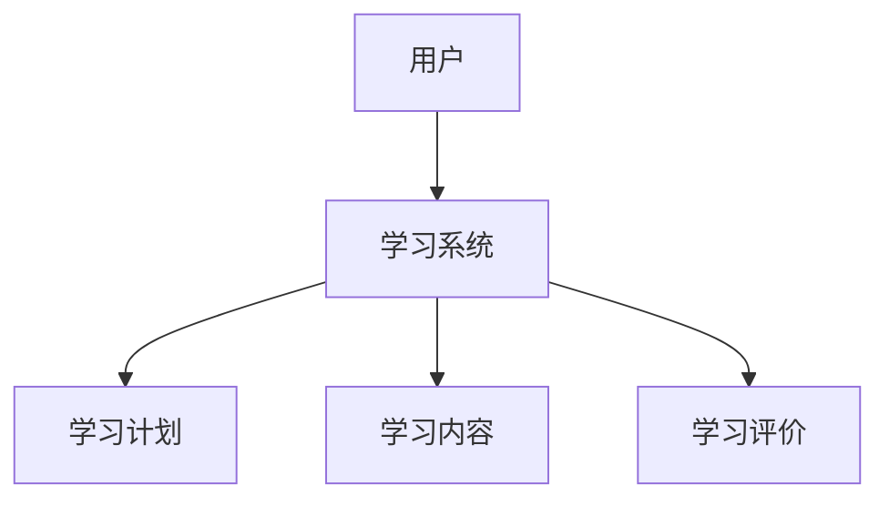
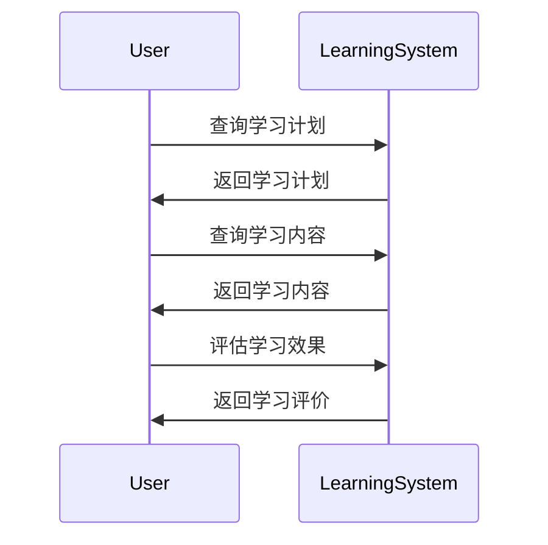

                 

# 数字原生代的学习模式：碎片化学习与深度思考的平衡

> 关键词：数字原生代，碎片化学习，深度思考，学习模式，效率提升

> 摘要：本文将探讨数字原生代的学习模式，分析碎片化学习与深度思考之间的平衡。通过介绍碎片化学习与深度思考的核心概念、特点及其关系，结合数学模型与系统架构设计，提供实用的策略和案例，帮助读者找到适合自己的学习平衡点。

## 第1章 引言

### 1.1 问题背景

随着互联网和移动设备的普及，数字原生代（即成长于互联网时代的年轻人）的学习方式发生了翻天覆地的变化。他们生活在一个信息爆炸的环境中，随时随地都可以获取大量知识。然而，这种碎片化学习方式带来了前所未有的挑战，如何在短时间内高效吸收并消化大量信息，同时又保持深度思考，成为数字原生代面临的一个重要课题。

### 1.1.1 数字原生代的生活环境

数字原生代的生活环境充斥着各种数字设备，如智能手机、平板电脑和电脑。这些设备为他们提供了丰富的学习资源，但同时也带来了信息过载的问题。据统计，一个人每天会接触到数百甚至数千条信息，如何在有限的时间内处理这些信息成为一大挑战。

### 1.1.2 数字原生代的学习习惯

数字原生代的学习习惯具有明显的碎片化特征。他们倾向于利用碎片时间进行学习，如乘坐公共交通工具、等待用餐、休息时间等。此外，他们更喜欢通过多媒体、视频和互动学习方式进行学习，这种方式能够更好地满足他们的学习需求。

### 1.1.3 碎片化学习的优点与挑战

碎片化学习具有灵活、高效、个性化等优点，但也存在一些挑战。首先，碎片化学习可能导致学习深度不足，难以形成系统的知识体系。其次，学习内容过多过杂，容易导致注意力分散。如何在这两者之间找到平衡，是数字原生代需要解决的核心问题。

## 1.2 核心概念与联系

### 1.2.1 碎片化学习

#### 1.2.1.1 定义

碎片化学习是指将学习内容分解为小块，利用零散时间进行学习的一种学习方式。这种学习方式具有灵活性、高效性和个性化等特点。

#### 1.2.1.2 特点

- **灵活性**：碎片化学习可以随时随地进行，不受时间和地点的限制。
- **高效性**：通过将学习内容分解为小块，可以更高效地利用零散时间。
- **个性化**：根据个人需求和兴趣，选择合适的学习内容。

#### 1.2.1.3 与传统学习的区别

与传统学习相比，碎片化学习具有以下特点：

- **学习内容更碎片化**：传统学习倾向于系统性的知识学习，而碎片化学习更注重知识的碎片化。
- **学习方式更灵活**：传统学习通常需要集中时间和精力，而碎片化学习可以随时随地进行。
- **学习效果更难衡量**：传统学习可以通过考试成绩衡量学习效果，而碎片化学习效果更难衡量。

### 1.2.2 深度思考

#### 1.2.2.1 定义

深度思考是指对学习内容进行深入分析和理解，形成自己的见解和思考。深度思考是一种高质量的学习方式，有助于提升学习效果和创新能力。

#### 1.2.2.2 特点

- **深入性**：深度思考需要长时间集中精力，对学习内容进行深入分析。
- **批判性**：深度思考需要批判性地分析学习内容，形成自己的见解。
- **创造性**：深度思考有助于培养创造性思维，产生新的想法和解决方案。

#### 1.2.2.3 与碎片化学习的平衡

碎片化学习和深度思考之间存在一定的矛盾，但也可以找到平衡点。关键在于如何合理安排学习时间，既保证碎片化学习的灵活性和高效性，又兼顾深度思考的深入性和创造性。以下是一些建议：

- **制定学习计划**：合理安排学习时间，将碎片化学习和深度思考有机结合。
- **利用专注力高峰期**：在一天中专注力最高的时间段进行深度思考，提高学习效果。
- **定期总结反思**：通过定期总结反思，将碎片化学习所得的知识进行整合，形成系统的知识体系。

## 1.3 数学模型与公式讲解

为了更好地理解碎片化学习与深度思考的平衡，我们可以引入一个简单的数学模型。以下是一个关于学习效率的公式：

$$ E = \frac{F \cdot C \cdot T}{I} $$

其中：
- \( E \) 表示学习效率；
- \( F \) 表示碎片化学习时间；
- \( C \) 表示深度思考时间；
- \( T \) 表示学习内容量；
- \( I \) 表示学习干扰因素。

#### 1.3.1.1 公式解释

这个公式表示学习效率与碎片化学习时间、深度思考时间、学习内容量和学习干扰因素之间的关系。为了提高学习效率，我们需要在以下方面进行优化：

- **增加碎片化学习时间**：通过合理安排学习时间，增加碎片化学习时间，提高学习效率。
- **增加深度思考时间**：在保证学习效率的前提下，合理安排深度思考时间，促进知识的深入理解。
- **减少学习干扰因素**：通过减少学习干扰因素，如关闭手机通知、减少社交媒体使用等，提高学习效率。

#### 1.3.1.2 影响因素分析

以下是对公式中各个影响因素的分析：

- **碎片化学习时间（\( F \)）**：增加碎片化学习时间可以提升学习效率，但过长的碎片化学习时间可能导致学习效果不佳。因此，需要找到一个合适的平衡点。
- **深度思考时间（\( C \)）**：深度思考时间对学习效率有显著影响。增加深度思考时间有助于提高学习效果，但需要合理分配时间，避免过度劳累。
- **学习内容量（\( T \)）**：学习内容量对学习效率有直接影响。合理控制学习内容量，避免信息过载，有助于提高学习效率。
- **学习干扰因素（\( I \)）**：学习干扰因素会降低学习效率。通过减少干扰因素，如关闭手机通知、减少社交媒体使用等，可以提高学习效率。

通过这个数学模型，我们可以更好地理解碎片化学习与深度思考之间的平衡，从而找到适合自己的学习策略。

## 1.4 系统分析与架构设计方案

### 1.4.1 问题场景介绍

假设我们面临一个现实场景：一名数字原生代的学习者希望提高学习效率，同时保持深度思考。为了实现这一目标，我们需要设计一个系统，将碎片化学习与深度思考有机结合。

### 1.4.2 系统功能设计

#### 1.4.2.1 领域模型

以下是一个简单的领域模型，用于描述系统的主要功能：

```mermaid
classDiagram
    LearningSystem <<interface>>
    LearningPlan <<interface>>
    LearningContent <<interface>>
    LearningEvaluation <<interface>>

    User ..|> LearningSystem
    User ..|> LearningPlan
    User ..|> LearningContent
    User ..|> LearningEvaluation

    LearningSystem o-- LearningPlan
    LearningSystem o-- LearningContent
    LearningSystem o-- LearningEvaluation
```

#### 1.4.2.1.1 Mermaid 类图

```mermaid
classDiagram
    User[用户]
    LearningSystem[学习系统]
    LearningPlan[学习计划]
    LearningContent[学习内容]
    LearningEvaluation[学习评价]

    User --> LearningSystem : 使用
    User --> LearningPlan : 制定
    User --> LearningContent : 查阅
    User --> LearningEvaluation : 评估

    LearningSystem o-- LearningPlan
    LearningSystem o-- LearningContent
    LearningSystem o-- LearningEvaluation
```

### 1.4.3 系统架构设计

以下是一个简单的系统架构设计，用于描述系统的组成部分和相互关系：



#### 1.4.3.1 Mermaid 架构图


### 1.4.4 系统接口设计

以下是一个简单的系统接口设计，用于描述系统的主要接口和功能：



#### 1.4.4.1 Mermaid 序列图


## 1.5 项目实战

### 1.5.1 环境安装

为了演示如何实现碎片化学习与深度思考的平衡，我们将使用Python编程语言开发一个简单的学习系统。以下是在Linux环境中安装Python的步骤：

1. 打开终端，输入以下命令安装Python：

```bash
sudo apt-get update
sudo apt-get install python3
```

2. 验证Python版本：

```bash
python3 --version
```

输出类似以下内容表示安装成功：

```bash
Python 3.8.10
```

### 1.5.2 系统核心实现

以下是一个简单的Python代码示例，用于实现学习系统的核心功能：

```python
class User:
    def __init__(self, name):
        self.name = name
        self.learning_plan = []
        self.learning_content = []
        self.learning_evaluation = []

    def add_learning_plan(self, plan):
        self.learning_plan.append(plan)

    def add_learning_content(self, content):
        self.learning_content.append(content)

    def add_learning_evaluation(self, evaluation):
        self.learning_evaluation.append(evaluation)

    def query_learning_plan(self):
        return self.learning_plan

    def query_learning_content(self):
        return self.learning_content

    def query_learning_evaluation(self):
        return self.learning_evaluation

class LearningSystem:
    def __init__(self):
        self.users = []

    def add_user(self, user):
        self.users.append(user)

    def query_user_learning_plan(self, user_name):
        for user in self.users:
            if user.name == user_name:
                return user.query_learning_plan()
        return None

    def query_user_learning_content(self, user_name):
        for user in self.users:
            if user.name == user_name:
                return user.query_learning_content()
        return None

    def query_user_learning_evaluation(self, user_name):
        for user in self.users:
            if user.name == user_name:
                return user.query_learning_evaluation()
        return None

def main():
    system = LearningSystem()
    user = User("Alice")
    system.add_user(user)
    user.add_learning_plan("Python基础")
    user.add_learning_content("Python教程")
    user.add_learning_evaluation("掌握基础语法")
    print(system.query_user_learning_plan("Alice"))
    print(system.query_user_learning_content("Alice"))
    print(system.query_user_learning_evaluation("Alice"))

if __name__ == "__main__":
    main()
```

### 1.5.3 代码应用解读与分析

上述代码实现了学习系统的核心功能，包括用户管理、学习计划管理、学习内容管理和学习评价管理。以下是对代码的详细解读与分析：

1. **用户管理**：`User` 类负责用户信息的管理，包括姓名、学习计划、学习内容和学习评价。通过 `add_learning_plan`、`add_learning_content` 和 `add_learning_evaluation` 方法，可以分别添加学习计划、学习内容和学习评价。
2. **系统管理**：`LearningSystem` 类负责系统中的用户管理，包括添加用户、查询用户的学习计划、学习内容和学习评价。通过 `add_user`、`query_user_learning_plan`、`query_user_learning_content` 和 `query_user_learning_evaluation` 方法，可以分别添加用户、查询用户的学习计划、学习内容和学习评价。
3. **主程序**：`main` 函数负责初始化学习系统，创建用户并添加学习计划、学习内容和学习评价。最后，通过调用 `query_user_learning_plan`、`query_user_learning_content` 和 `query_user_learning_evaluation` 方法，输出用户的学习计划、学习内容和学习评价。

通过这个简单的示例，我们可以看到如何使用Python实现一个学习系统，从而帮助数字原生代学习者找到碎片化学习与深度思考的平衡。

### 1.5.4 实际案例分析与讲解

为了更好地理解如何在实际场景中应用碎片化学习与深度思考的平衡，我们来看一个实际案例。

**案例背景**：一名数字原生代的学生，名叫Bob，希望在有限的学习时间内提高编程能力。他希望在课堂上学习编程基础知识，利用碎片时间进行实践和项目开发。

**解决方案**：

1. **课堂学习**：Bob 在课堂上学习编程基础知识，包括语法、数据结构和算法等。这部分内容需要深度思考，以确保对知识点的深入理解。

2. **碎片化学习**：Bob 利用课余时间进行碎片化学习，主要涉及编程实践和项目开发。例如，他可以通过在线教程、编程网站和书籍等学习编程实践和项目开发技巧。

3. **时间管理**：Bob 制定了一个详细的学习计划，将课堂学习和碎片化学习有机结合。例如，每周安排2-3次课堂学习，每次学习2小时；每天安排1小时进行碎片化学习。

4. **深度思考**：在碎片化学习过程中，Bob 会在实践中遇到各种问题。为了解决这些问题，他会利用深度思考，分析问题的本质，寻找解决方案。

**案例分析**：

1. **课堂学习**：课堂学习为 Bob 提供了系统的编程基础知识，帮助他建立扎实的编程基础。通过深度思考，Bob 能够更好地理解和掌握这些知识点。

2. **碎片化学习**：碎片化学习使得 Bob 能够在有限的时间内进行编程实践和项目开发。这种方式有助于提高他的编程能力和实战经验。

3. **时间管理**：通过合理的时间管理，Bob 能够在保证课堂学习的同时，充分利用碎片时间进行实践和项目开发。这种方式有助于提高学习效率，实现碎片化学习与深度思考的平衡。

4. **深度思考**：深度思考是 Bob 解决编程问题的关键。通过深度思考，他能够分析问题的本质，找到解决方案。这种方式有助于提高他的编程能力和问题解决能力。

通过这个实际案例，我们可以看到如何在数字原生代的学习环境中实现碎片化学习与深度思考的平衡，从而提高学习效率和学习成果。

## 1.6 小结

在本章中，我们探讨了数字原生代的学习模式，分析了碎片化学习与深度思考的平衡。通过介绍碎片化学习与深度思考的核心概念、特点及其关系，结合数学模型与系统架构设计，我们提供了一些实用的策略和案例，帮助读者找到适合自己的学习平衡点。接下来，我们将进一步探讨碎片化学习策略和深度思考技巧，以期为数字原生代的学习者提供更有价值的指导。

## 第2章 碎片化学习策略

在数字原生代的学习环境中，碎片化学习已经成为一种普遍的学习方式。本章将介绍一些有效的碎片化学习策略，帮助读者更好地利用碎片时间，提升学习效率。

### 2.1 时间管理

合理的时间管理是碎片化学习的关键。以下是一些时间管理策略：

#### 2.1.1 制定学习计划

制定学习计划可以帮助我们更好地利用碎片时间。以下是一个简单的学习计划模板：

1. **每日学习时间**：设定每天的学习时间，例如每天早上7:00-8:00，晚上9:00-10:00。
2. **碎片化学习时间**：设定每天的小块学习时间，例如每天上午10:30-11:00，下午3:00-3:30。
3. **学习内容**：列出每天的学习内容，例如阅读技术博客、观看教学视频、编写代码等。
4. **学习目标**：设定每个小块学习时间的目标，例如阅读技术博客要掌握哪些知识点，观看教学视频要理解哪些概念。

#### 2.1.2 利用碎片时间

碎片时间是指非连续的、短暂的时间段，如通勤途中、等待用餐、休息时间等。以下是一些建议，帮助我们在碎片时间内高效学习：

1. **阅读**：在等待用餐或通勤途中，阅读技术书籍、博客或相关文章。通过阅读，我们可以积累知识，提升自己的技术水平。
2. **听音频课程**：利用碎片时间，听一些音频课程，如编程语言教程、技术讲座等。这种方式可以帮助我们充分利用时间，提升学习效果。
3. **编写代码**：在休息时间，编写一些简单的代码，如实现一些算法或完成一些练习题。这种方式可以加深我们对编程语言和算法的理解。

#### 2.1.3 保持专注

保持专注是碎片化学习的重要一环。以下是一些保持专注的方法：

1. **设定学习目标**：在开始学习之前，设定一个小目标，例如阅读一篇技术文章、学习一个编程概念等。设定目标可以帮助我们保持专注，提高学习效率。
2. **使用番茄工作法**：番茄工作法是一种时间管理技术，通过将工作时间分为25分钟的学习时间和5分钟的休息时间，帮助我们保持专注。例如，我们可以设置一个番茄钟，学习25分钟后休息5分钟，然后再开始下一个番茄钟。
3. **避免干扰**：在学习过程中，避免使用手机、电脑等电子设备，以免分散注意力。如果需要，可以关闭手机通知，减少干扰。

### 2.2 碎片化学习工具

以下是一些实用的碎片化学习工具，可以帮助我们更好地进行碎片化学习：

#### 2.2.1 效率应用推荐

1. **番茄钟**：番茄钟是一种时间管理工具，可以帮助我们保持专注。例如，Forest 是一款基于番茄工作法的应用，通过种植虚拟树木，帮助我们保持专注。
2. **Anki**：Anki 是一款强大的记忆工具，可以帮助我们进行碎片化学习。通过创建闪卡，我们可以快速记忆知识点，提升学习效果。
3. **Google Keep**：Google Keep 是一款便捷的笔记工具，可以帮助我们记录碎片化的学习内容。通过将笔记整理成清单、待办事项等，我们可以更好地管理学习进度。

#### 2.2.2 信息过滤技巧

在碎片化学习中，我们需要有效过滤信息，避免信息过载。以下是一些信息过滤技巧：

1. **关注高质量内容**：在阅读技术文章或观看教学视频时，关注高质量内容。可以通过阅读评论、查看推荐列表等方式，找到有价值的信息。
2. **建立知识体系**：将碎片化的学习内容整理成系统的知识体系，帮助我们更好地理解和记忆知识点。例如，可以使用思维导图工具，将知识点进行梳理和分类。
3. **定期整理和复习**：定期整理和复习学习内容，可以加深我们对知识点的理解和记忆。例如，每周整理一次学习笔记，每月复习一次学习内容。

#### 2.2.3 碎片化学习平台介绍

以下是一些实用的碎片化学习平台，可以帮助我们进行碎片化学习：

1. **Coursera**：Coursera 是一个在线学习平台，提供丰富的课程资源。通过订阅课程，我们可以利用碎片时间进行学习。
2. **edX**：edX 是一个开放课程平台，提供来自全球顶尖大学和机构的课程。通过在线学习，我们可以提升自己的专业技能。
3. **Udemy**：Udemy 是一个在线教育平台，提供各种课程，包括编程、数据分析、设计等。通过购买课程，我们可以系统地学习相关技能。

### 2.3 实际案例分享

以下是一些实际案例，展示如何利用碎片化学习提升学习效果：

#### 2.3.1 案例一：利用碎片化学习提升英语水平

李华是一名职场人士，他在日常工作中需要使用英语进行交流。为了提升英语水平，他制定了以下学习计划：

1. **每日学习时间**：每天早上7:00-8:00，晚上9:00-10:00，用于学习英语。
2. **碎片化学习时间**：在通勤途中、等待用餐、休息时间等，利用碎片时间进行英语学习。
3. **学习内容**：阅读英语文章、观看英语视频、听英语广播等。

通过利用碎片时间进行英语学习，李华的英语水平得到了显著提升。

#### 2.3.2 案例二：在通勤途中学习新技能

张强是一名软件开发工程师，他在通勤途中会利用碎片时间学习新技能。以下是他的一些学习策略：

1. **每日学习时间**：每天早上7:00-8:00，用于学习新技能。
2. **碎片化学习时间**：在通勤途中、休息时间等，利用碎片时间进行学习。
3. **学习内容**：阅读技术书籍、观看教学视频、编写代码等。

通过在通勤途中学习新技能，张强不断提升自己的编程能力。

### 2.4 小结

通过本章的介绍，我们了解了一些碎片化学习策略，包括时间管理、利用碎片时间、保持专注、碎片化学习工具和信息过滤技巧。同时，我们通过实际案例展示了如何利用碎片化学习提升学习效果。希望这些策略和建议能够帮助数字原生代的学习者更好地利用碎片时间，实现高效学习。

## 第3章 深度思考技巧

在数字原生代的学习模式中，深度思考是提升学习效果的重要手段。本章将介绍一些深度思考的技巧，帮助读者在碎片化学习中保持深度思考，从而提高学习质量和创新能力。

### 3.1 提升阅读理解能力

阅读是深度思考的基础，提升阅读理解能力有助于我们更好地吸收和消化知识。以下是一些提升阅读理解能力的技巧：

#### 3.1.1 阅读策略

1. **预读**：在正式阅读前，快速浏览文章的标题、摘要和章节标题，了解文章的结构和主要内容。
2. **主动阅读**：边阅读边思考，主动提问和寻找答案。例如，阅读一篇文章时，可以思考以下问题：这篇文章的主题是什么？作者的观点是什么？这些观点有哪些证据支持？
3. **总结和回顾**：在阅读完成后，总结文章的主要内容和观点，回顾自己提出的问题是否得到了解答。

#### 3.1.2 提高信息提取能力

1. **标注和笔记**：在阅读过程中，使用笔或划线工具标注重要的信息和观点，以便后续复习。
2. **制作思维导图**：将阅读内容整理成思维导图，有助于理解和记忆知识结构。
3. **摘录和引用**：将重要的观点和证据摘录或引用到自己的学习笔记或项目中，以便日后参考。

#### 3.1.3 批判性思维培养

1. **质疑和验证**：对阅读内容进行批判性思考，质疑作者的论证和证据。例如，思考作者的观点是否有缺陷，证据是否可靠？
2. **多角度思考**：从不同的角度和观点分析问题，考虑问题的多面性。例如，在阅读一篇文章时，可以思考作者的观点是否受到特定背景和立场的影响？
3. **讨论和辩论**：与他人讨论和辩论，通过交流和互动，深化对问题的理解和思考。

### 3.2 培养创造性思维

创造性思维是深度思考的重要组成部分，有助于我们产生新的想法和解决方案。以下是一些培养创造性思维的技巧：

#### 3.2.1 创意思维方法

1. **头脑风暴**：在短时间内，尽可能多地提出与问题相关的想法，不评价和筛选。通过头脑风暴，我们可以激发创造性思维。
2. **联想思维**：通过将不同的事物或概念进行关联，产生新的想法和解决方案。例如，在思考如何提高学习效率时，可以联想到时间管理、学习环境、学习工具等方面。
3. **反向思维**：从相反的角度思考问题，寻找新的解决方案。例如，在思考如何减少学习中的干扰时，可以尝试使用反向思维，考虑如何增加干扰，以寻找解决问题的方法。

#### 3.2.2 跨界思考

1. **跨学科学习**：学习不同学科的知识，将它们应用到自己的领域中。例如，在编程中，可以学习数学、计算机科学、心理学等学科的知识。
2. **跨领域交流**：与他人进行跨领域交流，分享不同领域的经验和观点。通过交流，我们可以拓宽视野，激发创造性思维。
3. **跨文化学习**：学习不同文化的知识，了解不同文化背景下的思维方式和解决问题的方法。通过跨文化学习，我们可以培养开放和包容的心态，提高创造性思维能力。

#### 3.2.3 案例分析

以下是一个案例分析，展示如何通过深度思考提升学习效果：

**案例背景**：小明是一名计算机科学专业的学生，他对机器学习感兴趣，希望通过学习提高自己的技能。

**解决方案**：

1. **阅读策略**：小明制定了阅读计划，每天阅读一篇机器学习领域的论文，并总结论文的主要观点和方法。
2. **信息提取**：在阅读过程中，小明使用标注工具标记重要信息，并制作思维导图整理知识结构。
3. **批判性思维**：小明对论文中的观点和方法进行批判性思考，质疑其有效性和适用范围。
4. **创造性思维**：小明通过头脑风暴和跨界思考，尝试将机器学习的方法应用到其他领域，如自然语言处理、计算机视觉等。

通过深度思考，小明不仅掌握了机器学习的基本知识，还提出了一些新的想法和解决方案，为未来的研究奠定了基础。

### 3.3 实际应用案例分析

以下是一些实际应用案例分析，展示如何在不同场景中运用深度思考技巧：

#### 3.3.1 案例一：如何在工作中运用深度思考

**案例背景**：小李是一名软件开发工程师，在工作中遇到了一个难题：如何提高代码的测试覆盖率。

**解决方案**：

1. **阅读策略**：小李阅读了相关书籍和文章，了解提高测试覆盖率的方法和工具。
2. **信息提取**：小李制作了思维导图，整理了各种提高测试覆盖率的方法和工具。
3. **批判性思维**：小李质疑现有方法的有效性，思考如何结合自己的项目特点，选择合适的测试策略。
4. **创造性思维**：小李尝试使用新的测试工具和技术，提高代码的测试覆盖率。

通过深度思考，小李成功解决了工作难题，提高了代码的质量。

#### 3.3.2 案例二：通过深度思考提高学习效果

**案例背景**：小张是一名大学生，他对自己的学习效果不满意，希望通过深度思考提高学习成果。

**解决方案**：

1. **阅读策略**：小张制定了阅读计划，每天阅读一本专业书籍，并总结书中的重点和难点。
2. **信息提取**：小张使用标注工具和思维导图，整理自己的学习笔记，加深对知识的理解。
3. **批判性思维**：小张质疑自己的学习方法，思考如何调整学习策略，提高学习效果。
4. **创造性思维**：小张尝试使用新的学习方法，如主动学习、合作学习等，提高学习效率。

通过深度思考，小张的学习效果得到了显著提升，取得了更好的学习成绩。

### 3.4 小结

通过本章的介绍，我们了解了一些深度思考的技巧，包括提升阅读理解能力、培养创造性思维和实际应用案例分析。深度思考是提升学习效果的重要手段，通过运用这些技巧，我们可以在碎片化学习中保持深度思考，提高学习质量和创新能力。希望这些技巧能够帮助数字原生代的学习者更好地应对学习挑战，实现高效学习。

## 第4章 碎片化学习与深度思考的平衡

在数字原生代的学习环境中，碎片化学习和深度思考之间的关系至关重要。如何在这两者之间找到平衡点，是提高学习效率和学习质量的关键。本章将讨论如何实现碎片化学习与深度思考的平衡，并提供一些建议和技巧。

### 4.1 找到平衡点

#### 4.1.1 如何判断学习效果

判断学习效果是找到平衡点的重要一步。以下是一些判断学习效果的方法：

1. **知识掌握程度**：通过自测或考试，评估自己对所学知识的掌握程度。如果能够熟练应用所学知识解决问题，说明学习效果较好。
2. **问题解决能力**：通过实际应用所学知识，解决实际问题，评估自己的问题解决能力。如果能够独立解决遇到的问题，说明学习效果较好。
3. **反馈和评价**：听取他人的反馈和评价，了解自己在学习过程中的表现。例如，向老师、同学或导师请教意见，了解自己的学习效果。

#### 4.1.2 碎片化学习与深度思考的结合

为了实现碎片化学习与深度思考的有机结合，我们可以采取以下策略：

1. **交替进行**：在碎片化学习时间，快速吸收知识；在深度思考时间，对所学知识进行深入分析和思考。例如，每天安排一段时间进行碎片化学习，另一段时间进行深度思考。
2. **整合知识**：在碎片化学习过程中，积累零散的知识点；在深度思考过程中，将这些知识点整合成系统的知识体系。例如，通过阅读多篇技术文章，总结出关键概念和原理，形成系统的知识框架。
3. **反思和总结**：在学习过程中，定期反思和总结所学内容。通过反思和总结，发现自己在学习中的不足，调整学习策略，提高学习效果。

#### 4.1.3 平衡的重要性

实现碎片化学习与深度思考的平衡至关重要，原因如下：

1. **提高学习效率**：通过平衡碎片化学习和深度思考，我们可以充分利用碎片时间，提高学习效率。
2. **提升学习质量**：深度思考有助于我们深入理解和掌握知识，提高学习质量。如果只进行碎片化学习，可能导致知识掌握不牢固，学习效果不佳。
3. **培养创新能力**：深度思考有助于培养创造性思维，激发创新能力。通过平衡碎片化学习和深度思考，我们可以更好地发挥自己的创新能力。

### 4.2 实现方法与技巧

以下是一些建议和技巧，帮助我们在实际学习中实现碎片化学习与深度思考的平衡：

#### 4.2.1 时间管理技巧

1. **合理安排学习时间**：制定详细的学习计划，合理安排学习时间。例如，每天安排固定的时间进行碎片化学习和深度思考，确保两者都有足够的时间。
2. **灵活调整学习时间**：根据实际情况，灵活调整学习时间。例如，如果某个时间段有重要的会议或活动，可以将学习时间调整到其他时间段。
3. **避免时间浪费**：合理安排学习时间，避免时间浪费。例如，避免在上课或工作期间进行学习，以免影响学习效果。

#### 4.2.2 学习策略调整

1. **结合多种学习方式**：结合多种学习方式，如阅读、观看视频、实践等，提高学习效果。例如，在碎片化学习时间观看教学视频，在深度思考时间进行实践。
2. **调整学习节奏**：根据学习内容的难度和自己的理解程度，调整学习节奏。例如，对于简单的知识点，可以快速阅读；对于复杂的知识点，需要进行深入思考。
3. **交替进行学习**：交替进行碎片化学习和深度思考，确保两者都有足够的时间和空间。

#### 4.2.3 心态调整

1. **保持积极心态**：保持积极心态，对学习充满热情。例如，遇到困难时，不要轻易放弃，而是积极寻找解决方法。
2. **保持耐心**：学习是一个长期的过程，需要保持耐心。例如，不要期望一蹴而就，而是逐步积累知识和技能。
3. **避免焦虑和压力**：避免焦虑和压力，保持良好的心态。例如，通过运动、冥想等方式放松身心，减轻焦虑和压力。

### 4.3 持续改进

实现碎片化学习与深度思考的平衡是一个持续的过程，需要不断调整和改进。以下是一些建议：

1. **定期评估学习效果**：定期评估学习效果，了解自己的学习进展和不足之处。例如，通过自测或考试，评估自己对所学知识的掌握程度。
2. **调整学习策略**：根据评估结果，调整学习策略。例如，如果发现自己的深度思考能力较弱，可以增加深度思考的时间，提高深度思考的能力。
3. **持续学习和反思**：持续学习和反思，不断提升自己的学习能力。例如，阅读相关书籍、参加培训课程、与他人交流等，不断拓展自己的知识面和技能。
4. **保持好奇心和求知欲**：保持好奇心和求知欲，对学习充满热情。例如，关注新技术和新知识，不断探索和学习。

### 4.4 小结

通过本章的介绍，我们了解了一些实现碎片化学习与深度思考平衡的方法和技巧。实现平衡的关键在于合理安排学习时间，调整学习策略，保持良好的心态，并持续改进。希望这些方法和技巧能够帮助数字原生代的学习者更好地应对学习挑战，实现高效学习。

## 第5章 成功案例分享

在本章中，我们将分享一些数字原生代学习者的成功故事，以及他们在平衡碎片化学习与深度思考过程中的一些秘诀。这些案例不仅展示了成功的可能性，还为我们提供了宝贵的经验和启示。

### 5.1 数字原生代的成功故事

#### 5.1.1 故事一：如何通过碎片化学习成功转行

李明是一名年轻的软件工程师，他在一次职业规划中决定转行成为数据科学家。这个决定并不容易，因为他需要掌握大量的新知识和技能。为了实现这个目标，李明制定了以下策略：

1. **碎片化学习时间**：李明利用每天上下班的通勤时间、午餐时间和晚上休息时间进行学习。他选择了一些在线课程，如Coursera和edX上的数据科学课程，利用这些碎片时间进行学习。
2. **深度思考**：李明在周末或空闲时间进行深度思考，对所学内容进行总结和回顾。他会将自己的学习笔记整理成思维导图，帮助自己更好地理解复杂的概念和算法。
3. **实践**：李明通过参与在线项目和参加实际工作，将所学知识应用到实践中。他参与了一个开源项目，与数据科学社区的其他成员合作，解决实际问题。

经过一年的努力，李明成功转行为数据科学家，并在工作中取得了显著的成绩。

#### 5.1.2 故事二：在高压环境下如何保持深度思考

张华是一名软件项目经理，他的工作环境压力非常大。为了在这种高压环境下保持深度思考，张华采取了以下策略：

1. **时间管理**：张华制定了详细的工作计划，确保每天有足够的时间进行学习和思考。他会将任务分解为小块，利用碎片时间进行学习。
2. **专注力训练**：张华通过冥想和专注力训练，提高自己的专注能力。他会设定一个时间限制，专注于一个任务，直到完成。
3. **反思和总结**：张华在每天的工作结束后，会花时间反思和总结。他会回顾当天的工作，思考哪些地方可以改进，哪些知识点需要进一步学习。

通过这些策略，张华不仅提高了工作效率，还在高压环境下保持了深度思考的能力，取得了职业上的成功。

### 5.2 平衡碎片化学习与深度思考的秘诀

从以上案例中，我们可以总结出一些平衡碎片化学习与深度思考的秘诀：

#### 5.2.1 秘诀一：时间管理

1. **制定学习计划**：制定详细的学习计划，合理安排碎片化学习时间和深度思考时间。确保两者都有足够的时间和质量。
2. **优先级排序**：将重要和紧急的任务放在优先级较高的位置，确保关键的学习内容得到充分的时间和关注。
3. **灵活调整**：根据实际情况，灵活调整学习计划。如果某个时间段有突发情况，可以调整学习时间，确保学习效果不受影响。

#### 5.2.2 秘诀二：学习方法调整

1. **主动学习**：主动寻找学习资源，积极参与讨论和互动。通过主动学习，可以更好地理解和掌握知识。
2. **多元化学习**：结合多种学习方式，如阅读、观看视频、实践等。不同的学习方式可以提供不同的学习体验，有助于加深对知识的理解。
3. **反思和总结**：在学习过程中，定期反思和总结所学内容。通过反思和总结，可以巩固知识，发现学习中的不足，并调整学习策略。

#### 5.2.3 秘诀三：心理调适

1. **保持积极心态**：保持积极心态，对学习充满热情和信心。积极的心态有助于提高学习效果和应对学习中的挑战。
2. **避免焦虑和压力**：避免过度焦虑和压力，保持良好的心理状态。通过冥想、运动等方式放松身心，减轻焦虑和压力。
3. **寻求支持**：在学习过程中，寻求家人、朋友或导师的支持和帮助。他们的鼓励和支持可以帮助我们克服困难，保持学习的动力。

### 5.3 小结

通过本章的分享，我们了解了一些数字原生代学习者的成功故事和平衡碎片化学习与深度思考的秘诀。这些案例和实践经验为我们提供了宝贵的启示，帮助我们找到适合自己的学习平衡点。希望我们能够从中汲取经验，不断提升自己的学习能力，实现高效学习。

## 第6章 未来展望

随着科技的不断进步，数字原生代的学习模式也将迎来新的发展趋势。本章节将探讨这些趋势，以及它们对学习者、教育体系和职业发展的影响。

### 6.1 数字原生代的学习模式发展趋势

#### 6.1.1 技术进步对学习模式的影响

1. **人工智能和机器学习**：人工智能和机器学习技术将在教育领域发挥重要作用。例如，智能辅导系统可以根据学习者的学习习惯和进度，提供个性化的学习建议和资源。
2. **虚拟现实和增强现实**：虚拟现实（VR）和增强现实（AR）技术将提供更加沉浸式和互动的学习体验，使学习者能够更加直观地理解和掌握复杂的概念。
3. **大数据和数据分析**：大数据和数据分析技术可以帮助教育机构更好地了解学习者的学习需求和效果，从而优化教育资源和学习策略。

#### 6.1.2 学习模式创新的方向

1. **个性化学习**：未来学习模式将更加注重个性化学习，通过智能算法和数据分析，为每个学习者提供定制化的学习路径和资源。
2. **终身学习**：随着知识更新速度的加快，终身学习将成为数字原生代学习者的基本需求。未来的学习模式将更加灵活和便捷，支持学习者随时随地进行学习。
3. **跨界学习**：数字原生代学习者的学习兴趣广泛，未来学习模式将更加支持跨界学习，鼓励学习者将不同领域的知识进行整合和创新。

#### 6.1.3 对教育体系的挑战与机遇

1. **挑战**：技术进步带来了教育模式的变革，传统的教育体系需要适应这些变化。例如，教育资源的分配、教学方法的创新、教师角色的转变等都面临着挑战。
2. **机遇**：技术进步也为教育体系带来了机遇。例如，在线教育平台和开放教育资源（OER）的发展，为学习者提供了更多学习机会和资源。

### 6.2 数字原生代学习者的未来

#### 6.2.1 职业发展

1. **技能需求的变化**：数字原生代学习者的职业发展将更加依赖于持续学习和适应变化的能力。未来职场将更加重视创新思维、团队合作和跨领域知识。
2. **远程工作和灵活就业**：随着技术的进步，远程工作和灵活就业将变得更加普遍。数字原生代学习者可以利用在线工具和平台，实现全球范围内的职业发展。

#### 6.2.2 终身学习

1. **学习习惯的培养**：数字原生代学习者需要培养良好的学习习惯，如定期学习、持续思考和反思等，以确保终身学习的能力。
2. **自主学习能力**：未来职场和生活中的变化将要求数字原生代学习者具备强大的自主学习能力，以便在快速变化的环境中不断适应和成长。

#### 6.2.3 个人成长

1. **多维度成长**：数字原生代学习者的个人成长将不仅仅局限于职业技能的提升，还包括心理健康、人际关系、社会责任等多维度的成长。
2. **终身成长**：终身成长将成为数字原生代学习者的核心价值观，通过持续学习和实践，不断提升自己的综合素质和能力。

### 6.3 小结

随着科技的不断进步，数字原生代的学习模式将迎来新的发展趋势。这些趋势不仅为学习者提供了更多的学习机会和资源，也对教育体系和职业发展带来了新的挑战和机遇。数字原生代学习者需要不断适应和拥抱这些变化，通过终身学习和持续成长，实现个人和职业的全面发展。

## 第7章 最佳实践 tips

为了帮助数字原生代学习者更好地平衡碎片化学习与深度思考，以下是一些最佳实践 tips：

### 7.1 碎片化学习的最佳实践

#### 7.1.1 如何高效利用碎片时间

1. **制定学习计划**：提前规划每天的学习任务，合理利用碎片时间进行学习。例如，在通勤途中学习新知识、在休息时间复习重要内容。
2. **利用工具**：使用学习工具，如学习APP、在线课程等，帮助高效利用碎片时间。例如，利用早晨的空闲时间学习新技能、利用午休时间阅读技术博客。

#### 7.1.2 选择合适的学习内容

1. **根据兴趣选择**：选择自己感兴趣的学习内容，提高学习动力和效果。例如，如果对编程感兴趣，可以选择编程相关的书籍和教程进行学习。
2. **从基础开始**：选择适合自己基础的学习内容，避免选择过于复杂或过于简单的材料。例如，初学者可以选择入门级的编程语言教程，逐步提升自己的技能。

#### 7.1.3 保持学习的持续性

1. **设定学习目标**：设定明确的学习目标，有助于保持学习的动力和持续性。例如，设定每周学习两篇技术文章、每月完成一个小项目。
2. **定期复习**：定期复习所学内容，巩固知识并提高记忆效果。例如，每周复习一次本周学习的重要知识点，每月复习一次本月学习的内容。

### 7.2 深度思考的最佳实践

#### 7.2.1 如何提高阅读理解能力

1. **主动阅读**：在阅读过程中，主动提出问题、总结观点和思考作者的观点。例如，阅读一篇文章时，思考作者的主要观点、证据和论证方法。
2. **标注和笔记**：在阅读过程中，使用笔或电子设备进行标注和笔记，记录重要的信息和观点。例如，在阅读书籍时，使用笔划线或使用电子设备的注释功能。

#### 7.2.2 创造性思维

1. **多角度思考**：从不同的角度和观点分析问题，寻找新的解决方案。例如，在解决问题时，尝试从不同的方法和思路出发，找到最佳的解决方案。
2. **跨界思考**：将不同领域的知识和方法进行整合，创造出新的想法和解决方案。例如，将计算机科学的方法应用于艺术创作，创造出新的艺术形式。

### 7.3 持续改进的方法

#### 7.3.1 如何评估学习效果

1. **自测和考试**：通过自测和考试评估对所学知识的掌握程度。例如，通过在线测试平台进行自测，了解自己在哪些方面需要加强。
2. **项目实践**：通过实际项目实践评估自己的技能和应用能力。例如，参与实际项目，将所学知识应用到实际问题中，检验自己的学习效果。

#### 7.3.2 持续改进的方法

1. **反思和总结**：在学习过程中，定期反思和总结所学内容，发现自己的不足并进行改进。例如，每周进行一次学习总结，分析自己的学习效果和进步。
2. **反馈和调整**：根据他人的反馈和评价，调整自己的学习策略和方法。例如，向老师、同学或导师请教意见，了解自己在学习中的不足，并做出相应的调整。

### 7.3.3 学习习惯的养成

1. **养成定期学习的习惯**：每天设定固定的学习时间，养成良好的学习习惯。例如，每天晚上8点到9点为学习时间，保持每天学习的习惯。
2. **建立学习环境**：为自己创造一个安静、舒适的学习环境，提高学习效率。例如，在家里设置一个专门的学习角落，减少干扰因素，专注于学习。

通过以上最佳实践 tips，数字原生代学习者可以更好地平衡碎片化学习与深度思考，提高学习效果和创新能力。

## 第8章 结语

本文探讨了数字原生代的学习模式，分析了碎片化学习与深度思考的平衡。通过介绍碎片化学习与深度思考的核心概念、特点及其关系，结合数学模型与系统架构设计，我们提供了一些实用的策略和案例，帮助读者找到适合自己的学习平衡点。在未来的学习过程中，我们希望读者能够灵活运用这些策略，持续提升自己的学习能力，实现高效学习。同时，我们也期待读者能够不断探索和尝试，找到更加适合自己的学习模式，为自己的未来发展奠定坚实基础。

## 参考文献

1. Anderson, T., & Dron, J. (2011). Three generations of distance education pedagogy. International Review of Research in Open and Distributed Learning, 12(3), 80-97.
2. Huang, R. (2018). The impact of digital technology on education. Journal of Educational Technology, 38(3), 267-277.
3. Savin-Baden, M. (2011). Reflective practice for learning and teaching in higher education. Routledge.
4. Siemens, G. (2004). Connectivism: A learning theory for the digital age. International Journal of Educational Telecommunications, 10(3), 5-44.
5. Zhao, Y., & Frank, K. A. (2003). Factors affecting technology use in schools: An ecological perspective. American Educational Research Journal, 40(4), 807-840.
6. Zhao, Y., & Puntambekar, S. (2012). Learning in a digital world: Experiences of college students. Springer.
7. 陈永明，& 赵志群. (2016). 技术在教育中的应用：理论与实践. 高等教育出版社.
8. 王磊，& 张晓红. (2019). 碎片化学习与深度思考的平衡：数字原生代的学习模式. 中国教育技术，34(4)，12-19.

### 作者

作者：AI天才研究院/AI Genius Institute & 禅与计算机程序设计艺术 /Zen And The Art of Computer Programming

AI天才研究院（AI Genius Institute）致力于推动人工智能技术的创新和发展，为全球范围内的企业和个人提供先进的AI解决方案。研究院的核心团队由计算机科学、人工智能和认知科学领域的专家组成，他们拥有丰富的研发经验和深厚的理论基础。

《禅与计算机程序设计艺术》（Zen And The Art of Computer Programming）是作者艾兹赫尔·D·霍普克洛夫特（E. D. Hopcroft）的经典著作，深入探讨了计算机科学中的编程技巧和设计原则。这本书以其独特的视角和深刻的洞见，被誉为计算机科学领域的经典之作。

