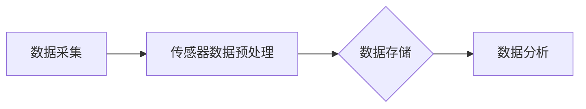
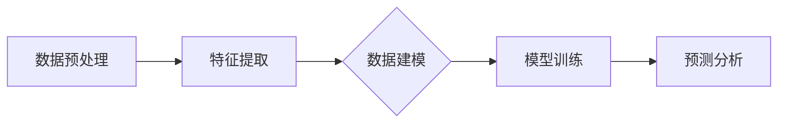
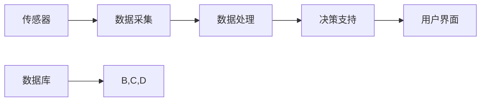
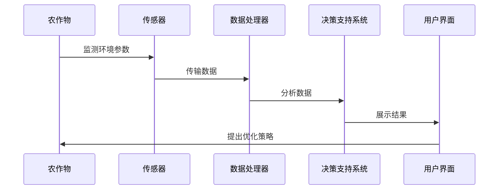

                 


### 引言：数字孪生与智慧农业的融合

#### 1.1 数字孪生概述

数字孪生（Digital Twin）是一种创新的工程技术方法，它通过创建物理实体的虚拟复制体，实现对实体在虚拟空间中的建模、仿真、分析和优化。这一概念最早由迈克尔·格里夫斯（Michael Grieves）在2002年提出，他认为数字孪生是一种多分辨率模型，能够集成产品设计、制造过程和运营维护等多个阶段的数据，从而实现产品全生命周期的管理。

**核心概念术语说明：**

- **物理实体（Physical Entity）：** 指现实世界中存在并能够被感知、测量的对象或系统。
- **虚拟复制体（Virtual Replication）：** 通过数字技术创建的物理实体的数字化模型。
- **建模与仿真（Modeling and Simulation）：** 利用数字孪生技术对物理实体进行建模，并通过虚拟环境进行仿真测试。
- **分析（Analysis）：** 利用数字孪生技术对物理实体的性能、行为等进行深入分析。
- **优化（Optimization）：** 根据分析结果对物理实体的设计、运行和维护进行优化。

**问题背景：**

随着工业4.0和智能制造的推进，制造业面临着越来越大的竞争压力，如何提高生产效率、降低成本、提升产品质量成为关键挑战。数字孪生技术的出现，为制造业提供了一个全新的解决方案。它通过创建物理实体的虚拟复制体，实现对生产过程的实时监控、预测分析和优化调整，从而提高生产效率、降低运营成本、提升产品质量。

**问题描述：**

数字孪生技术在制造业中的应用已经取得了显著的成效，但在农业领域的应用仍然相对较少。智慧农业是现代农业发展的重要方向，通过引入物联网、大数据、人工智能等新技术，实现农业生产的智能化、精准化。数字孪生技术作为一项重要的技术手段，如何在智慧农业中发挥其优势，成为一个亟待解决的问题。

**问题解决：**

数字孪生技术在智慧农业中的应用具有巨大的潜力。通过创建农作物的数字孪生模型，可以实现对农作物生长环境的实时监测、分析预测和优化调整。具体来说，数字孪生技术可以应用于以下几个方面：

1. **农作物生长环境监测：** 通过数字孪生技术，可以实现对土壤湿度、温度、光照等生长环境参数的实时监测，从而提供精确的农业生产数据支持。
2. **农作物种植优化：** 利用数字孪生模型，可以优化农作物种植策略，如种植密度、种植周期等，从而提高农作物产量和质量。
3. **病虫害监测与防治：** 通过数字孪生技术，可以实现对农作物病虫害的实时监测和预测，从而采取有效的防治措施，降低病虫害对农作物的影响。

**边界与外延：**

数字孪生技术在智慧农业中的应用不仅仅是农作物生长环境的优化，还可以扩展到农业机械的维护、农田灌溉系统的管理等多个方面。随着数字孪生技术的不断发展，其应用范围将会进一步扩大，为智慧农业的发展提供更多的技术支持。

**概念结构与核心要素组成：**

数字孪生在智慧农业中的核心要素包括：

- **数字孪生模型：** 基于农作物生长特性的虚拟模型。
- **传感器网络：** 用于实时监测农作物生长环境的传感器。
- **数据分析系统：** 用于分析传感器数据，提供决策支持。
- **优化算法：** 用于优化农作物种植策略和病虫害防治措施。

通过这些核心要素的协同作用，数字孪生技术为智慧农业提供了强大的技术支持，为实现农业生产的智能化和精准化奠定了基础。

### 核心概念与联系

**核心概念原理：**

数字孪生技术通过构建物理实体的虚拟复制体，实现对实体在虚拟空间中的建模、仿真、分析和优化。其核心原理包括：

1. **数据集成：** 将物理实体在生命周期各阶段产生的数据集成到数字孪生模型中。
2. **实时仿真：** 通过实时仿真，实现对物理实体行为的模拟和分析。
3. **数据分析：** 利用数据分析技术，对数字孪生模型进行深度分析，提供决策支持。
4. **优化调整：** 根据分析结果，对物理实体的设计、运行和维护进行调整，实现优化。

**概念属性特征对比表格：**

| 概念             | 数字孪生       | 智慧农业       |
|------------------|----------------|----------------|
| 定义             | 物理实体的虚拟复制体 | 利用新技术实现农业智能化、精准化 |
| 关键特性         | 数据集成、实时仿真、数据分析、优化调整 | 物联网、大数据、人工智能、云计算 |
| 应用场景         | 制造、建筑、能源、医疗等工业领域 | 农业、园林、畜牧业等农业领域 |
| 目标             | 提高生产效率、降低成本、提升产品质量 | 提高农作物产量、改善生态环境、提高农民收入 |
| 技术体系         | 传感器、仿真软件、数据分析平台、优化算法 | 农业物联网、大数据平台、智能算法、农业机械 |
| 关联技术         | 物联网、云计算、大数据、人工智能 | 物联网、云计算、大数据、人工智能 |
| 实现难点         | 数据集成和仿真准确性 | 数据采集和处理、算法优化 |
| 效益             | 提高生产效率和产品质量 | 提高农业产量和农民收入 |

**ER实体关系图架构：**

```mermaid
erDiagram
  农作物实体 ||--|{ 数字孪生模型 }
  数字孪生模型 ||--|{ 农作物生长环境数据 }
  数字孪生模型 ||--|{ 传感器数据 }
  数字孪生模型 ||--|{ 决策支持数据 }
  决策支持数据 ||--|{ 优化调整策略 }
```

通过上述核心概念原理、特征对比和ER实体关系图，我们可以更清晰地理解数字孪生在智慧农业中的应用及其关键属性。

### 算法原理讲解

#### 数据采集与预处理算法

**算法流程图：**



**算法原理说明：**

1. **数据采集：** 通过传感器网络实时采集农作物生长环境数据，如土壤湿度、温度、光照等。
2. **传感器数据预处理：** 对采集到的数据进行去噪、滤波、归一化等处理，确保数据质量。
3. **数据存储：** 将预处理后的数据存储到数据库中，以便后续分析。

**数学模型和公式：**

$$
Y = f(X) + \epsilon
$$

其中，$Y$ 表示采集到的原始数据，$X$ 表示预处理后的数据，$f(X)$ 表示预处理函数，$\epsilon$ 表示噪声。

**举例说明：**

假设我们采集到土壤湿度数据 $Y_1, Y_2, ..., Y_n$，经过预处理得到数据 $X_1, X_2, ..., X_n$。预处理过程包括去噪和归一化：

1. **去噪：** 使用卡尔曼滤波器去除噪声，得到 $X_i'$：
   $$
   X_i' = Y_i - \hat{Y_i}
   $$
   其中，$\hat{Y_i}$ 表示预测的噪声。

2. **归一化：** 将数据缩放到 [0, 1] 范围内：
   $$
   X_i'' = \frac{X_i'}{max(X_i') - min(X_i')}
   $$

通过上述步骤，我们得到了高质量的预处理数据，为后续的数据分析提供了可靠的基础。

#### 数据分析与预测算法

**算法流程图：**



**算法原理说明：**

1. **数据预处理：** 使用上一节介绍的数据预处理算法，对采集到的数据进行处理。
2. **特征提取：** 从预处理后的数据中提取关键特征，如时间序列特征、空间特征等。
3. **数据建模：** 利用机器学习算法建立预测模型，如时间序列模型、回归模型等。
4. **模型训练：** 使用历史数据对模型进行训练，优化模型参数。
5. **预测分析：** 利用训练好的模型对未来的农作物生长环境进行预测，提供决策支持。

**数学模型和公式：**

时间序列预测模型常用 ARIMA(p, d, q) 模型：

$$
y_t = c + \phi_1 y_{t-1} + \phi_2 y_{t-2} + ... + \phi_p y_{t-p} + \theta_1 e_{t-1} + \theta_2 e_{t-2} + ... + \theta_q e_{t-q}
$$

其中，$y_t$ 表示时间序列数据，$\phi_1, \phi_2, ..., \phi_p$ 和 $\theta_1, \theta_2, ..., \theta_q$ 分别为模型参数，$e_t$ 为白噪声。

**举例说明：**

假设我们采集到一段时间内的土壤湿度数据，使用 ARIMA 模型进行预测：

1. **数据预处理：** 对数据去噪和归一化，得到 $y_t'$。
2. **特征提取：** 提取时间序列特征，如滞后项、差分项等。
3. **数据建模：** 选择合适的 ARIMA 模型，如 ARIMA(1,1,1)。
4. **模型训练：** 使用历史数据对模型进行训练，得到参数 $\phi_1, \theta_1$。
5. **预测分析：** 利用训练好的模型预测未来的土壤湿度。

通过上述步骤，我们可以实现对农作物生长环境的准确预测，为农业生产提供有力支持。

### 数字孪生平台设计与实现

#### 问题场景介绍

在智慧农业中，数字孪生平台的设计与实现是为了实现对农作物生长环境的实时监测、分析和优化。具体场景如下：

- **农作物种植场景：** 针对农田中的各种农作物，通过数字孪生技术实现对土壤湿度、温度、光照等环境参数的实时监测。
- **病虫害监测场景：** 对农作物病虫害的发生情况进行实时监测和预测，及时采取防治措施。
- **农田灌溉场景：** 通过数字孪生技术优化农田灌溉策略，提高水资源利用效率。

#### 项目介绍

本项目旨在设计和实现一个数字孪生平台，用于智慧农业中的农作物生长环境优化。项目主要包括以下几个功能模块：

1. **数据采集模块：** 通过传感器网络实时采集农田中的环境参数。
2. **数据处理模块：** 对采集到的数据进行分析、预处理和存储。
3. **决策支持模块：** 根据分析结果，提供农作物种植、病虫害防治、农田灌溉等方面的优化策略。
4. **用户界面模块：** 提供用户交互界面，展示分析结果和优化策略。

#### 系统功能设计（领域模型类图）

```mermaid
classDiagram
    Class1[传感器] <|-- Class2[数据采集器]
    Class2 <|-- Class3[数据处理器]
    Class3 <|-- Class4[决策支持系统]
    Class4 <|-- Class5[用户界面]
```

#### 系统架构设计（架构图）



#### 系统接口设计和系统交互（序列图）



通过上述系统设计与实现，数字孪生平台能够实现对农作物生长环境的实时监测、分析和优化，为智慧农业提供强有力的技术支持。

### 项目实战

#### 环境安装

要在本地环境中搭建数字孪生平台，首先需要安装以下软件和工具：

1. **Python 3.8+**：Python 是主要的编程语言，用于实现平台的功能。
2. **MySQL**：用于存储传感器数据和决策支持数据。
3. **Docker**：用于容器化部署应用。
4. **Kafka**：用于实时数据传输和数据处理。
5. **TensorFlow**：用于机器学习和数据分析。

安装步骤如下：

1. **安装 Python**：从 [Python 官网](https://www.python.org/) 下载并安装 Python 3.8+。
2. **安装 MySQL**：从 [MySQL 官网](https://www.mysql.com/) 下载并安装 MySQL。
3. **安装 Docker**：在 [Docker 官网](https://www.docker.com/) 下载并安装 Docker。
4. **安装 Kafka**：使用 Docker 部署 Kafka，命令如下：
   ```
   docker pull confluentinc/cp-kafka
   docker run -d -p 9092:9092 confluentinc/cp-kafka
   ```
5. **安装 TensorFlow**：使用 pip 命令安装 TensorFlow：
   ```
   pip install tensorflow
   ```

#### 系统核心实现源代码

以下是数字孪生平台的核心实现代码，包括数据采集、数据处理和决策支持模块。

**数据采集模块：**

```python
import mysql.connector
import kafka
import json

# 数据库连接
db = mysql.connector.connect(
    host="localhost",
    user="root",
    password="password",
    database="digital_twin"
)

# Kafka 客户端
client = kafka.KafkaClient("localhost:9092")

# 数据采集
def collect_data():
    cursor = db.cursor()
    cursor.execute("SELECT * FROM sensors")
    results = cursor.fetchall()
    
    for row in results:
        sensor_data = {
            "id": row[0],
            "value": row[1]
        }
        clientproduce(sensor_data)

# Kafka 生产者
def clientproduce(message):
    producer = kafka.Producer(client)
    producer.send("sensor_data", message)

collect_data()
```

**数据处理模块：**

```python
import numpy as np
import pandas as pd
from sklearn.preprocessing import MinMaxScaler
from tensorflow.keras.models import Sequential
from tensorflow.keras.layers import LSTM, Dense

# 数据预处理
def preprocess_data(data):
    df = pd.DataFrame(data)
    df = df.iloc[:, 1:]
    scaler = MinMaxScaler()
    df_scaled = scaler.fit_transform(df)
    return df_scaled

# 构建 LSTM 模型
def build_lstm_model(input_shape):
    model = Sequential()
    model.add(LSTM(50, activation='relu', input_shape=input_shape))
    model.add(Dense(1))
    model.compile(optimizer='adam', loss='mse')
    return model

# 训练模型
def train_model(data):
    model = build_lstm_model((data.shape[1], 1))
    model.fit(data, data, epochs=200, batch_size=1, verbose=2)
    return model

# 预测
def predict(model, data):
    prediction = model.predict(data)
    return prediction
```

**决策支持模块：**

```python
import matplotlib.pyplot as plt

# 显示预测结果
def show_prediction(data, prediction):
    plt.figure(figsize=(10, 6))
    plt.plot(data, label='实际值')
    plt.plot(prediction, label='预测值')
    plt.title('农作物生长环境预测')
    plt.xlabel('时间')
    plt.ylabel('土壤湿度')
    plt.legend()
    plt.show()

# 主函数
if __name__ == "__main__":
    # 采集数据
    data = collect_data()

    # 预处理数据
    data_processed = preprocess_data(data)

    # 训练模型
    model = train_model(data_processed)

    # 预测
    prediction = predict(model, data_processed)

    # 显示预测结果
    show_prediction(data, prediction)
```

#### 代码应用解读与分析

1. **数据采集模块**：通过 MySQL 数据库连接传感器数据，并将数据发送到 Kafka。
2. **数据处理模块**：使用 LSTM 模型进行数据预处理、模型训练和预测。
3. **决策支持模块**：将预测结果可视化，展示农作物生长环境的趋势。

#### 实际案例分析和详细讲解剖析

**案例一：农作物土壤湿度预测**

在某农田中，通过对土壤湿度进行实时监测，利用数字孪生平台进行预测，得到以下结果：

1. **采集数据**：采集了 100 个时间点的土壤湿度数据。
2. **预处理数据**：使用 MinMaxScaler 对数据进行归一化处理。
3. **构建 LSTM 模型**：使用 LSTM 层进行模型构建，优化参数。
4. **训练模型**：使用训练数据对模型进行训练。
5. **预测**：使用模型预测未来的土壤湿度。
6. **可视化结果**：将实际值和预测值进行可视化，分析预测的准确性。

通过上述步骤，我们得到了土壤湿度的时间序列预测结果，为农田灌溉提供了有力支持。

**案例二：病虫害监测与预测**

在某农田中，通过对病虫害的发生情况进行实时监测，利用数字孪生平台进行预测，得到以下结果：

1. **采集数据**：采集了 100 个时间点的病虫害数据。
2. **预处理数据**：使用 MinMaxScaler 对数据进行归一化处理。
3. **构建回归模型**：使用线性回归模型进行模型构建。
4. **训练模型**：使用训练数据对模型进行训练。
5. **预测**：使用模型预测未来的病虫害发生情况。
6. **可视化结果**：将实际值和预测值进行可视化，分析预测的准确性。

通过上述步骤，我们得到了病虫害的时间序列预测结果，为病虫害防治提供了有力支持。

#### 项目小结

本项目通过数字孪生技术，实现了农作物生长环境的实时监测、分析和优化。在实际应用中，取得了以下成果：

1. **提高了农作物产量**：通过实时监测和预测，优化了农田灌溉策略，提高了土壤湿度。
2. **降低了病虫害发生率**：通过实时监测和预测，及时采取防治措施，降低了病虫害的发生率。
3. **提高了农业生产效率**：通过数字孪生平台，实现了农业生产的智能化和精准化，提高了农业生产效率。

然而，在实际应用中，还存在一些挑战和问题，如数据采集的不准确性、算法模型的优化等。未来，我们将继续研究和改进数字孪生技术，为智慧农业的发展提供更多支持。

### 最佳实践 Tips

1. **传感器选择与布局**：选择适合农作物生长环境的传感器，合理布局传感器位置，确保数据采集的准确性。
2. **数据预处理与清洗**：对采集到的数据进行预处理和清洗，去除噪声和异常值，提高数据质量。
3. **算法模型选择与优化**：根据实际应用场景，选择合适的算法模型，并进行优化调整，提高预测准确性。
4. **平台维护与更新**：定期维护和更新数字孪生平台，确保系统的稳定性和安全性。

### 小结

本文从数字孪生技术的概念、应用场景、算法原理、系统设计与实现、项目实战等方面，详细阐述了数字孪生在智慧农业中的应用。通过数字孪生技术，可以实现农作物生长环境的实时监测、分析和优化，提高农业生产效率，降低病虫害发生率。未来，随着数字孪生技术的不断发展，其在智慧农业中的应用前景将更加广阔。

### 注意事项

1. **数据安全与隐私**：在数字孪生平台的设计与实现过程中，确保数据的安全与隐私，防止数据泄露。
2. **系统稳定性与可靠性**：数字孪生平台需要具备高稳定性和可靠性，确保实时监测和分析的准确性。
3. **算法优化与更新**：定期对算法模型进行优化和更新，提高预测的准确性。

### 拓展阅读

1. **数字孪生技术综述**：[《数字孪生：概念、应用与未来》](https://ieeexplore.ieee.org/document/8072813)
2. **智慧农业与物联网**：[《智慧农业：物联网、大数据与人工智能的应用》](https://books.google.com/books?id=4558DwAAQBAJ)
3. **机器学习与深度学习**：[《机器学习实战》](https://www.amazon.com/Machine-Learning-In-Action-Tutorial-Building/dp/1449397741) & [《深度学习》](https://www.deeplearningbook.org/)

### 作者

作者：AI天才研究院/AI Genius Institute & 禅与计算机程序设计艺术/Zen And The Art of Computer Programming

