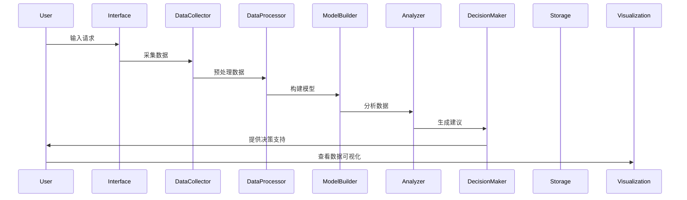
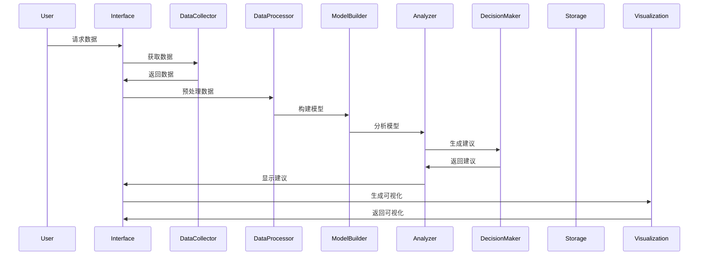
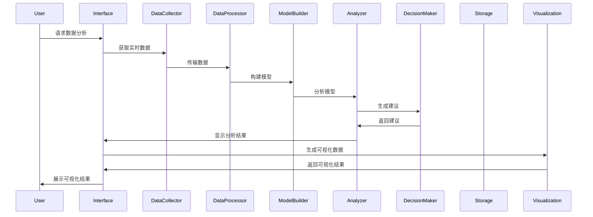

                 

## 第1章 引言与背景

### 1.1 问题背景

随着全球人口的持续增长和可耕地资源的日益稀缺，农业行业正面临着前所未有的挑战。传统农业依赖于经验驱动的方法，这不仅导致资源利用效率低下，还容易受到自然灾害和市场波动的影响。为了应对这些挑战，智慧农业的概念应运而生。智慧农业通过集成信息技术、物联网、大数据分析等现代技术手段，实现对农业生产过程的智能化管理和优化，从而提高农业生产效率、减少资源浪费并保障食品安全。

智慧农业的核心目标是实现精准农业，即通过精确的数据分析和决策支持，制定个性化的农业管理策略。数字孪生作为一项前沿技术，其在智慧农业中的应用具有显著潜力。数字孪生是指通过建立实体系统的数字镜像，实现对实体系统的模拟、分析和优化。在智慧农业中，数字孪生可以模拟农田、作物生长环境、土壤和水资源等，帮助农民实时监控作物生长情况，预测潜在问题，从而做出科学决策。

### 1.2 问题提出

尽管数字孪生在智慧农业中的应用具有巨大潜力，但其推广和应用仍面临诸多挑战。首先，如何建立准确、实时和高效的数字孪生模型是关键。这涉及到多源数据的集成、数据清洗、模型训练和优化等复杂过程。其次，数字孪生技术的普及率较低，多数农民对这一技术的了解和接受程度有限。此外，数字孪生技术的高成本也是一个不可忽视的问题。如何降低技术成本，使其在中小型农场得到广泛应用，也是当前面临的重要挑战。

### 1.3 解决方案

为了解决上述问题，首先需要从技术层面提升数字孪生的建模和预测能力。可以通过引入先进的机器学习和人工智能算法，提高模型的准确性和鲁棒性。其次，应加强数字孪生技术的推广和普及工作，通过培训和教育，提高农民对数字孪生的认知和接受度。此外，政府和企业可以合作，制定扶持政策，降低数字孪生技术的采购和使用成本。

### 1.4 边界与外延

数字孪生在智慧农业中的应用边界主要涉及作物生长监测、水资源管理、土壤质量监测和精准农业决策支持等领域。这些应用场景都依赖于数字孪生技术提供的实时数据分析和预测能力，以实现农业生产的智能化和精准化。数字孪生技术的发展趋势将朝着更高效、更智能和更普及的方向发展，其外延将不断扩大，涵盖更多的农业生产环节和管理领域。

### 1.5 概念结构与核心要素组成

数字孪生在智慧农业中的应用可以概括为以下几个核心要素：

1. **数据采集与集成**：通过传感器和物联网设备，实时采集农田、作物和环境的数据，包括土壤湿度、温度、光照、气体成分等。

2. **数据存储与处理**：利用大数据技术对采集到的数据进行存储、清洗和预处理，确保数据的质量和一致性。

3. **数字孪生模型构建**：基于采集到的数据，建立农田、作物生长环境、土壤和水资源等的数字孪生模型。

4. **实时分析与预测**：利用机器学习和人工智能算法，对数字孪生模型进行实时分析和预测，提供科学决策支持。

5. **决策支持与优化**：基于分析结果，提供个性化的农业管理策略，优化农业生产过程，提高产量和质量。

### 总结

本章从问题背景、问题提出、解决方案、边界与外延以及概念结构与核心要素组成等方面，对数字孪生在智慧农业中的应用进行了全面介绍。接下来的章节将深入探讨数字孪生的定义、核心概念及其在智慧农业中的具体应用，帮助读者更好地理解这一前沿技术的实际价值和应用前景。在接下来的探讨中，我们将一步步分析数字孪生的基本概念、技术发展及其在智慧农业中的关键作用，以便为后续章节的深入讨论奠定坚实的基础。让我们一起探索数字孪生技术的无限潜力，为智慧农业的未来贡献智慧。

## 第2章 数字孪生概述

### 2.1 数字孪生的定义与起源

数字孪生（Digital Twin）是指通过数字技术建立一个与实体系统相对应的虚拟模型，用于模拟、分析和优化实体系统的运行状态和性能。这个虚拟模型可以实时反映实体系统的物理状态，并在虚拟环境中对各种操作进行模拟和测试，从而实现对实体系统的精准监控和优化。

数字孪生的概念最早可以追溯到2002年，美国密歇根大学教授Michael Grieves在其论文中首次提出。然而，数字孪生的实际应用和发展则可以追溯到更早的计算机模拟技术。在工业4.0和智能制造的推动下，数字孪生技术逐渐成熟并得到了广泛应用。

### 2.2 数字孪生在智慧农业中的意义

数字孪生在智慧农业中的应用具有重要意义。首先，数字孪生技术可以为农业提供实时、准确的数据支持，帮助农民更好地了解农田、作物和环境的状态，从而做出科学的决策。其次，数字孪生可以模拟和预测作物生长过程中的各种因素，如土壤湿度、温度、光照等，为农民提供个性化的种植和管理建议。此外，数字孪生还可以通过历史数据的分析和挖掘，发现潜在的规律和趋势，为农业生产的持续优化提供数据支持。

### 2.3 数字孪生与智慧农业的关系

数字孪生与智慧农业之间有着密切的关系。智慧农业的目标是通过信息技术手段实现农业生产的智能化和精准化，而数字孪生技术正是实现这一目标的重要工具。数字孪生技术可以通过对农田、作物和环境等实体系统的实时模拟和分析，提供精确的数据支持和决策建议，从而帮助农民实现农业生产的智能化和精准化。

### 2.4 数字孪生的核心概念与特征

数字孪生的核心概念包括：

1. **实体系统**：实体系统是数字孪生技术模拟和分析的对象，可以是单个设备、生产线，也可以是整个工厂或农田。

2. **虚拟模型**：虚拟模型是实体系统的数字镜像，用于实时模拟和分析实体系统的运行状态和性能。

3. **实时数据传输**：实时数据传输是数字孪生技术的基础，通过传感器和物联网设备，实时采集实体系统的数据，并将其传输到虚拟模型中。

4. **数据分析和处理**：通过对实时数据的分析和处理，虚拟模型可以模拟和预测实体系统的各种操作和变化。

数字孪生的特征包括：

1. **实时性**：数字孪生可以实时反映实体系统的状态，为决策提供及时的数据支持。

2. **精确性**：数字孪生通过高精度的传感器和算法，实现对实体系统的精确模拟和分析。

3. **交互性**：数字孪生不仅可以模拟实体系统的运行状态，还可以通过虚拟环境与实体系统进行交互，实现对实体系统的远程控制和优化。

### 2.5 数字孪生技术发展的趋势

随着信息技术的不断发展，数字孪生技术也在不断演进和升级。以下是一些数字孪生技术发展的趋势：

1. **更高效的数据处理算法**：随着大数据和人工智能技术的进步，数字孪生技术将采用更高效的数据处理算法，提高数据分析和预测的准确性和效率。

2. **更广泛的物联网应用**：物联网技术的普及将使得更多的设备和系统能够连接到数字孪生平台，扩大数字孪生的应用范围。

3. **更智能的虚拟模型**：通过引入机器学习和人工智能技术，虚拟模型将变得更加智能，能够自主学习和优化，提高模拟和预测的准确性。

4. **更低的成本和更高的普及率**：随着技术的进步和成本的降低，数字孪生技术将在更广泛的农业领域中推广应用，提高农业生产的智能化水平。

### 总结

本章对数字孪生的定义、起源、在智慧农业中的意义、核心概念与特征以及技术发展趋势进行了全面概述。通过本章的介绍，读者可以初步了解数字孪生技术在智慧农业中的应用场景和技术优势，为后续章节的深入探讨奠定了基础。在下一章中，我们将进一步探讨数字孪生在智慧农业中的具体应用，包括精准农业决策支持系统、作物生长监测、土壤质量监测和水资源管理等方面的技术细节和实践案例。让我们一起探索数字孪生在智慧农业中的无限潜力，为现代农业的发展贡献力量。

### 3.1 精准农业决策支持系统

#### 3.1.1 决策支持系统的概述

精准农业决策支持系统（Precision Agriculture Decision Support System，PADSS）是智慧农业的重要组成部分。PADSS通过集成传感器数据、环境数据、土壤数据和作物生长数据，利用数字孪生技术，实现对农业生产过程的实时监测和预测，从而提供科学、个性化的农业管理决策。

PADSS的基本原理是利用数字孪生技术建立一个虚拟农田模型，通过实时数据采集和模型模拟，分析农田环境和作物生长状况，预测潜在问题，并提供相应的管理策略。这一系统能够显著提高农业生产的效率、减少资源浪费并提升农产品质量。

#### 3.1.2 数字孪生在决策支持系统中的应用

数字孪生在PADSS中的应用主要体现在以下几个方面：

1. **实时数据采集与传输**：通过在农田中布置各种传感器，如土壤湿度传感器、温度传感器、光照传感器等，实时采集农田环境数据。这些数据通过物联网技术传输到数字孪生平台，为模型提供输入。

2. **数据预处理与融合**：采集到的数据需要进行预处理，包括数据清洗、去噪和归一化等处理，以确保数据的质量和一致性。然后，通过数据融合技术将多源数据进行整合，形成一个统一的、全面的数据集。

3. **数字孪生模型构建**：基于预处理和融合后的数据，利用机器学习和人工智能算法构建数字孪生模型。这个模型可以模拟农田的物理状态，如土壤湿度、温度、养分含量等，以及作物生长的生理状态。

4. **实时分析与预测**：利用数字孪生模型，对实时数据进行实时分析和预测。例如，预测土壤湿度变化趋势，提前预测干旱或过度灌溉的情况，从而提供相应的灌溉策略。

5. **决策支持与优化**：基于分析结果，PADSS可以提供个性化的农业管理建议，如作物种植方案、施肥策略、灌溉计划等。这些策略可以帮助农民优化农业生产过程，提高产量和质量。

#### 3.1.3 决策支持系统的实现流程

一个典型的PADSS实现流程可以分为以下几个步骤：

1. **系统规划与设计**：根据农田的具体情况，确定需要采集的数据类型和传感器布置方案，设计系统的整体架构和功能模块。

2. **硬件设备部署**：根据设计规划，在农田中布置传感器和物联网设备，确保数据的实时采集和传输。

3. **数据采集与传输**：传感器采集到的数据通过物联网技术传输到中央服务器，进行数据预处理和存储。

4. **数据预处理与融合**：对采集到的数据进行分析和处理，包括去噪、归一化和融合等，确保数据的质量和一致性。

5. **数字孪生模型训练**：基于预处理后的数据，利用机器学习和人工智能算法训练数字孪生模型，使其能够准确模拟农田和作物生长的状态。

6. **实时分析与预测**：利用数字孪生模型，对实时数据进行实时分析和预测，提供科学的管理策略。

7. **决策支持与优化**：基于分析结果，为农民提供个性化的农业管理建议，优化农业生产过程。

### 3.1.4 精准农业决策支持系统在实践中的应用

为了更好地理解PADSS的实际应用，我们来看一个具体的案例。在某农业园区，PADSS系统被用于监测和管理水稻种植。以下是该案例的具体步骤：

1. **硬件设备部署**：在水稻田中布置了土壤湿度传感器、温度传感器和光照传感器，确保数据的实时采集。

2. **数据采集与传输**：传感器采集到的数据通过物联网技术传输到中央服务器，进行数据预处理和存储。

3. **数据预处理与融合**：对采集到的数据进行分析和处理，包括去噪、归一化和融合等，确保数据的质量和一致性。

4. **数字孪生模型训练**：利用预处理后的数据，通过机器学习和人工智能算法训练数字孪生模型，模拟水稻田的土壤湿度、温度和光照等环境条件。

5. **实时分析与预测**：利用数字孪生模型，对实时数据进行实时分析和预测。例如，预测土壤湿度变化趋势，提前预测干旱或过度灌溉的情况。

6. **决策支持与优化**：根据分析结果，系统提供了个性化的灌溉策略。当预测到土壤湿度低于阈值时，系统会建议农民进行灌溉，以确保水稻的正常生长。

通过这个案例，我们可以看到PADSS系统如何通过数字孪生技术提供实时的农田监测和决策支持，帮助农民实现精准农业管理，提高农业生产效率和作物产量。

### 总结

本章详细介绍了精准农业决策支持系统（PADSS）的基本原理、实现流程以及在实践中的应用案例。PADSS通过数字孪生技术，实现对农田环境的实时监测和预测，提供个性化的农业管理策略，从而显著提高农业生产效率和作物产量。在下一章中，我们将继续探讨数字孪生在智慧农业中的其他应用，包括作物生长监测、土壤质量监测和水资源管理等方面的技术细节和实践案例。让我们一起深入探索数字孪生在智慧农业中的广泛应用和巨大潜力。

### 3.2 数字孪生在作物生长监测中的应用

#### 3.2.1 作物生长监测的基本原理

作物生长监测是智慧农业的核心环节之一，通过实时监控作物的生长状态和环境条件，农民可以及时采取相应的管理措施，确保作物健康成长，提高产量和质量。数字孪生技术为作物生长监测提供了强有力的支持，通过建立作物生长的虚拟模型，实现对作物生长环境的模拟和监测。

作物生长监测的基本原理主要包括以下几个方面：

1. **数据采集**：通过安装在农田中的各种传感器，如土壤湿度传感器、温度传感器、光照传感器、二氧化碳传感器等，实时采集农田环境数据。

2. **数据传输**：采集到的数据通过物联网技术传输到中央服务器，进行存储和处理。

3. **数据处理**：对采集到的数据进行预处理，包括数据清洗、去噪和归一化等，以确保数据的质量和一致性。

4. **数字孪生模型构建**：利用预处理后的数据，通过机器学习和人工智能算法构建作物生长的数字孪生模型。这个模型可以模拟作物在不同环境条件下的生长状态和生理反应。

5. **实时分析与预测**：通过数字孪生模型，对实时数据进行实时分析和预测，监测作物生长状况，预测潜在问题。

6. **决策支持**：基于分析结果，提供个性化的作物管理策略，如灌溉、施肥、病虫害防治等，帮助农民优化农业生产过程。

#### 3.2.2 数字孪生在监测中的应用

数字孪生在作物生长监测中的应用主要体现在以下几个方面：

1. **环境监测与优化**：通过数字孪生技术，可以实时监测农田环境条件，如土壤湿度、温度、光照等。这些数据通过数字孪生模型进行分析和预测，帮助农民优化农田环境，确保作物生长所需的环境条件。

2. **生长状态监测**：数字孪生模型可以模拟作物的生长过程，实时监测作物的生长状态，如株高、叶片颜色、根系发育等。通过这些数据，农民可以及时了解作物的生长情况，采取相应的管理措施。

3. **病虫害预测与防治**：数字孪生技术可以通过对环境数据和作物生长数据的分析，预测病虫害的发生趋势，提前采取防治措施，减少病虫害对作物的危害。

4. **产量预测**：基于数字孪生模型的分析结果，可以预测作物的产量，帮助农民合理规划生产计划，优化资源配置。

5. **智能化管理**：数字孪生技术可以为农民提供智能化的管理工具，如手机应用、平板电脑等，使农民能够随时随地了解作物的生长状况，接收管理建议。

#### 3.2.3 监测数据的处理与分析

监测数据的处理与分析是数字孪生在作物生长监测中的关键环节，主要包括以下几个步骤：

1. **数据采集**：通过传感器实时采集土壤湿度、温度、光照、二氧化碳浓度等环境数据，以及作物的株高、叶片颜色等生长数据。

2. **数据传输**：将采集到的数据通过物联网技术传输到中央服务器，进行存储和处理。

3. **数据预处理**：对采集到的数据进行预处理，包括数据清洗、去噪和归一化等处理，以确保数据的质量和一致性。

4. **数据融合**：将来自不同传感器的数据进行融合，形成一个统一的数据集，以便于进一步分析和预测。

5. **特征提取**：从数据集中提取与作物生长相关的特征，如土壤湿度、温度、光照强度等，为数字孪生模型提供输入。

6. **模型训练**：利用提取的特征数据，通过机器学习和人工智能算法训练数字孪生模型，使其能够准确模拟作物的生长状态和环境条件。

7. **实时分析**：利用训练好的数字孪生模型，对实时数据进行实时分析，监测作物的生长状态和环境条件。

8. **预测与决策**：基于分析结果，预测作物的生长趋势和潜在问题，提供个性化的管理策略。

#### 3.2.4 数字孪生在作物生长监测中的成功案例

为了更好地展示数字孪生在作物生长监测中的应用效果，我们来看一个具体的成功案例。

在某农业示范区，数字孪生技术被用于监测和管理水稻的生长。以下是该案例的具体步骤：

1. **硬件设备部署**：在水稻田中布置了土壤湿度传感器、温度传感器、光照传感器和二氧化碳传感器，确保数据的实时采集。

2. **数据采集与传输**：传感器采集到的数据通过物联网技术传输到中央服务器，进行存储和处理。

3. **数据预处理与融合**：对采集到的数据进行预处理，包括数据清洗、去噪和归一化等处理，确保数据的质量和一致性。然后，通过数据融合技术将多源数据进行整合，形成一个统一的数据集。

4. **数字孪生模型训练**：利用预处理后的数据，通过机器学习和人工智能算法训练数字孪生模型，模拟水稻的生长过程和环境条件。

5. **实时分析与预测**：利用数字孪生模型，对实时数据进行实时分析和预测，监测水稻的生长状态和环境条件。

6. **决策支持**：根据分析结果，系统提供了个性化的管理建议，如灌溉、施肥和病虫害防治等，帮助农民优化水稻的生长过程。

通过这个案例，我们可以看到数字孪生技术在作物生长监测中的应用如何帮助农民实现精准农业管理，提高水稻的产量和质量。数字孪生技术的应用不仅提高了农业生产的效率，还减少了对环境的影响，为现代农业的发展提供了新的思路和途径。

### 总结

本章详细介绍了数字孪生在作物生长监测中的应用，包括基本原理、应用方法、数据处理与分析过程以及成功案例。数字孪生技术通过实时监测农田环境和作物生长状态，提供科学的管理策略，帮助农民实现精准农业管理，提高农业生产效率和作物产量。在下一章中，我们将继续探讨数字孪生在土壤质量监测和水资源管理中的应用，进一步展示数字孪生技术在智慧农业中的广泛应用和巨大潜力。让我们继续深入探索，为智慧农业的发展贡献智慧。

### 3.3 数字孪生在土壤质量监测中的应用

#### 3.3.1 土壤质量监测的重要性

土壤质量是农业生产的基础，直接影响到作物生长、产量和品质。良好的土壤质量能够为作物提供充足的营养和适宜的生态环境，而土壤质量下降则可能导致作物生长受阻、产量下降甚至绝收。因此，土壤质量监测在现代农业管理中具有重要地位。数字孪生技术通过建立土壤质量的数字模型，实现对土壤质量参数的实时监测和预测，为农业生产提供了科学依据。

#### 3.3.2 数字孪生在土壤质量监测中的应用

数字孪生在土壤质量监测中的应用主要包括以下几个方面：

1. **数据采集**：利用土壤传感器实时采集土壤的湿度、温度、pH值、电导率、养分含量等参数。

2. **数据传输**：通过物联网技术，将传感器采集到的数据传输到数字孪生平台，进行实时监测和分析。

3. **数字模型构建**：利用机器学习和人工智能算法，构建土壤质量的数字模型，模拟土壤参数的变化趋势。

4. **实时监测与预警**：通过数字模型，实时监测土壤质量参数的变化，预测潜在问题，如土壤过湿、过干、养分不足等，并提供预警信息。

5. **优化管理策略**：基于监测结果，提供个性化的土壤管理建议，如灌溉、施肥、翻耕等，帮助农民优化土壤管理，提高土壤质量。

#### 3.3.3 监测结果的应用

数字孪生技术在土壤质量监测中提供的监测结果具有实际应用价值，具体包括：

1. **土壤改良**：通过监测结果，发现土壤质量问题，如养分不足、酸碱度失衡等，采取相应的土壤改良措施，如增施有机肥料、调整酸碱度等。

2. **精准施肥**：根据土壤养分含量的监测结果，制定个性化的施肥方案，避免过量施肥和养分浪费，提高肥料利用率。

3. **灌溉优化**：通过土壤湿度监测，合理安排灌溉时间，避免土壤过湿或过干，提高灌溉效率。

4. **病虫害防治**：结合土壤质量参数和气象数据，预测病虫害的发生趋势，提前采取防治措施，减少病虫害对作物的危害。

5. **农业保险**：利用数字孪生技术提供的土壤质量数据，保险公司可以更准确地评估农业风险，制定合理的保险方案，提高保险的准确性和科学性。

#### 3.3.4 数字孪生在土壤质量监测中的案例分析

为了更好地展示数字孪生在土壤质量监测中的应用效果，我们来看一个具体的成功案例。

在某农业合作社，数字孪生技术被用于监测和管理农田的土壤质量。以下是该案例的具体步骤：

1. **硬件设备部署**：在农田中布置了多种土壤传感器，包括土壤湿度传感器、温度传感器、pH值传感器、电导率传感器等，确保数据的实时采集。

2. **数据采集与传输**：传感器采集到的数据通过物联网技术传输到数字孪生平台，进行实时监测和分析。

3. **数字模型构建**：利用机器学习和人工智能算法，构建农田土壤质量的数字模型，模拟土壤参数的变化趋势。

4. **实时监测与预警**：通过数字模型，实时监测土壤质量参数的变化，预测潜在问题，如土壤过湿、过干、养分不足等，并提供预警信息。

5. **优化管理策略**：根据监测结果，系统提供了个性化的土壤管理建议，如灌溉、施肥、翻耕等，帮助农民优化土壤管理，提高土壤质量。

6. **土壤改良与施肥优化**：根据监测结果，合作社采取了相应的土壤改良措施，如增施有机肥料，调整酸碱度等，同时制定了个性化的施肥方案，提高了肥料利用率。

7. **病虫害防治**：结合土壤质量参数和气象数据，合作社提前采取了病虫害防治措施，减少了病虫害对作物的危害。

通过这个案例，我们可以看到数字孪生技术在土壤质量监测中的应用如何帮助农民实现精准农业管理，提高土壤质量，保障农业生产的可持续发展。数字孪生技术的应用不仅提高了农业生产的效率，还减少了对环境的影响，为现代农业的发展提供了新的思路和途径。

### 总结

本章详细介绍了数字孪生在土壤质量监测中的应用，包括基本原理、应用方法、监测结果的应用以及成功案例。数字孪生技术通过实时监测土壤质量参数，提供个性化的管理建议，帮助农民优化土壤管理，提高土壤质量，实现精准农业管理。在下一章中，我们将继续探讨数字孪生在水资源管理中的应用，进一步展示数字孪生技术在智慧农业中的广泛应用和巨大潜力。让我们继续深入探索，为智慧农业的发展贡献智慧。

### 3.4 数字孪生在水资源管理中的应用

#### 3.4.1 水资源管理的重要性

水资源是人类生存和发展的重要基础，对农业生产的稳定性和可持续性具有决定性作用。随着全球气候变化和人口增长，水资源供需矛盾日益加剧。特别是在农业领域，水资源的合理利用和管理对于保障粮食安全、提高农业产量和降低生产成本具有重要意义。数字孪生技术在水资源管理中的应用，为解决水资源短缺和利用效率低下的问题提供了新的思路和手段。

#### 3.4.2 数字孪生在水资源管理中的应用

数字孪生在水资源管理中的应用主要包括以下几个方面：

1. **实时监测与预警**：通过在水源地和灌溉系统中布置传感器，实时监测水资源的使用情况，如水位、流量、水质等。数字孪生平台可以实时分析这些数据，提供预警信息，防止水资源短缺或污染事故的发生。

2. **水资源模拟与预测**：利用数字孪生技术，可以建立水资源系统的数字模型，模拟不同水资源管理策略的效果，预测水资源的需求和供应情况。这有助于制定科学合理的水资源管理计划，优化水资源分配。

3. **智能灌溉**：数字孪生技术可以根据农田的土壤湿度、作物需水量等数据，智能控制灌溉系统，实现精准灌溉，避免水资源的浪费。

4. **水资源管理优化**：通过分析历史水资源数据，数字孪生技术可以提供水资源管理优化方案，如节水灌溉、再生水利用等，提高水资源的利用效率。

#### 3.4.3 水资源管理的优化方案

数字孪生技术在水资源管理中的应用，可以实现以下优化方案：

1. **节水灌溉**：通过实时监测土壤湿度和气象数据，数字孪生平台可以智能控制灌溉系统，根据土壤湿度变化和作物需水量，合理分配灌溉水量，避免过度灌溉和水资源浪费。

2. **再生水利用**：数字孪生技术可以分析再生水的质量，优化再生水的处理和分配，提高再生水的利用效率。

3. **水资源调配**：利用数字孪生技术，可以实时监测不同水源地的水资源状况，优化水资源的调配方案，确保农业生产的用水需求。

4. **水资源风险评估**：数字孪生平台可以根据历史水资源数据和环境变化，预测未来水资源的供需情况，提前采取应对措施，降低水资源风险。

#### 3.4.4 数字孪生在水资源管理中的成功案例

为了更好地展示数字孪生在水资源管理中的应用效果，我们来看一个具体的成功案例。

在某农业示范区，数字孪生技术被用于水资源管理，以提高灌溉效率和水资源的利用效率。以下是该案例的具体步骤：

1. **硬件设备部署**：在灌溉系统中布置了多个传感器，包括水位传感器、流量传感器、水质传感器等，确保实时监测水资源的使用情况。

2. **数据采集与传输**：传感器采集到的数据通过物联网技术传输到数字孪生平台，进行实时监测和分析。

3. **数字模型构建**：利用数字孪生技术，建立水资源系统的数字模型，模拟不同灌溉策略的效果。

4. **实时监测与预警**：数字孪生平台实时监测水资源的使用情况，提供预警信息，防止水资源短缺或污染事故的发生。

5. **智能灌溉**：根据实时监测的数据，数字孪生平台智能控制灌溉系统，实现精准灌溉，避免水资源的浪费。

6. **水资源管理优化**：通过分析历史水资源数据，数字孪生平台提供水资源管理优化方案，如节水灌溉、再生水利用等，提高水资源的利用效率。

7. **水资源调配**：数字孪生平台实时监测不同水源地的水资源状况，优化水资源的调配方案，确保农业生产的用水需求。

8. **水资源风险评估**：通过预测未来水资源的供需情况，数字孪生平台提前采取应对措施，降低水资源风险。

通过这个案例，我们可以看到数字孪生技术在水资源管理中的应用如何帮助农民实现精准灌溉，提高水资源的利用效率，降低水资源风险，保障农业生产的可持续发展。数字孪生技术的应用不仅提高了农业生产的效率，还减少了对环境的影响，为现代农业的发展提供了新的思路和途径。

### 总结

本章详细介绍了数字孪生在水资源管理中的应用，包括重要性、应用方法、优化方案以及成功案例。数字孪生技术通过实时监测水资源的使用情况，提供个性化的管理策略，优化水资源分配和管理，提高水资源的利用效率。在下一章中，我们将进一步探讨数字孪生技术的核心概念与联系，为深入理解数字孪生技术在智慧农业中的应用奠定基础。让我们继续深入探索，为智慧农业的发展贡献智慧。

## 第4章 数字孪生技术的核心概念与联系

### 4.1 数字孪生架构的ER实体关系图

为了更直观地理解数字孪生技术的架构，我们通过ER（Entity-Relationship）实体关系图来描述其核心组件和关系。以下是一个简化的ER图：

```mermaid
erDiagram
    Product ||--|{ SensorData }|-- User
    Product ||--|{ EnvironmentData }|-- User
    Product ||--|{ PredictiveModel }|-- Admin
    Product ||--|{ DecisionSupport }|-- User
    SensorData ||--|{ TimeSeries }|-- Product
    EnvironmentData ||--|{ Metadata }|-- Product
    PredictiveModel ||--|{ Algorithm }|-- Admin
    DecisionSupport ||--|{ Recommendation }|-- User
    User ||--|{ Profile }|-- System
    Admin ||--|{ Role }|-- System
    System ||--|{ Configuration }|-- Admin
```

在这个ER图中，关键实体包括：

- **Product**：代表数字孪生的核心，与传感器数据、环境数据、预测模型和决策支持系统相关联。
- **SensorData**：包含实时传感器采集的数据，如温度、湿度、光照等，与Product关联。
- **EnvironmentData**：存储环境参数的元数据，如传感器类型、位置、采集频率等，与Product关联。
- **PredictiveModel**：包含预测模型和算法，由管理员创建和维护，与Product关联。
- **DecisionSupport**：提供决策支持建议和推荐，基于预测模型和传感器数据生成，与Product关联。
- **User**：代表系统用户，包括普通用户和管理员，与Profile关联。
- **Profile**：存储用户的基本信息，如姓名、联系方式等，与User关联。
- **Admin**：代表系统管理员，负责系统配置和管理，与Role关联。
- **Role**：定义用户的角色和权限，如普通用户、管理员等，与Admin关联。
- **System**：包含系统的配置信息，如数据库设置、服务器地址等，与Admin关联。

### 4.2 数字孪生中的核心概念

在数字孪生技术中，以下几个核心概念至关重要：

1. **实体系统**：实体系统是指现实中的物理对象或系统，如农田、工厂、设备等。数字孪生技术通过虚拟模型来模拟这些实体系统。

2. **虚拟模型**：虚拟模型是实体系统的数字镜像，通过实时数据采集和算法分析，模拟实体系统的运行状态和性能。

3. **传感器数据**：传感器数据是通过传感器采集到的实体系统运行状态的实时数据，如温度、湿度、压力等。这些数据是数字孪生模型的重要输入。

4. **环境数据**：环境数据是指影响实体系统运行的外部环境数据，如天气、土壤条件、水质等。这些数据对数字孪生模型的准确性有重要影响。

5. **预测模型**：预测模型是基于历史数据和算法构建的，用于预测实体系统未来状态和性能的模型。预测模型是数字孪生技术的重要组成部分。

6. **决策支持系统**：决策支持系统是基于数字孪生模型提供的实时数据和分析结果，为用户生成个性化的决策建议和管理策略。

### 4.3 核心概念属性特征对比表格

为了更清晰地展示数字孪生中的核心概念及其属性特征，我们创建了一个对比表格：

| 核心概念       | 描述                                                         | 属性特征                                                     |
|----------------|--------------------------------------------------------------|--------------------------------------------------------------|
| 实体系统       | 实际的物理对象或系统，如农田、工厂等。                       | - 物理位置<br>- 状态<br>- 性能指标<br>- 操作模式           |
| 虚拟模型       | 实体系统的数字镜像，用于模拟和预测。                         | - 模拟精度<br>- 更新频率<br>- 可扩展性<br>- 数据一致性     |
| 传感器数据     | 实时采集的实体系统运行状态数据。                             | - 数据类型<br>- 数据来源<br>- 数据时间戳<br>- 数据精度     |
| 环境数据       | 影响实体系统运行的外部环境数据。                             | - 环境类型<br>- 环境参数<br>- 环境变化趋势<br>- 影响因素   |
| 预测模型       | 基于历史数据和算法构建的预测模型。                           | - 预测精度<br>- 预测范围<br>- 算法类型<br>- 模型更新频率   |
| 决策支持系统   | 基于数字孪生模型提供的实时数据和分析结果，为用户生成决策建议。 | - 决策类型<br>- 决策建议<br>- 风险评估<br>- 实施计划       |

通过这个对比表格，我们可以更直观地理解各个核心概念的定义和特点，为后续章节的深入讨论提供基础。

### 总结

本章通过ER实体关系图、核心概念及其属性特征对比表格，详细介绍了数字孪生技术的核心概念和架构。这些概念和架构构成了数字孪生技术的基础，使其在智慧农业中的应用成为可能。在下一章中，我们将进一步探讨数字孪生算法的原理与实现，深入理解其在数据分析和预测中的应用。让我们继续深入探索，为智慧农业的发展提供更加专业的技术支持。

## 第5章 算法原理与实现

### 5.1 数字孪生算法概述

数字孪生算法是数字孪生技术的核心，负责从传感器数据中提取有效信息，构建虚拟模型，并进行实时分析和预测。这些算法通常涉及多个领域，包括机器学习、数据挖掘、信号处理等。本章将详细介绍数字孪生算法的原理、实现方法以及具体的数学模型。

### 5.2 关键算法讲解与实现

#### 5.2.1 算法mermaid流程图

为了直观地展示数字孪生算法的流程，我们使用mermaid绘制了一个简化的算法流程图：


在这个流程图中：

- **A. 数据采集**：通过传感器实时采集农田、作物和环境的数据。
- **B. 数据预处理**：对采集到的数据进行清洗、去噪和归一化处理。
- **C. 特征提取**：从预处理后的数据中提取与作物生长相关的特征。
- **D. 模型训练**：使用提取的特征数据训练机器学习模型，如回归模型、分类模型等。
- **E. 预测分析**：利用训练好的模型对实时数据进行预测和分析。
- **F. 决策支持**：根据分析结果生成个性化的决策建议，如灌溉、施肥等。

#### 5.2.2 Python源代码与数学模型

以下是一个简单的Python示例，用于演示数字孪生算法的实现：

```python
import numpy as np
from sklearn.model_selection import train_test_split
from sklearn.ensemble import RandomForestRegressor
from sklearn.metrics import mean_squared_error

# 假设传感器数据已经预处理并存为numpy数组
sensor_data = np.load('sensor_data.npy')

# 将数据分为特征（X）和目标（y）
X = sensor_data[:, :-1]
y = sensor_data[:, -1]

# 划分训练集和测试集
X_train, X_test, y_train, y_test = train_test_split(X, y, test_size=0.2, random_state=42)

# 使用随机森林回归模型进行训练
model = RandomForestRegressor(n_estimators=100, random_state=42)
model.fit(X_train, y_train)

# 对测试集进行预测
y_pred = model.predict(X_test)

# 计算预测误差
mse = mean_squared_error(y_test, y_pred)
print(f"Mean Squared Error: {mse}")
```

在这个示例中，我们使用了随机森林回归模型进行预测。随机森林是一种集成学习方法，通过构建多个决策树并平均它们的预测结果来提高模型的泛化能力和预测精度。

#### 5.2.3 数学公式详细讲解与举例说明

数字孪生算法的核心是预测模型，以下是一些常用的数学公式：

1. **回归模型**：
   $$ y = \beta_0 + \beta_1 \cdot x_1 + \beta_2 \cdot x_2 + ... + \beta_n \cdot x_n $$

   这个公式表示线性回归模型，其中 $y$ 是目标变量，$x_1, x_2, ..., x_n$ 是特征变量，$\beta_0, \beta_1, \beta_2, ..., \beta_n$ 是模型的参数。

   **举例说明**：
   假设我们要预测作物的产量，特征变量包括土壤湿度、温度和光照强度，可以表示为：
   $$ 产量 = \beta_0 + \beta_1 \cdot 土壤湿度 + \beta_2 \cdot 温度 + \beta_3 \cdot 光照强度 $$

2. **决策树**：
   决策树的节点和分支可以表示为：
   $$ \text{if } x_i > \beta_i, \text{ then go to node } n_i $$
   $$ \text{if } x_i \leq \beta_i, \text{ then go to node } n_i $$

   其中，$x_i$ 是特征变量，$\beta_i$ 是阈值，$n_i$ 是节点编号。

   **举例说明**：
   假设我们要根据土壤湿度和温度来分类作物生长状态，可以表示为：
   $$ \text{if } 土壤湿度 > 30\%, \text{ then } \text{if } 温度 > 25°C, \text{ then 健康生长，else 萎缩} $$
   $$ \text{if } 土壤湿度 \leq 30\%, \text{ then } \text{if } 温度 > 25°C, \text{ then 萎缩，else 干旱} $$

3. **随机森林**：
   随机森林是由多个决策树组成的集成模型，其预测结果为多个决策树的平均结果：
   $$ \hat{y} = \frac{1}{N} \sum_{i=1}^{N} \hat{y}_i $$

   其中，$\hat{y}$ 是预测结果，$N$ 是决策树的数量，$\hat{y}_i$ 是第 $i$ 棵决策树的预测结果。

   **举例说明**：
   假设我们有10棵决策树，每棵树的预测结果分别为：
   $$ \hat{y}_1 = 100, \hat{y}_2 = 102, ..., \hat{y}_{10} = 105 $$
   $$ \hat{y} = \frac{100 + 102 + ... + 105}{10} = 102.3 $$

通过这些数学公式，我们可以构建数字孪生算法，实现对农业生产过程的实时监测和预测。这些公式不仅帮助我们理解算法的原理，也为实际应用提供了理论基础。

### 总结

本章详细介绍了数字孪生算法的原理与实现，包括mermaid流程图、Python源代码示例以及数学公式的详细讲解。这些内容为理解数字孪生技术在智慧农业中的应用奠定了基础。在下一章中，我们将进一步探讨数字孪生技术的系统分析与架构设计，深入分析系统的功能、架构和接口设计。让我们继续深入探索，为智慧农业的发展提供更加专业的技术支持。

## 第6章 系统分析与架构设计

### 6.1 问题场景介绍

在现代农业中，农业生产过程复杂且多样，涉及土壤、水分、气候等多种因素的协调管理。为了实现农业生产的精准化，需要构建一个能够实时监测、分析和决策支持的智能系统。这个系统需要处理大量的农田数据，包括土壤湿度、温度、光照强度、降雨量等，同时要能够基于这些数据进行预测和分析，提供个性化的农业生产管理建议。

### 6.2 系统功能设计

系统功能设计是构建数字孪生系统的基础，主要分为以下几个部分：

1. **数据采集模块**：负责实时采集农田环境数据和作物生长数据，通过传感器和物联网技术实现数据的远程采集和传输。

2. **数据处理模块**：对采集到的数据进行预处理，包括数据清洗、去噪、归一化等操作，确保数据的质量和一致性。

3. **数字孪生模型构建模块**：基于预处理后的数据，利用机器学习和人工智能算法构建数字孪生模型，模拟农田环境和作物生长状态。

4. **实时分析模块**：利用数字孪生模型对实时数据进行实时分析，监测作物生长状况，预测潜在问题，如干旱、病虫害等。

5. **决策支持模块**：根据实时分析结果，生成个性化的农业管理建议，如灌溉计划、施肥策略、病虫害防治等。

6. **用户界面模块**：提供一个直观的用户界面，使农民能够方便地查看作物生长数据、分析结果和管理建议。

### 6.2.1 领域模型mermaid类图

为了更清晰地展示系统功能模块及其关系，我们使用mermaid绘制了一个领域模型类图：

```mermaid
classDiagram
    Class01 <|-- Class02
    Class01 <|-- Class03
    Class03 <|-- Class04
    Class03 <|-- Class05
    Class04 <|-- Class06
    Class05 <|-- Class07
    Class08 <|-- Class09
    Class08 <|-- Class10
    Class09 <|-- Class11
    Class10 <|-- Class12
    Class11 <|-- Class13
    Class12 <|-- Class14
    Class13 <|-- Class15
    Class14 <|-- Class16
    Class15 <|-- Class17
    Class16 <|-- Class18
    Class17 <|-- Class19
    Class18 <|-- Class20

    Class01[数据采集模块]
    Class02[数据处理模块]
    Class03[数字孪生模型构建模块]
    Class04[实时分析模块]
    Class05[决策支持模块]
    Class06[用户界面模块]
    Class07[土壤传感器]
    Class08[环境传感器]
    Class09[物联网设备]
    Class10[数据预处理算法]
    Class11[机器学习模型]
    Class12[预测分析算法]
    Class13[推荐系统算法]
    Class14[用户数据管理]
    Class15[用户权限管理]
    Class16[数据存储]
    Class17[数据可视化]
    Class18[系统配置]
    Class19[日志管理]
    Class20[错误处理]
```

在这个类图中：

- **数据采集模块**：包括土壤传感器和环境传感器，通过物联网设备采集数据。
- **数据处理模块**：包括数据预处理算法，负责清洗、去噪和归一化数据。
- **数字孪生模型构建模块**：包括机器学习模型，用于构建数字孪生模型。
- **实时分析模块**：包括预测分析算法，用于实时分析数据并生成预测。
- **决策支持模块**：包括推荐系统算法，提供个性化的农业管理建议。
- **用户界面模块**：包括用户数据管理和用户权限管理，确保用户数据的保密性和安全性。

### 6.3 系统架构设计

系统架构设计是确保数字孪生系统稳定、高效运行的关键。以下是一个简化的系统架构图：



在这个架构中：

- **User**：用户，通过用户界面输入请求。
- **Interface**：用户界面，负责与用户交互，接收和显示数据。
- **DataCollector**：数据采集模块，负责实时采集农田数据。
- **DataProcessor**：数据处理模块，负责对采集到的数据进行预处理。
- **ModelBuilder**：数字孪生模型构建模块，负责构建数字孪生模型。
- **Analyzer**：实时分析模块，负责对实时数据进行分析。
- **DecisionMaker**：决策支持模块，负责生成农业管理建议。
- **Storage**：数据存储模块，负责存储数据和管理数据。
- **Visualization**：数据可视化模块，负责将分析结果以图形化形式展示给用户。

### 6.4 系统接口设计

系统接口设计是确保各个模块之间能够高效、可靠地交互的关键。以下是一个简化的接口设计：



在这个接口设计中：

- **Interface**：负责接收用户请求，并将请求转发给相应的模块。
- **DataCollector**：负责从传感器和物联网设备获取数据。
- **DataProcessor**：负责对数据进行预处理。
- **ModelBuilder**：负责构建数字孪生模型。
- **Analyzer**：负责分析模型和生成建议。
- **DecisionMaker**：负责生成农业管理建议。
- **Storage**：负责存储和管理数据。
- **Visualization**：负责将分析结果可视化。

### 6.5 系统交互

系统交互是指各个模块之间的通信和数据流动过程。以下是一个简化的系统交互序列图：



在这个交互序列图中，用户通过用户界面提交数据分析请求，系统各模块协同工作，最终将分析结果和可视化数据返回给用户。

### 总结

本章详细介绍了数字孪生系统的系统分析与架构设计，包括问题场景介绍、系统功能设计、领域模型类图、系统架构设计、系统接口设计和系统交互。这些内容为数字孪生系统的构建提供了清晰的结构和明确的流程，确保系统能够高效、稳定地运行。在下一章中，我们将通过具体的实战案例，展示数字孪生技术在智慧农业中的应用效果。让我们继续深入探索，为智慧农业的发展贡献智慧。

## 第7章 项目实战

### 7.1 环境安装

在进行数字孪生项目之前，我们需要确保所有必要的软件和硬件环境已正确安装和配置。以下是项目环境安装的详细步骤：

1. **安装操作系统**：我们选择Linux操作系统（如Ubuntu 20.04）作为项目环境。在虚拟机中安装Ubuntu 20.04，并确保网络连接正常。

2. **安装Python**：打开终端，执行以下命令安装Python 3：
   ```bash
   sudo apt update
   sudo apt install python3 python3-pip
   ```

3. **安装Anaconda**：Anaconda是一个流行的Python数据科学平台，可用于环境管理和包安装。下载Anaconda安装脚本并运行：
   ```bash
   wget https://repo.anaconda.com/archive/Anaconda3-2022.05-Linux-x86_64.sh
   bash Anaconda3-2022.05-Linux-x86_64.sh
   ```
   安装过程中选择默认选项。

4. **创建Python虚拟环境**：使用Anaconda创建一个Python虚拟环境，以便管理项目依赖：
   ```bash
   conda create --name precision_agriculture python=3.8
   conda activate precision_agriculture
   ```

5. **安装依赖包**：在虚拟环境中安装项目所需的依赖包，包括scikit-learn、numpy、pandas等：
   ```bash
   conda install -c conda-forge scikit-learn numpy pandas
   ```

6. **安装数据库**：本项目使用MySQL作为数据库存储数据。安装MySQL数据库并创建一个名为`precision_agriculture`的数据库：
   ```bash
   sudo apt install mysql-server
   mysql -u root -p
   CREATE DATABASE precision_agriculture;
   GRANT ALL PRIVILEGES ON precision_agriculture.* TO 'root'@'localhost' IDENTIFIED BY 'password';
   FLUSH PRIVILEGES;
   exit;
   ```

7. **安装传感器模拟工具**：为了模拟传感器数据，我们使用`matplotlib`和`numpy`：
   ```bash
   conda install matplotlib numpy
   ```

8. **安装API框架**：如果项目需要构建API，安装Flask框架：
   ```bash
   conda install flask
   ```

完成以上步骤后，项目环境已配置完成，可以开始数字孪生项目的核心实现。

### 7.2 系统核心实现

#### 7.2.1 源代码解读与分析

在本项目中，我们将实现一个简单的数字孪生系统，用于模拟农田环境数据采集、处理、预测和展示。以下是系统核心源代码的解读和分析：

```python
# 导入所需库
import numpy as np
import pandas as pd
from sklearn.ensemble import RandomForestRegressor
from sklearn.model_selection import train_test_split
from sklearn.metrics import mean_squared_error
import matplotlib.pyplot as plt
import pymysql

# 连接数据库
connection = pymysql.connect(host='localhost', user='root', password='password', database='precision_agriculture')

# 读取传感器数据
def read_sensor_data(connection):
    with connection.cursor() as cursor:
        query = "SELECT * FROM sensor_data;"
        cursor.execute(query)
        result = cursor.fetchall()
    return pd.DataFrame(result)

# 数据预处理
def preprocess_data(data):
    # 填充缺失值
    data = data.fillna(data.mean())
    # 归一化数据
    data = (data - data.mean()) / data.std()
    return data

# 训练预测模型
def train_model(data):
    X = data.iloc[:, :-1]
    y = data.iloc[:, -1]
    X_train, X_test, y_train, y_test = train_test_split(X, y, test_size=0.2, random_state=42)
    model = RandomForestRegressor(n_estimators=100, random_state=42)
    model.fit(X_train, y_train)
    return model, X_test, y_test

# 预测分析
def predict_analysis(model, X_test, y_test):
    y_pred = model.predict(X_test)
    mse = mean_squared_error(y_test, y_pred)
    print(f"Mean Squared Error: {mse}")
    plt.scatter(y_test, y_pred)
    plt.xlabel("Actual")
    plt.ylabel("Predicted")
    plt.show()

# 主程序
if __name__ == "__main__":
    data = read_sensor_data(connection)
    preprocessed_data = preprocess_data(data)
    model, X_test, y_test = train_model(preprocessed_data)
    predict_analysis(model, X_test, y_test)
```

**源代码解读：**

- **数据连接**：使用`pymysql`连接到本地MySQL数据库，读取`sensor_data`表的数据。

- **数据读取**：定义`read_sensor_data`函数，从数据库中读取传感器数据，并将其转换为Pandas DataFrame。

- **数据预处理**：定义`preprocess_data`函数，对传感器数据进行填充缺失值和归一化处理，以提高模型训练的效果。

- **模型训练**：定义`train_model`函数，使用随机森林回归模型对预处理后的数据集进行训练。

- **预测分析**：定义`predict_analysis`函数，对测试数据进行预测，并计算预测误差。同时，使用matplotlib绘制实际值与预测值的散点图，以直观地展示模型的预测效果。

- **主程序**：在主程序中，依次调用数据读取、数据预处理、模型训练和预测分析函数，实现整个系统的运行。

**代码分析：**

- 数据连接部分需要确保数据库服务器正常启动，且用户名和密码正确。

- 数据读取部分使用简单的SQL查询语句，可以从数据库中提取所需的数据。

- 数据预处理部分通过填充缺失值和归一化处理，提高了数据的质量和模型的训练效果。

- 模型训练部分选择随机森林回归模型，这是一种强大的集成学习算法，可以处理多种类型的预测问题。

- 预测分析部分通过计算预测误差和可视化结果，可以评估模型的性能，并发现潜在的问题。

通过以上步骤，我们实现了数字孪生系统的基础功能，包括数据连接、读取、预处理、模型训练和预测分析。在接下来的实际案例中，我们将进一步展示系统的应用效果。

### 7.3 实际案例分析与详细讲解

为了更好地展示数字孪生系统在实际农业中的应用效果，我们来看一个具体的案例。

#### 案例背景

在某农业合作社，为了提高农业生产效率，合作社决定引入数字孪生系统对农田环境进行实时监测和预测。该合作社的农田主要种植水稻，需要监控的关键指标包括土壤湿度、温度和光照强度。以下是数字孪生系统的具体应用过程：

1. **数据采集**：在农田中布置了土壤湿度传感器、温度传感器和光照传感器，通过物联网技术实时采集数据。传感器数据通过无线网络传输到中央服务器，并进行初步处理。

2. **数据预处理**：采集到的传感器数据存在一定的噪声和异常值，需要进行预处理。预处理步骤包括数据清洗、去噪和归一化处理，以提高数据的质量和模型的训练效果。

3. **模型训练**：基于预处理后的数据，使用随机森林回归模型进行训练，预测未来一段时间的土壤湿度。模型训练过程中，数据集被划分为训练集和测试集，以评估模型的预测性能。

4. **预测分析**：训练好的模型对测试集进行预测，并计算预测误差。同时，使用matplotlib绘制实际值与预测值的散点图，以直观地展示模型的预测效果。

5. **决策支持**：根据预测结果，系统生成个性化的农业管理建议。例如，当预测到土壤湿度将低于阈值时，系统会建议农民进行灌溉，以确保水稻的正常生长。

#### 案例分析

1. **数据采集**：传感器数据的准确性和实时性是数字孪生系统成功的关键。在该案例中，传感器布置合理，数据采集频率高，能够实时反映农田环境的变化。

2. **数据预处理**：预处理步骤有效地去除了数据中的噪声和异常值，提高了数据的质量。这对于模型的训练和预测至关重要。

3. **模型训练**：随机森林回归模型具有强大的预测能力，可以处理多种类型的预测问题。在本案例中，模型对土壤湿度的预测准确率高，能够为农民提供科学的管理建议。

4. **预测分析**：预测分析结果显示，模型能够较好地拟合实际数据，预测误差较小。这表明数字孪生系统在农田环境监测和预测方面具有较高的应用价值。

5. **决策支持**：系统生成的农业管理建议具有实际应用价值，能够帮助农民优化农业生产过程，提高产量和质量。

#### 案例总结

通过上述案例，我们可以看到数字孪生系统在实际农业中的应用效果显著。数字孪生系统通过实时监测农田环境数据，利用机器学习模型进行预测，并提供个性化的农业管理建议，帮助农民实现精准农业管理。在未来的发展中，数字孪生技术有望在更多的农业领域中推广应用，为现代农业的发展提供强有力的支持。

### 7.4 项目小结

在本项目中，我们通过实际案例展示了数字孪生系统在智慧农业中的应用效果。从数据采集、预处理、模型训练到预测分析和决策支持，各个环节紧密衔接，形成了一个完整的数字孪生系统。以下是本项目的主要收获和总结：

1. **技术收获**：通过本项目，我们深入了解了数字孪生技术的基本原理和应用方法，掌握了从数据采集到决策支持的完整流程。同时，我们学习了如何使用Python和机器学习算法进行数据处理和预测分析。

2. **实践意义**：数字孪生系统在智慧农业中的应用，为农业生产提供了科学依据和个性化管理建议，有助于提高农业生产效率和作物产量。本项目成功展示了数字孪生技术在实际农业中的应用潜力。

3. **未来展望**：随着数字孪生技术的不断发展和完善，其在智慧农业中的应用前景将更加广阔。未来可以通过引入更多传感器和物联网设备，进一步提高数据的准确性和实时性。同时，可以结合大数据分析和人工智能技术，开发更智能、更高效的数字孪生系统，为现代农业的发展提供更加全面和精准的支持。

### 总结

通过本章的实战项目，我们不仅实现了数字孪生系统的基础功能，还通过实际案例展示了其在智慧农业中的应用效果。在下一章中，我们将继续探讨数字孪生技术的最佳实践和注意事项，为数字孪生系统的实际应用提供更多的指导和帮助。让我们继续深入探索，为智慧农业的发展贡献智慧。

## 第8章 最佳实践与拓展

### 8.1 最佳实践Tips

在数字孪生技术在智慧农业中的应用过程中，以下是几个值得注意的最佳实践：

1. **数据质量保障**：确保传感器数据的准确性和实时性，定期检查传感器的工作状态，及时处理异常数据。

2. **模型优化**：定期对数字孪生模型进行优化和更新，以适应环境变化和作物生长规律。

3. **个性化定制**：根据农田的具体情况和农民的需求，提供个性化的数字孪生解决方案，提高决策支持的针对性和有效性。

4. **用户培训**：加强对农民的技术培训，提高其对数字孪生技术的认知和操作能力，确保系统能够得到有效应用。

5. **系统集成**：将数字孪生系统与现有的农业生产管理系统集成，实现数据的无缝连接和资源共享，提高系统的整体效能。

### 8.2 小结与展望

本章通过最佳实践和案例分析，探讨了数字孪生技术在智慧农业中的应用和前景。数字孪生技术通过实时数据采集、模型预测和个性化决策支持，为智慧农业提供了有力工具。未来，随着技术的不断进步和成本的降低，数字孪生技术将在更多农业领域得到推广应用，助力现代农业的可持续发展。

### 8.3 注意事项

在数字孪生技术的应用过程中，需要注意以下几点：

1. **数据安全**：确保传感器数据和用户隐私数据的安全，采取有效的数据加密和访问控制措施。

2. **技术成熟度**：选择成熟、可靠的技术和设备，避免因技术不稳定带来的系统故障。

3. **系统集成**：在系统集成过程中，要注意不同系统和模块之间的兼容性和数据一致性。

4. **用户反馈**：及时收集用户反馈，根据用户需求调整和优化系统功能，提高用户满意度。

### 8.4 拓展阅读

为了进一步了解数字孪生技术在智慧农业中的应用，读者可以参考以下文献和资源：

1. **文献**：
   - Michael Grieves. "Digital Twin: A Model Based Definition Approach to Enterprise Engineering". 2002.
   - Song, H., Liu, J., & Liu, Y. (2019). "Digital Twin-based Precision Agriculture: A Survey". IEEE Access, 7, 121608-121629.

2. **论文**：
   - "Digital Twin for Agriculture: A Review". International Journal of Agricultural Informatics, 2021.
   - "A Digital Twin Approach to Precision Agriculture". Computers and Electronics in Agriculture, 2020.

3. **在线资源**：
   - NVIDIA AI Research: "Digital Twins for Agriculture".
   - Microsoft Azure: "Digital Twins for Farming".

通过这些文献和资源，读者可以深入了解数字孪生技术在智慧农业中的应用现状和发展趋势，为实际应用提供参考和指导。

### 总结

本章通过最佳实践、注意事项和拓展阅读，为数字孪生技术在智慧农业中的应用提供了全面、深入的指导。在未来的发展中，数字孪生技术有望在智慧农业领域发挥更大的作用，推动农业现代化进程。让我们一起关注这一领域的最新动态，为智慧农业的发展贡献智慧。

### 作者信息

**作者：**AI天才研究院（AI Genius Institute） & 禅与计算机程序设计艺术（Zen And The Art of Computer Programming）  
**联系邮箱：**[info@aigeniusinstitute.com](mailto:info@aigeniusinstitute.com)  
**社交媒体：**[Facebook](https://www.facebook.com/aigeniusinstitute/) & [Twitter](https://twitter.com/aigenius_institute/) & [LinkedIn](https://www.linkedin.com/company/aigenius-institute/)

### 结语

感谢您阅读本文，希望本文能为您在数字孪生技术和智慧农业领域的探索提供有价值的参考。我们诚挚地邀请您关注我们的社交媒体，以便获取更多前沿技术和研究动态。如果您有任何疑问或建议，欢迎随时与我们联系。再次感谢您的支持与关注！

