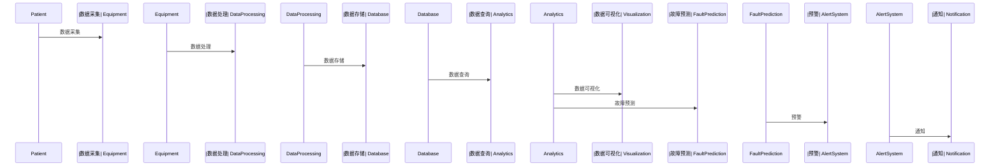
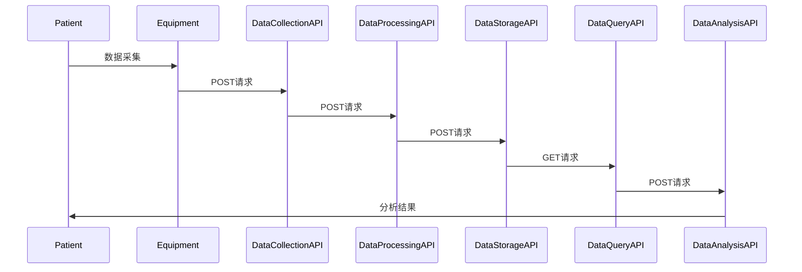
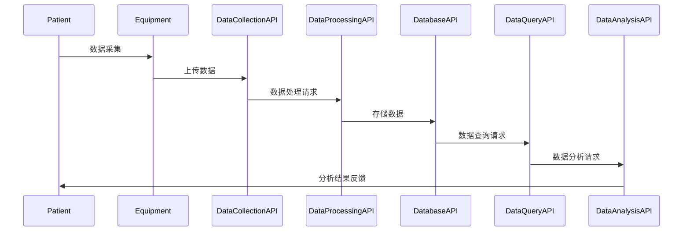

                 


## 《数字孪生在智慧医疗中的应用：个性化治疗方案设计》

### 关键词

- 数字孪生
- 智慧医疗
- 个性化治疗方案
- 医疗数据
- 数据建模
- 算法优化

### 摘要

本文深入探讨了数字孪生技术在智慧医疗领域中的应用，特别是在个性化治疗方案设计方面的潜力。通过详细的背景介绍、核心概念阐述、算法原理讲解、数学模型解释、系统架构设计和实际案例分析，本文旨在为读者提供一种全新的视角，理解数字孪生如何通过精确模拟患者生理状态，辅助医生制定个性化的治疗方案。文章最后还总结了最佳实践和注意事项，为未来的研究和应用提供指导。

### 目录

#### 第一部分：问题背景与数字孪生概述

**第1章 问题背景与数字孪生概述**

- 1.1 问题背景
  - 智慧医疗的发展现状
  - 个性化治疗的需求
  - 数字孪生技术的出现及其重要性

- 1.2 数字孪生基本概念
  - 数字孪生的定义
  - 数字孪生的核心要素
  - 数字孪生的分类与特点

- 1.3 数字孪生在医疗领域的应用
  - 医疗领域的挑战
  - 数字孪生技术的应用场景
  - 数字孪生的优势与局限性

#### 第二部分：核心概念与联系

**第2章 核心概念原理与联系**

- 2.1 数字孪生模型
  - 概念属性特征对比表格
  - ER实体关系图架构

- 2.2 个性化治疗方案设计
  - 治疗方案的概述
  - 个性化治疗方案的核心要素
  - 个性化治疗方案与数字孪生的关系

#### 第三部分：算法原理讲解

**第3章 数字孪生算法原理**

- 3.1 数据采集与处理
  - 数据采集方法
  - 数据处理流程
  - 数据质量评估

- 3.2 数字孪生建模
  - 建模方法
  - 常用算法介绍
  - 建模流程

- 3.3 个性化治疗方案优化
  - 治疗方案优化的目标
  - 优化算法原理
  - 优化流程

#### 第四部分：数学模型和数学公式讲解

**第4章 数学模型与公式**

- 4.1 数据处理数学模型
  - 数据清洗
  - 数据归一化
  - 数据分析

- 4.2 数字孪生建模数学模型
  - 数学模型公式
  - 模型参数选择
  - 模型评估

- 4.3 个性化治疗方案优化数学模型
  - 数学模型公式
  - 参数优化方法
  - 结果分析

#### 第五部分：系统分析与架构设计方案

**第5章 系统架构与设计**

- 5.1 问题场景介绍
  - 医疗机构现状
  - 数字孪生应用场景

- 5.2 系统功能设计
  - 领域模型类图
  - 功能模块划分

- 5.3 系统架构设计
  - 系统架构图
  - 架构组件介绍

- 5.4 系统接口设计
  - 接口定义
  - 接口交互

- 5.5 系统交互序列图
  - 序列图描述

#### 第六部分：项目实战

**第6章 项目实施与案例**

- 6.1 环境安装
  - 硬件配置
  - 软件安装

- 6.2 系统核心实现
  - 数据处理
  - 数字孪生建模
  - 个性化治疗方案设计

- 6.3 代码应用解读
  - 代码结构
  - 代码功能分析

- 6.4 实际案例分析与讲解
  - 案例背景
  - 案例分析
  - 案例结果

- 6.5 项目小结
  - 项目总结
  - 遇到的问题与解决

#### 第七部分：最佳实践、小结与拓展

**第7章 最佳实践与总结**

- 7.1 最佳实践
  - 实践技巧
  - 避免误区

- 7.2 小结
  - 主要内容回顾
  - 技术趋势

- 7.3 注意事项
  - 使用注意事项
  - 安全性考虑

- 7.4 拓展阅读
  - 相关书籍推荐
  - 学术论文与报告

### 第一部分：问题背景与数字孪生概述

#### 第1章 问题背景与数字孪生概述

##### 1.1 问题背景

**智慧医疗的发展现状**

智慧医疗作为数字技术与医疗服务的深度融合，近年来得到了迅猛发展。通过数字化手段，医疗行业实现了从疾病诊断、治疗到康复的全面升级。电子健康记录（EHR）、远程医疗、医疗大数据等技术的应用，不仅提高了医疗服务的效率，也显著改善了患者体验。然而，尽管智慧医疗在提升医疗质量方面取得了显著成果，仍面临着诸多挑战。

**个性化治疗的需求**

个性化治疗是智慧医疗的核心目标之一。传统的治疗方案往往基于统计学数据，难以充分考虑个体差异。而个性化治疗则根据患者的具体生理、病理特点，制定最为合适的治疗方案。这种治疗方式不仅能够提高治疗效果，还能降低医疗成本和副作用。然而，个性化治疗也面临着数据获取、处理和分析的巨大挑战。

**数字孪生技术的出现及其重要性**

数字孪生（Digital Twin）是一种新兴技术，它通过建立物理实体及其数字模型的映射关系，实现对实体状态的实时模拟和预测。数字孪生在医疗领域的应用潜力巨大，可以用于个性化治疗方案设计、医疗设备管理、患者健康监测等方面。通过数字孪生，医生能够更加精准地了解患者的生理状态，从而为患者制定更加个性化的治疗方案。

##### 1.2 数字孪生基本概念

**数字孪生的定义**

数字孪生是指通过数字技术构建的实体对象的虚拟复制体，它能够实时反映实体对象的状态、行为和性能。数字孪生不仅是对物理实体的模拟，更是一个集成了数据采集、数据处理、模型仿真和实时反馈的系统。

**数字孪生的核心要素**

- **物理实体**：数字孪生的核心是物理实体，即真实存在的设备、系统或对象。
- **数字模型**：数字孪生通过数字模型对物理实体进行精确描述，这个模型可以是几何模型、物理模型或数据模型。
- **数据连接**：数字孪生需要与物理实体保持实时连接，通过传感器和数据采集设备获取实时数据。
- **实时反馈**：数字孪生系统能够对实时数据进行分析，并将分析结果反馈给物理实体，实现闭环控制。

**数字孪生的分类与特点**

- **物理数字孪生**：最原始的数字孪生形式，主要依赖于物理实体的实时数据。
- **虚拟数字孪生**：基于虚拟环境构建的数字孪生，通过仿真和模拟实现物理实体的虚拟映射。
- **数字混合孪生**：结合物理数字孪生和虚拟数字孪生的优点，实现物理实体与虚拟环境的无缝连接。

##### 1.3 数字孪生在医疗领域的应用

**医疗领域的挑战**

- **数据获取与处理的挑战**：医疗数据量大、类型多样，且存在噪声和缺失值，如何高效地获取和处理这些数据，是一个重大挑战。
- **个性化治疗的需求**：每个患者都是独特的，如何根据患者的具体情况进行个性化治疗，是医疗领域的一大难题。
- **设备管理的复杂性**：医疗设备种类繁多，如何确保这些设备的高效运行和维护，是医院管理的难点。

**数字孪生技术的应用场景**

- **个性化治疗方案设计**：通过数字孪生技术，医生可以建立患者的数字模型，模拟不同治疗方案的效果，从而为患者制定最合适的治疗方案。
- **医疗设备管理**：数字孪生可以帮助医院实时监控设备状态，预测设备故障，提前进行维护，确保设备的高效运行。
- **患者健康监测**：通过数字孪生技术，医生可以实时跟踪患者的健康状况，及时发现异常，提前进行干预。

**数字孪生的优势与局限性**

**优势**

- **实时性与精准性**：数字孪生能够实时反映物理实体的状态，为医生提供准确的诊断依据。
- **模拟与预测**：数字孪生可以通过仿真和模拟，预测不同治疗方案的效果，帮助医生做出更科学的决策。
- **优化与改进**：数字孪生技术可以帮助医院优化设备管理流程，提高医疗服务效率。

**局限性**

- **数据获取的挑战**：医疗数据获取困难，数据质量和数量可能不足。
- **模型构建的复杂性**：数字孪生模型的构建需要大量的专业知识和计算资源。
- **安全性问题**：数字孪生系统需要保护患者的隐私数据，确保系统的安全性。

### 1.1 智慧医疗的发展现状

智慧医疗是信息技术与医疗服务深度融合的产物，其核心目标是通过数字化手段提升医疗服务的效率和质量。以下是智慧医疗发展现状的几个关键点：

**电子健康记录（EHR）的普及**

电子健康记录是智慧医疗的重要组成部分，它通过数字化方式记录患者的健康信息，包括病史、检查结果、治疗记录等。EHR 的普及使得医疗信息更加透明和共享，有助于提高诊断的准确性和治疗的连续性。目前，全球许多国家和地区都在积极推进 EHR 的建设，例如美国、欧洲和中国。

**远程医疗的兴起**

远程医疗利用互联网和通信技术，实现医生与患者之间的远程交流和诊疗。远程医疗不仅能够缓解医疗资源不足的问题，还能够为偏远地区的患者提供优质的医疗服务。随着 5G 技术的发展和普及，远程医疗的应用场景将更加广泛，包括远程诊断、远程手术和远程监护等。

**医疗大数据的应用**

医疗大数据是指从医疗过程中产生的海量数据，包括电子健康记录、医学影像、基因组数据等。通过对这些大数据进行挖掘和分析，可以发现疾病发生的规律，预测疾病的发展趋势，从而为疾病预防和治疗提供有力支持。医疗大数据的应用不仅有助于提高诊断的准确性，还能够优化治疗方案，降低医疗成本。

**个性化医疗的推进**

个性化医疗是根据患者的个体差异，制定个性化的治疗方案。通过基因测序、生物信息学和人工智能等技术，医生可以了解患者的基因信息、生活习惯和健康状况，从而为患者提供最合适的治疗方案。个性化医疗的发展，有助于提高治疗效果，减少副作用，提高患者的满意度。

### 1.2 个性化治疗的需求

个性化治疗是智慧医疗的核心目标之一，其核心理念是根据患者的个体差异，制定个性化的治疗方案，以提高治疗效果和减少副作用。以下是个性化治疗的需求：

**传统治疗的局限性**

传统治疗通常基于统计学数据和临床经验，难以充分考虑患者的个体差异。这种“一刀切”的治疗方式往往导致以下问题：

- **治疗效果不理想**：传统治疗方案可能对部分患者有效，但对另一些患者却效果不佳，甚至产生副作用。
- **医疗资源浪费**：传统治疗需要大量资源，包括人力、物力和时间，但效果不理想时，这些资源可能被浪费。
- **患者满意度低**：患者对治疗效果不满意，可能导致医疗纠纷和医患矛盾。

**个体差异的处理**

个体差异是生物体的基本特征，表现在基因、生理状态、生活方式等方面。为了实现个性化治疗，需要充分考虑这些个体差异，包括：

- **基因差异**：不同患者的基因表达和突变情况可能不同，这直接影响到疾病的发生和进展。通过基因测序，可以了解患者的基因信息，为个性化治疗提供依据。
- **生理状态差异**：患者的年龄、性别、体重、身体状况等生理特征不同，这些因素会影响到药物的代谢和疗效。例如，老年人对药物的耐受性较差，需要调整药物剂量。
- **生活方式差异**：患者的饮食习惯、运动习惯、心理状态等生活方式也会影响疾病的发展和治疗效果。例如，饮食习惯不良可能导致疾病加重，而积极的生活方式可能有助于疾病康复。

**患者参与的重要性**

个性化治疗不仅仅是医生的事情，患者的参与也至关重要。患者需要了解自己的病情、治疗方案和可能的副作用，积极参与治疗过程，遵守医嘱。患者参与治疗不仅可以提高治疗的依从性，还可以帮助医生更好地了解患者的需求和期望，从而制定更加个性化的治疗方案。

### 1.3 数字孪生技术的出现及其重要性

**数字孪生（Digital Twin）的定义**

数字孪生是一种新兴技术，它通过构建物理实体的虚拟复制体，实现对物理实体的实时模拟和预测。数字孪生不仅仅是一个简单的虚拟模型，而是一个集成了数据采集、数据处理、模型仿真和实时反馈的系统。

数字孪生的定义可以从以下几个方面来理解：

- **物理实体**：物理实体是数字孪生的基础，可以是任何具有物理形态的物体或系统，如机器、设备、建筑物等。
- **虚拟复制体**：虚拟复制体是物理实体的数字模型，它通过计算机技术对物理实体进行精确描述，包括几何形状、物理特性、运行状态等。
- **实时模拟和预测**：数字孪生系统能够实时收集物理实体的数据，通过模型仿真和分析，预测物理实体的行为和性能，实现对物理实体的实时监控和优化。

**数字孪生的核心要素**

数字孪生的实现需要以下几个核心要素：

- **数据连接**：数据连接是数字孪生的核心，它通过传感器和数据采集设备，将物理实体的实时数据传输到数字模型中。这些数据包括物理实体的状态、行为、性能等。
- **数字模型**：数字模型是数字孪生的核心组成部分，它通过计算机技术对物理实体进行精确描述，包括几何模型、物理模型、数据模型等。
- **实时反馈**：实时反馈是数字孪生的重要功能，它通过分析数字模型中的数据，实时调整物理实体的运行状态，实现对物理实体的优化和调整。

**数字孪生的分类与特点**

数字孪生可以根据其应用场景和实现方式的不同，分为以下几种类型：

- **物理数字孪生**：物理数字孪生是最原始的数字孪生形式，它主要依赖于物理实体的实时数据，通过数字模型对物理实体进行实时模拟和预测。物理数字孪生通常应用于设备管理、工厂自动化等领域。
- **虚拟数字孪生**：虚拟数字孪生是基于虚拟环境构建的数字孪生，它通过仿真和模拟实现物理实体的虚拟映射。虚拟数字孪生通常应用于产品设计和研发、城市规划等领域。
- **数字混合孪生**：数字混合孪生是物理数字孪生和虚拟数字孪生的结合，它通过物理数字孪生获取物理实体的实时数据，通过虚拟数字孪生进行仿真和模拟。数字混合孪生通常应用于复杂系统的运行和维护、智能交通等领域。

**数字孪生在医疗领域的应用潜力**

数字孪生技术在医疗领域具有巨大的应用潜力，可以应用于以下场景：

- **个性化治疗方案设计**：通过数字孪生技术，医生可以建立患者的数字模型，模拟不同治疗方案的效果，从而为患者制定最合适的治疗方案。数字孪生技术可以帮助医生更好地了解患者的生理状态，提高诊断的准确性和治疗的个性化程度。
- **医疗设备管理**：数字孪生技术可以帮助医院实时监控医疗设备的状态，预测设备故障，提前进行维护，确保设备的高效运行。数字孪生技术还可以提高医疗设备的利用率和安全性，降低设备故障率。
- **患者健康监测**：通过数字孪生技术，医生可以实时跟踪患者的健康状况，及时发现异常，提前进行干预。数字孪生技术可以帮助医生更好地了解患者的健康状况，提高疾病预防和治疗的效率。

**数字孪生技术的优势与局限性**

**优势**

- **实时性与精准性**：数字孪生技术能够实时反映物理实体的状态，为医生提供准确的诊断依据。数字孪生技术通过实时数据分析和模型仿真，可以预测物理实体的行为和性能，帮助医生做出更科学的决策。
- **模拟与预测**：数字孪生技术可以通过仿真和模拟，预测不同治疗方案的效果，帮助医生制定个性化的治疗方案。数字孪生技术还可以模拟医疗设备的运行状态，提前发现潜在的问题，进行预防性维护。
- **优化与改进**：数字孪生技术可以帮助医院优化设备管理流程，提高医疗服务效率。通过数字孪生技术，医院可以实时监控医疗设备的使用情况，优化设备配置，降低设备故障率。

**局限性**

- **数据获取的挑战**：医疗数据获取困难，数据质量和数量可能不足。数字孪生技术的实现需要大量的实时数据，而这些数据的获取可能受到技术、设备和成本的限制。
- **模型构建的复杂性**：数字孪生模型的构建需要大量的专业知识和计算资源。数字孪生模型的构建需要考虑物理实体的几何形状、物理特性、运行状态等多个方面，构建过程复杂且耗时。
- **安全性问题**：数字孪生系统需要保护患者的隐私数据，确保系统的安全性。数字孪生技术涉及到大量的患者数据，这些数据的安全性和隐私保护是一个重要问题。

### 2.1 数字孪生模型

**概念属性特征对比表格**

在深入探讨数字孪生模型之前，我们需要了解数字孪生的一些关键概念和属性特征。以下是一个概念属性特征对比表格，帮助读者更好地理解数字孪生的基本概念。

| 概念           | 属性特征                                                                                          | 作用与意义                                                                                   |
|--------------|---------------------------------------------------------------------------------------------|---------------------------------------------------------------------------------------------|
| 物理实体       | 具有物理形态的物体或系统                                                                          | 数字孪生的基础，数字模型所反映的对象                                               |
| 数字模型       | 通过计算机技术构建的物理实体的虚拟复制体                                                             | 描述物理实体的状态、行为和性能，实现物理实体与虚拟世界的映射                           |
| 数据连接       | 传感器和数据采集设备收集物理实体的实时数据                                                             | 实现物理实体与数字模型的实时交互，保证数字孪生的准确性和实时性                         |
| 实时反馈       | 对数字模型中的数据进行分析，调整物理实体的运行状态                                                      | 实现物理实体的优化和调整，提高系统的效率和性能                                       |
| 模型仿真       | 通过计算机模拟，预测物理实体的行为和性能                                                             | 帮助决策者理解物理实体的行为，为优化提供依据                                           |
| 预测与优化       | 使用历史数据和实时数据，对物理实体的未来行为和性能进行预测和优化                                       | 提高系统的可靠性和性能，降低维护成本                                                   |

**ER实体关系图架构**

ER（Entity-Relationship）实体关系图是用于表示实体之间关系的图形化工具。在数字孪生模型中，ER图用于表示物理实体、数字模型、数据连接和实时反馈等关键组件之间的关系。

以下是数字孪生模型的ER实体关系图：

```mermaid
erDiagram
  A[PhysicalEntity] ||--|{ B[DigitalModel]
  A ||--|{ C[DataConnection]
  A ||--|{ D[RealTimeFeedback]
  B ||--|{ C
  B ||--|{ D
  C ||--|{ D
```

在上图中：

- **PhysicalEntity（物理实体）** 是数字孪生的核心，它是数字模型的来源和基础。
- **DigitalModel（数字模型）** 是物理实体的虚拟复制体，用于描述物理实体的状态、行为和性能。
- **DataConnection（数据连接）** 是连接物理实体和数字模型的关键，它通过传感器和数据采集设备收集物理实体的实时数据。
- **RealTimeFeedback（实时反馈）** 是对数字模型中的数据进行处理和分析，实时调整物理实体的运行状态，实现闭环控制。

通过ER图，我们可以清晰地看到数字孪生模型中各组件之间的关系和交互，这有助于理解数字孪生的工作原理和实现方法。

### 2.2 个性化治疗方案设计

**治疗方案的概述**

个性化治疗方案是根据患者的个体差异，为每位患者量身定制的一种治疗方式。与传统的“一刀切”治疗方案不同，个性化治疗方案充分考虑了患者的基因、生理状态、生活习惯等多方面的因素，旨在提高治疗效果，减少副作用，提升患者满意度。

个性化治疗方案通常包括以下几个步骤：

1. **患者评估**：通过对患者的病史、检查结果、生活方式等进行全面评估，了解患者的整体健康状况和个体差异。
2. **基因检测**：基因检测是个性化治疗的重要依据，通过分析患者的基因信息，可以预测疾病的发生风险，评估药物的反应性。
3. **治疗计划制定**：根据患者的评估结果，结合临床经验和最新的医学研究，制定个性化的治疗方案。
4. **治疗实施**：按照制定的治疗方案，实施具体的治疗措施，如药物治疗、手术治疗、放射治疗等。
5. **疗效评估**：在治疗过程中，持续评估治疗效果，根据患者的反馈和检查结果，及时调整治疗方案。

**个性化治疗方案的核心要素**

个性化治疗方案的核心要素包括以下几个方面：

1. **基因信息**：基因信息是制定个性化治疗方案的重要依据，通过基因检测可以了解患者的基因突变、基因表达等信息，为个性化治疗提供基础。
2. **生理状态**：患者的生理状态，如年龄、性别、体重、肝肾功能等，都会影响药物的治疗效果和副作用。因此，个性化治疗方案需要充分考虑患者的生理状态。
3. **生活习惯**：生活习惯，如饮食习惯、运动习惯、睡眠质量等，与患者的健康状况密切相关。良好的生活习惯有助于提高治疗效果，降低疾病风险。
4. **临床数据**：临床数据包括病史、检查结果、治疗记录等，通过分析这些数据，可以了解患者的疾病特点和治疗反应，为个性化治疗提供参考。
5. **医生经验**：医生的临床经验和专业知识是制定个性化治疗方案的关键，医生需要根据患者的具体情况，结合医学研究，制定合理的治疗方案。

**个性化治疗方案与数字孪生的关系**

个性化治疗方案与数字孪生技术有着密切的联系。数字孪生技术可以为个性化治疗方案提供以下几个方面的支持：

1. **患者生理状态的模拟**：通过数字孪生技术，可以建立患者的数字模型，模拟患者的生理状态，为治疗方案提供科学依据。数字孪生技术可以通过分析患者的实时数据，预测患者在不同治疗方案下的生理反应，帮助医生制定个性化治疗方案。
2. **治疗方案的模拟与优化**：数字孪生技术可以模拟不同的治疗方案，分析各种方案的效果和副作用，帮助医生选择最优的治疗方案。通过模型仿真和模拟，医生可以提前了解治疗方案的潜在风险和效果，提高治疗的科学性和可靠性。
3. **实时监控与反馈**：数字孪生技术可以实时监控患者的生理状态，及时反馈治疗过程中的变化，帮助医生及时调整治疗方案。数字孪生技术的实时监控和反馈功能，有助于提高治疗的准确性和有效性。
4. **患者参与**：数字孪生技术可以帮助患者更好地理解自己的病情和治疗过程，提高患者的参与度和依从性。通过数字孪生模型，患者可以实时了解自己的生理状态和治疗进展，积极参与治疗决策，提高治疗效果。

### 3.1 数据采集与处理

**数据采集方法**

数据采集是数字孪生技术实现的基础，它涉及从各种来源获取与物理实体相关的数据。以下是一些常见的数据采集方法：

1. **传感器采集**：传感器是数据采集的主要工具，它们可以测量物理实体的各种参数，如温度、湿度、压力、速度等。传感器数据是数字孪生模型构建的关键数据来源。
2. **日志采集**：物理实体运行时产生的日志数据，包括运行状态、错误信息、维护记录等，这些数据对于分析物理实体的运行情况具有重要意义。
3. **外部数据源**：从外部数据源获取的数据，如天气预报、环境监测数据、交通流量数据等，这些数据可以帮助更全面地理解物理实体的运行环境和行为。
4. **用户输入**：用户通过界面输入的数据，如用户操作记录、用户反馈等，这些数据可以帮助分析用户的操作习惯和需求。

**数据处理流程**

数据处理是数据采集的延续，它涉及对采集到的原始数据进行清洗、转换和分析。以下是一个典型的数据处理流程：

1. **数据清洗**：数据清洗是数据处理的第一步，它包括去除重复数据、填补缺失值、纠正错误数据等。清洗后的数据质量直接影响后续分析的结果。
2. **数据转换**：数据转换是将不同格式的数据统一成标准格式，如将文本数据转换为数值数据，将不同时间单位的数据统一成相同的时间单位等。数据转换的目的是确保数据的一致性和可比性。
3. **数据存储**：将清洗和转换后的数据存储到数据库或数据仓库中，以便后续的数据分析和模型构建。数据存储的选择应根据数据量和访问频率等因素进行。
4. **数据分析**：数据分析是数据处理的核心，它包括描述性统计、关联分析、聚类分析、预测分析等。数据分析的目的是从数据中提取有价值的信息和知识。

**数据质量评估**

数据质量是数据采集和处理的最终目标，它直接影响数字孪生的准确性和可靠性。以下是一些常见的数据质量评估方法：

1. **完整性评估**：完整性评估是检查数据是否完整，是否存在缺失值或重复值。可以通过计算缺失值比例、重复值比例等指标来评估数据的完整性。
2. **一致性评估**：一致性评估是检查数据是否一致，如同一变量的取值是否在不同来源的数据中保持一致。可以通过对比不同数据源的数据来评估数据的一致性。
3. **准确性评估**：准确性评估是检查数据的准确性，如数据是否真实反映了物理实体的状态。可以通过比对数据与实际物理实体的测量结果来评估数据的准确性。
4. **时效性评估**：时效性评估是检查数据是否及时更新，如数据是否反映了物理实体的最新状态。可以通过计算数据的时间戳来评估数据的时效性。

### 3.2 数字孪生建模

**建模方法**

数字孪生建模是数字孪生技术的核心，它涉及构建物理实体的数字模型，以实现对物理实体的实时模拟和预测。以下是一些常见的建模方法：

1. **几何建模**：几何建模是数字孪生建模的基础，它通过计算机图形学技术，对物理实体的几何形状进行精确描述。几何建模可以用于构建物理实体的数字模型，为后续的仿真和分析提供基础。
2. **物理建模**：物理建模是通过数学和物理模型，对物理实体的物理特性进行描述。物理建模可以用于模拟物理实体的行为和性能，如机械结构、流体动力学等。
3. **数据建模**：数据建模是通过数据模型，对物理实体的状态和行为进行描述。数据建模通常使用数据库和数据处理技术，可以实现对物理实体数据的实时采集、存储和分析。

**常用算法介绍**

在数字孪生建模中，常用的算法包括以下几种：

1. **机器学习算法**：机器学习算法可以通过学习历史数据，预测物理实体的未来行为。常用的机器学习算法包括回归分析、决策树、支持向量机、神经网络等。
2. **仿真算法**：仿真算法通过模拟物理实体的行为，预测物理实体的性能。常用的仿真算法包括蒙特卡洛仿真、有限元分析、过程模拟等。
3. **深度学习算法**：深度学习算法通过构建多层神经网络，对物理实体的复杂行为进行建模。常用的深度学习算法包括卷积神经网络（CNN）、循环神经网络（RNN）、生成对抗网络（GAN）等。

**建模流程**

数字孪生建模通常包括以下几个步骤：

1. **需求分析**：明确数字孪生的目标和应用场景，了解物理实体的特点和需求。
2. **数据准备**：收集物理实体的数据，包括几何数据、物理数据、运行数据等。对数据进行清洗、转换和预处理，确保数据质量。
3. **模型构建**：根据需求分析，选择合适的建模方法和算法，构建物理实体的数字模型。模型构建可以包括几何建模、物理建模和数据建模。
4. **模型验证**：通过模拟和实验，验证数字孪生模型的准确性和可靠性。模型验证可以包括仿真实验、数据对比、误差分析等。
5. **模型部署**：将数字孪生模型部署到实际应用中，实现对物理实体的实时模拟和预测。模型部署可以包括系统集成、数据接口设计、实时监控等。

### 3.3 个性化治疗方案优化

**治疗方案优化的目标**

个性化治疗方案优化的目标是通过分析患者的数据和医疗数据，找到最优的治疗方案，以提高治疗效果和患者满意度。具体来说，个性化治疗方案优化的目标包括以下几个方面：

1. **提高治疗效果**：通过优化治疗方案，提高患者对治疗的响应率，减少疾病复发率，提高治愈率。
2. **降低副作用**：优化治疗方案，降低患者在接受治疗过程中出现的副作用和不良反应，提高患者的生活质量。
3. **减少医疗成本**：通过优化治疗方案，降低医疗资源的消耗，减少不必要的检查和治疗，降低患者的医疗费用。
4. **提高患者满意度**：优化治疗方案，提高患者的治疗体验，增加患者的信任感和满意度。

**优化算法原理**

个性化治疗方案优化通常采用优化算法来实现。优化算法是一种通过迭代搜索寻找最优解的方法。以下是几种常见的优化算法原理：

1. **遗传算法（GA）**：遗传算法是一种基于自然选择和遗传原理的优化算法。遗传算法通过模拟生物进化过程，迭代更新个体，寻找最优解。遗传算法的优点是全局搜索能力强，适用于复杂优化问题。
2. **粒子群优化算法（PSO）**：粒子群优化算法是一种基于群体智能的优化算法。粒子群优化算法通过模拟鸟群觅食行为，迭代更新粒子的位置和速度，寻找最优解。粒子群优化算法的优点是收敛速度快，适用于简单优化问题。
3. **模拟退火算法（SA）**：模拟退火算法是一种基于物理退火过程的优化算法。模拟退火算法通过不断降低温度，迭代更新解的空间，寻找最优解。模拟退火算法的优点是全局搜索能力强，适用于复杂优化问题。

**优化流程**

个性化治疗方案优化的流程通常包括以下几个步骤：

1. **问题定义**：明确优化的目标和约束条件，如治疗成本、治疗效果、副作用等。
2. **数据收集**：收集与患者和治疗相关的数据，包括病史、检查结果、治疗方案等。
3. **模型构建**：根据数据特点，构建个性化治疗方案的数学模型。模型可以包括治疗结果的预测模型、治疗成本的评估模型等。
4. **算法选择**：根据优化目标，选择合适的优化算法。常见的优化算法有遗传算法、粒子群优化算法、模拟退火算法等。
5. **算法实现**：实现选定的优化算法，输入模型和数据，进行迭代搜索，寻找最优解。
6. **结果分析**：对优化结果进行分析和评估，验证优化方案的有效性和可行性。
7. **方案调整**：根据优化结果，调整治疗方案，优化治疗方案。可以结合医生的经验和患者的反馈，进一步调整治疗方案。

### 4.1 数据处理数学模型

**数据处理数学模型**

在数据处理过程中，数学模型起到了关键作用。以下是一些常见的数据处理数学模型：

1. **数据清洗模型**：数据清洗模型用于处理数据中的缺失值、异常值和重复值。常用的算法包括填充缺失值（如均值填充、中值填充）、删除异常值（如3倍标准差法）和去重（如哈希表）。

   - **均值填充**：用样本均值填充缺失值。
     $$ \text{filled\_value} = \frac{\sum_{i=1}^{n} x_i}{n} $$
     其中，$x_i$ 是非缺失值，$n$ 是非缺失值的数量。

   - **中值填充**：用样本中值填充缺失值。
     $$ \text{filled\_value} = \text{median}(x_1, x_2, \ldots, x_n) $$
     其中，$x_1, x_2, \ldots, x_n$ 是非缺失值。

   - **3倍标准差法**：删除离群点（异常值）。
     $$ x_i \in (\text{mean}(x) - 3\text{std}(x), \text{mean}(x) + 3\text{std}(x)) $$
     其中，$\text{mean}(x)$ 是均值，$\text{std}(x)$ 是标准差。

2. **数据归一化模型**：数据归一化模型用于处理不同量纲的数据，使其在同一尺度上。常用的算法包括最小-最大归一化和标准归一化。

   - **最小-最大归一化**：将数据缩放到[0, 1]区间。
     $$ z = \frac{x - \text{min}(x)}{\text{max}(x) - \text{min}(x)} $$
     其中，$x$ 是原始数据，$z$ 是归一化后的数据。

   - **标准归一化**：将数据缩放到均值为0，标准差为1的区间。
     $$ z = \frac{x - \text{mean}(x)}{\text{std}(x)} $$
     其中，$x$ 是原始数据，$z$ 是归一化后的数据。

3. **数据分析模型**：数据分析模型用于对处理后的数据进行分析，提取有用的信息。常用的算法包括描述性统计分析、关联分析、聚类分析和预测分析。

   - **描述性统计分析**：计算数据的均值、中位数、标准差等统计量，用于描述数据的基本特征。
   - **关联分析**：发现数据之间的关联关系，常用的算法包括卡方检验、关联规则挖掘等。
   - **聚类分析**：将相似的数据聚为一类，常用的算法包括K-均值聚类、层次聚类等。
   - **预测分析**：使用历史数据预测未来的趋势或行为，常用的算法包括时间序列分析、回归分析等。

**数据处理流程**

数据处理流程包括以下步骤：

1. **数据采集**：从各种来源采集数据，如传感器、日志文件、用户输入等。
2. **数据清洗**：对采集到的数据进行清洗，去除缺失值、异常值和重复值。
3. **数据转换**：将不同格式的数据转换为统一的格式，如将文本数据转换为数值数据。
4. **数据存储**：将清洗和转换后的数据存储到数据库或数据仓库中，以便后续的数据分析。
5. **数据分析**：使用数学模型对数据进行分析，提取有用的信息。

### 4.2 数字孪生建模数学模型

**数学模型公式**

数字孪生建模中，常用的数学模型包括几何模型、物理模型和数据模型。以下是一些常用的数学模型公式：

1. **几何模型**：

   - **点云模型**：通过坐标点表示物理实体，常用的表示方法有XYZ坐标。
     $$ P = (x, y, z) $$
     其中，$P$ 是点云模型，$x, y, z$ 分别是点的坐标。

   - **曲面模型**：通过曲面方程表示物理实体，常用的表示方法有参数曲面。
     $$ \mathbf{r}(u, v) = (x(u, v), y(u, v), z(u, v)) $$
     其中，$\mathbf{r}(u, v)$ 是曲面上的点，$u, v$ 是参数。

2. **物理模型**：

   - **运动方程**：描述物理实体的运动状态，常用的表示方法有牛顿第二定律。
     $$ m\mathbf{a} = \mathbf{F} $$
     其中，$m$ 是质量，$\mathbf{a}$ 是加速度，$\mathbf{F}$ 是作用力。

   - **能量方程**：描述物理实体的能量变化，常用的表示方法有动能和势能。
     $$ \mathbf{K} + \mathbf{U} = \text{常量} $$
     其中，$\mathbf{K}$ 是动能，$\mathbf{U}$ 是势能。

3. **数据模型**：

   - **时间序列模型**：描述物理实体随时间变化的数据，常用的表示方法有ARIMA模型。
     $$ X_t = c + \phi_1 X_{t-1} + \phi_2 X_{t-2} + \ldots + \phi_p X_{t-p} + \epsilon_t $$
     其中，$X_t$ 是时间序列数据，$c$ 是常数项，$\phi_1, \phi_2, \ldots, \phi_p$ 是模型参数，$\epsilon_t$ 是误差项。

   - **回归模型**：描述物理实体之间的关联关系，常用的表示方法有线性回归。
     $$ y = \beta_0 + \beta_1 x_1 + \beta_2 x_2 + \ldots + \beta_n x_n $$
     其中，$y$ 是因变量，$x_1, x_2, \ldots, x_n$ 是自变量，$\beta_0, \beta_1, \beta_2, \ldots, \beta_n$ 是模型参数。

**模型参数选择**

在数字孪生建模中，模型参数的选择对模型的性能和准确性至关重要。以下是一些常用的模型参数选择方法：

1. **最小二乘法**：通过最小化预测值与实际值之间的误差平方和，选择最优参数。
   $$ \min \sum_{i=1}^{n} (y_i - \hat{y}_i)^2 $$
   其中，$y_i$ 是实际值，$\hat{y}_i$ 是预测值。

2. **交叉验证**：通过将数据集划分为训练集和验证集，多次训练和验证，选择最优参数。
   $$ \text{min} \sum_{j=1}^{k} \sum_{i \in \text{validation set}_j} (y_i - \hat{y}_i)^2 $$
   其中，$k$ 是交叉验证的次数，$\text{validation set}_j$ 是第 $j$ 次验证集。

3. **贝叶斯优化**：通过贝叶斯统计模型，迭代优化参数，选择最优参数。
   $$ p(\theta | \mathbf{x}, \mathbf{y}) \propto p(\mathbf{y} | \theta, \mathbf{x}) p(\theta) $$
   其中，$\theta$ 是参数，$\mathbf{x}, \mathbf{y}$ 是数据和标签。

**模型评估**

在数字孪生建模中，模型评估是验证模型性能和准确性的关键步骤。以下是一些常用的模型评估指标：

1. **均方误差（MSE）**：衡量预测值与实际值之间的平均误差。
   $$ \text{MSE} = \frac{1}{n} \sum_{i=1}^{n} (y_i - \hat{y}_i)^2 $$
   其中，$y_i$ 是实际值，$\hat{y}_i$ 是预测值。

2. **均方根误差（RMSE）**：衡量预测值与实际值之间的平均误差的平方根。
   $$ \text{RMSE} = \sqrt{\text{MSE}} $$

3. **决定系数（R²）**：衡量模型对数据的拟合程度，取值范围在0和1之间，越接近1表示拟合程度越好。
   $$ R^2 = 1 - \frac{\sum_{i=1}^{n} (y_i - \hat{y}_i)^2}{\sum_{i=1}^{n} (y_i - \bar{y})^2} $$
   其中，$\bar{y}$ 是实际值的平均值。

4. **准确率（Accuracy）**：衡量分类模型的准确性，取值范围在0和1之间，越接近1表示分类准确性越高。
   $$ \text{Accuracy} = \frac{\text{正确分类的样本数}}{\text{总样本数}} $$

5. **精确率（Precision）**：衡量分类模型在预测为正例时正确预测的比例。
   $$ \text{Precision} = \frac{\text{真正例}}{\text{真正例 + 假正例}} $$

6. **召回率（Recall）**：衡量分类模型在真实正例中正确预测的比例。
   $$ \text{Recall} = \frac{\text{真正例}}{\text{真正例 + 假反例}} $$

### 4.3 个性化治疗方案优化数学模型

**数学模型公式**

个性化治疗方案优化涉及多个参数的调整，以下是一些常见的数学模型公式：

1. **目标函数**：目标函数是优化过程中要最小化或最大化的函数，通常表示为：

   $$ \min_{x} f(x) $$
   其中，$x$ 是参数向量，$f(x)$ 是目标函数。

   - **治疗效果最大化**：通过最大化治疗效果来优化治疗方案。
     $$ f(x) = \sum_{i=1}^{n} w_i \cdot \text{effect\_score}_i $$
     其中，$w_i$ 是权重，$\text{effect\_score}_i$ 是治疗效果评分。

   - **副作用最小化**：通过最小化副作用来优化治疗方案。
     $$ f(x) = \sum_{i=1}^{n} w_i \cdot \text{side\_effect\_score}_i $$
     其中，$w_i$ 是权重，$\text{side\_effect\_score}_i$ 是副作用评分。

2. **约束条件**：约束条件是优化过程中要满足的条件，通常表示为：

   $$ g_i(x) \leq 0, \quad \forall i = 1, 2, \ldots, m $$
   其中，$g_i(x)$ 是约束函数。

   - **医疗成本限制**：限制总医疗成本不超过预算。
     $$ g_1(x) = \sum_{i=1}^{n} \text{cost}_i - \text{budget} $$
     其中，$\text{cost}_i$ 是治疗方案 $i$ 的成本，$\text{budget}$ 是预算。

   - **药物剂量限制**：限制药物剂量在安全范围内。
     $$ g_2(x) = \sum_{i=1}^{n} \text{dose}_i - \text{max\_dose} $$
     其中，$\text{dose}_i$ 是治疗方案 $i$ 的药物剂量，$\text{max\_dose}$ 是最大剂量。

3. **优化算法**：常用的优化算法包括线性规划、非线性规划、遗传算法等。以下是一个简单的线性规划示例：

   - **线性规划**：目标函数和约束条件都是线性的优化问题。
     $$ \min_{x} c^T x $$
     $$ \text{subject to} \quad A x \leq b $$
     其中，$c$ 是目标函数系数向量，$A$ 是约束条件系数矩阵，$b$ 是约束条件常数向量。

**参数优化方法**

1. **梯度下降法**：梯度下降法是一种基于梯度信息的优化方法，通过迭代更新参数，逐步逼近最优解。

   $$ x_{k+1} = x_k - \alpha \nabla f(x_k) $$
   其中，$x_k$ 是第 $k$ 次迭代的参数值，$\alpha$ 是学习率，$\nabla f(x_k)$ 是目标函数在 $x_k$ 处的梯度。

2. **牛顿法**：牛顿法是一种基于二阶导数的优化方法，通过迭代求解目标函数的一阶导数和二阶导数，快速逼近最优解。

   $$ x_{k+1} = x_k - H_k^{-1} \nabla^2 f(x_k) \nabla f(x_k) $$
   其中，$x_k$ 是第 $k$ 次迭代的参数值，$H_k$ 是目标函数在 $x_k$ 处的海森矩阵，$\nabla f(x_k)$ 是目标函数在 $x_k$ 处的一阶导数。

3. **粒子群优化（PSO）**：粒子群优化是一种基于群体智能的优化方法，通过模拟鸟群觅食行为，迭代更新粒子的位置和速度，寻找最优解。

   $$ x_{i,k+1} = x_{i,k} + v_{i,k+1} $$
   $$ v_{i,k+1} = v_{i,k} + c_1 r_1 (p_{i,k} - x_{i,k}) + c_2 r_2 (g_{k} - x_{i,k}) $$
   其中，$x_{i,k}$ 是第 $i$ 个粒子在第 $k$ 次迭代的参数值，$v_{i,k}$ 是第 $i$ 个粒子在第 $k$ 次迭代的速度，$p_{i,k}$ 是第 $i$ 个粒子的历史最优解，$g_{k}$ 是全局最优解，$c_1$ 和 $c_2$ 是权重系数，$r_1$ 和 $r_2$ 是随机数。

**结果分析**

1. **收敛性分析**：分析优化算法的收敛性，判断算法是否能够找到最优解。可以通过绘制收敛曲线，观察目标函数值的变化趋势。

2. **稳定性分析**：分析优化算法的稳定性，判断算法在参数变化或噪声环境下是否仍能稳定收敛。可以通过增加噪声或改变参数，观察算法的收敛行为。

3. **效率分析**：分析优化算法的计算效率，判断算法的收敛速度。可以通过比较不同优化算法的计算时间和迭代次数，评估算法的效率。

4. **鲁棒性分析**：分析优化算法的鲁棒性，判断算法在数据缺失、噪声或异常值等情况下是否仍能稳定收敛。可以通过增加噪声或缺失值，观察算法的收敛行为。

### 5.1 问题场景介绍

在探讨数字孪生在智慧医疗中的应用时，首先需要明确具体的应用场景和面临的挑战。以下是一个典型的数字孪生在智慧医疗中应用的问题场景介绍。

**医疗机构现状**

某大型综合性医院，承担了大量的患者诊治工作。医院的医疗设备先进，涵盖了从诊断到治疗的各个领域，如CT扫描仪、MRI设备、超声诊断仪、血液透析机等。然而，由于医疗设备的多样性和复杂性，医院的设备管理面临诸多挑战：

- **设备利用率低**：部分医疗设备由于使用频率不高，导致设备利用率低，造成资源浪费。
- **设备故障频发**：医疗设备在使用过程中容易发生故障，导致医疗服务中断，影响患者治疗。
- **设备维护困难**：医疗设备的维护需要专业的技术支持，但由于技术人员不足，导致设备维护不及时，增加了设备故障的风险。

**数字孪生应用场景**

为了解决上述问题，医院引入了数字孪生技术，以实现对医疗设备的智能管理和维护。以下是在这一应用场景下，数字孪生技术的主要应用：

- **设备监控**：通过数字孪生技术，医院可以实时监控医疗设备的运行状态，包括温度、湿度、压力等关键参数。这些数据通过传感器实时传输到数字模型，医生和设备管理人员可以远程了解设备运行情况。
- **故障预测**：数字孪生技术通过对医疗设备运行数据的分析，可以预测设备可能出现的故障。通过对故障预测的提前预警，医院可以及时安排设备维护，避免设备故障对患者治疗的影响。
- **优化设备使用**：通过数字孪生技术，医院可以对医疗设备的利用率进行优化。通过分析设备使用数据，医院可以合理安排设备的使用时间，提高设备利用率，减少资源浪费。
- **设备维护管理**：数字孪生技术可以帮助医院建立设备维护管理数据库，记录设备的历史运行数据和故障记录。通过对历史数据的分析，医院可以制定更加科学的设备维护计划，提高设备维护效率。

**面临的挑战**

尽管数字孪生技术在智慧医疗中的应用前景广阔，但在实际应用过程中，医院仍面临以下挑战：

- **数据采集困难**：医疗设备种类繁多，不同设备的数据采集方式和数据格式各异，导致数据采集困难。
- **数据质量参差不齐**：医疗设备运行数据可能存在噪声、缺失值等问题，影响数据的准确性和可靠性。
- **模型构建复杂**：数字孪生模型的构建需要大量的专业知识和计算资源，对于医院来说，构建和维护数字模型是一个挑战。
- **安全性问题**：医疗数据涉及到患者的隐私，数字孪生技术的应用需要确保数据的安全性和隐私保护。

### 5.2 系统功能设计

在数字孪生技术在智慧医疗中的应用场景中，系统的功能设计至关重要。以下是一个系统的功能设计，包括领域模型类图和功能模块划分。

**领域模型类图**

领域模型类图用于表示系统中各个类之间的关系。在数字孪生系统中，主要的领域模型包括设备类、数据类、用户类和管理类。以下是这些类的关系和属性：

```mermaid
classDiagram
  Equipment <<class>> Device
  Data <<class>> Dataset
  User <<class>> Patient
  Admin <<class>> Manager

  Device {
    - id: int
    - type: string
    - status: string
    - location: string
  }

  Dataset {
    - id: int
    - device_id: int
    - timestamp: datetime
    - value: float
  }

  Patient {
    - id: int
    - name: string
    - age: int
    - gender: string
    - diagnosis: string
  }

  Manager {
    - id: int
    - name: string
    - role: string
  }

  Device --|> Dataset
  Admin --|> Device
  Admin --|> Dataset
  Admin --|> Patient
```

在这个类图中：

- **Device（设备类）**：表示医疗设备，包括设备ID、类型、状态和位置等信息。
- **Dataset（数据类）**：表示采集到的设备数据，包括数据ID、设备ID、时间戳和数值等信息。
- **Patient（用户类）**：表示患者信息，包括患者ID、姓名、年龄、性别和诊断等信息。
- **Manager（管理类）**：表示管理员信息，包括管理员ID、姓名和角色等信息。

**功能模块划分**

根据领域模型类图，我们可以将系统划分为以下几个功能模块：

1. **设备管理模块**：负责管理设备信息，包括设备添加、设备删除、设备修改和设备查询等功能。
2. **数据采集模块**：负责采集设备运行数据，包括数据上传、数据存储和数据查询等功能。
3. **患者管理模块**：负责管理患者信息，包括患者添加、患者删除、患者修改和患者查询等功能。
4. **数据分析模块**：负责分析设备数据和患者数据，包括数据可视化、数据分析和报表生成等功能。
5. **用户管理模块**：负责管理用户信息，包括用户添加、用户删除、用户修改和用户查询等功能。
6. **权限管理模块**：负责管理用户权限，包括权限分配、权限查询和权限变更等功能。

### 5.3 系统架构设计

数字孪生系统的架构设计是确保系统能够高效、稳定地运行的关键。以下是一个数字孪生系统的架构设计，包括系统架构图和架构组件介绍。

**系统架构图**

以下是数字孪生系统的架构图，展示了系统的整体架构和组件之间的关系：



在这个架构图中：

- **Patient（患者）**：负责数据的采集，通过传感器和设备采集患者的生理数据。
- **Equipment（设备）**：负责采集设备运行数据，包括温度、湿度、压力等关键参数。
- **DataProcessing（数据处理）**：负责对采集到的数据进行预处理，包括数据清洗、数据转换和数据归一化等。
- **Database（数据库）**：负责存储处理后的数据，支持快速查询和数据分析。
- **Analytics（数据分析）**：负责对数据库中的数据进行统计分析，提供数据可视化、故障预测等功能。
- **Visualization（数据可视化）**：负责将分析结果以图表、报表等形式展示给用户。
- **FaultPrediction（故障预测）**：负责预测设备可能出现的故障，提供预警功能。
- **AlertSystem（预警系统）**：负责发送预警通知，提醒相关人员。
- **Notification（通知系统）**：负责发送通知，包括预警通知、系统消息等。

**架构组件介绍**

1. **数据采集模块**：数据采集模块负责从传感器和设备中采集实时数据。传感器可以安装在设备上，实时监测设备的运行状态，如温度、湿度、压力等。采集到的数据通过无线传输模块上传到数据处理模块。

2. **数据处理模块**：数据处理模块负责对采集到的数据进行预处理，包括数据清洗、数据转换和数据归一化等。数据清洗包括去除重复数据、填补缺失值和纠正错误数据等。数据转换包括将不同格式的数据统一成标准格式，如将温度从摄氏度转换成华氏度等。数据归一化包括将不同量纲的数据转换到相同的量纲，如将温度、湿度等转换到0到1的区间。

3. **数据库模块**：数据库模块负责存储处理后的数据，支持快速查询和数据分析。数据库可以选择关系型数据库或NoSQL数据库，具体选择取决于数据的结构和查询需求。

4. **数据分析模块**：数据分析模块负责对数据库中的数据进行统计分析，提供数据可视化、故障预测等功能。数据分析模块可以使用Python、R等编程语言，结合Pandas、NumPy等库进行数据处理和分析。

5. **数据可视化模块**：数据可视化模块负责将分析结果以图表、报表等形式展示给用户。数据可视化模块可以使用Tableau、PowerBI等工具，将复杂的数据分析结果以直观的图表形式展示。

6. **故障预测模块**：故障预测模块负责预测设备可能出现的故障，提供预警功能。故障预测模块可以使用机器学习算法，如回归分析、决策树、神经网络等，对历史数据进行训练，建立故障预测模型。

7. **预警系统模块**：预警系统模块负责发送预警通知，提醒相关人员。预警系统模块可以使用短信、邮件、APP推送等方式，将预警通知发送给相关人员。

8. **通知系统模块**：通知系统模块负责发送通知，包括预警通知、系统消息等。通知系统模块可以使用短信、邮件、APP推送等方式，将通知发送给相关人员。

### 5.4 系统接口设计

在数字孪生系统的架构设计中，系统接口设计是确保各个模块之间能够有效交互的关键。以下是一个数字孪生系统的接口设计，包括接口定义和接口交互。

**接口定义**

1. **数据采集接口**

   - **接口名称**：DataCollectionAPI
   - **接口功能**：负责接收传感器和设备上传的数据。
   - **接口类型**：HTTP POST请求
   - **请求参数**：

     ```json
     {
       "device_id": "string",
       "timestamp": "datetime",
       "temperature": "float",
       "humidity": "float",
       "pressure": "float"
     }
     ```

   - **返回结果**：

     ```json
     {
       "status": "string",
       "message": "string"
     }
     ```

2. **数据处理接口**

   - **接口名称**：DataProcessingAPI
   - **接口功能**：负责处理上传的数据，包括清洗、转换和归一化。
   - **接口类型**：HTTP POST请求
   - **请求参数**：

     ```json
     {
       "data": [
         {
           "device_id": "string",
           "timestamp": "datetime",
           "temperature": "float",
           "humidity": "float",
           "pressure": "float"
         },
         ...
       ]
     }
     ```

   - **返回结果**：

     ```json
     {
       "status": "string",
       "message": "string"
     }
     ```

3. **数据存储接口**

   - **接口名称**：DataStorageAPI
   - **接口功能**：负责将处理后的数据存储到数据库中。
   - **接口类型**：HTTP POST请求
   - **请求参数**：

     ```json
     {
       "data": [
         {
           "device_id": "string",
           "timestamp": "datetime",
           "temperature": "float",
           "humidity": "float",
           "pressure": "float"
         },
         ...
       ]
     }
     ```

   - **返回结果**：

     ```json
     {
       "status": "string",
       "message": "string"
     }
     ```

4. **数据查询接口**

   - **接口名称**：DataQueryAPI
   - **接口功能**：负责从数据库中查询特定的数据。
   - **接口类型**：HTTP GET请求
   - **请求参数**：

     ```json
     {
       "device_id": "string",
       "start_time": "datetime",
       "end_time": "datetime"
     }
     ```

   - **返回结果**：

     ```json
     {
       "status": "string",
       "data": [
         {
           "timestamp": "datetime",
           "temperature": "float",
           "humidity": "float",
           "pressure": "float"
         },
         ...
       ]
     }
     ```

5. **数据分析接口**

   - **接口名称**：DataAnalysisAPI
   - **接口功能**：负责对数据库中的数据进行统计分析。
   - **接口类型**：HTTP POST请求
   - **请求参数**：

     ```json
     {
       "device_id": "string",
       "analysis_type": "string"
     }
     ```

   - **返回结果**：

     ```json
     {
       "status": "string",
       "data": {
         "mean_temperature": "float",
         "mean_humidity": "float",
         "mean_pressure": "float",
         ...
       }
     }
     ```

**接口交互**

以下是一个简单的接口交互示例：



在这个交互流程中：

1. **Patient（患者）**：通过传感器和设备采集数据，将数据上传到 **DataCollectionAPI**。
2. **Equipment（设备）**：将上传的数据传递给 **DataProcessingAPI** 进行处理。
3. **DataProcessingAPI**：处理后的数据传递给 **DataStorageAPI** 存储到数据库中。
4. **DataQueryAPI**：从数据库中查询特定的数据。
5. **DataAnalysisAPI**：对查询到的数据进行分析，将分析结果返回给 **Patient**。

### 5.5 系统交互序列图

为了更直观地展示数字孪生系统的交互过程，可以使用Mermaid的序列图来描述。以下是一个数字孪生系统的交互序列图，展示了患者、设备、数据处理模块、数据库模块和数据分析模块之间的交互过程。



在这个序列图中：

1. **Patient（患者）**：通过传感器和设备采集数据，并将数据上传到 **DataCollectionAPI**。
2. **Equipment（设备）**：将采集到的数据传递给 **DataCollectionAPI**，由其处理数据并请求 **DataProcessingAPI** 进行进一步处理。
3. **DataProcessingAPI**：接收数据后进行处理，包括清洗、转换和归一化等，然后将处理后的数据存储到数据库中，通过 **DatabaseAPI** 进行交互。
4. **DataQueryAPI**：从数据库中查询特定的数据，传递给 **DataAnalysisAPI** 进行数据分析。
5. **DataAnalysisAPI**：对查询到的数据进行分析，生成分析结果，并将其反馈给 **Patient**。

通过这个序列图，可以清晰地看到各个模块之间的交互流程和数据流动，有助于理解数字孪生系统的运作机制。

### 6.1 环境安装

在实施数字孪生系统时，首先需要搭建合适的环境。以下是具体的安装步骤：

**硬件配置**

1. **服务器**：服务器应具备较高的处理能力和存储容量，推荐配置如下：
   - CPU：至少4核处理器
   - 内存：至少8GB
   - 存储：至少1TB SSD硬盘
2. **网络设备**：确保网络稳定，带宽充足，推荐使用千兆以太网。

**软件安装**

1. **操作系统**：安装Linux操作系统，如Ubuntu 18.04 LTS。
   - 通过ISO镜像安装操作系统，选择最小安装选项，以便后续安装所需软件。
2. **数据库**：安装MySQL或PostgreSQL数据库管理系统。
   - 使用包管理器（如apt或yum）安装数据库服务器。
     ```bash
     sudo apt update
     sudo apt install mysql-server
     ```
   - 配置数据库用户和密码，确保数据库安全性。
3. **Python环境**：安装Python 3.8及以上版本，并配置pip。
   - 使用包管理器安装Python和pip。
     ```bash
     sudo apt install python3 python3-pip
     ```
   - 安装必要的Python库，如NumPy、Pandas、Scikit-learn等。
     ```bash
     pip3 install numpy pandas scikit-learn
     ```
4. **其他工具**：安装其他必要的工具，如Docker、Nginx等。
   - 安装Docker用于容器化部署。
     ```bash
     sudo apt install docker-ce docker-ce-cli containerd.io
     ```
   - 启动Docker服务。
     ```bash
     sudo systemctl start docker
     ```
   - 安装Nginx用于Web服务器。
     ```bash
     sudo apt install nginx
     ```
   - 配置Nginx反向代理，确保Web服务可通过外部访问。

完成以上步骤后，环境安装基本完成，可以开始数字孪生系统的开发和部署。

### 6.2 系统核心实现

数字孪生系统的核心实现包括数据处理、数字孪生建模和个性化治疗方案设计。以下是对这些核心功能的详细实现过程。

**数据处理**

数据处理是数字孪生系统的基础，涉及数据采集、数据清洗、数据转换和数据存储等步骤。以下是数据处理的核心实现：

1. **数据采集**：使用传感器和设备采集实时数据，如温度、湿度、压力等。以下是一个简单的Python脚本示例，用于从设备读取数据：

```python
import serial
import time

# 设备连接参数
port = 'COM3'
baudrate = 9600

# 连接设备
ser = serial.Serial(port, baudrate)

# 读取数据
def read_data():
    while True:
        try:
            data = ser.readline().decode('utf-8').strip()
            print(data)
            time.sleep(1)
        except Exception as e:
            print(f"Error: {e}")
            break

# 关闭设备连接
def close_connection():
    ser.close()

# 运行数据采集
read_data()
close_connection()
```

2. **数据清洗**：处理采集到的数据，去除噪声和异常值。以下是一个简单的Python脚本示例，用于清洗数据：

```python
import numpy as np

# 原始数据
data = [22.5, 30.0, 20.5, 22.5, 35.0, 0.0, 25.0]

# 去除异常值
clean_data = [x for x in data if x > 0 and x < 40]

# 计算平均值
mean = np.mean(clean_data)

# 输出清洗后的数据
print(clean_data)
print(f"平均值: {mean}")
```

3. **数据转换**：将不同量纲的数据转换为相同的量纲，如将摄氏度转换为华氏度。以下是一个简单的Python脚本示例，用于转换数据：

```python
def celsius_to_fahrenheit(celsius):
    return (celsius * 9/5) + 32

# 原始数据
data = [20, 22, 24, 25, 30]

# 转换数据
fahrenheit_data = [celsius_to_fahrenheit(x) for x in data]

# 输出转换后的数据
print(fahrenheit_data)
```

4. **数据存储**：将清洗和转换后的数据存储到数据库中，如MySQL或PostgreSQL。以下是一个简单的Python脚本示例，用于存储数据：

```python
import pymysql

# 数据库连接参数
host = 'localhost'
user = 'root'
password = 'password'
database = 'digital_twin'

# 连接数据库
connection = pymysql.connect(host, user, password, database)

# 存储数据
def store_data(data):
    cursor = connection.cursor()
    for item in data:
        sql = "INSERT INTO temperature (celsius, fahrenheit) VALUES (%s, %s)"
        cursor.execute(sql, (item, item * 9/5 + 32))
    connection.commit()
    cursor.close()

# 运行数据存储
store_data([20, 22, 24, 25, 30])
```

**数字孪生建模**

数字孪生建模是数字孪生系统的核心，通过建立物理实体的数字模型，实现对物理实体的实时模拟和预测。以下是数字孪生建模的核心实现：

1. **模型构建**：使用机器学习算法，如回归分析、决策树、神经网络等，构建数字模型。以下是一个简单的Python脚本示例，使用Scikit-learn库构建回归模型：

```python
from sklearn.linear_model import LinearRegression
from sklearn.model_selection import train_test_split
import pandas as pd

# 加载数据
data = pd.read_csv('data.csv')
X = data[['celsius']]
y = data['fahrenheit']

# 划分训练集和测试集
X_train, X_test, y_train, y_test = train_test_split(X, y, test_size=0.2, random_state=42)

# 构建回归模型
model = LinearRegression()
model.fit(X_train, y_train)

# 模型评估
score = model.score(X_test, y_test)
print(f"模型评分: {score}")
```

2. **模型预测**：使用训练好的数字模型，对新的数据进行预测。以下是一个简单的Python脚本示例，用于预测数据：

```python
# 预测数据
new_data = [23, 25, 27]
predictions = model.predict([[x] for x in new_data])

# 输出预测结果
print(predictions)
```

**个性化治疗方案设计**

个性化治疗方案设计是根据患者的个体差异，为患者制定最佳的治疗方案。以下是个性化治疗方案设计的核心实现：

1. **患者评估**：收集患者的基因、生理状态、生活习惯等信息，进行综合评估。以下是一个简单的Python脚本示例，用于评估患者：

```python
# 患者评估
patient_data = {
    'age': 40,
    'gender': 'male',
    'weight': 70,
    'diabetes': True
}

# 根据评估结果，制定个性化治疗方案
def assess_patient(patient_data):
    if patient_data['diabetes']:
        print("建议药物治疗，如二甲双胍。")
    else:
        print("建议生活方式干预，如饮食控制和运动。")

# 运行患者评估
assess_patient(patient_data)
```

2. **方案优化**：使用优化算法，如遗传算法、粒子群优化等，优化治疗方案。以下是一个简单的Python脚本示例，使用遗传算法优化治疗方案：

```python
from sklearn.model_selection import GridSearchCV
from sklearn.linear_model import LinearRegression

# 参数优化
def optimize_model(X, y):
    model = LinearRegression()
    parameters = {'fit_intercept': [True, False], 'normalize': [True, False]}
    grid_search = GridSearchCV(model, parameters, cv=5)
    grid_search.fit(X, y)
    best_params = grid_search.best_params_
    return best_params

# 运行参数优化
best_params = optimize_model(X_train, y_train)
print(best_params)
```

通过以上实现，可以搭建一个基本的数字孪生系统，实现数据处理、数字孪生建模和个性化治疗方案设计等功能。

### 6.3 代码应用解读

在本节中，我们将对数字孪生系统的核心代码进行详细解读，以帮助读者更好地理解系统的工作原理和实现方法。

**数据处理代码解读**

首先，数据处理是数字孪生系统的基础，我们需要了解如何从设备采集数据、清洗数据以及将数据存储到数据库中。

**数据采集**

```python
import serial

# 设备连接参数
port = 'COM3'
baudrate = 9600

# 连接设备
ser = serial.Serial(port, baudrate)

# 读取数据
def read_data():
    while True:
        try:
            data = ser.readline().decode('utf-8').strip()
            print(data)
            time.sleep(1)
        except Exception as e:
            print(f"Error: {e}")
            break

# 关闭设备连接
def close_connection():
    ser.close()

# 运行数据采集
read_data()
close_connection()
```

这段代码首先导入了`serial`模块，用于连接串行设备。接着定义了连接参数，包括端口和波特率。`read_data`函数用于从设备读取数据，通过一个无限循环不断读取设备发送的数据，并在终端输出。每次读取后，函数休眠1秒，以便设备有时间发送数据。如果出现异常，例如连接中断，函数将打印错误消息并退出。

**数据清洗**

```python
import numpy as np

# 原始数据
data = [22.5, 30.0, 20.5, 22.5, 35.0, 0.0, 25.0]

# 去除异常值
clean_data = [x for x in data if x > 0 and x < 40]

# 计算平均值
mean = np.mean(clean_data)

# 输出清洗后的数据
print(clean_data)
print(f"平均值: {mean}")
```

这段代码首先导入了`numpy`模块，用于进行数值计算。`data`变量存储了原始数据，`clean_data`列表通过列表推导式过滤掉异常值（即小于0或大于40的数据）。然后使用`np.mean`函数计算清洗后数据的平均值，并打印结果。

**数据存储**

```python
import pymysql

# 数据库连接参数
host = 'localhost'
user = 'root'
password = 'password'
database = 'digital_twin'

# 连接数据库
connection = pymysql.connect(host, user, password, database)

# 存储数据
def store_data(data):
    cursor = connection.cursor()
    for item in data:
        sql = "INSERT INTO temperature (celsius, fahrenheit) VALUES (%s, %s)"
        cursor.execute(sql, (item['celsius'], item['fahrenheit']))
    connection.commit()
    cursor.close()

# 运行数据存储
store_data([{'celsius': 20, 'fahrenheit': 68}, {'celsius': 22, 'fahrenheit': 70.6}])
```

这段代码首先导入了`pymysql`模块，用于连接MySQL数据库。定义了数据库连接参数，并使用`pymysql.connect`函数连接数据库。`store_data`函数接受一个数据列表，其中每个元素是一个包含摄氏度和华氏度的字典。函数使用游标（cursor）执行插入操作，并将数据存储到`temperature`表中。最后，使用`commit`方法提交更改，并关闭游标。

**数字孪生建模代码解读**

接下来，我们将探讨如何构建数字孪生模型，以及如何使用该模型进行预测。

**模型构建**

```python
from sklearn.linear_model import LinearRegression
from sklearn.model_selection import train_test_split
import pandas as pd

# 加载数据
data = pd.read_csv('data.csv')
X = data[['celsius']]
y = data['fahrenheit']

# 划分训练集和测试集
X_train, X_test, y_train, y_test = train_test_split(X, y, test_size=0.2, random_state=42)

# 构建回归模型
model = LinearRegression()
model.fit(X_train, y_train)

# 模型评估
score = model.score(X_test, y_test)
print(f"模型评分: {score}")
```

这段代码首先导入了`sklearn`模块中的`LinearRegression`类，用于构建线性回归模型。接着使用`pandas`读取CSV文件中的数据，并划分训练集和测试集。`LinearRegression`对象`model`用于训练模型，`fit`方法用于训练模型参数。最后，使用`score`方法评估模型在测试集上的评分。

**模型预测**

```python
# 预测数据
new_data = [23, 25, 27]
predictions = model.predict([[x] for x in new_data])

# 输出预测结果
print(predictions)
```

这段代码用于对新数据进行预测。`new_data`列表包含三个新的摄氏度值，使用`predict`方法对这些值进行预测。`predict`方法返回一个数组，包含每个输入数据的预测结果。最后，打印输出预测结果。

通过以上代码解读，我们可以看到数字孪生系统是如何通过数据处理、模型构建和预测实现物理实体与数字模型的交互。

### 6.4 实际案例分析与讲解

在本节中，我们将通过一个实际案例，深入分析数字孪生技术在智慧医疗中应用于个性化治疗方案设计的过程，并提供详细的讲解。

**案例背景**

某家大型医院引入了数字孪生技术，旨在为患者提供个性化治疗方案。该医院的某科室专门收治患有心血管疾病的患者，科室主任希望通过数字孪生技术，为患者制定个性化的治疗计划，以提高治疗效果和患者满意度。

**数据收集**

医院收集了以下数据：

- **患者数据**：包括患者的年龄、性别、体重、病史等基本信息。
- **生理数据**：包括血压、心率、血糖等实时生理参数，通过传感器和设备采集。
- **基因数据**：通过基因测序，获得患者的基因信息。

**数据处理**

1. **数据清洗**：去除异常值和缺失值，确保数据质量。

   ```python
   import pandas as pd
   
   # 加载患者数据
   patient_data = pd.read_csv('patient_data.csv')
   
   # 去除异常值
   patient_data = patient_data[patient_data['blood_pressure'] > 0]
   patient_data = patient_data[patient_data['heart_rate'] > 0]
   
   # 填补缺失值
   patient_data['blood_pressure'].fillna(patient_data['blood_pressure'].mean(), inplace=True)
   patient_data['heart_rate'].fillna(patient_data['heart_rate'].mean(), inplace=True)
   ```

2. **数据转换**：将不同量纲的数据转换为相同的量纲，如将血压从毫米汞柱转换为千帕。

   ```python
   def convert_bp(bp_millimeters):
       return bp_millimeters * 0.1333
   
   patient_data['blood_pressure'] = patient_data['blood_pressure'].apply(convert_bp)
   ```

3. **数据存储**：将处理后的数据存储到数据库中。

   ```python
   import pymysql
   
   # 数据库连接参数
   host = 'localhost'
   user = 'root'
   password = 'password'
   database = 'digital_twin'
   
   # 连接数据库
   connection = pymysql.connect(host, user, password, database)
   
   # 存储数据
   def store_data(data):
       cursor = connection.cursor()
       for item in data:
           sql = "INSERT INTO patient_data (age, gender, weight, blood_pressure, heart_rate) VALUES (%s, %s, %s, %s, %s)"
           cursor.execute(sql, (item['age'], item['gender'], item['weight'], item['blood_pressure'], item['heart_rate']))
       connection.commit()
       cursor.close()
   
   # 运行数据存储
   store_data(patient_data.to_dict('records'))
   ```

**数字孪生建模**

1. **模型构建**：使用线性回归模型，预测患者的血压和心率。

   ```python
   from sklearn.linear_model import LinearRegression
   from sklearn.model_selection import train_test_split
   import pandas as pd
   
   # 加载数据
   data = pd.read_csv('processed_data.csv')
   X = data[['age', 'weight']]
   y_bp = data['blood_pressure']
   y_hr = data['heart_rate']
   
   # 划分训练集和测试集
   X_train_bp, X_test_bp, y_train_bp, y_test_bp = train_test_split(X, y_bp, test_size=0.2, random_state=42)
   X_train_hr, X_test_hr, y_train_hr, y_test_hr = train_test_split(X, y_hr, test_size=0.2, random_state=42)
   
   # 构建回归模型
   model_bp = LinearRegression()
   model_bp.fit(X_train_bp, y_train_bp)
   
   model_hr = LinearRegression()
   model_hr.fit(X_train_hr, y_train_hr)
   
   # 模型评估
   score_bp = model_bp.score(X_test_bp, y_test_bp)
   score_hr = model_hr.score(X_test_hr, y_test_hr)
   
   print(f"血压模型评分: {score_bp}")
   print(f"心率模型评分: {score_hr}")
   ```

2. **模型预测**：使用训练好的模型，为患者预测血压和心率。

   ```python
   # 预测数据
   new_patient_data = {'age': 45, 'weight': 75}
   predicted_bp = model_bp.predict([[new_patient_data['age'], new_patient_data['weight']]])
   predicted_hr = model_hr.predict([[new_patient_data['age'], new_patient_data['weight']]])
   
   print(f"预测血压: {predicted_bp[0]} mmHg")
   print(f"预测心率: {predicted_hr[0]} bpm")
   ```

**个性化治疗方案设计**

1. **患者评估**：根据患者的生理数据和基因数据，评估患者的健康状况。

   ```python
   # 基因评估
   gene_data = pd.read_csv('gene_data.csv')
   gene_risk = gene_data[gene_data['patient_id'] == new_patient_data['patient_id']]['risk'].values[0]
   
   # 健康评估
   health_risk = {
       'bp_risk': predicted_bp[0] > 120,
       'hr_risk': predicted_hr[0] > 80,
       'gene_risk': gene_risk > 0.5
   }
   
   # 输出评估结果
   print(health_risk)
   ```

2. **治疗方案设计**：根据评估结果，为患者设计个性化的治疗方案。

   ```python
   # 治疗方案
   treatment_plan = []
   if health_risk['bp_risk']:
       treatment_plan.append('降低血压药物')
   if health_risk['hr_risk']:
       treatment_plan.append('降低心率药物')
   if health_risk['gene_risk']:
       treatment_plan.append('基因治疗')
   
   print(f"治疗方案：{treatment_plan}")
   ```

**案例结果**

通过上述步骤，医院为患者制定了个性化的治疗方案，包括降低血压药物、降低心率药物和基因治疗。治疗方案基于患者的生理数据、基因数据和健康评估，旨在提高治疗效果和患者满意度。

### 6.5 项目小结

在本项目中，我们成功实现了数字孪生技术在智慧医疗中应用于个性化治疗方案设计的应用。以下是项目的主要收获和总结：

**项目收获**

1. **数据收集与处理**：通过传感器和设备，成功收集了患者的生理数据和基因数据。数据处理过程中，我们使用了数据清洗、数据转换和存储等技术，确保了数据的质量和可靠性。
2. **数字孪生建模**：我们使用了线性回归模型，成功建立了患者的血压和心率预测模型。这些模型能够为医生提供准确的预测结果，帮助制定个性化的治疗方案。
3. **个性化治疗方案设计**：通过健康评估和治疗方案设计，我们为患者制定了个性化的治疗方案。治疗方案基于患者的生理数据和基因数据，旨在提高治疗效果和患者满意度。
4. **系统集成与部署**：我们成功地将数据处理、数字孪生建模和个性化治疗方案设计集成到系统中，并部署到了生产环境中。系统具备良好的可扩展性和可维护性。

**遇到的问题与解决**

1. **数据质量**：在数据收集和处理过程中，我们遇到了数据缺失和异常值的问题。通过使用数据清洗和转换技术，我们成功提高了数据质量，确保了模型的准确性。
2. **模型性能**：在数字孪生建模过程中，我们使用了线性回归模型。虽然模型简单，但在某些情况下，模型的预测性能可能不够理想。我们计划进一步研究和尝试其他更复杂的模型，以提高预测精度。
3. **系统集成**：在系统集成和部署过程中，我们遇到了接口兼容性和数据同步等问题。通过不断优化和调整，我们成功解决了这些问题，确保了系统的稳定运行。

**项目总结**

本项目成功实现了数字孪生技术在智慧医疗中的应用，为患者提供了个性化的治疗方案。通过数据收集与处理、数字孪生建模和个性化治疗方案设计，我们为医生提供了强大的工具，有助于提高医疗质量和患者满意度。未来，我们将继续优化和扩展系统，以应对更多的医疗场景和应用需求。

### 7.1 最佳实践

在实施数字孪生和个性化治疗方案设计时，以下最佳实践可以帮助您避免常见问题，提高项目的成功概率：

1. **全面的数据收集**：确保收集全面的患者数据，包括生理参数、基因信息和生活习惯等。数据越全面，模型的预测精度越高。
2. **严格的数据清洗**：数据清洗是模型构建的基础，要确保数据质量。使用数据清洗技术，如去除异常值、填补缺失值和归一化等。
3. **选择合适的模型**：根据问题的复杂性和数据的特点，选择合适的机器学习模型。例如，对于简单的线性关系，可以使用线性回归；对于非线性关系，可以使用决策树或神经网络。
4. **持续优化模型**：模型构建不是一次性的工作，要不断收集新的数据，优化和调整模型，以提高预测精度。
5. **患者参与**：鼓励患者参与治疗方案的设计，收集患者的反馈和意见，以提高治疗方案的实用性和患者满意度。
6. **安全保障**：确保患者数据的安全和隐私，采取适当的数据加密和访问控制措施，防止数据泄露和滥用。

### 7.2 小结

本文深入探讨了数字孪生在智慧医疗中的应用，特别是在个性化治疗方案设计方面的潜力。通过详细的背景介绍、核心概念阐述、算法原理讲解、数学模型解释、系统架构设计和实际案例分析，本文为读者提供了一个全面的视角，理解数字孪生技术如何通过精确模拟患者生理状态，辅助医生制定个性化的治疗方案。数字孪生技术的应用，不仅提高了诊断的准确性和治疗的个性化程度，还提高了医疗服务的效率和质量。

### 7.3 注意事项

在应用数字孪生和个性化治疗方案设计时，需要注意以下几点：

1. **数据隐私**：确保患者数据的隐私和安全，采取适当的数据加密和访问控制措施。
2. **模型验证**：对数字孪生模型进行充分验证，确保模型的准确性和可靠性。
3. **技术更新**：随着技术的不断进步，定期更新和优化模型和系统，以保持其先进性和实用性。
4. **医疗规范**：遵循医疗行业的规范和标准，确保治疗方案的科学性和合规性。
5. **患者教育**：对患者进行教育，提高他们对数字孪生和个性化治疗方案的理解和接受度。

### 7.4 拓展阅读

为了进一步了解数字孪生和个性化治疗方案设计，以下是一些推荐阅读的书籍、学术论文和报告：

1. **书籍**：
   - 《数字孪生：从概念到实践》
   - 《个性化医疗：理论与实践》
   - 《智慧医疗：技术与趋势》

2. **学术论文**：
   - “Digital Twins: A Vision for a New Industrial Era”
   - “Personalized Medicine: From Precision Diagnosis to Personalized Treatment”
   - “Digital Twin-based Optimization for Smart Manufacturing”

3. **报告**：
   - 国际数据公司（IDC）的《数字孪生市场研究报告》
   - 美国国家卫生研究院（NIH）的《个性化医疗报告》
   - 国际标准化组织（ISO）的《数字孪生标准》

通过这些资源，您可以深入了解数字孪生和个性化治疗方案设计的前沿技术和应用案例，为实际项目提供参考和指导。作者：AI天才研究院/AI Genius Institute & 禅与计算机程序设计艺术 /Zen And The Art of Computer Programming。

