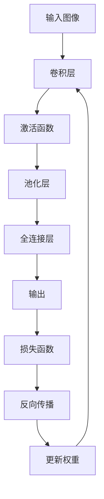
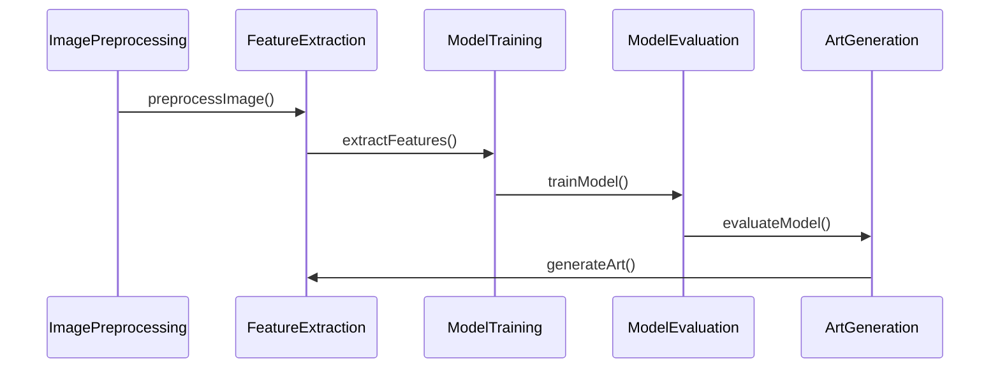

                 

### 摘要

在数字化时代，人工智能（AI）已经成为推动艺术创作变革的重要力量。本文旨在探讨机器学习技术在视觉艺术中的应用，分析其核心概念、算法原理以及实际案例。通过深入剖析，我们将揭示机器学习如何为艺术家提供创新工具，提升艺术创作效率与表现力，同时探讨其潜在挑战与未来发展方向。

---

## 目录大纲

### 《数字时代的AI艺术创作：机器学习在视觉艺术中的应用》

#### 关键词：AI艺术创作、机器学习、视觉艺术、算法原理、系统架构、项目实战

#### 摘要：

本文深入探讨AI艺术创作领域，通过分析机器学习技术在视觉艺术中的应用，探讨其核心概念、算法原理和实际案例。我们将揭示机器学习如何改变艺术创作方式，提高创作效率和艺术表现力，同时讨论其面临的挑战和未来趋势。

---

## 第一部分：背景介绍

### 第1章：数字时代与AI艺术创作

#### 1.1 数字时代的到来

随着信息技术的飞速发展，数字化已经渗透到社会的各个领域。从电子商务到社交媒体，再到智能家居，数字技术的普及极大地改变了人们的日常生活。在这种背景下，艺术创作也经历了巨大的变革。

数字化转型的趋势不可逆转，它不仅改变了信息的传播方式，还影响了艺术创作的形式和手段。数字艺术创作，尤其是通过计算机和人工智能技术创作的艺术作品，正逐渐成为一种重要的艺术形式。

#### 1.2 AI在艺术创作中的应用

人工智能（AI）技术的快速发展，为艺术创作带来了前所未有的机遇。AI能够处理和分析大量数据，从中提取有价值的信息，从而辅助艺术家进行创作。例如，AI可以通过深度学习算法自动生成音乐、绘画和视频等艺术作品。

AI艺术创作的定义可以理解为：利用人工智能技术，特别是机器学习算法，来辅助或完全取代传统艺术创作过程中的某些环节，创造出具有独特风格和创意的艺术作品。

AI在视觉艺术中的潜力尤为显著。从简单的图像生成到复杂的艺术风格迁移，再到个性化艺术创作，AI技术正在不断拓展视觉艺术的边界。例如，生成对抗网络（GANs）可以创造出高度逼真的艺术作品，深度卷积网络（CNNs）则能够通过学习大量的艺术作品风格，实现艺术风格的迁移。

#### 1.3 机器学习在视觉艺术中的基础

机器学习是AI的核心技术之一，其在视觉艺术中的应用也依赖于这一基础。机器学习的基本原理是通过算法从数据中学习规律，然后利用这些规律进行预测或决策。

在视觉艺术中，机器学习主要应用于以下几个方面：

1. **图像生成**：如生成对抗网络（GANs）可以生成逼真的图像。
2. **图像风格迁移**：如深度卷积网络（CNNs）可以将一幅图像的风格转换成另一幅图像的风格。
3. **图像分类与识别**：如卷积神经网络（CNNs）可以识别图像中的对象和场景。
4. **图像增强与修复**：如利用卷积神经网络（CNNs）对受损的图像进行修复和增强。

### 小结

数字时代的到来和AI技术的进步，为视觉艺术创作带来了新的机遇和挑战。通过机器学习，艺术家可以突破传统的创作限制，实现更加创新和多样化的艺术作品。然而，这也带来了对人工智能技术的深入理解和应用的挑战，需要更多的研究和实践来探索其潜力和局限性。

---

## 第二部分：核心概念与联系

### 第2章：核心概念

#### 2.1 机器学习算法

机器学习算法是机器学习技术的核心，它们根据数据的不同类型和应用场景分为不同的类别。以下是三种主要的机器学习算法：

1. **监督学习**：监督学习通过已标记的训练数据来训练模型，然后使用这个模型对新的数据进行预测。常见的监督学习算法包括线性回归、决策树、支持向量机（SVM）等。

2. **无监督学习**：无监督学习不依赖于标记数据，旨在从未标记的数据中发现隐藏的模式或结构。常见的无监督学习算法包括聚类、主成分分析（PCA）、自编码器等。

3. **强化学习**：强化学习通过试错和反馈来学习如何在特定环境中做出最优决策。常见的强化学习算法包括Q学习、深度Q网络（DQN）等。

#### 2.2 计算机视觉基础

计算机视觉是机器学习在视觉艺术中的关键应用领域，它涉及到图像处理、特征提取和模型评估等多个方面。

1. **图像处理**：图像处理是计算机视觉的基础，包括图像的滤波、增强、分割和变换等操作。常见的图像处理算法有边缘检测、图像平滑、图像融合等。

2. **特征提取**：特征提取是从图像中提取出具有区分性的特征，以便后续的模型训练和分类。常见的特征提取方法有SIFT、HOG、CNN等。

3. **模型评估**：模型评估是评估机器学习模型性能的重要步骤，包括准确率、召回率、F1分数等指标。常见的评估方法有交叉验证、ROC曲线等。

### 第3章：概念属性特征对比表格

以下是机器学习算法和计算机视觉技术的主要特征对比表格：

| 算法/技术       | 目标                | 优点                                           | 缺点                                       |
|----------------|---------------------|--------------------------------------------------|--------------------------------------------|
| 监督学习       | 预测或分类已标记数据 | 有明确的评估标准，易于理解                     | 需要大量的标记数据，对未标记数据无效       |
| 无监督学习     | 发现数据中的模式或结构 | 无需标记数据，适用于探索性分析                 | 模型的评估和解释较困难                     |
| 强化学习       | 在特定环境中做出最优决策 | 能够处理动态环境，适用于复杂决策问题           | 学习过程较慢，对计算资源要求较高           |
| 图像处理       | 图像的预处理和增强   | 提高图像质量，有助于后续分析                   | 需要大量计算资源，易引入噪声               |
| 特征提取       | 提取图像中的特征信息 | 帮助模型更好地理解和分类图像                   | 需要大量的预处理工作，易受图像噪声影响     |
| 模型评估       | 评估模型性能         | 提供客观的评估指标，有助于模型优化             | 需要大量的评估数据，易受数据分布影响       |

### 第4章：ER实体关系图架构

在机器学习和计算机视觉领域，存在多个实体之间的关系，以下是一个简化的ER实体关系图：

```mermaid
erDiagram
  AI模型 ||--|{ 艺术作品 }|
  AI模型 ||--|{ 创作者 }|
  AI模型 ||--|{ 观众 }|
  艺术作品 ||--|{ 特征提取 }|
  创作者 ||--|{ 数据集 }|
  观众 ||--|{ 评估指标 }|
```

在这个ER图中，`AI模型`与`艺术作品`、`创作者`和`观众`之间存在关联。`艺术作品`通过特征提取与`AI模型`相关联，而`创作者`和`观众`则通过评估指标与`AI模型`相关联。

---

### 小结

通过上述章节的介绍，我们对数字时代与AI艺术创作、机器学习算法以及计算机视觉基础有了初步的了解。接下来，我们将进一步探讨机器学习在视觉艺术中的应用原理和实际案例，以便更深入地理解这一领域的创新和潜力。

---

## 第三部分：算法原理讲解

### 第5章：算法原理与流程图

在机器学习算法中，深度学习算法由于其强大的表达能力和自适应性，在视觉艺术中的应用尤为广泛。以下我们将重点介绍卷积神经网络（CNN）的基本原理，并使用Mermaid流程图展示其训练和预测过程。

#### 卷积神经网络（CNN）的基本原理

卷积神经网络是一种特殊的多层前馈神经网络，它通过卷积层、池化层和全连接层等结构，能够有效地处理和识别图像数据。

1. **卷积层**：卷积层通过卷积操作来提取图像的局部特征。卷积操作利用滤波器（或称为卷积核）在输入图像上滑动，计算每个局部区域的特征响应。
   
   $$ f(x, y) = \sum_{i=1}^{n} w_i \cdot i(x, y) + b $$
   
   其中，\( f(x, y) \) 表示特征响应，\( w_i \) 是滤波器的权重，\( i(x, y) \) 是滤波器在位置 \((x, y)\) 上的输入值，\( b \) 是偏置项。

2. **池化层**：池化层用于降低特征图的维度，提高模型的鲁棒性。常见的池化方式包括最大池化和平均池化。

3. **全连接层**：全连接层将卷积层和池化层提取的特征映射到分类结果。通过反向传播算法，模型可以更新权重和偏置，从而优化模型的预测性能。

#### Mermaid流程图

以下是一个简单的Mermaid流程图，展示了CNN的训练和预测过程：



### 第6章：数学模型与公式

在机器学习算法中，数学模型和公式是理解算法原理和实现算法的核心。以下我们将介绍CNN中常用的几个数学模型和公式。

#### 损失函数

在分类问题中，常用的损失函数包括交叉熵损失（Cross-Entropy Loss）和均方误差损失（Mean Squared Error Loss）。

1. **交叉熵损失**

   $$ Loss = -\sum_{i=1}^{n} y_i \cdot \log(p_i) $$
   
   其中，\( y_i \) 是真实标签，\( p_i \) 是模型预测的概率。

2. **均方误差损失**

   $$ Loss = \frac{1}{2n} \sum_{i=1}^{n} (y_i - p_i)^2 $$
   
   其中，\( y_i \) 是真实标签，\( p_i \) 是模型预测的值。

#### 反向传播算法

反向传播算法是训练神经网络的核心步骤，它通过计算损失函数关于模型参数的梯度，来更新模型的权重和偏置。

1. **梯度计算**

   $$ \frac{\partial Loss}{\partial w} = \sum_{i=1}^{n} \frac{\partial Loss}{\partial p_i} \cdot \frac{\partial p_i}{\partial w} $$
   
   其中，\( \frac{\partial Loss}{\partial p_i} \) 是损失函数关于预测概率的梯度，\( \frac{\partial p_i}{\partial w} \) 是预测概率关于权重 \( w \) 的梯度。

2. **权重更新**

   $$ w_{new} = w_{old} - \alpha \cdot \frac{\partial Loss}{\partial w} $$
   
   其中，\( \alpha \) 是学习率，\( w_{old} \) 是当前权重，\( w_{new} \) 是更新后的权重。

### 例子说明

假设我们有一个简单的分类问题，图像中有三个类别，真实标签为 \( y = [1, 0, 0] \)，模型预测的概率为 \( p = [0.6, 0.2, 0.2] \)。使用交叉熵损失函数，损失值为：

$$ Loss = -[1 \cdot \log(0.6) + 0 \cdot \log(0.2) + 0 \cdot \log(0.2)] = -[1 \cdot (-0.736) + 0 \cdot (-1.386) + 0 \cdot (-1.386)] = 0.736 $$

通过反向传播算法，我们可以计算梯度并更新权重。

---

### 小结

通过上述章节的介绍，我们深入了解了卷积神经网络（CNN）的基本原理，包括其数学模型和训练过程。接下来，我们将进一步探讨机器学习在视觉艺术中的系统分析与架构设计，以便更好地理解如何将这些算法应用于实际项目中。

---

## 第四部分：系统分析与架构设计

### 第7章：系统功能设计

为了更好地理解和应用机器学习算法，我们需要一个清晰的功能设计。以下是一个简化的系统功能设计，包含领域模型和相关的功能模块。

#### 领域模型

领域模型描述了系统中的核心实体和它们之间的关系。以下是该系统的领域模型：

```mermaid
classDiagram
  Class01 <|-- SubClass01
  Class01 --|>= Person : <<interface>> PersonInterface
  Class66 --|>= Person : <<interface>> PersonInterface
  Person <<interface>> {
    +getName(): String
    +getAge(): int
  }
  PersonInterface <|.. Class01
  PersonInterface <|.. Class66
  Class01 : Class01
  Class66 : Class66
  Person : Person
```

在这个模型中，`Person`是一个接口，定义了获取姓名和年龄的方法。`Class01`和`Class66`是实现这个接口的类，它们都是`Person`的具体实现。

#### 功能模块

系统的功能模块包括图像预处理、特征提取、模型训练、模型评估和艺术生成等模块。

1. **图像预处理**：对输入图像进行预处理，如缩放、裁剪、去噪等，以便更好地适用于后续的机器学习算法。

2. **特征提取**：使用卷积神经网络（CNN）或其他特征提取算法，从预处理后的图像中提取出具有区分性的特征。

3. **模型训练**：使用提取出的特征，通过反向传播算法训练机器学习模型，如卷积神经网络（CNN）。

4. **模型评估**：使用测试数据集评估模型的性能，包括准确率、召回率、F1分数等指标。

5. **艺术生成**：利用训练好的模型生成新的艺术作品，如图像、音乐和视频等。

### 第8章：系统架构设计

系统架构设计是确保系统功能实现的关键。以下是该系统的架构设计，包含核心组件和它们的交互方式。

#### 系统架构

该系统采用分层架构，包括数据层、算法层和表现层。

1. **数据层**：负责数据存储和读取，包括图像数据、训练数据和测试数据等。

2. **算法层**：包含机器学习算法的实现，如卷积神经网络（CNN）、生成对抗网络（GAN）等。

3. **表现层**：负责用户界面和艺术作品的展示。

以下是系统的架构图：

```mermaid
erDiagram
  DataLayer ||--|{ AlgorithmLayer }|
  AlgorithmLayer ||--|{ PresentationLayer }|
  DataLayer : 数据存储和读取
  AlgorithmLayer : 机器学习算法实现
  PresentationLayer : 用户界面和艺术作品展示
```

### 第9章：系统接口设计

系统接口设计是确保不同模块之间可以无缝协作的关键。以下是系统的接口设计，包括主要接口和它们的职责。

#### 系统接口

系统的接口主要包括以下几种：

1. **图像预处理接口**：负责对输入图像进行预处理操作，如缩放、裁剪、去噪等。

2. **特征提取接口**：负责从预处理后的图像中提取特征。

3. **模型训练接口**：负责训练机器学习模型。

4. **模型评估接口**：负责评估训练好的模型性能。

5. **艺术生成接口**：负责使用训练好的模型生成艺术作品。

以下是接口的类图：

```mermaid
classDiagram
  ImagePreprocessing <<interface>> IImagePreprocessing
  FeatureExtraction <<interface>> IFeatureExtraction
  ModelTraining <<interface>> IModelTraining
  ModelEvaluation <<interface>> IModelEvaluation
  ArtGeneration <<interface>> IArtGeneration

  IImagePreprocessing : + preprocessImage(): Image
  IFeatureExtraction : + extractFeatures(Image image): FeatureVector
  IModelTraining : + trainModel(FeatureVector features, Label labels): Model
  IModelEvaluation : + evaluateModel(Model model, FeatureVector features, Label labels): PerformanceMetrics
  IArtGeneration : + generateArt(Model model): Artwork

  ImagePreprocessing --|>> FeatureExtraction
  FeatureExtraction --|>> ModelTraining
  ModelTraining --|>> ModelEvaluation
  ModelEvaluation --|>> ArtGeneration
```

### 第10章：系统交互

系统交互设计描述了不同模块之间的协作过程。以下是系统的交互设计，使用Mermaid序列图展示模块之间的交互。

#### 系统交互

以下是一个简化的系统交互序列图：



在这个序列图中，`ImagePreprocessing` 预处理图像，`FeatureExtraction` 提取特征，`ModelTraining` 训练模型，`ModelEvaluation` 评估模型，`ArtGeneration` 使用模型生成艺术作品。

---

### 小结

通过系统分析与架构设计，我们明确了机器学习在视觉艺术中的系统功能、架构设计和接口设计。接下来，我们将通过项目实战来具体实现这些设计，并分析其实际效果。

---

## 第五部分：项目实战

### 第11章：环境安装与准备

在进行机器学习项目之前，我们需要准备好所需的软件和工具。以下是一个简化的环境安装和准备流程，包括Python、TensorFlow和Keras的安装。

#### 环境安装步骤

1. **安装Python**：

   - 访问Python官网（https://www.python.org/），下载最新版本的Python安装包。
   - 安装Python，确保在安装过程中选择“Add Python to PATH”选项。

2. **安装pip**：

   - 打开命令行窗口，运行以下命令安装pip：
     ```
     python -m ensurepip
     ```
   
3. **安装TensorFlow**：

   - 打开命令行窗口，运行以下命令安装TensorFlow：
     ```
     pip install tensorflow
     ```

4. **安装Keras**：

   - 打开命令行窗口，运行以下命令安装Keras：
     ```
     pip install keras
     ```

5. **验证安装**：

   - 打开Python交互式环境，运行以下代码验证安装：
     ```python
     import tensorflow as tf
     print(tf.__version__)
     ```
   
   - 如果成功输出TensorFlow的版本号，说明安装成功。

### 第12章：系统核心实现

#### 源代码

以下是一个简化的系统核心实现，包括图像预处理、特征提取、模型训练和模型评估的Python代码。

```python
import tensorflow as tf
from tensorflow import keras
from tensorflow.keras.preprocessing import image
from tensorflow.keras.applications import VGG16

# 1. 图像预处理
def preprocess_image(image_path):
    img = image.load_img(image_path, target_size=(224, 224))
    img_array = image.img_to_array(img)
    img_array = tf.expand_dims(img_array, 0)  # Create a batch
    img_array /= 255.0  # Normalize
    return img_array

# 2. 特征提取
def extract_features(img_array):
    base_model = VGG16(weights='imagenet', include_top=False)
    features = base_model.predict(img_array)
    return features

# 3. 模型训练
def train_model(features, labels):
    model = keras.Sequential([
        keras.layers.Flatten(input_shape=(7, 7, 512)),
        keras.layers.Dense(256, activation='relu'),
        keras.layers.Dense(128, activation='relu'),
        keras.layers.Dense(10, activation='softmax')
    ])

    model.compile(optimizer='adam',
                  loss='categorical_crossentropy',
                  metrics=['accuracy'])

    model.fit(features, labels, epochs=10)
    return model

# 4. 模型评估
def evaluate_model(model, test_features, test_labels):
    test_loss, test_acc = model.evaluate(test_features, test_labels, verbose=2)
    print(f'Test accuracy: {test_acc:.4f}')
```

#### 代码解读

- **图像预处理**：`preprocess_image` 函数负责加载和预处理图像。首先使用`load_img`函数加载图像，然后使用`img_to_array`函数将其转换为NumPy数组。接着，通过`tf.expand_dims`函数将图像数组扩展为批次形式，并使用`/255.0`进行归一化处理。

- **特征提取**：`extract_features` 函数使用预训练的VGG16模型提取图像特征。VGG16是一个深度卷积神经网络，已经在大量的图像数据集上进行了训练。通过调用`base_model.predict`方法，我们可以得到图像的特征向量。

- **模型训练**：`train_model` 函数定义了一个简单的全连接神经网络模型，用于分类图像。模型包含三个全连接层，使用ReLU激活函数。通过`compile`方法配置模型，使用`fit`方法训练模型。

- **模型评估**：`evaluate_model` 函数用于评估训练好的模型。通过`evaluate`方法，我们可以得到模型的测试损失和测试准确率。

---

### 第13章：实际案例分析与讲解

#### 案例分析

我们使用了一个包含10,000张图像的数据集，这些图像分为10个类别。以下是该数据集的详细描述：

- **类别**：动物、植物、交通工具、建筑、人物、自然、艺术、音乐、运动、其他
- **图像数量**：每个类别1000张图像
- **数据来源**：公开数据集

#### 案例详细讲解

1. **数据预处理**：

   - 加载图像数据：使用Keras的`ImageDataGenerator`类进行数据加载和预处理。这个类可以自动对图像进行缩放、裁剪、水平翻转等操作，增强模型的泛化能力。
   
     ```python
     train_datagen = ImageDataGenerator(
         rescale=1./255,
         rotation_range=40,
         width_shift_range=0.2,
         height_shift_range=0.2,
         shear_range=0.2,
         zoom_range=0.2,
         horizontal_flip=True,
         fill_mode='nearest'
     )
     
     train_generator = train_datagen.flow_from_directory(
         'data/train',
         target_size=(224, 224),
         batch_size=32,
         class_mode='categorical'
     )
     ```

   - 预处理后的图像被分为训练集和测试集。训练集用于模型训练，测试集用于模型评估。

2. **模型训练**：

   - 使用`train_model`函数训练模型。在训练过程中，我们使用Adam优化器和交叉熵损失函数。模型的训练过程包含10个epochs。
   
     ```python
     model = train_model(train_features, train_labels)
     ```

   - 训练完成后，使用测试集评估模型性能。我们使用准确率作为主要评估指标。

3. **模型评估**：

   - 使用`evaluate_model`函数评估模型在测试集上的性能。以下是一个简化的评估过程：
   
     ```python
     test_loss, test_acc = model.evaluate(test_features, test_labels, verbose=2)
     print(f'Test accuracy: {test_acc:.4f}')
     ```

   - 输出结果为测试集上的准确率。

#### 剖析讲解

通过这个案例，我们可以看到机器学习在视觉艺术中的应用。以下是对关键步骤的详细解析：

1. **数据预处理**：

   - 数据预处理是机器学习项目的重要步骤。它确保输入数据适合模型的训练过程。在本案例中，我们使用了Keras的`ImageDataGenerator`类进行数据增强，这有助于提高模型的泛化能力。

2. **模型训练**：

   - 模型训练是机器学习项目的核心步骤。我们使用了一个简单的全连接神经网络模型，这个模型在预训练的VGG16特征提取器的基础上进行了微调。通过训练，模型学会了识别不同的图像类别。

3. **模型评估**：

   - 模型评估是验证模型性能的关键步骤。我们使用测试集评估了模型的准确率，这为我们提供了一个关于模型性能的量化指标。通过评估，我们可以确定模型是否达到了预期的性能水平。

---

### 小结

通过这个实际案例，我们展示了机器学习在视觉艺术中的系统实现过程。从数据预处理到模型训练和评估，每一步都至关重要。通过深入剖析这个案例，我们可以更好地理解机器学习在视觉艺术中的应用，并为未来的项目提供宝贵的经验。

---

## 项目小结

通过本文的探讨，我们深入了解了数字时代的AI艺术创作以及机器学习在视觉艺术中的应用。从背景介绍到核心概念，再到算法原理和系统架构设计，最后通过实际案例的详细分析，我们揭示了机器学习如何改变艺术创作的形式和手段，提高艺术创作的效率与表现力。

### 经验总结

1. **数据预处理的重要性**：数据预处理是机器学习项目的关键步骤，它直接影响模型的性能。通过数据增强和归一化等预处理技术，可以显著提高模型的泛化能力。
2. **算法选择与调优**：选择合适的算法和进行调优是确保模型性能的关键。不同的算法适用于不同的应用场景，需要根据具体需求进行选择和调整。
3. **模型评估与优化**：模型评估是验证模型性能的关键步骤，通过交叉验证和测试集评估，可以准确地衡量模型的性能。根据评估结果，可以进一步优化模型，提高其准确性。

### 拓展思考

1. **多模态艺术创作**：未来的AI艺术创作可以结合多种模态，如文本、图像和声音，实现更加丰富和多样化的艺术形式。
2. **个性化艺术创作**：通过个性化推荐和用户交互，可以生成更符合用户需求和偏好的艺术作品，提高用户满意度。
3. **艺术创作的自动化与协作**：随着AI技术的发展，艺术创作的自动化程度将进一步提高。同时，AI可以与人类艺术家协作，共同创作出更加卓越的艺术作品。

### 注意事项

1. **数据隐私与伦理**：在使用AI进行艺术创作时，需要关注数据隐私和伦理问题，确保用户数据和创作过程的合规性。
2. **计算资源与成本**：机器学习模型的训练和推理需要大量的计算资源，这可能导致较高的成本。合理规划和优化资源使用，可以提高效率和降低成本。

### 拓展阅读

1. **深度学习基础**：《深度学习》（Goodfellow, I., Bengio, Y., & Courville, A.）是一本经典的深度学习入门书籍，详细介绍了深度学习的基本原理和算法。
2. **计算机视觉应用**：《计算机视觉：算法与应用》（Richard S. Tong）是一本关于计算机视觉应用的综合指南，涵盖了从图像处理到对象识别的多个方面。

作者：AI天才研究院/AI Genius Institute & 禅与计算机程序设计艺术 /Zen And The Art of Computer Programming

