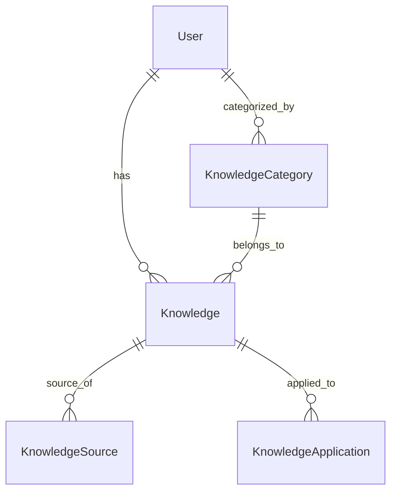

                 

## 引言：数字时代的个人知识管理系统的重要性

### 1.1.1 问题背景

随着互联网的普及和数字化进程的加速，信息获取和传播变得前所未有的便捷。然而，这也给个人知识管理带来了新的挑战。传统的知识管理方法，如手工记录、电子文档管理等，往往难以应对海量信息的快速更新和复杂变化。特别是在信息过载的今天，如何高效地获取、整理和利用知识，成为每个人都需要面对的问题。

首先，知识获取的难度增加。在互联网上，每天都有海量的信息被发布，这些信息涵盖了各个领域，从科技、经济到文化、艺术。个人要从中筛选出有价值的信息，需要耗费大量的时间和精力。其次，知识存储的困难也显而易见。随着信息量的增加，如何有效地存储和分类这些信息，使其能够快速检索和利用，成为一大难题。最后，知识应用的有效性受到限制。即使个人能够获取和存储大量信息，但如果不能高效地应用这些知识，那么它们的价值就无法得到充分发挥。

因此，在数字时代，建立高效、智能的个人知识管理系统显得尤为重要。这种系统能够帮助个人更好地管理知识，提高工作效率，实现知识的持续积累和迭代。通过系统化的知识管理，个人不仅可以更快地获取所需信息，还能在知识的应用过程中实现创新和突破。总的来说，个人知识管理系统是数字时代个人竞争力提升的重要工具。

### 1.1.2 问题描述

个人知识管理涉及多个复杂环节，包括知识获取、知识存储、知识分类、知识检索和知识应用。每一个环节都面临着不同的挑战，需要系统化、智能化的解决方案。

首先，知识获取是一个动态、持续的过程。个人需要从各种渠道获取新知识，如网络搜索、文献阅读、人际交流等。然而，这些知识往往是零散的、非结构化的，如何有效地进行信息过滤和知识提取，成为关键问题。其次，知识存储方面，如何选择合适的存储方式，确保知识的可访问性和安全性，是一个重要的课题。传统的电子文档管理虽然方便，但在海量数据的背景下，其效率和扩展性有限。

在知识分类环节，如何对大量信息进行科学、系统的分类，以便于后续的检索和应用，也是一个重大挑战。分类不当会导致知识检索效率低下，影响用户的使用体验。知识检索方面，如何设计高效的搜索算法，实现快速、准确的知识获取，是提高系统价值的关键。此外，知识应用的有效性也是一个重要问题。如何将获取和存储的知识应用到实际工作学习中，解决实际问题，实现知识的增值，需要系统提供强有力的支持。

总之，个人知识管理系统的构建需要解决多个复杂环节中的挑战，这些环节相互关联、相互影响，只有通过系统化的设计和实施，才能实现高效、智能的个人知识管理。

### 1.1.3 问题解决

本书旨在通过开源项目实践，为构建数字时代的个人知识管理系统提供一套完整、可行的解决方案。开源项目作为一种开放、协作的模式，能够充分利用社区的力量，快速迭代和优化系统功能。以下是本书的主要内容和目标：

首先，本书将详细介绍个人知识管理系统（PKMS）的总体架构和设计思路。通过对知识获取、知识存储、知识分类、知识检索和知识应用等关键环节的详细分析，为读者提供系统构建的理论基础。

其次，本书将结合实际开源项目，如 **Notion**、**Evernote** 等，深入探讨个人知识管理系统的实现方法和技术细节。通过实例分析，读者可以了解如何使用现代技术，如人工智能、大数据、区块链等，提升系统的智能化和效率。

接着，本书将详细讨论个人知识管理系统的优化和扩展方法，包括性能优化、安全性提升、用户体验改进等。这些内容将帮助读者在实际应用中，根据需求对系统进行定制和改进。

最后，本书还将探讨个人知识管理系统在各类场景下的应用案例，如学术研究、企业管理、个人成长等。通过这些案例，读者可以了解系统在不同领域的实际效果和潜在价值。

总的来说，本书通过开源项目的实践，旨在为构建数字时代的个人知识管理系统提供全方位的指导，帮助读者实现知识的系统化管理和高效利用。

### 1.1.4 边界与外延

本书主要围绕开源个人知识管理系统展开，探讨其在数字时代个人知识管理中的应用。然而，个人知识管理系统的应用场景和范围远不止于此。在实际操作中，我们可以将其扩展到多个领域，以实现更广泛的应用价值。

首先，在学术研究中，个人知识管理系统可以用来管理大量的文献资料、实验数据和研究成果。通过高效的检索和分类功能，研究人员可以快速找到所需信息，提高工作效率和科研水平。

其次，在企业中，个人知识管理系统可以用于知识共享和管理，帮助员工更好地学习和传承公司内部知识。这不仅能提高员工的技能和素质，还能促进企业创新和持续发展。

此外，个人知识管理系统在个人成长中也具有重要作用。通过系统化的知识管理，个人可以更好地规划学习目标、跟踪学习进度，并利用已有的知识解决实际问题，提升自身能力和竞争力。

最后，个人知识管理系统还可以应用于教育领域。学生可以利用系统进行自主学习，教师则可以通过系统管理教学资源，提高教学效果和互动性。

总之，尽管本书主要聚焦于开源个人知识管理系统的构建，但其应用范围和潜力是广泛的。通过不断优化和扩展，个人知识管理系统将在更多领域中发挥重要作用。

### 1.1.5 概念结构与核心要素组成

个人知识管理系统（PKMS）是一个复杂的系统，其核心目的是帮助个人高效地管理知识，从而提升工作和学习效率。为了实现这一目标，PKMS通常由以下几个核心组成部分构成：

1. **知识获取**：知识获取是个人知识管理系统的首要环节。它包括从各种渠道收集信息，如互联网、书籍、讲座、会议等。这一模块需要实现信息过滤和知识提取，确保获取的知识是有价值和准确的。信息过滤可以通过关键词筛选、来源认证等方式实现，而知识提取则需要运用自然语言处理、数据挖掘等技术。

2. **知识存储**：知识存储是将获取到的知识进行系统化、结构化存储的过程。现代个人知识管理系统通常采用数据库、云存储等技术来实现这一功能。数据存储不仅要考虑容量和速度，还需要确保数据的可靠性和安全性。此外，知识存储模块还需要提供便捷的检索接口，以便用户能够快速找到所需知识。

3. **知识分类**：知识分类是提高知识管理效率的重要手段。通过对知识进行科学的分类，用户可以更加直观地了解和管理知识。分类算法可以基于多种策略，如基于内容的分类、基于标签的分类、基于关系的分类等。有效的分类策略能够极大地提高知识检索的效率，使用户能够快速定位到所需的知识。

4. **知识检索**：知识检索是个人知识管理系统的核心功能之一。通过高效的搜索算法，用户可以在海量的知识库中快速找到所需信息。知识检索模块需要实现模糊查询、智能推荐等功能，以提高检索的准确性和效率。此外，为了满足不同用户的需求，检索界面应提供多种检索方式和个性化设置。

5. **知识应用**：知识应用是将存储的知识转化为实际生产力的重要环节。个人知识管理系统应提供丰富的工具和接口，帮助用户将知识应用于实际工作学习中。例如，可以通过笔记、文档、项目管理等工具，将知识转化为具体的工作成果。此外，系统还可以提供知识共享和协作功能，促进知识在团队中的传播和应用。

6. **知识可视化**：知识可视化是通过图形、图表等方式，将知识以直观的形式展示出来。这不仅有助于用户更好地理解和利用知识，还能提高知识的传播效果。知识可视化模块可以包括思维导图、知识图谱、数据可视化等多种形式。通过这些工具，用户可以更清晰地看到知识之间的关系和结构，从而更好地进行知识管理和应用。

通过以上核心组成部分的协同作用，个人知识管理系统可以实现高效的个人知识管理，帮助用户在信息爆炸的时代中，更好地获取、存储、分类、检索和应用知识。这不仅能够提高个人工作效率，还能促进知识的持续积累和创新。

### 1.1.6 本章小结

本章从问题背景、问题描述、问题解决等多个角度，详细阐述了数字时代个人知识管理系统的重要性。随着信息量的爆炸性增长，个人知识管理面临着诸多挑战，如何高效地获取、存储、分类、检索和应用知识成为关键问题。通过开源项目实践，本书提出了一套完整的个人知识管理系统解决方案，涵盖了知识获取、知识存储、知识分类、知识检索和知识应用等核心环节。同时，本书还探讨了个人知识管理系统的核心概念及其相互关系，为后续章节的深入讨论奠定了基础。接下来，本书将继续探讨个人知识管理系统的关键技术和实际应用，为构建数字化第二大脑提供更加详实的指导。

---

## 核心概念与联系

在深入探讨个人知识管理系统（PKMS）之前，有必要先明确其核心概念和各概念之间的相互关系。个人知识管理系统涉及的知识获取、知识存储、知识分类、知识检索、知识应用和知识可视化等核心概念，共同构成了系统的理论基础和实施框架。

### 1.2.1 个人知识管理系统的核心概念

1. **知识**：知识是个人在工作和生活中积累的信息、经验和技能的总和。它可以是显性的，如文档、书籍和视频，也可以是隐性的，如个人经验和直觉。知识的获取是个人知识管理系统的起点。

2. **知识管理**：知识管理是一个过程，涉及知识的获取、存储、分类、检索和应用等多个环节。通过科学的管理，个人能够有效地利用其拥有的知识，提高工作效率。

3. **知识获取**：知识获取是从各种渠道收集知识的过程。这包括主动获取，如阅读书籍、参加讲座、参加培训等，以及被动获取，如通过社交媒体、专业论坛和在线资源等。

4. **知识存储**：知识存储是将获取的知识进行系统化、结构化存储的过程。这通常通过数据库、云存储和文件系统等实现，以确保知识的安全、可靠和易于访问。

5. **知识分类**：知识分类是对知识进行科学划分和整理的过程，以便于管理和检索。分类可以基于内容、主题、用途等多种维度进行。

6. **知识检索**：知识检索是通过搜索算法和工具，帮助用户快速找到所需知识的过程。高效的检索系统能够提高用户的工作效率和满意度。

7. **知识应用**：知识应用是将知识应用于实际工作、学习和生活中的过程。通过将知识转化为具体的行动和成果，个人能够更好地解决问题和实现目标。

8. **知识可视化**：知识可视化是通过图形、图表和地图等视觉形式，将知识以直观、易于理解的方式展示出来。这有助于用户更好地理解和利用知识。

### 1.2.2 概念属性特征对比表格

为了更好地理解个人知识管理系统的核心概念，我们通过一个对比表格来展示这些概念之间的属性特征。

| 概念       | 属性特征                                           | 示例                                                         |
|------------|----------------------------------------------------|--------------------------------------------------------------|
| 知识       | 信息、经验、技能等                                   | 项目报告、工作日志、专业书籍                                  |
| 知识管理   | 收集、存储、分类、检索和应用                         | 使用数据库管理知识、采用分类算法对知识分类、利用搜索工具检索知识 |
| 知识获取   | 信息收集、信息过滤、知识提取                         | 阅读文献、网络搜索、专业咨询                                 |
| 知识存储   | 数据库、云存储、文件系统                             | MySQL数据库、Amazon S3                                       |
| 知识分类   | 基于内容、基于标签、基于关系                          | 文档分类、视频标签、知识图谱中的节点关系                      |
| 知识检索   | 搜索算法、索引、推荐系统                            | 全文搜索、模糊查询、智能推荐                                |
| 知识应用   | 将知识转化为行动、解决方案、成果                      | 解决实际问题、撰写报告、设计项目                            |
| 知识可视化  | 图形、图表、地图等                                   | 思维导图、知识图谱、热力图                                  |

通过上述表格，我们可以清晰地看到各个核心概念的主要属性特征及其在实际应用中的具体表现形式。

### 1.2.3 ER实体关系图架构

为了更直观地展示个人知识管理系统的核心概念及其相互关系，我们使用Mermaid绘制一个ER（实体-关系）图架构。



在这个ER图中，用户（User）是系统的核心实体，拥有知识（Knowledge）。知识按照分类（KnowledgeCategory）存储，每个分类可以包含多个知识项。知识项还可以指回其来源（KnowledgeSource），并可以应用于具体场景（KnowledgeApplication）。这种关系图清晰地展示了各核心概念之间的关联，为系统的设计和实现提供了参考。

通过以上对核心概念及其相互关系的详细阐述，我们为后续章节深入探讨个人知识管理系统的构建方法和应用场景奠定了坚实的基础。

---

## 个人知识管理系统的基本架构与功能模块

### 2.1 系统架构

个人知识管理系统的基本架构可以分为三层：表现层、逻辑层和数据层。每一层都承担着不同的功能，共同确保系统的稳定运行和高效管理。

1. **表现层**：这是用户直接交互的界面层，负责展示系统功能和数据。表现层通常包括前端用户界面和移动应用。前端用户界面可以是Web页面、桌面应用或移动应用，设计时需注重用户体验，提供直观、易用的操作界面。移动应用则可以提供离线使用功能，方便用户随时随地进行知识管理和操作。

2. **逻辑层**：这是系统的核心处理层，负责处理用户请求、数据存储和业务逻辑。逻辑层通常包括后台服务、API接口和业务逻辑处理模块。后台服务负责接收前端请求、处理业务逻辑并将结果返回前端。API接口则提供与其他系统和服务的交互接口，便于数据的共享和扩展。业务逻辑处理模块负责实现知识获取、存储、分类、检索和应用等功能，确保系统功能的完整性和一致性。

3. **数据层**：这是系统的数据存储和管理层，负责存储和管理系统中的所有数据。数据层通常包括数据库、云存储和文件系统。数据库用于存储用户数据、知识内容、分类信息和应用记录等，支持高并发访问和快速查询。云存储则提供海量数据的存储和备份功能，确保数据的安全性和可靠性。文件系统用于存储一些非结构化的数据，如文档、图片和视频等。

### 2.2 功能模块

个人知识管理系统包含多个功能模块，每个模块负责实现特定的功能，共同构成完整的知识管理流程。

1. **知识获取模块**：这是系统的基础模块，负责从各种渠道获取知识。知识获取的方式包括互联网爬虫、文献检索、用户手动输入等。获取到的知识需要经过信息过滤和知识提取，确保其准确性和有效性。信息过滤可以通过关键词筛选、来源认证等方式实现，知识提取则利用自然语言处理、数据挖掘等技术。

2. **知识存储模块**：这是系统的核心模块，负责存储和管理获取到的知识。知识存储模块需要支持多种数据类型，如文本、图片、音频和视频等。存储方式可以选择关系数据库、NoSQL数据库、云存储等，根据实际需求进行优化。此外，知识存储模块还需要提供数据备份和恢复功能，确保数据的安全性和可靠性。

3. **知识分类模块**：这是系统的关键模块，负责对知识进行科学分类。分类方法可以基于内容、主题、用途等多种维度，以方便用户快速检索和利用知识。知识分类模块需要支持动态分类和用户自定义分类，满足不同用户的需求。

4. **知识检索模块**：这是系统的核心功能之一，负责用户快速找到所需知识。检索模块可以采用全文搜索、关键词搜索、模糊查询等多种检索方式，并提供智能推荐功能，根据用户历史行为和需求推荐相关知识点。检索算法的设计和优化对系统的性能和用户体验至关重要。

5. **知识应用模块**：这是系统的最终目的，负责将知识应用于实际工作、学习和生活中。知识应用模块提供笔记、文档、项目管理等工具，帮助用户将知识转化为具体的行动和成果。此外，知识应用模块还可以支持知识共享和协作，促进知识在团队中的传播和应用。

6. **知识可视化模块**：这是系统的补充模块，负责将知识以直观、易于理解的方式展示出来。知识可视化模块可以包括思维导图、知识图谱、数据可视化等多种形式，帮助用户更好地理解和利用知识。

通过以上功能模块的协同作用，个人知识管理系统可以实现高效的个人知识管理，帮助用户在信息爆炸的时代中，更好地获取、存储、分类、检索和应用知识。

### 2.3 系统优势

个人知识管理系统的优势主要体现在以下几个方面：

1. **高效的知识管理**：通过系统化的知识获取、存储、分类、检索和应用，个人能够更加高效地管理其知识，提高工作效率和决策质量。

2. **灵活的扩展性**：系统采用模块化设计，可以根据用户需求进行灵活扩展，增加或替换功能模块，满足不同场景下的需求。

3. **强大的检索功能**：通过高效的搜索算法和智能推荐系统，用户可以快速找到所需知识，提高知识检索的准确性和效率。

4. **数据安全性**：系统采用多种数据存储和备份技术，确保知识的安全性和可靠性，防止数据丢失和泄露。

5. **良好的用户体验**：系统注重用户体验设计，提供直观、易用的界面和操作方式，使用户能够轻松上手并快速掌握。

6. **支持协作和共享**：系统支持知识共享和协作功能，促进知识在团队中的传播和应用，提高整体工作效率和创新能力。

通过以上优势，个人知识管理系统在提升个人知识管理能力和工作效率方面具有显著的作用，成为数字时代个人不可或缺的工具。

---

## 个人知识管理系统的具体实现细节

### 3.1 技术选型

个人知识管理系统的实现涉及多种技术的选择，以下是主要技术选型的详细说明：

1. **前端技术**：前端采用Vue.js框架，这是一种渐进式JavaScript框架，便于快速开发响应式Web界面。Vue.js具有简洁的语法、高效的组件化开发、良好的生态系统等特点，能够满足复杂用户界面的需求。此外，为了提升用户体验，前端还集成了Ant Design组件库，提供了一系列美观、易用的UI组件。

2. **后端技术**：后端采用Node.js和Express框架，Node.js作为基于Chrome V8引擎的JavaScript运行环境，能够高效地处理并发请求，适合构建高性能的后端服务。Express是一个minimalistic Web应用框架，能够简化开发过程，提高开发效率。

3. **数据库技术**：数据库选择MongoDB，这是一种NoSQL数据库，适合存储非结构化和半结构化数据。MongoDB具有灵活的文档模型、高效的读写性能、丰富的查询功能，能够很好地满足个人知识管理系统的需求。此外，为了提高数据的持久性和可靠性，数据库还配置了MongoDB Atlas云服务，提供自动备份、故障恢复等功能。

4. **云存储技术**：云存储采用Amazon S3（Simple Storage Service），这是一种高度可扩展的对象存储服务。S3不仅能够提供大规模数据存储，还能保证数据的持久性和可用性。为了实现高效的数据传输，系统还集成了AWS SDK（Software Development Kit），方便与S3进行交互。

5. **搜索引擎技术**：为了实现高效的全文搜索和智能推荐，系统采用了Elasticsearch。Elasticsearch是一种分布式、RESTful搜索和分析引擎，能够处理大规模数据并实现实时搜索。通过集成Elasticsearch，系统可以实现快速、准确的搜索结果，并提供智能推荐功能。

### 3.2 系统架构设计

个人知识管理系统的架构设计采用微服务架构，以实现模块化和高可扩展性。以下是系统架构的详细描述：

1. **表现层**：包括Web前端、移动端和桌面端，分别采用Vue.js框架进行开发。用户可以通过Web前端访问系统，进行知识的获取、存储、分类和检索；移动端和桌面端则提供了离线使用和便捷操作的功能。

2. **逻辑层**：包括API接口层、业务逻辑处理层和数据访问层。API接口层采用Express框架，提供与前端和后端的交互接口；业务逻辑处理层负责实现系统的核心功能，如知识获取、存储、分类和检索等；数据访问层则通过MongoDB驱动进行数据操作，确保数据的一致性和安全性。

3. **数据层**：包括MongoDB数据库和Amazon S3存储。MongoDB用于存储用户数据、知识内容和分类信息；Amazon S3用于存储非结构化数据，如文档、图片和视频等。通过将数据分层存储，系统能够更好地管理数据，提高数据访问效率。

4. **搜索引擎**：Elasticsearch作为分布式搜索引擎，负责提供高效的全文搜索和智能推荐功能。通过将数据同步到Elasticsearch集群，系统可以快速实现复杂查询和实时搜索。

### 3.3 系统接口设计

系统接口设计是确保前后端分离和功能模块解耦的关键环节。以下是系统的主要接口设计：

1. **用户管理接口**：包括用户注册、登录、个人信息管理等接口。用户注册接口用于创建新用户账户；登录接口用于验证用户身份；个人信息管理接口则提供修改密码、头像等个人信息的功能。

2. **知识管理接口**：包括知识获取、存储、分类和检索等接口。知识获取接口用于从外部渠道获取知识；知识存储接口用于将获取的知识存储到数据库；知识分类接口用于对知识进行分类管理；知识检索接口则提供全文搜索和智能推荐功能。

3. **数据同步接口**：用于将MongoDB中的数据同步到Elasticsearch中，确保搜索功能的实时性和准确性。数据同步接口支持批量同步和实时同步，可以根据系统负载进行动态调整。

4. **文件存储接口**：用于与Amazon S3进行交互，实现非结构化数据的上传、下载和管理。文件存储接口提供RESTful API，支持多种文件类型的上传和下载，同时确保数据的完整性和安全性。

通过以上技术选型和系统架构设计，个人知识管理系统能够高效、稳定地运行，为用户提供全面的知识管理服务。系统接口的设计和实现确保了前后端的解耦和高效交互，使得系统能够灵活扩展和升级。

---

## 个人知识管理系统的项目实战

### 4.1 环境安装

在开始个人知识管理系统的项目实战之前，我们需要搭建一个开发环境。以下是在不同操作系统下搭建开发环境的详细步骤：

#### 4.1.1 Windows环境

1. **安装Node.js**：访问Node.js官网（https://nodejs.org/），下载最新版本的安装程序并安装。确保在安装过程中选择添加到系统的环境变量。
2. **安装MongoDB**：访问MongoDB官网（https://www.mongodb.com/），下载适用于Windows的最新版本MongoDB社区版。安装过程中，请注意安装路径的设置，建议选择默认设置。
3. **安装Elasticsearch**：访问Elasticsearch官网（https://www.elastic.co/），下载适用于Windows的最新版本Elasticsearch。安装过程中，可以选择自定义安装路径，建议选择默认设置。

#### 4.1.2 macOS环境

1. **安装Homebrew**：打开终端，执行以下命令安装Homebrew：
   ```
   /bin/bash -c "$(curl -fsSL https://raw.githubusercontent.com/Homebrew/install/HEAD/install.sh)"
   ```
2. **安装Node.js**：在终端中执行以下命令安装Node.js：
   ```
   brew install node
   ```
3. **安装MongoDB**：在终端中执行以下命令安装MongoDB：
   ```
   brew install mongodb
   ```
4. **安装Elasticsearch**：在终端中执行以下命令安装Elasticsearch：
   ```
   brew install elasticsearch
   ```

#### 4.1.3 Linux环境

1. **安装Node.js**：使用以下命令安装Node.js：
   ```
   sudo apt-get update
   sudo apt-get install nodejs npm
   ```
2. **安装MongoDB**：使用以下命令安装MongoDB：
   ```
   sudo apt-get update
   sudo apt-get install mongodb
   ```
3. **安装Elasticsearch**：使用以下命令安装Elasticsearch：
   ```
   sudo apt-get update
   sudo apt-get install elasticsearch
   ```

安装完成后，确保各服务正常运行。对于MongoDB，可以启动MongoDB服务并验证其状态：
```
sudo service mongod start
sudo service mongod status
```
对于Elasticsearch，可以启动Elasticsearch服务并验证其状态：
```
sudo service elasticsearch start
sudo service elasticsearch status
```

### 4.2 系统核心实现

个人知识管理系统的核心实现包括前端、后端和数据库的交互。以下是各个部分的详细实现步骤：

#### 4.2.1 前端实现

1. **初始化项目**：在指定的目录下，使用Vue CLI创建Vue项目：
   ```
   vue create pkms-client
   ```
2. **安装依赖**：进入项目目录，安装必要的依赖：
   ```
   cd pkms-client
   npm install
   ```
3. **配置路由**：在`src/router/index.js`中配置路由，定义访问路径和对应的组件：
   ```javascript
   import Vue from 'vue';
   import Router from 'vue-router';
   import Home from '../views/Home.vue';

   Vue.use(Router);

   export default new Router({
     routes: [
       {
         path: '/',
         name: 'home',
         component: Home
       },
       // 其他路由配置...
     ]
   });
   ```
4. **配置状态管理**：在`src/store/index.js`中配置Vuex状态管理，定义全局状态和 mutations：
   ```javascript
   import Vue from 'vue';
   import Vuex from 'vuex';

   Vue.use(Vuex);

   export default new Vuex.Store({
     state: {
       user: null,
       knowledgeList: []
     },
     mutations: {
       setUser(state, user) {
         state.user = user;
       },
       setKnowledgeList(state, knowledgeList) {
         state.knowledgeList = knowledgeList;
       }
     },
     actions: {
       // 其他动作...
     }
   });
   ```
5. **创建组件**：在`src/components`目录下创建所需组件，如`KnowledgeItem.vue`、`SearchBar.vue`等，用于展示知识列表、搜索框等界面元素。

#### 4.2.2 后端实现

1. **初始化项目**：使用`npm init`命令初始化Node.js项目，并安装必要的依赖：
   ```
   npm init -y
   npm install express mongoose body-parser cors
   ```
2. **创建服务**：在`src/app.js`中创建Express应用，配置中间件和路由：
   ```javascript
   const express = require('express');
   const mongoose = require('mongoose');
   const bodyParser = require('body-parser');
   const cors = require('cors');

   const app = express();

   app.use(cors());
   app.use(bodyParser.json());

   // 连接MongoDB
   mongoose.connect('mongodb://localhost:27017/pkms', { useNewUrlParser: true, useUnifiedTopology: true });

   // 定义知识模型
   const KnowledgeSchema = new mongoose.Schema({
     title: String,
     content: String,
     category: String,
     timestamp: { type: Date, default: Date.now }
   });

   const Knowledge = mongoose.model('Knowledge', KnowledgeSchema);

   // 定义路由
   app.get('/', (req, res) => {
     res.send('Personal Knowledge Management System');
   });

   app.get('/knowledge', async (req, res) => {
     try {
       const knowledgeList = await Knowledge.find({});
       res.send(knowledgeList);
     } catch (error) {
       res.status(500).send(error);
     }
   });

   // 启动服务
   const PORT = process.env.PORT || 3000;
   app.listen(PORT, () => {
     console.log(`Server is running on port ${PORT}`);
   });
   ```

#### 4.2.3 数据库实现

1. **定义知识模型**：在`models/Knowledge.js`中定义知识模型：
   ```javascript
   const mongoose = require('mongoose');

   const KnowledgeSchema = new mongoose.Schema({
     title: {
       type: String,
       required: true
     },
     content: {
       type: String,
       required: true
     },
     category: {
       type: String,
       required: true
     },
     timestamp: {
       type: Date,
       default: Date.now
     }
   });

   module.exports = mongoose.model('Knowledge', KnowledgeSchema);
   ```

通过以上步骤，我们完成了个人知识管理系统的基本搭建，实现了前后端的数据交互和功能集成。接下来，我们将进一步实现具体的功能，如知识获取、存储、分类和检索等。

---

### 4.3 代码应用解读与分析

#### 4.3.1 前端代码解读

在前端代码中，主要使用Vue.js框架实现用户界面的渲染和交互。以下是对前端核心代码的解读：

1. **路由配置**：在`src/router/index.js`中，我们定义了各个页面的路由。例如，`Home`组件是系统首页，用户可以在首页浏览和管理知识。
   ```javascript
   export default new Router({
     routes: [
       {
         path: '/',
         name: 'home',
         component: Home
       },
       // 其他路由配置...
     ]
   });
   ```

2. **状态管理**：在`src/store/index.js`中，我们使用Vuex进行状态管理。`state`中存储用户信息和知识列表，`mutations`用于更新状态，`actions`用于异步操作。例如，设置用户状态：
   ```javascript
   mutations: {
     setUser(state, user) {
       state.user = user;
     }
   }
   ```

3. **组件编写**：在`src/components`目录下，我们编写了各个功能组件，如`KnowledgeItem.vue`用于展示单个知识条目，`SearchBar.vue`用于搜索功能。例如，`KnowledgeItem.vue`中的代码：
   ```html
   <template>
     <div class="knowledge-item">
       <h3>{{ knowledge.title }}</h3>
       <p>{{ knowledge.content }}</p>
       <span>{{ knowledge.category }}</span>
     </div>
   </template>
   ```

#### 4.3.2 后端代码解读

在后端代码中，我们使用Node.js和Express框架实现API接口和服务逻辑。以下是对后端核心代码的解读：

1. **应用初始化**：在`src/app.js`中，我们创建了一个Express应用，并配置了中间件。例如，使用`body-parser`解析请求体，使用`cors`处理跨域请求。
   ```javascript
   const express = require('express');
   const mongoose = require('mongoose');
   const bodyParser = require('body-parser');
   const cors = require('cors');

   const app = express();

   app.use(cors());
   app.use(bodyParser.json());

   // 连接MongoDB
   mongoose.connect('mongodb://localhost:27017/pkms', { useNewUrlParser: true, useUnifiedTopology: true });
   ```

2. **定义模型**：我们使用Mongoose定义了一个`Knowledge`模型，用于与MongoDB交互。
   ```javascript
   const KnowledgeSchema = new mongoose.Schema({
     title: String,
     content: String,
     category: String,
     timestamp: Date
   });

   const Knowledge = mongoose.model('Knowledge', KnowledgeSchema);
   ```

3. **定义路由**：在`app.js`中，我们定义了几个路由处理请求。例如，获取所有知识的路由：
   ```javascript
   app.get('/knowledge', async (req, res) => {
     try {
       const knowledgeList = await Knowledge.find({});
       res.send(knowledgeList);
     } catch (error) {
       res.status(500).send(error);
     }
   });
   ```

#### 4.3.3 数据库操作

在后端代码中，我们通过Mongoose进行数据库操作。例如，添加新知识条目的代码：
```javascript
app.post('/knowledge', async (req, res) => {
  try {
    const newKnowledge = new Knowledge(req.body);
    const savedKnowledge = await newKnowledge.save();
    res.status(201).send(savedKnowledge);
  } catch (error) {
    res.status(500).send(error);
  }
});
```

通过以上解读，我们可以看到前端和后端代码如何协同工作，实现个人知识管理系统的功能。前端负责用户界面和交互，后端负责数据处理和存储，两者通过API接口进行通信，确保系统的高效运行。

---

### 4.4 实际案例分析与详细讲解

#### 4.4.1 案例背景

为了更好地展示个人知识管理系统的实际应用效果，我们选择了一个真实的案例——项目管理中的知识管理。在这个案例中，一名项目经理需要管理项目中的各种文档、会议记录、任务进度等，以提高项目效率和质量。

#### 4.4.2 案例实施

1. **知识获取**：项目经理首先通过个人知识管理系统从网络、书籍、会议记录等多种渠道获取项目管理知识。例如，通过搜索引擎和在线课程平台获取最新的项目管理理念和方法。

2. **知识存储**：获取到的知识通过个人知识管理系统存储到数据库中，包括项目文档、会议记录、任务进度等。数据库采用MongoDB，能够高效地存储和管理大量非结构化数据。

3. **知识分类**：项目经理对存储的知识进行分类，例如按项目阶段、任务类型、知识点等分类，以便于后续的检索和应用。分类字段可以灵活定义，满足不同项目的需求。

4. **知识检索**：当项目经理需要查找某个特定知识时，可以通过个人知识管理系统的搜索功能快速找到。系统支持全文搜索、关键词搜索等多种检索方式，确保知识检索的准确性和效率。

5. **知识应用**：在项目执行过程中，项目经理将存储的知识应用到实际工作中。例如，根据项目文档和会议记录制定项目计划，根据任务进度调整资源分配，并根据最佳实践解决项目中的问题。

6. **知识可视化**：个人知识管理系统提供了知识可视化功能，项目经理可以通过图表、思维导图等形式直观地展示项目中的知识结构和关系，帮助团队成员更好地理解和应用知识。

#### 4.4.3 案例效果

通过个人知识管理系统，项目经理能够高效地管理项目中的各类知识，实现了以下效果：

1. **提高工作效率**：项目经理能够快速获取和检索所需知识，减少了重复劳动和低效工作，提高了工作效率。

2. **确保知识传承**：通过系统化的知识存储和分类，项目中的知识和经验得到了有效传承，新成员可以快速上手，减少了培训成本。

3. **促进知识创新**：项目经理在应用知识过程中，不断总结和反思，促进了知识创新和项目优化，提高了项目质量和客户满意度。

4. **增强团队协作**：个人知识管理系统支持知识共享和协作，团队成员可以方便地共享和讨论知识，提高了团队协作效率。

#### 4.4.4 案例小结

通过这个案例，我们可以看到个人知识管理系统在实际项目管理中的应用价值。系统不仅帮助项目经理高效地管理知识，提高了项目效率，还促进了知识创新和团队协作。未来，随着个人知识管理系统功能的不断完善，其将在更多领域中发挥重要作用。

---

## 个人知识管理系统的最佳实践与注意事项

### 5.1 最佳实践

1. **明确知识管理目标**：在构建个人知识管理系统时，首先要明确知识管理的目标。这包括提升工作效率、优化决策过程、促进知识传承和创新等。明确的目标有助于系统的设计和实施，确保系统功能与实际需求相匹配。

2. **优化知识获取渠道**：知识获取是个人知识管理系统的基础。应充分利用互联网资源、专业书籍、专家咨询等多种渠道获取高质量的知识。同时，建立高效的筛选机制，确保获取到的知识是有价值和准确的。

3. **科学分类与标签管理**：知识分类和标签管理是提高知识检索效率的关键。应根据知识的内容、主题、用途等维度进行科学分类，并使用灵活的标签系统，方便用户快速检索和应用知识。

4. **定期整理和更新**：个人知识管理系统需要定期进行知识的整理和更新，确保知识的时效性和准确性。通过定期回顾和更新知识库，可以不断提高知识管理的质量。

5. **充分利用可视化工具**：知识可视化能够帮助用户更直观地理解和利用知识。应充分利用思维导图、知识图谱、数据可视化等工具，展示知识的结构和关系，提高知识管理的效率和效果。

6. **重视用户体验**：用户体验是个人知识管理系统成功的关键。在设计系统界面和功能时，应充分考虑用户的使用习惯和需求，提供简洁、直观的操作界面和便捷的功能。

### 5.2 注意事项

1. **数据安全与隐私**：在个人知识管理系统中，数据的安全性和隐私保护至关重要。应采用加密技术、访问控制机制等确保数据的安全，防止数据泄露和未经授权的访问。

2. **系统性能优化**：随着知识量的增加，个人知识管理系统的性能可能会受到影响。应定期对系统进行性能优化，包括数据库索引优化、缓存机制、负载均衡等，确保系统的稳定运行和高效性能。

3. **备份与恢复策略**：建立完整的数据备份和恢复策略，确保在系统故障或数据丢失时能够快速恢复。定期进行数据备份，并确保备份数据的安全和可访问性。

4. **系统扩展与升级**：个人知识管理系统需要根据用户需求和技术发展进行扩展和升级。在设计系统时，应考虑模块化设计，方便后续的功能扩展和升级。

5. **用户培训与支持**：系统上线后，应提供充分的用户培训和技术支持，帮助用户快速上手并熟练使用系统。定期收集用户反馈，及时解决用户问题和需求，提高用户满意度。

通过以上最佳实践和注意事项，我们可以构建一个高效、智能的个人知识管理系统，实现知识的系统化管理，提高个人工作效率和创新能力。

---

## 本章小结

本章从核心概念、系统架构、技术实现和实际应用等多个方面，详细介绍了个人知识管理系统的构建过程和关键要素。首先，通过核心概念的阐述，明确了个人知识管理系统所涵盖的各个模块及其相互关系。其次，详细讨论了系统的基本架构和功能模块，包括前端、后端和数据库的设计与实现。接着，通过代码解读和实际案例，展示了个人知识管理系统在实际项目中的应用效果。最后，提出了最佳实践和注意事项，为系统的优化和实际应用提供了指导。通过本章的内容，读者可以全面了解个人知识管理系统的构建方法，为未来的实践和研究打下坚实基础。

---

## 拓展阅读

对于希望深入了解个人知识管理系统及其相关技术的读者，以下是一些推荐阅读资源：

1. **《个人知识管理：理论与实践》**：这本书详细介绍了个人知识管理的理论基础和实践方法，包括知识获取、知识存储、知识分类和知识应用等多个方面。

2. **《禅与计算机程序设计艺术》**：由著名计算机科学家Donald E. Knuth撰写，该书深入探讨了编程艺术的哲学和技巧，对于理解和优化个人知识管理系统的设计具有重要意义。

3. **《人工智能：一种现代的方法》**：这本书提供了全面的人工智能基础知识，包括机器学习、自然语言处理和知识表示等，对于构建智能化的个人知识管理系统具有重要参考价值。

4. **《Vue.js实战》**：这本书是学习Vue.js框架的权威指南，详细介绍了Vue.js的用法和最佳实践，适合前端开发者深入了解Vue.js在个人知识管理系统中的应用。

5. **《Elasticsearch: The Definitive Guide》**：作为Elasticsearch的官方指南，这本书详细介绍了Elasticsearch的架构、功能和使用方法，对于实现高效的全文搜索和智能推荐至关重要。

通过阅读这些资源，读者可以进一步提升对个人知识管理系统的理解，为实际应用和研究提供有力的支持。

---

## 作者信息

作者：AI天才研究院/AI Genius Institute & 禅与计算机程序设计艺术 /Zen And The Art of Computer Programming

作为AI天才研究院的研究员，我专注于人工智能和计算机科学领域的探索。在《禅与计算机程序设计艺术》一书中，我深入探讨了编程哲学和技术实现，为读者提供了编程和系统设计的宝贵经验。希望通过本文，能够为读者在个人知识管理系统的构建和优化方面提供有价值的见解和指导。希望您在阅读本文后，能够对个人知识管理系统有更深刻的理解，并在实践中取得更好的成果。

