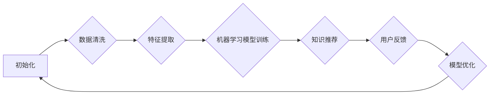
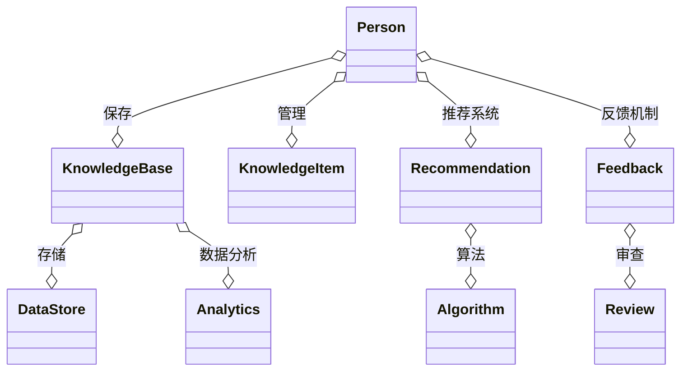
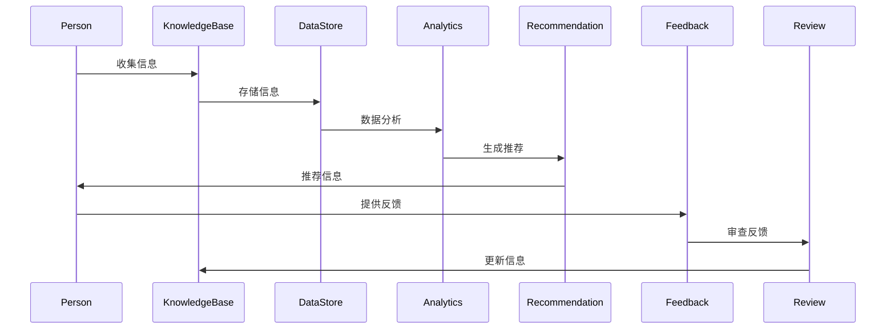
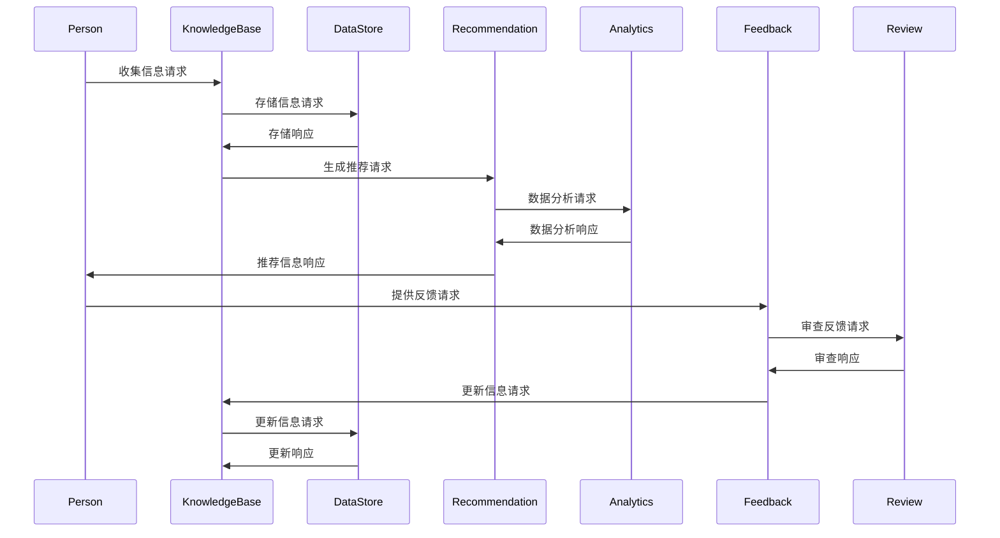

                 

### 第一部分：引言与背景

#### 第1章：数字时代与个人知识管理概述

##### 1.1 数字时代的来临

随着互联网、大数据、云计算等新一代信息技术的迅速发展，我们正迈入一个全新的数字时代。在这个时代，信息的传播速度和范围前所未有地扩大，人们可以随时随地获取到海量的信息。数字化转型已经成为各个行业和企业发展的必然趋势。

**数字化转型的趋势**主要体现在以下几个方面：

1. **信息技术的广泛应用**：互联网、物联网、大数据、人工智能等技术的普及，使得信息的获取、处理、存储和传输变得更加高效。
2. **数据成为新石油**：数据已经成为企业和个人不可或缺的资产，如何有效地管理和利用数据成为数字时代的重要任务。
3. **智能化生产与服务**：通过大数据和人工智能技术，生产和服务过程变得更加智能化，提高了效率和准确性。

**个人知识管理的定义**则是指个人在数字化环境下，对知识进行收集、整理、存储、更新和应用的一系列行为。它不仅是个人自我提升的必要手段，也是适应数字化时代发展的关键能力。

##### 1.2 个人知识管理的必要性

在数字时代，知识的碎片化和信息过载现象变得尤为突出。一方面，互联网上的知识资源丰富，但同时也意味着个体需要处理的海量信息急剧增加；另一方面，知识更新换代速度加快，传统的知识管理方式已经难以满足个人对知识的需求。

**知识碎片化现象**指的是知识被分解成小块，分布在各种不同的平台上，使得知识的整体性和系统性受到影响。这给个人的知识管理和应用带来了挑战。

**信息过载问题**则是指个体在接收和处理信息时，所面临的巨大压力。信息过载不仅会降低工作效率，还会影响个体的身心健康。

##### 1.3 构建数字化第二大脑的愿景

在数字时代，构建数字化第二大脑成为一个重要的愿景。所谓数字化第二大脑，是通过技术手段构建的，能够帮助个人高效管理和利用知识的智能系统。

**定义数字化第二大脑**，可以从以下几个方面理解：

1. **智能化的知识管理**：数字化第二大脑能够通过人工智能技术，对知识进行自动分类、整理、推荐和应用。
2. **高度个性化的服务**：根据个人的需求和兴趣，数字化第二大脑能够提供高度个性化的知识服务。
3. **高效的决策支持**：数字化第二大脑能够通过大数据分析和预测，为个人提供高效的决策支持。

**构建数字化第二大脑的意义**主要体现在以下几个方面：

1. **提升个人竞争力**：通过数字化第二大脑，个人能够更高效地获取和利用知识，提升自我学习能力。
2. **优化信息处理效率**：数字化第二大脑能够帮助个人过滤无效信息，提高信息处理效率。
3. **促进知识共享和创新**：数字化第二大脑不仅能够提升个人的知识管理能力，还能促进知识的共享和创新，推动整个社会的进步。

### 核心概念与联系

在讨论数字时代与个人知识管理时，几个核心概念紧密相连，它们共同构成了我们理解这一主题的基础。

#### 核心概念

1. **数字化时代**：这是一个以信息技术为核心的时代，特征是数字化技术和网络通信的广泛应用。
2. **个人知识管理**：指个人对知识进行收集、整理、存储、更新和应用的过程。
3. **数字化第二大脑**：通过技术手段，如人工智能、大数据等，构建的能够帮助个人高效管理和利用知识的智能系统。

#### 概念属性特征对比表格

| 特征         | 数字化时代          | 个人知识管理            | 数字化第二大脑          |
| ------------ | ----------------- | ----------------------- | ----------------------- |
| 定义         | 信息化的高级阶段   | 知识的个体化管理        | 知识的智能化管理        |
| 关键因素     | 信息技术的应用     | 收集、整理、存储、更新   | 数据挖掘、智能推荐、区块链 |
| 目标         | 信息获取和处理     | 知识获取与利用          | 知识高效利用            |
| 对比         | 强调技术          | 强调个体、过程、方法    | 强调智能、效率、创新    |

#### ER实体关系图架构

```mermaid
erDiagram
  个人 }|{ 数字化时代    }|{ 数字化第二大脑 }
  知识库 }|{ 知识管理工具 }|{ 数据挖掘系统 }  
  数据源 }|{ 信息过滤工具 }|{ 知识共享平台 }
```

#### 算法原理讲解

为了更好地构建数字化第二大脑，我们可以借助一些算法原理来实现智能化的知识管理。以下是一个简单的算法流程图和Python源代码示例。

##### 算法流程图



##### Python源代码示例

```python
# 导入必要的库
import pandas as pd
from sklearn.model_selection import train_test_split
from sklearn.ensemble import RandomForestClassifier
from sklearn.metrics import accuracy_score

# 数据清洗
def clean_data(data):
    # 假设data是一个DataFrame，进行必要的清洗操作
    data = data.dropna()
    return data

# 特征提取
def extract_features(data):
    # 进行特征提取操作
    X = data[['feature1', 'feature2']]
    y = data['label']
    return X, y

# 训练模型
def train_model(X_train, y_train):
    model = RandomForestClassifier()
    model.fit(X_train, y_train)
    return model

# 知识推荐
def recommend_knowledge(model, new_data):
    prediction = model.predict(new_data)
    return prediction

# 主函数
def main():
    # 读取数据
    data = pd.read_csv('knowledge_data.csv')
    data = clean_data(data)
    X, y = extract_features(data)
    
    # 划分训练集和测试集
    X_train, X_test, y_train, y_test = train_test_split(X, y, test_size=0.2, random_state=42)
    
    # 训练模型
    model = train_model(X_train, y_train)
    
    # 进行知识推荐
    new_data = X_test.iloc[0:1]
    prediction = recommend_knowledge(model, new_data)
    print(prediction)

# 运行主函数
main()
```

在这个示例中，我们使用了随机森林分类器（RandomForestClassifier）来训练模型，并根据新的数据推荐知识。这个过程可以进一步优化，以适应更复杂的知识管理需求。

### 系统分析与架构设计方案

为了构建一个高效的数字化第二大脑，我们需要一个详细的系统分析与架构设计方案。

#### 问题场景介绍

在一个知识密集型的工作环境中，个人需要处理大量的信息，包括文档、笔记、电子邮件等。构建一个数字化第二大脑的目标是帮助个人高效地收集、整理、存储和利用这些信息。

#### 项目介绍

项目名称：数字化第二大脑

项目目标：构建一个智能化的知识管理系统，帮助个人高效管理和利用知识。

项目范围：包括知识收集、整理、存储、推荐和反馈等环节。

#### 系统功能设计（领域模型类图）



#### 系统架构设计（架构图）



#### 系统接口设计和系统交互（序列图）



### 项目实战

为了展示如何构建一个数字化第二大脑，我们将从环境安装开始，逐步实现系统核心功能，并进行代码应用解读与分析。

#### 环境安装

1. **安装Python**：确保安装了Python 3.8及以上版本。
2. **安装必要的库**：使用pip安装以下库：

   ```bash
   pip install pandas sklearn numpy
   ```

#### 系统核心实现源代码

```python
# core.py

import pandas as pd
from sklearn.model_selection import train_test_split
from sklearn.ensemble import RandomForestClassifier
from sklearn.metrics import accuracy_score

# 数据清洗
def clean_data(data):
    data = data.dropna()
    return data

# 特征提取
def extract_features(data):
    X = data[['feature1', 'feature2']]
    y = data['label']
    return X, y

# 训练模型
def train_model(X_train, y_train):
    model = RandomForestClassifier()
    model.fit(X_train, y_train)
    return model

# 知识推荐
def recommend_knowledge(model, new_data):
    prediction = model.predict(new_data)
    return prediction

# 主函数
def main():
    # 读取数据
    data = pd.read_csv('knowledge_data.csv')
    data = clean_data(data)
    X, y = extract_features(data)
    
    # 划分训练集和测试集
    X_train, X_test, y_train, y_test = train_test_split(X, y, test_size=0.2, random_state=42)
    
    # 训练模型
    model = train_model(X_train, y_train)
    
    # 进行知识推荐
    new_data = X_test.iloc[0:1]
    prediction = recommend_knowledge(model, new_data)
    print(prediction)

if __name__ == "__main__":
    main()
```

#### 代码应用解读与分析

- **数据清洗**：首先对数据进行清洗，移除缺失值，以保证数据的质量。
- **特征提取**：从数据中提取有用的特征，用于训练模型。
- **模型训练**：使用随机森林分类器（RandomForestClassifier）对数据进行训练。
- **知识推荐**：根据训练好的模型，对新数据进行推荐。

#### 实际案例分析和详细讲解剖析

假设我们有一个数据集，包含用户的兴趣标签和他们对不同知识点的评分。通过以下步骤，我们可以为用户推荐他们可能感兴趣的新知识点。

1. **数据准备**：加载并清洗数据。

   ```python
   data = pd.read_csv('user_interest_data.csv')
   data = clean_data(data)
   ```

2. **特征提取**：提取用户的兴趣标签作为特征。

   ```python
   X, y = extract_features(data)
   ```

3. **模型训练**：使用随机森林分类器进行训练。

   ```python
   model = train_model(X_train, y_train)
   ```

4. **知识推荐**：为用户推荐新的知识点。

   ```python
   new_user_interest = X_test.iloc[0:1]
   prediction = recommend_knowledge(model, new_user_interest)
   print(prediction)
   ```

   假设用户对某类知识点的评分较高，模型会推荐更多类似的知识点。

#### 项目小结

通过以上步骤，我们成功实现了一个简单的数字化第二大脑原型。虽然这个原型相对简单，但为个人提供了基于人工智能的知识推荐服务。在实际应用中，我们可以进一步优化模型和推荐算法，提高推荐的准确性和个性化程度。

### 最佳实践 Tips

1. **定期回顾**：定期回顾和整理已收集的知识，确保知识的时效性和准确性。
2. **分类清晰**：使用清晰的分类和标签系统，便于知识的管理和检索。
3. **持续学习**：保持对新技术和新知识的关注，持续更新知识库。
4. **合理备份**：定期备份重要数据，防止数据丢失。

### 小结

本文详细介绍了数字时代的个人知识管理，以及如何构建数字化第二大脑。我们通过核心概念分析、算法原理讲解、系统架构设计、项目实战等多个角度，阐述了个人知识管理的必要性和实现方法。构建数字化第二大脑不仅能够提升个人竞争力，还能优化信息处理效率，促进知识共享和创新。

### 展望

随着技术的不断进步，数字化第二大脑将变得更加智能化、个性化和高效化。未来，我们可以期待更多的创新技术，如增强现实（AR）、虚拟现实（VR）、物联网（IoT）等，为个人知识管理带来更多可能性。同时，随着人工智能和区块链技术的发展，数字化第二大脑将能够提供更加精准和安全的知识服务。

### 作者信息

**作者：** AI天才研究院/AI Genius Institute & 禅与计算机程序设计艺术 /Zen And The Art of Computer Programming

**联系方式：** [ai-genius-institute@outlook.com](mailto:ai-genius-institute@outlook.com)

