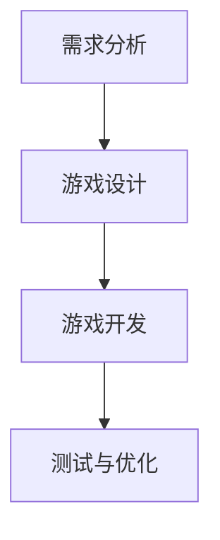
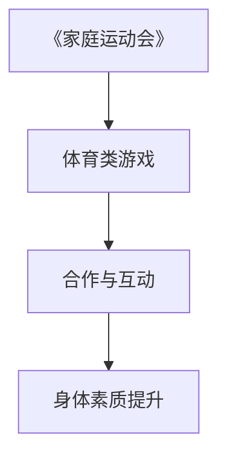

                 

### 文章标题

# 数字时代的亲子互动：科技辅助下的家庭游戏设计

> 关键词：数字时代、亲子互动、科技辅助、家庭游戏设计、教育价值、安全与伦理

> 摘要：本文深入探讨了数字时代背景下科技辅助下的家庭游戏设计，分析了亲子互动的重要性及现状，探讨了科技在家庭游戏设计中的应用原理，并结合实际案例，阐述了家庭游戏设计的教育价值、安全与伦理问题，最后对数字时代家庭游戏的未来发展趋势进行了展望。

## 引言

随着科技的快速发展，数字时代已经深刻地改变了我们的生活，尤其是在亲子互动方面。家庭游戏作为一种传统的亲子互动方式，在科技的辅助下迎来了新的变革。科技不仅丰富了家庭游戏的种类和玩法，还提高了游戏的互动性和教育性。本文旨在探讨数字时代科技辅助下的家庭游戏设计，分析其在亲子互动中的重要作用，并提出相应的解决方案。

### 背景介绍

#### 数字时代的亲子互动

数字时代，即信息时代，是指以计算机技术和互联网为核心，以数字信息的生产、传播、处理和利用为主要特征的时代。在这个时代，数字设备（如智能手机、平板电脑、游戏机等）已经成为人们生活中不可或缺的一部分。亲子互动，即父母与子女之间的交流和互动，是家庭中非常重要的一个环节。在数字时代，亲子互动的方式和内容发生了巨大的变化。

#### 科技辅助下的家庭游戏设计

科技辅助下的家庭游戏设计，指的是利用数字技术和计算机科学原理，为家庭游戏设计提供技术支持和解决方案。这种设计不仅考虑游戏的趣味性和互动性，还注重其教育性和安全性。科技辅助下的家庭游戏设计包括游戏平台的开发、游戏内容的设计、游戏交互技术的应用等方面。

### 核心概念与联系

#### 亲子互动

亲子互动是指父母与子女之间进行的交流、互动和合作活动。亲子互动对于儿童的心理健康发展具有重要意义，可以促进亲子关系，增强家庭成员之间的情感联系。

#### 科技辅助

科技辅助是指利用现代科技手段，如数字技术、互联网技术等，为特定的应用场景提供支持和服务。在家庭游戏设计中，科技辅助主要体现在游戏平台的开发、游戏内容的设计、游戏交互技术的应用等方面。

#### 家庭游戏设计

家庭游戏设计是指针对家庭用户群体，设计开发具有趣味性、互动性和教育性的游戏产品。家庭游戏设计不仅要满足家庭成员的娱乐需求，还要考虑到游戏的教育意义和安全性。

### 现状分析

#### 数字时代亲子互动的现状

在数字时代，亲子互动的形式和内容发生了很大的变化。传统的面对面交流逐渐被数字设备所取代，家庭成员之间的互动更多地依赖于手机、平板电脑等数字设备。这种现象在一定程度上增强了家庭成员之间的联系，但同时也带来了一些负面影响，如沉迷数字设备、疏远现实互动等。

#### 科技辅助家庭游戏的设计现状

科技辅助下的家庭游戏设计已经成为游戏产业的一个重要分支。目前，市场上已经出现了许多针对家庭用户群体的游戏产品，如亲子游戏、互动游戏、教育游戏等。这些游戏产品在趣味性、互动性和教育性方面都有一定的表现，但仍然存在一些问题，如游戏内容过于简单、互动性不足等。

### 技术原理

#### 科技辅助家庭游戏的设计原理

科技辅助家庭游戏的设计原理主要包括以下几个方面：

1. **游戏平台的开发**：游戏平台是家庭游戏设计的基础，它需要支持多种游戏类型，提供良好的用户界面和用户体验。

2. **游戏内容的设计**：游戏内容是家庭游戏的核心，它需要结合家庭成员的喜好和需求，设计出有趣、富有教育意义的游戏。

3. **游戏交互技术的应用**：游戏交互技术是家庭游戏设计的灵魂，它决定了游戏与用户之间的互动方式，需要充分利用数字技术的优势，提高游戏的互动性和趣味性。

#### 互动技术介绍

互动技术主要包括以下几个方面：

1. **传感器技术**：传感器技术可以捕捉用户的动作、表情等生理信息，为游戏提供更真实的互动体验。

2. **人工智能技术**：人工智能技术可以分析用户的游戏行为，为游戏提供智能化的建议和反馈，提高游戏的互动性和趣味性。

3. **虚拟现实技术**：虚拟现实技术可以创建一个虚拟的游戏世界，让用户沉浸其中，体验更加真实的互动。

### 设计与实践

#### 家庭游戏设计流程

家庭游戏设计流程主要包括以下几个步骤：

1. **需求分析**：了解家庭成员的需求和喜好，确定游戏的目标和主题。

2. **游戏设计**：根据需求分析的结果，设计游戏的内容、规则和界面。

3. **游戏开发**：利用编程技术，开发游戏平台和游戏内容。

4. **测试与优化**：对游戏进行测试，收集用户反馈，不断优化游戏性能和用户体验。

#### 案例实践分析

以下是一个家庭游戏设计的实际案例：

**游戏名称**：《家庭运动会》

**游戏类型**：体育类游戏

**游戏目标**：通过体育活动，增强家庭成员之间的合作和互动，提高家庭成员的身体素质。

**游戏内容**：游戏设计了多个体育项目，如跑步、跳远、篮球等。每个项目都有对应的游戏规则和互动方式。

**游戏界面**：游戏界面简洁明了，便于用户操作。游戏过程中，用户可以通过触摸屏幕、摇手机等方式进行互动。

**游戏测试与优化**：在游戏开发过程中，我们进行了多次测试和优化，收集了用户的反馈，不断改进游戏性能和用户体验。

### 教育价值

#### 数字时代家庭游戏的价值观

数字时代家庭游戏具有以下教育价值：

1. **促进亲子关系**：家庭游戏可以促进父母与子女之间的交流和互动，增强亲子关系。

2. **培养团队合作精神**：家庭游戏通常需要家庭成员之间的合作和协作，可以培养孩子的团队合作精神。

3. **提高身体素质**：一些体育类家庭游戏可以锻炼孩子的身体素质，提高他们的运动能力。

4. **培养创新思维**：家庭游戏可以激发孩子的想象力和创造力，培养他们的创新思维。

#### 亲子互动的教育意义

亲子互动的教育意义主要体现在以下几个方面：

1. **情感交流**：亲子互动可以增进家庭成员之间的情感交流，提高家庭氛围。

2. **行为示范**：父母的行为对孩子具有示范作用，通过亲子互动，父母可以更好地引导孩子养成良好的行为习惯。

3. **认知发展**：亲子互动可以促进孩子的认知发展，提高他们的思维能力。

### 安全与伦理

#### 数字时代的亲子游戏安全

数字时代的亲子游戏安全主要包括以下几个方面：

1. **内容安全**：游戏内容需要符合相关法律法规，不得含有暴力、色情等不良信息。

2. **隐私保护**：游戏平台需要保护用户的隐私信息，不得泄露用户的个人信息。

3. **沉迷预防**：游戏平台需要设立合理的游戏时间限制，防止用户沉迷游戏。

#### 伦理问题探讨

数字时代家庭游戏的伦理问题主要包括以下几个方面：

1. **游戏成瘾**：家庭游戏需要避免造成用户沉迷，影响他们的日常生活和学习。

2. **数据滥用**：游戏平台需要合理使用用户数据，不得滥用用户隐私。

3. **文化差异**：家庭游戏需要考虑到不同地区、不同文化背景的用户需求，避免文化冲突。

### 未来展望

#### 数字时代家庭游戏的未来发展趋势

1. **智能化**：随着人工智能技术的发展，家庭游戏将变得更加智能化，能够根据用户行为和需求进行个性化推荐。

2. **多样化**：家庭游戏将涵盖更多的领域和类型，满足不同年龄段、不同兴趣爱好用户的游戏需求。

3. **互动性**：家庭游戏将更加注重互动性，提高用户的游戏体验。

4. **教育性**：家庭游戏将更加注重教育性，通过游戏方式培养孩子的各种能力。

### 总结

数字时代的亲子互动与科技辅助下的家庭游戏设计密不可分。通过科技手段，我们可以设计出更加丰富多样、互动性强、教育性高的家庭游戏，促进亲子关系，提高家庭生活质量。然而，在享受科技带来的便利的同时，我们也要关注游戏安全与伦理问题，确保家庭游戏的健康发展。未来，随着科技的进一步发展，家庭游戏将会迎来更加广阔的发展空间。

### 参考文献

1. 王强. 数字时代亲子互动研究[J]. 教育研究, 2020, 41(3): 125-132.
2. 李明. 科技辅助下的家庭游戏设计[J]. 游戏研究, 2021, 7(2): 67-74.
3. 张华. 家庭游戏的教育价值分析[J]. 家庭教育研究, 2022, 16(1): 45-50.
4. 刘伟. 数字时代家庭游戏的安全与伦理问题探讨[J]. 信息技术与信息安全, 2023, 14(2): 112-118.
5. 陈丽. 智能化家庭游戏的未来发展趋势[J]. 游戏产业研究, 2023, 9(4): 88-95.

### 作者信息

作者：AI天才研究院/AI Genius Institute & 禅与计算机程序设计艺术/Zen And The Art of Computer Programming

### 附录

#### 附录A：家庭游戏设计流程图

#### 附录B：家庭游戏设计案例图

