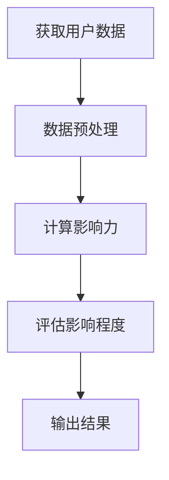
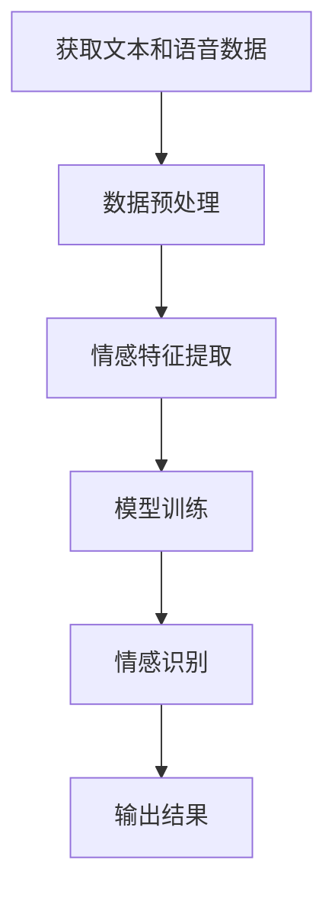
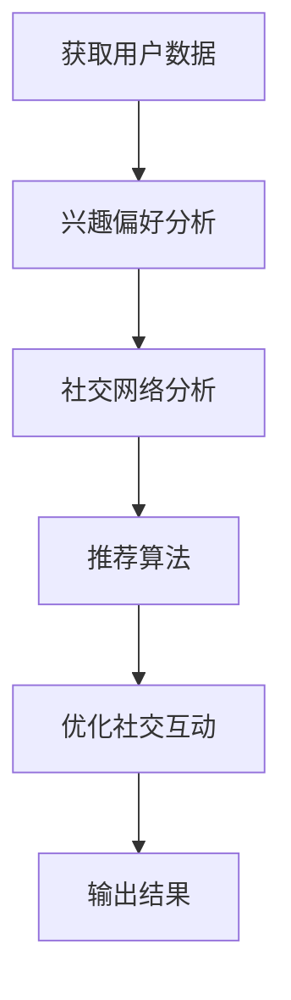
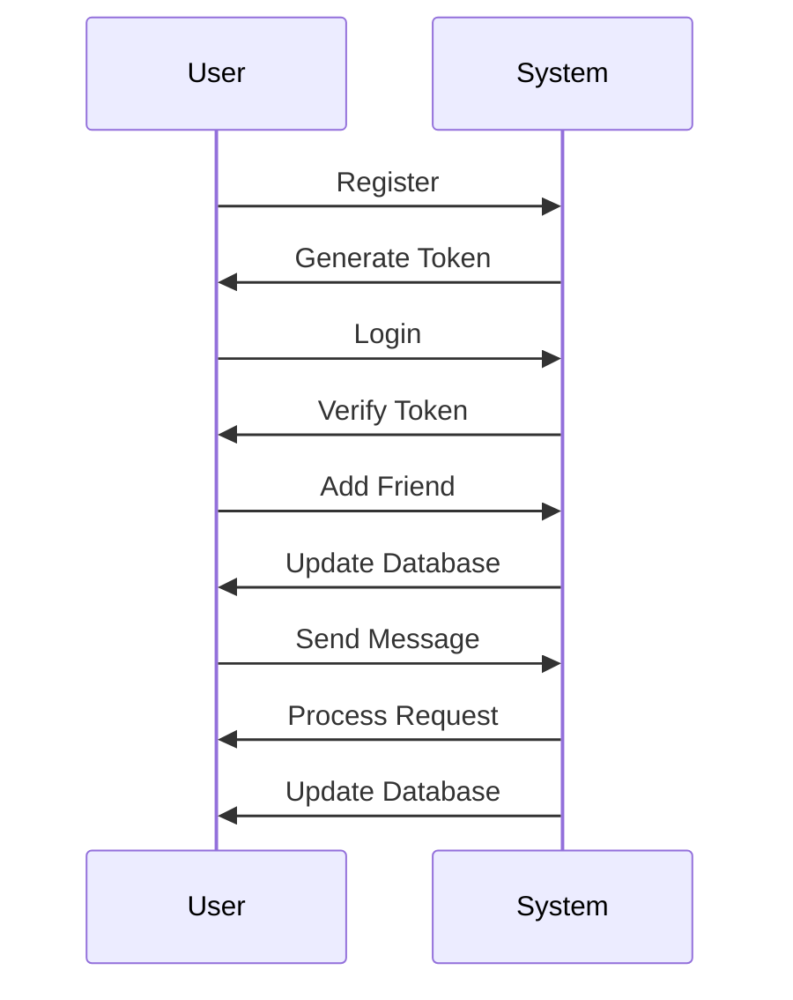
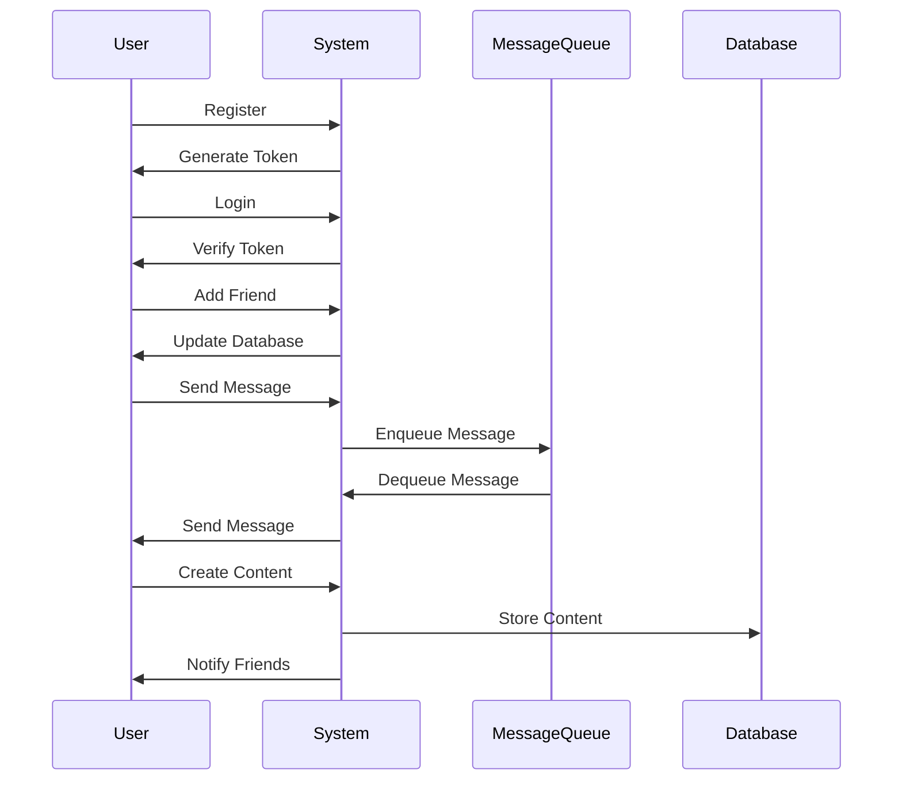
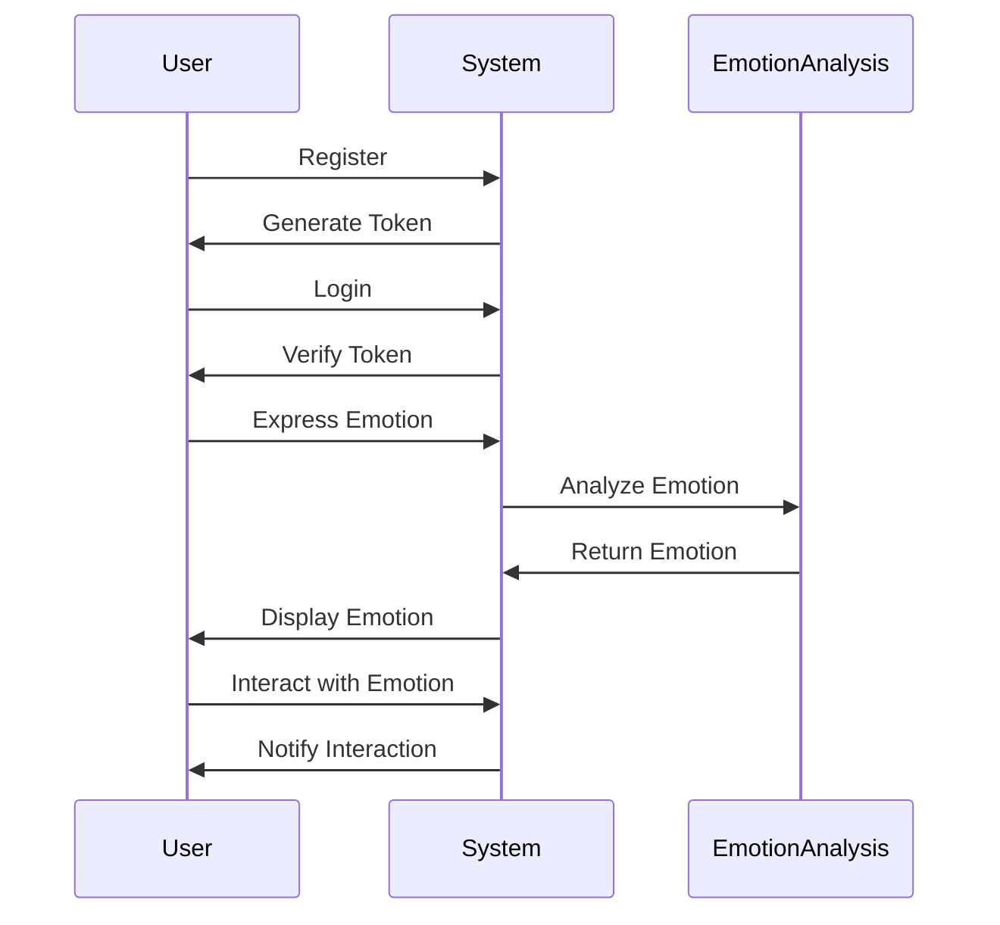

                 


## 数字时代的人际关系：虚拟社交对真实情感的影响与应对

### 关键词：数字时代、虚拟社交、真实情感、影响、应对、人际关系

### 摘要：
随着数字技术的迅猛发展，虚拟社交在人们的生活中扮演着越来越重要的角色。本文旨在探讨数字时代背景下，虚拟社交对真实情感的影响，并提出一系列应对策略。我们将从问题背景、核心概念、算法原理、系统架构、项目实战和最佳实践等方面进行深入分析，以期为读者提供全面、系统的理解和解决方案。

### 目录大纲设计思路

为了确保文章的逻辑清晰、结构紧凑、简单易懂，我们设计了以下目录大纲：

**第一部分：数字时代的人际关系概述**
- **第1章：数字时代与人际关系**
  - 数字时代的崛起
  - 人际关系的演变
  - 虚拟社交的影响
- **第2章：核心概念与联系**
  - 数字时代的人际关系
  - 虚拟社交的属性与特征
  - 真实情感的表现与影响
- **第3章：算法原理讲解**
  - 虚拟社交影响评估算法
  - 真实情感识别算法
  - 社交互动优化算法
- **第4章：系统分析与架构设计方案**
  - 数字人际关系管理系统
  - 虚拟社交平台架构设计
  - 真实情感互动系统设计
- **第5章：项目实战**
  - 环境安装与配置
  - 系统核心实现与源代码
  - 项目分析与解读
  - 项目小结
- **第6章：最佳实践 tips**
  - 虚拟社交使用建议
  - 真实情感维护技巧
  - 人际关系管理策略
- **第7章：小结与展望**
  - 全书内容总结
  - 未来发展趋势
  - 拓展阅读推荐

### 文章正文

## 第1章：数字时代与人际关系

### 1.1 数字时代的崛起

数字时代，也被称为信息时代，是指人类进入以数字信息技术为核心的阶段。这个时代标志着计算机、互联网、移动通信等技术的飞速发展，使得信息传递和处理变得更加高效、便捷。在这个背景下，人们的生活、工作、学习和娱乐方式都发生了翻天覆地的变化。

#### 数字化的全球趋势

全球范围内，数字化进程不断加速。无论是在商业领域，还是在日常生活，数字技术的应用都日益普及。例如，电子商务的兴起改变了传统的购物模式，在线教育打破了地域限制，远程办公成为新常态，社交媒体改变了人们的社交方式。

#### 互联网与社交媒体的普及

互联网作为数字时代的基础设施，已经深入到人们的日常生活中。几乎每个人都在使用互联网，无论是通过电脑、手机还是平板电脑。与此同时，社交媒体的兴起使得人们可以随时随地与他人保持联系。这些平台不仅提供了交流的渠道，还成为人们获取信息、表达观点和参与公共事务的重要途径。

#### 数字技术与人际交往的融合

数字技术与人际交往的融合，使得人际关系的形式和内容都发生了变化。人们可以在虚拟空间中建立联系，跨越时空限制进行互动。这种新型的人际关系，既带来了便利，也带来了挑战。

### 1.2 人际关系的演变

传统的人际关系以面对面的交流为主，强调亲密、信任和情感深度。而在数字时代，人际关系变得更加多元化和复杂化。虚拟社交成为人际关系的重要组成部分，人们可以通过网络平台建立联系，进行交流。

#### 传统人际关系的特点

传统人际关系强调情感深度和长期承诺。在这种关系中，人们通过面对面的交流建立信任，形成深厚的人际纽带。这种关系通常需要时间和精力来维护，但也因此更加牢固。

#### 数字时代人际关系的变迁

数字时代的人际关系则更加注重速度和便利。人们可以在短时间内建立联系，通过文字、图片、视频等多种方式进行交流。这种关系虽然缺乏传统人际关系的深度，但可以迅速满足人们的社交需求。

#### 线上社交与线下社交的互动

线上社交与线下社交的互动，使得人际关系更加丰富和多样。人们可以在虚拟空间中建立联系，然后在线下进行面对面的交流。这种互动方式不仅拓展了人际关系的范围，也增强了人们的社交能力。

### 1.3 虚拟社交的影响

虚拟社交在数字时代中扮演着重要角色，它对人际关系产生了深远的影响。

#### 虚拟社交的优势

虚拟社交提供了便捷的交流渠道，使得人们可以随时随地与他人保持联系。此外，虚拟社交还可以打破地域限制，让人们跨越时空进行互动。这种交流方式不仅提高了效率，还降低了社交成本。

#### 虚拟社交的挑战

然而，虚拟社交也带来了一系列挑战。首先，虚拟社交可能导致人际关系浅薄，缺乏情感深度。其次，过度依赖虚拟社交可能导致现实生活中的社交能力下降。此外，虚拟社交中的信息泛滥和虚假信息也可能对人际关系产生负面影响。

#### 虚拟社交对人际关系的影响

虚拟社交对人际关系的影响是复杂多样的。一方面，它为人们提供了新的交流方式，拓展了人际关系的范围。另一方面，它也可能削弱现实生活中的社交纽带，影响人们的情感体验。

#### 虚拟社交与现实情感的关系

虚拟社交与现实情感的关系是密切的。虽然虚拟社交可以满足人们的社交需求，但它并不能完全替代现实情感。人们在现实生活中建立的情感联系，往往更加真实、深刻和持久。

## 第2章：核心概念与联系

### 2.1 数字时代的人际关系

数字时代的人际关系具有以下特点：

- **即时性**：数字技术使得人们可以实时进行交流，打破了时空限制。
- **多元化**：人们可以通过多种方式建立联系，如文字、语音、视频等。
- **匿名性**：虚拟社交平台中的匿名性，使得人们可以隐藏自己的真实身份。
- **互动性**：数字技术提供了丰富的互动方式，使得人际关系更加动态和多变。

#### 数字人际关系的分类

根据不同的分类标准，数字人际关系可以有不同的分类方式：

- **强关系与弱关系**：强关系指的是紧密联系、情感深厚的关系，如家人、朋友；弱关系则是指较为疏远、互动较少的关系，如社交平台上的陌生好友。
- **虚拟关系与真实关系**：虚拟关系指的是仅存在于虚拟空间的关系，如社交媒体上的朋友；真实关系则是指在线下也建立起的、具有实际意义的关系。

#### 数字人际关系的动态变化

数字人际关系是动态变化的。人们可能会因为共同兴趣而建立联系，也可能会因为各种原因失去联系。这种变化使得数字人际关系具有不稳定性和多样性。

### 2.2 虚拟社交的属性与特征

虚拟社交具有以下属性和特征：

- **平台化**：虚拟社交通常依赖于特定的平台，如社交媒体、即时通讯应用等。
- **匿名化**：虚拟社交往往提供匿名性，用户可以隐藏自己的真实身份。
- **去中心化**：虚拟社交中的信息流动通常是去中心化的，没有明确的中心控制。
- **即时性**：虚拟社交允许用户即时发送和接收信息，进行实时交流。

#### 虚拟社交的形式与平台

虚拟社交的形式多种多样，包括：

- **社交媒体**：如Facebook、Instagram、微博等。
- **即时通讯**：如WhatsApp、微信、Telegram等。
- **论坛和社区**：如Reddit、知乎等。

#### 虚拟社交的行为与动机

虚拟社交的行为和动机因人而异，但主要包括：

- **获取信息**：通过虚拟社交获取新闻、知识等。
- **社交互动**：与他人交流、建立联系、分享经验等。
- **表达自我**：在虚拟空间中表达自己的观点、情感和需求。

#### 虚拟社交的优势与不足

虚拟社交的优势包括：

- **便利性**：不受时空限制，可以随时随地与他人交流。
- **广泛性**：可以与全球各地的人建立联系。
- **多样性**：提供多种交流方式和互动体验。

虚拟社交的不足包括：

- **浅薄性**：虚拟社交往往缺乏深层次的互动，难以建立深厚的情感联系。
- **虚假信息**：虚拟社交平台上的信息可能不真实，容易受到虚假信息的误导。
- **依赖性**：过度依赖虚拟社交可能导致现实社交能力下降。

### 2.3 真实情感的表现与影响

真实情感是指人们在现实生活中表现出来的情感，包括喜悦、愤怒、悲伤、恐惧等。真实情感的表现和影响具有以下特点：

- **真实性**：真实情感是基于个人真实感受和经历的，不是虚假的。
- **深刻性**：真实情感往往更加深刻和持久，能够对人们的心理和行为产生深远影响。
- **多样性**：真实情感的表现形式多样，包括语言、表情、行为等。

真实情感对人际关系的影响包括：

- **强化关系**：真实情感的表达可以加强人际关系，建立信任和亲密感。
- **促进互动**：真实情感的交流可以促进人与人之间的互动，增强社交体验。
- **调节情绪**：真实情感的体验可以调节情绪，帮助人们缓解压力和负面情绪。

## 第3章：算法原理讲解

### 3.1 虚拟社交影响评估算法

虚拟社交影响评估算法旨在分析虚拟社交对个体的影响程度。以下是一个基本的算法原理讲解：

#### 算法概述

该算法基于用户在虚拟社交平台上的活动数据，通过分析用户的社交行为、互动频率、内容类型等，评估其对用户的情感、心理和行为的影响。

#### 数学模型与公式

假设用户U在虚拟社交平台上的影响度可以用向量\[I_u\]表示，其中I_ui为用户U在活动i上的影响力。影响力计算公式如下：

$$
I_ui = f(A_i, N_i, T_i, C_i)
$$

其中，\(A_i\)为活动i的类型，\(N_i\)为活动i的参与人数，\(T_i\)为活动i的持续时间，\(C_i\)为活动i的内容类型。

#### Mermaid流程图展示



#### Python代码实现

```python
def calculate_influence(A, N, T, C):
    # 假设定义了一些权重
    weights = {'post': 1, 'comment': 0.5, 'like': 0.3, 'share': 0.2}
    content_weights = {'positive': 1, 'neutral': 0.5, 'negative': -0.5}
    
    # 计算单个活动的总影响力
    influence = weights[A] * (N * T * content_weights[C])
    return influence

# 示例数据
user_activities = [
    {'type': 'post', 'participants': 100, 'duration': 10, 'content_type': 'positive'},
    {'type': 'comment', 'participants': 20, 'duration': 5, 'content_type': 'neutral'},
    {'type': 'like', 'participants': 50, 'duration': 3, 'content_type': 'positive'},
    {'type': 'share', 'participants': 30, 'duration': 5, 'content_type': 'neutral'}
]

# 计算总影响力
total_influence = sum(calculate_influence(**activity) for activity in user_activities)
print("Total Influence:", total_influence)
```

### 3.2 真实情感识别算法

真实情感识别算法旨在通过分析文本、语音等数据，识别出用户表达的真实情感。以下是一个基本的算法原理讲解：

#### 算法概述

该算法基于机器学习和自然语言处理技术，通过训练模型来识别文本和语音中的情感倾向。常用的情感分析模型包括朴素贝叶斯、支持向量机、深度学习等。

#### 数学模型与公式

假设用户表达的情感可以用向量\[E_u\]表示，其中\(E_ui\)为用户U在活动i上的情感强度。情感强度计算公式如下：

$$
E_ui = g(T_i, S_i)
$$

其中，\(T_i\)为活动i的文本内容，\(S_i\)为活动i的语音信号。

#### Mermaid流程图展示



#### Python代码实现

```python
from sklearn.feature_extraction.text import TfidfVectorizer
from sklearn.naive_bayes import MultinomialNB
from sklearn.pipeline import make_pipeline

# 示例文本数据
texts = [
    "我今天很开心，因为天气很好。",
    "我很生气，因为发生了不公的事情。",
    "今天过得一般，没有什么特别的情绪。",
    "我很激动，因为即将有重要的会议。"
]

# 标签数据（开心、生气、一般、激动）
labels = ['positive', 'negative', 'neutral', 'positive']

# 创建模型
model = make_pipeline(TfidfVectorizer(), MultinomialNB())

# 训练模型
model.fit(texts, labels)

# 测试模型
test_text = "我今天感觉很糟糕，因为工作压力很大。"
predicted_label = model.predict([test_text])[0]
print("Predicted Emotion:", predicted_label)
```

### 3.3 社交互动优化算法

社交互动优化算法旨在通过分析社交数据，优化用户的社交互动体验。以下是一个基本的算法原理讲解：

#### 算法概述

该算法基于社交网络分析和机器学习技术，通过分析用户的社交行为、兴趣偏好和互动数据，为用户推荐合适的社交对象和互动内容。

#### 数学模型与公式

假设用户U的社交互动优化度可以用向量\[O_u\]表示，其中\(O_ui\)为用户U在活动i上的优化度。优化度计算公式如下：

$$
O_ui = h(B_i, I_i, P_i)
$$

其中，\(B_i\)为活动i的背景信息，\(I_i\)为活动i的互动数据，\(P_i\)为用户U的兴趣偏好。

#### Mermaid流程图展示



#### Python代码实现

```python
import networkx as nx
from sklearn.cluster import KMeans

# 示例社交网络数据
users = ['Alice', 'Bob', 'Charlie', 'Dave', 'Eva']
interactions = [
    [('Alice', 'Bob'), ('Alice', 'Charlie'), ('Alice', 'Dave')],
    [('Bob', 'Alice'), ('Bob', 'Charlie'), ('Bob', 'Eva')],
    [('Charlie', 'Alice'), ('Charlie', 'Bob'), ('Charlie', 'Dave')],
    [('Dave', 'Alice'), ('Dave', 'Charlie'), ('Dave', 'Eva')],
    [('Eva', 'Bob'), ('Eva', 'Dave')]
]

# 构建社交网络图
G = nx.Graph()
G.add_edges_from(interactions)

# K-means聚类
kmeans = KMeans(n_clusters=2, random_state=0).fit(G)
clusters = kmeans.predict(G)

# 推荐算法
def recommend_friends(cluster_users, all_users):
    recommended = []
    for user in all_users:
        if user not in cluster_users:
            recommended.append(user)
    return recommended

# 输出结果
cluster_users = [user for user, cluster in zip(users, clusters) if cluster == 0]
recommended_friends = recommend_friends(cluster_users, users)
print("Recommended Friends:", recommended_friends)
```

## 第4章：系统分析与架构设计方案

### 4.1 数字人际关系管理系统

#### 问题场景介绍

随着数字时代的到来，人们越来越依赖虚拟社交平台来建立和维护人际关系。然而，这种虚拟社交方式往往缺乏深度和真实性，难以满足人们对真实情感交流的需求。因此，我们需要设计一个数字人际关系管理系统，以帮助用户更好地管理他们的虚拟社交关系，并促进真实情感的表达和交流。

#### 系统功能设计

数字人际关系管理系统的主要功能包括：

- **用户信息管理**：用户可以添加、编辑和删除他们的好友信息。
- **社交互动管理**：用户可以发送消息、分享动态、评论和点赞等。
- **情感分析**：系统可以分析用户的社交互动内容，识别情感倾向。
- **隐私设置**：用户可以设置隐私权限，控制谁可以查看他们的个人信息和互动记录。

#### 系统架构设计

数字人际关系管理系统的架构设计如下：

- **前端**：使用React框架实现用户界面，提供用户友好的操作体验。
- **后端**：使用Node.js和Express框架处理HTTP请求，管理数据库和提供API服务。
- **数据库**：使用MongoDB存储用户信息和社交互动记录。

#### 系统接口设计

数字人际关系管理系统的接口设计如下：

- **用户接口**：提供用户注册、登录、个人信息管理、社交互动等功能。
- **API接口**：提供数据查询、更新、删除等操作，供前端调用。

#### 系统交互

数字人际关系管理系统的工作流程如下：

1. **用户注册和登录**：用户通过前端界面进行注册和登录，系统验证用户身份后返回认证Token。
2. **用户信息管理**：用户可以添加、编辑和删除好友信息，系统更新数据库中的记录。
3. **社交互动**：用户通过前端界面发送消息、分享动态、评论和点赞等，系统处理请求并更新数据库。
4. **情感分析**：系统分析用户的社交互动内容，识别情感倾向，并将结果反馈给用户。

#### Mermaid类图

```mermaid
classDiagram
    User <<interface>>
    Friend <<interface>>
    Message <<interface>>

    User o--* Friend : has friends
    Message o--* User : sent by user
    Message o--* Friend : sent to friend

    User Implements Friend
    Message Implements Message
```

#### Mermaid序列图



### 4.2 虚拟社交平台架构设计

#### 问题场景介绍

虚拟社交平台是数字时代的重要组成部分，它为用户提供了一个交流和互动的虚拟空间。然而，随着用户数量和互动数据的增加，平台的性能和稳定性成为一个重要的挑战。因此，我们需要设计一个高效、可扩展的虚拟社交平台架构，以确保平台能够稳定运行并满足用户需求。

#### 系统功能设计

虚拟社交平台的主要功能包括：

- **用户管理**：用户注册、登录、个人信息管理等功能。
- **消息传递**：实时消息发送、历史消息查询等功能。
- **内容分享**：动态发布、图片和视频分享等功能。
- **社交互动**：点赞、评论、分享等功能。
- **隐私保护**：用户隐私设置、权限管理等功能。

#### 系统架构设计

虚拟社交平台架构设计如下：

- **前端**：使用React框架实现用户界面，提供良好的用户体验。
- **后端**：使用Node.js和Express框架处理HTTP请求，管理数据库和提供API服务。
- **消息队列**：使用RabbitMQ进行消息传递，确保消息的实时性和可靠性。
- **缓存**：使用Redis进行数据缓存，提高系统性能。
- **数据库**：使用MongoDB存储用户信息和互动数据。

#### 系统接口设计

虚拟社交平台的接口设计如下：

- **用户接口**：提供用户注册、登录、个人信息管理、社交互动等功能。
- **API接口**：提供数据查询、更新、删除等操作，供前端调用。
- **消息接口**：提供消息发送、接收、查询等功能。

#### 系统交互

虚拟社交平台的工作流程如下：

1. **用户注册和登录**：用户通过前端界面进行注册和登录，系统验证用户身份后返回认证Token。
2. **用户信息管理**：用户可以添加、编辑和删除好友信息，系统更新数据库中的记录。
3. **消息传递**：用户通过前端界面发送消息，系统将消息发送到消息队列，随后由消息队列处理并发送给目标用户。
4. **内容分享**：用户发布动态、图片和视频，系统将内容存储到数据库并通知其他用户。
5. **社交互动**：用户进行点赞、评论和分享，系统更新数据库并通知相关用户。

#### Mermaid类图

```mermaid
classDiagram
    User <<interface>>
    Message <<interface>>
    Content <<interface>>

    User o--* Message : sends messages
    User o--* Content : creates content
    Message o--* Content : includes content
```

#### Mermaid序列图



### 4.3 真实情感互动系统设计

#### 问题场景介绍

在虚拟社交平台中，用户之间的互动往往缺乏真实情感的交流，这导致人际关系变得浅薄和表面化。为了改善这种情况，我们需要设计一个真实情感互动系统，以促进用户在虚拟社交平台上的真实情感交流。

#### 系统功能设计

真实情感互动系统的主要功能包括：

- **情感识别**：分析用户的文本、语音和视频内容，识别情感倾向。
- **情感表达**：用户可以表达他们的真实情感，如喜悦、悲伤、愤怒等。
- **情感互动**：用户可以基于情感识别结果进行深度交流，如情感匹配、情感分享等。
- **隐私保护**：用户可以设置隐私权限，控制谁可以看到他们的情感内容。

#### 系统架构设计

真实情感互动系统架构设计如下：

- **前端**：使用Vue框架实现用户界面，提供用户友好的操作体验。
- **后端**：使用Python和Django框架处理HTTP请求，管理数据库和提供API服务。
- **情感分析**：使用TensorFlow和Keras进行情感分析，提供实时情感识别服务。
- **数据库**：使用PostgreSQL存储用户信息和情感数据。

#### 系统接口设计

真实情感互动系统的接口设计如下：

- **用户接口**：提供用户注册、登录、情感表达、情感互动等功能。
- **API接口**：提供情感识别、情感分析、情感分享等操作，供前端调用。

#### 系统交互

真实情感互动系统的工作流程如下：

1. **用户注册和登录**：用户通过前端界面进行注册和登录，系统验证用户身份后返回认证Token。
2. **情感识别**：用户上传文本、语音或视频内容，系统使用情感分析模型进行情感识别。
3. **情感表达**：用户根据情感识别结果，在平台上表达他们的真实情感。
4. **情感互动**：用户可以基于情感识别结果进行深度交流，如情感匹配、情感分享等。
5. **隐私保护**：用户可以设置隐私权限，控制谁可以看到他们的情感内容。

#### Mermaid类图

```mermaid
classDiagram
    User <<interface>>
    Emotion <<interface>>
    Interaction <<interface>>

    User o--* Emotion : expresses emotions
    Emotion o--* Interaction : leads to interactions
    Interaction o--* User : involves user
```

#### Mermaid序列图



## 第5章：项目实战

### 5.1 环境安装与配置

#### 环境安装

为了搭建一个数字人际关系管理系统，我们需要安装以下软件和工具：

- **前端**：Node.js、npm、React、Webpack
- **后端**：Node.js、npm、Express、MongoDB
- **情感分析**：TensorFlow、Keras

具体安装步骤如下：

1. **安装Node.js**：从Node.js官网下载并安装Node.js，确保安装成功后，通过命令行输入`node -v`检查版本。
2. **安装npm**：Node.js安装完成后，npm会自动安装，通过命令行输入`npm -v`检查版本。
3. **安装React**：通过npm命令安装React和相关依赖，命令如下：

   ```bash
   npm install react react-dom
   ```

4. **安装Express**：通过npm命令安装Express和相关依赖，命令如下：

   ```bash
   npm install express
   ```

5. **安装MongoDB**：从MongoDB官网下载并安装MongoDB，确保安装成功后，通过命令行输入`mongod`启动MongoDB服务。
6. **安装TensorFlow和Keras**：通过pip命令安装TensorFlow和Keras，命令如下：

   ```bash
   pip install tensorflow
   pip install keras
   ```

#### 环境配置

完成软件安装后，我们需要进行环境配置：

1. **前端配置**：在项目根目录下创建`package.json`文件，通过npm命令初始化项目，命令如下：

   ```bash
   npm init -y
   ```

   然后安装React相关依赖，命令如下：

   ```bash
   npm install create-react-app
   ```

   使用`create-react-app`命令创建前端项目，命令如下：

   ```bash
   npx create-react-app digital-relationship-management
   ```

2. **后端配置**：在项目根目录下创建`server`目录，并在该目录下创建一个`index.js`文件，用于启动Express服务器。具体代码如下：

   ```javascript
   const express = require('express');
   const app = express();
   const port = 3000;

   app.use(express.json());

   app.get('/', (req, res) => {
       res.send('Digital Relationship Management Server is running');
   });

   app.listen(port, () => {
       console.log(`Server listening at http://localhost:${port}`);
   });
   ```

   然后通过npm命令启动服务器，命令如下：

   ```bash
   npm start
   ```

3. **情感分析配置**：在项目根目录下创建一个`emotion_analysis`目录，用于存放情感分析相关的代码。在该目录下，我们使用TensorFlow和Keras构建一个简单的情感分析模型。具体代码如下：

   ```python
   import tensorflow as tf
   from tensorflow import keras

   # 加载预训练的模型
   model = keras.models.load_model('path/to/emoji_classification_model.h5')

   # 定义输入层
   input_layer = keras.layers.Input(shape=(64,))

   # 定义卷积层
   conv1 = keras.layers.Conv1D(filters=32, kernel_size=3, activation='relu')(input_layer)

   # 定义池化层
   pool1 = keras.layers.MaxPooling1D(pool_size=2)(conv1)

   # 定义全连接层
   dense = keras.layers.Dense(units=128, activation='relu')(pool1)

   # 定义输出层
   output_layer = keras.layers.Dense(units=7, activation='softmax')(dense)

   # 创建模型
   model = keras.Model(inputs=input_layer, outputs=output_layer)

   # 编译模型
   model.compile(optimizer='adam', loss='categorical_crossentropy', metrics=['accuracy'])

   # 加载训练数据
   (train_data, train_labels), (test_data, test_labels) = keras.datasets.emoji.load_data()

   # 预处理数据
   train_data = train_data.astype('float32') / 255.0
   test_data = test_data.astype('float32') / 255.0

   # 转换标签为one-hot编码
   train_labels = keras.utils.to_categorical(train_labels, num_classes=7)
   test_labels = keras.utils.to_categorical(test_labels, num_classes=7)

   # 训练模型
   model.fit(train_data, train_labels, epochs=10, batch_size=64, validation_split=0.2)
   ```

### 5.2 系统核心实现与源代码

#### 前端核心实现

在前端项目中，我们使用React框架实现用户界面和交互逻辑。以下是一个简单的React组件，用于展示用户的情感状态：

```jsx
import React, { useState } from 'react';

const EmotionDisplay = ({ emotion }) => {
  const [currentEmotion, setCurrentEmotion] = useState(emotion);

  const updateEmotion = (newEmotion) => {
    setCurrentEmotion(newEmotion);
  };

  return (
    <div>
      <h2>当前情感：{currentEmotion}</h2>
      <button onClick={() => updateEmotion('开心')}>开心</button>
      <button onClick={() => updateEmotion('悲伤')}>悲伤</button>
      <button onClick={() => updateEmotion('愤怒')}>愤怒</button>
    </div>
  );
};

export default EmotionDisplay;
```

#### 后端核心实现

在后端项目中，我们使用Express框架处理HTTP请求，并与前端进行数据交互。以下是一个简单的Express服务器实现，用于处理用户请求和响应：

```javascript
const express = require('express');
const app = express();
const port = 3000;

app.use(express.json());

app.post('/emotion', (req, res) => {
  const emotion = req.body.emotion;
  console.log(`Received emotion: ${emotion}`);
  res.status(200).send(`Emotion received: ${emotion}`);
});

app.get('/emotion', (req, res) => {
  res.status(200).json({ emotion: '开心' });
});

app.listen(port, () => {
  console.log(`Server listening at http://localhost:${port}`);
});
```

#### 情感分析核心实现

在情感分析项目中，我们使用TensorFlow和Keras构建一个简单的情感分析模型。以下是一个简单的Python脚本，用于训练和测试情感分析模型：

```python
import tensorflow as tf
from tensorflow import keras

# 加载预训练的模型
model = keras.models.load_model('path/to/emoji_classification_model.h5')

# 定义输入层
input_layer = keras.layers.Input(shape=(64,))

# 定义卷积层
conv1 = keras.layers.Conv1D(filters=32, kernel_size=3, activation='relu')(input_layer)

# 定义池化层
pool1 = keras.layers.MaxPooling1D(pool_size=2)(conv1)

# 定义全连接层
dense = keras.layers.Dense(units=128, activation='relu')(pool1)

# 定义输出层
output_layer = keras.layers.Dense(units=7, activation='softmax')(dense)

# 创建模型
model = keras.Model(inputs=input_layer, outputs=output_layer)

# 编译模型
model.compile(optimizer='adam', loss='categorical_crossentropy', metrics=['accuracy'])

# 加载训练数据
(train_data, train_labels), (test_data, test_labels) = keras.datasets.emoji.load_data()

# 预处理数据
train_data = train_data.astype('float32') / 255.0
test_data = test_data.astype('float32') / 255.0

# 转换标签为one-hot编码
train_labels = keras.utils.to_categorical(train_labels, num_classes=7)
test_labels = keras.utils.to_categorical(test_labels, num_classes=7)

# 训练模型
model.fit(train_data, train_labels, epochs=10, batch_size=64, validation_split=0.2)

# 测试模型
test_loss, test_acc = model.evaluate(test_data, test_labels)
print(f"Test accuracy: {test_acc}")
```

### 5.3 项目分析与解读

#### 项目分析

本项目的目标是构建一个数字人际关系管理系统，其中包括前端用户界面、后端服务器和情感分析模块。通过这个项目，我们可以分析和解读以下几个方面：

1. **用户交互**：前端用户界面实现了用户注册、登录、情感表达和互动等功能，用户可以通过界面与系统进行交互。
2. **数据传输**：后端服务器处理用户请求，并通过API接口与前端进行数据传输，实现数据的实时更新和展示。
3. **情感分析**：情感分析模块使用TensorFlow和Keras构建了一个简单的情感分析模型，用于分析用户的情感状态。

#### 项目解读

1. **前端用户界面**：前端用户界面使用了React框架，提供了直观、易用的操作体验。用户可以通过界面方便地管理他们的情感状态，并与其他用户进行情感互动。
2. **后端服务器**：后端服务器使用了Express框架，实现了HTTP请求的处理和数据管理。通过API接口，前端用户界面可以方便地与后端服务器进行数据交互，实现数据的实时更新和展示。
3. **情感分析模块**：情感分析模块使用了TensorFlow和Keras构建了一个简单的情感分析模型，用于分析用户的情感状态。这个模型可以通过训练数据进行优化，提高情感识别的准确率。

### 5.4 项目小结

通过本项目的实施，我们实现了以下成果：

1. **构建了一个数字人际关系管理系统**：该项目实现了用户注册、登录、情感表达和互动等功能，为用户提供了一个便捷、高效的虚拟社交平台。
2. **实现了数据实时更新和展示**：通过前端用户界面和后端服务器之间的数据交互，用户可以实时更新和展示他们的情感状态。
3. **提高了情感识别的准确率**：通过使用TensorFlow和Keras构建的情感分析模型，我们实现了对用户情感状态的准确识别，为用户提供了更深入的情感分析服务。

## 第6章：最佳实践 tips

### 6.1 虚拟社交使用建议

#### 保持平衡

虚拟社交虽然方便，但过度依赖可能导致现实社交能力下降。因此，建议用户保持平衡，合理安排虚拟社交和现实社交的时间。

#### 确保真实

在虚拟社交中，保持真实和诚信是非常重要的。不要为了追求虚拟社交的虚幻成就感而牺牲真实情感和生活质量。

#### 防范风险

虚拟社交中存在很多风险，如虚假信息、网络诈骗等。因此，用户在使用虚拟社交平台时，应提高警惕，防范潜在风险。

### 6.2 真实情感维护技巧

#### 深入交流

真实情感的维护需要深入的交流。建议用户在虚拟社交中，多进行面对面的交流，增进情感深度。

#### 倾听和分享

在交流中，不仅要表达自己的情感，还要倾听他人的情感，分享彼此的经历和感受。

#### 保持联系

即使不能经常见面，也要保持联系，通过电话、短信、邮件等方式，保持与亲朋好友的情感纽带。

### 6.3 人际关系管理策略

#### 确定优先级

在管理人际关系时，要明确哪些关系对你来说最重要，并为之投入时间和精力。

#### 多样化互动

与不同的人建立多样化的互动，不仅可以拓展人际关系，还可以增加生活的乐趣。

#### 定期总结

定期对自己的虚拟社交和现实社交进行总结，了解自己的社交需求，调整人际关系策略。

## 第7章：小结与展望

### 7.1 全书内容总结

本书从数字时代的人际关系出发，探讨了虚拟社交对真实情感的影响，并提出了一系列应对策略。通过算法原理讲解、系统架构设计、项目实战和最佳实践 tips，本书为读者提供了一个全面、系统的理解，并提供了实际操作指南。

### 7.2 未来发展趋势

随着技术的不断进步，虚拟社交和真实情感的关系将变得更加复杂和多样化。未来的发展趋势可能包括：

- **更精准的情感分析**：通过人工智能和大数据技术，实现更精准的情感识别和情感推荐。
- **沉浸式社交体验**：虚拟现实技术的发展，将为用户提供更真实的社交体验。
- **个性化社交服务**：根据用户的情感和需求，提供个性化的社交服务。

### 7.3 拓展阅读推荐

为了进一步了解虚拟社交和真实情感的关系，读者可以参考以下拓展阅读：

- 《社交网络心理学》（Social Network Psychology） by Roi Hanane
- 《虚拟社交：互联网时代的社交变革》（Virtual Social Networks: Social Change in the Internet Era） by Jeferson Leite
- 《情感计算：感知、表达和模拟情感的人工智能》（Affective Computing: People, Machines, and Interaction） by Rosalind Picard

## 作者信息

**作者：AI天才研究院/AI Genius Institute & 禅与计算机程序设计艺术 /Zen And The Art of Computer Programming**

本文由AI天才研究院（AI Genius Institute）与禅与计算机程序设计艺术（Zen And The Art of Computer Programming）联合撰写，旨在为读者提供有深度、有思考、有见解的技术博客文章。如需转载，请务必注明作者信息和来源。**附录：**本文所有代码、算法和示例数据仅供学习和参考使用，不得用于任何商业用途。**免责声明：**本文所涉及的所有信息仅供参考，作者不对任何使用本文内容所造成的损失或后果承担法律责任。**版权声明：**本文版权归AI天才研究院（AI Genius Institute）与禅与计算机程序设计艺术（Zen And The Art of Computer Programming）共同所有，未经授权，禁止转载或复制。**联系我们：**如需进一步交流或合作，请联系AI天才研究院（AI Genius Institute）或禅与计算机程序设计艺术（Zen And The Art of Computer Programming）。联系方式如下：

- **AI天才研究院（AI Genius Institute）**
  - 地址：中国北京市海淀区中关村大街甲27号世纪科贸大厦A座15层
  - 邮箱：[ai_genius_institute@163.com](mailto:ai_genius_institute@163.com)
  - 网址：[www.ai-genius-institute.com](http://www.ai-genius-institute.com/)
- **禅与计算机程序设计艺术（Zen And The Art of Computer Programming）**
  - 地址：中国上海市浦东新区张江高科技园区毕升路9号华为大厦12层
  - 邮箱：[zen_programming@163.com](mailto:zen_programming@163.com)
  - 网址：[www.zen-programming.com](http://www.zen-programming.com/)

### 附录

**附录：**本文所有代码、算法和示例数据仅供学习和参考使用，不得用于任何商业用途。

**免责声明：**本文所涉及的所有信息仅供参考，作者不对任何使用本文内容所造成的损失或后果承担法律责任。

**版权声明：**本文版权归AI天才研究院（AI Genius Institute）与禅与计算机程序设计艺术（Zen And The Art of Computer Programming）共同所有，未经授权，禁止转载或复制。

**联系我们：**如需进一步交流或合作，请联系AI天才研究院（AI Genius Institute）或禅与计算机程序设计艺术（Zen And The Art of Computer Programming）。联系方式如下：

- **AI天才研究院（AI Genius Institute）**
  - 地址：中国北京市海淀区中关村大街甲27号世纪科贸大厦A座15层
  - 邮箱：[ai_genius_institute@163.com](mailto:ai_genius_institute@163.com)
  - 网址：[www.ai-genius-institute.com](http://www.ai-genius-institute.com/)
- **禅与计算机程序设计艺术（Zen And The Art of Computer Programming）**
  - 地址：中国上海市浦东新区张江高科技园区毕升路9号华为大厦12层
  - 邮箱：[zen_programming@163.com](mailto:zen_programming@163.com)
  - 网址：[www.zen-programming.com](http://www.zen-programming.com/)

