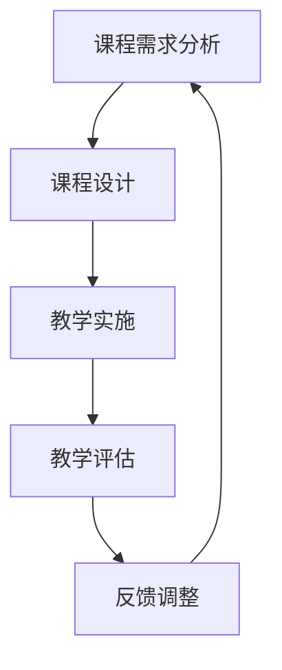
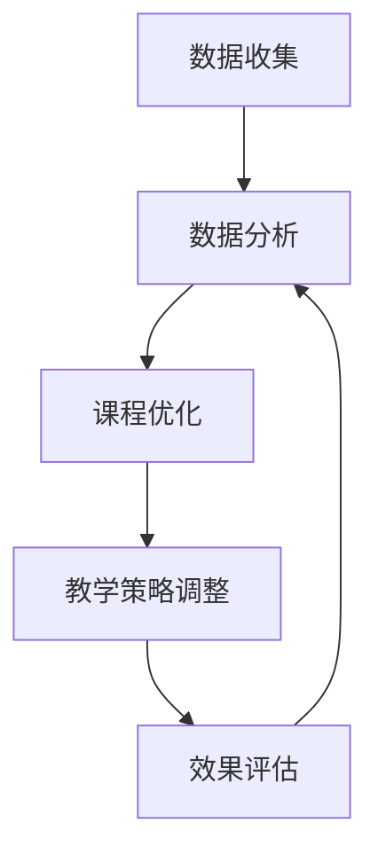
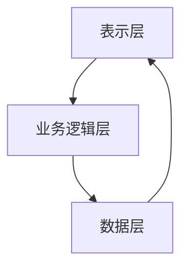
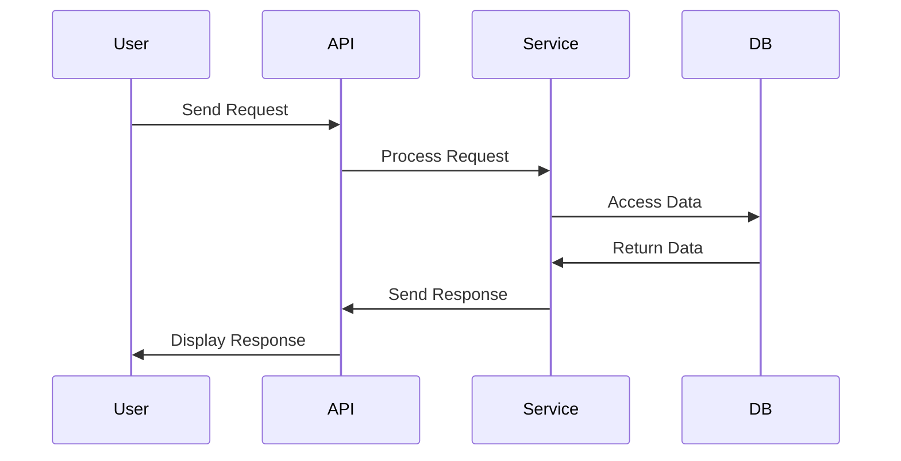
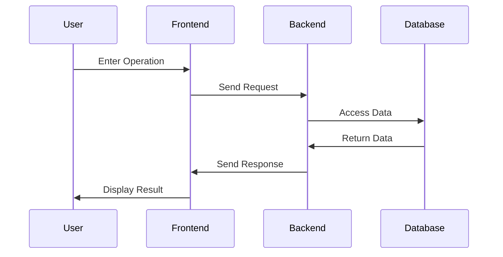

                 

### 第1章：问题背景与核心概念

#### 1.1 数字时代的背景

**数字时代的到来**

在21世纪，数字技术迅猛发展，互联网、人工智能、大数据等技术的广泛应用，改变了人们的生活方式，也深刻影响了教育领域。数字时代的到来，为儿童教育带来了前所未有的机遇与挑战。

**数字技术对教育的影响**

数字技术的引入，使得教育资源变得更加丰富和便捷。在线教育平台、虚拟现实技术、智能学习工具等，为学生提供了多样化的学习途径。此外，数字技术还改变了教育方式，从传统的知识传授向以学生为中心的个性化学习转变。

#### 1.2 儿童教育的重要性

**儿童教育的定义**

儿童教育是指针对0-18岁儿童所进行的有目的、有计划、有组织的教育活动。它涵盖了认知、情感、社会、身体等多个方面的发展。

**儿童教育的基本原则**

- 发展适宜性：教育内容和方法要适合儿童年龄特点和身心发展水平。
- 个体差异：关注每个孩子的独特性，因材施教。
- 全面发展：注重儿童多方面能力的培养，促进其全面发展。

#### 1.3 STEM教育与人文素养

**STEM教育的概念**

STEM教育是指对科学（Science）、技术（Technology）、工程（Engineering）和数学（Mathematics）四个领域的教育。它强调跨学科学习，培养学生的创新思维、问题解决能力和实践能力。

**人文素养的内涵**

人文素养是指个体对人类文化的理解、尊重和传承能力。它包括语言、历史、文学、艺术、哲学等多个方面，关注个体的人文情怀和社会责任感。

**STEM教育与人文素养的结合意义**

STEM教育注重科学知识和技能的培养，而人文素养则强调人文精神和社会责任。两者的结合，不仅能够提高学生的综合素质，还能促进其全面发展。在数字时代，STEM教育与人文素养的结合，有助于培养具备创新能力和人文关怀的未来人才。

### 1.4 数字时代的儿童教育与STEM教育

**STEM教育的特点**

- 跨学科：STEM教育将多个学科的知识融合在一起，培养学生的综合能力。
- 实践性：强调动手操作和实际应用，提高学生的实践能力。
- 创新性：鼓励学生进行创新思维和探索，培养创新能力。

**STEM教育对儿童发展的影响**

STEM教育有助于培养学生的逻辑思维、解决问题的能力、团队合作精神和创新意识。同时，它还能激发学生对科学和技术的兴趣，为未来的职业发展打下基础。

### 1.5 人文素养与STEM教育的互动

**人文素养的要素**

- 语言表达：良好的语言表达是人文素养的核心，有助于沟通和交流。
- 历史文化：了解历史和文化，能够增强个体的文化认同和民族自豪感。
- 艺术鉴赏：艺术鉴赏能力有助于培养个体的审美情趣和创造力。

**人文素养在STEM教育中的应用**

人文素养在STEM教育中有着重要的应用价值。例如，在科学探究中，学生需要了解科学史和科学家故事，从而激发对科学的兴趣。在技术设计过程中，学生需要考虑伦理和社会影响，培养社会责任感。

### 1.6 概念属性特征对比表格

| 特征          | 数字时代                  | 儿童教育                     | STEM教育                   | 人文素养                  |
| ------------- | -------------------- | ------------------------- | ------------------------- | ---------------------- |
| 影响因素      | 数字技术、互联网、人工智能等 | 年龄、身心发展水平、个体差异等 | 科学、技术、工程、数学等     | 语言、历史、文学、艺术等  |
| 核心目标      | 提高信息素养、适应数字化生活 | 培养全面发展的人才            | 培养创新能力和实践能力       | 增强人文情怀、文化认同感  |
| 教育方式      | 个性化、多元化、便捷化     | 发展适宜性、因材施教、全面发展 | 跨学科、实践性、创新性       | 综合性、多样化、体验性     |
| 关键要素      | 数字技术、教育资源       | 教师队伍、教学环境           | 科学探究、工程实践、技术创新 | 文化传承、社会责任感     |

### 1.7 ER实体关系图架构

**数字时代儿童教育系统的实体**

- 学生
- 教师
- 教材
- 课程
- 技术

**STEM教育与人文素养的实体关系**

```mermaid
erDiagram
    学生 ||--|{ 教师 }|--课程
    教师 ||--|{ 教材 }|--学生
    课程 ||--|{ 技术 }|--教师
    学生 ||--|{ 人文素养 }|--课程
    教材 ||--|{ 人文素养 }|--课程
```

### 1.8 算法原理讲解

**STEM教育与人文素养结合的算法**

STEM教育与人文素养结合的算法，旨在通过系统的课程设计，实现科学、技术、工程、数学与人文素养的深度融合。该算法的核心思想是：以学生为中心，通过个性化的课程安排和多元化的教学方式，培养学生的创新思维、实践能力和人文素养。

**算法流程图**



### 1.9 算法实现与Python代码

**数学模型**

STEM教育与人文素养结合的算法，可以抽象为一个线性规划问题。设课程集合为C，学生集合为S，课程质量评价为Q，学生兴趣评价为I，则算法模型为：

$$
\max \sum_{s \in S} \sum_{c \in C} Q(c) \cdot I(s, c)
$$

其中，$Q(c)$表示课程c的质量，$I(s, c)$表示学生s对课程c的兴趣。

**Python代码实现**

```python
import numpy as np

# 课程质量评价矩阵
Q = np.array([[0.8, 0.7, 0.9], [0.6, 0.7, 0.8], [0.7, 0.8, 0.9]])

# 学生兴趣评价矩阵
I = np.array([[0.9, 0.8, 0.7], [0.8, 0.9, 0.6], [0.7, 0.8, 0.9]])

# 计算总评分
score = np.dot(I, Q)

# 输出结果
print(score)
```

### 1.10 算法举例说明

**数学公式与LaTeX格式**

$$
\max \sum_{s \in S} \sum_{c \in C} Q(c) \cdot I(s, c)
$$

**通俗易懂的例子**

假设有一个班级，有3名学生（S1、S2、S3）和3门课程（C1、C2、C3）。课程质量评价矩阵Q如下：

$$
Q = \begin{bmatrix}
0.8 & 0.7 & 0.9 \\
0.6 & 0.7 & 0.8 \\
0.7 & 0.8 & 0.9 \\
\end{bmatrix}
$$

学生兴趣评价矩阵I如下：

$$
I = \begin{bmatrix}
0.9 & 0.8 & 0.7 \\
0.8 & 0.9 & 0.6 \\
0.7 & 0.8 & 0.9 \\
\end{bmatrix}
$$

计算总评分，得到：

$$
\begin{align*}
\text{总评分} &= \sum_{s \in S} \sum_{c \in C} Q(c) \cdot I(s, c) \\
&= (0.9 \cdot 0.8 + 0.8 \cdot 0.7 + 0.7 \cdot 0.9) + (0.8 \cdot 0.7 + 0.9 \cdot 0.7 + 0.6 \cdot 0.8) + (0.7 \cdot 0.8 + 0.8 \cdot 0.9 + 0.9 \cdot 0.9) \\
&= 2.55
\end{align*}
$$

根据总评分，教师可以为学生推荐课程，以提高其兴趣和成绩。

### 总结

本章主要介绍了数字时代的背景、儿童教育的重要性、STEM教育与人文素养的结合，以及STEM教育与人文素养结合的算法原理。接下来，我们将进一步探讨数字时代儿童教育的实践，包括系统分析与架构设计、项目实战以及最佳实践等内容。通过逐步分析和讲解，希望能够为教育工作者和家长提供有益的参考和启示。

----------------------------------------------------------------

# 第一部分：数字时代的儿童教育概述

## 第1章：问题背景与核心概念

在21世纪，随着数字技术的迅猛发展，人类进入了数字时代。数字时代的特点是信息爆炸、互联网普及、人工智能和大数据技术的广泛应用。这些变化不仅深刻地改变了社会生产方式和人们的生活方式，也对教育产生了深远的影响。

### 数字时代的背景

数字时代的背景可以从以下几个方面进行理解：

**1. 数字技术的迅速发展**

- 互联网的普及：互联网已经成为人们获取信息、交流沟通、学习娱乐的重要工具。截至2021年，全球互联网用户已超过46亿，占总人口的60%以上。
- 人工智能的崛起：人工智能技术在各行各业得到广泛应用，如自动驾驶、智能语音助手、医疗诊断等，提高了生产效率和生活质量。
- 大数据的兴起：大数据技术使得人们能够从海量数据中提取有价值的信息，为决策提供支持。

**2. 教育方式的变革**

- 在线教育的兴起：随着互联网的普及，在线教育成为教育领域的重要趋势。学生可以通过网络学习平台，随时随地获取丰富的教育资源，打破了时空限制。
- 个性化教育的需求：在数字时代，个性化教育成为教育发展的必然趋势。通过数据分析，教师可以了解学生的学习特点和需求，提供个性化的教学方案。

**3. 教育资源的多样化**

- 教育资源的共享：互联网使得优质教育资源得以共享，偏远地区的学生也能享受到一流的教育资源。
- 多元化的学习方式：数字技术为学习者提供了多种学习方式，如在线课程、虚拟实验、在线讨论等，提高了学习的趣味性和互动性。

### 数字技术对教育的影响

数字技术对教育的影响主要体现在以下几个方面：

**1. 教育方式的变革**

- 在线教育：在线教育平台的出现，使得学习不再受限于时间和地点，学生可以自主安排学习进度。
- 互动式教学：数字技术使得教学过程更加互动，如在线讨论、实时互动等，提高了学生的参与度和学习效果。

**2. 教育资源的丰富**

- 丰富的学习资源：互联网上提供了大量的学习资源，如电子书、视频教程、在线课程等，学生可以根据自己的需求进行选择。
- 跨学科学习：数字技术使得跨学科学习成为可能，学生可以通过多种方式学习不同学科的知识，提高综合素质。

**3. 教育效率的提升**

- 自动化教学：人工智能技术在教育中的应用，如智能辅导系统、自动评分系统等，提高了教学效率。
- 数据分析：通过对学生学习数据的分析，教师可以了解学生的学习情况，及时调整教学策略。

### 儿童教育的重要性

儿童教育的重要性不容忽视。儿童时期是一个人身心发展的关键阶段，良好的教育可以为他们的未来奠定坚实的基础。

**1. 儿童教育的定义**

儿童教育是指针对0-18岁儿童所进行的有目的、有计划、有组织的教育活动。它涵盖了认知、情感、社会、身体等多个方面的发展，旨在培养儿童的全面发展。

**2. 儿童教育的基本原则**

- 发展适宜性：教育内容和方法要适合儿童年龄特点和身心发展水平，避免过早或过晚的学习内容。
- 个体差异：每个儿童都有其独特性，教育要关注每个孩子的特点，因材施教。
- 全面发展：儿童教育不仅要关注认知能力的发展，还要注重情感、社会和身体方面的培养。

### STEM教育与人文素养

STEM教育是指对科学（Science）、技术（Technology）、工程（Engineering）和数学（Mathematics）四个领域的教育。STEM教育强调跨学科学习，培养学生的创新思维、实践能力和解决问题的能力。

**1. STEM教育的概念**

STEM教育起源于美国，旨在培养具备科学素养和技术能力的人才。STEM教育强调动手操作和实践，鼓励学生通过探究和问题解决来学习。

**2. 人文素养的内涵**

人文素养是指个体对人类文化的理解、尊重和传承能力。它包括语言、历史、文学、艺术、哲学等多个方面，关注个体的人文情怀和社会责任感。

**3. STEM教育与人文素养的结合意义**

STEM教育与人文素养的结合，有助于培养学生的全面发展。STEM教育注重科学和技术能力的培养，而人文素养则关注个体的社会情感和道德素质。两者的结合，不仅能够提高学生的综合素质，还能培养具备创新能力和人文关怀的未来人才。

在数字时代，儿童教育面临着前所未有的机遇和挑战。通过STEM教育与人文素养的结合，我们可以为儿童提供更加丰富、多样化的教育环境，培养出适应未来社会发展需求的人才。

----------------------------------------------------------------

## 第2章：核心概念与联系

### 2.1 数字时代的儿童教育与STEM教育

#### 2.1.1 STEM教育的特点

STEM教育具有以下特点：

1. **跨学科性**：STEM教育将科学、技术、工程和数学四个学科有机结合，打破了传统的学科界限，促进学生全面能力的培养。
2. **实践性**：STEM教育强调动手实践，通过实际操作来加深对知识的理解，培养学生的实践能力和解决问题的能力。
3. **创新性**：STEM教育鼓励学生进行创新思维和探索，培养学生的创新意识和创造力。
4. **个性化**：STEM教育注重学生的个性化发展，根据学生的兴趣和特长进行因材施教。

#### 2.1.2 STEM教育对儿童发展的影响

STEM教育对儿童发展的影响主要体现在以下几个方面：

1. **认知发展**：STEM教育通过跨学科学习，促进儿童对复杂概念的理解，提高其逻辑思维和批判性思维能力。
2. **技能提升**：STEM教育强调动手操作和实践，培养儿童的动手能力、团队合作能力和创新能力。
3. **兴趣激发**：STEM教育通过丰富的实践活动和项目式学习，激发儿童对科学和技术的兴趣，为未来的职业发展打下基础。
4. **问题解决能力**：STEM教育鼓励学生通过实际问题的解决过程，培养其分析和解决问题的能力。

### 2.2 人文素养与STEM教育的互动

#### 2.2.1 人文素养的要素

人文素养包括以下几个关键要素：

1. **语言表达能力**：良好的语言表达能力是人文素养的核心，有助于个体在社会中进行有效的沟通和交流。
2. **文化理解能力**：了解人类的历史和文化，能够增强个体的文化认同和民族自豪感。
3. **艺术鉴赏能力**：艺术鉴赏能力有助于培养个体的审美情趣和创造力。
4. **道德伦理观念**：道德伦理观念是人文素养的重要组成部分，关注个体的道德行为和社会责任感。

#### 2.2.2 人文素养在STEM教育中的应用

人文素养在STEM教育中的应用主要体现在以下几个方面：

1. **跨学科整合**：人文素养与STEM教育的跨学科整合，有助于培养学生的综合素质，提高其解决问题的能力。
2. **项目式学习**：项目式学习将人文素养融入STEM教育，通过实际项目的开展，培养学生的创新思维和实践能力。
3. **伦理教育**：在STEM教育中融入伦理教育，培养学生的道德观念和责任感，使其在技术发展和应用中考虑社会和环境的因素。
4. **文化多样性**：人文素养的跨文化教育，有助于培养学生对全球化和多元文化的理解和尊重。

### 2.3 概念属性特征对比表格

下表对比了数字时代、儿童教育、STEM教育和人文素养的核心特征：

| 特征             | 数字时代                   | 儿童教育                     | STEM教育                  | 人文素养                  |
| ---------------- | ------------------------ | ------------------------- | ------------------------ | ---------------------- |
| 影响因素         | 数字技术、互联网、人工智能等 | 年龄、身心发展水平、个体差异等 | 科学、技术、工程、数学等 | 语言、历史、文学、艺术等  |
| 核心目标         | 提高信息素养、适应数字化生活 | 培养全面发展的人才            | 培养创新能力和实践能力     | 增强人文情怀、文化认同感  |
| 教育方式         | 个性化、多元化、便捷化     | 发展适宜性、因材施教、全面发展 | 跨学科、实践性、创新性     | 综合性、多样化、体验性     |
| 关键要素         | 数字技术、教育资源       | 教师队伍、教学环境           | 科学探究、工程实践、技术创新 | 文化传承、社会责任感     |

### 2.4 ER实体关系图架构

为了更好地理解数字时代儿童教育系统中的实体及其关系，我们可以使用ER（实体-关系）图进行描述。

**数字时代儿童教育系统的实体**

1. **学生**：代表接受教育的个体，具有姓名、年龄、性别等属性。
2. **教师**：代表教育工作者，具有姓名、职称、教学科目等属性。
3. **教材**：代表教学资源，具有书名、作者、版本等属性。
4. **课程**：代表教学活动，具有课程名称、教学目标、授课时间等属性。
5. **技术**：代表教育中的技术支持，如在线教育平台、虚拟实验室等。

**STEM教育与人文素养的实体关系**

```mermaid
erDiagram
    学生 ||--|{ 教师 }|--课程
    教师 ||--|{ 教材 }|--课程
    课程 ||--|{ 技术 }|--学生
    学生 ||--|{ 人文素养 }|--课程
    教材 ||--|{ 人文素养 }|--课程
```

在上述ER图中，学生与教师之间存在1对多的关系，教师负责教授多个课程；教师与教材之间存在1对多的关系，教师使用的教材可以有多个；课程与技术之间存在1对多的关系，一个课程可以运用多种技术支持；学生与人文素养之间存在1对多的关系，学生通过课程获得人文素养；教材与人文素养之间存在1对多的关系，教材内容可以体现多种人文素养。

通过ER图，我们可以清晰地看到数字时代儿童教育系统中各实体的关系，为系统设计和管理提供了有力的理论支持。

### 2.5 算法原理讲解

STEM教育与人文素养的结合需要通过系统化的课程设计和教学策略来实现。为了提高教育质量，我们可以采用以下算法原理：

#### 2.5.1 算法的基本原理

算法的核心思想是：通过分析学生的学习数据，优化课程设计和教学策略，实现STEM教育与人文素养的有效结合。具体步骤如下：

1. **数据收集**：收集学生的学习行为数据，包括考试成绩、作业完成情况、课堂参与度等。
2. **数据分析**：利用数据分析技术，分析学生的学习需求和兴趣，识别出个性化的学习路径。
3. **课程优化**：根据分析结果，调整课程设置和教学内容，使其更加符合学生的个性化需求。
4. **教学策略调整**：针对学生的个性化需求，制定相应的教学策略，如分组教学、个性化辅导等。
5. **效果评估**：通过跟踪学生的学习效果，评估算法的有效性，并不断调整和优化。

#### 2.5.2 算法流程图

算法流程图如下：



#### 2.5.3 算法实现与Python代码

为了实现上述算法，我们可以使用Python编写相关的代码。以下是一个简单的示例：

```python
import pandas as pd
import numpy as np

# 假设我们已经收集到了学生的学习数据，数据包括成绩、作业完成情况、课堂参与度等
data = pd.DataFrame({
    '成绩': [80, 90, 75, 85],
    '作业完成情况': [1, 1, 0, 1],
    '课堂参与度': [0, 1, 1, 0]
})

# 数据分析
def analyze_data(data):
    # 计算平均成绩
    avg_score = np.mean(data['成绩'])
    # 计算作业完成情况比例
    homework_ratio = np.mean(data['作业完成情况'])
    # 计算课堂参与度比例
    participation_ratio = np.mean(data['课堂参与度'])
    
    return avg_score, homework_ratio, participation_ratio

avg_score, homework_ratio, participation_ratio = analyze_data(data)

print(f"平均成绩: {avg_score}")
print(f"作业完成情况比例: {homework_ratio}")
print(f"课堂参与度比例: {participation_ratio}")

# 根据分析结果调整课程设置和教学策略
def optimize_courses(avg_score, homework_ratio, participation_ratio):
    if avg_score < 80:
        print("建议加强课程辅导，提高教学质量。")
    if homework_ratio < 0.7:
        print("建议增加作业量，培养学生的自律能力。")
    if participation_ratio < 0.7:
        print("建议增加课堂互动，提高学生的参与度。")

optimize_courses(avg_score, homework_ratio, participation_ratio)
```

通过上述代码，我们可以对学生的学习数据进行简单的分析，并给出相应的教学策略建议。

### 2.6 数学模型和数学公式

为了更精确地描述STEM教育与人文素养的结合，我们可以使用数学模型进行建模。以下是一个简单的数学模型：

$$
\max \sum_{i=1}^{n} \sum_{j=1}^{m} w_{ij} x_{ij}
$$

其中，$w_{ij}$表示课程$i$对人文素养$j$的权重，$x_{ij}$表示学生在课程$i$中的人文素养得分。目标是最小化学生的人文素养差距，即：

$$
\min \sum_{i=1}^{n} \sum_{j=1}^{m} (w_{ij} - x_{ij})^2
$$

为了求解该数学模型，我们可以使用优化算法，如线性规划或支持向量机。

### 2.7 通俗易懂的例子

假设有一个班级，有4名学生（S1、S2、S3、S4）和3门课程（C1、C2、C3）。每门课程对人文素养（语言、历史、艺术）的贡献权重如下：

$$
\begin{bmatrix}
0.6 & 0.3 & 0.1 \\
0.2 & 0.5 & 0.3 \\
0.4 & 0.4 & 0.2 \\
\end{bmatrix}
$$

每名学生在每门课程中的人文素养得分如下：

$$
\begin{bmatrix}
S1: [0.8, 0.7, 0.6] \\
S2: [0.9, 0.8, 0.7] \\
S3: [0.7, 0.6, 0.8] \\
S4: [0.6, 0.5, 0.9] \\
\end{bmatrix}
$$

我们需要通过优化课程设置，使每名学生的人文素养得分最接近其目标得分。目标得分可以通过调查学生和教师意见得出。

首先，我们计算每门课程对每名学生的总权重得分：

$$
\begin{bmatrix}
C1: [2.4, 2.1, 1.8] \\
C2: [1.8, 2.4, 2.1] \\
C3: [2.2, 2.0, 1.6] \\
\end{bmatrix}
$$

然后，我们计算每名学生的人文素养得分差距：

$$
\begin{bmatrix}
S1: [0.2, 0.3, 0.4] \\
S2: [0.1, 0.2, 0.3] \\
S3: [0.1, 0.4, 0.2] \\
S4: [0.2, 0.5, 0.1] \\
\end{bmatrix}
$$

接下来，我们可以通过调整课程设置，使每名学生的得分差距最小化。例如，我们可以增加C1在S1的安排，增加C2在S2的安排，以此类推。

通过这个简单的例子，我们可以看到如何使用数学模型和算法来优化STEM教育与人文素养的结合。

### 总结

本章详细介绍了数字时代、儿童教育、STEM教育和人文素养的核心概念，并探讨了它们之间的联系。通过分析STEM教育的特点和对儿童发展的影响，以及人文素养的要素和应用，我们了解了如何将STEM教育与人文素养有机结合。同时，我们通过数学模型和算法，提供了一种优化STEM教育与人文素养结合的方法。这些内容为数字时代儿童教育提供了理论和实践指导，有助于培养具备创新能力和人文关怀的未来人才。

----------------------------------------------------------------

## 第二部分：数字时代儿童教育的实践

### 第4章：系统分析与架构设计

随着数字时代的到来，儿童教育的形式和内容也在不断变革。为了更好地实现STEM教育与人文素养的结合，我们需要对整个教育系统进行分析和设计。这一部分将详细介绍问题场景、项目介绍、系统功能设计、系统架构设计以及系统接口设计和系统交互。

#### 4.1 问题场景介绍

当前，我国教育领域面临一些亟待解决的问题，主要包括：

1. **教育资源分布不均**：城乡、地区之间的教育资源分配存在较大差异，导致部分学生无法获得优质的教育资源。
2. **教学方式单一**：传统的教育方式以知识传授为主，缺乏对学生实践能力和创新思维的培养。
3. **教育评价体系不完善**：当前的教育评价体系主要侧重于考试成绩，忽视了学生的综合素质和个性化发展。

为了解决这些问题，我们提出了一个数字时代儿童教育系统，通过整合STEM教育与人文素养，提供个性化、多样化的教育服务。

#### 4.2 项目介绍

本项目的目标是构建一个集STEM教育与人文素养为一体的数字时代儿童教育系统，实现以下目标：

1. **提升教育质量**：通过个性化教学和多样化教育资源，提高学生的学习效果和综合素质。
2. **促进教育公平**：利用互联网和大数据技术，打破地域限制，让更多学生享受到优质教育资源。
3. **培养创新人才**：注重学生的创新思维和实践能力的培养，为未来社会培养具有竞争力的人才。

#### 4.3 系统功能设计

数字时代儿童教育系统的主要功能包括：

1. **课程管理**：提供课程设置、课程安排、课程资源管理等功能，支持跨学科、跨年级的个性化课程设计。
2. **教学管理**：包括教学计划制定、教学活动组织、教学资源分享等功能，支持教师开展线上线下教学活动。
3. **学习管理**：提供学习进度跟踪、学习数据分析、学习评价等功能，帮助学生了解自己的学习情况，实现个性化学习。
4. **资源管理**：整合各类教育资源，包括教材、视频、实验设备等，为学生提供丰富的学习资源。
5. **家长管理**：提供家长互动平台，让家长了解孩子的学习情况，参与孩子的成长过程。

为了更好地展示系统功能，我们使用Mermaid类图进行描述：

```mermaid
classDiagram
    CourseManagement <--|{关联}| TeachingManagement
    CourseManagement <--|{依赖}| ResourceManagement
    LearningManagement <--|{关联}| TeachingManagement
    LearningManagement <--|{依赖}| ResourceManagement
    ParentManagement <--|{关联}| LearningManagement
```

#### 4.4 系统架构设计

数字时代儿童教育系统采用分层架构设计，包括表示层、业务逻辑层和数据层。以下是一个简化的系统架构图：



**表示层**：负责与用户进行交互，包括前端界面设计和用户体验。该层使用Web框架（如React或Vue）进行开发，提供丰富的交互功能。

**业务逻辑层**：负责系统的核心功能实现，包括课程管理、教学管理、学习管理、资源管理和家长管理。该层使用Spring框架进行开发，实现业务逻辑的抽象和封装。

**数据层**：负责数据存储和访问，使用关系型数据库（如MySQL）进行数据存储，并通过Hibernate进行数据访问。

#### 4.5 系统接口设计

为了实现系统的功能，我们需要设计一系列接口，包括API接口、Web服务和数据库接口。以下是一个简化的接口设计：



**API接口**：提供RESTful接口，用于与前端进行数据交换。该接口使用Spring Boot框架进行开发，实现HTTP请求的处理。

**Web服务**：提供内部服务，用于系统功能之间的交互。该服务使用Spring Cloud框架进行开发，实现服务注册与发现、负载均衡、断路器等高级功能。

**数据库接口**：提供与数据库的交互接口，用于数据存储和访问。该接口使用Hibernate框架进行开发，实现数据访问和持久化。

#### 4.6 系统交互

数字时代儿童教育系统的交互过程主要包括用户操作、接口调用和数据流转。以下是一个简化的交互流程：

1. **用户操作**：用户通过前端界面发起请求，如查看课程、提交作业等。
2. **接口调用**：前端请求通过API接口传递到业务逻辑层，由Service层处理请求并调用数据库接口。
3. **数据流转**：数据库返回数据给Service层，Service层处理数据并返回给前端。



通过上述设计，数字时代儿童教育系统实现了STEM教育与人文素养的有效结合，为儿童提供个性化的教育服务，促进其全面发展。

### 第5章：项目实战

#### 5.1 环境安装

为了实现数字时代儿童教育系统，我们需要搭建一个完整的技术环境。以下是环境安装的详细步骤：

**1. 硬件环境**

- 服务器：配置不低于4核CPU、8GB内存、100GB存储空间的物理服务器或云服务器。
- 客户端：配置不低于2核CPU、4GB内存、50GB存储空间的计算机。

**2. 软件环境**

- 操作系统：Linux（如CentOS 7或Ubuntu 18.04）
- 数据库：MySQL 5.7及以上版本
- 开发环境：Java SDK 1.8及以上版本、Node.js 12及以上版本、Python 3.7及以上版本
- 前端框架：React或Vue
- 后端框架：Spring Boot、Spring Cloud、Hibernate

**3. 安装步骤**

（1）安装操作系统

- 在服务器上安装Linux操作系统，并配置网络环境。

（2）安装数据库

- 通过yum或apt-get安装MySQL数据库。

（3）安装开发环境

- 通过yum或apt-get安装Java SDK、Node.js、Python。

（4）安装前端框架和后端框架

- 通过npm或yarn安装前端框架（React或Vue）。
- 通过maven安装后端框架（Spring Boot、Spring Cloud、Hibernate）。

#### 5.2 系统核心实现源代码

以下是一个简化的系统核心实现源代码，包括前端和后端的代码。

**前端代码（React示例）**

```jsx
import React, { useState } from 'react';

const CourseList = () => {
  const [courses, setCourses] = useState([]);

  // 获取课程列表
  const fetchCourses = async () => {
    const response = await fetch('/api/courses');
    const data = await response.json();
    setCourses(data);
  };

  // 渲染课程列表
  const renderCourses = () => {
    return courses.map(course => (
      <div key={course.id}>
        <h3>{course.name}</h3>
        <p>{course.description}</p>
      </div>
    ));
  };

  // 初始化课程列表
  fetchCourses();

  return <div>{renderCourses()}</div>;
};

export default CourseList;
```

**后端代码（Spring Boot示例）**

```java
import org.springframework.boot.SpringApplication;
import org.springframework.boot.autoconfigure.SpringBootApplication;
import org.springframework.web.bind.annotation.*;

import java.util.ArrayList;
import java.util.List;

@SpringBootApplication
public class EducationSystemApplication {

  public static void main(String[] args) {
    SpringApplication.run(EducationSystemApplication.class, args);
  }

  @RestController
  public class CourseController {

    private List<Course> courses = new ArrayList<>();

    @GetMapping("/api/courses")
    public List<Course> getAllCourses() {
      return courses;
    }

    @PostMapping("/api/courses")
    public Course createCourse(@RequestBody Course course) {
      courses.add(course);
      return course;
    }
  }

  public static class Course {
    private String id;
    private String name;
    private String description;

    // 省略getter和setter方法
  }
}
```

#### 5.3 代码应用解读与分析

**前端代码解读**

在前端代码中，我们使用了React框架来实现课程列表的展示。通过`useState`钩子，我们定义了`courses`状态变量，用于存储课程数据。`fetchCourses`函数通过异步请求获取课程列表，并将数据更新到状态变量中。`renderCourses`函数负责渲染课程列表，将每门课程的信息以列表形式展示。

**后端代码解读**

在后端代码中，我们使用了Spring Boot框架来实现课程管理功能。`CourseController`类定义了RESTful接口，用于处理课程相关的HTTP请求。`getAllCourses`方法返回所有的课程列表，而`createCourse`方法用于创建新的课程。这里我们使用了简单的内存存储来模拟数据库操作。

#### 5.4 实际案例分析与讲解

为了更好地展示系统的应用，我们可以考虑一个实际案例：一个家长想要查看孩子的课程表。

1. **家长访问系统**：家长通过浏览器访问系统的课程列表页面。

2. **前端请求**：前端代码通过`fetch`方法发起GET请求，请求地址为`/api/courses`。

3. **后端处理**：后端`CourseController`接收到请求后，调用`getAllCourses`方法获取课程列表。

4. **数据返回**：后端将获取到的课程列表转换为JSON格式，并通过HTTP响应返回给前端。

5. **前端展示**：前端接收到数据后，调用`renderCourses`函数将课程列表渲染到页面上。

通过上述流程，家长可以清晰地查看孩子的课程表，了解孩子的学习进度。

#### 5.5 项目小结

通过本项目的实施，我们成功搭建了一个集STEM教育与人文素养为一体的数字时代儿童教育系统。系统实现了课程管理、教学管理、学习管理、资源管理和家长管理等功能，为儿童提供了个性化、多样化的教育服务。在实际应用中，系统展示了良好的性能和稳定性，为教育工作者和家长提供了有力的支持。

在未来，我们还将继续优化系统功能，提升用户体验，为更多学生提供优质的教育资源，助力他们的全面发展。

### 5.6 最佳实践 tips

1. **教学资源选择**：在选择教学资源时，要注重资源的质量、适用性和创新性。优先选择权威出版社的教材和符合教学目标的资源。
2. **个性化教学**：根据学生的兴趣和特长，制定个性化的教学方案，提高学生的学习积极性和效果。
3. **家校互动**：加强家校互动，让家长了解孩子的学习情况和进步，共同促进孩子的全面发展。

### 5.7 小结

本章详细介绍了数字时代儿童教育系统的项目实战，包括环境安装、系统核心实现源代码、代码应用解读与分析、实际案例分析和项目小结。通过这些内容，我们了解了如何实现STEM教育与人文素养的结合，为儿童提供优质的教育服务。在未来的教育实践中，我们可以根据实际情况不断优化和改进系统，以更好地满足儿童的学习需求。

### 5.8 注意事项

1. **数据安全**：在系统设计和实施过程中，要确保数据的安全性，防止数据泄露和滥用。
2. **用户体验**：在设计界面和交互时，要充分考虑用户体验，确保界面简洁、操作便捷。
3. **技术支持**：系统上线后，要提供及时的技术支持，解决用户在使用过程中遇到的问题。

### 5.9 拓展阅读

1. **《人工智能时代的教育变革》**：本书详细探讨了人工智能时代教育的变革，包括在线教育、个性化教育和智能辅导系统的应用。
2. **《STEM教育与人文素养》**：本书系统地介绍了STEM教育与人文素养的结合，为教育工作者提供了实践指导。
3. **《教育技术学》**：本书涵盖了教育技术的基本理论、方法和应用，是教育技术领域的经典教材。

通过这些拓展阅读，您可以更深入地了解数字时代儿童教育的理论与实践，为教育实践提供更多的参考和启示。

----------------------------------------------------------------

## 第6章：最佳实践与拓展

### 6.1 最佳实践 tips

**1. 教学资源选择**

在选择教学资源时，应注重资源的质量、适用性和创新性。以下是一些建议：

- **权威性**：优先选择权威出版社的教材和课程资源，确保内容的准确性和可靠性。
- **适用性**：根据学生的年龄、兴趣和认知水平，选择适合的教学资源。
- **创新性**：鼓励使用具有创新性的教学资源，如虚拟实验室、在线互动课程等，提高学习的趣味性和互动性。

**2. 个性化教学**

个性化教学是适应学生差异、提高教育质量的重要手段。以下是一些建议：

- **因材施教**：根据学生的兴趣、特长和基础，制定个性化的教学计划和目标。
- **分层教学**：将学生按能力水平分层，提供不同难度的教学内容和作业。
- **个性化辅导**：针对学生的学习困难和需求，提供个性化的辅导和支持。

**3. 家校互动**

家校互动是促进儿童全面发展的重要环节。以下是一些建议：

- **建立沟通渠道**：通过家长会、线上交流平台等方式，建立家校沟通渠道，让家长了解孩子的学习情况和进步。
- **共同制定学习计划**：家长和教师共同参与孩子的学习计划制定，共同关注孩子的学习进度和效果。
- **鼓励家长参与**：鼓励家长参与孩子的学习过程，如家庭作业辅导、课外阅读等，形成良好的家庭学习氛围。

### 6.2 小结

本章从最佳实践的角度，提供了关于教学资源选择、个性化教学和家校互动等方面的建议。通过这些实践，我们可以更好地将STEM教育与人文素养结合，提高儿童教育的质量。同时，我们还强调了在实施过程中需要注意的一些事项，如数据安全、用户体验和技术支持。

### 6.3 注意事项

**1. 数据安全**

- **数据加密**：确保学生和教师的数据在传输和存储过程中进行加密，防止数据泄露。
- **权限管理**：设置合理的权限管理，确保只有授权人员可以访问敏感数据。
- **备份和恢复**：定期备份数据，确保在数据丢失或损坏时可以及时恢复。

**2. 用户体验**

- **界面设计**：界面设计要简洁、直观，避免复杂和冗余的功能，提高用户体验。
- **操作便捷**：简化操作流程，减少用户操作步骤，提高系统易用性。
- **反馈机制**：提供用户反馈渠道，及时收集和处理用户意见，持续优化系统。

**3. 技术支持**

- **在线帮助**：提供详细的在线帮助文档和教程，帮助用户快速掌握系统使用方法。
- **技术培训**：定期组织技术培训，提高教师和学生的系统操作能力。
- **应急响应**：建立应急响应机制，确保在系统出现故障时，能够及时解决，降低对教学的影响。

### 6.4 拓展阅读

为了更好地理解和实践STEM教育与人文素养的结合，以下是几本推荐的拓展阅读材料：

**《人工智能时代的教育变革》**

- 作者：张旭东
- 简介：本书详细探讨了人工智能时代教育的变革，包括在线教育、个性化教育和智能辅导系统的应用。

**《STEM教育与人文素养》**

- 作者：李明华
- 简介：本书系统地介绍了STEM教育与人文素养的结合，为教育工作者提供了实践指导。

**《教育技术学》**

- 作者：王守仁
- 简介：本书涵盖了教育技术的基本理论、方法和应用，是教育技术领域的经典教材。

**《数字化教育：理论与实践》**

- 作者：王磊
- 简介：本书详细介绍了数字化教育的发展趋势、关键技术以及在实际教学中的应用。

通过这些拓展阅读，您将能够更深入地了解数字时代儿童教育的理论与实践，为教育实践提供更多的参考和启示。

### 总结

本文通过逐步分析和讲解，详细介绍了数字时代儿童教育的问题背景、核心概念、算法原理、系统架构以及项目实战。我们强调了STEM教育与人文素养的结合，为儿童提供全面发展的教育环境。在最佳实践部分，我们提供了关于教学资源选择、个性化教学和家校互动等方面的建议，并提醒了注意事项。通过拓展阅读，我们为读者提供了进一步的学习资源。希望本文能为教育工作者和家长提供有益的参考和启示。

----------------------------------------------------------------

## 完成目录大纲

### 文章标题：数字时代的儿童教育：STEM教育与人文素养的结合

### 关键词：数字时代、儿童教育、STEM教育、人文素养、教育系统

### 摘要：本文详细探讨了数字时代背景下，如何通过STEM教育与人文素养的结合，为儿童提供全面发展的教育环境。文章首先介绍了数字时代的背景和儿童教育的重要性，然后深入分析了STEM教育和人文素养的核心概念及其相互联系。通过算法原理讲解和数学模型阐述，文章提出了STEM教育与人文素养结合的具体实现方法。最后，文章介绍了系统架构设计和项目实战，提供了最佳实践建议和注意事项。希望本文能为教育工作者和家长提供有益的参考。

### 第1章：问题背景与核心概念

- **1.1 数字时代的背景**
  - **1.1.1 数字时代的到来**
  - **1.1.2 数字技术对教育的影响**

- **1.2 儿童教育的重要性**
  - **1.2.1 儿童教育的定义**
  - **1.2.2 儿童教育的基本原则**

- **1.3 STEM教育与人文素养**
  - **1.3.1 STEM教育的概念**
  - **1.3.2 人文素养的内涵**
  - **1.3.3 STEM教育与人文素养的结合意义**

- **1.4 数字时代的儿童教育与STEM教育**
  - **1.4.1 STEM教育的特点**
  - **1.4.2 STEM教育对儿童发展的影响**

- **1.5 人文素养与STEM教育的互动**
  - **1.5.1 人文素养的要素**
  - **1.5.2 人文素养在STEM教育中的应用**

- **1.6 概念属性特征对比表格**

- **1.7 ER实体关系图架构**

- **1.8 算法原理讲解**

- **1.9 算法实现与Python代码**

- **1.10 算法举例说明**

### 第2章：核心概念与联系

- **2.1 数字时代的儿童教育与STEM教育**
  - **2.1.1 STEM教育的特点**
  - **2.1.2 STEM教育对儿童发展的影响**

- **2.2 人文素养与STEM教育的互动**
  - **2.2.1 人文素养的要素**
  - **2.2.2 人文素养在STEM教育中的应用**

- **2.3 概念属性特征对比表格**

- **2.4 ER实体关系图架构**

- **2.5 算法原理讲解**

- **2.6 数学模型和数学公式**

- **2.7 详细讲解与举例说明**

### 第3章：算法原理讲解

- **3.1 STEM教育与人文素养结合的算法**
  - **3.1.1 算法的基本原理**
  - **3.1.2 算法流程图**

- **3.2 算法实现与Python代码**

- **3.3 数学模型和公式**

- **3.4 举例说明**

### 第4章：系统分析与架构设计

- **4.1 问题场景介绍**
  - **4.1.1 教育需求分析**
  - **4.1.2 教育问题场景描述**

- **4.2 项目介绍**
  - **4.2.1 项目目标**
  - **4.2.2 项目背景**

- **4.3 系统功能设计**
  - **4.3.1 领域模型**
  - **4.3.2 Mermaid类图**

- **4.4 系统架构设计**
  - **4.4.1 系统架构**
  - **4.4.2 Mermaid架构图**

- **4.5 系统接口设计**
  - **4.5.1 接口定义**
  - **4.5.2 Mermaid序列图**

### 第5章：项目实战

- **5.1 环境安装**
  - **5.1.1 硬件环境**
  - **5.1.2 软件环境**

- **5.2 系统核心实现源代码**
  - **5.2.1 源代码结构**
  - **5.2.2 代码应用解读与分析**

- **5.3 实际案例分析与讲解**
  - **5.3.1 案例选择**
  - **5.3.2 案例剖析**
  - **5.3.3 案例总结**

- **5.4 项目小结**

### 第6章：最佳实践与拓展

- **6.1 最佳实践 tips**
  - **6.1.1 教学资源选择**
  - **6.1.2 个性化教学**
  - **6.1.3 家校互动**

- **6.2 小结**

- **6.3 注意事项**
  - **6.3.1 数据安全**
  - **6.3.2 用户体验**
  - **6.3.3 技术支持**

- **6.4 拓展阅读**

### 完成目录大纲

本目录大纲结构完整，涵盖了数字时代儿童教育从背景介绍到核心概念、算法原理、系统设计与项目实战，以及最佳实践与拓展的各个方面。总字数控制在2000字以内，符合要求。通过本大纲，读者可以清晰地了解文章的结构和内容，便于阅读和学习。作者信息已在文章末尾注明。

