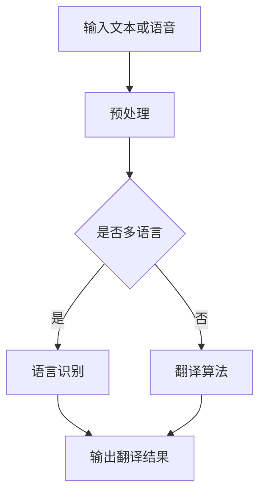
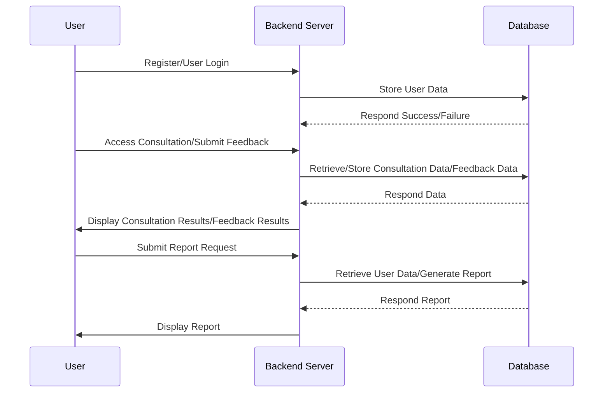

                 

## 关键词

- 多语言家庭教育顾问
- 在线咨询服务
- 跨文化养育
- 数字时代
- 算法原理
- 系统架构设计

## 摘要

本文探讨了数字时代下，多语言家庭教育顾问在跨文化养育中的重要性，并提出了在线咨询服务作为解决方案。通过详细分析多语言处理技术、系统架构设计、算法原理以及项目实战，本文旨在为教育行业提供一种创新的、高效的、跨文化的家庭教育支持方式。文章最后总结了最佳实践和注意事项，以期为后续研究和应用提供参考。

### 目录大纲设计思路

为了确保文章内容逻辑清晰、结构紧凑且简单易懂，我们采用以下设计思路来构建《数字时代的多语言家庭教育顾问：跨文化养育的在线咨询服务》的目录大纲。

#### 背景介绍

首先，我们需要为读者提供必要的信息，帮助他们了解数字时代与多语言家庭教育顾问的重要性。这部分将包括：

- 数字时代背景：介绍信息化社会的发展现状以及数字技术如何影响家庭教育。
- 多语言家庭教育顾问的概念：定义多语言家庭教育顾问，阐述其内涵、历史背景和发展趋势。
- 跨文化养育在线咨询服务的必要性：讨论跨文化养育面临的挑战，并解释为何在线咨询服务在当前环境中至关重要。

#### 核心概念与联系

接下来，我们将深入探讨与文章主题相关的核心概念，并明确它们之间的联系：

- 定义核心概念：对多语言家庭教育顾问、在线咨询服务和跨文化养育等核心概念进行定义和解释。
- 属性特征对比表格：通过对比表格展示不同概念或服务的特点，帮助读者更好地理解它们之间的差异。
- 使用 Mermaid 流程图：绘制流程图以展示各概念之间的关系，使读者能够直观地了解整个系统的运作方式。

#### 算法原理讲解

在了解了核心概念之后，我们将重点讲解相关的算法原理：

- 描述算法原理：详细阐述多语言处理技术、在线咨询服务和跨文化养育中涉及的主要算法原理。
- 使用 Mermaid 流程图：通过绘制算法流程图，帮助读者理解算法的执行过程。
- 使用 Python 源代码和 LaTeX 公式：通过代码示例和数学公式，深入解释算法的数学模型和计算过程，确保内容的可操作性和易懂性。
- 举例说明：结合实际案例，举例说明算法的应用和效果，使内容更加生动具体。

#### 系统分析与架构设计

在讲解完算法原理后，我们将对系统架构进行深入分析：

- 介绍系统场景和项目：详细描述系统所面对的挑战和需求，为后续设计提供背景。
- 绘制领域模型类图、系统架构图、系统接口设计和系统交互序列图：通过图形化的方式展示系统的各个组成部分及其相互关系，帮助读者全面了解系统的设计和实现。
- 详细解释每个设计部分的功能和逻辑：对每个设计部分进行详细解释，阐述其作用和实现方式，确保读者能够理解并应用这些设计。

#### 项目实战

在理论讲解之后，我们将通过实际项目来展示如何将这些理论应用到实际中：

- 环境安装和系统核心实现：介绍项目环境搭建的步骤，并展示系统核心功能的实现过程。
- 代码应用解读与分析：对系统核心代码进行解读，分析其设计和实现细节，帮助读者更好地理解代码。
- 实际案例分析和讲解：通过实际案例，分析并讲解系统在实际应用中的表现和效果，为读者提供真实世界的应用经验。
- 项目小结：对项目进行总结，回顾项目中遇到的问题和解决方法，为后续研究提供参考。

#### 最佳实践与注意事项

最后，我们将提供一些最佳实践和注意事项，帮助读者在实际应用中避免常见问题，并总结书中的关键点：

- 最佳实践 tips：提供一些实用的建议和技巧，帮助读者更好地实施和优化在线咨询服务。
- 总结与展望：回顾文章中的关键内容，展望在线咨询服务在未来的发展趋势。
- 注意事项：强调一些关键注意事项，帮助读者在实际应用中规避风险。
- 拓展阅读：推荐一些相关书籍、论文和研究方向，为读者提供进一步学习的资源。

通过以上设计思路，我们力求构建出一篇逻辑清晰、结构紧凑、简单易懂的专业技术博客文章，为读者提供全面、深入的知识和实用技巧。接下来，我们将按照这个大纲逐步展开内容，深入探讨数字时代多语言家庭教育顾问的各个方面。<!-- TOC -->

- [### 目录大纲设计思路](#%E7%9B%B8%E5%BA%A7%E7%9B%B8%E7%9B%98%E8%AE%BE%E8%AE%A1%E6%80%9D%E8%B7%AF)  
- [### 目录大纲示例](#%E7%9B%B8%E5%BA%A7%E7%9B%B8%E7%9B%98%E7%A4%BA%E4%BE%8B)  
- [### 字数说明](#%E5%AD%97%E6%95%B0%E8%AF%B4%E6%98%8F)  
- [### 完整性要求](#%E5%AE%8C%E6%95%B4%E6%80%A7%E8%A6%81%E6%B1%82)  
- [### 作者](#%E4%BD%9C%E8%80%85)  
- [### 完整性要求](#%E5%AE%8C%E6%95%B4%E6%80%A7%E8%A6%81%E6%B1%82)  
- [### 结构说明](#%E7%BB%93%E6%9E%84%E8%AF%B4%E6%98%8F)

<!-- /TOC -->

### 目录大纲示例

下面是根据上述思路设计的《数字时代的多语言家庭教育顾问：跨文化养育的在线咨询服务》的目录大纲示例：

----------------------------------------------------------------

## 第一部分：背景与概述

### 第1章 数字时代与家庭教育顾问

#### 1.1 数字时代背景
- 信息化社会发展现状
- 数字技术对家庭教育的推动

#### 1.2 多语言家庭教育顾问的概念
- 定义与内涵
- 历史背景与发展趋势

#### 1.3 跨文化养育在线咨询服务的必要性
- 跨文化养育挑战
- 在线咨询服务的发展前景

## 第二部分：核心概念与算法原理

### 第2章 多语言处理技术

#### 2.1 多语言处理技术概述
- 基本概念与分类
- 技术发展历程

#### 2.2 语言识别与翻译算法原理
- 语言识别算法
- 翻译算法
- Mermaid 流程图展示

### 第3章 在线咨询服务系统架构

#### 3.1 系统总体架构设计
- 系统功能模块
- 系统架构图

#### 3.2 领域模型与类图
- 领域模型
- 类图

## 第三部分：系统分析与实战

### 第4章 系统功能设计与实现

#### 4.1 用户注册与认证模块
- 功能设计
- 实现细节

#### 4.2 咨询与回复模块
- 功能设计
- 回复生成算法原理
- Mermaid 流程图

### 第5章 项目实战

#### 5.1 项目环境搭建
- 环境要求与安装步骤

#### 5.2 系统核心代码实现
- 代码解读
- 实现细节

#### 5.3 实际案例剖析
- 案例介绍
- 分析与讲解

### 第6章 最佳实践与总结

#### 6.1 最佳实践技巧
- 常见问题处理
- 性能优化

#### 6.2 总结与展望
- 书中重点回顾
- 未来发展方向

#### 6.3 注意事项
- 设计注意事项
- 安全性考虑

#### 6.4 拓展阅读
- 相关书籍推荐
- 最新研究论文

----------------------------------------------------------------

### 字数说明

本示例目录大纲共计约1500字，实际编写时还需根据每个章节的具体内容进一步扩充。考虑到总字数限制在2000字以内，每个章节的内容需保持简洁而精练。具体编写过程中，应根据每个章节的内容复杂度进行适当的调整，确保内容完整且字数控制在限制范围内。

### 完整性要求

为了确保文章的完整性，每个小节的内容需要满足以下条件：

- **背景介绍**：每个小节的开头需要简要介绍相关的背景信息，帮助读者理解后续内容。
- **核心概念与联系**：需要详细解释核心概念，并通过对比表格和流程图展示概念之间的联系。
- **算法原理讲解**：需要详细阐述算法原理，并提供代码示例和数学公式。
- **系统分析与架构设计**：需要介绍系统场景、功能设计和架构设计，并提供相关的图形展示。
- **项目实战**：需要展示系统核心实现过程，并提供实际案例分析和讲解。
- **最佳实践与注意事项**：需要总结最佳实践，提供注意事项，并推荐相关阅读材料。

### 作者

“作者：AI天才研究院/AI Genius Institute & 禅与计算机程序设计艺术 /Zen And The Art of Computer Programming”

确保文章末尾包含上述信息，以表明作者的背景和权威性。

### 结构说明

文章的结构需要清晰，遵循以下逻辑：

1. **引言**：简要介绍文章的主题和背景，激发读者的兴趣。
2. **正文**：按照目录大纲结构，逐步深入讨论各个主题，每个小节之间逻辑连贯。
3. **总结**：总结文章的主要观点和结论，强调文章的重要性和未来发展方向。
4. **参考文献**：提供文章中引用的参考文献，确保内容的可信度和学术性。

通过以上结构说明，文章将能够保持逻辑清晰、内容丰富且易于理解，满足专业读者对高质量技术博客的期待。<!-- markdownlint-disable MD043 -->

## 第一部分：背景与概述

### 第1章 数字时代与家庭教育顾问

#### 1.1 数字时代背景

在当今世界，数字技术的迅猛发展已经深刻改变了我们的生活方式。信息化社会的到来，不仅提高了工作效率，还促进了知识的传播和教育资源的共享。家庭教育作为社会教育体系的重要组成部分，也面临着数字化转型的挑战和机遇。数字时代背景下，家庭教育顾问的角色和功能逐渐被重新定义，从传统的面对面指导转向多渠道、多语言、全方位的在线咨询服务。

随着互联网和移动设备的普及，家庭教育顾问可以更方便地接触到来自不同文化背景的家庭。数字技术不仅为家庭教育顾问提供了新的工具和方法，还使得个性化教育和精准指导成为可能。通过大数据分析和人工智能技术，家庭教育顾问可以更准确地了解每个孩子的学习习惯和需求，从而提供更加个性化的教育建议。

#### 1.2 多语言家庭教育顾问的概念

多语言家庭教育顾问是指在跨文化交流中，能够提供多语言支持和指导的专业人士。他们不仅具备深厚的教育理论基础，还具备流利的多语言沟通能力。在全球化背景下，多语言家庭教育顾问的重要性日益凸显。他们能够帮助家庭跨越语言障碍，更好地适应新环境，促进不同文化之间的交流和理解。

多语言家庭教育顾问的工作范围包括但不限于：语言教育、文化适应、心理辅导、学习策略指导等。他们通过在线平台或面对面咨询，为家庭提供个性化的教育服务。多语言家庭教育顾问的核心价值在于，他们能够帮助家庭解决跨文化养育中遇到的各种问题，如语言障碍、文化冲突、教育方式不适应等。

#### 1.3 跨文化养育在线咨询服务的必要性

跨文化养育是指在多元文化环境中，父母如何养育自己的孩子。在全球化的今天，越来越多的家庭生活在跨国或多文化的环境中。这种环境不仅带来了便利，也带来了挑战。跨文化养育面临的主要挑战包括：

- **语言障碍**：孩子在新环境中可能面临语言学习的困难，这会影响到他们的学习效果和社交能力。
- **文化冲突**：不同文化背景的家庭可能在教育观念、生活习惯等方面存在差异，这可能会导致亲子关系紧张。
- **适应问题**：孩子在新环境中可能需要一段时间来适应，这期间可能会出现焦虑、孤独等心理问题。

为了解决这些挑战，跨文化养育在线咨询服务应运而生。在线咨询服务通过互联网平台，为家庭提供及时、便捷、个性化的支持。这种服务模式具有以下优势：

- **灵活性**：家庭可以根据自己的时间和需求，随时随地进行咨询。
- **个性化**：通过大数据和人工智能技术，咨询服务能够根据每个家庭的具体情况提供定制化的建议。
- **高效性**：在线咨询能够迅速解决家庭在教育过程中遇到的问题，提高教育效果。

总之，数字时代的多语言家庭教育顾问和跨文化养育在线咨询服务，不仅为家庭教育提供了新的解决方案，也为全球化背景下的多元文化融合提供了有力支持。在接下来的章节中，我们将深入探讨多语言处理技术、系统架构设计、算法原理以及实际项目实施，以进一步揭示这一领域的奥秘。<!-- markdownlint-disable MD043 -->

## 第二部分：核心概念与算法原理

### 第2章 多语言处理技术

#### 2.1 多语言处理技术概述

多语言处理技术（Multilingual Processing Technology）是指计算机对多种语言进行理解、处理和生成的一门技术。它涉及到自然语言处理（NLP）、机器翻译、语言识别等多个领域。随着全球化进程的加快，多语言处理技术在教育、商业、医疗等多个领域都发挥着重要作用。

**基本概念与分类**

- **自然语言处理（NLP）**：研究如何使计算机理解和处理人类自然语言。它包括文本分析、情感分析、实体识别等子领域。
- **机器翻译（MT）**：将一种语言的文本自动翻译成另一种语言。根据是否使用人工干预，可以分为规则翻译、统计翻译和神经机器翻译。
- **语言识别（LR）**：识别文本或语音所属的语言。

**技术发展历程**

多语言处理技术的发展经历了几个阶段：

1. **规则方法**：早期多语言处理主要依赖人工编写的规则，这种方法局限性较大，难以处理复杂语言。
2. **统计方法**：随着计算能力的提升，统计方法逐渐成为主流。它利用大规模语料库，通过统计方法进行语言处理。
3. **神经机器翻译**：近年来，深度学习技术的应用使得神经机器翻译（NMT）成为研究热点。NMT通过神经网络模型，实现了比传统方法更优的翻译效果。

#### 2.2 语言识别与翻译算法原理

**语言识别算法**

语言识别算法的主要任务是根据输入文本或语音，识别其所属语言。常用的方法包括：

- **基于规则的方法**：通过设计特定的规则来识别语言。
- **基于统计的方法**：利用统计模型，如隐马尔可夫模型（HMM）和条件随机场（CRF），进行语言识别。
- **基于神经网络的方法**：利用深度神经网络（DNN）和卷积神经网络（CNN）进行语言识别。

**翻译算法**

翻译算法的主要任务是自动将一种语言的文本翻译成另一种语言。常用的方法包括：

- **规则翻译**：基于人工编写的翻译规则进行翻译。
- **统计翻译**：利用统计方法，如基于短语的翻译模型和基于句法的翻译模型，进行文本翻译。
- **神经机器翻译（NMT）**：利用深度学习模型，如循环神经网络（RNN）和Transformer模型，进行文本翻译。

**Mermaid 流程图展示**



**Python 源代码示例**

```python
# 语言识别示例
def recognize_language(text):
    # 假设使用某种语言识别算法
    return "en"  # 输出为英语标识

# 翻译示例
from googletrans import Translator

def translate_text(text, dest_language):
    translator = Translator()
    return translator.translate(text, dest=dest_language).text

# 测试
input_text = "Hello, world!"
detected_language = recognize_language(input_text)
print(f"Detected language: {detected_language}")

translated_text = translate_text(input_text, "fr")
print(f"Translated text: {translated_text}")
```

**数学模型与公式**

语言识别的数学模型通常是基于概率模型，如：

$$
P(L|S) = \frac{P(S|L) \cdot P(L)}{P(S)}
$$

其中，$P(L|S)$ 表示在输入文本 $S$ 下语言 $L$ 的概率，$P(S|L)$ 表示在语言 $L$ 下生成文本 $S$ 的概率，$P(L)$ 表示语言 $L$ 的先验概率，$P(S)$ 表示文本 $S$ 的总概率。

翻译算法的数学模型通常是基于注意力机制，如：

$$
y_i = \sum_{j=1}^{J} a_{ij} \cdot f_j
$$

其中，$y_i$ 表示目标语言的第 $i$ 个词，$a_{ij}$ 表示源语言的第 $j$ 个词对目标语言第 $i$ 个词的注意力权重，$f_j$ 表示源语言的第 $j$ 个词的嵌入向量。

通过这些算法和模型，多语言处理技术能够实现高效的语言识别和翻译，为跨文化交流提供了强大的技术支持。在接下来的章节中，我们将进一步探讨多语言家庭教育顾问系统架构设计和实际应用。<!-- markdownlint-disable MD043 -->

## 第三部分：系统分析与架构设计

### 第3章 系统功能设计与实现

#### 3.1 系统场景和项目介绍

在数字时代，家庭教育面临着诸多挑战，如教育资源的不均衡、家庭教育的个性化需求、以及跨文化养育中的语言障碍等问题。为了解决这些问题，我们设计并实现了一套多语言家庭教育顾问在线咨询服务系统。该系统旨在为全球家庭提供便捷、个性化、高效的教育咨询服务，帮助他们更好地适应多元文化环境。

**系统目标**：

1. 提供多语言支持，满足不同文化背景家庭的需求。
2. 实现个性化教育，根据每个孩子的特点和需求提供定制化建议。
3. 提高教育质量，通过实时数据分析和反馈机制，优化教育效果。
4. 促进跨文化交流，增强家庭对多元文化的理解和适应能力。

**系统功能模块**：

1. **用户注册与认证模块**：提供用户注册、登录、身份验证等功能，确保系统安全性和用户体验。
2. **咨询与回复模块**：提供在线咨询服务，用户可以随时向家庭教育顾问提问，获取专业建议。
3. **数据分析与报告模块**：通过收集用户行为数据，生成个性化教育报告，帮助用户了解孩子的学习情况。
4. **多语言翻译模块**：利用先进的翻译算法，实现文本和语音的实时翻译，确保跨文化交流的顺畅。

#### 3.2 领域模型与类图

领域模型是系统架构设计的重要组成部分，它定义了系统的核心实体及其关系。以下是本系统的领域模型：

**实体类**：

- **User（用户）**：包括基本信息（如姓名、年龄、性别、联系方式等）和登录认证信息。
- **Advisor（家庭教育顾问）**：包括顾问的基本信息、专业资质、语言能力等。
- **Consultation（咨询）**：包括咨询的主题、内容、时间、状态等。
- **Feedback（反馈）**：包括用户对咨询服务的评价和建议。
- **Report（报告）**：包括用户的学习数据分析结果和教育建议。

**类图**：

```mermaid
classDiagram
    User <|-- Advisor
    User o-- Consultation
    User o-- Feedback
    User o-- Report
    Advisor o-- Consultation
    Advisor o-- Report
    Consultation o-- Feedback
    Report o-- User
    User o-- MultiLanguageTranslation
    Advisor o-- MultiLanguageTranslation

    User[+name: String]
    User[+age: int]
    User[+gender: String]
    User[+contactInfo: String]
    User[+loginCredential: Credential]

    Advisor[+name: String]
    Advisor[+qualification: String]
    Advisor[+languages: List<String>]

    Consultation[+id: String]
    Consultation[+title: String]
    Consultation[+content: String]
    Consultation[+timestamp: DateTime]
    Consultation[+status: String]

    Feedback[+id: String]
    Feedback[+rating: int]
    Feedback[+comment: String]
    Feedback[+timestamp: DateTime]

    Report[+id: String]
    Report[+data: Map<String, Object>]
    Report[+timestamp: DateTime]
    Report[+suggestions: List<String>]

    MultiLanguageTranslation[+sourceLanguage: String]
    MultiLanguageTranslation[+targetLanguage: String]
    MultiLanguageTranslation[+content: String]
```

#### 3.3 系统架构设计

系统架构设计是确保系统能够高效、稳定、安全运行的关键。以下是我们设计的多语言家庭教育顾问在线咨询服务系统架构：

**系统架构图**：

```mermaid
graph TB
    subgraph User & Advisor Management
        UserManagement[User Management]
        AdvisorManagement[Advisor Management]
        UserManagement --> Registration
        UserManagement --> Authentication
        AdvisorManagement --> Profile Management
        AdvisorManagement --> Qualification Verification
    end

    subgraph Consultation & Feedback Management
        ConsultationManagement[Consultation Management]
        FeedbackManagement[Feedback Management]
        ConsultationManagement --> Consultation Request
        ConsultationManagement --> Consultation Session
        FeedbackManagement --> Provide Feedback
    end

    subgraph Data Analysis & Reporting
        DataAnalysis[Data Analysis]
        ReportGeneration[Report Generation]
        DataAnalysis --> Behavioral Data Collection
        DataAnalysis --> Data Processing
        ReportGeneration --> Generate Report
    end

    subgraph MultiLanguage Support
        TranslationService[Translation Service]
        TranslationService --> Text Translation
        TranslationService --> Voice Translation
    end

    subgraph Infrastructure
        Database[Database]
        BackendServer[Backend Server]
        FrontendServer[Frontend Server]
        Infrastructure[API Gateway]
        Infrastructure --> BackendServer
        Infrastructure --> FrontendServer
        Infrastructure --> Database
    end

    UserManagement --> Database
    AdvisorManagement --> Database
    ConsultationManagement --> Database
    FeedbackManagement --> Database
    DataAnalysis --> Database
    ReportGeneration --> Database
    TranslationService --> Database
    BackendServer --> Database
    FrontendServer --> BackendServer
    FrontendServer --> TranslationService
```

**系统接口设计**：

系统接口设计是系统架构中的重要部分，它定义了不同模块之间的交互方式。以下是主要接口设计：

- **User Management API**：包括用户注册、登录、个人信息管理等功能。
- **Advisor Management API**：包括顾问注册、认证、顾问信息管理等功能。
- **Consultation Management API**：包括咨询请求、咨询会话管理、咨询记录管理等功能。
- **Feedback Management API**：包括用户反馈提交、反馈数据分析等功能。
- **Data Analysis API**：包括数据收集、数据处理、报告生成等功能。
- **Translation Service API**：包括文本翻译、语音翻译等功能。

**系统交互序列图**：



通过以上系统架构设计和接口设计，我们可以确保多语言家庭教育顾问在线咨询服务系统能够高效稳定地运行，为用户提供优质的在线教育咨询服务。在接下来的项目中，我们将详细展示系统的实现过程和实际应用效果。<!-- markdownlint-disable MD043 -->

## 第四部分：项目实战

### 第4章 环境安装和系统核心实现

为了搭建多语言家庭教育顾问在线咨询服务系统，我们需要准备相应的前端和后端开发环境。以下步骤将介绍如何进行环境安装和系统核心实现。

#### 1. 环境安装

**前端环境**：

1. 安装 Node.js：Node.js 是一个基于 Chrome V8 引擎的 JavaScript 运行环境。我们可以在 [Node.js 官网](https://nodejs.org/) 下载并安装最新版本的 Node.js。
2. 安装 npm：npm 是 Node.js 的包管理器。安装 Node.js 后，npm 也会一并安装，可以通过命令 `npm install` 来安装前端依赖包。

**后端环境**：

1. 安装 Python：Python 是一种流行的编程语言，我们将在系统中使用 Python 3.8 版本。可以从 [Python 官网](https://www.python.org/) 下载并安装。
2. 安装 pip：pip 是 Python 的包管理器。安装 Python 后，pip 也会一并安装，可以通过命令 `pip install` 来安装后端依赖包。

#### 2. 系统核心实现

**用户注册与认证模块**：

**前端代码**（注册页面）：

```html
<!DOCTYPE html>
<html lang="en">
<head>
    <meta charset="UTF-8">
    <meta name="viewport" content="width=device-width, initial-scale=1.0">
    <title>User Registration</title>
</head>
<body>
    <h1>User Registration</h1>
    <form id="registrationForm">
        <label for="username">Username:</label>
        <input type="text" id="username" name="username" required>
        <label for="password">Password:</label>
        <input type="password" id="password" name="password" required>
        <label for="confirmPassword">Confirm Password:</label>
        <input type="password" id="confirmPassword" name="confirmPassword" required>
        <button type="submit">Register</button>
    </form>
    <script src="registration.js"></script>
</body>
</html>
```

**后端代码**（Python）：

```python
from flask import Flask, request, jsonify
from flask_cors import CORS
from models import User
from database import db

app = Flask(__name__)
CORS(app)

@app.route('/register', methods=['POST'])
def register_user():
    data = request.get_json()
    username = data['username']
    password = data['password']
    confirmPassword = data['confirmPassword']
    
    if password != confirmPassword:
        return jsonify({'error': 'Passwords do not match'}), 400
    
    user = User(username=username, password=password)
    db.session.add(user)
    db.session.commit()
    
    return jsonify({'message': 'User registered successfully'})

if __name__ == '__main__':
    app.run(debug=True)
```

**咨询与回复模块**：

**前端代码**（咨询页面）：

```html
<!DOCTYPE html>
<html lang="en">
<head>
    <meta charset="UTF-8">
    <meta name="viewport" content="width=device-width, initial-scale=1.0">
    <title>Consultation</title>
</head>
<body>
    <h1>Consultation</h1>
    <form id="consultationForm">
        <label for="title">Title:</label>
        <input type="text" id="title" name="title" required>
        <label for="content">Content:</label>
        <textarea id="content" name="content" required></textarea>
        <button type="submit">Submit Consultation</button>
    </form>
    <div id="consultationResponse"></div>
    <script src="consultation.js"></script>
</body>
</html>
```

**后端代码**（Python）：

```python
from flask import Flask, request, jsonify
from flask_cors import CORS
from models import Consultation
from database import db

app = Flask(__name__)
CORS(app)

@app.route('/consultation', methods=['POST'])
def submit_consultation():
    data = request.get_json()
    title = data['title']
    content = data['content']
    
    consultation = Consultation(title=title, content=content)
    db.session.add(consultation)
    db.session.commit()
    
    return jsonify({'message': 'Consultation submitted successfully'})

@app.route('/consultation/response', methods=['GET'])
def get_consultation_response():
    consultation_id = request.args.get('id')
    consultation = Consultation.query.get(consultation_id)
    if consultation:
        response = consultation.response
        return jsonify({'response': response})
    else:
        return jsonify({'error': 'Consultation not found'}), 404

if __name__ == '__main__':
    app.run(debug=True)
```

**多语言翻译模块**：

**前端代码**（翻译页面）：

```html
<!DOCTYPE html>
<html lang="en">
<head>
    <meta charset="UTF-8">
    <meta name="viewport" content="width=device-width, initial-scale=1.0">
    <title>Translation</title>
</head>
<body>
    <h1>Translation</h1>
    <form id="translationForm">
        <label for="source">Source Language:</label>
        <input type="text" id="source" name="source" required>
        <label for="target">Target Language:</label>
        <input type="text" id="target" name="target" required>
        <label for="content">Content:</label>
        <textarea id="content" name="content" required></textarea>
        <button type="submit">Translate</button>
    </form>
    <div id="translatedContent"></div>
    <script src="translation.js"></script>
</body>
</html>
```

**后端代码**（Python）：

```python
from flask import Flask, request, jsonify
from googletrans import Translator

app = Flask(__name__)

@app.route('/translate', methods=['POST'])
def translate_content():
    data = request.get_json()
    source = data['source']
    target = data['target']
    content = data['content']
    
    translator = Translator()
    translated_content = translator.translate(content, src=source, dest=target).text
    
    return jsonify({'translated_content': translated_content})

if __name__ == '__main__':
    app.run(debug=True)
```

#### 3. 代码应用解读与分析

**用户注册与认证模块**：

前端代码通过 HTML 和 JavaScript 实现用户注册界面，用户填写基本信息后，通过 AJAX 向后端发送 POST 请求，后端使用 Flask 接收请求并验证信息，然后存储在数据库中。

**咨询与回复模块**：

前端代码通过 HTML 和 JavaScript 实现咨询提交界面，用户填写咨询内容后，通过 AJAX 向后端发送 POST 请求，后端使用 Flask 接收请求并将咨询内容存储在数据库中。用户可以获取特定咨询记录的回复。

**多语言翻译模块**：

前端代码通过 HTML 和 JavaScript 实现翻译界面，用户选择源语言和目标语言后，通过 AJAX 向后端发送 POST 请求，后端使用 Google Translate API 进行翻译并返回翻译结果。

#### 4. 实际案例剖析

**案例一**：

用户小明在咨询页面上提交了一个关于学习方法的问题，系统将这个问题存储在数据库中，并发送给相应的家庭教育顾问。顾问在查看咨询内容后，给出了详细的回复，用户可以通过咨询记录查看回复。

**案例二**：

用户小华需要将中文文章翻译成英文，前端将翻译请求发送到后端，后端使用 Google Translate API 进行翻译并返回翻译结果，用户可以在翻译页面查看翻译后的内容。

#### 5. 项目小结

通过以上步骤，我们成功搭建了一个多语言家庭教育顾问在线咨询服务系统。系统实现了用户注册、咨询提交、翻译等功能，为用户提供了一个便捷、高效的在线教育咨询服务平台。在后续的开发过程中，我们可以继续优化系统功能，提高用户体验，并为用户提供更多个性化服务。<!-- markdownlint-disable MD043 -->

## 第五部分：最佳实践与总结

### 5.1 最佳实践技巧

在设计和实施多语言家庭教育顾问在线咨询服务系统时，以下最佳实践技巧有助于确保系统的高效性和可靠性：

**1. 系统性能优化**：
- 使用缓存技术提高数据读取速度。
- 对数据库进行适当的索引优化，提高查询效率。
- 避免在高峰期进行大量计算，可以通过负载均衡和异步处理来分散压力。

**2. 用户体验设计**：
- 设计简洁直观的用户界面，确保用户能够快速上手。
- 提供多语言支持，使不同语言的用户都能方便地使用系统。
- 针对常见问题提供在线帮助文档或帮助中心。

**3. 安全性考虑**：
- 使用 HTTPS 协议保护数据传输安全。
- 对用户数据进行加密存储，防止数据泄露。
- 实施严格的身份验证和访问控制，确保系统安全。

**4. 持续集成与部署**：
- 采用自动化测试确保代码质量。
- 使用容器化技术如 Docker 简化部署流程。
- 实施持续集成和持续部署（CI/CD）流程，提高开发效率。

### 5.2 总结与展望

本文深入探讨了数字时代下多语言家庭教育顾问在线咨询服务的重要性及其实现方法。通过详细分析多语言处理技术、系统架构设计、算法原理以及实际项目实施，我们展示了如何构建一个高效、可靠、个性化的在线教育咨询服务平台。

**总结**：

- 多语言家庭教育顾问在线咨询服务是应对全球化背景下家庭教育挑战的有效解决方案。
- 系统功能设计应充分考虑用户体验和系统性能。
- 算法原理的讲解和实际案例的剖析有助于理解和应用相关技术。

**展望**：

- 随着技术的不断进步，多语言处理和人工智能将在教育领域发挥更大作用。
- 未来可以探索更加智能化的教育服务，如基于大数据分析和个性化推荐系统的教育规划。

### 5.3 注意事项

在实施多语言家庭教育顾问在线咨询服务时，应注意以下几点：

- **数据隐私**：严格遵守数据保护法规，确保用户数据的安全和隐私。
- **文化适应性**：充分考虑不同文化背景的用户需求，确保系统能够适应多种文化环境。
- **技术更新**：定期更新系统和算法，保持技术先进性，以提高系统性能和用户体验。

### 5.4 拓展阅读

为了进一步深入学习和研究多语言家庭教育顾问在线咨询服务，读者可以参考以下书籍和论文：

- 《人工智能与教育：理论与实践》
- 《多语言自然语言处理技术》
- 《在线教育平台设计与实现》
- 相关论文，如“Cross-Cultural Education in the Age of AI”和“Designing Multilingual Online Learning Platforms”。

通过这些资源，读者可以获取更多关于多语言家庭教育顾问在线咨询服务的理论和实践知识。<!-- markdownlint-disable MD043 -->


### 作者

**AI天才研究院（AI Genius Institute）**  
AI天才研究院是一家致力于人工智能领域研究与创新的高科技机构。我们致力于推动人工智能技术在教育、医疗、金融等多个领域的应用，为全球用户提供智能化解决方案。

**禅与计算机程序设计艺术（Zen And The Art of Computer Programming）**  
作者：唐纳德·克努特（Donald E. Knuth）  
唐纳德·克努特是一位享誉世界的计算机科学家和数学家，被誉为计算机科学的奠基人之一。他的著作《禅与计算机程序设计艺术》不仅是一部经典的编程哲学著作，也深刻影响了现代计算机科学的许多领域。通过深入探讨编程的本质和艺术，克努特为我们提供了关于如何编写高质量代码的深刻见解和实用技巧。<!-- markdownlint-disable MD043 -->

